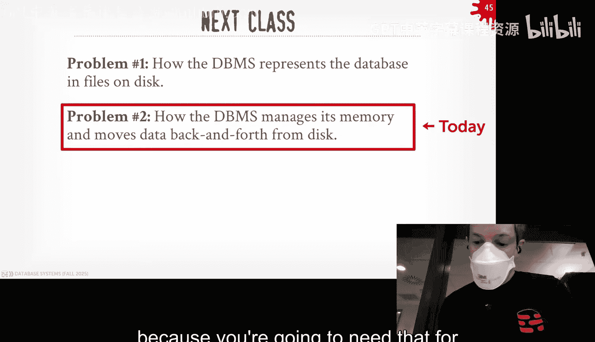

# CMU《数据库导论｜15-445 645 Intro to Database Systems (Fall 2025)》中英字幕 p03 -3-#03 - Database Storage_ Files, Pages, Tuples (CMU Intro to Database Systems). -BV1bmHGzsETM_p3-

🎼别忘玩 still开心。🎼we。🎼我是你我是。🎼。Okay， so is a third？In class last week。

 I can't be on campus this week I'm in London and actually right now we are actually in the。

Emergency room here。And我で。然后。So fatface Rick did a micro datata of LSD last night。

 went walking around， and then he got beat up by a bunch of like 12 year olds。Maybe别 say you that up。

So we had to bring him to hospital and I'm out here in waiting room， waiting him to get cleaned up。

 stitched up。and then you can go back so I figured why I'm sitting here we have to teach about doing this is because that's you knows a super important life。

 so let's jump into this。So last class we were talking about SQL and then today we're not going to start talking about how to actually build the system。

 so as a reminder Project zero is due this coming Sunday coming up get required to pass that if you want to get into the class and homework  one is also due this coming up Sunday at the same time。

So。Now that we can understand what SQL looks like at that sort of logical level。

 like how to define tables， how to run queries on it。

And what are the properties of relational algebra and how that fit into original model？

That's sort of the last time we were looking at。The application level of a database for for most of the semester now we're going to really start talking about how you had to build the software to。

Run the queries that we saw or store the data that we want on the database and so that's really what going forward at this point semester month forward is like actually how do we actually build that system。

And so the outline of the course is roughly looks like this。

 so we've already sort of covered what the first week of the relational database looks like。

And we're now going to go sort of at a level by level basis and start looking at like， okay。

 here's how you build the different layers that you need to put together and interact with them to actually build a full fl database system。

And so this is sort of the reflect line of where the course is going for this semester。

 you know a lot of the things we'll be getting through at the very beginning will be like how to build a single node system and then once we understand that then we'll finish up and talk about how communicate how can you scale it out。

Run across multiple nodes。And so the way to think about this is the database system is essentially a bunch of layers where there's a well defined EPI that one layer exposes to the next layer in order to provide certain guarantees or certain operations on。

On data or whatever the。What what the level of。The level that they're trying to interact with。

So you can think at the very bottom， you have this disk manager。

 the thing that actually reads and writes data from disk because essentially a database is just。

Fs and disk and then above that， you have the Bo manager that's going to be a for bringing in pages from disk。

 bringing in memory and then hand them out correctly to the epi components such as access methods。

We then accessing data on behalf of operators to the inquiries above that we have a query plan or optimizer to try to then take SQL queries and convert to physical plans that we can execute our system So again。

 you just think of the data system as a bunch of layers and we're going to be going through this semester is actually we're going to go start at the bottom。

And work our wake up up with staff， so the application is up here。

 this is what we talked about before like the relation database in SQL。

And it interacts with the front end that's going to do with the  query planning and then we're just going to again we'm going talk about how to go up the stack now and give able what to execute those queries So today's class we're going to actually start at the very bottom we're going to talk about storage next class next week when I come back in town we'll actually go back up to the buffalo manager talk about how to bring some pages of memory。

 but then we actually need to go back down and talk about different alternatives storing things on desk so that'll be where we're at on that for the next two weeks。

So today again， sort start talking about what the background is of what。

What the database is going to see interactive with in terms terms of hardware。

Then we'll talk about the lowest level actually how to store things in files。

 how to then divide those files into the pages and how to then divide those pages into tus。

So today's class is me a sort call row link centric view。

Meaning we're assuming we're going to organize the data Dple says and rows we'll see in in two weeks how we actually put that on its inside and I can store things in an alternative way。

 So today is going of a classical database system architecture。

 how the original ones were built in the 1970s and then we'll go from there and。

Talk about how to alternative methods， the more modern methods in a few。

 but kind of understand the basics before we get to the other ones。

So the other thing about this class， I guess to bring up is that the。

We'll be focusing on what I call a disk based or disc oriented system architecture。

And what I in mind that is that the software， the software system。

 the data system is going to assume that the primary storage location of a database will be on nonvolt disk。

 like an SSD network stores， it doesn't matter， but it's considered volatile。

And then it's a classic v architecture where you can't operate on anything that well exists in disk and said you have to bring pages from disk or the files from disk。

into memory into volatile storage like something like DRAM。

 and then that's where you read and write to the data that you want and the data system is then responsible for writing up those changes tova disk at some later point。

So this is really really we focused on and then all of the。Components that we're to talk about。

 the hours that we're talking about is really to be predicated on this architecture assumption。

So the way to think about how we're going to interact in nonvol andva storage is to this classic hierarchy like this。

 you've probably seen this in classes right this is up and the new but you sort of think of the the。

The bottom layer you have the very large but slower storage。

 and the very top you have the very fast and cheaper one。

So the top would be things like CPU registers because it's the smallest amount of data you can store or access on a CPU and obviously it's be really really fast。

 but it's also going really expensive it can be very limited then as you go down the stack things get bigger。

 capacity is larger， they're going to get slower and they're going actually much cheaper to store per byteer per gigabyte。

So this is the sort of the way we want to think about in how these different storage layers are going to work with each other。

But there's also this division line that I'll draw here between DRAM and SSDs。

And basically say at the top you have， again what Ill call ball storage where again。

 if you lose the power on whatever the computing device they're using to store this。

 everything is blown away， but they're going to be they're going to support what I'll call random access or byte addressable access。

 meaning we can jump to individual byte offsets without worrying about bringing in a bunch of other data that maybe we don't actually need。

Now with cash lines on its CPU， that's not entirely true， but for our purposes in this semester。

 we can ignore that。And then below this demarcation line we have nonvolable storage。

 so this will be things like spinning disk hard drives or SSDs or network storage like S3 on Amazon or Google Cloud storage and so forth。

So these devices will be nonvol， meaningly write to them， and we can send a command to say。

 flush the data to this storage device， and then we'd be guaranteed that power is lost that we come back。

Data will be there。If obviously the Michigan catchs a fire in the disc melt， we can't do that。

 but there's ways to get around that we'll cover later the semester。

These devices are also going to be what called block adjustable， and that means that the。

The smallest granularity in which we can access data is going to be through a block。

Typically this can be  four kilobytes， sometimes larger and smaller。

 but we can't do the b addressable access that we can do in DRAM or CPU caches。

 meaning if we want to access a single byte， we have to bring in the whole page block。

So that bite resides， even if you don't need that other data。

And that's sort of the tradeoff we have to make in our system design when we actually want to start storing things on nonp storage。

So for the purposes of this semester， what we're going to say is that anything below this demarcation line here between nonvols on storage。

 we're just going to say that's just called disk right well it doesn't matter where it's an SSD or spinus hard drive or network storage in below network storage you and have things like tape drives but people wouldn't you know people really only use that for archival stuff like Amazon Glaciier so everything down the below is block addressable and。

And Naboto， what is called that disc。And then above that line。

 we're going to say that we're just going to call whatever's in DRAM。

 we're just going to call that net memory。And then above that will be anything that's like directly on the CPU。

 like on the actual die of the socket itself。Like CPU caches and CPU registers。

 where you going say that's the CPU storage？And so for the purposes of the semester。

 we're actually going to ignore see you of related stuff we can talk a little bit about。

More questions ways。More efficient ways to store the stuff， but like for our purposes here。

We think into all that right well tell these things the advanced class because that's what we really care about like。

Your casuality and other things， but for this semester。

 it's really about is it a memory or is it a disk and then having do you move back and forth？

Now the other thing that to be mindful of too， and this is going to be where we're going to deviate from maybe traditional algorithm classes you've taken in computer science classes before。

 where we actually need to be aware of how long it's going to take for us to access data at these different levels。

And so there's this great table here that comes from this website you can see in the corner。

 Jeff Dean has a version of this that actually predates him goes back to Jim Gray from the early 1990s。

 but basically it's a table like here's all the time it takes to access different levels of storage。

 from the nonvaal ones， sorry， the volatile ones down to the nonvata ones。

And here I'm showing these numbers and measured in nanoseconds。

 so basic just is like I'm going to read something from VRAM， it's going to take 100 nanoseconds。

 but I're going to read an SSD。Now it's going to take me 16， maybe 50，50，000 nanoiseseds。

So it's like two order of magnitude slower than reading some deep ramps。

 so obviously we want to be mindful of when we're going to read things from disc。

And try to minimize the amount of the time and times you get to do that。

 they once you get below in SD， that's when things just get like super， super slow。So real as humans。

 it's hard for us to wrap our heads around。You know in timed in terms of nanoseconds。

 So there's a really easy trick that Jim Gray came up with where if you just replace nanosecond with second。

 then you really start to see how how expensive these things are are going to be relative to like reading data that could be a memory。

 So if you read something like L1 cache， that would take a second。

 So that's like if I want to read a book， I just go over to that chair there and read a page in the book and it would take me a second or four seconds。

But then if I want to read something in the tape drive， these can take 31 years。

 that's equivalent of like me flying Pluto and back to read a single page in a book。

 ridiculously long， you want to try to avoid that as much as possible。so again， as I said。

 most systems are not going to be stored in tape drives so that's not。

You to worry about that level of latency， but certainly there's a lot of systems in risk systems today or certain these SDs。

 spinning those tar drives and network stores like it has3。

 and so we got to be mindful of like when are we going to read write data from disk and try to avoid having to block the system while we're waiting for those things。

The other thing we need be able to be mindful of in our implementation or algorithms is the difference between sequential and random access。

 random IO。So again， when you assume you're talking about quick sort algorithms in intro classes and so forth。

You just assume oh again， read， write anything in memory and the time it takes to read any。

Opttober entity takes the same amount of time， but in reality of real hardware the latencies between random access and sequential access can be quite significant so random access would be like I'm jumping around to different locations and reading different bits as need or places as they need or sequential access would be like a strideta data that is conquuousity of each other and you know so I can just do one look up and get multiple bytes or kilobytes that are all close to each other so just give you some ballpar numbers here random audio will be。

On a fastD。Maybe 80 to 100 microseconds。Let's just be on the high end for the good。

Like a consumer grid drive where sequential IO would be you know you can read much of data in terms of1 to 100 nano microconds and again depends on like how much data you're reading。

 how many threads we're reading that this is a whole bunch of complicated that we're not going to cover in this class。

 but the main thing to we to be aware mindful is that there is a huge difference between sequential and random IO especially when spinning is hard drives and we want to try to maximize the amount of sequential access we can do whenever you have to read and write anything from disk。

And that means that we'll make certain choices and our algorithms that try to reduce the number of rights。

To ran up pages so that we've store data in blocks， and then you there certain。

Certain systems would be certain things that seems like crazy to do， but again。

 if you're aware that sch access is much faster than。Random access that would sort of makes sense。

 so like my SQL， for example， will。They'll store their when they write dirty pages of disk。

 they'll first write it to this double right back buffer and that's a sequential right where they put all the dirty pages they want to flush out。

 they write it those sequentially and in the background。

Then the background they'll do the random rights at a later point， but at that point。

 you're not block waiting for that dirty page written because you've written out sequential the first time。

Right， so。The ultimate goal for our database system we're going to try to build the semester is a system that can。

Manage a database system that's larger than the amount of memory that's available to the system。

I say if you only have eight gig a Ram， you can run a database handle database that's usually 16 kiloytes or 3 giggaytes or gigabytes or larger。

走地。The challenge， of course， is going to be to provide this illusion is that we have to move data back and forth。

Cre disc into memory， as I say， sort of the Bomian architecture。

And so we want to do this in a clever way and take advantage as many optimization as we can where。

We want to avoid large stalls while we're fetching things on disk and have the systems sort of grind to a halt just because we're weeding to go go fetch Io and so there'll be a bunch of things we'll go do as we see go along about。

Alllowing multiple queries around at the same time， reusing data that we' bring into memory。

 being clever about what we write up you know different from from memory into the disk。

 says a bunch of things we're going to want to do and we're design certain algorithms in such a way that we can。

Rduce that that burden produce that cost of having to read my data from disk and to again to make it look like we have enough memory to handle everything。

And of course， at some point， if the work is set size of the data of all the queries that are running。

 meaning all the things that you need to be in memories， larger than minimum memory you have。

 that's going to be a problem。There's no way to get around that。

 but for other sort of in in the general case， we willll be okay。啊搞接。All right。

 so everything I've said here is kind of hand maybe and vague。

 so let's actually go into more details of like look look at a high level picture of like what a discorninated D system could look like。

And then we'll see again what we're trying to then design and build as we go the long through the rest of the semester。

 So as I said before， the database and the discining system， it's just showing files on disk。

Sometimes it's one file like the sun systems like DDB and S light。

They pride themselves in storing the entire database as a single file。

 but most systems are going to store the database across multiple files on disk。

These files aren't special in terms of the operating system。

 meaning it's like the operating system just using a bunch of files that is created with F right Ref open。

It's really the data of interpreting what those files are where the sort of important stuff and the magic happens in the system。

So we have on our nowball desk， we have some mandate this file。

And we're a break this up into a bunch of pages and these would be sort of fixed length size segments or divisions of the file and at the header or at some special location usually that's usually the header it be what we call page directory and that's just a。

Like kind of an internal database of keeping track of like。

 here's all the pages that I have on the desk。And then now I have in memory from my data system。

 I have what I call a buffer pool， sometimes it's called the buffer cash or。

Memory cache or something， they're all differences talking different things。

 but it's basically the same thing。And this is going to have a bunch of frames we'll call them where I can store pages I'm going to bring in the memory and again the data system's job is really about managing the movement of disk pages back and forth between disk and memory in order the service。

 whatever the queries are that I'm executed not us okay。So I have my execution engine。

 right I'm not defining what this is for now I'll just assume there's something well that want some in queries。

And so it's executing something this is I want to get page number two。

 so at the very beginning assuming that nothing's in memory。

So the very first thing need to do is that they're bring the directory to memory because the directory is going to tell us what pages we have and where to go find them and again for us right now in this example here we assume this a single file。

 but it could be spread across multiple files and multiple directories or even across multiple machines。

But at this point， it doesn't matter。So。So we bring the trajectory band and we'll look inside that and that's going to tell us where to go find page two。

simplicity assumeoom we can just compute where offset is in this file that finds it for us。

So then we go fetch that page into memory， and then now we then hand back to the executionion engine。

They pointer to that page in memory and the bufferuff pool is going to guarantee that that pointer is not going to get replaced or swapped out with another page until the execution engine says they're done with it。

So now it all us here that we didn't。Say anything like what's inside these pages。

 that' up for it's up through whatever the bump above in the system to then interpret what's in these pages is to decide what the bytes actually mean。

 but this lowest level here we don't know we don't actually care right now。

So then the execution item does whatever does interpret the page layout and let's say it's doing update so wants to update the contents of page number two so then it writes back the change to the page。

And then it can then say I completed and at some later point the bufferable is going to write out that dirty page to disk and update the files and it does it in a way that's safe so that if we crash and come back。

 we don't lose any of those changes that the executionion engine made to that page。

So we're not going to go into the details of all these things in this lecture we'll discuss these other lectures but we'll discuss some of what these pages are going to look like at the files and this lecture and then we'll come back to this in five。

 six and then we're going to spend in lecture four we're going to spend time discussing what this b pool manager looks like in memory and how it does some of the writing how to disk we won't discuss everything how to do this in a transactionally safefe manner that'll be later in the semester after the midterm but we'll just have a general idea of how the mechanism is actually going to work。

So we'll cover that in next week in lecture4 it also too。

 that' will be what you'll need in the first project。

And then for what the execution end is going to look like， we'll cover that in lectures 13。

 14 in a few weeks。All right， so there's two big questions we get to deal with in our system。

The first is how we're going to represent。The databases， which are files on disk。

And then the second question we have to deal with is how we're going to move that those pages back and forth into from disk to memory and then hand them off to other parts of the system in order to do interpret their bytes。

So for today's class， we're going to focus on this， as I said。

 next class we' then come back to problem number two。

And not what the Gulf manner is actually doing for us and how it works。So as I said。

 the database is just。Files on De。And there's nothing special about them in terms again。

 what the operating system sees， it's just as effect fact， you know。

 create bunch of files in any application and then database is up to interpret what's in them。Now。

 historically， these file formats within the files has already been proprietary。Meaning。

 like they are what the。They are specific to whatever the database system that created them and're not usually interpreted by other database systems。

So like you can't take a Postgress file， like its file format and then open it up in my SQL or oracle right。

 it's not going to know how to interpret those bytes because it doesn't mean anything to the other system。

Right。There are there's a newer trend in building what are called portable file formats。

 things like parquet， where it's a file format that is open。

 it an open spec and any system we read right to them。

 but we're not going to discuss that in this class will cover that few we talk about column stores。

The other thing I alsoll point out too， is that the database system is typically going to go run on。

Off the shelf file system， like EXD4， WinFS， whatever the operating system installs。

And that's going to be typically good enough for what we need there。

Some systems in the 1980s that we'd actually build custom file systems on top of raw block storage so you can buy a storage devices just raw blocks and then they would the Davis system would install their own custom file system inside of that。

You typically don't see that essentially not open source systems。

 and you only really see this in sort of really high end enterprise systems like Oracle and tear data。

 most of people aren't going to do this。So if you look at coracles， documentation。

You could have a single or byM， it basically says like instead of having opposite system manage。

The file system for you with a logical volume manager or whatever。Instead。

 the data system is going to do that for you。It's basically injecting a custom file system to the operating system。

 You know， that still exposes the。Whatever the standard Pos API， the operating expects。

 but it lays out data in such a way that it's very specific to what the data system wants。

There hasn't been study on this for a while， but you get roughly that a 15% improvement in performance for this it's a major engineering effort and most people aren not going to do this。

Right so then these that the lowest levels going to have this thing called storage manager。

I get it sometimes it's called the disk manager， but it's usually the same thing but it's the。

It's the component of this system that's responsible for。Reading writing data at the disk。Again。

 you could rely on the OS to do some things， but not you don't having to do everything。嗯。

And most of the hiring end systems， the better systems are going actually do their own schedule for reason bites。

And figure out where they're actually going to put data on their own and don't let the OS kind of just figure crap out for you because it's always going to do a bad job。

All right， and then those files that we're storing， as I said， we broke up into pages。

 usually fixed length。Within the file and some systems will allow you to define。

A different page size per table I got BMDb2 can do this and but still within single the file itself。

 the collection of files for our table， they'll be all the same size。

And then the storage manager is responsible for。Keep track these pages。

 reading and writing to them and it keeps track of available space and then when there's a request of app bra that says。

 hey， I need just store so many bytes can then three out worth of through space to actually store this。

一日？Now， the other thing we would be mindful of is that。

Within a single files on disk or a single incess running a box itself。

 we're not going to maintain multiple copies of a single page on disk but its like a physical level at a logical level we may have multiple copies of data within a tuole because we might store them in the heat files we' talking on a second or and then store it again in the log file but it's not the storage management responsibility to like。

 oh， I got to write this page out I'm going to make multiple copies of it that's either going to happen at the level below it like in the file system。

Like with something like raid or like a storage of appliance and make multiple copies。

Or have you know replicas that can nestster or it's going to happen up above the storage manager where they'll be。

Something that says I have to have logical copies of this data across multiple multiple nodes right at the low level story matter it's not going to do but it's really about I got to write data to a single。

That's a simple instance or a single location of a single page。All right， then as I said。

 the page is going to be a fixed size block of data。

And that's going to basically contain everything within our database system right so if it's contained the tus that are in the data。

 it's going to metadata about those data catalog on what tables I have。

Information I have the page directory basically stored as its pages as well， indexes， law records。

All this is going to be stored and broken up to it internally as pages。

Now most systems are not going to mix the page types。

 meaning like you're not going to have within a single file pages for table X and table Y or index X and table together。

 it's typically be like here's one file has data just for this one one page， right。

Some systems are also going to require systems， the pages to be self contained。

 meaning everything you need to know about what's inside the page has to be stored in the page itself。

 so you can imagine things like，If it a。There's a data page for a table， you would say。

 here's all the metadata I need to have to know that this page is for this table。

You do that for like crash recovery， but you only see that in something of like corracle where they're really paranoid about not losing people's data and rightfully so。

The other point thing to note is also that he。Each page is given a unique identifier called the page ID。

And a page ID is going to be this unique number that the data system is going to maintain to keep track of like here's how to address and find this this particular page I'm looking for and it can be unique for the database instance per table per database but it's going to be some number it's going to tell us where to go find。

It helps you address that single page now it could be an offset in the file as well。

 but it could just be also a logical location that would then use the page directly to go and find out。

Where that thing is actually being located。对。So now important thing to understand also is there's actually three notions of pages in a system。

So at the lowest level， you have what's called a hardware page like this is the。

This is typically four kilobytes and it's the small atomic unit of data that。

The harbor can guarantee that it can write out to the storage of actual the actual physical medium of the storage that's done atomically。

 right， so this would be。If I have to write I' say two， four kilolitte pages or8 kilohers。

The hardware can only guarantee that I can write the  four kilobte， one4gabyte atically。

 so it can't guarantee that it's going to write out both pages or none of them it has to guarantee that it can only guarantee it can write one of them。

All right， so then now above that you have the OS page and by default and Linux。

 this is four kilolits。And。Some in new version of Linux and you can get what called huge pages then you can two megabytes one gigabyte but this is basically the mapping of the。

Of a harder page to a so on。A logical page that the OS is going to keep track of its own internal page directory。

And then now above that， we have the database page and this is going to be。

What the database is covered， the database is going to organize its own pages。啊。So again。

 the hardware page is always to be four kilobytes， and that's the large block of the GT that atomically。

 but then the OS can have its own page sizes and the data can have its own page sizes as well。

And we just have to be mindful of how we're going to do this mapping from。

A database page to a to a hardware page and。Be aware of that if we have to write more data that we can do atomically in a for the page。

 we have to do a bunch of extra steps to make sure that things are written safely before we tell the outside world and before everything is。

It has been。And flush。So the database page size is going to vary per。

Right on the smallest actually something like SQL light。

 I know for some embedded devices and go down to 512bytes by default， it's  four kilobytes。Oracle。

 my default was4 kiloytes， 1 I case is 4 kiloytes， Rox CDD。

 which is a embedded storage engine that's used in a lot of systems。That's 4 kilolittes。

 wire tiger is the storage engine for MoD， that's 4 kilolittes。

Then you have things like SQL Ser and Postgres， they 8 kBtes。

 and then My SQL famously can go up to 16 kilobytes。So the size of a database page。

Whatch you actually want to use in your system depends on many different factors。The environment。

 the harbor environment the system is running in， what the data it is you're actually storing。

 like are they really wide tables that have a lot of columns？Or small number columns。

 are are they big blobs of data or are they just small integers， right？

And it actually depends on the workload you expect run in your database system。In general。

 for data systems that are doing re heavy workloads， and we'll see more about this in a week or two。

呃。Where these ones you actually want to store things as larger page sizes because you know you're can to do a lot of sequential scans where you're reading a lot of data that it's all contiguous so for every page I go have to read I'm going to bring in twos that I know I'm going to want to you know that I need for my query so every fetch for a page。

Again， a database page brings in useful data for me。

We'll see how we handle that when we switching our roast to a column star。

 that's to be the big one of the things that they're going to do。

And then for systems that are more light heavy， meaning like I'm doing a lot of updates to twos。

 like updates and leadss and inserts， these ones you typically want a。

A database page in the 416 kilobytes because again。

 the non pot storage is block addressable so that means like I don't have to write you know。

 I'm only writing updating a single byte within a page。

 I have to write that whole page out so if's a 4 kiloB page I't update a single byte。

 I still have to write 4 kilobytes out of depth。So I don't want really massively large database pages because I would have to write all of right out but we can't just do like sort of finding updates on things so for for this class let's start off with this start that 416 kilo pages we' talk about。

In lecture six， we'll see then how I load your page can make a difference when we do read every reports。

All right， so now there's a bunch of different ways we can manage these pages that are on disk。

Um and again， they're all going to have different trade offs of how we want to do certain things。So。

 the。The heat fall will be one most common one the basic ones we'll see and we'll assume we're doing that for this lecture or next lecture。

It just says you know a bunch of pages and I could address them bring that and they're not ordered anyway。

 another approach to be a tree fallwl organization we' actually storing the pages in a tree data structure。

And as I traverse the tree， I'm bringing pages as I would need them。

We'll talk a little bit about that later on， again for this discussion we need this。

Sential organization or its qualified organization， sometimes called ISAM。

This is an older architecture in the 1970s that people really don't do anymore。

But it's sort of similar to the tree tree one don we don' have to worry about this and then hashing is another variation similar to heatflow we just。

If things aren't older， they you can jump around into them。

So it guess that for this lecture we're going to assume we're doing heat files and then。

For the most part right now， for the next few more slides。

 we don't to care about what's inside the pages and then we'll go into material detail what they look like。

 but disinteresting what the page should looks like， it doesn't matter what's inside them。

So a heat file is going to be a un order collection of pages where again because SQL is an order ele model un ordered。

 we can store tus anywhere we want in random order， is wherever we have to have free space。Um。

 and then it exposes a basic API to create that right into the pages because that's the basic operations we need to do at this lowest level in the storage manager。

We also need it for being able to iterate over all the pages。

 meaning like give me the page IDs for all the pages on a given table or given an index because we'll need that be able to do a Sc scan。

 but when we do like looking up things at indexes。We'll see how we get the page ID from our In book up and then we move it out toll get that single page。

 but also we need to be able to scan across all the pages as well。So for this。

 this means that again we need additional metadata。

Essentially what we had in the page directory to keep track of the location of these files。

And also keep track of where do we have free space because anytime we need to store something。

 but you got to say， where can we put it？And if we since we weret assume that we're storing things like8 kiloI pages like it is in Postgress。

 most twoups aren't8 kilobytes， so we need to make sure that we can fill in free space that we have and our data doesn't balloon to be too big。

So here's a basic。Configuration， we use Davis as a single file。So。Soon something says， hey。

 I want to do page number two， I'm not defining how I'm doing that just yet there's some part of this system says give to go page two I could do basically just do simple arithmetic to say know the starting location of my file。

 I know my page number， I know my page size because I'm assuming all the page sizes of the same on disk and I just do simple math to be able to say jump to the offset that I want to find that I'm looking for。

And cases for the data。He's broken up across multiple files on disk。

Right now we want to get something like page number 23。

Again there's this page directory thing we have really defined that's going to have the metadata we need to go find the file that we contain the page and then once we get in there we can then do the simple math to say for a given page number。

 what' at a given page size， what's the offset I should jump to to find the bytes that I need it's a pretty basic architecture and again different data system different things。

 how they implement the page recordy but at a high level all these systems will work basically work this way。

So a common architecture is to use what's called a page directory as I sort talk about four。

 and this is just like a database within the database that keeps track of。

Here's all my pages that I have for sort of logical database objects right you could break it up across different ways like you could have your database assessment sports multiple databases。

 you could have a director for database， you have a directory per table or index or whatever， right？

Different systems will do different things， but the basic idea is that。I have a way to say， I want。

Get data from like table X。Table Y， here's the file， here's the directory。

 here's the location and El network that has this data。

 and then within that I can then jump to the offset that I need that based on the page directory information about where to find the pages that I'm looking for。

The tricky thing is going to be is making sure that this page rectory is synchronized on disk with the data pages。

Because you know， if we crash and lose this thing， kind of screwed because now we don't know where to find anything else。

 and then if we start allocating new pages for our files。

We want our page director to sort of reflect that and the truth is it doesn't actually have to be 100% always synchronized because。

If you crash and come back and this thing gets trashed， if you have enough metadata in your files。

 you could actually recreate this， it just makes recovery a lot slower。

And a bunch of systems are going to have different ways to do this more efficiently。

 but in general it's。In general with Dickkin this is something you want to keep synchronized if we can。

 at least in memory， certainly in memory， but on this we can kind of be a little bit looser than we would be maybe other data right's a trade off between how fast you want to run a runtime versus how long it takes to recover if there's a crash。

So this， we can keep track of additional metadata about for every file。

 how much free space we have to give a page or a given file。

 what are pages that we have that are completely empty that we can jump to them really quickly and then keep track of like or these pages keeping track of metadata about a table or index or whatever or they keep in track of like actual user data like for tus。

And the paid directory can maintain all this information for us。Right right。

 so that's what things look like on disk。assume that the Davis is a bunch of files I broken the pages。

 so now let's talk about it actually what the pages actually look like on the inside side。

So the in general， at a high level， every page is going to have what we'll call the header where we keep track of metadata about what's inside the page。

So obviously you keep track things like the page sizes， I check some about the contents of the page。

The version of the software that that wrote that information right so the way if you upgrade the version and change the layout of pages。

 you know whether this page reflects that new layout or not。

There's much of information we can maintain about transaction visibility and you like what data could be visible for what transactions。

啊。For that one， we dont have worry about this class， we'll cover that again after the midterm。

It could have additional information about how the data is actually being compressed。

 what what encoding they're using to store things。In some cases， like like in Oracle。

 we had said they had to be self containeded， or actually team the table schema in the header the page as well。

 so if there's a crash you can come back and actually just look at the page and say。

 I know what table that belongs to heres how to triple the lightss that are inside of it。

Sometimes you'll see also summary information or sketches。

They keep track of like the here's the values that I have so my。In my page。

 so if I don't maybe if the scam entire page look for certain certain pieces of data。

 like I'm looking for all records that alls have any Andy in it。

If I have a summary in my page that keeps track of like the number of antiy tus inside of it。

 I just read that if it zero that I know' do the rest of the tubs。

High level idea of how these summary stuff works， and you only see that the read heavy stuff we'll cover later。

The checks almost so important because if you crash。

 come back and read the page back in or actually not even crash and just go read a page in。

You want to know but I got corrupted on disk and maybe you can trust the bys you're reading just the checkucks。

 I'm going to tell you that。Again， different systems will do different things。

And it's the enterprise months that'll have the Mor safety controls in place to make sure that you're not losing data or corrupting data。

Okay， so then now within the page， we want to keep fig out how we're actually going to store tus in it。

 as I said to the high voltage， there's always going to be a header。

But then now we don't want to talk about how we actually put twos inside the page but data inside the pages soon we're doing Tples。

 we won't worry about indexes for now that'll come later。

And then we're also going to assume that we're doing what's called a row ored storage model。

 meaning we're going to organize each record or G tube as a row where all the data is being stored continuously on the page and then we's also assumed that each tuple has to fit in a not a single page。

 we'll see where if we handle larger values in a second。

 before that purposes is here around discussion right now。

 whichll just assuming every tu is continuously stored within a single page。

So there's actually three ways to do this。organize data in pages。So for this class here today。

 we're going to assume we do two orient storage， I mean the entire dole was stored in entire it's stored in its entire the end page。

But there's actually two other methods we'll cover the end of next week and next Wednesday。

Called log structure oftan storage， where we're actually going to store not the tuple。

But to store the。Basically the delta of a tub when needs get changed and the end up have these multiple copies of a tubr。

If it gets updated multiple times。And that'll make more sense when we talk about later on organized storage basically storing as I said。

 the the data is a tree structure， but we'll come to that later Fpers is here to assume that there's only one。

Copy of a single tuple as to be stored in a page and its entirety contiguously。Okay。

 so if you wanted to start doing this， how should we keep track of the yous on the page？m well。

 we could just do something really simple where you just say， all right， I'm assuming you cut the。

The tuples are all the same length， and then I'm just going to pin the tus do the first relocation that I have in the page and I just to have my head items keep track on the number tus that I have so I can do simple math to say and what offset do I jump at the page toll find the data that I want。

So every time it's a new T， it's depending it on one after another in the page like this。

So now if I delete a T， well， that' kind of a more tricky right if I delete T too。

Now I have the number of two plus equals to two， so I can't just jump to the end anymore。

Because I make sure I don't overwrite2ple3 so maybe I can just do a quick scan of try to find the first free slot and then put my twople that way。

 but then this art starts to get kind of expensive。If， you know。

 if I has a scan every single time and further also too。

 I can't do any compaction now because if if I move。2upple3 back to where TL slot was。

 22 slot was where location was in the page， then I had to update a bunch of other metadata or index data structures because now the physical address of 2L3 would have changed in my page。

But then also this doesn't work either if I have variable link data because now I may have much of free space that I can't actually use in certain new that I need I have to start moving things around。

 again， pay that penalty of updating indexes or updating other parts of the data system。

So to overcome this problem， we' going to use a technique called slideted pages。

And so what I'm describing here is basically at a high level how any rope oriented row storage or two oriented system is going to do this。

 these exact details of what the metadata the storing a weather。

The slot is in the beginning of the end， it varies persistent， but at high level。

 this is whole basically how they work。So what's going to happen is that we're going to have the。

At the beginning of the page， we always have a header because it tells us again the metadata opens inside the page like a check on and so forth。

But then I'm going to have this slot array。It's going to be a fixed length array that keeps track of a。

Offset within the page for a tuple at a given slot。And at the bottom of the page。

 that's where're to actually store all my data， so this is going to be any fixed length of very data for the two。

Or my tu bowls， they're going to be at the bottom。The slotlaughter array basically is giving us pointers or locations or offsets within the page。

 like if it's4 kilobte offsets and the sort of4 kiloBte pages。

 the offsets aren't going to be that big。It can tell me for a given tubole defined by a slot。

Here's the offset within that page to go find it， right？So as I want to add more tuups。

 the slot array is going to grow this way and then the tuple data is going to grow the other way in some point you reach in the middle where there's no more free space and then the page is considered full now is it guarantee to be 100 full full occupancy of data no because the very well linked data down below might have you might not not fit exactly aligned exactly within and then the page and have use all the data but in general this what was' good enough and the advantage of this approach is that。

Now if I delete like a tuple， if I do like say twople three here。

I can either lead 24 by where it is by itself， and then hopefully another tu of that comes long gets inserted could fill in that space。

Or actually， I can then just move 24 to be the end of this page， or is it to the end where 22 ends。

And then all I need to do is update the sloter array to say the location of 204 within and within the sloter array is now at this offset。

And what I get is in direction that allows me to change the location of a tuple within the page without having to go update other parts of the system。

 so I don't have to go update indexes， I don't think tell them here's the location of Tple4 is changed so the blast radius of the modification to do from this compaction。

Its just limited to the single page ticketick number 16532 physician to。And as I said before。

 also too， that the。你。The cost of bringing things into disk is very expensive versus the cost sort of things in memory。

 so once I bring the page in memory I can。Change around the contents of this page doing Cap patch or not doing Cap action and that's cheap relative to having over my data from disk all over again so once it's in memory I'm pretty much free to do it I want to reordinance this page some systems like Postgres won't do it some systems like SQLS server will do it。

Like every time you update a to。But having thisdirectal layer。

 having this indirectal layer makes a big difference for us because we can change things。

 change the location of two in the page and not worry about updating。Indexes and other things。

All right， so the other cool thing is that。The order not clothing thing well that's all goals database so another thing we want to talk about is how we're going to identify。

Each logical table with a physical location for this， we're to use what we call record As。

Some systems will call them Table IDs or page IDs， but it's starting not tool IDs。

 record IDs or row IDs， essentially the ID is all the same thing， but it's a unique。

Identifier for a logical people。That gives stores its physical location or represents its physical location within the database。

And so an example would be like。ARe ID could say like here's the file ID and the page ID and then the slot number within that page and then in other parts of the system。

 if I want to unique I want to be able say what's what's the index pointing to。

 what's the record ID or their address I'm pointing to。

 you would represent that through this record ID。Now most systems don't store this。

Instead it's derived at runtime based on as you read the data。

So looking at bunch of different implementations。So in Ingress has a Tple ID。

 it's four byte its Postgres has CTTID， it's six bytes this's going to be the page ID and slot number。

 like for these systems， they don't actually store this。But you can uniquely address tus。Based on it。

The SQL light is an interesting one for its rowI because it does actually store it for you。

And it no matter what we declare as the primary key， the we call print table。

 it's going to use the row ID as the primary key to give it a monoomically increasing value。

m and it uses that because that guarantees that can， oh uniquely identify any give of record。

 even if you don't even you don't provide a primary key you when you create the table。系い。

Now it's important to understand that this is something that will be exposed to you through a day's interface。

And hopefully I maybe up can into a demo， want to go back and come back to this and cut cuts in the video here。

 but you'll be able to see this through SQL and sometimes you can address the records through this。

 but it's not actually something you want to rely on the application because。

These IDs can change for a logical tu based on how the starts moving data around， right？

So you could do compaction and change the physical location of the data。

 it's still correct because at a logical level since SQL inflational model un ordereddered。

 I can change the ordering of tuples and everything's still correct。The record ID may change。

 but again I should never relied on that in my application code。最し。All right。

 so we know what files look like， we don't pages look like。

 let's go inside deeper inside the pages and talk about what the two pools actually look like。

So at its core， a tuple is just a bunch of bytes， the byte array that have a header environment。

 just like a page has a header tuples are going to have a header two。

That contain metadata about what's in the jubal itself。

Now it's not going to ta typically ta metadata but like what the schema is because that it done at the page level and this is why you don't mix page types or mix data within a page because you don't want to redundly store the same sche of information over and over again for every single tuple in that page。

 the page header just has that for you。But this will have information about like the。

They had a bit map of what columns are null information about what transactions can see the data or whether they can see the two or not。

For that purpose， we don't need to worry about。But then the。

The data system is going to maintain a catalog to keeps track of the schema for every single page。

 so I have a two or table， so that when you go read a page for a given table。

 you know how to then interpret the bytes within these byte arrays with the for tuupple say what the data actually contains。

So as I said， the header it's going to contain basic information visibility。

 like what transactions created at what time， this data and so forth have a bit mapap for no values。

Then everything else of that is just the attribute data。So typically。

 the attributes for TL are will be storedd and the order that would you apply them。嗯。

Or see some ways there are some。You could reorganize them to ensure things are aligned correctly。

 but most systems don't do that instead they're going to rely on padding to make sure things that are correctly aligned across。

Typically 64 bit values。So let's say we have a very simple example here。

 we have a table fo and it has。😊，Five columns， two three integers while they doubled by a float。

 again it literally to the blade array for tu bowl to be stored in the order in which is defined by the cr table statement。

So now the challenge is going to be is when you have things， again。

 that span these boundaries and you can need clever how you're going to handle it。

So for this example here it's pretty simple， right， I have an ID 32 bits。

 I have a value that's big 64 bits。assuming the header is 32 bits。

 but this will fit nicely within 128 bit sequence of bys。So again。

 if I want to jump now to get this attribute， I just look at the I get my offset to the tuple by looking at the slot array in the page。

 and then now I just do some other the orthotic to jump over the header and then jump to this location to find the attribute that I want。

And then I basically do the equivalent of interment cast and C+ flow。

To then convert the address that I'm looking at to be a third Gbit inte。

And this is something that's done at run time。This is a compiler directed。

 this is actually there's no computation down here。Is it ensuring that the？

Any code that comes after this interpretation of this casting here is going to operate on a3 GB sign integer。

So now the tricky things are going to be is when you have data that doesn't fit nicely into。

These sort of word boundaries， for simplicity， well assume as 648 words。

So the challenge is going to be the table might have smaller types or larger types that might go across these boundaries and we have problems right so this 32it integer here if it's nicely the first half 60b word but now I have a 64 bit date or timestamp here and that's going to span two words and likewise I have now two byte character say 160 bits。

Um and then a zip code like this， right， so they have things like nicely you know， exactly aligned。

I'm going to have this problem where now I try to go access something like the。Like the date here。

 the timestamp。I got to go fetch two 64 bit words to go read that in。

And some going to compile my complaint of the CBM might freak out and depending what architecture money on。

 has this become problematic？So an easy way to get around this is just to pad to make sure that everything's always vital aligned so it's a wasting space。

 but it does ensure that I don't have these problems that I talked before so case the first case of the。

The integer is for the ID is 6 32 bits， so I just put another 32 bits of zeros that come after it。

 the dates of knows that any time which has to access to data， I own first 32 bits。

But and it just ignores what comes after that， but this ensures now when I do a lookup on the date。

I'm jumping to the right location and it fits nicely within my word。

Another approach you could do this I only see this in the research literature I don't think any system Matthew does this iss just to reorder things so that they're nicely packed in right so if I just move the columns around like this or they had to reach around like this。

 then I land with a nice alignment that I would want now logically still is still defined in the order when they call create table but physically the bits are moved around and then it just knows how to do that。

Reinterpretation at the right location to get the data that I would need like I said。

 you could do this I don't know if any system action does it， at least I。

They haven't come across any， they do do this。And then to make sure that the next tu comes afterwards is nicely aligned we to put padding after the last one。

 so again， we still makes some space。It's a。Thatswise， I systems don't actually do this。😊，これ。

So now what do the attribute groups look like so the。For the basic data types， like ints floats。

 strings and timesframes。This is roughly how the has actually implemented the。

You it could be some variation based on the hardware which you're actually running on but in general。

 this is what he will do so like for a third2it inger or big in 62it inger the same way you would represent things you must loss or see this is what you would get in your system and that's going to be hardware。

They'll be John，ll be。You know。唉。It'll be the same across hardware， you do have to worry about NDNS。

But for our purposes， we'll assume it's X86， we're not going to whether that' from SQL light tookled about this SQL left detector where everything is strings and then interprets it at runtime so that way if you run on a little Indian or big Indian system。

 it always comes out to be correct， but systems most systems do not do that。

And they do have a little extra work to keep track of like what is the Indian is when they store things so that if you come back up one a different you copy your babies to another machine that flips things around。

 you end up with the data as you'd expect， but for now we can know that。So for float and reels。

For floatingbo numbers， this will follow the what's called the Ipolis and94 standard。 again。

 this is a hardware spec that says how the。These floatability numbers should be represented in hardware and to again those systems follow that。

 numerical American decimals or fixedpoint decimals。

 these are going to be data systems specific and we'll see what they look like in a second。

For text strings， either var or or binary text or blobs。

You either have things be in line within the tuple itself。

 so it'll be like the length of the tu length of the attribute followed by the actualbytes。

Or there'll be a pointer to another location or another page that'll have that data that you can follow along and we' see what that looks like in a second。

If the bar chart are small enough， you'll start me in line if they get too big， then you store them。

It overflow pages。We're not going to talk of this class， coalition sorting。

 but you do have to be super careful about。For text strings about who's actually deciding with the right way to leographically store data。

Different different languages has different orderings。And data just to worry about that。

 but for our purposes here at this lowest level for these plates， we're not worried about that。

 we'll talk about that later when it comes to sorting， but it's something we to be mindful of。

And most things， you know， by default and store things ask you。

 you not have to worry about UniIcode or UTFA or UTF 16s who may store things as that as well。

 like's it's gotten more tricky。In recent years or less10 years。

And you can be mindful that people might be storing things that are English characters。All right。

 and then timestamps and dates。Of timess internally， you would represent these things is just the。

The number of microseconds or milliseconds since the unit's epoch。

Sometimes some systems have their own internal date format or timet format or then keep track of time zones or not right this varies per system。

But one I want to spend a little time talking about is。

I the difference between like floating reels and numerics because this is a good example where the database systems are going to do extra stuff to make sure your data is actually stored correctly in the way they expect。

 even though it may not be the fastest way to do this because the hardware can do things much faster than we can。

 but guarantee that we don't have any loss of data or loss of a precision in what we're storing。

So for variable precision numbers， this would be like what we call the floating point numbers。

 so these are I think of this as using the native data types you would have in Cs to flu like you call float what you call double right and that's in the code that's defined by this IWE74 standard and this is what most architectures are juna met and then because they're also going to have specific instructions that can operate on these data that is really fastS but the problem is going to be again they can't guarantee that they can store exact values。

So the example I was like to give is something like this， you has some civilC code。

And you want to store two floating point numbers x and Y and 0。1 and 0。2。And so I run this code here。

 you get output that looks like this， it looks like as I would expect。

 right that I can store x plus Y， I get 0。3 file much of zeros， same with just drawing 0。

3 by writing out 0。3 by itself。😊，But if I change the precision of the。

Basically the number of decal engages that went have the decimal point。

Like this now you see you actually get widely different numbers right and then neither one is exactly0。

3 right and this is because the way the hardware is going to store these floating point numbers is using variable precision and they can't exactly store。

😊，Certain decimal values like 0。3 right， even though you know withre the higher with the。

Les precision of my output， it looks like it's the same but in actuality。

 actual bits and the hardware are not the same and if I do so now I write this out to disk and I read it back in。

And based on what calculation I'm trying to do， I may end up with incorrect results or unexpected results。

And this is why data will maintain whatre call fixed precision numbers。

 where the data assessment to basically keep track of the。

Where the decimal point is the scale and other metadata about every single number that is going to store。

And then now I would store maybe like a string representation of the of the。Of the decimal。

 and then I know I use that extra metadam storing to be able to interpret。

What the byte array action means to guarantee that any calculation I do。

 I get the expected precision I would want on results。

Sometimes's the fixed point decimals basically the same idea is like where I'm doing decimal points。

 but I'm managing this everything side of the data is myself。

We can give guarantee that we end up with correct values。

So this is super important in things like certainly banking time you're computing interest。

 you don't want rounding errors， anything with like scientific instruments。

 you don't want rounding errors， especially if you're like sending a rocket to the moon or something right so this' is why we want to be able to do this and it's not you know they don't take it lightly or it's not trigger to actually implement these things to guarantee the correctness under all possible circumstances。

So the example I always like to show is I Postgre is implementation of their fixedpoint debels。

 they have a data type called numeric。If actually you go look in the Postgs code。

 this is essentially what it looks like， right that you。

You have thisstruct here and it has a much of metadata about what the。

But what's going to be in a fixed point decimal， and then at its core。

 the decimal just the value itself is being stored as a byte array。Um。

 and then all this additional metada is then being used to interpret that blade already to generate the answer or you know to。

Cover it back into its correct form that guarantees the exact value that you expect。And of course。

 now this means that when we want to do simple things like。

Add two numerics together right it's not just you know calling number plus number and instruction in a register。

 we have to implement all this stuff ourselves， so this is the code from a becauseco few years ago。

 but basically it is the same the newer versions to add two numerics if you can see here there's much fN elses we're checking to see is the number positive。

 is it negative is it。Is it infffinity， is it not a number right and this is all code just add two numbers together and certainly itd be way more expensive to compute than just again calling with simple additional instruction on two data registers。

This is something that like you have to run all this code， but this will guarantee that the。

But the value you would get is what do you expect，so the other thing we mindful is how we're going to handle nulls？

So。There's basically three approaches， and as I said。

 the most common one is that would be in the header of every tuple。

You have a bitmap that keeps track of what values you have within that tu or no or not and typically you destroyed this bitmap to be the same size of the number of entries that you have regardless of。

Whether comms can be null or not， it's not worth the overhead of checking that。

know as you're tripping lights， but this is the most common push people use。

One of that's more rare is to go special values， when you basically say within the domain or the range of values you could have for a given data type。

 you design't take one of them to represent null so if you're storing things as  storing 32 bit integers 30 bit signed integers。

 you would say that the smallest value you could have represented by in 32 min。

You say that value is considered。iss considered a null and so you prevent anybody from inserting that value。

 of course this means you have one less possible value you can have in your domain。

 but now you don't need to store that header per tubple。So this will be more common on column stores。

 which we'll cover in a few weeks。嗯。And， this is。You sometimes see this in memory database as well that are trying to reduce and that's the size of a number the metada they're stor per dual For is you year the top one is more common The last one is to store a this flag。

Per attribute in the tuole to keep to tell you whether this tuple， this value is null or not， right？

So I think of like， when I'm storing a 32 B integer。

 I had to have a 1 B flag in front of that value for that 30 B integer that tells you whether it's nu or not。

 Of course， now， as you talk about the alignment， you can't just store things a single bit。

 you'd have to store an entire bite。So that means that I have to store a 30 bit ju has to be stored as。

40， 40 bits。Just keep track of whether the first ones in all or not。So。

This is a bad idea I'm only bringing this up to say this is the possibility which you could do but as we go out to kind of the semester I'll try to put this little marker here to tell you like hey this exists we don't do this so definitely don't do this I only know one system that did this and they immediately get rid of it and a few years later so this is a bad idea if you have a row story you went the first one if you have a column story you want the second one here。

And then we actually were on paper， actually had a store nolls correctly in column stores。

 and then we'll cover that more in a few weeks， but if you take the advanced class。

 we'll read this paper and go into way more detail about how to do it。Right， so。

Before I said the assumption that I going to say that a tuple has to fit into a single page。

Of course now I have to support really large attributes。This is not going to work right。

 if my attribute when a store is larger than my page size， what do I actually have to do？

So this is where overflow pages come in the basic idea is that we can have separate pages where if the value of a given Tple is larger than it can fit in that page。

 then I have a separate page where I put that value and now within my Tple， I store a pointer。

 basically a record ID。to that other overflow page and then now as I'm scanning the data I'm to uninterpret this data within a tuupL I know I've come across one of these these pointers to this overflow page。

 I no need to follow that visual data。I I， hey， this contents attribute in this table here is too big。

So I have an overflow page where I'm just going to store all this very low data and then now within my original tuple。

 I'll store the size of the data and then the page number offset a record ID to where to go find this overflow page。

So different database systems do different things to interpret to trigger when you store things at overflow。

So it Postgss by default， if anything try to store is larger than two kilobytes。

 even though they have 8 kilobyte pages， they put in the overflow page in my SQL and SQL server and I think work as well。

 if the thing you're trying to store is larger than half the page size。

 or larger in the page size or larger than half page size， then they put it in the overflow page。

That's a bunch of optimizations we can do to。To mitigate the overhead of trying to fetch these pages so we could take these overflow pages and compress them using like snappy or GU。

 and we'll cover that in two weeks。Another technique is called German strings。

 Mi Sas comes from the Germans， where in addition to the size and offset that I store in the original tuple。

 I can actually store a prefix of the value so if I'm just trying to do string matching where like find all records。

Cre to find all records where the the contents field starts with with the word Andy。

 I could check the prefix in the original tuple and see whether I haven't match there before even following the。

The the pointer to go catch the over whole page， I it's this back this idea we said the beginning of like trying to avoid how I read data from disk that I don't actually need if I spent a little storage overhead of storing things a prefix can avoid be having to go do that in certain situations。

And if the data I'm storing in my overflow page is too large within the overflow page。

 I could just again put another record ID at the end of it on the front of it to tell you where the subsequent page can be found so I can change these things together to reconstruct large twos。

😊，In some systems also too， you can actually represent data。

In pages that are not managed by the database system， these are called external value storage。

So this would be like if I have a 20 gigabyte movie。

 I don't want to maybe put them in my database system。

 but I want to still have the data be aware of that this data exists。

So I could have a record that has essentially a URI or pointer to some external stores that's managed outside the database system that if I need to。

 I can suck it in， read it and hand it back to queries。

But the responsibility of maintaining that data， making sure that's it's just actually safe and making sure that it is。

U， any guarantees would have for making sure the data is durable or safe on the regular data。

 it's not going to guarantee those things， but even it still allows me to stream data out and catch the two as needed。

So not everyism supports this， Or calls B files， Microsoft calls file streams。

It's basically the way to storage large files out of the do system。

 but then still suck it in if you need to。And there's a paper from a few years ago。

Actually it's over it's 20 years now。That from Jim Gray。

 guy that went to20 more databases where they examined whether you should put things in。

The days or not， I think their recommendation was like anything larger than。

I think it was like 120 kilobytes should be external， less than that internal。

I don't know that's entirely true anymore， but people haven't thought about this problem how when should you store largely the data or not in general。

 database systems use your randomable expensive hardware so you don't want to store like massive files and something external value storage as a way to sort of get around that so it looks like it's in the database even though it's not then you can put it on cheaper storage。

All right， so we've covered a lot that face Rick is still not out of the hospital yet。

I't figure what he is。嗯。But we've covered Davis storage， the basics of it so again。

 Davissism is basically a collection of pages that will be stored on disk or some nonmodal storage and then we'll have different ways to keep track of where those pages are located and then we'll have different ways to store and store those pages on disk or they're single file multiple files or whatever and then we have different ways to store the twobos that are inside those pages。

And then again， the cover this layered architecture 13 that's not fabulous right。

Because we have this sort architecture， the other parts of the system don't need to be entirely aware of like oh。

 this is actually how I'm storing things like in alam of pagearch architecture or not。

 all that is abstracted away and then we can still we can change things out and modify them and extend them enhance them as needed without worrying about breaking the entire system it's not always the case。

 but then ultimately that's the goal of course there's a trade off by having too much abstraction that makes things inefficient。

Again， it depends on the limitation of what we'll see when we want to relax certain guarantees or certain restrictions later on。

Al right， so again， today's class is about how to represent data a database of files on disk。

Next class will be then how we then talk about when we bring things into memory。

 do we how do we keep track of that， how do we then hand off those pages of memory pages of the memory to other parts of the system and how do we make sure that we write them out in a timely manner in a safe manner so that we don't crash and lose anything then after that we'll come back and talk about different ways to get store things with disk yeah。

 but it going to cover the bufferable manage the memory stop first us because you're going to eat that for project one that I go out in next week okay。

🎼what你会论。

🎼从不见。🎼Yeah。🎼你每最帅。🎼Yeah。🎼说你对对我再次不见。😊，🎼Yeah。🎼说你最最帅，我却走不见。😊。

Get the fortune the fuck the fame maintain whatever flow the。

