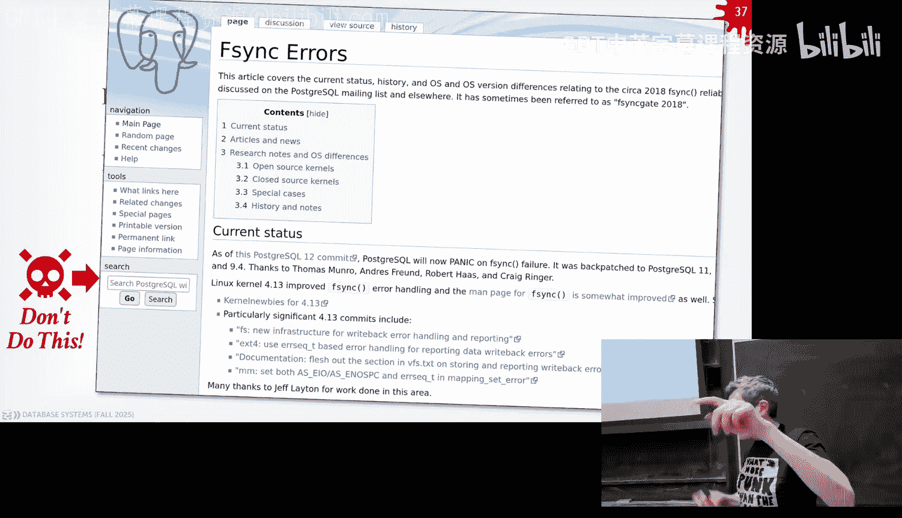

# CMU《数据库导论｜15-445 645 Intro to Database Systems (Fall 2025)》中英字幕 p04 -4-#04 - Memory Management & Buffer Pools (CMU Intro to Database Systems).zh_en -BV1bmHGzsETM_p4-

🎼别忘玩 still开心。🎼we。🎼我是你我是。🎼。All right， again， give it up for DJ Cash， awesome。Again。

 I apologize for being out of town last week。 I was in London。 If you watched a class video。

 it was bizarre。 Your friend。 So catches this old friend Fa Fa face Rick。 that owes you money。

 I was supposed to get your money。😊，I did not get your money。依 like。

Whatever took some drugs and then walked walking around like the bad parts of London and like got beat up by 12 girls。

 So we had 12 year kids。 It was super bizarre。 He was that。 What are this to do。 sorry， Yeah。

 so I apologize for not being around。That was a weird one。 That's a new one for me， okay。

So let's let's open at this so the again project zero and homeworkbro one were due last night。

 everyone should have completed Project zero， we're going to go over the grades today with the Ts and again you have to get 100% on this by last night in order to be allowed to take the class Project one we hoped at least later today and that'll be due at the end of the month and that's going be related to what today's class will be about okay the source code is not pushed yet so everyone will have to sort of do a get pull and in the latest version of from the main branch into your local code okay。

😡，The other thing coming up next week on Monday and Tuesday is that we're having our visit day for all our friends in the database industry so there's two days。

 Monday， Tuesday， and obviously the class on Monday。

 but we'll duck out and teach that and then we can always go back so the first day we sort of research talks and some intro talks from the companies and then on the Tuesday in the morning that'll be these info sessions where each company will present for about an hour talk about what their system is。

 what they're building and they talk a little about internships and fulltime positions as well so that's why I post it on Piazza over the weekend or Friday。

 whatever that was so if you want to go come these sessions since we're having since we don't have so many time slots there'll be some overlap between two companies give them the same talk giving different talks at the same time different rooms so just put down what your preference is and then we just run whatever stable marriage to generate chatDBT to figure out the best schedule for everyone and then if you want to as I' posted else as well if you want to get a database。

Either internship or full- time position go to that piazza post there and then there's a spreadsheet just add yourself what you're looking for when you're available and then we send that out to all our database friends including the companies that are coming next week so we wantt get this out to them before they show up and then we have other data friends as well we send it to everyone else again this doesn't go to recruiters except for some rare cases this goes to the people that like cofounders or like VP engineerings the hiring managers for the companies so it's not like if you go to Microsoft's website you feel for an internship that's just going in the pool with everyone else we try to skip all that and go directly to the people that care about databases they know what this course is。

Yes。ま他で。The statement is we haven't learned about much database yet。 Don't say that。

Actually here's the weirder that I've ever heard so I know that a bunch of database companies used this class for onboarding new employees。

 I had somebody tell me last week in London that they were not a database person。

 a company wanted to interview them for a database job and he's like he told him straight up。

 I don't know about databases， they sent him this class to prep before the job interview。😡。

I didn't know you could do that and he got the job。This this is the problem。This， yes。U。

Yeah for the advanced class， one of our projects used to be like another Davis company basically you took it and that was like the。

Like the whatever the hacker challenge for like to hire you。

 they would like make you implement something that we were having you do in the class so if you do the class this is 721 you could show up and get hired easily。

Anyway， so any question about this， post on piazza and then please join us next week， okay？

AllSo last class again， it was awkward because I had to teach it in the emergency room。

 but we spent time talking about what databases look like at the lowest level on disk again at the end of the day at database system just the files on disk there's nothing really special about them its from the OS' perspective it's just as if you open up VM or ems whatever favorite editor is and create the file start writing data into it that's basically what the database system is doing and of course how we layered the different concepts on top of each other that sort of makes it so we can do more sophisticated things as we get further along in the semester。

So today's class is now to jump ahead and say okay， well， I have a bunch of files on disk。

 in order for me to do anything with those files， I got to bring them into memory。

 the classic vome and architecture， I got to bring them memory and then I can manipulate them server queries to whatever I want and so today's class is really about the management or the movement of data from disk into memory and then back to disks again。

😡，We'll talk a little bit about that how we handled dirty rights late in the semester sorry in this class。

 we'll go in more detail how we make sure we do things safely right back to disk later after the midterm。

 but for now we're just trying to say can we copy things then and then how do we serve them up right？

😡，And then next week I today's Monday， so starting Wednesday， we actually go back back down。

 So back to problem number one and talk about alternative approaches destroying data as files on disks。

 But the buffer pull stuff， the memory manager of stuff we're talking about today will still be relevant for those other other design schemes。

😡，All right so in databases we care about or data systems。

 we care about basically two ideas or two there's two to two concepts that we need to be mindful of when we decide how we want to organize things on disk。

 how we going to bring things into memory， what algorithms we may want to use to process data write to data。

 write data to disk and so forth so the first idea is the notion of spatial control and that's the idea of keeping track of being mindful about where we're going to write our data on disk so that when we have to read things again。

😡，We can do so。 we can try to maximize the amount of sequential access that we have。

And I said last class that random IO is much more expensive than sequentialial IO。

 it's a little less of an issue in modern SSDs， but if you have any kind of rotating device like a spinning disk hard drive。

 there's a huge difference in the access times for sequentialial IO versus random IO。

So that means that when we start having to write data at the disk。

 we want to put things that are going to be used with each other very often close to each other。😡。

The other idea is this notion of temporal control。And it's the idea here is that when we bring something into memory from disk。

 since that's a very expensive operation， the thing we're trying to minimize or avoid as much as possible。

 when we bring something into memory， we want to do as much work as we can on that data that we brought into memory before we give it up before we release the memory or write some changes back to the disk。

😡，Because the worst thing to do is like I got to read three blocks or say got to read two blocks and I can read the first one twice and the second one once。

 I don't want to read the first one， do some work on it， throw it away， read the second one。

 do some work on it， throw it away， then go back and get the first one again。😡。

I want to maximize the amount of work I can do for every single page I'm bringing in from disk。😡。

And we'll see alternative storage models next week or Monday。

 next week how you can go to town on this and avoid reading things you don't need need for queries。😡。

Or today's class， we're going to mostly ignore that。

So going back to that architecture I showed last class at the lowest level you have the disk and again。

 this is the nonvaal storage， is considered the permanent location of the database the resting point of it。

😡，And then we have some kind of database file that's going to be broken up in pages。

 and then we said that at the beginning of the database file or at some location that's special。

 we know where to find these things， we have a page directory。😡。

This is just a sort of a database of the database pages that I have keeping track I'm like I want this page for this data or sorry for this database or this table for some file。

 here's where to go find that' be all set where I need it。😡，In this diagram here。

 I'm showing the database is compris of one file， that's what SQL does， inductiveV does。😡。

It could be multiple files across multiple directories or even across multiple machines。But for now。

 we don't care about that。And then above the disc we have the volatile storage。

 we said this is just memory， and in this now we're going have we're going to talk about today the buffer pool。

😡，And this is going be some regional memory that's been allocated that's in the address space of our database system that we can use to put pages that we fetch from disk into memory so that we can hand them off to other parts of the system。

😡，So in memory we have about buffer pool， we're going to say that the placeholders and the locations where we can store pages from disk into memory。

 we're to call these frames。😡，And that's city say that' there's thing a giant bite buffer and we have some offset said that's where our frame starts and we can put a page directly in there。

😡，Because all the pages within a single file are going to be the same size these frames can be reused and we know how to easily jump to different offsets they're called frames because we're running out of words already have pages。

 sometimes it's called blocks right we don't call them a buffer because the whole thing's called a buffer or cache right so we're calling them frames because that's all we got。

😡，So then we have an execution engine。 And again， so this thing is where we're actually execute queries and。

As it's running， somehow it says， I want to read some data and it's in page two。😡。

Doesn't know where page two is， but it talk to the buffer pool manager and exposes an API that allows you to go get page two。

😡，So in order to figure out what page two is we' got to bring the page directory in。

 I'm showing it this as a sort of separate step in actuality when the system boots up you usually load that in the very first thing you do because we to know what's in there but for nows time which is showing it as a separate step and now we consult the page directory and then that tells us where we want to find page two we find a free frame in our B pool where we just copy that page from disk into memory and then now we hand back the execution engine a pointer to that page。

😡，In that frame。And the guarantee that the Buffo manager is going to provide for the rest of our system is that。

If we go tell this execution engine， here's a pointer to the page that you wanted。

 that pointer will be valid until that execution engine or whatever S for that page comes back and says。

 I'm done with it。😡，We'll talk about how we do that in a second。Now。

 the cool thing about the bufferuffle manager is that we can actually reorder and change the location of a page。

😡，Anyway that we want， if we have to bring it in multiple times。

 So let's say that we we run some kind of eviction policy。

 we decide that we want to throw away page two to free memory。 realize we have a free space。

 We would have kept up。 but we could ignore that。 So then now if the execution engine comes back and says。

 hey， I want page 2 again。The Buffal recognize that doesn't have that page in memory。

 it's got to go back to disk and get it， but now it's going to copy into this frame。😡。

And it hands back that pointer to the Davis system to the execution engine。

 And that's perfectly fine。It's just an address in memory， Tony。

 here's where to go find the thing that you wanted。😡，With that。

 the question is what about the previous pointer going back here。

 so at some point when we hand up this pointer， the contract is I've giving you this memory。

 you got to tell me when you're done with it。😡，So at some point， the executioner says。

 I'm done with it。That's why we were allowed to then evicted。

Was that I stated it's something like reference counting， yes。But we'll get there in a second。

 but there's more， yeah。The question is， what if if the execution engine ask for more frames that are in our memory。

 we got to throw things away， we'll handle that。RightThe whole point is like we said at the beginning。

 we want to give the illusion that we have more memory than we actually do。

 So we we'll have to handle that ourselves。20块钱。Yes， the question is。

 is it random how the frames are being selected by the executiontion engine or for eviction？No。

 when the second time showed that the page loaded on to the second。

How do we decide to do the gra that frame， we'll cover that in a second。But。

We want to write the rest of the system execution engine so that we don't actually care。

 it could be random， who cares。😡，Yes have be free this page。 Here's the memory for it。 Go for it。Yes。

😊，The size ratio page very one。The question is， is the size ratio from a page of frame  one to one。

 yes， it has to be。😡，嗯。And we'll talk about like there are some advanced systems like IBM Db2 where you can actually have a buffer pool that has different page sizes per table per index。

 right？😡，And you can even specify what the replacement policy should be per per instance。

But in general， like it has to be like if I'm reading from this。

 I know I'm reading from this database file on disk， it's organizing these database page sizes。

 like profitable has to have frames of those sizes。😡，O。

So I'm showing this example here that we're using the buffer pool to read disk pages or data pages or a database。

 when actually I arere going to be using these buffer pools for all different parts of the database system。

😡，Basically， when the system boots up data system boots up， you want to call MalC。

 get all the memory you're going to ever need to run queries。😡，And then you're done。

 never want to go back to OS and get more memory。😡，Not every system does that。

 but in general that's what that's the ideal case because the worst thing for me to do is start to out do a malloc and get some memory I need for like a temp buffer and then the US says I'm out。

😡，Right，You want to know that sooner rather than later。So in general。

 anytime you're going allocate memory， not from the stack。

 but anything from the heap for your application for your data system。

 you want that to come from one of these buffer pools。😡，Some of them will be back by disk。

 meaning like if I， as you was saying， if I have， if I'm trying to allocate more memory than I actually have available to me。

 it can spell a disk。😡，Other times you don't want to do that， like if it's you just say。

 I I out of memory， then I almost kill the query， right？So again， were。

 we't gonna talk about bees right now。 We when we talk about joint algorithms and sorting algorithms。

 does this make more sense。 Lo buffers as well。 Just be aware that there's。

Memory being used for other things， other genetic tus for indexes。😡。

But the main one we want to focus on is those things。All right。

 so today we're going to talk about the basics of the what a buffer manager is。

 I think the textbook calls them a buffer cash， a buffer cash manager。

 sometimes it's called a buffer manager， they're all basically the same thing。

 it's managing the memory that the data system is going to use to run queries。😡。

Then we'll talk about my pet topic of why you don't want to use the operating system for any of this because it's going to ruin your life。

 and then we'll talk about replacement policies， how to decide when we want evict things。

 how to write things at the disk， and then do some additional optimizations okay。😡，All right。

 so the buffer pool， as I said， it just a bunch of memory that we've allocated in our data system。😡。

That we're going to use to put in fixed size pages。😡。

And those locations within that giant array is going to be each location where we could put a page in。

 we'll call that a frame。😡，So again， when now the system， other parts of the data system will says。

 I want to get this page。😡，It asked the P manager for it。If it's available， if starting a memory。

 then the Buffball manager just hands back the point of for it， if it's not available。

 then has to decide what frame to put it in。😡，And if there's not a free frame。

 we'll help to handle that。And the page you're putting into memory that you're going to hand off to the other parts of the system。

 it'll be an exact copy of is given what is being read into from disk。😡，There isn't like。

make sure this is true。If the like the low level of like the you using like a storage appliance。

 it might do his own compression down below actually the hardware level。

 but when you actually do a read against that file， you're gonna get back the uncompressed bytes。

 and that's whether the data system is going to hand back to the exchange engine。 Now。

 within that page， it actually may be compressed and the data system knows how to interpret that compression。

 We'll see how we do that next week。 But in general。

 it's a one to one copy for whatever's own disk goes into memory。So if we look at example like this。

 we have four pages on disk， we want to read page one， the B manager is going to say， all right。

 I got to put this somewhere， it picks the first frame， it makes a copy into it and then， right。

Now once we read page three， same thing， make a copy going there。

So the buffer pole is actually the memory location of where we actually store this。

 there's an additional data structure called the page table that's going to sit in front of this memory which is actually the entry point for how you find pages that are in memory or not or check whether the memory or not I think its just another hash table where I do look up on the page ID and then within that slot when that hash table it's going to tell me whether the entry exists or not where to go find it。

😡，So theres some additional metadata in here， sort of what they brought about like reference counting。

 where I'm also going to keep track of like how many times have I handed out this page to other parts of the system？

😡，It'sed a pin counter， reference counter， the same idea。

And so you would say a page is pinned in memory means that some other part of the system currently has a pointer to that memory。

 and therefore I don't want to free that frame up and throw away whatever's in there because I don't want some other part of the system start reading what's interpreting inside the page and then I replace it with another page and now starts getting garbage data or incorrect data。

😡，So the pin counter is how we're going to avoid that problem。😡。

We also can maintain a latch inside our data structure to ensure that while we're doing a lookup in the page。

 you're able to say， does this yes question， yes？😡，The question is what Sir。The question is。

 what a pay people entry sizes？😡，啊。We than to Kw。Because the big part is the actual frames。

 the actual memory， the hash tables the hash table can be large in terms to have a lot of entries。

 but each entry itself is not that big。😡，Right， like。

 so there'll be like a dirty flag where it's been modified。 That's， that's one byte。

 the reference counter， probably a single byte access tracking information。 That would be like。

What transaction is actually is is accessing this for me， like who's actually。

 what is the thread or the worker idea that actually holds the pin for this？Again， it's not that big。

All right， so I need a latch within my my page table as well so that like if I say， all right， well。

 I need to go get page two， I have a free location in my page table。😡。

Let me protect this while I go then do the disc read to go put that into a frame to ensure that nobody else comes along and tries to put something in my page table。

 that same slot， that same location。😡，And then once I'm done。

 I can release the latch and throw away the pin。They been know latches。Go for it。U text perfect， yes。

 so if you're coming from the OS world。😡，What we call latches， they'll called locks。

And the end of the day， it's a mut textex。 you could use the OS's Mutex or the P thread Mu text。

You shouldn't， but you could， we can always do better in the data system。

 but the reason why we have to6 locks and latches is that locks in the database world is a separate concept that is about protecting higher level logical entities like I can lock a page。

 I can lock a tuple， I can lock a index。😡，Right。And a latch is going to be what you protect an internal critical section of any kind of data structure inside your database system。

😡，From like multiple threads of multiple workers accessing it at the same time。

And the reason why we have to make this distinction is that。In the lock case。

 we had to deal with stupid people in the outside of the baby system。

 like someone starts a transaction and then decides to go out。

 for a cup of coffee and then transaction still open。

So we as a days didn't have to deal with somebody walking away from the computer and be able to rectify any issues like deadlocks or live locks and so forth。

A latch since that's protecting internal data structure。

 that's us like whore actually building the data system we're paid a lot of money to do it and therefore we won't be stupid in theory。

 and therefore it's up for us to make sure that we don't have deadlocks or other problems like because there isn't going to be this lock manager thing up a above that's going to kill us if we have deadlocks So it's up for us to make sure we do this correctly。

😡，So this would be a low level Mutex， you could use that again， P3 Mutex。

 the Apple one called the parking Muex one or parking locks， that's better。

 but we'll cover that in a few more weeks。😡，But the main idea here is that it can protect the internal data structure of the system。

😡，And there isn't going to be anybody that can make sure that we don't have problems and there's not going to be any way to roll back changes unless we do it ourselves in the case of a lock。

 if I open a transaction through SQL and then I make some changes and then my transaction gets killed。

 the databases will clean up the mess afterwards for me。😡，It won't do that for a lach。Again。

 also as a reminder between between the page table and the page directory。

 page directory is that thing I said in the beginning where I use that to find the pages I want on disk given an ID。

 and the page table is this informferal internal data structure that keeps track of here's the location within frames of all the pages that I brought in from disk and where they reside in memory。

😡，Again you don't have to store that on disk if you crash。

 you know you lose whatever is in memory anyway， So who cares。

 there are some systems that actually can will write out what the contest of the page table is so that if I crash and come back rather than sort of organically populating the page table through whoever accesses what。

 I can actually preload or prefetch all the。😡，All the pages that I hadn't remember before after the crash。

 Im bring that back in。You see this in serverless systems again we'll cover this later。In general。

 the pay shape does not need to be durable and does need to be stored in disk。Al right。

 so what does this sound like what I've been talking about so far。

 He sort of brought up the point before where what happens if I have。

My database is a large amount of memory that I have。😡。

We're basically trying to provide the illusion that our system has more memory than it actually physically has。

😡，What does that sound like？So swapping， but like what is the higher level concept of that？

Virtual amendment， yes。All right， well， yeah， if you take an OS class， this is what。

This is what the OS wants to do for you through virtual memory。

And it has a mechanism called memory mapp files。😡，That allows you to take a file that design on disk and you call M open on it。

 and it basically maps the contents of that file into the address space of your process。😡。

It obviously doesn't do this eagerly， does this lazily。

 so I call it open on the file and it then gives me a starting point of the memory address。

 and anytime I jump into an offset within that starting memory address。

 it will correspond to some offset within the pages of the file that I mapped in。😡。

So the O was going to be trying to do this basically trying to do the same thing we're talking about today。

 but it's going to do a terrible job at it。 I guess I'm sort of poisoning the well already。

 But trust me， you don't want to do this。 All right so here's that file we had on this before。😡。

And we have virtual memory so again I call MAP on it and then in my address based my process it can say。

 all right， well here's the four pages starting at some offset for the file that you mapped in。😡。

So then now when any thread or process accesses one of these pages。😡。

You try to again just read a memory address at one of these offsets。

 the us says oh the thing you want isn't actually in memory。

 it's a major page fault so it pause pauses your thread。

 go then fetches whatever the page you want and， puts it into physical memory。

 and then wires up the virtual memory table to now point to that physical memory。😡。

And then your process gets control back again， and you can do whatever you want with it。

do read another page， same thing， right， it's not memory， we get a major page fault， we block。

 fetches it in， we wired it up， and then our process can run again。😡。

So now the challenge is going to be what happens when we try to access something again for this file。

 but now we're out of physical memory。哎。What's going to happen？I've already said， right。

 it's going to block your process。Then it's going to go decide now which page and physical memory to evict。

😡，if it's not dirty， it just throws it away， if it is dirty。

 meaning its modified since you've read it then， it'll write it back out to disk。

Then copy whatever the pages that you wanted in once it's put in the physical memory。

 and then hand you back control。😡，So again， this seems like exactly what you want in our database system。

 but because the operating system is doing it for us， it doesn't know anything about SQL。

 doesn't know anything about queries or transactions or whatever we're trying to do。

 doesn't know anything about what actually is in these files。

 and therefore it's not in a good position to make decisions about what the right thing to evict is。

😡，So what are problems？So the first thing is that the OS can decide to swap out a dirty page anytime that it once。

This background writer can go through it says all right， you've modified this page。

 so let me go ahead and preemptively write it out for you so that at some point if I need to evict it。

 I don't since I'm stalling your process， I don't have to block you for a long time why I write it out。

 I can do this in the background and that way when you want to go evict this。

 you just can throw it away because it's now been marked clean。😡。

But the problem is we have no control， we be in the data system。

 have no control what it's going to write out and when it's going to write it out。😡，Because again。

 it doesn't know within these files doesn't know how the upper level part of the transactions actually modify them。

 so there may be a case where there's a dependency between multiple pages where I can't write out this dirty page until this other dirty page has been written now。

😡， we'll see this when we talk about transactions later on。

 but you basically if I modify a page in the data system。

 I want to make sure I write a log record that says。

 here's the change I make to this page before I write out that change。😡，But the OS doesn't know that。

 doesn't know that there' red head log or this other thing over here， it says。

 all right I got some dirtyty pages， and me go ahead and write them out。😡。

You can prevent them from being evicted。Using Mlock basically same thing as a pin for the pages。

 but that doesn't prevent it from running it out。Right， so that's a problem for us。

Then we have the stalling issue where the data system doesn't know what pages are in memory。

 it tries to go then access something， and if it's not memory， then my worker。

 either a thread or a process will have to stall while the OS decides to go fetch it in so that means that my worker is not actually doing any useful any useful work that it could be doing while it's going fetching something from the disk in the background because it got blocked。

😡，Now， you could start， you know， doing a little play， play little game where you have。

A separate thread on the side that can go touch a page that you think you're going to need and that way it gets blocked。

 the worker that's running the query can still do other stuff。

 but then you' actually you're adding more complexity to your system。😡，what the OS is trying to do。

 trying to make it trying to do something simple for you。

 but now you're actually adding a bunch of stuff in order to deal with the OS is doing stupid things for you。

😡，Another problem that's actually more nuanced。That' not really obviously until you actually start building real systems is that。

😡，Air hail becomes more challenging now with the OS， with Map because。😡。

A failure can occur at any time， anywhere in your application or in your system。😡。

That means that at any time I'm touched that memory。

 it might have got evicted or it might be a problem in the actual underlying hardware。😡，And I'm。

 I' not getting an exception。 I'm going to get an interruption or interrupt。

So now I've got to have interrupt handr code all throughout my system。

 whereas if I was managing disk and memory myself in my database system。😡。

At the time I try to go do read it， if I can't read it and I get an error。

 that's the only location where I need to handle that。😡。

But if you use MAT because it's again trying to be transparent to you， it's all over in your system。

😡，Yes， what because。there's a because it's not a page fault。

 it'd be like interrupt like the disc is broken or something yeah。

So you try to read something and someone ripped the file out it's gone， what do you do？

Or rip the harder out。You get to interrupt。question is。

S is they're correct that if someone screws around the system and starts breaking your files。

 but the what I'm trying to make is like。对。If I say I read something from disk， I put into memory。

 and then I rip the hard drive out。Then in theory， the system can still run because it has it in memory。

RightAnd so if I then try to read that page again， since the file is gone。

 I'll get a failure at that at that moment and I can handle it right there， whereas it with MMap。

 if I if some other part system tried to read it again and since it's trying to be transparent to me。

 I just do a memory access。😡，O，这个 slide。No termmists said yes， yes。

 and it's a bunch more engineering work you have to do。😡，And the last one。

 I wouldn't belaor this too much， but just sort of take my word on this。

 it's going to be slower than doing everything ourselves because what is the how the OS tracking virtual memory？

The same thing as the patient world that we had before。

 so it's going to have its own internal data structures and its own latches。

 it used to protect those things。😡，And we in the data system world， we can always do a better job。

So again， I don't want to go this too much from saying like you can start tricking around the OS to make it look more like what we actually want to build in our database system。

 but it's just as much work and in the end you're relinquishing control to what's being brought into memory and when it's being written out at what time and when like all that is you're giving up to the OS and you're just better off just writing everything yourself。

😡，Which is what this class is about。So there's a bunch of systems that have been tried to use MAP over the years。

 probably the one that you're most familiar with is MongoDB。When Mangadivi first started。

 they didn't have their own buff pool， what we're talking about today， they relied on M。Right。

But since then， all these systems have gotten rid of it because they basically realize all the mistakes that I'm telling you here。

 know， they realize that over the years， like this thing is just not maintainable that you want to be doing everything yourself in your data system。

😡，I like to point out Mongo because Mongo when IPO and 2018， they had a ton of money。

 had a ton of top engineers。 and if they couldn't make M work be functional。

 then what hope does everyone else have So instead what Mongod did was they bought wire tiger wire tiger only uses M for one very small use case but the whole regular system is still based off B poles we're talking here today SQL light has M it's for portable reasons and by default。

 you don't get Map， you have to tell it you want M but default。

 you get the buff stuff that we're talking about today。😡。

So this will be an overarching theme throughout the time semester is that the database system。

 meaning uss actually building the system， we're always going to be in a better position to make decisions about anything and everything。

 because we know what the queries are， we we know what things we've executing in the past。

 think you're executinged in the future， we know what our data looks like。

 what the dependencies are between them， therefore we're always going to make better decisions in the OS。

😡，And we'll talk about some of these tricks later on。

 but like we'll have better prefetching than the OS， we'll have better plays policy in the OS。

 we can schedule things differently。The end of the day we don't want to talk to the OS because it's not going to be our friend it's always going to try to screw us over you don't believe me go look up Linus's posts on the mailing list about what he thinks about database people right is' always going to try to ruin our lives so we never want to want to talk to it as much as possible。

😡，AndSo we actually ended up writing a paper a few years ago， explicitly on this exact topic。

 so I'm saying it's my pet project。😡，Because all these companies would come give talks at CM and talk about how they're using M。

 And I was like， that seems like a bad idea。 like， oh， what are you talking about， It's great。

 And then like two years later， they were like， oh， yeah， you were right。 That was terrible。

So we then we wrote a paper about it you can go to that link there。

 there's a video that can summarize the key things I'm talking about today as well and then just a few weeks ago yeah a few weeks ago somebody posted on hacker news saying like hey。

 I started building a database and using Map because I thought I could figure it out nope they were wrong and then they were like。

 oh because he knew about the paper that we wrote before， then he realized。

 oh yeah I guess I had to do what Andy said so again。The rest of your life。

Never use M in your data system。Okay， so。If now we responsible for memory and we're responsible for deciding what comes in and out。

 we have to decide what to evict when we run out of memory。 Yes。

 but I don'tt user program made available。😡，The statement is。How do you bypass virtual memory？Yes。

 so， so。When you call MalEC， yes， you get an anonymous M。

The thing I care about is I don't want the OS to decide how to flush pages out so it could start thrashing for us because we do anonymous Map and get a bunch of memory that when you call malloc and then it starts running it starts p these things out but in general saying when the system boots up。

 you want to allocate all the memory you need ever at that moment and therefore you have to tell it use exactly the mal of the memory that's physically available So if if your system running has 100 gigs。

 you would tell your you have 80 gigs， do whatever you want with it and it malls whatever it wants and that'll never get thr。

😡，But that's not true。 Like if another user program for another then there is going David is。

 that's not true if the， if another。Of another system running the same box。

Allocates a much of memory， too。Could you start thrashing， yes， don't do that。That's。

Like what else would you never want to run another process or another system on your data system？

Same machine that's considered the right way to do things。If it's like a word web Word website。

 who cares， right， it's something real simple， but if it's like anything mission critical。

 you don't run， you don't run like a Bitcoin miner in the same box as your your data system then would the。

Why do the O want to pay you out？Why would the page you out if you're using So the statement is。

 why would the OS page you out if you're， if you're saying that。

I'm running on a box that only has the memory that I need for the only thing of running is my data system and has all the memory they could ever want。

You're correct， it won't page you out， it could write out the dirty pages。And that you're screwed on。

As well as all the other other stuff， there's other reporting issues too like。You want to say。

 all right， how much database， how much memory is my data I'm using Well now I got to like go look and whatever is in the the page cache in a second。

 like you can't say can't just go to the OS and say how much memory is this process using because it's like that plus the page cache or whatever M stuff becomes more complicated。

😡，From reporting。Okay， all right， so sorry。So。We we have some fixed amount of memory we can use to store data for the page we bring in memory。

 And then again， at some point we're going to run out of meta memory， run out of free frames。

 have to decide how to make make space。😡，And this is we called the P replacement policy。

And the idea is that we're going to run some algorithm that can choose which page we think we're least likely going to need in the future in the ideal scenario。

 and we're going to go ahead and invict it， free that frame up。

 and then now bring the new requested page into memory and reuse that frame。😡。

So there's an whole problem in just computer science in general， like basically caching。😡。

Right because we have to deal with that memory hierarchy where the things that have more space are going to be slower and farther away。

 but the fast stuff like DRAM is going to be much limited in size。

So now when we run our replacement policy algorithm。

 we obviously want to be correct to the extent we can because we want to make sure that we throw things away that we're least likely going to need in the future。

😡，And we want this to be as fast as possible because again。

 if the cost of a disk I is like one millisecond， but if our replacement algorithm takes 10 milliseconds to run。

 we're just better off reading things of disk because that's always we to be faster。

And the of memory we're going to use to store whatever metadata we have about what's in our buffer pool。

 we want that to be as small as possible because if we're spending megabytes the stored metadata about within in the memory。

 then that's the memory we can't be using to store more data。😡，So I said， this is an old problem。

 one of those common solutions in systems goes back to 1965， LRU least recently used。😡。

And the basic idea is that you just keep track of a timestamp。For all the pages you have in memory。

 based on when they were less accessed， and then when it comes time to evict something。

 you just pick whatever one that was accessed the longest ago。And anytime you access something again。

 you just update that timestamp。😡，So say simple a database has three pages and my profitable has three pages。

😡，And so again， I can just maintain this link list here。 It's one way to do it。

 it could do a table where the order in which they exist in the linked list corresponds to the order in which they were last accessed。

Yes。His question is where would this time since be stored， you， metadata page tables？

So you access and then。You'll build。 then this is give to you。不应该。TheSa it is。

Let me walk through this。 and think it'll make sense。 But yeah， when you go try to get a page。

 I want to get page1， I go， look my bufferpo。 I see that it exists there。

 So I'm I don't go to disk and get it。 But then I go find where it is in the in the LR U list。

 or could be a table doesn' matter。 And I just move it to the front。

And then then I hand back the pointer to whoever wanted it。Yes， if we have a list then why。

He you have a list， why do you eat the timestamp？You could to the list。

 but then you got like search list every time or you have a table could you store the timestamp in the table？

Effectively the same way。Is is just two representations I'll show when I show LUK。

 I'll show with the table。是。Right so then now I want to fetch something I don' memory in。

 right I just I pick whatever from the last page at the end of the list。

 and I go ahead andvict that and then free up space for the data that I want， right？So again。

 this will give you the exact order in which the table is being accessed。😡。

But maybe you actually don't need the exact order， you can do a more simplified version called C。

 which came out in 1969。😡，And it's basically an approximate LRU。And the idea is now。

 instead of having a timestamp or a link list to keep track of when things are accessed。

 I just have a simple reference counter if it's a single bit。For every single page。

And then now all I need to do is check to see has this bit been set。

 meaning has this pagement accessed since the last time I checked it。😡，行。So at the very beginning。

 I would look at this one here， if I access page one， I'll set its reference count now to one。

And then now there's this thing called the clock hand， I'm showing this instead our circular pattern。

 but obviously we store this in the list， and just a cursor that it goes through anytime I want tovict something to try a free frame。

 I just go through and check to see whether the reference count is set to one if it is。

 then I'd put it back to zero and I keep scanning along until I find one with reference count is0。😡。

Meaning since the last time this algorithm ran， this page wasn't access。

 so therefore it's safe for me to go ahead and evict it。Yes。

 you're using the are you searching frame sorry Yes， statement is。I'm using the word page。😡。

But do I mean frames， So these are the pages that are in frames。

 So these are the pages that are in memory。A frame is a good memory location where I could put a page in。

😡，So youdirect over heard to me were you。Id say am I iterating over the frame locations and not the page Is？

For theses a PowerPoint diagram， it doesn't matter。😡，But in general。

 like you would just you would have the page table would be the separate thing you would iterate over that。

 that separate from the frames。Yes no， the page tableable is going to have what are pages that are in frames right now in memory？

It's mapping that's the page directory。 The page directory is like here's all the frames that exist。

 The page table says here's the mapping from a page I to a frame。Right。

 because all the page ideas are heat。That are in memory。Okay， the list of these changes， yes。

Because because if I evict something that I。It's a hashm， but if I evict something。I。 go back here。

 Ivict page 2。in my page table， I'll an entry for page two that's going to point to a frame where page two exists。

😡，So now when I want to go and evict it， I would say assuming this algorithm runs said， all right。

 I'm going tovic page two， I remove it from the page table so if anybody comes now looking for page two。

 they're not going to see it and they know that they have a cache mix。😡，So what's in the。

 sorry what's in the pageable is whatever's in the memory right now。😡。

We'll talk about ghost pages in a second where you could keep track of all the pages。

 that's not this， though， that's later。I don want a couple game mix。Other questions， yes。

Hiss statement is this is not a reference counter， it's just a bit。

It's a reference account that goes up to one。There's one。还在。I。

It's not a reference counter in terms of like who has， yes， who's holding this page right now。😡。

It's just the thing has this thing reference is accessed？Yes， the terminology maybe it's hard to。

They reuse a lot of these terms， it's called a reference bit。

 but it's really an access bit that was this thing accessed since the last time I checked。All right。

 again just looping through， set bring in page five。

 set this reference count to zero and then I keep you say these other page access so as I scan along。

 I change their reference bit to back to zero， I come back up here， this guy's set the zero again。

 so I don't go ahead and go ahead and invict it。😡，This is what basically Linux does in its own internal page table。

 or it's at a multihand clock， the high level idea is basically the same。😡，Again。

 for some things this is okay again， we're not having exact listing。

 but this is probably good enough yes cursor。Yes， so he said F in。

Does this algorithm resume from the beginning or where it left off last。

 that's where we left off last？Yes。This only runs when we need to。Yes， the statement is。

 and it's correct。 This algorithm only runs when you need to evict something。

 So everything we're talking about today is like， how do you decide what to e when I。

 when I need a frame。The clocks like motion doesnt only start when it's saying or we're accessing period。

That like for page5， that wasn't in the。Is the clock constantly setting bits the ones and zeros where does it only start when we're trying to access question like when does the clock actually run so if I access a page I set the bit to one I have to right the clock sweep only occurs when someone says I need a frame I don't have any free ones then it kicks and and runs and it starts setting them back to zero。

😡，我也次上诉人民。questionest， why is this fast in LRU because the amount of metadata I have to record for this is like super simple。

 It's a bit。My visit。我er did会 call得很快。Sa then， does this take longer。

 like is the computational complexity less than LRU？呃。Again， it depends on how you。

The closed said then。By infection is just。あ what？Sure。

 but when I statement it is like it's oh wanted to pop something off the end the list。

 but when I had to update it。I got to go find it and then put it to the front again。Yeah， that's。诶。

Yeah。is like this is nothing。 all right。I don't want about this point yet。

 they bring them a very good point。This nigel algorithms class where like， oh， it's constant time。

 They're all the same。 No， constants matter a lot， right。

 like difference between 1 millisecond and 10 milliseconds is a lot。 What's an order magnitude。

So this isnt this isn't who teach， I don't think teaches algorithms， this isn't algorithms。

 we care about that。So like it is constant， but like you know computation that it's。

The wall clock time to be significant yes。Does the clock start at the same point every time。

The question is where does the clock start at the same point time， No， because in that case。

 you'd be hammering whatever the first one is， it's wherever you left off， right， So going back here。

Right， so I flip this guy， right， Sa now the， the clock runs again。

 So these guys get access down below， right， set the one。 Then I got tovic something。When it starts。

 it starts wear left off。I don't say too much on'clock， no and does this。

It's just an approximation of LRU LRU is actually common。

But not in the simplified form that I showed before。

And that's because both LRU and clock are susceptible to a problem called sequential flooding。

Basically means that if I have a query that comes along， it does a sequentialial scan。

 which means I'm going to read the table from beginning to end。😡，Then that's going to blow away any。

Recentlyency information that I've been maintaining in my database system for these pages because this is going to go through and rip out throwaway things and put a bunch of pages into my Buff pool that maybe actually don't want to be in there。

😡，Becauseuse I only need it for that that sequential scan。

 So I lose all sort of the information that I have about， again。

 the rec information is basically polluting the buffer pool。And in some workloads。

 like OAP for analytics， we'll talk about that next week。

 where you're not really doing single lookups on single keys。

 you're actually doing these scans over and over again。

 you don't actually want least recently used you actually want most recently used。😡。

Because then you started playing games of like well I I do much with personal scans。

 so I'll scan from the beginning of the end， next query shows up。

 maybe I want to scan from the end to the beginning。

Becauseuse the pages I just read are going to be in the buffo。Right， so what is sequential point。

 It looks like this。 So say I have a query at the top。

 I'm doing a it's called a point query where I'm trying to find a single record where Id equals one。

 assuming I is the primary key。So somehow I figured out that IDd equals one is in page zero。

 so I go ahead and put that my buffer pool。😡，Then now a scan query comes along。

 Im going to create the average from some column in the table and that's going to go from getting the end and at some point it's going run when it gets to this last page here。

 page three doesn't have any more free space in the buffer pool so then it's got to run the LRU algorithm decide what to kick out well page zero was the last thing that it read one the least recently it read and I'm going to go ahead and evict that and put in page three。

😡，But let's say in this query at the top where I'm doing these ID lookups。

 that's actually super common。😡，And I'm doing doing much a lookup some this ID equals one like workloads are very skewed where people always trying to read the same thing or write the same thing over and over。

 they can like you know Taylor Swift， she's on Instagram。

 whatever her Instagram account versus like some random guy's cat's Instagram account。

 there's more people reading Taylor Swift thing rather than the cat guyss thing。

So we want to keep the Taylor Swift thing in memory， but if we have， if we're just using LRU。

 we wouldn't be able to do that because we would not know that Taylor Swift is popular and we would end up evicting her page if we use that basic LRU algorithm。

😡，Right。So you say， all right， well， what if I do something like keep track of how often these pages are being used？

😡，And then when I want to run my eviction algorithm。

 I want to do the one that has been the least frequently accessed。

Just maintain a counter for every single page of how often they're being accessed and when they're in memory。

😡，And then now when I to mix something， I can pick whatever that has the smallest count。Right。

Seems reasonable， of course there's a paper on this from 1971， two years after clock。Well。

 this causes more problems because now， to his point about the complexity。

 now it's a logarithic complexity maintaining this information。 all right， because for all the table。

 and then furthermore。If I have someone that does something weird。

 like go look up the catguy's Instagram account in the middle of the night a billion times and then at no point does everyone want to go back and look at that catgu's account？

His counters be super high， I'm never going to end up being evicting it。

 even though it's not useful anymore at all。Because there's no information about time in this count。

 it's just like how many times was it access？Now how long ago was it accessed？

So the solution to this is a simple enhancement that came out in the early 90s called LRUK。

And there's a great paper that talks about this and this is actually what's used in SQL server。

 this is actually what Postgres implemented first in the late 90s written by this guy Tom Lane。

 who he did his PhD here at CMU and the basic idea is that we're going to maintain multiple LRU lists。

And then when it comes comes time to evict something， we're going to。

Calculate the length of time from when it was last access or the oldest access in the current time。

And then that way we can decide who has been accessed the longest ago。

 and since now we're going to have these multiple LRU lists。

 we would know whether someone just access something once and never access it again。

 and so therefore we don't have that blowout before where someone has a high count that never comes back。

So the。是。In order to make sure that if we evict something。And then bring it back in。

 We don't have to learn from scratch all over again that this thing is a hot page or not。

 We can actually also maintain what are called ghost caches of ghost lists。

 where we can keep track of， even though something got evicted， we'll still keep in memory。

It's access timestamps so that when we go fetch it back in the second time around that we can prepopulate our LRU list。

 our timestamps with what it was before it got written out the disk。😡，So again。

 this now provides more persistence into our algorithm so that if we write things out， again。

 we're not just learning from scratch all over again。So let's look at a simple example。 So now。

 instead of using a。And now are sorry linked list， keep track of the ordering。

 I'm going to maintain a separate table。And you can think of this as like the page table where and I'm just maintaining timestamps of things。

So say that。In the past， I've accessed pages 0，1 and2。 And that's what's in my buffer pool。

 And assume the time stamp is just a monoettonly increasing counter， like a third Giit integer。

 right，1，2，3，4，5，6， so forth。So MacQurie starts off here。😡。

I have an in clause so I want to access three different values on sorry four different values on four different pages。

Now I'm going to show this in sort of the order that they're specified in the in clause， but again。

 SQL is unordered， so in actuality you would actually want the system to figure out what pages these records are on like 1。

131， 11 and 41， and then do them in sequential order。😡。

But for simplicity or sort to show the how the page issue works。

 I I'm gonna have them to jump around randomly。So my query starts off， when I read IDd equals one。

 that's in page zero。😡，So now because I already have this entry in my buffer pool。

 I'm gonna have So the the two columns， one to be the last access， the most recent one。

 And then the second access， since we're doing K equals 2 here。

 I'll have a second list and keep track of like the。The the oldest timetamp for this。

 so at the very beginning， if I access it once， there's nothing in that sort of second column and again。

 I'm showing k equals 2， you can go up to k equals6 some systems could do that。😡，Allright。

 so in this case here， because now I'm going to access it at timestamp 4。

 one gets slid over to the other column， and then I'm put timestamp 4 here。

Then now I jump down to access page three。😡，so now this is not in memory in our page table。

 so we got to decide what we want tovic to free up space to put it into memory。😡。

So the eviction policy is going to take whatever the current timestamp is for us。

 again that's just a counter increasingasing and then we look at the oldest last access timestamp right with the K one so in this case k equals  two。

 we'll look at the last access number two column。And we'll just subtract that to figure out what the distance is between the two aes。

😡，And then choose whatever one is the largest。Meaning it's been the longest since it was last access before。

If you don't have an entry in the second column， you just use infinity。😡，And if you have ties。

 you just pick whatever want that has the order times now。😡，So again。

 we're going to look at the second column here， we just go through and take the current timestamp five。

 sotractify whatever is in the second column in this case here because it's time five。

'stracted by one， you get four， but then the other two guys are on entries there so it's infinity。😡。

So then now I would say， all right， well， both of these andfinindi。

 I'm gonna to pick whatever has the smallest timestamp， the oldest timestamp and the first column。

 in this case here， itll be page one， we go ahead and pick that and put that in。

 and then we update it to page5。Do it again。 So now if I access page one。

 that's the thing I just evicted。 So it's not memory So I got to do that same algorithm that before where I just subtract whatever the timestamp is with the less access one in this case here。

 the two bottom ones are still infinity I pick page two because this timestamp is three is less than5 So that's where I'm want to go ahead and evictted。

 So that's where I'll put page one。But now again， I can say I could have that ghost list or ghost cash where I keep track of the timest of pages I just evicted。

 So I just evicted page one from4。 so I can go ahead if I have the ghost cash。

 I can put timestamp two in there。And that way， when if the eviction policy runs again。

 this doesn't end up getting thrown out immediately all over again。I access the last page page four。

 again run the same algorithm， run the same calculation。

 now I get this middle guy here because he hasn't been accessed twice。

 I'm going to go ahead and pick VIC page three and put page four in there。Yes。

That's a separate memory allocation。The question is。

 is the ghost has part of the page table or is that a separate data charge。

 it's usually a separate data shocker？It's not，'s not that big。 It's not a bigger deal。Yes。I3。

The in add up once each time。If that's the the way it used in。Question is， is this timetamp， is this。

I'm showing this as aological counter。 Would you do that in a real system or would you use like hover clocks like the wall clock time。

You would do you typically would use a logical one because the wall clock time can change when there's like。

Like if you like daylight savings and things like that， you know， time can go backwards。

That's going to be a bigger problem when we talk about transactions later on， how to deal with that。

😡，Yeah。Oh， time is terrible， yeah。Other questions。Okay。

 so let me show a sort of simplified version that my SQ uses called approximate LR UK the basic idea is they're still going to have one linked list。

😡，And again， it could be a table we looked if it doesn't matter。

But they're going to partition it into young and old regions。

And you're going to have two entry points into the link list that allow you to find the beginning of the old region and the beginning of the new region。

 of the young region。So now when I access a page， say accessing page one here。😡。

I got to evict something because it's not my buffer pool。

 So I'll pick whatever is I'll go into the old list。Slide everything over by one。

 So I'm going to get rid to page 8。 these guys slide over。

 and that's where I'm going to put page one in。😡，And the reason I'm going to put it in the oldest this rather beginning all the way at the beginning there because if I never access this page one again。

 then it'll just get sloughed off at the end， no big deal， but if I do now access page one again。

 then what I want to do is now put it at the beginning of the young list because I'm saying oh。

 this is clearly is important because it keeps getting access again。😡。

So let me go improve its chance not to get evicted very soon by putting it to the front of the young list。

Right。Again， it's approximate。 It's not exactly the way LRUK did it。

 but it kind of gives you the roughly the same benefit。Al right， I want to talk short on time。

 but I do want to talk about this arc one， because this is what you have to implement in。

In Project one， and as I said， the projects this year are harder than the previous years because。😡。

By all means use use LLM to help you code。 So this is called the adapter replacement cache that was invented by IBM research。

 actually for the discharge systems。 But I think it went into IBM DB2。 It's in ZFS as well。

 And actually was in Postgres It was added in Postgres2004 or 5。😊。

But IBM patented this and the Postg people were kind of worried about that。

 So they made some little tweaks to the algorithm to make it look less like the patent。

 although IBM hasn't enforced it and actually I think it expires。Next year。 But this is。

 this is roughly considered this the。This kind of policy or kind of algorithm is roughly considered to the state of the art for buffer replacement algorithm。

But the basic idea is that we want to get all the benefit of something like least recently used。

 as well as the benefit of least frequently used。😡。

But instead of having to maintain sort of separate lists。

 instead of having to balance how much we're going to depend on one list versus the other。

 and you have to mainly tune that， we instead want to have this sort of built- in policy that decides how to size up the different list based on the access patterns of the querying。

😡，And then of course， we're going to maintain a ghost list to keep track of what things been evicted recently so that if we go fetch them back in we can record that history and rely on that。

So。In the second time， I mean I know we need this for the project。

 but we can follow up online to do a recittation this separately。

 but basically there's these multiple lists we're to maintain。

 there's this parameter P where keep track of how much we're going to favor putting things in the least recently used list。

 the recent list or the frequent list。And so we find ourselves accessing the same things over and over again。

 then we'll allow the size of the pages we're tracking in the frequent list to grow and correspondingly shrink the recent list。

So you sort of automatically get the best of both worlds of bothly used and least frequently used。😡。

And it can eventually narrow in exactly how what the workload actually wants。

 and because it's dynamic， if the workload changes over time and the access pattern changes over time。

 this thing can handle it。So again， we'll fall into a separate recitation on the algorithm because you'll need it for the project and there's a lot of videos online that discuss how this works。

It's basically the same concepts we have before， again except if you have this P parameter that changes where things are going to go。

😡，O。All right， other tricks you can do to make things go better is have information about。

How the page is actually going to be used？Like if I know that I'm doing a query scanning a table for special scan。

 and it's unlikely that this table is be used by other queries。

 then I don't want to be put it into my global buffer pool。

 I want to have a little separate sidec or a separate portion of the buffer pool that's dedicated just for my one query that's running。

😡，So then now as I'm scanning through， Im up putting things in the global buffer pool and having that run its own infection policy。

 I' putting this in my own little buffer pool on the side。

 but it's really just a partition piece of the total amount of memory that's available for the system。

So Postgres does this， and they may basically maintain a circular ring buffer for some portion of the buffer pool so that every time I ask for a new page I'm just appending to the end and then eventually it'll wrap back around so it's really cheap to actually implement。

😡，And again， you you minimize the effect of sequential scans or sc flooding on the rest of the system。

Another trick you can do is maintain priority hints to about how the query is going to act or how the execution engine is using this data and where's actually in the pages so that when the buffer pull replacement algorithm runs。

 it knows to avoid pages that somehow thinks are more important than other pages。😡。

So think of something I have an index， we haven't talked about B plus trees yet。

 but assuming it's a tree data structure。And so I would have priority hints for my pages and say the top of the index。

 the first page， that's super important because that's where everyone has to go to in order to get inside the data structure and figure out where they need to go。

😡，Right， so we think like this is not， this is not valid sequel。

 But assume I'm inserting values where I'm just incr some counter by one over and over again。 right。

 Well， if I'm sort of along from min value to max along the bottom among my leaf nodes。

 then any time I want to insert something， I always got to go to the root。

 And I'm thinking always gonna go down on this side of the tree。So therefore， I should tell my data。

 hey， that the index page zero， that's super important。😡，Yes。

 I would see that if being accessed all the time is part of my frequency information。

 but maybe I want to make sure that the data system， no matter what， never pages it out。😡。

Because the first thing I'm always going to do if I want access to the index is going to that route。

😡，And same thing of if I want to do a lookup。There's other tricks you can do about priorities like if I know that a。

If a。There's a transaction that's running multiple queries and the first thing it does is read some record and then immediately update that record I don't want to have look like I don't want the thatt look like two separate unique accesses to my bable manager I want to tell it oh by the way this is part of the same transaction therefore it only updates like the access counter once。

😡，Because it didn't become more popular because。You know， everyone's trying to access it。

 it's just one transaction where to access it multiple times。

So SQL server can do stuff like that again so there's a bunch of hints and a bunch of information we can provide to the Balo manager based on how we know queries are accessing this data。

😡，And I didn't say at the beginning， but I'll I'll say this multiple times about this semester。

 this is one of the things that's going to separate the expensive enterprise systems like the Oracles。

 DB2s， the Terraadas from the open source systems like Postgres， MySQL SQL light。

 like they're going to have to spend a lot more time and more money to make these Buffalo replacement algorithms as sophisticated as possible。

Like the Arc thing is is in IBM that paper came out and the post I implemented， but I。

It's not public， but there's a bunch more things they've added it since then in the DB2 version。

All right， so what happens now if we want to evict a page and we've identified this one we want to remove。

 but it's been marked dirty， meaning some part of the system has modified the changes since it was brought into memory and therefore we can't throw it away we have to go write it back out the disk before we can reuse the frame。

😡，So if the page has not been modified， then it's super easy for us because again。

 we just drop the memory， no big deal if it is has been modified。

 then in order for us to use that frame， we have to wait until we write that data out the disk。

 it gets flushed in some cases we have to write out another log another record or another page that tells us about what was modified in that page like a log record you have to flush that page。

 then we flush the other page。😡，Before we can free that frame up。

I mean that's obviously going to be slow for us。So what we want ideally is when our buffalo replacement algorithm runs。

 we only want to consider。You know， free pages。 And so the more free sorry， clean pages。

 the more clean pages that we have， the better chance we have a finding one that will be。

You least likely be used in the future。So similar to how the OS can do that preemptive background writing for pages in Map。

 the data is seems to be do the same thing。😡，Again this is just you're just walking through the page table。

 finding all any pages that are marked as dirty and going ahead and writing them out in a background thread so then the idea again。

 by the time someone wants to go free that frame， the dirty day has been written out and we don't have the block and wait for ourselves。

😡，This is sometimes called page cleaning or buffer flushing， the basic idea is the same thing， right？

😡，And then once we've written out the dirty page， we can go flip the dirty bit。

 and then it can be evicted easily。Of course now the challenge is going to be if we spend all our time doing background writing。

 that's going to slow our system down because now all our IO is flushing out dirty pages when we could be using it for other running other queries So again the high end enterprise systems have all sorts of thresholds and other backup mechanisms you can put in place to say how aggressive you wanted to be on background writing where other systems might just run on a。

😡，Periodically on a schedule or if so many pages has been modified。

 like I think Post it'll do background writing of 30 pages in memory it been modified。

 then it kicks in there's simple things you can do like that。

 but the commercial systems are more sophisticated。嗯。All right。

 so let me try to get through disk guy real quickly and then we'll we can。We can pick back up on。

The optimizations you can have with your buffal pool next class。So， the。

When we have the right pages out the face where re pagess from disk。

 we want to do it in such a way that we can。Maximize the throughput or the bandwidth of the hardware so that again that we can for a certain amount of fetches and a certain amount of time。

 we can get as much data as we can from disk into memory。😡。

Dis has gotten a lot faster in recent years， but it still is a pretty significant bottleneck。So。

The way the operating system in Harvard is can to try to do this in modern systems like NVME drives is they want to maximize amount of parallelism。

 they try to be clever about reoring IO requests to make sure things are done in sort maximize amount of sequential ordering。

😡，But the challenge is that it doesn't know which of these requests have a higher priority than other requests because it doesn't see that information。

So you can set the IO priority for for doing Dreads and diskrites。

 but you can only do it at the process level in Linux so for a single database system has two threads I want to read data。

 one is for mission critical query and one for like a background thing who cares if it's slow。😡。

Linux doesn't know anything about those two requests。😡，So this again。

 why we want to do all the scheduling in our own system。

And a lot of this tell you turn off any kind of sophisticated scheduling information or juding policies in Linux。

 go do the most simplest thing because we're going to do everything better ourselves inside of our database system。

Right。And basically the way this works is that the Ds maintains its own internal queue of the IO requests that are coming from up above from the buffer manager。

 and then it can reorder things based on how those ques are accessing the data based on what it knows is the important things to consider like again。

 most simple things with Scial IO versus random IO if I have a much to request or random from random pages multiple workers or multiple threads。

😡，Then I can just look at all the requests， sort them by the page ID or the locational disk。

 and that way I can turn all these random IOs into sequentialial IO。😡，Again。

 if it's a part of a query and or a transaction that's important。

I want to prioritize those versus random background tasks if I know I'm writing out log Gaia。

 that's really important to write that out first make sure things are normal before I write out maybe like other random dirty pages。

😡，There's a whole bunch of things we can consider that the data simply is not going or sorry the OS is not going to know about because doesn't know what's inside of our application or system that's actually running。

😡，I keep saying application because from the OS perspective。

 the Dave system is just another application。 So it don't mean like your no Js application over there。

 but from the OS perspective， the Daveim is's another application So that's what I mean by that。

 But I really mean our system wreck actually building。The OS doesn't know any of this。

 and it's just going to make things harder for us and so we want to try to avoid that as much as possible。

Another thing we've got to be mindful about is the OS page Cas。

So when I call Eri to read using thellipy Pos cis call。😡，That's going to go into the kernel。

 into the file system that's running in the kernel。

And then it's going to consult its internal page cache in the OS。And if it's not in the page cache。

 then it goes down the disk， copies into pages cache。

 and it then copies that again to a user space buffer that goes up to our data system up above。

 right？But now if I'm maintaining my own buffer pole manager。

 that's another copy of pages that are out on disk。😡。

So that's actually two copies now that are in memory in our OS or in our system。

 So we have one copy of the page in the OS pagec， another copy up in user space in our database system。

😡，That's super wasteful。 We don't want that。So instead you can use what's called direct IO where you basically tell the files system。

 don't put it in your page cache， bypass all that， go directly to the hardware， get what you want。

 and handy back the memory buffer for it。😡，And that avoids that additional copy things are much much faster there's actually other optimizations you can do called using DBK plane data plane data kit。

 we'll cover this in the advanced class， you can basically have the data system talk directly to the hardware and not go through the fossil system at all。

😡，And get data out。So most data systems， one with direct IO。

 there's one system that's widely they use that doesn't use direct IO， they know which one it is。😡。

Sbel light。I think you can remember tile those guys。I don't might on my default too。Postgres right。

 Postgres famously because it's like some relic of the 1980s relies on the OS pagec。

Every other data system out there tells you。As I said before， like if you have 100 gigs。

 use 80% of the memory for the buffer pool in database system， Postsgre says use 25%。

Because they want the other remaining memory to be used for the OS。

But then this has all sorts of problems， all sorts of performance issues because again。

 you're maintaining multiple copies of data and it's wasteful。

 so Postgres has been trying to get off。OS Pageg and switcheds to direct I for many many years does this is a LinkedIn post from last year talking about how they they have a patches for this and then coming out in two weeks is Postcast 18 this I don't think has direct IO owned by default。

 but it's going have it's now gonna have asynchronous IO。So now I can have again。

 separate background threads in Postgres or processes in Postgress。

Go retrieve data from disk It's still going to use the OS pagec。

 but I don't have to block the rest of the system while I'm doing that because you need to have asynchronous IO before you can do direct IO because the direct I is going to be slower because you're never going to really hit the OS page cache yes。

😡，充限する。question， you have they changes in the kernel to do direct IO No， no。

 Direct Io is like a is a Posits command like when you call F open。

 you just say you pass an O direct。My default that's not that。Yeah， know the changes at the kernel。

All right， bottomom line， this is coming in Postgres。

They're going to get off of OS page cache very soon and again the OS is always going to cause problems for us。

All right， I want to finish out with this last example here， and again。

 just I know I sound crazy up here saying the OS is our enemy and we don't want to talk to it。

Let me show why。All right， so say I have dirty page， my buffer bowl。I got right out the disk。

I call F right。What happens。With that。I heard wasiddia。责任。我前罪。I say it again。 Sorry。

 I'll write your file。 Sorry， okay， so you said get arrested by 5。 Alright， sorry。Rrise the file。

 but like。Where。Like they say on the disk。 you guys don't need flesh。

 we're not we're not flushing yet。So it sits on a kernel buffer。😡，to his point。

 if I really want to get into the hardware， I got to call Fync， that's another positive man。

 it's a blocking call where you tell the OS。😡，Make sure this thing is actually written to the hardware。

Now the hardware can play games in lie to U too because the hardware can have its own battery down there where you do an Fync。

 it writes to the battery backed Ram or storage， and then it's not really on the actual store to meet him yet。

 but in a rare case you lose power， then the battery can then do the final right。😡，被。

When I call F syncync， I block until I get get a notification saying my flush has succeeded。

But if that thing fails， what happens？Well， Linux in the old days would mark the dirty pages as clean because I want to dirty pages are modified with F right。

😡，right， always keep track of them call Eync and wants to write out the dirty pages and then once to them as clean and it marks on the clean。

 then notifies you that the Sync is completed。But if E fails for whatever reason。

 because the Harvard fails are flipped out or something。

It comes back and you get a failure notification， you get a failure error number。😡。

But then the OS marks those pages， 30 pages is now clean。😡。

So the problem was a bunch of dairy systems would do F sync in a wall loop。While Eync fails。

 try again。So the first time you could call Fync， it would fail， it would loop back around。

 then try it again， but since the OS Linux would mark the patient it was cleaned the last time you called it Fync even though it didn't work when you call Fync the second time says。

 " oh yeah， you're good， done and it look like it would succeed。是。So why would it do this？😡。

Why would Linux do again， they fixed this， but why they used to do this？😡。

Becauselinis wasn't worried about the database system。

 even though it's the most important thing in the world。

 they were worried about some with a thumb drive， pulling out the thumb drive。

 and then now you want to page it in your page table from a thumb drive that's never going to come back so they would market as clean so that they can clean it up later on。

😡，Right。But it was lying to us in the database day system that our page was actually written even though it actually wasn't so some guy on the Postgres mailing list posted this like 2018 or 2017 is like hey look I think Postgss lost some data from me and I didn't have a kernel panic I didn't have a discra it was a silent error some guy went and started rooting through the code in both Postgres and Linux and turns out。

😡，You know， Linda was lying to us for 20 years。 It wasn't just Postgres。 My SQL had this problem。

 I think Mongodb or wire Tigerger had the same problem。

So I'm going put this up for multiple time semester。 Don't do this， right， Don't call Enc again。

 assume everythings will be okay because the OS is going to lie to you。So this was a big scandal。

 it's called E gateit， this is a S spin fix in Linux and also in fix in Postgres and My SQL and Mongo toB。

 but this is a good example of the OS is really the documentation is going to say one thing is actually to do something different therefore we have to be super protective make sure that we don't put anything that anything that could fail will fail and we have to do buying extra stuff in our data system to make sure that we don't lose data okay？

😡，All right， wherever time， apologize， we'll pick up on this next class and then。

Post everything if we post on Piazza and we'll post Project one later today， hit it。😡。

🎼Yes。🎼我再总不缺。

🎼Yeah。🎼说你会越我怎不。🎼Yeah。🎼不敢说你会不说。🎼从不见。🎼Yeah。🎼说你最最蠢，我 can走不见。😊，🎼Get the fortune fuck the frame maintain。

