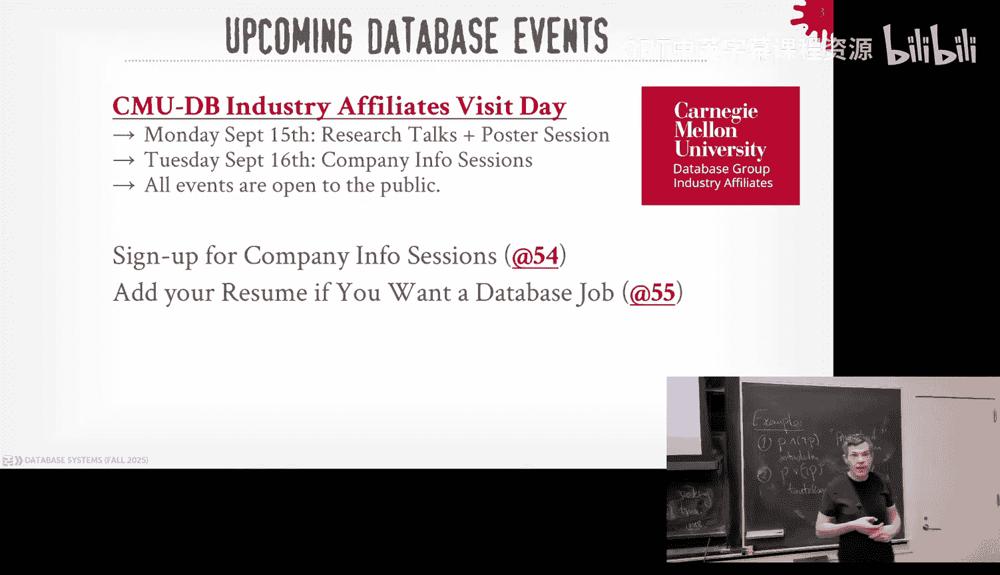
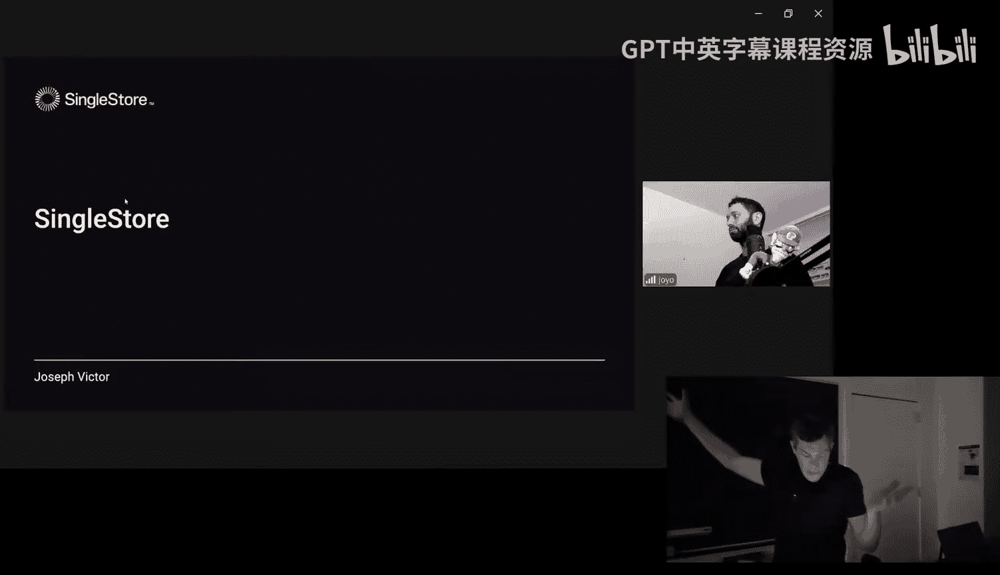
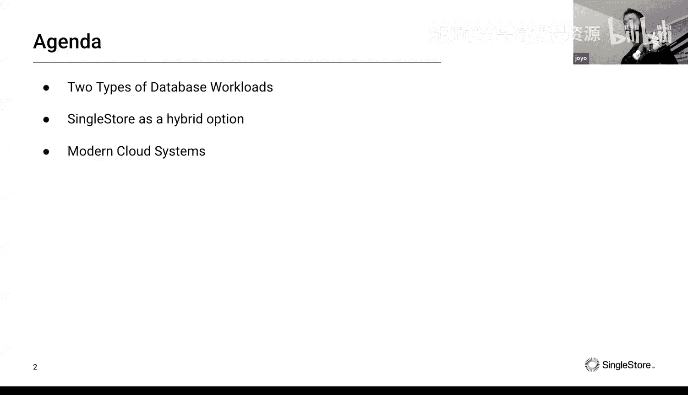
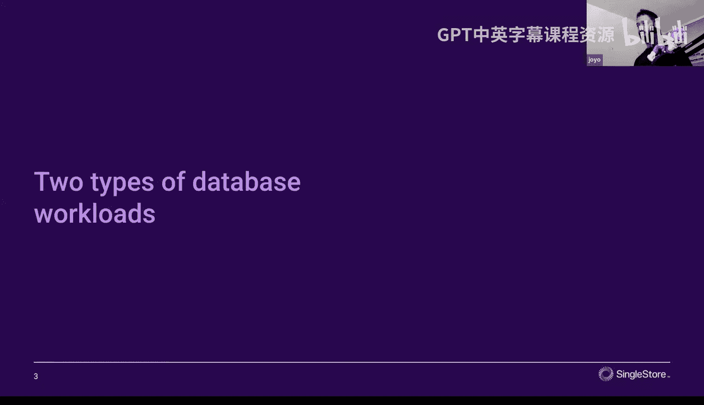
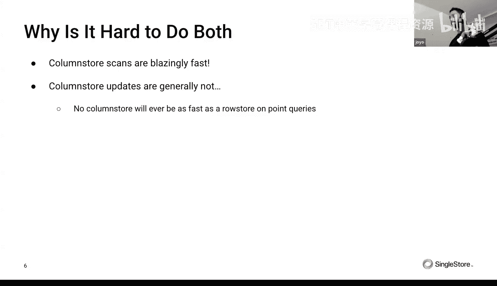
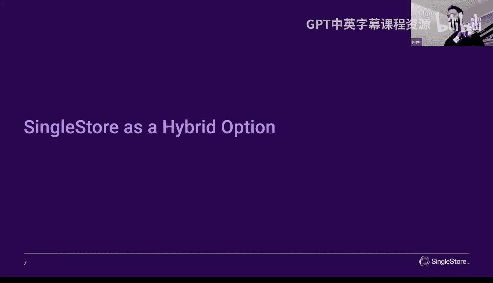
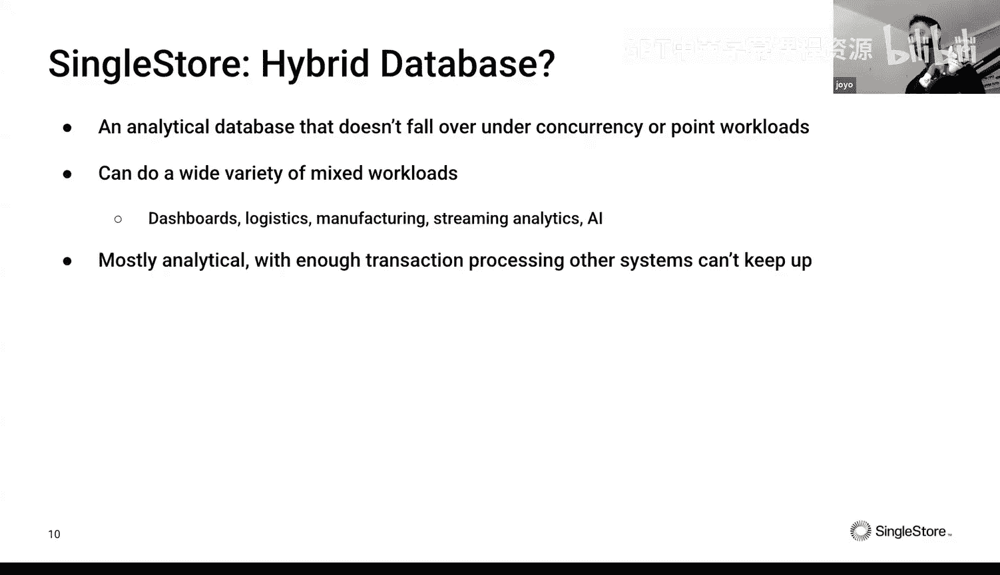
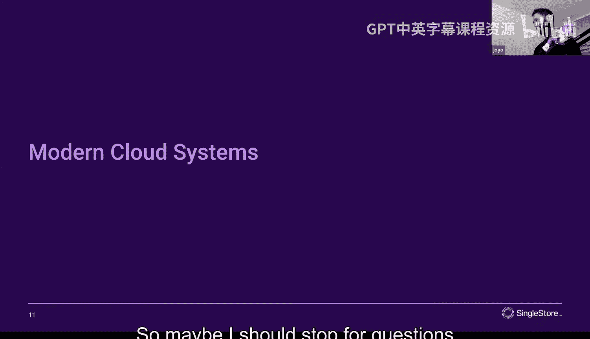
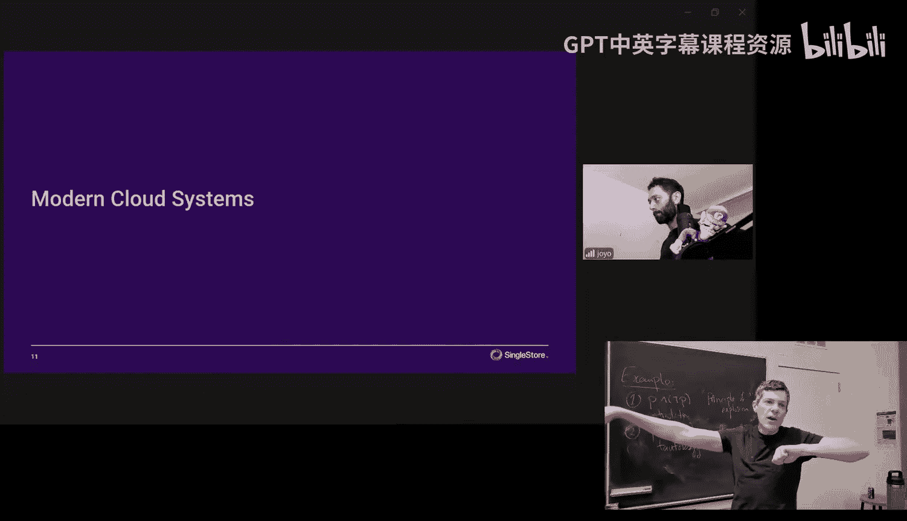

# CMU《数据库导论｜15-445 645 Intro to Database Systems (Fall 2025)》中英字幕 p05 -5-#05 - Log-Structured Database Storage ✸ SingleStore Database Talk (CMU Intro -BV1bmHGzsETM_p5-

🎼别忘玩 still开心。🎼we。🎼我是你我是。🎼。Hi， give it up for DJ cash。啊。You looks well。 Thank you。

 Why I'm just coming back from court。I tryingry to get exact payments on my royalties。Or。

Did you win or you don't know yet， I'm not。With a lot of announcements。

 actually announcing for you as well。 your radio show starting this week。 I do。

 I do on Sunday this Sunday from 1 to，2 PM。 I have a show starting from WRCT。😊。

You guys should all walk in。 All right， this Sunday， DJ Cash is on the radio。

 Are they paying you or now。rightYeah， work on that， okay。For you guys in the class。

 homework two is going to go out today that'll be do the 21st。

 project one got released yesterday and that's going to be due on September 29th。

 has anybody looked at project one yet？😡，You're going to be questions about Project one。😡。

So we'll announce the recitation that'll be next week。

 but all the files and everything should be on GitHub。

 so put down La's version and make sure you're working off that code base。😡。

And then as I said last class next Monday and Tuesday on the 16th and 17th。

 we are having our industry affiliates visit day， a bunch of day friends from various companies are coming to campus to give talks and meet with you guys so 15th will be research talks and poster sessions with students and other researchers at CMU and then on the 16th in the morning before like 1230 they'll be three sessions of different talks from the companies you can talk to them about internships and full-time positions and like I said。

 we'll send them your resumes if you fill out the spreadsheet that I posted on Piazza okay yes question。

The question is is a list of research talking times， yes， for that link， the slides。

 that link will take you to the page， we don't have the finalized schedule is not ready yet。

 but that'll be posted probably tomorrow and then for the company sessions once everyone fills out the form tomorrow do we'll figure out what the actual optimal ordering will be。

😡，O。😊，Any other questions。

All right，This is very unusual， but there was very， very。

 very huge news today in databases like two hours ago。😡，Anybody know what it is？

Like groundbreaking news， like the biggest news story in your lifetime。Nobody。

Larry Elsson， the found of Oracle， is now officially the richest person in the world。

 the dethroned Leon Musk。What's that。W who I I don't know。 He doesn't do databases。

 right This guy does， right， right， Larry Eson is like the like the O G of database money， right。

 He's again now he's the richest person in the world。 It's all pay for by databases。

 He owns a Hawaiian island。 pay for by databases And like a big one， right。

 not the one with the head of the lepers， right， one you could actually see from like Maui。

 He's bought his son a from his。😊，Fourth marriage， he bought a son from his fourth marriage。

 a movie studio。He got married last year to the woman she's 36。

 he's 80 whatever like that's this thing right this is a big deal like I know he's worked so hard for it and it really means a lot to him and I sent an email congratulating him but this is it this is why we do databases this right here。

So I mean， I would do a round of applause for him， but he's not here， so that'd be kind of weird。

This again， he he's been bumping back and forth between fifth and seventh and then early in the year he went a third to second so this is。

😡，This， this is a big deal。 And I mean， I'm。I get emotional， but this is this。This means a lot， okay。

All right， so we're not there yet， we're not at Larry's level， but we'll get there。

All right， so last class， we spent time talking about the Buffo manager。

 we said that this was this component inside of every database system if you're not using M。

 you shouldn't be if you're going to manage your own memory in your database system。

 it's the component that is responsible for storing pages disk database pages from disk into memory。

 handing off pointers out to other parts of the system keeping track of the reference count or whether they're dirty or not。

 seeing all the machinery that allows us to have the illusion that our database is actually can fit memory even though it may not。

😡，Right。So today's class， I want to quickly go over some three optimizations we missed at the end of last class。

 then we're going to jump back now to the disc level。😡。

And refresh your memory about what tuple oriented storage looks like。

 and then if we look at two alternative methods， index oriented storage and log structure storage。

 and then the end of class today we'll finish up with a talk from the Sing store guys。😡。

hi actually is not a at least start of all， not as a discord database was the in memoryory database where the primary storage locations of the database was the in memorymory since to switch that but。

😡，But it's a pretty state of the art system。And the founder of singleing St Wars actually the founder Neon as well。

 who got bought by Databricks for a billion dollars last year again。😡。

Larry El is not the only one who makes a lot of money to databases。

So right so last class game we were trying to quickly go over the buffalo stuff at the end or discheduling stuff and I' want to come back and talk about buffalo augments again these are going gonna to be examples of things your data system can do because it has full control of the memory and what's being read and written from disk again these are things that the operating system is not going to be able to do very easily because it doesn't know what queries are running and what the queries want to do but we as the data system we know because because SQL is declared of we know what the query plans going to look like therefore there's much of tricks we can do to make things better。

😡，So the first one is maintain multiple buffer pools。😡。

So I talked about this buff pool being like this region of memory and we're going to put our database pages in there。

 it doesn't have to be logically organized as a single block of memory。

 we actually could break it up into sort of sub subars and have a page table per subar and have different policies and algorithms used to optimize those different buffer pools。

😡，So can have one for database， one for table， you can have one per page type。

 if it's going to be indexes versus table pages， you split those up。😡。

And so the benefit that I're going to get is that because now we can tailor the buffer pool's internal algorithms based on how we know the rest of the system once you use the data that's going to put in that buffer pool。

😡，We can make better decisions about what to evict and when to evict。

And we're actually going to reduce lat contention when we have multiple workers trying to access the same data structures at the same time because now things are split across。

So this is something you'll see in the high end systems， the enterprise systems。

 like in DB2 you can go crazy like from IBM system that you can declare a buffer pull per table per index per blob type like you know a lot of very sophisticated things My SQL has a pretty simple one we'll see that in a second。

😡，So there's basic two ways to do this， you can just say， all right。

 well if I have a as I know I got to do lookups on record IDs or object IDs。

 like the object could be like a table or index， then when I do my my lookup to try to get that page at this object belongs to。

 like I'm showing some arbitrary command， get record， whatever， like it's not really，😡。

It's not really SQL， obviously， but you could pick apart this record ID。

 look at maybe the first portion of it， that's the object ID and use that to decide which of these different buffer pools are going to have the data that you want。

😡，And the thing about the guarantee if you have multiple buffer polls is that any page that we want。

 any like physical page can only exist in only one and only one buffer poll at a time you don't want to have two copies because then if you do two rights。

 how do to keep business in， right we don't want to do that。😡，so we again， with the simple mapping。

 we can just say， okay， this is what we want for this object。

 I'd be we know's in Bful one and go get it over there。😡。

Another simpleple trick and this is what My SQL does is that you could just take whatever the record I is it's trying to find like I want page  one。

2，3。Or record 1， two，3， just pass it and modify the number of buffer poles that you allocate in the beginning and then modify it by that and it just tells you where to go find it。

Again， this has the same property guarantee that any page that we're looking for can only be in one of these proper pools at a time。

I'm showing two buffer bowls， you could have hundreds。

And then there's a disched underneath to make sure that if you're trying to all these buffer instances are trying to write data。

 read and write data at the same time， you don't want to do random how bunch of random IO。

 the disk scheduler can see all the requests and then sort things and try to do it in a more efficient manner。

😡，Another trick we can do is prefeting。So again， we haven't really told what query plans look like to assume that it's the program that we know we're going to execute in order to run some query。

 so we know everything ahead of time what's going to happen。😡，So if we see a scan occurring on data。

 I say query one is going to start， first thing it needs is page0 and then it starts reading page1 and go read that。

 but if we recognize that we have this sequential access pattern。

 then the database system can say okay well， you just read page0 and you read page1。

 I know your query is also going to need page two and page3。

 so let me go ahead and prefetch that for you put that in the buffer pool while you're crunching on page page1。

😡，Right run whatever eviction policy that we want to run， put those pages in there。

 so then now when the query says， all right， I'm doing page one and let me go look at page page two。

 it doesn't stall and wait to why you go infection from disk， the data you need is already there。😡。

And you do that for the recipe of pages all the way down。Now MMap can do that actually。

 the OS can do this right OS has a way to do， you can pass hints to say I want to prefetch as I'm reading a file。

but again， only can prefetch sequentially right it can't do anything more sophisticated because it doesn't know what's in these pages。

 doesn't know how they're related to each other。😡，See you can do tricks like this。

 let say I have a query once to get data within a range。😡，And the data system decides， okay。

 why I have an index for this， I can use that to find the data that I want right assuming some tree dash datata structure。

 it's most likely going to be a B plus tree we will cover that in a few weeks。

 but it doesn't have to be and along the leaf nodes。😡。

The data is be sorted in that key order we want。😡，So now as my query starts running I read in this page zero that's the root that's going to tell me what I want to go left and right now I go down here I go to page one。

 I fetch that in and that just had to be sequential in my gateway file so yeah you can potentially prefetch that but when I get down here to the bottom。

😡，I can see that I'm going to scan across the leaf node。

 and I know I'm going to need page three and page five， and they're not sequential。😡。

So if the OS was doing this for us， it would blindly say， okay， well you just read page two， page。

 page one， page two， let me go get page three for you and three and four。

 but we actually want three and five。But because we know the context of these pages。

 we can peek ahead。😡，And we'll talk about in a few weeks how we do that say， oh。

 we don't actually want four， we actually went five because we're scaling along leafs and then go ahead and prefet those guys。

So again， there's an example， because the datatime knows what you're trying to do， the queries。

 it's in a better position to make decisions about how to optimize things。😡。

All rightThe last one I'm talk about is scan sharing。And the idea here is that if we have a。

Query that's running and it's scanning some table。 and then some other query comes along and wants to scan the same table。

😡，Rather than just having that second query start from the beginning and to read all the same pages that the first guide has read。

😡，We actually can piggyback and write along the first query。😡。

See all the pages it sees and then make a determination whether we want to quit or not or come back around and find the data that we're looking for。

😡，These are sometimes called synchronized scans。And again。

 this is done at the lowest level of the system as there's some cursor reading pages from page directory or scanning along a table。

😡，This is not the same as result caching， result caching is like I take a query， I run a query。

 I produce some output， if that same query shows up， I just reuse the same output。😡。

This is actually done at the lowest level actually rather running queries。😡，So this is actually rare。

 not few systems support this， again， the high end ones like DB2 SQL server Terraada and Postgres do this。

 Postgres is the exception， Oracle， again， despite him now being the richest person in the world doesn't have this feature。

 they have something that almost looks like this but has this limitation where the queries have to be exactly the same in order to do this piggyback mechanism。

😡，ISo meaning this is from the documentation， if you have a query like select star for employees。

 if the next query comes along， says select star for employees with the capital E。

Or there's an extra space in there。 it doesn't match it。Even though semantically they're the same。

The way they're doing this matching is basically hashing the string and seeing whether it's identical。

But high level idea is still the same。So say we have this query， select the sum from a。

 it starts at the beginning， it's going to scan through and read all the pages that it needs。😡。

And then say at this point we get here， we need to read page three。

 we only have three frames in our buffer pool， so we're going to throw out page zero。😡。

And then while we're doing this now， another query shows up， but basically wants to do。😡。

Another sequential scan on the entire table， but now compute different aggregation。😡。

So the computation is different， but the data it needs to access is the same。😡。

So we could do the stupid thing。And to start this second query from the very beginning of the table。

😡，But it's going to read page zero。 and that that's actually the last page we just evicted。

 So we just go back and they'll fetch it back in and our buffer pool。But if we're smart about it。

 we can say， okay， well， these are both doing a sequential scan on a。

 so I'll just have Q2 tag along Q1。😡，As the cursor reads the table and gets all of these pages。

 it can do whatever computation it wants。😡，Then at the bottom， Q1 says， oh， I scan the entire table。

 it goes away， but Q2 says， well， I know I started at the beginning the sort of halfway point。😡。

Of this table。 and there's a bunch of more pages I need to go back and read。

 So let me start and scan through those all over again。Right。Again， we talked about this last class。

 like we want to maximize the amount of computational work we can do on data pages when we bring them from disk into memory。

😡，So if I can run two queries or satisfy two queries operations。😡，For one single page fetch。

 that's a huge win for us。Yes。😊，Is there a way for like free truth to know that that go back before that they started sharing。

Like here at this point，2 hasn't seen page one or page2 question is sorry this question is at this point here。

 query one has not seen page one or two， Yes， but needs to number yes。

 instead of starting with35 it read。Yeah， so his statement here is。

could be even more sophisticated and have QG recognize I need page one and two that's already in memory by going peek in the buffer pool and then say。

 okay， let me read those and then piggyback yes， in this PowerPoint example I'm not showing that。

 but yes that you could do that。😡，NowW who does that， I don't think PostB does。

 I don't know what the enterprise guys are closed source。 I don't know what they do。Yes。

What page has correspond to our。Questions， how do you know what pages correspond to what table the page directory tells us？

😡，Yeah page directorctory is basically got catalog and says okay。

 if I want to read table A here's the directory or here's the pages the file here's the directory with the files that have the pages that you want to read this yeah we have to know that。

然后的这须。The statement is this is a sequential scan， if it was an index scan。

 it might not do the same read the same pages， yes。

 if there's a predicate there from a where something。

 you might not want to read everything if it was an index sure。Keep it simple to scan。Right。

All right。All right， so again， that that's that's the again。

 the three optimizations I wanted to cover in the buffer pool。 So let's jump back now and talk about。

The disk storage again in， the database storage on disk。

So we said beginning the semester that we're going to focus on what Ill call a disk oriented architecture again we assume that the primary location of the database when it is at rest is on nonfoal storage like a disk。

😡，And then we talked about a way to break up a database。

 it's the entire database and went of these database pages。😡。

And represent them as slot of pages where we could stick in tuples and then do lookups later on。

So we discussed the page layout so that page layout would be， again， what are actually in the pages。

 so what's are in the pages that we're showing in our database files？😡。

And we tuck in two oriented storage， that was the slot of page architecture where the pages are really all about distortoring tuples and we had this indirection layer within each page allows us to move data or tuples around within a single page itself。

😡，So today I want to now look at two alternatives， again。

 we'll refresh what a tube or storage looks like， but then we'll jump into the new stuff for today。😡。

These are going to be alternative ways to store data for tables in a database。So again， slot of page。

 I said this is the most common layout for databases that are row oriented。

 next class we'll discuss what that means in more detail。

 basically we're going to take any Tupple and assuming we can fit it to this page and we're going to start it from beginning to end inside that page。

And then inside that page， we have this header that tells us some metadata about within the page。

 like a check some， a version number， so forth， then there'll be a slot array at the beginning that and all the tua data at the bottom and the slot array is going to have basically just record offsets inside the page。

😡，That tells us where to jump to to find the beginning point for every single tuple。

And we said the ser array is a allowed to grow from the beginning to the end and the tuL data is going to grow from the end to the beginning。

This is way Postgres does this， this is way I think the textbook might describe this。

 other textbooks might reverse it in the end it doesn't matter whether the slot array or the TupL data is on the top of the bottom the high level idea is it the same。

😡，RightAnd again， and the slot array is providing us an indirect that allows us to change the position of TL。

 So then within the page itself， you don't want to move it to another page because。😡，We may have to。

 but that's not we're not focusing on that yet。And this allows us to then be able to do things like。

 oh I'll delete this twople here。And then I can do compaction and slide these twople over here to fill in the space。

And all I have to do now is update the sler array to tell me where the offset is for that two point I just moved。

 and I don't have to update anything else outside the system or outside this page itself。

Then we talked about record IDs。And this was the way that we were going to physically find a tuple within our database。

It's to be some combination of a file name or file ID， a page ID。

 and then a slot number within that page。RightSo the page directory thing he was asking about before and they were talking about before。

 that'll store the file ID。For for some object like I want table Fo。

 here's the file where to go find it and then if I want page1，2。

3 depending on the addressing scheme that the data uses。

 it could just be an offset within the file or could just be the file name itself might have the page number right all that's within the page directorctory yes。

😡，What if you have like more roads than you have。再。The question is。

 what if you have more rows in the size of the ID？U。I mean， it's a 64 bit number well， hold up。In。

In Oracle， it's a 10 byte number， right， that's pretty big。

so Ingress is with a commercial relation system from like 1974。Postts is， yeah， so six bytes。

So let's take to run out。Sa is， would you run out of6 it's a pretty big。

 that would be a pretty big table， but in theory， yes， you could There's other limitations， too。

 right so like。The statement is it's not a for one table so the whole day is now this would be for depending on the scheme you're using。

😡，This could be the for the entire database， it could be for a single table right I know I want table foo and here's the page ID for it therefore I knew how to find that。

😡，Right。There's other limitations' going to talk about。In Postgs。

 you can only have two to the 16 columns in a table。

 Oracle famously it only lets you have 1 thousand because somebody hardcoded it。

 you just be like 200 and then they spent a year trying to fix it or't go to 1， thousand00。

But that was 10 years ago no one's going to change it again， like it's like stupid things like that。

But yeah， you you're very unlikely to run out of space with this。

 There's other tricks to do if you get around this like in case in Postgres， you can。

You can have a you can partition table， There's like make there's like here's a parent table。

 And then within that I have like sub table。 So logically it looks like a single table。

 but each one has their own。There's ways to get around it。合读诉理。Serium。The question is。

 for a row store data system， would it makes sense to have  a000 columns？People do it， sure， why not？

There's easily applications that have 1，000 columns。😡。

Enterprise stuff is nasty like oh like anything from like the SAP enterprise resource。

 ERP thing that thing they make a lot of money on， that thing is insane。

Because think of like an application running for like 30 years， every two years。

 someone's got to add like 10 columns because something gets else added before you know。

 you're at 1000 easily。To your point， I mean， like it's a long tail right。

 there's going to be most tables going to have maybe I don't know 20， 30 columns。😡。

But there's easily stuff out there that don't have that many。to single on multiple basis。

The same is at that point， you would have a single row across multiple pages。

 depends on what the columns are。Assuming that they are my。Assum there are multiple pages。高跟州。Sure。

 but they isn't going to handle that。Yeah。For our discussion here。

 we've simplified it and say like we assume it's August sitting in a single page。

 but actually if we talked about large data record or large attributes that you have a pointer to something else。

To another page。 And then at run time， the days knows how to stitch you it back together。All right。

 so。And this two warrant storage， reads are pretty simple。😡，は。If I want to get an existing tubple。

Then I'm gonna get it to record ID。 I'm not saying how to get that just yet。

 but assume there's some index， there's something that's can tell me for know I want I want your email for your email address。

 Here's the record ID that has your student record。 There's something there。

 It's the index that's gonna tell us how to find that for our purposes right here， we don't care。😡。

So again， how do we find this， we go look in the page directory。

 go get find the location of the page we want。😡，Retieve that that page we went from that location on disk if it's not already a memory。

 and then now we use the record ID offset that's embedded inside it to jump beside the page within the slot array to find the data we're looking for。

😡，Reads are pretty simple。In this case here。We have to do the lookup in the index to find the data that we're looking for。

😡，So we kind of do a look up in this index。That's going to tell us for a given logical key。

 like your email address， when we look at the index it's going to come back and say。

 here's the record ID， then we do a lookup to go find the data that we want given that record ID within the page。

😡，But what if we didn't have to do that？What if we didn't have to do a separate lookup in the index and a separate lookup in the table heap？

So this is called index organized storage。😡，And the basic idea is that we're going to use the index as the storage for the table itself。

😡，So again， what is what is index doing for us it's a mapping from a key to a value in this case here would be a logical key like your email address to mean like the primary key or something and then the value is gonna to be the record ID if it was a two point storage。

😡，With index owners organized storage。In the leaf node， instead of storing a record Id。

 we're just going to store the tuple itself。So again。

 I'm not telling you what data structure this is going to be。

 but typically it's going to be a B plus tree， it could be a skip list， could be a tri。

 could whatever your favorite tree data structure you want。😡，So then now within the pages。

 sorry the leaf nodes。😡，It's going to look a lot like the slotler array。From the two hand storage。

But in the beginning， the header， we're going to have this key to offset array mapping。

That we have to keep in sorted order based on the key。

 and these are just going to again be off thats within the page that gives us the tupa that we want。

😡，So now when I do that lookup， based on your email address。

 I would scan down through the inner nodes in the data structure。😡，Land on a leaf node。

 then do a binary search inside this key offset array。

And then that'll find the record that you're looking for。

And I don't have to do that separate lookup in like the page directory to go find your tuple for giving a record I D。

 Everything is right there in the leaf node。So SQLite famously or SQLite M my SQL with InDb famously give this to you。

 like that is basically how they organize。 it is how they organize the data in their system。😡，嗯。😊。

The with Oracle and SQL server， by default， you get this slotted page architecture I said before。

 but when you create a table， you can tell it I want to do index organized storage。😡。

So they'll support this as well。And just again， just before the koffs that goes one way and the tuble goes another way。

Okay， well。So that solves the the problem we had in reads before， where I wanted to do a。

I want to find a record or a tu bowl based on the record ID that I have to go look in the index。

 and I then have to find the tube。With theForgiven key。

 look up the index and the index tells me the record  ID0 and from the record  ID0。

 I the page that has the two of data。😡，啊。But we still have to worry about rights。So to do an insert。

 it's pretty straightforward。We just go check the page directory to see whether there's a free page for us where that has enough space if there's a page that has enough free space for the tuple we want to store。

 again， we know that the size of the data we sting because SQL is declared of we know exactly what yourre telling us to store so we can figure out at the moment you try to insert it。

How much space we need。Then we go retrieve that page from disk if it's not already in memory and go check the slot array。

 define a free slot and insert into it。😡，Ignoing the index organized storage， rebalancing the tree。

 we'll worry about that later。So inserting is pretty straightforward。😡，And say we were' out of pages。

There there's no free space in the current pages we have。

 we just allocate a new page and then insert our record in there。😊，No problem。

But now if we want to update a Tple。Go through the same process before。

 go find its page from its record ID， go see where the page exists。😡，Then assuming。

 we're going to overwrite the data。Which is not always the case in most systems， but assuming we are。

Then I'm going to get checked to see whether the size of the。

 the new value of the tuple that I'm trying to insert or update。😡，If it。

If it's larger than the original value。Do I have any space in my page？

Now because with the slot of the array， I can reorganize things or try to free up space within the page。

😡，And if I can do that and I can get in the same page， great， I'm done。

But if there's no space in the current page that I have where the tuple currently exists。

 then I basically have to treat that as a delete， removing the original tuple。

 followed by an insert with the new tuple。😡，And that's expensive， right？

So Tu or storage is really great for reads because， again。

 it's really easy to go find the thing that I'm looking for。For inserts， not so bad either。

 right because I'm certain to page page of page over and over again。But for updates。

It can be actually quite expensive。RightSo part of the problem we're going to have is that there's be fragmentation because we can't guarantee that we're going be able to fully utilize every single page there's a little space in the middle where the slaughter array goes one way and the tuupal data goes one way and if I don't exactly line up perfectly which is you almost never do。

 then you have a little space in the middle that's just wasted。

Then now anytime I want to go update the Tple， I got to go fetch that page into memory。😡。

In order to update one tub inside of it。Depending on the page size， if my pages are really large。

 then I might be reading 16 kilobytes to go update a5 byte value。😡。

by value like something really small， so there's a lot of ways to IO potentially depending on what my workload is。

 what my data looks like。The other problems going to be is that because now tus could be stored across multiple pages。

😡，That means if I want to update a batch of table at the same time。

 I may have to go fetch all those individual pages， bring them into memory， and then update them。😡。

If I had 10 twoples across 10 different pages， I have to bring in those 10 pages into memory before I can update anything。

😡，And then lastly， this is not so much an issue with2 point energy storage。

 but it's a way to think about how to design systems that， well。

 what if we actually can't do any in place updates in our nonvatal storage？😡。

I can't bring a page into memory， jump to some offset within it。

 and then write out a new values to at that offset。

There's some storage systems that actually don't let you do this。😡。

The Hiop file system is one one of the earliest ones they did this。

 Google has their own internal file system called Collosus。If you ever use Amazon S3。

 other object stores， some of them provide these semantics so you can't do in place updates。

 you can only do a pens。You can only create new data。

 you can't overwrite existing ones if you want to get rid of the oldest stuff。

 you got to actually that's a delete， and then you do more pens。😡，So because of this， these issues。

There's a different way to store data called log structure storage。😡。

Sometimes these are called log structure me trees or LSMs。

And the idea here is that instead of storing Ts and pages and then updating them in place。😡。

multi versioning we'll cover later that。What I'm saying is not exactly true for multi version。

 but what we're talking about today is going to look like multiversiononing。

 but not in the way that we'll talk about later for currency control。

 but the high level idea is still the same。That。Instead of dialing it to do in place updates。😡。

The only thing we can do is append new records to data pages。😡。

And the idea is that because now we're going to only do appends。Of course we have to handle deletes。

 remove things， then that makes some of the algorithms to go read and write data。😡。

More efficient or less efficient。But it's going to make our updates be really， really go really fast。

😡，Inserts go really fast as well because you're just appending new records and then that's that thing we talk about for where we want to be able to minimize random IO in exchange for more sequential IO because so now if we only do a pens。

 that's all sequential IO。😡，And that be much faster for us。So the LSMs or an old idea。

 goes back to 1996， actually the guy then invented the LRUK stuff talk about last class。

 also was the a mentor of the LSMs， the paper came out in '96。

 there was earlier work done on law structured file systems in the late 80s。

 early '90s and so this is a a successor to that in the file system but applying to databases。

So there sensor could be two main data structures in a log structure storage system。

There'll be a me table sort in memory data structure where we do all our rights and make all our changes and that one because this' in memory。

😡，We can make in place updates。And then as this MEm table gets too big。

 then we're going to write it out to this needable file called an SS table。😡。

I think it's called stands forsorted string table or sometimes static sorted static table。

Whatever it's the same idea， but it's going to be a sort of compact form of what the MEM table is that's going to have the changes that are made to the database。

😡，So there's only two operations to modify a log structure system。

 we put where add a new entry and delete。😡，There's no overwrite， there's no update。upts。

 puts basically these things insert， but it may not be， you be physically putting a new record in。

 but logically it might be updating an existing one。😡，お世代に得先のさが。So again。

 now we bring again the demarcation line between disk and memory。😡，Again。

 we have our mem table up above some tree data structure that's going to record changes that we're going make to the database。

 I'm not saying what the data structure is。 Again， it could be a B plus tree。

 Skit lists are pretty common。 It could be a try。 It doesn't matter。😡。

So say now my operation is I want to put a new value in for key 101。

I'mNot defining how I'm determining what key 101 is。

 you can think of the same way we did that like the row ID and the SQL lights like a sequential counter where the system is maintaining for every new record or every new record。

 you just add a new key， you increment a counter by1。

So I'm going to put this put into my MIM table and I'm going to basically add a new entry for it。😡。

Same thing now I want to put for key102 the new value of B1， I'll put that on my M table as well。

And then now if I want to go back and modify。K 101 again， now with a value A2。Again。

 because the Mem table is in memory by its name， I can do an in place update inside of that。😡。

I actually don't need to record the history of the previous changes that were made。

There's a separate log file we' not going in today's class。

 but basically because this is in memory if you crash you could lose data。

 or basically we are pending the puts to a separate file and that'll get flushed before we say the transaction is committed。

 but for now we can ignore that。Just be aware that we have a way to keep the MeM table adorable。😡。

Same thing if I can do another put on key1 or three， I'll update my me table and so forth。

So at some point， the M cable is going to get full。We're going to run out of space。

Like think a couple hundred megawates or something like that。

So at which point we're going to take a scan on the leaf nodes of the MEM table。

because that's all the entries of the actual values for the different keys that we have。

 and we're going to store that now into a different form of the SS table。😡。

Again think of this's just almost like the right ahead log of the log like here's all the changes that were made that this mem table recorded So again if I made multiple multiple changes to a key like I change key 101 multiple times because I'm doing in place updates on the mem table。

😡，When I write at the SS table， I only see whatever the latest version of that was。

So at this point once it's in my SS table， it's been additionalized with the data of the ME table。😡。

I'm storing the data within the lowest key to the highest key。

 so this is in a sorted order based on whatever the keyW1。

I'm going to go ahead and write this out to disk to nonbo storage。Do a flush， make sure it's there。

And then I'll just populate a new Me table， just keep doing this over and over again。

 making new SS tables， and these are now going to be basically sorted now from the in timet order。

 from newest to oldest。😡，Within one file， it's sort of from key low to high。

 but cross multiple files， I'm going to sort them， keep track of them in newest oldest order like you put the file name have a timestamp right and the timestamp is always incrementing as things go forward。

😡，So I'm going to show one type of compaction that's probably the most common one。

 but I'll show another one and I'll go more to detail what this compaction scheme looks like。

 but at some point this level is going to get full， so then I actually want to combine。😡。

Ss tables that are in disk the first level zero and I'll combine them into a new SS table and then I can blow away the old ones and the idea is that you keep going as you keep going down。

 these things get bigger and bigger。Right the idea is that I'm throwing away things that I don't need anymore。

 and I always try to have like whatever the latest version is at each level for a given key。Yes。

 his question is why do we want multiple levels， why not just merge levels there within itself。

 you mean two slide we come to that。はい。ButSo one to be better for reads。

 one would be better for writes。I'm not showing key ranges here and that's why it's maybe confusing give me a a few slides。

Yes， is the compact working？Because these are I assume these are high operations so you can just throw out。

Operations for the same key value as that or getting the space from yes， and。

Two slides right So his question is， and he's correct。Iss this compaction are we throwing them out？

Are we throwing out operations for that we don't need anymore， yes。

 so if I do a bunch of puts and then on a key and then I delete that key。

 I don't need to keep the puts， I just need to know that I deleted bit。😡。

So you basically end up with sort of this tier structure like this where you have big。

 longer SS tables at the bottom and progressively smaller ones as you go up。😡，All right， so。

That's how we do puts and deletes。We need to handle reads now。So if I wanted to read。The key 101。

 the first thing I'm going to do is go check my mem table to see if I have any entries inside that because the me table was going to have the latest version or latest changes that were made to a key so I go check my mem table if it's in there great。

 take whatever the value is and return that back I'm also not saying what the value is and kind of be vague here but it's typically going to be the tuple itself。

Just in sort of serialized form。But if the key that I want is not in the me table。

Then I now got to go check all these different SS tables， different levels。😡。

And that's going to suck now because I got to go to a bunch of reeds to go find some。

 basically a needle and a haystack。Right。So the way to deal with this is that you basically maintain what's called a summary table。

😡，In memory， that provides some additional metadata about what's actually in these files。😡。

RightSo I could say for giving Key 101， I could check at。

Does this key even exist at the different level So I started at level  zero because again。

 the levers are going， depending my capture team could be going forward to time。

 It could be also going across keys。 But like， I want to see what level has my key。

And then if I know that a。The key exists maybe at this bottom level here。

 but it also exists in a higher level there， I always want to choose the higher one。

Because I know that one's more recent。So again， we're making this trade off to make our rights go faster in exchange for slower reads。

 but we can add some additional data structures to make sure the reads aren't as bad。你是周把就。We C。

And just the sketch。questionIs the key filter a blue filter or question question。

 like what is the filter？It could be a range filterer going to say like within this range its key doesn't exist or not because that would handle ring scans。

 could be like a single key， does this key exist in this level or not and that be a blue filter to look up so that could give you a what's what bloom filter just a few weeks so like that could give you a false positive it might tell you the key existence level level then you got to go actually look and check to see whether it's there or not。

哦。Yes， so the the way I imagine it it keep have to be done in this field that I like couple and like which field you're updating。

 because like， let's say I say， I want to update this field for I。H。😊，And people。

 I only have information。They feel them changing。 but there are many other fields of ideas。

The statement is， again， this is what I'm trying to be vague about what the value is statement is。

Is the。If I update a record。啊。If it's a blind right， I don't need to look to see what actually was。

 I just， I just put a put and I'm done if it's like。

Udate Andy's salary or Andy's age where age equals current age plus one。

 I got to go read whatever the Virgil value was， then I got to do an update and then what do I'm actually putting in the meM table in case of Ro CBB I think or most systems it's gonna to be the full tu all again。

😡，But my point is like that' it's just a right I don't care what was before I'm saying like in these page a blind right so if I do that and later on I want to read your record。

It's not enough to like find your age and need to find everything right。

 So like your record may appear in multiple sustainable level。 Yes， so his statement is。

You're basically asking is a given record that has multiple attributes I that those attributes broken across multiple S tables。

 No， you would always have the full tuple with all its attributes in the record that you're sting as part of the value in the M table or and S table So there's blind in sense internal you're going a blindr would be like an insert。

 but to your point like。Yeah， so his point is like you'd have to do a remodify right。

 you don't go fetch the tuple then update depends on like what the query is。

 if it's an update where if it's update where you're like you're changing all the attributes。

 then yeah， you don't need to see what the original ones were you just do an update in place yeah。😡。

Or not updated places， you could do an update without actually reading it。Other questions。All right。

 so again， what are we doing， it's a basic key value storage， architecture。

 where again the value is going to represent the content of the tuple。😡，你。If we do a delete。

 we don't actually need to go find the data that we want and actually delete it。

Which is kind of nice again， in a two oriented architecture on a lot of pages。

 I either go fetch the page then mark it as deleted。In this case here。

 if I have the key of the thing I want to delete， I just put a delete key record in my log。😡。

In the me table， and then I'm done with it。Then anybody else that comes along wants to read that Tple。

 has to make sure that it sees that delete record。😡。

Notifying that the record no longer logically exists。

 even though physically it might be and it's still a much of about SS tables。

 we know need we should ignore it if we try to do a lookup on it。Sorry， yes？The question is。

 when do mergers get merged？Next slide。Okay， so。At some point， I'm making all these at tables。

 running about the disk。If I delete a TL， if I update a TL a thousand times， then I delete it。😡。

I'm going to 1001 records corresponding by one2， but I only really need the latest one。

So there'll be this background process that gets triggered based on the size of the S tables based on the number of overlapping key ranges。

 we'll see that in next slide， like there's a much mechanism to trigger when compaction should kick in。

😡，And again， there's this trade off。Between using doing background maintenance and actually just running queries。

 remember we talking about the background writer or the page cleaner in the buffer pool that we could have a thread run through our b pool manager。

 find our dirty pages and start proactively writing them out so that they get marked clean and they can get evicted but if I'm spending all my time doing that。

 then I'm gonna to slow down queries actually trying to do real work。😡。

So I could spend all my time doing compaction。to clean up all these SS tables。

 but that's going to make query execution run slower。

 so there really isn't a good way to there's not a sort of one size fits all solution to determine when you should trigger a compaction。

But things like Rocks Db have a bunch of different policies。

AllSo say in the most simple forms I have two SS tables， I want to merge them。And in this case here。

 I'm assuming that the order of the two SS tables is from newest to order。

 so the one on all the way over here is the newest one， the one after that is older than that。

So the way I'm going to do basically merge is the same way you're going to do sort merge。😡。

If you know that algorithm， we'll talk about that again in two weeks。

 there's a joint algorithm on Stmerge as well， right？You basically just have two cursors。

That started the beginning of both these files again I'm showing two SS tables。

 you could have multiple ones， you typically you want to merge multiple ones at the same time right but for our our illustration just two。

😡，So now what's going to happen is I'm going to look at whatever the key is being referenced at the wherever my cursor is pointing at in this case here the first cursor is looking at a delete on key 100。

 this guy has a put on key101 this says 100 is less than 101 I know that there isn't going to be a reference to key 100 in the SS table。

 so therefore I can just take whatever that record is and put it in my new SS table。😡。

And then I move that cursor down， but I keep the other cursor at the same location that I was pointing at before。

😡，So now at this point here we have a put on key101 in the first one and then a put on key 101 as well in the second one。

 but since this SS table is newer than this one， we know we don't care about whatever that put was。

 we only care about the latest one so we go ahead and remove or ignore that put and put the first SS tables into the new one。

😡，Then same thing that both of their cursors move down， they a put on key102。

 another put on key 102 in both of them， I don't care about the second one， I only put the first one。

 keep moving down， now I have a put in key103。😡，But I also have a delete on key 103 same thing they're operating on the same doing some modification to the same key。

 but I only care at the latest one， so I go ahead and ignore the second one。

 put in the first one the first cursor is done so now I keep scanning along and whatever comes after that I know I want to copy into my new SS table。

😡，So I put the put for 104 them。That's basically what compaction is doing。 Now。

 that the tricky thing is going to be。 how do I organize multiple less tables and what am I。😡。

What's theHow many deciding what SS table is to merge？

And we said the when it gets triggered based on a bunch of different policies。

So what I showed before was an example I would call called level compaction。😡。

Where I'm going to maintain different levels of SS tables of different sizes。

And the goal here is actually to have non overlapping key ranges。😡，Within our levels。

Except for level zero because that's the special one where as Me tables get full。

 we convert them SS tables， we need toend them to disk。😡，So in that case。

 they will have overlapping key ranges， but everything below that will not。😡，So again。

 so assuming that the SS tables are go from newest oldest。

 our first SS table we're going right now is going to have key range from A to R right to arbitrarybit letters。

 the next one is going to have key ranges from EDT。😡。

And then the third one here have key ranges from B to Q。

So at some point I'm going to run out of space or somebody gets trick it says。

 I want to now do compaction on level zero。😡，So I'm now going to make a new level level1。

 and I'm going to take these three SS tables and I'm going to combine them in two larger SS tables。😡。

And I'll do the compaction I just showed in the previous slide where I'll have a cursor go through each one and remove whatever the oldest entry is for a given key and it'll only keep the latest one。

😡，So but then my new SS tables I'm going to generate。

 now I have non overlapping keys within this level。So if I'm looking for key X， for example。😡。

If I have been look at level zero， I have to potentially look at all the SS tables。😡，Deefing key X。

 well actually， I wouldn't mean any of them， but like， say， I'm looking for key key Q。

I would actually have to look at all three SS tables to find that given key because each of them have that key could fit in each of their ranges。

 but now when I do the compaction down to the second level or level one，😡。

Since now they're non overlapping key ranges， if I need keyQ。

 I know I only have to go look in the second SS table。😡，It may not exist。

 and again I could use a filter to tell me whether it's going to exist or not， but if it could exist。

 then I know still I only need to look at one SS table。😡，Yes。

 can you repeat why do we have multiple levels table next question。

 why do we end up with multiple SS tables in level  two？It could be just one giant one。

 basically the size of the SS table is growing sorry size the SS table grows per level。

And so the clear size of the SS tables above that I'm merging down may be larger than what I could fit into a single SS table。

 so I drew it too， but it could just be one。I just want to show too。

 that you would have these non overlapping ranges。So once this is done， again。

 I can blow away all the S tables at level zero and keep doing the same thing。

 just keep adding more and more doing depends and now again now I have different ranges。

And at some point I want to do emerge merge and again。

 these are going to be overlapping ranges in level0， but when I create SS tables in level1。

 they have to be non overlapping。😡，So I may actually end up。Recreating all the files again。

 to read them all in the memory， using my Buffo manager and then write them all back out because the keys that are in the level zero might be in any of the files。

 might to go in any of the files and make the generator bunch more files。😡。

So if I have like 10 gigabytes of data on level one。I run compaction。

 I'm going to have to read 10 gigytes in and I might be writing out another 10 gigabytes。Yes。

The question is， is the number of levels below it's fixed， no， they can go forever。In practice。

 though， like I forget the defaults in rockxD， you just end up with like really big fall at the bottom。

Like for， like for any specific setup isnt fixed， is cost。

Question is is for any set of whats are for like？For example， you have this one BN S like。

This is default all settings。With1 levels， and then is smaller。The question is for。

would would you have a setting for a database system to say I'm going to have 10 levels of in my compaction scheme。

 and then you always have 10 levels。Yeah， the very beginning。

 I could set this thing to have 10 levels， but right here at this point we only have two， it grows。

Yeah， so never exceed that you just end up with really large SSs tables。

 a lot of them are maybe at the lowest level。So why is this good for we heavy work。Question。

 why is this better for rehaav workloads because when we see universal action the next slide。

 if I want to go find a key，At a lower level， I only have to look at the SS tables that were my key fits in that range。

If we go back to when we only have level level0 this is fresh from memory into disk。

 these are overlapping ranges。 if I want keyQ， it can exist in the first one。

 the second one or the third one， so I have to check all of them。😡，Now， in this case here。

 like it would be。Since they're ordered based on time， if I see it in the first one。

 I know I don't care about the other two。But in the worst case， I had to scan all three。Okay。Yep。

Other questions。So， there is。这这是。The question is， can the same key exist in level zero and level1。

 yes？ButBecause like。Les are over。えと？The question is because the at levels zero it's sort of by nuest to oldestti。

 it does not impact the search speed that。Meaningly。Well， so if I want Q， if I only'mal at level0。

And I want key Q。If it's not in the first one， I got to check the second one， so that's flow。

 it's not in the second one， I got to check the third one， that's slow。😡，So in worst case。

 scenario know， I have to check everything at level zero。The summary table helps helps to。😡。

Maybe not do look up on tables or SS tables that aren't going to have the data that I want。

 but in the worst case， I may have to check。😡，So， reel gets slower。😡。

But that's why they have the additional levels。Because now when I start compacting。

 going down the levels， I can guarantee that， again， for key Q。

 it's only going to exist in one SS table at level one。😡，Likewise， if I keep adding more， same thing。

 Q can all exist in one SS table。😡，Whereas if it was just me just writing as a tables straightforward for memory like I do in level zero。

 it could be an anyba。😡，Again， and I do the same thing。

 I do compaction down to to this level and again blow away things here again and now I have again non overlapping ranges within。

As they exist now， but again， as I add more things， it may be overlapping。It the base。

If little thank you。question is similar to the one they asked before。

 like what triggers compaction depends on the system depends how you set about so it could be the that if I have。

A max number of max size of all the files within a level， when that exceeds something。

 then that triggers compaction。questionest is， like why did I do for this one here。

 Why do I merge it question is， why did I merge in this case here， why did I merge。

Only two SS tables from level1 down level two。It's just the example， right？With that yeah。

 like you would merge more than two right I'm trying to make this work on PowerPoint so like。

For simplicity， yeah， you can be very but going back before forth。

 you can be very aggressive and try to merge everything。

 but like that's going to be you're just spending your more time doing compaction。

 not not running queries。All right， so let me show universal of action real quickly。

Uur compaction only has one level。😡，And again， it's the SS tables as they exist as they're being written out。

😡，But you know from the me table of memory to disk， so we want to do compaction on them， but again。

 we don't want to maintain multiple levels because we't we don't have this right for ammplification problem where every single time we want to do compaction。

 we got to read a bunch of things in and then write it all back out。😡。

So instead we're going to be more more targeted compactions。

 so in this case here I can say I going to take these three SS tables again again they all have sort of non overlapping key ranges。

But they ordered through time， and then now I'm going to take these three and merge them to a single SS table。

 compact them and reclaim the space。And I can do this again for next two here。

 compact them and put them into a larger one。So this is great for。

For workloads where you're inserting data very quick you do a lot of updates。

 it's great for workloads where I typically only want the latest data that I just inserted。

 like if I'm inserting time series information， like the temperature of this room。

 I only care about the last five minutes，10 minutes。

 I don't care about what the temperature was a year ago。And so in that case。

 I'll be able to look up very quickly and find the data that I want in the newest SS tables that are on disk。

Right， classic trade off and computer science of like， I'm spending more time。

 more energy to make the。When I write things to make the rights more expensive。

 but my reasonably faster。In exchange for as opposed to making my rights go really fast。

 but my read's a little bit slower。Right。So this is making the rights go faster。

But the reads could potentially be slower based on what you're looking up。Okay， so to finish up。

 log structure storage in the last 15 years has become super common and part of this this is because of Rocks DB。

 Rock Db is a log structure mergery key value store that actually supports both these compaction schemes。

 you can set whatever you want， I think default is level compaction。

But that is been used as the starting point for or the built in storage manager for many。

 many new systems。Rock Db not was created by Facebook or Me， whatever it is now。

 but they weren't the original authors of it， it's actually a fork or something called level Db that came out of Google。

😡，This was built by Jeff Dean and the people working on Big Table。

 they built this orchestrater storage embedded key value store called levell2B。

Facebook forked that and made Roxy Bea。Wass the first thing Facebook did when they forked love Eb to Roxyb？

我在。No， not got to write it， no， no， it would think it was apache license， maybe so it wasn't issue。

What non legal thing， What's the first technical thing they did。No， that's the legal thing。

He said to change the license， no， technical， they， they change the code in what way。

 what do they do？😡，Remove M。RightThat is the very first thing they did was get rid of Map because it's garbage and switch a buffero manager the same way that we talked about last class And like I said。

 a bunch of the different systems， you start off using rock Db as their own internal storage manager。

 cockros you did this and then over time they'd re read it again small smattering of log structure storage systems there's a lot more。

😡，And as we said， the challenge of this approach is。It's going to be really great for doing rights。

 but the compassion is expensive。And we may have this right amplification issue where we do one update to a single tuple。

And even though we never update it ever again， we're going to read it in， write it out。

 read it then write it out over and again， multiple times in because of the compaction process。😡。

Whereas like in a tu oriented architecture， if I write something to a page。

 it gets written out the disk， I never run， I never read it again。

 I never I never write it out over and over again。😡，是。Yes。

Does this mean thatN questions are all these unitses bad for right read heavy workloads， no。

 like things like clickhouse and we really， really good for it。

Lo this storage is not necessarily that right。There's a bunch extra stuff you can do to mitigate the issues。

And thatll be next class。Okay。So next class， again we're actually going to。

We're going to break your preconceived notion of what a database looks like for now we've been talking about all these rows that are just contiguously in disk or memory。

 we're going to flip that and talk about column stores， we actually store data as columns， not rows。

 that'll be next class。😡，For project one， I' going to quickly go over this before we jump to the speaker。

 so this has been posted on Piazza and the code is on GitHub you're going to build your own buffer pool manager in the bus tub system so you're going to build a replacement policy algorithm based on ARC again we'll a recitation next week that goes through the algorithm more detail but it's pretty straightforward then you go a dischedler and then a buffer pool instance and it'll be do on September 29。

So the replacement policy is just the algorithm itself that actually decides what to evict when you need a page。

 you're allowed to use the built in SDL containers for the ghost lists and the most frequently used most recently used lists so you don't need to build your own separate vector indexes and things like that inside your not vector does your vectors or lists inside SQL plus。

 just use the SDL ones， because it's in memory， the bufferuffos memory。

 we don't care if we lose the data well what's in our these lists if we crash。

 it's okay to use the built-in data structures。😡，For the disc scheduleer。

 you're basically going to support asynchronous IO through SDO SD Pro callbacks。

And the basic idea is that。Other parts of the system we are going to ask to dis schedulechedule， hey。

 I want this page and then it's going to be this you're going to build the piece of the system that's responsible for scheduling the reads。

 fetching those into memory， and then handing off to the Buffalo manager。😡。

I'm going to put this all together and now actually build the frame storage and the buffer manager and the page table that actually takes the request for the pages from other parts of the system。

 goes to the dis scheduler， tries to find the pages you want， brings it into memory。

 and then if you don't have any space it runs your arc replacement algorithm to decide how to remove things。

O。So super important， don't change any file other than the ones we tell you to change。

 because when it runs on grade scope， it wipes away whatever you give us for anything else but those files and if we make any changes in there。

 it won't run。😡，And then the projects are all cumulative， a project one is the first start of this。

 but two， three and four are based on your Buffal implementation for this project。

 so we want to make sure that we have bunch to test and make sure you don't screw things up。

 but you don't want to fall behind because if you're trying to fix your Buffal manager two months from now。

 it's going to make all the other projects a lot harder。😡。

If you have questions please come post some piazza or come to office hours。

 but we won't sit there with the GDP and tell you how to debug things right we assume you know how to do that in S+ because of project zero。

😡，Just like a Project zero do a bunch of checks to make sure that your code looks good and then for extra credit this year。

 we will have a leaderboard， so we have a version of bust that runs on Grcope and whoever has the fastestt Buff invitation actually for all the projects going forward will have a ranked order on the leader board and the top 20 gets extra credit。

😡，And then this year're we're actually going to try to get a trophy made like the Stanley Cup not that big。

 but like whoever has the highest leaderboard scores and at the end of the semester we'll put your name in year at the bottom of and that way over the years we can get this thing and start growing it okay。

😡，Don't plagiarize because you'll get messed up and then ask questions。Alright。

 so let me jump to the。The speaker all right， this is Joseph， he's been at single store for a while。

 he's going to get you're coming next week as well， right？

Right， he's awesome， he's super smart， he's going come next week。The floor is yours， man， go for it。

Alright， cool。 So yeah， I'm gonna tell you guys a little bit about single store。

 Sstore is kind of a unique database in the industry。

 I I think it's probably one of the most unique database in industry。

 And so let's just dive right in。 So this gonna be kind of a rapid fire talk。

 So I'm going to talk a little bit about the two types of database workloads and how single store presents itself as a sort of hybrid option。

 And I'm gonna to switch here is completely and talk about modern cloud systems and the kind of benefit single store gets from running in the cloud。

 So let's get started。 So the two types of database workloads。

 So you've maybe seen this in your class so far， or you will later in the semester。

 So there's basically two broad categories of database workloads。

 The first is OLTP online transaction process transaction processing。😊。

So it's characterized by a large number of transactions， super high concurrency。

 small reads and writes， stuff like that。And so it's like。You know， any row。

 you need to be able to fetch at any given moment， and you might need to be able to update it at any given moment。

 So everything is， is kind of optimized to be able to find stuff， index stuff， do transactions。

 change things around。And so you typically will have very high concurrency。

 lots of queries that are small hitting the database all at once。 very short SLs。

 You expect things to return in milliseconds and you really care about acid。

 You really care about your transactions being atomic and not seeing any weird side effects of you know。

 isolation and and， and you don't want your， you know， rights to be lost。 So you。

 you care about these kinds of things with， with that kind of workload。

So you can think about running applications， you know， you can think about。Like。

Running literal transactions at a bank or， you know。

 if I click on something on my website and it says， you pay me and I'm going to send you this。

 you know， thing that you just bought。And so typically these kind of databases will use row oriented data structure。

 right， because every row has to be findable and upable very fast。

So they'll typically use bere and skip lists， which allow you to find one row very fast。

 and you've probably learned about that in this class。

So examples of this Postgre is Postgres is basically synonymous with LTP these days， older databases。

 oracle and SQL server are of course， their cockroach spanner。

 these things being the kind of modern large scale。Transactional databases。

The other type of database， broad categories， analytical databases， O lab databases。

 So these are characterized by large bulk processing queries。

 and sometimes the queries will take minutes， hours or even days to run。

 maybe these days that's not considered acceptable。

 but these large reporting queries can take a long time。

And you will often run on huge scales of data， terabytes or petabytes are not uncommon。

So you should think。Large reporting queries， analytics， dashboards。

 your loads or big bulk loads that you do periodically， you're not updating one row。

And so the data structures used to build these kinds of things are very different。

 You do these columnoriented data structures， and you're going to learn about that in this class I assume I hope I love column stores。

 I think they're so cool and you know they're one of these data structures that just makes me so happy。

 So it's gonna to be fun to learn about those。😊，嗯。But yeah。

 they use these calm oriented data structures that are really， really good at scanning really fast。

Really， really fast。And so examples of this kind of database are Snowflake， Clickhouse， Redshift。

 BigQury， Vertica， you know， there's different flavors within this thing。

 but they're all pretty much。Distributed column store systems。

 And they're good at big data analytics。So the question is， why are they hard to do both？

And like why are there these two different data structures and I can't just have one data structure that does both？

And so， you know， you could talk about like oh， row stores will cause， you know。

 right amplification and you're doing a bunch of random I and so their scan speed is limited。

 And that's like kind of true。 But really the reason is that column stores are really， really。

 really fast。So when column stores do scans， they just cheat， you know。

 they just blow through your data and， and it's， it's really impressive。

 and it's a really cool technology。 But column stores are， the updates are generally not fast。

 So if you want to scan huge amounts of data， you're kind of forced into this column store world。

 and your updates will suck because of it。😊，Of。The questions of what other data structures do are almost irrelevant。

 you just the column store is just so good。So you know there's a fundamental fact of the universe。

 no column store will ever be as fast as row store on point queries and so like if you have a database。

 it's either a column store for analytics or a row store for transactional workflows and typically it's not both。

😊。

But that's what single store is， it's a hybrid row store column store thingy。So what is single store。

 what is single store as a hybrid option， why do we exist？

Um。We're not really a hybrid option。 It's， it's it would not be fair to say that we're some kind of franken thing。

 We're a column story with tricks is what we are。We're we're a column store with a row store bolted onto it that is kind of considered the first segments of that column store。

 and it's used to store the hot rows。And then we optimize our column stories in a way that don't negatively affect the scan performance。

 but make it so that they're decent， not as good as rowstorm， but decent at transactional workloads。

The way we do that， first of all， you change the column store encoding so that they're sable。

 which by itself doesn't give you much。 But you add these secondary hash indexes that tell you the offsets。

 And so it's like， oh， I know all the offsets I can seek in real fast。

 And you kind of use that row store to do to kind of manage the locking virtual locks for the stuff in the column store。

 And I don't have a ton of time。 I could give an hour presentation on each of these things。

 But somehow it's a column store that doesn't fall over when you try to do transactional stuff。

And that is very unique in the industry。And yeah， so the column stores are not generally good to concurrent rights。

 but this one is。And， you know， for those things that really need transactional workloads。

 we do alpha dedicated in memory rose store tables as well。 We used to be called MemsQL。

 We used to be mostly focused on that in memory row store thing。

That we changed our name because we're not really mostly focused on that anymore。

 but we do still have those。What is this bias， what is what kind of workloads can we do that other competitors can't？

Well。Analytical databases love these analytical benchmarks。 T PCC， TPCDs， there's a ton of them。

 and these analytical benchmarks that they kind of have the flavor of， you know。

 they'll give you 100 queries or whatever。 And you know， snowflakes better on one， know。

 big queries better on a different one。 Clickhouse is better on on another one。

 single stores better on one。 And it it's just like it's a bag of tricks。

 It depends you know does your optimizer have this thing。 Does your query execution have this thing。

 Does your column store execution have this thing。😊，嗯。

And so single store is competitive with the best data warehouses on these analytical benchmarks。

OL TV databases do not finish these。 If you're not column star， you don't stand a chance。

 don't even bother。 So single store can do these things。 And we're just as good as anyone is。

But we can also do the transactional benchmarks。 We can do TPCC and， you know， we can do， you know。

 other sorts of point right workloads and。You know， snowflake just， it doesn't work。

 It just doesn't work。 So， you know， we're， we're the， we're the only。

 it's not about being better than anyone else。 It's like we're the only one that can actually finish all of these。

 And that's very cool。So we're the only system that I'm aware of that can finish all three。

 at least the only commercially available one， I think that there's some academic ones that can do it as well。

😊，嗯。😊，And that's pretty cool。So are we a hybrid database？

And maybe our marketing will tell you where HCAP or something。

 but I think of us as an analytical database that doesn't fall over under hyphencur or point workloads。

We can do a wide variety of mixed workflows like dashboards， logistics， manufacturing， streaming AI。

 that kind of stuff。And you know， it's mostly analytical with enough transaction processing that other systems can't keep up。

Cool， so I'm flying through this。 I got a couple more slides that are on a completely different topic of modern cloud systems。

 but maybe I'm also over time already。 So maybe I should stop for questions and just let that be the presentation。

😊。

Yes， any questions or Joe？Yes。His question is， would using worse encoding means high storage requirements？

Yes， the question is。He's asking my encodings Let's hold your question next class Joe's his setup is basically the intro for next next lecture This is fantastic。

 So a bunch of stuff may not make sense now， it'll make sense on Monday and plus he's coming to campus and' you talk to him again about it。

😡，Okay。系。All guys， but thank Joe。不 me。And like I said。

 DJ Cas radio show is this Sunday at one o'clock and then see everyone at the。😡。

At the visit day on Monday， hit it。

🎼what。😊。

🎼开说你最最蠢住。🎼Yeah。🎼说你会热。🎼我再从不见。🎼Yeah。🎼说你不会越错我走不见。😊，Get the fortune the fame maintain the。

