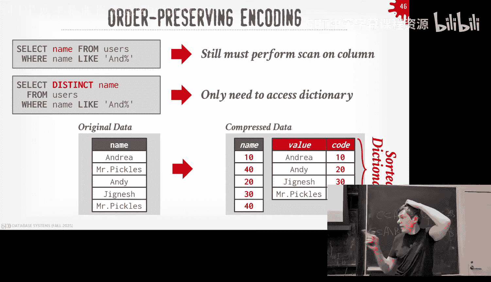

# CMU《数据库导论｜15-445 645 Intro to Database Systems (Fall 2025)》中英字幕 p06 -6-#06 - Column Stores + Database Compression (CMU Intro to Database Systems).zh -BV1bmHGzsETM_p6-

🎼别忘玩 still开心。🎼we。🎼我是你我是。🎼。right again， round of pause for DJ Cat。Glad you make it a little late。

 was busy money。Again， like， yes， your。I understand you want money a lot。

 but like focus on databases， focus on your DJS skills not just like trying to raise money all right we have a lot to cover so I want to get through everything So today again。

 before we into course material can reminder that homework2 and Project1 are out and they're both going be do in the coming weeks so homework two we do this upcoming Sunday I going turn the light sorry。

嗯。Home two will be due this Sunday coming up and then project one to be due the following week。

Those days don't match up 21st， 29th whatever whatever the Sundays are go by the Sundays the recitation for project one will be tomorrow night over zoom go check on piazza and again this will be a recorded session over zoom but if you have questions and you want live answers we encourage you to join and ask them and again this is not like shouldn't ask basic things like you know how do I compile my C plus code which should be like I've started the project and I want to understand a bit more about what this component means or what does this file means what does this class means okay so again don't treat this as like like teaching you here's how to start the very beginning of the project more like。

😡，We'll give you some high overview of what the ARC algorithm is。

 we'll go over that more detail than I did in class and some other parts of the system。

 but then if you have more detailed questions about the implementation。

 this is the opportunity to do that okay？😡，And we record it and we'll post it on the slides on box later that evening。

That's again， that's tomorrow night over Zoom， not anywhere in person。For the upcoming Davis talks。

As I said last class today and today and tomorrow are our visit Dave from all our industry friends so we have two sessions or sorry three sessions in the morning tomorrow starting at 930 everything will be in the gates gates building so you can see here again I know we asked you to select what companies you want to go visit that wasn't like a contract you're saying I'm going to meet this company at this time it was more like we want to know what your preferences and availability was so then we ran this through a stable marriage algorithm optimizer algorithm and it generated the optimal schedule that tries to meet the most people's request and demands okay。

There was one di announcement last Wednesday when we had class。

 so actually while we were presenting in class， one of these companies got acquired。

Youbody know which one it was。What that， pink cap no。The guy actually speaking。

 Joo from Singlestore while he was talking， his company got acquired by Ve Capital。😡，So as he said。

 single store has been around for a while。 It was originally called Mesqel。

 That's first how how I met these guys in like 2000。😊，2012， 2011。

 we could talk a little offline what the initial incarnation of Emm SeeA looked like。

 they had one very， very famous investor who turned out who did pretty well last week's announcement。

And that is。Ashley Kutcher。Believe it or not， Ashton Kutcher was an early investor in MemSQL or now singlelestore。

 I don't know how they met him， I don't know how he Ash Kcher even knows anything about databases。

 but this tweet is real from 10 years ago。 so yeah， congrats to those guys。

Although none of them were there anymore， right Eric Finkel left， Nikkita。

 I mentioned he left single store and went to Nen that got bought by Databricks for a billion。

 so whatever， they're fine。All right， so last class， we talked about an alternative to。

The two we wanted storage we saw before were slot of pages and we said it isn't the only way you have to store data。

 store tus in pages and we looked at mostly of the log structure storage scheme where instead of actually storing maybe in the entire tuple and every time it gets updated overr the existing Tupple。

 which is appending to these log files that get written out the disk。

 and then the background there some compaction mechanism we talked about level compaction or universal compaction to combine them together to reduce redundant information and compress the sizes。

😡，Indux organized storage with the idea was it looks basically like the slideted page approach。

 but instead of having this heat file where I'm jumping to unordered pages to find the data I'm looking for。

 I'm actually going to use a treebased data structure like a B plus tree which we'll discuss in a few weeks and traverse down to the tree to find the data I'm looking for and then in the leaf node rather than being a pointer to where the data exists in a heat page。

 it's actually the data itself。😡，My SQL in B does this。

 SQL light does this and has again each of these approaches had pros and cons。

 but ideally we saw that they were better for doing update heavy or write heavy workloads where you're ingesting a lot of new information from the outside world。

😡，Right。Most of the queries that exist in the real world though are not going to be write queries。

 Most of queries are going to be read queries or select queries。😡，And in fact。

 for certain read queries that are maybe looking at a lot of data or trying to do more complex things。

 these approaches actually are going to be terrible。😡，Even the heatfall。

' the tube oriented storage we talked about before， the slot of pages。

 that's going to be terrible for analytical queries。😡。

And the single store talk that he gave last class is actually the introduction for this class this today's lecture。

 because a lot of things he was saying that maybe didn't make any sense of why you want to use a column store。

 that's what we're going to talk about today。😡，So I'm going to briefly go over again what the singlestore guy talked about less class and talk about the different types of workloads that are out there for databases and what we and how we again see how we can design our database system to account for these design decision or these workloads and come up with more optimal schemes and then the beauty of SQL and relation relational model with the separation between the logical layer and the physical layer is that I can still expose a relational table interface to the application。

 but I'll call create table and I'll write my SQLqueries on that。

 but underneath the covers we can use one of these alternative storage models to come up with a more optimized scheme for our data to make queries run faster。

😡，And not just a little bit faster， I mean， orders a magnitude faster。And think of going like。

In the early days of Com stores， I had a friend who worked at one of the ones called Vertica。

 they told me that there was some Australian telephone company。

 they had queries that would take days。And then when they switched over to a column store system。

 which we'll talk about today， it went to like minutes and their minds were blown。

And we'll see why that's the case here， so we'll talk by different storage models。

 and then we'll talk about techniques to actually make this money faster by compressing the data。😡。

So this is a bit of a repeat of what again the single story I talked about again but I want to put it in my own words。

 there's roughly three categories of database workloads。

 there's OTP OL and last one ASAPAP or hybrid transaction processing OLTP is what people typically start with and they're building a brand new application like if you're a brand new startup you don't have any data you're going to build some kind of app that people can connect to interact with and then you'll be ingesting new data from updates from the outside world that's an OTP application you're doing you're taking new data again from the outside world but the amount of data you're taking for every single operation for every single query is is going to be small。

😡，Like think of like posting a message on Reddit， a comment on Reddit。

 like you typing in the box and hitting send。The amount of data they're storing for that one comment request is actually not that big。

 like your user name， a timestamp， and then the text field。😡。

Or think of like buying something on Amazon， you put something in your cart， that up database。

 it's like your user account information， a timestamp， the item you want to buy。

 and then the quantity， it's not that much data。😡，But we're going to do a lot of this and we want to to try this very。

 very quickly。OLAP is once you have a lot of data or existing data。

 then you want to run analytical operations on them。

 basically asking questions about that data to extract new knowledge based on the aggregate data that you have。

😡，So going back to the Amazon example。😡，All it to be would be like again。

 someone buying one item for every person buying one item that's the small amount of data per person。

 but the total amount of data that they're generating across all the orders across all people using Amazon is actually quite a lot。

😡，So then now when you want to run analytical queries， they ask。

 you can answer questions like what's the number one item bought in the city of Pittsburgh in a day this day in September when the temperature was above this degree or that degree so forth？

😡，That's an analytical query because you're asking a question about looking across multiple entities or multiple entries in the database in the tables。

😡，And so these queries are going to be more complex than we do in OTP。

 right we be joining multiple tables， doing wind and function aggregations。

 all the kind of stuff you did in homework one。 you typically see them in the。

In the OLATAP workloads。HTap of hybrid transaction analytical processing。

 this is like the holy grail for systems， but it doesn't always pan out where you want to be able to do fast transactions or do fast OT operations。

 you can just new data very quickly， but then you also want to ask questions about that data。

 where to exists in that database without slowing down the rest of the workload。😡。

Single store is trying to push this pin cap tied be is another one do this this one is can be a bit hit or miss because。

Oftentimes it isn't the best OTB system and it isn't the best OLAPP system and if you're like in a big company。

 the people that care about OTB， they want the best ones。

 they'll pick something else and the people that want the best OAPP system they'll pick something else。

😡，but this is a market segment that doesn't exist。AI is kind of separate from this and it's kind of kind of what comes after OLAP。

 so ALOAP will ask you， you can ask questions about what was this。

 what was that based on the data you have。😡，The AI stuff that's starting to come out is starting to ask questions about why things were a certain way。

 like why was this item was the bought item in Pittsburgh at this date of time。

And what aspects of it make it interesting for people and a certain demographic and so forth？😡。

Those are the kind of things AI cares about and we'll see how we handle that later on in we'll talk about vector indexes。

 but it smells an enough like OAPP that we don't have to show it as a separate category here。😡。

So a really simple qua chart to understand the distinction between these two sort of categories workloads is looking at whether the workload is right heavy versus read heavy and whether the operation of the query that you're trying to execute in the database system is going to be simple or complex and complexity is not really a scientific term or something we can measure a query in based on it's usually something like how many tables does it join。

 does it do aggregations， how many group I， how many a ntic queries？😡，RightIn order to be queries。

 they're pretty simple， like select star from table where from table users where username equals Andy。

 that you're going to get like one thing doing the lookup on an index。😡。

So you can roughly divide the workloads like this， so on one end on the bottom corner you have OTP。

 these workloads are considerably more right heavy than OLAP because again you're ingesting new data from the outside world。

 although most of the times even an OTP system， most of the operations are read queries and then the queries you're actually running are pretty simple。

 like go select Andy's record bank account information go get Andy's orders from the last year。😡。

Olas the other end up here， and the workloads are they're typically almost always read more read heavy and the queries are more complex。

😡，So OL is O2B is an older term， it goes back to like the '80s， OLAP came out of the 90s。

 it was actually invented by this very famous databaseist research church called Jim Gray。

 he won the touring Award for databases in the 1990s。

 he invented a lot of software to talk about in this class like like twopa locking and other techniques as we go along he famously he got lost at sea in 2006 when he was sailing his boat in the San Francisco Bay and he was so famous they actually moved satellites to go back over the San Francisco Bay to actually look for his body or his ship and they never found him so he's considered lost at sea。

Truth is though when he met this OAPP term， he was actually doing it on the behest of another company that was trying to sell a new product and say。

 hey look， here's a brand new category of systems called OLAPP， so he wrote a paper like hey， look。

 because there's thing called OLAP， this is why it matters and then when people found out he got paid to write the article he got retracted other than that other than that little S who I never remember he was considered a good guy though。

And then H chat will be somewhere here in the middle right again， this is not a scientific chart。

 this is trying to say you like again， how to roughly think about the different workloads。😡。

So for today's class we're going to use an example actually from Wikipedia。

 so this is actually based on the Wikipedia schema， it's open source， it's written PhP。

 they' run off MySQL， it's one of the largest MySQL clusters I think around。

 actually they might have switched to Maria Db by now when Oracle bought them。😡。

But this is roughly what the schema looks like。😡，So we're going to have a user account table。

 again that's your login information， we'll have articles or pages。😡。

For that defined like you know here's an article in Star Wars or whatever。

 and then we'll have a revisions table where we're going to put all the new versions of the pages that come along a new versions of an article。

😡，Right and what I'm showing here is actually the content is is in is inside of this table here the revisions and actually the real schema。

 they put it as a separate table right because they don't want to have a giant blob in the。

In the the page itself， but we can ignore that， but you can see here there's far and key references all around。

Wikipedia is a sore subject for me because a few years ago somebody actually wrote a Wikipedia article about me。

 but then they put this line in that I used to have my bio somewhere and said。

 I was born and raised in the streets of Baltimore。

 which is true I was born in Baltimore but obviously not in the streets。

And then Wikipedia got a flag that and says in the streets it's not scientific or unscyclyopedpedic enough and then it got flagged again it got taken down and then whatever。

 and since then I get emails basically every three months from like the scammer saying like hey。

 give us money we'll write your article for you right all right so if everybody's watching this。

 was I born in Baltimore， yes， was I born in the streets of Baltimore， no。

 right that should go without saying。Yes，S it sprays。The question is why are weparating。

 why are we making the distinction right now between OLAP and OTP？😡，At this point。

 I'm only contrasting the workloads。😡，And then we'll see how we'll design a system for those different workloads。

And then at the end of the class， we'll finish up and say， okay， well。

Do I have separate systems and if how do I get data from one to the other or can I have a single system handle both。

 so we'll cover that。 I think that'll answer your question。😡，Other questions。

me other than me being from Baltimore。Okay， so again， I said at the beginning。

 the relational model is beautiful because it says， hey this is what the data should look like。

 how to represent at a high level， doesn't say anything about how we actually store and represent that data as physical bits or bytes we're going to store on the underlying storage medium so there's nothing about the relational model that says just because you clear a table and table has these attributes that those attributes have to be stored contiguously on a disk page or in memory。

😡，In fact， we already saw that we could break that before。

 break that notion when we had the oversized values we talked about the To table or the external storage for like in Postgress。

 like if I have a really large text field， I don't store that in my slotted page。

 I have a separate page where I store that in a store pointer to it。😡。

And then now when I run queries on it， underneath the covers。

 the data is going to stitch that tool back together by following the pointer。

 but to use the application， you don't know that things have been separated。😡。

So it turns out for some workloads， particularly the OLAT workloads。

 storing things continuouslytiguously is actually going to be not the best way to do it。😡，So for OTP。

 as I said， the queries are simple and they're accessing a small amount of data。 and this again。

 this is what people normally build when they first build a new application if you' a new startup or whatever new project。

 this is what you end up building So here's some three sort of simple examples of OTP queries in the Wikipedia。

 So one is going and get the latest revision for a given page by looking about the page I So there'll be an index on page I because if it's primary key there'll be an index on that and we can do a lookup。

😡，Another one is someone actually logs in logs in， so we'll update the。

The log last login timestamp with the current timestamp。

 whatever hosting to use to login and again we'll do a look up based on the user ID。 So again。

 that'll be another index lookup that's very fast。 And the last one was is like inserting a new entry into the revision table。

 right。So if we start think contiguously for a single tuple， well， most of these que。

 all these ques here are touching。😡，Well， the bottom here touching one tuple。

 the top one can touch at least two tuupples because whatever the current page is or forgiven page。

 and then whatever the latest revision is。😡，An oh that query looks something like this where I'm trying to get the cap the number of times someone has logged in for a you know。

 logged into the service where their host aim ended with the dotgov。😡。

IP or namespace right this is actually an example from a real scandal 15 years ago where a bunch of congresspe were having their staff who are on government salaries log into Wikipedia and update the entry for the congressperson saying like look how great they are or here's them doing you charity work right so you're basically paying government employees to go put out propaganda on Wikipedia so get to use this query because this is basically the roughly of the query they did to find it。

So in this example here again， now we're not looking at a single record。

 we're not looking at one person logging in， we're looking at all the entries of logins to try to find a match here。

😡，Right。So a bunch people got buster for this， Joe Biden did this。

 Mike Pence Scott buster for this right， basically all of them are doing it。So。

The thing we haven't talked about is the storage model。😡，Which again。

 is a way we're going to physically represent data that's in our database and tables。

 and it basically tells us how we're to organize things either in memory or on disk。😡。

And as I said that。Based on the workload， the way different storage models we could use。

 it's going to have wildly different performance because it's going to panel on what the data is actually needed and how it's going to be used by the query。

😡，So there's。Two basic approaches， the N air storage model or the row storage。

 this Piwood work mis Merth， and this is what we'll be seeing in our examples。

 and then the column store one is the one we've been alluding to。

 we're actually we're going to store things instead of a row based sort as a column based and we'll see why that matters。

😡，And then the last one， this hybrid storage model or also known as packs。

This is the way most systems actually implement their column stores。

 so if a systems comes out and says yeah， we're a column store。

 they don't actually mean the second one， they're going to need this third one here。😡。

And so I'll explain what that looks like what the difference is。

So the N storage model or NSM is the academic term， but if you say I have a row store。

 this is what they mean and everyone won't understand what you're talking about。😡。

This basically says that for a given tuple in our database in a table。

 we're going to store all its attributes continuouslytiguously within a page assuming they fit we have to spill to an overflow page or oversized page that's a separate issue The idea is that all the data for given Tple are restored right next to each other within that page。

😡，And then the next tuple that we're start the page doesn't start until we finish whatever the tuole we're writing up the data for。

😡，Right。And this is going to be great for OTP workloads because。

The kind of queries we're going to run are either update queries where we need to have the whole troload update in anyway。

😡，We inserts， we're just inserting the tuple in its entirety， or our select queries are going to be。

😡，Only accessing one tuple， and oftentimes they need all the data within that tuple。

 so you want all the attributes。😡，So I'm gonna skip this go through a quick。

 but this's basically this slideted page that we store before I just I'm showing this so we see the distinction later on when we talk about the column store。

 so within our data of this page we have our header then we have the slaughter at the top and again now as we scan through down through the data we want to store up above we're just going to write it from the end to the beginning and add pointers and offsets for the different locations of the tubs and we keep going as we scan down over and over again right？

😡，So this is just rehashing from the things we talk about until you fill it up and then run that of space。

So let's go back to one of these queries on Wikipedia。

So say here I'm trying to get the user information for one account。

 so this is somebody logging in I'm going to pass in the username and then like a hash pack password I don't want to start when you see data breaches and they always say like your password got leaked because they store raw passwords unencrypted in the database。

 don't do that， do all that encryption stuff outside the application and then the database just stores the encrypted data right but this is basically the query you would run。

😡，So now for this username， I'm going to have some kind of index that I'm going to use to help me find the record ID that I want。

😡，Now I'm not going to explain what this index is， that's in two weeks when we start about indexes。

 but they think of like a hashmap or B plus3 or some data structureer says for a given username。

 here's the record ID， where to go find it。😡，And then now I'm going to my database system is going to go look in its page directory and says。

 okay， well you want record one，2，3，4， that's on page5。

 that where that's location in my database file。😡，I bring that into memory and I know how to then use that sloter array to jump to the offset that I want。

 and lo and behold， there's the tuule that I was looking for。😡，Right。And I'm happy。

And then now if I want to do an insert。AndSame thing I use some I have some free space map that says okay。

 here's a page that has free data， all I need to do is go make sure that page is in memory。

 jump to some offset and just write it out from getting again。😡。

But now let's do that OLAP query before， where we say。

 give me all the count the number times people have logged in per month from a dogov host name。😡。

So in this case here。There isn't a lookup on any single predicate I want to single primary key or discriminating key I got to look at all the pages because I don't know where any dotgov host names are going to be so I'm going to scan all the pages and I'm going to bring them in one by one again now again this is the row store so the first thing I got to do is run my where clauses where I say find me all the host namess where the end with dotgov right so I got to look at all these values in here。

😡，And then once I find matches， then I got to run my extract clauses to convert the last login into the host name sorry the month number month name so then I can then compute my aggregations so then I got to look at。

😡，You know this data over here。So what's the problem with this data？😡，areThe other three attributes。

Do this query need it？No。Do we have to read it from disk and put it into memory？Yes。

So because this is a row store， whatever is attached to the query。

 whatever comms attributes a query or sorry TupL has。

 they come along from thery because they're in the page with all the other data that I do need。😡。

Right。So in this case here， I'm not showing the size of the data， but like。

WeRough say about over 50% of the data that we needed。Sorry。

 50% of the data for a TL was actually not needed for this query at all。

 but I still had to go to disk and go read it。😡，So this is why row stars aren't going to be great for doing analytical queries because most of time analytical queries。

 I don't need all the attributes， you don't see select star queries in analytical queries very often。

😡，Because a local worklets right， shouldn you shouldn't run select star anyway。

 but in general you don't really see that unless someone's trying to do a bulk export。

 and even then there's faster ways to do that than select star。😡，So for the row stores。

 it can be great for fast inserts， updates and deletes。

 it's great for queries that need the entire tubbal。

 I need all of the attributes for a small number of tubs。😡。

And I can do a bunch of tricks like the index organized storage。

 all the clustering techniques we'll call later on to make this go really。

 really fast that I'm only reading the exact single page I need to go get the data that I want。😡。

There's other tricks you can put a bunch of data in the index as well。

 so maybe I only need to traverse the index， even if I'm not using index organized storage and all my data is in the index。

 I don't even need to touch the tubs。😡，We'll cover that later。

This would be bad for analytical queries because we'll have a lot more pressure in our buffer pool because now we're copying pages with data that we don't even need for this particular query。

😡，The alternative is the decomposition storage model。

 you think of like two opposite ends of the spectrum， so the n area or the row storage。

 like putting all the data for a tubal conency each other。😡。

In a decom sessionession storage model is the academic name or the column store。

 we're actually going to split up all the data for each tuole and store their attributes separately。

😡，But now we within our pages， we're just going to have the data for one accurate within the table。

 all of those are going to be contiguous。😡，Across multiple tus。

So this can be better for analytical queries because the。

If I'm only going to access a small number of the attributes for a given TL。

 I don't bring in pages that have data that I don't need， I only get exactly the data that I do need。

😡，Of course now what's the challenge of this， what's the problem， faster reads， low for what？😡。

Rights， because what do I need to do if I insert a Tple。

 I have1 thousand columns and I got to break it up to100 different pieces and write out to write 1 thousand different pages。

😡，And again he was sort of asking about this， we'll see how to handle that later in today's lecture。

So let's go back to our table here before。😡，So we're going to store the。

 essentially all the data within each column are going to be fixed length。

Fick lengths value is stored in basically simple arrays。So I'm going to take this first column A。

 I'll have my first page， there'll be some header that says what's in the page。😡。

And then I'll have a null bit mapap that's going to correspond to all the data my within this column for all the tus right remember in the rose storage model every tuple had its own header inside that own header it had its own little bitm to say whether the values where certain values are null or not so now I don't need to store a header per tuple。

😡，I just have a header for the single column and that's enough to account for all the data within this。

😡，And I'll do the same thing for the next column and then the same thing for the next column， right？

So we go back now to our example before， so we take our Wikipedia data we had right for the login information。

 the user information。😡，And again insteadoring as a rowtor where all of the data that's contiguously contiguous across the TL。

 we're now going to split it up so that all the host name data will be one page。

 all the login information would be another page， all the password information would be another page right but now they're all separate pages。

😡，So now if I run that query before， again， I'm trying to find old people logging in with the government host name。

So the first thing we need to do is look， okay， I got to run this wear clauses here and I need to look up on the host name attribute。

😡，So I just go get the one page or the set of pages that have that host name information。😡。

Go bring that into memory in my buffer pool and then rip through that and find all my matches。Again。

 I'm not jumping over data that I don't need， I'm not jumping over username information or the user ID。

 the pages I'm bringing in only have the host name。😡。

So I can do that very efficiently and rip through that very fast。

So then I collect what tuups match my predicate and say， okay。

 well the next thing I'm going to do is run the aggregation。

 commit the aggregation and run the extract function， that's on the last login attribute。

 so I go fetch that page that has that information。😡。

And then now I know how to then jump into these different offsets。

 I'll explain how to do this in a second to find the data that I know match my host name from the wear clauses。

😡，And then here's all the tubs that I wanted。Yes。Does this mean that the rate size in this。便ビ？

This question is， does this mean the page sizes in this scheme or the storage model will be different。

 different per attribute， different per page itself of what do you mean？😡，那个。说的。高的。嗯哼。😊，在这一。知か。He。

How was发。ない。One problem is a single character， and the other problem is。呃全社会管理和社户管理。这啥个。

He's asking basically， he's asking。Would it be the case the database page size for an attribute within a table will be different across attributes。

 no？😡，It always needs some fixed size because it has to be because we want to put that in our buffer pool for our bufferuff pool has you know8 kilo frames。

 actually in the old light world you want to go bigger。 So like 32 MBbys frames。

 I don't want to have to start figuring out how to pack things in from different page sizes。

 So in general， these will all be the same page size。 Now that means， of course。😡。

Some attributes will have more pages and that's fine yeah。😡。

So how do I do this magic going back here， how do I figure out what tuups actually are matching based on the predicate？

😡，Well， there's two basic ways to do this。😡，One is use fixed length offset sets where you you know that like if I'm scanning through the data and I find matches for my wear clauses I keep track of where my offset is in the array so I'm at to offset two offset five offset six。

 so then now when I go look at another。😡，Another attribute， I look at its pages again。

 it's just an array。All the values of fixed length。

 I knew how to do simple arithmetic to jump to the offset。😡。

That I want to have the corresponding people that matched whatever the previous operation was。

The other approach is you actually embed two IDs。In in the columns themselves。

 so I think of like for every single value， I have like a little eight bit or maybe 16 bit。Tupple ID。

So that then I have some kind of other index that allows me to jump to find the data that I'm looking for。

 So these can be variable length that they want to do， but these things always be。

 I would have an index map to this。I'm only showing the second one here just to say like。

 you could do this， some people， somebody did try to do this。

Don't do this this is what data Lero did， they basically took Ingress in the this 2000s。

 kind of hacked it up， make it look like a column store。

 but because it was a roast start on a true column store。

 they had to play this game to make it actually work。

And then Microsoft bought them for like $200 million， and then within three months。

 they realized that was a huge waste of money and threw all the code away and started building the parallel data warehouse as a real comp store。

Actually that was Jgnesssh Patels， the other Davis professor that was his advisor， Dave DeWtt。

 Microsoft hired him to go take the guys that were doing this and they could actually be production ready and he's like this is total crap and he told he told them that you're wasing your money and they threw it all away so don't do this just showing you could do this We want to do this one over here。

But now the question is going to be， okay， well， it only works if things at fixed length。😡。

For integers， that's fine， floats fixed length fine。why is it to have question is Why invented ideas。

ca now I have to store an extra number。For every single value of them I'm actually stor。

 then I need to maintain a separate index in my file that says here's how to jump to offset three because these things can be whatever arbitrary length that they want to be。

😡，Sorry， criminal index to the where to jump。 Why do you need to write the。

Because because if I'm doing a match， if I'm scanning through， say column D and I find a match。

 I'm scanning through the column， I find a match here， I need to know， okay。

 well this is three so that when I jump over to a column A， I know how to get the three。😡。

A me it' just the twos back together。😡，Don't do this。All right， so again。

 if we require all the values in our colon be fixed length， how does this work we have strings？😡。

Well， we'll cover more about this in a few more slides， but the basic metric trick is。

We're going to compress the data to cover anything that is variable length to fix length so we don't have this problem。

😡，So that means any string。Is going to be converted to a fixed length number。😡。

And then we'll have basically a dictionary look up to say。

 okay for this number what's the original value so we can store that as an auxiliary data structure on the side。

 but then as we ripped through our columns，😡，We're only looking integers and that's me way faster。

The alternative is you could just pad out the strings。Like if it's a  32 character barchar。

 just always put a bunch extra spaces at the end if it's not 32 characters， so it always fits。

But that's going to be wasteful as well。Instead the answer is going to be dictionary compression。

 again， we'll cover more about that in a few more slides。😡，So to the DSM the summarize it。

 the benefit we're going to get is that we' going to avoid wasted IO because we're only going to get the bare minimum and data we actually need to process the query。

 we're going to bring that in。😡，And not bring in any other attributes that we don't care about。

The queries themselves are actually execute faster because now as we're ripping through the columns。

😡，Where Ka is looking at continuous data like as strides in memory。

 and that's be great for modern CPUs。 I know we say we're going to talk about CPUs too much。

 but like。Intel CPUs or modern superscaled CPUs， they don't want any branches。

 they don't want any jumps， so if I can avoid if clauses I can have to jump over things。

 my CPU is going to be way faster because I'm not going to have stalls in my pipeline。😡。

So if all my data now is all contiguous and it's all in the same value domain。

 like I'm just looking at integers。😡，Then I can rip through that very。

 very quickly and we'll see how we handle that in lecture 14。😡，Furthermore。

 I can actually compress the data much better that can in a row store because now all the data within a page are going to be in the same domain。

😡，It's going to be like think of like if I'm recording the temperature for this room。

 but I just have my data pages to just record temperatures， there are a bunch of integers。

 I can compress the hell of that way better than I could if it had integers and strings and floats and bunch of random stuff。

😡，Like it's thinking of like trying to compress a JPEG doesn't if you try to run JPEG a JPG through like GZep or whatever。

 doesn't do a very good job because it's kind of a bunch of random data that's already being compressed。

😡，But if you open a text file and put a bunch of zeros in it and run that through GZip。

 this can compress the hell out of it。😡，That's basically what we're going to get with our column storm。

Of course， nothing's for free to be slow for point queries。

 doing single two of lookups because now' got to stitch all the data back together from multiple pages。

 Ins up deletes are going to have the same problem because you basically have to do this stitching and splitting over and over again。

😡，Okay。Any question about calm stories？So。This is going to be great for again。

 if we have queries on tables that are very wide meaning we have a lot of columns and I'm only need to touch a bare minimum number of attributes within within that table best case scenario is an OAP query that touches one column right but truthly told they're not that。

😡，Those kind of ques are not that common。And so at some point I'm going have to stitch my tuple back together。

 and so if my data is completely broken apart across multiple pages。

 if I break everything up as columns，😡，Then even though I may filter out a lot of data during the queries。

 I have a billion tuupples， but I end up only needing 1 thousand00 tus。

 I may have to go get all those thousand for each tu。

10 different pages to put that tuple back together。😡，Again。

 that's if I break everything up as as the column store。😡。

So what we really want is something that kind of smells like a column story。

 we get that benefit of not bringing in pages that we don't need or looking at data that we don't need and the data that is in the same column or the same attribute is close to each other so we get great compression。

😡，But if I got to go get data from the other attributes for that tub bowl， they're close by。

 relatively close by， where I can go， either already freshmen in memory。

 or it's not a big leap for me to go get them。😡，So this is what the hybrid storage approach storage model called PACX sports。

 so PAC stands for partition attribute Reach Cross。😡。

This was actually as the paper came out and then  2001， the first author is Natasa Alammaki。

 she was the database professor here at CMU before I started and then she left for Switzerland。

 she left for Switzerland in 2007 and then I was hired to replace her so this claims the paper looks like it was came from CMU。

 but this actually wasn't the last chapter her thesis she did at the University of Wisconsin with Dave Dewitt the guy who said I just told you that told Microsoft they wasted 200 million buying that company。

 so he was her advisor， he's brilliant。so this approach basically is the idea is that it's going to look like a column store。

 but the data that the data for a single tuple is going close enough to each other。

 so that I don't have to make a very long I may have already have brought that data into memory。

 even though I may not need it all of it。😡，So again。

 so most systems when they say they're going to use a column store almost 99% of the time。

 they're doing this。😡，I can only think of one or two systems that don't do this but everyone else to do this and then's these open source file formats like parquet and OrRC that you might be familiar with and now there's modern versions of these like nimble from Facebook or vortex from spiral D guys where these are essentially doing this。

😡，So if we go back to our diagram here， again， so what we're going now going to do we're going to go into horizontally partition or horizontally split up the data。

😡，Based on some criteria like the number of tus or the size of the data， there's some way to say。

 okay， here's going to be some chunk of data。😡，Or sorry some region of datum。😡。

And then now we're going to then write them out within that region to be a single column store in a columnar format。

 but again， within that sort of region， all the data for a single tube will be located close to each other。

😡，So when you create this Pa file， you end up writing the header at the end。😡。

And we're going to do this because think of like we're trying to generate a one gigabyte file so I don't actually know what all the data is going to be and before I actually scan it。

 so I'll keep track of things in memory and then when I'm finished I write out the footer that has all this metadata so I'm showing it showing it appearing first is actually the last thing you would write when you create one of these files。

😡，So first thing again， I'll break up the the first three tus I'll put in some chunk。

 I don't want to call it a block of data trying to use generic terms and in parquet they call them a row group that's considered the canonical term basically it again it's just some set of tuples I'm going to put together in the single I don't again I't want to word cluster in a single region within the file again in parquet it's like I think it's like 1 million tuples in org it's like by default like 100 megs of data there's different criteria to decide how you partition these things up。

😡，So again， within now my row group， I'll have this another header that says here's all the data within it and then within the inside of it。

 you'll see I put all the data for attribute the column A together。

 all the data for column B together， and all the data from column C。😡。

And I'll call sort of these column pieces within the row group。

 we call these they called column chunks。😡，And then I'll do the same thing for the next one right and each row group that's going to have their own again metadata keeps track of like I'm compressing this way or here's the dictionary you can use to depress this data。

 right？😡，So if you go look at like any presentation from Databricks or snowflake or other companies。

 when they talk about parkquet organization， it's roughly going to look like this and they're been talking about packs。

😡， is this clear？So again， don't think of these as in the OGB world where we talked about like the page sizes。

 it was always some multiple four， like 4 kilobyte， a kilobyte，16 kilobyte pages in the OB world。

 I'm reading large amounts of data， so it's usually these things are like organized in the size of like S3 buckets。

 like eight megabytes are larger where I'm trying to get a lot of data all at once。😡。

And so even though I'm saying this row group here might be kind of big。

 much larger than 48 kilobytes。Um， and maybe I'm bringing in data that I don't actually need。

 it's still going to be a big win if I had to stitch things together。我本在你能没有。

The question is what goes into deciding what the number of rows in a column chunk。

 maybe it's not of rows in a row group， I said like。😡。

The default in a parquet is like either parquet is like 1 million and it's just whatever they picked it。

 and then I think or it goes by like data size， so as I'm writing it out if I wrote out like 100 megs they say okay。

 that's it， make a new real group。😡，But you can tweak those。The biggest case for。这个是应该。

The bad idea of studying the room the phone numbers with the itself， Yes because was a lot of yes。

Doing the same thing or ever after。St is your statement is like the row group metadata is wasteful。

这最先大家。His statement is that the metadata across row groups could be repetitive though we have a lot of wasted data。

😡，For dictionaries， yes。But the metadata is not that big compared to the rest of the data。

 like if it's a kilobyte and your data is like 100 megabytes， it's nothing。Yes。Yeah okay。

 the statement is and it's correct， this is my fault。

 so I'm saying this is a PAX file organization it is not page organization。😡，啊。Yeah。

 so so you could think of like。Here's's like a here's a file and then within that I have different pages and those pages will all be sort of fixed length right within within the row group。

 the metadata stuff at the bottom is usually whatever the size is。

 but you might still organize that in four kilote pages， but yeah you think it like。😡。

I'm not defining what the size of the pages are within a column chunk within a row group but。😡。

The end of the day， when it lands on dis， it's still going to be 4 kilobytes。

 but the database might perceive it as I like eight megabyte or 1 megabytes or something like that。

Like a larger size。Its everything is， you always send splitlining pages。Yes。

But the way typically in a parquet file systems address it。😡，It would be at the row group level。

So then you you have to read the real group header because that's least going to tell you what the offsets are for the column chunks so you can do things like。

😡，If I only need column A from this row group I could go read this。

 that's tells me where the starting point is for each row group。

 and then I could jump to get the header for that row group and within that I can then get the offset to the column chunk that I want。

😡，You could store that down here， but that makes this thing kind of bigger。😡。

Now we're getting implementation details， but in case like parquet this is implemented as protobuff and protobouff you can't deserilize incrementally it deilize the whole thing so if I have all my metadata inside this and this thing's like 10 megabytes I got to decompress 10 me even though I only only like 10 bytes out of it。

😡，But that's in the weeds。And if the newer file formats replace prototype buff of flat buffers from Google。

 that's the right way to do it。😡，Okay。All right， so let's try to plow through compression real quickly。

The end of the day， the IO bottlettleneck for this class here。

 what we're talking about in this semester， the IO bottleneck is always me so the IO cost is always the main bottleneck when we actually want to run queries。

😡，In the advanced class， we'll start worry about cache lines and other things， but for this class。

 we'll assume it's always disk， right？And especially if you're running in the cloud and the disc is like some box running over the network。

 that can get slow and again， that's going to be a problem。

So what we want to be able to do is that we want to compress our pages。😡。

When we write them out the disk so that when we read them back in compressed form。

 the amount of useful data we're getting from one IO increases。😡，So if like a page is uncompressed。

 and I can put 10 tus in it。But if I can compress it and I can put 100 tus in it。

 now for the same IO with compressed data I can get 1002s and bring them memory now I have I have the space for it for memory to deal with it。

 in some cases you actually don't need to decompress it and we'll see how to handle that but the main tradeoff we're going to face here is sort of classic computer science where it be speed versus or computer versus storage。

😡，So I can pay more CPU costs to compress my data and decompress it when I need to access it in exchange for having a lower storage overhead and lower IO cost to get data in and out。

😡，So the things we're going to want in our compression scheme in our data system is number one。

 we have to make sure that our values or target compression scheme always can produce fixed length values because we need that in order for the offset mechanism to work to address two within a column because if now if I'm taking like 30Git editors and I compress them and now they're like summer 16 bits。

 some 24 bits， I have no way to know how to jump to offset 1，23。😡。

Toefine the data that I'm looking for。😡，I got to then use an index and I don't want to have to do that。

😡，So all that data needs to fix length， ver length data were it stores as a separate pages or a separate storage pool。

 and that we can run whatever compression scheme you want on that and let that be ver length。

 we don't care about that。😡，Not entirely true， but for our class， yes。

Another we want to be able to do is。Pospone when we actually have to decompressed data in order to be able to use it or give it back to the user as part result of the query。

😡，So that means that we want to be able to run queries directly on compressed data。😡。

And then not have to decompress it to figure out what's actually inside that compressed data。😡。

And the last one should be sort of obvious， but that we want to make sure that whatever compression scheme we're using is considered lossless。

😡，What does that mean？Like lossy versus lossless， yes。He said。

 basically if you compress data and then you decompress it， I get the exact same data back。

 I get the exact same bits， that's considered a lossless scheme。😡。

A loss scheme would be something like MP4， MP3， I could take a video file or a sound file and compress that in such a way that it's not perceptible as humans either through our eyes or through our ears because we can't detect without things that are throwing away。

😡，But it's not an exact copy of the data we have before。

 so we don't want to do any loss seat compression， we only do loss lists。😡。

You can do lossy compression on data systems， but this is something a human has to tell us to do。

So an example I always like to use is， say I'm recording the temperature in this room at one second granularity for an entire year。

😡，But maybe a year from now， I don't need to have know exactly what is the temperature at this time。

 this exact moment at this given second， I maybe can bucket the data within 10 minute aggregations。😡。

So if I do that and delete the one second data， that's a lossy scheme because now I'm throwing away the original data。

 but for my use case， that might be good enough。😡，So data businesses will do lossy compression for you。

 but you have to tell it you want to do that。😡，There's even other techniques where you can actually keep the data in its original form。

 but then run lossy algorithms on them to compute queries called approximate query execution。

 you get estimates of things sometimes it give you bounds， but again。

 we'll worry about that later for this class this lecture today we can't lose data。😡。

So there's four different choices we have to compress things the first of the block level at the page level we're basically's taking a page of data and we're going to compress it the tuupple level were going to take the entire tuple itself and compress that and you can only really do this in a column store the attribute would take a single value within a single column for a single tuple we'll compress that individually we saw that before with the overflow pages for like large large bararchars and text fields like Postgres we'll start in this thing called the To separate pages that then runs like GZip on that and compresses that but it's only do that for a single attribute。

😡，And the last one is going to be columnar compression。

 and then we'll spend most of our time on that， but that will get the biggest win if for' using DSM or PAs。

😡，So pretty much every system today that that's using a column store is going to give you use this bottom one。

 the subs substancesance will give you the third one， the second one is pretty rare。

 I know with one system out a China called Terarchk， they got bought by B dance。😡。

And the guy was unhappy with having at Bite dance and he has a new startup。

 I forget what it's called， but they could do tub a level compression。

 his website has him complaining about a parking ticket or something。

 it's in Chinese I can't read it， but I can post it on Piazza and then Block level we'll talk about it real quickly。

 this is rare， but to me this is interesting too。So for this。

 we're going to use what I'll call a naive compression scheme or a general purpose where it's pick your off the shelflf favorite algorithm。

 G zipip， Z standard， LZ4， snappy， whatever， just take your block of data。

 run through the correction scheme and you get a compressed block out and it's me variable length and we'll have to account for that in a second but the。

😡，In general， this is going to be just take whatever data you want and throw at it， right？Oracle。

 of course， has their own compression scheme that's patents and nobody else can use it called OZP。😡。

But again， the trade off is going to be， as any compression scheme is how fast we can encode and decode and how good our compression scheme is going to be。

😡，So let me show what My SQL does with the inner B， so with My SQL you have compressed pages on disk。

😡，And these are going to be at some multiple the size of these pages it be some multiple of eight。

 by default entity these is 16 kilobyte page sizes。

 but if you compress them it'll be within one of these ranges so if it's like if you compress your page and it's like  900 bytes。

 they'll just pad it up and round it up to be 1 kilobyte right pick whatever the greatest size is。😡。

And then on top of every page and the header， there's this thing called the mod log where it's like the right ahead log where you're going to record any changes that you make to the page。

 but that you haven't applied to because you wanted to keep the data compressed。😡。

So now if I go need to access a page， I like before my buffer pull goes out or the disc scheduler。

 goes out and gets it from disk， brings it into memory， and it starts off in compressed form。😡。

So now if I have a right operation that wants to make a change to a toolbo that's in the compressed page。

 assuming I have an index to tell me how to get there。😡，Then in some cases。

 I don't actually have to decompress the data。Like。

 if I'm updating the login field for someone log in on Wikipedia。

 I don't need to know what the old value was in order to make make that right。

 I just overwr whatever the old one was。 So I can put a log record in the mod。 the mod portion says。

 hey， for this tuple。😡，Update it with this new value for this attribute。

 I can do much of my right to my modello。 at some point。

 the modello gets full and I'll have to decompress it and apply the changes。 But for some。

 some change， for some updates， I don't have to。😡，But now if I want to do a read， if it's sorry yes。

😡，好多。It's， it's the right head long， or so it's the。Remember how the LSM。

 we just had these records that update this， put that right same thing。

Right ahead log as we'll cover this later yeah it's basically the operations they are operations that change the data。

😡，Yes， so does the only exist when we have a storage or could you also have a the question is does a mod log exist only if you have log storage。

 no， interviewby is not log log storage， but it has it here its and we'll see this game when we talk about like a Delta store like it's a common approach where you have。

You have like an area where we can put fast ins of changes that actually may be applying to them to the data because it's really fast to do that and then you have some background process fix it up that's a common approach in systems。

😡，Yes， so the model cannot exceed like the current。Level size but the presentation。I。

You said the word level， I want don't think of log structure storage。

 just think of like every page has its own mono log。

And I could put changes in there and at some point if the model log is full。

 I had to decompress and apply them and clear out the model。

It's just a way to absorb updates to a page if I can， without how to decompress it。😡。

Is this possible to install some like。喂喂我。The question is well this stall write so I have to write the model log to apply the modello。

 absolutely yes， no free lunch， yeah。All right， yes。The modelwater store on。Yes。

Quest is is Mo sting disk， Yes， I want to keep this data press as long as I can。

 So if I'm going to flush it out， write out the disk。😡，Without applying the changes。

 I'll go ahead and do that。哎，完了。二。So now if I have to do a read。

 if the read is like go get me for this tuple， like my example。

 I was updating that login field I just do a blind write without actually reading the data if the read can be serviced by the mod log fantastic I just access that there。

 but if I had to actually look what the values are inside the Tple， then I decompress it。😡。

Ply whatever changes I have my mob log I when I decompress it。

 it's always going to end up be 16 kilobytes because that's the default size in innerDv。

 applyly my changes to my mob log， still keep the compressed version around。😡。

Because if I didn't make any changes， maybe I I don't want to like if there was no model updates supply。

 then why。Then I can just always start it away if I need to free a page， but the idea is again。

 if I had to know something what's inside of it， then I'd unpressed it， yes。😡。

Is ever possible to have a。认为。The see you want。丢上。We just。さ？His question is。

Is there a way to have the compressed page？😡，Only compress the data that you need so in this scheme of my SQL no。

😡，That would be choice number two， the twople level compression。 Like I said。

 there's only one system that does that。 It's you basically want to have。

You want to be able to do incremental decompression。G Zip snappy。

 all those guys can't do that right you you have to sort of decompress the whole stream to jump to send anyone else there are algorithms to do that that you level one that tarrac one is the only one that I know that actually did that。

I don't think anybody else does。I can hold up， hold up， SQL server can do it too。

 but I forget how they do it。And I don't know where to get loan by default。

 and I don't think they say how they do it SQL Ser in this fork ofbox Db called Terro。

I can follow on Piazza with links to that。All right I don't spend too much time on this because it's my SQL and they're the ones that do it。

 it just say like if you want to run snappy GsU， this is how roughly you could do it and actually I actually think this is a good idea。

 Postgres can't do this。Pogreds can't do any compression except for those toast tables。

 those separate overflow attributes。还。All right， so the big thing to point out is in this case here。

 the compression algorithm we're using， whether it's GSIP or snappy or G standard。

 it's considered no pick box to the database system。😡，Meaning I have bunch of compressed bytes。

The data system doesn't know anything about what those bytes actually mean。

 the only way you can get back to the original data is if it runs the decoder。

 runs the decompression algorithm to put it back into its original form。😡，Right。

The compression scheme also don't understand the high low meaning or semantics of the data。

 so it doesn't know like it should put maybe pack certain pages together and compress them because they're going to be related to each other so it just says。

 here's the data you want to compress， go for it and here's the output， right？😡。

So what we really want to be able to do。Is have days that be able to operate on compressed data without decompressing it。

😡，So this is a high low example， I'll show you how do it in a second， but the basic idea is this。

 say I have a simple table with names and salaries。

 I want to run some compression algorithm and convert this data to compressed form。😡。

I'm showing this with two tus because it fits in PowerPoint， always thinking extremes。

 sort of vibertrollion tus。I can store this now in much。

 much less space than I would if I was uncompressed。

The Nava my query shows up select star from users where name equals Andy。😡。

I'm not saying I'm going to say how I'm going to do this yet。

 what what I want to be able to do is convert whatever constant I'm doing a look up on for a given tuupple like name equals Andy。

 somehow convert that into his compressed form。😡，So now when I do my comparison。

 instead of comparing two strings， does Andy equal Andy does and equalnesh。

 I'm taking whatever this Xxx thing， assuming it's like a integer or something。

 and now I'm doing a faster comparison on those。😡，And if I'm doing inte comparisons。

 there's instructions on CPUs to do that really really fast versus like having to jump up over bytes to do string matching。

So this is the goal， this is what we want to be able to do， and because we're the database system。

 we can control everything， we can do this where it's like an off the shelf compression scheme can't do that。

😡，Even though they're actually going to be doing a lot of the same techniques that I'm going to talk about here in a second。

 like G Zip and S snappy， they're basically doing the same thing。

 they don't expose any of that to you on the outside， so they're doing dictionary and coding。

 but they don't expose the dictionary to you so that you can then do more fine grain lookups。😡。

So going back here， we're going to be doing this again in the column store because now that our data within a single attribute is all contuous to each other。

 they're all thinking being the same value domain， meaning we see a lot of repeated values。

 a lot of values that are very close to each other， and we exploit that in our algorithms。😡。

So here's a rough smattering of the main compression schemes and I'll go through these one by one you know obviously the usefulness of these depends on the data set depends on the workload。

 in general the dictionary encoding one is going to be the most common like I think orc they dictionary encode everything in their files。

😡，And obviously for Var length need is， but a lot of these other ones。

 if they can fit the domain you're trying to work in， you can get a big win。

 much better than with dctiontary encoding。😡，So run like coding RLE is when you have repeated values。

😡，Within a column， so instead of storing that value open over again and repeating it。

 we're just going to store， hey， I have this value。

 I'm at this offset within my column and then here how many times it's been repeated。😡。

And I'll just that triplet in succession rather than the original values over and over again。😡。

So obviously to make this work， you got to sort your data in such a way that you can exploit this because otherwise you may end up ballooning the size of the compressed data。

😡，So let's say I have a really simple table that has some people information where I have some ID of the person and then a flag to say whether they're dead or not like a Boolean flag。

 yes or no。So as you can see in this Boolean flag here is dead。I'm having a lot of repeated values。

So what I can do is now instead of storing the original value over and over again。

 I'll restore some value， what offset I'm in because that's going to help me jump around if I need to find for a match at a given an offset and then the length of the run。

😡，So if I have queries like this， select the number of people that are dead and the number of people that are alive。

 I can just operate directly on this is dead part here in compressed form and compute that very。

 very efficiently。😡，Wherese now the challenge is going to be I have alternating values。

 so here we have no followed by yes followed by no。

 so that's the worst case scenario for us because now the size of the run is one for those three tuples or three values。

😡，And the size of the compressed data is actually larger than the original data。😡。

So if I sort the table based on the column I want to compress。

 and I got to update all the other columns because I make sure my offsets match now going across horizontally。

😡，Now you see I have all the yeses followed by all the nos and now you can store this column as a single or just two values。

😡，Right。So again， I'm only showing what nine tus here thinking in trillions or billions。

 this will be a huge， huge win。😡，And we'll see in a second。

 we can combine RLE with other compression schemes。

 like these things are actually multi complicatedicative。

 I can compress in one form and then compress that again on another form， yes。😡，在那时间后。有啊。

St is doesn't this mess up， I don't want to have my two ID， is actually this is not an internal ID。

 this is like the applications I have this column called ID。😡。

Theres like the Social Security number email address， I'm just showing ID as a simple number。

All the other columns have be sorted based on whatever the columns you're sorting on。😡。

This might be only good for one of the。Correct， and he's right。

 this might be good for one of the columns， but suck for the elements， absolutely yes。😡。

So how do you pick what the best Sony scheme is？And be hard。All right， next one is bitpacking。

So again， in SQL， you call Catetable， you say these are the comms I have you had to define the data type for them。

😡，And oftentimes people declare things to be much larger than they actually need。

 like I have like an age column。I'll define that as an integer。

 that's a 32 bit integer or4 by integer in SQL， but if most of my values aren't going to be hitting up the max size of our 30 bit integer。

 I got a bunch of weightted space st much as zeros that don't mean anything for the twoples。

 but because they declare it to be 30 bits， I'm going to start 32 bits。😡。

So if the database system can recognize that you've oversubscribed or over allocatelocated the size the amount of storage space for your data。

 they can actually throw things away so if I'm storing all these values here as again as 3Git integers。

 you see we have these the visual size2 to bits， but the only data that matters is this side over here。

 everything on this side is all wasted in space with much of zeros。😡，So with bit packing。

 you basically say， I'm going to store this in a compressed form。

 throw away those other 24 bits and only store the eight bits that actually matter。😡。

And now we get this down for this example here， we go from 2 to6 bits to 64 bits。

With no loss precision。And they're all fixed length because they're all aI integers so I can easily jump to whatever the all it is that I need for a given Tple。

😡，What is the challenge with this？What if someone comes along and inserts a value now that isn't just eight bits。

s something larger？😡，So this is called patching or if you're using Amazon Redshship。

 they call this mostly encoding， and the idea here is that most of the values are going to be stored。

 I can bitpack into a smaller form， but for the outliers that are maybe too big。

 I just have a little special marker to say， all right this value is actually not in line here with the rest of the values。

 go jump to some patch table that will'll tell you what the real value should be。😡。

So if I add this large number 999999， it doesn't fit within8 bits。

 I'll store everything else as eight bits and again in red shape you call it's mostly eight and then I have this patch table here that says if you scan along and find this bit sequence Xxx like think of all the bits or set true or one。

 then I know that offset， I go look up in this table and I find what the original value is。😡。

So in this case here， instead of storing these this as26 bits， I store all my values as eight bits。

 but then I had that lookup table which I can get down to maybe just 48 bits to store that。😡，Yes。简单协。

This question is how do I differentiate between a value that's a Sinel to say go look at the patch table where the original value。

 so for that one you just if you set all the bits to one， then you can't let anything be that value。

 you have that be special case。😡，あですね。他问来的。Correct。

 statement and he's correct if you had a value that was actually that special case。

 then you have the store in the patch table， yes。😡，But the tricky you can also do is like。

And here I'm showing offset 3，999， but if you have that repeated value。

 that's the sentinel value over and over again， you don't need to store that once in the patch table and you reuse the entry。

😡，So it's not like you need to restore that repeatedly。😡，How you heard the offsets。

 just a fixed length array？Okay， bitnap and coding for this one instead of storing the actual value themselves。

We're going to store for every unique value you have in your domain。

 we're to maintain a bitmap for it。And then you have a one set within that bitm at an offset。

 whether the value at the two of that offset is that value within your bitmap。😡。

I'm going to kind of quickly only have 10 minutes left。

 but this would be fantastic if the cardinality of the value is low。

 meaning the number of unique values it's going to have for a given attribute is low。😡。

Like Mike one example， is dead， yes， no， like anybody's either dead or not dead。

 like there's only two possible choices and this can going to work really great for that。

So we go back to this is dead yes no， so I'll maintain one bit map for my yeses， one bit map for nos。

 and as you see at the different offsets， it's all going be1 or zero in either one。😡，Right。

And then now if I。If I run my queries， I can just rip through find me all the matches where somebody's dead。

 I only need to scan through the isDe yes column， and I don't need to look at the other bitmap。😡。

So original sizes was 64 bits， assuming I can store these instead of yes。

 no as a single bits and get give this down to 16 bits。 Yes。

 where would you ever do that like is it inbitter to do just sort of one bit that's a zero。

The question is why would you ever want to do this with the better the story is dead？In this example。

 yes， even if there's more unique batteries better stored with like one number basic。

Rather than a bunch of。This question is。If there's four unique values then you just need values basically should you do like something like R Eliish。

Like you say't do RleE or there's basically store like if I have。Yeah。

 the statement is could you represent the bit sequence as there's a numbers or the number yes。

 for two columns I'm trying to show you an example example。

 yes but I just reason this would ever be a good idea。So question。

 why would this ever be a good idea？Well， if the thing you're storing isn't binary。Well。

 because you're basically103。Yeah yes， so like， is't it always smaller to just have like one small integer or like zero means of value。

 one means of value  two means of value and then sort this directly instead of having the loan。

Sportse。His question is， is it better to？Isn't it better to have a small number represent？

A value within my commatronnic oppress rather than do one hot encoding。Well， no， because I can do。

 I can rip through bit maps very， very quickly， much faster than I can rip through integer。

Right find me all the， find me all the simple example here， find me all the。😡。

This is it's not good because I could store it as dead as as as in a bitmap column so youre saying it's easier to compare one bit。

😡，Correct， yes， because there's a much bit shifting tricks I can do in modern CPUs that like I can take in a whole vector bits and then single instruction。

 find all the matches versus like integer it would take a lot more。😡。

Your statement is bitmap would be faster yet for aggregation。 Yes again my example here， yes， no。

 it's binary。 So you could just store just this array here would or this array here would be the same thing as storing is dead I'm showing two examples because it's on PowerPoint。

 but if you have more。😡，It would not be a good idea。All right。

Let me quickly show why it's the bad idea because if you have a lot of columns， sorry。

 a lot of unique values like the number zip codes， then the storage space。

 you just do the naive scheme would be terrible。So you don't want to bitm and code everything There are tricks to compress this further using roaring bit mapps。

 we don't have time to cover that just think of like compressed bit mapps for it's a a way to compress sparse bit mapps I have a bunch of zeros roaring bit mapps the right way to do that and a bunch of systems use that。

😡，All right let me get through the last two compression schemes is Dltaco and dictionary compression so Delta coding idea is that if I'm storing values that are very close to each other repeatedly。

 then I don't need to store the actual absolute value for each of those measurements or whatever I'm trying to record。

 I destroy a diF or Dlta。😡，From either the previous value or some global value at the top beginning of the page。

😡，And then now the delta I'm storing is me much less than storing the full value。 So again。

 if I'm storing the temperature in this room at a one minute granularity and it's hopefully not this room。

9 not to be a lot， but like。If I'm recording over and again the same temperature over again。

 there aren going be wall fluctuations in the temperature from one measurement to the next。

 So instead what I can do is just or same at the time。 the time is always increment by one1 minute。

 So instead I'll just store at the top of the column some base value。

 And then I'll store the delta from the previous value。 So now as I'm scanning along。

 I know how to apply those changes to get back get whatever value it is that I wanted。😡，Right？

So we can compress this further because if we notice in this case here at the time column。

 what do we have， a bunch of plus ones？😡，So we don't need to store 111 all over again。

 we can RLE that again， and now we get the multiplicative compression where I restore store we have plus1 repeated four times。

😡，Some of these compression schemes are composable。😡。

So the benefit we're going to get is the original data in this example here is 320 bits。

 if I just do Dlta encoding I get 120 bits， but I would do RL plus Dlta encoding。

 I get it down to 96 bits again we're talking bits here， always thinking larger scales。

 this will matter when you get the gigabyte and petabyte scale。😡。

And this example here with Delta coding I have at the beginning of the page。

 that's the base value I'm going to use as the offset when I compute these things。

 there's another approach called framer reference， and basically you have a global Min value that you use across multiple pages。

 but the basic idea is the same thing。😡，All rightThe last one I want to get through is diction encoding。

😡，And the idea here is that we're going replace frequent values that we see in our data set within a column with some kind of small fixed length integer code。

😡，And then we'll store those integer codes contiguously in memory。😡。

And then we'll have a separate data structure called the dictionary。😡。

Which is oftentimes just a you know。Fix length array， an array that we had to jump to offsets。

That if I ever need to go back to the original value。

 I can use that dictionary to do that conversion。😡。

So typically in most implementation you're going to have one code， dictionary code or value。

 so if I have like a one megabyte block of text。😡，I can convert that down to a single 32 bit integer。

Um， and then I have a dictionaries the store that tire block text later。

 you you could start doing like more fine grain things like Hco， but as far as I know。

 no system does that in production。This is also basically is what LZ4 and Z standard and all those other compression schemes are doing underneath the covers。

 that is don't expose the dictionary to you。So this would be great for both doing point queries and range queries because I can rely on that dictionary to do fast comparisons on the data in compressed form。

😡，Without having to go decompress it。So look at the simple example like this so here's my original data I have got a bunch integer strings they're all different lengths。

 so then when I compress it I convert the name column into these compressed integers then I have this dictionary size structure over here that for any given value here's the code corresponding code for it and I have a way to actually go both directions of my dictionary so for given code give me the original value and for original value give me the code so I need to support both operations。

😡，And this dictionaryaries actually be sorted based on the values that we're compressing。😡。

Because now we can still apply certain comparison operators when we run queries on the compressed data and still get all the order preserving guarantees we want because the data has actually been sorted。

😡，So now I can do some tricks like this if I have final users where the name ends or starts with the prefix A and D。

😡，I can take my query， extract out the constant I'm doing look up on。

 convert that into or basically apply that light clause to my dictionary。

 which would me way smaller than the original data。😡。

Convert now my boundaries into two diary codes in this case 10 and 20 now in my rewritten query。

 I can rip through the name column with that between calls and now just do comparisons on integers which just way faster to find all my matches。

😡，So I still had to do some string lookoffs， but I did that on the dictionary and I have a lot of repeated values and this is fantastic because I'm not got to look at all the data。

 and then I can rip through the original data。😡，Very efficiently。

So this is with the order preserving guarantees of maintaining the dictionaries and sort of the order gives us。

So if I have a query like this， like select name from users or name equals like A and D。

 right I'm still going to do scan on the original table because I got to get back I still have to get back the original value。

😡，For the twos that match。in this case here， if I only get the distinct name。

 that one I only have to go look up in the dictionary because I need to find whatever that one match that I have。

 and then I'm done。😡，Yes。我hy like do it。之前。Its会个 value from the。

The question is do handle how do I handle deletes do handle how do I delete from the dive from the dictionary Delets are easy because you could just delete the dive from the dictionary and doesn't have any gaps。

 inserting is more tricky because if I have to insert something between like a 10 and 11 and I don't have a value between I got to recompress things。

 the great thing about OL is that the data is mostly immutable so it's not really an issue。

If you see the phrase dictionary compression does it mean theyre preserving by definition or are there dictionarys this question is if someone says using dictionary compression。

 does that mean by default or using order preserving， typically yes。

 are there compression schemes that are not order preserving， yes， most of them are。

I just sort of highlight that benefit we get。 Okay， we're out of time here。

 so I'll pick up where we pick up on the。Pick up on how we handle OTB and OAP together next class and then we'll have the guest speaker from Ugobyte and then again the recitations tomorrow night and then all the database company talks are all tomorrow morning as opposed opposed to Piazza。

 okay？😡，He点。

🎼what论 that change。

🎼说你不我再。🎼Yeah。🎼你对论不见。🎼Yeah。🎼what你对对帅我走不。😊，The the fuck the fame maintain whatever when the。

