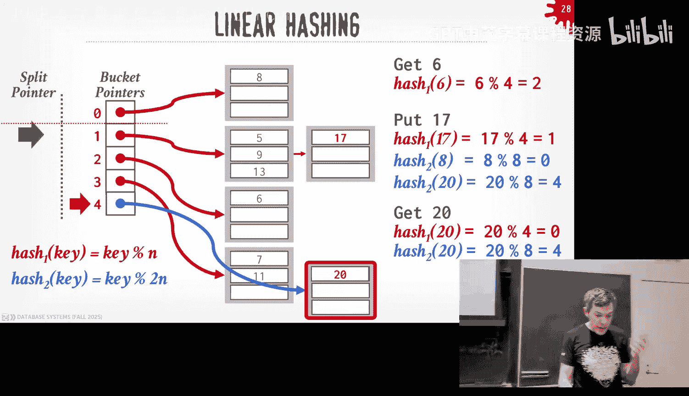
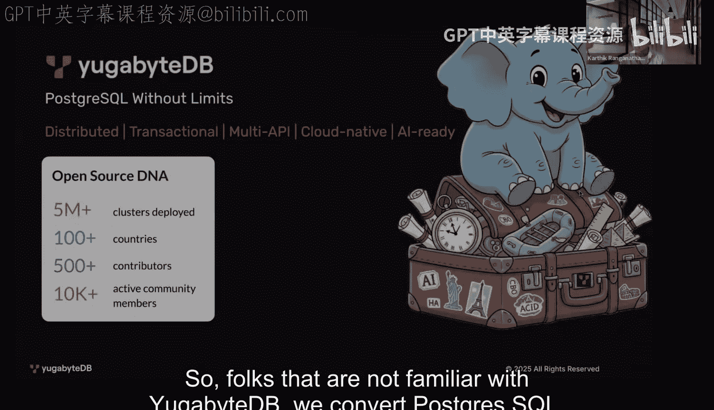
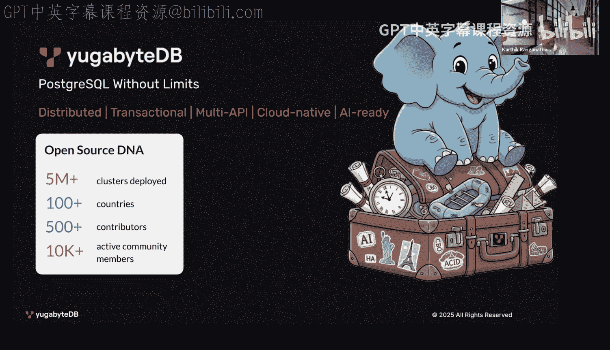
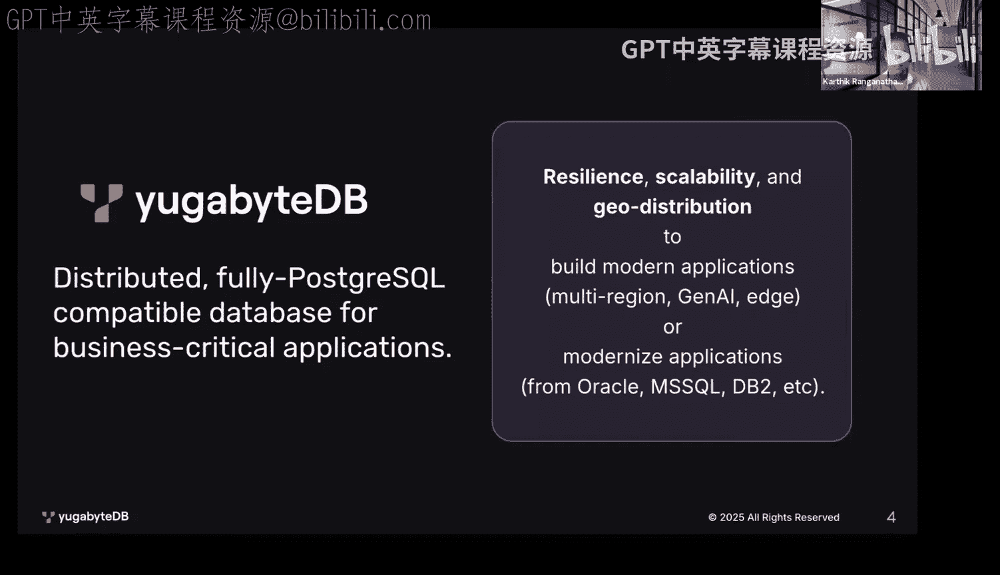
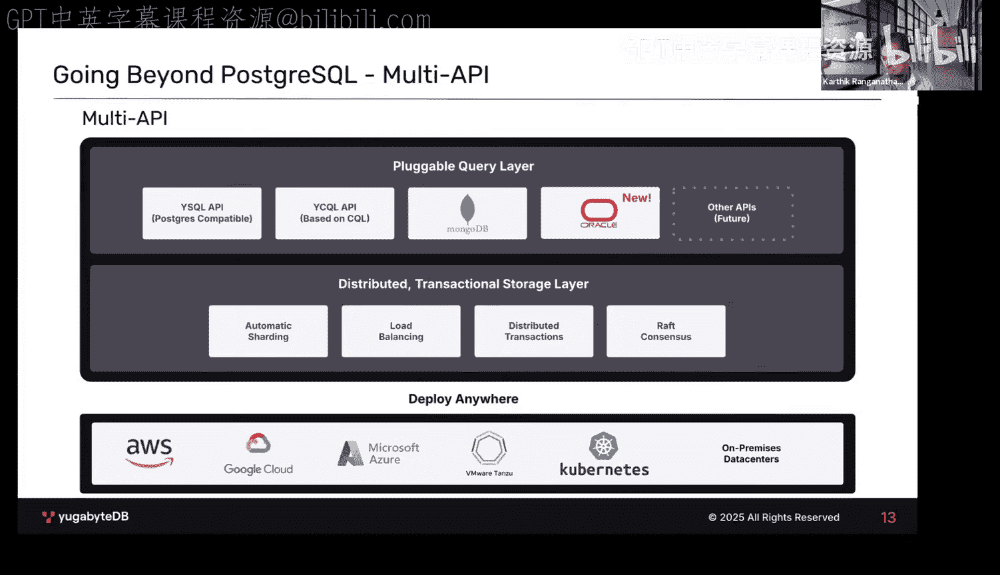
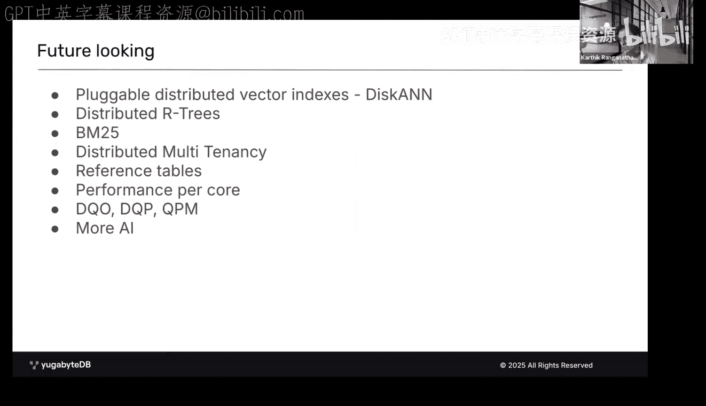

# CMU《数据库导论｜15-445 645 Intro to Database Systems (Fall 2025)》中英字幕 p07 -7-#07 - Hash Tables_ Static + Dynamic ✸ YugabyteDB Database Talk (CMU Intro to -BV1bmHGzsETM_p7-

🎼别忘玩 still开心。🎼we。🎼我是你我是。🎼。Let's get started， lot to cover round applause or DJ dash。Again。

 thank you for keeping everything fresh。 Allright， so it a lot to cover today。

 Plus we have the guest speakers。 so I'm to jump right into it and try to get as much as we can covered as much as we can today。

😊，All上。Last class was the last lecture we did or the previous lecture we sort of wrapped up our discussion on what the storage layer of the database system looks like。

😡，Right down on disk， we already talked about buffer poles and how to bring those into memory。

 so now we're going to start going up the stack。😡，Remember this diagram from the beginning of this semester where we're we're going to start talking about how we're going to build the support infrastructure in a database system to start executing queries。

 so we're going to be sort of this middle layer here what I call sort of call access methods basically what the API。

 the API we're going to expose to the operating execution。

 the execution and end up above to get down get access to the data that we want so today and for the next next week as well。

 we're going to actually talk about data structures we're going to build on top of our Bel pull manager page is now。

😡，That we can use to store data for a variety of reasons， so today's class will be about hash tables。

 so unorder data structures， and then all next week will be about trees or order data structures。😡。

So okay we're going to talk about the background about why we want to do this。

 why we need our own data structures， why we don't want to use STL vector for the stuff that we want to do。

 but then we'll quickly talk about what hash functions look like then we'll talk about two approaches to do hash tables。

 the first will be static hashing schemes where you assume the size of the hash table is fixed。😡。

And then there'll be dynamic hasching schemes will be a data structure that can grow and shrink depending on the number of keys that you're going to put in there and in a database system。

 you're typically going to need both of these。😡，Because as we'll see in a second。

 we're going to use these data structures for a bunch of things and then we'll finish off with a guest lecture from the Ugabyte coconer。

😡，Okay。Sorry。😊，These data structures we're going to build here I' going to use again all throughout the database system for a variety of things obviously we could use them for table indexes that's probably what you're most familiar with at this point。

 like how do I take a primary key or a secondary key。

 do a lookup to then find the record ID that's going to be on some table page but we're also going to use it for internal things like the metadata like the catalog of the database。

 we talked about the page directory it this hash table structure we used a look up to find the location of pages within files we can also use it for the core data storage itself we saw this before we talked about index organized storage。

 we said that instead of having these unordered he pages for our tuples。

 we're actually going to store the tus in the leaf nodes of a tree data structure。

 typically a B+ stream。And then another one that we're going to see as well。

 but we'll see mostly when we talk about query execution。

 where actually we can use these data structures for temporary data storage。😡。

So when we do a hash join， when we want to join two tables， if we're doing a hash join。

 we're going to build a hash table， one of the hash tables we're talking about today， populate it。

 do the join， and then immediately throw it away。But because we may end up building hash peoplele that's larger than the amount of memory that's available to us because we're trying to join some large tables。

😡，Then we're going to back that hashable by the buckle manager so it can fill a disk if you run out of space。

RightSo again， the data structure will come out the next two weeks only all throughout our system and we're not going to want to use in many cases。

 the things you can get off the shelf like a third party library or the SDL or pick your favorite Ru Cate。

 because those are going to be typically not backed by the B pool manager。😡。

They're going to be backed by Maloc。h， we can't override Malic。

 but it's still going to be OS memory that's ephemeral system crashes， you lose whatever's in there。

And if you're not in a memory， it's going to start thrashing on its own。

 the US is going to do that for you and's not and we don't want that to happen。

 butll we want to control everything。So there'll be two main decisions that we have and how we're going to design these data structures。

 because it's going be slightly different than maybe youve seen in your previous algorithms class because we're going to make trade offs again about how we're going to choose what data structure the internals of the data structure。

😡，Based on the properties we said we cared about earlier in the semester。

 where we were to maximize the amount of squch IO rather than a random IO。

 that means there'll be some things maybe seem more inefficient。

To do versus if something was entirely in memory。But we're going to do that because we can convert random rights or random reads to sequential rights and sequential reads。

 and that's be faster for us。So today's classes we're going to mostly focus on the data organization side。

 like basically how we're going to represent the data structure internally。

 like the actual physical thing we're to store in memory on disk pages。😡。

There's another challenging thing we have to worry about。

 but we'll cover this in two weeks of how do we make sure that our data structures are threads safefe。

😡，How how we allow for concurrent access， multiple threads reading writing to our data structure at the same time and doing in such a way that it's safe to do these operations and not worry about。

😡，You're changing some point or address， and then now of sudden some other the thread reads that and goes off the middle nowhere and you sank fault。

So for today's discussion and then Monday's next class。

 we're going to assume that our data structures are single threaded。😡。

There's only one thread going to access from the time so we'll understand the basics。

 and then we'll see how to add latches and protect things later on but。

There'll be other weird things that come too why we don't want to talk about Kkerji stuff at this point because。

There's a higher level of notion of correctness that we're not going to worry about just yet。

 but like say if I， my one thread deletes something， sorry I insert a key。

 somebody else some other thread deletes that key now I go back and try to read that same key and I don't see it is that correct。

😡，At the low level of the physical level， yes， at a logical level， maybe not。

ThatThat does make sense。 Don't worry we'll cover that later。 That's not this class。All right。

 so like you said， the data structure we're going to focus on today is hashables。😡，And again。

 everyone should have taken basic CS classes thatve subscribe as before。

 so nothing I'm saying here should be widely new to anyone。

 but it's basically an unordered associative array that allows us to map arbitrary keys to arbitrary values。

😡，And at its core， the way this' is going to work is there'll be some kind of hash function。

 which I'll talk about in a second， that we're going to use to take our key。

 which could be any of any arbitrary length。😡，Run through a hash function。

 it then could compute some integer representation of that data。😡。

And then we're going to use that to figure out where do we want to jump to in our has to be able to find the data that we're looking for。

😡，Right。So the space complexity of a hashibo is going to be ON。

 where n is defined as the number of keys that I expect to store in my data structure。😡，Now。

 in many cases， I may actually not store exactly N right I actually want to be less than that。

 Sometimes you say you just double the size you expect to store and that's what you want to allocated as。

 So n can be like the two n of reality。😡，For the time complexity， on average is going to be01。

Because we're going to assume that we have a way to take our key that we want to find， hash it。

 and then we jump some offset in our data structure and lo and behold。

 there's the data that we're looking for so average case is01 worst case is ON。😡。

Meaning I had to scan all the keys individually one by one to find the thing that I'm looking for。😡。

Right。So now if you've taken an algorithms class， all the theoreticians see that '01 and they start salivating like oh man that's great oh I don't care about anything else and I think we sort of mentioned this earlier in the semester in the database where we do care about these constants。

😡，And even though it is01， there's going to be a big difference in performance based on how you actually implement these things。

😡，So I do if it takes me， my hash function is something really stupid and it takes me 100 milliseconds to compute the hash to find out where to define find the data that I want。

😡，yeah， it's 01， but like I can have a faster hush function to do this in one millisecond。

And that's two orders of magnitude two difference。And for one lookup， maybe not a big deal。

 but again， think always in larger scales if I'm doing a billion lookups。😡。

Then that extra 99 milliseconds is going to add up。So in the database world。

 we care about constants because the end of the day。

 that's going to equal money because if I can have a more efficient data structure where even though it's still 01。

 theoretical， but the constant time data is to do these operations is smaller and smaller。

 then I can store more data or I can run my workload on a smaller machine， and at large scale again。

 you save real money。😡，All right， so let's look at a sort of strawman proposal。

 the simplest passh table you can imagine of what I'll call a static hashable。

 I think it's just again it's a giant array of memory and instead of calling them frames like we did in the Buff pool we'll call them slots and lovely be locations an RA where we can store data。

😡，And so to make this work， we're going to assume that we know the number of keys ahead of time。

 so say big n。😡，And to now find any key that we want。😡，Assuming we're going to be storing integers。

We're just going to take whatever that key is mod it by the end， the number of slot we have actually。

😡，That could be yeah， it's little end of the top， big end of the bottom。

 They're the same just ignore the difference there， right。So I can take any key that I want， hash it。

 and then it'll tell me where that location is in my slot array。😡。

And then now I can maintain a in the slotlaughter array itself。

 I'll have basically just pointers to some other location。😡。

In memory or in other pages with the actual data that I want。

And I have to store the original key and the value because if I start jumping into the array and I land at some location in my sort of data payload area。

 I got to know whether I'm actually looking at the same key or not。は。

So this is unrealistic for a couple of reasons。😡，One is I assume that I know exactly the number of elements of the number keys ahead of time。

😡，And in real world systems， that's almost never the case。哎。The way to get around that。

 you could do one pass of the data count the of records， then do another pass。

And then populate hashable and some systems do that， but in general， we can't assume that's the case。

And we can also maybe assume in some cases that the number of keys isn't going to shrink or grow。

Over time。The other big assumption to here is that we're assuming that each key is unique and therefore when I do my hash and I land my slotler array and it tells me where to go find the data that I want。

 I know that there isn't going to be something else in my sloter array for another record need to find。

😡，Right。And to make that work， I got to have actually basically allocate all of the possible key space that I could ever have。

 so N。😡，Even though I maybe not actually have it all or maybe estimate might maybe me wrong。

 but that's going to avoid having any collisions。And the last one is a somewhat slightly theoretical discussion。

 but the。When we run these hash functions。😡，Oftentimes we're not going to end up with like two distinct keys could end up hashing to the same value。

😡，And so。There is a sort of classic algorithms or classic methods called perfect hasching。Well。

 you have a hash function that guarantees that there will never be any conflicts。😡。

think of like if I have a number for one to 1 thousand00。

 a hash function just could just be returned that number because。

You knowBecause I won't have any conflicts。But if I'm trying to map a larger key space into a smaller one。

And I can't assume that' would be a perfect hatch。so the way you do a perfect hash is you basically have to pass over the data at once。

 make sure that there's no conflicts and then sort of maintain another hash table。

That maps the original key to its location in the slot。

 so like I'm building a hash table for my hash table and that's not entirely practical。

You can cheat in some cases， you can say like if I know the top 10 keys。

 then I'll have like if then else that sort of bypass the hash function。

 but far as I know no system does that。😡，Okay。Okay。🤧So at its core， what is a hashhe。

 most of you think it's like it's the actual data structure itself。

 but it's actually a combination of things。😡，The first is going to be what the hash function we're going to use again。

 to take the arbitrary key space and map it to a smaller domain。😡，And we'll see in a second。

 there'll be this trade up between how fast we want our hash function to be versus how many collisions I could potentially have。

And then the second piece will be the hashing scheme。😡，So within my data structure now。

 if I have keys hash to the same location in my hash table。

 what do I do like what's the protocol to the side， how to resolve that conflict， right？😡。

And we'll see sort of two examples of how to do this。

 but there's a bunch of ones people have developed over the years。

So once you add sort of the hash function of a hashs scheme， then you have the storage space。

 you want to put the things， then you have your hash table。😡，You。All right。

 so let's quickly talk about hash functions。😡，I'll just give you the basics of what you need to know when youre building a data system。

 but the truth be told is we actually don't care what the algorithm is going to be。😡。

And I don't think it's worth our time to even discuss know how to build a good hash function。

 there's other classes that do that。 So for us， we're actually use something that's off the shelf。😡。

And those systems are。Most of the newer systems are going to do this。

 very few newer systems build their own has functions， right？😡。

So again a half function that's pretty basic， the idea is that it' a one way hash。

 so given some key of arbitrary length， we want to do some computation on it to then generate a random 32 or 64 bit integer。

😡，Right。And again， the thing that we care about is we want something could be fast as possible and have a low collision rate。

What's the has function you could build？Ddentity faster。One or zero。

 and return a constant because that's going to sit in a register。So if I pass you a string。

 I got to send you back to the string sending back  zero， one be way faster than that。😡。

But the collisionliant is terrible， right， no matter what key I give you。

 no matter what email address I give you， the value is going to return zero or1。😡。

So that's not a good one。😡，The opposite end of the spectrum would be that perfect has function where I have much of a elaborate infrastructure to guarantee that no matter what key you give me。

 I'm going to give you a unique has。😡，Right。So again。

 the idea is that we're trying to convert these arbitrary length strings or whatever these keys we're putting in。

 we want to always then generate a fixed length value。😡。

So we don't care about any cryptographic properties of this hash function and we don't care about the hash being reversible。

 so I don't care about taking whatever you hash me。

 the hash you give me and getting back the original value。😡。

This is all for the internals to the database system。

 we're not leaking any information on the outside， we're not worried about people trying to do like an attack on us to like overload something or give me keys that always hash at the same location so I slow things down。

😡，That's not our problem， we're not worried about this things this is all in the inside。

 we're not going to expose these hash values to the outside world， yes。Because can just a few ago。

 we talked about breakers that set an example of break。So if you have the page and the stop number。

 you already know。St is early before took we had the record ID。And that from that。

 we can get like the page number and the offset why do we get the page number from？😡。

The record ID in some systems are typically going to be the page number and the offset。😡。

You don't need a hashable you don't went so hard on， so we're going back here。😡。

We're going to use this hashe for a bunch of things。Yes， right？So table indexes using that。

 that's the simplest one to think about。If。Think of something like a higher level key。

 like a secondary key or like a primary key， and the primary key is your email address。

So I do a query， select star from table where email address equals yours。

 How do I then get the record ID that the tableedX will give me that。😡，Yes。

 but I also want emphasize that the things that we're talking about today。

 this data structure isn't just for that。 We're going to use it to do joins。

 We're gonna use it to maintain other internal met。 You're a bufferable manager in project1。

 you guys are using what SL on order map or something right Well， again。

 if you crash what happens that map is gone。 But say you wanted to make sure that the。😡，Well。

 you could replace that SDL map with one of these hash tables that we're talking about here today and not use the SDL one because you think you can do a better job than that。

😡，你继直看。Although the Google data structure library app is actually pretty good。

 The Facebook following ones pretty good too， But again。

 that's not going to be backed by our our manager。All right。So again。

 we don't care about cryptography， we don't care about denial service attacks。

 this is all in the internal we're not exp exposedosing the outside world。😡。

So I just want to quickly talk about what options are available to you ands almost 20 years now。

 but theres this new there was this resurgence interest in hash functions for database systems in 2008 started by Murmurhash and it was like some random guy on GitHub or something just posted like here's my really good hash function and a bunch of database systems picked it up and started using it and over the years there's been improvements to it。

 the main takeaway is going be the state of the art one that's considered the fastest right now is Rait hash but as far as they know no data system uses Rait hash yet because it's like too new most of the newer systems are going to use excess hash excess hash3 right？

😡，So in general， this is're to want to use。And that's it。 That's all you knew about hash functions。

String in or data byte array in， 64 bit integer out， Xx has to be fast， let's use that。😡，Okay。

 you could even ra a has。 I'm saying sorry。Their statement is why can't use abbbit hassh。

 you can yeah， so maybe state of the art is both of them。

 but nobody uses this one yet as far as they know。😡。

I haven't gripped all of GitHub of like to see where it shows up in the A system because we have all the GitHub accounts。

We have a Github URLs Rby D system that's open source so we could check。

ButI think we checked last year and nobody was using it。All right， so again。

 soon we have some hash function for our purposes going forward and as rest of this lecture。

 we don't care how it's actually being implemented， we just know if we give it some byte array。

 we'll get some integer out。😡，Okay。😊，All right， so first we're going to talk about static hasing schemes。

Again the idea here is that you specify when you allocate the data structure the number of potential locations where you could want to store store records。

 certain information the number slots that you want in your implementation right we'll see dynamic hashing in a second and again that'll be a hasht that can grow and shrink with more or less keys over time but static hashing you sort of allocate things at the very beginning and that's it。

😡，So we're going to talk about basically the two most common approaches。

 linearar Pro hashing and cuckooing linearar Pro hashing is used everywhere。

 it's the most common one， it's actually the most simple one。

 and this will be a good example of where simple is actually better。

 it's actually more performant than all these other fancy ones。😡。

So if you take the Adv database class we'll cover all again all the various things people developed over the years。

 Ramahood hashing， hopbsscot hashing T tables， there's another category of hashables we' not talking in this class called concise hashables or memory efficient hashables and this is where again。

 you know you're going to be doing a say doing a hash join。

And I'm going to build my data structure they immediately throw it away。

 so I want something that is compact as small as possible because I'm not worried about know building a hash table and then an hour later。

 I' I'm going to come along and try to insert something into it or delete things right。😡。

So the one thing I understand is that the。terminology starts to overlap and gets kind of confusing with these things so I'm going to be talking about linear probe hashing and there'll be another hash table called linear hashing that I'll cover at the end of the class that's a dynamic hashing scheme linearar probe hashing is a static hashing scheme and these are also used in a category called open addressing or open addressing algorithms for hash tables and this just basically means that the location of a key in my hash table。

😡，Is open， meaning it could be anywhere。 There's no guarantee that if I insert the same key multiple if I insert the same key in my data structure at different times。

 it's always going to be in the exact same location。😡。

It's allowed to move it's allowed to be in different locations and so the hash function is basically going to give us a way to jump into the hashable。

 these as a starting point， and then we may have to look around。

 scan some data to find the key that we're actually looking for。😡。

There's no guarantees exactly in that location。It'll make worse sense when I show examples。Okay。

 linearar prophing is the most basic one， but it's used in a lot of systems。😡，All right。

 so the way thing about the hasheet was just again。

 this giant table of fixed line slots and then to be backed by pages in our Buffleable manager。😡。

And so what's going to work housework is that when we hash into our hashable。😡。

If there's another key in the location where our key wants to go into。😡。

Then we know that space is being occupied and we have to scan down linearly。

 like looking at one slot after other till we find a free slot。And once we find the free slot。

 then we can put our key in and then we're done。Right。

And insertions are basically delets basically assertions and deletions and searches all sort of work for the same way。

 we do have to keep track when we start scanning through where we started。

 when we enter the hash table， so because we'll loop back around if we come back to that original location。

 we don't want to get stuck in an infant loop because we know the hash table is full and then depending on what our operation is。

 we may have to stop what we're doing and resize things。

So in most limitations with this notion of the load factor。

 is basically the number of actively used slots divided or over the number of total slots。😡。

And when that gets above some threshold， then the system say， well。

 I think I'm getting too big and I'm going to run out of space， let me halt all any operations again。

 assume you take a global latch on the whole data structure。😡。

Alloccate a new hash to's twice the size of the original one。

 take all the keys out and put it into the new one。😡，That sucks that's really slow。

 this is again why you typically allocate the hasht would be a little bit larger than what you expect to actually put in it so you don't have to do that but some systems allow you to play around with this load factor to say like I'll allow us to allow myself to be 99% full before at the resize。

😡，All right， so let's let' take at quick example， so I'm showing this on PowerPoint again it's a diagram。

 but I assume that this data is being stored in bufferable pages that are being backed by disk。😡。

So I have my hash function and then I have the n defined as the number of slots that I have。

 so if I want to insert key A， I'm going to hash it modify by number n and it's going to land in that slot there and in this case here my hasht is empty the slot is empty so my keyA can go right in there。

😡，And again， I have to store the key and the value together。😡。

The value actually may be a pointer to something else， we'll cover that in a second。

 but like I' need the original key because if now I start having collisions and I start changing the location where the key I'm actually assert is not the original one where I started the。

😡，Then I need to know whether the slot I'm looking at contains the thing that I want。😡。

I insert B hash to the top， that's fine， now I insert C， now I have a collision。😡。

C wants to go where a is， but it can't because a is sitting there。

 so we basically recognize that this slot is occupied。😡，Do a linear scan。To the next free slot。

 we see that it's empty or the next slot， see that it's empty。

 and then we we can go ahead and sort our key there。Sayme thing where D D once where D where C is。

 it's occupied， so it has to scan down and put D there。😡，E wants to go where A is。

 can't go where C is， can't go where D is， and we finally find a free slot there。

And just to finish off， we'll put F once it go over E is and it goes to the bottom。哎。😡，Pretty easy。

 right？And because we're doing much of linear or squch operations。

If I have to read multiple pages from disk， I can read these pages in Scrun order do I find the free slot that I want。

All right， so how do I make sure that？that my entries or the datum storings only fixed length， right？

If the data I want to store is is fixed length， then I can just inline it with the data structure itself so I can also store the hash that sort of makes things go faster because I want to compare the hash whatever I have in there plus the hash to the thing I'm trying to put in there。

 I can store the hash there， but space versus compute trade off takes more space but makes the lookup go faster。

 but if my value fit fits in just fine and I can distort store this inline。

 obviously I don't want it too wide now because now the size that I'm jumping from slot。

 the slot gets really big and it can I'm wasteful yes。Access and E value。

 So this is story here what you。あ谢是。And then如果。Yes， his question is this is do inserts。

 how do you find things this is the same thing right so say I have F I want to look for F， I hash it。

 I la E is， E's not what I want， I keep scanning till I find the value that I want or a free slot an empty slot meaning because I know my key can't be in there because if it existed I would have seen it when I was scanning through。

😡，That's as we said in the beginning， O N， Wheres Casing or， I read everything。

Keep track where I started so I don't keep going， yeah。All right。

 so if our data is small and it's fixed length， we distort it in the Hashe itself。😡。

If our data is very length or too big， then we'd end up basically stor some kind of record ID or a pointer or something to a1 page。

😡，And just have the data we want be chucked in there。If we're st this as an index like a table index。

 then the record ID just be to the original Tple， but if I am'm building a hash for a join。

 I don't want to maybe reference the original data because I might have have manipulated or just some other joins for prior to that。

 so I need to sort of temp pages to put data that I want。😡。

But it's the same mechanism to have a pointer to say， okay， with the value， have you find a match。

 here's where to go find it。😡，Yes。😊，So。AndI just always。えじ？原那有是下人是。那个支我们。His question is。

 if you have a JO field in a tub you。That在。You can have a。Yes。Yes。😊，But he like。If it'。

 if it's variable length， I don't want it in the。I don't want it。

 I can't put it in my slot array because that brace the whole mechanism of taking the hash of the key and the modify by the number of slots so it's very a I'm gonna jump to random locations I can't do that so I can't put it in there I got to put it somewhere else so I'm just to saying here is like you just have this sort of tempt thing where the key that you're trying to do look up on。

😡，Is now in this other temp space that could be very length， be sted pages。

 whatever you want doesn't matter。😡，And then now in my hashtap， I'm storing fixed length record Is。

Second you。You save it as and he's correct， like when you want to sort the keys in the hash table to make it as fast as possible。

 yes， but at they're very length， you can't do that because now all your slots。😡，Yes。

 so the trick you could do would be。sayy you're st very length strings。

 I could take the first like eight characters， store that in my hash table。

still need the record ID to get the original one， but at least now I can look for the prefix and see whether that matches。

😡，Was that， this is German strings， yes。G。Gmanstrs basically says like instead of when we had that the overflow page。

We had the you know we didn't want to inline the very length data， we had a pointer to it。

 but in order to see if I have a match on that very length data。

 I got to follow that pointer so I again distort prefix to do that early matching right and it was invented by the Germans。

 I called it German strings and apparently that's the term members in using now but yeah German strings。

😡，はい。So not all the hash tables in our systems won't care about the leads， but again。

 for their table indexes， you do。😡，So how are we going to handle that so the idea again。

 so say I want to delete keyC so I do my hash， I mod it。

 I land where A is A is not the key that I'm looking for， I jump down to C here's C。

 I want to go ahead and delete it。😡，And I just remove it。Yes， so window time for to expand the。

The question， the statement is when the load factor gets too large without deleting。

 just totally me in general or this example here。😡，了一见脑。The question is。

 when the low factor gets too large， do I the resize the table， yes。

 you allocate a whole second table。😡，Scan through and hash put it back in the new one， yes。

Dynamic hatching we'll do that， we'll see that in a second。All right。

 is this a good idea or a bad idea what it is here， I delete a keyC？😡，I just removed it from my slot。

Yes，'s's pathetic here so statement is if now something wants to do a look up on D。

 well D is going to hash where C was because it was occupied when we try to insert D I had to go to the slot below it so it's going to hash here now land to where C used to be C that it's empty and again the protocol for deciding whether key exists or not is I keep scanning to I find it or I see an empty slot then I'm done so it's going to see an empty slot right away and think nothing's there and re screw it。

Right。So there's two approaches to handle this。One is basically what we talked about before。

 but like resizing the table， you basically just move everything around。😡。

So you figure out what the key you deleted， scan everything afterwards until you find the first free slot and rehash everything you see to figure out where it actually should go。

 so you're kind of like dumping out a portion of the table and insert it back in， right？😡。

You could be stupid and start moving things around， you could just move things。

 but that's not going to work because things may not。

 you have to rehash decide whether it actually should go where we want to point things。

So in this case here， looking at D would be fine， it would still work， E would work as well as F。😊。

Right。 then the tricky one of course， what would you would be， do you be around or not， right？

Doesn't matter， okay。So nobody does this， don't do this。

 this is just way too expensive because again you don't know how many things you're going to rehash at the moment you do this。

 right？😡，So what you really want to do is just use tombstones。

And you basically maintain a little marker to note that the key that used be here has been deleted。

 it's not physically removed， I mean you can zero out the bits if you want， doesn't matter。😡。

But when you do a scan， sort the thread's going to see that the space used to contain something。

 but it's not there anymore， and it knows to treat that as if it was occupied and not a truly empty space。

 so keep scanning to find the thing you want。😡，so I delete C。hasash to A， go down here。

 mark a little tombstone now when I do a look up on D D lands where C used to be。

 Cs that there's a tombstone and says， all right， well I something used to be here and it's not anymore。

 let me just go ahead and keep scanning till I find the thing that I want and then I'm done。😡。

And occasionally there'll be some background thread if you wanted to go ahead and prune these up。

 and in which case you would have to do rehashing if you wanted that。

 or if now someone wants to insert something to the space that is occupied by a tombstone。

 you can just use it。😡，And that's still considered valid and correct。Was that if I knew what？

The question is what would happen if I query to get C well would in this case here you would see what hashes to a so you landed it A。

 say this is not the delete this is the get， I would see A is not what I want。

 I would keep scanning I would see the tomb sun spot on C is。😡。

I know that's not what I want either because it's considered deleted。

 then I have to keep scanning down D EF wrap around a B， then I get to that first free slot up there。

 it's empty， at this point I didn't see C and I would have seen it if it was as I did my scan so I would say it's not found。

😡，Yes。P here， how can we tell people whether we should just overwin the console or find somewhere else。

The question is if I do an update the D or insert a new D。😡。

So say is what would I do if I update the value of D？😡，U。I mean， for this， we wouldn't。For updates。

You scan the keys that you're looking for if it doesn't exist， you don't update it， if you do see it。

 then you just could just overwrite it and you wouldn't need to move where D is。😡。

We're not really about。 updates， we're not going to word out here。

 It's insert update deletes or sorry， insert deletes and get and selects gets。All right。

 so now let's say I want to sort a new key G G hashes to where C used to be again it' the tombstones there。

 it's it knows that logically the space is unoccupied。

 so let's go ahead and put the thing we want there。😡。

So you wouldn't typically store the tombstone in line in every slot。

 typically it'll be like in the page header。😡，You would say。

 here's all the slots and whether they're considered occupied or not in a simple bitmap。

And that ensures that all your data is aligned， yes。来那们给那个嘛。我 one。The question is。The question is。

 am I going to maintain a map about twombstones or what？Right。The question is。

 do I maintain a separate data structure that says for a given key， it's been deleted？😡。

This is the data structure， right？Right， so。会。The question is， like， what I。

 do I need to record that this tombstone corresponds to a previous value， but like the。Yeah。

I suppose you could do that would that would help prevent the problem I said before。

 like if I look for C， I then have to wrap around， I could just see the tombstone C used to be here。

 that's what I'm looking for。 I guess it's my hair anymore， right The problem that one is。

 though you don't know whether someone else inserted C after later on and I would miss that if I solve the tombstone immediatelyme jumped out。

😡，那个。It's my question。第一个。是明看。In see。对类。你该理经说一下。予質問。

I think you're saying like are we relying on information that be stored in the tombstone to help optimize certain things。

 I that's essentially what you're saying。U。I suppose you could。

 nobody does that because it's extra complexity， and this is so simple it just makes it so fast。😡。

Like the extra checks you're talking about are just not probably not worth it。系。

I'd might be wrong with that， but if you're。Yeah， most people don't do that because most people are still going to knock support deletes anyway because I'm going to use these for hash tables where I'm just inserting and then reading and then throwing it away。

😡，But if you want to support deletes， that's an additional opposition on thinking you could do。

 but I don't think anybody does it because it's just more machinery。😡，All right。

Let me jump through because we're short on time because we haven't got the dynamic stuff but。U。😊。

If you want to handle non unique keys， you basically have this。

 you can store them either in separate link lists or you distort the key multiple times。😡。

That's what the most systems do the second one， the tricky thing， of course is going to be that。😡。

If depending on the operation I'm doing， I may see you know， say go give me key XYZ。

 I may hash into it land it， see key XYZ， I have to keep going till I see the first free slot and I look up because at that point then I know that I'm not going to see any more XYzs。

Same rigid delete if I want if I want to remove all XY Zs。

 I have to do that again those systems do that because you don't need to maintain the separate data structure up above to store my keys in the giant hash table。

Right。Let me skip optimizations just to say like you could have specialized hash tables based on the keys。

 so in Clickhouses for example， they have hash tables for strings。

 they have the separate hash tables for integers， they have separate hash tables for large strings right they have 20 different hash tables in their implementation which is crazy so they have amazing blogar it talks about a lot of these things。

I'm going to talk about an alternative to linear probe hashing called cuckoo hashing。😊。

And this idea should be pretty simple， but it's again breaking this conceived notion that we're going to have one hash function to tell me one location where I could find the key that I'm looking for。

 I'm actually going to have multiple hash functions， and my key could be in multiple locations。😡。

And it made change over time because again， the open addressing allows me to do that。😡。

To over time ass the keys that I'm inserting changes。So the。Loouts and deletions are always the01。😡。

Guaranteed。Because。I'm going to， if I hash it。I'm either going to find exactly the key I'm looking for。

 may have to hash it multiple times， still a constant factor， but again that's not free。

 or I'm not going to see it at all。😡，The inserts are going to be more expensive because I may have to take a slot for somebody else。

 remove the key， and then insert it back in。😡，Let's look at an example what's what I mean。

 So I want to put a， I have a single hasht we look at forward bunch of slots， but in this case here。

 I'm going to have two hash functions。😊，It's going to be this same implementation。

 like same rapid hash or excess hash3， just you give it a different seed so that they guarantee to produce or not guarantee they're going to produce different hash values。

So I can hash both of them。key twice with the hash function and I'm going to end up with two different slots。

😊，And I'm gonna to look to see which one's empty。 In this case here， I'm completely empty。

 I'm going to flip a coin and choose the first one。 And that's where my key is going to go。

Now I'm going do the same thing on hash B。Two different locations， the first one。

 the first hash function is occupied by a， so I'm going to ignore that。😊，And instead。

 I'm going to choose the free slot that the second hash function has。A points do， and I'll get B。

Now let's see example where I have collisions of both locationss， so hash and C。

 the first hash function is where A is， second hash function goes where B is， both are occupied。😊。

So the way this is going to work is I'm going to choose a victim。

 I'm going to choose one of the slots that I'm hashing to， I'm going to steal their location。

 kick them out of the house， put my shit in there right。

 and then they got to go find a new place to live。It's called cuckoo hashing because there's a cuckoo bird。

 that's what they do， they go find other birds' nests。

 kick them out and then plant their own eggs right basically what's that？

His question is where did the Victor entry go， let's keep going this， all right。

 so we're going to take the first one， so Cs and kick out B， put his stuff in there。😡。

And then now we've got to put B back in， right？😡，So with B， I'm showing for simplicity。

 I'm showing only hashing with the first hash function because back here right we decided to choose the second hash function in actual you don't really you're not gonna to record what hash function you used to insert it because it's extra space is un needededed you would end up hashing it again and then see which one is occupied。

 Which one points you to the pack the police you usually got kicked out of So now we hash B again the first hash function。

 it goes where a is So same thing It's gonna take gis itss slot kick a out navigate get a back in we're going hash a and it's the land here and that was the slot one of the three slots we had in the very beginning。

How do I？So how to prevent cycles， you just keep track of like， hey， is the key I just inserted。

 I'm trying to let I started it off with。可说。Stqui this was right long， yes。It like， no。

 it's not a list， you don't need to list， I don't care about how I got there。

 I just care what he has started with。I can you cycle an AB andC， all the cycle。To his point， yeah。

 I did right。😊，I don't know because I don't think you don't need the full list， though。

I think you need where you start it and then put in the most recent one and you can have。

 I don't know the answer。But it's going to be it。If you have to maintain the list， it's unavoidable。

😡，Yes， so what if like the light on。See as it they on all hash functions， the has shape was full。😊。

Double the size and rebuild it。Yep， no free lunch， you always have to do something。

So now I we' going to do a lookup， I want to get B。

I'm gonna hash it twice again I'm showing this be parallel because it's PowerPoint and actually reality you hash the first one and see whether that has thing you want if it's there you're done if not then hash the second one to see it right but in this case here I would hash the first one look for B and I would find it my slot there but I could also look at the other one and that's why it's01。

😡，Because I'm guaranteed to either see it immediately in my first sort of step into the data structure or doesn't exist。

😡，Yes。Go back here。So， she polites。So we were here， C collided， so yeah， sorry， we want to start C。

 C collide with O A and B， we got to pick a victim。Gvivic B， yes， C goes in there， B pops out。

 we got to put it back in。SoW can't we check both， We have to be with the both functions and check。

I do。Vi of them are the same。So hash B now with hash function one and to。Well。

 so the second hash function is where I came from yes。

 so you would do both of them when you come back out， try to go back in because it's this。😡。

The the protocols are the same if you're inserting a key for the first step versus like I got invicted。

 I got to go back in， it's the same for PowerPoint reasons， I'm just not showing yeah。

 but you you would do both。Yes。いの？The question is， how do you know how many hash functions you use？

There'sI think there's been the theoretical work done on this， you can prove that like。

For hash shape of this size， this many expected keys， you want this number of hash functions。😡。

And then there's a trade of also two like if I have a lot of hash functions， then I may。

It's more work but I can maybe not hit a cycle as quickly right I forget the default one so the best open source im of a Co hash table was actually from CMU from Dave Anderson and they still maintain it and I think the default is like six hash functions。

😡，Other questions。So this is a neat little trick， it's a cool idea。😊，It's slower。

Then linearar Pro hasable。Because it's leannaprobing so simple。ThenYou can rip through it quickly。

 so very few systems do this。All right， so。In the two keys that I showed。

 you got to know the number of keys ahead of time。😡。

Right and then if we our low factor gets too much or we get stuck in an infinite loop in the cuckoo hashing or we've run out of free slots in our linear Pro has table。

 we've got to stop what we're doing。Relocate space and resize it， right？

So dynamic hash tables are going to have a mechanism built in that allows them to grow and shrink incrementally as needed as you're inserting things。

So the hash table you're probably most familiar with is change hash table I think this is what Python gives you or Java hashmap gives you right but in the data world there's two more sophisticated ones extendable hashing and linear hashing and again I was saying the confusing part is I just talk with the linear probe hash table and there'll be now a linear hashing hash table and there's separate things one static ones dynamic I don't make up these names I don't have control。

All right， so chain hashing， right this is what you get in Java hash mapap。

 actuallyon I don't Python gives to do this by default， but this is what Java gives you。😡。

So you're basically going to maintain a linked list of buckets。😡。

For for a given slot where you can insert keys， so it's kind of like a partition version of the linear probe hash table where you start through a sequential scan potentially to find the thing you're looking for。

😡，At least now you don't have to scan the entire table。

 it's just scoped into the know some portion of the table。

And you resolve collisions by just placing elements at that collide with each other。

 you're in appendem to the end of this bucket link list right as you define the key that you're looking for。

 you hash into some link list and then you scan through and find the see whether the key exists or not。

😡，So。Now we have this separate data structure of bucket pointers。😡，And here's me all our buckets。

so I have one to do a put on a， I hash it mod in by the number of bucket pointers I have。

 and that's going to then give me a pointer now to the starting location of the bucket chain。😡。

And now I just do my linear scan linear probe to find a first free slot， soon as I find one。

 I can put the key that I want， so I'll put a there。😡，Same thing， I want to insert B。

 hash in the bucket point array， final location， and we put it there。Now we when to put C。

 C ends up in the same bucket list or bucket chain as A。

 but it scans through and sees A's occupying the first slot。

 jumps down to the next one until gets it right and then same thing with D D goes where A and CR by this point our bucket for simplicity only has two slots so we have to make a new bucket。

😡，And just have a pointer from that bucket to the next one， all right？

So obviously this bucket chain can grow infinitely。

 and so if I unlucky and my hash function is terrible， they're all mapping to the same location。

 then it's going to again ON look up for everything and that's be bad。😡，But the hash function。

 if it has low collision rate， then have more randomness， and things will be more evenly spread out。

Same thing put E so forth because in' here， put Africa is down here， right？

So one little optimization you can do that some systems do is you put a little filter in the bucket point array similar to that prefix in the German strings that I just mentioned where like I can check this filter and say。

 hey， is the key I want could it even exist in my bucket chain that I'm going to point to if yes。

 then I do the scan if no， don't even bother doing the scan。😡。

So typically you' going to use something like a bloom filter there。So okay。

 if you don't know what blame thought there is， we'll cover that next week。

 but it basically it gives you like set membership。

 and it just tells you does this thing even exist or not？😡。

And it may give you actually a false positive， it may tell you it exists when it doesn't actually exist。

 but it'll give you a false negative and it'll never say this thing doesn't exist when it actually truly does。

All right， let me try to plow through in。13 minutes， one of the two hardest data structures。

 but we can revisit this again on Monday next week again。All right。

Extenddo hashing is a more sophisticated dynamic hashing scheme that extends or builds upon the chain hashing project I saw before where。

When I want to when I want to start。Resizing the data structure， I'm going to split buckets。😡。

instead of letting this link list grow forever， which I could be end up being ON。

 when my bucket gets full， I'm going to split it and redistribute the keys inside that bucket。😡。

So at most the bucket chain， the bucket chain can't grow forever every now。

 every chain is going only have one bucket in it。Right。

But the game they're going to play is to make this all work because they're going to allow in our bucket array。

😡，Multiple locations in that bucket array could point to the same bucket。And that's me okay。Right。

So this is not widely used， it's an older technique was in。

It's like a new database management system is an think of like an embedded key value store。

the canoe environment provides you， it's also used asterisk TBB。

 which is a big data system at a UC Irvine from 10 years ago。

 but I think got merged into CouchBase and Cobase uses a lot of these techniques now。All right。

 so let's see what this looks like。So for。For every bucket there's going to be this this local indicator say how many bits we do you have to use to get to that bucket and there's this global bitet a bit counter thing that's going to tell me globally how many bits do I need to consider at this point in time based on the size of my hashable to find a particular bucket for giving key。

😡，So it's basically determine that the maximum number of bits we have to consider in our hash so again the hash function is going to return like a 32 bit integer or a 64 integer。

 but the way this scheme works is at least as you start building it up as growing and resizing things。

 you only need to look at a small portion of those bits。😡，At the very beginning。Right。

So in this case here， so the global bit counter is two。

 so that means that I only need to look at two bits in myh hash value， right？

And so this global thing is going to increase anytime I'm going to start doing splits。

 I need to resize things， but then the local bit counter it's just sort of keeping track of like for this bucket。

 how many bits that I actually use to get there。😡，But the way we're going to get into it。

 we need to use the global one and the hash bits and the bucket array on the side here， right？

All right， so let's。So sort of think it like this， right， so the。

If for these first two elements or first two locations in the bucket array。

 I only need the first bit， but for the other two， I need to look at all two bits。Okay。

So let's first do a look up on a right so the first thing I do is a hash a。

 I get back now a you know button。60 integer， maybe for 64 bits， but I look at my global counter。

 my bit counter and it's set to two。 So I know I only need to look at two bits defined in my hash table the bucket I want for that have this potential key right So the first two bits are 01。

So I look in my bucket array for 01， follow whatever that pointer is。

 and I land in that bucket that I want。哎。That's pretty easy。If I want do a put now and put a B。

 same thing， hash it， look at the first two bits， right， it's 10。

 that takes me to this bucket here and because I had a free slot。

 I can go ahead and insert it without spilling and that's fine。😡，right。Now let me do a put on C。

And now when I hash it， the first two bits are 10 again， and that's going to take us to this bucket。

 but there's no more free slots for it inside the bucket， so now I to overflow it。😡。

So the way this is going to work is that。I'm going to increase my global bit counter to now three。

And now I'm going to create a new slot array here that is going to be double the size that I had before because I'm now going to include an extra bit。

😡，In the addressing scheme for it。So this thing's not that big。

 this is not like resizing the giant hasht of all my keys， this is a small operation。

 this is no big deal， right。😡，So now I'm going to resize it now the global bit counter is three。

 but but I have a bunch of other。And that still that middle guy， that middle bucket， I need to split。

 but for the other the one at the top and one to the bottom， I'm going to leave them alone。

Because they're not being modified by this insert， right， It's only that one in the middle。

So I'm going to go ahead and split the middle guy， right？

And then go through and rehash the keys that are in it to decide where they need to go next， right？

So now am I。In my bucket array， I know that I have a bunch of locations here where I only need to look at the first bit and that's going to take me to that first location here。

 so a bit is zero is go there。😡，Then I have these other ones here， and you need to look at two bits。

And that's going to take me to the one down here。And then for three bits。

 those will be separated into the separate ones here。Right。Yes， question。

Number next the bucket just tracking how much how many times it's question is。

 is the number next to of the bucket keeping track out how much it's going the split more or less yes？

Yes。他保出那个。喂。Makes the global table size。The question is。

 could you come up with a pathological case where this thing grows exponentially because everything's attached in the same location？

Yes。So like Tony says， if you have a， if you have a table it has a billion records。

And you're trying to build a hash table on one column。And that one comment only stores the value one。

It's a billion records that all have value one。Yeah， this is me terrible please。I， don't do that。

Right。Are you Are you on this。错了。One day the。The question is am I keeping track of like which one is is a two bucket one or what three bucket one。

 No so you implicitly get that so I'm showing like you know these numbers here， the one，3，3，2。😡。

But this is it for dev purposes， the pointers themselves because I'm allowing multiple slots the point of the same thing right so because I haven't split the first bucket yet。

Then if anything hashees to any of those slots here。

Implicitly I know I only need to look at the first bit and that takes me to that one and they're all pointing the same thing。

😡，Yes， so I have two questions。 First， you said when we overflow， we don't want to。

 judge one until we want to speak。But Mer we split3， like， cant we just redirect like that。

1 half of 3 to1 and the other half of three like。So his statement is in this case here。

 when I want to have to overflow and split two， instead of splitting it。

 you're proposing to do what todirect。Whent we redirect？Like this thing。

 this thing here first one first I read Yes， can we just merge it with number one for example and any of you。

Sa， can't you just merge say is， could you just take the I see， take the second from the top。

 merge it back into one， no， because the hash value to get into that second one would still change left hand have more bids now that you。

 I sort of。I'd have to think about whether that's correct， you could do it， but like。You。

So this goes back where I say before。It isn't like an algorithm's class。

 we assume everything's in memory， that top page right。

 like the one with the one on it that may be out on disk。 So to do what you're proposing。

 I got to go create that still create the new page right So there's one allocate there。

 Then I got to go read that other page， bring it back in and do it right to it again。

 It's just that actual machinery is not worth it。😡，And my second question was。

 don't to look at the least。Because this is not like more random。

St is you want to get at least of bits wouldnt that be more random。

Because it turns on the hash function。 Okay， it's after being hatched， right。

 So the hash is hash is supposed to generate a。Um like yes， yeah， its it's random。

So I stated it as and he's correct， like when we talk it bit packing member he said like oh。

 like you sort of think as a 3 tiit integer， but most of the front of the bits are going to be zero and therefore that's sort of wasteful。

 you're basically with a hash function you're taking。You're generating random integers。For。

 for arbitrary keys， so like。The the string A and the string B。

 those are pretty close to each other if you just look at the bit sequence。

 but if I take a good hash function， they make completely different hash values。

 therefore the bit sequences are completely random。

 so I'm just showing whatever the most significant ones here。😡，All right。So all right。

 let me go through this last one， Leer hashing。And then we'll switch over to the guest speaker。

The same that is the same that we want to be able to resize our hashable without having to rehash everything。

 This is going to be slightly different now where we're going allow we're going to trigger a resizing when a。

😡，When I when a bucket overflows， but the bucket we're not going to split potentially not be the one that overflowed。

In extendable hashing， the one that overflowed， that's the one I split in linear hashing it may not be the one。

😡，We'll see why in a second。So。This is actually what Postgres uses。

 I think they call it the Dy hash table or Dy hash table something like that。

 the code that was written to this was written by one of Mike Stoneberger。

 thevent Postgreed students back in Berkeley early 90s， late 1980s。

 she then went off and reimplemented a linear hash table in in this thing called BerkeBDB that Oracle bought in 2000。

2006， and then this is actually an internal data structure that DynamodDV uses as well。All right。

 so just look at before， we have we have bucket pointers and they're pointing to buckets。😡。

But now we have this extra thing called the split pointer。😡。

And that's basically just me pointed to some bucket that's going to be the next bucket I'm going to split whenever any bucket in my hash table overflows。

😡，So at the very beginning， I'm always going to have a。呃。Powers of two number of buckets。

 in this case here， it would be four。And I'll have a hash function that I could have multiple hash functions that I'm going to use to decide where in my bucket pointer I want to jump into based on the location of the split pointer。

😡，Does make more sense in a second？So they want to get six， I take six， I hash it。

 save orre just doing the identity hash it it's the same value。

 and then I'm going to modify the number of buckets that I have， case four， and I end up getting two。

😡，And so when I do my look at my bucket array， I would see that that bucket is below where the split pointer is pointing at。

😡，So I know I only need one hash function to find the thing that I'm looking for。

So then I just jump along， end in a bucket， do linear scan to find the thing that I want。😡。

Now let's say I want to do a put on 17， I modify it by four， I get one。

Now when I land in this location here using the single hash function， I see that the bucket is full。

😡，So now I got to do a I have to add an extra bucket to my chain and keep track that I overflowed。😡。

So that means I going to split something。But the thing I'm going to split isn't the thing that's overflowed。

 I'm going to split whatever the split point is pointing at。😡。

In this case here it's pointing to the top top the top bucket， bucket 0。😡。

So I'm going to go ahead and split this guy， even though it has a free slot。

And it could absorb another insert， I'm still going to split it。😡，Right。So now to do this。

 I'm going to add an extra entry into my bucket pointer array， so there'll be slot4。

 but now I can't address that if I do mod n what it was before which is when I had four right now I'm going to modify by 2 n whatever I had before。

😡，So even though I haven't added any entries into my bucket pointer beyond just this fourth one here。

 I know I'm going to keep growing， so I have to add new entries as my split pointer moves down。😡。

So in this case here， I have a new hash function now I've got to go figure out where to go put all of the keys that exist in the first bucket that I split。

 so I take key8 mount it by now2 n so thiss going get by 8 so 8 mod8 is0。

 so that's going to stay where it started but then 20 mod 8 is4， so that's going to now 0。

 to this one down here。😡，It's to move 20 down here。And I move the flip pointer down by one。

Now I do a look up'm 20。First Im going to do is take the first hash function， right。

 So take take what the value is mod by n。 and that's going to land me in。In location zero。

 because again， that's where I was before， with the first hash function。

But here now I check to see is the location with the first hash function above the split pointer。

If yes， then I know that the bucket had been split。So therefore。

 I have to hash it again using the second hash function to find where its current real location actually is。

😡，Because I don't know after I do the first hash function。

 whether it remained at the top or it got moved down to the one to the bottom。😡，In this case。

 Kera 20 got moved to the bottom。You're shaking your head no as if this is terrible。😡。

I just can imagine that this is。icient that the budget that's over。Because like I would imagine。

 like said， we have like this now like plastic2。Like this， this is now not the one that is。Yeah， yes。

Like we have to do the rehash of 17 as though goes。还可有一。So yeah。

 so this sounds crazy like why would you do this， the idea is that eventually。If I overflow again。

 then I'll split the one that I built the chain on。

 So eventually it all evens out and you can sort with the balanced data structure。Yes， are always。

By two and yes， so yeah。Whenever you split something else， I last question， sorry。

Display a sufficient number。So you end up out of balance period。To end。

 you end up at like seven here in the。The question is， how would you ever get out of bounds？

The array actually exists you just you just haven't allocated buckets for the things below it yet Yeah all right sorry we can come back to this on class next next week just we'll pick up on on and again。

 let's switch over to Cararthik all right， this is Cararthic， he's the cofounder of giggabyte。😡。

It's been 10 years， right？It's what it's getting there almost 10 years and night and a half。 Yes。

 it takes 10 years to build a database， so。Which is which is insane。 All right， floor is your。

 Thank you for being here。So folks that are not familiar with Ugabyte DB。

 we convert Postgres SQL it's a new database， we've taken Postgres as the source code and we made it a distributed database and you know we're fully open source and our Apache to auto and you we've had quite a few like you know members in the community contributing a lot of deployments etc cea。

 et ceter and we are a distributed cloud native version of Postgres right these are some of the things we focus on distributed transactions。

 multi API cloud native and getting know supporting AI workloads we look at a few of these things right so what are we really as I said。

 distributed fully Postgres compatible database we're built for business critical applications right and we focus on bringing resilience scalability and geodiribution or multi-region deployments to Postgres and this helps people build modern applications they can think of multiregion Gen AIH these type of applications or to modernize their existing applications that are high value but want to come into the cloud native world。

Thank you。Our thesis why like it's always important to ask yourselves if you know why a database exists。

 we ask ourselves that and what is the differentiation So if you think of Y axis as how Postgres compatible a databases and the X axis as truly how cloud native a databases we were born to be at the intersection of those two there's a line on the Y axis after which you're reusing Postgres code and those databases continue to benefit from Postgres and inherit most of the Postgres innovations。

 there's a line on the X axis， the cloud native database innovations threshold to the right of which you can truly go and build cloud native systems to put names to faces this is our thesis of the market。

 you can test it out yourself， you obviously shouldn't trust me I'm a founder so you should trust only so far as it goes and extend your own ideas to this but anyways the ones about the PG innovation threshold reuse Postgres code therefore can build along with the Postgres innovation otherwise。

buing to it and those to the right of the cloud native innovation threshold are architected from the ground up to be shared nothing cloud native highly resilient and available right and so we were born after most of these databases so hopefully we got something right which was to hybridize the best of those two into a single product。

Okay， these are again our areas of innovation you know Postgres distributed enterprise grade AI right we have a lot of customers won't bore you with this I'd like to talk about one just one customer here NPCI which is the National Pay Corporation of India so all Noble payments in India hard going through a Yobyte database very proud of the achievement as a product as a company but anyway it's just something to show that you know the level to which it waxes and wanes the level to which you need resilience。

 it is truly the case there that resilience availability uptime and scalability equals money right in this example。

Okay， so with that let's jump right into some of the design principles we wanted to build everything in Postgres no questions asked so all the Postgres isolation levels the Postgres transactional semantics all of the advanced features and extensions and the ability to do rolling upgrades and downgrades across major Postgres versions that last one was really hard it's not something that like as far as I know anyone else really does and something that you know we're pretty proud of having implemented it took a lot of work to really like to bring it to fruition anyway so these are some of the Postgres features that we support like on the right like all the way to stored procedures and triggers and everything right so be pretty much our goal is to support everything。

We also go beyond Postgres， we address some of its architectural limitations。

 there are architectural limitations when it comes to the core database features。

 when it comes to scalability， your resilience availability D disaster recovery and multiregion deployments and security so these are some of the areas that we go ahead and look at in more detail as it relates to modern applications right and the same thing when you look at it when you flip the coin and look at it like things like connection pooling and observability and Perf tuning when folks come from other systems or build services today like Lambda systems they expect a lot of these things right so these are the things we're putting into Postgres at an architectural level so and I'll be I'm breathingezing through the section because we can get to the really like you need to know the layout of what we're building in order to talk about some of the details right the other piece that we did and this was a foundational thesis like as way of a quick background I used to work at meta before。

And at metaA what we learned and what we felt was building cloud native applications is not about SQL and NoSQL It's about relaxing constraints and driving value by going faster in certain types of scenarios so it's not SQL or NoSQL it is about how can you operationalize and get those workloads that are being built to really run well in the cloud or in cloud native infrastructure rate so to that effect we started with two APIs on top because everybody we spoke to said don't build another goddamn database so when you really looked into it we figured out they meant what they meant to say was don't build a new API no one understands what a new API will do however existing databases like Postgres like like like say Oracle Mongo。

 all of these things you have an intuition as to when to pick them and so that's how the industry operates。

So you know we started out with two one was Apache Cassandra based and the other is obviously Postgres and now the document DB folks at Azure are building a Mongo API like on top of Postgres so this is something we inherit and we can obviously being a scalable and resilient version of Postgres that's pretty exciting there's oracle as well that we're working with some folks on and the industry in general is building more and more of these emulation layers presumably because JennyI is making it faster to go in that direction right so this is something that we're just seeing as a trend。

Okay so let's take a look at the architecture at a glance at the highest level we wanted to achieve Postgres functionality right so the way we did this was we took the left and moved it to the right left is a very very high level view of what Postgres is think of the query processing engine of Postgres as the green box and the storage components as the blue box below so we retained the green box right and made it stateless and to be able to run on any node and replaced the blue box with our own storage layer which is a distributed transactional storage layer so that means you're now the blue box now is distributed and replicated and it gives the information to the green boxes above in the way that Postgres expects it as a tuple so green boxes just does its thing and fires off queries the storage layer does all of the filtering fetching all of that stuff and presents the data in the way the green boxes would have had。

I mean the left， right， like the Postgre query processing engine。Obviously if you do this。

 you get into it works， but the problem is it doesn't work very well from a performance standpoint because you're now reading all the data up to a single node and then doing a bunch of processing there so that doesn't work really well so the next step immediately that comes up is to start doing these pushdowns how can you push more and more operations to where the data is how can you be smarter about how little data you can transfer between these nodes that becomes the name of the game and so that's something that we focused on quite a bit and I'd say all of these things are still going on because Postgres is improving and we're still bringing more of the Postgres features into Ugabytes so these are all like continuum right this is the way it continues to work and。

Another aspect that we look at is how can we match the performance of Postgres and you know this is where it gets into really interesting stuff Yogobyte Db is a log structured storage engine and Postgres uses a B3 format to write into disk I hope folks are familiar if not like maybe ask Andy he'll tell you in a different class but log structured is really good for SSDs and it has a lot of good properties however the Postgres Cobased optimizer and as performance is tied at the hip to the way it stores data on disk so this is something that we've been looking at and this is almost a two-year journey for us where think of this as the different access patterns that Postgres exposes and we started out at a pretty low number and you we're working our way to a pretty pretty high number right in terms of what we're able to support the number of comparable operations we're able to support with respect to Postgres as well as the cost。

optimizer in this case， Postgres works on a single node So the way it sets up a query plan and the way it executes any simple query that any query that a user does is often optimized for a single node and we are a distributed database which goes after a distributed plan However a lot of our users complain that look this was a simple query that was just a couple of gigabytes on Postgres it would run on my laptop it doesn't really work。

 it's like a hundred times worse on Ugabyte。 Well the problem is we sharded it and moved it all over the different nodes and if you're fetching1 thousand rows and you're returning one fetching1 thousand rows from local disk your order of accesses in the microseconds so thousands of thousand rows would be in the order of milliseconds and you filter it down to one row and you return it great fetching1 thousand rows over the network is in the order of milliseconds so that would be in the order of hundreds of milliseconds to a second So your performance sucks but no use telling the user that because they're thinking its just a thousand rows。

 how bad can it be so we had to do an adaptive thing。

We are able to match Postgres at the lower ends of scale when scale isn't big with while providing resilience but be able to adapt to how to automatically shard and scale right and we had to build a whole framework for it to estimate what percentage of the time we picked the best plan versus Postgres and we use the taco framework like this there's an academic paper on it we used that paper to build a framework to then go test it and so this is one of the parts of our testing suite。

Okay。Posgres is a single node。 And if you put two nodes of Postgres， people will tell you。

 why don't you deploy PG bumps up simple right perfect will kind of short a time you get like a last slide or something you want to show。

 Yeah， so so I wanted to say connection manager building it in。

Shararding vector indexes and attaching it to the data。

 these are some of the topics that we work on looking forward we're looking at a whole bunch of you know future things like you know putting in BM 25 other types of indexes so on and so forth the whole bunch of stuff。

 I had something interesting that maybe if you had five minutes Andy I'll share if not it's okay it was about a few interesting architectural war stories I just had three four of them。

 but if it's interesting I'll show it otherwise ask。

I mean it's interesting to me like we're out of time of getting the students out of the classes to kind of run to so I I have done it okay notice that we'll do that another time yeah。

 any questions for Carthek。

And again， that we posted on Piazza for their interest and things like that。Two of my best students。

 Master student in undergrad are currently at Ugabyte。

 I had some of my best students do internships with there， and they've all been very happy。 Okay。

 all let's give Car round applause。Thank you， man， thank you so much for being here。All right。

 have a good weekend， a remember homework two is due on Sunday。🎼希你。

🎼不管怎么确。🎼good back怎。🎼Thank。🎼你我俩从不见。🎼Yeah。🎼说你最最蠢我却走不见。😊。

Get the fortune fuck the thing maintain whenever flow the。

