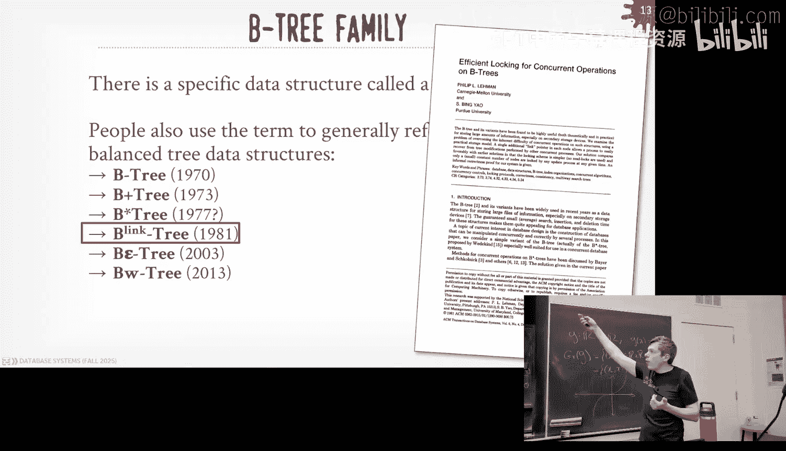
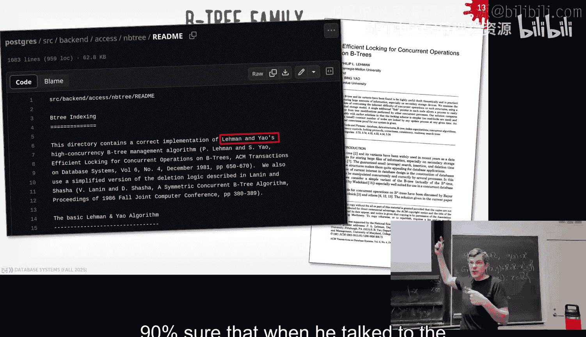
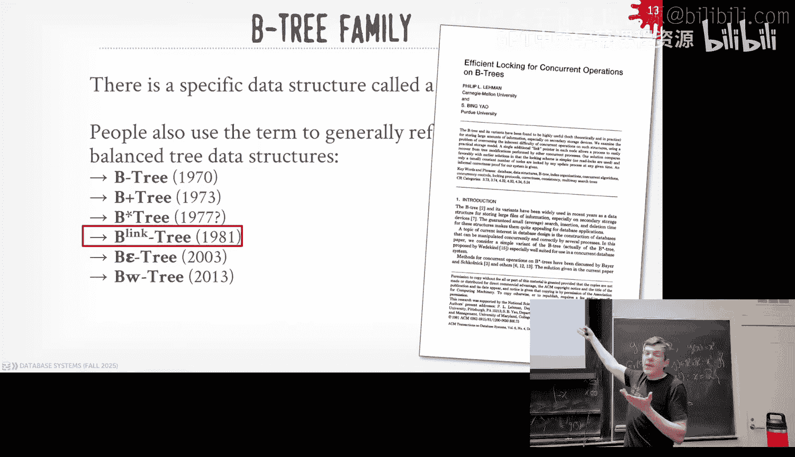
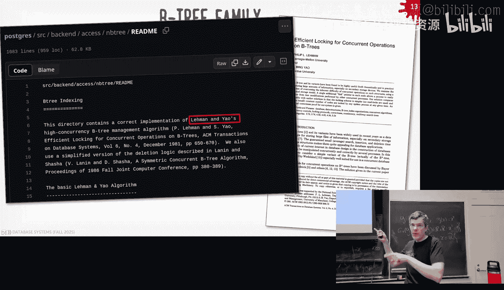
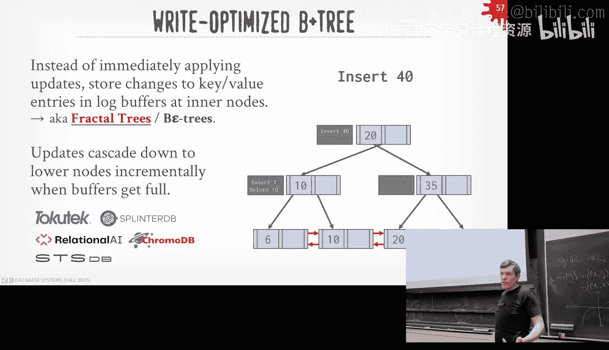

# CMU《数据库导论｜15-445 645 Intro to Database Systems (Fall 2025)》中英字幕 p08 -8-#08 - B+Tree Data Structure (CMU Intro to Database Systems).zh_en -BV1bmHGzsETM_p8-

🎼别忘玩 still开心。🎼we。🎼我是你我是。🎼。All right， roundal Paul for D cash， thank you。

A lot to cover do people have comments from feedback for you。 we'll get that in a second。

 but this is the first time we start on the time all semester So yeah。

 awesome right and it's also the most important lecture because it's me the most important data structure in all the computer science in all the world is maybe B plus trees。

 and hopefully today Ill convey to you why that's the case。

 I don't care about any of the data I mean we care about them because you need them but it's all about the B plus That's the most important thing。

All right so again reminder， Project one is due this Sunday coming up， we had recitation last week。

 the video is on Piazza is to that post there along with the slides and then as I said beginning semester。

 for every project since they're all doing Sundays and we don't have Al hours on Saturdays and Sundays normally but the day before the project is due we have a special Saturday Al hours multiple Ts for multiple hours on campus so you can come and ask hopefully what aren't last minuteute questions like how do I get started。

 like more deeper things to help try to debug things okay？

Then homework three will be released on Wednesday and that'll be due on October 5th and then just as to put this in your radar。

 the midterm exam will be in this room on Wednesday October 8th and it's going to cover lecture 1 to 11 inclusive all that material up to including but not the week of the exam so the week before the exam all of that will be on there and then I'll release a study guide with a practice exam next week okay。

😡，Any questions about any of these things？All right so also starting today is we're kicking off the beginning of our seminar series this semester so a bunch of you emailed and reached out and said I love databases。

 maybe not as obsessively as much as I am， but like I do but like how do I how can I get more databases in my life and go beyond the course so again we have these optional seminars starting today every Monday and the theme this semester will be on iceberg if you don't know what iceberg is it's one of the most important pieces of database technology has's come around the last three or four five years there's a reason why databasebricks paid I think 2 billion for it。

 billion with a B Snowfl tried to buy them for 600 million Databricks came in and kneecap them and took it for six or 2 billion。

So today will be introduction to iceberg and then next week will be Hooty。

 which is the alternative to iceberg， whether these sort of technology or systems were built at the same time。

 iceberg came out of Netflix， Hooty came out of Uber。

 iceberg is the dominant one and then following after that we'll have Mother Doug give a talk about the duckuck Lake system which is another alternative to iceberg okay。

Again， this is optional。 All right， so what I do want to cover is the feedback we've gotten through the course。

 believe it not we get emails and we get messages on YouTube and we do read them。

 So the first feedback we got is actually for DJ cash So this first guy says he heard your radio show which I heard went really。

 really well。 at least from what I heard he's basically saying like you to get more money， not me。

 you， should get more money。 this guy sweating the glove says they you got the best beats and that he wants to buy your merch so。

😊，you're doing that， right You're releasing something。

 We were You're releasing like stickers and shirts or something。 Okay， all right， awesome。

 so that'll be available for dig cash coming up for me。

 somebody said in the first lecture that I wasn't hyped up enough。

 I wasn't speaking fast enough so that you still watch me at 1。25 x。 So that was surprising。 again。

 maybe I was down that day， but I get excited I swear really fast。

 I'm surprised this guys complaining that I was too slow。

 And then this guy says that you can't be a nerd or a gangster。 youd or gangster， we can't be both。

 I don't want to comment about my past。 but like。😊，You know was I arrested， yes。

 am I here teaching you guys yes， database yes， so I'm not saying I'm doing something really malicious。

 but like whatever， I know a lot of people that they've gotten a lot of trouble in life and end up doing database so this guy doesn't already talking my place's got a photo with his kid。

So that's his problem All right but one feedback that is actually correct。

 this guy here pointed out that I made a mistake in I think lecture6 where I talked about how there's this distinction in OLP and OLAP and I made the claim that OLap was coined by Jim Gray and this guy points out he's absolutely correct that is actually wasn't Jim Gray was the other touring award winner in databases although there's for them was one of the other ones Ted Cod the guy thatvental model he was the one that was getting paid to write an article by like hey here's what OLAP is and then the article got retracted once they found out he was basically kind of shilling for this company called SP which is a data Cu you don't know where the data Cu is it's another way to Ana for column stores but this is how people did things in the 90s。

And anyway， so he's right that in this lecture here when I show this picture， it wasn't Jim Gray。

 it was Ted Co okay， so again， feedback like that is super useful。

 not maybe not be you know complain about me， but feedback for cash and feedback for the course material is always appreciated okay。

So last class， we were talking about hashables， we said these are an important data structure you need in your database system to support various functionalities。

 various parts of the system。😡，And we spent a lot of time talking about static hash tables we kind of rush at the end on dynamic hash tables so I'll pick that up again and go over that one more time。

 but most of the time these hash tables that we're talking about we be used as again for internal data structures like things that keep track of like your page table and so forth not so much for indexes which we'll see mostly how they're going to be used in B plus trees today right so again remember last class when we finished all the dynamic hashing there was essentially there was three schemes it was chain hashing where we you just keep adding things to this long chain we said oh that kind of sucks because if in the worst case scenario you're regressing to a linear scan and you're hitting up ON so we talked about these two approaches extendable hashing and linear hashing so quickly go over the example again and then we didn't get through deletes for for linearhing I want to cover that as well。

Again so these are two approaches that allow us to reorganize and resize our hash table without having to reorganize everything right when we had these static hash tables when we ran out of space so the fill factor got too big that we then basically had to make a second copy of a hash table usually double the size of the original one and then take all the keys out of the first one and put them the second one and that's a very expensive thing to do especially if your hash table is really really big so with the animal hashing and linear hashing the idea is that we can split buckets incrementally and grow them without having to reorganize everything。

😡，So in the case of standable hashing， you have this notion of a global bit counter。

 basically it's the number of bits we have to examine in our hashes so when we hash a value or hash a key。

 we're always going to get 32 bits or 64 bits， this global marker just says how many bits do we actually need to examine to figure out where to go？

😡，And then we had this bucket array that was going to correspond to bits that are the part of the hash values。

😡，So in this case here we'd have some of the bits or sorry some of the buckets only require one bit and they end up pointing to the same bucket。

 and then these other two in the bottom are looking at two bits。😡。

so then when we started doing things like， a look， about hash on A。😡。

We would look at the global the global bit counter set to two。

 so we know we only need to look at two bits to figure out where in our bucket array do we need to jump to。

😡，In this case，01， we follow that and we end up with this bucket here at the top and we find our key。

Same thing now we do a put in B， we only need two bits， it lands in this， no problem that's fine。

 now we do a put it C， it requires two bits， but then when we follow the pointer we land up the bucket here in the middle。

 but it's out of slots in our buckets， so now we got our overflow。😡。

So when we do an overflow in x hashing， we're basically going to double the size of our bucket array。

In actuality you obviously usually allocate maybe most of it or large size you're not doubling over time but also too this thing is just not that big so it's not like the whole hash table we have the keys in the values and everything else so it's very expensive to double things in this case it's not that not expensive。

Now that I doubled the size， I can split the bucket that overflowed and then I set now the global counter to three and then some of the buckets that weren't split still only require one bit in this case they're all pointing to the first bucket。

 the second ones that need two bits， point to them one here I then for the ones that we split before now they're using three bits and they're now pointing to two different buckets So now I to go back in I want to put C back in again now look at three bits I find the location in my bucket array and I follow the point0 to the bucket that I want。

Okay。So later hashing was a different approach where。Instead of splitting the bucket that overflowed。

 we're actually going to end up splitting the bucket that where something else is pointing to this thing called a split pointer。

😡，So there was a question last time， oh， this seems kind of wasteful that like why are we not splitting the bucket that overflowed or just splitting whatever one the split point is 22 and the idea is that over time things are sort of balanced out eventually you'll end up splitting the bucket that overflowed and things sort of nicely balance out。

 all right？😡，So let's go back here， so we still have our bucket array。Uh， and now， again。

 we're not looking at just the bits to just sort of what offset we are in our bucket of array。

And then we have this split pointer that's just a demarcation to say what's the next bucket we're going to split。

 so at the very beginning is going to Sunooe overflow will end up splitting bucket zero。😡。

And then these some has function， we just can hash the key。

 the mod by n with ends the size of this bucket array。

 so we have the n at this point group n equals 4。😡，All right。

 so now I want to put so'm going to get six， hash by six just say it's the identity hash mod by four and to get two。

 and then I know how to jump to my bucket array at all set two and I land to the bucket that I want and there's the key I want。

Now I'm going to put 17，17 hashes to when I'm out four and up with one。

 it points to that bucket here， but now that bucket is full， so I have to overflow。

 but instead of splitting this like I did in extendable hashing。

 I'm going to extend it out like I do in chain hashing。

 just add another bucket and have a maintain a linked list。😡。

But then now I'm going to split whatever the split pointer is pointing at so in this case here it's pointing at zero。

 so I'm going to go ahead and split that guy at the top。

 even though that's not the one that overflowed， but this is just how the algorithm and the protocol works。

😡，So now what I'm going to do I'm going to add a new entry to my bucket array so I have a slot for at the bottom。

 and then now I have a second hash key or hash function where I'm going to modify two times the original one so before we add n n equals 2 and now we're going to modify by8。

😡，I sorry by four， right？Because it' sorry。N equals two because I have n equals  four in the original one。

 going back here。And then now when I add the new hash function， now it's 2 n。 so that'll be8。

 So eventually I'll have8 slot to my bucket array and the split pointer is keep moving down。

 and then at some point， it'll wrap around。 And then I start the whole process all over again。😡。

All right so in this case here again， so we're going to take whatever the bucket at the top the split point is pointing at that we're going up splitting that so we to look at all the keys that are inside that bucket and figure out hash them again with the new hash function and figure out where they go in the case 8。

8 stays where it's at because 8 mod 80 so that stays at the top。

 but then when I take 20 and mod 8 I end up with4 so it lands here at the bottom there。Okay。

So it's not like when I do this second hash because I'm just doing 2N and the new hash function。

 it's not going to land in any arbitrary bucket， it's either going to be the original bucket or the new bucket I just created。

😡，And then this split pointer moves down by one。😡，Now when I to doing do a look up on 20。

20 modd4 is zero， so when I do my first lookup I would see that oh this thing for the first hash function is zero。

 the split pointer is pointing at now at one， so since zero is less than1。

 I know that I've already split it anything above the split pointer so to figure out where 20 actually is。

 Ive got to hash it again now with the second hash function and then now I'm going to land the location that has the key that I want。

😡，Same thing get on eight， eight mod four is just one， one is where the slip pointer is at。

 so one is equal to one， so I know I don't need to run the second hash function。

 I can just jump to the first one and find a thing I'm looking for。Yes。😊，So时间的关。我也记得。

Stment is the decision of when you use hash one or two is determined based on。

It has to do with what the first hash function points at and is above the split point。

 So going back here， I always got hash the first one。 I hash the first one。 the first time I get 0。

0 is less than one where the flip point is pointing at。

 So I know I had to go to the second hash function。ます。I past three did you， I guess you now。

He's save it is and he's correct that say I keep splitting because he keep having overflows and I'm going to keep adding new entries to my buck array up until I get to seven。

Right and then at that point， the split pointer rats back around to zero。

 I can yes throw away key the first hash function， key1 mod n or key mod n and I'll just have and then key mod 2 n will be the new hash function。

 or they say the first hash function， and then I'll have key mod for end after that。😡，Yes。

So are you dealing with the actual like is this just like a link list or something like yeah。

 his question is how do you with the overflow， it's just the bucket hashing we talk about for the chain hashing so just add a pointer keep going。

If we put something that maps to one， is that when we're going to end up splitting again。

 because it's still overflowing His question is if we yes， he's correct。 So say now， say。

This bucket here， one say was actually at the bottom， right。

 And I keep inserting into it and it keeps overflowing。 Yes。

 you would keep splitting editing up above it。 the split pointer because then eventually you'll overflow it'll get to it。

 then it'll split。😡，In this case， we already overflowed。

 so so so your question is like if I insert something again here， does that count as an overflow。

 yes。Because I mean like you could not do it and say all。

 I'll just keep going till that second bucket is full because I've already created a big deal but again。

 think of it extremes I don't want to have this really I don't I to do a linear scan jump inside that to find I'm looking for so if I can avoid that I splitting I'm worth doing that。

Okay。So again， this I've already said before， basically the idea is that we're just going to keep doing this until even though we're not splitting the one that overflowed。

 eventually we will get to this， right？😡，To do deletes it's basically just the reverse right so I want to delete key20 same thing I first do the first hash function。

 I get zero， I know zero is above our split pointer so then I'm gonna hash it again and now I get four I jumped down here I delete 20 but now the bucket is basically empty so you could just leave it there if you wanted to or you just do the reverse you could kill it roll the slip pointer back up and then that four slot in the bucket array。

 nothing's really pointing to it， nothing can get to it anyway because because my my hash function won't you ever jump to it so I could just leave it there。

Right。And the reason why you maybe don't want to clean things up so quick or eagerly immediately as it happens because if someone now inserts。

😡，21 back in， I'm going to be back where I started before and didn't have another overflow and just do the same thing all over again。

So I'm saying in implementation of this， you kind of relax the rules about how quickly you want to revert back on deletes。

Because you may it doing the same thing over again and just just spending time moving the spoke back and forth and reusing space or freeing up space and then allocating it all over again。

And we'll see the same idea when we talk about B plus3 today where。They'll be。

There'll be times where sort go through what the algorithm says you have to do。

 but in real limitations， they'll relax this a little bit because it'll make a difference in performance。

😡，O。😊，All right， so let's jump into today's lecture again the Bea BBster trees。

 so for to do an overview on what the data structure looks like and then we'll talk about different design choices you have in actually implementation and then I'll try to plow through as many optimizations as we can to we run out of time。

 but I'll cover the main ones that I think are the most interesting most important ones in the beginning。

😡，Okay， so。B plus3 are by far the most common data structure you're going to have in databases used for indexes like when you call createate index in nearly every single data system。

 you're be getting a B plus tree or something that looks like a B plus tree in some like Postgres that sport hash table indexes you have to explicitly say I want to create table using hash and then because otherwise the default is always used the B plus tree。

😡，The reason why is because B plus trees can do any search， you can do point queries。

 you can do range scans， you can do partial key lookup sometimes let's see how to do that where in hash tables you can only do。

😡，Point lookups like go get this one tuupple I can't do range scans because everything's unordered in the hash table so it doesn't mean anything there's no notion of a range but the values aren't ordered and if I have multiple keys or multiple attributes in my index key like table or column A and column B。

 I can't do a lookup on that index unless I have both columns。😡。

Because I can't go give me the hash on a and then have that having that mean anything without B because I had to have both of those keys together so B plus three is going to be way more versatile。

So now the trick of thing is going to be is the name is maybe bit confusing。

So there's going be a class of data structures called B trees。

 of which there's a specific data structure called a B+ tree。

 but then there's also another data structure called a B tree。

 but the B B+ tree and the B tree are both B tree data structures。

 but the B+ tree is not the same as the B tree。😡，I'll explain what I mean okay so but generally you know this sort of category of data structures refer to what are called tree or balance trees the original Be tree paper is roughly attributed around 1970 no one's quite sure exactly when this data maybe 1969 1970 and the original paper is basically this one here from came out of Boeing。

😡，And the second author here at Mcrete， he's actually CMU alum。

 he did his PhD here in the 60s and then he went off to Boeing and then they were building a data structure。

 mobility ability data system and they needed the data structure and they basically invented the B tree。

 a B+ tree。But the paper most people cite refer to as the original definition of the B+ tree came out nine years later。

 this famous paper called ubiquitous Beare right so again think it's early days computing and obviously there wasn' in the internet so things move slowly more slowly than they do now but by 1979 the Bre of B+ was considered the essential data structure we use in data just so much it was everywhere and they were calling it ubiquitous all right。

😡，So the challenge I is going to be is like there's original definition of the B tree。

 the B plus tree， but no one follows what this original papers is actually talk about。

 they're actually going use bits and pieces of other data structures that are extensions to B plus trees that are。

😡，Come along over the years and in particular， the one we're going to talk about today as well is called the B Link tree。

 which actually what's invented here in 1981 in Carnegie Mellon。😡，And the first author for this。

 Phil Lehman， he's still here at CMU， so he's in the fifth floor or the sixth floor at the Dean's office。

Right。The dude dude's awesome he's still here。 And so when you go look at the Postgreds code also as well。

 they're basically be implementing this data structure as well。 if you go look in the source code。

 it'll say for the actual you know the B tree B plus data structure So they're going call it B tree。

 but it actually Audi is is just a B plus tree again。

 people get fuzzy with the names but lo and behold it says right there。

 this director contains a correct implementation of lehman and Yaws highcurency B tree management algorithm comes from this paper written by the dude over there in gates right。

So。Again， so postocesis is called as B tree， but it's really a B plus tree and actually we're going to call this an NB tree。

hich is a non balance that they're going to relax some of the things that we talked about before。

I'm going to take a guess what the B means in B plus3。喂为。

Boeing yes he's seen the video yes okay so people think it means balanced people mistaken think it means binary binary a binary B tree is basically where m equals three we'll cover that in a second or next slide right but according to Phil he said he's like 99% sure or 9% sure that when he talked to like the dudes that wrote all these other papers that were at Boeing he said yeah they named it after Boeing because they were at Boeing。

Right。So right， so， so the Boing tree doesn the sound very catchy。

But people just heard it as the Pe tree。B plus tree so I'll tried to be very careful and I'll I'll make a distinction of what a B plus tree is versus a B tree is。

 but for going going forward when a database system says they have a B tree，😡，99。9% of the time。

 they really have a B plus tree。

Okay。All right， so B plus tree is going to be a self balanced ordered Mway tree that is going to support the searches。

 sequential access， insertion delets， all the things that we'd want to do in a data structure in log and time。

😡，Where M is going to be defining the fan out the number of sort of。

Pointers that are going to come out of each node which either could be to another node in the tree or could be to the record or whatever it is that we're trying to find so we define M M my that and so for every node if we say it's an M tree that'll have outbound pointers and that's the degree of the node but then it's going to have M minus one keys that it can reference inside of each node。

😡，So it's claimed it be perfect balance， meaning that the distance from the root to any leaf node will always be the same anywhere throughout the tree and these we're have to do a bunch of stuff in our data structure to ensure that this is the case and one of the key requirements is that we're going to say that every single node except for the root because it's kind of a special case or in any special case。

 every single route needs to be at least half full。😡，And then when it becomes less than half full。

 we have to do a bunch extra work to make it be half full by taking keys from our neighbors or merging things together。

😡，Right。And so the reason why this data structure should can be so important because especially in the early days。

 but even now with modern hardware， it's to be optimized for reading。

 writing large blocks of data very efficiently。😡，This data structure is going to convert what would otherwise be potentially random IO into sequential IO。

😡，And as we said in the beginning， that's going to make a big deal when it comes to actually constant time factors for actually running our system。

 if we can maximize amount of sequentialial IO， then we're going to get better performance。😡。

As I said。Some systems implement the B plustry will relax these properties。

 but we'll ignore that phenomenonnoun and go strictly by this definition。I say also too。

 the fan out is going to be pretty large， right， so M is usually a large number。😡。

think of like a of a8 kilobyte page in Postgress， I can put a lot of key values in pairs inside that thing right so the height of an real system of these data structures a B plus street has me like big four or five levels because the fan out is being quite large。

😡，But in case of PowerPoint， I have to make it fit， so we'll look at simple examples here。😡。

So this would be a three way tree， so there's me， the fan out is three for every node I I have three pointers coming out and I'll sort two keys inside each node。

So at the top， we have the root node， the middle layers， we call the inner or non leaf nodes。😡。

And then the bottom is we' called the leaf node， the way to think about this is that along the leaf node our keys are going to be sorted from this case here low to high。

 you can define you want to be the opposite you can go high to low。

 but these are going to be sorted according to some correlation ordering that we would define in our database system。

😡，So the contents of the nodes for the root and the nonle on the inner nodes is going to be alternating key value pairs of some kind of pointer to another node in our data structure。

 followed by a discriminating key that's going to allow us to determine whether we want to go left or right to find the entry that we're looking for。

😡，And then in the leaf nodes， these will be key value pairs where it'll be the actual key that we want to find。

 and then it corresponding value， which could be a pointer。

 just some data structure or something else， or it could be the record。

 in case other systems like MySQL could actually be the entire tubple。😡，For our purposes now。

 it doesn't quite matter。So way to understand these keys。

 they're basically in the inner nodes and the root。

 they're guidepost that allows us figure out where we want to go when we do our traver into the index and so for this example here。

 I'm going to say I have my root note I have key 20 so if I want to go to our left there'll be all the keys that are less than 20。

😡，And then on the other side to the right， there'll be all keys that are equal to or greater than 20。

So for any given key， I can just look at that node， look at the key。

 and decide whether I want to go left or right。😡，One thing we're going to also add as well。

 and this will make it easier for us to do split emerges in a second is add slipping pointers。😡。

This is what the be linknk tree in 1981 added for us。

So now when I want to do a look up like a range scan。

 like find me all the keys that are greater than 15。15 or greater， I could go start my root node。

 traverse down to the bottom， and then now scan across on the leaf nodes and follow the sibling pointers to find all the entries that I want。

And I don't have that backtrack and go back up to my parent to jumped out of the next one。Yes。あい。

The question， yeah， yes。where is this question。So I said what are the values of M So I mean n is just the number of keys at the bottom you would count those。

 but M would be。😡，And in this case， there's three。Because for every node right going back。

 say the one at the top， right？You have node pointer because how to go down the one side。

 you have the key the discrimininated key that tells you whether you want to go left or right based on the value of it。

 followed by the next pointer。Yes， or arrange Per， I don't see why you would need sibling printers in general。

The question is for range pointers you don't know why you need sub pointers and line me node。

 you'll need them where split emerges。But once you reach to the bottom， if you're just reading。

 you never to go back up。Yes。Not， there's three note。Question in that route now。

 there's three note points is， yes。Why what？ろ。The question is why do I need three note pointss。

 I'm 1 point to two？😡，How am I allocating this？They get a real system。

What's the backing memory of this？No， no， no， what's the backing memory of the data in a node？Like。

 I got， I have stored the node， the content of the node somewhere。 What am I storing it in。

What is a page？Pages were all fixed size， so in my PowerPot example yeah I have two points coming out of it。

 but in a real system I'm going to allocate a4 kilobyte8 kilobyte page。

 I have to you know I'm going to allocate the space for it， so it's always going to be there。😡，420号。

喂。I that explain about。Because his question is why did what I just say explain what their three pointers because it's not like an inmemory data structure where I'm just call malloc and they only get the data that I need。

 I'm going to go to the Buffo manager say I need a page and you're to get back an8 kilobyte chunk of memory so I'm going allocate the space for it in my diagram yes the space is not being used in a real system and you would have that space allocate anyway even it's not still not being used。

😡，Okay， so on the leaf nodes。I'm just showing that that we' had pointers for siblings on the backside of the array。

 right？So at its core。😡，What is what is the P plus3？What are we doing？He says binary surgery。

 over what？Yeah， but what's the data structure at the bottom？What is this？No， have to but linkless。

 right？So all this data structure is and all these three data structures is just allow us to jump into our linked list more efficiently because otherwise。

 without this stuff at the top， what do I have to do。

 I got to scan along linearly on the lymph node to find the thing that I want。😡，Right。So， sorry。

 go back。It's not that exotic if you just think about the top part is just this scaffold and we're going to build on top of this linked list so that we can jump to the bottom to find the thing that we want or the keys that we want。

😡，Sktless， basically the same thing， tries a little bit different， but at the end of the day。

 that's what this data structure is doing for us。It allows us to jump to locations in our linked list without having a scan from beginning to end every single time。

😡，Again， because always think it extremes。If I have a billion keys or trillion keys。

 I don't want to do with that linear scan every single time。

 my people street will me to jump into it。😡，And as I said before。

 the fan out will be quite large in a real system， so I'm long have to jump down at mostly five levels。

😡，And I could represent a lot of keys in my leaf nodes。😡，All right， so the leaf nodes themselves。

 I'm sorry the node themselves are just thinking of the rays of key value pairs。

 right the values that we're to be storing going to be different based on whether we are an inner node versus a leaf node right if it's an inner node。

 the values are going to be pointers to other nodes and these are just page numbers。😡。

as I can do a look up in on the buffer hole to go get the data that I want and then the leaf node will vary based on what actually want to store do I want to store recordedies to pointers to tuples。

 do I want to store the entire tuple itself， I could do a MysQLl and SQL light。😡。

In some systems like my seaL as well， the leaf nodes are actually stored our primary key as the values。

 so then I can do take the the primary key and do a look up in the primary key index。

 actually again get the record ID or get the table， right？😡，And then for nullles。

 we have to treat them specially and typically you either put them at the beginning of the list or the end of the leaf nodes。

 and by default and Postgreds， they put them at the end。😡，So again。

 I'm showing this sort of diagram like this of you know in my before because it's to fit in PowerPoint。

 I'm showing these sort of key value pairs over and over again in actuality。

 a real system wouldn't actually store it like this。😡。

You would have some extra metadata that you restore store it at the top。

They say like what level I'm at， how many slots can I store with my previous pointer and next pointer。

 sometimes there's additional metadata say like how many keys do I have inside here。

 what's the high key， what's the max value I can store my page。

 some extra things that make me find data more quickly。

And then you could distort the example I was showing shown before where you just have the key and key followed by its record ID or sorry the pointer right afterwards as the value。

😡，In a lot of systems instead what you do is you store all the keys sorted as a separate array。

 then you store all the values just in a fixed length array or some kind of array that you can then jump to offsets like we did in the column store based on whatever key that I'm looking for so now I can if I want to find the key that I want。

😡，I could just do binary search on the key array and not have to jump over data that I actually don't need。

Yes， I still don't get the relationship between a node and node one， especially it's one node。

 one page， not always， but you just you could for simplicity， think of it like that， yes。Then if a。

The databases page is 8 kilobyte， the node is going to 8 kilobytes。😡。

That's what I'm saying the fan outs be going to be quite big because you can put a lot of key value pairs in8 kilobytes。

With that？question is when will not be one page， give me few more slides。

 sometimes my keys me quite big and I got to overflow。讨论问件工作。

question is how do you maintain sort of keys？I pick your favorite sorting algorithm， quick sort。

it's in memory This question is does that mean whenever a key is sorted a key is inserted。

 am I going to re sort it in most systems yes， you don't have to。But in general， yes， but again。

 like it's in memory， I'm already reading it， so I hold I hold the latch on it。

The mut text on it so I can do whatever I want once I have that。

Question that's a lot of movement this is going to fit in cash lines， it's not going bad bad。

I can sort 100 keys pretty quickly。Yes， sorry， question is keys be very length， yes。

 we'll solve that give me a few more slides， yes， that makes it harder。All right。

 so I've already said this， what are going to be the values in our leaf nodes and most systems are'll be the record ID and it's like a page number and the offset and that's going to be always fixed length and thatll allows us to jump to find that we want。

😡，In other systems can actually be the two of themselves and we saw this in index organized storage in MySQL and Postgres and Oracle and other systems。

 right MySQL and SQL light get you this by default like when a createate table you get it and SQL server it and Oracle。

 you have to explicitly say that I want it。All right。

 so now that they understand the basics of B trees and B plus trees or you know the basics of B plus trees。

 but they make the distinction of what a difference between a B tree is and a B plus tree。Actually。

 this be 1 not 1971。But in the original Be tree。All the were values could exist anywhere in the inner nodes。

Meaning if I' doing Traversal to find the thing that I'm find the key that I want。

 I may hit the first root node and then I'll find the key that I want and then I get the value right then and there。

😡，In the plus tree。The values， again， like the record ideas or whatever it is that's actually representing the data of the tual that I'm trying to find in my data structure only exist in the leaf node。

So in order to find whether a key exists， I always got to get down to the leaf node。😡。

And it's either there or not there。So bee trees are going to be more efficient in terms of space。

 but。I now got may have to do this depth first search and jump up down and come back into the root over and over again to try to find the thing that I want。

 and that's going to be random I O that's going to be bad。In the case of a B plus tree。

 once I get to the leaf nodes， ignoring split emerges。Once I get to the leaf node。

 I'm trying to find data， I can do sequentialial scans to find the things that I'm looking for。😡。

And that's a key distinction， so when we delete a key now。😡，It may in a B plus stream。

 it may still exist in the inner nodes， but it'll get removed from the leaf nodes and that's okay。

In a bee tree， if we delete a key， it has to be completely removed from the tree。

Red black trees work the same way， all the other ones work the same way。

 but theyre going be they're going to have their own issues。Right。

So bee plus trees are going to be slightly larger than bee trees， but。

We're going to get better performance because we do more sequential scans and actually we'll see in two weeks or next week。

When we start having multiple threads jump into our data structure。

 B plus trees are going to be way better than a B tree。😡，All right。

 so let's first talk about how we going to insert， so the protocol。

 as I say for doing a lookup is again you just look at the keys。

 figure out what you want to go to left and right and then jump down and keep going until you find the leaf node and you either find the data you want or you don't。

😡，Now to do an insert， we're going to do that same lookup procedure where we're going to traverse the data structure。

😡，Find the leaf node that should have the key that we want to insert。😡。

And then go ahead and try to insert it if there's enough space in that leaf node， rate， we're done。

If there's not enough space being all the rays full， then we have to do a split。😡。

And that means in this case here we want now redistribute our keys that are in the node that overflowed to other nodes。

 which then may require us to then do a bunch of splits going up the data structure。

 so upon insert it may have to reorganize the entire tree in the worst case scenario。

 but in most of the cases you know most cases we'll have enough space in the leaf node we're trying to insert into。

😡，And then worst case scenario we'll have to then maybe split our parent。Right。

And then split process， we're just going to rediststrict the the keys evenly by just taking whatever the middle key is and using that as the halfway point。

 split things in half， and then push the middle key up as a discriminator in the tree above us and recursively do this until everything's balanced。

是。So going back to a really simple example here， now we have again a four8 tree with three keys。

 so there's four branches that could come out of every single node。

And then we have our sort of range ranges here， and now I'm showing like just four greater than equal to4 and less than 12。

 like here's the more compact form of that， right。So instead say I want to insert six。

 so again I started my root node， I look at the keys that I had there。

 six is greater than 4 but less than 12， so I know I want to go down to this leaf node here。😡。

But this note is full， so I have to split it。So what I'm to do is I'm going to end up creating a new node。

 a new leaf node that's currently empty， then I'm going to take half the keys in my first node or take all the keys。

 figure out what the middle point is， half the keys are going to go in the original node。

 the other half of the keys are going to go and see the other node。😡，She would end up like this。

The six went into the original node， but 9 and 10 got moved over to the other one。Am I done？No。

 right now I've got to go back up to to my parent and add a key there to make sure that if anybody's looking for nine to 10。

 they know how to go find it。So in this case here， I could just choose the smallest key on this node here。

9 is basically what I split on before。And put nine at the top there。And this point I'm done。

And I just update my， well， you wouldn't store this the ranges like here。

 the keys essentially giving you that ranges。Because when you traverse the tree。

 you know how to interpret the contents。Okay。Yes。那个话那个。The question is， you don't remove the nine。

 why would you do that？I mean， they moved the night。Save it is why don't I remove the9。

 but the key exists， it has to exist in the leaf nodes。😡，So going back here， nine was in here before。

😡，59，10， nine's in there。Same is， and he's correct。 Any key that exists。

 My data structure has to exist in leaf nodes， yes。😡。

All right question is why isn't four there because four might have got four was inserted and then got deleted。

 that's okay in a B tree you can't do that in a B plus tree you can。All rightLet's do another insert。

 let's now insert eight。again， root node， we followed the pointer eight is less than9 a greater than four that takes us down here。

 we go ahead insert， and that's fine， right？😡，And let's look at， let's look at a bigger table。

 So I want to insert 17，17 should go here。 that's why we to absorb that。 Now， I want to insert 16。

16 should go between 15 and 16， but there's not enough space in here where I I can store it， so。

I can I want to split the note again。So essentially I'm going to create a new node and then shuffle all the keys from the new node that got overflowed。

 but half on one and half of the other， right？😡，So I split on 16 so everything 16 or greater goes to the new node。

 everything 16 less days in the original node， but now I have to update my root parent， in this case。

 the root node to now add 16 there so anybody that is coming down can find us。

But of course now the problem is our root node is full as well。

So again you recursively go up and keep trying to add insert new keys back up and if you have to split your parent node。

 youve got to run basically the whole protocol again， and as you go up from one level to the next。

 you don't reorganize anything below you because you've already handled that make sure it's balanced。

 but as you go up and make sure everything else is balanced until you reach the root and you're done。

😡，So in this case here， our root node is full， so we're going to split it again and then grow the tree and make it taller。

So。13 is going to be get moved up because that'll be the middle key for our for the new root of the entire tree。

And then 16 is can and put where between 9 and 19， right。

 But now what we need to do is split this because any time I I've inserted something up。

 I had to split whatever node that that has got overflowed。

 And so I'm gonna create two new nodes here。 while you just copy。

You create a new one and then reallocate things in the original one that's fine and then now I update my root node。

 the new root node in 13 to now point to values is less than 13 which is 5 and 9 and values greater than 13 which is 16 and 19 on this side or greater than equal to 13。

 which is 1619 here。😡，So the new organization of the discriminator keys looks like this。Yes。

 is there a reason why when we initially try to insert16， we don't just。

Move stuck to the net because like， I think you go。Very beginning。ですど。In the node on the left， like。

There's just space here。Yeah。Yes， so he start optimization and we'll see this when we do deletes。

If I'm back here， I want to insert 16， I could recognize， oh well。

 the guy on where node 911 are or even 2021， 23， they can absorb one more key so I could follow my sibling pointers and just shuffle things around。

 move 13 and 14 over the other one and then put 16 in this one。

 I wouldn't have to split it you could do that it'ss basically what you do sometimes it deletes some other things it's just more machinery。

RightIt's an optimization like like I'm just to turn to the basics first。But yes， you could do that。

And it still would be correct。And then the question always people ask is like going back here。

At this point here， why not just say we're done here。

 why do I have to create a new new node at the second level because then it's actually no longer balanced right？

It doesn't follow the protocol where we have exactly you know it still the traveral is still at still correctly correct。

 but from the top point from the root's node perspective， all of the keys are on one side of it。

 not the other side so it's not considered balance in that way so that's why we always have to split whatever the one whatever the level does overflowed to trade new nodes and then reconstruct the tree like that。

And again， in the since these are all back by pages。

 if all the keys on this side of the tree were out on disk and not in our buffer pool manager or not in our buff pool。

 we don't have to bring them in to do anything because we're just updating pointers to。

the page ID is for the other parts of the tree and so the nice thing about this data structure is that we just。

 you know there's parts of the tree that we don't need while reorganizing things。

 they just can sit up and disk and not bother anybody and not take up space。😡，All right。

 so look at the deletes， the deletes are basically the opposite of this。Again。

 the idea is that when we' going to delete a key， if after the deletion of a key from a leaf node。

 it' still at least half full， congrats， we're done， we don't do anything， right？😡。

If though deleting that key now makes us less than half full。

 we can first try to redistribute and rebalance the data structure and the way he was suggesting by trying to stealing keys from our siblings。

So that again， we don't want have to reorganize everything all over again。

But if stealing a key from an adjacent node and usually you only look at sort of the one guy over。

 you don't try to look at all your siblings。😡，If， if you can。If you can steal it without rebalancing。

 you're done， though if you steal a key from either one of your siblings and makes them less than half full。

 then you have to do a merge。And in which case you'll end up deleting a key。

 discrimininate a key on your parent above you， which may again recursly go all the way at the top and cause you to rewrite the entire tree。

😡，All right， so let's hear we to delete key6。We go ahead and delete that doing turtle。

 right now we're less than half full after that。So we can try to borrow from a rich sibling being a sibling that can absorb a delete from us and still be more than half full so in this case here we can take nine from our sibling going ahead and put that data structure。

 but now we need to update our parent pointer or parent key for the discriminator because anybody looking for any value greater and equal to nine in this current form of the tree would end up falling to along the right side and at least this leaf node and then completely miss the key and think it was actually not there when actually was there so we got to go up and update that guy here by putting 12 there。

And then now tree is considered correct。Yes， so in like a production system。

 if you're going to do something like this， would you store metadata about them？

Children in the earth and number of mentor you just scan over。Okay。

 so you said in a protection system when you meet sorry， was that oh production， sorry sorry。

 sorry yeah， this question is。How do you find out whether you can steal keys from your neighbor？Yeah。

 to the you only look at the you own the next door， the next door neighbors。

 you don't try to look at all the positive siblings。You could， but its just like。

Now you're taking latches， which again we'll talk about next week。

 you're just taking more locks and taking latches， not locks， taking latches。

 and that just can slow everything else down。Yes。S管。Yes， yes。

But for simplicity for it was assuming leaf node。All right， let's look at a more complicated example。

 so I'm going to delete key 15 here。😡，So again， if I delete key15 for this node or when I delete key15。

 the node is less than half full， so I can borrow for steal from a rich sibling and then 17 goes over there。

 update the parent now to put 19 there and now everything is all co and correct right so that's fine。

But now I want to go ahead and delete 19。RightSo I delete 19 and I want to try to see whether I can steal from one of my neighbors and I can't because if I take either from 1317 or 21。

23， if take from any of those nodes， they'll be less than half full and then now that's not balanced and we've got to fix that。

😡，So in this case here we don't have a choice we're going to have to do a emerge right so we're going to merge from our neighbor to our right。

 it could do from the left， different systems do different things。

 it doesn't matter right long as we sort to go one way， it doesn't matter。Actually。

 I think you go both ways for simplicity， most of people go one way。

All right so we're going to go ahead and merge these guys。

 so in this case here we're going to basically take all the keys 2123 and put it in the node where 20 is located here and we have to then delete the discriminator key in our parent because doesn we don't need to point down now to this other node that doesn't exist anymore right？

😡，So after we do this， our leaf nodes are all balanced。 that's fine。

 But now this parent node is less than half full。 So now we got to do this got to do a。😊。

We have to do merge essentially to do this because it's the root we can to pull the root down。Here。

 merge these guys together into a new node like this。And the Hyide tree has shrunk。

And then all of the discriminator keys correctly point to the pages that we want。

The full balance actually like first September。Yeah so his question is what do I mean pull down yeah you would see well this guys under full if I take my sibling following that sibling point number not showing in the diagram then that guy would be under full so I have no choice but to go up in this case heres the root so therefore I know I can bring it down and then collapse under together into a single note。

But thing point out here， so I deleted key 19。😡，But I still have key 19 in my inner node。

 And again in a B plus Street， that's okay because it's just a guy poster tells us where to go find the things that we want。

 You wouldn't actually say， oh， I got key 19 in the inner nodeode。 I'm looking for key 18 I'm done。

 You always have to check the leaf node to see whether that actually exists or not。 So it's okay。

 The key9 needss in there already。😡，Which means that we can throw away anything we don't need in our inner nodes when we do this compaction or merging because。

😡，Again， we're not throwing away real data long as our discriminator keys correctly point to the parts that we want in our leaf nodes。

It's okay for us to go from five keys to four keys。Yes， his question is。

 has the ruben underfilled from the beginning in this example， yes？The root is like special case。

 you can kind of let that you can let that go less than half full， that's usually how it works。Yes。

 if the with 5，9 was full we。Read to。Yes， question is， the root。

 if the node 59 could handle taking sending a key over to the sibling， or do you had to redistribute。

 and you wouldn't have to touch the leaf nodes。All you'd have to do say there was key I don't know，4。

5，9， and I send9 over right all you need to do is drop the pointer from from use the laser pointer。

 drop that pointer here， Give rid to this then now you have a new one point to that。

 and that's all fine。 Yeah， that's fine。Okay。Well， if you follow this so far， congrats。

 this is the Beaball Street。Of course， the devils and the details implementing will be challenging for Project two。

 but the gist of it is pretty straightforward。The challenge really comes to be when you start having to do current access of doing split emerges while other threads are trying to read and write data at the same time。

 that's where things get tricky。😡，All right， so I sort of mentioned this before that the great things about B plus trees is that you can use composite keys or composite indexes。

 use them as composite indexes， which basically means you have a key that's comprised of multiple attributes。

😡，So I can create a table on a create index on table XXx。

 and in here you can see that I have I'm using three columns， A， B and C for my key。

 and I can also specify additional metadata about like what should be the sort order on a per key basis。

 or whether I want the nulls be first or last on a per key basis， right？😡。

And then now in a B plus sheet because I'm not hashing where I'm sort of randomizing the keys。

I can do a bunch of different lookups on having either the entire keys or all the keys or a subset of the keys。

 and everything just all works。😡，So again， a key of index on A B and C。

 I can do a look up on A and B and C， or an next on A and B， and then some systems。

 Oracle and now or postcur analysis has two， you can do what are called skip scans or partial keys where I don't have the prefix。

 I don't have A， but I can still do look up some B and C。😡，There's extra machinery to make that work。

We'll see that in this slide， Okay， so again， save key on A and B。

And so again you see that the keys now are comprised of multiple things and these are just the bits stored sequentially after another not there's nothing that's really special about it and because it's now it's all declared in SQL I know what the size of the data type I'm trying to store is so I know how to interpret like a byte array as the first 32 bits is the integer for keyA the next 32 bits or integer for keyB。

😡，All that because it's in the catalog when you created the table or created the index。😡。

So if I want to do a look up on key12 or A equals1 and b equals2。

 so again I just jump to the first node， I look at the first key in my composite index or composite key。

 one is less than one， and then two is less than to equal three。

 and I know how to then jump down to the leaf node define the thing that I'm looking for。😡。

So that's the you look up when you have all dashs look full lookup。

If you only have the first key and not the other keys like a prefix lookup when well in this case here。

 I just do the lookup for the first key that I do have one is less than equal to1 I then jump down to this leaf node here。

 but now since I don't know。😡，Since there may be multiple keys or multiple key value pairs in my leaf nodes where the key A equals1。

 I have to scan along the leaf nodes until I find the first entry where。😡，Key A does not equal one。

So in this case here， I would come across the second last key， the next key in this leaf node。

 the keyA equals 2， I know that doesn't equal1 so I can stop scanning there and not have to look anything after that。

So Im can do a squ scan one leaf in and find everything I want。And the last one， as I said。

 you can actually do the a suffix search or Oracle call some skip scans。Basically。

 he says like I don't know what's in the prefix of my key， I don't have that。

 I have I only' have the second part。So I I don't have A， but I have B。So in this case， here。

 there's nothing really magic you could do。 you kind of got to look at everything， right。

You got to look at all the leaf nodes。But you can do this in parallel。

 they can all scan across leaf nodes until you find all the matches that you want where B equals 1。😡。

Because again， it's sort of this key is first sort of on a， then B， so all the A's。

 know a equal ones going be on one side then twos and threes and so forth。

 and then the B values are kind of they're sort of within each subset of the a values。😡。

Like group like a group out with multiple columns。Yes。So。Ass the origin of Matthew。

We order the teasman。When there is like。てつ。Would do I reorder the keys？Good indexes like P A and N B。

If I write but E equals 2 and a equals1。this part your AB。His question is。

If I do I have to specify in my SQL query my wear clause the keys in the same order that the index is defined on。

 no， again， it's declarative SQL says I do a look up on a equals 1 and b equals 2 right I can do b equals 2 and a equals 1 semantically the same。

😡，Because you wrote them in that order doesn't mean I'm going to run to them in that order， right？

But actually smart enough to see that Its the question is。

 are the cr hinges actually smart to see that the good ones are？😊，Right。U。

 but most of the ones you can think of like oracle Postgres MySQL， all them and not， they'll do it。

 right？When we talk about join ordering， there's a bunch of systems。

 it a join ordering you basically want to figure out the right way to join order the join tables and that way you can have a huge difference performance there's a bunch of systems where that they'll go in the order that you define in the SQL here and they don't try to do reorderit it for you the good ones say like I don't care how you define it I'm going to figure out the best way to do it。

😡，Right so Oracle used to do that Oracle in the 80s， we'll cover this later used to say， oh yeah。

 know we're gonna give you a query plan in the order that you define the tables because thats they call it a semantic optimizer it was all it's like oh here' this is the order you meanted to be in so we're gonna run it that way even though that wasn't actually what the right way to do it is。

😡，We'll cover this later， yes， there's a lot， a lot of systems forgetting this right， it's not hard。

😡，Join order is the harder one and some systems will cheap out on that。Okay。So all right。

 duplicate keys。So。We've talked about primary key indexes。

 primary indexes have to be guaranteed unique， right primary key has be guaranteed unique。

 you can also have secondary indexes where again you can define that the secondary index has to be unique on the keys。

😡，In actuality though a lot of systems actually still don't store things。

 they still will have duplicate keys because you may do multiversioning， we'll cover that later。

 but I may have multiple versions of the tuL that they're all going to have the same primary key and Ive got to put this in the index order to find them。

😡，So how do you handle that？ or think of like people。

 if you have an index on the zip code for people's address。

 mailing address is a bunch of people that live in 15217。15213 we in Pittsburgh， so I can't have you。

 you know how am I going to handle having duplicate keys in that decade？

So there's two ways to do this。 The first one is the right one， the second one， don't do this。

 right So the first one is。You basically store a hidden value。

 sorry hidden attribute in the key of the index， that's going to be the record ID of the thing I want to point to。

😡，Remember the record it is like a page number and an offset。

 it's again to be physically unique for every single physical value。😡。

So even though I'm going to declare my index on the zip code。😡，I'm asking storing the key。

 I'm also going to store the record ID。😡，And it to be hidden from you as the end user。

 you can't see it through SQL。😡，And the reason why B plus trees are going to work for this is because because we can do that prefix scan。

 because if I have a index on A and B， but I only have the value of key A， the first part。

 I can still do lookups on it。😡，So now I could do might look up on the zip code without having your record ID and all entries find all entries that I wanted。

😡，The alternative is do overflowed leaf nodes。嗯。Now， we'll see overflow node that handle large keys。

 which you kind of have to do， there's no way to get around this。😡。

But if you want to handle duplicate keys， you got to overflow on the leaf nose。Don't do this。

 even though it's going to look very similar， one is sort of。

 I think this is all semantic like one is sort of overflowing down versus a across。

 don't do the down one， do the across one。make my second next slide all right so the first one append the record ID D so the key now is going to be whatever the real key is I define like on in column A。

 but also in that same byte array for that key， I'm going to show the record ID。😡。

And that'll be guaranteed uniqueness because there's only one physical tripleple that could be at some physical address in my pages that an offset。

 so this guarantees uniqueness， even though I may have the same key over over again。😡。

So now I want to do key， so I'm to insert six is my data structure， my B plus dream。😡。

What I'm really doing is inserting six， followed by the page number and the offset。😡。

And then now I just do the traersal down looking at the first key versus six。

 then I land into whatever the leaf node that I want and store the thing I want in this case here。

 I have to do a split。And everything works out fine。If I want to overflow node。

 so I already have key6 in my data structure， now'm going to sort6 again。😡，So I traverse down。

 I ended this leaf node here， see that it's already full。So I'm going to add another page。😡。

U to it and just maintain like a linked list going in the vertical direction going down。

Viols that log you know login lookup because now I have to jump to this one and maybe keep scanning。

 but it's sort of like the chain hashable where I can just keep adding buckets my chain in order to accommodate when I have overflow it's basically the same idea。

😡，I'm going to start seven， so for say me out here。

 so in this case here I can absorb a bunch of rights into this overflowed leaf node here and I'm not changing any of the discriminator keys in my inner notess up above。

In certain sex， you do the same thing。The reason why this's a bad idea is because。

If I need to now do a split。Because I want to insert say key 7。

5 that logically should go between seven and eight。

Now I got to do a split and now I got to remove all this all the crap down below as well。

 I had to scan them all scan them all， bring them all into memory。

 figure out where they need to go and split them up and they now may have overflows on both sides or both the new pages。

 yes。那不道什况。you。So。This question is， for this one here， because C6 already existed。

Am I only inserting the page number and the slot number and the mag nu I' inserting or all the keys has to be all the keys。

😡，只是今天一句话。The the question is， do you change the B for B plus3 for all the keys， yes？

Postgret does this。No systems had to use。Okay。So。Cluster indexes is basically the idea。

 sometimes you hear things where as cluster index or cluster table。

This means sorted a sorted table and as we sorted based on some some B plus tree up above。

 right you can't use hash index a hash table because that's not sorted。

 but it'll be B plus3 up above。😡，And so。If you do index organized storage like MySQL and SQL light。

 you get this for free because the leaf nodes are sorting the data based in the primary key of above in the internets。

😡，In some systems you can create a table using heat storage so unordered tuples。

 but then you can tell the data system oh， by the way， manage this。

 make sure that things are sorted based on this other data structure here and in some systems they'll maintain it or if I insert new things or make sure everything's still sorted in other systems like Postgres。

 you can call there's a cluster command， it'll sort your table based on some index but it'll do it once。

😡，And then if it's updated and change over time， it doesn't maintain the sort order。

 you've got to run the cluster thing again。So the reason why this matters is that it's going to make a。

It can make our lookups more efficient in many cases right if get things from disk so if my table pages are sorted in the same order that's defined by the index。

 then when I want to do a scan and try to find data。😡，I can just again。

 use my index to find some offset within or some location at a table page and then scan along the rest of the pages and I'll find everything that I want。

😡，Where things can go wrong is that if the。The index is going to define one sort order。😡。

But then the tables， the data gets be sorted in another sort order。

 I may have really inefficient access if I naively retrieve whatever the page is that the index is pointing to one at a time。

😡，So let's say I'm trying to find some range of data between these pages here。

 and so if you look at the pointers in my or the record IDs in my index and the leaf nodes。

 they're basically pointing to all different locations in these different pages。😡。

So if I do a sequential scan， just starting at whatever the first key that I want and then just go get that data then go the next key in the order to find the index。

 I'm gonna to start jumping around at these different pages over and over again。

 unnecessarily so if you think of like a really stupid system only had like one slot and one frame in our buffer pool。

 I would read page 102， throw that away then read page 103。

 throw that away and then read page 104 in which case here I have two keys that are both in page 104。

 and I can read read that page， use that page twice right？😡，So in a bunch of systems。

 a simple optimization is you'd actually first do a scan on the index。

 find all the record IDs and the corresponding page IDs that you know you're going to need to access。

😡，Sort them by on the page ID and then now go retrieve them in that sort order。

 so that guarantees I'm only retrieving each page once and only once。😡。

I still have to maintain some metadata to keep track of like what's the key sort order that came out of the index。

 but I'm basically going to scan the index first， figure out what I need， then go get it。😡。

And you can start playing other games， we'll see next class or in a couple weeks where like if I have to do if I like where a equals one and I have index on that and B equals two and I have a separate index on that。

 I'll do a inexcan across them both， then do a intersection of this two list of page ID to figure out what's the minimal set that I actually need。

 then go get those pages。😡，Postgress calls this a bitmap PE scan。

So we can use these indexes to help us be more intelligent about going into the day that we need to avoid random eye。

😡，All right so。Let me get through the node design choices and like I said I want to plow through as many optimizations as we can these ones pretty straightforward and again just to reiterate how important this data structure is just for humanity there's a book written about 10 years ago on modern B plus trees so here's like a data structure from the 1970s but here's all the modern incarnations and optimizations you can do to it to make these things go better and again it's so important that they wrote a second book that came out last year on more modern B plus trees and the guy that wrote this is we're gonna to see multiple times throughout the semester that he's going tovent the iterator model of the volcano query processing model he's going to vent the way we want to build query optimizes he's going to vent the way we're going to do parallel or parallel operations in our data system so this guy is brilliant and he's written the definitive guide on B plus trees。

Again， notice though he calls them bee trees instead of B plus trees， but it's the same thing。

All right， notes size should be pretty obvious that。

You can have different node sizes for the inner nodes versus the leaf nodes。

 typically you want to maybe have larger inner nodes and leaf nodes。

 assuming you're not storing the tus themselves or just record IDs because then you can have a within one node you can have a higher fan out and find things more quickly and then of course the size of the node is going to depend on what the hardware looks like so the way the research basically plays out is that if your hardware is very very fast your storage is very very fast like in memory。

Then you actually want really small node sizes because you want to be able to go go acquire the latch on one small page。

 find what you want which you can do quickly， immediately jump out of that。😡。

But if your harder or slower， like a spinningitting disk hard drive。

 then you want your node sizes to be maybe one megabyte。So in a system like Postgres。

 you can't vary the size of index pages， but in enterprise systems like in DV2。

 again you can specify different page sizes on a table basis on an index basis。

 and I think they can even discriminate between the inner nodes and the leaf nodes and have different page sizes for them。

😡，So the merge threshold we talked about is like if it's less than half full。

 then I have to do a merge or try to save with my sibling， right？If you follow exactly that protocol。

 then you roughly end up with the occupancy rate of about 69， 70%。

 so about 70% of your nose are going to be full at any given time。Right。

So if you can delay the merge process as long as possible。

 then you can avoid some unnecessary discoo because you're not in the situation where I'm merging and then someone immediately insert something and I have to split again so you want to let things kind of go a little less than half full for a while eventually maybe say oh I'm not using this space and me go ahead and clean it up but it'll allow you to insert handle more inserts without having to do additional splits if you don't relax this right away and so it ends up being not exactly balanced anymore。

 this is why the Postgres P plustry implementation is called a nonbalanced P plustry。So overall。

 it's balanced， but sometimes it's okay to relax that。All right。

 the last question is how to handle very length keys， so there's a bunch of a ways to do this。

 one optimization is just to store pointers。😡，So instead of actually storing the actual Waberlink key in my nodes my pages。

 I have a pointer the record ID to the actual Tple with that attribute I want because I knew how to store vberng data in my table pages that we talked about before。

 so instead of storing that in my T pages， I'm going store a record to it。😡，Yes。

Especly you still need the key to research， you got to follow the pointer to go get the key to figure out how to do the research。

😡，不样。都。Yes。Yes。Yes， go ahead。Waying more of random access， yes。don't do that。

So this shows up in the memory data systems in the 80s。

 there was a assessment from Oracle called Times 10 in the 90s that did this。

 the basic idea is like oh memory is so precious instead of storing these redundant keys because essentially the index is storing another copy of data a secondary copy of the data that in your tables。

 so instead of storing the secondary copy of data in my index。

 if I can go get the data very quickly because everything's in memory。

Then I'll distort the pointer to it。Turns out， though that random access still sucks in memory as well as definitely on disk。

 so nobody actually does this， at least I'm aware of。

 like Oracle still supports this in times 10 by default you went back to B plusy。😡。

You could have vi like nodes。Basically allows the。The size every single node could be arbitrarily different size。

 usually you do like sort of almost like a slab allocator。

 you'll have like you know a1 kilobyte node a2 kilobte node for and so forth right this one you can do it it only shows in academic systems because it requires more memory management because now the frames in your bufferable manager could be different sizes and you have to be able to handle that you're basically reimpleing malloc in your database system which may not be a good idea。

😡，A cheap out would be just padding so you know the max size of any given key。

 like it's going to be 32 characters so no matter whether it's 32 characters or something glass。

 you just pad out with a bunch of zeros at the end so that things always nicely fit。

The implementation that everyone usually does is that you just have a the same way we had a slot of pages where you could have the take a page and sort of the data is growing from the end to the beginning。

 you can do the same thing for your very relevant keys then now in you have an offset array to say for a given key here's the offset within my page to find the actual key that I want。

So the last one is usually what people do and then if you have really really large keys that don't fit then you just have you overflow horizontally。

😡，And that's okay。All right，How do you find the data within a node？

So the first obvious thing to do is just do linear search， so I want to find key8。

 I got to find it in my array， I just start from beginning， scan across until I find it and I'm done。

😡，Again it's not the full table or not the full data set so this is okay right the number of keys we have within within a node is is not going to be massively large。

 so yeah it's linear scan but。😡，It's not too bad because it's in memory。

One optimization you can do if you have certain data types that are fixed size。

 you can use CD to do vectorized operations。😡，Who here is taken 418？All right。

 was that taking right now， Have you covered CinD yet， you're right。

 Cimd basically means single instruction and multiple data。

 so think of like its a single CPU instruction that allows you to do some operation on multiple data items at the same time。

So cystD is what you normally think about like one you know one single instruction， single data。

 like one plus one equals two， like you take the register for one， register for the other one。

 you add them together a single instruction and it produces one output。😡。

SMD allows you to take a single structure and take a vector of data and do some operational and produce a vector's output。

😡，So do something like this， so say I have a you can use a 128 bit S instruction。

 is like this is Intel intrinsics or X 86 intrinsics。I can take the first four keys，4。

 five and6 I can then do build a vector of just the key I'm looking for eight and then in a single instruction I can do a comparison of the input vector with my target vector and approves a bit map that says here's here's all the tuples or here's the offsets of the tuples that match this case here another matches but it's a single instruction to do this comparison produces the output and there's other Sdy instructions then do you find all the ones to see whether I have a match or not in this case here I double match so I just slide over do the next Sd instruction on this in this case here I only have three keys instead of eight of sorry then have four so I the last one's ignored and now I find a match I see a one I know I find the thing I'm looking for。

😡，So again， instead having to do sequentialch one by one。

 I can do a small number of instructions to do this in parallel。

X 86 has this arm has this Ri5 has their own like a bunch of systems have vectorized instructions for this。

But it only works if doesn't work on strings， if things are very about length。

 you won't fix length values。😡，Another obvious choice to do binary search because everything's sorted。

I just jump in the middle， look for key8， I know key8 is greater than seven。

 so I want to look at the next side binary search over here and eventually landed in the middle。

Right。That's pretty obvious。And the last one is rare。

 so no commercial system or real system actually does this and do interpolation。

 where we just do some math and say， well， I know I have a densely packed array of keys with no gaps at 4。

5，6，7，8，910， and the key I'm looking for is key8， so I can just do the simple math and say well。

 if key8 is going to exist， then if if I take the minimum value of the max value， jump to my offset。

 then I know it's going to be here。😡，Right。Its not if you land on something that's not  eight。

 then you know it it doesn't exist。like what is the if you can't the question is the question is what if the array is is sparse not dense。

 it's not packed， you can't do this that's I'm saying it's a huge win if you could do this。

But you can only do it in rare cases。All right， three minutes left。 Let me get through。

 I'll get through four of these。All right again， again。

 the data structure of the 1970s look at a little crazy you can do this and make these things actually you work and this is what real systems are actually doing。

😡，All right first one is pointerwizzling this one is super common， I don't know why it's swizzling。

 I didn't make the name up was the 80s I think it's a reference。

 but I wasn't there and so I don't know right so when we do a look up so when we follow pointers in our B plus3。

 what are we doing right we're not actually storing memory pointers we're sting page numbers so if I want to traversal find key greater than three the first thing I got to do is look look my key my root node you know it says six。

😡，I know I want to go down to this side Okay well how do I get down to that leaf node Well I'm gonna have a page number in my in my in my root node tells me how to go down there so to get that page I got to go to my buff pool and say hey。

 go give me page two give me back the pointer in memory for the frame that has that data okay once I get that then I can do the traersal now I got to scan along the leaf nodes following the sibling pointers same thing I want to get page three what I got to do。

 I got to go to the buffo manager say hey go give me page three right？😡。

But because now we know it's a hierarchical data structure。

 we could have some guarantees about the order in which things would get evicted if we're careful about this。

 so instead of actually storing the page numbers in the pages，😡，We actually stored this the pointers。

To the actual data， we've got to pin those pages， make sure they don't get swapped out and replace something else。

Right。But now when I have a Swwizzlow pointer， I basically have a little region in my page where I can store the actual raw memory pointers because and I have to know that if it getsvic at the disk I can bring it back in this pointer not valid anymore。

 but now I can just do my look at my page and say here's directly to the location that I want as I do my reversal。

😡，And you get a huge win if you do this。And the data structure of a nice surprise is a nice guarantee。

 we would say。We can know that we can have it be， I can't。

 I don't want to evict anything in a root node or sorry in an inner node if one of its children node has been swizzgleled。

😡，Or is in memory， so this makes sure we have some guarantee about how we order things to make sure that we don't end up with pointers that go to nowhere or pointers that go to a frame that has no longer the data we want。

😡，the last one I want to talk about is， well， I'll go two more。

It should be clear that modifying the BS tree when we have to do split emerges is expensive if it's inserts。

 we just keep insert to one side and if our node has a space for it that's fast that's fine same as deletes right but the worst case scenario is that we do a delete or an insert we've got to reorganize the entire tree to make sure that it's balanced right。

😡，So。Ideally， it be kind of nice if we can delay having to do these splits mergers to accumulate a bunch of them and then do them in a batch rather than having to treat them as single inserts and updates at one at a time。

😡，So this is what's called a right optimized tree， I think Wikipedia calls them a fractal trees that was sort of like the brand name right like like Kleenex is the brand name of face tissue right so fractal trees is the brand name。

 the generic name it's also called a B epsilon tree。😡，And the basic idea here is that。

In the same way saw in my SQL for compressed pages， they added a mob log in front of the page。

 we're going to add a mob blog in front of every single node。😡。

So now when in time we want to do an operation， we don't have to maybe traverse all the way down to the bottom of the tree。

 we just find the first spot we can put something in a mo log and put it in there。😡。

So I want to insert7 so in the regular B plus， I to have to traverse all the way down and then insert it on this node here and stab what I'm going to do I'm going to put in an insert entry。

😡，In my modell。It's like the mem table more or less or not table like in the log structure storage we were restoring these log records like here's the changes I made without maybe actually applying them so I'm going to put the insert7 in my mod log。

😡，Now when to delete 10 same thing and I put it in there right so now if anybody comes along and wants to do a look up on 10。

😡，When you do the traversal， you normally do it in the P plus3， but you check the mod log first。

And the mob log contains the thing you're actually looking for the actual key that you want then you know you can stop right there because you found what you want and you you don't want the traveral so to find 10。

 I land in the first root node， I look in the Mob log I see delete 10 why I know at that point the last thing that happened to key 10 where it was deleted because that's at the top of the tree so I can go ahead and stop my search because I know I know it's not there even though physically it's still in the leaf node here。

😡，And I got to be careful and everybody scans along and tries to find it。

 there's extra bookkeeping I have to do。But in this case here。

 I don't have to propagate the changes immediately。So what you do do。

 what happens when the model log does get full， like I want to insert 40。

 now I don't have any more space in my modello， my root node。

 so then I got to propagate the changes down。😡，And then whether you just go one level down or all the way down depends on the implementation。

😡，So this is kind of getting the benefit of the log structure mech tree。

 but in the context of a bee trees， you're kind of blending the best of both worlds。😡，Okay。

This is very rare， I think the data structure wast invented in the '90s。

 but very few systems actually implement this， there was a system called Toku Tech。

 big Goop of Racona， that got the new professor William Kzel in computer science。

 his dad was one of the inventors of that data structure。😡。

Even though he claimed not to be a database person。

The best im probably that was out for a while is this thing called Sner DB from VMware。

That I think has been discontinued because the guy left to go to Cornell。

 but relational AIs and ChromoDB out of China relational Is in the US ChmoDBs in China。

 there's the two systems that I know that are pushing this pretty hard okay all right。

 quick question， yes， go for it。😡，So said， whyhy isn't this more popular because it's hard？😡。

because you have to， like I said， if I scanning along leaf nodes， I got to know how to find up above。

Okay， all right guys， see you on Wednesday， hit it。🎼我不。😊。

🎼但是说你不会自穿我足不缺。🎼Yeah。🎼开始 what你会。🎼我再从不见。🎼Yeah。🎼what你对最我走不见。😊，🎼The the maintain。

