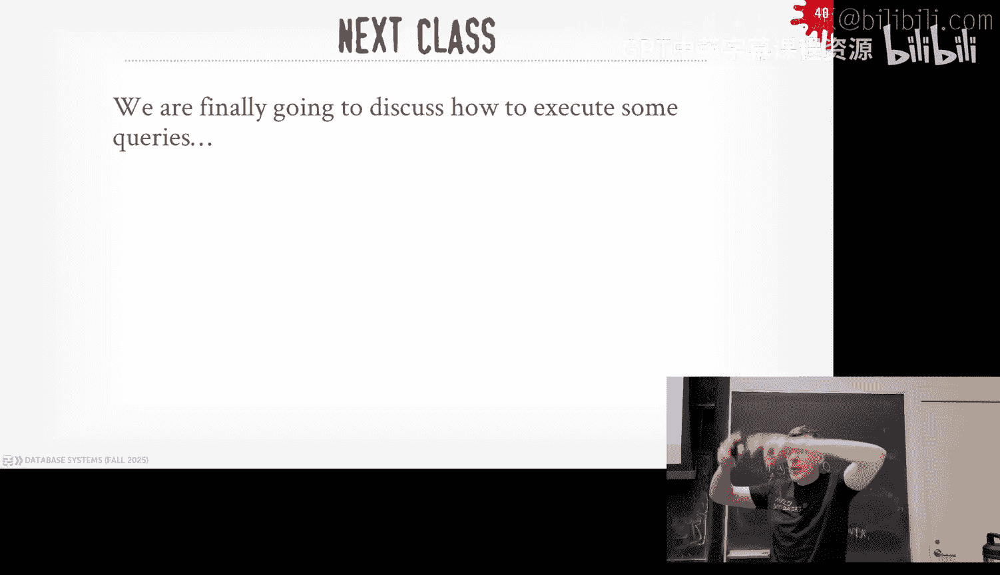

# CMU《数据库导论｜15-445 645 Intro to Database Systems (Fall 2025)》中英字幕 p10 #10 - Index Concurrency Control (CMU Intro to Database Systems).zh_en -BV1bmHGzsETM_p10-

🎼别忘玩 still开心。🎼we。🎼我是你我是。🎼。A round of applause for needed Ca， thank you。Hows your radio show going。

 I heard popping off。You know can I people call in for requests or okay again that's on Sundays at it's in the stream of Internet too right ifre outside the university you can check out Gi Ca's radio show every Sunday one o'clock Eastern right you guys in the class。

 we have a lot to cover today today's gonna be awesome that every but this was super they're all fun I like some lot though for you guys again homework Project1 was due last night。

 I think we're missing about still maybe 10 submissions from people I haven't checked the leaderboard yet。

 somebody is blowing everyone we to understand why So if you haven't finished Project1。

 please do that as soon as soon as possible Project two is out live today So you want to pull down the latest code the write up is available on the website Home3 came out last week that'll be do this Sunday coming up because the goal is to give you guys great response on the following Monday immediately afterwards because it'll cover things。

That'll be on the exam coming up next week in class on Wednesday the 8th。Okay。

Any questions about any of these？Again homework three is due the Sunday project two is due after the fall break。

 but the midterm will be next week and I'll post the study guide and the practice exam after class later today everything's done as having posted on。

我们片下次演O。😊，And then the practice game will look roughly like what the real exam will be a little bit longer though than what the lie one will be。

 okay？All right so again， for additional database talks if you can't off of databases today we have the creator of Apache Hooty or Hutie giving a talk with us after class at 430 over Zoom and then next week we have the mother duckuck guys giving a talk about Duck Lake which is an alternative to Hooty and iceberg and then in two weeks after that well have the SpioDb guys giving talk about a new file format that they've created or replace parquet and orRC called vortex So if you're familiar parquet it's from 2013 developed by like Drmeio and Clouddera it might be Twitter it might be part of that too and then OrRC came out of Facebook and so these are sort of columnarbased file formats to follow the PAs format stuff Car about4 but it's like an open source live by you can to read write these things so Vortex is a modern version of all this using sort of the state of art and coding techniques。

Again， this is optional， these are the things if you want to go beyond course。

 please feel free to join us。All right， so for the last two classes we've talked about data structures。

 again in the context of table indexes or being used at internal structures like a page table for your database system。

 but we made a pretty big assumption that when we discuss these data structures and the algorithms we use to interact with them or manipulate them。

 we assume that we going to have a single thread or single worker accessing the data at given time because this makes a whole bunch of things a lot easier because you're not worried about concurrentency control issues of multiple threads coming in and touching the data structure at the same time。

😡，So now in today's class， we need to go sort of break that assumption and say， okay， well。

 if you do have multiple workers accessing these data structures， how are we going to protect them？😡。

And it should be sort of obvious why we want to do this because in modern architectures。😡，you know。

 the clock speed of a single core is not really going up that much instead you're getting a lot more cores。

And now in actually modern systems， you get a variety of our heterogeneous cores to have some of like sort performance ones and low power ones that have different clock speeds and different points capabilities。

Nonetheless， we need to take care of using all these cores that are available to us。😡。

Because then that'll help us maximize the performance of the system， and as we see it later on。

 we'll be able to use these extra workers or extra cores to hide disk dolls。

It's like as you sort of did in Project one， you could have one thread block while it was trying to go fetch some disk and then another thread can run and make use of the system and they still make forward progress。

So pretty much what we're talk about today is how almost every single data system that's out there is going to be implemented。

 There is a small subset of these systems that don't actually do any of the stuff that we're talking about today and instead have what are called single threaded execution engines。

😡，Meaning they assume that there is one and only one thread accessing these data structures at any time。

 so therefore they could do all the stuff we were basically talking about before without bringing in the latching stuff that we'll talk about today。

😡，Most famous of these is Redis it's a single threaded executiontion engine that there's only one thread can do anything the system at any given time there's a fork or Redis called Valki from Amazon because Redis got a little frisky with their licensing and so now there is actually multiple threads to handle networking and then you can hand that off to then the single threaded executiontion engine thread which still doesn't have the lashing stuff we' talking about here for today but the basic idea is like if you assume there's only one thread you don't have to worry about concurrentency or to because nobody else can be touching the data structure sametime as you so some systems do this they do mostly do it for performance reasons and engineering reasons simplifies the implementation but most of the systems we'll talk about in this class aren't going to do this I just want to bring up say these things do exist。

So now the thing we need to introduce in our database system is what is called a concurrent control protocol。

😡，And you sort of think this is like the rules of the road or the traffic laws for how workers。

Can access parts of our system at the same time and I'm using the term worker instead of a thread or process because different systems will do different things like Postgres has multiprocess。

 most other systems are multithreaded， but if the high level concept is still the same you'd want to protect these data structures using a concuria protocol。

The basic idea is that this is how the system is going to guarantee that any changes that we're going to make to a shared object in our system。

😡，Will be be correct and I'm putting the word correct in quotes here because can mean different things do different parts of the system depending on who's doing what。

So one notion of the correctness would be logical correctness。

 and this just means that can I see the data that I should see。

 like if I have a query that inserts record you know ABC，😡，If I come back and try to read that ABC。

 should I be able to see it？Sometimes yes， right， and if somebody else deletes it then sometimes no。

And so what that that terms of correctness will cover after the midterm just this notion that there's a higher level。

Criteria may want to use to determine whether something is actually correct or not。😡。

The thing that we care about in this lecture is physical correctness。

 meaning the internal representation of whatever data structure we're using and manipulating in our system will be。

 I'll use the term sound， meaning if I follow a node in my B+ tree and has a pointer to some other node。

 that pointer better go to actually what I expected to go to it and not some random location of memory where I would have a Seg fault or read some part of memory that I shouldn't be reading。

😡，So this is what we care about today， how to make sure that the data structure itself is correct。😡。

Even though the contents of the data structure may have a different notion of correctness。

 like if I insert my record， can I see my own record？😡，That part we're not worrying about till later。

 this is like how do we make sure that the thing doesn't se fault as we're flipping bits and going down inside of the data structure？

😡，So to do this， we're first going to provide some overview about what the latching mechanisms look like。

 we don't really care about how low level details of how all of these are actually implemented。

 we really don't care so much， but it's least be good to be aware of what's actually going on with the covers with these things。

😡，We touch in the advanced class more sophisticated limitations。

 but I'll just highlight some of them。Then we'll talk about how to do hash table lashing this is the most simplest protocol and how to make sure our hash table is physically correct。

 and then we'll spend a lot of time talking how to handle this in BB trees。

 first we'll go with lashting going from the top to the bottom and then we'll deal with doing scans along the leaf nodes and then we'll finish up with an announcement on Project2。

O。All right， so I sort of auded this earlier in the semester about this notion of locks and latches and the OS people are going to call what we call latches。

 they're going to call them locks， the reason why we're not going to use the term locks for latches and keep them separated is because these locks are going to represent higher level protection mechanisms again。

 for logical concepts or logical entities in our database system。😡。

So locks are' going to use to control transactions。😡。

And think of a transaction as like a I want to run multiple queries in my application。

 and I want all those queries to be atomic。😡，Okay we'll cover this later in the semester。

 but just think of like it's a high level thing where the application is trying to do multiple operations that has to defined across multiple queries。

 and when you make sure those multiple queries occur in some proper ordering so that we produce correct results。

😡，And for this for transactions， we're going to hold these locks for the length of the transaction typically if you care about strict treedness and then the database itself is also responsible for rolling back any changes from queries that got executed on behalf of a transaction if that transaction ends up having to abort I mean if I insert 10 records and then I try to insert an 11th record and I violate some integrity constraint that's defined my table。

 they my transaction has to abort and the database system is responsible for rolling back any of those first 10 things I inserted。

😡，Not the application， so everything sort of happens transparently。Again。

 the details of this we'll about later， just be aware that the rollback mechanisms is implemented by the system because we're dealing with crappy JavaScript code。

 we don't rely on people to do that rollback for us， we have to do everything ourselves。😡。

The thing we're talking about in this class today is the latches where we're protecting the internal workers of the database system that。

 again are manipulating the low level data structures we're using to run our action system and store data。

😡，So the way to think about this is we' we want to protect the critical sections of the various data structures we have using these cles and because these are meant to be really fast operations like go and change some node then pop out right away that you're not going to hold them for long periods of time。

 we're going to hold them for。😡，Nanseconds or microseconds in some cases。

And because now these are all internal operations。嗯。We want to be。

we're responsible for making sure that if we can't do something that we don't put the data structure in an invalid state or impart state。

 that's actually mistakes， do not need but rollback changes。

 we do need to rollback changes the worker itself responsible for keeping track of what changes it made and then if's the one has to go and rollback things but they can't do all everything that it wants to do that should we do need to rollback changes。

😡，So there's this great table from the book I mentioned before about from this guy Ger' Gr about modern B plus Street techniques and he has this distinction between the locks and the latches and what they're actually used for so wait to sort of read this as going from the top to the bottom。

 you would say like latches are some kind of primitive we're going to use to protect workers。

 threads or processes from the image data structures during the critical sections。

 and the only two modes we're going to have or read and writes whereas in locks or transactions we' have。

We'll have these intention blocks and shared locks， higher level concepts， again。

 we'll worry about all that later。😡，And the only way I're going to be able to handle deadlocks if latches is through coding discipline and through avoidance。

Meaning that there isn't going to be some high levell coordinator understanding what all the different threads are doing in these critical sections and said oh。

 you got a deadlock， let me go ahead and break it apart right it's it's up to us in our code to make sure we don't have deadlocks and I'll say how show how we do that to avoid any problems because there isn't someone going to come along and and fix it for us whereas in locks or transactions if you have two transactions try to acquire locks that the other guy holds。

😡，The database system is responsible for figuring out there's a deadlock and go ahead and these killing transactions to free up break the deadlock。

Because again， we're assuming that transactions are coming from queries from the outside world external to the system。

😡，It's some JavaScript program that is poorly written， maybe doing bad things。

 and it's our job to make sure that we don't let them cause too any problems。So again。

 for this class today we're worried about latches and therefore we have to do all of this when we talk about locks。

 that'll be later in semester， when we talk about cong protocols at a higher level in lecture 15。

 okay？All right， so our lattices， since again， there's these low level protection primitives。

 synchronization primitives， only have two modes。Read mode and and write mode and it should be sort of obvious if you've take any OS class or systems class in read mode。

 you can allow multiple threads of workers to access whatever this critical section is you're trying to protect at the same time。

 as long as they don't make any changes to it so they can read the contents and the guarantee that there won't be intermittent changes while this occurs but it can't change anything。

😡，Wite mode basically puts whatever the critical section in is into single threaded mode because only one worker can hold the latch in right mode at any given time。

 and it's allowed to make any changes that at once。😡。

And it can guarantee that there's no other reader or writer thread or worker inside that critical section at the same time。

😡，So the compatible element matrix is pretty simple right if I have a readlatch and somebody else wants to acquire the readlatch。

 those are compatible， allow these two you allow the other thread to acquire that latch at the same time。

 but if at least one of the latches is a right latch then they're incompatible and you deny the request for the other worker to acquire the latch。

😡，And then we'll talk about in a second， what do we do when that request gets denied。

 like what should that worker do if it says I try to get a lash and I can't get it。

So in our implementation of a latch， we have sort of four main goals。😡，We won want our latch。

 we have a small memory footprint， I think of like in bytes。If possible， because again。

 we're going to store these now inside the data structures that we're implementing like in every page for B plus3。

 we're going to put our  lates inside of that page so we don't want this you know a 10 kilobyte data structure to maintain a latch。

😡，Inside of our page because it's space we could be using for storing keys and values， right？

We want our latch to have a fast execution path when there's no contention。

 meaning I don't have to go jump through a bunch of hoops in order to acquire a latch if nobody else is trying to acquire that latch at the same time or nobody else holds the latch at the same time。

😡，I also want to make sure that the management my latches is completely decentralized because again。

 I don't want to have to build a centralized coordinator that's keeping track of all the different workers I have running my system and what latches they hold and what they're doing because that's be really expensive for me to now to go update that information anytime I want to acquire a latch。

😡，Think like the page table in your buff bowl。It's a centralized data structure that everyone has to go to in order to get pages。

😡，And that can become a hotspot in our system。So that's why we want our latch management to be completely decentralized and we're to store the latches inside directly inside our data structure at the different locations of the critical sections we want to protect。

😡，And last but not least， goes again， the major theme throughout the entire semester。At all costs。

 we can avoid having to talk to the operating system。Because as soon as you have to make a cis call。

 now it's now going to the kernel， it's going into protect a mode。

 it's a bunch of security mechanisms that has to to make sure you're not doing malicious things。

Going to the operating system is always going to be more expensive。

 and ideally we want to do as much as we can in user space。😡，So if we can。

 we want to avoid ciss calls。So now everything I'm telling you here。Seems reasonable。

 if you come from a database systems perspective， like people actually building the actual system。

 we care about all of these things。😡，You talk to the assholes building operating systems and they think we're all idiots and they should not be doing any of these things so this is the famous post from Linus of the mailing list this is what this is 2020 so five years ago and he's making he's banging on about people particular database people running their own latches。

 which again he calls spinbox and he has this little blurb here that takes he says。

 Petee do not use spinbox and user space which is what we're going to do unless you know actually what you're doing and be aware that the likelihood that you know what you're doing is basically no。

 right he's wrong we're right， nobody in the right mind would do it the way he's proposing because you lose complete control over the system if you have to go down to the operating system。

😡，We'll see why this is going to happen in a second。

 So this is why most database systems will not do what he's proposing here and will not rely on the operating system to manage our lashes。

😡，And again， give me fewized and it'll explain why this is the case， all right。

So how can we implement our latches so the most simple one is gonna be a test and set spin lock is basically what Lis is talking about and is what is that she is in the kernel now when you call P3 Mutex so I'll set in a second but then we'll look at another mechanism using a blocking OS Mutex say test and set spin lock is what Lis says not to use he says use a blocking OS Mutex but we'll see what that looks like and then we we talk about what a reader writer lock is again there's a bunch of more advanced techniques you can use people have been researching this kind of stuff for a long long time theres an adaptive spinlock from Apple's parking lot API or a library。

 there is MCS locks， Qbase spin locks there's opt lock coupling that's used in some of the German systems the the latest number says there's a one called cosmopolitan that uses a library from Google called Nsync and with the letter N syncnc that has its own internal synchronization primitives。

 some them rely the OS。Someone that relies on the and usually spaced off。

 but in general you don't want to have to write this yourself yourself。

 there's existing libraries you want to use again， like the one from Apple。

And then this this is a blog article from almost a decade ago from a a locking library for our world a latching library that they built for。

 I think for the。What are the Safari browser， but they have this little micro benchmarkch here just showing how in some workloads。

 you can get about a  10 to 5% improvement over the standard Tular library P threads。

And the metdada they're maintaining per latch is much smaller than it would be using again P3 Ut。

All right， so the most simple lock or sorry， most simple latch you can write is called a Tea set spin latch or Tees and set spin lock。

 this is very， very efficient because you only need to store。😡。

Maybe eight bits to keep track of something to keep track of the latch。

The challenge though it's not going to be very scalable and certainly not cash friendlyri because our threat is just spinning on trying to acquire this latch over and over again。

 and the OS is going to think， oh， you're doing useful work， let me keep scheduling you。

 but actuality you're just burning cycles。But in some cases， this is okay。

 some cases this is not okay。So a re implementation will look like this。

 so in C Fl we can use the centert la， we have this atomic flag。

 this is just an alias for the atomic boolean。😊，And it has a really simple API where。

If I want to acquire the latch， assuming if it's currently set， then when I call a test and set。

 try to set it to true， it going to it'll return true because I haven't set it yet。😡。

And so I'll just spin this loop over and over again until I can then set it to true in which case it comes back as false because that was the previous value and then I pop out of this wild loop so basically me trying to acquire a latch and I'm just going to spin this while loop infinitely until I can actually get it。

😡，So you can be a little more sophisticated inside your wall loop， you can say like oh。

 I've tried 10 times so let me yield to the OS， deschedule my thread and then that way if I come back。

 maybe it'll be available， I could kill myself for a certain amount of time if I can't acquire it。

 but there's some intelligence you can put it here but at the end of the day the implementation is pretty basic。

😡，So the reason why this is not be so great is why I've already said is that we're burning cycles here because technically we're doing work。

 we're just not doing useful work in our database system and the OS doesn't know that the other challenge is going to be in nonuniform memory architectures or P Nuumma architectures。

 think of like a multi CPUpU socket machine。😡，Each of those sockets are going to have its own local DRA so if the latch I want to acquire is over this DRA here。

 then this thread or this worker running on this CPU is basically spinning and trying to read this memory dress over and over again and because this memory is on another node inside or socket in my CPU。

 I got to go over this interconnect between the different sockets and that's much slower than reading like local local DRA or L3 cache。

😡，So in a multi CPU architecture， this is actually terrible。😡，If you just do this incessantly。

So everybody know how Te set works。I getting no， okay， so test the stack and swap。

 the idea is pretty basic。😡，It's a specialized CPU instruction that's been around。

 I think since the '80s that allows you to do to check the value of some memory address。😡。

And if it's a value expected to be， then you're allowed to update it and change it to a new value。

 and you can do this atomically。 So you're not worried about like， you know。

 think of like if you had to do like if the value equals this， then change it。😡。

If you just write that C code， someone could come in between the if check and then the update and modify the thing before you get to it。

 right？😡，So with a comparisonance swap instruction or test and set instruction。

 it allows you to do all of that atomically and you know that no one's going to squeak in and change something for you do。

So this is a really simple limitation to do a comparison swap on a single memory dress。

 so this is for GCC running an X86 anytime you see like a double underscore in front of a function name in C plus slot or C。

 it's called an intrinsic think of like a macro for the actual assembly instructions that'll do this for you so it sort of fits in it sort of looks more natural like C code but underneath to cover the compile that just converts this to assembly to exactly the assembly that does this。

All right so here we're going to pass in the memory address。

 we have the compare value that we don want check to see whether this current value is set to some what we expect to be and if it is this case we check to see whether it's 20 and since it is 20。

 then within again the same instruction we can then change it to 30。So again。

 this guarantees that nobody else can sneak in before we do after we do the check that it's 20 and change to some value before we do。

😡，So this is the basic primitive that all these latching schemes are going to use。

 they we then build upon and do more sophisticated things。😡，All right。

 so we talk about the issues with the spin latch。What Lion would say for you to use is a blocking OS Mutex。

 and this is what you get basically with SCD Mutex and so the database works is you declare a muttex。

 you call a lock on it， do something in your critical section， and then when you're done with it。

 you call unlock。The guards are basically doing the same thing when they fall out of scope。

 then the lock gets released。😡，So on Linux， if you call SCD Mutex， what do you actually get？

Pf Mutex exactly right， what is a P thread Mutex， how's that actually implementeded？😡。

He says there's a past that's a spin lock and then。So what is that called？Take close。Q text。

Fast user Mutex。 So he's right。 So you have a a few text is actually two data structures。

 You have a user space latch which is just the spin latch I just showed in the last slide where you just try to conditionally try to set something with an atomic compare and swap。

 But then if you can't acquire it， then you fall back down to the OS and try to acquire a match on inside the operating system。

😡，And then if you can't acquire that latch， the OS is going to deschedule you。😡。

In itss own internal schedule table and make sure that and only notify you through a conditional variable when this thing actually becomes available。

😡，So thing like that so have my two workers， they both to try to acquire this。

 the first thing then they try to acquire is the user face latch， the first guy gets it。

 the second guy can't get it so then it falls down to the OS latch and then it goes asleep because the OS says you can't run until this latch gets available then when comes available it notifies it and wakes it up。

So this is what lioners want you to do。I've already say why it's a bad idea because again。

 you're going down to the OS that's a cis call， that sucks。

 there's one more thing reason why this sucks。How is it US figuring out or maintaining the metadata or keeping track of what threads it has should be descheduled and what threads are waiting for the data structure？

It has its own hash table down there， how' is it protecting that？😡，It has its own latches。

RightSo order me to acquire this latch， I had to first try to acquire the first one。

 I can't get that， then I had to go down now into the scheduling table。

 and latches inside of that data structure， and then put myself to sleep inside that。😡。

And then the OS has to then kick up the schedule and this is up the things available and you start running。

😡，So this is way more expensive to do because again we're relying on the OS mechanisms and the OS has to protect its own data structures。

 but we just want something more simple。😡，That protect ourselves。

And the memory location for these things， or the few tag， not us sit in user space。

 but the OS has same data structures， that's somewhere else in kernel memory。

 and now we're jumping around to different parts of memory where if we keep everything code located together。

 that's going to went much faster。😡，For our workers to rip through for modern CPUs。

So a more sophisticated thing you can be on top of this again these two latches just have basically one mode。

 it's either write mode or read mode， if you want to sophisticated and have what are called a reader writer latches。

 this allows us to have multiple concurrent readers。😡，Aess the critical section at the same time。

 and then when a writer thread or writer worker shows up。

 it converts the latchches into right mode and that blocks everything else up。

So this is what you get using standard Sha Mutex。Again。

 this is just a wrapper or an alias on Linux for Pthread， Readwrite lock。

 and then this is just a combination of a P thread Utex and a PT conditional variable。

So the way it basically it works is that your latch now has a mode， mine in read mode， a write mode。

 and then has a queue for our counter， the number of threads that are accessing the critical section。

 holding the latch in this given mode at a given time。

 and then counter for the number of threads that are waiting to acquire it。😡。

So if the first worker shows up。Once to do a read on the data structure。

 the critical session acquires the latch and read mode。

 we just update the counter by one and then the thread can do whatever at once。

 another thread comes along， tries to try to acquire the rattching read mode we're already in read mode so we can allow this。

 we give it the latch， set the or set the counter two。😡。

So then now if this worker shows up once to acquired thelash and right mode。😡。

It would look in the counter and see that the read counter is set to two or greater than zero so it can acquire the lain in right mode because we don't want to go inside the critical section and start mucking around changing bits of bytes to pointers or whatever。

 because these guys are reading it and are not expecting it to change underneath them。😡。

So this thread has to pause and wait， and then for fairness， when the next thread comes along。

 that wants to acquire the lat in read mode。😡，Since we know that this guy is waiting for it。

 we don't want to starve them out， so therefore we'rere going to let that thread now go to sleep and wait to quite the latch or either spin or sleep in the OS and then at some point when the two readers are done。

 the latch will switch to right mode and then the next thread can start running。😡。

So this is a bit more sophisticated because now we have to maintain these data structures and these counters instead of saying you now we're sort of making this latch larger and larger。

 still it's not too bad for this， if we rely on the OS mechanisms for some things。

 but this can be actually if we have to store this now for every single record in every single tuple。

 then this can start to add up and be kind of expensive。😡，Yes。1。Same why not to use the。啊。Yes。

The question is， why does the OSP not want to use spin locks in user space？

Because like from his perspective， he's at the operating system。

 he they're seeing a bunch of threads and they want to try to maximize the amount of useful work being done。

😡，But if my thread is spinning on the spin lock or spin lock trying to acquire it。

 I'm not really doing any useful work， I'm just trying to get and get and get it over and over again and I can't get it。

 So from the OS perspective， the thread looks like it's doing something because it's executing instructions。

 but it's not actually doing any useful work。😡，So in the OS world， they would say， well。

 you not you can't do anything now， so let me actually deschedule you and then there's some other thread I can do something。

😡，Is that's their perspective？And all I'm saying is if I go back to。

All I'm saying is the day these people， we can be smarter about this middle part here。

 I can't acquire the latch， douce something。And we're not talking about coines。

 we're not talking about different other architectures。

 but like you can imagine in some systems where。😡，I try to acquire the  latch， I can't get it。

 but I'm I'm using non preemptive scheduling where。I say， all right， I can't get this latch。

 let me go yield。The code routine goes back and the thread can then be handed off to some other code routine to process work。

I can't do that if I'm using the OS Mu text because as soon as I try to cry the lasht and I don't get it。

 I'm going to fall down to the kernel and my throat gets scheduled or descheduled。😡。

Whereas if I even met my data system correctly。Then I can say I can't get it and I know that the thing I'm trying to get may take a long time。

Let's talk about you can't always know that， but you can say， all right。

 let me go back and let my thread be used for something else。Other questions。It question。

 what's a good option， So again， I don't want to go too much detail in the details， but the。

This thing from the parking lot stuff， and I may have a slide on it。嗯。Yeah。

 I don't know the slides here in this class。MCS is probably a little bit better。Basically。

 this thing maintains a link list and you can keep track of like。U。

Like you know everyone's not waiting for the same lock。

 you can kind of put yourself in a queue this is actually what Linux uses on the inside。

 which you can then do something better in the user space， the parking lot one from Apple。

 they maintain their own like worker pools to keep track of like this worker can't do anything but so in some cases the thing it's waiting for。

I know it's not to be available for a long time， so let me actually go yield it back to the OS。

 but other ones might be like a hot pool like I think I need I think I' to get it back right away so don't go to sleep there's a bit more logic in there that they're doing。

The MCS1 is another limitation to minimize the。Yet。

This is what the out of spin Lock is from the parking lot one。

I don't want to don't other than the description here。

 I don't have other slides on that show demonstrations of it。Okay。All right。

 so we now basically we know how to do basic ladging。Again。

 the exact im for what talk about going forward doesn't matter whether we yield to the US or not。

 again， it's still about the we're trying to maintain the physical correctness of the data structure。

So the first one I want to talk about is hash table latching because this one is again。

 it's much more simple than be plus trees because。All the threads are going to be going in the same direction right think about like when I was doing linear probe hashing。

 I hash my key， I landed somewhere on the hash table and I always skin going down to try to find the key that I want。

😡，And therefore， I can't have deadlocks because I don' I'm not worried about somebody else coming from the bottom going up and I need their  latch and they need my lashtch and get blocked。

So in this case here， this going to be a lot easier to do because we're always going in the same direction。

Now if we have to resize the hash table， that's a bit more tricky and so the simplest way to do this is just maintain a latching for the entire data structure。

😊，And so anytime you do a read， anytime you want to do a read or write into it。

 everyone requires a lach for this， and then if you do you want to。

Swap out the hashhi while resizing it， you take a right latch on the entire thing。

 and that prevents anybody from coming along and reading it， but again we can ignore that。

But there's basically three approaches， the first one is as I already said。

 I can use a global lat that protects the entire data structure， problem with this again。

 it's be simple and implement， but now it's basically making my data structure be single thread。😡。

All right。The next it could be I have the scope on the latch protect the page or block within my hash table。

And that means anytime before I go look inside a page。

 I acquire the latch for it in whatever mode that I want， and then before I go down。

 if I can't find the thing that I want or free slot to put some data in before I go to the next page。

 I release that latch on my page that I'm at right now and then try to acquire it on the next one。😡。

And then the alternative is to have more fine grain latches where every single slot in a page will have its own latch again this thing something I'm embedding inside of the header。

And so the advantage of this is that。It's going to be since they're more fine grain。

 I could have in theory， two different threads touching different parts of the same page。😡。

And that's okay because the lashes are at a slot level， whereas if I have a page latch。

 then only one thread can do something， make a modification to a page at a time。😡。

So let's look at a real simple example here， where we have our hash table。All right。

 first we'll do the page based locks of block based locks latches。So I'm going to find D。So again。

 ignoring whatever sort of global lash I have to protect things or resizing。

 soon that's already taken care of， I'm going to land in in this page here。😡。

So before I can start reading the contents after I hasht and figure out what page I need to read。

 I have to put this latch in read mode and since there's no other threads right now I can go ahead and do that now might I can jump inside the page and actually start reading the contents of the slots to figure out whether the key Ds is there。

😡，But then at the same time T2 comes along another thread and it wants to find E or sorry insert E and say it's going to hatch to this location here。

 so it wants to put the latch， the page latch into write mode。

 but it can't because the first thread holds it in read mode， so it has to stall and has to wait。😡。

T1 then can resume， start keep scanning along， and then when it jumps to this next page here。😡。

Since we know the data structure can't be resized or assuming linear probe or not doing cinema hashing or linear hashing。

Then I can go ahead and actually release the latch on the page one。In the middle here。

 before I get the latch on page two。Because again， I know that the sequence of the pages I need access。

 that isn't going to get moved around because I'm not going to reorder them。😡。

So then now I get the read latch on on page two， the other thread can then wake up and now get the right latch on page one。

😡，Look scan all the slots， see that it can't insert E the weight once。

 so that has to go down here and then the same thing since the first thread holds the read latch on the page。

 this guy has to wait， the second one has to wait when then when T1 is done， releases the read latch。

 T2 can then acquire the right latch and then go ahead and and make its change there。😡，All right。

 so this is page page logs to see how like even though one was trying to do a read。

 one's trying to do a write and they're looking at different things。

I had to the second thread I had to wait until the first thread finished reading or accessing whatever it was accessing。

If I have a slot per latch， then if I tried to do that same operation I before。😡。

When T1 hashees into the hash table， lands on the first slot here， and takes the relatch on it。

Ghost inspects the contents T2 comes along， it hashes to the same thing。

 and now it's going to take the right latch on on this because you don't know whether it's empty until you actually read it。

So you take the right latch。Then now when T1 scan along because it's trying to find D。

 it tries to get to the next slot。But that the second thread holds the right  latch on that。

 so it has to wait until that  latch is released， so it stalls。T2 comes along， scans along。

 takes the right latch on the next page。Then at this point here。

 T1 can take the relatum in that slot， doesn't find what it wants， scans long。

 has to wait for this guy to finish。This guy comes down here， says this slot is empty。

 let me go ahead and insert E， and then at the same time D could then do a read on the slot。

 the find thing that it wants。No this required the case so I can take but not the case any。

The question， what sorry？InStment is。In this case here。

 wouldn't you have to take a latch on the page itself as soon ass backed by disk because you want to mark the the yeah dirty bit true yeah so。

And for this one， I'm assuming it's in a memory， but yes， if it was a。😊，这以的。No。

 because if I'm not writing about the disk， I don't care if it's dirty。

If it's not back by the Buffle manager， I there's no concept of a dirty page， it's just memory。Right。

 but in the thing you're proposing， yes， you'd have to， but that one you could take vote。

 you could do the update on the dirty bit。On the dirty flag， after the changes you made。

 you still want to pin it so it doesn't get swapped out。

But you don't have to takelash on the whole page。If you have different parts of reading it because then you just go flip the bit because the。

The first thread here， it doesn't care whether the page is marked dirty。

 I care that it stays in memory。 So it's pinned。 that's fine。

 But then setting that flag system I' not the only the bo manager long when reading it。

 the different threads accessing it don't need to do that atomically。😡，Yes， practice how much。

The slotlashes give you。The question is how much performance benefit do you get from having slot latches versus page latches。

 I mean， the classic storage address of compute。If my key value pairs are not that big。

 then I'm going to have a lot of key values within a page。

 but everyone now is going to have its own memory location to keep track of the latches。😡。

Right and so I'm going to maximize concurrency and again。

 if the compound depends on the workload depends on how how many cores you have。

 what they're actually trying to do。So it could be a huge benefit or could be a small benefit。

 depends on what work of actually is。好我们玩以前去。The question statement。

 the statement is it depends on how large each entry is。

 how large each slot is relative to the size of the latch。

Same thing right so if the key values are really small， your latches owes me fixed size。

 so if the key value is really small， then the size of the key value could be the same as the latch。

😡，So you start basically storing double the space to store this latch formation。

So is that a good trade off， I mean， again， it depends。Theres it。 There's it。

 So I'm not trying to like。I'm not trying to be evasive， but there isn't a number I can give you say。

 oh， it's always going to be 10 x， it depends。😡，All right， latching for hasts to be straightforward。

 the good stuff comes along when we start doing latching for people streets， right？Again。

 so that is the same we want to have multiple threads we ought to read and write to our B tree at the same time。

And we have to protect the problem where。We have two workers trying to modify the node at the same time。

And then the other problem is we have node or workers traversing our data structure at the same time we're doing split emerges because then now we could have pointers going to nowhere and we could get a seg fault。

😡，Right。clarify talking。呃来证。收到。好多这是。有垃圾。So。The statement is， the question is。

When I'm talking my B plus3 and hash you a latching。

Is it using one of the latching implementations I showed before it， yes， but it doesn't matter。😡。

we just had this notion of a protection mechanism that we can protect a critical section。

 so whether it's spin latches， OS New Texas， parking lot thing doesn't matter。😡，嗯。

All right so here's what we're trying to avoid So we say we have our B plus3 here and we have this key44 we want to do delete on so when the thread starts。

 you know does the scan looks at the guide pose， figures out where to go。

 traverses down at the bottom gets to this leave node andvoila there's key 44 that it wants to go ahead and delete。

So goes ahead and delete that。But now we have the problem where the node is less than half full。

 so we've got to rebalance， it means we have to do a merge。But then say and say for this kid here。

 we want to move 41 over。 that'll keep us balanced。 and then say， for whatever reason。

The thread gets， this worker gets descheduled by the OS， there's a pause， something， right。

 doesn't matter。And then while it's paused。Aleep， the other thread comes along and now wants a fine 41 does the same thing。

 scans along， finds the guidepost， comes along down here to D， looks at at the keys inside there。

 figures out and needs to follow this pointer to get to this node here。But let's say now。

 for whatever reason， the OSD schedules this thread。And it goes asleep。The first guy wakes up。

 then moves the does the rebalancing moves， moves key41 from H to I。Then it's done。

The second thread then comes back awake， follows that pointer that a file was cracked before。

 gets down here。 and now it sees that the key that a thought was going to be there is no longer there。

So this is what we're trying to avoid。This is the best case scenario because this will get us a false negative。

It's better than following a pointer that takes it to a bad memory location we get a sec fault。

But still this is still bad because if it's your bank account and we can't find it when you're losing money。

 you would get pissed。So the way we're going to to avoid this problem is through a technique called latch coupling or sometimes it's called latch crabbbing。

 I think the textbook calls the latch coupling， Wikipedia calls it latch coupling。

 but sometimes you'll see odor references called latch crabbing。😡。

And this is the protocol we're going to use in our P+ implementation that's going to allow multiple threads to safely access the data structure at the same time。

😡，The basic idea is that as we do our traversals for either modifying or read operation。

 a read or write。😡，We're always in acquired latch for some parent or the root node that we start out with。

Then acquire the latch for the child that we need to go down to next。

And then if if we know that based on whatever operation that we're trying to do。That the， the。

The child is not going to have to do a split or merge。Then the parent is deemed as safe。

And we can go ahead and release the latch for anything we hold up above in the tree。

And the reason why it's called latch crabbbing is just be like the way that crab would walk。

 right loses one leg after another， right？So again。

 what're define a safe note is that we know that based on what operation we're trying to do。

That if we want to do an insert that we know it's not full。

 therefore we're going to have to do a split if we have to handle keys coming up and then if we're doing delete。

 that we know it's at least more than half full that we're not have to emerge if we had start deleting things bs。

😡，So the basic protocol is again for a search or lookup or get。

It is acquire read lashes all the way down and once we've reached a child node in taking that lash in read mode。

 we can then release its parent in read mode， do that to we reach the leaf node。

 read whatever we want and we're done。😡，For inserts and deletes。

 we start with taking right lashes on the way down again， as we go down from a parent to a child。

 we check whether the child will have those split emerge based on whatever diration we're going to do。

😡，Or that it could have to do this because we may not know what comes below in the tree。

And if we know it's safe， we go ahead and release the latch for our parent and actually any other latches we hold going back up to the root。

And then once we reach the leaf node， we do whatever it is that we need to do。

So the idea is that we release our latches as soon as possible because we want to let other threads or other workers run in our system。

这你个可以。His statement is， I keep saying we want to put things in right mode if we're doing updates。

 don't we to do everything in read mode and then upgrade。😡，Fumous lives， but yes。

This is the basic protocol。😡，All right， so let's see if I want to do a find on key 38。

And so I hit always got to start the root node， I put this in read mode， I come down down to B。

 acquire B in read mode。😡，Because again， going back here。

 like I know that these pointers are all going to be correct at this point because I have it in read mode。

 So I know nobody else is going to。Swap mountain change it to something else because you can't do that in read mode。

 so it's safe for Read to follow this pointer， I land down here。

 put this page or this node in read mode。😡，And at this point， I know it's safe to release A。

 the latch on A because I'm at B， and I hold beads latch。So I go ahead and do that。Do the same thing。

 scan down to D， put that read mode， to release the latch on B， scan down to H。

 to put that read mode and release the latch on D。Read what I want， and then I'm done。

So this is pretty simple。Let's see what we have to do on delete。

Start off with putting parent in right mode。Because again， at this point here。

 I don't know what's below me in the tree。So I don't know whether if I had to lead a key。

 I'm going not to do a merge， and I have to reorganize all the way up to the root。😡。

So I maintain the right latch on A， come down to B， same thing here。

 I don't know whether I'm going to have to do a merge on B because it's only got one key and I can only store two keys so if Id to delete something and I'd delete the key here。

 I got to do a merge， so I had to hold the right latch with this and write latch on A。😡。

But then when I get down to D taking that latch in right mode at this point here。

 I know that even if I delete a key below me that then ends up deleting a key in D since I'll be at least half full。

 I know I can absorb that delete in D， so therefore I don't need the latch on A and B above me。😡。

So it's safe for me to go ahead and delete those latches。😡，Do we want to release them？

going back here， do I want to release A then B or B then A？Why， he says A and B then what， why？

There's just no gain in raising differ， because like。The other。

He said what he said is he's correct is that there's nothing in the game by releasing B first because implicitly。

The latch on B is being held by the latch on A。So I actually want to release a first because if someone wants to go down to the other side of the tree。

 they can't do that if I'm holding the latch on it。

 So if I release a first and that sort of frees up that whole other side。

 and I want to do that before I release on B。 So I I want to release latches from top down。

Sort of roughly in the same order that I'm acquiring them going top down， yes。It's not。

Just so that you can allow。Good。Yeah， so his David is， and he's correct。

The order in which we release them doesn't affect correctness。

 this is a performance optimization because again， if I release the latch on B。😡。

Nobody anything nobody can get the B anyway because I still hold a latch on his parent on A。

 so I'm going to release the most sort of the latch that has the sort the largest scope and encompassing the most part of the tree sooner rather than later。

😡，Again， we're talking nanoseds here， but again， we'll take anything we can get。

All right so now I get down to here again， same thing I know that H can absorb the delete without rebalancing our time to merge。

 so it's safe for me to head release the latch on D， I do my delete and then I'm done。Al right。

 let's look at another approach where we do have to do a modification to the structure of the tree。

 so I'm going to do an insert on 40 key 45， take the right latch on a， scan down。

 get the right latch on B。 again at this point， I know that if I do a split and a key comes up into B。

😡，Then B can handle it。 B has a space for it。 So I release the  latch on A。 I get down here to D。

 D isn't going to have enough room for it。 So I got to keep the latch up on B。

 Then I get down to the bottom。And then at I， then I see Inew an insert there。

 so I can release the latch on B and D， and I go ahead， then now insert my new key。😡。

And then I'm done。All right， last example， do an insert it is going to require us to do modification。

 I insert 25， same thing， take the latch on A， go down to B， take the latch on B。

 B can absorb any new key that comes up so I can release the latch from A， follow B down， I go to C。

 C can do the same thing， can absorb any new insert that could happen。

 so I can release the latch on B。Then I get down to F。

 I see that F is going to have to do a split now because theres there's no room for this。

 so I hold maintain the latch I have on C because that's its parent。 And again。

 if I put a new key into C， that's not going to get pushed push anything up to B。

 So that's why I don't need to maintain the latch on it。😡，So again now I'll create a new node。

Move my keys around as needed， update the guide post above above and see and point to the new page that I just created here。

 which again I can do because I hold the right latch on C。😡，And then now insert my record。

 and and I'm done。In the back， yes。啊一直。Saban is， and we'll get， we'll get in a second。

 The correct question is， if I have to。If。Since I have these pointers along the leaf node。

 do I have to take latches on the siblings？In order to update them。So in this example here。

 I wouldn't。When I'm at this point here。RightSo for node C， its siblings are E and F。

 I implicitly have the latch on E because I have the latch on C。 so nobody nobody one can get to it。

 We'll talk about leaf node scans a few more slides。 But to your point， yes。If I'm here。

 and now I have to update G。😡，Because this guy is now the new sibling。

 I will have to keep scanning across this， not go back up。

 just scan along leaf nodes and update G now pointing back to J。

 I'll show how to do that in a second。All right so for all my examples。

 what's the very first thing I did anytime I want to update the data structure。

 he sort of alluded to this before， what's the very first thing you always have to do in order to make a change to B plus3。

😡，Right。Exactly， take a right latch。Right latch on the route。Right？Even though again。

 in some of these operations， like for the inserts， even if a key came up， I would have to I could a。

 it had an extra free slot for it， could insert something into it。

So this is basically making our data structure single threaded。😡。

Because everybody's coming in and trying to do the same thing。

 trying to take a right latch on the root， and that'll become a bottleneck for us。

So the optimization that we can do to this， so what he alluded to is。Instead of taking a right latch。

 because we're going to assume that we may have to do a split merge。

We're going to be optimistic assume that we're not going to have to split and merge。

 and therefore we're going to take read latches all the way down until we we reach a leaf node。😡。

And then we check to see whether our assumption was correct or not。

 whether we are going to do split merge based on our operation。And if we were correct。

 that we did not go this split merge， then we just take the right latch on the leaf node and poof。

 we're done， I don't change it just fine。If we are incorrect about our assumption。

 then we release any  latches that we have， just do the Chiosstal again。

 taking right latches in the more pessimistic approach。😡。

So this technique was sometimes called the bearer Slotnik algorithm。

 bearer was the guy that invented the B plus tree with the other guy from CMU at Boeing in the early 1970s or 1960s so this is an optimistic algorithm that developed a few years later and we'll see this idea again we talk about optimistic car which is another technique event here at CMU in the 1980s of how we handle transactions where again you assume that things are not going to conflict and therefore you do sort the fast path and then if you get it wrong you go back and clean things up。

Question yes。Is there not like an upgrade back where you can upgrade the shared glass that you hold。

The question is， is there an upgrade mechanism in latches where you can， if you hold a read latch。

 upgrade it to a right latch？If you don't know who the other threads are and whether how many other threads are happening in read mode。

 no。If you know there's nobody else holding it in read mode right now， you could do that， yes。I see。

 So there's no like at comic way to。Like wait until all other cartoons。

 like reading dresss have finished。It said there， there's no。

You usually word an atomic for that but I don't think mean that you said there's there's no way to just wait until all the other threads that have it in read mode finish so again if you have a counteror for a number of threads currently hold it in read mode。

😡，You could do that sort of queue lock thing me before where like you put yourself in a queue and say。

 okay， I actually want this in right mode now and then when that's free that you go out ahead and get it。

 you could do that。But it's more machinery。It may not be worth it。你为啥不知道这给我说这。Sa we have to again。

So let me come back to your question， he's basically saying do I Os have to start from the root again can I just start halfway through or he's saying're doing a lot a latch upgrade。

 you're saying do what do same thing or。So we know that even longer take step fine。

Let's go through the table。It may work。The point has main change and that's the district department。

 it depends whether you still hold a relach or up。All right。

 so search the same before insert delete again， you take you。Treated as if you're doing a search。

 take relatches and once you get to the the level right above the leaf node because again you maintain in every node what level you're at so you know the height of the tree so you know when you your height minus1。

 then you try to acquire the right latch on that leaf node。😡。

If you get it wrong when you actually then inspect it to see whether you do a split merge。

 then you just restart and take right latches all the way down and in some cases， as you said。

 you may be able to not have to do the full traversal， but it's a bit more complicated。

So going back here， the same example we had before， I want to delete key 38。

 so instead taking the right latch in the root， I'm going to take the read latch。😊。

Go all the way down just do the latch coupling technique as we did before。

 releasing the latch of my parent once I cried thetch below me。

I now get the right latch on H at this point here， I know that this node can absorb or delete a key。

😡，So I can go ahead and release the readlatch above me in D， make my change。To the H at the bottom。

 and I know it can up over that and we're not going to do emerge， so we're fine there， right？

In my example here when I have to do delete in search 25， same thing， start at the root， scan down。

 taking the relatches as I go along and releasing up above me when I know it's safe。

Then I get the right lashtch on this guy here， see that I am going to have to do a split on node F。

 so in this case here I'll just have to restart my search taking right latches all the way down。

So now his comment is， could I be clever about this？Keep track of the node Ive visited。

 figure out where where would they where could a a。A split。

Or where could a new key come up or where I have to do a split up above。 You could do that。

 The challenge is that there's no guarantee by the time you get here since you release all the relatches up above you that。

If I then try to come back and say， oh， I was at B。

 and I know B could absorb anything that came up from C or sorry。

 C can absorb anything that comes up from F， therefore I don't have to acquire readlashs on B。

 but you don't know whether somebody else has come along by the time you restarted。

 change B's lay out and now C is some results。😡，So you could do it。

 it's just more tricky because there's no guarantee because otherwise you're just holding latches on everything。

 and then it defeats the whole purpose of any of this。Oftentimes。

 the simplest thing is the easiest thing to do。Or the best thing to do。All right。

 so now let's get to the last problem that he brought up in the back。

Where in all my examples here I was just doing like point query lookups， go insert this one key。

 go find this one key， but when I had to start doing range scans along leaf node。

 then this becomes more tricky because assuming I have now sibling portraiters that can go both directions。

 now I can have deadlocks again in the hash shape I'm going from top to the bottom in the B plus street coupling I'm going from the top to the bottom nobody else coming up in the other direction I can't have a deadlock。

But now if I have leaf node scans， I could have this problem because people might come from different directions。

So now we may come to possibility where I need to acquire a latch on the next node。

 I want to scan along and somebody else holds it and now I got to figure out what do I need to do？😡。

So say my first thread here wants to find all keys greater than four again I started the the root node。

 it's a really simple B plus only has two levels， I take this one in read mode。

 I scan along down here， take this node C in read mode and I'm fine because I can find all the data that I want。

 but now when I want to come along here and go from C to B because I'm scanning all values less than four。

 right？I don't want to release the latch on C until I acquire the latch on B。

 because I don't know whether this thing will get swapped out by the time I'm following the pointer to B。

Because if I've released the latch on C， some other thread might come in do an update and now the location of where C should be and what it's pointing to where B is now as well could change and then I could have invalid memory access or follow a bad pointer。

😡，So once I know it's safe and get over to B。Then I can go ahead and release the latch I have on seat。

Right。So look at another one final key is greater than1 so now I have the blue thread wants to go down to from the root node to B and the red thread wants to go down from from A to C。

 so they both acquire the read latch on the root that's fine then they get down to their leaf nodes and now they're scanning along they read all the data that they want and then they want to swap sides because the red thread wants go over to B and the blue thever wants to go over to C in this case here both nodes are in latched and read mode so those are commutative so it's okay for both of them to share these latches so they just sort of swap sides and read the data they want and that's just fine。

And then at this point here， they're both releasing the lashtes that are being held that they're holding on the other nodes。

 so at this final stage here， only T1 holds the read latch on B and only T2 holds the read latch on C。

That's pretty straightforward。So now let's look at the case we have modification。

T1 wants to delete key4 and T2 wants to find all keys greater than1。So in the very beginning。

 they're assuming doing optimistic lash coupling， so they're going to both acquire the root node in the lash on the root node in read mode。

That's fine， that's commutative。T2 comes down here to B because the readlatch on B。

Teeth1 gets then the right latch on on C and wants to go ahead and because once has' delete that key right there。

So let's say that T2 reads all at once from B， and now is the follow the sibling pointer to come over and read the contents on C。

😡，And so again， we know it's doing a read operation。So once acquired the lach on C in read mode。

 but it's already being held in write mode， that's not compatible， so it can acquire that latch。😡。

So now the question is。What should happen here because T2 doesn't know what T1 is doing？

T1 doesn't know that there's another thread trying to acquire the latch because it acquired the latch in right mode。

 it's off doing whatever the right that it wants to do。

 it's not checking to see who else is waiting for it because that would be slow。

 why would you do that？😡，So T2 all knows is that there's some other thread that holds this latch in right mode that it's not compatibleible with the want with what it wants to do。

 so now we have to make a decision on what we want to do with T2。😡，So there's three choices。

One is you can just wait。Two， you could just kill yourself。

at least whatever latches you have and then just try it again。

And then three is you killed the other thread。take a latch。Sals car keys， whatever you want。

 and then do whatever it is that you want to do。Was that？The statement is you can't just wait。No。

 it's not a deadb because T1 only wants to leap T4 is not going to require any lates on B。

 it's not a deadb。对。你在个。How do you know that youre buying。What在。The statement as the question is。

 how would T2 know that it would find what it needs on in that other node？还的钱个。The question is。

 is it possible that the pointer on？That where the location of C would。没。No， statement is。

 is it possible where say the physical location of C would change。

 therefore that the pointer on B would no longer be valid， no。

 because I wouldn't be allowed to change that location without updating all the sibling pointers。

 and if I can't acquire the latch on B， then I can't make that change。😡，Okay， so in this case。

 you don't need to update any zero pointers around Z。Very clear， we say so T1。

 since it's deleting that one key， it doesn't have to update any sibling pointers because it's not doing a merge。

😡，Okay， what is like。In other case， it does need to update a report。Advice。Yep， sure， yes。

 in that case you would have a deadlock yes， that's not this example and the protocol the answer to this will roughly be the same。

😡，The not not。TD does not know that the Indela， correct？And you actually would never know。导 is。

The option is to wait， okay， how long？的精神。With that。All right。

 so you said would have to T would have adjusted speed。Or we。

T1 except P2% in any case does not know what P1 is going to be doing there。Okay。

 so we correct so he said T2 should optimistic and keep waiting so it requires a latch my question would be how long？

你立建出变俾都到啲蚊喺嗰个。But quite a large。Don't not trying to do thatlock here all we know here is T2 and once acquire the latch on C。

 T1 holds that。😡，Just kill and again later just kill yourself and try again later。

Do you think it's a good idea？I raise your hand you say you should wait。Alright， one less have。

 raise hand， raise your hand if you want to kill yourself。 Al right you wantan to kill your thread。

If you're the afraid， you're can kill yourself， sorry， raise your hand want to kill yourself。

Rise hand do you want to kill the other thread。Nobody was killed of the thread， oh you do。Yeah。

Gangster， how would you do it？With that， not sure。Can we do it？

David is it'd be hard to know which lashtch is being held by which thread， yes。

You can have like some sort of some Yes， when we say before。

 there is no centralized data structure keeping track of what thread holds what latch。

So all I know is that there's this lashtch I want all T2 knows is that there's some lash I want。

 it's being held by this other thread。I can't talk to it。All right。

 so then maybe I could store within the within the latch。The list of the threads that hold it。

 but then how am I going to kill them？Well， I've used P3 U text and you send it interrupt。

I wants to kill the whole thread， the friend wants to terminate。

Some of the user space latches we talked about before。

 you can say interrupts and just kill the weight operation， that's more fine grain。

 that's what you want to do。😡，But like。If I want to basically you know I've had to have a mechanism where I'm checking to see hey。

 whether your Two have to check to say， oh yes， somebody wants this lash and I'm holding a I should kill myself。

 but again， if I'm trying to do this as quickly as get in the critical section quickly as possible and release it。

Now always the case if I have to go something from disk， yeah。

 I'm screwed because that's going to take milliseconds， but in general。

 if I assume that everything's in memory Id be fast as possible。😡。

I want to be in and out as quickly as I can。Because again。

 you can't just blindly kill the thread like send a SG term because it's in your thread or take down everything。

 but like because if I have a large my data structure is much larger。

 I may hold a bunch of latches up above。And I got to unwind all that。Furthermore。

 I may have made a much modifications in my data structure and I just want to can't just shoot it in the head and let it die。

 it has to roll back all its changes because again。

 as I said there isn't this centralized thing that's going to keep track of what changes I made every thread is responsible for cleaning itself up。

 if it can't do what it needs to do when it rolls back。😡，So the correct answer is kill ourselves。

you can be a little more graceful about him and wait a little bit。But in general。

 this is the easiest thing to do。And sometimes it's the fastest thing to do。Now。

 when we talk about locking and in that world where you want to break deadlock。

 you want to kill yourself， there's a bunch more metadata we're going to have about what we did。

In our transaction that we can make better decisions of whether we should kill ourselves or not。

 and in that case also with locks， we can go kill their people too。😡，Becauseuse I。

In this simple example here， I only have three nodes in my entire data structure。😡，Um。

 but let's say this T wont over here， it wants to delete a ton of keys and they say it started over this side and it went in this direction and did a bunch of deletes。

 did a million deletes， a billion deletes。I don't want to kill them because I you know the amount of work they had to then roll back is going to be huge whereas all this guy is do is reading so bunch of stuff。

So the best decision oftentimes is just kill yourself because you don'tt have the reason about or who's more important me or you。

RightAnd so that logic about when you decide you know。

 how quickly you should kill yourself could be a little bit smarter based on what you've done。

 like if I've had to update a bunch of things， then I'll let myself maybe wait a real second or so before I kill myself。

The other side will kill some faster yeah， that's how might kill it some faster and then you come back and I mean。

 in the end like it's。And there's no free lunch， we can't just magically peer and say， oh。

 I know you're doing this。You got to make some decision and the best you can do is based on what your own knowledge。

 yes， right in the back behind no behind you， yes。谢行了。

The question is why had to skip this node and go to one that doesn't have a latch？So this is again。

 find all keys going back here find all keys greater than one so you're right。

 there may be other nodes over here that like I could have accessed。

 but like I can't get to them without going through the leafing I have to go back up and have to figure out how to jump back down to some middle point。

 keep track of the one I didn't see。😡，Then go read it。It's just way more complicated。Question， yes。啊。

It was other way around where the right is。拉或者时我在。Yes。现在。you can't kill other threads。

 he says way too hard。现在。Dgue at whatever。notice I read。O这的你个哪个老爹的。All right， hold on。

 so this gets into the logical correctness。So his statement is。

If I'm doing what I thought you were going to say is if I'm doing a write and I need to acquire a lach and write mode。

 but it's already in read mode， then。It'd be nice if I can kill the other one， you can't。Uh。

 so what I thought youre going to say is， oh， I'll let myself sleep a little bit longer because I know what the work I've done is more。

 you know， I'm doing right， that's more important。I'll let myself sleep bored。你。

You would do that Yes， there's also other things to you do like if basically when I went't do it in any operation。

 there's a while around this so like if I try to do a right， I can't acquire the latch。

 I bail out and then I'll just try try to do that operation again and then now you can keep track of how many times have I tried this and it failed because I don't want tona start myself forever so then if I've tried a bunch of times and maybe I'll sleep a little bit longer because're more likely to get to this。

 then there's a high level mechanism to say okay if I really can never get to this right latch and Eve there's a schedule up above and say okay well Paul's any else from accessing this data structure until this guy goes through and gets what he needs。

😡，All right， but then you were suggesting to do what again that。现的这一条。You为 a。Right， so he said if。

If the Fred is trying to describe the right latch and send held in read mode。

 you're better off killing the reader because I'm going to update it now and whatever it read is now out of date。

That's a logical correctness thing is that actually。

 right or not depends on high level concepts of the ordering of the transactions。

 which we're not talking about yet。 So for example， if I insert key5。😡。

Then I go try it back and read key5 and in between that someone goes and deletes key5。😡。

Is that correct？It depends。そかないか。What's that。Yes， but I'm saying I'm saying ignore deadlocks。

 or all this this trying to quiet laes， I'm saying just I have a data structure。

 it's single threaded， I insert something。😡，I then go try to read it the again before I can go read the again。

 someone else comes through and deletes it Now I read it and I don't see it。

 Is that correct or not physically it is。😡，Logly， it may not be。

That's this high level concept of correctness for transactions， which we're not covering yet。😡。

In some cases， that may be okay。Other cases， no。Yes， sorry I just don't feel at the end of the day。

 but what's the reason why we don't fall away like usually when you talk about synchronization。

 you do some form of work。What's so different about thisSo you can wait。

 but I'm saying you're not going to wait indefinitely。

But then schedule something like you whatever you've done， if you've updated things or it's a read。

 you just bounce out of the data structure and go back and try again because the idea is that by the time you come back and try another time。

 the lat you couldn'tqui before may now be available。😡，And it's super simple to implement。

And works general in practice， yes。In practice like are there no starvation problems associated the statement is in practice。

 are there starvation problems， yes， there absolutely could be that is why I'm saying you that's why you have a higher level mechanism。

In your system keeping track of like， oh， I've tried to do this a bunch of times and I can't do it。

 let me pause all the workers and prevent them from getting in this data structure until you go do what you need to do。

还行。Now， if everybody's trying to update the exact same key， I mean。

 then you're basically single thread， there's nothing you can do like if everyone's trying to update。

 I don't know。Like everyone reads are easy， but like everyone's trying to update。

 I dont know Taylor Swif's like message board or something like that right I'm trying to write this one record over and over again that's basically you're just lined up single thread。

 nothing you can do。😡，All right， so everything I've said so far is basically reiterated in the slide right the simplest thing is just killing yourself because again。

 there isn't going be any mechanism to handle deadlocks， you know。

 to detect them and break them automatically When we talk about transactions， it'll do that。😡，Right。

 the the best protocol is this no weight mode， basically。

You knowDon't wait to try to quiet the latch if I can't get it immediately kill myself again。

 you can relax that a little bit， you wait a small amount。

and then try and then the amount you weight for every single sort of high level operation retry will be the same。

So the for rights。We've talked about this sort of briefly but。Anytime I make a change to a leaf node。

 I want to hold the right latch on that node。😡，Because I don't know whether I'm going to have to roll back because I can't get a latch on some other note。

So to keep track of what changes I made is basically this thread local storage or worker local storage where I have what it's called the right set。

 or basically for every every node that I've touched had the right latch on a leaf node。

 here's the list of the keys I've inserted it and deleted。😡，Because now if I go ahead and do a。

 if I can't acquire the lash， I have to roll back， I basically want to undo all those changes。

And then jump out of the data structure。Now split merge a bit more tricky because it may be the case that I did insert delete and I then reorganized the data structure。

😡，It'd be kind of expensive to go ahead and undo all of that。

So sometimes this way we said two lectures ago， sometimes maybe okay to be slightly unbalanced。

And not do a complete reversal of a split。The data structure still has the keys sort of point in the right direction。

 but it's really cheap for me then to undo the any changes that I needed because I just removed maybe the key I inserted the calls the split。

😡，But it's still in sort of that post split。呃，呃， layout。And then at some later point。

 if continue inserts and deletes， all that so get washed away and put back in correct order。

And that's okay。Okay。All right， we're out of time for going over project two。

 but I can cover that next class， but again， the mainaway from all this is the data structure making N ThrSa is super。

 super tricky。This is what you'll be doing in Project two and so the way to get started in Project two is start with not making it multithreaded。

 just do single threaded first， because it'll make your life easier and then worry about adding those things later on。

😡，So next class， we're now going to talk about how to build all the stuff we've done the things we've done so far and start actually running real queries。

 so we'll start with the algorithms run for operators and better from there to run complete query plans。

 okay。😡。

All right， hit it。

🎼what你。🎼我再从不确起。

🎼你对遵我住。🎼Yeah。🎼你每都说我再从不见。🎼Yeah。🎼what。😊，Get the the fuck the fame maintain my flow the。

