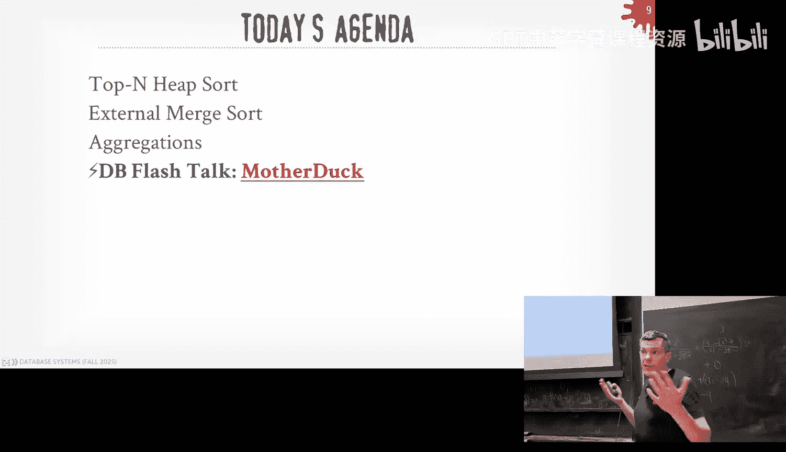
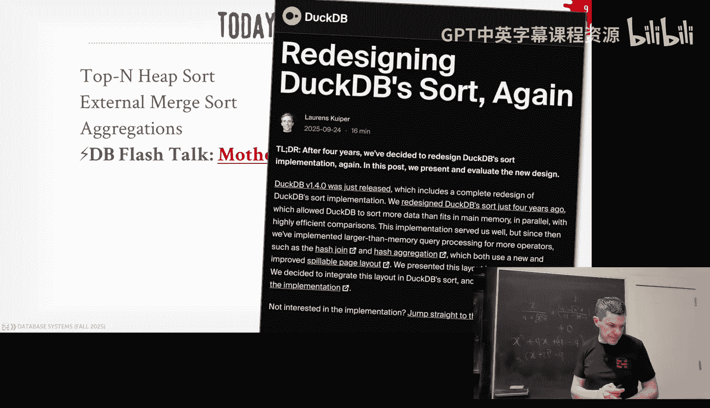
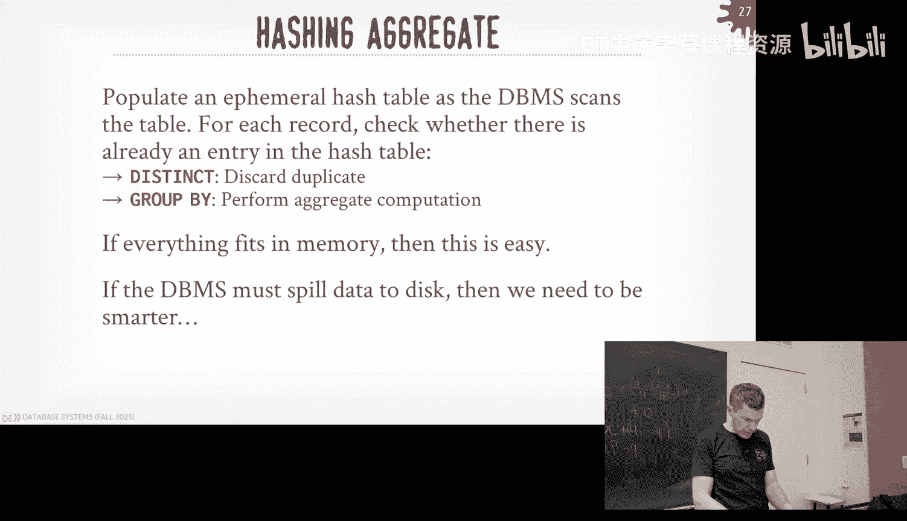
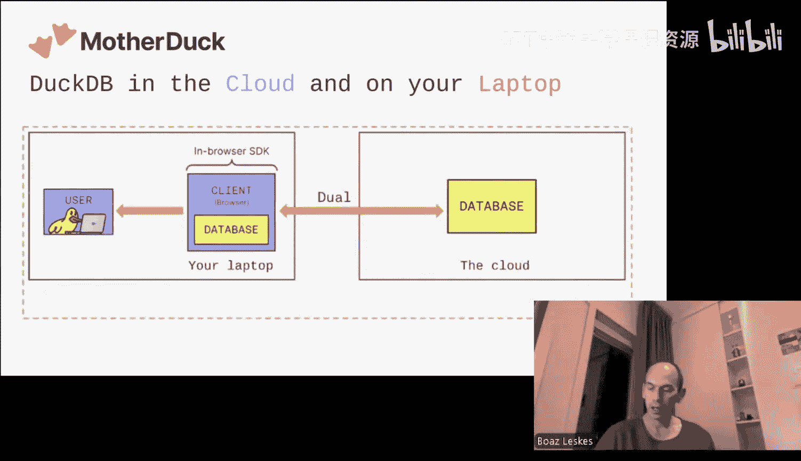
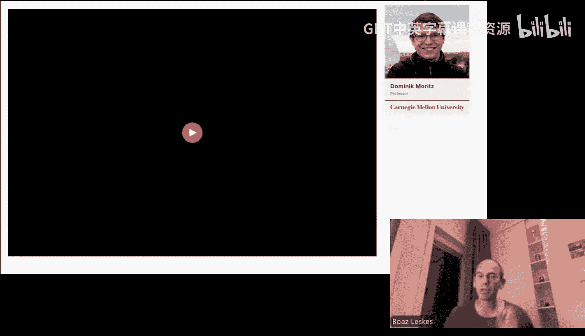
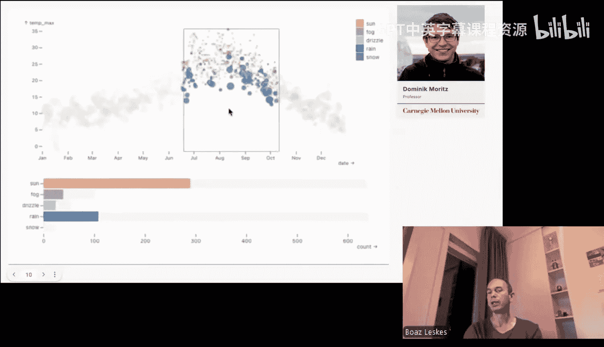
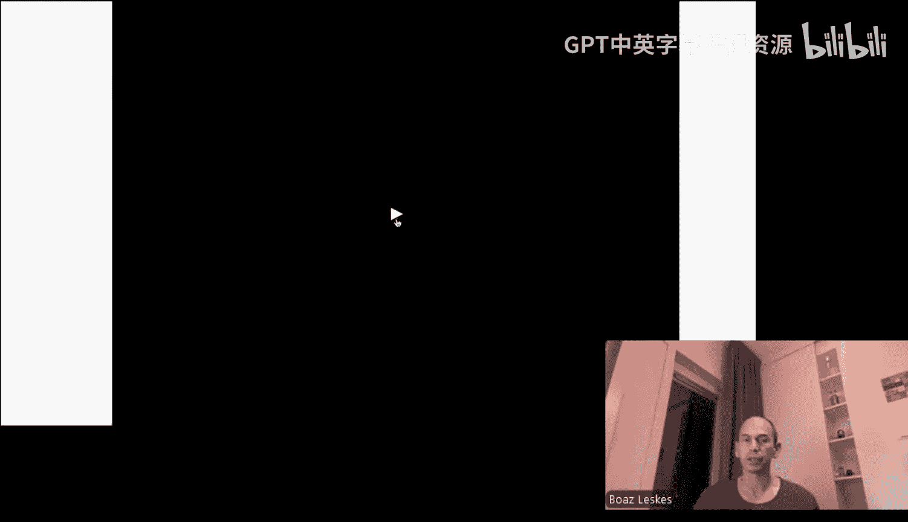
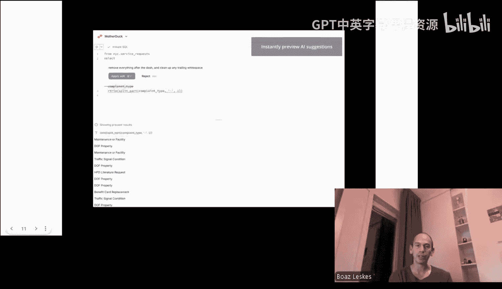
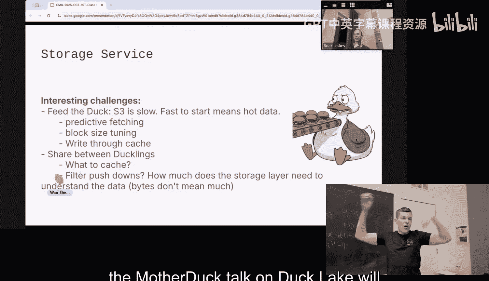

# CMU《数据库导论｜15-445 645 Intro to Database Systems (Fall 2025)》中英字幕 p11 #11 - Sorting & Aggregation Algorithms ✸ MotherDuck Database Talk (CMU Intro to -BV1bmHGzsETM_p11-

🎼给我给我。🎼Let's check。🎼换这我可。🎼P。🎼哪怕把宝贝要赔。more a cat。 almost forgot record。 You doing well。 Okay。

 how's your money situation， It's okay， Yeah， it's getting there。 Okay， good to hear again。

 that's he's like， I need to make money。 He's DJ。😊，I'm like， all， I come， we'll pay you to do this。

 but like。Anything else you do you want to do， I can't do that with you， Okay， I got a。

All right for you guys a lot to cover today so again reminder for a bunch of things coming up for you guys in the class again Home three is we do this Sunday again the idea is that you submitted it on Sunday and then we will give you back the solutions on Monday。

Because one week from now in this room at the same time we will have the midterm exam I won't be here。

 my number one PGA students will be here to practice your exam the main thing to know is that there's a study guide available online with a practice exam that's posted on piazza make sure if you show up here bring your seniorU ID so when can keep track of the who is who when you turn your exam and then for the notes it's single sheet of paper double sided eight and half by 11 them to be handwritten because you're just not like taking slides and shrinking them down to fit on a single paper and if you want to write on your tablet and print it out that's fine too。

😡，Okay。😊，Any questions about the exam？Again， if things are unclear。

 please post on Piazza and then Project two went out on Monday this week and that'll be due after we come back from Fallul break Okay。

 all right， there was actually one big announcement three hours ago in the world of databases。

 there was an acquisition， anybody hear what it is and know what it is。

Dataricks bought another company， so they bought mooncake。

 they're actually going to give a talk with us in like I don't know three or four weeks after fall break。

 so they were Postgres withductDB inside of it， so you run your queries and if you have an analytical query it could then call down the DDB and then read andrite to iceberg。

😡，Who again， we had them give a talk whatever last week kept saying how important iceberg was again。

 Dataricks just Databricks brought the iceberg people for 2 billion and now they bought moon cake for。

There we go。And then there's there's。Texting， whatever， that's a weird flex。 All right， yeah。

 so they're just， they have a ton of money。 Everyone's waiting for to go go IPO and they're hiring a ton。

All right so where we're at now in the course is again from this diagram I showed early in the semester where we said we could sort of start at the bottom to disk and work our way up now we're up here at the operative execution so we know how to build a disk manager a B pool manager to read&Write pages from disk into memory we know now how to build indexes and other data structures on top of our Buffel pool to allow us to access the data so now it's time to talking about okay let's run some queries。

😡，So for the next four lectures of this class， which will be covered on the midterm and then next class。

 which is not covered on midterm， and then a week after the fall break。

 we'll start talking about how are you actually going take queries and execute them and produce results as you would see when you runductDB。

 SQL， light MySQL， whatever you want in your local terminal。

 how do you get back to those results that people were asking for？😡，So today's class。

 we're going to be focused on sorting algorithms， next class will be about joins。

 sort of the two again， two sort of fundamental things you need to have in your database system。

 and then afterwards we'll talk about how do you actually then build the database system to take these different algorithms that we can support and read on the data we store on disk or bring the buffer pool and produce results。

😡，O。😊，So the first thing to understand about where we're going forward next is what these query plans are actually going to look like。

😡，So this is now we're going to start bringing back some of the later algebra stuff we talked about in the beginning。

 but the high levelve idea of a query plan is that it's just gonna to be this directed data structure。

 usually a tree， it's better off to be a dag， but not all systems do that we cover why that matters later on but it's basically some treelike data structure here where you have on the leaf nodes or all the tables I want to access or the data that they're storing in some materialized form it' part of a table or file whatever that's all at the bottom and then essentially they're going to be feeding data up into these operators like a filter or a join or a projection or whatever and each operator is going do some computation on it based on what the operators is defined to do and then at the end we produce a final result that we then send back to the client and that's the result of your query。

😡，So there is obviously PowerPoint and there's bunch of boxes going up on the lines。

 so it doesn't really mean anything， but there's a bunch of little details of or design decisions we can have in our system for what these boxes actually represent。

 like are we sending single tuples are we sending columns are we sendingending the entire result。

 are we pushing the data from the bottom to the top or we pulling it top the bottom。

 there's a bunch of those things we'll cover after Fb but the highlight of idea which you need to understand is that there's these sort of fundamental steps in our query plan that are going to be represented by these relational operators that are going produce some portion the final result that we need for our query and then once we the root node that's what gets sent back to the client。

😡，Okay。So now also haing back to the beginning of the semester。

 when we start talking about the algorithms we're going to implement to execute these queries。

 with to remind ourselves that we're focusing on again。

 what are called diskoriented database systems where the system has to assume that the table you're trying to access or trying to query against in these query plans may not fit entirely in in main memory。

 and furthermore， the we be aware about is that the inter results in between these operators in our query plan。

 that may not fit in memory either。😡，So we may have to write those things at the disk in order to give the illusion that we can fit everything in memory。

And so this means that if there are times where we think we're going to have to write out the disk。

 we're actually going to choose algorithms that may not be asymptotically as efficient as other algorithms。

 but they're going to maximize the amount of sequential IO that we have to do。

 and therefore that's how we're going to get better performance。😡，And in particular。

 when we talk about sorting today。😡，You know， the fastest algorithms are going to be like quick sort or power sort。

 picking whatever your favorite one is， but those are great when everything's in memory。

 but if you had to go read and write data from disk because you're you're running out of memory in you' bufferuff pole and you got to spill out a disk。

😡，Then those algorithms are actually going to be not great and there'll be better ones that we'll talk about today。

Okay。Again， it's another example why we don't want to rely on the operating system to management and memory for us because we can make all these decisions about what we actually want to stage。

 keeping in memory and write out， or if we want to prefetch things。

 the OS doesn't know anything about what this query plan is actually doing。😡。

So it's not going to make good decisions whereas we know exactly what this query plan is because we have to execute it so we know like we're running down here what the other stages are going to be and we can make decisions about where we're going to put data and when we're going to read it right to desk。

😡，好吧。So。It should be kind of obvious of why we want't sorting in our database system， right？😡。

But it's good to understand some key goals or it have why we're going to want to do this obviously is that one of the big obvious things is that the relational model is unsorted right we said that it was based on set algebra in the case of SQLs based on bag algebra there could be duplicates。

 but everything's unsorted。😡，And so many times in applications， people are going to want data sorted。

😡，And the way you can ask for this in SQL is through an orderbi clause。So if they can say， hey。

 I want this data in this table， sort it based on some arbitrary keys。

 either in sending descend sendinging order， other characteristics of the parameters we could pass in。

 and therefore we need to support that。😡，But one of the things we'll see in today's class as well is that even if the query is not asking for the data to be sorted in a certain way。

😡，That we may end up still actually want to sort it because therefore we can choose different algorithms in our query plan that are be more efficient because we know the data is sorted versus being unsorted。

😡，The most obvious thing would be and we'll see this later on we our aggregations， if I sort my data。

 then it's really easy for me to then figure out to remove duplicates when I want to have a distinct clause。

😡，Because I'm just sort of scanned through this sort of data and if I see it that a key is the same as the last one I' just looked at。

 then I can just throw it away。😡，In other cases， if you're doing a join。

 you may there's join algorithms we'll in next class where you actually sort the data first and then you merge it together and that's really efficient to do as well。

😡，In some systems like in SQL server。They will recognize that hey。

 bed be really nice if I had a B plus tree on this table that you don't have。

 so they'll sort the data first， then build a B plus tree on top of that sort of data。

 do whatever it is they need to do in the query， and then immediately throw it away once the query is done。

😡，They call it a sping index so again in that example it's much more efficient to build a B plus tree if you sort the data first because then you just go along the leaf nodes and build the scaffolding up above rather than doing things piecemeal or incrementally。

😡，Again， so in general， sortings can be really helpful for a bunch of different things。

 and obviously we want this be as efficient as possible。So if the data。

 either the tables at rest or our in results， if that can fit entirely in main memory。😡。

Then we don't need anything Roberteverly in this class today。

Because then you just pick whatever your favorite sorting algorithm is， you learned N CS 101。

Right kids usually say quick sort and there's Tim sort， power sort like go read the Wikipedta page。

 there's a ton of different sorting algorithms， pickle sort， cycle sort， noome sort。

 cocktail shaker sort， there's a ton of these right they all have different properties if everything's in memory then pick one of those and you'll be fine。

There is one。One optimization that you can do if you know the data is mostly sorted。😡。

Then there's algorithms that can take advantage of that and not do so the full quick sort setup。

 something called verge sort that came out a few years ago。

 there's a bunch of algorithms that have ability to recognize whether the data is already sorted。

 if not they bail out， fall back to Quick sort， otherwise they then plow through and do they can run things more efficiently almost like an insert sort。

And there's a bunch of these visualization tools people like to make to show you the different how data moves around when you run one of these sort of algorithms。

 again， like if everything's in memory，No big deal， pick your favorite one。

Tim sort is what Python uses actually they got rid of Tim sort recently， but now it's like powersort。

 Postgres uses Quick sort， you know all these ones are a pretty common。But again。

 it's when we can't fit everything in disk。And we would know this because we know how much memory we have in our Buff bowl manager。

Or typically a query is allocated a certain amount of memory used for sorting a working memory。

 so we'd know that hey we got we have to sort one gigabyte of data。

 but we only have 800 megabytes of RamM or buffer space to use。

 then we got to fall back and use something else。😡。

So the thing to understand what we're now going to be sorting is。Is what are called runs。

And so the input to these sorting algorithms would sort of be this unsorted runs or semisorted runs and then you run your sort of sorting algorithm and then starting with if it's in memory。

 you just run quick sort of that， then we'll see how to do this in multiple stages with a startup of murder sort。

 but you end up producing an output， the output is just that input run in sorted based on whatever the key you want to sort on。

😡，And so it isn't just going to be like in your algorithms class， we have like a list of numbers。

 you want to sort those。😡，Remember that we're talking about tuples in a database or in tables。

 so it's actually going to be a key value pair where the key is going to be whatever it is that I want to sort on。

😡，And the value is going to be either the actual tuple that the key belongs to。😡。

Or a pointer to it or a record ID to it。And we won't talk about this too much in this class。

 we'll see this more when we talk about joins and sort of query processing later。

 but the two choices of what the value is going to be can depend on what kind of system you're building。

😡，Now you see these all these understand what these different layers are going to matter because one is actually better than another and different scenarios。

😡，So if I'm building a row store system， then I want to use typically what's called a early materialization。

 meaning the sorted runs are going to obtain the key followed by the entire tuple。😡。

It is all the bytes for the tubr that I fetch from a page。😡。

And the reason why this makes sense in a row store because when I go fetch the page for a TL。

 I'm getting all the data that I need at the moment I go fetch that page。

 so I want to be able to I don't want to go back and fetch more data later on and I don't need to if everything' is all there。

😡，If you're put a column store， they often use what is called late materialization。😡。

Meaning instead of storing the actual Tple data。😡，Since I only have to bring in the pages I need。

 if it's a column store and not maybe the entire thing。

 then I just keep track of the record ID or the offset in the columns for the TL。

 whatever it is that I'm sorting on， and then at some later point if I need to go get the rest of the data。

 I just follow that record ID to get the thing that I need。😡。

And the idea here is you don't want to pass around a bunch of data that you don't need if you're going to end up throwing away a bunch of columns in your query。

😡，So I'm going to bring this up to say like I'm not going to show you the value portion of all the data we'll be sorting in this class。

 we'll see this later again we tell what I joins， but like just understand it isn't just the keys。

 I also got to pass along extra data to know what the key belongs to。😡，我的意外是。What is the question。

 what's value K， it's a key。An attribute。It's like it's some subset of columns of a table that I'm sorting on。

😡，The call it the sortque。It's the same key you build the index on columns， right。

 it's the same thing。😡，So this it is a bit of a debate in data systems when you build OLAP systems。

 which when you want to actually use for Rostore you almost always use early materialization because again you're already fetching the page。

 you get all the data models just copied it along， whether or not to use late materialization depends on who you ask one of the early systems that built one of the early data systems that was a column store that did late materialization was vertica。

 but then they said that was a mistake and they rid of it when you start reading from S3。

 Clickhouses put a log article out three or four months ago。

 but they said they add in late materialization。So again， we'll talk about this more later。

 but this is very important when we talk about how we actually do query processing on column source systems。

😡，All right， so today's class we're going to talk about sort of the two main sorting algorithms you would see in a Davis system。

 top end heap sort and external murder sort， then we'll talk about how we do aggregations with sorting。

 and then also give you a preview of how to do aggregations on using hash tables or hashing because then that'll segue us into next class when we talk about joins because the big date debates can be whether I want to do assortment sort merges join or hash join。

And then today we have a flashdo from the Mother duckuck Gus。

 which is one of the commercial incarnations for DuckDB。

And again you may be thinking like why if they spend a lot of time about sorting isn't that like from the 1960s in computer science。

 like quick sort is like the 60s or 70s who cares about this all like nowadays anyway， well。

 this is still a hot topic in database systems because there's always ways to improve these sorting algorithmsDV people put on a article last week where they went back and rewrote the entire sort algorithm to improve performance be still on a bunch of the techniques and things that we'll talk about today some of this is like low level C plus plus stuff that's not really germane to the highle topics but again I' going to show you that like sorting isn't a solve problem in databases even though the topic is really really old。

Same thing we talk about transactions， transactions go back to the 1970s。

 but it's an unsolved problem。

All right， so the first sorting algorithm we talk about is top end Heap sort。

 and this is a special case sorting algorithm where if you recognize that the data has be sorted and you have a limit clause or you a you have a restriction on the number toolss you want as part of the output。

😡，Then a shortcut is just to scan the data once and find the top end entries that you need as part of your output and spit that out。

😡，Right。So say have a query like this， select start from the roll table order to buy the student ID ascending and then now I have this extra parameters I can put at the end where I say I want the first four rows。

 this is like a limit clause but this is the SQL standard says go like this but then I also can specify whether I want ties in my upload result or not。

 so this thing with ties so I have even though I want the top four results。😡。

If there are twos of the same key that are in the top four， I would have more than four as my output。

😡，So way to implement this is pretty basic， you just have some kind of sort of heat data structure。

 like a priority queue。😡，And you just scan through your data in sequentialial order once。😡。

And you just keep updating things in the sort of heatap。

So in this case here my sort of heap is empty， I see that I have the first thingm pointing out is key3 while since it is empty I know that this is going to be the smallest value。

 so I just go ahead and add that scan along now I see four。

 four is greater than three so it goes after three and the sort of heap same as six。

 six goess up four and then this case here two now is less than three it's the smallest value I've seen so I just slide everybody over and then put two in the front。

And now in this case here， I see a nine。9ine is larger than the smallest larger than the largest value I have my sort of heat because I can keep track of the mini max pretty easily。

 so in this case here， I don't even bother processing nine。

 I just skip it and move on to the next one because I know it'll never fit in my top four results that I want。

😡，Now here I see one， one is less than two， and therefore it's going to slide in the front。

 six gets pushed out。I come along here now I see four again。

 and because my query asked that I want to keep ties， keys that have the same value。😡。

Then now I just need to extend my sort of heap to add more space and more buffer space to put in the ties and then keep going the next four and until I get the end in this case here eight is greater than the largest value have my sort of heap。

 greater than four， so go ahead and go ahead and skip that。

So I can do I can run this algorithm in log n or sorry， not log n in n。

 because I have to scan all the keys once and I populate my sort of heatap。

 that's obviously not done at end time， but it's pretty easy to do。😡。

And this would be pretty efficient。In the back， yes。你行说。Yes是。三个。这个主要。So I think your question is。

 how do I know that whether or not the data I want to scan or the output result is going to fit in memory？

😡，And especially if I have multiple queries running at the same time and how to balance that。

 so we're not going to talk about research allocation and scheduling。

 but the simplest way to think about this is。Like in Postgres。

 you say every query is allowed X amount of memory。

And then you spend it obsessed by a parameter of how many concurrentqueries allowed to run at the same time？

And so you just say， all right， I have a gig， I'll give each you know each query is allowed to use up to 100 gigs I'm trying to make lots of rent memory。

 and then if I the data I'm going to scans in this case here the original data，😡。

The original data doesn't have to fit in memory， but I obviously want my sort of heap in memory。

 So I would sequential scan along the original data。

 I rely on my bufferboard decide how to evict things。 we talk about Arc and MU and other things。

 that's why this all matters。 So I scan all my data once and then I just populate this thing The sort of heap will typically fit in memory This is not that big if I'm asking for the fetch the first billion rows。

 then yeah， that's gonna be a problem。 But again I would know that ahead of time because SQL is declarative I know many results you're asking。

And therefore， I can roughly， I can calculate how big do I think this data structure is going to be and I can decide whether it's going to fit in memory or not。

😡，The enterprise systems do a much better job at slicing dicing resources where you can allow like hey。

 this， everybody's allowed to use 100 megabytes， but if I'm not using 10 megabytes。

 I can borrow some from another system sorry from another query and they can be a bit more flexible。

 I think Postgres is a bit more rigid in the parameters you specify。😡。

So this is one example where the enterprise systems are much better at scheduling resources。😡，Yes。😊。

Have you estimate the size。Correct， so the question is if there's a lot of ties。

 how do I estimate the size of this heat？So we're not going to talk about call assessments just yet。

 that'll come after the midterm， but like you have some basic histograms。

On the data so you could figure out like how many distinct values would be in a column right's little the math is a bit fudgy because also too it's a summarization of it's not real you don't have the real data so you basically use some simple cost formula to decide how big you think this is going to be and in general you overestimate because you don't be like really wrong。

😡，Yes，The question is， do you always overestimate from memory， typically yes？Because again。

 you don't know what you don't know， you don't know how much data you're going to how much。

You don't know the size endmate result until you actually produce run it。

 so this's like your hash table when you want to size that thing so you don't have to like dump it out and resize it for your run the queries。

😡，Like they'll try to an estimate and then they have a fudge factor to say。

 wow it' I think I have 100 records， but I'm like， oh， I might see 150。

 so I'll just allocate it for that。That's pretty much every system does that because again。

 you don't know， you don't know what you're going to see until you actually see it。😡。

We'll spend two lectures on query cost models and cost estimations and all these things。

 this is the black magic of data systems and everybody's terrible at it and it's like really really hard。

 but we'll cover that later。All right， so again， this is a special case。

 if you know your query asked for an order buy and it's asking for the top end entries。

 then you can do this。😡，And you don't want to do one scanner the data once。

If it's a general sort request or order buy request。

And I can estimate that it's not going to fit in memory。

I want to use what's called external merge sort。So in this case here you would know how much you would have a rough idea how much data you're going to scan。

 it's not always true either because you could do sorting after joins and join estimates get way off。

 but like，😡，Just think the most of the thing， if I'm going to scan a table and run an autobi on it without a filter。

 if I know that the table has a billion tus， I'm going to have a sort a billion tuples and therefore I can make my cause estimationations based on that decide to fall back to this。

😡，There are some systems that can be a bit more adaptive where they say， okay。

 I think the data will fit in memory to start running QuickSot， if I get it wrong。

 and I realize I'm spilling the disk， then I just stop what I'm doing。

 throw away the results and then fall back to one of these algorithms。😡。

But not every system can do that。All right， so external merge sort is a divide and conquer algorithm where we're going to split the data up and we want to sort into separate runs。

 sort them， and then start merging them together into successively larger sorted runs。😡。

So there'll be essentially two phases for every sort of pass with the first phase， we do the sorting。

 so we just bring in chunks that we can fit into memory。

 sort them with your favorite in memoryory sorting algorithm。😡，A quick sort of whatever。

 and then we would then could。If necessary， write them back out to。

To pages on disk and then we can if we bring them back in。

 we'll merge them together with sort of runs of the same size and produce larger runs as kids keep doing this over and over again till we end up with all the data completely sorted。

😡，And I'll show a visualization of this。So the general algorithm is called a K way external merge sort。

 but also with a simple one which is 2A merge sort。turnmer sort。

 and then two is going to be the number runs。 we're going to merge。For every pass that we do。

 so we're going to take two runs， merge them together to produce a new sort of run that's twice as large because it's a combination of the two of them。

And the K way， you can say， I'm going to bring them like。

K pages or K sort of runs and then merge them all together and produce one that's K size and write that out。

😡，But again keep us simple with two。So for this， we're going to assume that the data would be broken up into big end pages。

😡，And then we'll say that the amount of memory that we're allowed to use and our Bo manager will be B pages。

And we're going to need that for both the input of the pages that we're bringing in for our input runs。

 and then we need at least one page to write out， we had one page that we'd write out our to disk。😡。

So in past zero， all the data is onsorted them disk。

 so we're going to bring the pages one at a time into memory。

 sort them in place within actually not in place what make a copy into another buffable page。

 sort that page and then we write it back out the disk。

 we do this until we have all the pages the input table with input data sorted and then we then have the successive passes。

 we'll cursly merge the pairs of sort of runs into larger and larger larger runs。

 and then keep doing this until again we have complete output。😡，So for this typical example here。

 for2 a merge sort。We need at least three buffer pool pages， we need two for the input。

 and then one for writing out the output。😡，So again， in the first pass， again。

 we're just going to read all the pages we have a disk and just sort them。So in past zero。

 here's all pages on disk against 2 a merge sort and we're just assuming that there's two keys per page。

Right， so in the first pass， pass zero， we're going to produce。Sort of runs a size one page。

 so for every single page at the top， bring it in， sort its contents， the two keys。

 and then just write that out back to disk。😡，Again。

 this is all sequentialial IO so we can scan the table sequentially。

 and then when we sort it and write it out， that's all going to be done sequentially as well。

Now in the next pass， we want to generate runs of size two pages。😡。

Because we're doubling the size of the pages， the size of the runs as we go down。

So in this case here we're going to bring in these two pages that I have here 3，4 and 26。

 and then we have an output page， we're going to take take whatever the result of the sorted run at least stage that sort of output there。

 and obviously we know it's going to be two page runs so we only have one page to write the first output and when this gets written out the disk because it's full。

 we'll reuse the page and write something out。So they be in this sort of merged pass。

 you have two iterators。😡，One they're pointing at both of the runs I'm trying to merge together and all you're do is just comparison of the keys so the beginning here。

 the first iterator points to three， the second iterator points to two。

 two is less than three because we're going in ascending order so I'll write out two and then move that iterator on the second page over by one。

😡，Now I do the same comparison， compare three in the first page with six and the second page。

Three is less than six， so I write three， and then now my page is full。

 so I'm going to go ahead and write that out the disk but then complete the merging of the other pages。

😡，Other the objects like this six。Question also disc offset， also to what， sorry。Like three， four。

 two， six， these are the keys。아我都明。The question is， I brought the entire page of memory， yes。

You have to because you the keys are in there。 My example， it's， it's two keys per page。 But again。

 think of like， if I have larger keys。I can't just have all sets like when I started to comparisons because I had to go check to see values to where they go。

 so Id bring the pages in， scan through them and then do that merge comparison。All right。

 so I'll do this all for the other pages at this pass， so I end up with two。

Three runs of size two pages， and then last one here， it sort of it's less than one or less than two。

 but that's okay， and I have a little end of file marker to say that there's nothing else beyond this。

😡，So then now in the next pass， again， I'm going to generate sort of runs of size。

The double the size of the last pass， so now I'm going to generate runs of size4 do the same thing。

 iterate through the two input pages my sort of runs and I'm merging do key comparisons to see which one is less than the other and write them out in success order and then when I'm done with generating this run。

 I then switch over and do the next one。Do this again。

 and then you end up with a pass of now eight page runs， and that's the entire data set， yes。

First what， first pass， so pass zero？Okay。Or pass one pass zero， okay？就是什么。Correct。

 in this example here， I'm assuming I have three pay。算这么。Three， you only need three。

So it didn' gets say I'm here。So for this first guy here like2，3，4。

6 that's on this sort of run on this side， I can't use the red and then there's 47。

89 so I only need bring this first page here and this first page here from that run then I do my comparison because within the run they're sorted I know that there isn't going to be a key on these lower pages here that could be less than over here if I've already successfully moved down on it so I never need to go back and look at the inputs of the sort of runs again。

And therefore I only need to bring in one page at a time for the two sort of runs。

 and this example here， we only need three。Yes。So I need just to consolidate。

Like sort results to this single page。The question is。

 are these mergers consolidating the results of the sorting in separate pages？No so late。

Go back here。 So after in past one。The size of the sort of one I'm gonna to generate will be two pages。

 So the first page I'm gonna generate has two and three in it。

 I write that out the disk and then the next page is going to have four and6 to it。

 That's a new page and I write that out the disk。 And there' are separate pages from the original pages that I started with up here。

Yes， we finished like Friday。个是。The question is， as soon as we finish generating a new output page。

 we write that about to disk and then we bring another one in， but it's already your like。

 we're going back here。So I out three， so I read out two。

 and then I'm going to write out three that point that thing is full， I'm to write that out the disk。

 but I already have this page and this page in memory。😡。

Just keep scanning on them right and at some point the iterator will get to the end and say， oh。

 I've seen everything I can see for this if one iterator finishes for the other one。

 they say all right， well I know there'st anything on this side that's going be less than this side so therefore just write out all from the first aer out the disk and it'sed because I sorted the before I got to the do in that pass anyway。

😡，Yes。The question is， why didn't it traverse the index it's already sorted， what index？

The the index that you。的一个 order。Same is， why did do a。

What is like want to use the index that the key is ordered by， there may not be an index。

 what if there's no index？Yeah。This is like for any arbitrary key， I can sort。If I have an index。

 then yeah， I could just scan along leaf node and I would use that， but I can't。Yes。Concer that。

Once you feel like you have to write out to this， are you concerned with。Soliar that。His question is。

 and he's right and we'll fix this in a second。Am I worried about I stalls when I write the disc。

 absolutely we'll do double buffering that'll make that go away， yes。

This is the basic algorithm though， just like I got three pages I can bring two in and write one out。

All right。So the number of passes we're going to do is one plus log 2 n again。

 it's the one is for the pass zero because I have to pass over the data once and then log  two is because I'm generating passes that double the size of the previous one。

 that ends the total number of pages， therefore the total number of IO costs will be 2 n。😡。

Because again for the。For the plus one that's past0， I gotta read it once and write it out once。

 hence2 n。And then the number passes up above。So again， in this simple example here。

 we just assume that we only have three bufferable pages， two for the output， one for the input。😡。

The challenge is going to be， though， if even we give more profitable full space to our system。😡。

Where now we can take generate larger sort of runs。

 that'll shrink the height of of the number of passes we have to do。😡。

But it's still going to be slow， as he pointed out。

 because we are essentially just blocking every time you get the write stuff out。

 block in time you have to read something。Right。So again we'll fix that in a second。But in general。

 the algorithm for this for a general externalmeror， assuming you have be bufferuff pages。

You're going to produce。To this the ceiling of end by B sort of runs since the size B and pass zero because again you'd read everything once。

 then write at that once of that size there and then in the subsequentent passes。

I can generate runs that are size b minus1。Because I need always at least one buffer buffer page for my output。

And then that's the same form that we shared before。So let's run through a quick example， again。

 without doing any double buffer or any optimizations。

 assume we want to sort of pay a data set that has 108 pages。😡。

And I'm allowed to use five b pages so big n equals 108 and B equals five here。

 So in past here again， I gotta read everything once and write it out once and the sort of runs。

 so this will generate 22 sort of runs for me of size5 pages each the last one is only three pages because it' 22 are 108 is not easily not perfectly divisible by five and so we take the ceiling there because then there is rounds up。

Right。And then in past one now， we're reading in those 22 sort of runs of size page5。

 and now we're going to don sort of runs of size page 10 or sorry size page 20。

And then the last run again， it's not full size， so it only end up being eight pages again because we have the roundup and we keep doing this until we reach the end where we produce the two sort of runs that we have to read in and they write out one sort of run that's a total 80 pages that we originally give as our input。

I 8 are 80 plus well 28。so in this case here， just plug and chugging the formula。

 you end up with four passes because again， you're progressively getting having the number of inputs and outputs you sorry。

 there are pages you always have to read in and out per pass is the same。

 but if the number of passes I have to do shrinks down once you have more buffle poll spaces。😡。

So let's solve the problem that he brought up where if I naively just block the world in my database system。

 every time I got to read and write a page， that' asking me slow because we see disk stalls can be quite expensive。

😡，Slow spinning is hard drives are going to be the order of up to 10 to to 50 milliseconds。

 SSDs are a bit faster。But even SSDs are really fast。

 but the only way you get that good speed is if you have a lot of things in your IOQ that you want to read and write in parallel。

 that's how these sort of modern systems get a good performance。

So if I just do the Nive theme what before we're like， I'm going to sort this data。

 I go fetch in all my pages in my buffer pool， then I go ahead and do the merge。

 the sort and the merge， produce an output buffer and write that out， right？

While I'm doing this right， I'm basically stalling the rest of the system。

 the CPU is not doing anything because it's waiting for all this data to get written out the disk。😡。

Right。So what I want to do is actually use half the buffers that are available to me for sort of one stage of a pass。

And then another， I want to say stage like sort sort of one sort of sliver of the data I need to sort within one pass。

 and then the other buffer will be for another sort of sliver of data within my pass。

So now what' will happen is I can fetch in data from one part of the file and then while that's doing the merging。

 which is computational expense potentially and writing it out the disk。

 I go fetch in now the other pages。😡，For the other part of the pass I'm at。

 and then they do their own sorting， I'm sort of ping pong here going back and forth where one sort of one portion of my barpo is being used for sorting things in memory and running at the disk and the other portion of my barpo has been used for fetching things from disk because and then go ahead and sorting them。

Of course， obviously it's tricky that you don't， you know， you can't magically。you know。

 reenwrite data with the same full speed at the same time， so the timing can be a bit tricky。

 but again modern SSDs can sort of handle all that and do the balancing to make sure you don't slow things down。

So obviously again， this reduces the amount of memory buffer pools they have available to do larger sort of runs。

 but this is going to hide that the IO stalls it would have。😡。

From the workers waiting for things get readwritten from disk。All right。

 there's some additional optimizations we can do in our actual implementation。

 some of these are low level things where you're kind of trying to shave off again cycles in your CPU。

 but some of these are actually necessary to actually get the thing that actually work well。😡，So。

The comparison operation is， again in an algorithms class。

 they're very handweavy about that because it's always like。

 oh comparing this integer with that integer and you sort that actuality oftentimes data is usually going to look like strings or be a combination of multiple keys。

 and that comparison call to see whether one key is less than another key。

 that can start to add up and be expensive， especially if you're trying to sort a billion things。😡。

So a bunch of techniques you could do are one is called code specialization。

 the idea is here is that instead of having like in the CS+ when you have these sort of built in sort runners。

 you pass in a function to your comparison you pass a point or your comparison function and any time the sort algorithm says I got to compare two keys it makes a call to that function。

😡，Well， that can be expensive， especially if you're trying to interpret what the bytes are in your keys。

😡，m， we had to go look at the cattle and say， oh am I sorting integers， am I sorting strings。

 and so forth， right？So a better approach is that if you can pre generaterate a bunch of hard coded versions of your comparison function。

 that sorts keys on a certain type。😡，Then you can now inline that in your sorting algorithm。

 and then it's much faster because now you're not doing the jump call in your CPU to jump to some of the location in your address base and call your sorting function。

😡，And then you don't have to worry out also too of how to figure out what the bytes are。

 you just call reinterpret cast and because you know exactly what the data should look like。😡。

So there's a bunch of different ways to do this One is you can do co generation and just in time compilation on the fly。

 so some systems like like single store from a few weeks ago， they will。

When your query shows up and you want to sort it on some keys。

 they will then code Gen the comparison function in like LLVM and compile that to machine code。

 and then now you're making a function call into machine code that's sort of hard coded for exactly comparisoning two keys。

Pogres kind of does this too bit of a hack， but like it's written in Cs so you have to deal with this。

 So when Postgres， if you compile it by hand like instead of downloading the binary。

 compile the binary by source compile it from the source。

 there's a perl script that runs before you compile it that takes their comparison function and then makes a bunch of copies of it that have different versions for different data types so they'll have a comparison function for integers comparison function over floats basically is duplicating the code and then compile it into the binary and then at runtime it knows which sort of specialized version of the sorting algorithms they should use。

😊，It's basically temping， but because they're in C and not fl。

 they have to sort of do this little prol script hack。😡。

Another trick you can do is called suffix truncation。

 I think we talked about this when we talked about varchars before。

 but basically instead of doing the sort of the full key comparison of two strings。

 you're basically iterating over every byte doing one by one comparisons you can precompute a prefix of the varchar as the key。

Like think of like a 32 bit integer and then now I can do fast comparisons to see whether those two prefixes are the same If no then I know how to do you know easy comparison say whether one values is less than another and that's way faster than I having a look at the full key。

 If the two prefixes are the same then I fall back to doing the slower comparison。😡。

And this one's bit more nuanced， it's an old technique from the 70s。

 it's actually in theductTB article that came out last week。But basically， if you have varchars。

 you don't want to have to have。These these arbitrary length size keys because I'm trying to keep everything nice tightly packed and always be fixed length so if I can keep everything as dictionary codes great。

 but not always I can't always do that， especially if the same column comes from different files that may have different dictionary codes with the same values。

 so they have a way to normalize all this by transforming any arbitrary length key into a sort of binary representation。

😡，Um， if do little padding to make sure everything's always fixed length and then I can do u fast comparisons on that。

Again， just trying to point out here， we we'll cover more of this in the advanced class。

 but the that like。Just checking and you see whether one value is less than another value。

 that actually is expensive at scale， and especially you' be doing it a lot。

Whereas's something in like your algorithm entered algorithms class。

 they'll be very hand waving over this because they're not worried about actually working on real data。

All right， so sort of what they were asking about， like， can I just use the index？

In external merge sort or the inmeory sorting algorithms we need to do this if there isn't a data structure we can use or P plus3。

 we can't use a hash tableable because hash table is unsorted。

 but if we do have a sorted data structure then we can take advantage of that in some cases by just scanning along the leaf nodes for the data assuming that it's sorted on that key and then we can get the data that we want now the challenge is going to be is like。

Since the Ts in the B plus tree may not actually be the full tuple。

And if we need the full tu as part of the output of the query， we've got to go then get the data。😡。

And the challenge gonna be in that case is that the， the。The data might be stored in our table pages。

😡，In a manner that's different than what's defined in the index。So the index could help us for。

Maybe finding a subset of the data more quickly， but if you got to go fetch to the data。

 we're not going to put it back in the correct sort of the order anyway。

 and that could be bunch of a random IO which could kill us。😡。

So if we have a cluster BB tree again where the tubable pages。

 the Ts themselves are in the same sort order as defined on your BP tree， fantastic。

 then we don't want to use sort of merge sort or any sort of algorithm because again we just rip along the leaf nodes that sequential assets and everything's sorted already in the way that we want。

 that's fine。😡，If it's uncllued， then having to chase pointers。

To go get the tuples as defined in the ordering of the keys and the leaf pages。

 and then putting that back into the order that we want as part of our output。

 that's actually going to be terrible。😡，In the general case， because again。

 it's a bunch of random I to different different pages and I can't do that trick what we talked about before where I can。

Sort the pages that I want to access so that I'm only fetching in one page at a time because it has to be in the order that's defined by the order by clause or whatever the ordering requires。

😡，Then this is going to be random I and it's gonna be terrible and we just want to fall back doing the external merge sort If you're doing top end where I I know I only need a know end number queries or it actually end number my two is my query。

 then this might be okay because I might be getting like 10 pages at most that's not so bad but anything else this is not gonna be great。

😡，Okay。So again， if it's in memory， use your favorite sorting algorithm， it's a limit。

 if it's order by calls with a limit， then use the top end heap sort。😡，If anything else。

 if it's too large， then I want to fall back to external merge sort。All right。

 so let's finish up talking about aggregations。Y， great， yes。In see the store。Question。

 Beales trees are stored in disk for this class， yes。Since some systems don't but this class yes。

 host class yes， most systems yes。我 is。All of us can are the ability and stor doing this。

 and when you're doing drawer you are going。No， so his statement the question is。U。

Are we assuming that the B plus tree can not be sort in disk， not fit entirely in main memory。

 no good。IfThe buffer has' enough space。And then there's a whole bunch of， like。

Policies you could set do I want to make sure that my buffer B plus trees always fit memory and prioritize them over the Tple pages。

 some systems lets you do that。depends。 I know again， I keep saying it's a cop out。

 it depends on what your workload it is， what your hardware is。😡，Okay， so aggregations again。

 this goes back again to the early semester where the idea is that we want to scan some data and。

Produce scale results for some common in computation based on across multiple tools that we see。

 right？So the challenge is that in order to do some of these aggregations。

 I want to quickly find tuples that match on。 like a group by clauseaws or some other aspect of a I'm trying to compute。

So to do this， as I said in the beginning， there's basically two approaches theres of two class of algorithms we can use to do aggregations and joins from next class。

 it's sorting and hashing。And this is like the age old debate goes back to the 1970s in database systems。

 which of these two approaches are better？😡，And it goes back and forth。

 originally sorting was faster in the 70s， then hardware got better and hashing got faster and then the sorting algorithms got better and then sorting got better。

 sorting was considered the preferred choice and that but now in general。

 today's hardware in today's landscape， hashing them was always as going to be the better approach right？

In some cases except when we'll see in a second， if the data needs to be sorted。😡。

Because there's an orbi clause。Then I can just piggyback off of that sorting in some cases and do my aggregation。

 right？Then in general， hashing is always be better if your disc is low。

So let's say I have a query like this， select with distinct clauses from the enroll table where I want to get all the records where the grades are either B and C。

 and I want to order by the course ID。😊，So again， think of this as that tree data structure we saw before。

 but I'm showing this sort of a sequential ordering， but I'm scanning me roll table， I do a filter。

 I throw away the tubs that don't match the grades I'm looking for。

And then I'll do a projection and remove the columns that I don't need in my output。

 So in this case here I only need the course ID so I can throw with everything else。

 and now I'm going to sort it。😡，Based on what's defined in my orderbi clause。

sorting on the course ID。And then the last step， my query plan is I want to remove the duplicates because I want it distinct。

So in this case here with my sort of output， all I need to do is have a cursor or an iterator to scan through sequentially in this output。

 and anytime I see a tuple or sorry a record that is the same as the last one I just looked at。😡。

Then I know I can ignore it and discard it。Because again， you know because it's in sorted order。

 like going to get to the bottom for 15826， I'm not going to see 445 again because826 is greater than 445 and I've already passed that part here。

Right。So if it distinct， this is pretty easy and again。

 they wanted the data ordered on the course ID anyway。

 so I just piggyback all of that sorting to do my duplicate elimination。😡。

I don't have to build a separate hasht to do that。😡，For other things， it can be more tricky。

But even if you don't want the data sorted， you make the data assessment could still decide to do sorting base aggregation。

 not always， but some will。😡，So again so now a different query I want to get the average GPA of all the students enrolled in certain courses。

 so assuming I've already done my join， Im we'll talk about Excel how we actually do that。

 so Ive now a bunch of course IDs and then the student GPs so I'll sort my data based on the course IDs。

And then now again， I'll just scan through my my data and then compute a running total or whatever the aggregation function that it wants。

 So what I'm showing here at the top is the way you basically do is it's pretty straightforward right for min and max you just keep track of the largest smallest value I've seen for the countant is adding one to a counter summation just adding things in the case average you just keep a running total of the summation of the column and the number of records you've seen and you just divide it at the end and it produces the。

😡，I mean， for arithmetic mean， for geometric means more complicated， but we can ignore that。

So in this case here my itertor starts， I keep track of the last key that I've seen because I know they're going to be in sorted order。

 so it's the last course ID I've seen it to the beginning it's null， and then I have my first record。

 I have a counter that says I've seen one two so far and here's the running sum of the GPA。

Then I set my previous 15445， come down here， I see the same key again， 15445。

 so I just update my running total， increment the counter my 1， add the GPH to the summation。

Go down here now I see a key that doesn't match my previous one that I've seen so at this point here I know I'm never going to see 15445 ever again in my sort of output so I can take this whatever I compute here。

 do the math， divide the summation by the account and then store the GPA in my computer result here。

😡，Same thing， update the previous key that I've seen， get down here。

 it's not matching826 as an equal 721， so I put 1571 here。

 do the same thing till I reach the bottom and I know I'm done and then I put my output there。

Pretty straightforward。Win the function is a bit more tricky。

 we can cover that next class if we have time。So the alternative to sorting is going to be hashing。

So if we don't need the data to be assorted， oftentimes hashing is going to be much better。😡。

And the basic idea is that we're going to build hash tables or divide our data into partitions based on hash functions。

😡，And again， it's going to divide and conquer approach where we can。

Generate smaller subsets of the data that we want。😡，To that。

 we can keep things in memory and not have to do as much random IO。😡，So for hashing aggregation。

 you basically build a hash table。In memory， and as you're scanning through the data。

 you just update entries in that hash table when you have matches。😡。

And if the hash table doesn't fit memory， then we'll have to sort of recursive partitioning or do partitioning and we'll see how to do that in a second。

 Oh shit， sorry。😡，We just mute them。Okay， sorry。我 was先嚟 can。All right， there we go， sorry， right。

And make sure they can hear me。

I don't want jump this yet， but they want to know what I'm done。I think I'm mututed， right。

 I can't see。mm muted or now。

I unmute sorry， right。So a hashing aggregate， again we maintain this hash table。

 we'll populate it as we go along， and then if everything fits a memory it's easy if not。

 we have to handle that。😡，If it doesn't fit memory。

 then we have to do whats called external hashing aggregation where we're going to take a pass over the data。

😡，Use one hash function to split it up into partitions。😡。

Then bring those partitions one at time into memory。 And again。

 that's gonna to be sequential I O and the。你。Do whatever it is， the aggregation I want to compute。😡。

Produce some hash table and then when I'm done with that partition， swap out to the next partition。

So this is repeating when I said in the first phase， you partition things up。

 you can do a sequential scan on the data， hash at once， figure out what bucket it goes to。😡。

Or partition buckets I go to， then the second pass。

 I'll bring in this partition in1 by one and do whatever the computation I need。😡。

So let's look at that example again， I want to run the distinct clause on the role table。So again。

 do my filter， that's all fine， do a projection， that's all fine。

 but then now I'm going to scan through this intermediate output here。😡，And for every single key。

 I'm going to hash it， put it into one of these partitions。😡，Which can be in a series of pages。Right。

 and assuming I have。You B -1 partitions I could use。

 I could have that much space because say I could bring in one of these pages at a time over here。

 but then I'm going to write it out to B -1 pages over here。

 So this is the opposite of what we saw sort of the sort of runs where like my input is larger and my output is one in this case here I want my output to be larger because I'm trying to flip these things up into into individual buckets。

😡，So in this case here， at this page it gets full。Then I'm going to just go ahead that right out the disk and just make a new page for it。

And keep filling that up。So now in the second phase。

 I'm going to bring all those pages in from partition one at a time， and I can do that in Scial IO。😡。

And then now generate some amount of hash table that's going to build the running total the aggregation I'm trying to compute。

😡，And then when I'm done with that partition， I take whatever of the results in that hash table and I put it to some kind of final result buffer。

😡，So going back here so these are the buckets I generated before so in partition zero I I had two pages。

 partition1 and one page and so forth like that so I started the first the first partition I'm just going to scan through sequentially and this case here I'm a computing distinct so it's pretty obvious like I do a hash I land my hash table and if not if there's no entry there for my key I put it there otherwise I just ignore it and then I do same I scan through all these entries doing the same thing hashing over and over again I keep seeing the same key so there's nothing else to add。

And then now when I'm finished that partition。If I assume that my data is going to be really big。

 I could take whatever in this hash table， write it out through a result buffer。😡。

And then clear this hash table for the next partition。Because again。

 I've already divided the data up so that when I'm at partition level1。

 I'm never going to see 15445 again because if there's no way it could have gotten to that level when I hash it because again the key will always have the same hash value so the end of the same partition level。

 so I'll never see 15445 ever again once I finish that。😡，好的。说。아。

Can I guarantee that the hast will hear its Con memory？fitness single page， no。

 you can't guarantee that， but he would say you have some kind of approximation of how big it should actually be。

If I have a billion keys and takes petabytes， then that's the problem。

 but any algorithm is going to break down if you do that。Right so you get this point here。

 then I take the next key， I'm going to hash it again。

 point do the hash function we're using here at this sort of second pass has to be different than the other one because we kind of want to let spread things around。

😡，Because you can the。In this case here it's simplified where there's only one key per level。

 but you could have multiple keys end up the same level。

 and so the first hash function put them into the same partition。

 so I want to use a different hashing function when I build this hashable so that different keys don't then end up hashing to the same thing again。

Yes。If they collide， then like it's okay because I can。I just do linearar probing my hash table。

 Yeah， assume this is a linear probing hash tableable hash table。All right。

 so then same thing I get to this level next question here， I can write out the contents of this。

 blow away the contents of my hashable。Again， you don't have you don't have to delete the pages and start over。

 you just set a flag and say ignore everything you ever see afterwards。

 like basically zero and out and then do the same thing， produce this final result。

 Once I'm done scanning all my hash buckets， then I know I'm completing my final result and I'm done。

😡，Again we can do the same thing as sorting， we can have this rolling tally of the summation or summarization of the data as we go along。

 it basically it works in the same way where I'm just going to scan through the buckets that I produced and for the first phase and then whatever hash function I have now the second time around and compute the same kind of running total in my final result。

 and I would know again， if I'm done at a given level， I could take whatever this is。

 compute the final result based on what I'm trying to compute and produce the final output。Right。

Works the same way， except now I'm reading from a hash table instead of reading from sort of the list。

All right， so。The again， the main takeaway from all this is that the。

If everything's in memory sorting is can be pretty fast， if I had to build a disk。

 then I want to use external merge sort to bring to sort things， if I want to do aggregations。

 hashing is going to be oftentimes the better approach and most systems will choose that over that。

But it main to again， take away from all this is that we've seen of the same techniques in this class that we've seen it in other classes and going forward where we want to try to convert data into sequential blocks so that we can read that out sequentially and write it out sequentially and read it back in sequentially because that's going to make the system perform much better because again。

 Scch IIO is faster than random IO。And then we saw how to use double buffering as a way to hide those disc stalllls so that the system can still do useful work while other threads are stalled or workers are installeded reading。

 writing from disk。And this is why we had to do all that concurial stuff from last class to make sure all our data structures are threads safe because we now we know we're going to have multiple threads dancing around in our system。

 trying to manipulate things。All right， before we switch over to the guest speaker again next class will be joins。

 this lecture is in the homework and will be on the midterm next week。

 next class will not be on the midterm。Thank you。 So thanks， Andy。 Thanks， everyone。 I cannot see。

 Hopefully you're happy。 So I'm here to talk about Mad。 We have about 14 minutes both of talking。

 I don't know if that leaves times for questions or not。 My name is Bos。

 I'm the engineering tech lead for Mad。 I'm based in Amsterdam， as we just discussed and。😊。

What I chose to talk about with the lens of Mod is how。

 what does it mean a little bit of building a cloud data warehouse based on an impulses all up database that I understand you guys are familiar with DrDB。

 but we'll get there。Of course it's just 14 minutes， so we'll try to a little bit motivate why。

 because I think that' maybe the most interesting， why would you even do this and give you some insight into how it's done and what is interested on those value species。

So let's go and I don't know how the question answers going on。

 but if someone was to a question and you want to interrupt me that that's fun with me we'll do at the end Okay perfect okay so。

Before we go and say why would you use the single database like I think it's good to take a moment and reflect a little bit of what people do with the cloud data warehouse。

 and I think it's Jordan Anti Tiganni， which kind of had the idea to start something like Madda in the beginning and other people that followed analyzed query query query patterns and specifically how much data people actually look at were running the query so people have lots and lots of data sitting in their b stores or no S3s but then the question is how much do they actually look at actively and here's a tweet by George Fraser see5 train looking at two famous data sets the queryries from snowflake and Redshift and you can as you clearly see the vast vast vast majorities only look at abyte or less worth of data so they may have a petabytes sitting there they may have5100 terabytes sitting there。

 but they actually typically care about the terabyte or less and intuitively you can say， well。

ically you would look at the most recent data， like say， two weeks， one month or something like that。

 And that is fairly reflected。 So that's one one observation。

Second observation is that the building blockss that we use to build a cloud data warehouse。

 the machine that are available also have materially changed in the last 20 years so if you look in 2006 very early cloud providers you can get a commodity say core and2 gigabyte of Ram which is pretty much nothing in terms of your basic compute in it and then you will aggregate hundreds of those to do something meaningful but if you look today what you can do。

 you can get pretty much insane machine with 400 core plus 24terytes of1 if you kind of manage you get 101 on all of this that's hard。

 but if you look at the commodity like something that I just went to EC2 today and I click like yes I wanted you can get off thes shelf 1192 core machine with  one and halfterytes of one which is insane so what can we do with these two things we can look at the system that we've built so far。

AndThose systems are pretty much geared together to take many， many。

 many machines and combine them together to be able to post lots and lots and lots of data right and the reason you need to do it is because the machines were not that powerful。

 So youll need to combine them。 and people were aiming from having lots of data。

 But as we've just seen。That's neither of these necessarily through today。

 like so the machines are actually quite so powerfulful and。

Maybe we don't need to analyze so much data。 So why are we investing in all of that machinery。

 which means both money and CPU time， Can we be more efficient。

 right and that that is basically kind know the foundational belief below below motherd is that if you use single nodes。

And you use them to the maximum。 You will。 it will be simpler because you will not have a distributed system。

 It will be efficient because you will not pay a kind of overhead of networks， CPU or location。

 these type of things。 And if you believe it's efficient。 and this actually works wonderfully。

 So that that is kind of Mo。 So and mother， we we have built a cloud database warehouse based on a single node inpost database system that you guys know namedductT。

Now DDB is wonderful and it's wonderful not only in a sense that is a very recent developed database with all the latest and greatest research。

 It's also extremely focused on user friendliness and it can do a a lot of things for you be it being a classical database。

 which is store data with it out in the allpo file on S3 all parts your CSB file all parts your J on and so forth and so forth and also have a very rich extension ecosystem to make it even more powerful So on its own it's very it's very useful and it also has another upside it's very lightweight's it's built to be embedable in many。

 many environment and in extremely case you can think you have DDB is available in your browser if you go to that URL over there and you can。

Post this data， re data from S3， do whatever you want to do in full SQL language。

 so it's very powerful and it's very well done and very lightweight。So if you put these two together。

 right， you， you can get mother。 Mother uses take your standardductD B is a kind and then connects it with anotherductD B instance that runs all the way in the cloud in those。

As big as you need the machine and then together runs the query in what we call all execution。

 which means take a query， look at what it does and figure out which pieces we need to run in the cloud and compute machines that are available there and which pieces can can run locally。

 which means that you have no network overhead， it's very close to you。

And putting these things together means you can do quite funky stuff， so for example。

 here's a visualization built also in CMU by the Dominic Moititz library where it's geared over taking two charts。

And interestingly updating the two together as you move， right， and as you can see。

 you move one and the other one， this is real time。

Imediate updates and the only reason you can do so is because you have a full database running in the browser and there is no network overhead it so every update only needs the compute locally。

And not have to go the way advisor。We can also use it to in case build a not much IL ID。

 so here's a film of the Moda UI。

Where we have a sample of your dataset cacheh locally and that means that we can run your SQL locally and give you instant preview of what you're typing and like whether the columns that you added are correct。

 if your nots are correct again this is a realtime movie recorded by the senior engineer for me this afternoon it is very。

 very snappy and the only reason that it's the case is because we do not need to go to the cell。

Okay， so that's a little bit of the motivation and what you can do when you have it。

But I wna address， like the。The one concern of that chart is it didn't say all ques go below1 terabyte or less。

 it said that by far the majority of them， but what happens if you dont get to go higher and I want to go a little bit to how so how we think about that。

So to do that， let's divide the world a little bit into a system and that system looks at two accesses。

 the amount of data that you need to analyze and the amount of compute you're gonna to spend doing so you can spend doing so and you go both accesses So let's start on the easy side。

 which is small data， small compute you have just reasonable amount of data can be sitting on your laptop and you just want to get some insight about it and and this photo is basically productive born like that was meant to do it's a tool you can use it in your python。

 that's why it's embedded。 you can use it in your program whatever you want and it will work fantastically But even here if you connect it with some cloud based offering。

 you get some benefits like if you would think you have Gi kit is works greatly on your laptop and then you have Gitthub。

 which typically will help you back up your code base to collaborate on it supply some authorization and control systems and so forth and so forth。

 So that's the easy one。And let's go one up and you say， okay， but I have lots of data and。

I body use it with but I don't have a lot of computer needs。

 maybe I'm doing something super small la game and a simple query。

 like how many records do I have the metro certain criteria？

And it turns out the D D B is also pretty good there， too。 Well as it is。 All， it can， as I said。

 scan a pokequet file nice thing and give you a great answer。 But even in those cases。

 if you want it on your laptop。😊，Then you need to reach out over and talk into the AWL systems or wherever you are and with the data。

 But if you connect it with aDB in the cloud， that means that the aggregation or that scan can be done much more quickly and very close to the data and you only need to download the summary。

 So that is something that Mo will automatically do for you if you use Mod enabled thatDB。

 which will get2 high in a second。So going to the next one。

 what happens if you have not a lot of data， but you do need to do quite a huge computation for whatever reason right maybe it is a very heavy recsive CTE than needs to kind of con con crunch and resolve itself to something or very very loud join or maybe you just need to do it as quickly as you can because your latency requirements are very low so you need to get a very quick answer and you want all the data to be in memory at that point yeah you can use one of those beefy machines and then again it's no secret that the cloud allows you to spin it up。

 use it and move when you need it and remove it when you don't need it anymore and becomes much more cost effective again we will do it for you。

And I think there is another reason why you would like big compute and that's not necessarily because your actual compute is big。

 but you just want to do it many， many times concurently rightll say you have a whole punch or if you all will look at a certain data sets and will try to do something concurly then whatever the computation it is needs to be done now。

 I don't know how many people in the room but let's say100 times。

 so because of that reason you will have quite high compute needs。

And the nice thing is about using DDb， which is a very light lightweight operation is we can actually now give each specific end user its own DDb in the cloud which we call duckling so our lightweight extension is able to spin up on demand a be for each of you guys and as soon as you stop using it it will go away and everything is fine So that's how we deal with kind of the scale through a website access or multiple user using things concurrently。

And finally。The biggest area have lots of data and you need lots of computer processing。

And I think the question is here is also a little bit to exactly what you're trying to do。

 as we said before， these huge machines can do quite a lot it also it's much more efficient to hunt on them。

 So that might give you the against that you need you aren closer and the nice thing about thatDductB ecosystem that I have a new data lake format and architecture well dark Lake I'm not going to go in there just want to shout out that next Mondayday our CEO is also giving a talk about that。

 So if you want to go go on Bo， but then Mad offer that type of integration as well。

 So we also have solution for that much bigger scale if you happen to to need it。So with anyone mind。

 let's go a little bit about the lower level and the architecture。

 this is actually screenshot from my internal mobileable that says how things are。

 this is a screenshot of a data engine I'm not going to go into all of those boxes。

But just to give you a little bit of a taste first again。

 I don't know how much time we spend going into howductDB works。

 but we integrate into it through extension mechanism at the top line you can see how normalductDB query lifecycle goes it will pass it。

 it will bind it， that means f out which tables what fields and so forth。

 then we'll figure out how to run the query and optimize it and finally it will go on it。

 we extend each one of those phases with new functionality so the binding needs to know about the cloud tables。

The optimizer need to decide basically what runss well right so we have the native that could be optimization。

 decide how to un effectivelyffect a query if you're close to the data。

 but we can split the query and decide， okay， this parc of the filtering we're going push up to the cloud。

 do the aggregation， download it and then do the join with some local data for example。

 and then of course the actual execution which needs to run and this to do our more part in the cloud part locally。

Again， I think they can go， we can spend a whole talk there。

 but just realize that we look into all these faces。

And then finally going level up to what does mean to have a cloud system。

 so typically clouds separate into a compute layer and a storage layer and touch both of this So for the lightweight computer we have first all we enjoy the fact where a single node induct is so fast to start up right so our goal for time to an answer for a query is 100 millisecond and if that query is very light it will also return and on that the time cold start later will be less depends on what the query execution time is。

While it's up， as we said， we enjoy the efficiency of GTB itself and being a single node。And also。

 because it's all light to start up， that also means that we can shut it down very aggressivelysively。

 So that makes it effective。And the last later point is this is again， a quite big topic。

In distributed system， one of the challenges you have is to figure out how much resources to give each user and to make sure that no user dominates the whole system because we are using a single node we completely outsource this to the container orchestracttion system。

 so every database is completely contained and we don't have to worry about it。But。

We're out of time sorry soon that the're in nice class， it's time for one question。Yes， one question。

肯定关系。How muchHow much of the is mother about contributing back to theductTB？Yeah， so。

So we have engineers at Whiteco for DB， most of the contribution that we do is through subscription to their work and guiding them together。

 so our engineers typically open PR and something small。

 but if it's a bigger item we will work together with theDB LaO to develop it。Okay， awesome。

 I give it an applause。Again， reminder， homework three is due on Sunday， please do the practice exam。

 and then as you said the mother duckuck talk on Duck Lake。We'll be on Monday after class next week。

 okay？

All guys， have a good weekend。 Hi it。

🎼G what论。🎼我总不见。🎼Yeah。

🎼说你会越不远走不见。😊，🎼Yeah。🎼问你对对说，我再从不见。🎼Yeah。🎼果你最最帅我敢走不见。😊，Get the fortune the fame maintain whatever the。

