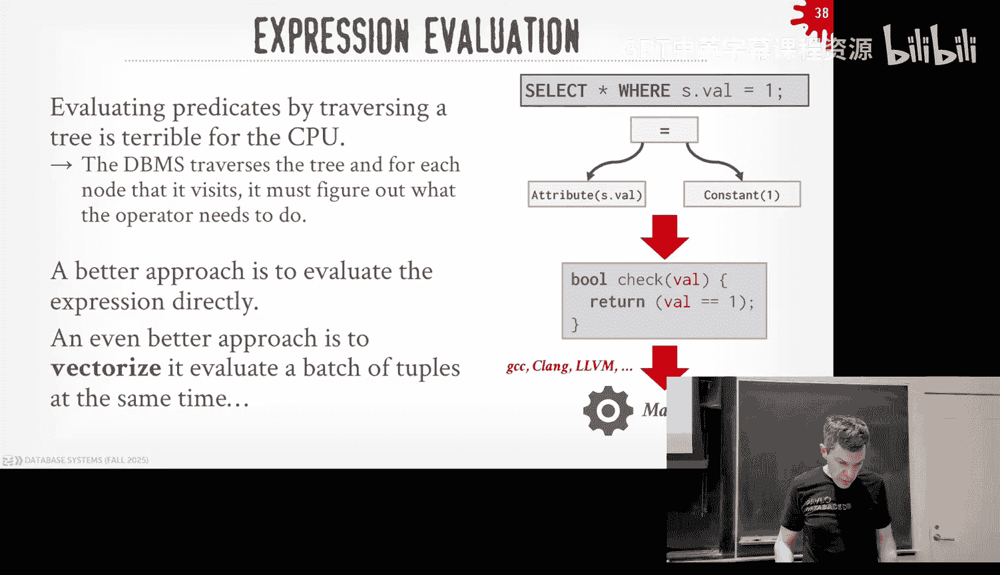
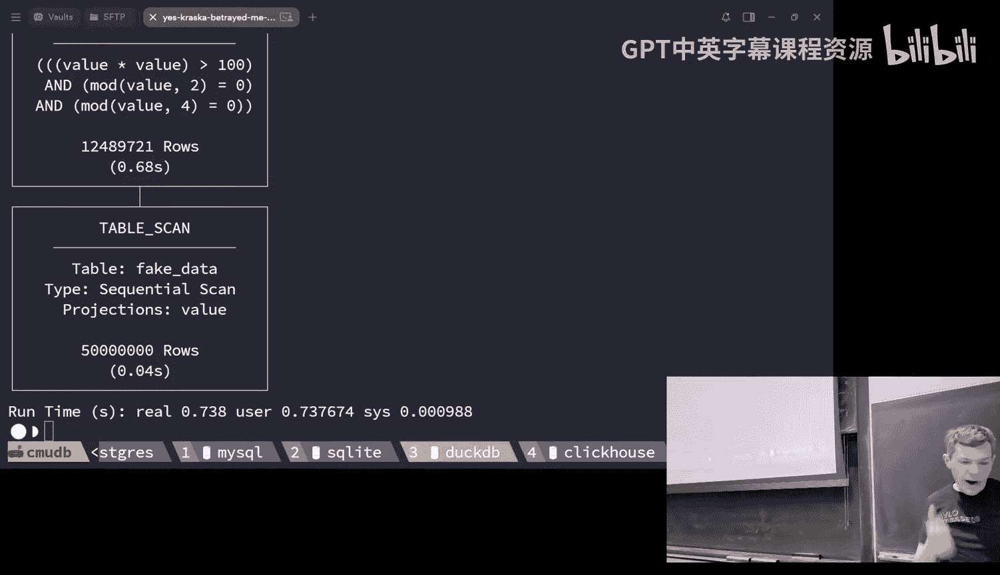
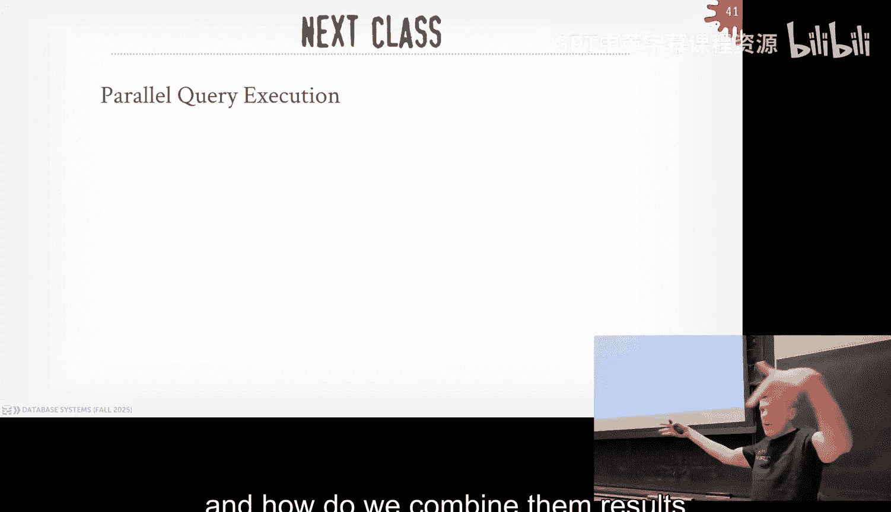

# CMU《数据库导论｜15-445 645 Intro to Database Systems (Fall 2025)》中英字幕 p13 -13-#13 - Query Execution Part 1 (CMU Intro to Database Systems).zh_en -BV1bmHGzsETM_p13-

🎼still。🎼送一 check。🎼管这我。🎼P your whats out。🎼想脾气的面。🎼我厌。All right， let's get started。

 round of applause andia cash。Welcome back， everyone。

 You did a bunch of travels with a break with L A and San Francisco。😊，See what like。

 do you do any shows out there， you just hangingging out。 Oh yeah， DJing a little bit。 Yeah。

 here and there， okay。Do you live stream it？My friend wanted that's all right so hopefully everyone had a good break I did what I because I only hear about databases。

 I visited a bunch of database companies， we went to snowf， we went to Superbase。

 we went to Planet scale， we went to Microsoft like we talked about databases， it was awesome。

And when we talk about query optimization next week。

 I can share what I think is the from Microsoft would be。

One of the most brilliant ideas I've heard in the entire year of how they're going to prove two SQqueries are the same。

😡，And they're going to use the query appizer for that。 So next week we'll see how it's not， you know。

 kind of in， I don't know what the co app is first， but when they told me what they were doing。

 I was like， oh， that's pure genius because。It's taking a SQL query， rewriting it with an LLM。

 And then need to prove that it's the same。 I use the query optimize for it。 Sorry。

 I'm getting way ahead myself because I think the idea is awesome。

 But we we can talk about briefly next week Today， we' got to talk about how aggregate actually execute queries。

😊，All so for everyone， Project two is coming up this Sunday due again。

 recitation video is available on box on piazza， thinks AWS is down this morning so everything's broken so you couldn't get to gradecope and to AWS but。

It should be up now I haven' been checked， but it was broken this morning and then we're having the special office hours this Saturday on the 25th at3 o'clock same location on the fifth floor and then for the midterm grades they've been posted on gradecope on Can and then if you want to view your graded exam with a solution come to my office hours on Wednesdays and you can sit down with it and look at it correct？

Who here has not started a project two？😡，Really， okay， wow， all right。It's not going to be good。

 that's not good。I war you， all right， Project two is much harder than project one。

 so please start immediately after class， okay？😡，All right so other database things coming on so today after class we have the guys from Collumar who are building thiss a thing called Apache Ar think of like it's a file format similar like parquet or orc of vortex but it's in memoryory so this is a way to transfer data quickly between different systems so arrow is used everywhere and then they have this arrow database compatibility or database connectivity API so a layer that sits in front of your application and the database server so you can send data back and forth between your application and the database server much more quickly this is used in pretty much every single modern system so that'll be our talk today at 430 tomorrow I'll post this on Pazza when it comes back online we have the guys from astronomer coming give a tech talk on the eighthflo at noon so there'll be P here for this one astronomer is the main company building airflow this is like an orchestration layer for sending data from one system to the other and I know we posted for internships and jobs。

Those guys on piazza so they're coming on campus tomorrow to give a talk about that and then I'll follow up with people if you want to meet with them to have a small group session about discuss internships and jobs we' arrange that in the afternoon before they fly out and then next week same time will be on Monday the seminar series will be the guy from single store to expand upon what he talked about in this class okay again all this is optional and I'll post about the astronomer stuff on piazza later today。

All right so last lesson before the break we were discussing different join algorithms there join operator implementations nest of loop joins。

 sort merge joins and hash joins right so now at this point we've covered the basic building blocks you need to be able to run queries we know how to sort data whether it's in memoryory or out of memory we how to do aggregations we now how to do joins and so starting today for the next two weeks now we' put all these pieces together in a casceptl system will a as we go along but now we can actually start executing queries so we can take the buffer pool that we built we can take the page layouts we've designed we can take now these operator implementations we're going to mash model together into a single system and actually start executing queries so that's what really today's about and next class will be about next week we'll jump on the query optimizer and that'll be how to take a SQL query and cover it into a physical plan that we're gonna to talk about how to execute today。

So again， as a reminder， the query plan in a relation data system is going to be a dag of operators ideally it's a dag most systems implement a tree。

 but a tree is a subset of a dag， the idea still holds。😡，And again。

 the idea is that we're going to be moving data up logically。

 and I'll explain what I mean but logically versus in a second。

 or're moving data logically between these seven operators till we get the route of the query plan。

 and that's the final output that we send back to whoever requested the query。

 whether it's an internal query， we keep the data for ourselves or an application or somebody sitting at a terminal。

 the route is always going to be the final apple that we send out to outside the system。😡。

But now we need to slice up this query panel a little bit further and talk about pipelines。😡。

And pipelines are just these logical boundaries we're going to use to denote that we have a sequence of operators where tubs can flow continuously between the operators going from the bottom to the top and we we we can keep going up across these operators and we don't have to stop or wait for。

😡，More results。Right， and a pipeline breaker will be the operator that's gonna be the the。

 the root or the top of one of these pipelines that。

Can't finish or can't give any output to whatever is above it until it gets all the input of its children。

So in my case here， say assume we're doing a hash join， although in this plan again。

 it's just the join symbol， we're not saying what the actual algorithm is。

 we're saying we're doing a hash join。😡，We're going to scan R and build a hashheev on that well that's the pipeline we really own can have we have we have the scanning R populate some hash the hash table and then we can't execute anything else until this pipeline finishes because we can't do the join and start probing the hash table until we know that the hashhe wasn't populated because we could get false negatives。

😡，So you'll see this also in sorting， right， I can't have my sort operator produce any output and twice sort my data。

😡，Because I can't tell you what the order is going to be twice I sort it every day。😡。

So these pipeline breakers are going to be way we're going to denote the boundaries of where we can do as much work as we can on single tus or batches of tus。

😡，And we don't have to get more data until we reach one of these pipeline breakers at the top。

The reason why it's called it pipeline because it the old days in the 70s was the idea is like I can it's so expensive to go get a tuple from disk so I can one of these bottom scan operators on my tables。

 I'll get one tuple and I'll ride it up as far as I can up into my pipeline and don't go back and get the next tuple。

😡，Until I reach my pipeline breaker。I would do as much more as I can with data that I bring into memory as I can and not have to write things out the disk unnecessarily。

😡，So that's the high low model what we're dealing with today。

 and the reason why I was trying to be careful is saying logically versus physically moving data because going back here。

 it's clear from this diagram， it looks like data is being sort of pushed up。😡。

But most systems don't do that， actually data is actually pulled up。Physically。

So that would way the processing models we'll cover that first， then we'll talk about access methods。

 like what are the actual leaves of the query plan， how are we actually getting data from our tables。

 because that's something we have really talked about and in detail。

 then we'll talk about how we handle modification queries so insert update deletes。

 merge and ups and then we'll finish off talking about how we're actually going to evaluate the expressions we have in our wear clauses or join clauses。

 whatever it is to actually produce the matches or do filtering whatever a query once。😡，Okay。

Very good， okay。I。All right， so the query processing model is going to determine how the system is going to execute a query plan and move data between these different operators in the plan。

 moving data sort of from one operator to the next。😡，And just like we saw。

 when we talked about storage models between like row Star versus column store。

 there's going to be performance trade offs and also engineering trade offs between these different processing model approaches。

😡，One will be better for OP， one to be better for OLAP。😡。

And so each prosecutor model is going to be comprised of these two types of communications or execution paths in our query plan。

 one is going the control flow， and that's how the database is going to say or to instruct an operator to execute。

😡，how we're encapsulating what the operator code actually is。

 whether it's a class or a function or whatever， it doesn't matter。

 but there's something that's saying in the data center to say， hey， go run this operator。

 do your work。😡，And then the data flow is going to determine how then operator is going to send data from one operator to the next in our query plan。

 logically， I'm showing the directed arrows going up from the bottom of the top and doesn't necessarily have to be that way。

😡，Right。And then the thing that we also need to worry about is what is the。

What is the output of these operators and we're loose laying tuples but we talked about the difference between early materialization and late tumorization4 before。

 we said sometimes where in late materialization maybe just pass along the bare minimum columns you need and then a record ID so that if some part of the query plan needs more data and knows how to go get it。

😡，In early materialization， you basically instantiate the entire tuupple。

 may throw things away with projections， but that's fine。

 but basically you never go back into the tables and get more data。

 everything you need is being moved up to the query plan。😡，All right。

 so the three basic approaches are with the iterator model。

 materialization model and the vectorized or the batch model， the original for the last one。

 the original papers were as the vectorized model， of course now if you Google vector databases or vectorized databases。

 you're going to get all the Ra vector index stuff or even the CMD stuff but this thing of this and batches。

😡，And the way to think of this on the the the。As we see as go along。

 the iterator model is going to be sending sort of the smallest amount of data from one upper to the next。

 materialization model is going to be sending all the data from one upper to the next。

 and then the batch model is going to be setting a subset。😡。

And in terms of how come these are in the real world。

 most data systems you know about and can think about are going to be using the first approach。😡。

Postgres My SQL SQL light， the OAP systems like the ductDBs， the redshifts， the firebols。

 the clickhouses， those guys are going to be using the bottom one， the middle1 is actually very rare。

😡，There's there's maybe five or six systems that actually use it and two of them I wrote。

 So there's not that many。 but I will go along each these 1。 one and we'll see。

We'll see the advantage and disadvantages of all three models as we go along。

All right so the most basic model or the simplest model the most common model is the iterator model this is sometimes called the volcano model because remember that guy that invented or wrote the book on like B plus trees。

 he had a very famous project in the late 80s early the '90s called volcano that defined not only how you do this iterator model but also how you parallelze it we'll see that next class and also how you build a query on optimizeizer。

 all in sort of one project it very influential， that was also called volcano and we'll see that next week as well。

 but it's not to say that this thing didn't exist before this guy wrote the paper in the late 80s。

 again all the systems in the '70s and '80s were doing this。

 which is now you could call the volcano model and someone who's familiar with the research here we know what you're talking about。

 but the textbook I think defines us as the iterator model。So in our database system。

 every query plan operator is's going to implement a next function。😡。

And the contract the next function has is that when one operator calls next on another operator' next function。

 invokes the next function， operator， that operator's next function either returns back the next tuple up the query plan or like a null or end a file to indicate there are no more tuples。

 and at which point the calling operator will never call next again because you know there's no more data that could arrive or it could be used below you at that point in the query plan。

😡，Right。There's obviously also an open and closed functions to like think of like constructor。

 deconstructor and C plus， basically saying， hey I'm going to hey， I'm going to go read some data。

 get ready， and maybe you instantiate an iterator on an index or open a file handle， whatever。😡。

And then the clothes basically is saying， like close up whatever。

Fre up whatever ephemeral memory you' allocated for this， right？Again。

 this' is also called the pipeline model because it's again the simplest form of this so just moving things up in a pipeline。

So I normally don't like to show code in class， but for this， it's pretty simple。

And I don't think this should be too tacking for you guys。

 but here's that query plan right and you can think of each of these operators are going to have their own operator implementation。

😡，That is going to have this sort of pseudo Python code here， right？

 And so think of each of these functions as or the blocks of code is implementing the next function for the different operators。

😊，Right。And to sort of keep this simple， we're going to number them from one starting the top and going to the bottom so the way you start the executing query in the iterator bottle is you start the database system's sort of runtime engine。

 the thing that's actually scheduling queries to execute will invoke next on the route。😡。

And the next function is the next implementation for that top operator， which is the projection。

 it knows that it has some number of children that it can call next on to go get data that it needs。

😡，So the top next function calls N on the next guy and this is our hash join hereem and so we have the left side and the right side so on the left side we got to build the hashable so it's going to call next on its left child and that gets down now to the scan operator on table R and now you see inside this we' just have this for loop iterating every single two pool R I obviously hiding like how do we get it from the buffer。

 how do we find the pages all that we know how to do that from earlier lectures。😡。

But inside that for loop， we just had as a function。

And that's basically like returning the next tuple that up to whoever called next on this operator。😡。

If you've ever written like a Python generator， there's like a yield function。

 so I'm not showing how we're freezing state inside of our forlope。

 think of the same sort of way you would do this in Python。😡，Right。

 and obviously C++ it's a little more。it's more complicated。

 the more machinery got to do right so in operator2 it's calling N X next over the left childil and down below we're just feeding up tus from table R and then inside the for loop for the left child in an operator2。

 I'm boat my hashable and at some point the operator three says I don't have any more tuples for you。

😡，And at which point operator two knows I' never need to call three again。

 so now let me go down right side of my branch， my tree and call next on my child。

 my right child that that calls next on his child and now this is just scanning twobalsome S and emitting them up to do the probe inside the hash table。

😡，Right？And then if I have a match in my when I'm doing my join。

 then I knit that up into my projection operator， which then can then emit that up to whoever called or en the a query。

😡，So for the pipeline for this is that we have one on the right side here， pipeline one。

 because I can call。I call next on my left child in operator2 and I keep ripping through tus and R until I don't get anymore and at which point I can then switch over and start executing pipeline2 and then if you kind of think about it is for one tuple that I pull out of S at5。

 I could pass it up to four， check to see where the predicate values to true， if yes。

 I pass it up to two， then it checks to see whether if I probe the hashable， I have a match。

 if it does， then I pass it up to one， it does projection and then it produces it as final output。😡。

So I've sort of pipelined the entire all the processing for the tuple on this side of the tree。😡。

So the great thing about this model is that it's a pretty simple interface， which is open next close。

So I'm not even defining how we're actually doing this scan here at these leaf nodes。😡。

In some systems， I may actually want to scan the entire table。

 materialize at an end memorymory buffer， and just keep track of a cursor every time you call next。

 what's the next two I want to hand out？😡，Or you could do it you sort of eagerly anytime you call next go get the next two on the page and then if it's that page if I already scanned that page。

 go get the next page so I could do everything all at once and just materialize the output and wait to pass it up one by one or I could do it one at a time。

 it doesn't matter and the rest of the implementation of the other operators doesn't have to care。😡。

What there again。系点谂去稳。Yeah， so so his statement is and he's correct like where let's not talk about parallel execution right just the notion is that I can't do I can't go down the。

And here， I can't go down the right side of the tree until I finish scanning。The left side。

Now there is a technique called symmetric has joins where you actually kind of do both。No does that。

Was if you're a Mer joint， like you'd have to scan and sort everything， well， yeah。

 so his book is if I was doing Star's join， I could scan and sort both of these guys in parallel。

 then once they're both done， then combine them。That's next to guys， worry about it。Keep it simple。

 keep it single threaded。But your intuition is correct。

All right so hopefully this should be like mindending for everyone again it's pretty basic know this is what bus hubub is using so you'll see this in project three right it's easy to implement it's easy to debug because I just hook up GDP or pick your favorite debugger and just walk through all the next functions and see how things move around and like I said it's easy to run as a single thread model next class we'll see how to parallelze it right。

😡，And the advantage is that I can pipe my bunch of data all the way through my operators。😡。

Without having to go get the next juple， so I'm going to go as far as I can up until until I'm done。

some systems go take this to like the next level。 And I'm just talk about keeping things in like。

 you know， our， our memory and other systems with these pipeline model。

 they'll try to keep things in CPU caches or like。The Germans try to keep things in CPU registers because that's the fastest memory you can have all the way up。

 and that's really fast。But for that， we don't need to worry about that。All right。

 so the iterator model is being great for OCP because it's going to get one two at a time because most of your queries only need a small number of twos。

 so the overhead of this is actually pretty small。😊，Right。

Another nice thing about this model too is that for like limit， we need to like limit functions。😡。

sorry， limit operators that going back here， like if I only need the first 10 tus that come out of this。

 it's really easy for me to implement that because I just put the limit above above one or sorry above two and I just stop calling next when I have enough tus for my output。

😡，Right， so so the。I'm sort of blending the control and the data flow all sort of in one channel。

 but it does make certain things easier than it would be for other things。

Of course there's a bunch of downsize like the function calls and nexts can be expensive。

 especially if you're trying to rid through a billion tuples。

 like a function call doesn't seem like that much， but like in modern CPUs that's expensive and you do this for a billion tuples that's going to start to add up。

All right， so another approach is called the materialization model。And it's basically the same thing。

 but it's the iterator model， but instead of passing up one tuple。

 I'm going to pass up all the tus from an operator。😡。

And at which point I'm basically calling next once。

 and I never go back and ask for more data because I know I've gotten everything I can ever want。

Of course， the problem's going to be with this is like if I only need a subset of the data。

 like if I have a limit clause， then I don't want to have to pass up the billion two between different operators just to get to the limit at the top says。

 oh， I only need 10 out of these a billion。😡，Right and so the we'll see this in a second。

 you basically do operator fusion where you can kind of start merging down logic that would no only be up above in the query plan。

 you start putting it as low as possible or embedding inside of operators so that I'm not doing much of redundant work or passing around data that I end up throwing away or don't need。

😡，And then just like before with。With。You know with the iterator model。

 right when I the data I'm passing could either be the entire tuple could be late materialization with a record ID and some columns or subset of columns there's tricks you what you want to do to like try to reduce how much data you're sending up and that matters a lot in the materialization model because again I'm sending all the data up。

😡，So this technique was developed in the 1990s， it was a system called MonadDB that came out of CWI。

 CWI is basically where DuckDB comes from or the co-f or Snowflake did his PhD there and he invented basically they looked at this。

 saw this was terrible and Mo ADDB and then the guy。Buildt a better system that then he went off。

 co found a snowflake that fixed this。 D B fixes this too， but we'll see this in a second。

So now in our operator implementation we have which again we saw these for loops。

 we're calling you know get next or calling output on our on our children。

 but now these these operative implementation I don't call。😡。

I don't call like a yield or emit to send things in piecemeal。

 I just have this output function that I'm returning their out buffer and I'm return back all the tus whoever asked me for it。

 so at the very top of the projection we call down into this join。

 the join then calls down to its leaf node again I'm justt scan through R and just add all the tuples and my output buffer。

 return that up to my to the join operator it then builds the hash table。

 then it calls on the right side down its children goes down the tree and then sends back up the tuples in their entirety computes the join and produces the final output。

😡，So again， if you think about always thinking in extremes， if table S has a billion two pools。😡。

And you look at the side of the pipeline， What am I doing， I'm scanning S。

 putting every single two in a buffer and passing that to the filter operator who then it's going to look to see which one of those tus I want to throw away So again。

 if you have a billion tus， but I only I only get like 10 of them。😡。

I' don't have to pass a billion tuups up just to find out I need 10， so with operator fusion。

 the basic idea is that you combine together the operators in the query plan so that as I'm scanning the table。

 I can then apply my filter and throw the things away。😡。

This is basically how you can do the same thing an ittor model or the vectorized model。

 but it's a big deal in the materialization model just because you're passing along so much data。😡，嗯。

Seems crazy， but why would you ever want to do this， let me take a guess。😡，With that。

 he said there' stupid but no。The guy who admitted this is probably he's dead。

 but one of thes best neighbor researchers of all time said， no， he's not stupid。駅応い。

If you always need a little day or。If it the guy invented this。

 it was an OLAP system from the Moon ADB， they were assumed that you would need all the data within a column。

 but not all the columns。So they would do projections as operator fusion and throw away a bunch of these columns and just the columns you don't need and only pass out the columns you do need right and then now you don't pay the overhead of calling get next。

 get next， get next for just to get all the columns from one operator the next。

They use the operators together， then it totally matter which model you use。

 because it's all what they you lose。Sa it is， if you do operate infusion and you fuses everything together。

 which you can't， you can fuse things in pipelines， but not always。😡。

Then kind of is one giant program。啊嗯。Again， if you have a pipeline， like I can't fuse together。

Some things I confuse together， some things I can't。

And the Germans are very good at fusing like almost all together。

 You can fuse everything within a pipeline。 But soon as I have to go across pipelines。

 I can't do that。So for OLAP， no one does this except for again， a very few systems。😡。

This actually works in OTP systems。😡，Because most of the time you're not getting a lot of data。😡。

So the overhead of having to call get next， get next， get next。

 if you can fuse everything together because you probably can only have one pipeline。

 then it collapses down and becomes way more efficient。😡，Again。

 this is for in memory systems it matters a lot like because I'm not worried about fetching things from disk。

 I'm trying to reduce number of function calls I have to make for OTP， this makes a huge difference。

But in most systems OF systems don't do this like high riseise was an experimental system out of Germany that started implementing with this approach and then they in the rerite。

 they got rid of it and switched over to the vectorized modelll see in the next the next next slide then Raaving Db is a document data systems like it's like Mongodb but at Israel and again they're doing OTP so it it makes sense in that environment right it's simple model easy to code easy tobug。

And it's not bad until you start getting with really large data set sizes or intermediate results。

 then it falls apart。All right， so the best approach for OLAP is going to be the vectorized model or vectorization model and that's going to be somewhere in between the iterator model and the materialization model so instead of passing along a single tuple or all the tuples。

 I pass along a subset or a batch of them。😡，And different systems have different batch sizes。

 I thinkductDBs like 1024 right it's not going to be in the millions。

 it's going to be some multiple of a power to like 1024 or 2048， something like that。

So you're still going to have a next function， but again。

 now instead of passing wrong single two but， you're going to pass along a batch or a vector， right？

😡，And then within the。We're not going to go too much detail detail for this and for this course。

 but there's a bunch of logic or there's different ways to handle the case where I know my batch sizes are 2048 but if I start filtering things out in a batch as I go up。

 do I wait to get more data down below to fill that batch up back to 2048 or 1024 or do I just pass along whatever I have up the query plan and let it be sparse as you go up's not there's pros and cons each of those approaches but for this class we don't need to worry about it's more about like how do we keep track of this how do we actually sort implement the basic idea of this？

😡，Right so again， going back to our approach here or our example here right now in our operator functions or our next implementation。

 now we see that instead of passing along you know instead of calling emit immediately when we have a as our output。

 we are maintaining an output buffer， but it's not the full it's not going to be some large chunk of memory that we would have in materialization model。

 but now that we check to see any time that our buffer is our output buffer is full。

 then we emit it up。😊，so now again down here， I'm going to scan through table R。

 add a tuple to my output buffer， and then only if the size of the output buffer is greater than n where it ends my batch size or target batch size。

 then I pass up the tuple batch。😡，And I do the same thing down below over here。Right。

P you shape for it。So this idea seems obvious。😡，It's only existed since like oh dont know， 2006。

 2007。Even the OAP systems that were around in the '90s or 1980s。

 they were still doing the iterator model and the case ADDB。

 they were doing the materialization model。And like I said。

 the guy that was a cofounder of snowflake was at CWI Salman AB do dematilization model。

 thought of a better way to doing it。In this bash approach and then he did a startup that got bought by Ingress。

 which was one of the first leg databases， but then they killed off that project and then he went and founded snowflake with two guys from Oracle and the snowflake is the behemoth。

That it is today， but pretty much every new database system that does OAP or targeting OAP workloads in the last 10 years is going to be doing this approach and again the size of the batch will vary 1024 is probably anecdotally。

 I would say it's probably the most common one。There's a bunch of other optimizations that you can do now because you're dealing with batches that we're not going to talk about。

 but if you know what CID is or single instruction， multiple data items。

 like now that I'm operating on a column of data that's all the same that it's going to be aligned together in memory。

 I can shove that in my CID registers and do a bunch of processing in parallel it's really really fast。

Or I could sve things down to a GPU if I wanted to and do processing on parallel on those batches as well。

Right。So the data system is having really efficient implications for now these operator kernels because they're ripping through these arrays or these vectors very efficiently and you're basically doing the same amount of work for a bunch of tuples altogether and that's the best thing for a modern CPU because I don't have a bunch of branches or conditionals like I'm taking a batch of data and hang out tight for loop。

 just do whatever processing I want on it and then pass it up。😡，Right。And again， theres。

There's probably way more systems that I'm showing here。

 but every system that does OLAP nowadays is going to use this approach。😡。

And even systems that start off with the iterator model。

 abandon it and switch over to the vectorized model。All right， so we have this iterator model。

 the materialization model， and the vectorization model。😡，In all the examples I showed till now。

 we assume that there's this next function that I kick off the query processing for given query plan by starting at the root。

 calling next and then that sort of percolates its way down the tree and data starts moving moving towards the top so I'm essentially pulling data from the top of the query plan by calling next I'm sort of pulling it up between the operators up into the query plan to reach the top now this is how most data systems are going to implement this so this is like is sort of independent whether I'm doing vectorization or iterator model。

😡，In either all three of those different processinging models。

 I can have this next function extraction and do that pulling of the data up。😡。

We would call this the loose I would call this a plan processing direction。

 and so the first approach is this what I just said I've been showing you so far is again。

 calling next， pulling gate up， but there's a whole other approach where you actually start with the bottom。

And push data up and this is why I was trying to be careful saying like， oh。

 when I showed the query plan the beginning of that lecture， I'm saying， oh。

 this is logically how data is going to flow， but the implementation。

 the physical implementation could actually be different。😡。

So in the pushb model it is kind of like again thinking at thinking how the diagram is drawn in the logical plan like I'm going to start at the leaf node and I'm going to do whatever processing I have on them and then move data up so I don't even start at the root and call next down low there is really no next function there's some higher level scheduler that says here's all the operators I need to execute or here are the pipelines that need to execute and it knows how to invoke them individually which may not be sort the same bottom to the top order。

 it can decide on its own how to reorder the pipeline to execute based on。😡。

based on what it thinks is the most efficient plan or efficient strategy。

So let me sure what I mean by this， so we have these two pipelines here。And again。

 each of them will have their own operator implementations right the first pipeline here。

 we're just be scanning table R and then we well build some hash table and then for our second pipeline。

 we're going to take all the tuples and s and probe whenever a hash table got built down below us and then admit them if there's an match after do the projection so I'm doing an operator in fusion here within my pipeline because it's just take one tuple and run it through those individual operators until I produce my output。

😡，Right but there's no direct connection， there's no emit function anymore or next imvocation between these different pipelines。

 I just know I have these two pieces of code， they're going to get data from somewhere。

 they're going to write data somewhere， and then now I have a high levelvel scheduler they can say。

 well here's all the tasks I need to execute within my for this query it can then decide in the order in which wants to execute them。

 but it knows the dependencies of the data that between the different pipelines。

 soOA can't run pipeline2 until pipeline one finishes populating the hash table。😡。

So it would invoke pipeline one first。And then now there'll be part of this task that we're executing here。

 there'll be some notion of there's a location of where I can write my data to as I produce my results。

😡，So as I build my hash table， I could be allocating pages in in my buffer pool。

And writing my hash table out to there， and then when I get full， I get more pages。😡。

And then when my operator one is finished， the schedule says， oh well one is finished。

 but I know task two is waiting for task one to produce results。

 so I can now schedule to execute task2 and oh by way task2。

 here's the location of the data that the first task wrote two。

 so if you need to go get its output here's where to go find it。😡。

And then it can do the same thing it's going to do some output that it has when it does the join and the projection and write to that output buffer when the task finishes。

 the scheduler knows， here's the final location of the data that this second operator produced or second task produced。

 and it knows that's the result that one sends back to whoever asked for the query to execute。

So I'm now I'm separating the notion of like the control flow and the data flow， meaning like。

The scheduler is saying， execute this task， execute that task。

And it's not trying to piggyback off like that next function to say， all right。

 this guy this guy calls this guy because that's basically the game scheduling mechanism。

 but it's implicitly happening because of the way the next thing sort of propagates down。😡。

But now I have these discrete tasks and I can have a more global view of what's going on in my query。

 and I can make better decisions how I want to schedule things。😡，Again。

 the push model because I would schedule the leaf nodes first。😡。

And they' were sort of pushing data up rather than me starting at the top and working my way down and pulling data to the top。

😡，So there's pros and cons to all of these again， it's way easier to implement the top to the bottom。

 the pull based approach and most systems are going to do this it's we talked before it's easy to control the output for my limit clauses because I know how to basically stop calling next when I know I have an update right？

😡，In the case of the bottom to the top of the pushb model。😡。

You can you can have a better implementation of these operators that can be more careful about where they're putting data。

 I'm showing to write it to generic output buffers， but you can start doing things like，😡。

Within my few pipelines， put things in registers， and then make sure that the next task gets scheduled can then maybe read those registers or something。

Right。For some operators it can be dimt implementent like a sort mergeRS join because。

I sort have to sort two things separately。And then run a task that then does the join。

 whereas I could have a， know if I'm doing the pull base model， I could have a single pipeline。

Assume that the first result is sorted， then sort the second one and then just feed things up through that way。

But that's a low level detail you don't need to worry about so the top one is way more common the second one I would say is rareish the most famous system that probably started implementing this approach was hyper from the Germans and then this found its way into umbra it's the second version of hyper but a ducky bee started off actually using the top one and then they realized that was mistake or they realized that it was a better idea to do the second one to the bottom one here so they switched to that but they recently didn't start in this way Clickhouse does this Ced is a commercial fork of umbra Firebolt does this stufffl does like the major OapP systems all do this approach in combination with the vectorization model。

But again， those two design choices are independent。

 I could do factorization model with the pull basedase approach， data fusion does this。

 a bunch of other systems do this。😡，But the second one has much advantages。

But you maybe don't only realize until you actually implement the first one， yes。😡，So。所以他。

Mip of approaches still exist are the。system。This question is in in a。

And could a data system support？Different processing models， so not the plan direction。

 but the processing model， so iteration material and vectorization， yes， in theory， yes。

Nobody does that。Because it's now you got to implement everything a bunch of different things right。

 And makes it harder now to potentially compose things together。 I mean， you basically can get。

 you can get the iterator model if you implement vectorization or actually really all of these by just having your vector size be one。

It's the same thing it could be less efficient because you're to put things in an output buffer。

Right versus just passing along a single tuple， but it's basically the same。

 But nobody would do that because now you're maintaining。You know。

 you know different variations of the same thing and that becomes engineering nightmare。

 it's just not worth it。Does that mean that they used to。我。Yeah， so his question is。

 to say go back to。It's to iterator model and， and then the characterization model。

 So in this slide here， I'm showing Oracle。 I'm showing SQL server， right。

 There's focus on those to it And then and or DB2 as well。 But then I'm going to jump over now to。😊。

The vectorization model。Oacles here DB2 is there and sql over there， so in the case of Oracle。

 we didn't get to talk about this， but they actually had run dual engines。😡。

So they'll have a column store engine and a row store engine all within the same binary。

 but they're separate code bases。 So technically they support both same with like SQL server。

 They would have they have like a column store engine。 So basically Oracle， SQel server， Db2。

 all these systems are from like the 1980s or 1970s。 And so they're all row based。

row based pull iterator model limitations and then when column stores and oh that stuff became more common they realized oh our implementation not is not inefficient like vectorization models better。

 the let's know the push based thing vectorization models better and passing being in column stores better so they had separate engines that can you know use these different approaches。

😡，But within one engine itself， it won't switch。That would just be a nightmare to maintain。Okay。

 cool。All right。嗯。Al right， so now we're going to talk ask access methods。

 So but now we know conceptually how we're gonna to move data up from the different operators or between different operators。

 I don't mean to use direction， but I think you understand between the different approaches now。

 So the access method is going to be how you get data from the leaf nodes。

Because in relation to algebra， there wasn't a definition，'t we didn't say， oh。

 here's a squ scan operator or here's an index operator。

 it was just like I do a filter or a projection or a select on a relation。

 but I didn't define how I'm actually going to get the data。😡，So now in our implementation。

 actually we have to worry about that， right？So there's three basic approaches。

You add your sequential scan， that's the fallback approach。

 like no matter what I can always sequential scan the data。😡，But if I have an index。

 then there's a bunch of different ways I could go at this and I could either choose one index new an index scan or in some systems I have multiple indexes。

 I can do index scans on all of them。Or some portion of them。

 and then be clever about how I combine the results to put it together。

So we're really focusing right now how do we actually do this bottom part here？😡，And like I said。

 the squrum scan is the easiest thing to implementplement， assume you're doing a heat based system。

 it's just going to the page directory， getting wherever the first page is。Reading。

 you know scanning it， finding tus and then emitting them or putting them in a buffer or how it's actually being implemented it doesn't matter。

 but just I'm going page by page and reading data out and shoving it up to the next operator。

And basically， the data system of the operator imation will maintain its own cursor。😡。

And it just keeps track of where it left off in where are the last page or the last people that it looked at so that if it calls next again or has to require more results。

 it knows where to pick it up where it left off before。😡，Right alternatively。

 you could just materialize everything， scan all the pages， put it in a buffer。

 and then you know scan through that or iterate through that and shove twos up。

 but you know that actually has that obviously has problems because。😡，If it's a large table。

 I got to put it somewhere in memory and I may you know。

 it may not be the most efficient way to do this， right？So again， Sro scan is the fallback choice。

 it seems like again， if I have no index there's no other way to get T data。

 I can always just read the pages one by one。😡，So this seems like this be terrible and very inefficient。

 except that we've already talked about a bunch of different ways to make this go fast。😡，Right？Right。

 we've already covered a lot of these things in previous lectures like data encoding compression。

 What was that that was taking data and。Converting it to a different binary form that exploits repeated values。

 repeated data so that when I go fetch a page from disk， to do my Scural scan。

 I'm reading more Tups than I would otherwise if it was uncompressed。😡。

All we talk about how to do pre-feting their scan shaing I think we skip bufferable bypass。

 basically just basically direct copy things into memory space for a worker。

 but pre-fetchinging was a big deal it was like if I know I'm going to scan the data sequentially。

 go fetch a bunch of pages ahead of time bring them a memory so that when I need them I don't stall waiting for disk to right there available for me。

Task parallelization， multi threadreading， we'll see that next class clustering sorting again。

 if I'm doing I can do binary search over sorted data。

 I can do sorts joins over sorted data much more efficiently than just if it was unsorted。😡。

Materialized views or sorry laborization we already talked about like passing on bare minimum with data I need materialized views and result caching。

 we won't cover this semester， result caching basically is like if I execute the same query over over again and that the data hasn't changed。

 why execute the query again just give you back the last result。😡，That is rare。

 most systems don't do that， materialized views is where the application tells it， hey。

 I'm going to execute the same query over and over again。😡。

And so preke at the results and give it back to me the cache results when I run the same query or a query that looks could be answered by the materialized view。

 of course the challenge is how do you maintain the freshness of that materialized result？😡。

The high end systems can incrementally update the materialized view， like every single time。

 if I'm computing the sum of a column， every single time I insert a new tuupL。

 I't want to scan all the tus and recompute the sum。

 I can just increment or decrement based on what new value gets insert or updated。😡，Right。

Postgres can't do that Postgres can't even do it automatically you have to tell it when you want to refresh materialized view so we're not going to cover that in the semester and admittedly to do the sophisticated materialized views。

 that's the part of data systems I know the least about because it's really tricky and very few systems do this。

😡，Data skipping is basically we'll cover in a second。

Data parallelization and vectorization we'll see in the next class code bestization and compilation I'll talk briefly about this end of the class here I'll show what PostBt does。

 it's basically saying well if I know I'm going to be executing this know I'm going be executing this query rather than me interpret that and walk through that query plan tree。

 let me just generate a program that does exactly what the query wants to do。

 compile that and then that's going to be way faster than interpreting。

So postscripts do this for the warehouse claws， they want it for the whole things。

 the Germans do it for the whole things。And we'll cover the end of this class。All right。

 so I want to go through data skipping。Because then this allows us to avoid reading data we don't actually need if we know we don't need it ahead of time。

And then we'll cover these other ones in a second。So there's two ways to do data skiping。😡。

The first is not that common， it's called approximate queries， basically it says， well。

 if I don't really need an exact answer， don't read all the data to compute the exact answer。😡。

If I want to get the number of visitors on my website for a given month。

 do I really need to know it may not really need to know the exact count of the number of visitors？

If I round it to the nearest thousand， if my website was getting millions of views。

 that's good enough。So in the high end systems， there are。

In addition to all the aggregate functions we talked about for， like count min max sum average。

 there's approximate count， an approximate min and approximate max。They're basically doing sampling。

And the better systems can give you sort of statistical guarantees about how accurate the sample is。

Because if I really need the full answer， I'll just do a complete scan。Zome Maps is way more common。

 most of students most file formats support this， basically it's like a pre computer aggregation on a column。

So that depending on my query， if I know that I don't need。

 if I can look at the zoneone map and see that the data that the Z map represents can't be satisfied for my predicate。

 I don't bother reading it。😡，It's like a filter。can't tell me whether data actually can't tell me where the data I maybe want is。

 it can tell me where to block of data we didn't have the data that I'm looking for。

And this is super common， and in every system uses this。So say we have a simple column like this。

 a single column with integer value， so my Zac could say like for this these set of values。

 here's the min， here's the max， here's all the aggregations I may want to compute on this。😊。

sometimes you can use like the number of null values， basic statistics。

Main Max and number of null values are the number of distinct values the most common ones。

 but you can pretty much throw anything in there right and pretty much all the file formats of parquet orRC。

 the vortex one from last week that talk， I think the guys giving talk this Wednesday as well。

 they all support basically the same kind of thing in their file formats。So now my query shows up。

 select star from table where value is greater than 600。

 So say again I'm only showing five tuples here， I say again in large terms， I have a billion tuples。

😡，So I can look in this zone map and say， well， I only want to look for values that are greater than 600。

 so I look in the Zoom and the Zoom map says， well my max value in this block of data is 400。

 so I know there can never be a match for me in this block of data。

 so I don't even go bother reading it。😊，I read the Zoom mat and that's smaller， yes。

Have you choose to approach you。The question is how do you choose what approach you want to do in terms of going back here。

 so the first one is lossy。😡，So you're going to get wrong results， is that okay？

Well the data system doesn't know doesn't know what you care about right it's your company。

 your organization， your startup whatever， so maybe you know for certain queries。

 that's okay the data system can't infer that because that's an externality that can't know about so you have to say I want approximate that's approximate that。

😡，Right。You always do this one， you always do the bottom one。Because it's always a huge win。

If it's your bank account， do you want to have an approximate count on your or some on your balance。

 no， right， Jason can't know that。right， so there's a paper so the orac or term it's called Z maps。

 Sometimes you see these calls SMs or small materialized aggregates。 it's a paper from 98。

 basically defines it in this way。 right again， seems kind of obvious。

 but he didn't really come out until the 1990s。 And this guy here Guido。 He's a German。

 So this is the PhD advisor of like the number one German that does the umbr and hypertuff that we talked about many times。

 So this is his Ph advisor。 So the Germans are ridiculous。😊，All right。

 so that's pretty much how everything you do with Sc scan。

 we'll talk about compilation of code specialization at the end of the class。😡。

So let's talk about index scans。Again， we know what index are being used for right。

 we saw this before how to figure out like you know what the。

How to use a B plustry or skip list or whatever the dashs we want to find the tus that match whatever we want to satisfy in our predicates。

 in our query。😡，Now the challenge is going to be how do we determine which index to use。

 like if I have how much indexes I can use on my that are available to me on my tables。😡。

And my wear clause actually references a bunch of columns that are being managed or referenced by a bunch of indexes。

 which one is to mean the best one for me to use， that's a hard problem。😡。

And that's what we'll cover next week， so for now we're going to ignore how do we pick what the best index to use is to assume somebody some oracwas not Oracle the system with a company。

 some Orac has figured out this is the best one you use so now we can talk about how we actually want to go ahead and use it。

😡，So way to think about this challenge is like。We're trying to reduce the amount of work we have to do and it's going to depend heavily on what the data looks like and what our predicate looks like so say we have a query here we want to get all the students that are less than 30 that are in the CS department and come from the US but I have an index on age and department。

😡，So one scenario there's 99 people aren the age of 30。

 but there's only two people in the CS department， but the flip side could be there's 99 people in the CS department。

 but only two of them aren't under the age of 30。That me shit， sorry。Yeah。Sorry。By lawyer。All right。

Right， so。Yeah。So in this case here， it's kind of obvious right so if I have more students that are in the CS department。

 but only two people that are under the age of 30， then I want to use that age index because I can quickly go get those one2 students that are age 30 and then go check to see whether they are you know in the CS1 or not in the flip side if I have more people that are under age of 30。

 I want to use the department one because that's more selective。😡。

So this is basically what the AsStime is going to try to figure out for us and then once we figure out this is the index I want to use based on the API that's available to us that the index exposes。

 then we just，😡，Invote an API and an operator to get the data that we want。

In a B plus tree or a skip list or a try， I can do range scans。

 but I can't do that in hash index so the has to figure out， all right。

 my predicate has an inequality or less than for my work SQL query has less than for age。

 but it equals for department so if I have a hash index on age。

 I can't can't use that to satisfy this query， so it'll pick another index。😡。

And then we just evoke the API to get the data we want out of it。The cool thing is that。

We may not may not always have to make a single choice of like what's the one index I want to use out of all my indexes。

 some systems lets you use all the index or as many indexes as you want。😡。

And then you just do the probes or do the lookups on those indexes。

You get back the record IDs that match whatever your predicate is。

 and then you do either a union or an intersection between the results of different indexes to find the tools that you want。

😡，So some systems will call these multiinex scans， Postgres calls this the bitmap scan because it's going to build a bitmap and then do intersections on the bitmaps。

 by SQL calls these an index merge， they're all basically doing the same thing。

And if the preddicateates and your wear clauses across the different indexes their conjunctions and clauses。

 then I just take the intersection。Of the two sets， or if I'm doing an or disjunction。

 then I take the union two sets。😡，Then I have all the record ids that match what are the predicates across all my indexes。

 and then I go fetch them from the table to go get actually the results I need。😡。

So we going back here to our example again， so we have doing a talk of all the students that are ageged less than 30 in the department computer science bar or in the US。

Assuming I have an index on。On age and department。 so and they're both equally is good。

 So I'll retrieve all the I'll do a look up on the the age index and get all the twos that are less than 30 or sorry tus when the age is less than 30。

 then I'll do another probe in the CS department and get all those tus that are in that department and then I take their intersection。

😊，And then then I go get the tubs that match the intersection that are still in my intersection result。

 then go see whether their country is US。😡，So visually this just looks like this。

 probe the first index， get all the records that are less than 30， probe this index。

 get all the records where the department is computer science， take the middle part。

 the region here in the intersection， fetch those records。

 then just do additional lookup to see whether the country is US because there's no index for me to do that。

Pretty straightforward。All right， so now we got to talk about how so we now do selectx。

 we do either index scan， a s scan or a multi-in scan。

 the basic idea is the same right and then depending on our processing model。

 we're either batching them a bunch of tus or sending one to two at a time， it doesn't matter。😡。

For tubs that modify the database， insert update deletes。😡。

We're basically going to piggyback off of the the basic access methods that we have and all the other opportunities we have to。

😡，ToTo modify these database。😡，So that we don't have to reimplement。

Like in the case of a delete or an update， we don't have to reimplement scan operators。😡。

To go find toolss that match our predicates， we just reuse the scans we use for select。😡。

And then now the output of those stand operators are then used to then do whatever the update or delete for insert。

 the basic idea is that you decide whether you want to materialize。😡。

The result as a separate operator or within the insert operator， and I'll show the next slide。

For other operations like ups， merges， tru， truates are easy just drop the table and then add a back。

 right ups are basically scans followed by updates if there's a match or insert。

 they all basically work it the same way。😡，So update deletes。

 we're just going to use all the scan operators， access methods we talked about before。

 and as they pass up the record IDEs， that's what we been used inside of these modifying operators to then change the data as we need。

 right？😡，We've got to be careful though and keep track of any tus that we may see before because if we'll see in the next slide if we start scanning data on an index and we start modifying data and we physically put it somewhere back in the table or an index that the iterator hasn't got to yet。

 then it comes across it again， we don't want have to modify or delete it multiple times。😡。

For inserts， again， you either materialize the tub inside the insert operator itself or you you materialize it on the outside and if you do the last one。

 then you can do like select into， you can do like createate tables， all the select statements。

 like it's really it's easy to compose these things together because the insert operator doesn't know。

 doesn't care how tuers are coming into it from down below it and the query plan。

 it just says take this and put it into this table， I can do that。😡，So but again。

 we had that decoupling of the concerns or the logic for。Populating tua buffers。

Then we can have whatever went below us in the query plan generate tus long it's in the right form that we expect following our API。

 the insert operator can anything from anywhere。😡，You do10 tables and everything using this as well。

All right， so let's see this problem about updating things multiple times。😡。

I'd say we have a table of people and we want to keep track of the salary and I want to run a query where we're going update everyone's salary。

 I'm going to add $100 bonus or increase their salary of$100 and the end of the year。

 if you make less than $1，100。😡，So assuming we're going with the iterator model going from the pullbase approach from the top to the bottom。

 I start at the top， I'm going to start scanning all the tubs from my child。

 it goes down below and now in this second operator down here。

 then I'm going to do my index scan and it's going to instantiate an iterator that it's going to just scan across all the leaf nodes and find tus and then emit them up to the next operator。

😡，So the first thing it finds is me and I make $999。

 so that gets passed up now to the up and above it。We then go inside the for loop， do the update。

 add $100 to it， and then write it back out to the index。Right。

So then now we go down back down to call next on the chat upgrade again， we scan across even further。

😡，And then now we come across me again。with my updated salary。

And then now I'm going to update it twice。😡，AndThat's obviously bad。Right。Or what's happening here？

changing the physical location of data in whatever data structure are being used at the leaf operators。

I'm moving my record Andy used to be over here because this is indexed on my my salary。

 but when my salary got updated， it got moved to another physical location on the leaf nodes and then the iterator goes along and then it finds it again。

So this is the very famous problem from IBM， it's called the Halloween problem。

And next week's Halloween， so I always like to bring this up。

So it's an anomaly in a data assessment implementation that occurs when the physical location of a tuple changes that causes a access method or a scan operator。

 whether it's an index scan or a sequential scan to come across or see the same logical tuple multiple times because its physical location has changed。

Like logically， there's only one Andy。You know， in in in the not the world， whatever。

 like's one logical Andy， but physically in my， my database。During the execution of this query。

 it physically moved different locations， so it doesn't know it didn't at least the simplistic imitation。

 a naive imitation wouldn't know that it's seeing the same logical thing to sees distinct physical tuples。

😡，So this was discovered by the IBM researchers in the 1970s， 1976 when they were building system R。

 which is one of the first relation systems ever built right it has nothing to do with Halloween like the original use case wasn't Halloween they discovered this problem on a Friday late Friday afternoon when they were building system R and they were like oh this is hard what would we do and they were like oh I don't know it's Halloween let's figure out on Monday。

 let's go out and drink and they just left the problem they solve it the next week so it just happened that they discovered this on Halloween and went drinking and didn't solve it that day that's why it's called the Halloween problem。

And there's a Wikiped article explicitly calls this out。so again。

 it's the way to handle this is sort of obvious that you want to keep track of like。

 have I seen this logical tuple you know multiple times or did I modify this tuple I'm looking at to know that I don't need to modify it again？

😡，Right？It's's sort of I always how to solve how to do this， you have to handle in project three。

 I'm only bringing this up to say like there's much of logic that I'm not really showing here inside of my scan operators where I'm keeping track of actually what I actually am modifying。

😡，And whether you keep track this track of like， here's the things I modified in a separate buffer or you record in the header the tuple like this thing was modified by me。

 therefore don't look at it again。😡，There's ways you can implement this and they will see this in two weeks when we start talking talk about Kiker show how to handle it。

喂。So for the end of this class， I want to talk about how we actually handle expressions。

So it's sort of obviously we have these wear clauses that we want to。😡。

Evaluate to determine whether twos match and whether there's a join or a filter or whatever it is。

 so now we have to talk about actually how do you actually execute these things？😡。

And the way you represent this is just another tree。

 so within our tree query plan where each operator could have its own trees that represent the expressions that they're responsible for at that sort of level or that point in the tree。

Right so for our join clause or R IDD equals SID and the where clause s do value is greater than 100。

 while this is just a conjunction between the join clause on the two twos the two tables。

 and then the evaluation on the value based on whether it's greater than some constant here， right？

So basically， while a query is executing， as you're scanning the data。

 you have to evaluate this tree to determine whether the predicate matches or whatever the operator wants to do。

 whether it satisfies this expression， defining this tree to determine whether you be moving tus up to the next operator or to the next stage in the query plant。

😡，So let's going sort of s look at this so we haven' to talk about prepared statements。

 but thinking of like a macro I can have declared in SQL so I have prepared X X X as then I my select clause。

😡，And now you can see inside this my select clause， I have where do s dot v equals dollar sign1。

 so parameter 1 plus9。And so I call a pair of my application I say， hey。

 I'm going to execute this query a lot， give it a name Xxx。😡。

And then now when I want to execute it again， instead of calling that entire select query。

 I can say execute and treat it like a function， say execute query X X X and pass in the parameters 991。

 and that'll get substituted in Do1 up there。😡，Some substance will the basic idea is like instead of me having to run the query optimizeizer for every single time I'm going to build this query。

 I can prepare it ahead of time， cash it and then reuse the query plan over and over again Of course there's trade off so this whether it's a good idea or not like。

😡，Depending on some values I may pass in because I don't know。

 I don't know all the values when I call a pair， some might have one query plan versus another。

ThereThere's no free lunch sometimes it's a good idea known it's a bad idea and different systems do different things Postcasts will automatically generate these prepared statements for you when you run the same query five times。

😡，Right。Other systems don't do that。All right， so as I'm scanning my data， my operator。😡。

I'm gonna to have this execution context that's going to keep track of like what's the tuple I'm looking at。

 what are the parameters that are passed in when I book this query and what's the schema of the table I'm looking at so now when I evaluate my tree。

 different operators in my expression tree are going to need different information from the different context so all that I want to have ahead of time so that I'm not doing these lookups every single time because I'm trying to rip through this expression tree as fast as possible because I'm doing this on a per tuple basis I have a billion tuupples I got to walk this tree a billion times and I want this to go as fast as possible。

😡，So you basically are doing depth first search right I'm going to start at the top or depth first traversal by equal sign here。

 I know I want to go down to the left side so I want to get the value for the attribute S do vow so I again look up in my execution contact and say oh well。

 I know that I need S dot v in my current tuple and is that offset based on the schema so I can just then extract out the value 1000 here。

😡，Then I traverse down to the next side of the tree and said， all right。

 well this leaf node here once parameter  sign1， I look at my execution contacts see that I mean passed in 991 as that parameter and then I go down to this side here I just materialize this constant9 to come back up to the addition operator add these two values together and get a thousand and then come back to the root and say does a thousand equal00 if yes。

 emit true otherwise emit false， then whoever invoke this tree to do this evaluation here takes the output and decide okay for as I'm scanning this data。

 does the two will match this predicate and the tree tells me whether it does or not。

Do you think it's a good idea or a bad idea？It works。It's whatt， It's good， why？All right。

 you know what，'t， yeah， I'll take that yeah。Can we do better？买了。Sa compile it， yes。

AndWe'll see that in a second， yes。So it's terrible for the CPU because I just made a big point about how like the materialization model was trying to or and the vectorization processing model was trying to remove all the ahead of calling N XX。

 but now within you know even I'm passing along a batch of tuples to remove those next calls。

 I got evaluate that tree， and that's kind of a bunch of indirection these function for these operator pointers。

 right？😡，And that that's going to be really slow。And so what I really want to be able to do is just evaluate the expression directly and not have to traverse the tree because it's pretty simple actually what we're doing here right so my example where S stop value equals1 and I have my tree form of this。

 well， that's really just a function called check that returns true if value equals one。😡。

So if I could avoid that overhead of direction the tree and just invoke this function。

Then be way faster and if I'm running on a batch of tus like a vectorization model。

 I can hope my compiler will automatically auto vectorize it using SD or if not I could use intrinsics to write it myself。

 but now I could pass along instead of a single tuple I can pass a batch of tuples。

 we're all just checking whether something that the value equals one and that's gonna go super fast on SD instructions。

😡，And then their suggestion was to compile it into the machine code。

And some systems will compile actually the whole query plan。

 systems like Postgress will compile a portion of it。😡，So let's do a quick demo of that。

I'll turn off the。The lights so you guys can see better。So all right。

 so this is going to run Postgress。We log in。So I have a。

I made a simple table of called fake data with as you expect， with fake data。Right， and it's just。

Just sorry。Thank you。There we go， okay。So I read that。Right， so it's。

 it's a table with a bunch of fake data， right， There's nothing。

 there's nothing fancy fancy about it。Right， and I think there is。50 million records。Yeah， okay。

First， I'm going to do。Is I'm going to run this special function in Postgress。Called PG Prewar。

That basically just does a successful scan， it brings everything from the table into the buff pool。

 right？So I'm going to turn off the just a time compilation for the wear clauses and Postgres。

 I'm also going to turn off parallel scans。😡，Because we'll cover that next class。

And then so I'm going to run some query that produces。嗯。

I'm going to run some query that does some kind of computation where there's a wear clauseuse。

 I'm doing a match， but I don't have an index on this。

 so I basically have to scan everything to see whether I have a match。😡。

So without doing any just time compilation it's going to take a few seconds and so this I' running notice how put explain and then analyze and then I have my parentheses I want it to give me the explain output。

 analyze tells it to actually run it and produce the time it takes to actually run it and then buffers just tells me tells me like tell me whether how many pages you'd read from the buffer pool versus how many pages you' read from disk and so it just for my insanity of making sure that everything in this table is is in memory so it says。

Shared hit equals whatever the the the 200000 pages。

 So I know and everything's being read for memory。 So this query executed in。

Roughly you know four seconds， probably run it again a bit take about the same。

 the planning time is telling you how long it takes in the queryatomizer。

 so it takes about 200 milliseconds。And then the  query is only take always going take four seconds。

 Right。 So now if I turn on just in time compilation， Postco added this。Five or six years ago？

And so what this is going to do。It's going to take the wear clauses。

 generate the instructions in the LLVM LLIR for actually executing exactly that wear clauses。

 so instead of having this like traversing the tree。

 I basically flatten the tree and generate the instructions to do exactly the work that the tree wants to do。

😡，Right。And now if I run it。It should be。Yeah there we go So now it takes 2。

7 seconds right whereas before we're taking four seconds So I say it about about a second。

 but you notice here that there's this extra output here where it saysJit functions equals4 and then it has the time it takes to do a generation inlining and the optimization so it looks like it added about 381 seconds to do the Jit compilation。

 so it's paying it overhead up front before it executes the query to do this compilation。

 but in the end it made the query run a lot faster so it was a good tradeoff。

And PostOS has its own cost model to determine。It knows roughly how long it takes to jit things。

 it has an estimate how long it's going to take to actually to the query so they can decide whether it actually to jt things or not。

 whether it's worth the trade off to pay that extra extra cost。😡，Right。

But Postgress is a row based system that's doing a based sorry doing an iterator model with a pool based approach。

😡，So with Jit compilation on I'm not doing parallel execution here。

 but it wouldn't make that big of a difference。Psco's best effort here can run this query on this data in 2。

7 seconds。😡，If we cut over toductDB。😡，And be it's the same data。

 but I remember actually the same query。😡，呃。Just explain and analyze， so with DDB。

 DDB is not going to do any query compilation， not J compilation。

 it's going to do a push based column store with a vectorization model。😡，Right。

 it completes the query in。In half a second or sorry less than a second。

So all the actual machinery that Postgres is doing to jt things。

 which is not a trivial thing to write and debug， that's a major engineering effort to add that。😡。

DuckB still crushes it。I'm pretty sure make sure this is single threaded。Right， single threaded。

Right， less than a second。So again， there's engineering tradeoffs because process as a column sorry row store。

 and it's using the iterator model， you know it's going to be great for OTP， not so great for OLAP。

 but if you design system specifically for OLAP， you can do way better and that's what DDB does。😡。

Fireball clickhouses would all have similar results。

对。All right so quickly to finish up for there are some additional optimizations we can do in our expression trees other than just compiling it so you do simple things like constant folding if you ever take a compiler class it's all the same tricks but now it's in the context of databases so it matters more so if I say if I see that I'm going to be calling the upper function on the string wootang over and over again。

 if I have a billion tuupples I'm gonna to call this function a billion times for this constant so I just say recognize that okay well I only need to actually execute this once compute it once and then inject that as a constant and I never have to call it again。

Right。Common subion elimination is another simple thing you can do I see that in my query I have a conjunction that's basically competing the same thing or is disjunction competing the same thing this string position on x within a column so this whole portion of the subtree over here is the same as this subte over here so rather me executing it over again over and we have every single tuple duplicatively I can recognize that they're actually the same just rewrite the expression tree to be able to reuse the results of the calculation as it occurs over there。

And the Jason can do this for you automatically， you don't have to rewrite your SQL。

It can try to figure out the best way to execute these questions in the same way。

 it's going to try to figure out the best way to execute your query。😡，And we'll see that next week。

好吧。你们会去。What said so his statement it is and he's correct like if I'm saying like the LLM is going to do this。

 GCC is going to do this the clientang is going to do this when I still want to do this my database system even if the compile is going to do it so in case of Postgres。

 didn' the Jit thing was added six years ago and not every query is going to get the Jitt capabilities so you still wouldn't want to do this。

There are some systems where they try to use a compiler for everything。

 there's an experimental system from the Germans where they will use compiler to like a classical compiler to。

😡，Optimize the query plan itself and also know optimize all the expressions as well to do all at onces the I don't say the big Germans。

 but the hyper Germanmans， the Uber Germans， they will do this as well。

 But then the Lvan will do its own sort of passive optimizations as well。

 The reason why they do this separately is because they。

The way they do compilation is they do in two stage， so they'll take your query plan。

 generate assembly。😡，So they generate x86 assembly。

 run that in an asmbler that's super fast to generate， run that。

 and then in the background they invoke LLVM to start compiling your query on that assembly。

 and then when if the compilation finishes before the query finishes and they slide in the compiled shared object to replace that so in the assembled version。

 the asr version if you want that run fast you still have to do this。😡。

But doing doing this is not it's not。It's not hard to figure this out。All right。

sorry I me make sure I still recording so I hope I convey today that like the same query like the same SQL query can be execute a bunch of different ways whether it's index scans or crential scans using top down versus bottom up right and different data center do different things and depending on what your workload is and the environment is that you're trying to target you are going to choose one versus another in general for OLAP。

 you want to do a definitely do the recization model and then depending on your engineering tolerance you could do a pushb model versus a pullbased model I can't say definitively there's not one better than another because it is as much of a tradeoffs for all of them for LCP。

 you want to use index scans as much as possible so therefore。

If you know you're not going to read a lot of data and everything's going to be in memory。

 then materialization model probably be a better way to go right the expression trees are a nice abstraction for the to represent expressions and as you said they're good because they work。

 but there's ways to make those go faster okay？😡，All right so this is all single thread execution Next class will say how do we take the same things we talked about today and now add multiple workers and how do we combine them results to produce the final result okay？

All right， hit it。

🎼问题。🎼我再从不确。

🎼再说你最尊帅我赚出。🎼Yeah。🎼what对。🎼我从不见。🎼Yeah。🎼开过你最色我走不见。😊，Get the fortune fuck the same maintain whatever flow when the grain the。

