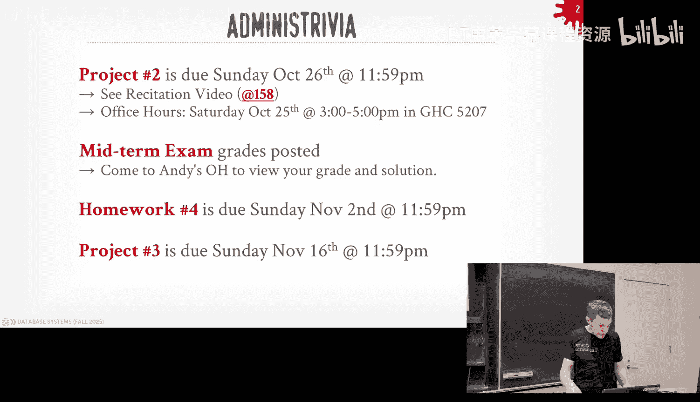
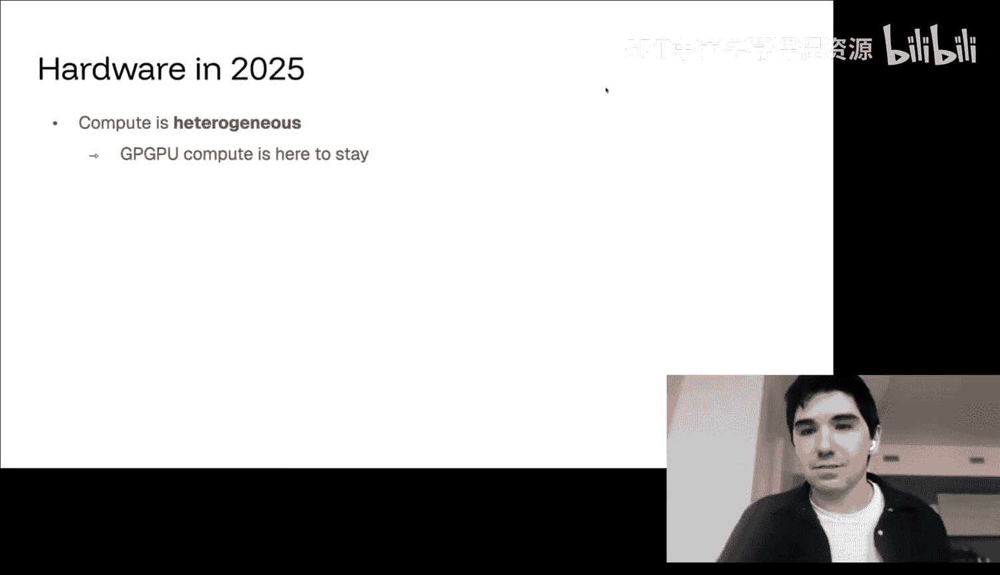
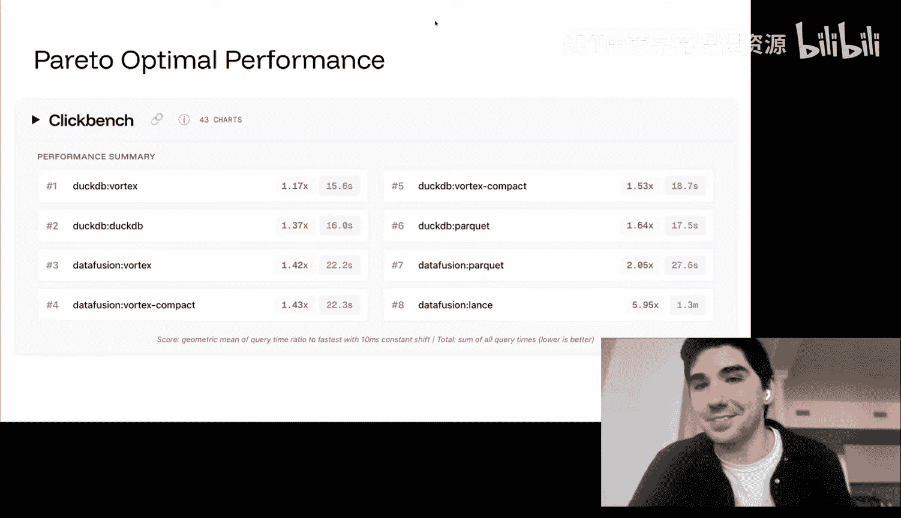

# CMU《数据库导论｜15-445 645 Intro to Database Systems (Fall 2025)》中英字幕 p14 -14-#14 - Query Execution Part 2 ✸ SpiralDB Database Talk (CMU Intro to Database -BV1bmHGzsETM_p14-

🎼我。🎼The we。🎼我是我。Thinks。🎼我。It was a good way to start to class right just kind of like the music died out。

 right but it round applause for DJ Cash， thank you so much。

A lot to cover plus we have a speaker today so let's just jump right into this right so today we're gonna to talk about the second half of material on queryry execution so well pick up wherever you left off last's class but for you guys in the class again things to cover Project two do this Sunday coming up the recitation link is available there and then the special office hours will be this Saturday at three o'clock in Gs building the midterm you can come after class at four o'clock and come my office hours and check out your grade and look at a solution homework4 will be released today and that'll be due on Sunday November 2。

And then project 3 will also be released today， and that'll be due on November 16。

 and then we'll announce the recitation for that project。 That'll be sometime next week， okay。

I had a。Animation， I blew it up。 Let me fix it for you over quickly。And。

So there was a major outage in the internet。On Monday and class。

And we hear what caused it。D way to be exactly right。

 The database went down and that broke a bunch of stuff。 right， Now。

 the database itself didn't go down。 Does DNS getting to it went down。 But again。

 just I want to emphasize how important databases are and why this class is important because you know。

 it' it's the backbone for pretty much everything。 any any modern application， any modern system。

 And end of the day， there's gonna be a database。 And if that goes down。 then you're screwed。

 So one database goes down and that takes down basically half the Internet。 So that's pretty wild。

And so we'll cover DynoODB and dynamic that distributed key value store。

 distributed document store that uses consistent hashing， we'll cover that later in the semester。

 it's a very influential system。😡，All right， so last class we were talking about query execution and we were talking about that there's these operators in our query plan that that all all implement the same API。

 whether it's like get next or the way they're gonna to be passing twos between each other that allows us to compose query plans and any possible query plan could have because we can change the order of any of these operators and the data will still flow through them correctly。

 Now if we change the order of operators that may produce incorrect query。

 the results might be wrong， but that that's a separate issue we'll cover next class。

 but it's really like I have these implementation operators。

Implication for these different operators and I can move them around。

 and I end up with a query plan that produces a final result at the top that we send back to the application。

So there was a brief question last class about what if I had multiple threads or workers processing the query at the same time。

 And and I sort of puntted on that and say that's not what we want to talk about just yeah because you basically to understand how we execute queries at a high level。

 So that's what today's class about today's class and say。

 how do I take one of these query plans and now break it up across multiple workers so that I can run things in parallel。

 And this all also then segue segue for us into at the end of the semester。

 when we talk about distributed queries。 right running across multiple machines。

 today we're talk about running on a single machine But the same techniques and same concepts。

 same ideas that we're gonna to do today for doing parallel execution on a single box we'll still apply when we go when we start scaling out across multiple machines。

So the basic idea of parallel query execution is that we have our database will be the physical database itself be split across multiple resources and not really defining what resources is yet could be physical machines could be different disks could be different regions of memory running on a single box but it doesn't matter just yeah And so the idea is that we want to be able to handle databases that are too big for a single CPU core or a single disk or a single region of memory or a single machine and we want to be able to scale things out and scale things up so that we can get better performance and in some cases we'll get better fault tolerance and redundancy because now the database be replicated across multiple machines or multiple disks And so if one of those machines goes down then we have a backup Of course if you're。

😡，If you treat like， you know， the critical infrastructure is running off dynnamo D and Dynnamo D goes down。

 then you know， you could have redundant systems outside of AWS to avoid that problem。

 but most of people don't do that because it's expensive and it's hard， right。

But the key thing to understand， and this is to go back to what we talked about at the beginning of the semester when we talked about SQL being this declarative language where I'm not defining exactly how I want to physically execute my query。

 the great thing about having a decative SQL is that the same query that I would write running for a database running on a single machine or a single disk or a single CPU or whatever。

😡，That same query in theory should work if I then scale it up across multiple cores。

 multiple CPUps or across multiple disks or multiple machines。

 right we don't have to define like send data here， sendend data there。

 in our our in in our query plan or sorry in our query。

 the query plan that we generate it from our SQL query will define those steps for us。

 So it abstracts it all the away and we still get the benefit of improving the system。

 So a very common setup is gonna be like you as a developer， when youre building your application。

 you'll have a your little test database， maybe running SQL light or Postgres locally on your laptop。

 But then when you want to run on and you would write SQL queries against that。 And ideally。

 which you want to have is when you then push your code into production。

 now the database may be this behemoth distributed system。😡。

Or running a much larger machine than your laptop。 And my saying SQL query will still work in that in the production environment。

 right， because again， from our perspective， when we're writing SQL queries and the applications writing SQ queries。

 it sees a single logical database。 It doesn't know that it may be physically broken up into。

 into different pieces。So the thing we want to talk about today。

 today's class we really focus on what to call a parallel database where this is where these resources that we have。

 again， where there's computational resources， memory or storage that they're gonna be physically close to each other and for today's class just assume it's running on the same machine。

 the same box， the same unit in a rack And so that means that the communication between or different resources is going to be really really fast like reading things from memory or reading things from different disks that are on the same PCI Express box or whatever and that this communications be fast and it's gonna be reliable and cheap for us to do。

ItSo reliable means like， if I go try to read something from disk unless， you。

 the disk is burning down and there's know， it's on fire and I can't do anything。 I。

 when I send a message or try to get some data， I expect to get that data back。Right。

 in a distributed system， this will again， we'll cover at the end of the semester。

 this will be when the resources in in in our database system are not assumed be physically close to each other。

 like different racks in the same data center or different availability zones or regions or different data centers in different parts of the country or different parts of the world。

 worst case scenario， data centers running in space that was Niddia's announcement yesterday or today。

 Star cloudud， they want to put GPUus up in space now So now the latency between sending sending between different machines。

 ones in space and ones on back here on earth that's gonna be super high。

 and it's not guaranteed to be reliable And so in our database system。

 we're gonna have to account for the fact that any message we send or data we try to retrieve may not actually arrive or show up and therefore our system has to account for that。

 And today's class we're not gonna worry about we're gonna to assume that we can rewrite to different workers and they're guaranteed to get that message。

it makes our lives a lot easier。All right， so beginning。

 we're gonna to talk about different process models these are will be the way you would sort of architect the system itself to have different workers and run in parallel and then we'll talk about the different types of parallelism you could have within a query plan or cross query plans and then we'll finish up talking about how to get parallelism with IO we saw a little bit of this in project1 when you built sort asynchronous buffer pool or the disk manager but we can see how now we can parallelze this even further and then we'll finish up with a flash talk from the spyODb guy who's going to talk about the vortex file format。

 the same speaker that gave a seminar talk with us last semester。

 but if you didn't sorry last week if you missed that this will be a condenense version of that。Okay。

All right， so as I said， the process model is going to be the。

 essentially the definition of the way in which we've built our database system。

To allow for concurrent requests or current operations or concurrent queries across multiple workers。

 And the worker is going to be this computational unit of our database system that is。

 is going to be able to execute task on behalf of sort of the higher level manager of the system。

And they know how to do whatever it is that the request is being asked for and then return results whoever asked for it。

So you can just think of this like it's a bunch of workers that could execute queries for you。

 But the workers also could be doing internal maintenance tasks that are sort of run of the background to maintain whatever it is you need in the system。

 we saw this before we talked about the log structure log structure storage We said there was this compaction thread or compaction thing then runs in the background and starts coalescing up the S tables and combining them to new ones that would be a background worker。

 but it's still still the worker still。You， it is still a computational unit that the data has to reason about and understand when it wants to start scheduling tasks。

😡，But for this class， we're just assume that we're going to be executing queries with workers。

And the reason why I'm saying workers and not saying threads。

 although sometimes I'll slip up and say threads is because there's different implementations of these process models that can have different computational units for workers。

The two most common ones is have one worker per process。

 like an OS process and one worker per thread。Most systems are the most modern systems are going to implement the second one。

 not the first one， but we'll see why people did the first one， Postgres does the first one。😡。

And then it's not exactly a pestless model， but it's sort of a。

It is a design decision or design approach for building a data system is do what's called an embedded system。

Where now the data system is not responsible for。Getting workers from like the O or whatever。

 The application that's gonna to be invoking the data system hands off the workers to to the system to run right So this middle one here is most common。

 The second sorry the third one。 it will be for we'll say like a SQL light or embedded data systems we'll talk about。

 And this top one is， is mostly for like the older systems。

 the enterprise systems for historical reasons to do this。 again we'll go each of these one by one。

So the first process model approach is called process per worker。

And the basic is that for every single worker that I have in my system。

 it's going to be its own standalone OS process。 like I got to call fork in the OS or on Z。

 whatever it is to start a new process。 And that's going to have its own address base for its its code。

 own address base for memory。😡，And it's going to rely on an operating system constructs like like Fork to then dispatch these different workers and then can some cases also be responsible for scheduling them because I don't have sort of fine grain control what my workers or when my workers are going to exitude or not。

 the OS is going to handle that because it just sees a bunch of processes and runs it for you。

You can play games about like going to sleep and things like that。 But it's that's a bit more work。

So the basic idea is that the application doesn't know that there's a bunch of workers a bunch of processes。

 it just communicates with whatever this frontend dispatcher is in Postgres。

 this is called the Postmaster if you're running Postgres on your laptop。

 you'll see a bunch of processes， one to be called the Postmaster。

 that's the front end thing that everyone connects to when you want to connect to the database system。

😡，Right and then the dispatcher says， okay， well， I have a new connection coming in。

 they want to execute some queries。 let me pick one of my workers in my process pool that I know about。

 I hand back that information to the application to say here know here's an IP address or a port number for some worker you can go talk to and then now the application reconnects to the worker and it can send SQL commands and have that worker execute things for you。

😡，And the workers can still communicate with each other when we talk about different types of parallels and in a second。

 but they have to do this through the either shared memory or worst caseing。

 IPC interprocesed communication things like pipes and signals to send data between or communicate between them in the case of Postgres。

 they use shared memory， different systems do different things right。

So this is how people built parallel database systems in the old days， like。

 like the 80s and the 90s。And we're going take guess why they did this instead of threats。

And Linux now， when you， when you create a thread， you spawn a thread， what are you actually calling。

What do you get， like P thread create， right， right， What is， what does the P in P P thread mean。

Psits， right， so the Posits API for Unix and Linux， that's been standardized for threads。

 probably late 90s。Right mid-90s right before some of you guys weret even born prior to that。

 all the different versions of Uniix that were out there， like before Linux was was the dominant one。

 but there was you know was BSD there was Hpos， there was AIX， there were cilaris。

 all these different uns had their own threading packages And so it had slightly different APIpis or different semantics of what it means to have a thread。

 So and if you wanted to support multithreading on different unixes。

 you had to basically rewrite your thread scheduler and thread im across all the different libraries and they made the code less's port。

 whereas Posit had basically foreclos weight join had basic commands to four processes So therefore all the data systems in from the 70s。

Most of the 80s and early 90， they're all going to be doing this approach because at least that was standardized across different systems。

If you ever looked at the Postgres code， the Postgres code has much of pound defines or if deaths。😡。

Based on what version of of Unix you're running on， and they make different calls for， you know。

 different OS commands。 But the end of the day， an O process on Linux is basically performing the same way it does on AI X。

So you have basically the same dimensions across all these things。

So any system that's a forkA Postgres， which I'm trying to think if there's anybody who has done this。

 pretty much anybody that is a system today that's a forA Postgres is going to be using this because Postgress uses this and it'll be a major rewrite to strip out the threading stuff and replace it sorry。

 strip out the processel stuff and replace it with threading。😡，Right， the modern approach is to do。

 as one to expect today， using using a single process with multiple threads， right。

 So it just calling spawning P thread or whatever the Windows 32 create thread is right。

 And now all your， all your。😊，Your worker threads are running in the same address space。

 it's easy for them to communicate with each other because all just they're in know they can re write memory to each other。

 You still have to use latching， all the stuff we talked about before because there's shared data structures and you know what the different threads breaking。

 know causing problems with each other。😡，But the basic setup is still the same right the application sends something to a dispatcher and either the dispatcher can just forward the request directly to these money worker threads or in some cases to remove the bottomneck of having go through a centralized dispatcher。

 you can still do the same thing we did before where having the dispatcher sends back to the application。

 Hey， here's a port number where you can communicate to a worker that's dedicated to you to run  queries for you and then the application just reconnects and does that。

😡，But the key thing is like all the dispatcher， the worker threads， all this is running in the same。

 same process。我提交那个个有那个逮过来嘛。你。So your question is when I say that it's using own scheduling that you could be using a thread pool and not calling P thread to grate。

Yeah， I statement is when I recalling P command every time a new command comes in， no。

 you would have a thread pool。 But then you can still now。mean you still can do in a process level。

 but it's it's a little bit more difficult。 But like and most the process。

 the process model systems don't do their own scheduling。 Now， what I have my own threads。

 I could do like my own non preemptive threading and have have them yield and go back to a thread schedule to decide what to run next basically using co routines。

 you could have， you， it's easier to the pause a thread。

 And then first like pause in a process It's more heavyweight， Its just's a more lightweight。

 It's more lightweight and easier to。Have complete complete control of what the threads are doing than you。

 you would in the process model。 Now， you can do it on the processes sure， But it's just。

 it's more machinery because you're kind of fighting Go S。Yes。As this question is。

 and these examples， am I assuming that Davis is one node。

 This lecture today we're assuming Davis is the Davis system is on one node。Right。

 so again we're jumping ahead。 But and it distributed system。You could still have， you know。

 either process per worker or thread per worker。 but now every node is running their own set of threads set of workers right for purpose is here。

 you know， this is just some some disk file whatever。😡，It's all the same。そうですは。It's not pretty milk。

Oh。We'll get there，'s basically saying I saying this is the parallel Davis because I have a bunch of worker threads。

Yes， but we don't having to find what the worker threads are doing per query。

 I'm just showing lines coming in like are they all executing the same query or is it one query per thread right like well fewer slide we'll get there。

😡，So Oracle starts off doing the process model， process model。

 process per worker back in the 80s or 70s where they started。

 and then in 2014 they switched over to now by default。

 they'll run with multithreading and again every newer system today would use this approach is because the threading libraries are so standardized and everyone is running Linux anyway so everything works。

😡，Alright， so this is not exactly a process model where you have or at least thinking about in terms of like。

Fris versus processes， this is sort of a different approach。

 but it's very common where the database system is not responsible for calling P thread to create or forking a process。

😡，Any computational unit and computational worker has to be given to it from an application that's going to embed the database system。

😡，Right， so I know like if you're a play with like Sel light，duct D B， like when you。

When you like open up a and you call the DB from the command line and opens up aductDB database。

 like the DDB command line， that is the application。Right。

And then it's making calls to the library to do things in the data system。

 But like in the case of something like SQL light， I would embed the SQL library in in my application。

 And now the application is gonna have its own threads to do whatever it wants to do。

RightThink of like a web server where request are coming in。

 but the database server is not on a separate machine。

 It's just running as a Selitete program in the same address space as the as the application。

 So when requests come along， the application has， one its own thread or worker saying。

 I want to read this data from the database。And then it makes a request to the database。😡。

Then that's a library call where now that thread is going into the SQL light library or whatever the better data system you're using library。

 and then that is the worker that's going to then read write data from the data itself and then reduce when it gets a result and then gets back know the thread goes back up the stack。

😡，To the to the application calling it。 and now the data doesn't have a notion of a worker doesn't a bunch of pool of workers that they can call upon right it only is given to workers when the application goes inside of it。

Right Berkeley D B was one of the first systems to do this that obviously came out of UC Berkeley and Oracle bought that in the 20002006。

 But like Ro D B， level D B， all these other systems on the side here。

 they essentially work the same way where they don't have their own notion of， of threads or workers。

 they can only be given workers when， when the application calls inside of it。 In case induct D B。

 you can tell spawn its own threads as well。 But like that's， that's。

You know so it's not exactly this is like in the way I'm describing here。

 but this is what basically see how SQL works like SQL Light doesn't have background workers。

 The only workers it has is the ones that the application uses when it invoke SQL light libraries。

Alright， so then one of the things we're gonna be sort of briefly talk about too is how do we are gonna schedule these things。

 Again， we haven't quite got into what the， the parallelism looks like， but。Basically。

 if I have a bunch of workers， the data has to decide where where should they any request worker some task to run。

 when should they run it and how they're going to execute it So things like if a query shows up。

 and I could run， use multiple workers to execute that query。

 it has to decide what is that degree of parallelism， how many workers don't want to use for that。

 and these decisions it'll make based on how many queries are running the same time。

 Where's the data， how slow is the disk go get that data And so there's a bunch of these things the data systems can figure out。

 And this is why you don't want the OS to try to schedule anything for you because since the data system knows what the query is or the task are that it has to execute It knows what resources are available to it。

 it's always again in a better decision to decide what should actually do to schedule these things。

And we should never lie in the us to do any of this。The high end expensive enterprise systems。

 So the oracles， the SQL servers， the DB2s， they will do all this stuff above and be very sophisticated scheduling things like pros。

 just， you know， just let's the O S take the wheel and let lets the O S schedule everything for you。

 My SQL doesn't do parallel in the way that we'll talk about in a second， like。

They pretty much again， let the US do do， do everything。Alright。

 so the advantage of using the multifi architecture that sort of second approach should be pretty obvious。

 right， That's the modern way to build build concurrent or parallel applications。 right。

 there's less overhead of having multiple threads versus multiple processes you know。

 you don't have to manage this shared memory like which is can relying on OS primitive to communicate or shared data across the different the different workers。

 Now the。Of course， the downside is if one of those workers has a Seg fault or does something that it shouldn't be doing and it crashes and a multithread application that takes down all the threads takes down the entire process。

 So that in theory， could make your data system more brittle or more susceptible to failure because if one thread goes down that takes everyone down whereas I can Postgres。

 if one process goes down， who cares the Postmaster just forks another one and picks up where left off So you obviously like don't write bugs in your data system so you don't crash。

 but like that's easier said than done there's pros and cons in this。

 but most systems are going to choose the multith architecture because the engineering overhead。

 the burden is much less and the performance is is a lot more And unless you're a forca Postgres or forca Redis which they're using a single or the process model most systems in the last 25 years will be using using threads。

This invisable to use。Sa again。 His question is， is it inadvisable to use both。

 I think there's talking Postgres We can now have threads per process。

 I don't know what they're using it for。In for， for， yeah。I would say， I would say yes it。

 it's advisable to do both， right？ I mean， you could have like the。

 you could do some decoupling where you would have like the。

The the dispatcher could be a separate process。 and then then there's another process that has all the workers inside the same thing。

 And there there's some systems kind of could do that。

 But like what that gives you the ability to now move where the frontend dispatcher runs。

 You could actually put that on another machine now and have a separate the workers altogether in another machine。

Different systems do different things in general for single no systems， no one's going to mix it。

 They're always going to do the threat per worker。2。

So now let's get into what he was alluding about like， okay。

 what does this mean to actually execute them in queries。

 And so there's be different types of parallelism we have to。

 we're gonna we're going to talk about that gonna have different tradeoffs in different performance characteristics。

And most of the systems that when you think about。Most of them will do always do this first approach。

 The second one is be harder because be different levels of intro query parallelism。

 But when people say I have a parallel database， they usually think of of this of the second one。

 But the first one still is， is a valid category for query parallelism。 or sorry yeah。

 for query parallelism， right。So the idea is that the data is going to execute these multiple workers。

 So at the same time， we're going execute multiple tasks at the same time because we want to be able to improve the performance of the system or improve its utilization of the hardware that's available to us most modern CPUs pretty all modern CPUs at the server level or even your laptops we're going to have multiple cores like every laptop basically has8 cores per CPU on the higher end AMD boxes。

 you now have hundreds of cores。So we want to be able to take advantage of all that right and all the approaches that we'll talk about today are still like from this point forward it doesn't actually matter whether we're doing process per worker or thread per worker。

 again the high low concepts are still the same the way we're going to parallellyze things and coal less results at the right point in the query plan。

 all these still work no matter what process model you're using or even even if you're running on multiple machines。

 right。All right， so we're going talk about Inquery parallelism。

 and then we'll talk about more detailed inquery parallelism。

Inter query parallelism is pretty obvious， it basically says， if I have multiple workers。

 I could take multiple requests for queries and I can execute those queries in parallel。😡，Right。

 meaning like one worker could execute query 1， another worker could execute query 2。Right， and they。

 they don't need to communicate。 They don't interfere favor with each other， right。

For sched wise to do this， again most system can use a really simple scheduler policy。

 first come first serve like whenever query ships up first， I'll start running that right away。

 things get a little more complicated when you start doing transactions like cur which we'll cover in a few weeks。

 but you can start scheduling things based on if you're in a transaction how many queries have they execute before you before this new query and maybe that gets a higher priority or a low priority based on whatever policy you're using。

So if every query you're executing a single sorry is。Is read only。

 then this is really easy to do because you don't have to worry about。You know。

 coordating between the different queries， you still want to maybe do latching on your internal data structures because you don't want queries to break things or interfere with each other。

 but in general， read all databases or these is way easiest thing to implement because the coordination level is matterordination you have to do is pretty minimal like once thequeries start running。

 you don't have to worry about them sending data back and forth between each other or understanding what one query is doing versus another  queryries doing。

😡，And then if you now want to make sure that like。I can get parallelism by like or reduce the amount of wasted IO。

The bufferable manager can do all the scan sharing or all the， the。

 all the other the cursor sharing techniques we talked about before。

 because that's the essential point that I was communicating with。But again， that's， that's。

We already covered how to do that。If queries have updated at the same time。

 now you got to worry about like， who writes what and when。

 who can read whatevers been written that will cover in， in two weeks。

 We'll pick that up on on lecture 17。 We'll spend。Two weeks discussing how to handle this。

 starting them。I would say also too that just because a database system can execute multiple queries in parallel at the same time。

 it doesn't mean necessarily that each query itself will also run in parallel within itself。😡。

LikeSo MySQL will be an interquery parallelism system。

 like it can take multiple query requests and run each of those at the same time。

 but for each individual query request， that's always going to only going to run on one worker。

So if I run one query in my SQL and I have  a00 cores， at the end of day。

 it's still going to run on one core。😡，So that type of parallelism is called intraqua parallelism。

And these aren't mutually exclusive， I can have my data to support interque parallelism。

 that also supports intra query parallelism， so Posts can do this Post can run multiple queries at the same time。

 and each of those queries can run on multiple workers at the same time。😡。

RightSo if you're familiar like the producer consumer model you have basically in our query plan。

 you have different workers in different parts of the query plan。

 producing results that it's pushing up or moving up to the query plan and then depending on how I break things up in my pipelines。

 I could have different workers consuming those results and maybe running those in parallel or waiting for all the results be finished before I can go off and execute the next pipeline but the high low idea is going be still the same it's still going to be this producer consumer approach。

😡，So the first of app parallelism we'll talk about is intra operator parallelism。

 So this will be horizontal parallelism。 So， so allowing different workers to execute the same pipeline or different portions of the pipeline at the same time。

 or sorry， same pipeline， but different segments of the data or different inputs at the same time。

And that's super common， the other type of parallel called interop parallelism。

 where I could have different workers execute different portions of the query plan simultaneously at the same time。

😡，And that's less common because obviously if you have pipelines。

 I can't maybe execute something at the top before something at the bottom finishes。

 so it doesn't make sense to have something up above spinning and waiting for results that are never going to arrive yet。

So they're gonna to be parallel versions of pretty much every operator that are out that's out there and basically all of the algorithms that we've talked about so far in the semester。

 you can easily or not easily you can parallellyze them in some ways by using that divide and conquer approach that we talked about before that allow you to split the input up for your algorithm into different segments or different buckets or whatever how we define it before。

 and now instead of having one worker go through each bucket or each partition one at a time。

 you have multiple workers each a different partition at the same time。😡。

So if we go to back to that parallel hash join， the gray hash join we talked about before the partition has joined where we would do sort of one pass through the data and build hash the data and build up these sort of levels in our hash tables or different segments。

But instead of having again， one worker handle each of these levels， once I sort of do my first pass。

 which I can do also do in parallel level see that in the second， but now when I want to do my join。

 I have one worker be responsible for level1，er sorry level 0。

 one worker responsible for level1 and so forth。 and because I know I've partition my data by doing the hashing step first。

 I don't have to communicate between different workers to do this。😡，Right。Now。

 you could do this either by having one giant hash table or you could partition individual hash tables。

 It doesn't matter but the high level concept is still the same。Right。

 so go through what interoper parallels is is' the horizontal one and then the interopererate parallelism that have different portions running at the same time that's vertical and then the textbook talks about this thing called bushy parallelism。

 they make it sound like its own separate thing， but it's just the combination of the two of them the same time right？

😡，So the first one is the most common one。 Any Anytime someone says they have a parallel data system。

 they， they're 9 times out of 10 or 99 times out of 100。 They're doing the first one。

 the horizontal parallelism。 And then the second one is less common。 We'll look at it briefly。

 And then the bushy parallelism， that's in again， the enterprise high end systems that cost millions of dollars like Se server。

 like D2 and like Oracle。Well the top one， the horizontal one is the most common one。And again。

 because secret was declarative。I don't have to specify in my query which one of these I want。😡。

The datason just figures it out based on the hardware that has available to what your query actually wants to do。

 it can decide which of these approaches it wants to use。😡，All right。

 so the most common one is horizontal parallelism or intra operator parallelism。😡。

And the idea is that I'm going to take my my data that I'm processing。

 and I'm going to break it up into disjoint subsets。Eith by just saying， you read these pages。

 I'll read these pages or doing something more explicit。

 like dividing it based on values and columns， it doesn't matter。

And then now the operators are going to be have different independent。

instantiations of them that can each run on a different worker that are going to be processing the data that they're assigned to for the inputs and a disjoint subset of the datum。

 and then they're going to be crunching on that， producing results that I then move up into the query plan。

😡，But then at some point， I need to make sure that I process all the data from these different pipelines or instantiations of the pipelines of the different workers。

😡，And so now I want to introduce a barrier operator that says。

 don't proceed in my query plan until I get all the results from everybody below me that I'm expecting to produce results from me。

😡，So this is we called and database is called the Exchange operator。

 and it's basically know there's no notion of this so there's no mapping of this to the relational model relational algebra。

 this is something we're going introduce in our implementation。😡。

To allow us to do achieve this parallelism。Again， this thing like a barrier where it blocks the output or sending a signal to web above you can start processing the data I've finished。

😡，Until it gets all the results expects to get from its children operators。

So if you're familiar like in programming languages。

 I think they call this like a merge operator or gather or scatter gather。

 this is basically the same idea。Pocode calls these gather， gather， merge。

 and you're just combining the different results from the child operators and producing them as a final result that goes up above。

Yes， I'm just curious， why does it need to be a barrier because I would think in some cases like。

And gather a partial results and just send them up like what you。

This question is why does that have to be a barrier where I block things。

 isn't it in some cases where I could send partial results up？😡，Yeah， but again。

 to think of the pipeline breaker， there's some places where I can't proceed until I get all the results。

😡，In that case， you wouldn't use the exchange operator。Just keep going Sometimes you can。

 sometimes you can't。U。Yeah， so it same。😊，Yeah， he's correct。

 that there are some cases where I don't have to block until I get all the results。

 You can send some results up for simplicity， assuming that we're blocking here。

For who is a pipeline breaker， then I'll show different versions of exchange operators that don't have to do do what you're saying。

 starting the basic one。 It blockss。But then will' relax that。All right。

 so here's our query were going to do， we're want to join and B。Right。

And we have a filter on some value for each of these tables。 I do a join。

 And and then I have projection at the top。 right So say I want to do the processing of this on the table A first。

 So I've partitioned table A into three disjoint subsets。 Now。

 could again be page based or range base be based on the value because I've hashed whatever my joint key is。

 It doesn't matter。 I'm going assign those three subsets of a to my my three workers。😊。

RightAnd each of them are going to run basically up the pipeline that I have and run in parallel because they're processing different portions of the table and they don't need to communicate with each other so they can run independently of the others so they're all going to do the filter and then now they're all going do sort of this side of the hash join to build the hash table right。

😡，And so now I have an exchange operator。We're up above that says this pipeline or this portion of the query plan is not finished until all three of my workers down below me come up and tell me that they're done。

😡，So maybe it should be a black line for control and some data。

 but so I'm not really moving data for this case here into my exchange operator because this build hash table thing is kind of。

 assume there's some hash table that it's a global hash table but they're all updating。

 but my exchange operator needs to know that they're all done processing their portion of table A before I can proceed with the next the next part of the query plan so they're all generating data for this hash table here。

And then now once I know this is done， I can then schedule three other workers or three of the same workers just now running different portions of the query plan。

 now they're processing table B， which I've broken up into three subsets as well and do the same thing。

 they're going to do a filter in parallel， and then now they're going to do the probe and the hash table in parallel。

Agains it's a single hash table they're all reading into and looking for results。

 and then if any table matches， they then do the projection。

 but then above that I have another exchange operator that says I can't produce the final result for this query until I know that my three workers down below me running these portions of the pipeline that they've all finished processing the data that they have。

😡，So going back to his point here， these exchange operators are blocking because I can't。

 I don't want to start doing the the probe and the hash table here on on the the probe side for table B until I know that all three workers that were were building hash table have completed because I don't want to get a false negative。

 I don't want to。😡，Probe into the hash table looking for a match。

 but the worker that is responsible for putting my match into the hash table hasn't completed yet。😡。

So in this case here， again， the exchange operator is blocking is a barrier。

 it doesn't necessarily have to do that。RightAnd then the the。

 I'm not showing here but there's some metadata in my query plan that keeps track of these pipelines and keeps track of these dependencies and would know。

 I want to schedule the workers that process table A segments first before I jump to anything on tableable B。

So this is， again， this is the most basic symbol the most most common and most basic type of。

 of exchange operator。 Al right， It's doing a gather。

Whenm combining results to multiple workers and producing it as a single output stream。 and again。

 depending on whether or not I。I'm allowed to process the data at the same time or not。

 whether it's a blocking exchange or it's just producing a single change。

 again depends on what the operator is actually doing below me。

 and the data system would know how to do that。😡，Another type of exchange operator to do what called distribute for this here。

 I'm using the SQL server's terminology for this different data system might call it different things。

 but the high level ideas are still the same。With a distributed exchange operator that I'm taking a single input stream from some operator down below me。

 which again， I don't care what it is below me， which is I know that I'm getting tus up from below Im passing them up。

 And then now I'm going to redistribute or reppartition that data across different operators that I can run in parallel at the same time。

 different workers。😡，And the last one is kind reppartition。

 and that's just a combination of the top one and the middle one where I could take multiple input streams from different operators down below me。

 and then I'm going to produce multiple output streams。

 but it doesn't need to be a one to one correspondence between the number streams coming in and the number streams coming out。

 but I may decide that I have a lot I want to use a lot of parallel because I have a lot of data down below me but then up above I maybe want to only run on two workers so I'll coalesce the three streams into two output streams and only have two workers run them in parallel。

Because the coordination cost or sending data between different nodes is not for free。

 and so it's a tradeoff between how much parallels I have versus how much communication cost I'm willing to pay to send data around。

So some data systems like Google's BigQuery or Dremmel， it's the same system。

 they'll always do this for every single pipeline or every single stage of query execution。

And this allows them to get to， to basically on the fly decide。

 Do I want to scale up or scale down the number of nodes I I'm going to use to to process my query。

 Again， that's distributed data。 we'll cover that later。

But you can do the same thing on a single noteote thing saying I want to run this portion of my query plan with 10 workers。

 but then I since I'm doing a bunch of filters and whittling down the how much data I have at this exchange operator here。

 I only want to have two Apple streams because I only't want two workers to process the remaining results。

This is Claire。And again， to his point， does it need to be a barrier or not。

 it depends on what the operator is doing up above and below。

 like depending on whether you need to see all the results or you can start seeing the results as they arrive。

😡，If you can start processing results as they arrive。

 this allows you to do what's called interop parallelism with vertical parallelism。

 where I'm gonna have different operations in my query plan actually execute at the same time。

That will allow you to basically most again pipeline data between them without having the materialized results or stage them。

😡，For transfer from one upper to the next。And you typically see this in what we'll call streaming system。

 streaming database systems where it isn't like I have a table that's a fixed size and I run my query and I produce whatever the result is at that moment that I run the query and a streaming system。

 it's like a continuous updates， you can just insert stream of new data coming in and I want to run this query forever continuously。

😡，And it can then produce results， know on a schedule， like every five seconds， produce a new result。

 whatever it's seen before， or if there's some trigger mechanism， say。

 if I see data that if we see a stock price that goes about 100， then output a result。

 like there's a bunch of mechanisms you can do。Producers all it's been thinking like。

There's this data always coming in。 and I want to be able to run these things in parallel because。I。

I don't have to wait for maybe all the data to show up because it'll go to infinity'll the new data doesn't come in forever。

😡，Right so let's look at sort of contrived example here。

 I'll say now I'm doing the same join I have before。

 but now I have this UDF or function I'm calling on the data。

 I think of like hashing a hash of a hash real expensive operation that I'm doing for my data。

 And so if what I want to be able to do is not wait for all the results of this join to finish before I start calling that UDF because that's gonna be expensive。

 And I want to put that on a separate worker to have that run a parallel So I'll have one worker responsible for doing the join and then it's going sort of admit tuups out as it finds matches and then that's just going to pass it up to now my second worker that's going to just continually read this input stream incoming and then compute whatever that UDf for the function call is and produce output that way。

 So now I could have this thread is sort of ripped through to the join and then immediately hand off the result to some other thread that's going to rip through and compute whatever the hashing function that I want to compute。

And then of course now it some point， if it completes the incoming。

 it's process all the tus that it's seen so far， but the bottom guy is still running。

 it just blocks and weights for the second guy the bottom guy to notify them that there's no result for you。

😡，Is the pipeline， yes。Well， like， in theory， you know， you could have like the。

I'm just trying to say that， the， the function call， the projection could be inside this thing here。

 but I want to be able to separate them。But again， it doesn't come for free。

 I got to communicate and send data up。 right， I gotta copy data。 So it's。

 it's more expensive to do than just。Fsing everything all together inside the for loop。

 But I can I can by breaking it up， I allow， I allow it to get suffocate parallel in that way。Okay。

 so last one is bushy parallelism， and as I said， this is just a combination of and interop parallelism where you have different workers going to be running different portions of the data at the same time and different workers can be running different segments of the query plant at the same time。

😡，So this is a contrived example， like I'm doing a Cartesian product or cross join between four tables。

 AB，C and D。😡，But I could have the bottom part here doing a join。

 and that can just run in separate workers。 and that just getting crunching through and competing results。

 And then as they get output， I could have another set of workers doing the building the hash tables and then doing the joins。

 and all these can run in parallel to produce my final result。Again。

 so I'm getting the going back here。 This is the this bottom portion here is the intra operator parallelism。

 So within within my query plan， I'm having different portions operate on the same thing。

 And each of these ones， I could I could fork out multiple times。

 And then within the same query plan， I can that's also scale up the that are my workers that are running the same time for different parts of the query plan。

 So that's the vertical parallelism。😊，Something exact。

One question about or would it be like the C will worship from PCD and then it will do。

The question is， is this， sorry， this is doing， you know， this is doing Cartesian products。 So like。

 take joint of A B。And it's going to produce all combinations of A and B。

 and it's take all combinations of C and D， and now you produce all combinations all together。

This girl。Is this not in my sweet email is this exactly what？The question is like。

 is this an optimized？How patients say。iss this an optimal query plan？It dependss on the data。

RightIt may be better to join A B， followed followed by joining C， and then followed by joining D。

 this is called a bushy join。We'll see this next class。 Like in some cases。

 it made actually some system， sometimes this is better。

Most systems will actually not give you a query plan that looks like this。

 they'll give you like left deep join， so I'll join AB， take the output of that join C， then join D。

 because the computational complexity of searching for this plan is super high so people don't do it。

😡，Let' see the the camera wants。Once to look at him， not me and see how that works。Okay， right。

Other questionsです。All right， so。We know how to use multiple works now execute queries in parallel。

 right， and this is great。 If we have a lot of CPU resources and we're CPU bound。😊。

But oftentimes we're not going to be CP bounded。 what's going be the slowest thing？

Disk now in the modern era disk have gotten really， really fast in the last five years。

 So many times CPU is going to be the bottleneck for us。

 but depending on where our data is actually being stored。 if it's on S3， like some remote storage。

 that's always going way slower than anything we can do on the CPU side， right so。

Just because we have multiple workers， we may still not get the parallelism and then performance what we want。

 because at the end of the day， we're reading writing pages from diskk and that's going to be super slow。

So this is where IO parallelism comes in， and the idea is that we want to split our database or databases plural across multiple storage devices so that we can sort of get the benefit of improved bandwidth to disk because we're reading from multiple devices。

 right？😡，So there bunch of ways we can do this， we can have multiple disks per database。

 so it looks like a single logical database， but it's spread across multiple physical disks。

We can do one database per disk， one table per disk。

 or we can take a single table and split across multiple disks。Right right。

The high end systems will let you have complete control or all of these different factors。

Like an oral where you can specify exactly the location of data of tables。

 you can specify where you want the right ahead log is， which we haven't covered it yet。

 But that's basically think of the log recovery log。

 I can put that on one one disk and put the Davis itself。

 the actual tables themselves on another disk。 And so I get the parallels them that way。

 Pre guys control this a little bit what they call it table spaces。

But oftentimes I' say the lower instance of systems like MySQL， for example。

 they don't have a notion of physical locations of the data。

 but you can basically do the same thing at the administrative level by using like S links and things like that to put files in different devices。

 but the data itself is not aware of the locations the characteristics of the disk that it's reading from or writing from disease single dislocation。

It sees a single logical file system。So the。You obviously we want to do this。

 But now there's a bunch of tradeoffs we have to consider when we will start start splitting our database and putting on different files in different locations on disk。

 and it's very similar that tradeoffs will see in a distributed system of where we start putting the data across multiple nodes because sometimes we'll make things go faster but we'll have less guarantees about the durability and safety of our data or we can have great durability and safety of our data。

 But now things are gonna to go a lot slower because' now going to make sure everybody is synchronized and up to date。

So say really triple example， I have six pages， and this is what we just sort of see at the sort of logical level。

 I have six pages。 I don't really know where they're being stored。

 but I know I can address each of them。😡，And so now I'va has put this across the say three disks。

 when to starting to wait say the two extremes be mirroring it everywhere versus striping the data。

 and in practice， you can do something in between the two of them。So if you ever familiar with raid。

 like the way you sort of。Rundant array of independent disk rate 0 level is， is where you' just。

 you're just striping where I' basically do round robin writing of the data。

 So page 1 goes the first disk， page 2 goes the second disk， page 3 and so forth。

 so each page only exists in in one physical disk at any time。So now anytime I want to read data。

 I go to one disk and I get the page I want。 and if I have to write the data I go to one disk and write that data and if I have multiple queries or multiple workers trying to rewrite data at the same time。

 I get the parallelism that I want across different disk because one worker could be going to disk first disk。

 another worker go to the second disk， knowing bandwidth issues of getting data up to memory we can ignore that for now。

 but I can get the parallel I want because now these things are pretty independent of each other。😡。

Of course， the downside is that if I lose one disk。

 then I lose one third of my database and that could be， you know， that could be catastrophic。 Okay。

 if it's your bank account on that disk， you care。The other extreme is called Ra one or mirroring。

 where that's where for every single disk page。😡，I'm gonna write that to all my disks。

 completele copy of it， And then I don't report back to the sort of the data server。

 the disk manager that my data has successfully been written until I successfully e。

Across all three storage devices。So this makes reads go really great because。

I can still now I can read any page I want from any disk and now I' can have a load balance up above this deciding know what disk I want to have。

 So I maximize bandwidth across all of them。 but of course。

 this makes rights go bad or grow slowly because now I got to update the same page across3 here in disk and make sure they're all in sync before I report back to the application that I successfully stored to data USS to。

So tutoring ways to do this， one is that you can buy storage devices that have a builtin IO controller that can do this mirroring for you。

 but this actually would be transparent to the database system because it'll look like a single logical file system underneath the covers。

 it's storedor the data across different ways。😡，A better approach and what most systems are gonna to do is with sort of software based。

 So I don't mean like software rate， it's the file level。 But now， inside the database itself。

 I basically have code that that can do the different types of， of these storage layouts。诶。

Inside my own data system because now I know where the data is being stored。

 I know the implications of like losing one disk versus another disk。

 but I have all complete management of everything and again。

 this is what the high ancess will do for you， like Oracle has a bunch of capabilities in this space。

 it's faster。 it's more flexible than just relying on again transparent rate or transparent hardware to do this for you。

😡，But again， you only see the software one doing all this kind of stuff in the extensive systems。

So there's this trade off between how fast I want my data systems to be。

 how safe or durable I want my data to be， and then my storage capacity。Right。

 because I have to buy more disk now if I'm mirroring everything and having complete copies of my database。

 because， because。You know， if my database is1  TBabyte， I can't， you know。

 I can't use a bunch of smaller disk and get get the composite1  TBabyte I need。

 I get to have one terabyte per disk because I't need to copy the whole thing。

 the whole database inside that that disk at a time。So。😊，In the database world。

 if you really care about data and you don't want to lose data， chances are you usually have money。

 And so you put， you don't go cheap on your database system。 And so capacity is less of an issue。

 It's more of the trade up between duability performance because you just throw more money at it to get more capacity。

Right， I say that。 But like， you know，99% of the databases are running on the same boxes as the Web server。

 which you're not supposed to do， but everyone does because if it's WordPresspress who cares， right。

 But like think like your bank， thing like Vi Mastercard， big， you know， big financial companies。

They have infinite money， and they really care about those two factors and capacities less than an issue。

 But of course now， this means like your Davis system is running on expensive hardware and like。

 you don't want to put， you know， you don't want to put a lot of data in it。Stupidly。

 because then you， you know， you' just makes it more expensive and you run at more capacity and you have to manage it that way。

 like， that's a separate issue。This is most an issue for transactional workloads in the cloud now everyone just runs an S3 and that's infinite capacity and they'll handle the durability for you。

And performance is depends on， you know how much， how much parallelism you。

 you can get reading data out and how much you want to cache things the mobile side。

 That's a database problem。 We'll cover that later。All right。

 so another thing we were handwaving about today as well， is partitioning。

This basically to again take a single table or or a database。

 and you want to split it up into these disjoint subsets。

 And I was being hand waving about it saying like， oh。

 you could just split on basic ranges of ranges of pages or you could hash a value like we didn't divide a con stuff with hash tables to split things up。

 I'm being hand waving about that because we'll cover that more in in a few weeks。 But the。

The dataism has， again， has complete control over where it's writing data to。

 and understands that the， you know， there's this， this there and there's that this there and this data needs to go in this disk So that just like。

 it can make better decisions about how it wants to。Split things up。

AndPartitioning is one of the ways that's going to be able to do this for us。

 and we'll see different types of partitioning where we can now take a single logical table and then split it up to these Detroit subsets that we can then route to different storage devices separately And again。

 we don't have to rewrite anything in our application code at the SQL level because we're just accessing tables。

 We don't know how things actually being physically split up and how things be running parallel。

 All that is hidden for us ideally。Most systems， that's the case。

We kind of saw this before when we talked about。You know column stores was row stores right R store was like taking all the data for a single tuple and they were just sort of contiuous to each other in a single page and then with the column store。

 we were saying， oh， take take just the data for one column across all the tus in a table and store that in a separate page。

😡，That's basically the same thing as vertical partitioning。

 I'm splitting my table up my record up into different pieces based on the columns and I now stored them in separate files。

 separate pages， separate storage devices right So we've seen this technique before we'll see it more explicitly when we talk about distributed databases because that's to be how they're going to scale out across multiplele machines。

😡，All right， so to fish up。 So pair execution is super common and it's how the datasy is going to be able to get the better performance。

 taking advantage of the additional computational resources and storage resources that are now available to us in in modernor。

 like your cell phone has more threads or more CPU cores than let the database systems from the 1980s it's infinitely faster but it has more computational power。

 threads， more core that they can take advantage of So you need to design your data system be able to use all these things。

😊，We'll see this later on， but the multiple workers are also going allow us to do not just hide the disc latency。

 like I got to way to think of disk or from across the network。

 I can have other threads or other workers keep running while my my workers paused。

But we're be able to do the same thing now when we run multiple queries I want to update the data at the same time in parallel because now I can basically control who can run what and when。

 and I would know that this threat or this worker for this query is waiting for this other query to finish commit whatever changes is made before my query can start running sorry and pause that。

Right， sorry， so I I， I can run these multiple workers at the same time。

And I can have complete control of who's allowed to run to run when based on the data they want to modify the data that other queries have modified。

 So we have complete control of everything in our database system。

 And we know exactly what every query wants to do。 We can then make the best decision of how to parallelze things。

 And is letting O S take the wheel and do whatever it wants because it doesn't know what the queries are actually want to do。

Okay。Al right， so next class will be us discussing begin the discussion about how do we again take a SQL query and generate that physical plan that we then can actually execute。

 And it's not just deciding what the shape of the query pan looks like So he was asking you know you know I showed sort what I call a bushy joins where I'm joining was A and B and C and D and they were don't run a parallel and they take the out of those join them together。

 Do I you know do I。Generate plans that look like that。 Or do I join A and B first， followed by C。

 followed by D， or do I join B first A first， like all those decisions of what what the actual physical plan is going to look like。

 That's what we'll start talking about on on Monday next week。And again。

 I fully admit this is gonna be the hardest part about database systems。 do query optimization。

 So we'll go through it at a high level first about how how we're actually going to search for different plans。

 And then on Wednesday next week， we'll talk about how it costs them to decide whether one plan is actually better than another。

 And the dirty secret is gonna be It's not a dirty secret it's well known。

 Everybody's career optimization is terrible。 Everybody does a terrible job at this。

 The question is how are you how worse are you compared to other database systems。😡。

And the challenge is going to be is because you're basically making decisions on incomplete data。

 like I can't know exactly what the query is going to do until I run it。

 but I got to decide what I'm going to do before I run it。😡。

And so they'll have these summaries and statistics to try to extrapolate what the data actually looks like。

 but everyone's to be terrible about this。😡，Right。啊。And so。

 we'll understand why more next week with on Wednesday。 But Monday's class will we mostly about like。

 how do we actually structure these things， okay。Thanks for having me if you saw my talk a week and a half ago。

 some of this little overlap quick MCm spiral before that。

 I guess the most relevant thing is this was I was one of the key people to foundry app paletteer so this is hopefully my second successful Xbyte scale database I'm actually going start with like a bit of a history lesson ancient history I guess most of you were undergrads you don't even remember 2005 probably anyway 2005 was about when denard scaling ended so that's that was the end of courses get faster like CPUs today or kind of the same gigahertz ish as CPUs from 20 years ago but Moore's law continued because we moved to sort of multiproces CPUs This is hard version in 2005 if you need a reference point we all played the same cell phone game。

😊，This is exactly what I'm saying， you can see the sort of shift around 2005 to now there are two cores。

 but the black line represents clock speed and there was a real switch over。

 which I'm saying Moore's la though continued up into the right。😊。

Harter in 2015 but actually I think still sort of reckoning with this like we moved from single cores that were really fast to lots of core and so if you think of the era of Hadoop or Mesos and later Kubernetes that was sort of like how do I manage lots of cores and eventually lots of machines that are sort of providing yet more core it was all about managing these large homogenous pools of resources。

😊，There was sort of a speed hierarchy like RAM was faster than the disk。

 disk was faster than the network and there was an ongoing move from migrating from onprem to the cloud again showing my age。

 I definitely remember like rackping servers in weird places and then you know now that's a bit less common。

This is Mesis， this actually fund bit of trivia was out of the same lab that produced Spark and actually Spark was meant to be a proof of concept of how to run stuff on Mesis。

 but the NA mesis is pretty much as dead when Spark is Spark went on to eat the world。

What's different now， 2025 computers heteros， so sort of GP GPU compute is probably here to stay。

 you know， all your money goes to Johnson Huang。

If you get the mean reference of all your base or belong to us， good。

，Other thing is that that speed hierarchy I talked about still holds for latency。

 but doesn't hold anymore more for bandwidth or through public so network cards have dramatically more bandwidth than the PCIU bus so that's to say that like sort of copying from RA to GPU has you know potentially much less bandwidth than copying over the network。

And store it generally。Is both faster and slower， so I think there's been a bifurcation away from sort of hard disks like spinning physically spinning HDs towards objectvic storage。

 which are backed by physically spinning HDs typically an NVME， which is sort of ultra fast。

That actually stands for basically non volatile memory express effectively that's the the thing there're ultrafa disks on local device and then now we're seeing multi cloudud setups are prevalent。

 especially amongst those the various AI players or anyone doing GPUs because。😊。

They essentially need multiple providers and so starting to see onprem is kind of coming back。

 their neoclos like coreweed or having a bit of a moment。

Paraallelling all of that is what I usually talked about sort of three errors of databases Postgres actually preates all of us。

 but you can think of it as even some of the decisions in Postgres around like process per connection per date when you know its course were getting faster but Postgress was designed originally for human skill data in and human skill data out it's like you know you might look at your profile which is a row and update the email address。

😊，And it's sort of， I think Postgres， while it's expanded beyond that。

 as I say it's the king of databases is still fundamentally row oriented。

And it's sort of archetypically an application database。

Afterwards around all the stuff I said about Hadopmesos multi core processors， big data that was the。

Lateaughts through most of the 2010s was where we automated data collection and so there were。

Sort of we still have like machine， what I would call machine scale data in。

 but human scale outputs might distill terabytes into a chart or a table on a dashboard。

And I think Andy and Michael Stonebreaker had a really great paper sort of talking about this whole era and it's like you know a lot of it was let's throw out all the stuff we think we know。

 all the postgreling， all the tables， future is map Red and data lakes and NoSQL and all of that was really。

😊，Those are strategies of're dealing with， I think in many ways。

 the shift in the underlying hardware， so moving from sort of like。Single CPU to many CPU。

And so we had to manage this multi core parallelism。😊，These。

sortrt of revolutionaries for lack and better way to put it unlocked a lot of short term scale and you know I like to make fun of web scale as a concept。

 but in the end they came back around to sort of tables that are useful after all and that's what people refer to today as the linkhouse。

😊，this is how I feel roughly about everything not just hive， but the entire lake house concepts。

 which is someone decided to take a bee and an elephant and somehow hybridize them in a weird way。

 like lake house tables I think and more like duck typed andducted taped together。😊，U。

We're now in what I describe as the machine consumer era。

 so we're starting to see a demand for databases where the output。Is massive。 And so， you know。

 you got machine scale data in and we have queries where the results set might be sort of need to be like sent at terabytes per second like the result set can be many terabytes egressing the system。

And so this is pretty different， the most obvious case is something like GPU data living GPUs happily consume terabbits per second。

But it leads to sort of different database design， including around like hybrid compute， for example。

 becomes the default， and this is where spiral sits。😊。

I sometimes describe viral as building for complex data at machine scale and so what I mean by complex data。

Is actually like unstructured I think is a misnomer。

 so images are highly structured audio video highly structured vectors and tensors insanely structured。

Typically not well served by classical database systems I think you know I put this paper here from。

To you just like why files if you have a DBm it's like there is。

 I think files are strictly inferior to a DBMS it's just that existing DBMSes have sort of not served a bunch of use cases so。

Practitioners fall back down to the lowest common denominator。

So spiralal is an object store native multimodal column store with primary keys and indexes。

There's a lot there to unpack， we're not going to get to all of it today。

But we optimize for throughput so like I said， you know the my。

My party trick is I can actually run a dynamic query。

Where I get more bytes or tokens per second loaded into a GPU。

 than if you prematealize the results of that query as parquet on local disk。Um， just kind of。

 I think mind bending to a lot of people。And like I say。

 it has to support hybrid compute across many fronts。

 so Pytororch is pretty important for the GPUs use case。

 but we also need to be able to support things like pullers orductDV because actually in practice there's a lot of data exploration that happens on basically any data set and if people want to inspect some working set locally。

They say here example workloads， there's classic columnar analytics even for these sort of AI oriented workflows。

 I think filters are really important index lookups anytime someone talks about a vector database its really this。

😊，Server that holds a vector index， I think in general。That's not the only kind of index， you know。

 they're inverted indices， there's also secondary indices。

We maintain those and you have to do lookups that's particularly relevant sometimes that the third one。

 which breaks the world is pre training， which will be like filter。By this 50% density mask。

 so literally I need half of the rows， but a very specific half of the rows。

And I need those to be sharded and then shuffled so sort of grouped together and then a sense where each group is litter in the termistic or reproducible order。

 so it's no longer a bag of rows because that's how sort of these things work when you go through various epochs of curriculum training。

Anyway， the only， as I said， for my party trick of loading more tokens per second into a GPU than a premateized result。

 the only practical way is to actually stream by straight from object storage because object stores like a three give you actually effectively infinite throughput so you can get you know the goal is can you saturate the network card which has more bandwidth than the PCIU best and then the file format。

InF3 defines how the bytes are actually stored。So QED we care a lot about five formats this is mostly a teaser I gave a longer talk in Andy's sort of like future data System seminar last week you didn't see it you can see it on YouTube。

Here's my teaser about corortex， this is why we made a file format。

 a lot of work we do at the company is around the file format。

 it's actually a Linux foundation project now so it doesn't belong to the company。😊，Um， but you know。

 it turns out we're not the only ones that kind of want to replace perquet。

 which is the de facto standard。And so， you know， naturally， well， this XCd comes to mind。

And it turns out that's exactly what happened， there are lots of new file formats because it turns out that perquet is a pretty crusty slow standard that need lots of improvement。

 and this is from Andy on Hacker New two weeks ago。

I usually put my thing and I think we're in the sweet spot i'm biased you know we have open governance and industrial strength implementation and then we're at the cutting edge and I think there are lots of other ones I can say that the work on fast lanes and。

And three and nimble are all very much cutting edge。

 but you know it's like how do you get the intersection of all these three things that's my pitch for vertex in a single slide。

A teaser because I know this。This seminar today was like the last one were about query execution。

A unique thing about Cortex is we implement a scan operator that's highly optimized so it has components of a query engine with lots of types of pushdown and then we compile that for execution or compiles。

 maybe not quite the right word， it's correct for GPUs。

 but not for CPUs to handle either vector vectorized sort of implementation on CPUUs or。

Actual direct Cee execution on GPUs so if that's if you are not tired of the topic and you haven't seen the talk you go see it or dig around the CO。

The other fun they say about Mortex it's outrageously fast。

 so for random access it's faster it's more than 100 times faster than perque。

 but it's even faster than Lance， which is specialized for random access。

For sort of right speed and scan speed we're looking at five。181718 times faster than perquet。

Roughly the same size with a lot of variant。And then my favorite fun fact about cortex for those who care about file formats is that clickbench on NVME。

It is faster query fromductDV thanductDV natives it's also going to be shipped as a core extension in the nextductTV release。

 which is kind of a fun other thing to announce。So yeah。

 if you're really in file for amounts and databases and implementing research。

 hit me out and as Andy said， you're hiring Connor who graduated CMU last year is great and is with us。

I love CMA students。All right， round of applause。Yeah。给他 for one question。He back， yes。

 what's the difference between inspired and Mortex？Question。Yeah。

 vertex is a file format and it's purely open source like a file format you think of like how do I storebytes on disk spiralDB is a hosted database product that is built on top of that file format。

 but there's a bunch of stuff it does around orchestrating transactions and indexes and query planning that you know is not included in the open source thing。

More question， what are the biggest changes that you do to go from a CPU unit I to a GP site like a completed separated computer so what did you change？

So actually the main thing was designing so a lot of this code actually is pretty classical because it turns out like I don't know having operators and pipelines are I mean not that new I was corrected it's not mode ADV is vector wise but like it's been around for 20 years conceptually and I know you just did a lecture the main thing is that for GPUs you really want to have fixed known output size and so it puts a little bit of extra constraint on how you think about like what is a pipeline breaker and what do you need to know so we need to know the actual size of the output before executing a given operator so that turns out that constraint and like you know the other constraints sort of lack of data dependencies for example are the same with CPU C but that one was a little special so we just had to design the whole like kind of query planning。

Ors we executing operators around that extra constraint。I mean， to this point。

 like everything we talked about today， which we wrote last class， whether they're on GPU， FpGs。

 CPUs， whatever comes next， the core concepts are the same。

 just the hardware implementationation which is different。

I think that is the main thing is like there are no new ideas into the sun under databases。

 but the hardware changes a lot and that drives you can think of like a database you know it's a。

I always think of the fundamental theorem of linear programming and like the simplex algorithm。

 it's like cool， a bunch of the constraints change because of hardware and it pushes you to a different vertex like the answer is the optimum is always a vertex and so it can be pretty different from stats that existed before just because hardware shifted。

🎼what你推论。🎼赚怎不赚。🎼Yeah。

🎼说你被遵手我走。😊，🎼Thank。🎼你我从不见。🎼Yeah。🎼说你对手我 back走不见。😊，Get the the maintain my。

