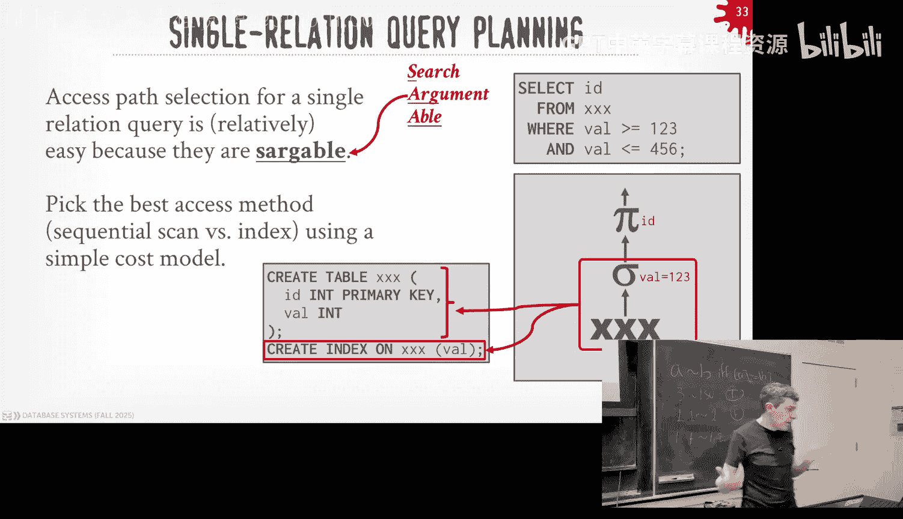
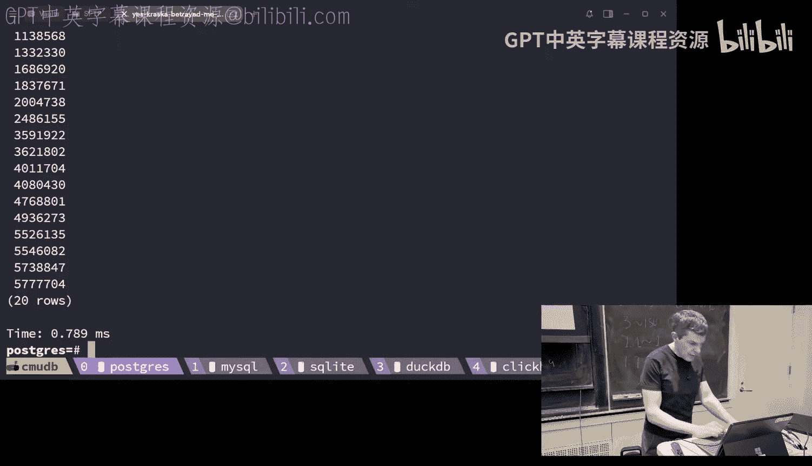
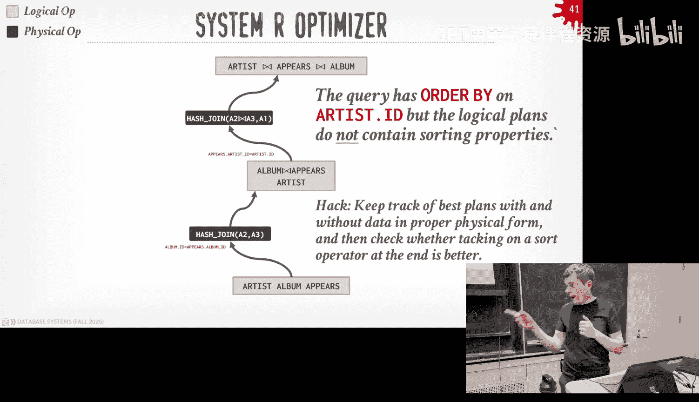
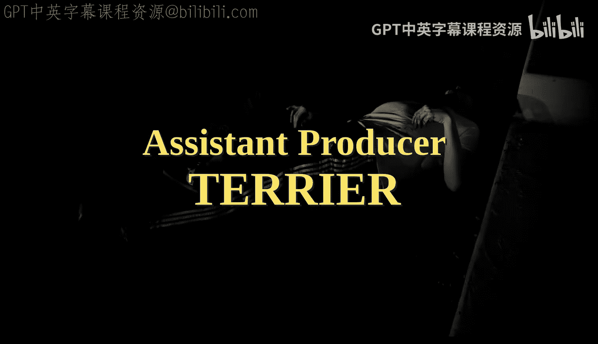

# CMU《数据库导论｜15-445 645 Intro to Database Systems (Fall 2025)》中英字幕 p15 #15 - Query Optimization Part 1 (CMU Intro to Database Systems).zh_en -BV1bmHGzsETM_p15-

🎼我 still。🎼we check。🎼我是你我只可意。🎼Think。🎼厌。Guys， let's get start it。Round of applause or DJ cash。

Have have a good weekend y。Did you make any money？a lot of money That's I here。

 All guys for you in the class， lot， lot to cover， a lot lot to go over again， on the。

 the docket for you again， the。Hopefully everyone's well rested after getting Project2 completed last night。

 midterm exam again is still available my office hours on Wednesdays。

 come take a look and if you want things regretted， you take a photo and send it to me。

 I look forward to we do this Sunday coming up on November 2 and then Project three that came out last week thatll be do a November 16 and the recitation for that will be tomorrow night at Apm on Zoom and it's been posted on Piazza for this。

Are any questions about homework4 or project three？Yes。😊，Whi role which column is the year。

The question is， what column is the leaderboard graded by， it should be the one on the far right？

这吧说掉。it doesn't rank up a default， you click it like twice and it'll rank it。😡，Yeah。Other questions？

All right and again， if you can't get up the databases today after class we'll have another seminar speaker。

 this will be the same guy that came gave a talk in class about singleinglestore I think that day singleing store got acquired by the private equity so this is postprite equity acquisition for those guys so he's giving a talk to us at 430 after this class and a week from now we'll have a CMU alumni distinguishished alumni Ryan Johnson who did his PhD here before I came to CMU did his PhD in databases and now he's at Databs working on Delta Lake so'll come talk about what Delt Lake does it's in the same sort of family as the iceberg Hoie Hoie stuff that we talked about so far on Duck Lake and then next week on Tuesday at the regular Data group meeting on。

At noon， we have somebody from Uber calling in to give a talk about how Uber uses Apache Piot， okay？

All right， so。Last class， all last week， we were talking about how we。

A we're going to build the data systems's runtime component， the query engine。

 execution engine to execute queries in last class in particular we talked about how we want to design the system to support parallel queries we talking about exchange operators essentially these ways to coales results from multiple workers running the same time that are working on different parts of a data set or different parts of a query plan at the same time and we put them all together and produce a final result and so the key thing that we were talking about during this process was that how this is query plan that was being generated。

 we didn't say how but there's this query plan that had these physical operators that we're defining how we were going to access tables。

 how are we going to compute joins and do any other algorithms that we talked about so far and so we've been very handwaavy throughout the entire semester about okay how do we get one of these query plans and so that's what today is all about and for this week how do we take a SQL query from an application or。

Somebody who wants to run a query and how do we produce that into a query plan that we can then execute using all the components in our system that we've designed so far and obviously we'm going to focus on SQL because that's the default default language or the factor standard for querying tables in the relational model the same concept and techniques that' be talking about today are applicable for whatever other query language you may want to use。

 right？All right， so again the high level path of where we're going through now is that we have our application that you know is written in PhP。

 Java， RoOST， whatever it doesn't matter， and they're going to connect to our database system and they're going to send us a SQL query and the first step along this process is that we have the parts of the SQL query。

😡，you know， classical part of the class， you know， pick your favorite parsing library or tokenizer or whatever。

 like we'll parse the tokens and we'll generate what's called an abstract syntax tree。

 which is just a treeduct structure that's going to say things like there is a scan on some table that has a name。

There's all a bunch of strings because that's defined within's the SQL query So then this abstract syntax tree is passed into a binder。

😡，And that's responsible for now resolving all those string identifiers that are in our SQL query like table names。

 column names， things like that or function names， of course。

 and it's going to consult the catalog that's going to have all this information about what these different database objects we have in our system。

 and especially going to do this mapping from a name to an internal ID。

 like an object ID Postgres they're called OIDs。😡，Right and we have to do this because if someone says select star from table bh and we don't have a table bh。

 we want to throw an error And so that's the binder's responsible for doing that。😡。

Finds are super complicated because it's， it's easy if it's like select star from table Fo。 right。

 That's easy。 It's when you start having nested queries and duplicate names or joins on the on on the。

Joining the same table with itself， that's when the binder gets kind of nasty。

 you know we could spend a whole semester on this we're not。

 but assume there's something knows how to take string tokens for table name objects or column names and map it to internal ID。

 and then at that point we know like the type or the schema or whatever the thing that they're accessing。

😡，And then once we do this binding， now we have what is called a logical plan。

 so now we have something that says I want to access table foo and I want to do an aggregation on it。

 I want to do a sorting on this column right， It's a high level definition of what the query wants to do without defining exactly how to do it or how to actually execute it。

😡，And then we take that logical plan， pass it into our optimizer。

 and this is now responsible for looking at the schema to figure out what are the objects that this thing is trying to access。

 consultulting a cost model says all right， for these different options that they have to execute this query。

 which ones actually better and this cost model can be fed using statistics that are collected in the catalog could have its own magic constants in them。

😡，To define how you know whether scan is faster or sequentialal scan is faster than the index scan or whatever。

 right there's some the cost models is allowed to judge whether one plan is going be better than another。

 given a bunch of alternatives。😡，And then while the author says， okay。

 well here's know I crunch on this， here's the best physical plan that I can find for this query。

 and then we can then pass that off now to the query engine。

 we just discussed last class to go ahead and schedule this for execution。😡，So today's class。

 we're going to focus on the optimizer box here。😡，Next class will focus on the cost model box up above and obviously it's semibiotic you need one you you know optimizer doesn't always need a cost model。

 but a lot of the methods we'll talking about today do。

 but you need some way to say this is actually better。

 you know ideally you want to be able to say this alternative plan is better than another plan。😡。

Right， so this is the path we're going on。 and we're focusing on the optimizer piece and the cost model。

 like I said， the binder and parser， it's just a bunch of engineering。 it's painful。

 especially the binder， but you know we can use stuff off the shelf if necessary。

All right so let's look at an example of what we're trying to look at actually a query and see how we're going want to do this so say we have now a simple query like this。

 we're doing a join against the employee table with the department table。

 we're going to find everyone who's in the toy department and we want to get all the unique names and say that in our data system we also have this catalog that keeps track of all the different tables that I have what are the primary keys。

 what indexes do I have and whether they're clustered or unclstered on those keys and then all some basic information that says I have in the case of the employee table。

 I have 10，00 tables or 1000 records split across1000 pages and for department is 500 records put across 50 pages。

Right。This is like kind of the bare minimum， well， the bare minimum was you have nothing， right but。

That's more the the lakehouse data like stuff。 we can ignore that。 But if there is the bare you need。

 you obviously need to know the schema because you need to know what you know， the query says。

 I want to read table employee that what the schema actually is。Not always， but for our class here。

 weve assume that's the case， and then we need to know obviously what indexes we have available as us。

So if you just sort to take a I almost say a little transcription or mapping of the SQL query and cover it to relational algebra。

 you end up with something like this right you have scans on employee and department now I'm going to do a cross join and then everything that I have in either my wearclos。

 my own clauses， right those are just filters and then I have the projection at the top。😡，Right。

So let's say we built a sort of a naive implementation of a database system and at the leaf node of this query plan。

 we' going to read the employee table all 5，000 records。😡。

And then we're going to read the the rights table， all， you know， all 500 records。

 And then we're going to do is when we do the。We're just going to scan them in and write them out to like a1 file。

😡，Like something really， really basic。😡，And then now once we have all that data prepared。

 we can then do the join I'm sorry after we do the Carteian join or the Carteian product。

 then we now start doing the filtering， so again this is just bottom here we're just mashing up all the Ts employees。

 all the tus with the department then we now we do the filter to start throwing away twos where that aren't where there isn't a match on the Car ID and the employee department ID and same thing now we're gonna suck in all the tus we wrote out and temp table temp file one。

 read those back in and then produce a new temp file2 T2 that has the result of this join。

 we then pass this up to the next filter operator， read all the data in do the filter write it all out and then we end up with our final projection at the top we do four reads in one right out to produce the final result。

So for this naive plan， because you never want to do a cross join。

 right if we just execute almost like， a little translation of what the SQL query defines for us。

 right map to relation algebra， we we're doing 2 million IOs。😡。

But we can start doing all the tricks we talked about throughout the entire semester to reduce this you know reduce amount of I we're doing but just being more。

😡，More intelligent and more efficient and the operators we're going to choose when we execute this query。

So for example， if I get rid of that cross join and now I do an inner join。😡。

So as I'm scanning at the table， I can just do the join rather than having to materialize everything out on the cross join。

😡，And now I've got to start making a decision on what my joint algorithm should be。😡。

So if I just do like a block in the nest loop join or page nest loop join。

 I'm still going to write things out to a temp file。

 but now I'm not writing out the cross product of all combinations of all tuples from the left and the right side。

 I'm actually doing the matching as I'm going along。😡，And then now when when I in the next phase。

 when I do this additional filter here to throw away anybody that's not in they department I'm reading less data in and now again writing the same same amount of data out and so the end projection is still the same so now we got it down to 54。

000 iOs from 2 million。By choosing a better plan。Can we do better？Of course， right。

 thiss all the tricks that that we we we learned throughout the entire semester。 right。

 So if I just take this and I replace the the nestesta luin where the sortmers join。😊，Right。

 assuming I have 50 buffers。 I can now write out less data for for this phase。

 and I again produce the total amount of Ios even further。 Now we get it down to。7000。But again。

 in this example here because I'm taking all the results of the scan from this and this and the join and then writing it out all the tus out to a file and then once that file is written。

 then start the next operator to read it all back in。

 that's a materialization model that we talked about last class which we said is very inefficient if you're reading a lot of data or passing a lot of data from one operator to the next because there's no pipelineing of this so if we switch to the vectorization model we can get rid of all of these additional rights and reads back in for these temp files and just pipeline all the tuples up and now we get it down to 3000 IOs。

😡，Can we do even better than this？Yeah， push down filter， there's one more optimization we can do。

Remember the joins we said that it matters whether the largest tables on the right hand side or the left hand side。

 so in this case here we can do what he proposed， push down the filter and now swap the order of the employees' table and the department table and push down the filter below the join。

😡，Like this。And now the query is going to be more efficient now we can get it down to just three reads in one right because we do an index lookup on the name。

 then we do an index and asset loop join instead of the Smers join and now we're only reading know 37 iOs or're doing 37 IOs for this one query。

The question the question is how do I decide which one to be in the left or the right and this example here。

 because I had the index on the department name。And you could then do it and there's only 500 records。

I mean handwaving how we determine the selectivity of this predicate here， that's the next class。

 but you would look and say all right well I only have 500 records and there's 100 departments so therefore you know and I' have some distribution information to say like you know it's not one department has everybody then I know I would want to choose this index right because now I can just do the just go get the you know the small number of twoles that are coming out of this and then now when I do my join it's way more efficient because now it'm probing on the other side。

With that。よこと大。If a question， do I need additional IO to go fetch to statistics， yes。

 I'm ignoring that。😡，Right， it'd be。Typically， that would stay in memory because it's much smaller than the natural data。

The way you actually implement that and like you actually implement the statistics as just another table。

 so yeah， there is IO， there's locking stuff which you haven't talked about that's next week。

 like there is additional overhead of going and getting those statistics。😡。

But like for operas is here， we're ignoring all that。All right。

 so we can kind of see if we did a couple things here。

 we did a bunch of optimization where we moved things down。

 we changed the physical ordering of different operations。

 we changed the order of like whether the department employees on the right and left hand side of the join。

 right？so there's a bunch of these tricks here and this is what the optimization is going to do。

 So anytime you open up like SQL light or ductDB or postcast from your terminal and you write a SQL query in it。

 it's going to run some some variation of these algorithms we'll talk about today to produce a physical plan that I actually can execute。

 then it runs your query。😡，It's doing this in real time as you hit enter and run a query in case of homework one。

 so like it's going to spend know the query is going to run say for like 10 milliseconds。

 it'll spend maybe a millisecond for simple queries to run all this optimization stuff。

 then produce a result and as a human it appears almost instantaneous。😡，For more complex queries。

 it's not instantaneous and there's we'll talk about how we decide when to terminate。

 but this is all going to happen like when you hit enter or when you set up a query。

 the data is going to do all this and then run the query， which to me I find fascinating。😡。

All right so today we're going to talk about the background of query optimization cover a little bit more detail than what we've talking about so far。

 then we'll spend time talking about how were to do transformations or numererations of the different possible query alternatives or query plan alternatives we have for forgiven query then we'll talk about the sort of the two basic categories of high levelvel categories for query optimization there's heuristics and rule based where you're planning the transformation rules without a cost model。

😡，And then there'll be the cost based search， and there'll be two variations of that。

So those new database systems， when the first time they come online。

 they'll build a heuristic base based optimizer， and then later on they'll get more sophisticated either you know as the project grows and becomes more popular。

 then they'll switch over to a call base one。😡，But you sort of need the rules first to do the call space。

 we'll see why as you go along。All right， so what are we doing here at a high level？So again。

 given a query's logical plan that we get from the binder because it's mapped the names or tables and columns to actual object identifiers in the catalog。

😡，The optimizer is responsible for generating a bunch of different alternative。

Plans to execute and those alternatives could be at least initially could be other logical plans。

 but in the end， we got to produce a physical execution plan that our engine can actually run right So not'm not enough to say I want to join table A and table B。

 I have to know like I'm going to do a hash on table A A and B。

 I'm going to do a certain merge in table A and B， but that's the physical plan。

 I need to know what that is in order to actually execute anything。😡。

And the key thing is that whenever we generate these alternative plans。

It's absolutely critical that whatever that plan we generate is equivalent to whatever the original query was or whatever the original logical plan that we were given。

😡，It doesn't matter that we produce a really fast plan if it produces incorrect results because know what's the whole point of doing in his optimization。

 like might as to return one or no and no one's going to care。😡。

So we'll see as we go along these transformation rules that we talk about， you know。

 they're going to be set up so that when I change。When I permute the plan and terms start making changes to things。

 I have to be guaranteed that the output of that transformation process is a plan that's still correct。

So this would be very complicated to do it's just picking the right join order the joins for a query plan is shown to bemp hard so the search base for the possible queries that we may have to deal with is quite large now most queries aren't joining a lot of tables and most are joining one table sorry most queries don't have joins and then the second most common  query is having two joins but it's a long tail where people do a lot of weird stuff and we have to be able to handle that the largest number of joins I've come across in a database is 1500。

😡，And this is obviously not a query written by humans， this is something from the dashboard。

 Im clicking a bunch of buttons to do a bunch of things。

 but like you have to do a join on 1500 tables you know and our solution space is exponential。

 we have to start making a bunch of decisions how to prune this down。😡。

How to figure out whether one plan is better than another as we look at these alternatives。

 that'll be the cost model and that will cover next week， right？😡。

And then an ideal scenario is that no matter how bizarre someone writes a query plan and this especially matters now or sorry not a query plan no matter how bizarre someone writes a SQL query。

😡，And this matters now with LLMs because LMs are spitting out stuff all the time。

 right no matter how bizarre it actually is， no matter what weird things arere doing， ideally。

 the optimizer should be able to produce a good plan， a a good optimal plan。😡。

We'll see some cases where that's not always true when we open up Postgres and other systems for things as's human to think that should be obvious。

 in other cases， it's not always。😡，All right， so I think we've already covered this with a logical and physical plan logical plan again it's just describing at a high level what I want my operator to be in a query plan。

 I want to join table A and B， I'm not saying how to join it just saying I want to join them。😡。

And then the physical operators will be the actual implementation details of how to actually execute that equivalent logical operator like I want to do a hasht on a table A and B I want to do a sort merge A and B and as I'm doing my transformations to convert logical operators to physical operators。

 it isn't always going to be a one to one mapping。😡。

Meaning like like a logical joint operator might not always produce when I do my transformation as single equivalent physical joint operator。

In some cases I'll break it up in other cases I can retract them and the data system' is free to move things around。

 the optimize is free to move things around， if it thinks it's going to make a difference about producing a better query plant。

😡，There's other things we'll care about in the second or maybe end of this lecture。

 like I also mean to keep track of like。For each operator。

 how what does the data look like that they're producing。

 The most obvious thing is the certain order。So if I know I need my Apple to be sorted。

 I want to keep track of like what operator is going to produce the data in that sorted order。😡。

Because it might be the sort mergeRS join operator。

 might be the order by operator where the data might already be sorted or coming from an index right so you keep track of some of these physical properties in your query optimizer so that when you're doing these transformations。

 you know that data is coming out in the right form that you would need or that one operator may need。

😡，是。It's also worth mentioning too that we're only going to focus on doingque optimization at one query at a time。

 so we're going to treat every query as if it's on an island by itself。

 we're not worried about other queries running at the same time。

 we'll get a little bit we can talk a little bit about that in the cost model that's mostly determining is one query going to interfere with another and that changes the expected cost of certain operators but nearly。

😡，All systems， I can't think of anybody outside research that does this。 Yeah。

 produce every system you can think of takes a one SQL query and it produces one query plan for it。

 right， It's not going to take。You could also take multiple queries in and either figure out how to overlap them so you can run them at the same time or be aware that one query could be producing results that another query could read similar to the scan sharing that stuff that we talked before。

 but no system actually does this because most of you don't write programs that way where you say here's all theque I'm going to execute ahead of time and in this order DBT does that which we talked about beginning of the semester where you have sort of a dag or queries and then you can do this multique optimization。

 but to keep our life simple today， and in most systems that are out there。

 at least all the ones people are actually using production they're only going to do single query optimization。

😡，All right， so now that we have sort of high level understanding of what a CR measure is doing in the first 20 minutes of class。

 we want now go into more details and start talking about how we're actually going to implement this in our database system。

😡，And a optimizer is really comprised of three components or three concepts or design issues。😡。

The first is how we do transformations， you're converting logical operators into other logic operators or logic operators into physical operators。

 and this allows to enumerate over a bunch of different possibilities of a query plan。

 and then we can have a way to determine whether one plan is going be better than another。😡。

The next piece is going to be the search algorithm like how we're going to look at our possible enumerations and evaluate them and make decisions of what's the next transformation we apply or what's the next part of the solution space we should examine。

😡，And how that process runs and how we get feedback and try to refine our decision making。

And then the last piece， again， is the cost models is how we're going to determine whether one query plan is better than another。

😡，What's the correct cost of a query plan？😡，I don't know how long it's going to take。

 what's the easiest or not easy， what's the most accurate way to determine how long a query is going to take？

😡，Run it right but if I just said my solution space is exponential and I have for one query a billion different choices of query plans I could use。

 I can't possibly actually run them because if I ran them and I would get the result and I could just return that back to the user。

😡，So the cost models a wai for allows us to approximate。

 guess whether one query plan is going to be better than another。😡，And again。

 we'll focus that on how we do that next next class Moga to be does actually does what I just said before。

 they they just run the queries， see what everyone comes back first and that's one they to keep reusing。

😡，It's simple， it's brain dead， it sort of works。But for more complex things， it falls apart。

But as I said and in last class， everyone's query optimizer is really bad。

 it's determining how bad you are relative to other ones。All right。

 so today's class we're talking about bits， the first two， how we do transformations， enumeration。

 and then what the search algorithms actually look like。So a transformation rule。

As allows us again to convert the query operator query plans。

 the operators within them either logical sorry they're always going to be logical and then we go to physical。

 usually don't do transformations from physical to physical that complicates things。

 but the idea is that it allows us to take a current state of our query plan。😡。

And it could be a mixture of logic operators and physical operators， all logical operators。

 and then generate alternatives。😡，For that query plan that we think will lead us to a better result。

 And we think that there will have。Promising solutions for our search process。What's that？

The same is it's like rewrite rules。Yes， but rewrite rules at the plan level。For the dag， yes。

 for the tree structure with the quarry plan， yes。The reason why I was being hesitant is that there are rewrite rules for SQL。

Like at the SQL level， like the strings， if I pattern match on like like select star from a view。

 they can then rewrite that into something else。😡，That's that would be， in my example before。

 that would be be。Potenently before the binder after the binder。You stream matching。It's error prone。

 but you can do it。Some some people do that I must say it's a good idea， you could， right？All right。

Right， so again， these transformation rules allow us to identify different promising plans and then either will the output is always going to be an alternative plan and ideally that plan will have a lower cost or expected cost than the one we started off with or alternatively it may actually be worse but because we do a certain transformation。

 it then leads us or unlock so bunch of other transformations we could do that those will then have a lower cost。

😡，Right。And the key ten we're going to use to make this all work is rely on relational algebra equivalencies where we can be assured that if we convert a certain set of operators in our query plan to another set of operators because of the rules of relational algebra。

 we know that the plans will be equivalent and correct。😡，嗯。And this sort of repeat what I said。

 so again， we can rely on the fact that because relational algebra is well defined more so than sQL relation algebra is well defined。

 we would know the rules in which we can change things and permute those relational algebra operators to produce other operators and we know our equivalent to each other。

 right？😡，So if you just go look at examples of like selections， right？

So I know that if I have like a select operator with a predicate P1 and P2。

 P3 up to PN that I in this case here it's conjunction。

 I know I can decompose or break up that conjunctionjunctive clauses into separate predicates and have now separate select operators or filter operators for each of those individually so instead of having from scanning relation R and applying P1 and P2 and P3 and P4 all at the same time。

 I can break it up into different select or filter operators and then now I can move them around independently from each other and I know I'm still going to produce the same correct result or I may want to do P2 first apply P2 first before P1 because P2 is cheaper and run and it's more selective and again because the relation a rules。

 I can move those things around and I still produce the same semantically logical result。

Was that The question is， would you ever want to combine them again， Sure， why not。Yes。

It's the select operator。The question is， is the s operator commdative with other operators？😊。

Everything went outer joins。We're not going to cover ains。

 aer jointins are tricky because the nu semantics。But for this lecture， yes。The question again。

 like the question is， is， is this left operator commutative， And my answer is。Yes。

 except for outer joins because because of the nulls， right like do you match。

 if there's no match on one side' another， what produces the null， but let's ignore that okay。

That's what I'm saying， like there's no， there's no outer join in in in relation to algebra。

 There is in SQs。 That's why themans are trickier。 Sequs relation extended for that。 But all right。

 so。other optimization we can do like this is similar to what we talked about。

 I think two classes ago of like hey， here's this expression tree。

 we can apply sort of compiler tricks to try to optimize things further so here I have x equals3 and y equals x well I know because of again commivity that or sensitivityivity that sorry transitivity that I can take the x equals3 and replace the y equals x to be y equals3 because I know x equals3 when I was doing the comparison and it seems like a trivial thing but that's actually going be way faster now to do my evaluation and when I'm actually running through real data because now I'm just comparing with a value that can sit in a register rather than a reference to another variable。

You can do other optimizations ahead of time too like x equals1 plus1， the optimizeccup can say。

 well， I know one plus one is going to produce a constant。

 so let me just evaluate that now and produce two and then substitute that so I'm not doing1+1 over and over again。

😡，And this last one a bit more nuance， but it basically says like it's similar to the constant propagation stuff we last time where instead of me running this year function to get the year out for every single tuple I may be looking at if I have a billion tus。

 then I'm better off to supplying the function once and then reus the result over and over again。

For joins， again ignoring outer joins， but in case the innerjoins equi joinins。

 they are commutative so I can swap the order like R join S that's equivalent to S join R likewise if I have R join S followed by join T I can move all those things around and I still produce the same result and as we when we talk about joins we said that depending on the joint algorithm implications so the physical operator we're going to use in our query plan to do the join。

 I may want to have the larger table the outer table versus the inner table and so that's why if I have statistics to determine which one is actually the larger one I can look at the I can move things around and know I'm guaranteed to still produce the same result because of those commuticivity and soivity rules。

先。Carti mon same thing， guess。In general， you never want to do a cross product though unless unless the query fixed says do a cross showing。

 never do it。😡，Yeah， but。That's an easy one。So again， just to show you how challenging this is。

 the number of join orders you have and an n binary join， again。

 binary being I I can only join two tables at a time is I mean this massive number here just showing you there's so many different choices we have to consider。

😡，And if we just try to blindly look at everything。

And all possible combinations as we sort of permute the search tree。

 you know it would take would be exhaust administrationmun would just be way too slow。

 so a bunch of these transformation rules are going to allow us to throw things away that we don't want to consider like a cross join for example。

 and I don't think to bother even considering them。And when we talk about IBM System R。

 they're going to throw away two different types of joint tree structures because then that cuts down the search base。

 even though that may actually be the true optimal plan。

 just in the sake of actually producing the result they would need to actually can run in reasonable time。

 they don't even bother considering them。All right， so what are kind of trans we could do well。

 a bunch of these we've already talked about and I'll just go through an example1 by one and all these here we can do this at the logical level。

Because we don't have to define exactly algorithm what joint algorithm we're going to use。

 we just know that these rules should get applied because we as database people that built the system。

 we know that these are things you're always going to do so we don't have to ask a cost model， hey。

 is this going to be maybe better or not， these are things you always want to apply？😡。

So the first one was the example that we saw in the beginning， I want to split my conjunctive clause。

 so again if I take a literal translation of the SQL query trying to find all the people that are all the artists that appear on the attributebute album for DJmushu then I would have these bunch of cross joins because that's a naive implementation that comes out of the binder and then I have my single filter clause filter operator that has all the conjunction clause inside of them so if I did take this guy here。

 just split it up on the ans which is easy to do because I'm traversing the tree structure。

Then I'm going to produce a bunch of different now a sequence of three filter operators that each going to do one of those predicates by themselves。

Now now I can do the predicate pushdown trick we saw before and see this is why you want to break this up because now they're independent of each other。

 I can move them individually based on what I see below me in the query plan。

 so this top predicate here， artist ID equals appears in artist ID。

 I can put that right above the crossproduct join between artist and appearss and likewise the album name equals Mushu tribute I put that right above the scan on album。

😡，And I got a query pan that looks like this。Then the obvious thing I want to do is apply a transformation rule says。

 well， if I see a Cartesian product with a predicate right above it that has the joint clause。

I can convert that into an inner join。And I just traverse down of the tree and apply those changes。

This one depends on what the executionion environment is depends on what query processing model you're using。

 depends on what the data actually looks like， but you can also do a projection pushdown so I can have a projection at the top artist do name。

 that's the only thing I need my output but depending on how big why these tables are。

 I may able to push down projections before I even do the join because I can throw a bunch of columns that't need I don't need to propagate up into the query plan。

So you can end up something like that。So all these transformations again just reiterate。

 all these transformations that I just did here are doing a logical to logical transformations。

 and I don't need a cost model to determine whether it's the right thing to do we as database people。

 we people that understand how the system is actually gonna be implemented can define rules to say this is something I always want to do again。

 if you don't remember anything else with this course other than never use MAP in your database like you should never do a cross joinin unless somebody asked you to do it。

😡，So an easy logical logical transformation rule is say。

 replace any cross joins or cross products with。With a inner join， if you can。So the。

The number of these transformation rules your system will have will depend on the sophistication of the system itself and the optimizer。

 I think Microsoft probably talks about I think they have about 480。

 500 different transformation rules。Right and that's they probably they have one of the world's best query optimizes so that's probably the upper limit of how many of would actually exist。

 although I will say they are discovering new ones that they didn't exist before using AI so that's kind of cool and that paper is coming out it's been announced and's the I tell what when I came back from Microsoft I was really excited about that one should be coming out pretty soon but they're doing using LLMs to find query transformations they didn't think about before。

 it turns out a lot of them they are actually correct。So I would say also to it in my example here。

 all the t mission rules are doing one to one mapping like I'm doing like I went from well in this case here it's less than one like I took a filter operator and a cross join and then I converted that to a single join operator。

 so I went from two logical operator to one logical operator。😡。

In other cases it may go in the other direction right in this case here I had one projection operator then it then converted it to a much more projection operators and in this example here I'm kind of going a one-way street my transformations like I'm saying going back here I'm saying I know I want to do this get rid of this cross join so let me go and generate an alternative that uses the inner join and then you don't actually care about where you came from so I don't need to keep track of the history of what was the query plan before I do that transformation rule。

In other transformation rules， you do actually want to keep around the old ones and we'll see how we handle that in a second because you may decide you're going down a path in your sort of search tree that doesn't actually help you and you want to backtrack and go back。

 yes。😡，We eventually join artists and peers first。The statement it is in this example here。

 I'm building Art and appearss first， is that just incidental in the PowerPoint demonstration， yes？啊。

You would need a cost model to determine whether one's bigger than another which one you want to join first。

We'll talk about it sec too。In some database systems， Oracle famously in the '80s。

 however you defined it in in your from calls， like if you look at this it it says from Artist Appears album and the bottom have Artist appearsears an album。

 I'm joining in that order， that's how they would decide join ordering。😡。

And they called it this a semantic optimizer because it's if you as the human wrote your query this way。

 therefore you knew the order you wanted to join things。

It's it's not real right like people don't what the hell they're doing so but that's what that's what Larry I someone say how great his optimize was because allowed to maintain the semantic meaning of what you wrote your application。

😡，It's。It's all。I'll show a quick in a second。All right， so again， yes， Im there。His question is。

 is there a way to hint to give hints to to the data system。

 the query optimize and say I do want things order this way， Yes。

 so not all data systems support hints like Postgres by default does not there's an extension called P hint plan or plan hint one of the two where you basically put comments in the front of the SQL query and say join A then followed by B or GBB to A and you can actually do things like I want to do a hash joint when you make sure you use this index My SQL can do this in some things Oracle can do this SQL server I think you have to dump the whole query out and put it back and put hints in but yeah you can override the optimize decision where you find it just making stupid choices and you say you're dumb do it this way。

But you have to know what you're doing is the question is， do I think there's value in hinting， yes。

 because I mean naive just saying well， like so the process。

The paracos engineering philosophy is that you should not have hints。

 the optimizer should be disimproved to make sure you don't ever have the right hints。

We can look at some examples of a second where they just get it wrong and you do one hints。嗯。

The challenge hints， though， it kind of goes back to， I think。

 maybe maybe the first or second lecture when I talked about like this co is out there。

if you didn't write your queries in a declarative language。

 you would say I want to do the join order this way and I want to make sure I use this algorithm。

 I you sort of handcoding what the join algorithm is going to be and you're essentially locking in the query plan based on what you see the data at that time。

 So now if the data distribution changes and now you want to flip the join order or foot algorithm you're using。

 you got to go back and rewrite your application So hints kind of give you that problem as well。

 basically locking in what exactly what the query plan to be and maybe that's okay but if the assumptions you make when you define this query plans change the data evolves in some way or the guy that wrote the hints quits and then you're now responsible for maintaining this code base from 10 years ago and you're like what are all these hints and in the assumptions are all wrong。

 it's gonna to produce bad query plans。So like a double edged sword， like yes， those my cases。

 they're a good idea in other cases。You know， maybe not。All right， so again。

 the search search engine in our query optimizeizer is responsible for applying with these transformation rules。

 generating given alternatives， either logical alternatives or physical alternatives。

 and then using a cost model to determine whether one plan is better than another。

 but it may not be the case that you always apply a cost model。😡。

ItMaybe it's be the search engine just says I'm out of rules for me to run or run out of time。

 then it just stops。😡，Right。The challenge is is going to be that we may not always have all the information we need to produce the best optimal plan。

 so remember we talk about prepared statements where you can basically say here's a SQL query I want to run in the future。

 give it a name like a macro and then now I can execute it by passing in like input parameters like an RPC or function call。

😡，When you call prepare pair most data assessment will generate a physical plan for you so that when you then invoke that query。

 it doesn't have to run through the optimizeup， it has a query plan ready to go Of course the challenge is if I have emMA parameters that I don't know at the time I'm doing planning。

 how do I pick the best optimal plan？😡，And so the easiest thing is to take an average of the values。

 while that assumes you have a statistics or it could take a good average。

 so we may be dealing with incomplete information， especially with statistics。

 we may not have anything， but we'll see how we can handle that next class。All right， so as I said。

 there's basically two approaches this， there's just applying all the rules that we talked about so far and you keep applying them until you realize you're stuck in an infinite loop or you run whatever your budget is for running or there's no more transformations actually to apply。

😡，And instead， this is what most people build when they build a data system that with Sports SQL。

 this is the very first thing that they're going to end up implementing。

And then a more sophisticated approach is to use call space search I'm saying sophisticated like this is actually what IBM built back in the '70s。

 so the very first relational na system came with this own call space query optimizer。😊。

But still people implement the first one because it's just easy to do So we'll first talk about this one。

Understand what it is， and then we'll see how we can do。

 you still need to do the heuristics in some cases to help us guide in our cost base search。Al right。

 so。A heres based according optimizeomizer。 It's defining static rules that that are transform to logic operators and physical operators again。

 without a cost model。 And these decisions can be based on things like。Oh。

 you're doing a a aware clause on a with quality predicate on a primary key。

 Well I know I have a primary key index。 Therefore。

 the access method should physical operator for for your scan for reading that table should just be looking up on that primary key index it could be sort of simple things like that or all that projection predicate push down。

 We talked about four limit push down if you can。And then some really basic simple rules for for determining whether what should be the join order could be the naive thing。

 like to assume whatever the SQel query it gives you is that's the join order people wanted。Or again。

 whether or not this is the cost model， it's it's sort of semantic with say， all right。

 I'll just go look to see how many tus I expect to be in， in this table。

 And then that'll determine the join order。So this is what Ingresss built in the 1970s。

 their first court optimizer， Ingresskin was the precursor to Postgress。

 Oracle had this also the 1970s up until early 90s。

 they went pretty far with this is what Mongoity essentially does now and again every new days isn't written in the last。

10 years when they first start off， unless they're using bits and pieces of Postgres or a query optimizer package called Calcite。

 this is what everyone else does。And the reason is because it's pretty simple to implement。

 it's really easy to debug because you just take the SQL query and trace through the debugger and see all the trace queryry approvals that get applied and see what comes along。

 the problem is going to be though it's going to rely on magic constants or hardcoded intuition about whether one decision is better than another and for simple things like Pre could push down that's okay for more complex queries。

 this becomes problematic。😡，And if I have to do a lot of joins。

 you're never going to get an optimal plan because you can't reason about all the different independencies and what the data looks like and understand how things get propagate up in query plans。

So is a big optimization get you for simple things。

 like simple applications where there are no joins。

 but once you start doing more than two tables in a query。

 sorry joining two more than two tables in a query， this falls apart， yes。😡，把的9考。The question is。

 what do we you magic constant？Do you have slides on this anything？No， it's not here。

 So a magic constant would be how do I determine whether an inex scan is better than a sequential scan。

So if it's like simple things like where ID equals1，23 and ID is the primary key。

 then yeah index scans will make sense， but now if I start doing range predicates， scans。

 and I chose to either do a sequential scan or an index scan。

 I need to know like what the distribution of the data looks like。

 which the cost of accessing the index versus scanning the table right now you basically starting to build a cost model。

So a lot of times in systems they'll say well， a so sand is some multiple faster than a random or ri。

 so now how do you set thosenobs correctly， it depends on the hardware depends on what the data is。

Now， the cost models stuff next class will have the same problem too。

 but is even more problematic if you just pure heuristics？😡，Ideally also too。

 you wanted to define your transformation rules in not necessarily DSL。

 but in a structured manner so that you can compose them together real quickly in Postgres。

 especially FNLs， that's the rules。😡，Why don't they write a DS for。The question is。

 why don't they write it yourself for that， it's hard。I mean， let me tell you， right。

 and they know they're optimizer sucks， but like it's hard。Yeah。In back。你这个6万。O my aisle。

The question is， is there only one parameter we want to optimize as a cross model。

 we'll cover that next class no。😡，But IO usually is the big one。But Io could be never Cao， disk Io。

And disk and network is getting to be too fast， CPU is coming the bottleneck。

 so that matters too now。在这是。The question is， how when I say we're trying to produce a good plan。

 what do I mean by good？Depends。Most datas will optimize for performance。😡，Right。

And how did you as a human perceive performance is wallco time？

But it's very hard be able to come out the cost model that says these amount of IOs are going to take this many milliseconds and therefore I have to have this many and that's going to calculate the wall clock time so instead they they use a synthetic values。

😡，Again， we'll cover that more in the next class，And most system going to say I care about。

The performance of the query， all systems say they care about the cost actually of running the query in the cloud environment。

 and that's not that common。But you could do it because it's another objective。

You justt optimize for。All right so this is the snippet from the unofficial Larry Eison autobiography and in one of these pages here。

 Stonebreaker， the guy named event of Postgres and Ingress， the interview him。

And he starts talking about how again Oracles query optimized in the80 was in the '80s was total crap。

 but then he called them instead of saying you know。

 instead of making his weakness be the thing that the marketing people and his competitors could take advantage of。

 he would then claim that they had this beautiful semantic optimizer that just generated the joiner based on the order in which the tables appeared in the query。

😡，As I said， like nobody， it's a stupid thing， you wouldn't actually want to build an app this way。

 but they were able to sell that to people because it was the 80s， right？All right。

 so that's heuristic and rules again these are I would say also these are not mutually exclusive so you could build a cost based search that still applies to all the transformation rules that we've talked about so far and you could do a first pass of doing that logical transformation stuff that I talked about at the beginning and then you hand off the final remaining decisions to a costbased optimizer。

😡，But it depends on how you implement stuff。All right， so again， with a cost based search。

 we' going apply the transformation rules that we've defined before。

 can enumerate a bunch of different choices we would have。 and at every step of the way。

At least when we're doing the cost based search， we would consult the cost model and say。

 is this new plan we're generating after you apply to this rule。

 is this better than the best I've seen so far？😡，If no， then based on how I'm searching things。

 I may actually want to stop searching that branch in my solutionl space。

 or I may be allowed to override that initial increase in in the cost。

 think of like a gradient descent search， like I'm allowed to ignore that I'm bubbling back up because I know if I once I again on the other side of that hill。

 then I'll get down to something that looks like the local true optimal。😡。

So you typically do this on。But you could do this in a bunch different phases。

 depending what your query looks like， like you could handle all the sort of subplans that are tackling one table at a time。

 one relation at a time， then you expand down and say I want to handle all the joins。

 then you expandend not even further and say， I want to handle all the nestSA queries。

 some systems do this in sort of stages， other systems do this in sort of all at once holistic tuning approach or of optimization approach。

😡，Again， we'll see the two examples of this。So when do we decide to stop？

The obvious thing is you just set a timer and say， well， when my query optimizers run for。

 I don't know， 500 milliseconds。Or whatever you want to set the threshold to be。

 once I run to that time， then I stop and I produce whatever the best query plan I've seen so far。

 that's what I'm going to exit with。😡，Another could be if you have a way to find the threshold and say。

 I don't give me back any don't stop searching so you find a query plan that has this lower call so it could be like I'm replanning a query that I've seen before and I want to let it go until I see stop once I see a query that's 10% better then a query plan that's 10% better than I've seen before。

😡，Or at some point， if you're sort of plateau nothinging any better plan or a period of time。

 then you can drop out as well。😡，If the query is simple and your systems is really fast and you don't have a lot of rules to apply。

 you may up just exhausting all the possible combinations and then you don't have wait for the timeout or cost of threshold。

 you just come back and say I know this is the optimal plan， like select star from F。

 that's pretty instantaneous。😡，You don't have to do a lot of rules to figure out what you don't have to look at a lot bunch of alternatives。

 you can spit out something very quickly。The way to actually really do this is actually not on wall clock time or all these other things。

😡，It's actually going be number three It's obvious。 always want to number3。

 But like for this last one here， instead of trying to count how long I've run in SL server。

 what they do is they count how many transformation rules they have applied。

And then when you exhaust the these number of transformation rules。

 then it kicks out and terminates the search。😡，And we' to take guess why they do this。

Instead of walk off time。件给等 one。say you're guaranteed to get at least what？是。

It say as you're guaranteed at least to get one transmission considered， yeah。

 but you would set the Tasury account for like hundreds of0。就不道。Yes， bingo。

 they said the different hardware may have different wall clock time or actually same hardware。

But now the system is being overloaded because a lot of queries are running。😡。

And if I set it to the wall clock time and my CPU is taxed out。

 if I one second where my CPU has is overutilized， I may not apply as many rules versus like one second when it's underutilized and I can use the core to its full capabilities。

😡，So this guarantees that no matter how stressed out the system actually is。

 you're always guaranteed to produce the same plan for the same query。

 given the same input in some constraintss。So my SQL and SQel server， they do the first one。

Because in of sorry， Postgres of My SQL do the first one， in case of Postgres。

 there is no concept of transformational rules that applies and can start counting them because it just has a bunch if statements that it always runs through。

😡，And the way SQL server does it and that'll be the top down search we'll see in a second。

 they know all the as they go along， they're of incrementally applying rules and they just keep count of how many applied if they exhaust it。

😡，You least need to get to the bottom of the search tree so you have at least one query plan that you can actually then run。

😡，But it's at least matter whether again you're running on a machine that's fully utilized or underutilized。

 you'll always produce the same query plan。All right， so the first thing we want to do is figure out。

 one of the things we have to do is apply transmission ruless to figure out how we're actually going to access the data on our underlying tables。

😡，RightAnd this could be through a combination of things that we'll see next class。

 but like we want to look at all the different choices that we have for our accessing our table and a transformational rule can convert things like scan get tablefo or scan tablefo however you want to define it and it can convert that into a physical operator that either does a sequential scan or an index scan or a multiinex scan that we talked about last time。

 right？😡，So I look at the catalog， look at the statistical information， and say。

 here's all the choices I have for this accessing this data and then applies transformation rules to convert that logical scan operator into the different physical operators。

😡，And this is essentially repeating what already said， but like again。

 we look at all the things we have way to access data and we just try out different combinations of them based on what our rules are allowed to do the end of the day。

 if we have no index we could use because the predius don't match on it or it' it's a hash index and we want to do a less than or greater them。

 the end of the day no matter what we can always convert a logical scan operator on table into a physical sequential scan like that's the fallback choice and it could be the slowest but it's something we can always rely on。

😡，For simple queries， they what is known as called Sgeible。

 this is a database term it just means search argument A， it comes from the '80s。

 and basically just says it's like I can have a transformation rule that looks at my scan operator。

 looks at my predicate。😡，And then looks in the catalog and says。

 here's an index that I could use for this predicate here。

 and I can just convert the logical scan operator into a physical operator on that index。😡。

And it seems kind of obvious that you can always just do this， always just look at's like， oh。

 I definitely need to access this data and I need to。

 or I want to be sort of on whatever this column is， but a lot of these systems choke up on this。

 or I may decide even though I have the index in a call space transformation that I don't actually even want to apply it。

😡，Because it's just better because do a sequential scan。So let's do a quick demo of that。

All right， let me log in。So Ive pre populated some data in Postgres， I think it's 10 million。

T million Rose。Which is event of random random information。Right， do you limit one？

There's a primary key called ID and then a value it's a random random integer。😡，And I think I have。

I pop， I think， 10 million。Yeah， okay， so。I've created an index on。On the value column。

So at the bottom here I created B plus street index， you always had one of the primary key。

 but I also created a B plus street index on the value column。So without running the queries， again。

 we can put the。We can put the explain keyword in front of our query。😡。

And this will give us the query plan here right so here I'm doing a select star select ID from XxX table where value is greater than equal to 1。

23 and value is less than 456 and in this case here post bestticize that yes。

 I want to use the index on the value column and and know instead of doing a Scl scan。😊，Likewise。

 if I do look up like this， I want to do a。呃。Select drive in the table。

 order buy the value column and give me the top 20。😡，The top top 20 values right in this case here。

 Postg recognizes again， I have a an index on the the value column and the data is going to be sorted the way I want。

 so it' it's allowed to go ahead and。Can use that see if it finds me。 No， didn't find me， okay。

But Perscuss's optimize is dumb。😡，Let's look at this query。 What am I doing。

Same queries above gave me the top 20 values， but in my order by clause， I put value plus0。😡。

Value is an integer column。That means you add zero to it。It's the same value， right？Well。

 I've already told you he what wass going to happen， say。

 let's vote see what Postre whether Postgres picks the index or not， but I told you it's stupid。

And it doesn't。Right。So this seems as humans， you look at and say， well， clearly， plus0。

 I can just drop that because I know it's an integer。😡，Right。I think I and if I go back correctly。

 I made the column。I didn't make a nu at all， and that's why。Right。

But it could look at its statistics and recognize that I don't have any nu values。😡。

And its cost model， but it can't do that。Right， so if I see I doubt it'll even do that。

 So if I drop the table。This should go fast。嗯。I add it back。

 and here now'm going to say the value is not null。And let me go generate some。

This query here is the insert into that just generate generate series makes a bunch of values。

 and I'm going to insert that into the table。It only takes a few seconds。嗯。In theory。Very goes go。

 So now， and let me add now the index on。On that column， should take a few seconds。And。

Now I go on the there's the first query without the plus zero and it's able to figure out that I' should choose the index。

And this is here， even though it's not null， it can't use the index。

Now we'll talk about analyze next class， but that's basically a way for it to collect statistics about the the。

The table， in this case here， it has all the six and needs and it still can't pick the index。Yes。

 the question is， why does they think the sweat can has a lower cost than what sorry， so let's see？

So's here's the first one。Here's the second one。So you're saying for which one？陶瓷不是陶瓷。

which so which one for which operator each operator has its own cost。

Right I mean compared to the the causes。4 three4 three。whyhy is one in the top smaller than this one。

Because this is special man， this is reading all the data。Yeah。

 what I'm saying like the query is order to buy value plus0。😡，As a human。

 you know any integer plus zero is the same same value。 So that plus  zero means nothing。

 Postgressre sees that says up， I can't do this because this can't match it's trying to do it like a string match on the name of the column And if it sees any expression like a plus zero it knows to it just it doesn't pick the index no matter how。

😡，Com也是 always。Stepd is no matter how many， u no matter what like plus zero times one， right。

 like plus 1 thousand， you should us always used the index。doesn't。

But like if you want to actually a accomplish that you need some culture that layer。

The same is if I need to， if I want to do an expression in my。Like do it in a principal way， yes。Yes。

 dude in critical rate。 Yes， they're not。Because the a says， up， I can't it's not an exact match。

 I can't do it。That位。Its the same as partial bi is hard， why？嗯。他没跟他说。Not many what。

Davis compilers or compiler compiler。Myinius could do it。So I don't have SQL server running。

 but like SQL server handles this， no problem。But that's like SQL over。I right。

I wish I get it I don't have it working。呃。Yeah， I was rushing this I didn't work， but let me try。

Try to give me。I of a plus one and my overflow， and then。statement is plus one might overflow， yes。

But if you have statistical information about your queries or so your data。

 you can say no value greater than whatever the upper limit or even close to it。

 so therefore it safe to do it now your statistics might be wrong。😡。

And therefore you're very conservative about it， yes。But you don't need that for。

Like you could still do the order by。And again again。

 because you know like if it's just like plus something。Right， like the。And it is。Actually。

 I don't know what they would do if for the。I actually don't know how they would handle the overflow if you do the projection after the fact。

Because it's still technical the largest。But it still would you might might throw an error I don't know。

 all right， then you get into like semantics of SequL like does it round or not round right and that's as long as like no becomes。

Rounding gets weird。Just because possible know。Now we we're getting into a rabbit hole hold。

 so I have like save I have 4。5， say 4。2。Right， if I cast that to an in， what number should I get。

 who says race trying to say four？Raise your hand to save five。Reise your incentive through an error。

There's an error， right？So what if I do that？Doesn't like that。 what about this？Takes four。

 All right， let's try WTV。So select 4。2。Ca its in it， all right， raise your hand if you say an error。

Raise your hand to say four。Rang day 5。4our。All right， let's try 4。8。Rian particular， not an error。

It's re say four？Raise your hand and say five。5。Right。

 but we we just did this in Postgres and showed an error， right， Firebol might work too。

 because it I think it uses the Postgres parser。I I don I don't know if this is gonna work4。2。No。

 it doesn't。 doesn't like that。 that dot that colon， dot colon colon and then the the。

And then what the type is， that's a post aiom thatduct to be picked up。安つ。In Postgres。So select。4。2。

Cas 4。2 as。Integer。And am I doing wrong。Now人。I got you。Like that。嗯。So it can't cast。 And I forget。

 is this the one that what's signed。It might be my sequel。Yeah。It restarted， sorry。I。

I forgot the point of this。Actually， I want to share something that you real quick。So DrTB。

 I've created the same table and I can run the same queries as before。😊。

RightAnd even though I had an index on this table。It decides to still do a special scan。Right。Now。

 if I do this， the one we query we had before， again， give me the top 20。呃。

Values after ordering vibe。Who says iss going to use the index， raise your hand？

Very few who says they're can do a special scan？I tricked it。 You're all wrong。

 You can do two sequential scans。All right， that's kind of hard to see。 I'll just scroll up。

 So what is it doing， So it's doing special scam。Once on the side here。

So on the one side and that's its the。Then it's going to get the top end values of that。

 and then it builds a hash join。😡，And then then scans the table again and joins it with the self and finds all the matches。

😡，And again， according toductDB's cost model， this says it's just， it's just faster to do that。

 So matter what I put here， I put a plus0。It's still going to pick the same thing。

And if I actually run it。As we saw before， although this is running parallel queries。

 like it can rip through this in。What is that， 0。01 10 milliseconds？Whereas Postgres will take。

You know， almost a second。好。This is sequential scan， if I give it get of this。Right。Still slower。

Yeah。Std is I'm comparing between columnse in a ro。 Yeah， I didn't say it was a fair comparison。

saying that like。S， what if took forced took， I don't know if they  query reance， I forget。

I think might I don't know， I know I do it in Postgres and other things， all right， sorry。

 that was that was。I love demos， I love SL， let's see if we get this worth the end。嗯。Or not。

Whatever defs me， it finds me。All right， cool。

The thing I'm want going to get into again that's important is understand is there's for a cost based search。

亏。This was4 flat。sorry。Let's screw that one in the end。

 the question is which one's the least worst one？The Germans have the best one。Umbra。

DDB copy what Ura did， but actually they didn't copy it from Ura。

 they copied from the first German system hyperper。The Uber one has a bunch of other stuff。

 And they write about in papers。 That blows duck to be out of the water。

 But that one's not up in sorts。 and it commercialized the C to B。 Ammbra has the best。Bott up one。

SQL server has the best top down one。The theory， I think shows the bottom one is actually better than top down。

 top down has other advantages that we'll cover along。😡。

There's two ways I'm implementing in your crr when you do these search and when you start to looking at multiple relations。

 again bottom up or top down， so in bottoms up the idea is that you start with nothing。😡。

You have nothing in your query plan， you just have like what the leaves of the query plan are。

 and then you build it up incrementally to get to the final outcome that you want。😡。

In a top down optimizer， you start with the final result that you want like I want to produce the join of this。

 this and this， whatever sort of I whatever whatever know whatever is in my query plan or in my query。

 and then I traverse down， search down the query plan。

 adding the operators in need to get me to that result until I。😡，I've reached the leave notes。

And again me sitting with my hands making little finger gesture doesn't mean anything。

 so let's look at examples， see what I'm talking about。

 for now for all these examples we're going to have two distinctions between our operators and our query plan。

 we'll have the light ray one be logical operators and then the darker ones be the physical operators。

😡，Right， so bottoms up， we start with the bottom of this toletto， I want to scan artists。

 I want to scan appearss， and then eventually I want to get into the artist appearss join output。😡。

So what I would do is I start from the bottom and I look apply my transformation rules and say。

 here's all the choices I would have as I go up the query plan。😡。

Until I reach my final destination and whatever path to that final destination at the top has the lowest cost。

 that's my optimal plan， and I choose that。😡，In top down or backward chaining。😡。

You start at the very top here and you say well， what do I need to do to get down to the leaf node。

 so first thing I have my artist appears I apply this first choice。😡。

And because now I need at least get to the leaf node once， so I could at least have some query plan。

 I would do basically a depth first search going down one side of the query plan。

 get down to this leaf node， look at all my possible choices。

 get down and then come back up look down this path， and look at all my possible choices。

 and then I end up with the final result for my query。😡，Okay。

 let me go through more details of these this is the high level the two distinctions that we're going to have in our implementations。

😡，RightAnd if you're coming from the sort of a。Sort of a classical optimization world is backward changing versus forward changing。

😡，All right， let me skip this this is basically saying that if there are there's patterns you can recognize in your query where you know that it it's if a query of a certain category。

 like when we talk about snowflake schemas and star schemas。

 if you know it's going to be like I have a single fact table and a bunch of dimension tables。

 then you don't even bother doing a full search， you just sort of。😡。

You bootstrap it with a plan structure that they you think is close to the optimal and you start to search them there again。

 rather than starting with scratch。😡，All right so bottom optimization we're going to a bunch of static rules that we had beginning to do this initial optimization and then we're gonna to use dynamic programming which I realized it shouldn't rush through in the last six minutes。

 but let me get through the bottoms up and we'll come back to top down next class so you're going to do dynamic program which is divide and conquer start looking at the different choices you have going into the query plan and you work way up into the top the very first bottoms up query optimizer the first cost based query optimizer ever was IBM's system R and basically what they did is they would break up the query plan into these blocks like sort of subplans and they would optimize them and they would sort of stitch the blocks back together to produce the final result that they would want。

😡，Because it was the 1970s computer hardware was very limited。

 not a lot of memory and single core very weak CPUs。

 they had to a bunch of simple optimizations and throw away results to reduce the search base to make the problem more tractable so one of the science decisions they made is that they would only consider left deep trees and they would never look at right deep trees or bushy trees so left deep tree basically says I'm going to join two tables A and B and whatever the output of that is I'm going to join the next table and whatever the output of that it join the next table left deep because it's going up on one side off the queryrry plan rather than have this example we had before I could join A and B and then join C and D and then take the output of those two joins and then join them together。

So system R is not going to do any of that some systems。

 I think Postgrel still does this today like they won't support bushy joins as their optimizer to again just to reduce the search search space。

😡，All right， so the way it work is you first look at all the leaf notes and your query plan。

 all your access methods， and you apply simple heuristics to say。

 which are the best choices based on what I have in my catalog？😡。

Then you're going to apply transformation rules to enumerate all possible joint audience you would have for your table。

😡，And then you figure out which one is going to have the lowest cost。

This diagram doesn't mean anything so let's look at the tree structure。 So again。

 I start the beginning， I would figure out all different ways I I could access these three tables。

 artist Almon appears。😡，And then once I have that， now I'm going to figure out what's the join order I want to use。

 what path I want to get up to my final outcome where I join artist App an album。😡。

So in the first level of the tree search I would look at all possible combinations of joining these three。

 three different tables here right so I could do a and now look at the physical operator so Im can join hash join on artisan appearss。

 startmer's join on artisan peers and so forth and this obviously this doesn't fit in PowerPoint so imagine it's all possible combinations going here on the other side。

😡，Then I evoke the cost model saying， okay， all these different physical operators that I have。

 which one going which path going up to the next logical operators in the tree。

 which one each of those have the lowest cost and I'm going to throw away the ones that don't have the highest cost。

😡，highestigh or best cost and lowest cost， pin you're trying to minimize or act to maximize one。

And then I do the same thing again。 I look at all possible join orders for the the next two tables and in the query plan。

So taking the output of artists and appearances and I want to join with album。

 so I look at the hash joint， look at the merge joint。

 I can look at S loop joint if I wanted it and have more space in PowerPoint。

 I look at all those possible combinations and then same thing I pick for each path whichever has the lowest cost。

 and I look now for all the path from the bottom， the starting point to the top。

 which path has the global lowest cost。😡，And that's the one I want to end up with at the end。

It's just dynamic programming it means you're viing up by looking at one level at a time。

 rather looking at all possible join orderings at the same time。😡。

Of course the challenge in this implementation is that they had no notion of the physical properties of the data。

 so they had no notion of a sort order， so if my query had an order by clause then in this case here they couldn't account for that in their implementation and hash joins can make all the data random anyway。

😡，So they they were able to make this work because they would embed in the cost model itself。

 they would say， oh， well。After I figure out the path I want to go through， which one is？

I would give a penalty to any query plan that doesn't have the data sorted in the way that I wanted versus the ones that do have sort of the data that I wanted。

O。😊，Yes， his question， is this guaranteed to be optimal， no， of course， no？Yeah。Can， yes。

The question is， the statement is and they're correct， this is quadratic cost。

 if you only' consider left deep trees， yes， and so if you throw away bushy plans and write deep trees。

 it reduces quite significantly， but it's still quadratic。因为你系了好久。

And it's that large number that you can't lend them， yes， there's a web board， yes。

 and that's massive。All right， let's stop here again， this was rushed。So I apologize。

 we'll pick up on this on Wednesday， we'll go over this and the top optimization and then we'll spend the rest of the class talking about。

So we're talking about cost models， okay。I hit it。

🎼希你热。🎼我再从不见。

🎼Yeah。🎼再说你最自强，我敢走。😊，🎼Yeah。🎼我敢说你对乱说我从不见。🎼Yeah。🎼我你最最帅我注。😊。

Get the fuck the fame maintain whatever flow the。