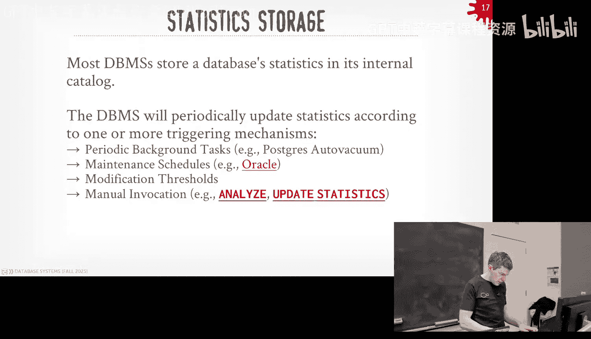
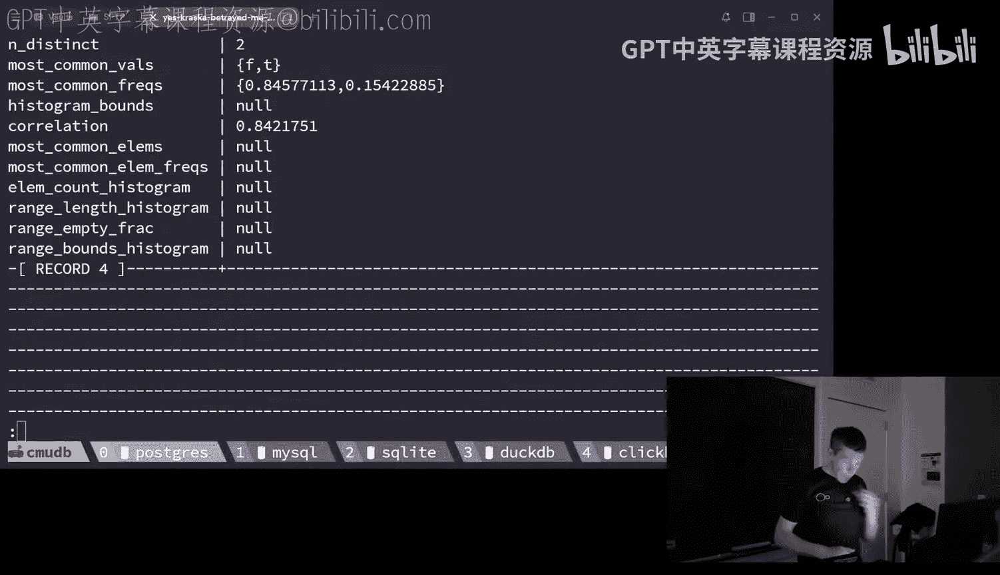
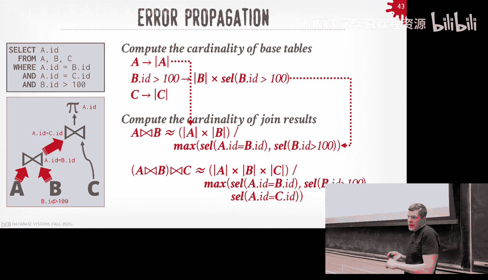
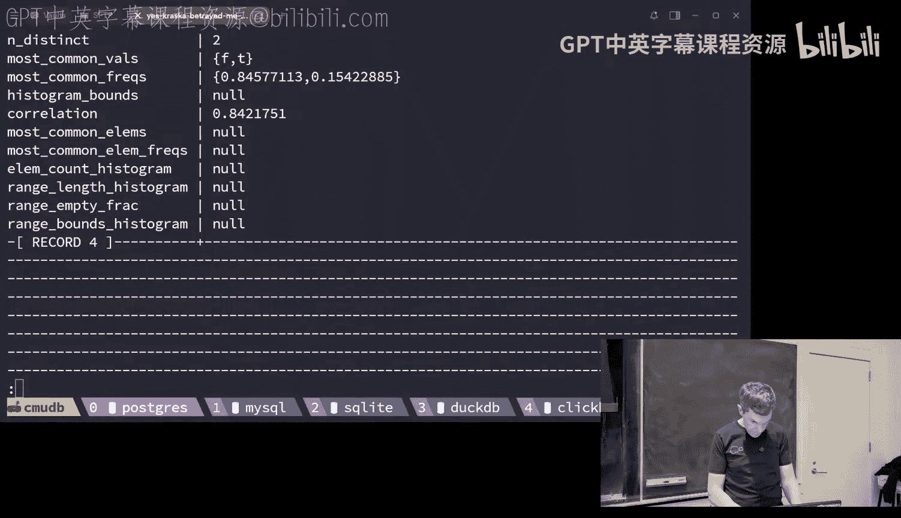
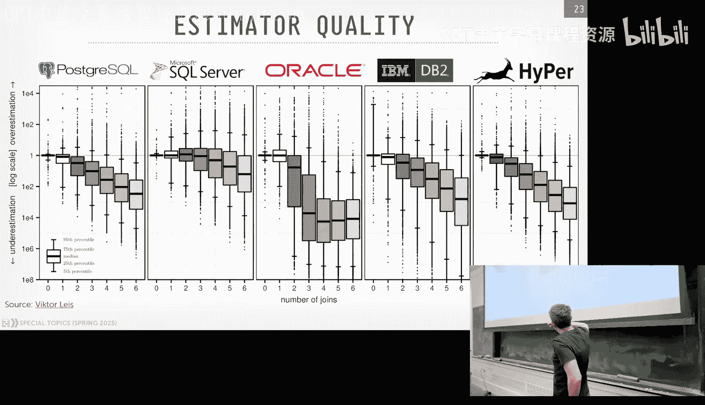
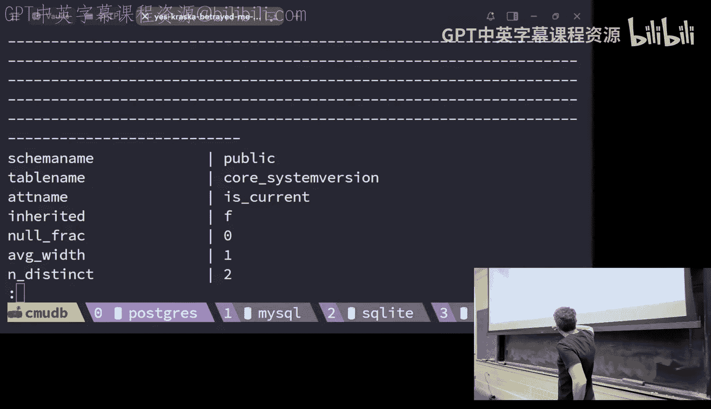
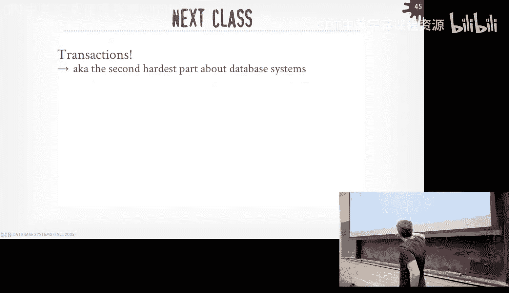

# CMU《数据库导论｜15-445 645 Intro to Database Systems (Fall 2025)》中英字幕 p16 #16 - Query Optimization Part 2 (CMU Intro to Database Systems).zh_en -BV1bmHGzsETM_p16-

🎼still。🎼check。🎼我是我可。Think you'll for what wraps out。🎼still黑眼。🎼想彼此的变。🎼。All right guys。

 let's get started round of applause for DD catch， awesome。your bank account is。

Ting care of now or just it's away from when he come okay， yeah， again。

I gotta take it by DJ and make sure yous it Okay All right， guys。

 lot to cover because there's a bunch of stuff we' we didn't cover last class at the end。

 we rush through。 want to pick up on that。 So again， midterm mid exams。

 you want to come my office hours after class today and can come look at him with the solution。

 homework 4 is do this Sunday and then Project 3， I've this recit was last night。

 I'll post that on Piazza after class with the video and the slides。 Okay。

 Any questions about homework 4 or project 3。😊，All right。

So last class we were talking about the query appizer we sort of kicked off the discussion talking about how the query optimizeizer is the component of the system that is responsible for taking a SQL query and then generating a physical plan。

 execution plan that the data system can then actually execute and we talked about how we went from the SQL we parse generate an abstract syn tree。

 we run through the binder where we resolve names of tables of column names and functions to actual internal identifiers。

😡，And then with that logical plan， we can do some additional transformations to without considering a cost model and try to fix things up and make a little bit better than sort a little translation of the SQL query from the abstract syntax stream and then we talk a little bit at the end。

 but we ran out of time but we'll pick up where we left off talking about the cost-based search where we try to look at an alternative plans。

 alternative physical plans and pick the one that we think is going to the lowest cost。

 and then begin in putting cost here in parentheses because the cost is going to vary per system per environment which you're trying to optimize for。

 but usually you're going to try to optimize the amount of diskguos in a very basic cost model but you can build upon that and do more sophisticated things like considering how much it takes do computer function or to process something that's in memory。

And then we said the way we determine or way we implementent or sort of call space corap Maer。😡。

The quality of the plan it's going to produce is going to be a combination of these three factors。

 so what kind of transformation rules that we have that will convert the logical plan to another logical plan or logical plan to a physical plan。

 and this allows us toumerate over different permutations of the query。

 the query plan and try to find one with with a better cost。😡。

Then there'll be the search algorithm which we rushed at the end will pick up again now。

 but this is the method in which we're going to explore the different possibilities of alternative plans we have being generated by the transformation rules of the nueration process then search for them try to find better choices and then the cost model piece so we'll talk about the end that's where we try to predict。

😡，What will be the expected runtime behavior of a query plan， not so much of trying to。

Genrate an absolute value like this query is going to take 15 seconds or you know you're not trying to pick something that's going to be like something you can measure in the real world。

 which you're really trying to do with this cost model is to identify whether one query plan is better than another so this cost model will be an internal metric we use that is the database optimizemer can only use so whatever cost model that MySQL is using they sped out a number say this is the cost of a query plan that's meaningless in Postgres or oracle or pick your favorite database system so cost model is the internal mechanism we use to figure this out。

😡，So for today's class game we'll come back to the search algorithms。

 the top of the bottom versus bottom of the top， and then we'll talk about the kind of statistics we will collect and then the cost models we use to estimate the cardinality of the operators because that's going to be the big thing we have to determine how much work query is going to consume or use because that's going to tell us how much data we're sending between the different operators。

😡，and again， just to preface this， this is super hard。

 this is the hardest part of database systems this is the part I know the least about so。😡。

Don't feel like you're not following long， but it's super challenging we're barely scratching the surface here。

😡，And like long if you understand the high level concepts， that's what really matters。

 And then the details of this maybe only matters if you actually go end up building a query optimizer。

All right， so again， the search algorithm is is the way we're going to。Again。

 enumerate or look at different alternative plans or choices we have for both logical operators and their corresponding physical operators in our query plan。

😡，And the two approaches either start from the bottom and work your way to the top sometimes called forward chaining and then the alternate approaches start from the top and then you work your way to the bottom to the leaf nodes and again conceptually they're sort of the same at a high level right the thing they're trying to produce is the same trying to generate a physical plan that I can then go execute where there's some nuances to the different approaches in terms of like how much。

😡，Like so how much backtracking or how much redund to work you would have to do， you could potly。

Encounter why you're generating these query plans and in particular of the bottom one。

 they're going to make heavy use of memorization to avoid redundant superfluous computations。

All right， so bottom up basically is you start with the leaf nodes in your query plan。

 you basically start with nothing like here's how I'm going to access the individual tables。😡。

And then I'm going to figure out now what order I want to generate the joins and other parts of the query plan working the way to the top where you end up with the final result that you want like I want to join these tables and produce this output。

😡，Top down is the opposite where you start with what you want to produce。

 start with with the outcome you want to be for the query。

 and then you work the way down and try to figure out what operators I need to introduce to get me back to that location。

😡，So the very first query optimizeizer that IBM built very first costbased query optimizer that IBM built in the 1970s in system R follows this top of approach here and as I'll show the next slide most open source A systems that are out today than you know about are doing something like this Postgre is doing something sort of looks like this DB2 is doing this the Germans do this but like on steroids and then DDB follows a some of the work that the Germans did at Munich 10 years ago and it's following this approach as well so again。

 the way that is going to work is that we're use our transformation rules to do some of the initial optimizations to again do predicate pushdown。

 do the things we know we're always going to want to do to optimize our query without actually consulting a cost model and then we're going to use this divide and conquer algorithm that's going to again sort search at sort of different joint levels in the tree and I'll show this next slide like which going be the optimal joint learning。

Physical algorithm I'm going to want to use to compute the different joints。😡。

So to say again we have a query like this we're doing a three way join artist appears an album。

 this is the example I showed at the beginning of the semester right and so in the system art implementation。

 the first stage you basically apply a bunch of transformation rules that you to figure out for each of the tables I need to access what's the best access method to use。

😡，And this one can be simple things like well， in case of artists。

 I don't have a I don't have anything I could use as a filter directly on my table because there's no like word artist name equals something therefore I'm going to want to do a sequential scan。

😡，But in the case of the album table， I have an index on the name attribute so I can use that in my productdicate。

So then now the next stage， and this is where the divideide and conquer piece comes in。

 where we're going to seed out all the different。Possible join earnings I have for the tables。😡。

I want to join an artist and appears an album first or appears album an artist first。

 you just do this for all possible combinations， including introducing Cartesian products。

 because those are still valid joins。😡，And then now I'm going to run this dynamic programming algorithm。

 the Dine Con approach， where I'm going to now start examining each of these different combinations I could have to get to my final outcome because I'm starting at the bottom and choose the one that's going to have the lowest cost。

😡，WasMCorrect， yes。来。So I like to optimize that kind of query in this kind of scenario for it。Right。

 so his statement is and he's correct， in the last class I said the largest query I've seen with joins and terms the number of tables was like 1500。

 1600 or something and then wouldn't this explode in terms of number choices you have to consider absolutely yes。

They findings。Before explaining what what sorry？So space might becomes so after that stops like in early stopping。

 it might only have encountered cases with。So he's quite like this is。

Like if I do this isn't gonna to be the search base huge and therefore I'm never gonna can even even try to get to something reasonable。

 So they'll do a bunch of things like throw away last class we talked about we throw away anything that's not a left deep join tree So that throw away a bunch of possibilities I could have in terms of these orderings I would throw away any Cartesian products right away that's easy there's other things you can do like if I know it's a comic because if I know it's a there's a certain pattern to the schema that I'm always going want to joins a certain way。

 then I can throw away anything that's not that there's a bunch of heuristics you apply to prun out the search base。

 we're not covering that here。 that's more of the advanced class stuff but there's like you can do。

You can run like an approximation algorithm to get like a dirty start and then use that as this like you know dirty heuristic to like kind of get some initial setting and then use that as the starting point rather from starting from scratch but we have to understand the basic algorithm before we start doing the advanced stuff but the answer is right yes。

 this gets huge。😡，Posgres does this， except if you have by default， if you have 13 or more tables。😡。

In your query， they don't do this。 They fall back to a genetic algorithm。

Which I'm not going to cover， if I have time， I can show slides。

 but like that thing is like super broken and it doesn't work。But that's what they do。

 it's basically an approximation because you can't do sort of this dynamic programming。What's that。

 his question is where does the number 13 come from？Magic constant， right， like you can。

 you can change it by default is 13。 Some people just turn it off entirely because it doesn't always。

 it's not guarantee good results， yes。😡，Is there a potential。Version of that algorithm。

The question is， is there a potential version of algorithm that works？Yeah， so I'm。

 there is a class of of。Optimization algorithms that basically are doing than are random like you can do simulated kneeling。

 you can do the genetic algorithm through Postgres that's sort of the same thing like you're rolling in the dice and see what comes up like again you can't guarantee you to find the optimal because it's random like a random walk through search space In the case of the Postgres one I mean it several factors right like is the implementation the algorithm correct I I think they said there was a bug and I figure what it is like it's not truly random and then it also depends on your cost model which we'll get in a second your cost model is crap and who cares how good the algorithm is like it's gonna to make bad predictions。

But if you're consistently crappy， then maybe that's okay。Give me give me half， we'll get to that。

 yeah。y the Postg one is the only one I know that does the random walk。

 the Germans do if it's less than 100 tables， they have an efficient im of the algorithm that they can find they'll do the exact search。

 the exhaustive search above 100 then they they do sort of like the approximation first and then that seedsdes an algorithm that does more exhaust search。

 but that way you know you're throwing away things that are you're never going want to consider anyway。

😡，All right so the basic walk through the algorithm looks like this so again at the bottom is my starting point and I want to get to the top here。

 so I'm gonna to work my way at the top and say okay I have three tables。

 artist Alman appears assuming I've already picked out what the access that I'm going to use So now I got to figure out in what order I want to join these tables and what physical operator or what algorithm I'm going to want to use hash joins versus assortmenters join you'd also maybe consider nest a loop join as well but for space reasons I'm not showing that and I again I'm only showing certain three different combinations this always would span out over here but it wouldn't fit in PowerPoint。

So for now each of these pass up into the next level in the tree， I would say。

 okay this one over here is join artists and Apps and I haven't joined album yet。

 so I can either join do a hash join to join artists and appearss。

 Im do an merge join to do artists and peers and for each of those now I can cost them use my cost model and say which of these ones are going to have a lower cost and so for each of these pass up to the next level in the tree。

 I'll keep the one that has the lowest cost。😡，And throw away the others。

And now at the next level I say I do the same thing。

 so again I've already joined Art and peers and now I want to take the output of Artan peers join and join with album。

 so I'm going to do the same thing and look at all the possible combinations I have for different physical operators to do that next level of the join then go back and cost each of them to figure out which one has the lowest cost going up to the same level or coming from the same parent going up to the next level throw away all the other ones and then now for each of these paths up to the root or the top of the query plan。

 I'm going to pick which one has the lowest global cost across all these different choices。

Right and then that's that's what you're deciding to be the lowest cost like it's divide and conquer rather than looking at all possible combinations。

 I'm just looking at each level like okay， if just join two tables what the different what's the different possibilities they have。

And now you can kind of see where some of these heuristics could help prune the search base because you would say。

 like， well， I going back here， like if I， if I know that the tables are so big that I'm never going to do a nestA loop join。

 don't even bother trying to add a nest loop join and considering that。so doctor's point。

 there's more magic constants you could say， like if the table is this size。

 then don't consider an nestute joint。So another hack at all this is that。

1 is that instead of trying to， sorry， instead of。When we keep track of the best plans。We。

We can ignore in what form we need the data to be in。

 meaning like what are the physical properties of the data， like sorting， for example。

 sorting is the physical property of data。 So in this case here。

 I can consider any of that while I'm doing my computed my join owner and then I can go back and then say after I've computed the join the join owner。

 if I recognize that there isn't it isn't in the property of that need。

 like I need the data sort on the artist ID not if it's not like that。

 then I can just graft on a sort at the top up above。😡。

Or I can modify my cost model and recognize that going back here。

 the Sermers join is going to put the data in the sort of order that I need。

 so I'll make sure that has a lower cost than the hash join。😡。

Right the system R1 is pretty primitive that the later ones you can consider this directly in it yes question。

All right， so this is bottom of the top， top down， again you're starting with the logical plan of which wouldn't be the final output。

 and then now you're basically doing branch or bound search looking for a path down to all the different leaf nodes so that you can have a complete query plan。

😡，Right so the system R bottom to the top approach that was embedded in the 1970s。

 this approach came about in the late 80s， early 90s。

 the most famous implementation to this is something called cascades。

 which is implemented in SQL server or green plum and cockach should be and I think databs might be using this and their catalyst optimizers as well at least some form of this。

 and the basic idea is that as you're traversing down and looking at different options in the query plan。

 you keep track of the best plan you've seen so far。

 and then at some point if you reach a path in the query plan where the current cost from the route to where you're at now。

 if that's greater than the lowest cost you've seen for a complete query plan。

 then you know you don't need to keep going down in that searching that part of the tree。

 you can just sort of cut it off and not have to look at everything。😡，But the way you're sort of。

potentiallytenialally revisiting different choices。

 this can get quite expensive because you could be revisiting things over over again。

 so all these implementation rely on a memo table or memorization table to keep track of like here's things I've cost before。

 don't cost them again。😡，So for the longest time， only sort there was only a few scattered research papers that describe how to do this approach and especially in the context of this thing called Cascades。

 but as well know that take us over had been doing this since the 1990s like the guy that wrote that B plus tree paper we talked about before。

 we talked about the parallelization style， the volcano exchange operatorss。

 that's this one same guy got highri Maroft to the late 90s。

 they threw away the old query optimizeizer they had and he rewro it to be the cascade style。

 and it probably is you with the exception maybe the Germans it it is the best queryat。

 certainly the best topdown query optimizer， Germans have the best bottom up。😡。

And so for the longest time there wasn't a good description of how to actually implement one of these optimizers until Microsoft put out a book last year。

 it's open source， you can go down for free and read it。

 that thing's amazing It's the best book I read last year in my life。

 like it describes all the detail， not all but many of the details of how SQLS server does implement that our query optimizer。

 but obviously we can't go too much detail for this lecture。

 but we take the advanced class we'll spend more time talking about this。😡，All right so again。

 in top optimization we're start with what we want the final outcome to be right so we want our final outcome in this example here now we're do the artist appears an album and now we're also going to include a physical property we want as well。

 we want the data to be sorted by the artist' ID so now we're going to go through and apply one of these transformation rules to either convert logical plans into other logical plans or logical plans into physical plans we never go back from physical back to logical。

😡，So here's sort again similar to what we have before。

 here's all the stages of the sort of logical operators we have down below and run we would run transformation rules to expand all of these things out and then now starting from the root we're going to go through and look at the different choices we would have to get to this final outcome up here so we know that we want to join artists appears and album so we say down below we can join artists and appears after joining that and then we with with the album and then the this one would use a merge joint so now set up looking at all the possible combinations at the next level。

 we actually traverse down into this and look at all the ways we would get to that level going up and keep going down here so now we say we want to join artists and appears so I can either do a hashing for that and I keep going down here and now we say how do I actually access these tables and I would pick my access method for that but then now once I sort of reach the bottom I then go back up and start looking down another path because I'm doing death first search I got to get to the bottom first before。

I started looking at other levels。So then I come to artist peerers and I can do possibly merge join of bat。

 do the same thing， come down and figure out what the access methods are for these other operators and this is where the memorization stuff helps because I'm revisiting like how do I want to access artists albums that appears at the lowest level of the trees as I'm costing and coming back down over and over again that I don't want to compute that cost every single time I revisit these things so I just check the memo table to see whether I've seen I've visited this node before。

Right。So you basically do that and imagine this thing fanny out and getting quite large and then there are without going too much details。

 there's priorities you can set for these transformation rules so that maybe you want to look at hash joins before you look at merge joins in case you're run out of time in your search。

 you at least have a plan that generates bunch of hash joins， even though it may not be optimal。

 but it's good enough。😡，The other thing we have to do is keep track of how we're gonna to make sure that the data has the physical property we want at the top of the plan or actually really any level of the plan right we have this orderbi requirement that the data has to be sorted on artist ID so now if we go and look at like this operator here to do a hash join。

 we would know that that doesn't guarantee that data is in that property that we want so we we don't need to actually look at it。

But then if we add a sort operator it doesn't do the join for us。

 but it does put the data in the form that we need so we're allowed to go visit that and then again apply more transformation rules and say okay well I still need to join this data how am I getting it up to me so then now if I do a transformation rule and say now add the hash join when I cost it and I would see that oh adding the sort plus the hash join that costs is greater than the mergeRS join path Ive seen before。

 I don't even consider it again going down。😡，So maybe I'll skip this。

 but I just want to say that like the way they're going to implement the guarantee the data in the physical property want。

 they just add these enforcer nodes。And it's just a way to say like make sure that nothing comes up to me that isn't ordered the way that I need it up above and so I can do a bunch of transformation rules and I I can match them on in the rules you would say this data will be in this form that you need or this data would not be in the form that you want and so I only apply the rules that I know that I want that I voiced again having a fan out look at possibly everything。

😡，Right， so in the sake of time I'll just skip this。 I'm just trying to say that like you you can。

You can add this in as part of this first class property in the search。Okay。

 so that's the search algorithm again we go from， we can either just do pure heuristics and just apply them one after another until we put the data in the query in a form that we actually execute。

 ever do cost based search， then we either go top down versus bottom up， those systems do bottom up。

 the more sophisticated， more newer ones are doing top down， but it's super hard。😡，Either way。

 all right。So。For all these different operators， when we talked to them before。

 when we talk about career execution。😡，We talked about different ways or different formulas we would use to compute the amount of work they were going to do。

 like when we talked about the different join algorithms， the servers join。

 NeA loop join and the hash joints， we talked about them in terms of how much data they were going got to read in and how much data they' got to write out。

 like how many IOos they were doing。😡，But the challenge is going to be now that we have， you know。

 now that were trying to build a real query plan， where we have real data that we're going to be running on。

 it's no longer these sort of abstract numbers or these formulas we actually have to come up with。

 you know。😡，Estimates for what this data is actually going to be So like you know when we talk about those IOos。

 how are we actually computing them other than just me showing them on PowerPoint？😡，Right。

 and this is going be hard to do because as we'll see the the。

The amount of data you may have to process if you're a joint operator。

 is going to depend on how much data is being sent to you below you in the query plan。

And then the problem is going to get compounded because if I have multiple joins in my query plan。😡。

I can maybe do okay predicting how much data is coming into me from the scanning tables to my join。

 but now I take the output of that join the feed into another join。

 if my estimate for how much data is coming in my first join is off。

 then I have no hope picking out a good estimate for how much data is coming out of the second join。

😡，And for all these operators。Again， we can't just go executeute the queries because if we could do that。

 then we could just， you know， we just run the queries instead of trying to figure out know for the thousands or even tens of thousands and millions different possibilities that I have。

 I can't each run those each individually。😡，So this is where data cost model is going to come in going to a way for us to estimate。

The amount of work an operators have to do within a query plan。

 given the current state of the database。😡，And then what I mean the current state is what the distribution of values look like in the tables that you're trying to access a query against。

And the challenge this is that in some database systems or some applications， the data is not static。

😡，Meaning if I'm running a website like Redit， I'm getting new updates and new inserts all the time and potentially the distribution of values could change。

 so my cost estimates from today may look a lot different than what they might look like a month from now。

They're usually not too drastic， but it can drift over time and cause problems。And as I said before。

 this internal cost we're generating is not going to be something that's related to the physical world。

 usually it's not substems， but it's rare， it is it's going to be this relative number that we just used to say whether one query plan is going to be more efficient or better than another query plan and we can't take whatever our Postgres estimates are and applying to My SQLs optimizer they're completely separate notions。

😡，So the two types of components we have in our cost estimates for an operator。

 are mean the physical costs and the logical costs。

 so physical cost would be the resource consumption of an operator of a query plan when the data S runs that query。

😡，basic things we' already talked about was like Is。

 how many blocks of data or pages of data I'm going to read from disk or right to disk。😡。

But you can extend that out for other parts of a computer， right。

 how many packets I'm going to center over the network， how much time I'm going to spend in the CPU。

 how many cycles to do some operation。😡，Cash measuress are a little bit more complicated to estimate by getting more low level in parts of the hardware it becomes more problematic and of course obviously this is going to depend on how much you know what my hardware actually looks like when my CPUUs look like。

 how much know L3 cash do I have。So typically most systems are going to do。

IOs is is the dominant factor。 you maybe also want to include how much memory I'm going to consume in my operator because obviously that's a finite resource for CPU cycles。

 the high end systems can be a bit more smart about this something like Postcasts sort of say。

You know， if something's in memory， what's the relative cost of of。Accessing something in memory。

 processing in memory versus like reading something from disk。AndThat's a loose approximation for。

For you know coming in and out。Logical cost would be the estimated output size per operator and what's nice about this。

 at least logical costs is that no matter what。😡，Physical operator I choose。

The logical cost has to be the same。So if I'm joining table A and table B。

 no matter whether they do a servers join or an nest loop join or a hash join。

 it's going to produce X number of tuples。😡，So sometimes there's logical cost to be used to prune things out before you actually looking at all the different physical operator physical operator choices for a。

For a query plan， but worse the problem is in order for me to predict how much data my operator is going to spit out。

 I got to know how much data is coming in and then now you get this sort of recursive problem we'll see later on。

So showing Postgres as an example， again is I would say this is the most basic simplest cost model you can have。

 so what they care about is again the CPU costs and then the relative cost for different types of IO I might perform like random IO versusquech IO and then you weight them these different factors based on some magic magic constant you can specify in your configuration of the database system。

😡，So they'll say if something's in memory， that asks me 400 times faster than reading something from a disk。

And if you're reading something that's sequential IO reading a sequence of pages that are one after another。

 that's going to be 4X faster than doing random IO。So if you go look at Postgres documentation。

 you'll see all the definition of these parameters like sequentialal scan costs， random page costs。

 like these are numbers you can specify these weighting factors。

 but it has this huge blurb right here that says，😡，Basically warning you saying， hey， look。

 these are kind of just like。There isn't a good way to exactly determine these values because it changes for a different hardware。

And so they're sort of meant to be a good yes estimate of what you should do。

And if you change them too much， they say you have problems to you end up picking back query plans。

So this is like I would say Postgress model is not very sophisticated。

 it's the bare minimum you would need to have say you have a cost model in your database system。😡。

The high end systems like DB2 and Oracle and those guys， they do all sorts of tricks。

 try to figure out what these actual values are like when you turn on DB2 from IBM。

 they'll run a bunch of micro benchmarkchmarks to figure out what is the cost of reading something from disk。

 what is the cost like what is the actual time it takes to send a packet over the network。

 how fast is my CPU。😡，And they use that in their cost model instead of these magic constants that you set in Postgres。

 you can still override them， but it's trying to compute things for you on the run。😡。

Because that's trying to reflect the real Harvard so that again if your data moves from one machine to another。

 they'll automatically update， yes。So it's not like one seriously。Their question is。

 their question is， why doesn't Postgres do you think more sophisticated。It's hard。Nobody also too。

 like career Adv， like nobody wants to touch it in Postgres。Because it's very brittle。Right。I mean。

 like there's。I would say it would be easier for them to add the sort of DB2 calculations that I mentioned。

 the micro benchmarkchmarks， that's easier thing to do than rewriting whole the whole engine。

 it's like the query itself。That would be major of all。嗯。来回。Yes。

I mean if you ever like looked in Linux， like if you ever looked like slash prox CPUU info or do LSCU。

 they'll see a thing called bogo MIps， right that's how microcroberock when Linux starts up that when you so that it uses that as the timing for like scheduler。

 right it's an approximation of how the whole actually is right。😡。

Obviously they also do Postgress like in like the high end systemss D2 like they're distributed parallel systems so like they need to worry about like how much it takes time to take you know send data over the network and because they can also have be aware of maybe storage teeing like fast local storage versus of remote storage。

 they need to know what those times are as well Postres has no notion of those things it just has table spaces。

All right。So the way we're going to get these estimates of how much work we think our operator is going to do or how how many data you think we're going to process is going to be through statistics。

😡，And so when people talk about in your data， the chmo trackga statistics。

 it's basically an internal metadata that the data is going to collect on your data。

 they then use in the query optimize to try to figure out what is the again。

 expected work for either the logical level or the physical level for the different operators。😡。

And again， we need to have these summaries because we can't actually just run our queries in the real data。

 although we can do sampling， we'll that in a second， but like you can't run the full query because。

😡，by that point， I've already produced the answer that know I would want for running the query and getting the wrong joint order you know。

 sometimes can be 1000 x worse than than picking the optimal plant， so we wouldn't avoid all that。

Of course， now the challenge is nothing comes for free as it often theates in systems and data systems and computer science。

 so there would be this trade off of how a we want our statistical summaries to be versus how much time we want to spend computing them。

 how much storage space you want to maintain or use to maintain these things。😊，The you know。

 when things get updated in the database， do I stop what I'm doing immediately and go update my statistics。

 or am I allowed to get a little bit out of date sort of suffer those consequences？

So there's no one way， there's no one sort of set of criteria I can say this is what you always want to do。

 it depends on so many different factors。😡，But most isnt sort of implement。

So sort of implement one sort of approach doing statistics。SQL server and the high in can do more。

 but like like in Postgreds there's only you know they have pretty basic statistics and you either run them。

 which next slide， you either run them when you ask it to or you run it when you do background maintenance things。

 right？All， so again， the way we're going to store these statistics is that there's just going to be another table in our database it's a special table。

 an internal table in the catalog， but we're not going to store this in memory in a heap in separate space。

 we're to stored it as a regular tu point so that way we get all the storage and durability guarantees that we'd have in as regular data。

😡，And as I said already said before， like the when the when the what triggers the days time to go collect the statistics depends on。

The implementation， it could be things like， you know like an Oracles case。

 I think it's like 10 pm at night， they just run a job automatically go collect new statistics for the day for the next day in Postgres。

 if you modify a table so much by think at like 10% or 20%。

 then that goes ahead and triggers off the background job to go collect statistics and again you can mainly do this using either in Postgres that's analyzed in other systems called update statistics。

So let me go a quick。Demo of what that you can see these things just prove to you that they're just regular tables。

嗯m。And there's nothing special about them。Let me log in。

So。We try the lights so let might kill the camera， but whatever。And know I could。

Apo about whatever right， so this is just Postgres。So Postgres has this table called PG Statistic。

 It's again， anything underscore PG is。Like in a name like that， that's。

 that's an internal catalog for for Postgs， right， So I see a bunch of stuff。

 What does that actually all mean。 So let's do it on on a per table basis。 So remember before。

 I had this enroll table。嗯。In my examples。Right。just had five records in it。

 keeping track of grades people in the class right so I can go to PG Statistic。And say。

 give me the six for this table。So that's kind of hard to read。

 so let me put it in this sort of extended form。Right so when you think that like each to block here is going to be a you know is one row in the table so what do we see we see that we have the table name enroll。

 we have the attribute name， the column name SID then we have some other stuff about like the numbers distinct values。

 the most common values， the most common frequencies。

 they don't have any histograms here because there's not a lot of data but you can see like they're keeping track of a bunch of things and they're just rows in arrays in the table。

😡，Right。And so if I go ahead and kill this。Let it delete the the stats for。You know， for this table。

 now I I go back and try to read it， right， nothing shows up。So if I tell Postgres to。

Run analyze on that table takes 23 milliseconds because fits on one page and then now when I go back I see again all the same stats as before and this is what we're going to use in our cost model to figure out how much data actually exists。

When I do estimations。So just give you what out。What a real table might look like with real stats。

 this is from the our encyclopedia DbDIO。But now you can see or see now you have this histogram bounds。

 you have here the histogram bounds。 there's no frequent values for any of these。

 But like you you basically see like again the storing。

This one is for is current true false and you have the frequency of those。

Most of the data in this is where is currentness at the false so okay。

 it's just there's nothing magic about this， they're just data structures stored stored as a regular table。

But it's not something you usually should be maintaining or doing yourself。

 like theers do this for you。And this is what I've already said before。

 like so for every single column in a table the data system is going to go try to collect these statistics and basically maintain some histograms and other things that we'll talk about in a second。

😡，Sometimes in some systems， they'll also track the statistics for groups of columns or groups of attributes。

😡，These are called correlated statistics。 So if I know that。

Like if there's a correlation between like zip code and city like every city can only be in one zip code。

 so instead of treating them as independent variables。

 I know they're correlated and I can compute stats on those combination of those two columns together。

 so then when I do my estimations I get I get better better results。

So in SQL you can say create correlated statistics。

 you can tell it I want to create statistics on multiple columns in some systems like SQL server。

 if you put two columns together in an index， the data system says。

 oh well they must be important and must go together。

 so let me compute the correlated statistics for them together。😡，Right otherwise。

 because it's combinatorial the number of different choices you have of course related statistics。

 you don't want to generate all of these things that'd be expensive to do。

 so they try to use tricks to figure out which one that actually combined together。😡，All right。

 so there's be four approaches for how we want to maintain our statistics。😡。

For four different types of statistical data structures， the first can be histograms。

 this most common thing iss what we saw in Postgres and this just for each occurrence of a unique value within a column count the number of times that it shows up or you can bucketing them together and we'll see that in a second。

😡，Another one we sketches， you've already saw a sketch in project zero， the countmin sketch。

 and these are statistical approximations are。😡，Sorry。

 probabilistic data structures that can approximate the different factors or aspects of the data。😡。

Sampling would be when we maintain a small snapshot or a small subset of the original tables。😡。

And use that to yes statistics or in some cases， maybe run like many queries against the real data and then try to extract the statistical properties of the data from that sample。

😡，And then the last one would be more modern techniques using machine learning models that try to learn the card learn the physical properties of tables。

So in terms of what systems implement， what very top histograms is the most common one because they're the easiest。

😡，In the modern era of the last 20 years or about 15， 20 years， sketches are becoming more common。

And you can use these in combination with each other， sampling is very rare。

I think only the Germans and Ura and Sequel Sub use sampling。

 I'm not aware of any other system does sampling， and then MLt。

 nobody's putting this in production yet， the research is very promising but it's still it's very early。

😡，Yes。😊，About thistograms， how do you deal with very high carity。

The question is how do I deal with very high carnaality columns？These slides here， yes。

 we'll get there。All right， so again， histogram is just think of like a hash map we keep track ofht。

 we keep track of like for every unique value in my column。

 I'm going to maintain the number of times that I've seen it。😡。

RightSo say I'm keeping track of people's age or something like this and it's only for people age from one to 15 and I just keep track of for every single unique value。

 here's the number of occurrences that they have。So in my to example herem I have to maintain the original column the original data in the table itself。

 but now got to maintain this other histogram keeps track with everything unique value I have in that column。

 so my example here it's small it's something 60 bytes plus the maybe 32 or 64 bytes for each occurrence。

 but think in terms of like billions of entries in the column。😡。

To store 1 billion values with 32 bit numbers， it's going to be four gigs。for something， yeah。

4 point with something gigs right， So， that's not the the data itself。

 That's the histogram about the data from one column。😡，So for every single column。

 I got meet if Im going to record all the unique values in their accounts for them。

 then that's obviously going to be really， really big and I don't want to do that。😡，With that。

The question of the counter is small， but still like。Could be。😊，Right yeah。

 and that if every value is unique， then the count is going， yes， thenre not small。你都被发。

You can backpackpack that yes， but still is like it's。That's from one column and one table。

 if my table has 100 columns。Or hundreds of columns， then it becomes super expensive to do。

So we got to reduce the size and there's a couple tricks to do this。😡。

One is do an equiith histogram where instead of storing every unique value with their own separate count。

 I'm going to bucket them together。😡，Where the size of each bucket will be the same the width of the bucket is going the same hence the name equi width。

😡，So I would convert my original histogram into something like this where I'm just going to store now the range of values that I have and then a separate count for them。

Right。So if now I want to get the estimate like say there something equals something。

 how many times that going to occur， I would figure out what bucket it's in。

 take whatever the count is and divide it by the number of values in the bucket like size four。Okay。

 we'll cover those formulas in a second。Another approach is to use equide histograms and these are shown to be better than equi with because they are。

呃。Because again for the heavy hitters they're not going to get sort of lost in the noise with a bunch of low rank or low occurrence values so the idea is here now I don't want the width of the bucket to be the same I want the height of the bar per bucket to be the same so in this case here the height of just putting 14 and 15 together the height combining them will be 12 right versus like bucket3 here I got to put 910 111213 and the height of that's going to be nine。

Right so this is a way to sort of handle the outliers because now they're going to be sort of you have a more accurate count because there's fewer elements within each bucket。

 potentially。So now related to his problem or his question， their question about like。

What about if I have like heavy hitters or values that occur a lot wouldn't be nice to have accurate accounts of those things so I can do what's called an n bias histogram where I'm going to use n minus1 buckets to keep track of an exact count for the most frequent keys that I see。

😡，And then for everybody else， they get thrown in this last bucket R that's just trying to say， okay。

 well， you know， you're probably not going to be these keys that often。

 they don't occurcur that often， so therefore it's okay to have a less accurate count for those guys。

So you just basically look at what are all my most frequent keys？

And then I store them as again exact counts， but then everybody else sorry everybody else just ends up with this R1 over here。

Yes。So。When some new key starts。Acurly， very often。Their question is。

If the distribution are in the brief has the same， if the distribution of the values change。

 where now there's a new most frequent key。😡，Do I have to rebuild this， yes？

And that's what that analyze command I did basically goes through whites away。

 whatever my histograms are and reconfuse them。Now post this to me a little bit。

 try to be a little more clever and do things like。Keep track of。

Without running analyze might explicit analyze， but like without if I'm doing this sort of incrementally。

 I can keep track of here's the pages that I haven't modified since the last time I analyze them。

 so don't reanalyze them and then use incrementally up to these things。😡，But again。

 you can cause errors and then cause problems or whatever。It's an approximation anyway。

 so you're are going to be airprone。Yes。😊，How the historyogram'm implemented when the case of Post because I showed you is just an array。

Of values。Nothing fancy it。All right， sketches。Again。

 I think the common sketch we've already covered， but there's basically。

Versions of sketches that they provide different answer different questions like what's the most frequent items。

 I use come in sketcht， How do I count the number of distinct items efficiently， I use a hyperlo log。

😡，And there's a lot of great open source implementation now。

 the Apache data sketches is probably the best one it originally started out in Java。

 but now that I think there's implementation and rust and CB+L those are probably the best ones Google Zta sketch。

 I don't think they're actually maintaining that anymore， but it is an open source one。

 so you can replace all your histograms in theory with sketches。😡。

Because they'll give you the same sort sort of answer the same kind of questions。

 and in some cases they're more easily mergeable than histograms。😡，嗯。😊。

But they have different properties。All right， so I'm going to skip the countman sketch and the hyperlo log stuff because I want I want to get to the。

Let me cover sampling real quickly。Becauseuse we want to get to the cardinality stuff because we need that for the next homework。

 right so sampling， again， is just you have a subset of the you examine a subset of the table the data you want to access and try to predict the properties of it。

 So you can either maintain a separate read only copy of your data like a small portion of it and you do all your estimates on that thing on that sample or you can do a sample against the real data you have to be careful not to interfere with queries that are actually running for real and not just sampling information。

 And so the way SQL server does it do they do the first one。

 I don't know if anybody that does the second one。My SQL kind of does the second one。

 but they're not really sampling to get stats， what My SQL will do in some cases they will recognize you have like a sub queryry in the middle of the optimizeizer。

 stop what they're doing。😡，Go run that query for real and get the result back。

 So it's it's not exactly sampling like。But it is going as the real data。In SeQL S case， if they。

 when they start running the optimizer， if they recognize I don't have stats like when the query shows up。

 they'll stop the optimization process， run analyzer and go click a sample and go click statistics。

 and then come back to the optimizer。😡，Because they don't make bad predictions。All right。

 so basic idea is like this like you have a table a bunch of people。

 you want to find people all of you in your database that are above age 50 so the sample would basically do a random pick random tu something of this and there's different ways to do you know。

😡，More sophisticated types of sampling and then I have my little sample here I have Obama Tupac and DJ cashsh and I have their status of what's going on in their lives and then now when I want to estimate what the selectivity is for all the people that are age greater than 50 in this case here it's only Obama is that old because Tupac's dead and he's only 21 maybe 21 or 20。

How old you 23 I'll bite to you， sorry。Right so in that case here， the table table。

 the probability of people above age 50 is13， and that you would say that roughly maps to what it is in the real table。

😡，Right。All right， so with either samples， the sketches or the hisograms。

 we now want to predict the cardinality of the different operators。

 like how much data or how many tus is each operator going to produce because then we can though use that to say well as the backbone for other decisions like all right。

 how many tus I't going to produce that'll determine how much data I may have to read or write in my other operators in my query plan。

😡，And so the basic things we need to predict able predict is what the selection conditions could be for filters。

 like if I predicate on a table， how many tus are going to match that predicate。

 and therefore how many tuups are going to come as part of the output。

 or if I do a join and I join two tables together how many tuuppos are going to be produced from doing that join。

😡，And then likewise， if I'm doing like a distinct value estimation for like a group by clause。

 how many table do I expect to come out of that， so if you have those three estimations。

 then that's the building block you need to do more complex things like multiple joins and group buy and other sort of things。

😡，So the way this is going to work is that we're going to produce what are called derivable statistics that we can extract from the statistical summaries the DS has collected and built from our tables。

😡，And so for this， we'll say the end subscript R， you can say it's the number of tuups we have in the relation。

 and then we'll have this new function V that's going to tell us the number of distinct values we would have for an attribute A。

So I'm not saying like again， at this point， like is it greater than a or less than a or just saying like for a given value a。

 how many occurrences do I have in this in my columns？

And then I want to compute what's called the selection cardinality is going to be the average number of toolss that I expect to produce for given attribute A。

 given the number of tus that I have in my relation。😡，And then from this。

 that's where you use it to basically estimate the selectivity。😡。

So depending what the predicate looks like， there's different formulas we're going to use for the statisticss we've collected。

 and we use histograms as the basic version of this to say。

 here's the number twos I expect to qualify for my predates or whatever there's the operation I'm doing。

 and therefore that's the number twoples I expect to come out of my operator。😡。

So let's look at the easiest one。😡，Easy one's going to be a predicate where age equals nine in a quality predicate。

 something equals something。So if I had my histogram I have before and I had the exact number of occurrences per for every unique value。

 then compute the selectivity of this predicate it's just takingme the number of occurrences divided by the number of unique values that are the number of twoupils that I have in my table so now for the selectivity age equals nine。

 I just go look at my histogram， what's the number of pils I expect to match in this case four。😡。

So therefore， the activityivity of this predicate is4 divided by 45。And I get0。088。

So this is saying that for all the tus that are my table people or table are here。😡。

When I apply this predicate， 0。08 will match。But again。

 we said that we don't want to maintain an exact count for the number of values in a histogram。

 we want to use one of these echodeth ones， for example。So now my approximation is me based on。

Whatever bucket I land in， case here're age9 lands us one9 to 13 inclusive。

So now my estimation is going to be the count here for this bucket， which is nine。

 divided by the number of values that are within this range of the bucket。😡，5。

 and then now that gives me my estimate here。What's the problem with this approach？Yes。😊。

The statement it is it represents not multiple pres， but multiple values。😡，In the bucket。

 not just the want to look for absolutely yes。 I'm also assuming that like the it's a continuous range of values。

In this example here， it's people aged nine to 13， not a big deal。

 but like think of like really big tables with really big really big numbers。

I may have gaps in that sequence。Right。So I'm assuming here that like for all the values that appear in this bucket。

They occur with the same probability。As all do the vows in the same bucket。

 That's why I'm dividing by by5。So the dirty secret in cost models is that there's a bunch of assumptions we have to make because we don't have accurate statistics and complete view of the data。

 bunch of assumptions we have to make in our formulas in order to make this thing problem even tractable。

😡，And again to keep bringing up like oh the enterprise systems do this。

 Oracle does that like this is what this is what you this is one of the big difference you're going to get when you pay know Oracle millions of millions of dollars and SQL over millions of dollars for their data systems like their cost models to me way more sophisticated and their form is me way more sophisticated than what Postgres has and to their point can't just Postgres write a better one sure but like you need people that are like experts in query optimizers and not they're not cheap。

😡，A lot of the best ones aren' at Sequel server or the Germans， right？

So one of the assumptions we're going to make is that we're going to assume that the distribution of data is mean uniform。

😡，That the occurrence of every single value within a column is going to appear with the equal probability of other all other columns or other values in that same column Now we can mitigate this a little bit by keeping track of the heavy hitters。

😡，Keeping track of the most frequent values separately in the end bias histogram。

But for everything else that isn't a heavy hitter， we have to make this assumption and it falls apart。

Sub casess。Now we also do a range predicate we'll see this problem again right so here I want to say give me all the people that are age greater than7 greater than equal to seven Well I know that I want to include everybody all the values up above9 and above because it's greater than equal to7 so I know that from starting at this bucket range here over there。

 I want to include all of that in my estimation。So I know that the number of occurrences will be at least9 plus 12。

But the challenge is going to be this middle one here where seven is in the middle of between six and eight。

So again， if I'm assuming uniform distribution of the thepostle values。

 I'm going to say take the count of 12 divided by  three because there's three unique values inside this bucket。

And I'm multi to that too because I know it's at least seven or eight in this。

So I get my estimation like this。But again， as they said。

 not only are we assuming that the values are uniform， we're also assuming the values are continuous。

For my small range here， it's not a big deal， but think of really large numbers。

 you could have gaps and you may be counting tuples that appear that don't actually exist。😡。

But you don't know because you're based on approximations。Negigation is pretty easy， not equals。

 it's just the opposite， the inverse of equals。So all we have to do is say。

 all right for age doesn't equal2， well I figure out what is the selectivity of age equals 2 which I land in this bucket here do the same formula that we had before。

 and then whatever that is that's what I take one minus that。😡，Because I know that if it's e this。

 it should be in here， it's not an e to that， then it's all these other ones here。

So the key observation and maybe already slipped up and said this already is that we are。

At the end of the day， the selectivity estimates is they're just probabilities。

What's the probability that a tub will match within whatever data I'm looking at？

According to my predicate， and based on what my predicate is， I can apply these different formulas。

So。Okay， well this is， if it's a single predicate， like something equals something， something。

 you know， not equal to something， then that's pretty straightforward。

But now if I have multiple predicates。Then it gets more tricky。

 And now you come back to like stats 1 on1 and。You can just make other assumptions to simplify the problem。

Which again at the cost of accuracy。So in this case here， I have two predicates。

 age equals two and named like a wild cardt right and so for each of those separate predicates。

 I can calculate different selectivities for them。But now how do I combine them？

If you go back to a simple Venn diagram， you sort of think of like this the first pink circle is the first predicate and the blue circle is the second predicate。

 but what I really want to find is this middle overlapping part here。😡。

So how can I do that in statistics？If you assume they're independent。

There are two independent predicates， then you can just multiply them together and produce the output or get the flexibility that way。

So the second big assumption all these cost models are going to make is that your predates are independent。

😡，And then assuming there's all conjunction clauses that you take the first probability or the first activity computer for the first predicate。

 and you can multiply it by another predicate。again， for disjunction is a bit more complicated。

 but you basically know the math sort of works out like this， right？The challenge， of course。

 is going to be that oftentimes， or in many cases， these aren't independent。😡。

And your estimates can get way off and so there's a bunch of little statistical tricks you can do to try to mitigate this problem because you're going to end up underestimating what the true cardinality or dis activityivity is going to be。

We won't talk about this too much， but in the case of SQL server。

 what they did started doing in 2014 in the book they talk about this is that when I start having a lot of predicates that are all and together in conjunction junction clauses。

 I rank them based on their selectivity so the ones that are most selective independently are the ones I put in sort the front of the clause clause。

 but then all subsequent predicates， I'm going to diminish their probability by some waiting factor that that exponentially goes down so that I up predicting end up under predicting less。

Because if I multi it together， then I can get to really small predictions that are way off。Again。

 we'll cover that more in the US class。So disjunction， again， for Os。

 just trying to find this whole thing， and you assume that they're independent in like this。

All right so let me sure show the problem or correlated attributes and you'll see why the Microsoft trick had sort of worked so this is a really simple example from a famous IBM researcher from a few years ago。

 save a simple database that has two tables or make some models right for cars。

And then a query shows up where I say， find me all the records where make equals Honda and model equals a chord。

😡，Right。So if I apply the two assumptions I've talked about so。

 the independence assumption and the uniformity assumption， then if I plug and chunkuck my formulas。

 I end up with a a selectivity like this。 So again， I have 10 makess like Honda， Toyoto and Ford。

 right So if I'm trying to find where make equals one， you know Honda， one match。

 So that's me one over 10。 So one out of 10 two bowls will match。If I'm trying to find on a cordd。

 you know， say I have 100 cars and one of thems a cordor then that's me one over 100 now if I assume those two probabilities are independent。

 I multiply the two together and I get 0。001。😡，But we know that's incorrect as humans because who makes an accord？

Only Honda， right， so the correct selectivity is really one over 100。

We don't need that one over 10 part to multily that。😡，So right。

 so you see there's small numbers you you say， all right， that's not that far off who cares。

 but you actually order magnitude off。😡，And so again， think of huge tables。

 I went from thinking there's 100 million tub balls。Or yeah， when it's really a billion tubs。

That's huge and that's going to matter。So again， this is why the Microsoft trick。

 what they try to do is。😡，If you they'll say， well I'll do the one over 100 first。

 and then I'll still do the one over 10， but I'll put a little weight factor on it so that it's not as pronounced in my final calculation。

 so you're never going to be exactly 0。001， but it won't be as bad as being an order magnitude off。

Again，It's a trick that works for them， I don't think everybody else anybody else does it。

 and I dont whether I don't think there's any statistical guarantees you can chapolate from it。

The last one I want to talk about is how to join size estimation。

 And this is where can this where it all falls apart。

So the problem I'm trying to solve is I got two relations R and S， and I want to say。

 what's the range of possible sizes of the number twoples I expect to come out of doing that join。😡。

Right so how many two are going to match based on my joint predicate so think about all the things I said that are hard to do just dealing with one table。

 trying to figure out what you know you know for a predicate on it。

 how many table that come out of that now I gotta say I got two tables and how what's the what's the likelihood that the values in one table is going to match when I do my join and the values in the other table。

😡，And。You know it if it's all primary key lookups， that you can maybe figure it out be okay。

 but if it's like primary key foreign key where it's like one tuple in the outer table will match multiple tus in the inner table。

 things get really bad or things get bad， things get really bad when it's like it's end to end or M to M like I have multiple tus in the outer table match up multiple tus in the inner table。

😡，You're screwed， it's all over， right？So one of the assumptions that we're going make this all work is that。

😡，We' rely on what's called the containment principle。

And this just saying that we expect that there will always be a match。

And for the innertable key with the outer table key。

 if you have to start figuring out that there aren't going to be matches。

 then then it just estimate get like completely screwed up and thrown right again。

 we're dis semiifying the problem and by sacrificing know the accuracy of our estimates in exchange for making it actually more tractable。

😡，And that we have statistics that can figure this out。

So the formula looks like this right you basically say what's the estimated size of the number of tus I'm going to match from the outer table with the inner table so R to S and likewise going the other way。

 what's the number the tu is are going to match from s going into R so I have basically these two form is there so the cardin now estimation the join is going to be basically the size of the Cartesian product of the tables and the tu is and R and tu is and S divided by with the max selectivity of either these two choices。

 like the size of the tus are going to match in r from r to S。

 the size the tu is are going to match from S to R in the back yes。😡，水不算。对次。Yeah， statement is。

 I said that you could have a join that does match M tus in R to M tus and S。

 how does the containment principle handle that it doesn't？So your question。

 what do you do if it happens？TheThe benefit of the Ka principle allows us to。

Use a simplified formula to estimate the number tools I expect to come out of the join。😡，Without it。

 if I had to consider the case I't like when I'm to my left out of join， for I don't have matches。

 then the formula doesn't work。Again， like these are all in the textbook when I'm describinging like and this is essentially what Postgres does that there's。

Again， it's。It's not good， but like like there's nothing else right other than you know running running on samples would solve all this because you just you do the join of the sample right。

 but if you're based on histograms or even sketches， this is essentially what you have。Right。

Let's walk through an example and see again， I'm not trying to be like like super depressed or dower about all of this。

 but let me just show you like why this is super hard and why everything。

it's like why things get really bad， we're basically going to show how we're going to propagate errors from our bad estimates of the bottom to our bad estimates in the middle and then produce bad estimates at the top。

 just gets multiplatedative。😡，So the very first thing I'm going to do say this is the query point we want to run and again for this one we don't have to have the physical operators。

 we can just do this at the logical level to try to predict how many tools we expect to come out of each of our operators。

😡，So for A and C， there's no filter on it， but in the case of B， we have this B is greater than 100。

 which actually I'm missing up。I cheated in name of space I didn't show a filter operator。

 but assume that's the B greater than BID greater than 100 of the bottomt so for each of these I can compute the selectivity of them and for BID greater than 100。

 assume that I have again some histogram that allows me to do that approximation。

And then now I want to go at the next level of the query plan like guy。

 What's the cardinality of the。Of the join operator， right the the first one here。 So for this。

 I use that same format from the last slide to say， okay。

 I have these number twos coming up from A and B。And then what's the selectivity I expect for matching A ID to B ID or the selectivity of matching B ID greater than 100 and then take the max of that and that's telling going to be sort of the upper bound of the number twos I expect to potentially come out of this you know this drone operator and this again why we're doing the containment principle is that if I have to consider that I'm not going to have a match。

😡，You knowOr doing the left out or drawing I produce some more table than I expect because I don't have to match and this doesn't work。

 but if we simplify it， it does work。Resonly。But then say now。

 then I got to take the output of that first join， and now that's going to be fed as input to the next join。

😡，Right on the on the on the left hand side， because I need to know how many toolss I expect to come in。

 plus now the scan I'm doing on。On， on sea。So now what we see is that we're starting with sort of basic estimations for the least of the query plan。

 right that one we might be okay with， but then when we start doing the join。

 we're taking the output of that join feeding that is the input of the next join and so if our formulas and our estimates and our histograms are all off for the lower parts。

 then that just makes this even worse going up。😡，And so basically we have bad estimates here and then bad estimates here。

😡，And for three tables， not a big deal， but think of like the 1500 table during a Mentro war。

 it's all house of cards going to the top。And the research literature shows that all the data systems。

 because of these different assumptions I'm talking about。

 they end up underestimating the number of tus they expect at different operators and you add more joins。

 the underestimations get higher and higher。😡，And so okay。

 so what's the problem with that well now I think the size of the data I'm coming up to me at some higher point of the tree is low。

 so therefore I don't want to do a hash drawing because I'm only expecting 10 tuples。

And so I choose a nestle loop join because that's really efficient if everything fits in memory。

 but then if I'm underestimating， I might be getting a million tuples and I really wanted to hash join and now I'm doing the slownessA loop join。

😡，Why YouTube is like squs。The questionest is， why can't you switch on the spot？自个器。

Advanced class so his question so what he's asking is it's called adaptive join sorry adaptive query processing aQP And basically what that is you put little hooks in the query plan to say。

😊，When I when the optimizers generated this plan。I expect the data to look like this。

 I expect to get 10 tus coming up。 Therefore， I want do nest loop join。 if I see。

 if I see more than 10 or more than some threshold， stop what I'm doing。

 throw in the work and switch now to a hash join。😡，Right so。SQL server can do something like this。

Snowflake can do something like this as well， but for group eyess and things like that， right。

 that's hard to do only the high end systems do it and it's very rare。

Another easier way to do this would be。If I I had this little hooks and say， okay。

 my experts are just way off。Rather than try to be more fine grainined in the adaptation that you're talking about like change the join algorithm。

 you say， well， this is all crap， give up， stop the query， throw it all the results。

 go back to the optimizer and say， hey， look you're way off。

 here's what I'm really seeing and then let the optimizer run again and doing a new query plan。😡。

And the thought process there is like all right well my query plan is so terrible。

 it's gonna to take an hour to run this， So it's worth me to go back to the optimizer， spend another。

 I don't know couple， you know，20 seconds or something。

 get a better query plan because I may cut down the competition time in half Of course you obviously don't want to throw away what you've done if you're like almost near the end likes that's hard to do。

😡，nobody does that one。I don't think it's so that's called adaptive query optimization。

 that's the advanced class this one， that's basically you you can you sort of figure out like the pain tolerance or for how off you're allowed to be and your estimates and you annotate the query plan so that if you see you' way off you basically abort it and go back。

😡，But you want to do this at the bottom not the top。

 like if you've been running for the queries is going to take an hour。

 you've been running for 59 minutes， you don't want to give up and go back。To that point， yes。

 the threshold I'm talking about should be dynamic based on where you are like based on the height you are in the query plan。

 what the operator is， what the data might look like。

 how how many the size of the data at least I expect to see versus what I'm seeing if's know if you're reading 100 megabyte table who cares？

But like you know， if you're in the petabyte range， and yeah， it matters。Yes。真的。We sir again again。

 sorry。Yes。The question is， I mentioned that， I don't think I have a slides here。I mentioned that。

Most data systems underestimate and joins what happens when you overest？

So you may end up choosing a hash join when a nest join would even faster。

 you may end up allocating your hash table size if you're doing a hash join to be larger than it actually needs to be。

 of course， the opposite if you underestimate if you underestimate the size and you end up getting too big you got to stop what you're doing and copy hash table whatever that's a Postcard has that problem so like you end up maybe allocating more things than you actually need and you still could produce a bad query plan。

😡。

Alright， we have few minutes left selection。 Let me see if I have the。Slide here I can share。Oh。

 I might， yes。Yes， perfect。

So this is a paper。There's a newer version of this paper。

It came out this year because I think it won best or test time award。So this is from the the。

Vice tap class I taught last semester but then I almost died and couldnt teach rest。

 but it was on query optimization right so this is a paper from the Germans from 2015 that basically was trying to measure how good the different sessions are for doing cost model estimations And so for this one the basic is they use's called the join order benchmark。

 it's the IMDB database it's not that big when they have a bunch of queries that do a ton of joins in that on them and they try to estimate how good the query model estimations are for the cost model estimations are for the cardinality of the joins。

 I mean having people expect to come out of these join as you add more joins in your query。Right。

So so this graph is from the paper from the Germans and so there's there's each of these rounds going to be there's five different systems here right and a wait。

I got pulling one core that kills the camera too didn't like me All right All So again。

 there's five different systems here along the x axis here is's the number of joins they have so zero means it's a table or in a single scan on a table by itself and then you add more bone joins and so what you see here are the error bounds。

 the line going across the middle， that's where that's the exact estimate or sorry the exact measurement of cardinality of the join operators So if you're above the red bar then you're overestimating if you're below it then you're underestimating and you can see the error bounds for this right and so of course all of them what you see is that they're all underestimating as you add more joins because all those assumptions that I talked about before where they're saying I expect to get fewer tuples out of my join operator then then I actually will and then now you're taking that underestimateestimation feeding that into another join operator that then underestimates even further。

And that's the problem gets compounded for this， right？It我 to make some。What's that。This one here。

Yeah， like the question is which one this is， right this one's overestimating。Actually。

 I Ive seen the slides， I know when what's coming up and then there's this one here that's like way。

 way off okay， so let's play a game who let's take a guess what the systems are。All right。

 I'll tell you the choices are Postgress， SQL server。The German system， the first German system。

And Oracle。我我的这确什么。What did I say SQL server， oracle Postgres？

The German system and maybe MySQL won be one of them as well。All right。

 so this one clearly is the worst。What do we think this is？Wait， raise State Postgres？

Raise your hand and say Oracle。第四哥。The Germans。SQl server。Okay， the first one is Progressres。

 last one is hyper DB2 is the other one。😊，The worst one here is Oracle。😡，Right。

 you know though I made a big deal about how bad Postcard is paid oracal one。

 like I mean this was over 10 years ago， so I think they fixed it since then， but in this case here。

 SQL server is the only one doing sampling。And that's why their estimates are better than the other ones。

 at least that attributes to that。In the case of。The Germans， after this paper came out。

 I think in their new system they then added sampling and helps a lot that。

 but it's not not that great， but again like you know DD2 and Oracle。

 these are systems that people have working on for decades。😡，And spent millions of dollars of people。

 you time trying to optimize these things and they still get a way off。This is 2015。

 There's a newer one that came out， I think this year。 And I think the Germans win again。

Okay。I首不 that。You actually don't know because it's a closed source， you don't know。

 they might have fixed it。嗯。😊，他是で。I mean， the question is like what do they test it against？I mean。

 the Germans designed this benchmark for just this paper。

 so it's not like they may have gone back now and since then and improved it further， right？well。

 there's a New German system and a new New German paper。

That follows up， okay。So this just repeating what I've already said。Right， yeah。

 so just to finish up。Ifully the main takeaway of this is that again。

 we're making a bunch of assumptions of what the data looks like and what the formulas are just to make this thing the problem actually work。

 but in practice again for real data， essentially data with a lot of churn。

 a lot of that's changing all the time it。😡，It can get real bad real quickly and at the end of the day with the cost models of trying to just estimate the number of tools we expect an operator to spit out and we use that to then to calculate how much work will I have to do or how much IO willll have to do reading the data or writing data as I said。

 this is all problematic a lot of problems。😡，I was trying to teach， as I said。

 in the Thomass class last semester of the spring， all on career optimization。

 we got up the cardinality before it went I was died and so there's no lectures after 14。

 but if you like this kind of stuff， you can check out the material here or check out that book from Microsoft。

 that thing's phenomenal and explains how to do the top- down query optimizeizer。😡，Okay， all right。

 so next class。We will then for query optimization now we're talk about transactions。

 so this would be the second hardest part of a database system and oftentimes students' mind starts to bend whatever because it's going to be a different notion of correctness when we start doing parallel things than maybe what you're used to。

😡，Like to not memory barriers in the same light in like a low level systems class。

 now it's going to have different notions of correctness and that don't seem to you know。

 that aren't always going to be intuitive right away， okay？

All right， hit it。🎼希望你。

🎼我再从不觉。🎼Yeah。🎼你会自我 back走不见。😊，🎼。🎼但我的对 good我再从不。😊，🎼Yeah。🎼what你会越错 back怎。😊，🎼Get the maintain my。

