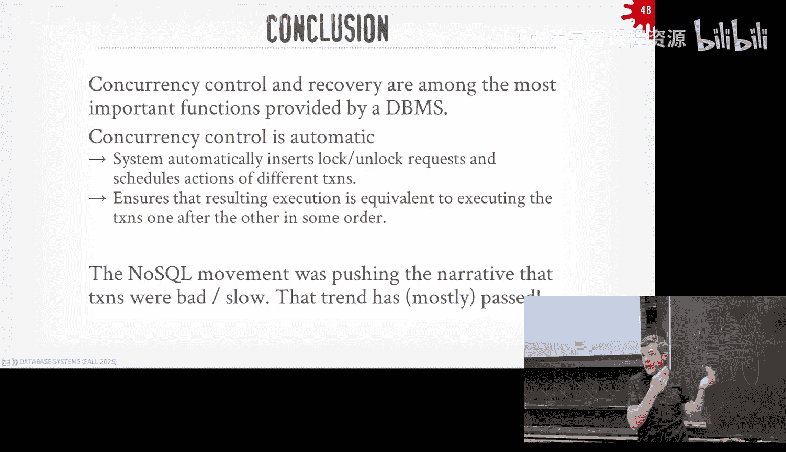
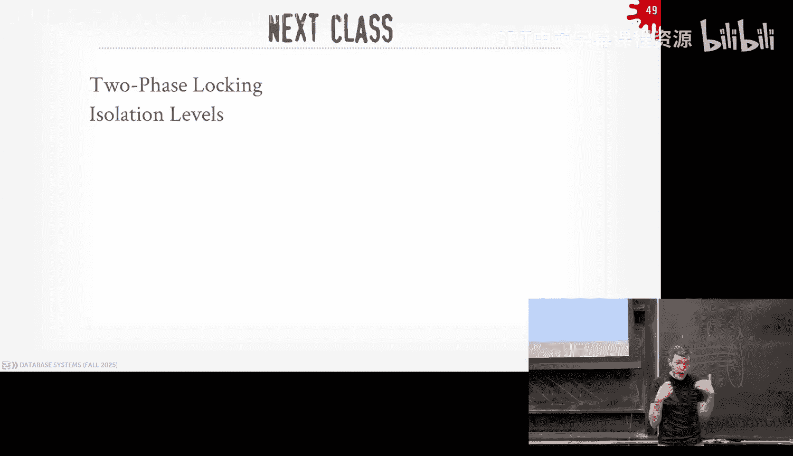

# CMU《数据库导论｜15-445 645 Intro to Database Systems (Fall 2025)》中英字幕 p17 #17 - Concurrency Control Theory (CMU Intro to Database Systems).zh_en -BV1bmHGzsETM_p17-

🎼给我我 still。🎼So明 check。🎼我我6块。🎼Think youall forgot what ran sound。🎼the air。

 still still let the man beach the。🎼。Any questions about Project three？Okay again。

 the recitation is available with the video， please watch the slides and then post on Piazza if you have questions All right in terms of database talks today after this class。

 we will have CMU Db alumni， Ryan Johnson he did his PhD here in I think 2010 and won the Jim Gray besttation award databases for Sigmma So he's now Databricks working on Delta Lake Delta Lake is gonna to smell a lot like the hoodie stuff and the iceberg stuff and the duck Lake stuff So it sort of in that sort of same space it was Databricks version of iceberg didn't get the adoption that iceberg had so they paid a billion dollars for iceberg as one does at your databases tomorrow at noon in the Gates building having somebody give a talk from Uber talking about the Apache Pot project they use internally sort of talk about the various things they tried throughout the years and why Pino was the right choice for the problems that they are trying to solve and that one will be food and that one's。

ownwn Gs and then a week now we're having the other database startup that Databx brought bought this year called Moon cake and this is iceberg using DuckDB。

😡，To connect to iceberg inside of Postgress。And again， all these are optional。All right。

 so at this point of the semester where we're at is that we've kind of we've gone up the entire stack right like we started off talking how how to read andw write things at disk and your buffer managers talked about how to manage memory above that we talked about how to access tables that we're storing in our buffer pool that are based in our disk manager then we talked about how to build the query engine。

 actually execute queries。😡，And then the last two lectures was about how do we take a SQL query from the application。

 convert that into an optimal plan that we can actually run and execute inside of our system。😡。

RightSo at this point of the semester， you know how to build sort of a first pass first implementation of a end end database system。

 taking SQL queries all the way down to data on disk。

 but obviously we're not done yet because we still have a few more weeks left in the semester what we've built so far is a nice database system but it's not suitable for production because it's not safe。

😡，We haven't talked about how if you crash， how do you make sure you come back and you don't lose data。

 we haven't talked about if you have two queries trying to update the same thing at the same time。😡。

How do you make sure that's safe and reliable so that's where we're going on at this point of the semester for the next three weeks and we're going to talk about concurchia protocols and recovery management right and the reason why we don't really show that in this sort of the stack hierarchy that I was showing before beginning the semester is because these concepts and these components are going to overlap and be intertwined with all the parts of the system。

😡，So the bufferable manager you bill for project one had no notion of transactions。

 no notion of whether it saved the right data at the disk， like when your eviction policy。

 al go on the ran， you just said， all right， this page is not dirty or I can throw it away or this page is dirty。

 I'll read it out the disk。😡，But we'll see as we go along。

 there's actually another notion of safety we have to be aware of to know when there's actually safe to actually write that data。

 so if we end up crashing， we don't come back with an invalid database state。

 we don't come back with corrupted data。😡，Right again。

 what if a two boat touches two pages for a single update and only write one of them and not the other one。

 How do I make sure that， you know， I don't come back and see a torn right。

So that's where we're going next。 And so we'll start off with concur your protocol。

 That'll be today's class all this week and and a little bit next week。

 And then next week we'll pick up on。I should take it back K it's so important。

 it's the next two weeks and then after that we'll do a week of recovery management again。

 how do you crash make sure you come back and everything is still there I'm just trying to emphasize it like again。

 these these these things we're going to start talk about next are all throughout the rest the rest of the system sort to go back and revisit some of the things that we've talked about already and say how we then infuse the notion of transactions and correctness inside of them okay。

😡，All right so what do we talk about now right so we've been sort of been talking about these SQL queries of far investor and we've really sort of focusing on doing sort of not so much simple things。

 but the scope of the data that they're accessing or modifying is sort of limited to like one query like yeah。

 I can do joins or subqueries in a single query， but really when it comes time to like updating things and modifying things。

 we've been focusing on sort of really simple operations like one operation at a time So now we need expand our discussion and our vernacular to understand what it means to start doing more complex things inside of our database system。

😡，So here's a typical sort of application somebody might want to build for like a bank right where I keep track of like how much money somebody has in their account。

And so on the other side here， where I'm showing this is the application code that someone would write to build a bank application against a database。

😡，Whether this in Python， PhP， Java， Ross， it doesn't matter。

 like the high level concept is what we care about。😡，So say I want to do a bank transfer。😡。

And so I'm going to access object A， read object A， so that's somebody's bank account。😡。

And I'm first to read how much money I have in that account。

So the application will get back now the balance at $100。 Then if I'm going to transfer $25。

 I got to make sure that this account has sufficient funds to do that transfer。

 So I'll have a client side check that says you know is this account have $25。If yes。

 then I'll go ahead and do the payment to some other account， like think Venmo， cash app。

 whatever does matter。I'm going to pay $25 somebody to somebody many other account。

 But then now I need to deduct $25 from account a， to take the $25 out。

 And then now I have this new balance of $75。 I want I want to write this back now to the database system to now reflect that I've transferred $25 out of this account and send it to somebody else。

Right， pretty straightforward。So the question we're going to try to deal with today is what happens if the database system crashes？

😡，Before I update the balance。 So I've sent the $25 put of another account。 and then now I crash。

When I come back， what should be in the bank account？my account and then also whoever I paid。

 how much should be in their account？哎。Another example is to say run the same same sort of application code again。

 but this time， for whatever reason you and your best friend。

 your roommate share bank accounts and you both want to pay somebody $25 at exact same time。

 So on the website on on the system in the application side。 you're gonna run the exact same code。

 but it's gonna run at exactly the same time So're gonna to have sort of two threads or two instances。

 all this application logic running at the same time， either the same machine。

 different machine it doesn't matter because the database is keeping track of how much money is there So they're going to do all the same steps。

 go get the current balance we have $100， check to see that at least we have $25 to send it。 Yes。

 we do then go ahead and pay that $25。😡，Now update the bank account with the new balance。

$75 and then now try to write this new balance back to the data system。And now obviously。

 this would be bad because if we allow this to happen， whenever the broker trying to update with $75。

 but they both sent out $25。So the real account balance should be $50。

But if I let them overwrite each other， then I'm ending up with incorrect state of the database。

this is talking about concurrent access there's sort two main issues we care about if we crash and come back。

 how to make sure that the state of the Davis is what we expect to see and then how do we handle two transactions。

 two or more transactions trying to update the same thing at the same time。

And so this is what we focus on today when we talking about conferrenial protocols。

 it's the mechanisms that the data system is going to implement to prevent all these problems from occurring。

😡，All right， so let's think of a really easy system we could use to solve of this。😡，Right。

Say that we have in our database system， we only have one worker that can only execute one query or one transaction at a time。

 let let's say one transaction。😡，So that means that when the application sends requests。😡。

We even though if there may be multiple multiple requests。

 it's only going to execute one of them at a time。😡，Think of a single queue。

And then now when a transaction begins to start updating the database。😡。

Instead of overr existing data that we have in our pages。😡。

We're instead going to make copy of those pages， think of again， sted page architecture。

 making copy of those pages。😡，And they're going to apply all their updates to those pages。😡。

And then when it comes time to commit， we we then just flip some internal mechanism。

 like the page directory to say， here's the new version the latest' information about those twos。

If the transaction fails or we crash， then when we come back and those pages they were from the uncommitted transaction。

 we just ignore them and clean them up。😡，So is this proposal correct？

Well there's guarantee that I don't have the two problems I have before where I crash halfway through the transaction。

 I end up with invalid database state， and this does also prevent me from having two transactions。

 two more transactions updating the same record at the same time。Yes what， yes， it is correct。

 Is it safe？Well， except for like when you write the little part when you write this like section you're happy with your new copy and you go write it a statement is when a transaction commits that's the happy part when you're happy that you made your changes and you go ahead and commit you're saying there' there's a small sort of small window where。

You may not be able to flip over that and say you successfully completed the transaction。Well。

 like if you're sure you' writing into this and then now it like it breaks like all you。

 Well when we say when when you're currently writing this， I we made a copy of it， right。So。

 we're updating the copy， not the original。Yeah， but statements you have to save the copy in the back of the。

 what if we instead just update a single page that says here's the latest version of those pages。

And we can do that autoically。Okay， it works meaning it's safe and correct。

Who agrees with that is safe？who agrees that it's correct？

RightFor those who don't think it's safe or correct， Do you think it's not safe or correct。

 You just don't know。 It's okay， do not know。Who here says this is a terrible。

 sorry says this is not correct and or not safe。😡，O。Well， you're all correct。

 this is correct and safe。Do we think it's performant？😡，No， why？Because you copy everything in。Well。

 yeah， in this case here yes， we're copying the hard database， you can be a more fine grain。

 if I don't at two pages， I don't at those two pages， you can do that。你个来证实。

He said you don't have accuracycur correct， yes， that in this world。

 you can only allow one transaction to update the database at a time because there's that little piece at the end where you flip and say here's the new pages that needs to be done atomically and it can only allow one transaction to do that at a time。

😡，So yes， so this technique here is called shadow paging。😡。

And we'll cover in more detail this is basically what IBM did or not basically it is what IBM invented in the 1970s when they invented the early concept of transactions like Jim Gray。

 the guy we talked about before， he won the touring award in the 90s for all of this transactional stuff that we'll talk about here。

😡，This is what they did in the '70s， they abandoned it later on because of its performance reasons。

 which we'll cover in more detail in the next two classes or so。😡，But this would work。

This is kind of what SQL does too if you switch on。

 they have a special mode switch on a shadow paging， they'll basically do this。Right。But as we said。

 like if you only allow one transaction run at the same time。

 then you're sort of not getting the full parallelism you want to have in your database system。😡。

So what we really want to do and what the next couple lectures are trying to solve is how do we allow for multiple transactions to run at the same time simultaneously and interact with the database。

 either reading or writing with it at the same time。😡，I it's sort of obvious why we want to do this。

 we we' want to take advantage of all the additional parallelism we have in modern hardware。

 like more CPU cores， we'll eventually we'll talk about single node systems now。

 but we'll talk about distributed databases in a second。

 same idea applies if I want to go multiple go across multiple nodes。

 that'll get me better parallels and better scalability。😡。

And it'll appear to the end users that the data system more responsive because I'm not submitting a transaction then waiting maybe a second for whatever transaction that was queued up in front of me to finish。

😡，I may have to still do that in some cases and it may end up aboardting if I try to write something that somebody else has already wrote to。

 but we'll cover that means in a second， but in general this allows to route。

 allows us to get the better performance for in our system because we're taking more advantage of the。

😡，Of theum。Of the hardware that's available to us。But as I was sort of saying before。

 it's great to be fast， but we also want to be correct and actually in database systems。

Usually you want to care about correctness first and then performance later。😡。

Because it's oftentimess very hard to。Build a fast system and then go try to graph。

 make it correct later on， you're better off building a correct system first and then figuring out how to optimize it without relaxing those correctness guarantees。

😡，And this is super hard。 There was a bug found in Postgre's implementation of this like two or three years ago。

 Postgre has been around since the 80s。Since before， most of you guys were born。

And they're still finding， know errors in these protocols is that it's super hard to do。Fairness。

 we'll talk about a little bit about that and we talk about two days locking next class。

 but this is giving the know making sure that no one transaction or no one application is starved out indefinitely for trying to get access to the data。

 but again we'll cover that when we talk about how to break deadlocks next class。😡，All right。

 so what we're trying to do here is we're trying to allow for an arbitrary interleaving of operations against the database。

 so read&Write operations， but during this process while transaction is running。

 there may be moments in time where the database is actually inconsistent。😡。

He the Davis is actually incorrect。Because you kind of have to be to make apply some changes right。

 but that's okay as long as those inconsistencies don't persist after a transaction commits or after a transaction is a board because a restart right those things are bad that's what we're trying to avoid but during transaction execution like going back to my example here。

😡，When I took $25 out of this bank account， ignoring the running in parallel。

 and then before I sent $25 to somebody else， and then before I took out the $25 in my account。

 there's technical an extra $25 floating around in the system。😡，We're talking nanoseconds here。

 potentially， but in that case here， it's technically it's incorrect because there's $25 more than it actually should be。

But that's okay， right because we have to do that because we can't just do magically apply changes atomically in one instruction at the level we're talking about here。

😡，So that's what I mean by the temporary stuff that it's okay。

 but we have to make sure we don't let things persist forever。

The other important thing to understand too when terms my transactions here is that we only care about we being in the data system。

😡，We only care about what's in our purview of control in our database system。

 so to mean by that is we can only handle the Read&Write operations on data that we manage that we have control over。

😡，If the application does other stuff。😡，Like send a confirmation email or like launch a missile in the middle of a transaction and then our transaction of needs to roll back we can't roll back that email roll back that missile right because the data system not yet at least doesn't control everything in the world so anything outside the scope of a transaction the readWrite operations we're talking about the data that we manage。

😡，we can't revert those things， so there may be inconsistencies in the real world。

 but the distance doesn't nobody doesn't care about it。😡，好吧。

All right so in order to understand we got to start defining what we mean by you know database and objects and what the transactions are actually doing so for today's class we're going to simplify the problem and not talk about tuples or pages or indexes or rows。

 anything like that we're only to deal with abstract objects we'll give names ABCD it could be a tuple could be a table could be a database it doesn't matter all the protocol stuff we're talk about here today and going forward we'll still work in this you know with this sort of this sort of abstract notation。

😡，The other important thing to understand is that。We're going to assume for this class。

 today's lecture that the database is going to be fixed size。

 meaning all the objects that we care about， ABCD， whatever。

 they're going to exist before transaction starts， and they're still going to exist after the transaction starts。

 we're not worried about inserts。 we're not worried about deletes。😡，Those complicate things。

 and we'll have to handle that next class。 Today's class。

 we assume that these objects are early them。 We can update them。 We can read them。

 but we can't delete in certain ones。So now we're going to define transactions as a sequence of Read toW writeite operations on these database objects so I can read A or I can write A。

😡，And。We'll define that when a transaction starts when it invokes begin。That's in the SQL syntax。

 I think sometimes sometimes they might support start， but begins usually what people use。

 and they will say that a transaction finishes either when they call commit。Or rollback or aboard。

rollback and a board are the same thing that I know you can do in SQL for either one commit means like save all my changes。

 apply them to the database and rollback says undo anything any rights that I've done and make it as if I didn't do anything。

😡，对了。So the notion of correctness we're going to have for our transactions are going to defined by the acronym acid。

😡，Who here has heard acid before？All right， almost half， perfect。

So now we're to go in more detail what each of these are。😡。

So asset stands for aity consists of the isolation and durability。😡，And in full disclosure。

 adity and isolation and durability， these will be easy for us to understand today we're going to focus mostly on isolation consistency is kind of a weird one。

 it'll make more sense when we talk about distributed systems。😡，But we'll cover it as we go along。

So advocacy just means that for a given transaction。

 all the operations that a transaction invokes or executes。

 either they're all going to occur or none of them are going to occur。😡。

So I can't have any partial transactions。RightSo you can think this is like simplifyim it's all or nothing。

Consistency means that。It has to do with like correctness。 So like。

 if the database is currently consistent or correct and my transaction only does consistent things。

 then when a transaction commits， my database is guaranteed to be consistent。

That doesn't mean anything like Pi doesn't mean anything to you guys either， right？Again， and。

 and when it's a single node system， it's it's kind of hard to， to。Discuss。

 but like with distributed system， another way thing about this is if I write to a data object a on this node here and I go to commit。

😡，I can immediately reflect those changes on all other copies of the data on other nodes。😡。

Immediately。They say it's physically impossible no。Depends on who's tracking again。

 we'll cover that later。Isolation is the idea that a。

That a transaction is going to execute as if it has the complete access or is the only transaction executing at that given time or the database system。

 meaning you can't see rights from other transactions at the same time because you wouldn't see that if you were truly isolated。

😡，And the last one， durability just means that if my transaction commits。

Then I'm guaranteed that my changes will survive no matter whether like the machine catches on fire or another you know the system crashes。

 the OS crashes right obviously the machine catches on fire and your disc melt like then you potentially don't get anything。

 but the way you handle that it's replication now you tell my distributed systems and then again we'll cover that later right I may even hand it hand trying to like do baby steps into this to understand how we're actually going do this on a single note and then we'll expand upon expand it on a multinode system。

😡，So again， adimacy isolation durability pretty easy to understand the German guy。

 the 1980s that sort of coined this moniker acid he kind of shoehorned consistency in there because like he was trying to make it sound nice like acid rather than aid and then he was trying to make make a joke against his wife this is the story goes I've never met the guys I don't know that his wife didn't like sugar and sweets so he called her an acid woman so that's why he got he had to get the sea in there to make it all work right。

😡，But again。again， we won't talk about much today's class or when we talk about the country protocols。

 but it make more sense when we talk about distributed systems。😡，是。All right。

 so today's guys want to go through each of these concepts one by one。

 I we'll focus mostly on isolation because that's going to be the most important concept in all of this。

😡，嗯。All right， so。For the case of aacy transactions as I said before。

 we don't want to allow partial transactions， so there's only two possible outcomes when an application starts a transaction in our database system。

 it's either going to commit and have all its changes apply to the database or it's going to get abort and rolled back。

😡，And have all its changes reversed。 So as if it didn't even execute at all。

And one important concept that we focus more in next class is。

The this rollback process could either be initiated by the application itself。

 like the application could say I don't like what I'm doing， abort my transaction。😡。

Or the database system can say， I don't like what you're doing。

 I'm going to make you stop and import your transaction and roll you back。😡。

And in your application code， which is again outside the data system。

 your application code has to be able to handle that。

 So if you start a transaction in your application。

 you have to be you know catch the exception that he may get aborted and it's up for you to decide whether you want to retry it or not。

😡，The question is， can a single query aboard， sure， why not？Yeah。I whether that's true or not。 Yeah。

 you could， you could say。Oh now're getting the weeds， so it depends on course your protocol。

 you could have it like try to update something that another transaction tries to update at the same time and then therefore you block and wait。

And then you might time out and get aborted。Right we can do examples as say and then depends on the isolation level。

 we'll cover that next class， right， it gets complicated。But in general， yeah， it could。

 A single statement transaction is still a transaction。So it was every part。

The the statement is implicitly every query is a transaction， yes。

 so when you open up Postgres today and you write a query。😡，It's going to run。

 going technically runs， begin to commit around it， even though it's runs that one query。Yes。😊。

It's called a。You can turn that off so you can do an update， update， update。

 and without calling begin and it creates a new transaction。

 but least you have a call commit or roll back at the end。

I I love transactions they're like super awesome， they're super hard so I get excited that's why I'm like riffing on everything he's asking about because like we can give demos and give it's all awesome it's great and it's really hard too even though it's a old topic。

😡，Okay， so。Again， so I said the data system guarantees to the applications or that your transaction will be atomic。

 either everything's going execute or nothing's going to execute。

So there's two high level ways we're going to be able to provide this guarantee。😡。

The first is going to be through logging and this is the most common approach that most systems use and it's challenging because the term log has a much of different technical name or usage in data systems right。

 you think of like a debug log， you just printing out printf statements。

 we saw this before with like wall structure mergery kind of the same idea。

 but it's basically a record in the ledger of sort of an ordering of here's all the operations that a transaction made applied to the database system。

😡，And we can either store this as in a separate file， like a redhead log file。

 which we'll cover in a few weeks， or we can actually have the database itself be like the log of Mer like have that be the log we're using to figure out what transactions actually did。

😡，So in this log we can keep track of all the actions that occurred and also redo information and undo information。

 so undo information would be like how to reverse the change that they applied and the redo would be how to reapply the change。

😡，We're actually going to end up needing both of them。

And we'll have to maintain this undue log in memory as transactions start making changes。

 and then we'll see this in a few weeks but。😡，And our B manager。

 we're going to have to make sure that when we flush out a dirty page that's been modified by transaction。

 we got to make sure the log record that corresponds to whatever that makes that page dirty。

 that's got to get written to disk first before the page that got modified gets written to disk。😡。

And that simple ordering is going to guarantee that we can crash and come back and restore the data of the database correctly。

There's the slight recorders or black boxes in airplanes that keeps track of like here's all the things that are occurring in my system right before the crash and they've recovered that to figure out why the plane failed same thing in our database system it's the black box recorder that keeps track of here's all the changes that are occurring some of them have written a disk。

 some might be in memory， but at least when we crash come back we can look inside that and figure out what was going on to put the database back in the correct state Yes。

少。The question is the question is， what are we logging？😡，And then the choices are。

 am I recording like a snapshot of the record， like the TupL self or am I recording like what was the change？

😡，It depends on how you implement it。The answer is both do both。So his question is。

If I'm recording the aggregation。Like as an update query or。The statement is， if I sayy。

 I do a select where I get an aggregation， and then I update some of the record with the corresponding aggregation。

So the log will be ordered such that when you recover it。

 you can go back to the previous day of the database and replay that transaction and I actually don't care about the essentially I don't care about the aggregation。

 I don onlyt care about what's the final computation that I put in the database as long as that occurs in the same order the first time it ran that I'm okay。

😡，So that's getting hairer cells， that's called physiological logging where I'm recording the actual changes。

 like the byte level changes like a diff and gi。😡，You can do logical logging where it's actually the query itself gets logged and then you reexute the query。

 so the query took an hour to run the first time when you recover the log。

 it takes an hour to run again， but sometimes that's okay because if I'm doing really little fast things it's actually faster for me。

😡，So like we'll get to that in like three weeks， but like the answer is yes。

 this thing is being ordered with all the changes that are getting made so that if I crash and come back。

 I just replay the exact same order and I am guaranteed you to get back in the correct database date。

😡，は。All right， so we want to do this for efficiency reasons in some cases。

 because it'll be faster for us to write a sequential log out to disk rather than random IO for pages。

 that's the same argument we saw with the log structure of mergery architecture versus like the HeAP files or the slide of pages。

😡，But again， sometimes people also keep track of these logs around forever or at least seven years。

 like if you're a financial firm， you got to keep track of every transaction that Em's ever made for seven years if you ever get audited by the regulators。

 and so this log information can use for that as well。好到有一个。veBe the key。佢被觉得 on these。

The question is， again， it's related to his question。

 what am I recording my log is that the actual operations I did or like the byte level changes。

 it depends。😡，For undo， you'd have to record what the previous value was。그是。You know， if it's like a。

If you're recording like update。Update value plus one， I have to know what the previous value was。

Again， like depending on how you're replaying the log， you may need that previous value， you may not。

We're getting way ahead but snapshotts is the way to handle your problem， if you don't have the undo。

 just go back to the previous version and replay the same order。😡，Again， getting way of ourol。

 you guys are again， you understanding like this thing could being replayed so we can put the is back in the same state。

The other technique is what we already talked about at the beginning， the shadow paging， again。

 this is where you make copies of pages that allow the transactions to update those copies instead of the original versions。

😡，And then when they go commit。You just flip pointers and say。

 here's now the latest version of the pages。😡，Yes， to the back。那第其实是。Yes。

The front hell log will be expensive， is？All right， so David it is。

Can I briefly discuss like run what's the performance of these two approaches and there's two notions of performance。

 there is no more operations when I'm running transactions and then there's if I crash and recover。

 how long does that take？😡，Most people， most places care about the normal operations。😡，He say， oh。

 my Davis's not gonna crash that often。 So I want to run as fast as I can。 And then yeah， if I crash。

 then， I'll pay that penalty me So the。The right ahead log approach is actually faster at runtime for normal operations because I can just append to a log and write that out sequentially。

 right？😡，Now， when I crash come back， depending on how I， when I'm storing my log。

 I got to replay it。 and that could take。Hours， potentially， worst caseing their days。Right。

Where in the case of shadow paging， it's going to be slower at runtime because I got to make copy the page and then apply my changes and then update up some pointer to then' point to the new pages。

😡，But when I crash come back， it's super fast because I just ignore all my shadow pages because those transactions didn't commit and I come back and my data is instantly in the correct state。

😡，So again， most systems are going to care about the normal operations and choose a right ahead log approach。

😡，There was one system in the 1970s， I forget the name of it。

 it was actually built by the Puerto Rican Power Company。😡，And it was like， I no。

 the '70s of Puerto Rico， the infrastructure was not that great， although it's not much better now。

 but so they had a database system and they were sort of keeping track of like the usage of various customers。

And because they were having all these power outages that they chose a shadow paging approach because three times of the day the power would go out。

 the Daviss would crash and you don't want to spend an hour waiting for the system to come back online。

 the Davis system to come back online after a power outages because it might crash again。

 so they chose shadow paging because when they would crash which is unpredictable when they came back。

 they could have the Davis instantly available， so they were choosing slower runtime performance in exchange for a faster recovery。

😡，But most most people are going to choose the opposite。So the very few systems do this today。

 again again， system， IBM did this and systemR in 1970s， but when they built DB2。

 they switched to righthead log， the previous slide。😡。

I one of the most famous ones doing this is LMDB。 and this is。

He's the opposite of me like he loves Mm and he loves shadow p and that's what he uses。

 I think Kchi B still does this。 It was an early key value store called Tokyo cabinetbinet from 10 years ago that was doing this。

 but in general， like I guess。😊，said many times semester， you don't want to do this。

 Right hand logging is always going to be superior choice。

 and there's tricks to make the recovery actually go faster。

It dependspends on how much you want to take snapshots and so forth， like like in general。

 the right hand logging is going to be the superior approach。part my long report actual point。Yes。

 and yeah， I'm leaking。😊，I'm leaking ideas coming ahead， yes， I should just say logging。

 but in actual reality you call this right ahead log the idea is you're writing the changes you make to the day is to the log first。

 then you update the actual data base itself that's the right hand logging yes。😡。

What happens when you wrote a blog。Before you did change as a crash。The question is。

 what happens if you write to the log that gets written a disk？

And then before the changes to the actual data gets， well， if you crash， come back。

 you replay the log and you come back。And you want to roll back？

You can't roll if you say commit so there's another issue too we understand。

 so if my application tells my data I want to go commit。😡，I may crash。

Before I get the acknowledgecment that my transaction committed。And that's okay。

 so meaning like I you tell me to commit， I commit your transaction and then now I'm about to send you a message。

 hey， I got a good job right， but then I crash before you get that message。

 that transaction is still committed and it's your job to go figure out whether they're actually committed or not。

We can' can't we the data system， and that's still correct。

Right so it only starts writing the log after we're getting ahead。

Some systems will we keep everything in memory。Some systems will actually write things a along。

 You want to write things sorry write the log at the disk。

 You want to write it out the disk because that that means if like if I have。

 if I need to update a billion pages， but I I only can keep 100 in memory。😡。

Then the right head log is how I'm going to be able to handle that。

If I have to keep everything in memory then I can' do can't keep everything in memory。

 so it's okay for me to write the log out the disk before I finish orm commits。

 but as soon as I I'm told commit， as soon as on disk it lands a commit message in the log。

 that transaction is committed。😡，Okay， but then it's also that like in the middle of a transaction。

 you start running log。 Yes， good days。 Yes， then before you actually did the changes to the data you crash。

Yeah，those logs are actually written no so the statement is it may be the case where my transaction is updating the database and I'm writing to this log and some of those log records are getting written disk and he haven't told me to commit yet right so haven the application hasn't told me to commit and then I crash。

😡，比肉干。Correct， the log can help us do that' All right so there's the log and then there's the data the log tells me what I what I was trying to do to the data So when I crash and come back I go look in the data and say did I actually make those changes yes or no and if I did and they shouldn't be there I had to roll them back。

😡，Yeah， this gets very hard， is very complicated。 The answer is yes。

 we'll spend whole one whole lecture exactly that problem。Yes。😊。

Because then you got to worry about like my law grows forever。

I don't want to run my Davis for five years and then crash and have to replay the log for five years。

 So what do you do， You take checkpoints or snapshots so I can truncate how far back in the log I got to go。

😡，But what happens if an I transaction started？I take a checkpoint and then this transaction finishes and now it spans checkpoints。

 how do I handle that？はいす。ちと正解。How the statement is again。

 we're getting ahead of it the save it is and I like this save it is well just don't take checkpoints when transactions are running。

 but checkpoint takes say half an hour do want my website to be down for half an hour now？😡，Right？

And in the financial world， those guys are paranoid， they take checkpoints every five minutes。

So we'll talk about how do you allow transactions to keep running while I'm taking checks。

 they're called fluzzy checkpoints。😡，It's hard， it's awesome， yeah。啊。And there's this book or sorry。

 another book。It's been a whole class on the algorithms called Aes。

 it's developed by IBM in the early 90s， it's 75 pages。

 it's like that's the Bible and how to make sure your database is fail safefe。😡，All a single node。

 again， if the machine catches on fire you're screwed there， then you just packos a raft。

 whatever to span things out across multiple nodes， we'll get there， we'll get there。😡，Okay。

 don't do the shadow， right。Because this is see this thing， right， so again。

We're trying to say our database is trying to model the real world。

 so we want to make sure that we don't allow for transaction middle natural transactions to make changes that would violate。

You know parameters or aspects of the real world so for example。

 if I have a database of keeping track of everyone's age like its a single integer。

 I don't nobody can be a negative age right so I want my data system to not allow that and therefore if a transaction tries to update know someone's age record to say now they're negative 100 years old the data would should not allow that because that would be an inconsistency of the database right so this is not something a data system can do for you automatically doesn't know what it means for someone to be a negative age or it's just storing integers so these constraints or things that the application has to tell us。

😡，Either through like the ad constraints or like when you create the table， you can call it check。

 not nu is another obvious one， right？So these are all it has to be told these constraints ahead of time。

 and the data system， if it's wants to be consistent， has to。😡。

Enforce them to make sure that no transaction actually can update the database in a invalid way。

 right。So you may have heard the term of event consistency。😡。

This is we're getting ahead of ourselves a little bit。

 but this is when we start talking about multiple nodes， like distributed systems。😡。

So venture consistency means that if I have a copy of the data， that's replicated on， say。

 two machines。😡，And so when my transacting modify something on one machine and I commit？

That change should be immediately reflected on the other machine if I want to have consistency guarantees。

😡，So that means if I commit here and I immediately try to read that same record on another machine。

 I should see my own right。😡，Eventuallydtual consistency basically says， well， this is hard to do。

We'll have two copies of the data on two machines。 And when I update the one machine here。

 I'll eventually update the other one。 So there's a window。

 a small window where I may do a commit on this node。

 then go try to read that same record on another node and my change hasn't been propagated yet。

 So therefore I see the older version。😡，Right。This is what people did in the well this was the hot thing out of Google in the 2000s。

 but we'll talk about this in the class， like they basically said， oh。

 that was actually a mistake because。Now you have a bunch of JavaScript programmers trying to reason about inconsistent。

 incorrect data， and that's never good， right？😡，So most of the modern transactional systems don't do this。

 we'll cover this briefly and see how to not do it later in this semester in lecture 23。😡。

What is what？Integrity constraint， sorry。Right like not null is integrity straint。

 check that no age is greater， no age is less than zero， those are integrity constraintss。Thank you。

 I shut it up。All right， so the main one I want to talk about is isolation transactions and again。

 this means that when application submits queries submits transactions to the data system。😡。

They're going to assume that they're running by themselves。

 so they're not going to see weird intermediate states from other transactions modify the database。

's going to be as if it's running in serial order。😡。

And this is a good thing because this is a way easier programming model for your R application developer to reason about。

😡，Right， think of like。Javascript programmers right like you don't want them to start thinking about okay what if I update this and another guy updates the same thing at the same time。

 how do I handle this if you just assume I'm going to run in serial order then you don't it says if you're running on a box by yourself right but as we already said we want to be able to interleave these operations from these transactions at the same time。

😡，So that， you know， we get the better parallelism and get the better performance。

But we still need to make sure that they're going to run as if they were running one at a time。

 even though they're not。So this is what the conio protocol is going to provide for us in addition to the logging and all the other stuff it's sort of the whole big picture。

 but this is basically the coordination mechanism inside of our data system that we're going to use to figure out what transaction can run at what time。

 what data are they allowed to read and write and then when they go to commit。

 are they allowed to do that or not。😡，There's other things like we'll talk about next class how to handle deadlocks or either breaking them when they occur or prevent them from occurring。

 that's next class， right？Well， in general there's basically two approaches to this right which I just sort of said right there's be pessimistic and optimistic concurial protocols。

 pesteus says that I think sorry I assume you're going to have conflicts with other transactions so I'm going to prevent you from doing certain things to avoid avoid these conflicts trying to stop you from doing something wrong ahead of time。

😡，Optimistic assumes that the conflicts are rare I mean two guys two transactions trying to read and write to the date at the same time。

 same date at the same time， so I'm going to allow you to do whatever you want。

 but then when you go to commit I'll go figure out what you actually did and go to clean things up。😡。

他。So let， let's look look， let's look at an example here what of， of。

How can you allow this interleaving and what does it mean for things to be correct a correct interlea？

So again， we're doing same bank application， we have two accounts， A and B， and each one has$1。

000 in it。So transaction T1 wants to take 100 out of A's account and put it into B's account。

 and at the same time we have another transaction T2 that was to compute 6% interest on the accounts and give them a bump on the money。

 right？So we want to see how can we inter these transactions at the same time to improve the performance of the system reduce the total amount of time it takes to execute them。

So the first thing we understand is what are the possible outcomes we could have for interleaving these two transactions here？

😡，The answer is a bunch。Right mean they're not doing that much as only transactions。

 They they're only two objects。 So it's not， you know， it's not infinite， right。

But for this application， the thing we care about at the end is that there's no money missing and there's no extra money that shouldn't be there。

😡，So the easy way to think about it is if I just take the two accounts， they both have 1，000。

 so I end up add them again I get$2，000， and then I compute 1% interest on them or take 6% interest on them。

 the final say of the database， the total amount of money I should have in my database should be 2120。

😡，So in important they understand in this world database systems。😡。

At least what we're talking about here today。That it doesn't matter whether T1 is submitted first。

By the application and then T2， we're allowed to execute them in any order that we want。

So the order of their arrival on the box doesn't matter。😡，We can still order them you know。

 in any way we want to try to get the best performance。😡。

There's an if you care about those things that's called strict consistency or external consistency。

 very few systems support that Google Spanner is probably the most famous one。

 that Google Spanner will guarantee that if the application one application submitits T1。

 and then like a half a millisecond later， another application submitits T2。

 it'll guarantee that T1 commits before T2。😡，To simplify a problem today。

 we're allowed we're not going to guarantee that。 we can still reorder them。

But the outcome we get we want in order to make sure that we have this 2120 number at the end。

 is that whatever interleaving we come up with， we want to be as if they executed in serial order。

 meaning one after another。So that means that there's only two database states。

Either I run T1 first followed by T2， or I run T2 followed by T1。😡。

And I may under different values for the accounts from A and B， but again。

 if I just add the total amount for each of them after the transaction is committed。

 I still end about 21，20。😡，So either one is correct。

 no matter how the transactions are submitted by the application。😡。

AndThat's a different notion than maybe be thinking about correctness if you're running on like you know a single node parallel system like strict memory orderings right in this case here。

 the data system is given freedom to reorder this anyway at once long as it appears as if the transactions executed one after another。

😡，Right。So again， the two possible serialorings are T1 executes followed by T2 or T2 executes first。

 followed by T1， and again， if I just look at the final outcome of the state of objects A and B。

 when I add them together， it's owes to be 21，20。😡，The question is， what are again。

The question is how would I determine this algorithmically， so that'll be the con a protocol。

So today's class we're to talk about just identifying whether the ordering is correct or not。

 next class will be how do we enforce that， how do make sure that doesn't happen So again for this class。

 we're assuming that we're given the queries ahead of time or sorry the operations ahead of time and we so we had the schedule ahead of time So not we're not a transaction T3 showing up at this example here。

😡，In the back， yes。喜欢。The question is， wouldn't there exist some kind of requirement or criteria that would be the same across all sequential orderings？

The啥 I谁。こさ？这少。Yes。So her point is that I'm showing。

 I'm showing these people here then I'm saying A plus B equals 21，20。 And I'm saying that's the。

 we're using that to determine is the ordering correct。

I'm just using that as an illustration in this example。😡。

Right the things you would sort of really care about is like the values and the objects themselves right and then we'll see that when we look at what the operations are actually doing inside the data system。

 that's how we're going to end up determining whether the ordering is correct or not。😡。

For illustration purposes， I'm saying to make it more intuitive， a plus B equals 2120。

 and you can see for the two serial orderings， you always end up with that。😡，Right。Yeah。

 that notion of the higher level notion of correctness。No no one。

 you can't assume someone's going to give you that。Yes。😊，point。Please that。All人。Yeah。Al。

Thatist of that。你定个转年嘅个话时好以为。2。他么这个开决。是在是。这个你。Maybe raise what you're saying。

 I basically what I' trying to say is。嗯。That I want to interleave these operations in these transactions。

 and I want the end state of the database be equivalent to some serial ordering of those transactions。

😡，But there may be multiple serial orderings and I actually don't care which one I end up with long as this leaves one of them。

😡，So。So what would be a system that is not isolation compact。

What is a statement where it is isolation。So the mus examples。啊。

BecauseThe question to be like what's an example of a system that can't guarantee these things。

 a lot of them。So so let me go through serialerizability and then right。

 but I'll just say straight up like。Like when we talk isolation levels。

 you say basically I want to guarantee， for example。

 my transactions and equivalent to a serial ordering， some systems will lie to you and say， yeah。

 I'll do that for you and they actually don't do it。Orracle does this。 Oracle say。

 I want my transaction be serialerizable， you actually get a lower level than serialerilizable。😡。

And in Postgresses， theirs was broken for a few years and someone fixed it two or three years ago。

This is super hard，So that's look at interle a good example so why would' an interlea occur again so say like you the transaction tries to go fetch get data in a page and it's not in your buff pool you got to solve that transaction why you go to the disk and go get it and meanwhile the distance can decide I'm going let get something else wrong so let's say T1 starts it does take the $00 out of A and then it stalls because they have to go to disk and then T2 is a allowed to start A compute the interest on a but then it stalls because it's waiting for something too say the same page to read B。

😡，So then T1 can start again， put 100 back and be then commits and then T2 starts running and then can update compute the inches on B right so in this case here。

 even though I'm interleading T1 and T2， its equivalent to a serial ordering of T1 followed by T2 right and the key thing to point out is like the operations on A and B are older happening on T1 first before T T2。

😡，And again， just using this as a simple illutrator trick， you end up with the same state。

A batter in leaving would look like this。Where T1 starts。

 it gets paused sort of stalled for every reason T2 starts。All right so T1 takes 100 at a。

 T2 then computes the interest on A， then computes the interest on B and then commits and then T1 goes as $100 back to B right so when we look at some total value of the two accounts were missing 6 because the computer interest on A while this 100 was taken out of A but before it was putting in B。

😡，Right。So this is what we're trying to avoid， we're trying to avoid ending up with a state of the database for our objects that's not equivalent to any serial ordering。

😡，And again， for two transactions， it's either T1 T2 or T2 T1。

 but think of like if I have a million transactions， how might I come on bad ordering？Right。

So as humans， again in examples here， I'm just showing like8 you know a equals a minus-100 right I'm just showing this it's pretty easy for us to understand what's actually going on。

 But this is actually not with the databasees。 The database see this instead。 Again。

 we said all we have are read and write operations on single objects。 The data doesn't know。😡，Again。

 the high level meaning of what you're trying to do。

 it just knows whether you're trying to read a write to an object。So again， in this example here。

 it's pretty easy for us to look at and say， okay， well， this is bad right。

 and then I compute the sum and I see that I'm off， but how can we actually do this for real？😡。

And so we want to determine that we have a correct ordering or schedule for our transactions if we can prove that it's equivalent to one of those serial ordering that might exist。

😡，All right， so what does it mean to be equivalent what's a serial order or serial schedule so the serial schedule we already talked about just means that the transactions are actually one after another right and then we're going to say that two schedules of these transactions are equivalent。

😡，If the end state of the database is going to be the same as if it was executeded by the other schedule。

 so I can take any arbitrary interleaving of a transaction。😡。

Of the transactions and it come out another arbitrary interleaaving with the transactions and at the end say the database is the same then we say those two schedules are equivalent。

 even though the interleaving might be different。😡，And then now I've already said this before。

 like again leaking terms ahead of time， but we're going say that this notion that a schedule is serializable if that it is doing an interleaving。

But the outcome of the database is equivalent to some serial ordering。😡，OfOf those transactions。

Right。So this is again not as intuitive maybe as you understand computing and transactions and other areas。

 but the reason why we're going to allow this interleaving to occur and we only care about is it equivalent to any possible ordering or serial ordering？

😡，Is that it gives the days more freedom to identify more opportunities for parallelism to get better performance。

😡，If I can only ask you transactions in exactly the same order that you submitit them。😡。

Without interledaving things， then I'm ending up with a single thread of Q that we said before。😡。

Right。But if I can interleave them and have different notions of correctness。Then that's okay。

 and that makes our lives a lot easier。All right， so now we've got to say how do we identify whether it're actually equivalent or not？

😡，And I'll say what we're going talking about here is。In this world。

 we're assuming that the database is fixed size， and we have it obvious all ahead of time。

 and we're going to assume that we have all of the operations that each transaction wants to do ahead of time。

In most systems you don't have that right most systems don' know are not fixed size。

 they'm not mutable， so you can't allow insert deletes。

 but also most systems don't have all the schedules of the transactions ahead of time。😡。

So that's what the next class will be， how do I handle the case where transactions are spinningt queries。

 and I don't know what the next query is going to be。😡，For this class here。

 we're assuminging that we have ahead of time。 so we had to understand what does it mean for。

Transactions that have conflicting operations in their schedules。

So we're going to find a convict occur is if。There's two operations that are in both two separate transactions and either they're trying to do something on the same object。

 and at least one of them is going to be a right operation。😡。

So the thing we're trying to avoid are now called anomalies。

These are the problems that can occur if you're not executing things in serial ordering。

 so we're going to identify the anomalies that can occur so that when we start interleaving transactions。

 we avoid these problems because if we have one of these problems then we know that it's actually not going to be equivalent to a serial ordering and therefore our schedule is not serializable。

😡，So we're going to go through the three basic ones today， write read， or'm sorry， read write， write。

 read and write， write， why no read read conflicts。

Because who cares if whether if you and I read the same thing， who cares， right？

There's actually two otheromalies that we're not going to talk about today。

 but we'll cover in upcoming weeks called Phantom reads and write Ske Phantom reads of when I do scans。

 if I scan a range of data and then someone insert something or delete something within that range and I do that scan again and now the thing I saw before is gone and now I get in incorrect aggregation or whatever I'm trying to compute。

 that's called a Phantom。😡，Again， we'll cover that next next next class， how to handle that。

 And there's another anomaly called right S。 This one a bit more complicated。

 This when we do multi vigeoning。 This is if。Tuderens and actions are trying to update the same database at the same time。

 and they want to read what's in there and then update again， like an aggregation or something else。

诶。They may end reading the same database to state but then have conflicting rights。

 it's not exactly the same as right rightscue again。

 it's a bit more nuanced we'll cover this let me talk about multi versioning in a few more lectures。

😡，As as Im point out， there there's more stuff here other than these three here。All right。

 first one is rewrite conflicts， we're also called underpededal reads。

The basic idea here is that I'm trying to read something from the database。😡，In my transaction。

 and then when I try to read it again in that same transaction， I get a different result。😡。

So if transaction T1 starts， it reads $10 from object A， then now T2 starts， it reads $10 from A。

 but then it writes back $19。Then it goes commits， and then now T1 starts again， and when it reads A。

 it gets back $19。If I was actinging these transactions in serial ordering。

 this could not occur if the first transaction would read $10 from A when it reads A again。

 if it was running all by itself in serial order， then it should see $10 again， not 19。😡。

So we have to make sure we don't have this conflict。

The next one is right recon are also called dirty readeds。So T1 starts， does a read on A。

 then it writes a back as $12， but then now T2 reads a and gets the update from that T1 main。

 so sees the $12 that T1 put in， so then it writes back I don't know $14 right。😡。

But then T1 aborts and rolls back。But T2 is already committed。Again， when you go commit。

 you're telling the outside world all the changes you made， they've all been applied。But again。

 if we were executing serial order， this couldn't occur because T2 should not see the update。

 should not be able to read the update that T1 made because T1 has not committed yet。😡。

So we have to avoid this kind of conflict。你是保证这个来这个。最こに？

So the question is why is this a conflict or what's the issue？

Con is that we right of plus 2 and not absolute  for the slightly plus 14。呃。

The statement is like if there's high level semantics about what the read and rightss actually are。

 would this avoid the problem？Fumor slides will get there， yes， but in this assuming there's like。

 again， all the Davis knows is read and writes。😡，So in red A and the same on the application code there says if my balance is more than $10。

 then go put $2 in or something like that right so it read something from a transaction that had not committed yet and if you're executinging serial order you should not be able to see that change。

 that's what we care about。😡，Yes。那他对。Another transaction should only be able to。

Read a new and updated value of the first transaction permitted。

Am I claiming that a transaction should not be able to read an object from the database with an updated change？

😡，If， unless the transaction that made that change has committed， yes。

 if they were actually in serial ordering， yes。😡，Yes like。你咩到。The question is。

 what if a transaction committed in the middle of a node transaction？some。Section on that thing。Yeah。

We just cover that， that's this。That's the first one， sorry， that's the readwrite conflict。

I that's exactly what you said， I read a， did $1， this guy puts $19 in it， I read it again， I get 19。

 I shouldn't see that。All right， last one is right conflicts is also called loss updates。😡。

So I have two objects now， A and B that I care about。 T1 is going to write A， put $10 in。

 T2 is gonna to start， doesn't care about what's in A now， right， It's not reading it。

 just writes it。 So this is called a blind right。 So I'm writing into A， putting $19 in。

 Then now I'm going write B and put Bob in。 But then T1 comes along。 and it puts Alice into B。😡。

So my end of the database in this example here is's going to have $19 in A and Alice and B。😡。

And that's invalid， right， that's not if it was true serial ordering。

 it would be either $10 an Alice or $19 in Bob。Right。So we want to avoid this problem。

All right so this gets a little heavy here， but we'll go through it。

 I think figuring out conflict that eability is pretty straightforward。

 view of liability is a bit more nuanced。 So basically we want to say all right。

 now we have these schedules， we know what these conflicts are that can occur ignoring phantoms ignoring rights s So how can we check whether a arbitrary schedule is not going to have any of these things other than just us looking at them trying to mainly figure them out because that would be laborious to do and is not scalable。

So there's now going to be two different notions of serializability。

 remember serializable schedule means that it's equivalent to some serial order grant transactions。😡。

But now there's other notions of correctness to say something's actually hereizable The first one is the most common one call it conflict surizability and that's just figuring out where you have conflicts between these transactions。

 there's another notion called viewerizability which is if you understand the high levell semantics of what the application actually wants to do with the data sort of what he was proposing where it may be okay that you have conflicts because in the end it doesn't matter。

😡，So。Any system that's going to do transactions is going to give you conflicts sports serializable transactions or serializable ordering is going to do conflict serialerizability even though they don't call it that that's implicitly what they mean view serialerizability is a more complicated notion because you you need to actually look in the application code or maybe even talk to the human which is the worst thing to do to ask them like what does it mean for things to be correct There's even other notions of correctness and serializability that we're not going to cover in this class and there's a whole sort of event diagram what we'll cover but these like。

Conflict Accessability is the main one， you to see， I'll show briefly because then again。

 you'll see how to sort of handle the one case that he brought up。

All right so now we're going to say that two schedules are conflict equivalent。

 if and only if they are going to be involved the same operations on the same transactions and we're going to be able to identify that the ordering of those operations on those objects will occur in the same way。

😡，So now we're going to say that a schedule is conflict surizable。

If it's a conflict equivalent to some serious schedule that puts the Davis in the same state。

So me standing up here and looking at text and being hand wavy doesn't help so let's look how we actually can compute this in the real world。

😡，So we're going to compute what's called a dependency graph。

 I think Wikipedia might call them precedence graph， they're all the same thing。

We now we're basically going to have a node in this graph for every single transaction that we have running in a schedule。

😡，And then we'll have an edge between those two nodes if there's an operation that is in one transaction that conflicts with another operation on another transaction and the other operation occurs later in the schedule。

😡，So the thing we care about， if we end up with a graph that has no cycles。

 then we know that our graph is conflict serializable。

 and therefore it's equivalent to some serial ordering。

 if we have a cycle then we know that it's not serializable。嗯。So we go to an example here。

 so T1 is going to read A， write A， read B， and write B， and T2 is going to do the exact same thing。

😡，So in the first case here we have a write on A that occurs before the read on A in T2。

 therefore I'll have an edge from T1 to T2 that corresponds to this conflict here。😡，likewise。

 I would have a write on B followed by a read on B。

so therefore I have an edge going in the other direction。

 so now I don't have a cycle in my dependency graph。

 and therefore I know I have this thing's not conflicts and advisable。

I'm not showing there's a right on A and a right on A that would be another conflict without just the a red redundant edge。

Between T1 to T2， and same for the right on B and the two write on B's。So again。

 the issue here is that the cycle on the graph basically is telling us there's a dependency between modifications that are being made by one transaction and the Read or rightro operations in another transaction。

😡，And that they shouldn't be able to see those changes or all the changes should go in one direction and not have cycles going back to the other direction。

They can span this out now for three transactions， so same thing we're doing reason A and writes on A across G1 T2 T3。

😊，So we start up with the read on A that has a conflict with the write on A read A and T 1 has a conflict。

 The write on A and T 3。 So we can enter from T 1 to T 3。

And we have this write on A to a read on A between T1 T 3 again。 So we just have another edge there。

 Then the write on A and write A between T 1 T23， another edge。

Now we have this right on B to our read on B between T2 and T3， so we have edge in this direction。

And then we have again the right on B and the rate on B。

 the right on B and the right on B between T T 2 and T3， should T2 and T1， so we have same edge。

So in this case here， because we have no cycles， we can say that this is conflict this is equivalent to a serum execution of executing T2 followed by T1 followed by T3。

 even though T1 called begin first before T2，The end of the database will be equivalent to T2 actually running first followed by T1。

 followed by T3。😡，And that's okay。T3 actually even commits before T1 does。😡。

What we're saying that T3 occurs in this logical view of the auditing transactions occurs after T1 commits。

😡，Even though physically， it did not。And that's okay。Does it make sense？Ptty cool hu？Alright。

 so let's look at another one。 So now again we' we have T1 doing the read A。

 write on A read B and R on B。 and now I'm including the application logic instead of having a automatically update the data is I'm having the procedural code you would have in your application to like take a take $10 out and then transfer the $10 into B's account right and obviously you have to read the account in order know what the value to put it into it。

And then now you see also in T2， I'm computing some kind of sum which is adding up all the money that's in accounts A and B。

 and then I had this little return in sum here， this is actually not valid SQL。

 I'm just trying to show you that ever the transaction commits。

 you would report back whatever the sum is to whoever S for。😡，So in this case here。

 T1 does a write on A， and that's going to have a conflict with the read on A in T2。

 so therefore probably be an edge from T1 to T2。But then later on。

 I have a read on B followed by the write on B， so T2 to T1。

 so then I have another edge going in a direction。So in this point here， we know that it's， again。

 it's not conflictsizable because a we have a cycle。But can we modify the application logic in T2？😡。

Where we don't actually care about what the values actually are and then。

Still produce the same correct result， even though we have a conflict or have a cycle in our graph。

So if I change from just getting the total amount that I have in my bank accounts to just count the counting the number of bank accounts that I have。

Have 0 or more。And then the only thing I care about it is reporting that count。

 actually then the actual total amount that's in the bank accounts。

Then this is actually would be correct if I order them in this way。So again。

 this is going back to that same board if you understand what the application actually cares about。😡。

Some higher level semantics where for this application or this transaction。

 I don't care about the total amount， I just care about counting the number of accounts。😡，嗯。

Then if you have an interleaving like this， it's still considered correct。

So this is what View serialerizode is。It's a broader。

 more relaxed notion of correctness than conflicts or reliability。

 but it requires you to understand what the hell the application actually wants。😡，And again。

 if you either have to examine application code， which is that's a nightmare or you get to talk to a human and ask them what they actually mean and that's the worst。

 the worst because people don't know the hell to talk about。😡。

So that's why no system can actually do this again。

 so rather than going through the more formal semantics， let's look at an example， another example。😡。

So here I have two transactions T2， T3， T1， T2， T3。

So T1 is going to read on A and then write on A and then T2 and T3 are just doing， again。

 blind rights on A doesn't read with the values there overwrites whatever' iss in there。😡。

So if I go through and generate my pen graph using what we talked about before。

 you end up seeing that it sort of looks like this and clearly we have a cycle between T1 and T2。😡。

So in this case here， this is not conflict verizable because again。

 there's a dependency between T2 T1 is reading A， T2 is in writing it。

 and then T1 is overr it as again。But if you look at the transaction。

Who cares actually what happens at the you know in the while the transactions are running and this schedule here。

 the only thing I care about is that T3 writes whatever was in。😡，A， last。And does that blind right？

So in this example here， this ordering is not complex sererizable。

 but it is actually view sererizable because it's equivalent to a serial ordering like this。😡。

Where I don't care that that you know， that that T 2 did overwrote something on A。

 and then T 1 overwrote that that， you know， that wouldn't have happened in if I was doing serial ordering。

 But if I end the database， the only thing I care about is that a is written last by T3。

And that's all I care about。是。So the main takeaway from all this is that view sererizability is going to allow for slightly more schedules than you would have a conflict serizability。

 but because you have to understand what the application actually wants to do with the data and what does it mean for things to be correct or consistent。

 then you can't do this so that means that if we're going to use conflict cell serialerilizability as sort the standard in which we determine whether a ordering is correct or not。

😡，There may be some cases where。We could have more parallel interleavings of our transactions。

 but we can't because we just don't know what is actually going on up above in the application stack。

Why can't they find use example that should。The question is， why can't I go。

 Why can' I expand conflicts of in my implementation of the data system to allow for this because in most systems。

 you don't have the transactions all ahead of time。 So you you would， you would be sort of like this。

 It would be。I would see like T1 would start and then T2 arrives once start something and then T3 later arrives once to start something right and I don't know in the case of like T3。

 is it going to now do more things after that right on neck？😡，Some systems you can do that。

Right and so in the case of the blind right one such you could get away with this。

 but the my example of like， if I'm just summing things up rather sorry counting things rather than summing them。

 I may not be able to do that。So。We're getting hit ourselves。 So Amazon Amazon Db。

 there was a system called Fauna that went， went bankrupt this year。

There's some systems that do do what deterministic scheduling where this Amazon to be your application starts a transaction。

 it doesn what it reads and writes， but doesn't actually apply any the changes of the database。

 and then when you go commit， then it actually goes back and replays the transaction and sees whether it gets to the same results as it did when it sort of ran in。

😡，You know pretend mode and then it does then it's go to lab to commit and now if you have you have your schedule now you can reorder things and do stuff like this。

😡，咁你讲样你咁。那这个で。Same is it like a copyright approach， not even that， just like I run it。

But don't apply any changes without making a copy and then just run it again and see whether I get the same result。

 if no， if yes， that I know I didn't have any conflicts。下我咩事为。

The question is can you have rule based serialerilizability， what do you mean about rule based？

I heard。啊。If you see knowledge。你们说的这。Sa。大概。早安。来自么。So， even though you don't。Conspenation。然后对。Yeah。

 transactions are so say it is。Could I programmatically tell the this it's okay for me to have certain interings？

Yes。No system actually supports that as far as I know。

You do this at a high level of the application level， so you would do this。

 let me give it an example。😡，啊。There's high level notioniss or transactions want to be like。

 say I'm trying to sell tickets to。Taylor Swift Con actually。

 the Taylor Swift Con was at last year whatever who made this tour the database crashed because they didn't do any of this but the way because everyone's trying to update the same database and try to buy seats at the same time is so crashed So the way to handle this would be if I know I have like East Coast people and West Coast people and I don't have to communicate between each one because's like I got to go across the country and that's slow how do I make how do I allow them to update things at the same time you can do what's called escrow transactions you can say I say I'm trying to sell sell items likem trying to sell Taylor Sw Taylor Swift tickets and ignore seats because that's hard say I'm just I have a fixed summer seats how do I make sure that I don't sell more than I actually do have so you just basically do what's called escrow transactions。

 you say all right East Coast， you you get 50 seats。

 West Coast gets 50 seats and only coordinate when you run out and need to get the next 50 seats So there's high level things you can do to handle all these cases。

But no system support that natively， if you start doing short procedures where I have procedural code。

 like a function that has all the transaction loggged directly inside the database system。

 then you can start doing some of these tricks， but no data system as far as I know look inside the program logic within the S procedure to figure out what the interlaaving should be。

😡，はい。All right， let me just show the last thing before we go， I know we're over time。

The way I think about the scheduling stuff is these think of like there's this giant universe of all the apostles schedules you could have for a set of transactions。

😡，And there's a very small region in the middle that corresponds to the zero orderingance。😡。

We exceed the transaction one after another。And then around that。

 there's a slightly larger region of conflict serialerizable schedules where you do allow interleavings again and then they're equivalent to a serial ordering and around that it's going to be viewerizable because anything that's view serizable sorry。

 anything that's a serial ordering is by definition has to be view serizable。😡，So around that。

 you have a larger region。😡，And it's hard to figure out how to get in that larger region。😡。

And we'll see N class， there's other regions that span in other directions that can be in all schedules and somebody may be serializable。

 so it may not be right this is awesome stuff and we'll cover more of this in the next couple of classes。

😡，All right， let me just finish up and say doorability， we talked about this already before。

 how to make sure that if we crash and we come back when we see all our changes and roll back any changes and logging and shadow paging is how we're going to do that。

 right？😡，All right， so finish up。This stuff is awesome。 I hopefully I'm not getting like。Too excited。

Like， this is super hard to do。 This is why all there's no SQL systems that came out。 2010s。

 like the Mongos and the Cassandras。 All those people didn't do transactions。 They told you。

 told when transactions were a bad idea。Because it's really hard to do and really hard to get correct。

And now people realize， oh transactions are a really important idea。

 really good because you don't want your JavaScriptscript programr writing random you know coming out invalid state debate state。

 right I although we' talk about vector clocks， like if you have to have people reason about vector clocks。

 that's terrible， like they can't do that。😡，So basically。

There was this big movement in the 200s everyone was saying。

 oh transactions are a great idea we should do that， sorry， transactions are a bad idea。

 we're not going to do that， we're not going to support SQL， we're not support the racial model。

 and then they've all come back around basically announced for all these things。

Can anybody make name the one company I was？Introvertly pushing this idea that transactions were a bad idea。

 there was one company that was set at the forefront of all this in the 000s。😡，Starts with the G。这个。

😡，Google had this system called Big T and the paper they said we're not doing transactions。

 we're not doing S we're not doing an relational model。

 everybody saw that and said oh Google's make a ton of money， they must know what's going on。

 let's do the same thing， let's not do transactions。😡，And then they've all come back around and say。

 oh yeah， transactions are a good idea now。

Google figured this out too with Spanner。 So this the spanner paper came in 2012。 So meanwhile。

 like while everyone say we're gonna going to do transactions internally， Google's like oh。

 we need transactions and it eventually added it。 And if you go read its paper。

 there's this great little this great little blur。😡，好。Oh， it's disappoint pointing。AAll right。

 this great little blurb。Let me just show it without the animations where they basically admit。

 oh yeah， not having transactions was a bad idea because you're better off having your random programmers。

 AK jobscript programmers。

Not worry about correctness issues。 It's this blur here right That is great line。

 we it's better to have application programmers， JavaScriptscript programmers deal with performance problems due to overuse of transactions as a bottlenecks arise rather than coding around the lack of transactions but basically saying get like Jeff Dean and really smart people and you pay them a lot of money make your transactional data system work really really well and that way the unwashed mehes can take advantage of them and not spend the time reasoning about eventual consistency and other correctness issues。

😡，Okay。All right， next class we'll talk about how we actually do this at runtime with using twob locking and we'll talk about these sort of more relaxed notions of serialerizability。

 actually not even call that relaxed notion of correctness with isolation levels and then we'll do some demos and see where things go wrong okay。

😡。

I don' know it's going to work， but go for it， try it。🎼你我来从不见。😊。

🎼Yeah。🎼但是我的对越我走不见。🎼You。🎼你对对说我再从不见。😊，🎼Yeah。🎼what你最最帅我 that走。😊。

Get the fortune fuck the frame maintain whatever the。

