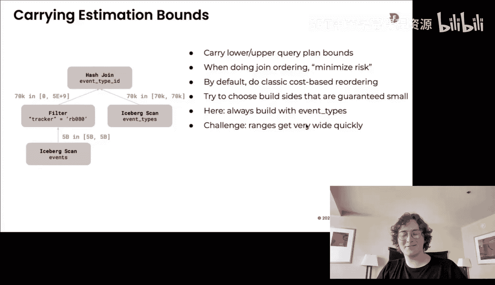

# CMU《数据库导论｜15-445 645 Intro to Database Systems (Fall 2025)》中英字幕 p18 #18 - Two-Phase Locking ✸ Firebolt Database Talk (CMU Intro to Database Systems) -BV1bmHGzsETM_p18-

🎼给我我 still。🎼So明 check。🎼我我6块。🎼Think youall forgot what ran sound。🎼the air。

 still still let the man beach the。🎼。DJ cash。Turns out if you make money， you got to pay taxes。

 he's learning the hard way so that hes he's there today with his accountant。 I don't。

 That's his problem。 All right， a lot to cover。And plus we have the guest speaker today so I want to get through as much as I can right so last class we were talking about beginnings of concurt control protocols in our database system and we talked about asset of course。

 but then we spent lot of time on the isolation portion of acid where we were distinguishing between different levels of correctness or sharedizability within schedules of transactions。

 we made the point that theres basically two。we care out in this class although there's others we don't care about。

 there's two sort of main categories of serialerizability。

 conflict serizability and view serizability， conflict serizability is which you get in pretty much any system where they truly do support serialerizable transactions this is what you get and we would verify that that schedules were conflict sererizable if we created a dependency graph and we didn't have any cycles and we'll see the notion of cycles corresponding to issues to transactions when we talk about dead like detection in a second and then view serizability was this higher level notion of serialerizability where it was okay for certain conflicts to occur that would not be allowed under conflict verizability but they are allowed in view sererizability if we understand the semantics of what the application actually wants to do with data like what does it mean to read something and write something and that's not something that we can easily derive automatically from just looking at read and write requests to the data。

We have to actually examine the application code or again。

 a worst case scenario ask a human about what data means in their application。

 and therefore no system is going to support this，😡，All right。

 so the other point thing about last class is that。I think I said this multiple times。

 in all those examples when we had those schedules。

 were those sort of setups of the problem where when I had all of the read andW writeite operations that transactions were going to do ahead of time。

😡，Right， that the， the schedule was static。 There wasn't like， you know， when a transaction began。

 you knew everything was going to do until it actually committed a rolled back。

And so we could look at the schedules， you know you know。In in their totality and say， okay， yes。

 these are going to be sterilized or not。 But now we need to build a real system where we can assume we cannot assume we will have that schedules ahead of time。

 Some systems do we can ignore that for now， and therefore we need to be able to still provide conflict sterilizability guarantees。

😡，Even if transactions are starting them， starting transactions are starting and then sending query requests where we don't know what the additional queries are。

 the later queries are going to be later on。😡，And the mechanism we're going to use to make this work today is going to be using locks。

😡，Hence the title of the lecture two days is Locking。

So I briefly mentioned locks earlier in the semester when we talked about index concurrenoryial protocols and we made this distinction between locks and latches so this is the same table that I showed before where on the I guess your left hand side we have all the locks。

 but we only focus on the right hand side when we talk about indexes to do latches so now we're going to go back and look at all these things right so a way to understand locks is that they are going to be protecting database objects。

 higher level database objects in our system like tables and tus and and databases themselves and we're going allow multiple transactions to interleave their operations and operate on these green right to these on these。

😡，So on these objects as they go along， the key thing of that can be different about locks and transactions versus latches and indexes。

 even though the transactions take latches as they update the indexes。

 is that transactions will typically hold the locks for the entire lifetime of the transaction。😡。

Whereas memory we say with latches， we were like trying to do something in a single page in the index or a single node so I was trying to acquire the latch。

 do something and to get out of it real quick and release the latch in this world we' to allow transactions to hold locks you know until they commit or finish。

😡，And the way we're going to have to handle deadlocks is through having this higher level these protocols that can assure that we don't have deadlocks or having a sort of oversseeeer or a coordinator understand what transactions hold w locks at what time and what are they trying to do and then we can arbitrate and decide how to break deadlocks where in case of latches we said there wasn't going to be any dial detection。

 we had to make sure we wrote good code and didn't have these problems in the locking world we'll have to do this。

 we'll have to have the resolution stuff written by us。

 the do assistant developers because we're dealing with the application sending random queries。

 making random requests， we can't assume they're going to know what they're doing in the avoid deadlocks。

 we have to make sure they don't shoot themselves in the foot。

And the metadata we're going to maintain about what locks are being held by what transactions at what time。

 this is going to be kept in a centralized coordinator or centralized data structure called the lock manager。

😡，Where now we have a single location where we're keeping track of。

 here's all the locks transactionsors are holding， whereas in the case the latches。

 we were going to embed the latches directly in the data structure itself。😡，Right。

So again we'll go through all this this make more sense to go on。

 but the key thing to understand is like。Again， this way I was say there was a distinction between the OS world and our world。

 like in the OS world， a lock is really what they mean is a latch in the database world。

 locks are these higher level things that are actually managing the contents of a database itself。😡。

Within the database system。诶。So let's looks to see how how it work so now we're going to have our schedules on the side here right we have T1 T2 T1 is going to read a write A and the read A again。

 and then T2 is going to read a and write A and now I'm introducing explicit lock commands like lock and unlock and you're passing in what object you want to acquire a release a lock for and we have now this centralized lock manager that everyone has to talk to when they want to get a lock or release a lock。

😡，So at the beginning， T1 starts and says I want to lock object A。

 so it goes to the lock manager to say， hey， can I have lock button A and assuming that nobody else holds that lock right now。

 the lock manager grants access to that and it's given a lock and then now T1 can go and read it。

But then now when T2 starts running， it once acquired the lock on A。

 it goes to the lock manager lock manager says， oh well T1 already has this lock， you're not T1。

 you're T2， therefore I can't give you this request right now and therefore T2 is going to have to stall and wait。

😡，Until the lock that's asking for is released。Then T or T1 starts running again does the write on A read on a。

 then it unlocks a here， and now at this point， the lock manager knows hey。

 there's also this transaction T2 that was waiting for this lock on a。

 but I told them they weren't allowed to have it， so now I can grant the access to a to T2 and then it's allowed to do whatever it wants and then release the lock when it commits。

😡，So this is roughly the high level what we're going to talk about today and obviously the devils in the details。

 how do we make sure that we don't have problems while we're doing this and this is sort of to example we'll see other problems that can come up as we go along。

😡，So today we're start first talk about what kind of lock types we can have in our data system and then use then we'll describe the two phase locking protocol。

 which is the firstably correctrovably Serli concurial protocol developed by Jim G in the 1970s that you can do to executeude transactions and generate serializzal schedules。

😡，Then we'll talk about how to handle deadlocks either food detection or prevention。

 then we'll finish up talking about hierarchical locking， where now I can expand the scope of locks。

 and then we'll finish up with the flash talklk from a German at Firebolt。All right。

 so when we talked about latches。There was basically two doubleit latches。

 right it was either in read mode or write mode with locks nowre instead of calling in read and writeites。

 we're going to call them shared and exclusive。😡，And the compat matrix looks very similar to what we had before with latches right if you have a shared lock。

 another shared lock can take the same lock at the same time。

 but as soon as I have an exclusive lock， no other lock type can take that lock at the same time as I am。

Right。Now this is a gross simplification of how real systems actually work if you go read the documentation for any data system that supports locking。

 you're gonna to see there's a lot more lock types that they have now for the MySQL one there's the intention locks。

 we'll get to those end of the semester or end of this lecture but now you see in the case of like Oracle you can have locks on tables。

 you can have row exclusives or not like like it gets way more complicated and so I'm not going go through other than the intention locks at the end of this class。

 we'll go through those but all these other lock types that are maybe specific to a different database system they're going to have their own nuances their own characteristics。

😡，But the two phase locking protocol and the hierarchical locking technique I'll show you at the end。

 this all still works with these extra lock types， it just sort of complicates how you actually would implement this。

 but the basic two phase protocol， two phase locking protocol will be the same。😡，All right。

 so now when transaction you're going to execute， before we can do any reader or write to an object in the database。

 we have to request that we want to lock from the lock manager on that object。😡。

We can support upgrade， so if I have a shared lock on an object and I know I'm going need to update it。

 I can say go back to lock Manager， I already have the shared lock。

 can I upgrade it to an exclusive lock and it'll know whether any transaction already holds a shared lock and have to deny or allow that upgrade request。

😡，And then as transactions keep running， they can decide to release the locks。

 and return them back to the lock manager， and then implicitly when they commit all the locks or when they abort all the locks are released。

😡，So the lock manager is going to be maintaining its own basically hash table。😡。

That keeps track of what locks exist and who holds them and cues for who's waiting to acquire a lock that's being held by somebody else right now。

But the key thing is going to have a global view of what all the transactions that are running in the system and what do they hold and what locks are they waiting for？

😡，Again， in all my examples here or anything I open up in a terminal。

 you know I can show maybe two or three transactions at a time in real high end transactional systems。

 you can imagine like doing 100，00 or even a million transactions per second。

 so you' got to maintain all this metadata for them， which can get quite expensive。

But when we crash and come back， we don't have to worry about reviving the state of the lock table because every transaction that was running is dead anyway。

 so you just wipe everything， it's not like we need to persist anything like in a page directory or the actual data itself。

😡，All right， so let's look at an example here again。

 so now we're going to have said its lock unlock unlock， we now we'll have the lock types。

 either exclusive lock or shared lock So T1 starts gets exclusive lock on A that's allowed to the lock menu to grants it。

 then it does the read on A， the write on A， then it unlocks A。

Right and then the says it's released and then keeps on running。 But then now T2 is going to start。

 it's going to do a the screws the lock on a， then do the right on a。

 and then return the lock back on a to the lock manager。😡。

But then now T1 starts running again at the bottom here。 and it goes， gets， gets the share lock on a。

Read a。But what's it going to see？What a day。The different value than it had saw before right so it's going to see the value that T2 wrote when it started running and not the value that it wrote when it had the lock before。

So what is this called， we did this last class。Un repeatpe read。Right。

Like I expected to read something again to see the same value， but I didn't get it。Right。

 so the point I'm trying to mind it here is that just because we have locks doesn't mean we magically get serialerilizability。

We've got to be careful on how we give out the locks and when we actually release them。

So this is what two phasese locking protocol does for us it's the way in which it defines how we're going to determine when a transaction can acquire lock and what happens when they start releasing those locks and what can they do during that period and as you expect。

😡，In the name， two phase locking， it has two phases。

RightAnd this is the contrary a protocol we would use if we don't know what transaction。

 what the transactions are going to do ahead of time， we don't know queries they're going to run。

 we don't know what data they're going to read and write to so with this locking protocol but he handled you that dynamic and environment。

 we don't have everything ahead of time。😡，So the first phase in two days locking is called the growing phase。

 and this is where transactions allowed to request to the lock manager all the locks that it once in any mode that it once and the lock manager can grant and deny the request if it denies it again。

 it'll just stall and wait until that lock is available or it gets a board because of a dead lock or something else。

😡，But then soon as a transaction releases one lock。

It now automatically enters the shrinking phase where you're not allowed to acquire any more locks。

 the only thing you can do is give back the locks you got during the growing phase。😡。

RightNow the split is going to be， again， I'm showing all these schedules with like lock and unlock as commands within the schedules。

 in actuality you don't in SQL， you can't manually acquire locks and unlock them。😡。

I'll explain that with the implications of this in a second。

 but you know you can I mean for certain things you can in some systems call like lock database and things like that。

 but like typically when you run queries， you don't say like lock lock object fo and then run a query on object F。

 it implicitly happens for you automatically when you run a select query or any query you want the data systems I know what you're trying to do because it's SQL and I can it's declaredative if I know exactly what command you want so therefore it acquire the locks for you automatically。

Unlocking streak， we'll cover that in a second。So again the way to think about it visually is think of this as like the lifetime of a transaction from beginning to end and in the first phase I'm allowed to grow acquirequi new locks。

 I think of like the height in the chart here， the Y axis is the number of locks being held by a transaction so I can grow。

 grow grow acquire more locks， but then at some point。😡，I release a lock。

And then I enter the shrinking phase， and the only thing I can do is give locks back to the lock manager。

I can't do something like this where I release a bunch of locks and then go back and ask for more locks because then that can caused problems。

 and so the protocol would not allow this。😡，So if I go back to my example that I have before。

 right now using proper two v locking。😡，T1 starts to get exclusive lock on A， that's a lot to happen。

 so then it can do the read on A and then write on A。

 and then it doesn't give up the lock that it has on A。

Because it still has to be able to read it down below so I can't again I don't want to have that problem where I like I unlock it and try to re the same object so now when T2 tries to get the exclusive lock on a。

 that gets denied and has to stall and weight until T1 finishes whatever it wants to do and then as soon as T1 unlocks A。

 that releases the lock to T2 and then T2 can do the right on A and commit。😡。

你唔 say did I actually just reading over that parents like use。

The questionest is when I say the worker is waiting。What does that mean you're waiting？Start。😡，Yeah。

 you can't do anything。I mean。For simplicity， yes， there's tricks that get around that， yes。Yes。

Noow the schedule ahead time。 And is it only possible that you release all the lots when you try。

Their statement is and they are correct， if you can't explicitly say you want to unlock and you don't know everything you're going need ahead of time。

 how can you actually unlock？😡，We'll cover this in a second， yes in actuality。

 there isn't really going to be a locking phase as we know it as we described before。

 they're going to use a more stricter form and we'll cover that in a second so when systems say they're used to phase locking like SQLs over you're going to have something more。

😡，Right。Okay。So by itself， two phase locking is as enough to guarantee that。

The schedules of the transactions you will generate in real time or runtime at running the system will be conflicts are liable。

😡，Mean because if you define the precedence graph or the dependency graph， you'll have no cycles。

 so you can guarantee that it'll be conflict andizable。

But it is going to be subject to another problem called cascading aorts that isn't a correctness issue。

 so it's not one of the anomalies like unrepeatable read。

 dirty reads and lost updates we talked about last time。

 it's more of a performance issue where if you implement it in as defined twob locking not talking about the for these at the end as hes on without they were talking about the。

😡，If you allow transactions to unlock。Objects in the middle of the transactions and still do more stuff。

 you know they can't acquire new locks， but they still do more stuff。

 then we can have this problem of cascading boards。So it looks like this。

 so say now T1 wants to do a lock on a， lock on a， that excludes lock on B， read a， write A。

 unlock A， then go read B and write B， and the bottom here it's going to abort and roll back all its changes。

😡，Right。So the problem is going to be if with T2， soon as a releases T1 reachess the lock on a。

 T2 can get the on excuseal lock on a， then it can read it and it can write it and it's going to read the change that was made by T1。

 but then later on T1 aborts。😡，And then now we have， again， a dirty read here。Right。

Where we read something that we shouldn't have seen technically because the transaction has committed。

 but it's still allowed under two phase locking。There's additional metadata we would keep track of in our system to say。

 well T2 read something from T1， that T1 modified， but T1 hasn't committed yet。

 so I can't let T2 commit to I know whether T1 commits。In this case， here， T1 does not commit T2。

 therefore as T1 as， therefore T2 has to aor。So this is what I mean by a cascading rollback where a rollback of one transaction may cause other transactions to have tob and rollback as well because they read something from that uncommitted transaction。

RightAnd the reason why we can't allow T2 to commit here。

 we'd have to have to wait until to see you find out what happens about T1 is again we can't leak any information to the outside world about an uncommitted transaction right I can't tell the client here's what your data actually looks like。

😡，And。And then habit it do something based on that information。In the back， yes。This example。知道好了，但时。

老。The question is， how is this two face locking example？What， what。

 how does that solve the problem we did in early in the lecture。

So let's go back to the first example。In the first example。

The problem was I was acquiring a lock on A and then releasing the lock on A in T1 going back here right and then。

T1 did whatever like it prompted LM has to wait whatever right and then now control switch over the T2 T2 starts running。

 it gets exclusive the lock on a， which is allowed to do because nobody holds the lock on A right now。

 it doesn't right then unlock a control goes back to T1 now T1 gets the shared lock on A which is allowed to do because nobody holds that And then now when it reads it。

 it reads something that it didn't didn't expect to see if they were running in true serial order。

 it either be T1 followed by T2 or T2 file by T1 in this scenario here with my interleaaving。

 I'm seeing something from an intermediate state that I shouldn't see。😡，So with two phase locking。

 we avoid this problem because T1 would not be allowed to unlock A up above and then acquire it again。

 because soon as you enter the shrinking phase， you can never acquire new locks。😡，But。多い。

The statement is you cannot release locks in the growing phases soon as you release one lock。

 you're now in the growing phaseiz。Automatically。Sorry。

 you want to say soon you ready to lock in the growing phase， you're now in the shrinking phase。

 automatically。😡，Yes。This crap。The line south the line should be。Yeah， to the point， yes， yeah。

 they are correct。 like what it really should be is like。I just put it in the middle。

 but like it really should be as soon as I release one thing it goes down， yes。

You're the first person to point that out in five years， so yes， we should fix that。嗯。

Theyavid like really like this again， without the hump going up， right， that can't happen。

 But as soon as I release one， the number of locks goes down。 And now now I'm in the tricky phase。

 But you know， this one's a violation。 you can't do this。Okay。So again。

 this problem here where if we。诶。Under two days locking。

 you can read data from uncommitted transactions because maybe you assume that they're going to commit。

 but you can you have to maintain metadata and say this transaction read something from a transaction that hasn't committed。

 therefore I can't commit until I find out whether they commit。And therefore。

 if the transaction that I read， their uncommitted read from aborts， I have to abort as well。

So this is the cascading rollback problem。And so the challenge is going to be and again。

 for two transactions to big deal， but in a real system。

 if I now have like thousands of transactions that depend on this other transaction and that other transaction of boards。

 I have toort all those other transactions and it's a bunch of wasted work。😡。

And you're basically burning cycles and doing IO for things that never actually commit and get any real work done。

 yes。你这是张。To know the roll back。The question is， in my example here。

 how does Trans Transact T2 know that that knows it needs to roll back because the red something from T1。

 there's extra metadata maintaining in the system for this， just not showing in the PowerPoint。😡。

Take the back。这那个。一合。So the question is。How did T2 acquire the lock on a because shouldn't T2 be shrinking。

 yes， but it released the lock on A， not the lock on B， still has the lock on B。

RightSo its it can like can still do whatever at once after that point。

 like can still do reason rights， just because you're in the shrinking phase doesn't mean you can't do other things。

 you can do things on the locks you hold， you just can't acquire new locks。就是其实今念来呃，容易被容易或的。

But here to do。Yeah so their statement is the notion of what phase I'm in is in a per transaction basis。

 not globally in the system correct yes， so T1 had this own。

 am I in the growing page or the shrinkrinking phase T2 and whether transaction they have their own phases。

 it isn't for the entire system。😡，Okay。So。The thing to point out here now， though， this means that。

If we。I this。There are maybe scenarios where we could actually have。U。

Ss of transactions that are actually serializable， but because the two phasese locking protocol is pessimistic。

 meaning if they assume they're gonna to have abors and so assume you're going to have conflict and therefore require run acquire locks before they can do anything。

 there may actually be scenarios where you could actually have better pays and better performance。

 but if you follow two phase locking as defined， you end up giving giving that up again。

 that's okay because if it's running anything that's super critical like money like your bank account。

 you don't want to have you don't really care that the database is faster if it ends up losing money like your money so that's why transactional systems。

😡，That are going to be doing today locking or the other protocol we' talk next class。

 like they're going to choose correctness， typically over performance。

The default though isn't isolation levels， the default isn't actually going to be serializable in those systems。

 it's going to be a lower form where you can have some problems。😡。

And it turns out sometimes that's okay。And banks really don't do updates like in place。

 they always have a ledger where you you're writing all the transactions and then they do summations。

 so banks are not the perfect example for this， but just think anything with money you' you don't want to have incorrect issues。

All right， so。With two- phasese locking again we can still have dirty reads。

 but again we have to maintain metadata about what transactions read from what data from what other transactions so that if one transaction of boards we roll back and that's the cascading a boardt problem one solution to that will be the strong strict two phase locking which is what they were asking about and then of course we can still have dead locks because now we're allowing transactions to acquire locks for any frany object they want and you may have dependencies between two of them and we have to handle that so we'll tackle the first problem how do we handle dirty reads and this cascading a board problem and then we'll talk about how we want to handle deadlocks。

So again， bringing back up the point they brought up。

The way every system that I'm aware of that does two phasese locking。

 the way it's actually going to be implemented is not the protocol where you have this notion of a shrinking phase that you can still you can incrementally unlock things as you go along。

😡，Instead of implementing what's called strong strict two phase locking where。

The shrinking phase basically just happens at the end， meaning at some point I say。

 all right I acquired all the locks that I need， and then I hold all those locks until I go commit and then all of them are released。

😡，And this avoids the dirty read problem because I'm going to a I'm never going to release a lock on something that I modified and therefore someone else can go read it。

 they can't read anything until I fully have committed so that at the end is when everything gets released。

😡，我说你 that号 is。Like the shrinking phase is just like this little blip at the end， yes。

 but I'm just trying to visually show what it looks like。

So there is a less restrictive form of this protocol called strict twobase locking。

 so not strong strict just strict， I'll explain what is in next slide。

 where you're allowed to release the exclusive locks before transaction commits。

 but you still hold all the shared locks。And again that allows you to release things and。

To maybe sort of free up more opportunities for other transactions to run。

 but he still has the dirty read problem。So strictness means that if a value is written by a transaction。

 then it's not going to be read or overwritten by any other transaction until the transaction that modified that object has committed。

😡，So then， this avoids the cascading a board problem and it actually makes undoing changes of ated transactions really easy because you don't have to worry about this dependency chain of like undoing this followed by undoing this。

 followed by undoing this， you just say here's the。😡。

Here's the last version of this value of this object that' is transaction modified and you just undo that one。

😡，And so any Davis system that's doing two based locking and supports serialized transactions is going to be doing strong strict2PL。

Because there's no explicit way to unlock things in SQL。It's wrong。

Strong means you hold everything the right locks， sorry， the excuse locks and the shared locks。

If it's just strict then you can release the exclusive， but keep the shared。I think。The。In red by。

So for your rights， yes。 So strong strict avoids cascading boards strict。

Sricrick TPO still can have them。Correct， yes。And maybe a textbook might also call him rigorous。

But it all means the anything。strict TPO by itself， you keep the shared locks to the end。

 but you can release the exclusive locks in the shrinking phase。这操作。这就是说。啊。是。Yes。

Let me fall in piazza I might be flipping the order， right。

 but the main thing I want you to understand is like。With strong strict。

 you definitely hold everything to the end。 And then in a lesser form of strong strict strict2PL。

 you're releasing one type of lock。And I might have that reverse， I apologize， let me follow on that。

All right， so let's look at an example here of doing strong Street TPL。

 so we want to take 100 at a DJ DJ Cas's account and move it to his book's account or his tax tax accountants account。

And then in another transaction， we're going to do that summation we have before。

 but' going to read a， read B， and then just spit out the summation of the two。😡。

So I'm going to show an example how if you don't do this with 2PL。

 what happens and then don't if we use regulargo2PL what happens and then what happens when you use strong strict2PL。

😡，So we don't do any 2p we could have a schedule like this where we start T1 it gets exclusive lock on a。

 then it does a read on a， then T2 tries to get the shared lock on a。

 but because T1 holds exclusive lock on a it's going to get blocked and wait and then control goes back to T1 it the update on A and writes it to the database。

 and then it unlocks a， at which point this now releases the lock to T2 so T2 can read a and now it's going to read the change that T1 made。

 then it unlocks a takes a shared lock on B， reads B。😡。

But then now when T1 tries to get the exclusive lock on B to update it to put $100 back into the B's account。

 it gets paused and blocked because they can't get the exclusive lock on B。

 control goes back to T2 T2 releases that lock， right spits out the output of a plus B。

 and then now we do the update on the。😡，updateate on B， unlock it， commit， but then again。

 just like before an example we had we were missing money。

 we're missing $100 in our summation from T2's output because we read a after we took the money out and then we read B before the money was put in。

So again， this would not have happened if it was running T1 followed by T2 or T2 followed by T1 in a serial ordering。

So now if I do two base locking。😡，Same thing starts I get the T2 sorry T1 starts。

 gets a exclusive lock on a does a read on a and then when T2 tries to get the share lock on a。

 it gets paused and weighted weights now I get the excuse update a do the right A gets the exclusive lock on B and now I can unlock a which I'm allowed to do in twobase lock in because in the shrinking phase or T1 so then T2 could start running。

 it does the read on a tries to get the share lock on B that gets blocked because T1 has that so then control goes back to T1 does the read on a as the 100 to it writes it out unlocks B and then T2 can run and produces the correct result。

Right。The heating is again the。T1 acquired all the locks that it needed。And as soon ass unlocked A。

 then it can't acquire a new one。Now a strong strict PPPL。

 this one is basically comes down to being serial ordering， at least for this example here。

 right because T2 is going to try to get the shared lock on a。

 but it's going to get denied because T1 got it first and T1 is not going to release that shared lock until it commits。

😡，Right。And then it does a read A， then it tries to get it to share lock and B at this point。

 T1 has already released that lock， so it's allowed to get it and then finish its processing and then produce the correct result。

Yes。Do the on what happened。The question is shouldn't unlock happen after the commit？Like。

How it is I'm starting in PowerPoint， but yes， and again this is why there's no explicit unlock command when you call commit。

 then like it unlocking him is all part of it， it's part of the commit。

So the way to go think about again， what the。The2PL stuff provides for us in the context of the universe of schedules we could possibly have remember we had serial in the middle and around that encompassing it is conflict ce schedules and around that are few celig schedules so then now this region here are going to be schedules that do not allow for cascaing boards and some of them will be you know viewsological conflict or even serial and some of them just aren。

Right。And then more narrowly， inside of comfortizable is going to be where strong strict 2PL exists。

 And around that， you can think of like even more broadly would be where 2PL exists。😡。

But in case of Str TL， none of those schedules will have cascading boards。😡，Okay。はい。

So now we go back to the second issue we talked about of we now know how to handle the dirty re problem with StrTPL。

 now we have to handle Delocks， right？Again this is a classic concurrent programming 101 stuff right T1 starts because its lock on A that's allowed to happen T2 wants you get a share lock on B。

 that's a allowed to happen， but now when T2 tries to get the shared lock on A that gets denied because T1 already holds it。

 but then later on T1 tries to get the share lock on B and that gets denied because T2 holds it。😡。

So course， now we have， again， a classic deadlock。We have two transactions that both hold locks and they're waiting for locks held by the other transaction。

 and therefore they're never going to get released。

So deadlock obviously is just again a cycle interdependencies between the locks that transactions hold and the locks that they want to acquire and they're just waiting for the other one to release it。

 So the two ways we're going to handle this is through either deadlock detection where we have an active mechanism goes and says I'm finding the deadlocks。

 let me go kill something to go break it。Or Deluect preventionion where when a transaction tries require lock。

Based on an ordering protocol， a priority protocol。

 we will to determine who's allowed to wait for a lock and who has to give up a lock and abort and restart。

😡，And the thing I'll say is this is where， again， another distinction between the high end expensive systems。

 like the oracles， like the DBTs， these systems are actually support both of these methods。😡。

Versus like my SQL， I think only has one of them。And you can as a human operator or administrator of these systems。

 you can toggle the runtime knowledges of parameters to determine which of these ones you want to use for your transactions because it's going to depend on what the workload is。

 what the hardware is， which one of these is actually going to be better。😡，All right。

 so for Dlux detection， the way this' iss going to work is that the lock manager is going to maintain what weights for graph is basically equivalent than to like the dependency graph of what。

😡，What transactions are waiting for locks held by other transactions？

And if now then the system detects that there's a cycle in this graph， you know there's a deadlock。

And therefore， it has to then deploy some mechanism to decide or a protocol to decide which transaction doesn't want to abort and kill so that it breaks the deadlock and then transactions can keep on running。

And so the challenge is going to be how aggressive you want the data decision to be in looking for these deadlocks。

😡，Again， for two transaction three transactions is no big deal but think of like tens of thousands of transactions with very complex dependency graphs or weight source graph。

 you could pick your favorite cycle detection algorithm but sometimes those aren't cheap to run so if you're trying to check for a deadlock every millisecond you're basically burning cycles looking for deadlocks where you could be using those resources to actually execute transactions。

But if I only run it every five minutes， then I may have transactions sitting around for， you know。

4 minutes，59 seconds because of a deadlock and waiting for the next time the psycho detector goes through and finds a deadlock。

 So how to balance the the how aggressive you want to be in breaking the deadlocks versus how quickly you want to。

how quickly when we release them and and get transactions running again。

 you know there isn't one answer and this is what again。

 the high end is allowed to tune tune these things。All right。

 so the basic protocol is pretty straightforward straightforward every time that there's a transaction that's waiting for a lock being held by another transaction。

I just add the edge for my weight photograph here， and I know what locks transactions hold because I say my transaction to my lock manager in that hash table。

😡，And I know what transactions they're trying to trying to I know what lock transactions are requesting because again。

 I have my cues and and my lock manager keeps track of what they're waiting for。So again。

 say here at T2， what the lock on C， but T t3 holds that so you an edge from 2 to 3， T2 to t3。

 and then now T3 has once a lock on a， but that's being held by T1。Again， I have a deadline bottom。

So when we detect this， I'll say also too， like a simple way that you would do this is。😡。

the detection algorithm could do something real simple like just look for two transaction cycles like T1 and T2 are deadlocked。

 run that first because that's cheap to do， find any deadlocks and maybe clean those up but if you don't find anything or if you did the two transaction cycle check and breaking them or killing some transactions there didn't release other transactions。

 didn't release the major bottleneck， then you run the more expensive cycle detection algorithm。

So you said to do a quick fix and see whether that solves problems because those problems will be like that。

 but then you can run the more expensive one afterwards。All right， so when we detect a deadlock。

 now the Navy system has to decide which transaction to kill to abort and to break that deadlock。

 remember I said last class that you know every transaction starts to begin and then they can either say commit or they can say abort to tell that the transaction itself wants to abort。

 but the data could also decide on its own that it has to boardort as well， that's what this one is。

So when the。When the distance says， all right， tell the transaction to abort。

 it releases all the locks undoes all its changes。😡，To provide the adamity guarantees。

 and then it can either restart itself。Or we throw an exception back to the application saying this transaction aborted and rely on the application to restart it for us。

😡，If it's a store procedure， think of like RPC call。

 we just invoke the RPC again inside our data system。

 but if we have to go back to the application code。

 they might not have exception handling to be able to restart things。😡，So the decision of what？

You know， what transaction should be the victim that you're going to kill off and release all their locks depends on a lot of different factors that a data systems can take into consideration that。

Can have a pretty significant difference in performance。

So a comment thing would be like you just pick winter transaction is either the oldest or the newest。

 and you go ahead and kill them。Typically you pick the newest because you would say maybe they have been around long enough and not starving them if I kill them。

 Of course， now when they come back and make sure that they have maybe the same timestamp so they had this a higher priority than they had before。

It could also be how much work the transactions are done so far。

Maybe they've updated a billion records， you have two transactions that are conflicted and they have a deadlinelock。

 one transaction updated a billion records， one transactions updated one record。

I' bet off killing the one record transaction because I don't want have to undo all the work that the other transaction did because that was expensive to do and I don't want to waste the time of it。

You can also look at how how many items the transaction has locked so far and it's sort of like the work。

 how much work have I ever done how much data has a transaction read or modified。

 locks are kind of the same thing because again going to the lock manager and acquiring the locks is not free and we had to protect latches like we did in the page table and the buffer manager so that's an expensive operation to go acquire locks and so if someone has a billion locks held versus somebody has one lock held they may be better off killing off the one lock transaction。

If we allow for cascading boards， we can also keep track of how many transactions are going to get rolled back if we kill one of those transactions。

Song strict TPL doesn't have this problem， but other protocols do。so again。

 there's a lot of different things we can consider when we don't want to decide when。

 which transaction to a board， and this is where again the high end systems where you're paying millions of dollars for them。

 they're going to maintain all these kinds of statistics internally and try to figure out the best choice for you。

😡，Whereas at my SequL， I think， is just like， whatever transaction is the newest。

 they just kill that， so it's pretty basic， pretty simple。来。All right。

 so now when a transaction rolls back， the question would be， how far we'd roll it back？😡，Now。

 I'm sort of assuming so far when I say I'm going to kill a transaction， it gets completely aborted。

 but it doesn't have to do be that。So we can show demos of this next class。

 but there's these things called save points where while my transaction is running， I call begin。

 but then I can also kind of establish a checkpoint called a save point within that transaction。

 and I could potentially roll back to that save point。

To break a deadlinelock without having to roll the entire transaction back。So I could maybe update。

 you know， five records， take a save point， then try to update the sixth record。

But then I can't acquire the lock for that， so rather than just killing avoidoring a transaction entirely。

 I'll just roll it back for some amount of work up to the save point。

 and then that breaks the deadlock， but then I don't have to roll everything back。I mean。

 potentially don't have to tell the application server that there's a deadlock for it as well。

Was that？The question is how do you decide where to take a safe point？It's application code。

 so the application code had say I want to take a say points。

 it's not something he does automatically。😡，For some things like if the say， a single update query。

It updates two records it gets the lock for the first record。

 tries to get the lock for the second record that causes a deadlock for that one。

 you could you could break the deadlock by。Undoing the change of the first twoa that I updated。😡。

That release of the deadlock and then you can reexecute that query once know once things are dislodged without how to go back to the application server。

 so some things you do implicitly， other things require explicit commands in SQL to create say points。

😡，This of the lock talking。The question is， is the granular to lock at a row level， table level。

 or something else？At this point here， we're not defining， I mean， my example， I said tubs。

Whenome tell we're hiarch locking， it could be anything。The question is again。

 what am I locking when I say an object A？😡，And most it's going to be a single record a Tple doesn't have to be。

And again， we'll see how we do that handle that in a second。All right。

 so deadlock prevention is rather than relying on a background worker to go look for deadlocks in the lock manager and break them up。

 instead what we're going to do is when a transaction tries require a lock that's being held by another transaction already。

 then the nation has to decide which one to kill at that moment to avoid having a deadlock。😡。

And for this one we don't need to wait for graph， we just need to know who waits for what and we need to know timestamps of when when transactions started。

😡，So there be two methods of data prevention， and again， the high end systems can support both。

So every transaction to be assigned a timestamp of when they started。

And then that's being used to determine their priority over other transactions。😡。

And then the two protocols are going to say who's allowed to wait for what。

 what whether transactions is allowed to wait for another transaction or at release least a lock or not。

 and if we guarantee that waiting only happens in sort of one direction of priorities。

 we can ensure that we don't have deadlocks。So the word says wait or weight die。

 which is the old race for the young， and this means that the transaction that's trying to acquire the lock has a higher priority than the holding transaction。

 meaning it's older。The timetamp is less。Then the requesting transaction is allowed to wait for that other transaction to give it the lock。

 but if the transaction that's trying to acquire the lock is younger than the transaction that holds the lock。

 then that requesting transaction has to kill themselves。😡，W for weight is the opposite。

 like the young weights for the old， so if the requesting transaction is younger than the transaction。

 the whole the lock， then it's allowed to wait if it's older then it has to kill itself。

So let's look at explicit examples here。Right so we have two transactions or sort two schedules with two different transactions。

 T1 and T2 so the first one here at the top T1 starts so it has a timetamp means less than T2 assuming the timestamps are1 and2 so T1 starts gets timestamp1 T2 starts gets the timestamp2 T2 to lose the lock on a。

 but then T1 tries to get that same lock on a。And under weight for die。

 where the old weights for the young， because T1 is older than T2。

 it's allowed the weight for T2 to finish to acquire that lock。Under wound and weight。

 T2 end up getting aborted because the basically saying I'm not waiting for you， I'm older than you。

 I'm going go。You know， steal your lock and kill you， right。And now this other example here。

 again T1 starts， gets the s lock on A， T2 then starts， tries to get the sc of lock on A。

 and under wait and die， T2 has to abort because in wait and die the old weight for the young because T2 is younger than T1。

It's not allowed of weight and it has to kill itself。In the case。

 I wound a weight where the young weights for the old， T2 is allowed to wait for T1。All right。

 so why is this guaranteed there's no deadlocks？Because all the weighting is going to happen in one direction again you would implement just one either wound weight weight die。

 you don't implement both of them， I mean you can， but you can only run one at a time。😡。

So it's like when we talked about latching in the deep plus trees along the leaf nodes or Nor leafs in just thetereroal itself。

 all our workers were starting from the top going to the bottom。

 we didn't have anybody else going in the other directions you can't have deadlocks because all the waitinging is sort of going in in one direction so weight die。

 wound weight basically the same thing but a more nuanced because now you're dealing with coming at different directions。

 but you only allow one of them to actually occur and that guarantees that you don't have any deadlocks。

So when a transaction restarts， we have to give it a new priority。

 but we're just going to use the same timestamp of when they started before。

 the first time they were， so that guarantees that eventually they'll be like you know an old person that just gets whatever they want。

😡，Right。And it doesn't get starved。And like I said， in some workloads， when weight is better。

 other workloads， weight dies better， and then the high end systems allow you to toggle on which one you want to use。

😡，All right， so now coming up to their question earlier。

 all my examples here were assuming that we have a one to one mapping of。

Database objects and I didn't find exactly what they were to locks。

But the challenge with this one is it's not going to be scalable。

 so if I transaction wants updated a billion tuples and everything I've told you so far。

 I got to go to the lock manager and get a billion locks。😡，And again。

 it's a page table or it's a hash street like the page table right as a protect it latches。😡。

Because it's centralized data structure。😡，And if I got to go in and get a billion locks。

 chances are that the cost of going， acquiring the locks is being more expensive than just updating is whatever the records that I wanted to update。

Right。It's not like a latch where I'm flipping a 64 bit integer and I can do that in a single instruction in the CPU。

 I got to traverse the hash whatever I'm looking for， do my search into the hash table。

 then acquire latches for whatever the things I want to modify。😡。

So we can get around this problem by introducing different kind of lock granularities。

 and now we can define locks to have scope or the thing that they're locking can encompass。😡。

Larger and larger logical parts of a database itself。😡，So now when I say and acquire a lock。

 I can acquire a lock on a database， a table， a page in the table， a tuple。

 and then in the lowest case， I a single column or a single attribute within a tuple。😡。

And then the ideal scenario， we want RD system to acquire the smallest number of locks that it actually needs to do whatever it is the transaction wants to do。

 because then we go into that lock manager in fewer times。

 but the tradeoff's going to be if I have I'm only acquiring Co grain locks for the entire database。

 then that's going to block out other transactions from running at the same time and I get bad parallelism。

😡，So we can introduce this now in this notion of a law hierarchy。😡。

And what this means is that think at the very top， you have a database and within that it has tables。

 so if I acquire a lock on the database that implicitly acquires a lock on everything down below within that database。

😡，And so now I want to do certain things， if I would update a billion tus in a table。

 instead of acquiring a billion locks on individual twos， I didn acquire the lock on the table。😡。

And that guarantees that I'm protected from other transactions。

 So all the transactions have to sort of enter this tree and acquire the locks in the same direction。

 So T1 shows up。 And again， I want to update the entire table。

 So if I just get the lock on the table at the top and p I have the locks for everything down below。

So Mongo to be， the first version on Mongobe when it came out， they only had database locks。

 so anytime you had a writer， they would lock the entire database。

It's sort of what how SQL light works now， SL light only allows for one writerer thread。

Now they allow for multiple readers and potentially read other parts of the data at the same time you're writing to it。

 but they sort of have this model where only you have a sort of single lock for the entire database for writers。

 but readers can read different things。😡，So the way to think about how different systems implement in this。

 the twople level locks are very， very common， pretty much anybody or anybody that student two phase locking is going to be doing this。

 the next one would be table locks are very common page locks they more nuanced we'll see that in two more lectures。

 but like some systems can do that。😡，You can do database locks in some systems。

 you can like Postgres if you can lock entire table， I don't think you' log entire database。

 you can put the database in read only mode and that's sort of like the same thing。

I only know one system that does actually level lock， and that's Ugabyte。

Whi is pretty impressive and the challenge is going to be when we talk about multiverging is that in order to put this。

 I got to put information in the header every single attribute or every single tuple。

 what locks are being held by that tuple within its attributes。😡，And again。

 it O is not more parallelism， but it's a more complicated protocol to implement。

 and there's more metadata you have to maintain。😡，All right。

 so now the problem is if I just have only two lock modes， share an exclusive。

Then it becomes kind of challenging to start to do anything more sophisticated using this hierarchy because。

You know someone could take an exclusive lock on the table and maybe only to update a small number of twos and that would be good And so I went away to be able to hint to other transactions what's going going on below me in the tree without having to go in the tree and traverse everything to find what I need because again under two days locking。

 I have to cho locks on objects before I'm allowed to do anything on those objects。😡。

So I have to check this thing first before I can do anything。

So this is where intention locks are going to help us。

Intenional lock gives me hints for us in this hierarchy tree of the lockerannularities that convey information about what's going on below me in the tree without having to go down into the tree and look at everything。

It's just a hint for other transactions。And the three basic types we're going to have are intention shared。

 intention exclusive and shared intention exclusive。 So attention shared basically says。

A hint who say， hey， down below me in the tree。I'm going to be taking things。

 there's some objects will be taken in shared mode。

 Intion inclusive says something down below me are mean in exclusive mode。

 and then shared In exclusive means that I'm going to take that object and everything below it in shared mode。

😡，But then down below within that， I'll upgrade my locks and take something in exclusive node。

 but not at the level where this lock is being defined。😡，All right。

 so what does this look like for now our compatibility matrix now is getting more complicated right because again now we have the intention locks plus the original shared and exclusive locks again exclusive locks block everything else you can't do anything with that but like with a intention shared you can start sharing this sorry it's compatible with everything but exclusive because again it's just a hint to say hey down below me I'm doing something but not exactly at the level that I'm at you're at right now。

So the locking protocol becomes a bit more complicated。Now， before I go and do whatever read write。

 I want to do it on the object in the database， I go into my hierarchy。😡。

Figure out at the high level what intention locks I maybe need to hold because I'm trying to reduce the number of total number of absolute locks I'm taking for my transaction。

😡，And then at the lowest level， then I'll either take things in either either exclusive mode or shared mode again depending on what my operation is actually going to be。

😡，And now me standing here with w my hands probably not helping。

 so let's look at a bunch of examples。So it's the same one we have before。

 we're going to check the balance of DJ cash ins bank account。

 and then it increase his bookies's account balance by 1%。So for this， we're going to take explicit。

 exclusive and shared locks for the leaf nodes in our lock tree hierarchy。

 but then we'll have the intention to hit locks up above to tell the transactions of what's going on down below。

So to keep it simple， we only have two levels， we have table locks and tub locks。

 again you have page locks， you can have Eit locks， you can have database locks。

 it all still works the same。😡，So when T1 starts， it wants to read a single record in the table。

 so it only wants to get this lock in shared mode， so in my hierarchy as I go down。

 I'm going to give take an intention shared lock。😡，At this at the table level。

 and then traverse now down and get the share lock that I want explicit share lock on the two I'm going to read。

😡，And for T2 that's going to update a record in the table。

 we want to we want to take this bottom lock in exclusive mode again in our compatibility matrix。

 intention shared is compatible with intention exclusive lock but not exclusive lock so I don't want to take an exclusive lock on the table because that's going to block everything any reason write on the table and it's going to get denied too because T1 already holds the intention shared lock so instead I'm going to take an intention exclusive lock on the table again。

 giving hint to other transactions say hey down below me I'm taking exclusive lock and I get the exclusive lock on the one two I want to modify and therefore these two transactions can run in parallel and they don't interfere with each other。

😡，Like more complex examples so now we'll do three transactions T1 is going to scan all the tus in R and update one of them T2 is going to read a single tuple in R and then T3 is going to read all the tus in R but not update any of them and assume they're showing up in T1 followed by T2 tele by T3 and I'm not defining whether I'm doinglock detection or Dla prevention it doesn't matter at this point I'm just trying to explain how we're actually taking the locks in the hierarchy。

So T1 wants to read all the tuples in R and update one of them。😡。

So I'm going to read a bunch of these and then write this last one here。So for this。

 I could take a shared intention， exclusive lock。At the table level。

And then I only need to take an exclusive lock on the one2 I need to modify because it's shared In exclusive。

 the shared part is explicit， so that means 21 and 22 and every other tuple below this table are going to be in shared mode or locked in shared mode for this transaction。

 and then the lock， the one2 by1 to modify， I take that in explicit exclusive mode。😡。

Then now when T2 wants to come along and it wants to read a single tuple in the table。

 say this one over here。😡，I can look at my compatibility matrix and know that the shared intention exclusive is compatible with a intention shared。

Because is saying likeHey down the below me， I'm going to read something so I get intentions shared on the table and then take the shared lock on the first tuple here and again。

 that's compatible with shared intention exclusive because again implicitly T1 has all the tuples in shared mode and only this one the end in exclusive mode。

😡，But then now when T3 shows up， it wants to get scan all the tus in R。And for this。

Instead of going get every single tuple in shared mode。

 it once to get a shared lock on the table because again I'm trying to minimize the number more time I'm going to the lock manager so I get the Sha lock on R。

 then they explicitly get all the other tus in R in shared mode。😡。

But because that conflicts with the shared intention of exclusive lock being held by T1。Therefore。

 T3 has to wait。T T2 then commits the leases the tension shared lock that still doesn' us unblock us T3。

 only when T1 commits， then we can get the shared lock on R and we can。😡。

We can then read everything we want。So you can also go back too you can say like say for T3 it's going read all the tuples but maybe doesn't know the number of twos there are maybe the statistics are wrong so it could say things like well。

 I think there's  a0 tus so I'll just get 100 tuple locks that's fine。

 but then it keeps going and realize that there's a billion tuples you can then go back in the hierarchy and say upgrade my my tension shared lock at the table level and put it into shared mode。

😡，Again， this just repeat what I said that you can switch to more core screen locks when you realize you're acquiring too many low level locks or explicit locks down below。

 yes。Howl comee T three to take a share plug instead of。The question is。

 why does T3 take a shared lock here and send intention shared because say that it knows there's a billion tubples down below。

 that it doesn't want to acquire a billion lock or those individual tubs。

 it's better off to take the shared lock at the table level。😡，容。T关。Shar。1。Yes， the statement is。

 well， the question is why did T1 take a shared intention exclusive because it's going to do a mix。

 but it knows it needs to read everything and it's going to only update one of them so the shared intention exclusive gets everybody in read mode down below complicitly。

 and then I take the one explicit exclusive lock on the two I'm going to modify。😡，在る。Just taking。

If the statement is and they're correct， if a new is going to update everything down below。

 it would just take an a exclusive of lock on the entire table， yes。😡，You see that in things like。

Like when you modify the schema of a table， they'm going to add a column or drop a column。

 I'll take an exclusive lock on the table so I can make that change and prevents anybody else from reading。

 writing while making that change。That's the easy way to do schema changes。All right。

So as I said before， you don't you typically don't manually acquire locks in SQL in your application code。

 it's only you know when you go try to run a SQL query。

 the datat figures out for you which level of the hierarchy you want to acquire and what locks you're actually going to need。

 but sometimes in SQL you actually give hints to。😡。

The database server that you actually what locks you want to acquire and in what in mode as part of the SQL command itself。

😡，And an example I said before， you could take a explicit lock when you knew on a database or a table and you're going to make major changes。

 update all the twos rather than having the lockment fingers out。

 you just lock the entire table and make your change， that's very common。

One of the most common techniques you can use are what's called for update hints。And so。

In my SQL query， I have a select star from whatever table with a wear clauses and if I don't have this four update piece when I run this query。

 the data is going to take your locks in shared mode but I'm going to put this four update thing at the end it says basically saying。

 hey， I'm going to read this and the very next thing I'm going to do is write to it so don't acquire it in shared mode does immediately acquire in exclusive mode because the next query that's coming at you is going to be an update query or delete or something like that。

😡，Right。And I don't forget what this is in the SQL standard， but the for update one is very common。

 My SQL has different syntax， lock and share mode or lock on whatever mode you want for select statements。

 but you can see here from the Post documentation， there's a bunch of variations of it like for key share。

 for share for no key update or for update and it shows you the compat matrix with a bunch of them。

 So this is super common when you have like read modify write workloads like read someone's bank account and then take money out of it you would run queries using for update。

And that avoids the problem of like， I read something。Get the share lock and lock manager。

 you have to go lock manager for that。 Then next where you's going to try to update it and're going to go back in the lock manager and try to upgrade that。

😡，So rather than doing the read and not than later on realizing you can't get the exclusive mode lock。

 just read it and get the exclusive mode lock while you're reading it and that way if it fails。

 not you know you didn't read data， you didn't run the read query that you end up rolling back on unnecessarily。

 yes。😡，If you're running your transaction。Or isolated。Like Si said， what has changed this man。

The question is， if you're running your transaction at a lower isolation level。

 which we will cover next class。Does this change the semantics no？No。Ofほら。Let me think about that。

Ofive locks。Yeah， for the transaction， if you take mean if you're take an in of lock mode。

 you're basically。You're putting these in serial order， potentially。We'll cover the next class， yeah。

 we haven't to what isolation levels is at。Another cool trick you can do is this little hint。

 which I know works in postcards， I don't I forget forgot what's in SQL standard。

 but a bunch of systems support this， it's called Skiplock。Basically， you say。

 run my select query and anytime that you come across a tuple。😡。

That you can't get the share lock for， just skip it， ignore it， don't have to be part of its output。

嗯。Right？And。This is kind of weird because like you say， oh， well。

 that means I could potentially run the same query on the same data。😡，You know。

 multiple times and actually get different results。 Yeah， you can。And for some application。

 some scenarios， that's okay。So this is common in when you use database systems or database for cues。

 like we' cues。So you say you have a single queue of here's all the tasks the jobs I want run in my system。

 and you have a bunch of workers outside the system like application code pullinging the queue and saying。

 what's the next task I should run？And so when you pull the queue。

 you don't want to wait for a lock to be released by another worker who's pulling the queue if they're pulling something out and going to start running it like they're going to update the status and say job is taken so you just now with S lock。

 you just skip whenever you can' acquire the locks floor and that way you can get the next thing in the queue。

😡，Which is pretty cool。 right， It's a weakerr form for update。

 It just prevents you from seeing things that like。😊。

It's like like preventing things you just can't acquire and lot for。

Whereas basically trying to force you to quiet a lot when you trying to read it。All right。

 before we flip over to the fireboat talk again， twob locking or some variant two days locking you use in pretty much every single data system around even for the multiversionrging ones we'll cover next week and we talked about how there's different variations two-b locking strict strong twob locking Ill fall on piazza about the distinction between strict versus strong and rigorous but we'll follow whatever's in the textbook and we showed how to deal with deadlocks either through detection or prevention and then we showed how you inquire different locks at different levels in the hierarchy we didn't talk about nest transactions。

 we didn't talk about say points more detail， we can go over that more next class NS class we'll spend more time talking about the sorry we'll talking about optimistic or according protocols whereas twob locking as a pessimistic one and we'll see variations of that and then that'll lead us into multiversioning and then we'll bring up the thing that they mentioned about different isolation levels where you can actually run sort。

You run the transactions with lower guarantees about the anomalies that we're trying to avoid with serializability。

Okay， question， yes。So accident so like。我们在。公司要。我在说。The question is， can this produce in results。

 yes？So you wouldn't want to do it for your regular application， it's like for certain scenarios。

 like calling a queue。😡，Where I don't care about the things I can't get access to。

 I only care about the fresh things， this does that。😡，This is Ben， as I said。

 he's German and the good kind， he's from Tgu Munich。

 he was a protege of Thomas Moman which is one of the best database researchers in the world and now you started EP engineering at age like 24。

 right？No and'm 26 now， so I mean you know when you started at fireball when I started at fireball。

 there was like 22， I think。Even young very the Germans are very good Davis this is band he's very smart go for Ben thank you for the kind introduction and you being too nice cool so I know all of you learned about kind of query planners over the last couple of weeks and we thought maybe it's interesting to you to get our industry perspective on query planners and very specifically cardinality estimates so we decided to talk titled the talk be wey of Carinality estimates。

😊，And one thing that I think is important context， wait a second， I can slideize right now。

something broke on my end。Perfect is that whenever you build a query optimizer。

 it's really important to put it in the context of the workload you're going to run in the system right like different types of database systems will require different types of optimizes and so I wanted to tell you a bit about the workloads we care most about running at firebol first of all it's an analytical database and it's scale out so it's Postgs compliant but we usually run on terabytes of data petabytes of data and in many cases customers build basically mission critical realtime applications on top of firebol so what that means is that individual queries need to run really really quickly we're talking about tens of milliseconds maybe hundreds of milliseconds if they touch more data and there's very high concurrency so we have cases where you have maybe thousands of Qps hundreds of QPS and usually as I said these workloads are mission critical。

Now the other thing which is quite interesting about these workloads is you usually have pretty predictable and repetitive query patterns Think about someone for example。

 I don't know building out like a customer facing observability solution that gives metrics into their application you will see the same types of dashboards over and over again。

 maybe our customer has 10，000 customers or 100，000 customers looking at that application but fundamentally it's the same dashboards being run over and over again。

If we run these workloads and we have predictable and repetitive query patterns。

 we must have predictable query performance， kind of this is the most important thing for us and this is ultimately when our customers pay us for and what they expect from our service。

 given that for them Firebolt is a mission critical piece of infrastructure。

And so now the question becomes when you're building a database in industry or also in academia。

 what can actually make SQL performance unpredictable and there's a few things you might think about right away。

 so maybe the ingestion pattern changes right like they are ingesting three times as much data now four times as much data and queries are just becoming heavier。

The reality is this doesn't usually happen， especially when kind of customers of ours are building out their mission critical production workloads。

 they take great care to make sure that things are very predictable right is we're usually working with platform engineering teams。

 infrastructure engineering teams， they are experts on running data infrastructure and they are making sure that their ingestion patterns are very predictable。

Now， the other thing you might say is maybe query patterns are changing here as well。😡。

This doesn't usually happen so with agents running SQL queries。

 it's actually a bit different and there's a lot of interesting things happening there right now。

 at least for this talk kind of let's skip that part and focus on more maybe traditional workloads。

 which in our case often have predictable query patterns。You're not。

 you're just never in a situation where you see a query pattern that you haven't seen before。

 it doesn't happen。The other thing that might happen is a load spike right okay there's now 1000 users signing into the application everyone wants to look at their customer facing data app now this does happen。

 it doesn't happen that often but when it happens there's safeguards you should just build into your systems it's not rocket science first of all you should have a robust queuing system and you should also have autoscaling right you should be able to basically handle a load spike by provisioning more compute and just getting through that backlog that maybe built out。

Now， the last thing is。Maybe you overengineered your system and you thought you're really making it better and in our experience that's actually usually what's happening and so you're kind of taking a component kind of you think you're building this amazing algorithm kind of making it super smart but ultimately you're maybe making it very smart and it's helping in 90% of cases。

 but you're also making things very unpredictable。😊。

And this is especially important for query planners because fundamentally your query planner can do the most good in your database systems having a good planner maybe gives you 100 x1000 x query performance improvements in many cases。

 that's very hard to do with just having a faster database runtime for example， however。

 if you have all of that power and you can do the most good usually you can also do the most part and now for the remainder of the talk。

 let's actually touch through what that means for the way we're building our query planner at Firebololdd。

😊，Now， by the way， one thing I wanted to mention is just now at VLDB 2025 there was the test of time award given to the paper how good a query optimizers is really and you can already see in the abstract basically that they're saying cardinality estimates can be wildly off and that makes query plans a lot worse for many systems。

 this is a great paper to read again just got this great award at VLDB so take a look at it。

All right moving back to Firebols world so our planner is Postgres compliant however we actually don't have Postgres code inside of it so that's an important distinction even though dialectwises we're compliant with Postgres it's basically built from scratch all in C++ we model a lot of things after calcci and if you look at the core optimization stack there's at this point I think more than 170 rules that do rule-based optimization right filter pushed down kind of expression optimization removing redundant aggregates。

 removing redundant joins all of the things you learned about in the last couple of classes and one set of rules we're especially proud of is I think we did a great job building rules that eliminate redundancy and machine generated queries and we for example just published a paper at BTW this year if you want to read more about that and learn about some maybe interesting industry rules in industry systems。

The other thing we're doing is cost based drawing reorder it。

 so this is bottom up using a drawing graph using dynamic programming I think you learned about that at the end of last week。

And all of this works on iceberg tables as well， which is just an important thing to point out iceberg is becoming mainstream。

 kind of every good modern analytical database system should have great iceberg support。

 and we've done a lot of work wiring iceberg throughout our prairie planner。

Now what does this mean in terms of kind of being weary of Carinality estimates and usually when we onboard an engineer into the planner team kind of this is the slide I would show them and this is the thing I would talk them through first of all for us predictable query plans are more important than finding the perfect plan I would rather have a plan that is not perfect but very predictable and where a user can really rely on very consistent performance for their production workload。

Now if we don't always find the perfect plan， we want to give users control and this is something we've been actually working a lot on over the course of this year at this point we allow users to fix a specific join order。

 we allow them to fix their distributed aggregation strategy whether there should be a pre-agggregation or not and we have a few other levers as well that we give to our customers if they really want to force a specific query plan。

The other rule is avoid using cardinality estimates at all cost our rule is basically we only use cardinality estimates for join ordering because the payoff can be that big right this is what I meant earlier with if you get cost join ordering right it can easily be 100 x or 1000 x but we think in most other places using cardinality estimates is not worth it and does more harm than good。

And one last thing and this is actually important to think through。

 you'll probably have to solve the same problem in iceberg one day。

 and the reality is you have a lot of control on your managed formats over what statistics you collect with iceberg things are becoming a lot harder in many cases you really only have to table roll count。

If we look under the hood of firebol， I wanted to share one really simple example with you that actually shows how hard all of this gets so here we're doing a join between two iceberg tables。

 one iceberg table is 70，000 rolls that's the run on the right side。

 the build side of the join and one iceberg table has 5 billion rolls that's the events table to the left。

And that's what the probes are。Now the iceberg scan to the left on the large table is filtered。

 and we have this filter called tracker equals RB080。Now the question is。

 what cardinality estimate do we actually put above this filter if we only have the base table row counts from that iceberg table？

And to give a concrete example， basically we want to estimate the selectivity of the tracker filter and the intuition here often is if you have a lot of rows。

 you probably have more distinct values and there's this wellknown SQL server formula which is basically a magic number or kind of a formula someone came up with that gives you the selectivity and if you applied this formula you get 70。

000 rows as your cardinality estimate now this is terrible because this is exactly the same estimate as you have on the other table which basically means that if the tables change a bit and you have some inserts happening。

Your plans will start flapping like crazy， you insert a few rows to the right。

 put that on the build side， insert a few rows to the left， put that on the build side。

And one thing we've been working on over the past couple of months。

 and that's kind of making its way into production right now is actually we're carrying estimation balance through our plans and this is also the last slide I want to end with。

And I think this is pretty cool and just something you maybe haven't seen so far。

We propagate through our entire query plan basically guaranteed lower and upper bounds what this means is for your base table。

 we know the exact number from iceberg metadata we know left side is5 billion to5 billion roles。

 right side is 70k to 70k roles。And then on the filter on top on the left side。

 we do our basically expected value estimation， let's say based on the SQL server formula。

 but we also carry that it could actually be between zero and 5 billion rows。

And then during're in join ordering， we do traditional cost based bottom up join reordering。

 but we also do a risk minimization pass， and we basically take a look at the join order we chose cost base and if we can guarantee with the bounds that certain tables are going to be small or certain subplans are going to be small。

 we put those on the build side。And so what this means in our planner。

 even though we might not be able to estimate the filter。

 we will always put the small side on the build side， the smaller table on the build side。

 just to minimize risk for our customers。😡，And so yeah， if that's one concrete example。

 we're doing a lot more under the hood， feel free to shoot me an email or whatever I'm excited to talk about these things。

 thanks for your attention。😊。

🎼我。🎼我再从不确。

🎼但是 what最帅 back。😊，🎼Yeah。🎼该希欢你对对。🎼我从不见。🎼Yeah。🎼what你最遵帅走。The the fame maintain whatever flow the。

