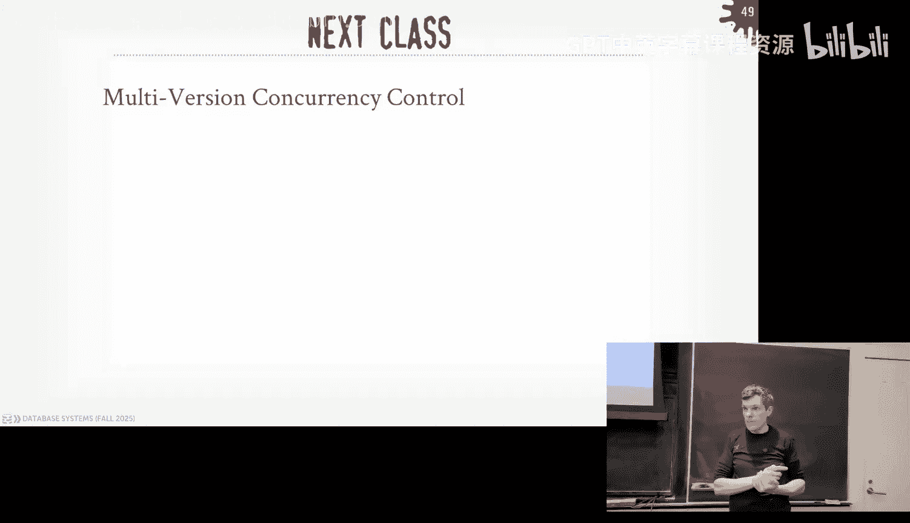

# CMU《数据库导论｜15-445 645 Intro to Database Systems (Fall 2025)》中英字幕 p19 #19 - Timestamp Ordering Concurrency Control (CMU Intro to Database Systems).zh_ -BV1bmHGzsETM_p19-

🎼给我我 still。🎼So明 check。🎼我我6块。🎼Think youall forgot what ran sound。🎼the air。

 still still let the man beach the。🎼。All guys， we're get started， round of applause for DD cash。

Awesome， welcome back thank you How to cook last week it could have been a little better。

 They're saying I have to pay taxes on my beats。Your tax counsel， you pay taxes on the beat，I mean。

 not paying taxes on the beach， paying taxes on the money you made with your beats。Yeah。

 you gotta do that。 al right， Yeah， pay your taxes。 Allright， but it's good again。

 good you're getting backward where you need to be like。 All right guys， a lot to cover。

 And today's lecture is awesome because the transactions that I get very excited。

 So let's jump into this。 So， all right， for you guys into the class。

 Project 3 is coming up this Sunday， that's due。 And we have the special office hours。😊。

This that should be the 15th， not the  fifth missing a one sorry coming up on the 15th this Saturday from 3 to 5 PM in in Gs and then post on Piazza post if you have questions or come to office hours and then I messed up the due date for homeworkmark 5 that was also due the 16th this Sunday coming up that's been pushed out a week and that'll be due on the 23rd and grades go Piazza and the website it should be updated for that Any questions about Project3。

Who here has not started Project three。Okay， and then actually I'll pose this beaz too。

 if you are concerned about your your buffo manager or from Project one or your beat plustry from project two not being completely thread safe。

 just put a latch in front of it put a global latch in front in front of the entire page table and you know what's that yeah but like the。

😡，The things that' will slow you down for project three will be like transactional。

 like the lock manager stuff， not like the page table latch， right？

Other questions that comments about Project three？All and then for database talks after this class today we have the co-founder from Mooncake。

 it was a database startup that had extensions for Postgres I could read iceberg tables that's been they got acquired by Databricks so that guy's giving a talk tomorrow as I posted on Piazza we're having one of the cofounders of DBT flying in from Philadelphia so he's giving a talk at noon on the eighth floor and gateates and there'll be pizza at that and then there'll be an info session for hiring and internships with him at 230 also in 8115 and I' post that on Piazza again you know the RSVP for that just show up talk to the guy and then the fireboat guy is Ben who gave a talk with us on Wednesday I said he was giving talk today I was wrong was mooncake but he's coming back to give a talk in the seminar series a week from today and that'll be on Zoom okay。

All right， so last class we talked about cur protocols and in particular we talked about two phase locking。

 we said this was a protocol that dataE can use at runtime to allow it to schedule the behavior or the ordering of transactions in such a way that you can guarantee serializability。

😡，And we said this was a pessimistic to protocol where the data systems assumes that transactions are going to have conflicts。

 therefore it requires them to acquire locks in different modes on the objects that they were going to access before they allowed to access them。

😡，we showed different variations of two base locking and in most systems are're going to implement the strong trick one where you just end up holding all the walks to the very end。

So。In the two days locking， two phase locking protocol， as I was saying。

 it' it's a pessimistic approach。 again， So you're going assume transactions are going to conflict。

 But if you assume that they're not going to conflict and that most of the transactions are not going to interfere with each other and most of your transactions are going to be pretty fast。

 pretty quick。I think like loading a web page。 that's basically a transaction。

 Like you're going to get some queries， get a small amount of data and then you're done real quickly。

 like in the order of milliseconds， right It's rare that transactions will take。

More than a second on modern systems。Or you could eat minutes or hours， days， worst case weeks。

 right they are more common in the old days， sometimes they're common because you have to do like big bulk updates。

 but most of the transactions don't look the majority of transactions that are executed in the world are going to be pretty fast。

😡，So therefore， if you assume these properties about transactions。

 you assume that they're not going to conflict and you assume they agree pretty fast。

 then an alternative protocol might be to。😡，Not required them to acquire locks。

Let them do whatever they want to do。And then at the end， when they go to commit。

 figure out whether there was actually a conflict， because you assume most of the times there won't be and therefore you'll be faster off than you would have been in a pe spec approach。

 like two phase locking。Sound plausible。So that's what today is about Today is about optimistic curial protocols and these are sort of fall under the umbellaumbrella of what are called timestamp ordering concurial protocols。

 and the idea is that rather than using lock to force the ordering of the operations within transactions。

 we're going use timestamps。To keep track of the order in which these things occur。Or should occur。

 And then when transactions go to commit， we need to make sure that the。

we generate timestamps for these transactions or the operations are ordered in some kind of timestamp sequence。

😡，In such a way that it's equivalent to executing the transactions in serial order。

Where you have TI and TJ， TI is going to executeude all its operations first followed by TJ。

 but again when there's concur protocols， I can actually interleave their operations where they don't actually have to physically occur immediately one after another。

 they can actually be intertwined。So the way we're going to make this work is that we're now going to maintain these timestamps for not only the transactions as they're actually doing operations of the data system。

 we're sorry within the database， we're also going to maintain timestamps for the database objects that are in our database。

😡，And again， we're being vague here， we're not saying whether it's a tuple or a page or table a database。

 it doesn't matter the protocol still works， but now we're going to keep track of the timet of of every single object in our database。

 like when were they access， when were they modified， who is the last transaction。

 what timetamp they modified， We' to maintain all that internally。😡，We'll see next class。

 how we actually can， in some systems， we can in SQL。

 we can see these things in the case of Postgres， it'll expose it to you。

 but so it's maintaining separation for you， but it's not always they don't show it normally when you see queries because you at the the end of the day。

 the application programmer should know about these timetamps。

 but underneath the covers we're going to use them to track of keep track of things。😡。

And there in the beginning semester， we talk about how。

Pages have headers and tus have headers this is in that header。

 that's where we're going to start storing these timestamps。😡，All right。

 so now the question be all right， how do we generate timestamps？😡，So they're saying satellites。

Two systems do that， but we'll get that。 when you say satellite， what is the satellite giving you？

But what kind of time？Wall clock， right， so we're getting hair ourselves。

So for a given transaction TI， we're going to say that it's going to be assigned a unique， unique。

 fixed timestamp where those timestamp domain is always increasing in value。

 meaning like you can never have a transaction show up in the future that has a timestamp that's less than one that's executeded before。

😡，You have to deal with wraparound when the number gets really big， but if you use a 64 bit integer。

 then it's going to take a while。And so the different protocols that are out there will assign these timestamps to transactions at different time or different points of their execution。

😡，So the protocol we're going to talk about today， you're not going to get a timestamp to you actually commit。

😡，At the end， you don't get one to the beginning。In the case of something like Postgressres。

 the way they do concur geo， their current protocol， which' discussed next class。

 youre actually going to get two timestamps。One beginning， one of the end。But for today's class。

 we'll assume we'll just have one time stamp。So。They were jumping ahead a little bit in saying like。

 oh we can get we can get these timestamps from satellites， but again。

 what you're really getting is what to call a system clock or a wall clock in an actual physical time that's like。

 no we keep track as humans。😡，And typically you want to use UTC because you're not worried about daylight savings but you don't want to have the clock roll back and now your timestamps are now in the past。

 that's going to mess everything up so daylight savings screws things up and you want to use UTC doesn't have to be coming from the wall clock getting from a satellite GPS satellites or getting it from an atomic clock we'll see that later when we talk about Google Spanner that gives you really accurate timestamps。

 but there's only two systems that use that kind of thing。😡，DSQL from Amazon。

It just came out and the guy gave a talk。Last class or sorry。

 there's the advanced database this class happening at the same time as this class。

 the DC SQL guy gave a talk and it's on YouTube I'll post some else about this right it could just be also a logical counter。

You could just say incrementalcratic counter by one and every time a new transaction goes comes along you just add one to it right problem with that one we'll see this one about distributed systems like how do you make sure that like your counter is sync with another node counter。

 you can't。😡，And so typically sometimes you can do a hybrid of these things， all right？

But in general， for effortsppers is here today， just assume that there's timestamps。

 assume that they're unique and assume that they're always increasing in time。

 and that we're never going to go magically back in time with these things。😡，In Postgres by default。

 their timestamps or 32 bit integers， so you wrap around eventually and that causes problems So they we'll talk about this next class how you handle this。

 but like Postgres explicitly has to deal with like the the。😡。

The thirdqubit number wrapping around and now you have a bunch of timestamps that are in the past。

 even though logically they're in the past， but physically they're in the future。😡。

And this idea of logical time， physical time will come up today。All right。

 so again today we're going to talk about optimistic cur protocol。

 which is the primary protocol and this common protocol people use in a timestamp ordering database system。

 and again the confusing part about this is that the protocol's name is the optimistic curial protocol。

 it is in the category of optimistic andial protocols。😡。

But you just say OCC and everyone will know what you're talking about。

And then we'll talk about at the end how we're going to handle additional anomalies that we're not going be able to handle out of the box。

 at least is so far what we talked about in twobase locking and OCC。

And how some symptoms might be okay with these additional anomalies。

 and we can run at low isolation levels to get better performance。什么？All right。

 so the original optimistic K protocol that was based on timestamps is called OCC。

 and the basic idea is that when transactions run， the data system is going to create a private workspace for them。

😡，Like a little little area memory where they're going to store all the things that they read and write from the database so anytime I'm going to read something in the database。

 I'm going to make a copy of it first in the sort of the global database that all the transactions can read from。

 and I'm going to copy it into my private workspace。😡。

And therefore I can make changes in that private workspace。

And no other transaction can see those changes。And then when it comes time to commit。

 now we have to go look at the other transactions that either had run in the past or are running right now。

 depending how we want to do this。😡，And we have to see whether they have read or written to anything that we have potentially modified or read。

😡，In our private workspace。And again， depending on the way we're going to do this validation step。

 we will end up maybe be allowed to commit， or we may have to kill ourselves and retry。

But the key idea is that this private workspace part is where we can do all our changes in like a private scratch space and no one can see them。

😡，So two phase locking was invented at IBM in 19 sorry 1976 at IBM working in SystemR。

 OCC was embedded in 1981 here at CMU。😡，There was a the inventor， H Q Kang。

 he's not a database person， he was a networking person。😡。

But he came up with this protocol for interacting with database and I think it's a very famous paper written by a non database person。

 of course， at the end of the day， what do you need a network for？To talkk to a database right。

 so it makes sense that they were looking these things right The whole point of my network is so you can talk to databases。

All right so the protocol has had three phases and again， because he's a networking person。

 the names of the phases might be a little weird， but it's bearworth。😡。

So in the first phase it's called the read phase， and despite the name read。

 you actually can do reads and writes。😡，But this is where you the data creates the private workspace at the beginning for this transaction and anything that it writes will have to be stored in this private workspace。

 anything that it reads， you don't have to copy it into your private workspace。

 but if you want to guarantee that you have repeatable reads。

 meaning if I read the same thing over and over again， I want to see the same value。

 then you make a copy into your private workspace。😡，All right。

 and then when you complete all your Read&W writeite operations and the transaction calls commit。

 then you automatically switch into this validation phase。😡。

And this is where the data is going to figure out， right， is this transaction allowed to commit and？

😡，And based on whether it's applying that changes would violate a timestamp ordering that is equivalent to a serial ordering of the transactions。

😡，And I'll go through examples of how we're going to do this。

And then if you pass the validation phase， then you enter the right phase where the transaction is allowed to apply its changes that are in its private workspace into the global database。

😡，And we're kind of be hand w or how we're going do the right phase。

 but obviously you want this to be atomic because you want all your changes to appear once。😡。

You knowOne way to do that is put a global lock on the entire thing， but for simplicity。

 we'll do that， but in real systems， you wouldn't do that。😡，Right。So then when you。

 if you pass also you pass the validation phase。I say when you enter the validation phase。

 that's when you get a timestamp， then if you pass the validation phase。

 all the objects you get modified are now assigned a right timestamp for this transaction that it got during the validation phase so you don't get your timestamp when you start you get the timestamp when you hit the validation phase。

 and then if you succeed that， then you're allowed to go update the global database with the timestamp you got during in the commit process。

😡，So the read phase， which we'll focus on first， this is basically where all the work happens with the transaction。

 that everything else is the commit protocol， that you're making sure that things are allowed to happen or things will happen in the order that it should happen that's equivalent to a serial ordering。

😡，All right， so let's look at the schedule now if you have two transactions t1 and T2。

 T1 is going to read on A write on A then read A again。

 and T2 is just going to do a read on A and so I'm showing the boundaries here for the three phases。

 read， validate and write again， just like in the lock and unlock stuff in phase locking。

 you don't explicitly call this in your application code'm just showing you the boxes to say what the boundaries are for these phases。

😡，So when so also too now in our database， now we have it's a key value pair so an object and a value like a and the value is  one。

2，3， and then we have this right timetamp that corresponds to the last committed transaction that wrote that value in this case here assume there was another transaction T0 that got timestamp 0 and therefore the right timetamp for this object in the database is zero。

😡，And again， mean， we have the three phases here。All right， so our transaction T1 starts。

 right soon as we call begin， we enter the read phase。

 and then we create this private workspace that has nothing in it right now。

Then when it runs a read object A。😡，Assuming we're going to copy everything to our workspace because we want to have repeatable reads。

😡，It's going to copy the current value of a， the entire tuple and put it into a private workspace。

Now there's a context which T2 starts running， so again it enters the read phase。

 we create the workspace for it， and then when it reads a。

 and we copy the latest version or we copy a from the global workspace into in the global database into its workspace。

😡，Then now it goes to commit。 So now we enter the validate phase， validation phase。

 So this is when again， the data system must assign timestamp to the transaction。

 So T2 is committing first， it's going to get timestamp one。😡。

So now we're going to run this validation protocol to see whether this thing has。

Readed or written to anything else that that any other actor transaction could have modified or also read in this case here。

T 2， red A， T1， red A， but hasn't hasn't written to it yet。 So therefore， there's no conflict。

And T2 is allowed to commit。😡，So when we enter the right phase。

 there's nothing for us to do because there's no modifications in the private workspace。

 so we just blow it away and we're done。😡，Now we context switch back over to T T1 T1 does a write on A。

 So in this case here we're going to update in our private workspace with the new value where now we're going to set the right times stampamp to an infinity just to say that this is something that we've modified。

 but we don't have a timestamp yet because we don't get one for our transactions until we enter the validate phase。

So then now reads A and again， go read the same record that it modified in its private workspace。

 so again that guarantees repeat on reads。😡，Then then， it now enters the validation phase。

 it's assigned timestamp T2。😡，Check to see whether there's any conflicts。

 there isn't because there's no other actual transactions。 So now one enters the right phase。

 it then applies the timestamp it was given to it in the validation phase。

 into its private workspace for the object that it modified So it got timestamp to So now it sets right timestamp to this object in the private workspace to2。

And then it pushes the change up into the global database， yes。细嘅出你睇一定得好似佢咪贵。The question is。

 why is the timestamp assigned at the validation phase after you've done everything rather than when the transaction started？

😡，Because you don't know that the the。You don't know what the logical ordering should be before all the transactions finish。

😡，So in this case here， T1 started before T2 did so physically T1 started before T2。

 but T2 logically committed before T1 does。 So therefore it has a lower timetamp。😡。

So put getting it at the beginning doesn't make a difference here。

 getting in the beginning would strain you to make sure that the ordering of the operations for the transactions match the timestamps you were given when they show up。

😡，And that limits parallelism。Was that。The statement is because we assign it when they validate that it gives us more flexibility to get better parallelism。

 yes。😡，Other questions？All right， so this is obviously a simple example。

 but again reemphasizing the same point I was just making that like physically T1 started before T2 did。

 but logically T1 T2 committed before T1 did， that's why T2 has a timetamp in the past from T1。😡。

And it makes sense right because T1 wrote to a， it wrote to a after T2 committed， right。

 if T2 came if T2 would have committed after T1 did， then it should have seen that right on A。

 but it didn't。Again， that's why I get into timestamp later rather than the beginning ins you can you know allows you to get that。

😡，Itows you to order to things in a way that's still correct。😡。

Even though it's not the same order in which they arrived。

But it is still equivalent to a serial ordering。 And as we said less class or two classes go。

 that's correct。 That's our， that's our metric for correctness。I证。

These don't usually contradict each other。ItRe the rankings， and it was going toified。

So the question is， is this protocol going to handle the memory overhead of having to make it all these extra copies？

I mean， if you have to update a billion things， then you have to update to make a billion copies in this protocol。

 we'll see next class in NVCC。Where you can basically take dis of the changes you make and those will be much smaller。

 but again I can back all my intermediate results in my buffer pool and if they get swapped out the disc。

 that's okay because I can always bring them back in。Yes， how do you do the right thing at home？

The question is question is， how do you make sure this is happening autoomousically？

I'm showing one tool will getting written， I can do that pretty easily atically。

 what do I have to update multiple tables， multiple pages， we'll come to that in a second。😡。

The original protocol from 1981 just had a single latch in a lock front of everything right I think so yes。

 yes for all them because again think back back then there was you didnt you had one core on your CPUs so it't like you had a put a threads active。

There's other tricks and way to get around that。But it'll make more sense when we can do MGC。

 but I'll talk a little about it in a second。There's other tricks you can do like you can you can make sure that when you do the validation。

 if you have parallel， you have multiple workers doing validation in the same phase that they're all going in the same leographical ordering of the keys。

 So if I updated key ABC and you updated key ABC then I'm gonna check A then B then C and you'll go in the same order so that way like you're not checking B and need to check A and I'm checking。

And so。Yes， yes， the statement is you need a fairness guarantee， yes。

 that's outside the scope what we're talking about here today。

All right so the read phase is repeating what I already said right so we're going to attract the readrite set of all the transactions and anytime they want to modify something。

😡，Again， we're not doing inserts into delete， we're just doing updates right now。

 and time I want to update something， I'm going to do it in my private workspace。😡。

And so if I want to have read preval reads。I want to make sure that I copy everything I'm going to read also my private worksspace as well。

 so that way that if I go read it again， I'm guaranteed to see the same thing。😡。

We'll see multiversion control in next class， this is where having two timestamps can help you because now you can say not only the timestamp of was this thing modified since I started。

 and then if it was what's the timestamp of when it was last considered the latest version so I can figure out where I land in my ranges。

 I'm jumping ahead myself， but that's where the two timestamps helps us the thing。😡。

The other thing I havent talked about also too is。In here I'm just showing all right。

 it's a bunch of boxes in PowerPoint。Obviously， in a real system， you have indexes。

 So how do I make sure that if I'm updating something and I'm going to go read it again。

I can do this efficiently and because if I go check the global index with this table。

 it's going to point to the database at the top， not to my private workspace。

 so little extra metada I got to keep track of like， okay if I'm looking for a on this table。

 I actually have a copy of it， don't check the Vluy。😡，But we can in that for now。All right。

 so the real magic happens with the validation phase right this is how we're going to enforce that the ordering of the operations within our transactions end up matching a or equivalent to a serial ordering。

😡，Right。And it related to what they brought up in the original protocol。

 it was all serial validation， meaning like I can only have one transaction in the validation phase at any given time if I now have to have multiple transactions validating because' more tricky because if there's potential deadlock issues。

 I'm taking latches on these write sets and readWrite sets of the different private workspaces。

 it starts to get expensive， but it's the overall high level protocol doesn't change which is I I need more machinery to make sure that I don't have race conditions and other problems。

😡，All right， so there's two ways to do validation and if your system is going to implement OCC。

 you do one of these two。😡，And at a high level， they're the same。In the end。

 you're checking to see for each transaction andre trying to see am I allowed to commit and the question is。

 are you looking back in time or forward in time？😡，To see whether you potentially have a conflict。

So with forward validation， the idea is that you're going to check to see whether you the transaction that's trying to commit。

 whether you read write set。😡，Has a conflict of any other active transaction running that system right now。

Becauseuse you can peek in their readrite sets， you know what things they're looking at， you see。

 have I modified something that some transaction has read， and I'm trying to commit now。

 and I'm going to be in the past where that other transaction could be in the future。

 and it's going to miss my right。😡，And then again， that would violate serial ordering。

Backward validation is where you go to see whether there's a read to write that was made by a transaction that has already committed in the past。

And that you missed it that you didn't read their changes。And therefore， again。

 that would violate the serial we're ordering because now you're traveling back in time and seeing the state of the database as it was before that other transaction made and miss that read。

So the second one is the most common one right any system that's implementing OCCC。

 including the DCSQL stuff that we just mentioned from Amazon and a couple other famous systems。

 they're going to be doing this the second approach because it's easier。😡。

Because I just go check to see what's the readWrite set of any transaction in the last certain time range or something。

Or I check the timestamp of the latest version of the transaction and see whether it's in the future from when I read it and therefore I have a conflict。

But I want to go through four validations just because that again。

 really clearly shows you the idea of things may physically happen in different order in which they may physically happen in different order than logical the logical way we want to store this in the database。

😡，嗯。All right， so as we already said， when a transaction enters the validation phase。

 the data system is going to assign a timestamp that timestamps are always going forward。

 increasing in time。And then now we're going to check for the transaction that's trying to commit in the validation phase。

 we're going to check the rewrite set of all the other active transactions in the system again for simplicity。

 assume they are just in the read phase they're not in the validation phase。

 the validation phase again you do same check or simplicity will keep them separate。😡。

So we're going to say that the timestamp for our transaction。

 if it's less than any other transaction that's still running， which again。

 if you don't have a timesamp， then it's infinity， so you definitely lessen them。😡，Then。

One of the three filing conditions must hold in order for you to pass the validation phase and say your transaction is allowed to commit。

So the first one's pretty easy， pretty easy to understand， so say your T1 T1 wants to commit。😡。

And so the first check has to be if my timestamp is less than the other transactions timestamp。

 and again， if it hasn't been assigned one， it's infinity。

 then if my transaction is going to complete its validation phase before the other transaction has even started。

😡，Then then it's safe for me to go ahead and commit。So T1 starts。

 does whatever whatever changes it once in the validation phase， then its in the reits。

 then it hits the validation phase。And T 2 hasn't started at all。

 So it can't possibly conflict because T2 hasn't read anything in the database。

 It just hasn't started。 So it hasn't。 if I make a bunch of changes， it'll see it。 The transactional。

 the second transaction will see it when it starts。😡，So this one's pretty obvious， right。

 basically saying guarantee it's a serial ordering。😡，不是。I'm saying also too， for this one。

 I'm showing two transactions if you had like hundreds of transactions。Again。

 the rewrite set is empty to haven't done anything， then this isd to two as well。😡，All right。

 the next more complicated one is if， again， T1 wants to commit。If the。If T1 is going to complete。

 it's right phase。😡，Before T2 starts its right phase。

 and T1 doesn't modify anything that's been read by T2。😡。

Then there's no conflict and it's safe to commit T1。

other they think about is like T1 makes a bunch of changes， T2 read a bunch of stuff。

 if I take the intersection of those two sets， if it's the empty set。

 then I know there's no conflict。😡，RightAnd what this is doing。

 this preventing a transaction in the future from reading an older version of an object that we modified。

 yes。The question is why are we not looking at the RedS set， that's case3。we're building up。

 So simple one is like， I you haven't started running yet， No conflict。 This one is。

 you have starting running yet， but you didn't read anything that I wrote to。 So no conflict。

 Third of them will handle the right， right conflicts。 so T1 starts， right？We create the workspace。

 It does a read on A， copy that on a workspace， doesn a write on A， right。

 We update that in our workspace。 Then now T2 starts running， and it does the read on A。

And then so now， when T1 wants to go commit， we're going to check the right set of T1 with the reset of T2 in this case here we have a conflict because T2 read the object with timestamp0。

😡，But now we're trying to write a new version of it at a future timetamp。

 That's going to be greater than 0。So if T2 was really being executed in serial ordering where it would execute after T1 committed。

 then it would have read whatever the version is， I't use the word version would have read the value at the timestamp that T1 is going to install。

😡，But it hasn't， right， so therefore T1 has to abort。😡。

Even though T2 hasn't touched anything it's not a right conflict。

But it read something in the past that it shouldn't have seen because it should be executing in the future。

😡，我要去。The question is， why not kill T2？T2 didn't do anything wrong， it's your fault， right？まこ座はたれ。

Re there again。So his comment is like T1 did a bunch of stuff。 T2， barely has done anything yet。

 isn't it better to allow is it would be better to kill T1。

 So I T2 and that set of rollingback the changes of T1， would that still be correct。I mean。

 for serialr ordering， you could play that game when you start doing parallel ones， then you like。

 you and I conflict now we need to coordinate who's going to die。It's just easier to cure yourself。

 It's like the latching stuff， the beatle。呃，How you。你在。you are。第六个。好きです。The one has a greater。这什么。

How do you decide that it's already right。All right， this David is in my example here。😡。

I said that the order of the transaction has to be one where if T1 has a lower time symptom T2。

 and then that's the zero ordering。But in my example here where my blackarrow is。

 things of blackarrow like the program counter。T 2 does not have a timetamp yet。It's infinity。

So at this point here， T1 is going to get timestamp1。😡，And one is less than infinity。

 so T1 occurs logically before T2 does in at the moment where I'm pointing at the blackarrows。😡。

有我吃完这都你拿3。原来一间话0。The question is， what's the benefit using timestamps versus what using values？呃。

Yeah， so their statement is， do I want to， why do you even bother looking at these timestamps rather than seeing just comparing the values and seeing that they're not the same because the value like comparing timestamps is cheap。

😡，You know，264 integers， that's a single instruction。 If I have these huge strings。

 I got to do dis on them that way。😡，Yes。你要来来吗。Can you watch， sorry？Live lock in this case。Okay。

 keep keep on the。Oh。Yes， yes。So their statement and they are correct that。

In a highly contentious system where there's a lot of conflicts。

 you may end up just burning a bunch of cycles， trying to do a bunch of work in transactions and then only find out that you don't commit you're not going to be able to commit it till the end so you did a bunch of waste work。

 absolutely yes。You can do that。So in that case， the pessimistic protocol activities locking would be better。

So， we've done some research about 10 years ago， we basically tried every single contributing protocol at like extreme scale。

 like 10，000 or 1000 cores， and in the end， if everyone tried to update the same key。

 it's all the same。😡，Like you get one transaction at a time， basically becomes a zero ordering。

So if you have light contention， this will be better than two phase locking。

 a little bit more contention， two phase locking will be better， but then extreme contention。

 they're all the same。So now there are some academic systems that try to be clever and say to try to measure how much contention you have and can dynamically switch or adapt what chemistry protocol they're using。

 at least switch OCC or today's locking based on the workload。

No real system implements that because it's so hard to do one of these negative to two of them。

 No way。 Yeah， no one's going to to have from an engineering perspective。All right， so again。

 with forward validation， we want to make sure the basic idea is that we want to make sure that。

Transactions don't miss changes that they should have seen if we were following along in the proper serial ordering so T2 when it committed should have seen the update that T1 did right。

 but it missed it because it read the global database before T1 installed the change in the global database。

 therefore T1 is not allowed to commit。😡，So an easy fix for this would be just changing the schedule。

 T1 starts， does a readone A write on a that all goes in the private workspace。

 then now T2 because's going to start does the read on A。😡，Then it enters the validation phase。

 So again， at this point here， even though it's the same workload。

 the order in which they're doing validation has now changed So the same operations。

 but in physically， they're occurring the same way。 But logically。

 the validation for T2 is occurring before the validation for T1。 So T2 checks。

 have I read anything that that has been。Has been modified by any other transaction， again。

 we're only checking for whether I've modified something that somebody else read。

 not whether I read something that somebody else modified。Or sorry I read something。

 I did not read something that somebody else modified， so again。

 T2 is occurring logically in the past。😡，So it's allowed to read the older version of a and allow to commit。

 Then now when T1 does its commit the validation， it's allowed to commit because logically the update to object A is occurring after T2 had committed。

 So physically， the update happened before， but it was in the private workspace that nobody could see。

😡，But then now when I go to commit and want to install it， it's okay to happen。

 this is allowed to happen because T1， sorry， T2 was in the past and didn wouldn't have seen my change。

😡，All right， the last one is the right right complex and the right read complex that they were mentioning。

 So again， it's basically the same logic， again， we checked to see whether the intersection of our right set with the right set of the other transaction and the read set and those are all empty then they know that we have not modified anything that they have written to or they have read。

So going back here again， so say now T1 wants to do a read on A and a write on A T2 wants to do a read A sorry read on B and read on A So in this case here when T1 goes commit。

 we'll give it timestamp1， we go update the right timetamp for its private workspace because T2 has not read has not physically read a yet。

 then there's no conflict with allowing T1 to commit so there's no conflict between the right set here with a read set of this because this is read B this is only written to a so T T1 is allowed to commit。

 we install that change now in the private workspace。

 then now when T2 starts running again and it reads a it's going to read later the newest version of a that was modified by T1。

And again， and this is equivalent to the transactions happening， executing and serial ordering。

So it's given times stampamp2， right？And we didn't do any rights， so there's nothing to install。

 so we just blow it all way。Excent。So at a high log， what For validation is basically doing。

Is you're checking you to see whether your right set conflicts with any other transaction that is still actively running。

 even if that transaction had started before you did。

 but if they're still in the read phase' they haven't started the validation set yet。😡。

Then logically，'' still they're going to be in the future of you。

 even though physically they started before you did。So say again， T1 is the one one let's commit。

 so we care about at this point here in the timeline。

The validation scope is at the moment that we committed going back in time all the way back to whatever transaction that to any transaction that is still active。

😡，So you got to again， keep around the rewrite set of a transaction。

 So T3 started physically before T1 did， but we can go back in time to look what T3 actually actually read。

Backward validation， which I' say the more common one， this one's easier to implement。

And there's less interference with other transactions running the same like running the same time as you because you're not checking the rewrite sets of transactions that are trying to modify their own rewrite sets。

 just going back and looking， what are the other transactions that I've committed。

They were least active when I started and committed before I committed。So again。

 the validation scope for that one， it would be this range here just for T2。Yes， have a yes。

I'm trying to wrap my mind around， like to guarantee that when0。

 like that in your previous slide to guarantee that 22 ends its validation phase。No one else。

Reading something that teach。Like to me to implement that， you kind of need it like。

Stop the scenario like what if you compare yourself while you that idea's right。

 so their saving is and they are correct that mostly correct。

Don't I need to make sure that when a transaction goes to validate？That the validation or the right。

 the right phase with Po art。Like have I gotten past validation yet for the moment where you can make sure that no one else started。

Reading something that you're writing。 Yes， so。AndIf you do serial validation， yes。

 simplestly is you stop the world。Right or that you could put hints out and say I'm in the global Davis or in a posting table somewhere that says。

 I'm about I'm trying to validate now， here's the things that I've modified。

 so I'm gonna go check and see whether anybody else interferes with me。

 but anybody else that tries to read this， the thing I'm trying to validate on wait。

And like when a new transaction comes in， you need to meet this data structure。

The same they correct that like there's a little bit of。

Backward validation being done by transactions when they start because you have to check to see whether this thing is in in the process of being committed。

 Yes， well that's what I'm saying so。If you assume the transactions are fast and the rewrite sets are small。

 then like there's a window， yes， but it's going to be fraction of a millisecond。

 less than a millisecond because you're just checking things in memory。But again。

 if my transaction for， ran for hours or days， then yeah。

 that's going to be basically locking the whole stuff down to be a single threat executing。

 absolutely yes。That avol。MVCC will handle a little bit that because they'll do basically the。

They'll store in the T itself the metadata about what is what's being committed or not。

 You start have the check， there's an actual transaction table to keep track of like。

 who's all the transactions that are still running。😡，And got to go look at them。

 but like you don't have to check like。I can get information about whether the current version of the object I'm looking at is the one I should be reading directly by looking the object without checking a global thing。

😡，ask yes。我家。Re validation so we have to check。那啲要。A we to be looking。Yeah， so the question is。

 with background validation， I said you have to check。All of the transactions that have committed。

That committed since I started yes， so there would be a transaction table we'll cover next class。

 there's basic internal table says here's all the transactions that are that are in some state。

 my system they could either be like you know waiting to start running like my read phase balance phase right phase and then also like committed。

😡，But not completely gone。 because someone is still depending on a note， you know。

 maybe depending on see whether they conflict with them。Okay would like it or validation。Yes。

 and for validation， once something commits。And we pass the validation step。

 then we're done with them， yes。Yes， I think the answer yes。

Why can't you just go and a database and check like the main tables。Like， there are。

 there are times stampamps associated with all the object that think wrote to。ど。So the question is。

A be very clear when you say check，'s like who's checking and when are they checking which of the。

The time stampamps of the objects that you Japan。Right，Yeah， they are correct。😊，In this step here。

 why do I think keep track of the transactions that are around。

 Why did to check the object that I wrote to。Or red to red。

 you got to check the reads as well so like。You why not check every individual tuple versus just checking this like state table I' mentioning because if the。

Forness， correctness is what you're proposing is still correct。

 like whether you check the state table， the transaction state table or the individual twoples。

 it'll still be correct， it's way faster to go check a single state table that's going to have all your information because that'll be in memory。

😡，Whereas it the twoples that they modified that that I read。But I didn't write to。

 so I read them and maybe they got swap at the disk。

 and I got to go read them again to see whether someone has modified them since the last time。😡。

Right。We'll see this in it sounds like a crazy ideare basically trying to say。

 I got to read it twice。Some systemss will actually do that， we'll cover that end of this class。很大的。

て組。Backward or or about capacity。The question is backward validation versus forward validation faster。

In the end， I think performances are the same engineering wise backward is easier that's why most assistant do that because there's less interference with the runtime of other transactions with backward I'm just going to see whether things have already committed。

 they've already done， so I'm not really interfering with them because they're dead or they've moved on。

And most systems implement the backward one。Right right。

 so then this this one we covered already about like the serial commits and the principal pay commits。

 again， it's。It's a bit more complicated。You have to make sure things happen in the same order and you acquire latches on the various data structure using objective things。

Maybeve already covered a lot of these points。 All right。

 so the main takeaway from OCC is that this is going to work really great if the number of conflicts are low。

😊，all the transactions of read only， and that's the best situation because。

Who cares whether you know you and I read the same thing because we did， so we can commit right away。

 right？But as I've already said before， if you have high contention。

 you actually do have a lot of conflicts， then this is going perform worse than twob locking because in the case of two phases locking。

 if I find out I have a deadlock， I'll find out the moment I try to acquire the lock。

 I won't do a much of work and then realize that was a mistake and I have to throw all the work away。

😡，NowI may do a bunch of work and then try to get the last lock I need of doing a million things and then get a deadlock and get killed so you can't solve the same problem。

But in many cases， because today's locking is pessimistic。

 you can't do things until you get the locks， so if something is high contention。

 you won't get the lock for it and you don't end up wasting time。

The other thing that we'll see as class， the big problem with ACC is that copying from the private workspace that sucks。

 that's a me copy， that's a terrible thing to do it's always going to be slow and in the case of multiversion concur control what we'll see is that you can basically take a diff of things and only copy the things that you actually modified。

😡，And that can be much smaller because if I  a0 attributes and I' going to update one of them。

 and what I'm showing here today， you have to copy all thousand attributes into your private workspace。

In the case of when we see Delta records in NPCC， I just copy the things that I' modified。

Was that the question is what about noncomp reads？Time tempamps will fix that for us next class。Yes。

So Postgres is basically doing what I'm describing here today。

 instead of copying the private workspace， they're going to copy twos into back into another page in the table。

😡，Again， these were things get money， they're doing multiverse cur control which's going to look like MCC。

 but they're using two face locking to protect things。But also predicate lacking re serializability。

We'll get there in a second。O。All right， so any question about OCC before we jump into more stuff。

Because now we're talking about how we handle inserts and deletes。😡。

Because this is where everything we've talked about so far is going to break。You still need it。

 we need to make it better。So again， if it's just updates， sorry， and reads。

 that's fine because the set of the objects， the number of objects in our database is not and tables are not going to change。

😡，But when we start now having modifications that can affect the result of queries within our transactions。

😡，Like looking at high level concepts insteads reason write。ThenThen we have to be。

 then these protocols are going to work。So look at future transactions now where now we're actually going to be doing queries right instead of just doing again simple read rights。

 but again， the data assessment end of the day， you just going to see read and rights on objects。

But SQL queries as easy understand。So we have a table of people。 We have their ID。

 a name and a status。 And so T1 is going to start。 It's going run this， this aggregation query。

 It's going to count all the people where the status is paid。

Then there's a context switch right and it gets to value 99。

 Then there's a context switch over to T 2。 T2 is going to insert DJ cash into the table and set a status to paid。

Good job， right？And then it commits and again， install our change to the database。

Then now T1 is going to run again， run that exact same query。

 but now the count of number of people paid is 100。😡，So again， this is an underpedal read。

But it's not unrepeatable in a single object， It's unpeatable in a range of objects。😡，Right。

So two days locking and OCC will have this problem。😡，So what is the problem。

 well assume we're doing 2PL for simplicity。😡，The problem is that you can't acquire a lock on something that doesn't exist。

😡，He wasn't in the database of the table the time the first query ran。😡。

So even though it took a shared lock on everything。Right， again， yes。

 you can take a share lock on the entire table and assume we didn't do that。

It couldn't take the lock on his record。Therefore， I was allowed to insert a new record with with his information。

 and then I run the same query， and then now I'm seeing things that weren't there before。😡，And again。

 if we were running in zero ordering。😡，Of our transactions， we shouldn't have that phenomenon。

 we shouldn't have that problem。So this is what is called a Phantom read。

Right phantom or ghost or know apparition， whatever。

 the idea that tuoss are magically going to appear and disappear。

And calls us to get incorrect results in our queries。😡。

That should not happen if you are running in true serial ordering。

So range scan is the most obvious way to think about this。 It something I read read it range once。

I don't see it， there's no value in there， then I read it again and now there's a value in there that I didn't see before or the value that I saw before now has been deleted。

😡，Right。Christen， how can another transact delete if be able to show life on it？系。系。

Depending on how you're defining the ranges。Keep it simple， right， yes。

This is assumed that someone didn't it something， but the vote ID is the same。Right？Or again。

 for two days locking that wouldn't occur but OCC， that could still happen。😡，All right。

 so how can we fix this problem， guess question？😡，是。啊。Their question。

 the same is this fan problem is because like I'm within one transaction。

 I'm not seeing the same results， yes， so like if I run and I get 99 and then you run and you get 100。

 that's okay because again， like that insert should have happened in between my query and your query。

😡，RightAnd that's put into a serial ordering。 It's like within one transaction。

 I I do are things disappearing。O。So how can we solve this？Theres four basic categories approaches。

 right， So the most obvious thing is just lock everything， Lock the table， lock the database。

 lock the pages， whatever。 And then that way， you can't insert anything into。

TheIn a range that I've read， right if I lock the entire table， you can't do any modifications。啊。

You problem solved。But again， if I have a billion tus in my table and I'm only reading small ranges。

 that's probably not a good idea because now I'm locking more things and actually need。

Another approach is what sort of we're talking about here is you just rerun your scan again。

When you commit and see whether you see things that you shouldn't have seen。Or things have changed。

下雨的。How would you know you got to keep track your resetset？打案的。

They they said that that's potentially building the rows， yes。We'll come to that in a second。

 you can do the reverse。收清。The question is， do I keep track with all the bone ribs again， yes。

 or some kind of fingerprint of it or something like that？But again， this what I'm saying。

 like if if you assume your transactions are small， those transactions are。

 then this is okay if I go read your account record once and then read it again， you they do。

Where I read all your orders， say you've bought 10 things on Amazon， you have 10 orders Amazon。

 read  10 orders， the big。😡，It's not for free。不6。With that， not that expensive。 Yes， again。

 there's no free lunch。And then predicate locking and index locking we'll cover that in more detail right so again。

 this is what IBM figured out in 1970s 1976 like they figured out that the ordering or try to figure out how to do this efficiently。

 at least in case of predicate locking is going to be an MP complete problem or NP hard。😡。

Right rerite re executinguting scans， that's easy to do if everything is in memory。

 everything's fast， but again， larger things is problematic。

 So the most common of these is going to be the bottom one index locking。

 we'll that in a second the two middle ones are kind of pretty rare for re scans。

 you only see this in the in memory queries and then the one at the top lock everything。Again。

 some senses they'll do it if you care about serialerizability。All right。

 so let's about reexcus hands。 so again， you basically track of all the warehouse clauses for any any query you run。

😡，And then when a transaction commits。You just check to see whether the output of those wear clauses match what you saw but when you ran into the first time so you don't need it like if it's a say a select query that computes that aggregation。

 I don't need to keep track of the aggregation result or whatever computation I'm doing or the joins。

 I just need to know for all the base tables， what data did I see。😡，Right。

So I just run it again and see where I get the same result so Hekaton does this dynnamo Db and fauna kind of do the opposite reverse it。

 meaning they run your queries first。😡，ButDon't make any changes to the database。😡。

They call them like reconnaissance transactions， they run your queries and see what it's going to do。

 keep track of your scan sets， then you go to commit。

 and then you actually run the queries for real and see whether you match what you did when you ran the first time。

 if yes， then you know you got things in the right order。😡。

So you're still doing whatever the timetamp ordering or the two days locking part when the fake transactions run first or the fake queries run first。

 and then now that I know that I've got the right ordering， if I run them again。

 if I get the same result，😡，Since I scheduled you in a serializ way the first time when I went it for Rio and I get the same result。

 then I know it's the same。And you're safe to commit。In the back， yes。系。别我忙。等我备时间。

WaiSo your set of the first transaction is you said long。

Long in time or long in like they're updating a billion things。Okay。

 you have to anything and then you have no transaction that's really short。Yes。第一直。Yes。Yes。技术性。Yes。

So there are scenarios I have transaction T1， it updates a billion things， transaction T2。

 while T1 is running comes in， reads something from that T1 modified。😡，啊。

And then then it goes ahead and goes the commit， right， that's your setup。

If you cared about serial ordering or serializability。

 T2 is not allowed to commit until T1 commits because it did a dirty read。

 it read something that T1 modified and hasn' T1 has not committed yet。😡。

So if you care about serializability， then you have to wait， if you don't。

 we'll cover that in a second， then you commit。And then you， mean not you， well。

 use the application program or deal with whatever the consequences of that， right？😡。

DaDadvis did what you did what you told her to do。All right， predicate locking， the idea again。

 this is what they sort of they were proposed to do in IBM in the 1970s and realized it was super hard to do on the Harvard they had at the time and also doing this exactly is again MP hard。

 the basic idea way think about this is that you're going to maintain this high dimensionional space of all the possible locks you could have in your database based on predicates。

😡，So not locks on individual tus like we did in two phase locking where like there's a lock table and I cho lock on on you know record 1。

2，3， right St of it's a more abstract concept。And then I'm going to check to see whether I have any of these。

Polygons are these high dimensional objects that are defined based on my predicates。

 if they intersect， then I know I have a conflict in those transactions。😡。

And then I just do two face locking， whatever to figure out the order in which things should occur。

 wait at the weight or kill yourself or whether I have deadlocks。So again。

 this is obviously very difficult to do if you have a lot of predicates on a lot of tables。

 and so you can approximate this using precision locking。

 where you just look at the rewrite sets and you figure out whether there's overlap so you got to keep doing things around in the case of Postgts and a bunch other systems。

 they're going to approximate this using index locking， which we'll talk about in a second。😡。

So no one does this exactly because again， it's kind of too hard， too difficult to do。

 but again you can kind of get away with it using well。

 you can get away to this precision locking stuff， which is basically you look at the rewrite sets and you see whether there's conflict。

 therefore you know the predus overlapped。😡，So the only system that does this with precision locking is these German systems and they're all written by one guy right so ced to be  Ura and hyperper。

 it's all written by this one guy in Munich and the precision locking papers is like from 1983。

 it had like 30 citations when the German guy found it and it's like this solves exactly my problem and the implement exactly what they're doing here and it guarantees serial liabilityability。

😡，But the original proposal of predicate locking look like this， so I have my preddiicates。😡。

my two queries and I just extract out the wear clauses and I'm not going to map that to some region in this high dimensional space。

 so for simplicity I assume that there's only two dimensions， there's a status and the the person。

 right。😡，SoThen now for this other one here when I insert this query。

 that's the same as acquiring a lock on the name DJC and the status is paid。

 and then if I know that the two regions overlap， I know that there's a conflict in their predcateates and therefore I have to decide now my protocol。

 who's allowed to acquire the lock and who's allowed to commit and so forth。😡，Again。

 for two dimensions， it's easy。 But think of like a table of know，10000 columns。

 this becomes unintainable， yes。So those precision locking we teach this in advanced class down here。

 the basic gist is like you look at the rewrite sets of the transactions， yeah。

 the exact rows and you just check to see whether like they predicates。

Like you're basically running the， what it says， you're taking the wear clothess of the other query and you're seeing whether it matches any tuples in the rewrite set of the other transactions。

YoullYoull see a water down version of this in Project 4。

I been think of like the reads right side is there's another table。

So I just run my query that I'm going to run in my transaction on that rewrite set。

And see where that matches。All rightSo most systems are going to do predicate locking and you can kind of think of this as a special case of index locking where we're going to use the indexes themselves as the mechanism or the data structure to keep track of what locks are being held by transactions and this will cover the values they don't exist yet and allows me to lock them because again I don't want to have in if I'm doing twob locking in my lock table。

 I don't want to have entries for ranges or things that don't exist because that's going to become difficult to maintain and actually build。

😡，So I'm going to use indexes themselves because they're already going to have data in an ordered manner。

 and I can use them as a way to figure out how to lock things。😡。

So therere going to be four different approaches and we're going to build up and use some of the basic ones。

 like the key value locks， but then we can combine all these together and include the hierarchical locking that we talked about last time to see how we actually implement this in a real system。

😡，Yes。No， that's好对。The question is if you have no in on the keys， you have to fall back to scans。

不来太住方。Hedy what。The question， how would you lock this， you lock the entire table？Yeah。手你攞嗰度有。

question is how do you lock something doesn't exist， gap locks， two slides。😊，All。

 so the most basic one is a key value lock in your index is where you have a thing that you know it exists right。

 and then I can just take a lock on it。😡，And again。

 you don't store this in the actual B plus Street node itself。

 you're going to store this in a lock manager， but now you're keeping track of like within this value。

 within this index， this transaction holds the lock for it for an exact match。😡。

For things like infinity， the upper bounds or lower bounds， you can just have virtual keys for those。

 but it works basically the same way。Right。So then now the handle of the case they were asking about is how do I lock things that don't exist？

Well again say that I have now a transaction that wants to insert value 15 right between 14 and 16。

 15 doesn't exist yet， so I'm just going to keep track of all the gaps between the keys that I do have in my index and then now I can take keys on the gaps or sorry to take locks on the gaps。

😡，So this is going to say I'm going to have a lock on the gap between 14 and 16 exclusive。So again。

 these are all integers would say someone that inserts like 15。1， 15。2， 15。3。

 all of that would be covered by this single gap lock。😡，If it's integer， it's only 15。

 but for any possible value thing is strings。I have key AA and key ABC。

 I need a gap between the two of them。And the gap lock would handle that。

But then now I don't want to have to keep track of or maintain a lock for every single key value pair that or key that I want to maintain and every single possible gaps that I may have within a range of values。

 so now I start combining them together and take key range locks。😡。

So my lock tables I'll basically keep track of like， you know， here's the starting point。

 14 inclusive， and then the key range lock goes up to 16 exclusive。😡。

So now if anybody wants to insert something in this range theyve got to go acquire the key range lock for this that covers the gap and it would tell me whether I'm allowed to put something there so I'm going back to that query at the beginning where I'm doing that scan to try to find people within a status I could take the key range lock from that status equals paid up until whatever the next key is including the gap and that'll prevent somebody another transaction from inserting a value in that range。

😡，You can go go in either directions， typically in your system， you only go one direction。

 either go to the current key and going backwards in the ordering or the current key and going forwards。

 but you only do one。😡，All right， so now we can put this all together and start doing higher locking that we had before。

😡，So again， this is kind of different than we talked about before because we were like I was taking locks on tuples and tables and so forth。

 but now I'm taking locks on actual values and actually within the page itself in my B plus tree。😡。

So I can take an attention exclusive lock on this sort of range of values within the page。😡。

And then within that， now I can take an exclusive lock on the key range from 14 inclusive to 16 exclusive within the gap。

But then also I can take an exclusive lock within another transaction can take an exclusive lock on another key value pair or key range。

 where I take an attention exclusive lock which is compatible with the attention exclusive lock that somebody else has maintained now I can lock 12 so two transactions can come in。

 somebody could be updating 12 and somebody could be updating 14 up to the gap。

And this will prevent phantoms for me。Because again。

 I'm trying to avoid from people inserting something that didn't exist before because this allows me to take lock on things that I didn't know about before。

你看。Yes。Yeah。The question is what does the gap lock look like what do you mean？还会觉得。TheQuest。

 how you implement it。So you just keep track of like we're here。

You would keep track of like the range in which this is being locked。

 so 14 exclusive to 16 exclusive， so the in the lock table。

 you would keep track of like that interval。And so therefore， if anybody is trying to read something。

 they'd be scanning along the leaf nodes and say they're finding values。

 say you don't know the values that are the keys that are in a range before they start。

Before you go read something， you have to go check to see whether you can quiet a lock on to read something。

So think of like the BB you implemented in Project two。

You got to go check the lock manager as you're scanning along leaf nodes。Yes。

 so if you come in and use intent to modify your job like advertising。

Do you always lock everything until the end of the page because you might be moving the I。

The question is， if I intend to insert something into this gap。

 Do I lock from the gap to the end of the page， you would know。Okay， at this point， you're inside。

 you're inside the page。 So you know what the values that are here， right。

 you know you have it in some kind of read mode， you're reading things。 That's okay。

So then I'm gonna to go check the lock manager。 So I know what I'm trying to insert or delete right。

 So you go check the lock manager， give me the lock for， for the thing I'm trying to modify。

 and it may be to the end， It may not be depends on what you're trying to do。

 But I'm saying you know the value you'd have to know the value you're trying to modify order to quite the lock for it。

😡，Yeah， but let' you're trying to insert5 Yes is's an issue that you're going to move 16 or。对 need。

So his question is。If I insert 15。And then now I've got to split this node， how about that to beluy。

不是。You told me about physically input the page， I still have to take a right latch on the page。

These are logical locks， so I'm trying to lock the logical values that are stored inside the page。

 where for me to modify the page， I have to take a physical latch。😡，Does that makes sense again。It。

In order for me to physically modify the bytes within a page。

 I had to have a right latch on that page。😡，There's another this is why we were separating locks and  latches。

 the locks are protecting the logical contents of the database。

 the logical contents are the keys that are stored within a range。

 I'm using the index as the mechanism to efficiently keep track of that range。😡。

But I still have to maintain all the physical correctness using the latches。😡，Lots of hands， yes。

This mean that when you're trying to do a serial。Eelection一。Don't have an index on。

The certain of key that its going to be really inefficient， because you。The question is。

 does that mean if I try to do if I'm trying to run serialized transactions where I don't and I don't have an index on the thing。

 on the ranges that I'm looking at？Could that be caused and be expensive， yes。It's no free lunch。

 right？Yes。Anyone。Try to do syntactic vector walking。I like。The pre is that it gives you。

All the other the question is， is everybody don't try to do syntactic？

static analysis of the predicates to see whether you would have conflict or other。Maybe。

 but like the like。As soon as you have like functions inside that thing， it comes。也是划 on the后。

And the statement is like， could you？Could you do a quick fix？

Could you quickly try to assess whether you can determine statically through the predicates。

 whether you would have a conflict with other transactions？If。If no， and it's privilegely correct。

 then you're good， if yes， then you fall back to the more heavy weight。Like if， if you can't。

We can't verify that they're going click。I there。The question， is there any work in this space。

 maybe it's been 50 years since people are trying to do this so maybe。I did not know yeah。

Questions in the back， sorry。Okay。I think weve covered all this。All right， so now。

Here's the dirty secret。We spent the last three classes talking about how great serializability is。

 how it's important to keep track of what transactions are doing so you can generate schedules that are serializable。

The dirty secret is most databases do not give you serialerizability。😡，84。Right。And。In some systems。

 there' a lie to you。Orracle famously does this。 if you say to Oracle。

 I want to serialize all transactions， it'll come back and say， y， got it no problem。

 It does not give you serializability。It gives you a lower form of isolation， right？

And so the reason why these systems are not going to do all this extra stuff we've been talking about the last two classes。

 like they're still going to do two phase locking， they're still going to do OCC。

 but all theseme I just talk about now to guarantee serializability。

 they're not going to do these things because they're expensive they kept asking in the front row。

 what if you don't have indexes how do I do this？😡。

You have to do the slow thing and just scan everything。And so by default。

 that's going to suck if that's on my default， that's going to suck if people are like。

 you the database sucks it's so slow and they're going to switch to something else and you lose out potential costs。

So that's why default。Most data systems are going to run with a lower isolation level。😡。

So now the question is， what is an isolation level？So a isolation nation level is going to control。

The the sort of how aggressive you want the data system to be to ensure your transactions。

Don't incur any of the anomalies that we talked about before。dirty reads un repeatpeatable reads。

 loss updates， and then the phantom reads we just mentioned here。So by default serialeriz。

 make sure that none of these things happen。😡，But if you run at a lower isolation level。

 so when your transaction starts， you can tell the system run my new transaction。

 but run with lower isolation level。😡，You may incur some of these other anomalies。

And so what I'm showing here is the basic ones that were originally defined in the SQL standard from 1992。

 and this is assuming you're running in a system that uses twopa locking。Um。

But the highest level is serializable， so you say I want my transaction on a serializable and you're guaranteed to have no phantoms。

 everything's repeatable reads， and then no dirty reads。

The next low isolation level is called repeatal reads， and this is where fs might happen。

But the other three types of anomalies will definitely not happen。

We committed is that you have phantoms， potentially unreated reads because you're reading data from transactions that have recently committed。

But maybe you read it first an object before they committed。So you see the data one way。

 then they commit and now you read it again and because you're allowed to read committed data。

 you'll see different values， you may have unrepeatable reads。

And if Rita committed is just like you're driving up the seatbelt， all these anomalies may happen。

Now I'm counting my language here， I'm not saying they will happen， I'm saying they might happen。

Because again， if I just execute one transaction by itself and other transactions。

 that's serialreizable right， if one transaction in one schedule with no other transactions is by definition serial。

 so that's always be serialreizable。😡，So I'm putting much of maybes here just to say that like if you run at these little isolation levels。

 you may have these problems， depends on what are the other transactions running at the same time that your transaction is running。

😡，Is reading right the data that you're reading and writing to？So now if you do this in twob locking。

 how do you actually implement this， again， you just turn off a bunch of the stuff I just spent the last half an hour telling you how to do。

😡，Again， OCC basically works the same way， but in the case of TV is locking。

 if I've ro a strong straight2PL with additional phantom protection by either like re executingcuting scans。

 the index locks or predicate locking or whatever， then I'm guaranteed I not have any phantoms and all the transactions will run in serial order the equivalent to a serial ordering。

😡，For repeatpe age you you just don't do the index locks or the stuff we come at the end。

 just do two phase logging， strict two phase logging。

 strong strict two phase logging and you're guaranteed to get everything without everything but fanantoms recommitted you。

😡，For this one， you basically just do 2PL， you don't do any index logs or gap blocks that things we' talk about at the end。

 and then when a transaction reads an object， you acquire the shared lock on it and then you immediately give back the shared lock。

 you release the shared log。😡，Again， it violates2PL ordering。

 but and you're going to get better parallelism because you can guarantee that other transactions can read data that you've read。

😡，Immediately， you still hold the right locks to you commit。And then in readta committed， you just。

YouYou just don't take any sharelocks at all。What else。If you modify something。Again。

 it's about what you。哎。but what your transaction cares about。

 So I want to make sure that I don't have any lost updates， so I'll hold the right locks。

Untilil I know I'm not going to write to that transaction anymore and in case of most systems since you can't explicitly call unlock on on a excuse lock on a tuple。

 it then it's you just hold it to the very end that you commit。Most of this。接的。

Sam is you cannot have loss updates for readcommit and below。You can， yes。So以掉你之后。Yes。So I it' hard。

If I want to avoid loss updates， I don't want to write something and then not be able to read it。😡。

Yes， certainly。So you give up the exclusive locks。I think I'm a recommit it。

Let me double a check this。Yes。Again， hopefully he makes to clear this is hard。So。Again。

 you define what isolation level you want， if you want something other than the default。

 when transaction starts， and different systems have different syns of how to do this， right？

And then the default is going to depend on what your system actually provides for you。

 So this is just a quick survey of a bunch of know various systems that are out there。

 And you see that there's this little part here right here from know SQL server MySQL orle on Postgres。

 those are the top four database relational database systems in the world。😡，And by default。

 none of them give you serializable by default。case my SQL is actually better than the others because thiss actually gave me repeatable reads。

😡，Which is higher than。What's that， All， this question is what is the national isolation。

 that's the next class。So when they defined the SQL standard in 1992， they forgot about。

This multiverrgging selftech class。And there's a anomaly that can occur with substance isolation that doesn't occur with two phase locking。

And the isolation level therefore is classifiedify as different。

 It's called snap isolation does means that I see a snapshot of the data that that was created by any transaction transactions I committed before I started。

Yes。手机这个应用。Proably does all。エベす。Have some。啊。The question is。

 do all J systems have some version of OCC now， some systems will do TL？就个杀给。It's one of the other。

Multiversioning is going to be， you can do multidirging。We'll see you in next class。

 you can do it with two v locking or you can do it with OCC。

But the way you also do multiverrgging is with timets。

But like the timetamp will just tell you in which what when was a version created doesn't tell you who's allowed to do what and when OCC or 2PL defines that ordering。

😡，Question， which ones the most comment，2PL。そいとしてるべき。All right so。Right。

We're jumping at sorry so subsization will cover next class there's a few systems that do serializable right ingress was what stoneer built before Postgress cost DuB was a distributed system out of New York City or Volb is a system I helped build when I was in grad school by default。

 you get serializability， you can't run anything lower。Google Spanner and I guess D SQL also as well。

 actually I'm not sure what DSQL， but Google Spanner is one of the few systems that support strict serializability。

 also known as external consistency， meaning the order which transactions are committed is the order in which they arrive in the system。

😡，So they're getting time tens when they show up， and that's the order that's going to use to determine when they commit。

Then he's like， what is cursor stability？So that's this other weird thing again there's a whole bunch of isolation levels beyond the floor basically I told you and you can start of think at like the sort of chart here at the bottom you have reit read uncomit I think there's even one below this。

 but see what doesn't support this and so now you have sort two branches you have above recommitted think of like you're getting fewer anomalies。

 cursor stability is something that IBMDB2 does basically you hold a readlock a shared lock on the cursor that's reading the data and that guarantees that within as I'm the cursor scanning the data I'm holding implic a lock on that range but then when I'm done scanning I give it back up So as I'm reading the table within my cursor。

 I'm guaranteed to see a consistent view but then after that if I read it again it won't be repeatable。

Yeah no insert that deletes why I'm scanning。Only。Yes， only in the range， yes。

 but then as soon as I'm done scanning， the cursor gives it up。😡，Again。

 and then strictilized way again it's the order in which they arrive so I'm going fast here we'll do demos and look at this more in the next class。

 but the main tip I wish you get is like most systems， most data systems that are out there today。

 most workloads are not running with serialerizable isolation even though I made a big deal about it so this is a survey we did a few years ago where we SDDbas for their databases is running production what's the most common isolation level they're using and you can see the most common one is recommitted because that's the default in most systems。

😡，with that， is it a reasonable default？Nobody knows， right？Because it depends because again。

 these problems might occur， so like if 99。99% of the time， you know there's no issue。😡。

But then there's one time maybe you read something you shouldn't have read， how would you know？Right。

Right， or like you you know， sometimes you see weird things like， you know。

Anytime you maybe a refresh website and you don't see counters look correctly。

 that's event consistency issues， not this， but like for other things like，You wouldn't know。

All right I'm blazing all this so I apologize going fast。

 but the main take from all this is that there's basically two categories of con protocols。

 pessimistic， like two base locking and optimistic using timetableple learning that we talked about today there's no one protocol better than another and then next class when we talk about multi versiononing it's actually being a combination of all these techniques put together。

😡，And we we're going to now， instead of maintaining a private workspace。

 we're going to have the new versions of change or the objects that we're modifying。

 they're going to show up in the global database， and we're going use these timestamps to figure out what we're allowed to read or not read。

 okay？😡。

Heレ。🎼what你。🎼我敢从不去。🎼Yeah。

🎼管你最最帅 back走不见。🎼Yeah。🎼你我再走不见。😊，🎼Yeah。🎼说你最最帅我 can走不见。😊，🎼Get the fortune the maintain the。

