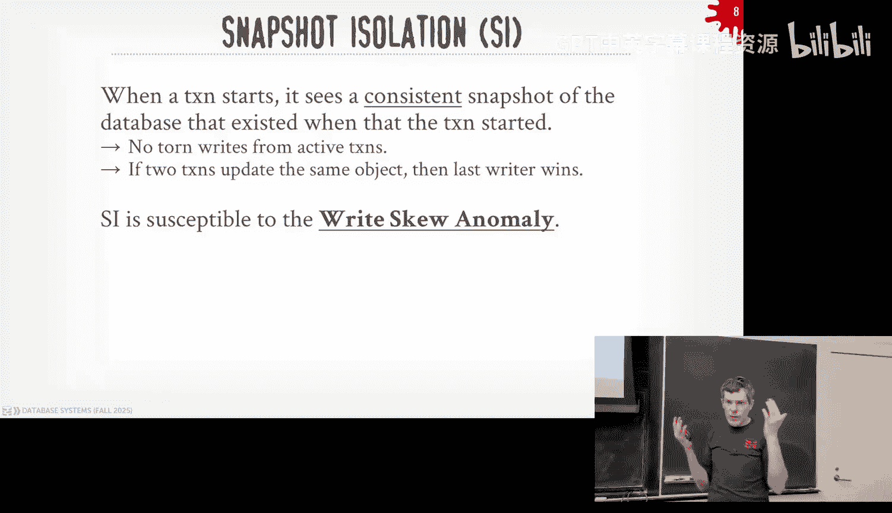
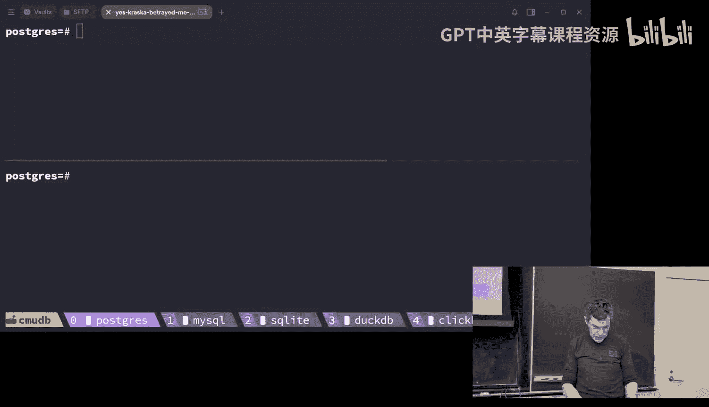
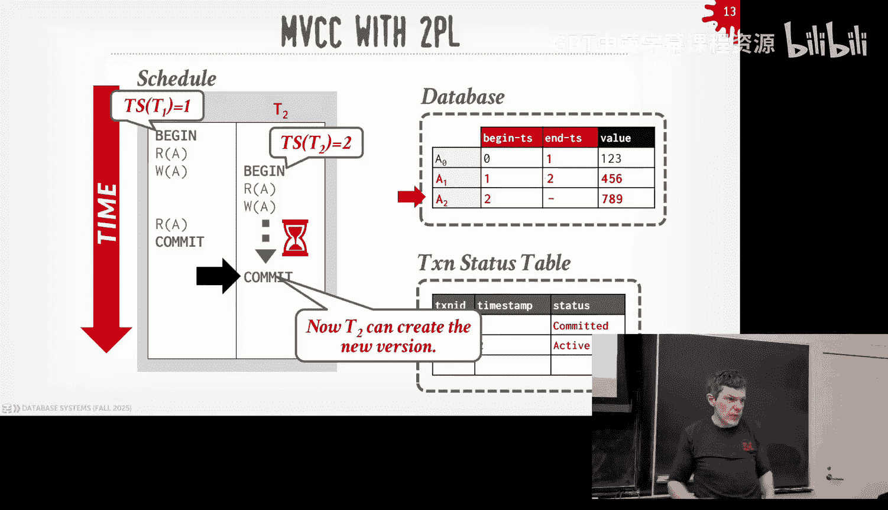
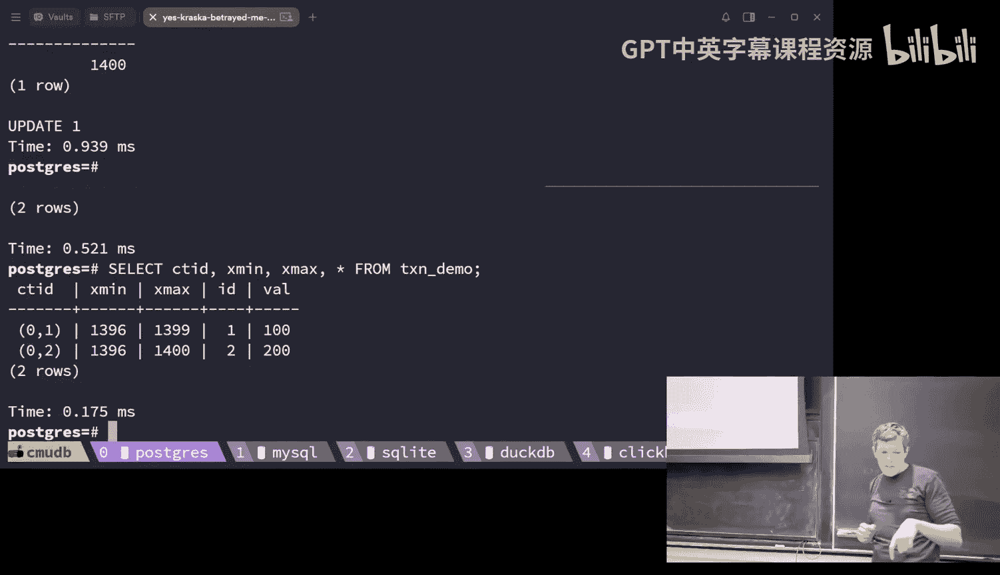
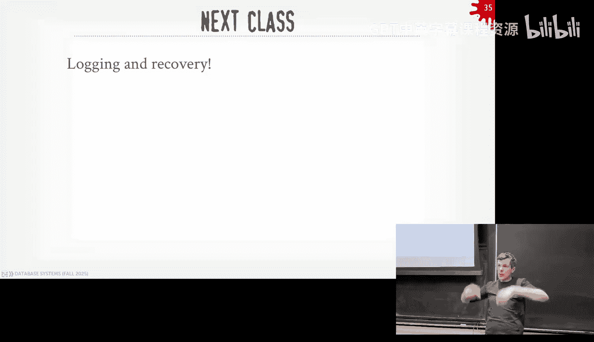

# CMU《数据库导论｜15-445 645 Intro to Database Systems (Fall 2025)》中英字幕 p20 #20 - Multi-Version Concurrency Control (CMU Intro to Database Systems).zh_en -BV1bmHGzsETM_p20-

🎼给我我 still。🎼So明 check。🎼我我6块。🎼Think youall forgot what ran sound。🎼the air。

 still still let the man beach the。🎼。All， awesome man， Rattle bucks are need to cash。And。

 thank you for coming。 You were here early。 Nobody was here。 I we got here early。

 The other class before us wasn't here as we didn't think it was class。

 But he still set up your DJqui。 shows you dedication to the crap。 I appreciate that。 All right。

 guys， lot to cover。 unfortunately， we would't have the speaker from Yel Book today。

 that got it's not to get rescheduled to do a scheduling issue。

 So today's just just me no outside Spea， but。😊，It's fine because there's a lot we want to cover for multi virgin because it's a super cool topic and you're going to see this everywhere All right。

 so again。For you guys in class Project three is going to do this Monday coming started this Sunday coming up the special office hours be this Saturday at three o'clock in Gs homework five is going be do again it was extended for another week that'll be doing the 23rd and then Project four went out earlier this week and that'll be due on Sunday。

 December 7th and then we'll announce the recitation probably schedule that for next week obviously before Thanksgiving so we'll try to do that next week and then again you want to finish Project three make sure you pass all the tests and then do the merge of the latest version of the code from the public repo and you can started on Project4 so any questions about Project three。

Yes。That。但哪一的是。B。The question is， should the nestestle lip join be a naive nest lip joint or a block nest loop join。

 what do you want to do？Well， the blog is more efficient yes。Yeah， you can do that。 Yes。

 it's up to your decide， yes， yes。2块。All right， so。Last class we were talking about OCC and again。

 there was the OCC。There's the optimistic criticalial crco protocol category and we were contrasting that with the pesemistic protocols like in two-pha locking and optimistic you assume that that's not going to be complex。

 so you let transactions do whatever they want and then only when they go to commit。

 then you see you check to see whether they would have violated any the serizable ordering and in the case of the protocol we looked at OCC。

 we talked about how when transactions make changes to the database。

 they don't apply them to the shared global database that every other transaction can read from。

 they're instead make a copy of the two that they want to modify。

 put it in their own private workspace， do whatever manipulation they want on it and then when they go to commit if they're allowed to commit they pass the validation phase in the right phase we then push that into the global shared database。

So we're basically going to see the same thing today in multiversioning。

 but instead of putting things in a private workspace。

 we're going to put things in the global database but we sort have this idea that transactions will work on versions of the data that in theory could be invisible or not visible to other transactions that are running at the same time again we'll see that in second。

😡，And then we spend time at the end talking about how to handle the F Re problem。

 this is an additional anomaly that occurs when you have recent rights on ranges of data where tus may be becoming maybe appearing or disappearing within the same transaction because some other transaction made those changes and we said how this is a problem。

 this could occur in case of OCC and to' locking because you can't acquire locks you can't check for things they don't exist the first time you run。

 so we showed how to use mount mechanisms to overcome this index locks is probably the most common one but those's other variations。

 locking the whole table prevents all these problems but that's obviously a blunt-based approach to solving it。

😡，So。Today now we're going to talk about multi words conerital。

 And the confusing name is going to be， it's not going to be。

 even though it has has concurital in the name， it's not going to be a。

A locking or timestamp ordering protocol in the same way we saw in the last two lectures。Rather。

 you're still going to do2P， you're still going to do OCC。

 you're going to do whatever cr part of you you want to want。

 but now there's gonna to be the additional concept of versiongeing in our database system that's going to open up some some new opportunities to get some better parallelism than we would for just having everything in single version So all the work you've done in bust ups so far in the class that's a single version of database system Project4 we'll see how to make up multiversion。

😡，All right， so the idea with multiversiononing is that the data system is not going to maintain multiple physical versions。

😡，Of logical tuples that exist in the database。😡，So a logical tool would be like something that you can identify based on the primary key。

 a logical concept that within your application， but then underneath the covers。

 we're going to create multiple versions of that logical tuupple as transactions go ahead and modify them so we're never going to do updates。

 we're never going to overwrite any tuple any sort of physical version exists as we did in two locking or as we did in OCC instead we're always going to create new physical versions。

😡，So now when transactions go to read data。😡，They're going to go check to see whether they're going to go find for any logical object or logical tu that they're trying to find。

 they're going to check the virgin information， the virgin metadata we're going to store in every single object to determine which physical version is visible to them。

😡，And at any given time， there should be only one physical version that a transaction can see。

So now we're now since we're not going to overwrite any existing twos or any any object in our database。

 that means that。Over time， we as we update records， we're creating much of physical versions。

 at some point those physical versions are not going to be viewable anymore by any active transaction。

😡，And therefore， we need to go through and run a garbage collection mechanism or protocol to go clean up these physical versions and reclaim the space and make things go faster。

Right。So we'll see this later on， but like one of the things you can do。

 if you don't want to do garbage collection， you get this thing called time travel queries。😡。

AndThat basically means allows you to sort of to say write queries like select star from tablefoo at timestamp X。

 Y， Z， and assuming you have all the history of all the previous versions you've created。

 if your database isn't worth multi versioning， then you can go back in time and say， you know。

 run on the state of the database as it existed at the timestamp that you want。😡。

Right by default right I run this select query， I always get the latest version right but I sometimes you want to go back in time and try to find previous versions this mostly shows up in financial systems like if you're going to get audited。

 you want to be able to say here's the state of the database at this time when I made this trade in the time travel que is give you back。

I the question is， is that commercial systems to do this， Yes， then they'll they'll pay extra for it。

 Postcodes had this originally in the 190s， right。The question is why did they kill it well。

 because in 1990s， they realized， oh， we don't really need time to travel queries for what we want to do and the Davis says it getting bigger and bigger and bigger we' running out of space。

 we need a way to clean it up then they added of the vacuum or the covers leftor。In like。

 I think like SQL server like。Harリセす。It's more than just saying I'm not going to do I'm not going to do garbage collection。

 but it's basically the end of the day， that's what it is like I'm just just don't run the garbage collection。

 and then I need to have the ability to in my query and say select star from Tfo at this time stamp。

😡，But like that's basically it， and then SQL server charge you you know， an extra 100。

000 for that feature。For not running the garbage clutch， yes， right。

 you also going to pay for the storage space， you know， extra storage space， destroying， right。

All right so there's be two important properties we're not going to have a multiversion encourage role that we didn't necessarily have certainly not with2PO and some of these we would get with OCC but not others so the first of that writers are not going to block the readers。

😡，So readers can always read whatever version that's going to be vi to them。

 even if another transaction is creating a new physical version of that logical record of reading。

 the reader transaction or either reading query can go read a previous version。😡，And likewise。

 when a transaction reads。An object。That's not going to interfere with any writing transaction trying to update it。

again， going back to this think2 P in that pessimistic protocol。 in order for me to read an object。

 I got to get a shared lock on it。 And in order for me to write an object。

 I got to get an exclusive lock on it。 And those locks are not compatible。

 So if a reader got a shared lock on an object， the writer can't get the exclusive lock。 Likewise。

 if I had the exclusive lock， nobody else can get the reader lock。

 we're not gonna have that problem in sort of vanilla multiversion career。😡，あせはい。稍微。

The question is how do interactions with indexes work will give me like and a lecture， yes。

 it makes it harder， absolutely。So MVCC is an old idea goes back to 1978。

 but what is considered the first description of it wasn't necessarily in databases it was more like an OS or file lesson paper。

 there's a PhD dissertation in 1978 at MIT but in the early 1980s it was when the data will realize oh。

 this is actually useful for what we want to do in our database system for transactions and what' considered the first two implementation at MCTC is an early relational data system called RDV VMS this is written by De you probably never heard of deck。

 De was like the Google of the'80s it was the hot technology company if you've heard a VX that came from De so they were building database system for the Vax machines。

 De got acquired by Comp and then compact got acquired by HP and。😡。

You know thiss printed been gutted at this point。 But then there's another system called Interbase and that was more lightweight than RDB。

 and I think that also random Vex as well。 And both were written by this one guy Jim Starkey。

 who was a co-fonder of NudB and did bunch other stuff in database for several years So Interbase and RDB a VMS are still around So Interbase has been forked off the commercial code。

 you still can get the commercial version of Interbase。

 but there's an open source version called Firebird that is available now。

 and there I think there's a fork of firebird out of Russia called。Red database or red Db。

 something like that， did everyone knew why Firefox is called Firefox。

Because when it was originally Netscape and then Netscape。

 the company went under and then they wanted to turn the source code over to make it source' browser。

 they wanted to call it Phoenix first because it would like the Phoenix of Nescape rising out of the ashes。

 but there was other piece of software called that so they couldn't call that then they were going to call it Firebird。

And then because this database system exists， they couldn't call it that。

 so then they became Firefox。RDB VMS， even though DeECA bought my compact。

 compact I bought HP Oracle bought it， Oracle buys a lot of databases and so it still exists today。

 you wouldn't this is basically a maintenance mode， you wouldn't build a new startup based on it。

 but they have a product called Oracle RDB and it's confusing because there's Oracle the company and there's Oracle the database which is a relational database and then there's also now Oracle RDB which is a relational database but it came from De。

😡，But when people say Oracle， they don't mean this one。

 they mean the big behemoth one that he makes a lot of money on。All right。

 so let's look at this table of MVCC in action so first thing I want to point out is now my diagrams are'm going to have these columns here that are going to show the version IDs in actuality you don't store explicitly like on version1 version2 like in this way。

 I'm just doing this for ill purposes in PowerPoint so'm going to be a0 B0 going to have subscripts to the versions but we're not actually storing that where I're going stag going to store our timestamps。

😡，So we saw this in OCC。 We had this right timestamp for every single object or every single tube on the database。

 And any time you updated something， you update this right timestamp。

 Now we're going to include a begin and end timestamp。

And this is going to represent the range in our transactional time domain of when this object is considered visible。

😡，And now the logic is going to be when transaction is run。

 they're going to be assigned timestamps when they start like at begin。

 and then they're going to use that timestamp to determine whether the object they're looking at is visible to them based on these beginning end timetamps。

😡，So my example here I only have one twofold is a right and so I have a begin timetamp of zero because there was some transaction that modified this and they had timestamp zero and then for the end timetamp。

 it's gonna to be null or infinity and this just means that this is the latest version。

 the newest version， newest committed version of this transaction at this actually I don't want committed it's the newest version of this transaction or sorry。

 newest version of this record in my database right now because there's no end time stampamp。😡。

Al right， so we're going transaction T1 starts is going to get timestamp1 And the first thing we want to do it is a read on a。

 So now we're going to go look in our database， ignoring how we got to a usually an index。

 but we'll cover that in a second。 So now I say all right， my timet is one。

 I'm looking for object the latest version of the object A。In this case here。

 the begin time stampamp is zero， the end timetamp is infinity。Timetamp one follows in that range。

 and therefore this transaction will read Ob X。😡，version A0。Now we have context which， T2 starts。

 T2 gets timestamp2。😡，It's now going to do a write name。😡，In this case here。

 because now we're not taking locks in the same way we did with2PO。😡，Even though transaction 1。

 red A and another TPL is a single version， you get a shared block and then you wouldn't be able to write it。

 T1， sorry T2 is allowed to create a new version A， and it's going to go install that。

 It's not going modify the a0。 It's going to create a new one A1。 It's。

 It's begin timestamp to what its timestamp is2。😡，But then it's also going to go back now to a 0。

 and it'll update its end timest to now be2。Because this is saying that the a0 is only visible from zero inclusive to two exclusive。

关注意。Why do you need the end time stamp？At the latest big time up you start as the February。

The question is， why do we need the end time stamp， to just look at the what's sorry？Essentially。

 to the automatic sort of the item and to value。The question is， why do I need the end times stamp？

RightRight， you's saying because now I had to install the update in a1， right。

 And then I also go update a0。so now if I have another chest and shows up， now they're T3。

What version should they see？这个。say a1， so what about type？What if instead of T 2。

 it gets timestamp 3。 And now I have another T 2。 So T 3 installs a 1 and sets the begin timestamp 3。

What timesha should should I be seeing now。Right for my other transaction shows up。

 I need to know what the boundary is for certain things。

 I'm also going to use this to determine that this is how I'm I was going to determine that these tus are no longer visible in any transaction。

And therefore， I want to go clean them up。But he brings up another point。 And that is， all right。

 well。If I'm just story begin end time stamp。At this point in time， T1 and T2 are active。

So if I show up， what version should I see？😡，There's not enough information to just begin the end time stamp to give me that information to tell me whether the transaction that made this change actually committed or not。

😡，It just tells me when the version was visible。So the other thing Im going to add now is a separate transaction status table。

 it a global data structure， like a hash table that's going to keep track of。

 here's all the transactions that are running my system at this given time。😡，So now in there。

 I have T1。 They're considered active， and I tip T 2 when considered active。

 And now I also know their timestamps。So then now when。Cont switch back to T1， T1 is going to read A。

 and at this point again， it's going to be able to go back and read the same version that it saw before。

 so it's guarantees that it has a repeatable read here。😡，Right。And then now when。

When the transaction commits。At some later point for T1 and T2。

 I know that there's never going to be another transaction that comes along but that's going to be a conceived version A0。

 so I want to go ahead and clean that up。😡，So to begin end timestamp， give me that bound to say。

 and I can look now in this transaction status table and say， well。

 I have a transaction that is timestamp three， three can never see a zero because。

Three is greater than two， so it's safe for me to go ahead and clean up a0。All right。

 that's like another table。See thing， so now T1 is going to do a read on A， write on A read A。

 and now T2 is going to do a read on A and write on name。😡，So， we start like before， we read a。

 we read version a0， that's fine。 then we do it write on a， then we create a new version A1。

 that's fine， right， go update the end time stamp for a0 to be our transactionact time stamp T1 Now we contact switch over here。

 T2 can read a That's fine again it's not going to be the newer version。

And then now it's going to write on add here。And so in a sort of a naive scheme like this， when。

 I'm not taking locks， right。T 2 could detect that if I go try to write now a new version。

 like an A2， I would see that there's an A1 there that has no n times stampamp。

Therefores this is the latest version， so then now I can consult the transaction table and say for the transaction that created version A1。

 I know what it is because begin time stampamp tellsels you that so I go find the transaction T1 that has timestamp1。

😡，This transaction is still active。The transaction is not committed yet。

 so therefore I can't write a new version because then that would be a right， right conflict。😡。

And I had to go ahead and and abort T2 so now in my transaction table I would say it's now status is aborted and at some later point this will get cleaned up when we know we don't care about T2 anymore。

😡，Yes。The question is how does T2 need to know that it needs to read A0 not A1， so again。

 knowing how I got to these versions。😡，Right， assume I just read all of them。 But in actuality。

 it'll be a linked list， but we'll get there in a second。 So I scan through and I see， all right。

 here's all the versions of a that I could possibly read。 a 0 to a1。A zero is is。

Is is the oldest older version that should not be visible to me because my timetamp is2。

 the end time stamp of a0 is1。 Therefore I need I can't read that。 It's not visible to me。

 but then now I should be able to go now see a1， but a1 was modified by as a new version created by a transaction that has not committed yet therefore I can't create a new version after that。

😡，O， so does时你 can do一定0。不。Physically， you would read it logically does not。😡，Basically。

 it has to see Oh like assuming we're just scanning through everything。

 There's other ways to get around that。Logly， you should only see a1 and know that， okay。

 I want to create a new version A2， but because the transaction that made A1 has not committed yet。

 I can't overwrite it。😡，That be a right， right conflict。

 it would be a lost update in this example here。I mean， yeah。 but like what if you don't write to A。

 you write to some other B， then you end up reading。Something that's my。so the point is， yes。

 you would end up reading something that would not you would not has not committed yet in this case here like。

We're giving ahead， but in this case here you would say。

I if I'm having consistent snapshot on a snap isolation， then I would actually see a0。

 not a1 because A1 is not committed yet， so I would see a0。😡。

But then if I try to write to a makega A2， then I have a problem， but you're getting to the problem。

 yes。Yeah， next slide， yes。Yes。correct。是没明。T1 price。继续开始。Yeah， so so back here， when it reads a。

 it reads a 0 because the transaction that modified and made the latest version A1， which is T1。

 has not committed yet， so would not see that。But then when it tries to install and create a new version。

 it's not allowed to do that。根据那个所。So maybe may it does。 It reads， reads a 0 here。

 But it when it's when it's。When it's trying to figure out what to then write to。

 it has to keep going to a one， assuming we have to create a new version after that。

because people tend patron。The question is， why is it allowed to read a0？Next slide， hold up。

All right， so the。The behavior we're seeing here is what is called snap to isolation。

 and there's another isolation level considered similar to like serializable read， committed。

 repeatal read， the things we talked last class。😡，And so the guarantee on a snapshot isolation is that it will see a consistent snapshot of the database that existed when the transaction started and it consistent means that it only contains。

😡，Updates from transactions that have committed。That committed before the transaction started。

And so that means you're not going to see any torn write from actual transactions。

 you won't see like if T1 updated A and updated B。😡。

Transaction T2 can't see the see the update on A and not see the update on B。

 It has to see the state of the debate as it existed from only committed transaction。

 so in that case， it is like repeatable reads are sort of read committed。

 but it has this additional additional anomaly we'll talk about next that we have to handle。😡。

And in the simplelist case， basically if you have two transactions。

Try to update the same object like be first writer。 and the first writer wins， not the last， sorry。

Let me just fix that now immediately。

That's important， Okay， yes， first writer。Wind。And then we saw that in my example there。

 right the transaction T2 was try to create a new version on A， but because T1 wrote a new version A。

 T1 is the first writer， A's going to win and T2 has to aor。😡。

That's the basic version of establish isolation， we'll give you that。

 but it is susceptible to a different phenomena or different anomaly that two phase locking OCC is not going to hit and that's the thing called the right Skuw。

😡，And the basic idea of the right S is that you're allowed to read things。As a consistent snapshot。

 and you may make decisions about that consistent snapshot view you saw where you end up writing things。

😡，In a certain way。 and the right behavior could not occur in that manner if you're actually truly running in serial order。

So me standing here and saying words and being hand doesn' make any sense。

 let's look at sort of a simplified example。 So this comes from Jim Gray。 again。

 he won the touring Award in databases in in the 1990s。

 He invented at two days locking and a much other stuff at Smar。

 So this is sort of like a metaphor he likes to use explain this。

 So say I have a database containing marbles。And they have four marbles and they're two colors that are either black or white。

And so I'm going to have one transaction come along and change all the white marbles to black。

 and then another transaction is going to come along and then change all the black marbles to white。

😡，So these two transactions are going to run exactly the same time in separate workers。

 so when they start they're again， under snapshot isolation， they have a consistent view。

 consistent snapshot of the database， they see two black marbles and two white marbles for both of them。

😡，Then now they're then going to say， all right， my job is to flip all the black marbles to white and in the bottom。

 the top ones to flip all the white marbles to black， so they go ahead and do that。😡。

so what I have in the red box is that's the right set of those transactions。

 that's the new versions that they're going to create。😡，So then now when I start in the database。😡。

I end up like this。Two white marbles， two black marbles。

So that issue right there is the right skill where you're updating things in a certain way that if you're running a serial order could not happen。

😡，Because I have two blights， two whites and two blacks， and if I was running a true sew order。

 then I would say I run transaction1 T1 first， changes all the white marbles of black。

 then I run transaction T2 first， and I changed all the black marbles of white。😡。

So in a true story recording， be all one color。But under snaps of isolation。

 that schedule I showed before is allowed to happen and you end up with two sets of color。

 two colors。So two phase locking wouldn't have this problem right going back here because when I do the read。

😡，At this first step， I would take share locks and everything that I want to read。

 and the other transaction wouldn't be able to take an exclusive lock and write it。😡。

Why don' to snap to isolation because I'm creating these new versions。😡。

And my readers don't end up blocking the writers。That know this anomaly can happen。

So the original specification of two based locking or sorry of the the。

The SQL standard isolation levels that came out in like 1992。Didn't account for this problem。

 and they only considered isolation levels in the context of two based locking systems。

And then this was done and a lot of people working this were at Microsoft at the time in the early 90s。

 and then they realized that they made a mistake and forgot this particular issue。

 and then there's a subsequent paper that came after the standard came out and said，  oh yeah。

 by the way， here's the other phenomenon that can occur if you doing if you have substance isolation under a multiversion cur。

And one of the guys that wrote the paper sent me an email once saying the mistake was because the other person that was supposed to check the spec was like not paying attention was a writing code at the time he wass like。

 yeah， whatever that thing is okay， and only after the fact they realized this was mistake and then they had a follow up on it。

Again， Jim Gray is very famous again winning the Turn Award。

 but he was very good at simplifying really complex database concepts into easy things to understand so if you've ever heard of things like the five minute rule。

 like how long should you keep data in memory before evicting it to your cache that comes from Jim Gray you ever heard of like five nines or six nines latency that's from Jim Gray as well so very famous or very prolifican databases。

就在。With that？一 than we。The question is is it weaker than readcomm no。

 so remember last class I sort of showed sort of parallel tracks there was like one side was going read committed repeatable read up to civilizability。

 another one is like Sch isolation， so they're like orthogonal。😡，Yeah。All right。

 so multiverse cr is more than just。😡，Again， that I'm creating multiple versions。

 if you're going to build a database system as like we do in this class we care about。

 then choosing to do multivi control is going to have a bunch of other design decisions you have to make how to support multiversiononing。

 that's going to affect the entire system for pretty much every all the lectures we've talked about so far。

 if you now do multivi you have to consider that in all of that。😡，And again。

 pretty much every modern data system that's around today is doing some variation multi versioning。😡。

The question is， what's that for at Special project， we'll call that later？All right。

So what are these design decisions so the first is like what is the current protocol I' want to use because I said it's called multiverse currentture tro and I showed sort of a naive implementation of it where you have that know the two guys try to write and you prevent that。

😡，But。You can still do two phase locking or OCC on top of multiversion kergy drill having a multiviing system。

 so we'll discuss what that looks like then we'll talk about how we're going to show you these different versions。

 how we do garbage selection， how to handle indexes， and then how to handle deletes。😡，好吧。

All right so the first one is critical profile， as I said， there's a bunch of different。

 you take all the protocols we talked to last two classes and you can apply that to apply that into a multiversion environment。

 so the one I showed before is the beginning was basic version of timestamp ordering which is assigning time stepss and using that that determine the serial ordering。

 but you still can do OCC and you still can do twob locking in the context of multiversioning。😡。

So let's look see what this look like with2 PL， and then we'll open up Postgss and see what they do。

Right again so this is the same setup I had before I'm going to begin for T1 do a read on A write on A and read on A and then T2 is going to do a read an A and write on A so when we start off I can read sorry T1 can read a0 that's fine T1 is going to write a to a creates a new version A1 goes back and updates the end time stamp for a0 that's fine now eye contact switch over here。

😡，And now I'm going to to try to read A， in this case here。

 I can read a0 because T1 is not committed yet， but then now when I go to try to write A，😡。

Under the scheme I showed before the basic timestamp ordering。

 this right is going to be denied and the transaction has to abort。😡。

But if I'm doing two phase locking。Then it's going to try to get the exclusive lock on a。

 the logical A， not not the physical version。 It's always the logical version。

 I'm try to get the exclusive lock on A。 but that's going to get stalled by the lock manager because T1 already has the exclusive lock on a。

So it has to wait。Then T1 can do the read A sees the same person they had before， that's fine。

Then now the locks released for。After we commit， because the update is not committed。

 then the locks released over here。 and T2 can then now create the new version and it updates the。

 the end time stamp just like I did before。喂。Because when T1 committed T2。

 that releases the exclusive lock， T2 can then acquire the exclusive lock and do the right。我问。いのはい。

The question is， why is this useful？Because T2 was able to read A。Without。

 even though T1 had an exclusive lock on it。You can't do that on a GPO。No。

 because I'm reading the older version of it。But the exclusive block is on the whole thing。

 the whole lot block。What。You can only allow one writer anyway。

 like only one transaction can install a new version。

 so the exclusive lock is like preventing any other transactions from doing that。😡。

Okay， so the shared log is over a specific。There are no sharelocks。Yes。All right。

 so let's Postgres and hopefully so。More clear， okay。We'll see that。All right。

 so I have a simple table。In Postgress。That has two tus。It has an ID and a value。

And now you see I have， I have two terminals at the same time。 I can do the same thing。

 select star from transaction demo， right， because I'm。

 I want to run two transactions at the same time and see what happens。All right， so。

We're going to run this now in the default isolation， which I。So maybe I got to come back and。

Quit out and come back。 make sure I get the default。 Okay， so we're going to run。In Postgs。

 but I'm going to set the deadlock time out。For Postgres to be 30 seconds。Because otherwise。

 I think the default is。Maybe a minute or something crap。So I'm going to start a transaction up here。

So I to transaction down below。Right， and then now I'm gonna go read a single twoo。

 So select star from transaction demo。 actually let me to do it this way。Ohello。Yeah。

So I can go over that single tuple there， that's fine。

Now I go down below and I can go read the same tuple， right， that's fine。

But now the top guy is going to then update it。Right。

 we is I command in the counter and command by one。 So now if I go read it。

Right now I see the value is 101， it was 100， so I added one to it。 we're good there Now down below。

 if I read it， what should I see？100。Correct， because the one of a ball has not committed yet。

But now what's going to happen if I try to also update。The object。

 that same record down below in transaction T1。What should happen？Stalls。Right。

 because the transaction at the top has the exclusive lock on on the logical object where I D equals one logical tuple。

 therefore it has to weight。 And then now if I go up here， now I commit。What's going to happen？

Lockets released。By the top transaction， the bottom transaction， then it can then acquire it。

Now here's the question， so it was start off 100， the transaction at the top made it 101。

what does mean the value down below now？They say one on one。Where is he dragon again？

Raise your hand if saying 100。Nobody good， raise your hand and you say， 101。And half。

 we you going to say one or two。One or two。Because we're still in the transaction down below。

 this is still an actual transaction， the one of the top is committed。

 the one down below is still active。😡，So。It was then now when it does the right。

It then gets the latest version， and then it can actually update it。

Because the default in Postgres is read committed。Not repeatable read。So when I do my update。

 how do you do an update， you got to go update it first， so you got to go read it。

 and find the thing you want to update， then update it。😡，So it's in this case here。

 because the transaction at the top committed。Under recommitted。

 the bottom transactions allowed to now read that version。And then go update it and。

 increment the counter。So we can prove that again， so watch， so I'll start an transaction at the top。

And we see now it's 101， start our transaction at the bottom。Read it now。 It's 101 as expected。

 Now I do my update up here。Down below， I can't see it because the transaction at the bottom has not sorry the transaction at the top has not committed yet。

 but now when I go to commit，I can see the change。Right。All right， let's try my cycleel。

Same thing I have a simple table with two。Two records。Soum。Make sure I'm not serializable。All right。

 so I'll start a transaction at the top。し。So it turns to the bottom。Do the same thing。

 I'm going to read that one record。Where my？It's kept in peace， though。Yeah。

Ssly let me be in a transaction for that， okay？Actually。

My Se goal I think like to do transactions across databases， Postgre does not。All right。Try to again。

 so now I'll start a transaction。I see 100。Search transaction。I see 100。

 and then now I'm going to do that same update for one。WWhatch should I see at the bottom？我包括啊。100。

 correct， yes。Under a Sa isolation or under multi versioning。

 you're not going to see the changes for uncomitted transaction。

But then now if I commit this transaction。At the top。And of course， if I go read it from the top。

I see1 on1 for IDd equals 1。Now at the bottom， still in this transaction， if I run this query。

 what will I see 100 or 101？😡，啊对。100 because by default， my SQL runs with repeatable reads。

 So even though the' transition action at the top。Has committed the。

 the one at the bottom wants to see what it saw before。 So it's not going to see that。

But then let's try this now， let's try。Newture section at the top。

 let me kill this one at the bottom。Start new transaction here。Right？We see 0 101200。

 now I'm going to update it。I haven't read it at the bottom yet， what should I see？102 or 101。是。

What number one。In this case here， even though As where people will read， because with multiversion。

 the top transaction has not committed yet。It can't see it。So。If I now commit。

She be just like before， right， I don't see it。So。How can we see what's actually going on？So， in。

Postgres， we didn't do this before。 We， I don't think I give a demo of the how it's actually storing。

嗯。Com mean。It might be an introduction that's why， yeah， there was okay。So now all right。

 so I've talked with this before in Postgres but。Of how it's actually storing records and what it's actually storing in the metadata。

 But in Postgres。It's going to store the。The timestamps physically in the tuple。

With a x minute and x max。So now for my table here， you see that now I have X min。

 there's some timestamp，1396， It's kind weather transaction I created it。

 And then the X max 0 just means it it's the latest version。 And then that I C T ID thing。

 that  one I don't think I talked about。 But that's basically the record I D。

 That's the page number and the slot number。For， for any any tuple。 So every every。

 that's not actually physically stored the same way the timestamps are。 It's， it is a。

 it's derived from the， from the， the from just as it's scanned the data。

 I know I'm reading this page and this offset number。 And in case of Postgres， you can actually。

Do lookups like this， you can physically address it like transaction or transaction demo where CT IDD equals。

And then you can pass in this。Right， and you can actually read two books that way。

 You don't want to do that way because again， if when I create new versions， it's gonna。

 it's going to get moved around。But let me now do this with serialized isolation。

I don't think I'm going a transaction， let me see。Y， okay， so in Postgres， you when you call begin。

 you can set what isolation level you want， so now I'm can say I want it to be serializable。😡。

So now I'm going to read the。In the top transaction。I'm going to read the。

The data and again now I see the CTID and I see the N Minax timestamps for this transaction。

So now in the bottom transaction。😡，I'm going to update it。And so now what I'm doing here。

 I'm adding this returning clause here， this is saying run this update query and return back something for me。

 this case here I like think of like the project output of a select statement。

 this I wanted to call this function transaction ID current and this gives you in Postgres。

 what's the idea of my transaction。😡，So now it calls my update and now I see I get transaction ID 1397。

So now。If I go back to。The top terminal。ho。And I run this query， what should I see？

Still see the previous version I saw before， but now you can see where before the X max was0 or null。

 now it's 1397， which is the transaction ID of my transaction at the bottom。😡。

So this is like proving that this is actually updating things in the way that we discussed。😡。

Like Postg is like a textbook definition of a database like this， right？But you also see now， two。

If I run this query， the same query down here。Right the one at the top sees the latest version。

 and if you look at the let me bring it down a little bit， sorry。RightSo the one at the top。

 when I run select star on the table， you see that look at the CTID。

 I'm seeing the tuple at page0 offset slot1 and page0 slot 2， down below。

 since this is the transaction that modified the table。

 I'm seeing the first version of the second Tple at 02， but I'm also now seeing my new version 03。😡。

So Postgres is actually storing the new version in another slot inside the page。😡。

Which is a terrible way to do it， but we'll cover that in a second。All right， let me roll these back。

And we can prove that Postgres is doing。Is doing deadlock detection because if I run transactions and have a deadlock。

 it'll kill it。 So what I'm going to do now is tell Postgres if check for a deadlock in in。

10 seconds to kill something。So I'll have my transaction at the top。Starts。

 transaction to the bottom。Starts， we're good there。 The transaction at the top is going to modify。呃。

Where IDd equals one。RightI'm allowed to do that。 I get the exclusive lock on it transaction in the bottom。

 it's going to update IDd equals 2。That's a lot to happen。 That's fine。

 But now the one at the top is now going to try to update。Id equals 2。

It has to stall because it can't get the exclusive lock on that the one of the bottom is going to try to update one。

 it's gonna to stall two because the top guy has exclusive lock on that and then within 10 seconds the deadlock detector was going run and it's gonna kill one of them and there you see this the one at the top got killed he deadlock report kill the one the top and then my one to the bottom as soon as the one at the top got killed。

 the bottom one was allowed to run immediately because the lock gets released。All right。

 one more thing。So that was with serialerizability。Or hereizeable isolation level。

Let's now run this at a lower isolational， let's do read Uncommitted。

Both transactions are running with isolation level。And now， again， I can。

I can run my query at the bottom， the top， I see the two versions I expect to see。

I see the one on the bottom as well。啊。I point out the X max， the max timestamp。

 the end timestamp got updated with 1399。This is where I'm not showing this there's the transaction table that's going tell you whether the transaction that last modified this。

 whether this actually has committed or not in this case here。

 1399 did not commit to something I rolled back so when they go read a version they would say I know this one has an X max but it's in the range of middle down of the C but this is actually the latest version。

 there is't anything else after that I want to look at。But that's a minor detail。 right so now。

We're going to have the one at the top， they're going to update。Update the record。Right。

You know add any value return my transaction ID is 1400。 now at the bottom， if I run this query。

 what should I see？😡，Should I see the version that the top created。

 or should I see whatever the latest version that I saw when I ran it the first time？And again。

 I'm running on a read un committedted。 The top transaction is uncommitted。

Should the bottom transaction key the top transactions change？Yes， with that could。 does not。

So Postgres。Is lying to you， but in a good way。 So you tell point because I want to run reun committedmitted。

 It doesn't actually give you that。 It'll still give you recommitted。

Because it's more work and more engineering to go at support for read uncommitted to let you go read things that I haven't committed yet。

 so they didn't implement it。So by default， it's just recommitted。

 you you need to be asked for something lower， Oracles the opposite。

 Oracle says you say I want something higher， the lighting say， yeah， you got it。

 but it's actually something lower。😡，It says better to lie。

I guess better better to overperform rather than underperform when people ask for certain things。

 but it's debatable whether or how much read un committedit you know could actually help performance in this case here since I can always read a consistent snapshot。

😡，That's probably okay。So andCC we are。啊。对。Their statement is under NBCC is read un committeditted not going to give be anything meaningful。

 no， I'm saying the Post implementation。

Of NBC is not going to do that week。phases the need committed。I said这个。

And they will be do without big。When particular sequential scan is a lot to execute because it can acquire alock with a right lock motor。

The question is， in my examples， I was reading the table when I was getting the shared lock。

 or what are you saying？To that as an update。 and the China wheel。for this one。

 it would be I was the primary keysSure， okay。Execute the leap so it can acquire the shadow。

Would it execute the read？Okay， so like。Again the locks are like on logical objects。

So I can physically read all the versions， so if I have to screen scan everything。

 I'm going to physically read all the version， I'm allowed to do that because I have to go check to see whether their timestamps are actually visible to me。

😡，And I know that because I'm not over writing anything。

 it's not like something going to get swap out when I'm trying to read stuff。

So then it's only when I go， then try to say， I want to update stuff。 Then I go try like the。

Then I would acquire the lock on the logical object I want to modify。So we acquired the sha。

 We acquired the right to the right look at the step if we're doing nothing。update yes。

 whether or not happens on the update execute or not beforehand， I it depends on implementation。

 but you would know。depends on how your lock managed。

 how you're organizing the keeping track of locks， do I keep track of them on the record IDite level？

No because those recordites could get moved around so maybe you typically do it on like the primary key level。

 so in that case I don't if I have the primary key， I can lock it before I get to the update。😡。

Exeeder because I know what it is。Yes。Do you need to also multi version。Quest is。

 do I need a multiversion indexes， yes， let's keep on and we'll get to that。😡。

We only have 30 minutes left， there's a lot of cover， okay。嗯。All right so Virgin storage。

 this important thing is how we're actually going to be storing these different versions。😡。

And the idea is that we're not going to have these all the twos just randomly in our table。

 or they could be still random， but like I don't have to scan and try to find what versions of every time you run。

 instead we're going to maintain basically a linked list。😡。

Using the header of every tuple to keep track of what's the next version in the version chain for a logical tuple。

 what's the next physical version I should be looking at。😡，Right。

AndSo indexes are always going to point to the head of the chain。😡。

And then the different storage scheme that we talk about will vary in whether it's going to be what is at the head of the Virgin chain and what is inside the actual Virgin chain itself。

😡，So the three approaches are to do aend only trim travel and Delta search。

 aend only is the basic idea of what I've been shown so far where like anytime I want to update a Tple。

 I make a complete copy of that tuple and write my changes into that copy。😡。

And I'm just appending that into this same storage space I would have for all my tubs。

Time travel storage is similar to a pen only， but instead of making storing the different versions in the same table space as your regular tus。

 I'm not going to sort of have a separate virtual table that's tied to the main table where I'm just going to pit all my versionins inside of that。

😡，So I still make a copy of the Tple， but instead of making a new copy in the same page where the Tple originally was existing。

 I'm going to put it into some other storage space。😡，The last approach。

 which is the best approach is to do what's called Delta storage。

 where I don't actually make a complete copy of the Tple anytime I'm going to modify it。

 I only create a Delta record， like a diff。😡，That keeps track of here's the changes of the columns that were modified。

And so just copy what the old values are for the things that you modified and you overwrite the main table tuple with the latest version。

😡，So Delta storage is the most common one， this is what is how pretty much everyone built a modern multiverging system today。

😡，The append only one is less common， but it's what Postgres does。

 so pretty much anybody that forks Postgress is going to be doing this， yes。

Are you restoring all the life。The question is for。For time capital story。

 am I stor the last version or all versions， all older versions？😡，SAP P hunt。

 I'll put the newest version for whatever reason in the in the time travel store。

 then they flipped it， they got rid of that but。In general， yeah you like I saw the main table。

 I'll go through tables， I before I overwrite the one the main table。

 I make a copy of the old version， put that in the time travel storage。😡，At a high level the same as。

The first approach is just because it're copying the entire table。

 but the way you're storing it is separate and has some benefits。All right。

 so the second one is rare。The first one， again， it's easy to do because just can just make a copy in the tool and update things。

 but it's actually terrible。 And so my takeaway for this is don't do this。

 even though Postgres does this。😡，Don't do this。Right。Hscras for as great as it is as a Navy system。

This is actually the worst part of its implementation。 It's got a terrible backend。

 I've said this publicly again I'm a blog article the part of Post we hate the most， It's this。

 what I'm talking about right now。😡，And they did it in the 80s， but nobody would do this now today。

 right My SQL and Oracle do the last approach， the Dlta storage and that's the right way to do it。😡。

Let's see why。All right， so append only storage， again it just means that anytime I'm going to modify a tuple。

 I append a new version of that tuple into into my regular table space。

 so say I'm going to update object A first copy the current version for all its values in in some kind of memory buffer and then I'll install the change into into the page with the laser version。

 but then now I got to go update the pointer。😡，In the TL。

 I'm showing at the end for because the PowerPoint。

 but it's in the header of the TL to now reflect that I have a new version here。

 and then I update things in my version chain。😡，But in my example here。

 the way I'm ordering the versions is by oldest and newest， so the oldest version is a0。

 the indexes would point to a0， so now if I want to find the newest version， I got to scan along。

 look at the different version and follow the pointer until I find the one that's viled me based on the beginning end timetamps。

😡，So the Virgin chain ordering can go a bunch of different ways。

 so what I've shown far is the oldest and newest。😡。

The basic idea is that anytime I want to make a new version， I just appended to the end。But now。

 of course now， with most of your transactions， most of your transactions want the latest version。

 I don't care about the oldest version， usually。😡，So that means that when I want to find the latest version of this object A。

 I got to follow into the head of the version chain through an index or wherever I got there。

 like with the record ID， and then I scan along until I find the end or find the version that's actually visible to me。

😡，So if your virgin chain is really， really long， then this is going to suck and be slow。

But it does have some other benefits， we'll talk about in a second。

The alternative is a do newest to Otis。Where this just says now the versionrgin chain is ordered by where the head is the newest version。

 So if I want to create now a new version for this object， then I just slide it already over。

 put something at the head of Virgin chain and just update my pointer that way。😡。

But I also have to update now whatever the record idea is that corresponds to this logical tuple in an index。

 or index is plural。😡，Because now the head is not where a3 was。 head is wherever a4 is。 Again。

 I'm creating a new new version。 I'm pending that into my table space。

So now I've got to go update all those indexes to reflect this。😡。

Of course now if my transactions only need the latest version。

 then that's super easy to do because I popped to your head and I'm done。😡，AllTime travel storage。

 again， the idea is that instead of making a copy of a tuple and appending it to the regular table space。

 I'll first make a copy of it into the old version into this separate table space。

 it just looks like a regular table just internally you treat it differently， right？😡。

I then I update my version pointers to point all these things out。

 and then I can overwrite now the master version， the main version in the main table。

 and I just have to update the pointer to point to the latest version of the version chain in this case here we're going newest to oldest。

😡，This is what SQL Ser does。SAPP Hanna was doing orders this to new us and then they flipped bank got rid of that。

So again， this seems like a trivial thing why might I distort it in a separate table inside of the main table。

 but now because I know that this table over here is going to contain only old versions assuming I'm going newest to oldest。

😡，Then when I want to start doing garbage collection， I can just look at the time travel table。

And not interfere with the main table。In case of Postgress， when the vacuum runs。

 the dega collector runs， they got to touch the main table where all your other transactions are executing and you potentially interfere with them。

😡，But as I said the best way to do this， the preferable way to do this is do Dlta storage。

 again the idea is here is that anytime I'm gonna to update a record。

 I first copy the columns I going get modified into this separate space over here called the Delta storage I think Oracle and my SQL column rollback segments because basically this is where I'm going to store all my dis so I'm going to put all the old versions of the tuples for just the columns that I modified the ass that I modified all that goes over there once that now installed。

 then I I can overwrite whatever the latest version is in the main table and then now update the pointer to point to this version。

So then now again， if I create much more versions， right， I update this this record again。

 I just update the the pointer to the to the sort of the head of the the the next the head of the of the。

The rollback segment for this version， and I just update my pointers in to maintain the version chain so I can go back and find the oldest versions。

And again， just like before， when I do garbage collection， which I talk about in a second。

 this is trivial to do or not it's easier to do now because I can just in some cases。

 if I keep track of the watermarks to what versions are visible to me。

 and I know that some big chunk of my rollback segment or delta storage is not visible to me at all。

 I just blow it away。😡，And I don't have to do any mucking around on the main table。

So now if I want to gofin an older version， it's just like playing a diff or a patch。

 if I need to get version A2， then I would start by materializing in memory。

 here's for my buffer space for my transaction， my query。

 here's a3 and go apply now the changes in this order。😡。

And that put me back to the version I have before in my example here， I'm only showing， you know。

 tuples with one one， one attribute。😡，If you have 10 attributes， you can only update one of them。

 this is way more efficient。All right， so how are we actually do this garbage collection piece？😡。

So the idea is that we're going to use those timestamps。

 the begin end timestamps and the transaction status table to determine what versions cannot be seen by any actual transaction running right now。

😡，And again， remember， SAFSA isolation， it says that transactions have a consistent view of the database that means they can only see the versions that were committed before that transaction started。

 so if I have a newer version of an object，From a committed transaction。

 then any other previous version could potentially be thrown away and deleted and removed。

Because no other transaction be able' see it because I always see that latest committed version。

So now the challenge is going to be how do we find transactions。

 how do we find these expired versions， and then how do we decide when it's safe to go ahead and reclaim them？

I say also too， it's not just versions that were created by committed transactions。

 if my transaction makes a bunch of changes and then it aborts。I got to go ahead。

AndCan those those versions up as well because I know definitely no one can ever see them because the transaction didn't finish。

So the basic idea we do this in the transaction status table， you keep track of a watermark。

 a threshold and says， here's the global minimum transaction ID that could still see some versions of tus or objects。

😡，And once I know that that thing is always moving forward in time。

 assuming I don't have transactions set around for days， then at some point， I can say， all right。

 I know there's no transaction active that could see this version and I go ahead and remove them。

So let's see how we want to go ahead and reclaim them。

So the first is view Tupple level garbage collection。

 and this is where we're just going to just scan the data and try to find versions that aren't visible to us。

 and we go ahead and throw them away。😡，And we can either do this by separate dedicated workers running in the background。

Or if we can run this do this wall， transactions are actually running。

 if they encounter versions that aren't visible any transaction。

 then they will actually go ahead and remove things。😡。

And the last one would be just cheat track of the rewrite set or say the right set of transactions while they run so that when they go ahead and commit。

 we know which versions they've invalidated and we go ahead and remove them。

All right so the first one is twople level garbage flesh， again。

 there's two approaches the vacuum vacuuming， which is dedicated workers。

 and then there's cooperative vacuuming。So say I have transactions that are actually running。 T 1。

 T2， T 1 has timestamp 12。 T 2 has timestamp 25。So now this information on what timestamps are still active will be sent to the vacuum。

😡，It's now just going to do a sequentialial scan on the table and look at the beginning and timestamps and identify which versions are not visible by any actual transaction so in this case here at a100 B100。

 they have begin timestamps from you1 and 9 the smallest timestamp I have is 12 12 can't view either of those versions so I know it's safe for me to go ahead and remove them。

😡，Was that？感 to be发。Question 12 can read those version。Well， assuming there's another A there。

 somewhere there's another A somewhere。Yeah。And you would know that based on how like。

You would know the system would know I'm doing the oldest， the newest newest oldest。

 it would know something about what the pointer like am am I in the middle or at the end or whatever。

 right？😡，But you're correct， yes， that there should be another version A makes this more clear。

So sequential scanning sucks because just to auto do this vacuuming。

 because what if there's a bunch of pages that haven't been modified since the last time I run vacuuming。

 I don't want to fetch them in from disk， bring the memory， pollute my buffer pool。

 and e maybe useful data。😡，Right。So the way Postcards handles that is they maintain a bitmap of what blocks or pages have been modified since the last time the vacuum ran。

So now it says when it runs。It just looks at this as scans all this and figures out well here's all the page IDs that have been modified since the last run and those are the only ones I need to bring in and go clean up。

 doesn't know how they were modified， just knows that they were modified in some way。😡。

And this reduces unnecessarily bringing in pages that you don't need to clean。

Cooperativeter cleaning basic idea is that when transactions run。

 they're responsible for cleaning things up of any older versions they find。

 so say T1 starts and it does a look up to get object A and it follows an index and say the index here we're doing oldest and newest。

😡，So when it lands to the head of the versionrg chain， it's the oldest version。😡。

And now it's going to know from that the global transaction status table。

 what's the smallest timestamp of any action transaction。

And therefore as it scans along and may encounter versions that are not visible by any action transaction。

 therefore it's this transaction's responsibility to go ahead and clean them up as you scan along。😡。

Sorry stay it this way audit。😊，いでわ。The statement is this is why oldest and newest advantage in some cases。

 yes， because I could if I'm doing this qua cleaning， I can handle that。

 but of course now this makes read queries and doing rights。😡，Because I'm doing right here。

 I have to update Verin information。Because now I've got to go update the index and now point to the new head of the Virgin chain。

😡，So what was a select query should have been read only is now actually doing update now logically it's not updating the database。

 physically it is， but so it's not taking logical locks on a。😡。

But it is taking physical latches on the data structure to update things。All right。

 transaction level G is the basic idea is that when transactions are updating records or updating objects。

 they just keep track of what things they've been validated。😡。

So I don't have to go hunt and pack and try to find where these older virgs are now when my my vacuum wants to run。

 I know exactly where they where they would be。 actually， going back here for。

 for the cooperative cleaning， I was also mention， too， that like。

B0 hast maybe a bunch of old versions too that need to be cleaned up， but if nobody ever reads them。

 then they never get reclaimed。So Microsoft calls these dusty corners。

 so you still actually need both， you want to do these because。😡。

Periodically every so often you're going to run the back vacuum and clean up the things that nobody's ever read because eventually you want to clean up everything。

All right， so transaction level G， the idea is that as transactions make changes。

 they keep track of the versions that they invalidate。

 so in this case here I create a new version of a， make a3。

 but I know therefore that I've invalidd a2。Assuming my transaction is going to commit。

That this thing should be eventually reclaimed once I know it's not visible。

So then now if I update other things， the same thing， B6， put that in my my old version set。

So now when the transaction commits。It's the the vacuum says， okay。

 these are the versions that' have been modified。 I know there's not the end time stamp for these is going to be less than 10。

So therefore if there's any transactions that are still。

 there are no transactions that could potentially view these versions。

 I know go ahead and I want to clean them up。Right so again， instead of having a。

So a decentralized approach to doing the vacuuming。

 this is like putting everything in centralized data structure。All right。

 so now we get to the point that people keep be asking about， how do we actually manage indexes？

So primary key indexes are going to be super easy or easyish because it's always the primary key index has always been your from pointing to the head of the verin chain。

😡，In the case of index organized storage like MySQL， the T itself is going to be in the leaf pages。

 but that you still can consider that as the logical head of the Virgin chain。

 and then they had the separate rollback segment where they restore all the previous versions。😡。

Right。So then now' the challenge is going to be， how do we handle？

Secondary indexes in the case of primary key indexes， too， if you modify the attributes。

 that is the primary key of the tuole。😡，Then you just treat that as a delete followed by an insert。😡。

You do have to handle the case where like someone deletes something of the primary key。

 and then you commit。And then you need to now insert that primaryer key again。

 We'll see that in a second， got to handle that that's a corner case， but in general。

 you just treat it as two distinct tus， I delete it and then I insert it if I update。😡。

It's the secondary indexes that could be problematic。😡，And again。

 now you see why I was trying to say at the beginning。

 like all the ways we we decide how we're going to store versions。😡，And， and， you know。

 whether it's oldest to new is new to older oldest whether it's pen only or D storage。

 that's going to affect all parts of our system because now we need to account for that in our secondary indexes。

 what are they actually gonna be pointing to Because if I'm moving things around ahead of verdin chain。

I may have to go update that thing if I'm pointing to the newest version。それまででそれで。

In terms case where we try to insert something for。The question is。

 why do I treat an update as an delete file answer？Rather the proposing optimization where。

My primary key is ID， I have ID equals1， I then update the two wordss， say ID equals 2。😡。

And what I'm saying is you first delete IDd equals one from the index， then you insert it。

 you're proposing that you insert it first to see whether it would conflict。

 that's an optimization you could do yes， I suppose， but it's the same。😡，All right so again。

 to show you again why thinking about the multiveraging threatened entire system matters because depending on your environment。

 depending on your workload， depending on your hardware。😡。

These different design choices for how you're going implement multiversion cur control can have pretty significant difference in performance and behaviors。

😡，And so there's a great blog article which is over 10 years old now from Uber。

About their journey from going from from Postgres to My SQL and the reason why they had to switch from Postgres to My SQL is because the way Postgres was doing multiverging in particular in how they handled secondary indexes。

Was actually less efficient in Postgress than it was in My SQL。

The real name of this blog article should actually be why Uber went from Mysql to Postgres back to MySqL because they started the MysSql。

 they hired some guy says let's go to Postgres and they switched。

 They realized I was mistaken I had to go back to MySQL。😡。

I'm sure they paid millions of millions of dollars to do this。

 and they could have paid us to tell them not to do it for less。Well let's see what's going on。

 All right， so the challenge again， with' secondary indexes is that。

I got to point to something as my value portion of my index。😡，You know of my record。

 but if I'm starting to change what it means to be the head of the version chain based on the ordering I'm doing。

😡，Then I potentially have to go update all my secondary indexes。

So one way to get around and having to update everything is to use a logical pointer where it's like a proxy to represent。

almost like a key it allows you to then find what the true head of the Virgin chain is。

 what is the true current record ID for this given tool board？The challenge though。

 is going to be basically an additional indirect layer because when I do my lookup in secondary index。

 I now have this logical pointer and I got to go figure out how to get the physical pointer where actually two plus actually is。

 so I got to look up on another index。😡，The other approach to do update physical pointers。

 like what is actually the true head of the virgin chain？Let's see a basic example， so this is。

This is doing a penon storage with newest orders。 So not Postgres's oldest， newest。

 the newest oldest。So if I do a look with the primary key， right。

 the primary key is always going to have the record ID as the value and that's going to always be the head of the version chain。

 so that's fast ish like I can always go exactly to where I want。😡。

And depending on whether my transaction needs to the newest version of the oldest version。

 I still have to maybe scan along the Vi chain， but the index part is straightforward。😡。

But now the problem is going to be what I do a look up on the secondary indexes。😡，Right。

If I store the record I， the same idea for the primary key， then in this example here。

 every single time I update the， the version chain or the version， and now I pen a new。

Version at the beginning of the version chain， I have to now update any index that's pointing to it。

😡，So yeah， I update the primary key index， but then I also update all my secondary key indexes as well。

So if I one in index， maybe that's not a big of a deal， but if I have a lot of them。😡。

Then to do one update。On the tuple。not even for the keys that this thing might be indexed on。

 or if I update and actually I don't even have an index on， because now I'm storing the physical ID。

 the location of the head of the version chain， I have to update all these indexes。😡。

Means I have to do latch crbbing or whatever data structure I'm using and do all that。

An alternative is to use a logical ID as a way to represent an additional indirect layer to take some logical value and get to that verdin chain。

So now when I update the head of the Ver chain， I don't have to update all my secondary indexes。

So this is what My SGL does。So my SQL actually stores the primary key of your tuple as the value of any secondary index。

😡，So when I do my lookup on my secondary index from some one key。I get out the primary key。

 and then I do another lookup in the primary key index to then get to the head of the Virgin chain。😡。

In the case of my SQL because it' indexed organized storage， once I get to the leap node。

 I get my tubo anyway。😡，So it's not that big of a deal。But now if I have to update multiple。

If I have many secondary indexes。I don't have to do any， I don't update all of them whenever the the。

WhenWhen I update my tuple and head in my versionin chain。

 because they're still always going to point to the primary key index。😡，And if I do that trick。

 I said before and I change or modify the primary key of a Tple。

 where I treat that followed by delete by an insert， then again。

 I update all my secondary indexes that way as well。😡。

So most data systems that do multiversioning are not going to store version information in the index itself。

😡，If it's index or stores implicitly， it's down end there， but typically they don't do this。

Posgress is going to do this。😡，Because since they're doing oldest and newest。

 and since the versionin chain may span multiple pages， to go look at one twobo。

 I may have to go re multiple pages to avoid having to skin the entire version chain。

 they'll have multiple entries in the index for different versions that allow you to jump to different offsets within the Virgin chain。

😡，Of course now when I clean things up， I got to go delete those old version references， but it's。

They decided to be faster to do that， it makes the scans faster， but it leap slow。

The challenge also can to be now our index to us to support duplicate keys from different snapshots。

 So we talked about how we would handle。In secondary indexes。

 if we want to make if we make the data structure at our BB Street。Handle only unique new keys。

 then if we disend the record ID into the key itself。

 that guarantees that every keyI store is unique。😡，But the basic same idea applies here that。

If I store the record ID and some extra metadata in my key that I'm storing。

 then now I could potentially have two keys get inserted into my index。😡。

That would normally conflict logically， but physically they don't conflict because the bytes I'm actually storing will not match。

😡，And the reason you need to do this is because。The garbage collection may not have come through and cleaned things up。

 so in the same way I got to go clean up the virgin chains。

 I got to go clean up the indexes as well to make sure they're not pointing to things in my virg chain that don't exist anymore。

😡，So say when transaction T1 starts， it does a read or A。

Just that can T2 starts and they're going to update A。😡。

And that's going to create a new version like this。But then it's going to delete a。So now。

 say this transaction goes ahead and commits， the garbage collector hasn't run yet。

 so my index still has a pointer for object A。😡，On keyA still points to the head of my Virgin chain down here。

😡，But then another transaction comes along。after the second one is committed and it creates and does insert one a。

So now I need to be able to again also update that pointer here。😡，And again。

 logically that's allowed to happen because T2 is already committed。

 you physically I'm storing a multiple versions of a and the keys technically conflict logically they don't conflict because is T2 is gone。

 T3 is allowed to go ahead and do the update。😡，Because T1 is still running at the top。

 so now when it reads A， you need to be guaranteed that it go sees the version A1 and not the newer uncommitted version A3。

 or even if a3， the bottom one commits， it still needs to be able to see a1。😡。

So the way we would handle this is that we just be the。😡。

We need to be since we need to now support non unique keys。

 we can store some basic version information in the keys itself that guarantee the uniqueness。😡。

And that allows us to find the version that we actually actually want。Because going back here。

 the verin chain is not connected because logically the insert A and T3 is not the same tuple。

 same logical tuple that the other two transactions are modifying， they're logically distinct。

 even though the keys are the same and physically I'm storing them together in the index。😡。

So we need to be able to guarantee that the transactions can still find。

 the older transactions still find the older versions。All right。

 and the last one I think I want to cover quickly we go is how do we handle leadss so again。

 like were going to be we the garbage page is going to be physically deleting old versions。

 but at some point we've got be able to logically delete them and remove the entire version chain。😡。

And so we just need a way to keep track of that that a tool has been deleted。

And the easiest way to do this would be you just store a one way to do this would just store in the header。

 a little flag and said this is this is。😡，The latest version of this transaction or sorry。

 version of this logical tool has been deleted。😡，So so as I'm scanning along my version chain。

 if I come across that flag， I know that okay， this thing has been logically deleted， you physically。

 I can still see it， and then you can determine the the data can determine whether the transaction is allowed to see that or not。

😡，The other approach is actually make a special tombstone tuple that's the end of your versionrgin chain so that if you come along you just see that and you know you've been deleted。

😡，All right， so here's a quick summary about a bunch of systems that are out there in various ways that they're implementing multiverse currential。

 and as you can see Postgres is there as a penon heathton。

 this is a in memory advanced system for SQL like for transactions。

 they're the only ones that are still kind of doing a penon now。

 any modern systems be doing the Delta storage approach。

Because it's just way more efficient and way more the engineering is engineering complexity to get good performance is much lower than it is with the depend。

Like in Postgres， when you run the vacuum and it deletes old versions。

 it doesn't actually reclaim the memory。It's only when you run vacuum full or run PG repack。

 that's actually clean things up。 So I insert a billion tus。Commit that transaction。

 then delete a billion tuupples and commit that transaction。

 and ProOS won't actually reclaim the storage space。😡。

It just hasn't much empty space where can store things。All right， so again。

 MVCC is the most widely used storage scheme for mending transactions and data in data system。

 but we kind of need to cover all the basics throughout the semester before we can get to everything we're talking about here today so now you understand what secondary indexes are doing now you can understand what the scan operator is doing when it goes tries to read things。

😡，And even data systems that do not support multi statementment transactions。

Like I can call update update update and commit atomically。

 even those systems are going to still do some variation of multi versioning。

They just don support more complex transactions。All right。

 next class we'll be switching over to talk about log and recovery and then so next week with the last two lectures you need to actually build a safe。

 reliable database system， like even though we're not near the end the semester。

 but like the last two pieces which you need to make sure you don't lose data and then once we finish next week。

 then we're going to talk about what happens when we go distributed。😡。

Because that just makes everything harder， okay？

H it。对就。🎼说你的为个我再从不见。

🎼Yeah。🎼但你对笨帅我走不。🎼Yeah。🎼what不。🎼Yeah。🎼说你对越帅我走不见。😊，🎼め。Get the the maintain whenever the。

