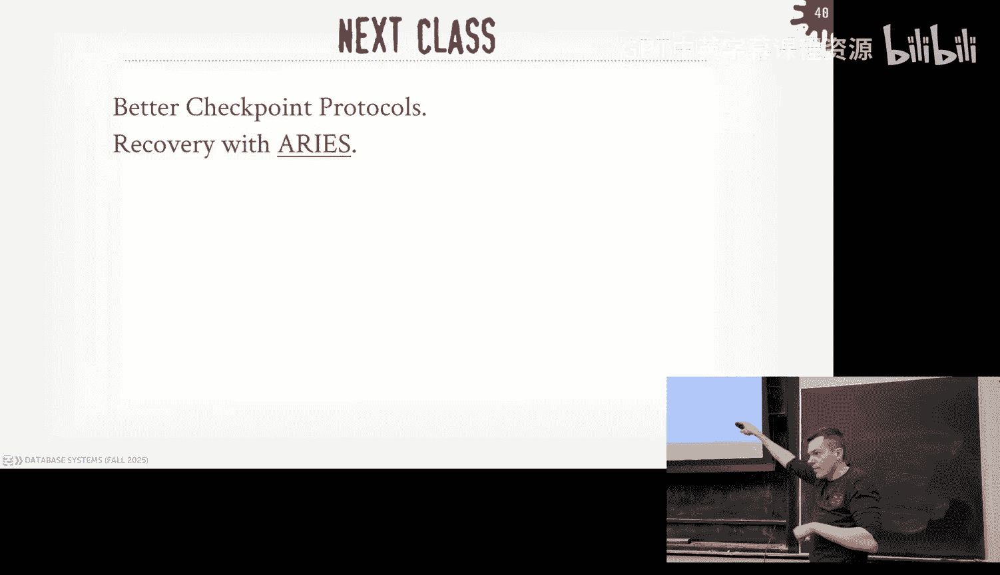

# CMU《数据库导论｜15-445 645 Intro to Database Systems (Fall 2025)》中英字幕 p21 #21 - Write-Ahead Logging + Shadow Paging (CMU Intro to Database Systems).zh_en -BV1bmHGzsETM_p21-

🎼still。🎼送一 check。🎼管这我。🎼P your whats out。🎼想脾气的面。🎼我厌。All right， let's get started。

 round of Falls and give you cash。Again， take a one out。 So a quick comment。

 I was gonna you a thank you for being professional this。

 like my DJ is always like Xco general office or like behind child support payments。

 you've been very professional。 I appreciate you being here always on time。

 So thank you again you the semester is not over。 I was just that this morning man DJ cash hast any problems。

 Its kind of nice All right So guys， to get started。

 a lot to discuss let's get started again for the for you guys in the class。

 the docket is looks like this as we finish up near the end semester。

 homework5 me do again the Sunday coming up part4 went out last week the recitation will be tomorrow November 18 at 8 PMm on Zoom and the link is piazza And again。

 the write up is quite exhaustive deliberately so because transactions are super hard we're trying to be very thorough and what exactly you need to do for Project4 you don' don't get lost So please read that before you show up to the recitation。

😊，And then the final exam is going to be Thursday， December 11th at 1 pm， it's a three hour exam。

 I don't know where it's going to be they haven't scheduled it yet。

 so please don't make travel plans before this date because there's no makeup and there's no early early exams。

Any questions about any of these things？Yes， question what happened to the advanced class 721。

 other people who have emailed me about this， Jgnesh Patel is the other database professor at CMU in the CS Department。

They made him the department chair because nobody else wanted to do it。

 but it's interim department chair and as such he they were supposed to find replacement for him so that he could teach the intro class next semester and I could teach the advanced class。

 they have not found replacement yet， they haven't even done the dean hasn't started the external search yet so at this point nobody can teach the class other than me next semester so I can't teach 721。

😡，But you think it may find。The question is， I think with fire replacement？Be nice， yes。

you want the department chair？No， or note it's a thankless job。 Yeah， so at this point， like。

I like it's outside my hands I don't have controls。

 I apologize but there's nothing I can do at this point。Yeah raise。

The question is just to get it rates， again， that's above my pay scale my I don't know。

RightAll I know is he's teaching 721 now and being department chair and trying to do like you know awesome database research with me so he's not it's not sustainable。

😡，So if it gets added back， I would email everyone。😡，But at this point， don't bank on it。I questions。

I don't know。I I mean， I like， yeah， like， I can't be like two weeks into of semester。 Oh guys。

 I'm gonna come back like no， like January， early January。 But again， don't， don't bank on it。Yeah。

 I'm not happy to， it is what it is。What can you do？嗯。

It used to me the inter class was only once per semester because it was just me teaching it and the wait list was 500 people。

And so we stole gymnaash from Wisconsin。Maybe you hire somebody else， but even then。

If hire somebody else in if we hired another native person this year。

 then that person could potentially teach the intro class in the fall。

 and then I could teach 721 in the fall， but it spring is not looking good okay。

All right so moving on what else we have going on we have a lot of cool Davis talk coming up tonight or today after this class we'll have Ben who gave the talk in class before from Fiwall talk about how they support iceberg now Snowflake is on campus today and tomorrow one of my former students is giving a talk tomorrow at 12 o'clock I think the university recruiter is here as well I know they've made some offers at some students for fulltime positions I don't know what the status of internships and fulltime offers beyond that from Snowflake。

 but they're on campus here if you want to meet up and talk to them and then the following week will have is a system out of the UK called XtDV this is a weird one it's a time series database but it runs on multiple dimensions of time we don't really cover time series databases here class but just think of like。

I want to keep track of like stock ticks when these events occur。

And then I also want to keep track of like。I can have another dimension of time。

 like what would happen if I traded this stock at an earlier point in time。

 so now you have sort of two parallel dimensions to anyone。It's wild stuff。

 this is used not this system， the time series As are widely used in FinTch and trading world。😡。

But again， that'll be next week on the Zoom seminar。All right。

 so last class was the last lecture we did on concurrency Toll。

 and we finished up talking about multivert concur Choll。

 And we said this was a mechanism we could allow us to。😊。

Basically make multiple logical sorry multiple physical versions of a logical object in our database。

 so instead of overriding the data directly， we'll make a copy or make an actual physical version that has either the delta of the change or the actual change itself in our system so that we can do a bunch of tricks of allowing consistent snapshots of the database when we go read things。

😡，And we talked about how not just in NPCC， but all the other conhersial protocols we talked about before。

 how the design decisions we make and our conherial protocols are going to affect all throughout all the other parts of the system。

 because the other parts of the system need to be aware of and what transactions are doing in the system to make sure we're doing things correctly。

😡，So what we've talked about so far has given us three of the properties of acids， we got atity。

 consistency and isolation。😡，Today's class and next class。

 we're going to talk about how we guarantee durability as well as aimity after a crash。有关。

So here's the motivation of the problem we're trying to solve here today or for this week。

 we chose action T1， which's read on A， write on A， and then commit。So we know how to do reads right。

 ignoring how we find object A in a page on disk， index， whatever it doesn't matter。

 right we know that in order to read this object we first got to make a copy of the page out on disk and our nonvatal storage。

 bring that into our buffer pool， hand out the pointer to the execution engine so the operators can in access this data。

😡，Then now we want to do a right on that。Ignore multiversioning， say。

 you know I'm doing a single version system， I apply my change directly in my page in my bufferable。

 right？And then I go ahead and commit。Again， the property of commit is that we're telling the outside world that all the changes for your transaction have the asset guarantees that we care about right so we've told the outside world that our transaction is committed。

😡，But then the problem is if there's a bad storm and there's a major disruption to power。

 ignoring whether we have battery backups or whatever doesn't matter。

The system crashes and we lose everything in our buffer pool。Of course。

 the problem here is that we told the outside world that our transaction committed and we applied their change。

 but now we unpon recovery， assuming we get power again， when we come back。

 we're not going to see that modification we made to A。Because we didn't write it out the disk。

So that's the problem we're trying to solve solve today in next class。

 how do we make sure that if we tell the outside world your connection is committed。

 how to make sure that no matter what happens to our database system。

Either the data center melts down。We won't solve that problem this week。

 That'll be we talk about distributed basis。 But like the whole thing falls in in a giant sinkhole。

We can still come back and recover your data。So that's the problem we're trying to solve。

's through crash recovery。 Nowday here is that the algorithms we're going to implement in our database system so that no matter what happens to our database system。

As longong as we， if we tell you that your transaction is committed。

 then we'll guarantee that we we'll retain that data and we can guarantee the consistency。

 aity properties that we want， despite what happens。Now。

 just because we store it and say you committed and even if it is durable， someone， of course。

 can come along and overwrite your change because the next transaction， but that's okay。

 that's the normal operations that it's really like if things crash。

 how to come back and not lose anything。So our recovery algorithm is going to have two parts。😡。

The first would be what we'll talk about today。And that'll be the things that the data system does during normal operations。

 during normal execution of transactions and queries。😡。

So that it can set itself up to be able to recover any of those changes。If there's a later crash。

And then next class will be， how do we go back after a crash。

 look at all the things we're going to record today in our data system to go figure out what was going on in the system at the moment of the crash and how can we reconstruct this state of the database to put us back where we should be？

😡，Another important thing to understand when we talk about this as well。

 going back to my diagram here， ignoring the crash part。😡。

But as soon as I tell you that your data has been committed。

 like you say I want to commit my transaction， as soon as you get back the acknowledgement that the commit was successful。

 then you we should be guaranteed that your data were successfully stored now there may be a race condition where you say you want to commit the transaction。

 we can make it safe out on disk but then before we send you the network message is saying your transaction is successfully committed。

 the system crashes before that network message goes out， that's still okay。😡。

Becauseuse it's up for the application to go back and say， okay。

 did my transaction actually commit or not， People don't write code that way， but that's in theory。

 that's what you're supposed to do。😡，All right so today we're going to first talk talk about what we the kind of fair is going to have and how we want to manage this now in our buffer pool。

😡，Because bufferuff look end that's where we're staging all the data in memory before we make any changes to them。

 we need to be aware of what's going to happen when we're allowed to do certain things in our buffer boom。

 then we'll talk about the two main approaches to guaranteed durability。

 shadow paging and right ahead logging displaying to me right ahead logging is what you're going to want to use and most data systems are going to go ahead and use this。

😡，Then we'll talk about different logging schemes of what you can put in your right ahead log。

 like what data should actually be， and then we'll finish up talking briefly about checkpoints。😡。

And I'll show us on a naive checkpoint scheme that works in conjunction with the right ahead log。

 And then we'll see the problems with that。 And then next class， we'll start off with。

Doing better checkpointing。Okay。All right， so。At this point in semester。

 this should not be a shock when I say this， but again we've been assuming this assumption of our sort of conceptual database system we've been talking about through all these lectures where the primary storage location of the data of the database itself is going to be on non-volatt storage。

 an SSD spinningtting this hardd drive S3， it doesn't matter。😡。

And then because we can't manipulate that data on nonto storage directly。

 we always got to copy it into our buffer pool， which runs in DRAM。

 which is going to be volatile storage。😡，And was faster access。

So any time we want to manipulate data， we got to copy into memory。

 do whatever changes we want on that data。😡，And then we're going to write that dirty data out the desk at some point。

And again， we can't dote although to memory we can do byte addressable modifications。

 the granularity that we're going to interact with data on nonvault storage is going to be through pages。

😡，Four kilobytes， a kilobytes or whatever， and then the harbor itself can only ensure that four kilobytes be written atomically。

So again， the property we need to guarantee or need to provide。

 in order to say we have adorable transactions is that for any changes that a transaction makes。

 once we tell somebody the transaction has been successfully committed，😡。

Then the data has to be durable。And of course， that means we can't have any partial changes that for any transaction that's been committed。

 we don't want to write， you know， they had the transaction modified two pages and only one of them make up the disk。

Or if the database page is 8 kilobytes。😡，And therefore。

 we got to write two foreign Kyte pages out to the hardware。

 We don't want the first page to be written， but not the second。

And if we're telling the outside world that our transaction has successfully committed。

So today is about understanding like how to make sure that our changes are written out the disk in the right order。

So that again， next class， when we crash come back。

 we make sure that we have what we expect to see and enough information for us to be recovered the database back to the correct state。

So the two mechanisms we need to have are undo and redo and again。

 this should be kind of obvious when we're setting up to something， do something more sophisticated。

So undo is be the mechanism we use to remove the effects of an incomplete or aborted transaction。😡。

And again that can happen because either the transaction itself says it went to a board calls rollback explicitly。

 the concurt protocol says you can't commit and then transaction gets rolled back or again。

 the transactions is in flight or inactive。😡，Or is active and then we crash。

 and we're got to make sure we roll things back。Radio with the mechanism allows us to reapply the changes。

😡，Of of a transaction that has committed。 so we want to make sure that we reinstal or we installed the changes that they did that when they were normally running so that。

 upon recovery， it looks like you know it not looks。

 but it is it is as if that transaction fully executed or did fully execute。

So how we're going to support undoing redo is going to depend on the policies we're going to have in our buffer pool。

Let's go back to this example here now we have two transactions T1 is going to read on A write on A T2 is going to read on B and write on B again I'm showing all of this you know we're just sort of moving pages back and forth between B pool and disk there's still going to be the conial protocols that we talked about before like two phase locking or OCC all that's still going happen above all this as well。

 but we're ignoring that for today's class because in this example here they don't conflict therefore they can write independently。

😡，So T1's going to start with a Read A， it's not in our buffer pool。

 so we know how to go out to the disk and get it。 we fetch it into fetch the page。

 and we store it in our buff。Now we're going do a right on a and we'll update a a equals 3 there。

 Now there's a context switch where T2 starts， it does a read on B。

 that's already in the buffer pool。 So that's fine we can read that rat page and then now we're going to do a write on B and set B's value to8。

Now B wants to commit。Right。Again， assuming this is one page with three cells and three blocks in it。

So at this point here， we need to make sure before we tell the application that T2 has successfully committed。

 its changes have been written out the disk。😡，Right。

The problem is in the same page as where B's located， there's also a。😡，So the question is。

 should we allow A's dirty change be written out of the disk as well？😡，Because it's not committed。

So let's say we do write it out， put a equals 3 and b equals8。

 and we update that single page out on disk right now we tell T2， haha ks。

 your transaction has been sexually committed and they're happy。

But now when T1 starts running up again， now they invoke rollback。

And now we need to make sure before we proceed any further。

We don't have the block on the rollback request。 So the application says rollback will need to come back say yep got it no problem。

 right， But now it's our job in the data system to go clean things up。

 So now we've got to make sure that we go remove the effects of T1 in that page because we flush it out the disk。

😡，So what's one way to do that？It that answer your question， it's kind of obvious， right？Go。

Go fetch the page back in， see that it matches what I have now and undo the effects of T1。

Do you think it's a good idea or a bad idea？Is it correct？For one page， yeah。

But always thinking strange， we don't have a billion pages。

Do I really want to go out like and bring back in a billion pages reverse changes and write them all back out again now。

Because what happens also too， if I crash halfway through that updating a billion things。

Now I got a bunch of torn right， I got to go clean up。

So there going be two policies that affect what the data system is allowed to write out to disk and when is it allowed to write out the pages to disk。

😡，The first is going to be called the steel policy。😡。

And this determines whether the data system is allowed to evict a dirty object。

 you can think a page or dirty object from the buffer pool that's been modified by a transaction that has not committed。

😡，And therefore， is allowed to overwrite whatever the most recent committed version of that object。😡。

Out in nonvato storage or out in our desk。So if steel is enabled。

 then you're allowed to evict things and overwrite what's out on disk。😡，If no steel is enabled。

 then you're not allowed to do this。😡，So this all ties back and up ties together with Project one now。

 because now in your replacement policy algorithm， like ARC or LRUK， whatever you're using。

 it's got to be aware of which of these ones you're actually doing because that it didn't determine if I have a dirty page。

 am I allowed to write it out or not？😡，I I'll say also too， I'm showing steal， no steel。

 it's not like you do steel for some transactions， no steel for other transactions。

 like your implementation only does one of these。😡，一国的这个。So a who is admitted then at that point。

 it might be possible some say never。SoThe question is if it's no steeled。

 then some transactions may never be allowed to finish。the。Yes， we'll get there in a second， yes。

 the thing they point out， which they are correct， that if allowed if I am not allowed to write uncommitted pages out the disk。

Then how would I ever handle a billion updates where't everything's fit in memory？

You can kind of get around that by。Writing things to the side， but we'll get that in a second。

rightThe other policy iss called the fourth policy。

 and this says this determines whether the data system is required to flush all the dirty pages from a transaction that were modified by transaction before the transaction is allowed to commit。

😡，So when I get that commit message from the application， I don't respond back and say， yes。

 you've successfully committed to all the pages that it's modified in the Buff pool have been written out the disk。

😡，And if I say no fourth， then I don't require that。😡，哎。

So four scenes can make it easier for us to do recovery later on because I don't have to worry about whether a transaction has all those changes made out the disk or not。

😡，If I'm totally committed， then I got them all out on disk。

 still immediately to clean things up and make sure I handle torn transactions。All right。

 so let's look at an example of no steel and force。 again。

 no steel means that I'm not allowed to evict  dirty0 pages before transaction commits。😡。

And then force means that when a transaction gets I have to write all of the changes out the disk。

So I start off again， T1 does a read on A， I fetch that page， bring into memory。

 then I do the write on A， I update that single record in the page context which show over to T2 T2 does a read on B。

 that's fine that's in memoryory， doesn't write on B that's in memory we overwrite the existing value now I go ahead and commit and again under the fourth policy before I can tell the application that T2 is successfully committed。

 I got to write out that page that it modified。😡，But the problem is in that page。

 I also have changes from T1 on a， but T1 is not committed。

 So no steel says I can't write out that that page at all。

 And I have this sort of conflict here that says。😡，one transaction says flush everything。

 the other transactions is not allowed of flush anything。

So a simple way to handle this is just make a copy of the page。😡。

Only include the change from the uncommitted from from the transaction that's committing into that new page。

And then that gets written out at the disk。Yes。Why can。You're not steal。可以车提供这。The question is。

 why is nobody preventing us from writing out that page because I can't write pages。

 I can't write modifications from transactions that I have not committed yet？😡。

They just had to be in the same page。Yes。Questions， how do I know the original date of the page？

We'll getting there in a second， but assume your transaction maintains some metadata like the undo redo to know what it changed and what it changed it from。

So the question is what if there's no space make the copy correct， yes， you're poking holes of this。

 yes I must end is a good idea， this is the straw man， so yes。😡，Yes， it's kind of similar。

 but I was going to see is it an option to just wait like you。The question。

 is it an option to wait on T1？I mean， wait for T1 to to wait for T1 to do what。 Sorry。

 who's waiting T2's waiting for T 1。Like in waiting for the question is。So yeah， in this case here。

 should just T2 yield for T1 and waitto T1 does something that I can decide what to do。

Shadow paging will do this， but how long should you wait？

What if what if the person in T1 walks typing up the terminal walks away。

So the Databricks talked about this so they said that people are in like notebooks in Databricks。

 people start transactions and then they get up and walk away and then so they had to set an automatic timeout to kill transactions if they run for 24 hours。

Do I want to wait should T2 wait for 24 hours no？All right， so the advantage of this now。

 if we do this approach， it's really treatable for us to roll back T1 now because we just go reverse the change in our page and none of its changes made it out the disk。

😡，The new steel will prevent us that。 So we don't do anything clean up with no steel because we know whatever's been out out on disk is from transactions I' have committed。

 So that's good。So I was saying it's a strong end this is the easiest thing to implement right okay of course the problem is that you have to have enough memory so that you can maintain the right set in memories without running at the disk。

 assuming you can do that， then this is pretty simple to do。

 and it makes recovery trivial because again， when you come back on the disk is going to look exactly the way it should。

😡，Because it only contain information from committed transactions。

That's not entirely true either in the example I'm showing here because there's no metadata。

 there's no additional metadata say that all the changes from a community transaction have been written out the disk in my toy example they're only writing one page and that can be done。

 we consume that that's done atomically。😡，So the way you really implement no steel force is through a technique we talked earlier on。

 talked about earlier on called shadow paging。😡，And this is what IBM invented in the 1970s on System R。

 this is the first way they wanted to implement and support durable transactions in one of the first relation database systems I don't know what InGgress did in the early days and Oracle came later and Oracle didn't do this。

😡，So the basic idea is that shadow paging is actually going to maintain two copies of the database。😡。

The master copies going changes from only committed transactions。

 and then the shadow copy is sort of temporary space where uncommitted transactions are making changes and can write them out to disk if necessary to swap them out in order to get space。

 but because they're not overriding the master copies。😡，And this is okay。

 so that now if I crash to come back， I just ignore whatever's in the shadow copy database because the master only contains the data from committed transactions。

😡，And then to make sure that we know that all our changes from a committee transactions have been successfully made it out the disk。

 I'm going to have a single record called the master record。

 which is basically the a pointer that says here's the。😡。

Here's the latest page table here's the current page table of of the database system or sorry thats pageable directory。

 Here's the current page directory that I know that only contains changes from committed transactions。

 So once my transaction commits and I write all those pages out the disk。

 I just flip a pointer now in a single record which I can do atomically say now you're pointing to the new page directory。

😡，So this again， this technique is old but it's very rare。

 we'll talk a little about why IBM abandoned this later on。

 probably the most famous system that uses this approach is LMDB。😡，Again， he's the opposite of me。

 He loves that map。 He loves shadow paging， and he he's very vocal vocal about this。

 And we'll see how roughly how they do it。😊，But it has some limitations。 Calcibi does this as well。

 They're going to get around the fragmentation problem by only appending toending the shadow pages to the end of the Davis file。

 Of course you have the new garbage collection clean that up Fast D be is out of Russia gemstone That's a Ra system that's pretty old and then Segel light did this originally but they got rid of it and they switched over to the right head log we'll see that in a second。

我这小个背景。question where are the shadow pages， do example and you'll see yeah， it's in both。😡。

It's also going to look a lot like multi versioning。😡。

But now it's being done at the granularulating page instead of a single record。

And then we talked about taking page locks， when we talked about sort the hierarchy of locks and pages were in there。

 but I didn't really discuss them， you would use page locking for this kind of stuff。😡，All right。

 so we have a master pointer that's pointing to the master of pageable， thats page record。

 what follows is same， but it's basically in memory of mapping through a page ID to some location on disk。

😡，So then now when a transaction starts， say T1 comes along and it starts。

 it's going to create a shadow page table that's going to basically in the beginning。

 just contain the exact same records and pointers to those pages on disk because there's been no changes made yet。

😡，But then as T1 modifies things and modifies data in pages。😡。

Instead of overr the Master of record database， we're going to say make a copy of that data first。

 make a copy that page。😡，On disk and in memory， and then write on our changes to there。

And then same thing as we update other pages， we're going to make more copies of them。😡，Now。

 any other transaction that comes along that's read only。Right， well。

 they're they're going to always go to the master pointer。

 which is going take them to the master page table So they'll see the the the the master version of the database。

 They're not going to see any of the changes from。From from the first transaction。Right。

So LMDB does this， LMDB only allows one writer transaction and can have multiple reader transactions。

😡，Because they're essentially hiding things this way。You don't have to。

 but it makes things a lot easier。All right， so then now。T1 wants to commit。

So what we're going to do is that we're going to make sure that we update the master pointer to now point to the new page directory with all our shadow pages that we've installed。

 and then once we know that's been flushed and safe out on disk。😡。

Then now we're essentially flipping the pointer to point to the master page。

 the old shadow Po table comes to the new master page table。😡。

Any other transaction that comes along after we've done this switchover。

 we'll now see the changes that T1 made。😡，And if we crash and come back。

 we look in at the master pointer on disk that we would know which page director we should be looking at。

 so we won't lose any of the changes from this transactions once we said it's committed。😡。

And then just like a multiversion， we have to do garbage collection。

 so eventually at some point we got to make sure we throw away the old page table and then clean up any of the invalidated older version pages right and then we can just reuse them for future transactions。

Yes。Question， does this only like one writer， in my example here， yes？😡，It doesn't have to。

It's just now you got to do the thing he was asking about like， all right， well。

 when do I switch my master pointer over because I don't want to switch it over with a transaction that hasn't committed yet so now I got to wait for all the transactions to say up we're going to commit。

 then I can do a group fit that way。If you allow multiple writers。

 if you only one writer transaction， then you don't have to do that。😡，我位参。好。

It's like at any point time。You have to wait， yes。Okay。Yes。😊，So。

So you can get around this a little bit。If you do page level locks。

Then your transaction is updating some pages。 My transaction is updating other pages。

 I can't read your rights。 That's fine。 I， I go ahead and commit。

I update the master pointer to now point to the new master page table。

 but I make sure it doesn't include any your changes and I immediately establish a new shadow page table with all your inf changes。

😡，You can do it， but it's more work。And what LMDB does。

 I'm showing like an example here of like there's a single master pointer。

 but they're doing index organized storage， so the index is actually the data itself。😡。

So in that case you just change the root of the B plus tree， you swap that to the new pointer。

 and then that gives you the switching between the master in the shadow。Sium。そい。

The question is this an naive way of do multiverging so I'll talk in a second about like all these ideas like between multivirgin current control。

 this logging stuff we're talking about， the shadow pageaging stuff we're talking about here。

 which talk about log structure merged trees all these scenes kind of are very similar to each other but oftentimes they're treated as separate concepts is because the way you sort of abstract the concerns of the system so there's a lot of redundancy in this right。

😡，We'll talk my Postg and the second， Postgs didn't have a write log because they they seemed I would make a copy of the tuupple。

And I'd write that out， and that was the log。But the performance reasons， right then down below that。

 you have like your file system that's doing journaling， too。 that's maintaining its own log as well。

I then go even lower than that now you got on the actual the SSD。

 it's doing logging it down there too。😡，So it's a lot of redundancy， but like it's just， you know。

 unless you control the entire stack， which nobody actually can， it's all kind of unavoidable。

Except Oracle， but even then there's probably still running in a journal file system。

They're still going to right ahead logging。 They're not a log structure storage system， right。

Can you拿呃 on。你们先下的这近合约。Yes。Adity， the question is， how does shadow paging ensure adimity。 All right。

 so going back here。Transaction wants transaction T 1 wants to commit。 Okay。

 so it modified three pages。 So we need to make sure those three pages。

Are get installed and ever can see them at， you know。

 at the moment we say these things have been committed， okay？So。

I can't guarantee that I can do flushing to those three pages out on disk。😡，Atomically， right？

So I I need some way to guarantee through one right atomic right on disk that these things have been installed so that's what the master pointer does that's the single page say at the header header of the file and I can guarantee I can write that autoically so once now I install all the changes for this transaction those three pages in blue。

😡，Then now to switch it over， I need to atomic right to the master pointer record Once that's been installed。

 that I know now that anybody comes along and reads the master pointer is going to see the shadow page table and would see my three changes。

 So this guarantees that no no matter how many pages I modify that they all get installed atomically and the single parent swap。

 everyone sees them。😡，Okay。So sport rollbacks iss super easy， as I said。

 if your transactions is in flight and I crash come back， I ignore what was ever in the shadow pages。

 right？😡，Every transaction aborts while running。😡，Same thing。

 I throw away the shadow pages for the inf transaction that got aborted and then don't update the pointer to no one's going to see any of these changes anyway。

😡，Right。So the problem with this is that copying that page table is expensive now elementDB gets away from that doesn't have this problem because they're copying sort of paths through trees through a B plus tree。

 right？😡，But if I' have been copy of the entire tree or I've been copying the entire。

An entire page table， then that's expensive， essentially for large databases。

 and this becomes problematic。😊，The other challenge is that going back here。

Now I have a bunch of empty space empty pages in my database file and I can maybe get around that by creating a new file every single time。

 so I don't worry about all these empty pages， but at some point I got to be able to reclaim them and the case of the system are the problem they had when they were running channel paging is that since they're trying to since S IO is so much faster than random IO。

 now I have a bunch of gaps in my tables that I' got to jump over and ignore and that starts to look more like random IO。

 the more fragmentation I have。😡，So over time the database would get slow and slow and slower and then you have to run expensive garbage collection and go clean all that up and again the 1970s。

 the hardware was super slow。😡，You， this became really problematic back then。Yes， concept Yeah。

 so the question is。Its still this still concern SDs going even faster than SDs。

 So we were looking at the obtaining stuff from Intel persistent memory。 So it was like Dra。

 but it was persistent so at the speed of Dra， but like you could you could ensure your your rights got or durableable And in that environment the shadow copying or shadow paging。

IfRememberRemember correctly， still did not perform as well as。

As like righthead logging because you have to do because you do copyright and rights。

 the copies kill you at that point。So if the disk is slower， the disk rights that's what kills you。

If it's， if it gets faster now the mam copying you're doing in this world gets slower。

 Now I don't think this is the a few years ago， obtained his dad， of course。

 He can't buy the hardware， but。I still think I finding still hold today。

 but I would have to go look again。Its positive。Quest， if it was SSD do we care about Harvard PeVing。

 what do you mean？Yeah， I want things to be as special as possible。Because that's if I'm doing scans。

 it's going to be faster and so even the LMDB stuff because it's a tree structure。

 things are more scattered， but if you don't even point queries me not that big of a deal。

 but anything beyond that， the having everything sequential still helps。And again， you say， oh。

 is it multiversioning， isn't that going to have the same kind of fragmentation。

 well no if I do it in mysQL oracle way where I do newest to oldest。😡。

And most queries only need the newest data， then the main table itself is going to have the data I want and I't take a look at the Deltta records。

Yes， so for the9 year。Of about。When one white was met， but。has some dirty0 data make another coffee。

Yes。But you don't need to do that here， right， because you only switch the pointer。

So the question is going back here， when I showed sort of the strawman approach。

 I had to make this copy here for the page because two transactions modify the contents of the page。

 and I only one of them is allowed to write things out so I had to make a copy and make sure that copy didn't include changes from the first transaction。

Assuming I have a single writer under shadow paging。

 this problem doesn't occur because only one transaction is allowed to modify a page so I might take a look on the whole page so when I write out the disk。

 I'm only writing out the disk I'm it's only going to become the master version when the transaction goes goes and commits and because I'm doing single writer it won't contain committed changes from uncommitted transactions so I don't have this problem。

😡，Vi。If you have multiple writers， then you have to do that reversal thing I said before right but if you take page level locks。

 exclusive locks on pages， then two transactions can't relate to the same page under the scheme。😡。

All right。So again I don't know if dwell to twitch on a shadow pageaging because again nobody does this or very few systems do it I do want to show what SQL light used to do SQLL did a version of shadow paging called rollback mode up until 2010 then they got rid of this and now now they use right ahead logway default I think you still can switch it back on if you wanted to for like compatibility reasons it's famously backwards compatible for like the SQL light guarantees that the SQL light file format will be supported until 2035。

😡，Because again， this thing's running in satellites it running in planes。

 like this is a critical piece of infrastructure， you need to make sure that it runs forever， right？

So that's why youre very unlike current version of SQL is SQLite 3。

 you're very unlikely to see SQL light 4 anytime soon。All right。

 so the way it would work is that there wouldn't be a sort of page table。

 there'd be a separate journal file。😡，And what happened is anytime I wanted to make a change to a page in memory。

 but from a transaction， and by the way， SQL light was like LMDB， one writer， multiple readers。

 so only one writer for that we don't worry about concurrent updates from different transactions。😡。

So before I modify page two in memory， I'm going to make a copy of it and flush it out to disk in the special file called the journal file。

😡，That was separate from the main database file。Then once that's been flushed。

 then I go ahead and make my change to past two and memory。Same thing I want to modify page three。

 right I make a copy to the page in the journal file and I go ahead and then modify page three。😡。

Then I want to say my transaction is committed， now I'm going to make sure that all of these changes it have been written out。

So I start writing out page two to disk， right flush that， that's fine。

 but then I was as I start trying to write page three。During this commit process。

 there's a system crash。And I lose all my contents on my bufferable。So again， going back here。

 in order for me to say that she was actually committed。

 I got to write page two and then write page three and once I know that's done。

 then I can tell the outside well you've committed。But if I crash before them。Then upon recovery。

 when I come back， the first thing I'm going to go do is look in this journal file and figure out what was in there again。

 these are the copies of the data before I made any changes。😡。

So I'm going to go bring in page two and page three back into memory。

And I know that this is to be the current version of these pages before I start running new transactions。

😡，In order to say I completely the recovery process。

 I got to make sure that whatever got from the journal file is what matches what's actually in the database file itself。

 so I'll go ahead and take page two and make sure I just overwrite whatevers in the database file for page two and I'll do the same thing for page three since I don't know what's in there I know I got to just overwrite it and make sure that it's the version I expect。

😡，我 I didn didn。If it didn't commit。What didn't commit， sorry？对是。

The question is what if transaction that modified pastry doesn't commit well。

 that's this case here so pastry isn't written out in the disk。I crash， come back， I don't care。

I don't care what is in this thing。The journal file says this is the page before the transaction started running。

😡，So if I have things in my journal file， then I know there's an introduction that didn't commit successfully。

😡，So I need to go take whatever in my journal file and make sure it goes back down into my databases file。

Since he committed the pathway。No no no， so the journal file before the change right so again like'm。

Yeah， so I'm saying like maybe it's hard to read's the black boxes are blue。

 so I maybe change a past shoe， maybe page blue boxes。

 only the blue box past shoe got written that crashes so then I bring up the white boxes for page two and three。

😡，Yes， I should make that more clear it looks good in the slides。

 it doesn't look in the overhead or it's clear on the overhead， not as clear on the overhead。

So kind of like it's the opposite of the shadow paging where the master page would tell me here's things that here are the there's in my shadow page table。

 I have changes from uncomited transactions that I just ignore the journal files is like here's the things you need to roll back and undo。

😡，Because my transaction might have modified these pages and then it didn't commit to make sure those things get reversed。

So。都没去过是真的。是那。Yeah statement is correct， yes， so after I replay the journal file。

 bring that back into the memory， write them back out the disk。

 then I delete the journal file and then I can start executing new transactions again。😡。

So we can give a demo next class， but like if you go read like the debug log of any pick your favorite data system。

 it'll say when it first boots up doing recovery。😡，And it's looking at the log。

 looking at checkpoints， trying to figure out or got a journal looks in that。

 trying to figure out what was going on at the time when the last time I was running because it may have not been a clean shutdown。

世界。All right。So as we said before， shadow paging requires us to do a bunch of random IOs to potentially noncontigous pages on disk。

 even the SQL light method， those pages right next to group is two and three。

 but like they could have been all different parts of the file and I'm no much a random IO to write them out。

😡，And we said the beginning of the semester。We've repeated many times。

 sequentialial IO is going to be faster than random IO， even on modern SSDs。😡，And therefore。

 we want to choose algorithms where we can maximize the amount ofs sequentialial IO that we're doing。

😡，And ideally， we want to be able to choose algorithms where we don't have to write entire pages out the disk。

 even if it only a small portion of it。😡，A small portion of that page has been in the disk。

So CalCB is going to get rid of the random IO problem because they're just going to pin the shadow pages to the end of the file and then truncate it later on and do sort of compaction like a long structure of Merry。

 but they're still going to have that copy of the entire page out the disk。

 even if only a small portion of it has been written。😡。

So the solution to this is me the right head log and as I said。

 pretty much every single data system that supports durable transactions and recovery is been doing this approach。

So the idea is that we're going to maintain a separate log file on disk or nonmod short that's separate from the database file。

😡，And that's going to contain all the changes that transactions make to the database while they're running。

😡，And we're going to assume that the log itself is going to have enough information for us allowed to undo and redo any transaction that has come along and either committed or did not commit。

And the most important thing you got to understand about the righthead log is this paragraph right here。

😡，And that is， the database system is not allowed to write out any page that's been modified by a transaction。

😡，From the Bable can write that out the disk before the log record that corresponds to those changes has been safely written out the disk。

's why it's called the right head log because you're writing head to the log before you write to the database system。

😡，嗯。There is right behind logging for the experimental hardware that he and I were talking about。

 and we did that and you actually want to write to the database first before the log。😡。

That's only in research land。 Don't do that for real， right， It has to be before。And so with this。

 this is law is going to do steal and no force， so steel is going to allow us to write out uncommitted changes。

 our changes from uncomitted transactions before the transaction is committed。

 but again we got to make sure we write the log records first before those pages get written to disk。

😡，And then no force says that we don't require the data system to flush out all the pages。😡。

That that transaction is modified when the transaction is committed。

 but we got to write out the log records for that transaction first。

Before we tell the outside world you've committed。So that means that a transaction modifies 1000 pages。

😡，There'll be1000 log records， or at least for those changes。😡。

And all those thousand log records we got to write at the disk， but we can do that sequentially。

With a fewer number IOs versus doing random IOs for all this thousand pages。😡。

As we had to do in shadow paging and other techniques。So。还现在。所以你是这个。こさ。Your公。什么。The question is。

 are people doing shadow paging because？No steel and force is either to implement。Yes。But， like。

It's like you can do it quick and dirty pretty easily。Because right head log， we'll see ass go along。

 it's a bit more complicated。 And then when you throw checkpoints in， that's hard。

Because now you got to be able to handle what if I crash and recover and endure my recovery。

 I crash again。That's hard。Shadtter page doesn't have that problem。rightSo again。

 I'll sort of go through this quickly。For force and steel if I do by force it's trivial to do but I want to be able to do steel because I want to be able to write out pages before transactions committed right so again this is repeating what I said like if you do force on every update you flush on the page before to go to disk if I do no steal then I got I can't flush anything out before transaction is committed。

😡，But it makes it trivial for us to do rollbacks on the a board of transactions because you just throw away everything in memory。

 nothing's out on disk。If I'm doing no force， then in order for me to cover after crash。

 I need to maintain log information to know that transaction is committed and make sure I can redo any of the changes so I don't lose them。

😡，And then if I'm doing steel as well， I can flush any dirty pages out the disk。

 even the transaction can still running， but I need to make sure I can undo those changes later on if I crash and come back。

😡，So let me walk through this and then hopefully make more sense。So again。

 now we're going to have these law of records we're going to maintain for transactions。

 but now we need a place to store them。😡，So there' be some area and memory that we where we're going to basically append changes to to。

When' going to append the changes to our to this memory buffer as transactions make them。

 it says usually back by B pool， that's usually not the case， right， it's just memory， right？😡。

And then again， all the log records for transaction for the pages they modified havey written to disk nonvolal storage before the page itself is allowed to be overwritten so again in your buffalful replacement policy when you or in the background writer when you go through and start victimting pages。

😡，And writing about the disk， you got to make sure the log records。That dirty those pages。

 those are written in a disc。And we'll see how we're going to track that next class using log sequence numbers。

 you basically track a number that says here's the log record that corresponded to this change。

 I know we've written the disk therefore I canvict this page。😡。

And then we don't tell the outside world that our transaction is fully committed until all its law records have been written to。

Nonvaal storage， stable storage is the same thing。All right。

 so what it's going to work is that when an transaction starts。

 we're going to put a begin record into the log as represent its starting point。😡。

It's kind not unnecessary for today's class， but next class we'll see it because we need to know when a transaction showed up。

When we do recovery， you to figure out where like the demarcation line is starting point of the transaction。

😡，Then anytime that transaction makes a change to an object。

 we're going to record a new log record that keep track of its transaction ID。

 the object ID of what got modified。😡，Then the before value for undo and the after value for redo if we're doing multi version con show the postg way。

 we don't actually need need the undo value because we're never on we're never over writing things。

 We're always making a new copy of it。 But again for。To be super careful， we'll record both。

Then when a transaction finishes。And say that it gets committed successfully that we're going toend this commit record to the log and then we need to make sure that all the log records。

That come before this commit for that transaction， get written out to disk before we come back with the acknowledgement。

 say your transaction is successfully committed。😡，Now this means that we may be writing out log records from transactions that have not committed yet。

 but that's okay because we haven't written the commit record yet for them。

 so again when we crash and come back， we see a bunch of changes， a bunch of log records for changes。

 but then not to commit， we know we need to reverse that undo that transaction。😡。

So it's okay for us to write out changes from transactions in our log records that have not committed yet。

😡，嗯。All right， so in transaction T1 starts， doesn write on a。

 we pen a log record that says our transaction has begun。😡，Right。And then now when we do a right。

 the first thing we got to do is update a penlo record in the right hand log buffer that corresponds to the change。

 so our transactions T1 forre modifying object A， and then we have the before and after value。😡。

And then once that's written append to the log， everything's still in memory here so that's fine。

 so that's fast we pen that log record and then we go ahead and make our change to the actual the data object itself。

😡，Then we do another write on B， same thing， append the log record， then modify the page。

Then no when our transaction commits， we put a log record in to say T1 has committed。

Then we do an Fync， flush that out to disk， and then once now the hardware comes back or the OS comes back with the acknowledgecledment saying that our change has been flushed to disk。

😡，Then we can tell the outside world that our transaction is committed。Yes。那份。あ一。The question is。

 we never put the values in non nonprofit mean in the b Bowl。 Yeah， that's the whole point。

 that's fine。Because everything I need if there's a crash。

 everything I need to be able to recover the Davis， if there's a crash is in the log。So again。

 if I get blasted by power outers or whatever that OS crashes or whatever。

 that's okay because everything I need to replay that transaction is up above in the redhead log and I can bring that a memory upon recovery。

 next class I's talk about how we handle that and I can just replay the transaction changes。😡。

Of course， now， if I have to flush。The log for every single transaction in order to say is committed。

 right， if the log flush on the FastD takes one to five milliseconds。

Then that's going to really become a bottleneck of my system。Best case scenario if a log flush takes。

1 millisecond。 And I can only run 100 transactions a second。Thats that' that's super slow。

 like some sites want to run 100，000 transactions a second or million transactions a second。

So the way to get around that is through a simple optimization called group commitmit。Where。

When a transaction wants to go ahead and commit， then it'll wait until a small timeout period。

Think of like every five milliseconds， the system will say if I have any changes from a transaction that wants to commit after this timeout。

 I'm going to go ahead and write it all at the disk。

 I'm basically batching together a bunch of changes in my buffer pool in my log buffer。

And then those things can all get get written out together。

 so I'm not blocked waiting from one commit after another。Very罪。就是这个。Sium。WhenWhen you take queries。

 what do you mean？The question is， can an transaction only commit in five minutes to get intervals。

 yes？That's pretty good， yeah。Because I can commit whatever 10。

000 transactions into the5 milliseconds。I would say the general thumb in databases is that。

Anyitthing below 50 milliseconds is good enough。 If you get into high frequency trading。

 those guys do cocaine， they want to be under a millisecond， right， They want to microsecond level。

 but most websites like。The 50 milliseconds is is is is the the upper bound of what you want to be for a transaction to bit time。

 And this comes from like Internet advertising auctions。

 like when you go visit a website assuming you're not using you block origin。

Then when you visit a website， the Google ads or whatever the ad broker sends bid requests to a bunch of other advertising brokers and then come back and say whether they how much they want to pay to show you an ad or something and the timeout request for that is like 50 milliseconds or less。

😡，Maybe 40 milliseconds。 So you have basically， you get a request。

 you can need do some kind of run a transaction and come back with a response within 40 milliseconds。

3人。Is there over， Yeah， there's never go red so yeah， so like。

 but say that the deadline is got to be back in 50 milliseconds so say like you get request。

 you have 40 milliseconds to figure out what you want to do and send out， right？

Or anytime you update a website like you want to be back 50 milliseconds at the general rule of thumb。

 So if I if I'm committing every5 milliseconds， that's good enough， that's pretty good。So again。

 way it works like this is that now。We're going to have two log buffers。RightSo T1 starts。

 It begins the transaction。 we put our entry in the first log buffer。

 does a write on A ends up there again assuming I'm not showing updating the pages in the buffer pool。

 assuming we're doing that too。 Then I do a write on B Contact switch over to T2。 T2 does begin。

 does a write on C does a write on D。 Before we do the write on D though our buffer pool is full。

So now we can go ahead and asynchronously flush this out the disk。

 but in the meanwhile now we just switch over now to using the second log buffer so we write all our changes there。

😡，And then say now there's a stall and we go ahead and do a bunch of commit and at this point here。

 the first transaction T1 will wait until the timeout to do group commit in the second log buffer and then when that happens again。

 think of like in milliseconds， then we write out the change from the second log buffer out the disc。

So basically， I'm showing two buffers so you could have more more than two。

 I could basically always be writing things out the disk。😡。

And they're all sequential rights because I'm just appending to this log file。

 I'm not doing randomIO， so this is pretty efficient and pretty fast to do it。😡，Yes。question is。

 what do you do for HF guys？They usually run in memory databases and then they can do。They replicate。

They just pray they don't all fail。Other they pretty don't fail。 Yeah。

 they're also not running on like machines you find behind the dumpster like they're running on high that like。

They're fall talent then there's a whole other class of databases called super fall talent databases we we're getting ahead of ourselves。

 but there's a system called nonstop SQL that's basically it's like NASA level replications so like you run a transaction it runs in parallel and 3 machines and they all come back and say yes。

 we did the same thing。Like they do that kind of stuff。Right。

They also they build their own hardware like they。Like they'll they'll run fiber under like the Hudson River to get an extra five millisecond lower latency from like the data center into like the trading headquarters。

 they like， you know， they're just minting money， they do whatever， right？2。

And the core idea is basically still the same。All right so again， as I said before。

 it seems got a lot of overlap what I'm talking about here for there's righthead log versus a log structure storage we talked about or app pendingant MVCC and yes。

 there is a lot of duplicated ideas here， I will say though in the case of log structure meries。

 they're still gonna have a right ahead log for the mem table the mem table is like that skip or B plus tree that's in memory that' is absorbing all the rights and then eventually gets full and then you compact it into an SS table and write that out the disk for that mem table piece since that's not durable。

 it's in memory， they're going maintain a right ahead log for that as well then once you know the mem table has been converted at SS table and written out the disk。

 you can then truncate the log。So even though log charge storage kind of looks like the same。

 they're still going to maintain a separate log file as well。

 doing the same things we're talking about here。😡，All right， so now again， if we go look at again。

 steel steel no steel versus steel and no force versus force policies， you can break up the the the。

The sort of performance characteristics of these two approaches based on what happens when the system is running during normal operations and what happens during recovery。

😡，And part of the reason why most systems are going to do no steel enforce force and with the right of ahead log is that it's been the fastest approach to use for。

To our normal operations， if I assume my data system is not going to fail every five seconds。

 which you know if it does， you have other problems。

 like you assume my system is not going to fail all the time。

 then right ahead log approaches actually can be faster。😡。

And so then you pay the penalty for slow recovery， but again。

 if I don't think I'm going to crash that often， or if I start replicating things the way that I was briefly mentioning there。

 then it's less of an issue。😡，Right and the reason why the recovery be faster with force and no steal is that I don't want through do any undo or redo。

 like in the shadowpaging case， I just come back and I ignore whatever's in the shadow page table and I'm good to go。

 I did it is consistent。All right， so。In my example so far in PowerPoint， I' mean showing like， oh。

 here's T1， I'm showing the wall recordss， here's T1， I'm modifying object A。

 and then here's the before and after value。😡，But in actual system。

 we have to be more concrete and understand what we're actually going to store in our logs。

And there's basically three approaches to do this。One to do what's called physical logging。

 where' storing a byte level diff of the changes we're making to a specific page at a specific offset。

😡，In that page。Thinking like making a di patch get in Linux。

Another approach is to do logical logging where I store the actual query。😡。

That made the changes to the database。Like the actual little sQL string itself。😡，And then that way。

 when I crash， I just come back and replay react toute the SQL query。😡。

And then a hybrid approach is sort of physiological where I don't want to be。

 I don't want to store the exact lot the actual SQel here itself。

 but I maybe don't want to store bite level disks。 I want to be able to just keep track of like。

Here's the pages I modified and then here's a high level change of what I modified in my page so that upon recovery I don't have to make sure that pages is exactly the way it was well before the distance can decide to reorganize and move things around within that page itself and things still work out the same and I don't lose any data。

😡，I I'll say also too， that what I'm not talking about so far is。We assume we were modifying tuples。

But we have other data structures， we need to make sure they're safe on disk as well， indexes。

 right indexes are basically a second copy of data。

So in addition to writing out log entries for page the data pages themselves。

 I want to write out log entries for my。For my indexes as well， so in upon recovery。

 I want to restore them。Because otherwise， if I had to rebuild the index。

 I got to read the whole table all over again and repopulate it。😡。

And that's what the in memoryory database guys do if you assume your primary storage database is in memoryory like in the HFT world they do this a lot where you say I'm not going to pay the penalty for writing log records for the indexes so that I can rebuild them more efficiently when I crash。

 I'm just going to read I have to read the whole database database。

 I'm bring going a memory I'll rebuild the index when I'm in a memory。

And then they end up doing less logging。All right， let's say sampleple query， select updatedF。

 set value equals X，Yz， where IDd equals 1。😡，Again， in physical logging， again。

 it's low level di of what's actually in the bytes， so I would say in this page at this offset。

 I want to write these values。😡，And again， I still have that before and after value because I want to know what was there before。

 I want to know what I want to install in it。😡，And I would have to do the same thing for the index。

In logical logging， I just record the query。😡，To say， hey， there's transaction T1。

And here's the update query that I ran。Of course， how the challenge with this one is。

In this case here， it's pretty simple。 right， We're setting setting a value the value X， Y， Z。

 setting to an exact value。If I have things in like a random function， time functions。

I do make sure that when I replay the log that I get the same values for this function calls。

As I did when I first ran them because I don't want to run this update query。

 get today's you know today's date and time， then I crash and cover it and replay the same query and get tomorrow's date and time。

Because then then my changes aren't durable， and that's bad。But obviously。

 if I update a billion twoupples with my one update query。

 I only need to put one log record for that update， whereas like physical logging。

 you got to record a billion billion log records for them， assuming they're cross a billion pages。

And the physiological logical and， again， it may seem more nuanced。

 but again basically think about it as yeah， I got to show what page I'm updating。

 but now I'm going to say what slot number I'm modifying。

Because that's corresponding to a logical tuupple within the page。😡。

And then the slot can change where the slot is pointing to and the page can change。😡，Uh。

 and then upon recovery， I can move things around and I still have the freedom to， you know。

 the freedom reorganize things， then students don' know how to apply the changes correctly。

And then same thing for the indexes as well。So logical logging is nice because you end up writing a lot less data for the changes you make to your database。

😡，But the challenge is going to be， as I said， you have timestamps and other non deterministic functions。

 you make sure they are deterriministic upon recovery。And likewise。

 if I have transactions running at different isolation levels。

 I need to make sure I replay the log in the same ordering as I did want to actually execute events。

 I need to maintain more metadata about the ordering of the actual true ordering of transactions when they actually executed。

 not the logical ordering necessarily。😡，The other thing about logical logging too is if the query you get logged took an hour to run。

 there's no magic wand I can make that query run faster upon recovery。

 so if if a query took an hour to run during no operations。

 when I crash and come back it's going to take an hour again to run that same query。😡。

So recovery could be potentially slow。So most systems do not do logical logging。

 most systems are going to do physiological logging， yes。まして。还没 love。question is。

 do data systems allow you to choose what you want to do。

 not for recovery on the like as the regular mechanism for the system to do recovery？

It'll show up when we do replication， that's actually the next slide， right？

If I want to make apply changes that I make from one database to another database so that this node crashes。

 I can just pick up where I left on on the other one， sometimes I can do logical logging。

 sometimes I can do physical logging and those you can change what you want to do。😡，In postcon。

 other systems less so。All right， so one of the cool things about the Rhead log is that we can use it for other things other than recoverying basically what I just said to them is that we can use it to propagate the changes on our database to other sources that wouldn't be aware of those changes。

😡，So one example would be like if I have a， you know。

 I have two copies of Postgres and you know all my rights go to this one and I want to make sure that any changes on this one gets propagated to the other one。

 I can just send them the log messages， the right ahead log。😡，And to that second database system。

 and they can pretend that it's in recovery mode， just replay the log as if it was recovering from a crash。

 but it's just replaying the log that's coming over the network。😡。

And this shows up and a lot of times in systems that are doing the。

the ETL stuff that the DBT guys talked about where want to take I want to run analytical queries or transfer my data in a certain way so I can install it into snowflake or databs。

 whenever my data warehouse I want to want to use and do a bunch of AI analytical stuff on that data。

 the change data capture technique is basically one way to essentially do that。😡。

And so you could the most efficient way to do this is to do the right head log replication as I'm writing out the right head log to disk。

 I can also write it out to the network and then some other node on the other side knows how to process that data and do something with it。

😡，So again like this， I got my red head log， applied I committed a transaction on this node here。

 and I can send it over to this other node here。Now we won't talk about how to make sure that these things are consistent so if one guy crashes。

 how do we make sure that all our changes are made to the other one。

 that'll be starting next week we'll talk about how we handle that。

 but there's a bunch of tools that know how to interpret the contents of the right ahead log because these things are well documented and then can extract them and do like queries on top of them and transform them in different ways。

😡，So the most expensive one of these is probably Oracle Golden Gate。

 and then the open source tool called Dbeium， and you can connect this with like streaming systems like Kafka where you can take the output of a Postcode' alreadyhead log through Dbeium and they convert this in like JSON files or JSON documents so you can then process on crunch them transform them and then send them off to other systems for consumption。

Again， we'll talk about a little bit this more about starting next week。

 but when we talk about replication， the basic idea is like the red ahead log doesn't have to be on disk。

 it could actually be a network stream to another system itself。😡。

And all the mechanisms we're talking about here today still work。All right， so now if they finish up。

The obvious is problem with everything we talked about so far。With righthead logging， you know， know。

 it is a preferred choice is that。It grows forever。My database system has been aligned for a year。

 my right ahead log will contain a year's worth of write log messages。😡。

And so that's going to suck if now if I crash and come back。

 I don't have to replay an entire year's worth of log in order to recover the database。😡。

Even I'm doing physiological or physical logging where reapplying the changes very fast。

 not rerunning the queries as I would in logical logging。😡。

I still got to crunch through a year' with of law messages。And that's going to be take a long time。

So the way we're going to around this problem is through checkpoints。😊。

The checkpoint is basically a mechanism where we say we're going to write all the dirty pages that are in our buffer pool。

😡，We're going to write them out the disk， record that as a checkpoint。😡。

Or apply that flush them out the disk。And then now we're going to record in our log message that we took a checkpoint at this point in time so that when we crash and come back or restart the system and need to examine the log。

 it sort of bounds how far we have to look back because we would know that there's not going to be changes from transactions that didn't make out of the disk at that the moment we take the checkpoint。

 those 30 pages have been flushed out。😡，So we don't have to look at the beginning of the log。

 we only to look back just a little bit to some sort of say point in time。

So I'm going to first talk about how to do this a naive scheme。Called blocklocking checkpoints。

And then we'll see the problems of this and then again， as I said。

 next class will' pick up with how to make this thing actually usable。😡。

this is basically what you don't want to do， but it'll solve the problems that we want to have and not having to look at the entire log。

 but it's going to have other problems。😡，All right。

 so the blocking or consistent checkpoint protocol is pretty straightforward。

 you basically pause all queries from executing。😡，Wherever they're at， you stop。

 you don't let any new transaction on any new queryries start。😡。

And then now you're going to flush all the log records that are in in your buffer log in memory。

 write that out the desk first。😡，Then you can take all the pages in your bufferuff pool that are dirty and flush those out the disc。

Then then you write our checkpoint， entry to the log， flush that out the disk。

 and now unpause and resume all query execution。😡，So let's see what it looks like。

 So say that's write a log we're applying bunch of changes right and then at some later point we're going to crash to see we have a checkpoint entry in here right So when we crash and come back。

😊，You basically replay the log going from the newest record to the auto record， so you go sort of go。

😡，Go back in time from the bottom to the top。 So you start from the bottom。

 scan up until you find the checkpoint here。 And now we know this。

 this is the starting point where we want to make sure we apply all the changes that come after this because anything up above。

 we know as we made it out the disk。😡，Because those pages have been flushed。So this point here。

 we know that any transaction that。Committed before T1 can be disd and we don't have to do anything because you know their changes have been are safely on disk。

But we're really looking- so in case here we ignore you1。

But here we would see that we have T2 and T3 exist。And we could scan up to we find them。

 but again if we see a commit， I start to do that。We cant find them if we see a commit from them we know we ignore them。

 in the case here T2 T3， they made some changes after our checkpoint。

 so we got to make sure we undo those changes。😡，Because they didn't commit before we crashed。Right。

So。We need to redo T2 because T2 committed after our checkpoint。

 and it needed to undo T3 because it didn't commit before we crashed。Yes。

Don you still need to spend a whole lot because you need to find all the。The question is。

 do I need in this my toy example here or do I need to scan the whole log because I got there may be other transactions that made a bunch of changes at the beginning。

 and I didn't see any more things after my checkpoint， yes。😡，We'll fix that next slide， yes。

All right， so they brought a good point， but like one is the。One is again。

 there may be changes from transactions that have not committed yet that aren't doing anything。

 so I still got to scan the log to find them。So next class。

 we'll see we can source some metadata about how to keep track of what are the action transactions that are running so that we know what we need to go find them。

 right？The other problem is that in order to make sure we have a consistent snapshot of the database。

 we have to pause all the queries。😡，And again， depending on how big our buffo is and how dirty it is。

 we may have to write all the know write out a lot of pages and that could take a long time。

 so now your queries are running a checkpoint happens and it blocks all your queries until you flush everything at the desk。

😡，So if my buffer pool is like， say， 100 terabytes。

's not outlandish on high end systems and all the pages in my buffer pole are dirty。

 in worst case scenario I got to write it 100terabytes before any query you can start running yet。😡。

So that's problematic。To the point they said I， well， I got to find all the committed transactions。

 which take a long time and then the other challenge is like。

How do we decide how often is we taking these checkpoints？So we have to pause and so often。

 that's not good， I don't want to take checkpoints too often。

 but then now my recovery time is going to take longer because I have longer gaps between my checkpoints。

😡，So if we spend all our time just flushing out  dirty0 pages from the checkpoints。

 then that's going to slow it down queries， but again if if we don't do that。

 then that takes the recovery is going to take longer。😡，So there's no right answer。

 I can tell you how often you should be taking checkpoints， and if you do the better ones。

 the fuzzy ones， we'll see next class。😡，It depends on the pain tolerance for whatever your application and whatever your company is。

😡，So the HFP guys， they don't want things， they don want to recover right away。

 so they'll take checkpoints every five minutes。But for other systems。

 that's probably's probably more than you need。Now it can be based on time or can be based on in a lot of assessment it's based on how much log records。

 how many log how much log record data you've generated， so like like like my SQL。

 it might be like right 512 megabytes of log data， then I take a checkpoint。😡。

So that way I'm not taking checkpoints at regular intervals。

 I only do it when I write a bunch of stuff， so my data isnt idol I'm running video and queries。

 I'm not taking checkpointsnelessly。😡，So how to do this correctly again depends on what your tolerance says。

 but every single data system will expose different parameters for these things。So again。

 next class we'll then talk about how we actually make this checkpoint thing for real and handle the case where we can find transactions that we're running at the time we took the checkpoint and not have to block anybody。

😡，While， while we do it。So in all protocols we always。来来。要我 s。The question is。

 if I'm doing right head loggging。Does that mean I should keep the entire redhead log since the inception of the database？

😡，No， checkpoints will allow you not to have to do that， the correct checkpoints。

There may be external factors that require you to do that， so if you're a financial firm。😡。

I got to keep things around for regulatory reasons， like for auditing Sarb' Oxley。

 so you got to keep the right head long around for seven years。😡，Because I could need to be able say。

 what were all the changes that I made， right？So the， but in most systems， you don't need that。

AndI think Postgres cleans clean them up。 I think my SQL， the old versions didn't clean them up。

 I think the new versions clean up the log pretty visual， right But in general， yeah。

 if you don't need it， like if you take checkpoints enough， you don't need a bunch of。

 I don't need last years right how long。And then when we talk about fuzzy checkpoints。

 even though I have last year's writing ahead log， I't I want't even have to go look at it。

 it's just there to in space。😡，All right， again， maintain from all this is that right ahead logging is going to be the superior choice in linear your data system to install durable transactions and the core ideas of righthead log is the steel no force policy where steel means write out dirty pages before transactions committed and no force means that we don't require all those dirty pages in memory to be right out the disk。

 but we do require all the log records。😡，For that transaction we be written out in the disk。

Now the dirty secret is。Every major data system is going to support what are call synchronous commits to make sure that I flush into disk before I tell you were committed。

 it's not all my default in those systems。Like， in Postgres in my SQel。

 I don't think it's all my default。So even then， like even though you're right ahead logging。

 you know， you tell your transaction committed， there's still like a five millisecond window depending on your group commit interval where you could still crash and lose data。

😡，So if you really care about performance， Im sorry， if you about not losing data。

 you make sure that that thing's turned on。All right， so again。

 next class we'll be taking better checkpoints so we don't have block the system。

 we don't the scan the entire log and allows us to do more efficiently and then we'll show how we actually take our logs and take our checkpoints and do recovery for this and the algorithm we're going to use is called As。

😡，This was invented by IBM in the 19 paper cameout 1992。

 and the techniques although I' describe what the textbook describe as Aries and what the original Aries papers talks about。

😡，Most systems are not going to implement exactly as I'm describing here。

 but the high level ideas of doing redo or analyze redo and undo is going to be very similar。😡，O。

这个ID模式这个。因为其的对。Question did IBMvent shadow agent Yes。

 so if you hang around anybody of the old school the database guys at IBM。

 you tell whatever your research is， they'll tell you they invented that in the 80s So IBM always invented something before right but then a lot of they didn't write about。

😡，least in this， the paper for Aries， it's amazing， it's 70 pages。

It's because it's hard because like， how do you make sure you don't lose data like this that this is the I's say that's the gold standard of how do you make sure your data is recover after crashes using areas。

😡。

But a lot of them， they didn't publish。Okay。系的。

🎼希望你个。🎼管怎么见。

🎼Yeah。🎼我你对笨我怎不。🎼Yeah。🎼说你对对我 back从不见。🎼Yeah。🎼果你会认我走不见。😊，The the the flame maintain whatever flow the。

🎼Yeah。