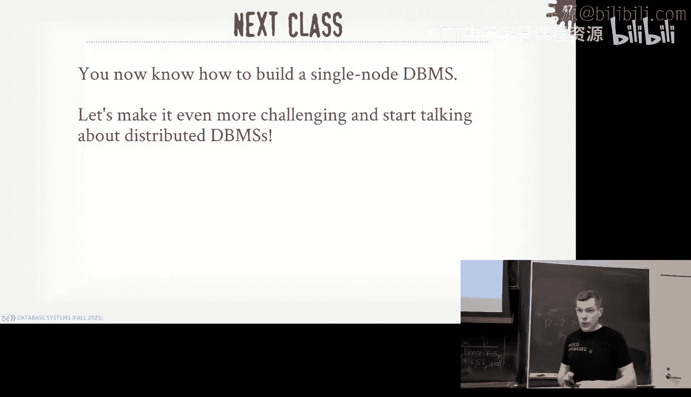
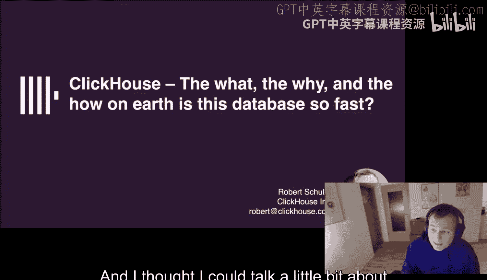
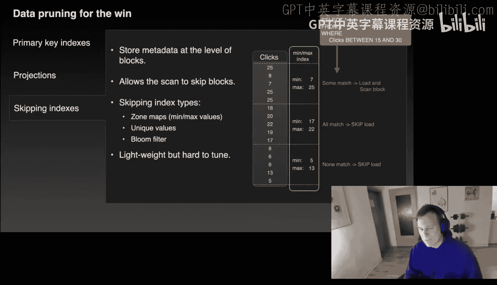
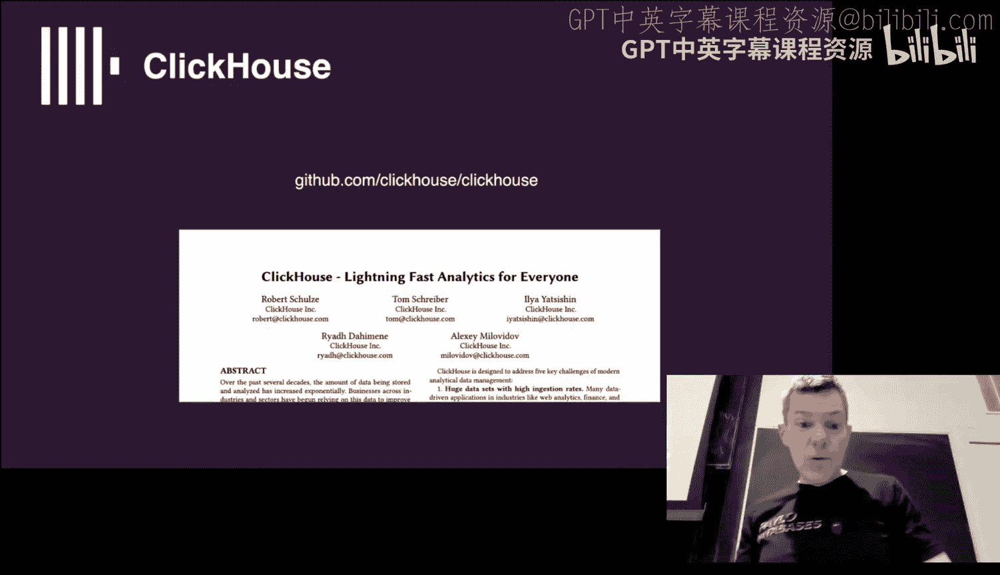
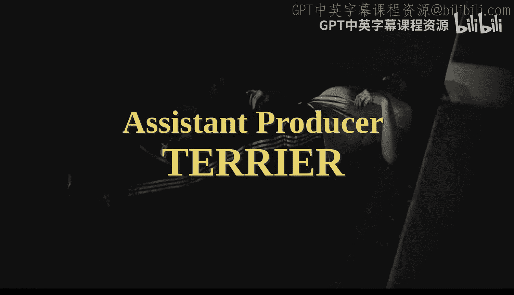

# CMU《数据库导论｜15-445 645 Intro to Database Systems (Fall 2025)》中英字幕 p22 #22 - Database Recovery ✸ ClickHouse Database Talk (CMU Intro to Database System -BV1bmHGzsETM_p22-

🎼still。🎼送一 check。🎼管这我。🎼P your whats out。🎼想脾气的面。🎼我厌。All guys。

 let's get started and get a round of applause with GJ Catt， thank you again。

I was compliment how great DJ you are， but with a lot of cover today。 jump right into it。

 So he's great。 this is great。 let's go Project 4， the recitation the video available on actually。

 I think that 280 is wrong。 I posted this morning But the recitation was last night。

 Slides are available。 The video is available Home5 is due this Sunday coming up。 And then again。

 the final time would be on December 11。 and there's one more homework after this。 Okay。😊，好。

All right， so。Remember last class we were talking about its the first lecture of how we're going to handle logging and recovery in our database system and obviously the reason why we need to do this is because if we write some data。

 we tell the outside world your transaction is committed， no matter what happens。

 we don't want to lose that data， so we crash， if the OS crashes， the database system crashes。

 the hardware crashes， whatever， we need to come back and sort those changes。😡。

And then recall from last F， I said that every recovery protocol you're going to have in a database system is going to have two parts。

😡，The first part is what we talked about last class was all the things you do during normal operations to ensure that when there's a crash later on that you can can recover so we talk about how we're going to maintain this right ahead log in most systems that we're just going to record all the things that we're doing in all the changes that the transactions are making as they go along so then now today's class is the second part where we start talking about sorry we're talking about okay after now there's a crash the system comes back online and we're gonna to look at all the data we record it for ourselves during the normal operation to try to reconstruct the database to be what it was at the state of at the moment that it crashed but of course we can't resume any crash transactions we to make sure that we clean all those guys up and roll back any of their changes so we don't only torn rights or parel transactions so again it's going to look we're going to restore the database basically to the state it was at the moment of the crash。

Okay， so again， with righthead log in our buffer poll， it is means a steal no force policy。

 steel means that we're allowed to evict dirty pages before the transactions that modify those pages are committed and then no force says we're not required to flush all the dirty pages for transactions at the moment that they commit。

😡，And since transactions may abort or fail during normal operations。

 we need to make sure we can roll back those changes and ensure that everything's atomic。

So we're basically trying to deal with the state of the war like that ce and all we're running some transactions。

 all of a sudden there's a crash， the top guy T1 has committed we' make sure to keep its changes。

 T2 did not commit and aborted， make sure rollback its changes and then T3 didn't complete before the crash and therefore to make sure it none of its changes survive after the crash。

Okay。So again， last class was about， okay， what we're going to put in the right ahead log。

 the undo and redo records so that we can recover after crash。

 and then we quickly talked about a sort of naive checkpointing scheme at the end of the class so that we don't have to replay the entire log。

 but we said they had a bunch of problems and that's we're going to fix it。😡。

So now the protocol we're going to learn about today is called Aries。

 the algorithms for recovery and isolation explaining semantics。

 like it's so important it has its own Wikipediaical about it。

And this is work developed at IBM Research as part of the DB2 project。

 so this is building a relational systems， not not IMSS stuff。

 and this is basically the gold standard of how you want to implement a transaction recovery or sorry a recovery protocol in your database system so to ensure that you don't lose any changes。

😡，So there was obviously you know this cable came out like 92。

 theres people who have been doing database recovery protocols for a while。

 one of the key differences that we'll see in areas is that it's going to be overly careful to make sure we don't lose anything I rather do rather to make sure I'm super careful and then slowly peel back some of the pieces to make it faster。

 but I want to make sure I don't lose anything first。😡，And we'll see as we go along。

 the A protocol has this three phases， the analyze or analysis， the redo and the undo。

 and what differs from what Aries does from what other data systems were doing prior to this paper is that sometimes they were doing the redo first and sometimes they were doing the undo first。

 but this thing is going to be super careful and make sure that you do the redo first。

 Bob by the undo and then once you finish that last phase。

 then you say that now the Davis is fully returned back to the correct state and you start running transactions again。

So again， I've said this many times before， I'm going to go through what Aries does。😡。

But the exact implementation from different data systems is going to vary slightly。

 but the three phase piece and the CLR we'll talk about in a second。

 that's the key ideas that everyone should be doing。😡。

To ensure that everything's recoverable the paper is beautiful。

 it's 70 pages it's not an easy read and there's a bunch of things that they're going to cover that we're not going to cover like how do you handle different isolation levels for transactions running at the same time we're going to keep our lives simple and see we're running everything in restrict strong short to P so we get zero livesable transactions。

😡，All right so there's three main ideas for areas the first one we've already covered is that we're going to maintain a right hand log during normal operations where we record all the changes that transactions make to objects in our database。

 but we're going to have to record them to the log first before we apply the changes to the actual objects。

😡，And then we said last class that we have to make sure that。

The log records that correspond to changes to objects。

 those things have to be written to disk before the modified objects or the dirty pages for they're allowed to be written to disk。

😡，So we can't write the dirty page and then later on write the log record because if we crash come back。

 the log record may not made it out， but now we have a page that made it change and we don't know what changed or how it got changed。

😡，Yes。The next idea that we're going to do is that we're going to be repeat our history。

During the redo phase upon recovery。So that means that we're going to look at our right ahead log。

 look at all the changes transactions is made during the normal operation。

 and we're going to just redo everything。😡，Even if some of those changes actually made out the disk。

We're going to be getting super cautious and we're going to say。

 I'm going to make sure you really got this and we're going to go ahead and apply those changes。😡。

And then the last piece is that when we start undoing the effects of transaction or undoing operations of transactions。

😡，Because they got aborted or they crashed， they crashed before system they didn't commit before the system crashed。

We're now actually going to maintain additional right ahead log records that correspond to the reversal operations that we're going to do as part of the undue step。

😡，Basically， you get a log record for any time you make a change and then if a transaction aors enroll back。

 and now'm going to have log records to reverse those changes。😡，Because again。

 I want to know exactly what's happening in my data system on my pages。

 and so I want to court everything that I do。看。So we'll start off talking about the log sequence numbers。

 how we're going to start keeping track of the order of these operations that that transactions are doing and then we'll talk about how we do a normal commit and abort during regular runtime then we'll。

😡，Buildil a or design a better checkpointing algorithm called fuzzy checkpoints where we don't have to block all the transactions while we're running in the system and then we'll do our we'll put it all together and finish with Aries and then we had the clickhouse guys giving a talk with us today and so we'll cut rid of that at the end and if we run out of time we're not getting full aries we can pick up on that on Monday next week and again during this discussion today's lecture I'm gonna to be very conservative and very careful about how our recovery scheme is gonna be implemented and that means we're up writing much of redundant information but that's okay because again we don't want to lose anything and there's some optimization to talk about the end where you can start again tweaking some of this to maybe not do everything as with so much verbosity as again the textbook as the Aries paper describes it。

😡，But a cable symbol will work ignored in the beginning。Al right。

 so the first thing we need to do is extend our redhead log record。

 the log objects records we had talked about last time， including some additional information。

And when I've showed the log records before， I'm kind of appending him in sequential order。

 and I was only showing like one or two transactions running at the time。

 but now if you have maybe hundreds or thousands of transactions running at the same time。

 you kind of want to know what the true order these operations that are getting applied。

 especially if they're happening to different pages at the same time。😡。

So now every log records is going to now record and be provided a globally unique monoetically increasing log sequence number。

 you can think of this a little bit like the timestamp we talked about with transactions in OCC where the transactions are assigned these globally unique timestamps。

 every log records if we sign a globally unique log sequence sequence number。😡。

And this is going to represent the physical order in which the changes are applied to pages。😡。

The logical orders is the timestamps top up up up so we're still running two phase locking or OCC or whatever you want up above the rest of the system。

 but now when we actually write log records to disk。

 this log sequenceA number is going to correspond the physical order in which those things actually occur。

😡，And now other parts of the system need to be aware of these log sequence numbers because it's going to determine when they're allowed to do certain things with pages。

😡，So again， we' have the log sequence number just that can increase every time we make a new record。

😡，But now in every page in our database， whether it's index page or a table page。

 doesn't matter what it is。😡，It's going to have this page LSN record that's going to keep track of the most recent log record that modified the contents of that page。

😡，RightSo again everything of the header， every data page。

 now we're going to have this page LSN and some of them are going to point to log records that are on the disk。

 some of them are going to point to log records that are still in memory in our log buffer。😡。

And then now there's a global LSN called the flushsh LSN。

 where the dataity system keeps track of what is the largest log sequence summer for a log record that's been flushed to disk。

 so it's basically the dividing point the demarcation line of where the disc buffer stops and in buffer continues。

😡，And again， as I said before， now we talked about how we need to make sure that they log record for that modified a page and made it dirty that make sure that that gets written to disk before we we can write the dirty page to disk。

 these LSNs are how we're going to be able to do this now。😡。

So now in your B poll manager and your and your eviction algorithm。

 it has to be aware of with my flush LSN， and now as you start examining pages to determine whether they can be evicted or not。

You go look at the page LSN in the header and you see whether it's less than or equal to the flush LSM。

😡，If it is， then you know that the log record for that modified that page last is out on disk if it the page L send is greater than this。

 then you know there's some log record hanging out in DRAM and therefore you can't flush that page。😡。

So now you do bunch of things like， all right， well。

 I want to my eviction policy says I really want to flush this page。

 but my log record for it is still in memory so you could have your buffer pool then decide oh。

 go flush the log buffer doing that whatever the group can stop。

 make that happen earlier than it normally would and then when that comes back with an acknowledgement then you can go flush you can flush out the page invict it。

😡，So these LSN are going to show up in a bunch of different places we talked about the page LSN and the flush LSM right flushush LSN hangs out in memory tells you the last LSN of the log record on disk Page LSN is the latest LSN that last modified a page。

😡，But every single page we also going to keep track of the rec LSM。😡。

Which is going to be the oldest update。That modified this page since that page was last flushed disk。

😡，And you don't actually have to store this in the page itself when we have some two separate data structures will'll come in a second called the dirty page table and the Actctor transaction table。

 so rather unlike the page LSN where you in the head of the page。

 you you put the LSN that modified it last， the rec LSN just hangs out in memory。

 and it's going to correspond to the LSN that modified first modified the page since it was last flushed。

 written a disk。😡，The last LN for every transaction is keep track of the latest。

 the most recent log record for any transaction that's actually running in our system。😡，So if it as。

 we know how to jump to the last LSN and start working our way backwards， undo its changes。

And then a special one called the master record will be another global LSN that is going to keep track of the beginning point of the last checkpoint that successfully completed。

In our write blog。Me say when we take a checkpoint。

 we have to write a log record that I'm taking a checkpoint。

 so the master record to keep track of when that last checkpoint got completed successfully。

 when that started， where to go find that in the log。All right。

 so now we go back to our example we have before。 we have we have now a right hand log hangs out in memory。

 We have a buff hole。 we're bringing in pages。And then now we see that in our redhead log。

 we're including these LSNs。😡，That is monotically increasing by one every time we get a new log record。

 and then we have now in our pages for data pages， we have a page AllN and they can be different from a memoryory versus own disk whenever it gets written out。

 then obviously the own disk one gets updated。Then you have this flush LSN that's just going to correspond to what's the last LSN that made it out the disk and that may exist in your buffer memory or not。

 sorry in the log buffer that's in memory it may still be in there， but I don't care about that。

 I just care about I'm pointing basically the last entry I have on my login disk。😡。

I by a master record that's going to hang out in disk too。

 And again that's just going to point to the the starting point of the last checkpoint that I took。

Because I'm going to use that as a way to jump into the log and figure out what was going on at the time at the crash。

So if my page L7 points to something that's on disk， can I flush it。Say say I need to modify。

 I modify this page。 I want to write out the disk。 I page L7 points to something on the law。

 Can I flush it。Yes， because I know the log record that corresponds to that change and made it out the disk。

😡，So save to flush this。But now， if my page Allllcent points to something that's still in memory。

And I know that that LSN is greater than my flush LSN。

 that I know it's not safe to flush this because the log record for it hasn't made it out。

So these Alls are simple watermarks for us to determine what's on disk。

 what's in memory pages and for log records。😡，So I've already said this。

 every log record has at LSN and every time we're going to modify a page。

We're going to create the log record， get an LLN that corresponds to the change we're making to the page。

 then now in when we go modify the page， we also go update the page AllLSN that's this in the header。

😡，And we have the right latch on the page so we can go ahead and do that。

Then every single time we flush out the right hand log in that group commit process or when the log graphic is full。

 then we update the flush LSN and determine where the endpoint is for the log on disk。

All right so during normal execution is basically all the stuff that I just talked about right like transaction makes changes and we want to record those changes in our right ahead log before we go apply the changes to the pages themselves so to simplify a discussion today the assumptions we're going to make is that we're going to assume that all our log records fit in a single page。

😡，Yes， you can have tuples that are larger than a single page， like 4 kiloys，8 kilobytes。

 but then obviously what do you do if the log record expands that？😡。

You know you just have a sequence number within the page or segment number。

 so I would say my log record is my log record is too big sit in a single page that I would have sort of the first half log record say I'm segment number one。

 one of two and then the next log record say I'm segment two of two you would know you knowt the first one not the second one。

 you don't have the full log record and obviously you don't update anything to say things are sexually flushed till both of the segments make it out but we can ignore that for now we assume that our diskite is going be you know four kilobyte atomic rights if things are spa multipleal pages you know it just just wait for the extra flush to make sure everything's made it out before you tell the outside where you've committed。

😡，We're going to assume that the day system is going to be single version running strong strict2PL。

 so that means that we won't worry about weird innerleavings of transactions upon replay。

And of course we're using redhead log， we have to use steel no force。

 we assume we're going to do physical log scheme， physical log scheme or physiological logging。

 we're not going to do the logical logging where you have to just have the SQL query in the log record。

 we basically have the diff of the changes we're making to pages。😡。

And then I'm not going to talk about how you update the pages for indexes as a part of these changes。

 it works the same way as it would regular table pages。

 but Cap it simple we're just updating single objects and we' do physical logging。😡。

So when I transacting goes commit， the data system， again。

 I'm going to write the commit message to the log buffer in memory and then。😡。

It can then flush that log buffer out the disc either right away or part of the group commit with waiting a little bit to get batched together。

And then once we know that the commit is successful。

We can tell the outside world that your transaction is successfully committed。

But then now we're also going to introduce a new log record called transaction End。😡。

That we can append to our MM log buffer， and this has been used to represent to the system。

 to keep track of the fact that this transaction has successfully committed and there's nothing else we ever need to do for ever again。

So in this case here， since the transactions is normally committing， I commit。

 and then then I could put the transaction end message once I know it things have successfully flushed。

And I don't need to maintain any additional metadata for about it later on。

 does will make more sense when we do a recovery and we see in this case why we need this transaction down for board。

 when we do abs， but for commit， it's pretty straightforward。

And this transaction end message does not need to need to be flushed immediately。

 we can put that in a log buffer and then eventually it'll get written out and that's fine。😡。

There's no problems。So it looks like that right so again we have our transaction begin that's how we put a log buffer there then this transaction does a bunch of updates。

 we update we update we go ahead and create the log records we update the page in the memory then upon commit we got to make sure we flush this out the disk right that's fine once that's been updated we can update the flush LSN and now point to this latest log record here we can tell the outside world that our transaction has committed that's all fine and then at some later point soon after this。

We'll say， all right， we don't need this transaction anymore。

 we'll put a transaction and message in it in the law。And then that'll eventually get written out。

One additional opposition you can do， you can say well。

 I keep track of my flush LSN so I know that at some point I don't need to keep this log buffer around and so again if I can just do the swapping mechanism if I have two buffers or three buffers。

 but essentially I'm just trimming out what I have in memory because I know I don't need to access these log anymore。

😡，看。All right so this is pretty straightforward， the aborts one we add additional things。

So now when a transaction on boards， it's basically going to be a like an undue operation during the during normal execution when we a board。

 it's going to basically be doing the same steps that we would do during recovery。

 just now we're just doing this part of the regular execution process。

So we need to add one additional field to our log records called the previous LSM。😡。

And we don't need this for correctness reasons， we're going to need this for performance reasons。

 it's going to allow us to basically maintain a link list of the log records that correspond to a similar transaction so I can jump to the last log record for a transaction and then follow this previous LSN to jump to the different log records for that transaction。

😡，And in correspond order， again， for PowerPoint I'm only showing like one or two transactions at a time。

 thinking of like1 thousand00 transactions a second。

 I want to quickly able navigate and get all the log records I need for a transaction。

Another thing to point out， too， is that the。呃。While we're doing this。

 while transactions into running and then we end up boarding you need to roll them back。

 we're still technically doing all the concur digital stuff we talked about before。

 so if I'm doing 2PL I don't lease the locks as soon as the transaction tells me Ibt because I still need to go modify the records I've already modified when I thought I was still gonna so I hold the locks and all those things I'm going to reverse back on and only when I go ahead and actually finish the rollback。

 finish the undo process then I go ahead and release the locks。😡。

This ensures that like someone else doesn't write to something and I try to roll back my change or how to put it back to the value it was before I started running and I end up blowing away that other transactions is right。

All the same stuff we talked about before with2PL。All right。

 so coming back here now now we have again in our head of our log records。

 we have the LSN that's always going up in time and the previous LSN just corresponds to the previous one in the case of the top one where we're beginning transaction four。

 there isn't a previous LSN for the begin message， so it's just null or nil。So transaction is run。

 makes these changes， then it goes ahead and gets an abort。

 and again this could occur because either the application set aor this transaction or our con protocol set a this transaction。

 we don't know， we don't care。😡，And now the question is。

 what do we do in this middle step here before we can put that transaction end message for T4。

 what do we need to do to roll back those changes？😡，Was that？Following class， but like。And do what？

Like to see what mighty change and。I heard when he said it， yes。Process undo yes。

 but we're were talking about the logging here， we got to record what we do。😡。

So undo gives me the same thing as normal operation， we want to record what we're undoing。

So that if we crash when we try to undo this， we know what he und and we can make sure we still undo it。

😡，Yeah。And so we're going to introduce a new log record type called compensation log records or CLRs。

😡，And it's the same thing as the update operation we do normal execution。

 but it's just the reversal of it。😡，We're just taking the before and after value and just swapping it over。

😡，Right。And then when we do this for normal execution， when we're undoing transactions。

 we don't have to wait until these CLRs that reverse the changes。

 they don't need to be flushed at disk。😡，Immediately when the transaction。

 when we complete the undue process， because actually as soon as the transaction says it gets aborted。

 like either because they say abort or we tell it's going to abort。

 we need come back to the application say your transaction has been aborted。

We don't need to wait to flush anything。Because we're not making any guarantees other than make sure that we reverse all these changes。

 which we'll do。边个咁班。The questionest， if the machine crashes before the rollback completes。

 what do we do， roll back， we'll get there in a second。That's the last step of areas。

' runningning out of space in PowerPot so now I'm going to put this in tabular form right so now we have think of like every row in this table corresponds to a log record。

 they have an LSN， a previous LSN transaction ID of the transaction making the change。

 the log record type， what objects are modifying the before and after value and this undo next LSN thing if we need to roll things back。

😡，So this is the same setup we have before， T1 made some changes now to Bts。

So as soon as we get the abort message， we tell the outside world the transaction is finished。

 it's aborted， but then now we got to start undoing the changes。😡。

So this is why having the previous LSN for transactions makes this easier because I see the abort message。

 I know the previous LSN for this transaction was 003 so I can quickly jump up to find that log record and roll it back。

So I see the update message at LSN3。So I'm going to create a CLR for this that says。

 I'm going to reverse the change that happened up above in this previous LSM。😡。

So I'm going to have the same object that I modified。

 but then I have now basically the reverse of the before and after value so I can swap back to what it should have been before the transaction made any changes。

😡，And then my undo next LSN， again， is just a helper to say。

 here's the next LSN that you need to roll back after this one， so then jump up there。

And then I'll do the same thing， create another LSN or CLR for it that's going to correspond to this change here。

 and I'm just reversing the values back。Then I get the undo next LSN。

 I see that it's the begin message， and at this point I know I'm done。

 I reversed all the changes I needed for this transaction。

 So now this is where I put the transaction end message。😡，For the suborinate transaction。

So for committed transactions， there's nothing in between commit and end and aborted transactions。

 it's all the CLRs， making sure that you reverse all the changes that it made during normal operations before it ab。

 yes。😡，这后们有。You to be right。The question is for committed transaction。

 can I immediately write the transaction end after the commit， yes？嗯。During normal operation， yes。

 recovery， maybe we'll see it in a second， it has to stick around maybe a little longer。

Any other questions？And good， So so far， so good。 right。

 So so far this is pretty straightforwardboard。And so the board algorithms basically as I said before。

 we first write the abort message in the redhead log。

 we can tell the outside world that transactions has been aborted at that point。

 and then we're going to analyze the transactions operations updates。

 it made in reverse order and apply them apply the reversal and then'm going back in time so take the latest log record that they established to do an update。

 reverse that and then do the next one until I hit the begin and then I know I'm done。

 and I'm going to write the transaction end message and that point I can release all the locks for my transaction because I've updated all the records that I wanted to update and then I'm done。

Again， a simple optimization you could do in this case here。It's you know。

 this is an example where in twobase locking you could start releasing the locks early。

 if you know that you're never going to update the same object again multiple times the undue changes during the undue process。

 you can release the lock for that object in the moment you get you know as you apply the update。😡。

RightBut you have to you have， if you scan all the right hand log and know what all the objects you' going to modify ahead of time。

 you can do that if you don't do that and then you can't because you don't know whether going you have to do multiple undos。

😡，The other thing to point out too， is we're never going to undo a CLR。

 we're never going to undo an undo。It doesn't make any sense。Because again。

 we're trying to undo something that happened to our execution。

 so we don't need to make CLRs for our CLRs when we do when we do recovery right once it's there。

 we know that we can always replay it， reapply it over and again。😡，反你这个。Sa。Question。

 why do we need the before and after value for the CLRs？Again， we're being apathenttic here， right？

You could say， I know I going back here。 You could。 You could just say， I know I need to reverse。

This change here， go look at it and say it it was 30， 40， I don't need to record that it as 40 30。

But again， were being overly were both。嗯。新一般都大律类で。Im going to say that。

 but we don't need go the with the。All right， so he's basically saying。

 can I start catchching things？Let's not do any's they'll do any optimization。

 Let's make sure it's correct first in databases， you want to make sure it's correct first。

 then you make it faster。😡，But yes， you could start doing things like that， yes。

Why do we need this whole CR in a work logic at all。

 Like if we didn't have the work row and didn't have the CR role。

Is it true that like we could just leave the writer headdo as is。And like， since there。

 there will never be a commit。Entry， and we know that the journey。So his statement is。啊。

Why do I need to maintain the CLRs， shouldn't it be enough for me to go just look at what the changes with the changes that were made in the regular update or update records and just reverse them？

😡，Like like the boarding and crashing is the same a boarding and crashing is the same thing yeah later on we'll say this is like the key idea what what we're going to do this is that there's not going to be any log records that say has this page been flushed to disk。

So we don't know when we come back and crash， which of these changes actually made it out the disk yet。

Sometimes we can， sometimes we don't。Yeah， but are you supposed to be able to look at the previous transaction for let's say。

 a like。In any case， it's any true that we need to be able to go look at what we put in a like yesterday。

That。Std is， isn't true that I need to be able to look at a log record from yesterday and know what went into it so I can then reverse it。

Yes， but to do that correctly I got to reverse all the changes the checkpoints are basically trying to freeze the state of the buffer pool right all these dirty pages。

 but then problem is the way I'm going to do checkpoints is that I'm not going to stop everybody from updating things while I'm doing it so it's me this weird it could be in this weird state where some dirty pages have been written to disk some pages haven't been。

😡，And I've been modifying things while the checkpoint is occurring。

 so I don't know what exactly the state of the world is。At the moment I got a checkpoint。

 so all these undos and these CLRs and the regular records allows me to reverse things back to the correct state。

Are there some optimizations you could do， yes？But again， for recovery stuff， you want to be super。

 super careful。So I said again， this is overly verbose。😡，Let's start with this。

So Postgres is even more robust than this， Postgres getting Harrisel Postgres will be after you take a checkpoint。

 the first time a transaction modifies a page， they write the whole page out to the right ahead log。

 then write the log record that modified that page。😡，Because again。

 usually you want to be super careful that like if things get corrupted。

 you always come back and get get back to the correct state。

 so we're getting extra redundancy through these CLRs。

 but it's also going to make sure that like if we crashed during recovery。

 we know what we actually made what we actually modified。So like you two guys。

 every year people are like， why we doing this it seems so wasteful， you're correct。

 but like to be super careful， we're going to do all of this and there's optimization you obviously can do afterwards。

😡，Okay。は。so I think we've recovered all so at this point。

 now we get to start to understand why we have all these CLRs and digital things。😡。

Now we're talking about how we can do fuzzy checkpoints。Again， the reminder。

 the reason why we need a do checkpoints is that the logs going to grow forever。

 assuming you have transactions running all the time and when I crash and come back。

 I don't want to replay five years worth of log to put my datas back in the correct state。

 I want to be able sort go back to a certain go back a little bit in my right ahead log and use that as a starting point for me to say let me reconstruct this state of the database at that point in time rather than the beginning of time。

😡，So this be a mechanism where allow us to sort of speed up the recovery time。So。

The last class we talked about a simple protocol where we basically stopped the world when we want to take a checkpoint。

 like stop queries from running queries from modifying things。

 stop any new queries from starting any new transactions。😡。

Wait until all any actual transactions that are still running could finish execution。

Whi could could take days or hours and that sucks。 But then once we know there's no active transactions。

 then we take whatever's in our buffer pool， write that out the disk and we know that's been flush。

 and then we add we can add a checkpoint entry into our log。 So now if we crash， come back。

 we go look at that checkpoint record we know that all there's no inf transactions at that moment of the checkpoint and the database is a consistent snapshot。

😡，Right。So it makes recovery super easy because again。

 I don't have to look at the log and look for transactions that might have been running while I took the checkpoint。

 I waited until they all finished。😡，And I don't have any weird to unwrite situations。

So recovery is easy， but obviously this is super slow because you get the pauses。

 everything while you take a checkpoint。So a slightly better one is not wait for transactions to finish。

But you just pause them from executing whatever they were executing。

And then you write out your dirty pages， and then with that done。

 then you can allow transactions to start running again。😡。

this has problems too to say I have 30 pages in my database。

 I in my buffer pool I have one worker thread wants to do checkpoints。

 one worker thread is's running transactions so say the transaction it's going to modify two pages because modify page one and three so it first modifies page three。

 then the checkpoint starts。And the checkpoint's going to pause any transaction that's running from any running anything else。

 it could be either inf query or just preventing them from running another query。😡。

Then now the checkpoint is going to basically do a sequential scan and all my pages in my buffer pool and write those out the disk right。

 So we'll have page one， page 2， and then the modified page3 that of transaction modified。

Then the checkpoint completes， the transaction wakes up again and now it modifies page1。But。

I don't have a consistent snapshot of those pages in my Balo， I'll have half the changes。

That transaction one made。So I still have to go look around more and the right I had long to figure out what was this transaction doing at the time I was taking the checkpoint。

 so I make sure that I got。I can try to reconstruct the database and get that。

 make sure I get that page one of there because the is actually may later commit。

And we tell the outside where of the transactions committed。

 but I'm missing that it update in the page。So what we're going to start doing now is now I'm going to add additional metadata to our right ahead log。

😡，To keep track of let we take the checkpoints， when the checkpoint is going to start and when when it's going to finish。

And then we're going to record what were the transactions that were running at the moment that the checkpoint started and what pages were dirty in our buffer pool at the moment that checkpoint started。

😡，So that's's going to give us more idea about what's going on in the state of the system。😡。

At the moment that we least started taking a checkpoint。

 we'll know whether these changes actually made out the disk or not。😡。

So the ATT or the Actctor transaction table is pretty straightforward。

 every transaction that exists willll have a transaction ID similar to the Act transaction table we talked about when we try to do OCC or MTCC。

 we need to keep a track of what transactions are running at the same time。

 it's basically the same table。😡，Then we'll have the status of the transactions mode。

 what phase it's in， it can either be running because it's still actually going on。

 it's in committing process。And then candidate for undo means that we think we're going to have to undo this and they change later on that turns out this transaction does commit and we can change its status。

 but when we do recovery we assume everyone's going to get rolled back until we we learn otherwise。

So we can remove a transaction from the ATT once we see its transaction end message。😡。

eitherith because we've got committed or bored them rolled back because at that point。

 we know that there isn't going to be any more changes coming from this transaction and we don't need to maintain additional state for it。

So when we do this recovery process， we're going to we look at the extra transaction table and say。

 well， these transactions are running at the moment I took the checkpoint。

 but I don't know yet whether they're going to commit or not so I'm assume everyone's going to abort and then later on as I scan the log I might find a commit message and I go ahead and change its status。

😡，The dirty page table is going to be another separate of data structure where we're going to record all the pages that were in our buffer pool that were marked dirty。

😡，They were not flushed to disk yet at the moment that the checkpoint started。

And this we were going to record the rec LSN to say， here's the newest log record。

 sorry here's the oldest log record that modified this page and made it dirty since the last time that page was written out the disk。

😡，So Page LSN is the newest log record that modified the page， the rec LSN is the oldest log record。

😡，That since the page was brought into memory。last right in a disk？Right。

So these dirty page tables can keep track all the pages that are in our buffer at the moment the checkpoint started that are dirty。

😡，So now in this case here we have our checkpoint starts and in this case here we have when our checkpoint starts。

 we keep track of the ATT so we know that there's a transaction T2 that's still running T1 got transaction end before the checkpoint started so it's in our actor transaction table and then there's a log record up above that corresponds to modification on page 22 from transaction T2 and that was that's hanging out in our Buff hole that's still dirty。

Then later on we take another checkpoint and now we have transaction T2 and T3 right because T2 committed before checkpoint started。

 but we haven't seen a transaction end message yet。

 so it's still technical alive and then T3 started after the last checkpoint so that that goes on our actual transaction table and then we have in a dirty page table we have the two modifications here from T2 and T3。

😡，呢两你书见。The question is， why isn't P11 in the DPT got written at the disk？

There's no log record a page got written in that disk。

 the only information we have is whether it shows up in the dirty page table。😡。

So this is better because now we at least have some additional metadata about what's going on in our system at the moment of the crash。

 but we're still taking blocking checkpoints。 So every you know every time I'm taking a checkpoint here and the two log records here。

 I'm stopping all the transactions from running。Take a checkpoint。

And at least now I know that if a transaction modified pages， I at least keep track of like。

 was it dirty before after I took the checkpoint， yes or no？

But I'm still blocking all my transactions。So what everyone does in instead is what are called fuzzy checkpoints。

😡，And this is now where it's fuzzy because it's。It's allowed to write out pages that。

That you want to write all the pages that were dirty since the moment that checkpoint starts。😡。

But those dirty pages might contain changes that from log records that came in after the checkpoint started。

And there may be changes that occur to pages that I don't write out my checkpoint because they were modified after the checkpoint started as well。

 but I just I missed it。😡，But the DBT and ATT is going to give me enough metadata to go look the log around。

 swooper around and figure out what was actually going on to figure out。

 find out the things that I may have missed。😡，So now instead of just having a single checkpoint you know record in my log that says here's where the checkpoint started and I block everyone。

 now I'm going to have a begin and end and that's going to correspond to the point in time。😡。

Denoted by the log sequence numbers because that's basically representing physical time。😡。

when the checkpoint was occurring。And I'm going to record the。

The what the DBT and ATT were at the moment， the checkpoint started。

 but I ended up writing it out to the commit end message， the checkpoint end message。

As a way to simplify things。So I can find things more easily later on。So right so in this case here。

 Zoo now were going to that transaction data is going to flush page P11 before the checkpoint starts here。

 right？So then now when the checkpoint finishes I'll have the ATT from when I started so transaction T2 was running when the checkpoint started at 007 T1 got a transaction n at 006 so it's not in the actual transaction table and then there's my dirty page table that there's begin up there my dirty page table corresponds to this update here that got occurred that was dirty before I took the checkpoint and then I may have。

😡，Written it out with that change or may have a change from another transaction that made a change before the checkpoint ended or。

Or I made it written out and then someone update it。

 and that page is that update's still in memory too。Sos sort of three states that a page could be it。

😡，And then now once the checkpoint completes and I flush the checkpoint end message I then update the master record for the database and say here's the LSN of the last checkpoint that I took so in the case here at010 when I complete that checkpoint I write my master record 007 because that's the checkpoint began up above and then when this checkpoint ends down here 015。

 I write my master record that the checkpoint started less successful checkpoint was 013。😡。

And then when I crash， come back when I see it in a second。

 we're going to use that to jump to this checkpoint begin。嗯。

So now Aries with our fuzzy checkpoints in these CLRs and the log records。We now get new recovery。

So it can be three phases， the first phase and we're going to analyze the right head log。

 starting at where the master record points to to the beginning of the last successful checkpoint。

 and we're going to scan forward in time to the end of the log on disk。😡。

And look at all the log recordss we see and try to figure out what transactions are going to survive。

 what transactions need to get rolled back， and what pages may or may not have been written to disk assessment。

😡，During this process。Then after the analysis phase， then we do redo。

 we're now we're going to jump back to another point in the log where we determine here's the starting point of an actual transaction。

 or transaction that was active when a checkpoint started。😡。

And we're going to scan through and make sure we redo all its changes。

And then now we go back and undo all the changes transactions that should should not survive after the crash and go ahead and reverse them。

So essentially taking three passes over the log， but in every pass。

 we may be jumping farther and farther back in the log based on the information we collect during the analysis and redo process。

😡，No way to look at that visually again， we say this in our write log and we crash here down below。

 So when I come back and analysis phase， I'm going to use the master record to figure out what's the starting point of the last checkpoint and so I'll scan from that point down and look at what all the transactions are doing after after that checkpoint。

Start it。Then now based on my ATT， it's going to determine。

 here's the transactions that I know about in my log。

 and I need to make sure I redo all their changes。😡，Even if they're going to get ab later on。

 I'm still going to redo them。So in this case here。

 I go look at the and I go look my log and the reading phase。

 I find the smallest reccent in my dirty page table after analysis。

 So this is going to be what's the。😊，What's the earliest？Ellison。

 the corresponds to a log record that modified a page that not that was dirty before I started my checkpoint。

So I want to go back and make sure I reapply all his changes from here down below。

And then now in the analysis phase， I'm going to jump to the oldest log record of any actual transaction that was still alive at the moment that I crashed。

Jump back to that point in time and then scan through and undo all of those transactions that should be aborted and rolled back。

And during this redo process up we may end up I go like this。

 we may end up reapplying the CLR records to make sure we reverse things。

 but that's okay because again that's going to put us back to the correct state we want to be in。

All right， so analysis phase， as I've already said。

 you can scan for from beginning of the last successor checkpoint to the end of the log and basically reconstructing the ATT going forward in time。

 as you're scanning along in the analysis phase， if you find a transaction end message。

 you know that there's not going to be anything else from that transaction so you can go ahead and remove it from the ATT because it's successfully committed。

For all all their log records， if the transaction is not the ETT， then you go ahead and add it。

 but you said it's undo status or it's execution status to be candidate for undo because again you're scanning for in time。

 so you haven't seen a commit or onb message for the transaction。

 you just assume that it's going to abt。😡，But then when you see the commit message for a transaction。

 then you updated its status in the ATT to say it's allowed to commit。嗯。

As we scan along too we just want to populate the DBT。

 so if we find a page that's's being referenced that's not in our DBT as we scan along。

 that we know it's been modified since our last checkpoint and therefore we want to make sure that it exists in there and we just sent its reN to be whatever the LSN that modified it。

😡，Because you know it didn't exist in the buffer pool， at least in a modified form。

the moment that we see the log message because otherwise we would have seen it in the DBT。

So now at the end of the analysis phase， the ATT is going to tell us what are all the transactions that are active at the time of the crash。

 and therefore we need to roll them back， and the DPT is going to tell us all the pages that were modified but may not have been written out the disk。

😡，And you don't know they' been up， whether the change got written out the disk unless you go read them。

😡，The DPT is telling you what you got to go check。Let's example like that。

 So say that our transaction sorry system a checkpoint at 0，10。 So at this point here。

 we don't we don't have editing in our AT or DPT at least initially。

 but we know that we're all all the transactions that are running in our system and all the。

All the log records， sorry， all the pages that are sitting in our buffer pool。

 but at this point here， we don't record that in the begin message。😡，Then later on at 020。

 we see this transaction T96 is making an update to an object A in page 33。And again。

 assuming that if this thing got was in our log message， then it modified the page。

 but we don't know whether that page was flushed out the disk as part of the checkpoint。

 like the checkpoint got to it first， or we modified it after the checkpoint right up that page。😡。

So we put a log record in that says here here's an entry in our ATT says here's this transaction 296 that we now know about。

Because we' we didn't see the begin for before the checkpoint started so that the begin message for this transaction is up above before the checkpoint begin。

 But since that we don't know what's going to happen to it at this point as we in our analysis。

 we think it's going we assume it's going to get rolled back and important。 So it's undue candidate。

And we keep track of the page that it modified during this。

 right and the rec E that corresponds to the one that modified it。

Then now we get to our transaction end， and at this point here now we have in our ATT， we have T96。

 T97， so there's another transaction t97 up above that did a bunch of other stuff before transaction began and we haven't seen it yet in any log messages after the transaction at the checkpoint started。

😡，So we now know about it and。I'm going to assume that's going to abort。

And we also know about there was was a page 20 that was dirty in ourpro that the checkpoint would at least。

 we know it it would have written out if the checkpoint completed。

Then we see the log record that 196 that it committed。

 so we updated status in the ETT that's we allowed to commit。

And then we now see the transaction end message for T96 so we can ahead and go ahead and remove it。

So at this point at the end， we know that there's a transaction t97 that did something up above that we're they need to roll back we don't have the log records for it。

 so we have to go find those and we know that there's page 33 and page 20。😡。

Where there was changes made to them that may have not made it out the disk， yes。Y就以及那个方面然。啊。

The question is why does the GPT not have P33 at 030？

It was not dirty at the moment the checkpoint started。

 so the DBT ATT record what was the state of the world at the time the checkpoint started。爱是。

And put they put it in the transaction end part， not the beginning。All right。

 so now now if the analysis is we have， we have our AT or DPT。

 And now we know what transactions we need to。Reapply changes to and what transactions are going to get aborted。

 And therefore， we need need to start undoing those changes。U。And。😊，I sorry。

 and don't we're not going to undo anything yet， but we're going to apply always all our changes。

 but if there were aborted transactions and we see the CLRs in the log as we're scanning through。

 we're going to reapply them as well。😡，And then the second phase。

 we're going to go back and undo stuff。 But for now。

 we're're just going to reapply whatever we see in the log。

 but we're not going to create new log new log entries。' at we're just。Re executinging what we have。

So we're going to scan for from the log logcrd at the smallest rec LSN in the TBT。

 because that's going to correspond to the log record that modified a page。😡。

That was dirty at the moment the checkpoint started。

 so we know that's going to be farther back in time than anything that got modified while the checkpoint was running。

😡，And then anytime we need to reverse or undo a transaction because we know it's what its status should be because we scan to the end of the law。

 we know whether it's any transaction to commit or not， so we have to undo any changes。

 that's when we go ahead and apply the CLRs。😡，U。Sorry， I'm going to hear myself， that's undo。Forrito。

As I scan through， if I find a log record that updates a page or a CLR。

 I need to determine whether I should bring that page back into memory and go apply it。😡。

And so now you can start looking about what's in my dirty page table and understanding how these log sequence numbers are going to determine whether I've already applied this change or not。

 based on what I see when I bring the page back into memory。😡。

So if we see an update record or a CLR that we need me to reapply。

 if that page is not in our dirty page table， then we know that the change for it for that particular。

😡，Page。That page wanted was modified was written out the disk。

Before we crashed and therefore we don't need to bring it back in memory and reapply our change。

If it is in our dirty page table， then we need to check to see whether that the last。Log record。

 the res and the earliest log record that modified that page since it was last flushed to disk if that comes。

Before the LSN that I'm looking at right now， then I know that whatever my change was that got applied to that log record or that the log record I'm looking at。

 that got applied since the page was written now so I don't need to reapply it。😡。

But if the the law work I'm trying to apply if it's LSN is。Greater than the page LSN。

That I know that my transaction that I'm trying to redo made some change that modified the page and that record was not those changes were not written out the disk。

😡，Because the page LSN what's the last log record that modified this page when that page was written to disk so my LSN if my LSN comes later in time。

 I know that this page got modified， flushed a disk and then I tried to update it and my update didn't actually make it out the disk。

😡，ButThe challenge though in order for me to figure that out， I got to go out the disk。

 bring that page back in and go check its page LSN because I'm not recording that in my dirty page table in my checkpoints。

 I'm only recording the rec LSN， I'm only recording the the oldest log record that modify the page。😡。

it was last flushed to disk。So for the first two here you can just check on the dirty page table without actually looking the page and figure out whether you need to reapply this for the last one。

 you have to go bring the page in and look at what the page LSN is set to。😡，呵。So to redo any action。

 we just reapply the update and then set the page LSN to whatever the LSN that we're modifying。😡。

That we applied， we don't do additional logging and we don't need to make sure we flush anything during this recovery process because that would be unnecessarily slow。

We're not running up the transaction， we're just trying to redo things so why bother flushing things and make sure things's committed。

And then now once we reach the the end of the reader phase， any any。

Any transaction that successfully committed or we end up any transaction that's successfully committed。

 then we can put the transaction end message， but we may still have transactions we need to reverse their changes on。

And that's what we're going to do in the second phase because we're going to generate additional CLRs。

So now in the undo phase， this is where we know all the transactions that the successfully they committed or did not commit at the time the crash occurred。

We've gone through the analysis phase， we' figured out what everything is。

 we've done the reading where we've reapplied everybody's changes。😡。

And then now we need to go back and undo the changes for transactions that should not be allowed to commit or dont don't commit。

 So if any transaction that's still in our ATT with this undo status at the end of the redo phase。

 we now we need to go back in reverse order。And apply the changes as if it was an abort during normal execution operations。

Right。And we're going to use this。The the last LSN the undo things allow us to quickly jump back in the right log。

 jump over things we don't need to look at again， just jump to the transaction。

Transaction that we're aboarding on doing， we can jump to its log records and quickly find them and roll them back。

😡，And every time we're going to reverse a change or undo a change， we're going to create a new CLR。

All right so let's look a full and end example here so we have our transaction starts at checkpoint at at 010 sorry 011 checkpoint ends at 012。

 there's a T1 at 013。 It makes a change to page P5 T2 makes a change to P3 T1 then calls an abt。

So to roll that back again， we have our CLR records for this right we go ahead and reverse the changes once we know all the changes for T1 are done。

 then we can put the transaction end message in。And then Pu All end allows us to quickly jump through and find everything we want without having to look at everything went individually。

Then now let's say T3 does another change。T2 now shows up， makes a change， and then we crash。

So now we're going to go through the three phases， so we're going to come back and use the master record to figure out where the starting point of the last successful checkpoint was。

 so that's going to be up here。😡，And then when we now look at the checkpoint end message。

 assume inside of it， that record is going to have the ATT and the DPT。

So that's going to tell us that we know about transaction T1， T2 t3。

 and we know since we don't know what's going to happen to them at this point。

 we assume that their status that are undue candidates。

 and then there's a dirty page P1 that has some modification from a transaction that made a change up above at LSN001。

So now when I scan through in my from the checkpoint end to the end。

 I would see that I saw that there's two more pages that got modified since then they may not have made it out the disk I don't know and then now T1。

 I saw a transaction end message for so I don't need to keep track of it anymore because I know it's going to successfully commit。

😡，So then now I have these last LSNs for for these T2 and T3 here。

 I'm going to know where I need to start。My starting point is to be able to roll them back。

So Sam now I do my。I do my redo， I go through it and reapply everything。

RightAnd then now at this point， I want to start reversing the two transactions that don't successfully commit。

 so I'm going to start with T2 because that's the first one that I had the most recent log message right for the crash。

 so I'm going to put a CLR for diverseverse its change and then my undo next pointer just points to the next thing I have to don't do。

And then now we know the next thing I need to do is reverse this change at for T 3。 And again。

 assuming that it's undo next is some begin message for this transaction that's up above us in the log that we're not showing here。

At this point here I know I don't have any more changes I have for T3。

 so again if I want to be super cautious， I'll flush the redhead log and flush all their new pages to the disk。

😡，And then that way， again， I'm showing that all my changes are made out there。

 but yet you don't have to do this。And I just update my flush LSN to keep track of that these are the changes that I made the reason why I want to do this is if I crash come back during this recovery process。

 I can look at the page LSN and recognize that my change actually made it out the disk when I reverse this transaction so therefore I don't have to reapply the changes later on。

😡，But let's say now during recovery， I crash again。Worst case scenario。

So now when I come back the second time， after I do my analysis。

 I'm gonna to see that the only thing I have sitting around is this T3 that I still need sorry T2 that I still need to roll back one so I'll just add my CLR its changed see that there's some un next point of something else and at this point here I know there's nothing else for me to reverse for T2 so I can go ahead about my transaction and message in and then now this point the database is fully recovered I can tell the outside world that we're accepting new queries and new transactions。

Yes， the middle question what if you crash in the middle of a board we just did that right so I'm aborting T2 and T3。

 T3 gets aborted， I put transaction N， but before I can put the transaction reverse the last change for T2。

 I crash。反官。Partgeless see on ours。What you have partial CLR？

you haven't finished on back all your changes were。世接。But that's this。

 that's what I'm doing right here。RightT2， when I go for it。

 T2 has still one more thing to abort before I get there， I crash。I come back。

And I when I scan when I scan everything， I see T2 is still hanging out there。

 I have to roll the back。 But then when I go through and redo。

 I would reapply the CLR change and make sure I reverse its change。

 but then recognize I still have to this thing points to undo next。014。

 so when I come back I need to put a CRLR for 014。So many times I keep a board and come back。

 I'm going to redo the changes until I get to the transaction end。Other questions。2。Well。

 we can finish up quickly again， okay， so what do I do if I crash over recovery in the analysis phase。

 nothing right you just come back and do the analysis phase over again because that's a read operation。

If I crash during the redo， again， I do nothing。Because all I'm doing is just pedantically reapplying the changes over again and maybe overr the same change over and over again。

 but that's okay， I'm guaranteed to end up with the same database state。😡。

So just if I crash from during redo， I just do it all over again。

To make things go faster during redo， again， I assume that my changes are that I'm not going to crash during the redo process。

 so I don't do those flushes every single time I see your transaction end。😡。

I just eventually get them later on， and this' is what most systems will do。

The visual A's paper was getting super careful they would flush every time a transaction ended。

 even though you don't need to。And then to make the undos faster。

There is a research paper that basically says。You don't apply the changes in the undo phase。

 you just record that there's things you want to undo in pages。😡。

And it's kind of like the mod log we saw in the case of like the B epsilon tree or like my SQL compression scheme。

 you give a little mod log and says， here's the things I need to reverse back on this page and then upon reading that page or trying to do something that page。

 then I go ahead and apply that。😡，And the idea is there is that rather than waiting for me to do the entire undo process。

 I just queue up those changes。😡，And immediately start executinging other transactions so they can go ahead and read and do whatever they want。

 and eventually bunch of them will touch the pages that have pending undue records that need to apply。

😡，And only then I go ahead and apply them。And of course。

 the last one you can always rewrite your application and try to undo drive long running transactions。

 that's easier sending it done。All right， so I'm rushing to this end。

 I can pick up where we get left off I pick up on this again and do a quick。Review next class。

 but think the main things to remember about areas is that we're using still no force。

 doing fuzzy checkpoints allow us to take snapshots of daily pages while transactions are still running。

 we can still redo everything， starting at the earliest data page。

 we're never going to and we make sure that when transactions get gets aborted。

 we' an apply CLs make sure we undo all the changes and that no matter what limited of times we restart。

 those changes always get correctly and reversed and then log sequence numbers there this a way to record the physical ordering of the changes as they should be correctly applied。

So at this point in the semester， you know how to build now a safe and correct single node database system。

😡，Congrats may not be you know， the first pass way may not be a good one。

 but you know how to build one。Next class， we'll talk about how they make it distributed because this is when everything gets much harder。

 okay？😡。

All right， so let's switch over to the guest speaker。Hi everyone again， and thanks for having me on。

😊，I'm Robert， I will get clickhouse and。😊，I saw that you had Benjamin from Fireboat speaking here two weeks ago in class。

 so I guess that makes me the second German to present this semester。

And it's actually quite interesting， Fireboard started as a book of Clickhouse's open source code base。

 and as as I know， they are still using the same file format as Clickhouse。😊。

So we must obviously have done something right with the file format。

 and I thought I could talk a little bit about data organization and indices and Clickhouse and how that powers fast analytics。

😊。

First of all what is Clickhouse actually so Clickhouse is an open source column oriented distributed analytics database thecode is open source since 10 years and Clickhouse is really popular I took a look and there are almost 45。

000 do on Gitthub and on the right you see some some of the analytics database in our space thecode is written in C++ and the database runs on pretty much anything from a Raspberry pi to powerful server and clusters with hundreds of nodes。

😊，Clickhouse is a column store and people typically use it to filter and aggregate billions and trillions of rows。

Our storage layer is also optimized for app， which basically means that inserts are super fast and updates and the leads do work。

 but they tend to be a bit slower， but I say we made a few optimizations for that recently as well。😊。

Now， app only workloads that might sound a bit strange。

 but there are actually lots of use cases where the data is continuously inserted。

 but only rarely or never modified。These two case are typically around events， log files。

 time series， financial data， and so on。Okay， this slide shows how clickhouse was tables。

So you see on the left side a bunch of insert operations and each insert basically creates a Phylon disk。

The term that we use internally is part， but in the end， it's a file plus some metadata。

And it might even be too obvious here， but when you insert the data， right。

 you don't need to synchronize with existing parts or global data structures。

 you don't need to do index lookups to check uniqueness。

 the performance of your inserts is only limited by the performance of your disk。

The other the other important thing is that the rows in each part are sorted or clustered by the primary key columns of the table。

The user defines the primary key columns upfront。So keep that in mind for a second。

You also see a box labeled buffer on the left side and that's our asynchronous insert mode。

 which basically buffers the rows from multiple inserts before the part is then flush to disk。Okay。

 now as more data comes in， the parts of course start to accumulate。

 so Clickhouse has a compaction shop that runs in the background and it continuously merges multiple parts into bigger parts。

And remember that parts are sorted， right， This means the compaction shop can use a KV merge sort algorithm to combine the parts。

 And that's fairly efficient。So you may notice that all of this is quite similar to a classical L entrytry。

The difference is that the parts and clickhouse are all equal。

 so they are not organized in a tree or on a hierarchy。

This is quite nice for our use case because of two reasons。😊，First。

 the scan can parallelze over all the parts， so there is no implicit chronological ordering between the parts that would somehow restrict concurrency。

And the second reason is that the me is also not bound to certain LSMtry levels。

 so it can freely pick any parts anywhere to merge。

I'll also say that updates and leads become a bit more tricky in this overall design。

 so we cannot use tompstones， but that's fine for us since we don't expect to have a lot of updates and the leads anyways。

😊，Okay， now let's zoom into one of these mysterious parts。

This slide shows a table with web access statistics。

 so you have a user from a certain region who accesses a certain website right and we collect all of this information in a table。

So the data in this part consists of only a few seconds。

 but there are nevertheless many thousand of rows here。

The user defined the event time column as the primary key for the table and like I mentioned before this means that Clickhouse sorts the rows in the part by event time。

From a database perspective， sorting is really nice。

 but we'll need an even smaller granularity or data access granularity to make the scan efficient。

So what Clickhouse does is that it splits each part further into so called granules。

 and every grannule has 8，192 rows。You can see that on the left side， so there isquinial0 in blue。

 granial1 in pink and so on。My randomn Clickhouse is the smallest unit that our scam operator can load from this。

Now the questions of of course， how does all of this help with scans。

 the key concept is to prune data as aggressively as possible。

 so you want your selectories to skip most of the data because everybody that you don't read makes your query faster。

 right？😊，So let's make an example， you see a simple select query with a filter on event time at the bottom of the slide。

And this very could， in theory， do a binary search on the events time column to find the right res。

Now， a binary research will have a loariththmic number of disc exses。That sounds nice。

 but it's still not fast enough， especially when you try to do that on top of object storage。

 which has latencies of multiple tens of milliseconds。So Clickhouses will do something smarter。

 it will create a small index structure on top of the primary key columns which contain the first row of each grannule and you can see that in the yellow box on this slide。

We say that this index is a sparse index because it points only to every 8。

1902nd row and not to every row。And this this index is also tiny compared to the rest of the table。

 for example， you need only 1000 entries and then you can index already。Over 8 million rows。

So actually， the index is so small that we load it and pin it in memory。So now our select query will。

😊，Do the binary research on the sparse index and that will find the right grannule and then it will load the grannus from disk and finally filter them because they could still contain a mix of matching and non matching rows。

 so that's what we call pruning with primary key emds。

There are two more pruning techniques in clickouts， and I'll mention them only briefly。

Projections are the second pruning technique， so you can think of a projection as a permutation of a table。

 it contains exactly the same rows as the original table， but it's sorted by a different primary key。

So if your workload has a lot of queries with filters on columns different than the original primary key columns。

 then you want to create a projection。The cool thing is that。

The projections in clickhouse are implemented at the part level。

 so basically every part can have an arbitrary number of projections and the optimize of the pick the most beneficial one for every query。

😊，Projections can help a lot with very performance。

 but their biggest problem is the storage for footprint。

 so you can easily double or triple the memory consumption of the table。

So what is even more popular is our customers are skipping in disease and the idea here is to annotate the granules with small amounts of metadata。

😊，The scan can then check if no rows or if all the rows in a block or in the granules match the predicate。

 and it can potentially skip the entire block。Kickhouse has different types of skipping indices。

 for example than Max indices， the unique block values and b filters。

 each type has different tradeoffs， but generally speaking skipping indices are a lot more lightweight than projections。

 but they're also hard to tune because they make assumptions about the data distribution。

There is a lot more to say about Pickouts of course。

 but I hope I could give you at least an idea how data pruning works in our database if you have any more questions feel free to drop me an email and thanks for attention。

😊，But any quick questions for Robert for them to go？Yes。

 are there any plans to make joint faster because I feel like joint the print like a primary bottleneck for primary person vehicless？

Right。Good word， yes。We are working on it and we implement a joint we ordering recently and we are now adding tons more optimizations for joins。

Yeah， what we primary boling has stopped you so far strange now。

the question is what what was the main bottleneck for joins and Clickhouse that you guys have been fixing in recent weeks or months Oh no there was no particular bottleneck it's just you know historically most of our users use denomalized tables right so everything's one single huge fact table and then you don't need joint that's that' that was the only reason。

Yes， great。Clickhouse is an amazingly engineered system。

 It's like same category as like theumbbro system or yellow brick。

 like the amount of engineering they've done in Clickhouse is amazing。

 when I think experts announcement 2016， I thought it was fake。

 I thought it was vaporware because like it didn't I never heard about before 2016 or 2015。

 And then they list all these features， I was like， there's no way somebody wrote in a year。

 But like they've been working on it for a long time just publicly came out about that。

 And again the amount of engineering these guys do to make this work is is phenomena amazing。

 So again， thank you， Robert。😊。

🎼what你没论。🎼我再从不见。

🎼Yeah。🎼管你会我 back怎不。🎼Yeah。🎼我但我你对论说我 back从不见。🎼Yeah。🎼说你对最帅，我却走不起。😊，Get the the fame maintain the。

