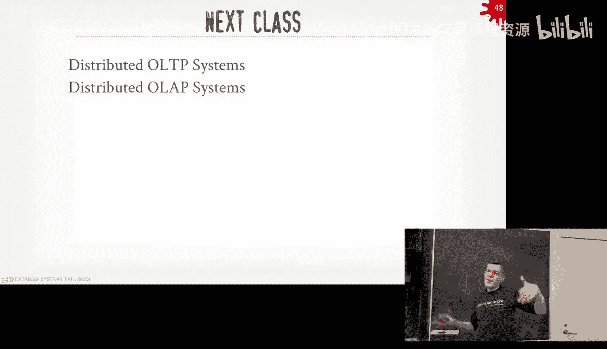

# CMU《数据库导论｜15-445 645 Intro to Database Systems (Fall 2025)》中英字幕 p23 #23 - Distributed Databases Pt. 1 (CMU Intro to Database Systems).zh_en -BV1bmHGzsETM_p23-

🎼still。🎼送一 check。🎼管这我。🎼P your whats out。🎼想脾气的面。🎼我厌。Did you guys you here？

It's got a long lost brother or something you deal with who wants his money or whatever his's from all right。

 a lot does cover today at next class because they're trying to wrap up the end of the semester but before we jump into the course material again for you guys in the course。

Project4 we do on September 7， that link that we take you the recitation from last week with the slides and all that homework  six we go out later today and that'll be due on the same date on December 7 and the final exam is December 11th I'll post the on Piazza this week I'll post the final exam study guide along with the practice practice exam again please don't make travel plans before this date because we won't be able to reschedule you and then if you're as I said last class well be teaching 445625 again next semester if you're really if you love the class and can't get enough of it please sign it to be a TA if you hate bus top and thinks the worst code you've ever seen in your life then also present up for T because we went in your opinion on how to fix things。

Okay。Any questions about any of these Yes， the question is how many pages were the cheat sheet for the filing exam。

 it'd be the same as the midterm？The final exam will be covered basically from the midterm until next class next。

😡，It's question it's a cumulative， not in the sense of like。

 am I going to ask you like specific questions like buffpo stuff that we covered during the midterm。

 but like you got to know what SQL is， you got to know what relation algebra is because that's the background you need to understand all these other things。

But the emphasis will be on things that came after the midterm。Other questions。

And then it's a three hour， the slot is three hours。

 but it'll the same it be roughly the same length as it would have been on the midterm so that you can complete it in an hour and 20 minutes。

 but if you want to take the full three hours， go for it， okay？

All right databasease talks we have coming up today after class we have a guy in the UK building a system called XTDB。

 this is a time series database system， we haven't really caught time series too much but it's basically think of like keeping track of time is a firstclass concept on Tples inside your database system and I think what's cool that they can do is they can do multidimensional time so he'll cover that then a week from now we'll have the guys from snowflake building this thing called Apache Polariis。

😊，It's the catalog it's a open source reimation of the Apache iceberg catalog again the background was Snowflake tried to buy iceberg for $600 million Databricks called wind the Va and came in and blew out and paying for a billion for the iceberg team it was a company had 40 people had some revenue but not $1 billion worth a revenue and they got bought by Databricks and then so snowflake made their own open source versionrg and called it Polariis but again it's not to say that snowflake is not incompatible to iceberg just they weren't able to buy the iceberg people。

And then we've had an addendum to the schedule for the seminar series this semester。

 there's an Apache project called Flus， I actually don't know what this does。

 but they sent me a lot of emails begging to give a talk so we'll figure out what they're going to do I've never heard of it prior to them reaching out to me and that I've never run across anybody using it okay。

😡，Right and then'll be the flulu talk will be the last talk for the semester and then we'll kick off the seminar series in the spring。

 again even if you graduate in leading CMU， if you still want to be involved and watch these videos on Zoom。

 please join us a lot of my former students show up on these things。All right。

 so here's where we're at for this semester， or what we've accomplished it far？😡。

As I said at the analyze class， we now know how to build a single node database system you know how to make it transactional。

 how to make it fault tolerant， we know how to run queries on it。

 do some query planning for the SQqueries that show up and so now this class and next class is to now discuss at a high level what distributed database systems look like and again the databases themselves are are hard to understand and build correctly and distributed databases just make this all even harder that's why we do single node stuff first get the fundamentals down and then we can understand how to make things distributed。

😡，And it's basic the same architecture we've been talking about。

 it says now it's split across two or more nodes。😡。

And the questions we're going to talk about today and next class is how we're actually going to be communicating across these nodes。

 whether we're going from the top down or we're coming from the bottom up or actually something more in the middle。

 where we're coordinating across like the buffer ports， for example。😡，Right。

 so all the things that we talked about for the entire semester， like how to run queries fast。

 how to make sure that if you crash and come back， you don't lose any data。

 all that is still applicable here is just now we're talking about how to do this across multiple machines。

😡，Okay。Then also recall we had the discussion and when we talked about parallel query execution on a single node。

 we made the distinction between parallel database systems and distributed database systems I said in a parallel database system think of that like a single machine could have multiple cores or multiple CPU sockets and the communication between these different workers in our database would be very fast and as soon to be reliable。

😡，Right like we can send messages over an IPC from one process of one thread to the next and it's guaranteed to show up if it doesn't show up then our CPU is melting down。

 we have other problems。😡，So now for distributed data systems。

 now we can't ignore some of the things we could ignore in parallel database， for example。

 we can' assume that communicating between the nodes is going to be fast because I might have to go around the other side of the planet and now you're limited by the speed of light。

😡，And that can take，100， 300 milliseconds。Worst case scenario up in the tens of seconds or even minutes if things get lost and things were covered in weird ways。

And so not only is communication between the workers going to be much slower。😡。

Order is of magnitude slower， it's also potentially unreliable。

Meaning we could send a message from one node to the next， and that message may not show up。

Because the never got severed， the packet got dropped， whatever。

Right or in some cases this is sometimes common too is that I send my message to the other worker or to the other node and it's running you know go or Java what pick your favorite memory managed environment and then the garbage collector kicks in like in the JVM can like if you have a huge heap。

 the JVM can block sorry the garbage collectionor can block all execution for like oh 10， 30 seconds。

 worst case scenario， so now it looks like that node nott doesn't exist anymore。

 but it's just waiting to clean some stuff up before it can process your message。😡。

So now how do you actually want to handle that？So if you take a distributed systems course。

 they talk a lot about consensus protocols， PaXs RA， things like that。

 all of that is applicable here， we'll build up to that we first understand what the architecture of our data systems going to look like and then we'll apply these different techniques to layer on top of them and make these things more reliable on fault to。

😡，so this is what I've already said before right this because we're going multino doesn't mean we can throw away the entire textbook or everything we talked about this our semester。

 all the things we talked about so far are mattering in this world as well。

 it's just everything's more complicated now because we're dealing with。😡。

Multiple hardware or multiple machines potentially running in different data centers and in some cases with disparate hardware resources like my node over and that other data center there might have fewer cores than I do。

 So now I got to take consider that in my how I do my query optimization， my planning。

 how I'm going to maybe run my consio protocol， what transaction should run where all that we have to deal with。

😡，So there's some high design decisions we're going to cover the next two lectures of how to build a distributed data system。

 the first can to be like how does an application find the data？😡。

Right if now my database can be split across multiple nodes or managed multiple nodes。

 who does the application actually talk to right it was simple when it was one node I just connect to it through whatever the communication protocol。

 the network protocol that the data been exposed to me I know my data is going to be there。

 but now if my data is split across multiple machines。

 how do I go and find it and where do I send the actual queries to it。😡。

Then we' to talk about how we want to divide the resources of the database system across these different workers or nodes。

How do we split things up on a per table basis or we do something more fine grain？And again。

 and then how does the application know that I split things up a certain way， if at all。

 to go find the data that needs to run the query？And then when a query shows up on one of these workers in our distributed system。

 how are they going to execute that query？😡，Especially if the data that the query needs access isn't on the machine that my query is actually running。

😡，Do I send the query to where the data is located or do I pull the data to where I'm located。

 my querys executing and run things there。😡，And then， of course again。

 as I sort of said in the world of distributed systems。

 this matters a lot you the distributed system is basically a database system at the end of the day。

 so how to make sure that we guarantee consistency and correctness across ourtri database system。😡。

So that the application doesn't deal with any of the anomalies and issues that we've talked about before。

And in some systems， they're just going to sit through caution to the wind and say， well， you know。

 doing guaranteeing consistency and correctness is hard， so we're not going to really do it。

 we're not going to do it immediately。And then what are the implications of that in your application group？

我看。So for today's lecture it's going to be sort of the hodgepodge ideas of building up the basics of a you what a distributed data system is going to look like for us and then next class we'll go in more detail how we're going to do distributed character control and or how we're going to run distributed OAP queries so distributed analytical queries or how do we do joins across multiple nodes for example。

😡，Okay so first talk about what the high level system architectures could look like。

 then we'll talk about how to split up the data and our partitioning schemes。

 then we'll talk about replication， how to make sure that if we have multiple copies of data。

 we need for fault tolerance， how to make sure that those are giy and sync。

 and then when they will segue into how to do transactions across these things。😡，Right。Again。

 another key difference about distributed databases and parallel databases is that parallel databases you're adding more resources to get better performance in a distributed database system。

 we want to do that as well， we want to add more resources to get better performance。

 but sometimes we also want to add more resources so we get better fault tolerance or availability so if one node goes down the application can still keep running and query of the database。

😡，Again， if it's a parallel that's running in a single box， it's kind of hard to do。All right。

 so the first we'm going to discuss is what the system architecture is going to look like and this is going to specify or this is going to determine how the resources that are available to us。

😡，In， you know， and on a machine on a computing machine， how they're going to be。

Access and maintained by the database system and then how these resources are going to communicate with each other。

😡，and you sort of think of like the CPU is obviously the central process union。

 but it's like it's the computational unit on a single node in our system， but it has to have memory。

 it has to have disk， the question is where is the disk and where is the memory amongst other nodes in the system。

😡，So this terminology goes back to the 1980s， it's the definition of these categories of what these databases look like。

 so without you knowing it， everything we've talked about this semester so far is called a shared everything system。

😡，And the idea is that on a single node， it has the CPU and the CPU can talk to its own memory and can talk to its own disk。

 everything is encapsulated on a single box。😡，A shared nothing system is where there is individual nodes that each have their own CPU。

 their own local memory， and their own local disk， and the only way they can communicate with other nodes in our distributed system is through some high level network up above。

😡，So basically the CPU one node can't read into the memory or disk of another node directly。

 it has to send a message that the CPU then processes on the other node and say， hey。

 I want this block of data or I want you to do this for me and gets back the result。😡。

This network most often is going to be TCP IP。😡，There are some systems where they can do UDP。

 some systems can do more fancy things with like Melanox， RDMA， but in general。

 like assume that we were just opening up CCP sockets and sending messages back and forth。

Another architecture is called Share Disc。And this is where every node is going to have again its own CPU and own memory。

 but the database， the primary resting location of the database。

 is now going to be on some global disk that all the nodes can read and write to。😡。

So now if I want to send a message to another node， you still would do TC， bh blah。

 but I want to read data on another node， I don't have to go to go over TCIP to communicate with the other nodes。

 I go directly down to the disk。😡，And go and get it。And then this one is theoretical。

 it's in the academic literature， but I'm not aware of any uses and that actually does this outside of like the high performance computing world。

 like scientific stuff， it's called shared memory， basically every node only has a stateless CPU and then the memory and the disk is shared across all the different。

Different nodes。The question is， isn't a shared everything system fundamentally a shared memory system？

you trying to say。Yeah， so now just think about have multiple nodes。😡。

If I have multiple of these shared everything， then I'm essentially shared nothing because again。

 the CPU can't read and write to the disk or memory on the other node without going through the network at the top。

😡，His question has shared everything fundamentally single machine， yes。😡。

Are treatinging the shared this the same as having。です。

The question is are repeating shared distances as having multiple diss。

 meaning like I've been showing one， but it can have more， yeah， we'll get there， yes。😡。

But it looks logically as one disk that everyone can read and write to S3， yes。

 they are correct we're getting there， S3 would be shared disk。😡，So there shared nothing about you。

 So network essentially be just English。The question is for sharing nothing is the network wide。

 sorry？For Ingress。For like for data coming in。One minute， so like if I if a query。

 we haven't talk about what we're communicating with say a query shows up in one of these nodes this middle node here。

 and that query needs to read data on this other node。

 it's got to can't go reach into that other node and into its disk directly or its memory and go read stuff。

 It's got to send a message that the CPU then process and says up， they want this data。

 let me send it back over to you。😡，So。Shared everythings but as common because most people build a single node data system first。

 I for shared nothing， this was the way you would build a distributed Davis going back to the 1980s。

 like the guy that made of Postgress， Mike Stonebreakcker wrote a paper in 86。

Sort of touting advantage of shared nothing systems。

 and this is how people built basically shared nothing systems for 20， 30 years。😡，ItIt is。

 the popularity is on the decline now because of the cloud。

 things like S3 and other distributed architectures。

 like most of the newer assessments today are going to be Sha diskk， yes。😡，嫌合だね。

Question is is Spner shared nothing or shared disk， Spner shared nothing？

But it reads and writes from Borg。Like the shared file system。

So like the lines get blurred this last one here， so again， far as I know， nobody does this。

 so we're going to spend any time on it。Al right， so share nothing。 Sha nothing again。

 is every single node has its own local disk and own local memory。

 And then anytime you need to communicate with other node。

 you got to send a message over that network So again， you can't just go reach down into the。😊。

Into the other node and get the data you want right so this is going to get the best performance you can have in a distributed database system because every node can process the data that it just has and it's gonna to be the most efficient way to access things because I don't have to go reach other nodes go get the data that I need and go process everything I need locally。

😡，the challenge is going to be， and this is why in the cloud world the shared disk is more popular is that this can be harder to scale out if I want to add new nodes。

 I can't just say you have new nodes now point to the same shared disk。

 I actually get to physically move data。😡，And we'll see in example in a second。Next slide。

 I said that's why again this is going to get the best performance。

 but if I had to start adding and dropping nodes。😡。

Either because I want to scale up and add more machine or scale out add more machines or because the node goes down and I got to recover from it。

 and this is from problematic。😡，So again， there's a lot of systems in this space， you know。

 I can't say anyone is more popular than others， but like this is basically how people build。

 people say they have a distributed data system from the '80s or '90s or mid-200s。

 it's going to be shared nothing。😡，So here's what it looks like。

 so you have the application server and then it can communicate to some kind of catalog metadata thing like and again this could be just another node in a system could be a centralized node。

 we'll get to that architecture in a second， but the this is going say here's how to go find the data you're looking for。

😡，And then say say we want to run a query， get or get ID equals 200。

 so each node would have again a partition or it's a different subset of the total table or the total amount of data in our database for now assume we only't have one table and it has IDs from one to 300。

😡，So if I want to again I know I want to get access ID equals 200。

 I know this node is maintaining this data， so I send my query to that node and it can process it and return the result。

 no problem there。😡，Right， but then the challenge is going to be if I want to start doing things like I want to get ID equals 100 and ID equals 200 in the same query。

😡，And I sorry and I send the query to the first node here。

 the different nodes are aware of the topology of the database of the partition scheme that's defined in the catalog and we'll cover that in a second。

 so it knows that that the top node doesn't have ID equals to 200 so that has to send a message down here to say I need ID equals 200 and it could either tell the node down below。

 run this query or this portion of the query give me ID to 200 and give me back to the result or it could actually just send the actual date itself up。

😡，And then let the node in the top， process the data。Right。Now the chunk and。

 the challenge I was saying is that this is going to get great performance if all your queries are only accessing data that's on each individual node。

 but when I want to scale out， meaning I want to add a new machine then the problem is that I at to move data around so if I add a new node in the middle here。

 I got an else takey half the data that I had in the node to the bottom。

 half the data that had a node at the top and move copy that into the middle one here。😡。

And then you update the catalog service and say， here's the data's moved around so anybody comes looking for that data we'll find it。

 yes。😡，是份。So the question is would the application server know the data rangers ideally no。😡。

Some systems yes， but ideally know， again， if you think about SQL。The the。

The same query that I could write on a database that runs on a single box。

 that same query should still work in a distributed database system。

 like should be I have completely transparent to me how the day is moving around。😡。

So my example I beginning connected to the application server， some systemss will do that。

 you can go to the application server， say where's my data going to be and other systems you could just send it into any one of these nodes。

😡，And they know where the data is because it's in the catalog。

 And the catalog is just another database。 We haven't really talked about catalogs too much。

 but like。You have your data， like the user data， the application data。

 and then you have this metadata catalog that keeps track of like， here's the tables I have。

 Here's the sches that they have。 the columns I have the constraints。

 We now can also start putting things like， here's the partitioning scheme or。

 Here's my layout of my data， my topology of my network。😡。

And then you want the same sort of transactional guarantees you want for regular application data。

 you want that to be in your catalog data too。😡，H。A node on that is on a single node in the record but one which expand possible questions。

The question is how should I maintain indexes in this， right？

In some cases like where ID equals this range here。

 each node in this environment would have an index just for the data that they have and again。

 if all my queries are like get ID equals 200 equals 100， I can look at the SQL query。

 figure out what data it actually needs， send the data to that node and that node can then do its own lookup in its own slice of the index so each node has a portion of the total index。

😡，There's also the case where you may have secondary indexes。

where you may have things that don't align up with how youre spliting up the data and that you' got to put either on one node that everyone goes to and talks to。

 or you replicate it across all nodes。😡，我这就就这你说等等 everything。Youも stuffがてま。we didn的 trying for。

The question is， if I if I insert something and it has to。going other kind is space so。

Because this no is four。😊，We'll cover that in a second， this how we handle partitioning。

 we'll talk about in a second。诶。Depending on the partitioning scheme， and depending on your criteria。

 whether when you actually want to move data。嗯嗯。You know。

 you make that decision when you want to do that and then depending on partition scheme。

 like consists of hashing and Rndezvous hashing， like some some nodes make it。

 some schemes make it very easy to move data around。

 this is just like a toy example I'm doing range partitioning here。

But I would say what you're talking about is actually what Mongo DB did in the early days sort of what part of the Mongo Db got popular in like early 2010s was they had this capability to auto sharding so they had the ability to do exactly as you were saying oh my shaard' too full all the queries are going here。

 they could split off a chunk of it and rebalance things automatically but it was a total hack because they didn't guarantee that the catalog was in sync with the data that got moved so you may have two copies of the data and two nodes or two partitions and two different queries might see might update the same thing and getting incorrect result like or they took a lock entire database and then move things around that's another way to handle it yes。

The question is， so for this query here， I D equals 100 and I D equals 20。 It one say it's one query。

 right select star from where I D in 100200。 So your question is， why didn't the。

 why didn't the node at the top send the query down here or what， sorry。

IDOh the question is why didn't the good point， why didn't this note here send the ID equals 200 subresult back to the application server because like the thing of how the application server communicates with the data server sends。

Say this is one query right Select star not two gets right They send one select query to one node and then the call response protocol of JDBC orDBC is that I'm gonna get one result back with all the all the peoples that I want from my query the applications aren't written such that you can send one query and now get two things back just now how people write these code and in the same way that like and you can imagine you could change the IP to do that but like on the client drivers to support this。

 but。😡，It's the thing I was saying before， if I write the same query and runs on a single node。

 I should behave， I should get back there roughly approximately the same result I would if it's even across multiple nodes。

😡，For would be t couple。お持し？The database itself should be treated as。😡。

Yeah like that's the point of SQL SQL you don't know how the data is being split up。

 so I my SQL query gets sent to the server and the server then decides how to farm it out across the different nodes and then the application shouldn't know。

 shouldn't care。😡，Actually for a decision it treat as a master。The question is。

 should I think of these nodes as being all homogeneous or would there be a master or a primary node。

 not yet？😡，For this example，The key thing about these thing。

 I'm trying to show you that every node has a slice of the database。😡。

And the other node at the top can't just go down and go look at it。 It has to send messages。😡，嗯。

Let me keep going and all right。Right so again， if I add a new node。

 I got to move things around so share disk and the idea here is that every node in my system is gonna to have its own local CPU own local memory。

 they are gonna to have local disk2 like directly attached store like an SSD but that can be that's only really used for caching like my memory gets filled I want to spill of that the primary storage location of the database is going be down on this shared disk infrastructure down below and as they pointed out。

 oh， is this S3 Yes， this is gonna be like some distributed file system or distributed object store like Amazon S3 or Azure blob store or their GCS cloud computer storage Google right。

The basic idea is that it's this， this。Single logical device where all the nodes can read and write to。

And that's considered the primarying database， the resting location of the database。

RightSo when people talk about data lakes or serverless systems。

 it looks a lot like this and again most of the newer database systems distributed systems built in the last 10 years。

 especially for analytical workloads， like the snowflakes， the databricks。

 the fireballs the yellow bricks and all those guys， all of them are going to look a lot like this。

 right？😡，So now the architectural is basically the same as before。

 but now we have this shared storage thing in the back。😡，And query shows up in this case here。

 we're ignoring the fact how do we find where the node I want to communicate with is。

 assuming it's been told through the Caello service or some front end。😡。

And now this query once get ID equalL 101， it goes to the catalog say it says。

 who's responsible for this， where I go find this data。

 and now it can make a request for a page or a block or a file。

 whatever from the distributed file system。😡，And it goes。

 then makes a copy of that and brings it back into its memory， so same here at get 102。

 I know it's on page XY Z， so I go to my storage device and and go and get it， right。And then now。

 again when I add a new new node in my distributed system。

 unlike before and shared nothing where I had to copy data around。

 now I only to do a logical assignment。😡，In the catalog to say this new node is now responsible for data found within some range or some partition。

😡，So I don't want to move any data when to add this new node。

 it's just now all the other nodes need to be aware that this node in the middle now is responsible for Q101。

 whereas before the one of the top ones， yes。😡，还有 this one。General。The question is。

 do we need to have different nodes be responsible for different ranges can't just be any node can handle any possible data？

If we'll get in the a second， if you start doing updates that data。😡。

How do you know if do I if I update on this node here。

 who has a copy of that data and make sure that they see it？😡，Because again。

 when it was on a single box， I update something， it's like the global data that everyone sees。

 but if this bottom guy here updates key 102， but then the nose at the top have a copy of key 102 as well。

 how do I make sure that they get notified that they have the latest version？😡，What's that？

Locking on what。I by。Yes， yes， yes， where is the lock？哦。哦。whereEverywhere。

 so means like if I want to lock one thing， I going to broadcast to everyone， I hold the lock for it。

I that not a good idea？他这边没收去。Okay， can it be a primary node or master node， yes。

 we'll get there in a second， yes。😡，Like this is the exact thing I was just saying so say I now update page 101。

 right I then right to the page here， but now I got to notify potentially everyone else to say。

 if you have a copy of page ABC， I've updated 101 in this way。😡。

And so that any time that they go read this data， they would know that they have to go fetch the latest this version either from the node that's responsible for it or from the shared disc。

😡，Again we'll cover how we do it in a second The other great thing about shared disk architectures too and the is why there's some prominent now in the cloud is that this storage is basically infinite。

Meaning if I want to add additional capacity， that's tri to doing S3 because I just I give Amazon more money and I get more space like your credit card will run out of money before Amazon runs out of storage space for you。

And if I add more capacity， I don't have to move things around or take nodes off line the same way that I would have in a shared nothing system。

😡，If I want to add new disk to share nothing， I got to go physically add that into the box itself。😡。

What makes the performance were compared to the。The question is why is the performance in a shared disk architecture worse than a shared nothing architecture because I got to communicate with some other device to get the data that I need？

😡，And for OTP， the way you get around that， you just have every node cache it。😡。

But then you still have to care about like if I update things， I have to make it back out here。

人さにこがくんですか。Question is， is the slow down to the overhead of the network IO for updating disk yes？

Also again， if if I have a transaction， we're not there yet。

 if I have a transaction that touches multiple nodes and I go say commit。

 I got everyone agree that now it's okay to commit this so now I'm sending you a message I' wait for you to come back and acknowledge that you got my commit message like that becomes Paul that goes well。

 but that's gonna to happen to share nothing or share disc as well share disc specifically it's gonna have the overhead of communicating the disc someone's else。

All right。So we've sort of been talking about this concept as well with like how we're actually now going to execute queries either whether its share disk or share nothing and has to do with when when a query shows up and on a node and I recognize that the data I need on that node for the particular query isn't local to me。

😡，Either because it's not in my local cache or it's not in my local disk because I'm responsible for it。

 it's on some other node or the shared disk architecture， some remote storage advice。

 how am I going to actually how do I decide whether I want to pull the data to me and so I can run my query or I push my query or the portion of the query I want execute to where the data is actually residing？

😡，So the two approaches again push versus pool， so pushing the query to the data means that I can carve off either take the entire query or a portion of the query and send it to whatever the data is being located。

😡，And assuming I have compute capacity or some computing resource。😡。

Like something I can execute things on the where the data is being located。

 I can then run the portion of the query that I need on that remote storage。😡。

And then have it send back to me the result of that computation。😡。

Pulling the data of the query means that Im going to the datas at some of the location。

 I'm basically going to copy the bytes out directly to where my node is over the network so that then I can run as if I had the data locally to me already。

😡，Again， these are not mutually exclusive。The lines get blurry because。in some of these systems。

 the storage layer can actually do some computation。😡，So just taking S3 for example， S3。

 although it's not deprecated， but if you sign up a new account today， you can't get this。

 but if you have an existing account with AWS as of last year， you can get this。

 but they have they have a feature called S3 select。😡，Where you can send a request to S3 and say。

 go get this data from me， but then you also tag along a SQL query。😡。

That then does some processing on the node where the data is actually being stored and then they send back to you the subset of results。

 so you can use it for filtering， you obviously can't do joins or more complex computation。

 but you can push down predicates to S3 so that now you pay less egress costs of the network transfer costs going from S3 to your storage device。

😡，Yes。The question is why do they deprecate it， I don't know。靠。Do I think it's a question is。

 do I think it's a bad idea， do I think it's a bad business idea or do I think it's a bad database idea？

😡，I think it's a bad database idea because this is super useful。

 but I don't know if any systems actually use it。But it makes sense right。

 if I have know a bunch of I have one petabyte data on S3。😡。

And I don't want have to transfer all that to me if I can do some pushdown some predicates now again。

 you can't have to say this。your databases performance is out of control question。

The issue is now that a core component of your database it's now outside your control。😡，Yes。

But like had this is and I know I made a big deal saying like don't trust the OS。

 OS is going to ruin our lives and now I'm saying go trust Amazon to do something right so。

It depends on what you're trying to do for some things， yes or some things no。

 this might be a good idea。😡，Right for simple things， maybe it's okay， but like。

And assuming you can parallelze that enough like assuming you can have enough concurrent requests to different S3 buckets and they can all do the processing parallel right so now I can take my single box it has maybe like 20 cores。

 but if I have 100 outstanding requests S3， I don't think they let you do that but I could have all of them run as if it was 100 cores you filtering at the same time。

Now you paid for that。And it might be cheaper to do the processing yourself。

 but then you got to account for the cost of moving the petabyte data out of S3 to you。😡。

But they didn't cash that。In the local SD， but now you got to pay for that to caching and you know I mean like let's trade us to all these things。

It's the one time assuming that you doesn't get evicted because you brought something else in。

All the buffer stuff we cover up before still matters。Yes， when without thought that。

 is there a way to like do it yourself by like having some logic only you know chunks。要这。

The question is without the。Without doing S3 select。

 is there a way to get this achieve this in the data server side where you don't have to maybe pull the entire buckets in。

 yes， it's all the same stuff we talked before。😡，Just because it's running on S3 doesn't change like that we care about indexes。

 we care about filters， the ZMap stuff， like if I have enough metadata up in my database system about what's in my S3 buckets。

 I can make more precise decisions on what data I'm actually feeding it， absolutely yes。😡。

But like you know， someone has to write that logic and thatll be in the data and assumes that you even have that metada to begin of if you someone's putting down parquet files and buckets you've never seen before。

 you don't have any metadata until you go actually read it。

 But then you go read the footer and that'll give you the metadata that way。

 So then you read lesson and decide whether you need to read the rest of the file。😡，What's that。

 you got to read the foot and bring it bring it into the Davis server side。

 but that footer is going to be know a megabyte of fat。But again。

 all the same stuff we talk about before， like I want to do predicate pushdown， projection pushdown。

 I want to use zone maps and other filters to the aside side what's the bare minimum data I need to read just because it's S3 versus the local diixs in the same box that all the same principles apply。

😡，Now it's just harder。so。In the case at Microsoft， they have， you know。

 not as not sophisticated as S 3， but it's basically my idea， right。

All right so pushing quite of the data， the idea here is that。

If I say I know that I want to run this query here and the data I need for that query is down below。

 rather than moving all the data up to compute this join up into the node at the top。😡。

I'll send down a plan fragment and say， hey， I want to do this join in RNS。

 I know you have the data in range between 101 and 200。

 compute the local join and this node down here and then send me up now the result of the join。

 or at least the partial result of the join， and then I can combine together the result in the node at the top。

😡，Now again， I'm showing this in a shared nothing architecture。

 but the same concept applies in a shared disk architecture。

It's just more readily apparent that you can do it this way。

In a shared disk system the idea is that the nodes are responsible for for managing some logical portion of the data but the final physical resting place of that data is going to be out on the disk so in this case here assuming there's nothing in our local caches this query shows up and I want to do the same join I was doing before but the node at the top to say I know the node at the bottom is responsible for data within this range。

 so rather than me computing pulling from the shared disk computing the join at the top I'm going to send my plan fragment down to the bottom guy tell them to compute the partial result for the join it knows how to go out to the shared disk the shared storage and get all the data needs bring that copy back into local cache。

😡，Then the bottom guy here computes the portion of the join that it is responsible for。

 sends the result up to the node to the top， and the node to the top then can either union the results together and push the final result。

 or if there's additional things they want to do as part of the query。

 it knows how to then further process them as needed。😡，So again。

 another key thing exchange here and they shared just with the shared nothing architecture in。

In a shared disk architecture， I'm showing the same partitioning ranges that we had in shared nothing。

 but again this is a logical partitioning， so the final restsing the data is's going to always be your own shared disk we're saying that for this point in time。

 this node of the bottom is responsible for the data within this range。😡，So if an update comes along。

 we know that it has to go to this node here because that'll be again， the primary of the master。

 whatever we want to call it， that's where the change has applied first。

 and then this node is responsible for them making sure that things get propagated to the other nodes in the cluster or the system。

😡，Yes。Your part by data。In you like part by。Like which servers are using boom， next slide， Okay。

 how are we send to partition things， right？So again。

 we want to split the database across multiple resources， you know disk or nodes or processes， right？

In my examples here， I'm showing we' partitioning on keys within the table。😡。

Like this sort of fine grain partitioning， we're trying to say。

 I'm going to pick one or more columns in my tables and that's going to be the partitioning key and I'll use whatever the partitioning mechanism I'm going to have to then decide what partition is going to get assigned to。

😡，It doesn't have to be that fine grained to be more coarse grained。

 like in yellow brick and snowflake， they partition on files。

A bunch of parquet files sending in S3 and they're going to say。

 which node is going to be responsible for that？Right。

And the idea is that if I partition my database across these different disjoint subsets or they're not always disjoint。

 they usually are then。😡，I just write my query against that datum。😡。

There's something that's coordinating， figuring out where the data is all being located and knows how to send the plan fragments to those nodes that are responsible for those partitions。

😡，To compute some portion of the query， and then I know how to combine the results back together to produce the final result。

😡，In the case of share nothing， it's going to be physically partition， like the data itself。

 the final resting place or the primary storage location of the data is going to be within the partition running on a single node。

 or in the case of shared disk， its logical partitioning that we're saying that there's some node in our system is responsible for that partition of the data。

 but the final resting place has to be back on shared disk。😡。

You sort of think of like in a shared disk architecture， the nose themselves are stateless。

 meaning if one of those guys gets killed and crashes come back and crashes。

 I don't lose any data because the shared disc is the final resting place for it and I know that's always going to be there long as my credit card still works with Amazon。

Yes， so the entire semester we talked about database files with a very specific layout like bill for the DDMSS and now that we're talking about shared this you keep mentioning part so like what change like why use the question is。

During the entire semester I keep saying， oh we're going to have a you know here's the file layout and within that there's pages and the pages have these lot of page architecture right or the LSM stuff and now I keep mentioning parquet。

 why do I mention that in the context distributed databases。😡。

So parquet files are just a open source columnar file format that are very common in distributed。

Share disk OAPP systems。And what parquet allows you to do is you can have one application create a bunch of data and just write it as3 without going through the database server and then the data server then can run the queries on it So it's just's just a file format and it's very common to we use this in a shared disk cloud system like lakehouse system。

Doesn't have to be。 and everything I'm saying so far is I'm not defining what's actually in these the data I'm sting in the shared De or even on the shared nothing system。

😡，I'm mis mentioning Partque is an example what people would do in the cloud systems。

 but it's still going to be， you know at the high level it's going to be all the stuff we talk about in the entire semester like it's to be a packs layout or a slotted pages or LSM。

 right？😡，But is't it true that like data will always come from like why could take so question why saving is。

It's not true that like the files are always going to come from an outside application。 Yes。

 most of the data will come through into the data server as inserts， especially in OtP。

 we're just going to write that write that in that doesn't change I'm just surprised that there are some random old standard open source。

😡，Parquet， I wouldn't say parquet is random， used everywhere an old， I mean， it's。

 I mean true our events will always be better。The question。5 format in this class。Yeah，Qu is it。Yeah。

 so his statement is。Is it not true that a customized file format will be better than a general purpose open source file format？

😡，嗯。It depends on mean it's a cop out depends on the workload， depends on the data。

 depends on where the environment actually running your data system， right。😡，With that。Yeah。

We'll this， but there's a philosophical discussion to be had about。

Where to spend your energy when you're building a new database system？

So snowflake famously decided we're not going to go shared nothing， we're going be shared this。

 I'll get to your answer by the five ones in a second。

 but Snowflake said we're not going to we don't want to be shared nothing because。😡。

If I'm shared nothing， then I got to build basically a distributed- I' got to make sure that like my storage is fault tolerant and sync and keep these things synchronized and things like that。

😡，And they decided they're not going to do that。 They said， we're going to build everything off S3。

And just put cashing in front of that on these stateless nodes so that we can run high the latency costs of doing this。

And then the thought was， let's spend all our energy， snowflakes。

 energy on engineering time on making this thing as fast as possible。

 and then we'll put cash in front at the highest latency and then as Amazon makes this better。

 we'll get that benefit for free。😡，So that was that was one of the smart things that they did in the early days now again that kind of goes against what I said before we' like we want to control everything。

But for distributed OAPAP， it's okay to do that。Because again。

 if I'm a startup it's one last thing I have to build。

 Amazon's bunch engineers making this work really great。

For all TP made me less so because I really came out like performance latency stuff。

So now your question about the file format that thing， right？😊，If I could tested it。

Daabase systems are usually trying to be this general purpose software that can accommodate as many application scenarios as possible and Harvard discrepancies different hardware characteristics and different operating environments。

 right。😡，It is true that if I have an application that that。😡。

That I could build a database server that could solve serve one application。

 I can build you know a optimize， customized version of everything we talked about the entire semester and make that one application run as fast as possible。

 absolutely yes to good do that。😡，If you're trying to make a general purpose though that's actually not feasible。

 so now you got to make decisions of what's the sort of what's the lowest common denaminator I would need to be able to support a larger application so that I can sell my database system。

And then not have， you know huge performance bottlenecks。So。

You said Parquets old parquecade came out in 2011， 202013 right so 12 years old now at the time and that was considered a state of the art。

Ful for at。Because everyone was storing things in JSON or CSVs。Right so you're beating those。

 but then now are there better compression protocols and more advanced ways of accessing columnar data。

 yes， and Parquet has not really kept up with that and that's why there's like vortex and all these other file formats that are coming along。

😡，But again， I'm only bringing that up to say in the cloud and distributed data systems for analytical workloads。

 oftentimes what's going to be in the storage layer is going to be bunch of parquet files。

And can you build better ones， yes， and the spiral guys and others are trying to do that？嗯。Okay。

All right， some partitioning。All right， so。There's one basic way to do partitioning is to do。

Table partitioning meaning like I'll put one have one node be yourself for one table and another node be responsible for another table and I literally split up that course grain and you you can need more course green like I have one node be yourself something for a database this database and node responsible for that database of course if and now I need to access data across multiple tables and across multiple databases if I'm doing this IU scheme it becomes problematic but in some scenarios this works out just fine。

😡，So again， same idea this has two tables， one and two。

 I'm literally going to take all the data from the first table， put in one node here。

 all the data in the second table， put in another node here。

 as long as my query is only access data in one table。😡，Then I'm happy， I'm great。Of course。

 now if my table doesn't fit on a single partition。

 then this becomes problematic and I've got to do something else。😡，So。

I've come across this actually with people using Mongo where they had the regular database most the application data was partitioned in the way which I about next slide。

 but then they had one table was basically a log for the application。

 and they only inserted into it and they never read it。😡。

So they wanted to put that table or collection in Mongo parlance on a single partition or single node by itself。

 because they just inserted and make that run as fast as possible and didn't interferefer with any other updates on any other nodes。

😡，So this is not that common， but some systems do let you do this。And in some cases。

 we'll see this when we talk about OLAPques next class。

 instead of putting you'll put the entire table at a node。

 but you you'll make a replica of it on every node because it's like something really small like a zip code table is' only like 35。

000 records that not that big and I make a copy of that on every single node because anytime a query wants to run。

 it always can be the local copy of that table。😡，The question is。

 doesn't that introduce also the cost of updates every time， yeah。

 but like for some cases that those tables aren't updated that often。

 the Postal service updates the zip code table four times a year？Like not that often。

what is most common and what people normally think about in distributing is' doing what's called horizontal partitioning。

 and in the No SqL guys， they'll call this sharding， it's basically the same thing。😡。

And then we're going to split the- we'll show an example doing sort of fine grain horizontal partitioning where within one table we're going to look at some partitioning column or columns。

 and we're going to use that to decide how we're going to split things up。😡。

And the goal here is we want to split the data up in， according to some other a bunch of objectives。

 like make sure every node has the same amount of data。

 make sure that every node is's going to run the same amount of queries。😡。

You may have one to have a small amount of data， but it gets all the queries into so therefore you don't want to put more data on it because that'll slow down that' sort overwhelm it。

😡，So the two most common schemes to do horizontal partitioning is to do hash partitioning and range partitioning。

 range partitioning we've already seen， I just took like discrete subsets of of values that are continuous ranges within my keyspace of a column and I'm just assigning those to different nodes and how you come up with the optimal ranges depends on you're trying to what your objective function does。

😡，Pradicate partitioning horizontal partitioning is not that common。

 but the basic idea is that you just define where clauses to say where name equals Andy and age equals1。

2，3 that goes to this node and then where name equals Andy and age equals 456 that goes to another node basically defining the where clauses is how to split data up and then around Robin Partitioning is just assigning some tuples or files or data to one node in around Robin fashion。

Like like I said， hashing and rainfor is more common。

So say is our table again we have four columns here and we're going to pick one of them as the partitioning key right it could be multiple ones could usually it's the primary key。

 but doesn't always have to be， right？And then now if we're doing hash partitioning。

 what're going to do is for every single tuple， we're going to take whatever the value is for that partitioning column。

 partitioning key， and we're going to hash it maweed by the number of partitions we have in our system in this case four。

 and then that's going to determine how we're going to assign the data from these different tuples to these different partitions。

😡，And if most of my queries or my queries just have the partition key in the where clauseuse。

 then this is going be fantastic for me because I can just look at the catalog and say。

 I I know what the key I know the value being used for the partition key to look at my wear clauses。

 I hash it in the same way I did for when I move the data in the beginning and that's going to tell me which node has the data that I'm looking for。

😡，So for Sha disk， right， basic idea looks like this right I want to get ID equals one。

 assuming I've done some amount of partitioning and it knows that it can get data from the different nodes that it needs in this case here if I had to get multiple keys and one of those keys aren't in my node that I need that I know I need to go communicate with the guy at the top either to send the query that that I wanted to run for me or pull the data down that I need to then run things locally。

And again， this is logical partitioning because again the final resting place of the data is out here on the shared De。

Sharre nothing again， the fund wreing place of the data is actually on the nose themselves。

 so depending on the queries I'm executing， I know how to wrap the things that go get the data that I need。

😊，We've already covered this。All in the case of hash partitioning。

What's one key problem with this approach？Any other。All right。

 so question is any other query that doesn't have the partition key has to get broadcast to everyone。

 yes， or even if I have the partitioning key， but I do a range query。😡。

And that's going to break me as well because like now I you know if it's between partition key between one and 1 thousand00。

 I may not have， you know， a continuous range。But then again。

 so I don't know what the data is actually going to be located， I'm just hashing things。

So this doesn't work again if it's a very fine grain and you're doing things that aren't exactly the quality predicate I need for my lookup。

😡，What's another problem with this？Be， another partition shows up。

 another node shows up or another one partition dies。And then now before。

 when I was taking the hash and moding my four， now I' got to go through and mod by five。😡。

And now the location of the data may change because what Part it gets mapped to has changed。😡，Right。

So in range partitioning， it's going to have the same problem because if I add a new node。

 then I have to start shuffling ranges around。😡，And it may not be isolated to just moving data from a single partition。

Yes。生を。Can you use the overdiaging next slide？All right， so。

There's two ways to get around this problem。And the first would it would be consistent hashing。

 which was the hot thing 10 years ago so， and then the next one would be Rezee hashing and hashing is a subset of Rezee hashing。

 but a consistent hashing is。It's。It's neat and was pretty cool when it came out like when Amazon created Dyynna my DB in the 200s。

 they put a paper out and said we're using K hashing because it was an MIT paper from '99 to 200 that talked about this in a project calledCd and so a lot of these distributed databases the no SQL guys the shared nothing systems that came out around 2010 or so they're already using this technique。

 actually should show hey， two here has heard a consistenthing before。Less than half， okay。

So the basic idea is that the key range is going to be a circle from zero to1。😡。

And the idea is that when I hash something， it's going to tell me where I'm going to land in the circle。

And then I just move forward along the circle until I find the next node going in clockwise fashion and or the next partition and that's going to determine where the data I'm looking for can be found or where the data I want I insert should should be located。

😡，So say we had three partition， P1， p2 p3 and then now I want to hash P1 and I hash it and then just make it between the value range of 0 and 1。

 so I'm going to land somewhere in the circle and then now I know I just need to scan forward in clockwise fashion and whatever partition I find along the ring of the circle at that point is where my data should be located。

😡，Sa thing if I hash key2 over here， I land at some point in the circle。

 and then I have to again scan up and try to find my next partition。

So you sort of think the gap here between the two partitions along the circle。

 this corresponds to the data that they're responsible for。

 so P1 is for un so4 everything going backwards up to P3， P3 is everything responsible。

 going backwards in P2 and so forth。😡，Right。All right。

 so how does this solve this partitioning thing that we talked about or when I add a new partition。

 well say add a new partition P4 down here。And I know that the only thing I need to move is the data that P3 was managing when I cut it's part of the circle in half。

 and so all the data now from P4 to P2 that needs to get moved out of P3 and go now to P4 and everybody else on the circle doesn't get affected by this。

😡，嗯。Likewise， I add P5 up here， same thing， I split it and move the data around and I keep doing it like this。

😡，So then the data structure you're going to use， I think they use a red black tree or something you need a data structure that everyone keeps coordinated to keep track of like here's what the current ring looks like and here's the partitions that are available to you when you do these lookups。

😡，Yes。Inquire each patient to have。The question is。In this example here。

 this is not required that the partitions are equally distributed the data。 Yeah。

 so the way you get around that one is that you have virtual partitions。

 you know that like multiple partitions are wrong a wrangle be assigned to a single node and if you have enough of those then assuming you're not terribly skewed right know assuming that your partition key isn't as the value one Everyone has the same value then you know things will be distributed enough enough for you。

All right， so another thing that they can do and we'll talk about replication in a second is that。

I can now use the ring to help keep track of where data should be replicated to。😡。

So say I want to insert data into my database， when I first hash it， it's going to land it。

 tell me it goes into P1， but then I fall along the ring and say I want to replicate this three times as I have three copies of the data I how you handle that in a second so I know that the primary location of the data should be P1 but I'm also going to make a copy into P6 and P2 because they're now the next keys I see in or the next partition I see along the ring。

😡，And then now when I want to do a lookup。I looking for key1。

 it hashes lands at this point in the ring， and I know I can either look at any of these three copies of the data of these different partitions to find the thing that I'm looking for。

😡，AndWe'll talk about how in these things is going to be in the nosical world when I do a write into P1。

It's not going to immediately get propagated P6 or P2 and then now I get into like inconsistent issues which goes back to assets stuff we were talking about a few more lectures。

 we'll cover that in a second。😡，So as I said， Amazon used this approach in DynaiteDB。

 but then that was in the paper they put out in the later fall up paper they put out four or five years ago。

 they announced they weren't using this。😡，Because this in hashing is using a lot of systems。

 Snowfl is going to use this to assign files to workers or data partitions to workers。

 Cbase uses this internally Cassandra uses this again for distributing things startss the key。😡。

React was a startup out of Boston。That was a distributed key value store and they went under 10 years ago。

 but you can see in the logo right here， you can kind of see what you can see the ring and then they had the fan out of the partitions being replicated along that ring so their logo was indicating they were using consistent hashing。

😡，So I think consistent Hahing was inventedended at MIT in '97，'98。

 but a year before that there was another paper came out on a technique called reezvous Hahing。

 and I think the theory shows that the consistent Hahing is a specialized subset of rendezvous hashing。

The basic idea here is that。For every single key we want to hash or we want to assign to a part in our database。

😡，We're going to generate multiple hashes for it。Where for each hash。

 we're going to append like the partition ID or the node identifier of the different nodes we have in our cluster。

 and then we're going to choose one choose the assigned the key to a partition for the one that has the highest hash value。

😡，So say again， here's our data， we want to hash， we want to use this column here as the partition key。

So what we're going to do is we take the key here， and we're going to hash it。

 but we're going to concatenate the key value in this case， a。

 along with some representation of the node or the partition identifier。

 like thing of just like you're literally smashing the bitetes together and then you're hashing it。😡。

And then you're going to get a bunch of hash values come out of that。

And then now what you're going to do for all the other keys。

 you're just going to choose whatever the hash value that is the highest one。

 and that tells you what node， what partition the key should be assigned to。😡。

And so now if I add a new key， I just do the same thing right。

 and I end up with a rank order like this， and that determines where it goes。

And then the problem we'm trying to solve is if add if I add or remove partitions or nodes in my system。

 I don't want to have to move everything around So the way that basically works if I add another node。

 then I just do all the hashing again and it may be the case that some of the data will get moved but some of the data will still be the same because it can be based on the ranking of the hash values when I run this so in the case here of D going back here before I added node 4 it was on the sign node2 but now when I hash D with node 4。

😡，It turns out node4 is the highest rank cash value。

 so then I only have to move keyD to that new partition。

So this is going to be faster lookups because it's log n to go find the data you want。

 whereas and Kitenhahing I think is log n。😡，I'm sorry， it's ON， whereas this is login。Okay。

So the next thing we need to talk about is how we're going to make multiple copies of data。😡。

And either at the entire tables， the individual records or files， it doesn't matter what it is。

How are we're going to make copies of that data and put it across multiple nodes so that， again。

 if one of those nodes crashes， we don't have to stop the wall。

 we don't take the whole system down waiting for that node to recover， we can keep up and running。😡。

So most datas in the world that are be distributed databases。

 meaning running one or more machine or two more machines。😡，Are going to be doing basic replication。

😡，So it'll still be a shared everything box running on a single node。

 but then they'll do replication to propagate the changes on that one node to another node or multiple node so that if the main node primary node goes down。

 I can just recover or promote the replicas to become the new primary。😡。

So everything we're talking here is still going to be applicable to whether you do partition databases or non partition databases。

 whether it's share nothing or shared disk， you still want to do all these things。😡。

So the first question is， what's the configuration of this replication scheme is going to look like。

 how we're going to then propagate changes from one node to another node。

 when should those changes get been applied， and how are transactions or queries updating that data and then for to determine how to propagate those changes。

😡，So let they go through each of these， right？So the first question is again。For any piece of data。

Who is responsible for it and where could multiple copies of that piece of data exist？😡。

And so primary replica is the most common one， where for any single object in our database。😡。

There'll be some some node a partition is now considered the primary location of it again。

 whether it's on share disk or share nothing， it doesn't matter。

 it knows that any right or any modification I want to make to that object has to go to that primary node。

😡，And then that primary is responsible for propagating those changes to that object。

 to any replica that's falling along behind it。😡，And then if and when the primary goes down。

 then we run what's called leader election where we determine what's going to be the new primary for any object。

And this this basically this looks like a transaction as we had before thinking of we have a table that says for any object。

 here's the primary node responsible for it， so I just run a transaction on that decide how to update that atomically。

 decide to promote a new new primary。😡，And then this is where Paxos and Raft come in to do that kind of thing or two Bs commit。

Another choice it's less common is to do multi primarymary where this is an object can exist at any location in our distributed system。

 and therefore it can be updated by and and these one of these nodes。

 And then I got to resolve any conflicts I have if two nodes update the same object。

 how do I decide which which you know which。😡，Which of these。

 which should be the latest version that successfully commit？嗯。

So like said primary replica is the most common one。

 people are running Postgres in enterprise settings。

 most Postgres instances are running on a single box and they'll be doing something like this。😡。

So all the reason and rights can go to the primary。

 and then when transactions commit or as changes are being applied。

 the upates get propagated to the replicas。Right and in some systems you can actually then run read only queries on the replicas if you know your queries aren't going to update any data you can hand them off to the read replicas and that way you don't interfere with anything on the primary because want the right to go as fast as possible so you want to off them from the primary if you can。

😡，But again， depending on how you're propagating updates， we'll talk about in a second。

 the read on the replicas might be reading stale data and again for some applications that might be okay。

😡，嗯。What's less common is to do multi primary， and this is where read rights can go to any node on any object。

😡，And then now the nodes are responsible for communicating and coordinating with each other or through a centralized coordinator to determine be what should right should succeed and what rights should not succeed。

And if one thing gets written at the bottom， you know that it wants to get propagated to the top。😡。

Or likewise the other way。Yes。😊，今天好。张包伟。Yes。😊，Why would you want to change。The question is。

 I said in primary replica， you want to do a leader election。

 why would you ever want to change what the primaries， this node catches on fire， goes down， crashes。

 which one is down the new primary？And then now you got say this node goes down。

 the two replicas say they're both going to be the primary。Well， you only want one of them to win。

 so you need later election for that。Yes。我只能先报过。To succeeduc。The question is in a multipriary。

 with an example you would want one right to succeed on one node and not the other。

 say you're trying to guarantee the ordering of transactions serializable。

 and you and I write did the same thing at the same time。😡。

Only one of them should succeed or say rewrite the two things at the same time， you write two things。

 I write two things， so I should see all all my rights are all your rights and not a mix of the two so one of those transactions has to fail。

😡，And that's going to be the two days locking or OCC， all the stuff we talked about before。Yes。月十因为。

The question is， should you use something like multi Paxos， yes， next class。Right。这게没回。With that。

The question is if I'm doing GPL， where I start the locks？Fum more slides，s。

Let me switch caseA to you， let's talk about the propagation theme and then I'll get to your question。

哎。Kase safety says basically how many replicas do I have to have in order to say up so if I have three copies of the data and my case safety factor is one。

 meaning like I need to have at least one copy of the data live so if two nodes go down rather than me still taking updates update the database I say I'm not in a safe mode right now I'm going stop the system。

 don't take any new updates because I don't want to make changes to my node and then have that node go down and end up losing them。

😡，So you can specify how many machines need to be up or how many copies of data you need to have for the systems to stay online。

😡，All right so if we update data on a node， whether it's multipriary or primary replica。

 and again in a multipriary world you still can have replicas。

 every primary can have its own bunch of replicas that keeps in sync as well。

 they're not mutually exclusive。😡，But now the question is， if I。If I update something on the primary。

😡，Should I wait until the replicas acknowledge that they got those rights before I tell the outside world that your transaction has succeeded or your update has succeeded？

So if you're going to wait， this is calledchronous synchronous propagation strong consistency。

The idea is that I transacting to a bunch of updates on this node here that's the primary and it has replica behind it。

 I'm going to propagate those changes to the replica。

 I'm going to tell it the flush and I have to wait until the replica comes back and says yes。

 I got your changes and they're durable on disk I flush them on disk。😡，And so the prime has to wait。

 and then once it finishes， it sends acknowledge and says， the thing you ask me to write to disk。

 I wrote the disk successfully， and then then and only then do you tell the outside world your transaction is committed。

And if you have multiple replicas in different locations， they all。

 if you want things to be very strong consistency， they all have to agree that this transaction is committing。

We'lls tell how we're to do that in next class before you tell the outside world you commit it。

And that way， if the primary goes down。Or you know the changes have been applied to the replica。Yes。

Question is two base commit is one way to do this， guess？

The key idea is though I'm waiting for everyone to come back and say， yep， I got what you wanted。😡。

And before you tell that outside say， would you commit it？Asynchronous would be I。

The Asad world tells me I want to commit。I can send a message to the replica and say， hey。

 I got this change， go ahead and commit the change for me。

 but I'm not going to wait for it to come back I'm going immediately tell you say yep。

 I got your change。And then eventually this thing will flush。Of course。

 now there's a brief window where like if this thing crashes and maybe this thing crashes。

 but I've already told you you' transaction committed， then I come back and it's gone。

Because maybe I wrote to the log on this guy here and it say it's a shared nothing system。

 the log is on the local box， but that note gets nuked， the log is gone。😡。

And now your change you know， didn't actually get propagated to everyone else and you go try to read it and out there anymore。

So the Nosequl guys were all about this thing because they said， oh。

 we don't want wait for transactions to commit， we didn't have really notion of transactions。

Whereas if you really care about not losing data， you want to do the thing at the top。

You can play games about things like I'm showing only one primary one replica。

 you could say well I have one primary and three replicas and long as two of my replicas come back and say they got my change。

 then I'm not going to wait for the third one。you could do that and try to try to you know。

Reduce the time amount of time you have to wait。So， O。Um。I。

Proropagation timing just basically says when do you actually send the coming back here。

 when you actually send the changes from the prim to the replica so you could do this continuously so every single time you do an update in the middle of a transaction you propagate that change to the other node and then。

😡，And then that way， when you go to commit， it's basically applied all the changes and just sending the commit message。

Or if you do it upon commit， you basically stage all the updates on the primary and then only when you get commit message from the application。

 then you send all the updates you want to have to apply to the replicas along with commit message。

 you have to wait longer for them to apply the changes and come back to you。

 but the idea here is that you don't have the SM board and rule ending back。😡。

Both systems do the top one and not the bottom one。All right。

 so I'll come back next class and I'll talk about active versus active passive。

 but I want to talk about a bunch of these things that have been coming up of like。

 okay well what's the architecture of the distributed system。

 who's talking to what is there something in the is there a centralized piece that can coordinate all everything that we want to do？

😡，And then this will segue into distributed current control in next class。

So if all our transactions need to update only data on a single box that's easy to do right every box can just run its own local currency control doesnt need to coordinate with anybody else ignoring replica stuff。

 it just applies all its changes and commits and done it's when I had to start touching data across multiple nodes。

😡，Especially if I have replicas and I want to make sure those guys are all agreeing that we're committing transactions together。

 then I need a mechanism to coordinate all of that。And there's two approaches。

 one is to use a centralized coordinator thinking of this as like a global traffic cop that has a complete understanding of all the transactions that are running in my system at any given time。

 and it's where I can store my locks if I want to in that centralized location or it going to be completely decentralized and have the nodes themselves decide how they're going to choose when to commit now you still can do a leader election in a decentized architecture because one node has to say this is what we want to do but there isn't going to be a complete global view of all the transactions running in the system。

😡，So。In essentialized architecture， you had this sort of coordinator sitting on the side。😡。

And say my query my transaction wants to show up and what such data these three partitions。

 so I'm first going to extend my lock requests for the data I want to access and this can be have done because I'm sending the query and this thing knows how to parse that query and break it up or you can say explicitly I want to lock data at these partitions within these ranges or these values or something right there's some lock request to a coordinator up above。

😡，And then now this is maintaining this lock of information。

 sends back to acknowledgement to the application that you got this。

 you acquired these locks that you wanted， and then now the application can send whatever queries it wants to the partition to do whatever it needed。

😡，And then now when wants to go to commit， it has to go to the coordinator and saying， hey。

 I want to commit my transaction， here's what I did。

 the coordinator is then responsible for communicating with the other parts and say hey。

 this transaction made some changes on you， is it safe to commit this？😡，Again。

 they're all running their own local concurrent to protocol to decide what's allowed to commit or not。

And then if they send back the acknowledgement that this transaction is allowed to commit。

 then only then the coordinator can send back the response to the application that said you're allowed to commit。

This is how people built distributed datas back in the 80s or 90s。

There was a bunch of products they're called。The old days they are called they still are QTP monitors。

 but it stood for the old days is still for telecom processing monitoror。

 and then over time the acronyms has got changed to be transaction processing monitor。

 but it's basically a centralized coordinator that knows how to run distributed transactions across multiple nodes。

😡，And then there was a in the 90s， there was an effort to standardize the protocol in which you can have a T monitor to communicate with the different different codinator different partitions。

 these things called。XA open XA or something， yeah open XA。

 it was like a transaction protocol that says basically do2PL coordination across different devices or different different systems。

 you could have your T monitor if a coordinated at the top communicate with an Oracle database and a time10 database or a nontop sealL database and knew how to do distributed transactions across them and everyone was still running their own local thing。

BEA was another famous one that got bought by Oracle that I know the founder BA they do his amazing Solars。

 he wrote one of the first database systems on Soariis in the 1980s at Sun TransARC was founded by actually he came out of the Andrew F System project here at CMU。

 the Andrew the Andrew Project and this was founded by Jeff Ebeer in the Sub engineeringering department and got bought by IBM I don't think it's still around and then OMID is a。

Is a TP monitor for running transactions on H basease and other systems。

This is not that common what is more common is using a middleware approach it's basically the same thing it' just now all the queries go to the centralized thing directly and this is responsible for routing all the queries and maintaining the lock table and sending all the requests to the different nodes as needed。

 so it looks like a single database server instance into the application server。

 but behind the scenes it's codating across this different nodes right？😡。

This is what Google did back in the day when they started out MySQL before Spanner。

 they basically did the same thing， this is also what Facebook does still today。

 right Facebook runs the largest MySQL cluster and it's basically using a middleware approach to look like a single logical database。

😡，All right， last slide， de codinator， basically the idea is that you go can start a transaction request to any node。

 somehow there's a later election decide that this node is going to be responsible for coordinating everything。

 the application can then send requests either to individual nodes or even or even the later and later route thing for you。

 but when it comes time to commit the leaders responsible for interacting with the other partitions that are involved in this transaction and saying is this transaction allowed to commit yes or no。

😡，And what's talk about next class， how we're actually going to run this。All right。

 so I'm going to skip federated databases next class。Basically it's the middle approach。

 but the idea is that instead of having all the nodes that you're talking to be the same database system。

 like it's MySQL， just different copies of it or different instances of running different nodes。

 I can have in a federated database I can have a single view into through this middleware that then knows how to take a single query and send the request to whatever database server you want to connect this to so it looks like in your Mongo database or My SQL database or Postgres database all looks like a single database system but only but this middleware is hiding all that from you。

😡，These are not that common， they don't work very well。

 but this is an idea that's been around for a while， and this goes back to the 1990s。😡，All right。

 so let me just quickly talk about this and this will take us to the next class。

Say now I want to run transaction that we talk data across two different nodes or different partitions。

 things are easy if they're only touching one thing at a time。

 but as soon as I have to start touching data that is that different nodes。

 then this becomes problematic because now we have to do twob locking or OCC whatever we talked about before and now I have to worry about deadlocks and all the things we talk about on a single node。

 I got to make this work in a distributed environment。😡，And if they're in the same rack， then yeah。

 communication be kind of fast， but I'm running across the wide Air network across wide geographical regions like US East。

 US West。😡，In AWS， then this is hard。So that's what we'll come off next class。

 we'll talk about how we actually how we do distributed OTB systems and distribute OLA systems and do joints cards different nodes。

 but everything we talk about today is the foundation of building a initial distributedriminator system。

Okay。😊，Any questions？In the back， yes。えちこ。S again。哦，对对对。

Is there any existing im about fed database so Trino or Presta will kind of give you this now with using connectors。

 Postgres foreign data wrappers are essentially kind of doing the same thing now too right the problem is what you want to do is idea a query shows up and then whatever the middleware system they would know oh you want to touch data at this database system and instead to then carve off whatever the part of the query that needs to run that system and try to push down preddiicates or projections try to send down a query request that specializedize to that whatever the target data system do oftentimes they can't do that and it's usually like a select star query to suck all the data up。

😡，That's the big challenge there。Because you end up building the lowest common denominator for a wide variety of systems you would support。

Okay， in the back， yes。I。在这个。Question，A parallel race the essentially the same as shared district races。

 yes。😡，And you could argue also too that like a parallel database where you're actually like a NAS or a storage or tech network like is that the same thing sort of yes。

 but like we'll say N class， you can actually have different architectures where we're like the right ahead log gets distributed to the shared disk and you still then coordinate across them。

 it's slightly different， but at a high level yes。😡。

Like if I have a single box that has like 20 CPU sockets in it。

Is that the same thing as a Shima des at a high level yes？

But some architecture decisions you make it be different。Okay， all guys， have a good holiday。

 see you on Monday next week。

对。🎼what你论。🎼我再从不见。

🎼说你不会愿帅走。🎼你。🎼我你对对所我再从不见。😊，🎼Yeah。🎼what你对最我走不见。😊，Get the fortune fuck the maintain whatever flow the。🎼。

