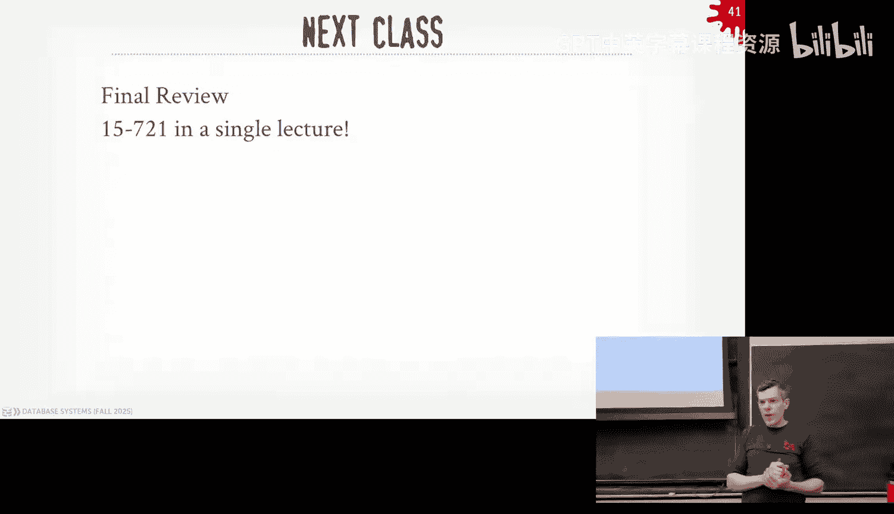

# CMU《数据库导论｜15-445 645 Intro to Database Systems (Fall 2025)》中英字幕 p24 #24 - Distributed Databases Pt. 2 (CMU Intro to Database Systems).zh_en -BV1bmHGzsETM_p24-

🎼still。🎼送一 check。🎼管这我。🎼P your whats out。🎼想脾气的面。🎼我厌。

Ca is not here here to go see his tax accountant so he's gone today。

 he should be back on Wednesday for the last class all right so a lot to cover again as a reminder。

 everything I'm talking about today is fair name on the on final exam obviously we're kind of cover at this at the last minute。

 we can't go to you know can't ask you too too many details but some of the questions are on the homework  six which is coming do this Wednesday Project4 is also coming do this Wednesday as well sorry Sunday both of you on Sunday and oh there's also the for the project four。

 the Saturday office hours are coming up this Saturday on the sixth I'll post that on on Piazza that'll be sixth fifth floor and Gs from three o'clock to five o'clock and as always post your questions on Piazza before him。

The final exam again is Thursday December 11th it's going to be over in the student center in the giant auditorium there is a final study guide i'm finishing up also with the practice final exam i'll post that tonight and then on next class on Wednesday will be the sort of a quick overview of the material we've covered so far that'll be applicable to and the fund the final exam and i'll go over some of the。

The questions people had about。You strict2PL and some of the other things that come up during the lectures。

 we'd have time to go revisit， I'll cover those again on Wednesday。And again。

 if you're interested in this kind of stoppinging around for next semester， I want to be a TA。

 please sign up here so any questions about the final exam homework six or project four。

Poster back from go as you can。The question is， what's the maximum bonus you get for Project four should be the same as the other ones。

 I think 20 yeah， 25？But double check， it should be the same。Other questions。All right， and then the。

For the last two weeks of the semester， we have two remaining speakers。

 so the snowflake guys are giving a talk tonight or today at 430 after class。

 that should be not 12 PM this should be 430。 Both of these are at 430， not 12 PM sorry。

So that'll be the Polariis is the open source reimpleation of the iceberg catalog API remember Snowflake tried to buy the iceberg people a company called Tular for 600 million Databricks came in and kick their knees out and bottom for $1 billion so then Snowflake decided to write their own and that's when Apache Polaris is so they'll be talking about today again at 430。

 not 12 pm and then next week we have the guys from Apache flus and again I don't really know a lot about the system that they've asked to give a talk and they'll be giving me a talk about what they're burning as well okay。

So last class we talked about distributed databases and sort of a quick introduction to the key ideas and key concepts behind them。

 right we spend most of our time talking about the difference between shared nothing and shared disk architectures。

 shared nothing is when every single node has sort of some partition or piece of the database and in its local disk and anytime you want to communicate between the nodes。

 you're sort of going through regular TCVIP。Typically connections you can do UDP and then shared dis is where the primary storage location of the database was a external storage system like an Amazon S3 or GCS or distributed file system and then all the the databases would retrieve pages or retrieve data from that shared storage and then bring them into it's their own local memory We talk about how to do partitioning on the data to split it up into disjoint subsets or usually distortjo subsets right and this is the technique called horizontal partitioning people say sharding it's essentially the same idea and you can usually pick a。

You would pick a set of keys that you would then hash or use generate the ranges on so you divide things up in such a way that when queries run that all the data they need is on a single node or single partition。

 but we'll see later today how we're going handle that when we want to do joins and the data is not partition in a way that we went for our join and how we're going to handle and that in our system talk about how to do replication so primary repa multiprimary the two basic setups and then transaction coordination we talked about。

Having a centralized coordinator either as an external third party thing on the side。

 like a T monitor or middleware asc sending in between the application and the database system that is coordinating the transactions or have a decentralized model where all the node themselves are trying to decide whether transactions are allowed to commit。

 we'll spend more in that topic today。So today's class again。

 I'm trying to condense down the two major concepts you need to be aware of in distributed systems。

 but we're going to distinguish the first half of the lecture will be on OLTP systems and the second half will be on OLAPP systems。

 and I think we talked about this earlier in the semester。

 the way to think about OTP is this is like what most websites are when you buy things and place orders or new comments on Reddit or hacker news this is where the application is making small number of updates at a time within transactions and you want this to run as fast as possible because this is something' exposed to humans or other machines。

And then analytical workloads is where we would do exploratory analysis of the data to extralate new knowledge from the data weve already collected from an OTB system。

 so in this environment we're running long running queries that can take seconds or even minutes or hours that will do a bunch of joins and try to aggregate a much information together right so in the OT world we want transactions to run less than 50 milliseconds in a O that system。

Les than a second is usually good enough， for most things。So as I said。

 we're going to first talk about OB stuff and then we'll talk about O that stuff and again。

 not to say that these things are。Complete mu exclusive to each other like if I'm building a distributed transactional database system。

 OTB database system， I may have to do joins in it。

 and therefore I'm going need to do my different distributed join algorithms。😡。

But it may not be the main thing I'm going to focus in my system and likewise in a analytical system。

 I still want to have transactions that I still need to use a consistency protocol timeomic commit protocol。

 make sure that this all works。😡，But it's not the thing I'm trying to optimize for。So again。

 whether or not you spend all your effort when you engineer a system to focus on one of these two category things depends on what the workload you're trying to target。

😡，And again there's a lot to cover here， I'm trying to convinced what would have been。

 you know if we had more faculty at CMU， we could teach a whole course on databases try to condense down the main things you need to understand so that when you got out in the real world to be exposed to these concepts and exposed to these topics。

 you may not be an expert in it， but you used to be aware of it and some of the design decisions that you have to make when you start evaluating systems or to try to build your own。

😡，All right。So remember that last class， we talked about how the whole goal of a distributed database system is that we want it to appear to the application as if it's a single logical database。

 so again ideally the same query I could run on a single node Postgres database instance。

 could run if I had a sharded or partition or distributed system， right？😡。

But then now weve got to worry about if now my data is broken up across or resides in a bunch of these different nodes。

 whether it's Sha disk or a shared nothing system。😡。

When we start making changes to data that maybe reside on different nodes and we want to go commit a transaction。

 how are we to make sure that all the same asset properties we had when we were doing transactions on a single node system？

😡，I'm still going to work for us in a distributed environment。Again。

 distributed doesn't mean like a completely radical way of thinking about how to build the system。

 it's just doing all the same stuff we were doing before。

 but now just in hard mode because we have to worry about a bunch of things we didn't worry about before when we were on a single node so say we want to do a commit across for a transaction that touches multiple nodes but one of those nodes goes down which should happen about transaction。

 what happens if the messages that we're sending for commit the transaction show up late。😡。

Or somehow get dropped along the way because a weird network hiup， what should happen， right？

And then what happens if we are doing a large distributedd transaction？😡，And like， you know。

100 machines。Should we wait for every single one to agree that we should commit or can we look at something less than that？

喂。So one important assumption we're going to make throughout this lecture today is that actually going on the real world you make this assumption as well。

 is that we're going to assume all the nodes that are participating in our distributed data system are controlled by us and therefore are well behaved well behaved in quotes obviously if like the harbor crashes that' you we can't prevent that but what we mean is that it's not like we're worried about someone running a malicious version of our database system。

😡，So that when we go to commit a transaction， they start messing around with us and causing weird states。

So we assume that we control everything。In Harvard。

 at least controlling the software and that if a node tells us， yeah， let's go ahead and commit。

 they're not going to like change their mind or try to try to scoot around with the decisions that are being made in our system。

 right？😡，What kind of protocol would you want to use if you don't trust the other nodes？😡。

Bzantine yes so if you don't trust the other nodes and you assume they could be malicious actors。

 you need what is called a Byzantine fault tolerant protocol BFT protocol right if you know what I'm sure everyone knows a blockchains。

 but this is basically help blockchains work blockchainlocks are just running transactions like we normally would in in our Uni database system except those guys don't trust the other nodes。

 so therefore they have to run a BFT protocol to get everyone to the majority to agree that this is what's going to happen。

😡，And they use like the Merkel tree stuff， which you're not going to talk about。

 they use a immutable ledger， a immutable righthead log to keep track of here's all the changes that get made and then you can't go back and reverse things。

They do all of this extra stuff because it's much aands and crypto boy bros。

 mining things and you can't trust them， right？You never want to do this in a real system running real transactions that isn't crypto。

😡，There really isn't a good practical use case for blockchains other than crypto。

 like if you're money laundering stuff， then you want to use that。

 but like Amazons not going to run off this， like a blockchain。

 any real system is not going to on a blockchain because it's going to be five to 10x slower than the stuff we're talking about today。

😡，Okay so again， if you remember only two things from this class。

 never use Map in your data system and then don't use blockchain databases right use the transactional stuff we'll talk about today because we're already be facing the struggling with the speed of light issues to do our atomic commit protocols。

 we'll see in a second， and now Ive got to run a bunch of BFT stuff for it， you know the waste。😡。

All right， so how are to make sure that everyone can agree that in our distributor Davis when we want to commit that we can all go ahead and agree that we're going to commit so this is what's been called atomic commit protocol。

 if you're coming from the distributed systems world they would call this a consensus protocol they are the same thing right and in the distributed systems world they would call these things state machines。

😡，The thing that we care about is the order in which transactions are going to get committed。😡。

Guess what that's the state of the system it's the same thing so we're going to use our autoomic commit protocol to decide what is the order that transactions will be allowed to commit and then once we know they've been committed。

 we want to write them out in such a way a ledger or log so that we recorded that this is the order that they were then are committed so that anybody comes back and tries to read know to replay those transactions in that same order we guaranteed to put it back in the same state。

😡，Okay，And we're going to want to do this。Use our atomic command protocol。

 no matter how the database is divide or split across the nodes in our system。

 So whether a piece of data has been replicated across multiple machines or it's been partitioned and there's only one location of that data in our distributed system cluster。

 we're still going to run this atomic command protocol。😡。

So the very first one that people sort of developed in to solve this problem is two phase commit。

Who here is here a two pay commit？All right， less than half and then they don'll have one problem we'll see in a second and then there was a Stmaker the guy that Postgrareds came up with another version called three phase commit to solve some of the problems that two phase commit does。

 but that's over really complicated so nobody does three phase commit。

 there's a fourphase commit from Microsoft that for specialized hardware but again that's a research system not a real system。

 but the problem we're trying to solve is basically get everyone to agree that this thing is when we say transaction allowed to commit that we can go ahead and commit。

 and then we don't ideally not to block the entire system until everyone agrees two phase commits going to have that problem。

But the newer protocols like Paxos that Paone is familiar with。

 they're going to get around this because they'll take majorities。So twopa commit。

 we' block everybody to everyone agrees to commit there's a protocol developed the MIT called Viewtamped replication that came out in 1988。

 this predates Paos by a year， but it's been essentially solving the same problem。

 Paxos came out in 89 again solves the same things Zab is the zookeeper Atomic broker protocol that's only used zookeeper and then RAF is another one probably everyone familiar with as well it's it' it's a simplification of Paxos in a certain way。

 but it's designed to be more easily understand， but a high level they're all the same thing。Right。

So we're going to focus on these two because in databases， most systems are going to do twob commit。

 and then a lot of them are also going to be doing Paels as well。

 sometimes they'll do both in a single system。RF again， if you understands those。

 you'll be able to understand RAF， and again this is not a distributed systems class。

 you take in was it 440， they cover this as well， but we'll go to the high low and talk about the things we care about in our databases。

😡，Right。So two phase commit is again when the first one that's developed。

 it's originally attributed to Jim Gray， like the guy invented twob locking and a bunch of other stuff he won the touring board in databases in the 1990s。

 but in interviews with him， he says that he got the idea from some Italian programmer in the 1970s and when they talked to that guy。

 he said， oh， it's actually based on。How people get contract law on pencil and paper。

 so it's an application of ideas that were in the physical world applied to the digital world with databases。

😡，All right， so atomic protocol， again， the idea is that we want to get coordinate across multiple nodes or resources in our system that a transaction is allowed to commit and that everyone's going to agree at the same time that this transaction has successfully committed or a batch of transactions。

😡，Right and you can sort of think the state machine for a transaction we're trying to follow is like this。

 so while transaction is executing queries and reading data modifying modifying the database is in the working state and then it says。

 all right I'm done my changes， I want to go ahead and commit。

then the application sends a commit request， and then there's some work to be done to figure out。

 should we allow this guy this transaction to commit or is it not allowed to commit and then we had to get everyone to agree that it can't commit and we went on board and roll back these changes。

😡，And then the property of our commit protocol is that once we decide that this transaction has successfully committed。

😡，That we can't revert that decision。Like once all the nodes agree that this transaction is allowed to commit。

 one of them can't come back said，'t I change my mind， right？😡。

And that when we find and state either committed abor it。

 everyone is simultaneously in agreement that this is the right thing to happen and this is the current state of the system。

So we're going to assume that has to be， we're assuming a alive in this property， meaning that。

There's always going to be some number of nodes available for us to keep making forward progress。😡。

In our in our system， that it doesn't mean that transactions will be allowed to commit and may be the case that we keep losing nodes and before we can everyone agree that we can commit and transactions keep getting aborted。

 but it's still moving forward in time， right？All right， so let's look at the basic one。

 two Pa commit。😡，So assume the application server has did some reason writeite operations all these nodes here in our distributed data system。

 and then it's going to go to this first one in here， I'm not going to say how it decides to do that。

 but we'll cover that in a second， but assume there's like a leader election right that this said this is the node that's me in charge of committing my transaction。

😡，So under twophaase commit， you would call this node here the coordinator because it's going to be responsible for coordinating the commit process for this transaction across the other nodes。

 and then the other nodes would be the participants and assume these are the nodes that the transaction read or wrote data from while it was running。

 so you could have like 100 nodes in your cluster although that's rare for transactional systems。

 but I only need to run twobase commit on the ones that I've interacted with。😡，So as it sounds。

 two phase commit has two phases。So in the first phase。

 you send a prepare message to all the nodes and say， hey。

 this transaction here with this ID that' uniquely identifies it， it wants to commit。😡。

And then all the nodes go decide on their own， whether this transaction is allowed to commit。

 they have to be aware， you know they have to know what it did and they can run whatever validation process they want to run based on what concurency protocol they're using to determine whether that transaction is allowed to commit。

😡，And then they send back an acknowledgement， they send back an okay。They're voting it yet。

 so we want to commit this transaction。And then once the coordinator gets the acknowledgement back from all of the nodes that it sent out the first message to。

😡，Then it can go ahead and switch to the second phase。

 the commit phase where now it sends to everyone saying， hey， guess what。

 everyone say we're going to commit this， go ahead and commit it。Then they come back and say， okay。

 we did commit it， and then and only then under the sort of strict definition of two phase commit。

 once you get back the acknowledgement from all the nodes participating in this transaction in the second phase。

 then you're allowed to tell the application your transaction has committed。😡。

You're telling the outside world that this thing has committed successfully。

One thing I'm not showing here is that we're actually going to be writing all the messages we're passing around between the coordinator and the participants。

 we're going to be storing them in the right ahead log as well。😡。

Could it either be in the right ahead log with the regular data or it could be a separate right ahead log used for transactional coordination stuff。

But all these nodes will be recording on disk what their votes are and what the outcomes are。

 so that when we crash and come back， we go look in that log and figure out what was I doing at the moment that crash including if I was doing a two- phase commit process across multiple nodes。

😡，Li would be ab case， same thing， I get a commit message， first phase。

 you send out the pair message to everyone， say the first guy comes back to the bottom here he says okay yeah。

 we can go and commit this but the second one in the middle for whatever reason it decides this transaction is not allowed to commit。

 like say there's like integrity， constraint violation or whatever。嗯。

And so it sends back the abort message， so as soon as the abort message shows up from any one of the participant nodes。

 then we automatically switch into the abort phase， the second phase。

 so we're not even going to wait for the node two to come back with its vote because once we get one abort because everyone has to agree that this transaction is allowed to commit once we get one denial vote then we switch into the second phase。

 so we send out the abort message to everyone in the second phase。

 and then we also immediately tell the application that the transaction has aborted。

Because we don't need to wait to find out whether everyone's going to finally commit this or and roll back all the changes soon as we get one notification that this transaction can't complete。

 we send back the abort message immediately to the application。😡。

We saw this before like on a single node when a transaction aorted because there was a deadlock or something like that。

 we would then immediately send back the response to the application the transaction has aborted and then later on we go ahead and clean things up with the CLRs to reverse things in our log。

 like the application doesn't need to wait for that cleanup process。

And then eventually they all come back and say， yes， the transaction has successfully been aborted。

 and at that point again， there's be no artifacts or no。You know。

Pending changes for that transaction and any of the notes。Yes。

The question is what happens with one node die， boom next slide。

 so we send a commit message because first prepare messages go out。😡，Then the first two guys。

 the top and the bottom based on that， okay， the second one does。 This is the snowy one， right？

So again， under two Vs commit， all the nodes have to agree that this transaction is allowed to commit。

 so that means the coordinator has to wait。For some amount of time to find out what happened with the node in the middle here。

😡，And again， if it crashes completely， then if you're pinging it on the network。

 you won't get a response， you'll know that it's dead。

But it may be the case that the database system software itself is bogged down for some reason。

 like if it's written in Java and the garbage collection and the JVM fires up。

 it made you look a 30 second pause。😡，Where again， you're not getting response from the database server software itself。

 but if you ping the node， it's going to come back and say it's alive。😡，So it's really about like。

 you know， sometimes there'll also be heartbeats in these systems to saying like， hey。

 are you alive and can't be a ping because the pings start at the Harvard level。

 you got to go upper layers and actually touch the application。😡，So in this case here。

 we have to wait， the coorroninator has to weight。At some point there's a timeout and it says。

 all right， well， no three is not coming back， doesn't want to talk to me。

 so at that point I automatically switch into the abort phase and I send back the abort message to the application server and eventually these guys will come back and say we've aborted as well。

😡，Yes。A。The question is， can the application abort before when， sorry？😡，Okay说。

The question is like I back here。Like。I time out， I see I can't send it。

When do I send the abort message back， you could send it before and after it doesn't matter。

 typically you want to send it sooner to the application first because why wait？😡，Right。

 because you're not， there's nothing you know， there's。It's not like they're blocked waiting for。

 well， they're blocked and waiting for a response from their commit request。

 so if you can free them up and let them do whatever， you know， set up the prepare the retry。

Right then they can go and do that， but you's we're talking micros likes nanosecond in difference between the two because again。

 you're not going to wait for these guys to acknowledge that they've aborted。

You just immediately tend to tell them the outside where you're born it。

 so whether you do one versus the other， the correctness is not a correctness issue。じます。

The question is， what's the point is less okay for？Like why does the node one need to wait for it？

Or why do they need to send it back？So。😊，The question is why even bother sending back the acknowledgeledgment that we've successfully aborted just for everybody able to record every step of the process of what happened so these node were record in their log。

 hey， we got on an abort message for this transaction。

 the coordinator has then record in in its own log that it got back the acknowledgement for that abort message because if the coordinator crashes which cover the next slide and I come back。

 I got to know what was they doing at the time， I don't know whether or not these guys have been told this transaction has been aborted or not unless they get back the acknowledgement。

So we're being overly cautious here。Yes。😊，Same thing on like you had the call。they do it note to。Re。

Toな倍。So it's。So your question is what happens here。

 so if I go everyone says we're going to go ahead and commit。😡，And then all of a sudden。

 like one of these nodes come back on the on the second phase and says no。

RightIn that case that's considered a failure on that node transaction is still committed because everyone agreed because you got past the first phase。

 everyone agreed that this transaction is going to commit。

 so if the second phase does something weird like doesn't send back a response or sends back an okay。

 which it shouldn't， but it might because some bug。

 then that node is considered faulty and therefore should crash the transaction is still committed and then the assessment that the then bring up another node to replace it and then replay the log and know that that transaction has exactly committed。

😡，Yeah， his question is， if one guy goes down during the commit phase。

 do we still tell the outside world that you committed yes？Okay。So here。All right。

 so I've already said this， but again， we basically need to record in our log all the inbound outbound messages we have for every step along the way。

😡，RightAnd just like in the right headlo， ideally， I want to make sure I flush those messages to disk before I send out know any acknowledgeknowment like I get the inbound message。

 I'm going to， hey， I'm gonna to send an outbound message that like I'm okay with voting this。

 I want to flush that before maybe I send it out before I can say my transaction fully committed。

 most systems don't do that。There's a small window again， you could potentially lose things。

 but it's not like you're going to lose。It's not like you're going to lose the changes for a transaction potentially because someone still a recording。

 here's all the events that occurred。And so therefore， like it just makes recovery longer。

And that's why most systems do this optimization， right？So now if I crash。

 if a transaction was in the prepared state on my node when I wake up。

 then I gotta go talk to the coordinator， say， hey I'm new to the game or I crashed and came back what happened to this guy and the coordinator tell would happen if the transaction was still actively running and didn't actually begin the commit process then you know should be aborted but then if the coordinator crashes then you basically have to figure out did everyone agree that this transaction is allowed to commit and did we send any outbound messages to the application that committed。

 actually that one you can't check but if everyone agree that the thing was committed then the transaction is considered committed and you may not even get the acknowledgeledment to the application but everyone agree that the transaction committed you need to make sure that actually happens。

😡，So I think I already said this the coordator crashes。

 the participants basically figure out what should happen and the simplest thing to do is say coorinator crashes。

 the transaction gets aborted and then you elect a new coordator if necessary。

 if you want to be kind of clever， you could then get them to reorganize themselves and try to figure out whether it's the transaction allowed to commit but most systems don't do that and again while you're doing this organizationorganization process。

 you can't commit any other transactions because you need to find out whether the preceding transaction has successfully committed or not。

😡，So then I know that I'm always moving forward in time in my state machine。

So one person goes down and I can figure out how to be clever and try to reorganize things and allow the transaction to commit。

 it may not be worth it because I'm blocking other transactions from committing。😡。

If the participant crashes， then we just assume that the coordinator assumed the participant was going to vote for an board。

 assuming we're still in the first phase， and then we just aort the transaction。

Because there's no guarantee that the changes that they were going to make landed correctly on that the participant so we can't allow that transaction to commit。

right so there's two ways make this a little faster mean I've already talked sort about one where you don't log everything。

😡，On disk， right that's an obvious one， but you can you can do two slight modifications One is very common。

 One is not that common。 So early repair voting basically means that if I know that the。

The query I'm going to be executing on a node is the last query I'm ever going to be executing for that transaction。

😡，Then when I send my query request message， I also send along our piggyback in that message， hey。

 by the way， I'm going to go ahead and commit after this query。

 so give me back your vote for two phase commit。😡，This assumes that your application can expose in some way the logic that this is the last query for my transaction and because you don't want to。

You know。This can't be like a gas， he can't say all' going to run a query and go ahead and commit and then come back with another query。

 you have to say I'm definitely done running this so you can do that with store procedures where you have all the logic running inside the application logic running inside the data server。

 I think of like an RPC call。😡，Okay， so that that's pretty rare。

 what's more common is do early acknowledgement and basically the。When I I go to commit transaction。

 once the coordinator gets the acknowledgement from all the participants that the transaction allowed to commit。

 rather than waiting for the second round trip for the second phase or the commit phase。

 I immediately send back the acknowledgeledment that the transaction is committed。😡。

So looks like this commit request shows up， I do the first round。

 prepare everyone votes okay and again at this point here with if I run the regulatory phase protocol。

 I got to then switch in the second phase， do another round trip and then once everyone agrees that this thing is committed。

 then send back the acknowledgement but with early acknowledgecment。

 once I get back from the first phase that everyone agrees that this transaction is going to commit。

 then I can tell the application they've committed。And the idea is again。

 that the likelihood that I'm going to fail and not be able to record my transaction is low。

 assuming I'm logging things in an appropriate manner。But I still have to run the second phase。

And I can't commit any other transaction until this transaction commits。

So two phase commit was used in some of the first distributed databases in the late 1970s。

 early 1980s。But again， it has this problem that like， again。

 if one of the nodes goes down during my transaction。

 I have to stall the entire system until that node recovers and then we can then continue running。

 right？So with Paxos and raft and View stamp Replication So is the ability to not require all participants。

😡，To acknowledge that a transaction is committed， and you only require a majority。

So this gives you the guarantee that even if some of the nodes go down。

 you can still make forward progress long as you have a majority of the nodes to agree that a transactions is allowed to commit。

So the U State replication was the first one that was probablyably correct to be resilient for in Asynous networks。

 and then Paxos came out a year later， who here has read the PaxO paper。😡，What do you think？这。

The wild ride。So go read it tonight。You' will not find any other pay rate like this computer science。

 so it's written by Leslie point Laport， he run the touring ward I't know seven years ago。

 so for semi of work contributor systems， he's at Microsoft Research now。The paper。

 he originally wrote it in '89， but it isn't like a computer science paper like describing algorithms。

 it's written as if he's an archaeologist discovering this ancient Greek tribe on the island of Paxos and it talked about how they would do voting in an early democratic society by writing on stone tablets throwing them into a hole and then other people in the village or the town would come to the hole and pull out the tablets and look at what happened。

 right？😡，So you can't take this paper and actually implement anything from it right It's just inscrutable。

 it's hilarious as he said it's a lot very challenging So the story goes。

 he wrote this paper in 89 it got rejected by whatever the peer review committee that he submitted to the conference he made to and then he put it in put it in his filing cabinet and didn't touch it for like years and then a bunch of people writing other papers that were con of dancing around and trying to solve roughly the same idea that Paxos had already solved so then he pulled it out and dusted it off and then resubmitted it So if you go like read the paper here。

 there's this little gray box blurb that talk about hell this submission was recently discovered behind a filing cabinet the TCs editorial office despite its age editor in chief found it would be would be worth publishing because this is the reissue for Leslie Laport after after got rejected and so if you go to Leslie Lamportt's website he's got this。

Chronology that talks about all his his papers and what he was like where he was living。

 who he was like dating or what he was eating for every single one of his papers。

 so for the packs of his paper， he talks about how he submittedit it。

 he thought it was a genius work of art and the reviewing committee they were all idiots and they couldn't see his brilliance of it。

 right？😡，So when I was in grad school I presented this paper in my distributed assistant class and I said basically the same thing oh these paper is a work of art。

 you know those reviewers were all stupid for rejecting it turns out though the professor in the class for the class was one of the reviewers for it Maurice Hurley he used to here be at CMU and now he's at Brown and he says which I believe him not Leslie Laport's retelling he said that they were okay with all this archaeology stuff but they just wanted him to add an appendix with the algorithm to explain how to actually implement this thing and Leslie Laport refused to make any change because he thought it was it was pristine or thought it was perfectly the way it was submitted so that's why it was rejected right。

And then again， you can't read this， you can't implement anything。

 then he did a follow up paper called Paxus Made Simple。😡。

That one is not simple either that one you can't understand the best paper to read or understand Paxos is Paxos made live from Google。

 which is like 2004 because they implemented this in their chubby lock service and a bunch of other things。

 right？😡，So。The thing I understand about're Pa and twopay commit。

Two phasease commit is a degeneative case of Paxos， and there's a paper in 2006 from Leslie Lamport。

 the author of Paus， and Jim Gray， the guy that did early two phase commit work。

 where they proved that two phasease commit is just a subset of Paxos。😡。

And raft and raft came out later， but they're all basically the same thing。

The key idea here is that in Paxos is that we only need a majority of participants to agree that a transaction is allowed to commit。

Rather than a unanimous decision that you would in two days commit。All right， good。

 so it looks like this， same as set before， I have four nodes。

 my application says I wanted to commit under Paxos they don't call them coordinators participants。

 they're going to call them proposers and acceptors。

There's a third category of nodes in Paxos called learners。

 which are basically things that observe the changes to the state machine of the commit order log。

 but aren't allowed to vote， but we don't care about that， it's just an add on， right？So right。

 so now we'm doing the same thing we're going to send a in the first round。

 we're going to send our post message to all the nodes。

 and they're all going to vote for whether the transactions is allowed to commit。😡。

RightAnd if they all agree if a majority agrees， then we're going to do this。

 so let's say the case though the setup we have before where the middle guy dies while this transaction runs。

 so the top two sorry the bottom one and the top one say yes。

 we can go ahead and agree to commit this transaction。So under Paxos。

 this is still allowed now to proceed and do the commit because a majority agrees that this transaction is allowed to commit。

 so two out of three。Right， so then we go ahead and read this transaction is a allowed to commit。

 And then once all they all come back say， yeah， we got it， then we send back the。

 the acknowledgement to the application。Now， when the middle guy who crash comes back， again。

 they have to go look at the log and go figure out what they missed。

Or if I can fail over to a replica of this node， then it has to then learn that this thing has been successfully committed。

😡，So there's an extra step to reconcile the state machine。When there's failure and again。

 because we are assuming that our node are not malicious actors。

That they read the log and they'll do what the log says rather than like。

 I'm not gonna to do that and throw things away and end up with an inconsistent state across the nodes。

The question is if this guy says a board， yes。Yes。出面的这个地个。I see。Yes。

If if you're using Paxos to commit transactions， yes。

 if one guy says a Bt and then you have the boardt because again， to your point。

 there can be integrity by for other types of things you want to use Paxos for， like leader election。

Then you ignore them。Yeah， so some things， yes， some things no。In the。做这个事都给和跟对方。The question is。哎。

Paxes would not be suitable because like so the idea is that like I still have to wait for this guy to come back to say what happened right。

 but if there's a timeout like the same as two days commit。

 then I don't have to if I get a majority agree that the things are allowed to commit。

 then that's enough for me。Right。And then this thing has to then deal with it。So the question。

 what if it dies and comes back and should have been importanted？Howる sayです。

Depending whatory protocol you want to do， like if it's two base locking， you would。

 you would do all your integrity checks as the things running or you do all your locking checks as things running like with OCC。

 the validation step， like that would be you'd have to figure that out， but then the。😡。

Like if this is the only copy， no three is the only copy the data you have and therefore this is the only source in which you could figure out where this transaction allowed to commit。

 then you're going to have this problem right so assume that there could be a replica that also could be involved in the process like a learner to decide that this thing allowed to commit。

😡，一次性百度そ到てる。The question is MCC passesel does not be good fit， I'm not saying that at all。

 I'm saying that。Assume that if。It's not single version， single copy。

 like if node3 is the only location for Tple A， if that thing goes down， then my systems host。😡。

就按照按做的回。Right， so yes， what I'm saying though， is like。

In order to make sure you don't have like integrity constraint violations that you can't reverse later on。

 I either have to do them while the transaction is running。

Or I have to have a replica be able to be involved and decide whether this transaction is allowed to commit or not。

Question1。买个啊。I just think of。Right。Andvic more。It cant can't question is if no you coming back and disagrees。

 it can't。Because we assume these are not malicious actors。

 so they will do whatever the log tells them to do when they come back up。Yes。

 so if whatever your changes will result。Pros。When you dislike。The side on on。This just degenes to。

The question is if the commit process includes checking integrity constraints。Then。

ThisThis devolves into two phase commit because I have to wait for everyone to agree that。U。😊，Yeah。

 so again，If you're running transactions that could cause integrity violations。

 you have to know that before you go into the commit process。Because otherwise you can't。

 but if it's like leader election， I don't there's not going to be any integrity with exchange violations。

Replication， again， the assumedomalious actor is that the replicas are going to mirror the state or whatever they're replicating。

They have to。Okay， so it's。My sorry。Question is statement is sharding more problematic now becauseard。

It才会知道你。Yeah， statement is with chart data， you could have integrity violations more easily。 no。

 it doesn't matter if it's started a single node， like not nulls， not in null。

 whether it's one node or multiple nodes， but I'm saying you would check those things while the transaction is making the changes。

😡，Yeah。系。If you start doing I'm going go to do reconnaissance transactions。

The way dinoose transactions is like you run all the queries， you don't actually do any changes。

 It's sort of like they repeating that scan we did to avoid phantoms。

 so you run all the queries record what they're going to do at that point you check to see whether they have any integritytrain violations but you didn't actually make any changes I just know like I'm trying to insert something can't be null and I trying to sort something null you would do that before it runs and then you go to commit and then that's when you apply all the changes and therefore you don't you won't have any integrity change violations Did you check beforehand。

 but whether or not you're any these queries one at a time or in a batch you would check these things as they're running。

😡，It could have been doing an insert and saw the transactionist committed。

 which is an insert and we're trying to。Complic about。The question is。

If I try to insert something and they would duplicate the value。

 I could still have the timingtrain violation so。Again， that's if you're doing like phantom checks。

 wow hold up。Like they're still doing two days locking。

 you're still doing all the other sort of high level things we so I mean starting。

 you wouldn't take locks on the starts， but you like。U。How I sayです。W。Again。

You don't have to wait for impact， you're not going to wait for everyone to come back。

 actually you just have to wait for everything， yeah。Thiss is hard， okay？

I trying to think of a concrete example how this would work。

Let me follow on this next week or next class， because in general。

 assume that by the time you go to commit， everyone has agreed that this is allowed to happen。

So you don't try to undo certain things。Okay。Right so let me just plow through this again if you take distributed systems class。

 this is nothing new basically you have these proposers。

 they say I want to commit and then they all agree， but then at any time someone says， hey。

 Iman to propose it a new transaction the way Paxos works you ensure that you have live in this property we're always moving forward in time soon as somebody else says I want to go to commit a new transaction before the second first one has finished then immediately the accepters can't allow that transaction commit because they learn about a new one so they reject it and say you totally about committing transaction end but we now know what m plus one so we can't commit you and then you go ahead and agree this other one and then they commit to yes and then the bottom guy has to then resubmit the transaction to get committed again basically again' avoiding this blocking forever。

 allow transaction always move forward in time Of course is now problematic if you have proposers clobbering each other all the time try to commit new transactions then you never get any worked on right。

So this is where multiples comes in and this is from Google and basically you just do leader election。

 which is another transaction。😡，On the state of the system。

 who's the leader and the leader is only allowed to commit transactions or propose that we commit transactions。

At any time the leader fails， then you just run leader election again and elect a new one。

So they're doing multiple rounds of paxos to both commit transactions and decide who's the leader within a quorum。

So how long you're going to wait how long the leases last depends on the implementation。

 I think spanner is 10 seconds， cockroacheach is like five minutes， TDB is 10， 15 seconds。

 I forget what Ugabyte is， but like different systems do different things。是。Yes。

 the question is why do you need to appear I can renew the leader because how do I know it's alive？哎。

And again， I can， the idea is like if I， if I'm doing leader election all the time over and over again。

 then like I'm doing leader election instead of committing transactions。

 but then if I don't do it that often， then I may end up with you know the thing crashes and take me water then here's a new leader and I'm stalling transactions so that happens。

You basically again pack us what allows to avoid， you know when the leader goes down。

 you have now two nodes say I want to be the leader and then you do leader election decide which one can be the leader and it's sort of like going back here it's this clobbing thing so like say there saying I want to be the leader but。

The idea is that soon as I see a new new proposal from another another node and that I throw away any other outstanding proposals so it ideally eventually somebody will be able to get in and commit and then they become the new leader So you just do like sort of simple exponential back off if I try to propose something and I get denied because somebody else propose something then I'll wait 50 milliseconds and then 10 milliseds in that way eventually someone will commit again。

 they're not malicious they're all trying to do know're all trying to。In fact， work together on this。

 you just need a quick and easy way to get them to back off and not collaborate each other。All right。

 so again， the main takeaways to understand from PaxO's twob commit and RAF。

 again they're all essentially the same thing， it's just in twob commit。

 you have to block the coordinator until everyone until everyone comes back can respond or a timeout and if one node goes down。

 then the transaction can't commit， and Paxos is nonblocking longs the majority are alive and then in RAF it's basically the same thing。

 but the way they do a leader election is。Based on who has the most up to date version of the log。

And therefore it's in the best state to become the leader， but at a high level。

 it basically works the same way。Instead of calling learners， they call them followers， right？Again。

 hilo， it's the same thing。し。All right。We have like。30 minutes。Yeah， me's keep going。

 I want to get to distributed joins as well right。And then if we' run out of time。

 we can pick up on Wednesday at the end。All right so。你。Atomic commit protocol。

 either two feets commit Paos or raft will provide us the guarantee that when a transaction goes ahead and commits and everyone agrees that it commits then it's committed right but the challenge is going to be what happens when there's failures and the database system ends up in this。

😡，In this state where the nodes can maybe not potentially communicate with each other。😡。

And we need to know what guarantees can we provide whether the system can still be considered alive and actually running queries and running transactions right so this cat there was proposed in late 90s by Eric Brewer。

 who was a professor at Berkeley and he had a startup at the time。

 I think I figured what it was called， but they basically were trying to reason about different states of distributed systems at their startup and the cat there basically is trying to say that like if you have a distributed system。

 aed data system。😡，h， that there's these three properties you may want to have consistency。

 always available and network partition tolerant， I'll explain what they are each of them。

 but you can only pick two out of three。Right like you werere trying to pick a you know sort of the same rule thumb like you know trying to pick a boyfriend or a girlfriend。

 they're going be really good looking， really smart or not crazy and you can only get two out of three right so the basic idea here so。

The question we're trying to answer here with the cattheorm is what happens when there's a network partition where the nodes can't communicate with each other？

Can we still guarantee the consistency of the database or can we guarantee that it's still going to be available to run queries？

😡，And the no Sgel guys will choose availability。Over consistency。

 but any sort of traditional relational data system or even the newer distributed SQL data systems。

 they're going to choose consistency of availability。So let's see what the suit looks like。

 so say that I have my database， I have a primary and a replica and I have two application servers running in two different data centers。

😊，So when the transaction over here wants to do a modification on a goes ahead and the change。

 and then we send the update to the replica and again this is just sending out the right ahead log message that we talked about before。

😡，And then once we know that the change has been applied， right。

 running two phase commit whatever you want， we can send back the acknowledgement to the application server saying your Ch change is successfully saved。

 right？And then now if a transaction over here was to read A， right。

 it could either go to the replica or the primary， and it's guaranteed to see the same result because we've told the outside world our transaction is committed。

 right？So if the prim says to the other transaction over there that you commit it。

 then we can immediately see that change over on the replica， right？😡。

Vob Beote says that now if the replica goes down， then I can still run queries on the primary right and do whatever I need。

 but I can also have my application on the other side。

 send queries to the primary and read data as a need over there and all that's fine， right？😡。

The problem is going to be now when I have a partition tolerance or sorry when I'm a network partition。

 so if the network goes down for whatever reason。Now I have my primary my replica over here。

 my primaries are going to say， oh well I was the primary before， I'm still the primary now。

 that's fine， I'll just run like as I did before， but the replica can't talk to the primary because the network's down so it ist going to assume that the other primary。

😡，Failed has crashed。 so now it's going to run leader election。

And decide that it's now the new primary。Right。And then so now the application server on one side of the network can make changes to what it thinks the primary。

 the other application server can make changes to what if is the primary and those commit all that's fine but now the problem is going to be when the network comes back online these two primaries are going to think they have the latest version of the data of the database。

 but we've already told the outside world that these two separate transactions is committed and now we got to reconcile the differences。

😡，Right so that's the question we're trying to deal with， what happens when the network goes down。

 should we stop everything？😡，And not run any queries until the comes back up so we know that we don't have this split brain issue or should we allow changes get still happen。

 but then we have to figure out how to reconcile them when we put it back together。😡。

So most distributed data systems that are doing transactions willll do the first one like if enough nodes go down。

😡，Well you can't， you no longer have a majority of the nodes。Then you say decision is unavailable。

You can still run read only queries if you want， right， but no one's allowed to modify anything。

 no transaction can modify the database。😡，And then eventually the other nodes will come up and then now you have a majority and then now you know you're in a correct state。

A alternative is that you allow both sides of the partition to still accept writes and reads。

And then when the system comes back online。Then you just figure out how to merge those changes together。

So a simple thing would be like you just look at the timestamps of the records when they were modified and assume the latest one is going to be the newest version。

😡，Right。An alternative is you what's called vector clocks。

 I don't know that you teach that anymore in inive systems。 But this is something Le La on embedded。

 Just think of like。Remember how multiversioning every time I did an update I created a new physical version of the TupL。

 but at the SQL level I can't see any of those different versions。

 I only see the latest one or whatever I'm allowed to see it within my snapshot。😡。

But with the vector clocks， the idea is like when I go read a Tupple now。

 I'm going to get back the version chain of all the versions of that tuple that I'm trying to look up on。

 and now it's my job and the client to figure out what is the right version I should be looking at。😡。

And then most you us do the easiest things is pick whatever the latest version and assume that's the one I want。

 but actually that may not be the correct thing if you start doing multi statement transactions。😡。

So most of No SQL systems will do last rider wins， last update wins， theres， you know。

 one system that was doing vector clocks called Re。😡，Don't do this。

 this is super hard to do because again your average JavaScript programmer isn't going to know what a vector clock is。

 isn't know how a reason about the correctness of the state of the database system。😡。

You just better off to align to them say， oh right。

 last update wins and deal with those problems later on or stop the system until you have all the nodes enough to figure out what's going on。

So the cap theorem is a pretty simplistic idea， right， where he just assumes like， oh。

 do I want to be able to？Handle things when there's a partition。

 lets this be available or just guarantee that my database is going to be consistent。😡。

There was an extension to it called Pasic， came out in 2010。

 which now includes the notion of consistency and latency。

Because there's actually a tradeoff between the two of these things that the original cat theorem doesn't cover。

😡，Right。Because I can wait forever。Until my system comes back up and I'll guarantee an consistency。

 but then my latency is going to be minutes or hours， which is not realistic。

So basically I think like this， so I have my primary two replicas and say they're running in different data centers。

😡，I do a set on A， I go ahead and apply the change here。

 and then now I'll send those changes to the other nodes。To my replicas apply the change。

 and then now they're going to send me back an acknowledgement。But the question would be。

 how long should the primary wait to hear back to know whether that they accepted the change has been successfully modified？

If I don't wait， if I don't wait a long time， then yeah， my latency will be low。

 but now I don't have any get sentencing guarantees because I don't know whether this changes has actually made it。

Right。So I could wait for one of them and then not know what happened to the other one because it' like I'm going over the underneath the ocean to the to Europe right so maybe that's I don't want to wait that long and that' that's be bad for me。

 but again， there's no guarantee that。When I go read the data。

 if I tell the outside world which was actually committed and I go read the data here。

 there's no guarantee that's going to be correct。So then eventually again。

 if I care about consistency， then I would wait for everyone to come back and say， I got your change。

 then I tell the outside world that you successfully committed your change successfully modified。

So latency is the additional thing that the cat the doesn't cover。And again。

 usually there's a timeout say how long I'm going to wait。

 and then you can decide whether to a transaction because you haven't heard back from the other nodes。

😡，Or allow yourself to be in a sort of transient state。

But that's okay because the application is allowed to do that。Right。No， they think about it like。

It's the same way we talked about transactions like if it's your bank account and you're trying to count money stuff。

 you want to have consistency because you don't want to lose lose money。

 but if it's like a post on Reddit，Who cares if it gets delayeded by a couple seconds like no one's going to know really care about these things。

 so it's okay for me to be not consistent for that and eventually things will get propagated and updated correctly。

My Facebook used to do this， Facebook used to have a single primary data center for all their updates that would be in the US。

 and then they would have data centers would have copies of the database， the giant MysSQL fleetle。

 they would copied the database in different continents。

But then all the rights had to go into to the US then they would then get propagated out to the different continents and obviously that's a big round trip time so what would happen is people would post on their timeline and then that right would have to go to the US and eventually would get propagated to like the South American data center so that means that they refresh the page they wouldn't see their own update and they think something was broken something's wrong so what they did they just put a little stored the post in your cookie in your browser so that when they refreshed the page and read it from the cookie and showed it back to you so you thought things are fine even though it had been hasn't successfully made it from the US data center and propagated to all the replicas。

😡，They switch now to be a multi primary setup， but that's a good trick where like， again， I can。

It's okay for me to have not have laency or not have consistency guarantees。

Because I can hide that in the application bubble。Because I want lower latency for these things。O。

So that' again， that's the crash course that everything you need to know about for doing transactions in a distributed OTB system。

 so let's talk about now how we're going to do analytical queries in a distributed database system。

 right？So the most expensive operation and attributed A system for analyticalque is going to be the joins。

😡，And it's going to depend on how the data is being partitioned and stored across the different nodes。

 and whether it's Sha disk or share nothing， it doesn't matter。

 like how we're actually going to be able to do our joints。😡，Right。

And the stupidest thing which is if you want to do a join across distributed system is to copy all the data you want that has across different nodes。

 put out into a single node and just run all the join algorithms we talked about earlier in the semester on a single box。

 of course now you lose all the parallelism of distributedbut system。😡。

And your data may not even fit on a single note， be able to do that。So ideally。

 I want to reduce the amount of data transfer I have and run my joint most efficiently as possible。😡。

是你。So what I'm going to talk about now is the way we're going to organize data so that we can do our joins in a distributed data system。

😡，We're still going to be doing all the join algorithms we talked about before。

 so N loop join hash join and sort merges join， those are the basic three categories of joins。

 so all thats still going to be applied here and we're still going to do that。😡，On our local nodes。

 so now we're talking about is how we're going to move data if we need to across the nodes so that we can then compute those joins locally。

😡，Right？Again， the goal is going to be we want our join algorithm to produce the same result。

 same logical result when it's running a distributed system as it would on a single node system。

 right SQLs unordered unless there's an order by， so it's okay that the ordering of the output is different longing but logical content should still be the same。

😡，All right， so the first case scenario would be most simplest thing。

And this is where we want to do a join between tables R and S and the table R has been partitioned on the ID column。

 which just happens to be our join key。😡，And then table S is replicated on every single node。

 so think of like table R is a big really big table and we divided it up partition and put it on different nodes。

 table S is small， think of like zip code tables like 35，000 records that's going to be in megabytes。

 we can put that on every single node。😡，Now if we update this， the replicated table。

 we've got to run two base cuter Paos to and make sure they're all in sync from the stuff we just talked about。

 but for this， we can ignore that。😡，So again， our data has been partition on this key here。

 so that means to do the join between RNS for this query here。

 we don't need to send data between the different nodes。😡。

Everything we have to do with the join within one partition of R is available to us on our own node。

 so we'll run our own local nestestlib join hash join， servers join whatever you want。

 we run that locally here， we produce the result。😡，And then now one of the nodes will be designated。

 the coordinator or the leader or whoever's responsible when we're returning back the result to the application。

😡，The other nodes will send the data for their local join to that other node。

 it just has a union on them， which is cheap to do because it' just copying bys or concateating bites together。

 and then now produces the final result of the partition join from the two nodes to to a single result。

😡，So this is easy to do right because things are， everything's all local。😡。

Another easy easy case is when the data is partitioned on the Jo key。

 so in the last example R was partition on ID and that S was replicated and now this example here S is also partitioned on ID。

😡，And the range of values line up。Between RNS and each partition。If it was hash partition。

 you wouldn't wear at the rangenges。It it worked the same way So again， just like before。

 I don't have to move data between the different nodes， do my join。

 I do my local join at every single node produce。😡。

know the portion of the result that I have for each node。

 send that over to the network or however I want to get it to this other node who then combines it together and produces the output we send to the application。

Now where things get hard is when the data isn't partitioned on our Jo keys。😡。

hi is common because sometimes it's obvious what picked for a partition key in the beginning when you load some data。

 but then eventually some people might want to start running queries and start joining in ways that you didn't expect and now you have to account for that in your implementation。

So the first approach is called what is called a broadcast join。😡。

And this is where you identify that one of the data sets or one of the tables that you're trying to join is small enough。

😡，that you could actually just broadcast and make a copy of it。

 send it to every single node that's going to be participating in the join。😡，Sending them all。

 you know whatever copy they data that they have。So for example， I'm partitioning table S on value。

 but I need to be partition on ID。So rather than partitioning an ID。

 what I'm doing is going copy the range of the values 1 to 50 from S over here to this node and then just combine together with 51 over 100 and I'll do the same thing on the other side。

 So now it's like my first case where I every node has a complete copy of the table S。😡。

Then I do my local join， produce the result， send it over the wire， and combine it together。Yes。

It it's end to end， yes， the question is if I have more than two nodes， do I do end to end。

 send every node has to send the part of the data to every node， yes。😡，And if it's shared disc。

 you can say， all right， well， just go fetch it from the shared disc but then。😡。

Depending on whether you pay for those reads， like S3。

 Amazon charges you for every time you read something in S3 so you don't want to have like you know 50 nodes。

 go read the same thing on S3， you got one node need it， read it and then could send it out。

 that's usually cheaper way to do it。Well you have like a local cache S3。

 but it's the basic idea is still is you're copying。

Partitions of the data to every other node so now they have a complete copy of the data did。

So sometimes you'll see systems refer to these as broadcast joins。

But broadcast is just like a modifier for like what the you know there's still going to be a basic join algorithm underneath that so like it'll be a broadcast hash join instead of a broadcast join or broadcast start merge join instead of you know but people might just call it a broadcast join and typically that means we're doing a hash join。

All right， the last one is where both tables are too big to be broadcast and replicated around。

 and they're also on the not partition on the join key， so I have to do what's called a shuffle。😡。

To basically repartition the data on the fly based on my join key so that now when I do my join on every single node every node has all the data that it needs so in this case here table Rs partition or name and I need to be partition RID so I'll decide what the partitioning boundaries are either it was rain partitioning or using hash partitioning or there hash the key that I'm trying to join on and every node is going to send their portion of the data to all other nodes。

😡，And then same thing for S， and then now I'm in my second scenario where the data is now on every single node is partition on that join key。

 I can do my local join and then copy the result over and send it back to the application that way。😡。

And just like in broadcast join， some systemss will call these shuffle joins。

 but it's really shuffle hash joins， shuffle summers join， yes。The question is。

 is this the same as MAR？Yes。Maapreduce is。So。Yes， it is same in Matt reduced。

 but distributed systems existed before MA reduce。😡，So there's there's。

When Matt Ru came out and like， oh my God， this is groundbreaking we'd never seen before。

 it's distributed data from the 80s and 90s It's the same idea。

The MA function is basically a group by and a sort。In some cases。Okay。

So one additional optimization we can do is called a semi join。😡。

And I know how I'll explain next class what fact tables and dimension tables are。

 Just think of like fact tables like。I have a giant table of every single time someone bought something on Amazon like it's a one row would be like somebody bought that someone bought that and dimension table would be a side table that's usually read only containing things like you know the item named the item description you wouldn't put that in the giant fact table so the dimension tables would be like the zip code for example。

 I'll show what this looks like in this class。But one optimization we can do it is called it semijoin。

 where instead of sending around the entire data set between the different nodes when I do the shuffles of the broadcast。

 I'm going to send a summarization or the bare middle information I need between the different nodes in order for me to compute the join。

😡，So let's say that I have， I'm joining a fact table and dimension table。

 and the fact table is on one giant node and then dimension table is on another node。

So instead of moving the data around what I'm going to do is sort of run a subquery on this side table here to just get out all the records where the zip code equals 15213。

 and then I'm going to send that over now to this node here。😡。

And I'm still not going to going to compute the join。😡，Instead。

 what I'm going to do is apply this filter。😡，To strip out all the things I actually need the actual records I want from the fact table and then send that smaller portion over here to now compute my joint。

😡，Right？And the trick is like based on what the output of the query is， the projection output。

 for example， if you notice， I need all the elements from the dimension table。

 but I only need the price from the fact table。😡，So I don't want to again copy the entire tula。

 I want to do my projection on that node here again the projection pre push down we talked about before to filter out all the redundant or unnecessary information I need before I send that over the wire。

😡，Furthermore， I can optimize this even more by over here。

 instead of actually sending maybe the list of the records here， I could send like a bloom filter。😡。

that's super compact to send that over the wire and then do the filtering on that side and then send my results later on。

Yes。天地单来Q一两关就是。想 me to care that。The question is， can this be done。

 can this optimization be can the query plan where this optimization be applied in the query optimize yes。

 so some systems I think allow you to specify semijoin and SQL， but it's not in the standard。😡，Yes。

 but like there is like， I think some us have like a semijo operator in SQL。

 but that's not in the standard。Right。Underneath the covers is yes。for the example here。

 I didn't write in my select query that I'm doing a semijo。

 the optimizer figured it out that it could support that and it does all that that predicate projection push down when it runs it。

All right，We it of this last thing。I sort of was lying not lying。

 but I sort of was not saying the entire truth and I said joints of the most expensive thing in a legitimate OLF system。

😡，The most expensive thing is actually going to be shuffles。😡。

That shuffle thing I showed in the ship of joins that fourth phase of moving data around if you have to do that that's always going to be super slow now why would you want to shovel because you're using it for a join so technically yes the joints are municipal expensive thing but within that joint operation itself the shuffle phase is usually going to be the biggest bottleneck for you because you're copying data and moving across the network and have to send it somewhere else right。

😡，So， the。The challenge is going to be how do come we？You know。

 how can we make that run efficiently and furthermore。

 what if our data is highly skewed so that when we start doing the shuffle and the reppartitioning things？

😡，Or the data to itself when it originally resides without doing the shuffle。

 like what if one node has a large majority of all the data when we're trying to do with the joint or any other query operation。

 and all our other machines are going to be idle。😡。

While that one node is trying to crunch through the bulk of the data。

So the shuffle phase is going to allow us to redistribute data across our distributed system。😡。

In such a way that we can rebalance things and repartition it so that we can compute most of our operations we need for our query on the local nodes。

only touching data that says local to us。So some systems will incorporate shuffle as it's sort of once in a while。

 like some queries you need you you're doing a shuffle joint。

 then I have to do have a shuffle operator， other systems like BigQu for every single time I have a pipeline breaker。

 they're going to introduce a shuffle explicitly。😡。

And this allows them to do certain optimization like decide while the query is running whether they need more nodes or fewer nodes to compute whatever it is they want to compute and they use the shuffle staging process as sort of a。

😡，It intermediateter staging checkpoint， if you will， for the query to decide， okay。

 this is what I'm seeing in the data at this sort of pipeline breaker。

 I can then decide how to then reorganize the other parts of the query plan going up above。😡。

There are some systems that you can swap out what sort of the built- in shuffle implementationation to switch it with one of these open source ones。

 sellliborn and Unle UniF， these came out of the Chinese companies。

 but these are like open source systems that only do a shuffle。In the case of Google on BigQuery。

 shuffle is so important for them， they have specialized hardware to do M shuffle that runs up like Smartn or FPGAs to make the shuffle phase go as fast as possible。

😡，Because it's nice， it's sort of abstracting away。

The idea is like with this sort of shuffle stage allows us to。

Implement different operators up and down the query plan without worrying about how we're going to move things around。

 the shuffle phase is going to do that for us。😡，So I don't have to write a partition aware hash joint operator。

 if I just do my shuffle phase before I do a join， then every node can just have the local implementation of their hash joint。

😡，So it basically looks like this， so say I first stage my query。

 its considered like a first pipeline， it's almost like a producer consumer models。

 so they're reading data up either from disk or from other nodes in the query plan or other workers。

Actually， now other workers like save from either a local disk or a shared disk they're reading it in producing some output。

 and then now they're going to do take the output of the data and hash it on on whatever partition key I care about and I modify by the number of shuffle notes that I have and if these guys run out of memory because I want to keep things in memory then I can spill over to a shared disc then now in the second stage becomes after this I can decide。

 well I don't have as much data as I thought it was going have after I do whatever the first workers were doing they clean things up or process the queries so therefore I only need free workers I don't have to have a one to one correspondence between the workers in the first stage and the workers in the second phase because the shuffle phase abstracts that away。

And then now these workers will then be reading data out from the shuffel nodes or reading it from the shared disk to then produce whatever the result they want to send it off to the next stage or to the final result of the query。

😡，So what does this smell like when we talk about parallel query execution？It's not matter news。

berduce hasuff phase yes， but Danist did it first。It's the exchange operator。And in particular。

 it's this bottom one here， the reppartition。😡，I can have a bunch of operators feeding data up in parallel to some partition box so that red box has to be partition that's that middle phase for the shuffle nodes。

 so it's the same idea whether I'm running on a single box or ship a system。😡。

It allows me to have these sort breakpoints in my query that can then decide how to reorganize things。

😡，And then repartition it based on what my query was to do。All right， so again。

 that's a crash course for distributed databases， the main takeaways which should be that。呃。

Having strong consistency for ju transactions is hard to do。

 but it important necessary because we can't assume the application developer is going to know how to reason about inconsistent data。

And then Paxos's2s commit and RAftT are the most common consensus protocols or atomic commit protocols that distributed systems use。

 it's probably raft outpaces Paxos now which is because there's a lot of open source implementation on raft and Paxos wasn't really any。

And when we do distributed joins。We want to minimize the data we have to move and we don't want any false or sorry false negatives。

 so we need to make sure that in order to compute the data we want to our local join at every single node。

 we have the data that we need because we partition things and move things around ahead of the time。

😡，Okay。All right， so next class will be the last class， DJA cash should be back。

 we will do a start with the review for the final cover over the main topics we can cover this atomic pit protocol and integrity restraint violation stuff we talked about before。

 and then I'm going to try to cram in what you would have learned in 721 into a single lecture。

So we'll try to basically build up all the a stuff we talk about at the end here。

 we'll try to talk about how to make the queries run fast through vectorization。

 just time compilation， how different data formats look like， how to do parallel hash joins。

 just try to cram as much as they can， but obviously none of that will be on the final exam okay？

🎼what你会。🎼我从不见。🎼Yeah。🎼what每 back to。

🎼Thank。🎼但是我你会论我再从不见。😊，🎼Yeah。🎼说你最对帅我 back走。😊，The fortune the maintain the drain。

