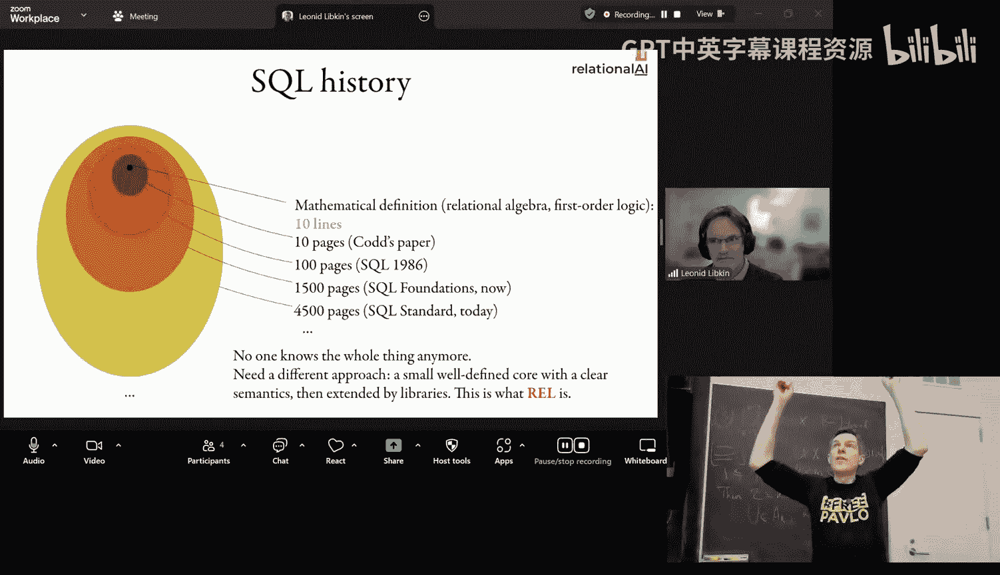
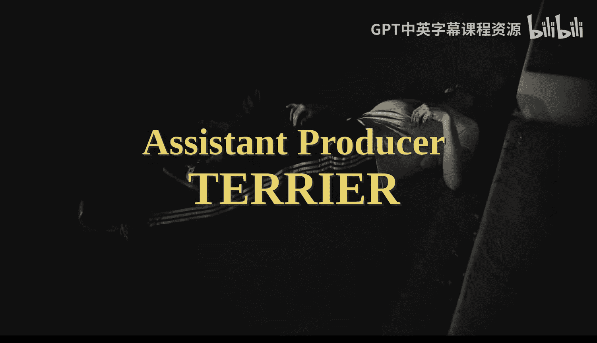

# CMU《数据库导论｜15-445 645 Intro to Database Systems (Fall 2025)》中英字幕 p25 #25 - Advanced Databases Speed-Run ✸ RelationalAI Database Talk (CMU Intro to Da -BV1bmHGzsETM_p25-

🎼still。🎼送一 check。🎼管这我。🎼P your whats out。🎼想脾气的面。🎼我厌。

Let's get started get a round of applause for DJ Cash， last class。Again， so we missed you on Monday。

Tex counting。And then what was the duty who showed my office。

I just crazy said he was like your long lost brother or something stupid do you know that guy or Okay again。

 thank you so much for keeping keeping afresh this semester。 guys。

 so a lot to cover today plus we have a guest speaker at the end So let's jump right into it again Project four is do this Sunday on Monday or sorry on Saturday。

 we have the office special office hours again3 o'clock3 to5 and engage in the fifth floor Home 6 is also do this this Sunday as well。

 we will then release the solutions to it on Monday for the exam。

 which are gonna be on December 11 at 1 PMm not here but in the student university Center of the main auditorium So we'll cover that immediately after this slide。

 And then if you want to T A next semester for this class since we're not teaching 721 please sign up here。

 any questions about project4 the final exam or the homework yes。😊，The question is， for project 4。

 can you use late days， yes？Other questions。All right。

 let let's plow through this okay so I will post this on Piazza but I will have an additional office hours on the Wednesday before the exam in the morning and in the afternoon。

 all the TAs will have their regular office hours up until the Saturday inclusive then after that they won't be available if you can't meet this time with me please send me an email and we try to make an arrangements and then I think will also will be in town as well and I'll see whether he can be available on Monday or Tuesday depending on his schedule。

So as I said， the final exam is going to be this next Thursday coming up。

You need to bring your CU ID， I need to make a pencil and an eraser， calculator。

 cell phone it's okay do basic logs and things like that。

 and then just like the midterm you can write on a regular eight and a half alumni sheet of paper。

 handwritten notes about whatever you want in for this study。

And then there's a practice exam that's available that I posted on Piazza this week and also available on the website here。

Okay。You can bring food if you want I think that's allowed。

 just don't bring weird shit like one year somebody brought wet laundry。

 don't do that somebody brought candles one year don't do that another I had a friend in another school somebody brought a therapy snake to an exam don't do that right be be reasonable okay？

All right so the stuff that you need to be aware of that we covered throughout the semester or they started before the midterm。

 but we obviously need to build upon it throughout the that everything we talked about after the midterm。

 are listed here， but you obviously can we will not ask you a indth SQL question in the same way that we did in the midterm。

 you obviously need to be able to understand what select star from table does。😡。

Especially in the context of understanding the query processing models。

Inly like how window function implement or how window functions are like the SQL syntax for it。啊。哎呀。

I don't I have not written the final exam yet， so I don't plan to write a window function question。

Yeah， they're not hard， it's just a group eye。It's weird， but it's goodbye。Again。

The idea of the midterm to understand is see if you understand the semantics or what the window function is actually doing。

 that's not what we've covered since the midterm， we've build all the stuff to actually run transactions and run queries。

😡，And then basic understanding of bust， again， something very like because obviously we can't have you write code and try to compile and debu it the middle of in the final dam。

 this is just to get a rough understanding of did you actually do the projects？😡，Again。

 we can't ask you on this file， what is this what this line of code。

 we're not going ask you those things， it's more conceptual things。😡。

All rightSo the main things we covered since before midterm。

 we had the one class before the Monday before the midterm。

 we talked about joint algorithms and we talked about the three basic nestestle lip join algorithms you have the naive one。

 we just go and getting a block for every single tuple that's stupid don't do that but we talk about how to do block nestle lip join。

 indexness lip join， talk about how to do sort mergeRS join。

 building upon the external merge sorts stuff we talked about before hash joins， the simple case。

 the partition case and the hybrid hash join where you keep one hashable for the hot sort of hot partition in memory and then we let everything else spell a disk and then basic optimizations for using B puters and how to cost the hash sort of the joins in general。

So of given set of tus and a set of pages。And again， a amount of memory buffers。

 can you cost how much it would take to run the join with a certains join versus a hash join？

All right， then we talk about query execution because talk about。

Crapization actually I'm missing a slide here crapization we talked about the basic high level architecture of like top down versus bottom up again。

 we can't ask you anything real in depth， but we also spent time talking about how to cost or estimate the cardinality selectivity of predicates。

😡，Right and using basic histograms so you can expect to see a question like that again。

 it's not that difficult， we just look at the predicate and then we can't ask you anything to in depth on this。

So don't freak out about it for the query execution we talk about the three different execution models。

 iterator or the volcano model calling get next getting a single tuple at a time。

 materialize is sending all the tuples from an operator up to the next operator and then vector a batch is sending you know a batch of tus instead of one at a time。

And then we talked about the difference between a push versus pool query processing model。

 am I going to invoke at the root call get X and have that percolate down and pull tus up。

 or I sort at the leaf nodes， run those operators and send the data up the plan。

We talked about the different access methods， sequentialial scan with the types of optimizations some of them will'll cover again today。

 index scan being able to take a single index or multiple indexes and run get value predicates and then how to handle update queries in our system we talked a little bit about expression evaluation again we'll talk about it again today just like what does the tree look like and how would you actually apply that on a per twople basis when you run your queries。

For query execution， we talked about the process models， there was a single process per worker。

 single thread per worker， what are the pros and cons of those。

We talked about the different variations of doing parallel query execution。

Intra queryery parallelism means that I can run multiple queries at the same time。

 In query parallelism means that I can have for a single query。

 multiple workers working together to process it。😡。

And then the difference between the horizontal versus vertical。

 the horizontal is when I have the most multiple instances of the operator running on different workers to read or process data for different subsets of a table or subsets of the input data。

 I if I partition it on ranges， that can have different workers work on different ranges。

 and then vertical partitioning is more not as common。

 but this is where you could have one operator running doing some processing and then their streaming data up to the next operator who could run in parallel at the same time。

😡，And then we briefly talk about Iop parallelalism。Where we talked about the you know。

What did the data system see when it has multiple disks。

 could be abstracted away with raid an appliance， or should the data system be specifically aware of like here's the different disks that I have and how to take advantage of them。

😡，the most obvious thing is， is。We didn't talk about it at the time when we talked about I parallelalism。

 but like what right ahead logging， a very common approach systems used is they have one disk for the regular tables and then another really fastest disc for the right ahead log because I want to get data out to the right ahead log as fast as possible。

 commit transactions and then tell the outside world that I commit so I want my fastest disk to be for the logging。

Okay， so I do have a slide is out of order I'm sorry I've already said this already。

 court optimization， basic heuristics， we can apply predicate push down， projection push down。😊。

Let'sWe won't focus too much on we won't ask anything about desktopsA subqueries。

 don't worry about that， but statistics car missions， looking at histograms， sketches。

 how to be able to say， for given predicate on my table， here's some summarization of the data。

 what's the selectivity estimate for a predicate。😡，Again。

 we can't ask you anything we're complicated because you know。

We can't give you a giant huge hisogram。And then we spent a lot of time talking about transactions。

 we spent a whole lecture talking about the basics of acid， adity， consistency， isolation。

 durability， so understand what all those four attributes mean。

 what are those guarantees the system is trying to apply or provide for applications。

We talked about conflict serializability， so how do we want to check for correctness to say that a schedule is going to be conflict aerizable for the transactions that are inside of it and how can we check whether two schedules are considered equivalent or conflict equivalent？

Viewertizability is again， a more fuzzy idea， fuzzy concept of serialerizability。

 which is to understand what are the distinctions between view fertizability and complex aizability？

So which one's more flexible， like conflict orerizability？You， right， but like。

How to be able to identify that at runtime is impossible unless you understand what the application actually wants。

Be going to understand that some schedules may be still sererizable。

 but they'll be view sererizable and not conflict sererizable。😡。

And a real system couldn't actually provide that。Then we talk about isolation levels。

The main ones in theL at least the antiSQL standard， serializables at the top。

 then you have repeatal read and below that you have read committed and below that you have read uncommitted and then snapchshot isolation is this other thing on the side that provides certain guarantees that the other ones don't and so one of the main anomalies that can occur for transactions on these different isolation levels again could occur doesn't mean that always will but they could occur。

And what are the mechanisms you would use to protect them？你们在个 normally被。这边。😊，The question is。

 can we ever say that anomaly will occur on an isolation level？啊。ISo basically。

 you're asking whether could be predict for a given isolation level and its maybe a set of transactions actually running that you will incur these things。

 often timess it its like a race condition like in， in a real system and be able to say， like。

 if I run this。You know like maybe one one transaction will get paused because like a disc read a write or something and then it gets stalled and therefore it won't see certain things it won't see certain anomalies。

 but like that disc skull isn't there then it does see it there's a bunch of layers that's hard to be able predict this。

And that's why it's like it says it may occur because if I run read un committedm。

 but I only want one transaction at a time， then like it's technically surizable。😡，Right。

There's the sum of theory work and how to determine， I think after the fact。

 whether a transaction saw something that it shouldn't have seen and then try to then understand what are the long term implications of that for data。

 like if you off topic but like if my transaction does incurs an anomaly。

 but I write something to the database， then technically anybody that comes along later that reads and writes based on what I wrote is now kind of incorrect as well。

 like the butterfly effect and how to measure that it's like impossible。Right。

Then we spent a lecture talking about transactions in the context of two base locking。

the idea to phase locking is that I acquire locks， either shared locks or exclusive locks while in sort of the growing phase。

 and then as soon as I release one lock， then I automatically end up in the shrinking phase。

 but as we said in SQL and real systems， there isn't an explicit call to unlock unlock。

Your locks Ill give you your locks back and so most systems are going to run either with strict2PL or strong strict2PL strict strict2PL just means that I'm going hold my exclusive of locks until the very end and give them up all when I commit。

 but I'm allowed to release the share locks earlier。😡，Um。Just， you know， during the shrinking phase。

 assuming I can know how to get into that shrinking phase or that I'm in the shrinking phase and then strong strict 2 P just I think the textbook might also call this rigorous 2 P。

 This just says that I'm going to hold all my shared locks and exclusive locks to the very end。

 So technically there isn't a。There isn't a shrinking phase， just the whole thing is a growing phase。

All right， we talk about the cascading abt problem that they instruct strongongsh TPL can avoid this because I can't。

 I'm not going to release my exclusive lock until I commit。

 so therefore nobody can read my no other transaction can read my dirty read and therefore I won't have a cascading aboardt。

We talked about how a handle deadlocks either through deadlock detection or deadlock prevention。

I diallect detection was just identifying of cycles in the weights for a graph and killing a transaction to give them some transaction to break the deadlock。

 which may had to kill multiple transactions and make that happen。

And then Dlock prevention was the wound weight and weight die approach。

Where you order the the the order in which the。The transactions ordering based on the priority of their timestamp determines whether they're allowed or not whether they can wait or not wait for another transaction that holds the lock that they want and whether you're allowed to kill that other transaction and take their lock or you kill yourself。

Then we talked about the multiran energy locking， so these are intention locks。

 like in the hierarchy I have my top locked my database or locked my tables and within below that I have lock for pages or tus or even single attributes。

😡，So understand when you want to use intention intention locks or shared intention exclusive locks to sort of minimize the amount of。

Back and forth， I have between my transaction and the lock manager。

But also still maximize the amount of parallelism I would allow in the system。

 so the intention locks are look be a hints for us at the higher part of the hierarchy to say what's going on down below。

Then we talked about timesst ordering transactions or optimistic currency control to understand what are the three phases of OCC。

You have the read phase where I'm reading and writing to the database。

 but I'm making changes to my private workspace， and then when the transaction goes commit。

 there's a validation phase and assume that for simplicity。

 you're going to run this with a single thread and there's a single global latch that you take in the database to do this validation step to avoid weird conflicts to make your life easier。

 but understand what the differences are between backwards validation of fours validation。😡。

Backs is looking back to see transactions that previously committed to determine whether they wrote something that you didn't read and therefore that would violate serializable ordering and you killed yourself。

😡，And then forwardd's validation to be， did a transaction that hasn't committed yet。

 write the something that sorry， read something that I'm going to write to or try to write to。

 and therefore if they didn't see my update， if I commit， then again。

 that would violate the serializable ordering。Then we spent at time talking about NVCCC。

 multiversion current control， we talked to the different ways to store the different versions。

There's the appendon approach， the time travel table， and then the Delta records。

So understand the trade offs， the implications of these three different approaches。

 then the way you would actually maintain the version chain。

 either the oldest newest or newest to oldest。your pendu can go both directions and what are the pros and cons of those。

 Delta storage typically goes newest to oldest。you put the old versionrg in that rollback segment or the Du storage area。

Understand what happens in garbage collection， how we find the tuples that are reclaimable and remove them。

😡，What happens when we remove twooles that need to update indexes， when does that happen？

And how do we make sure that we don't have any conflicts when we do those things？

And then there was a question on Piazza asking about NVCC with2PL。

So I quickly just go over that again， because I think the textbook is saying one thing and I'm saying something else。

So this is the setup we have before where we have two transactions T1 and T2。

 they get timestamps in the beginning， T1 is going to read on A and then it's going to write on A。😡。

The way this works is that there's no， you don't take shared locks。On Tupples。

 because you want to allow a writing transaction to create a new version。😡。

But you can only allow one transaction， create a new version at a time。So there's an exclusive lock。

 but it's on the new version that's being created。So this transaction T1 is going to create a new version here as to this。

 we said it's the begin times stampamp to our current times stampamp。

 the end time stampamp is currently infinity， and since the previous time stampamp。

 since we're going the oldest and newest is also infinity， we'll set that to be our timestamp。

This is sort of bounding the visibility of this record。

So now if any transaction comes along with a timestamp less than one。😡。

They would see they would be able to read a zero。so then we do a contact switch T2 starts running。

It reads a and again， since its timestamp is two， it's in the future logically it's in the future from T1。

 so therefore it can't see the update yet because T1 hasn't committed yet。😡。

So it's going to be able to read a0 because again readers don't block the writers。

 and then when it tries to write to it， once to try to get the exclusive lock on creating the new version for the new physical version for this single logical tuupple。

 and therefore it has to stall and weight。😡，Assum we're doing2PL with deadlock detection。

If it was doing TPL with wound， weight， weight or diet， and that would。

T T2 could potentially steal the lock from T1， and they had to roll back as changes。

But assume we're just doing simple2PL with deadlock detection。So then now when T1 comes back。

 reads an A， it'll read its own right that it did before， that's fine when it goes ahead and commits。

Then now it status in the transaction table gets updated， it's now committed。

 so now it would know that anybody coming along should be able to read this if they wanted to。Right。

And then now in this case here， it can create the new version。 So to your point here， yes。

 and this this here would be a。And。This is an example of a of what's that？

So it's technically rightke because I'm reading something。I'm reading something then in the past。

 they were both seeing the same thing， but then I was allowed to overwrite it。😡。

There is was that There is an Yeah， so there is an yes， yes。

 and that's the whole point of like like the。To make it fully see your lives where the extra step would then be like identified that you wrote you're trying to write the same thing and then you read something in the past that you should have read the other version。

And you have to go kill that transaction。 So there's if you want to get full serialized by this。

 there's a dependency of the graph you have maintain as well。 that's what Postgres does。

Just to be sure if it's not conflict we don't have conflict in this example now， yeah。

even with regular emCC without， yeah， with snapnapshott isolation without the extra check。

 you make sure if I violating do I have a right school anomaly。

 you're not you're not serializable like the fact you incur the right school anomaly means you're not serializable。

I see impact on performance。And he have some。いて。啊就但是。Averacy。The question is。

 what does the effect of MCC have on2PL， meaning what is the performance overhead of maintaining versions？

嗯。I mean， there's。There's President Cons right， the fact that I can read something with without having it to I can read something。

 I can read an older version， I can have my readers not be blocked by the writers。

 there's advantage to that right like so is that worth it versus paying the everhead of maintaining the rollback segments and things like that right or maintaining the different versions。

You still have to maintain versions like with Rgo2PL， Ive got to maintain versions anyway。

 but it's like， it's almost like UCcc where's my private worst is because I have to have my undue buffer。

If I'm overwriting because it's a single version， I got to be able to go back and remove that。

So I got to store the old versionrgin somewhere anyway。😡。

And so you could throw that in the right head log but then now like if if that gets flushed to disk and I don't have any a memory。

 now when I bought and roll back， I to go back to disk， read back the right head log and replay it。

Right。knowThere's no free launch。Right。My second question was。

 the textbook said that NCC we took the users trip。要。

The question is the statement is the textbook says that， yes tell that。

 the textbook says that MVCC with 2PL always uses a strict2PL。啊。So like。

I think the textbook is wrong， so I'll post on piazza。

' so I'm going by there's this famous textbook on nothing but transactions from Jim Gray and Reuter。

 the guy that coined acidid and Jim Gray the Victoria Woderre from the '80s that talk about how they do MBCC and I don't like their definition doesn't have to be stripped。

question assume， any question on the exam will be very explicit like what the protocol it is。

 to avoid any inbiguies。um。But like。Like Postgress does MVCC with2PL。

 and I'm pretty sure they're not using strict2PL。嗯。SQL server does strong strip， I think。Yeah。

 I'll post a link afterwards。は。Again， the main takeaway is for any question。

 I would be very explicit about it's this protocol with this vergeing and this concurrenory screen and this like this。

😡，Here's the virgin chain ordering。 Like we'll， we'll lay out things very in in fully down。

 So there's not like， oh， what's， you know， there's not like， oh， could be this。

 But if it's this like。I would avoid all that。All right。

 then after transactions we talk about how to have to recover our transactions if there's a crash right。

 we talked about the two main policies you have in your buffo implementation， steel versus no steel。

 steel means that I can write out dirty pages from transactions that haven't committed yet out of disk。

 no steel says you cannot。Force says that when a transaction commits。

 all 30 pages that are in the bable have to be written a disk before you tell the outside what your transaction is committed。

 no force says you don't have to do that。So right a ahead log is using what？😡，Still no force。

Because redhead log allows us to flush out the dirty pages from uncommitted transactions as long as the log records that correspond to the changes to those pages。

 long as that's flushed disk， then that's okay。We talk about shadow paging。

 again I understand the pros and the cons of this approach relative to right ahead logging。

 and then we talked about again， how right ahead log。

 the notion of these log sequence numbers permeate all throughout our implementation of our database system。

 including the B manager。😡，And it's what I just said。

 I can't flush a dirty page until the page LSN or the last the newest LSN that modified that page until that's been written out the disk。

😡，And with that's flushed， and then I can flush the dirty page。

Then we talk about how to handle crash recovery and based on red ahead logging。

 like there's nothing to recover in shadow paging， there's nothing to do， we can come back。

 the database is guaranteed be in a cas state so you don't do anything。

 it's says right ahead logging， we need to do extra work。😡。

And we choose to use red ahead logging every shadow paging because the runtime performance is faster with right ahead logging versus shadow paging。

😡，But if you care about In recovery， then you would do a shadow Pager。

We talked about the different notions at checkpoints， so fuzzy versus non fuzzy。Right。

And then within the fuzzy checkpoints， we talked about the dirty page table。

 the Act transaction table， all the components we need due to the areas based recovery。😡。

Based on checkpoints and the redhead log。Then again。

 we went through very quickly at the end of the semester talk about distributed databases。

 so again we can't ask you too too many too low level details it's high level concepts that we care about。

 so what the different system architectures basically shared disk versus shared nothing。

 how we can do replication， multiprimary versus primary replica or leader follower。😡。

Different partitioning schemes are horizontal partitioning。

 then we talk about two phase commit and PAs us and again that was the last class can't we obviously went through it pretty quickly so we can't ask you any low De detail questions how we do query execution in particular how to distributed joins。

In our system， and then the semijo optimization of just passing along balloon filters instead of the actual entire data set。

So last class， there was a question about in the context of Paxos in comparison with two phase commit。

 how do we handle integrity constraint violations？And。

When I sort of messed up in the description of it is。

The thing to understand about like two phase commit is that kind you can have。

All of the again two basic commit， all the nodes have to agree。

 the participants have to agree that we want to commit this transaction and under a Paxos you need the majority。

 that means that if you're going to use Paxos or raft。

 you have to have the decision of whether this transaction that violated any integrity constraints has to be figured out before you allow begin the commit process。

😡，So another way thing about it is like it has to be a deterministic operation。

That like we want to do this yes or no。And it can't be any ambiguity between the different nodes to say like one guy says no because they're checking things at the moment I after I've started the commit process。

Right so in twob commit， again， its all everyone has to agree to commit。 So when this guy says， hey。

 we're gonna go to commit， prepare and this guy says okay， and this guy says not okay。

 this is allowed to happen under twob commit because every node can independently decide whether this thing is allowed to commit or not And so this where you would check for the integrity extreme violations。

In PC those what would happen， or rara of what happen is the coordinator node or I think the proposer node or the leader。

 they would determine at that point when we begin the commit process。

 this transaction has not violated any of the integrity streams， therefore I'm allowed to commit。😡。

And therefore you're getting everyone else to agree that this is the order in which we're going to commit this transaction that has already passed our validation steps。

😡，Make put a particular part to think about。questionWhen would a particular participant on a board。

 if somebody else tries to commit another transaction？

Another and it says I want to go next in the log so again。

 it's a state machine you're just trying to order the the commits。😡。

And if there's like a split brain where know， there's a network partition。

Each side wants to start committing transactions on their own and then when they' form back together and it gets reconnected。

 somebody else thinks there's a leader and they try to propose to commit a transaction。

 but now you would have if you allow that to happen。

 then one no would say it's transaction one followed by two another one say it's two followed by one you can't allow that happen and that's why you have to determine。

 you have to be deteristic in the decision that this things allowed to commit。😡。

At the moment you commit。Yes。Insistency constraints is like complicated and your data as a partition then doesn't the process of checking the constraints already involve all the node between creating of each other？

The question is， if the constraints are very complicated。

 aren't the nodes we have to coordinate with each other which would just be the same amount of overhead of running Paxos。

😡，So the dirty secreters in distributed systems， oftentimes they don't have the full integrity and referential constraints that a single notice system would have。

Oftentimes， you don't get far in key constraints in a distributed database because that checking is expensive what's that question what about Spner I think。

And spanner gives you primary keys， Spner gives you unique keys。

I think I think they'll give you also foreign keys as well， because with that。He checks。

SrianWill they check it for you Oh the check keyword in SQL。I mean， for the like check not allll。

 sure， right？Like totally what you call like alter table cr table。

 those checks aren't that complicated though I mean you can you can't it's the asserts。

 that's what nobody supports， you can do a global asserts that says anytime I commit to this table run this full query and if it returns I think if it returns anything then I think it's a violation。

😡，So as long as the query returns null。😡，Then then my constraints' is not vid。

 nobody sports that in environment because that could just be a broadcast queer to everyone for every single transaction you commit。

 so no one does that。But Spanner， I think I mean we double check Spanner is going to be foreign keys。

 primary keys， basic check constraints。But oftentimes the foreign keys is the first thing to go most systems a virus haves。

变成了。The statement is Spner has foreign keys that involves some internet communication depends on how the tables are partitioned。

If like if you have a student table and you have ID and then I have an enroll table with student ID and the far and key references of the student ID。

 if I partition both tables so that like student ID1。

23 and enrolled records or student ID 13 are in the same box， that's not a big deal。

Is the broadcast one of the cause problems？Yes， and it's the system。

For partitioning over the par keys。theYeah， so like oftentimes some systems will say like if you don't partition。

 if you don't have the partition key to be the same as the foreigning key。

 we're not going to check it for you。And whether or not's okay for your application depends on your system。

O。All right so again quickly the things that aren't going to be exam， any of the flash talks。

 any of the seminar talks we've had on Mondays or Tuesdays。

 those aren't the final exams and then like again sometimes I go off off the rails and we just had this you know dieatribe about Spner。

😡，No， no， no， it's right I mean， Spner is a fascinating system。I'm not going to cover today。

 but we can talk about it another time。But anything that like， oh。

 SQL Ser does this or My SQL does that post that， that's obviously not going to be an exam because again。

 that's just like an example of a implementation of the concepts that we talk about throughout the semester。

 okay？All right， any final questions about the final？O。So。

Let's try to get through 721 in we have what， 45 minutes。Let's see what we can do， okay。So。

I showed this slide I think in lecture 13 or so where I said here's all the ways you can make s scan go faster we've covered all of these except for materialized views and result caching result caching is basically says if my same SQL query shows up multiple times and the data hasn't changed I just cache a result and give it back to you so I don't actually you run the query just give you back a cache result and some substance will do that materialized view these are more complicated if you want to do incremental maintenance this is like if I define a materialized view find a SQL query。

 I want to cache a result but then any time the data changes rathervin's rerunning rerunning the entire query。

 I can do like an incremental update for some things it's easy like a account with a group on the key every time I add a new key for that I increment the counter by one it's the joins are when things are complicated yes。

最后的。The questionest is， will the exam take full three hours now？You can sit around for three hours。

You want， but it， it'll be the same， roughly the same length of， of material as metter。 So hour1， 20。

 right， And I would say the。Because we chart this because I love data There does not seem to be a correlation between how long takes somebody complete the exam and their grade。

 So the person usually finisheses first， sometimes it gets the highest grade。

 sometimes gets the lowest grade and the person that finishes fast。 the one year。

 the person got a perfect score because and they finish the very end。Right so。

You take it long as you want。お全なと。Sa just。we would write on an exam when someone turns it in。嗯。Okay。

 so again， these are all things we talked about their entire semesterer。 again， materialized views。

 again， these are hard to do。 like post guys， you can declare a materialized view。

 it won't increment it for you。 You've gotta call mainly refresh right in some systems that can actually maintain them incrementally。

 So I want to focus on this down here。 So we're 721 is typically about analytical systems。

 how to make a how to you know， build system that run O up groupss as fast as possible。😊。

So let's talk about code specialization and compilation。

so we have a really simple select query like this， select star from table where key is greater than low value and key is less than high value。

😡，So the first thing is like， how do we organize our code to make this run as fast as possible without doing any special harbor tricks。

 right？😡，And so we will be mindful of what modern CPUs look like and what they do for us。

 and then we can actually design and write code in such a way that maybe is not intuitive for us as humans to write。

 but it actually turns out to be the best thing to do for a modern superscalealar CPU。😡。

Right so this is rough code that you would have seen in bus top right。

 get a fairly single tube on the table， go look up the key and then apply our predicate here right and if the key satisfies our predicate。

 then we'll copy the tub in our output buffer， I assume we're doing vectorized query processing。😡。

Right。But， you know， if you've taken an architecture class。There's there's a problem here， right。

 assume I have a billion tus I'm ripping through this。What's going to be the slow thing for us？

Branching， the if clause， right。Because how does the super scaleous CPU work。

 It tries to predict whenever sees a jump or a branch。

 it tries to predict what branch you're going to go down。

 is this thing that satisfy to true or not and then it specly executes the instructions because they're all within within its pipeline and expectsly execute these instructions assuming you're going to go down a certain path in the branch。

😡，And if you get it wrong， it's light OCC， you abort the changes you made， roll back。

 and then reexe things again， begin to flush your pipeline to roll it back。😡。

So what you want to write in a modern data system for super Salless CPUUs is code like this where I go get every single tuple on my table and the first thing I'm going to do is I'm going to copy into my output buffer and then later on I'm going to check my predicate and now it's going to turnern operation and and between ones and zeros and that's going to determine if both age are satisfied to their truth then delta is equal to1 and that's going to increment my counter of where I'm writing to my output buffer by one。

😡，I'm ignoring things when you break out of the loop。

 like check to see whether the last thing should even be there or not。

 but like that's true code it right too。😡，Yeah， like this question， why？😊。

Why even need to turn a to su key lesson than 10 and it yes， it would give you10。

 which just being more explicit the compiler will take care of that， yes。だけい。Question。

 are you still branching now？Assume the compiler gets rid of that。Right。Right。And again。

 this seems counterinttuit about us as humans like I'm copying every single time and then check to see whether I should have copied the last thing I copied and then if it doesn't satisfy it true。

 then I loop back around and just overwrite the last one and again， when I break out of the loop。

 I got to check the delta of the last one to see whether I should keep it or not。😡，我警加是。

The question is the copy WebB really expensive as well， again。

 I'm assuming I'm operating on vectors of data in a columnar format， I'm ripping through columns。😡。

So this is a graph from from the paper from the CW guys from a few years ago。

 But this is showing you the performance difference between these two approaches。

 So it's kind of hard to say the blue line that loops at the top。 That's the branching one。😊。

And the x axis here is the selectivity of a predicate。😡。

So when the selectivity is zero or less than5%， and most of the tus aren't satisfying by predicate and the CPU's branch predictor is doing a good job figuring out I'm going need to go down to the branch。

😡，But then above some threshold， as it goes up， as the activity goes up。

 it's getting more predictions wrong。And so now you're paying this overhead of having to roll back the changes in your pipeline and go back。

And whereas the red line， the no branching one， it's a fixed cost。

 so no matter what I'm doing that copy。😡，Assuming I can do that efficiently。

 and then I don't pay the penalty of any brands or jumps because Is always doing it and whether or not I write the last one or not depends on whether the predicate gets satisfied to true。

Right。So we're going to design code in this way， again， it seems counterintubutitive as humans。😡。

And the compiler isn't going to do this for you， this is something we would have to write。😡。

And most of the moderate O systemss are going to do this。All right。

 so the next thing I've got to do is how can we speed this up even further。

 taking advantage of modern CPU instructions， Sdy？😡，Who here doesn't know what Cindy is？

Who here knows what Cindy is？Everyone does fantasticastic good So here's our simple branchless version of the code before。

 and then now I'm gonna vectorize it using Cindy and again， this is pseudocode。

 but whatever like you load in a vector of Tples I load them into my Cindy registers and then I'm going apply my predicate and I'm not defining how I'm going to do this in Cindy I'll do that in a second and then I'm gonna to take the output of that that thoses prediates that are sitting in Cindy registers and I'm going convert that back into my to something I gonna put my output buffer right。

😊，So give more specific example here， so say that I want to run this query select star from table when key is greater than n unless less than U。

 and then my table looks like this like a simple vector right。😡。

So what I'm going do is Im going to take the keys I want to evaluate。

 I'm going to load them a Cindy Reg and there's instructions explicitly quickly to do that。

 and there's different size of Cindy registers like 1024 or the new AVX 10 or whatever from Intel because' 024。

😡，ABx 512 is probably more common， so 512 bits， but you can say I'm storing I can store either four byte values。

8 byte values， sometimes they go down to2 byte values I can I have different lanes I can store things in so I'm going to do my Cdi compare based on the constant that I'm trying to look up here I'm gonna to get a mask there's big a bit vector that says here's the for each lane in my CIdi register。

 whether the predicate evaluated the true or not so I'll do that for the first part where key is greater than equal to the n and I'll do that same thing for now the second part。

 the key less than than zero now I have two bit vectors that correspond to whether that the predicate evaluated true。

So those are both of these who arere going to be sitting in Cindy Regs and now I have a Cindy instruction to do an and again across the lanes。

😡，And then that's going to determine now which offsets in my input vector satisfied the predicate。😡。

So then now again I going need to convert this as something I can then use for identifying which tus in my input vector satisfy the predicate。

 so I'll just maintain a vector of offsets like in this case here is zero to 7 which is corresponds to the offsets here in my input data and then now I use a S compressed instruction that converts basically where any of the ones or anyone that's set to true in my input vector mass3 corresponds to the offset into my offset array and then now I get an aligned vector that tells me here's the offsets that satisfied the predicate。

😡，So I can rip through this super fast。And so now again with that's now why I want to do the vectorized query processing model。

 the name means bad right I'm using vectorized instructions to do this vectorized processing。

 but I'm also do this in the vectorized query processing model or the batch model so I can take a batch of these twoples ripped through it with SD so by predicates can all be sdified and I can do this very very quickly。

😡，And this this is what they。The co-founder Snowflake。

 this is one of the big things that he helped developed when he built an assessment called vectorctorwiseise that came out of CWI again。

 same place where DTB is， and then vectorctorwiseise got bought by Ingress for like pennies and then he quit that and then he hooked up with the two dudes from Oracle and they found a snowflake and Snowflake is doing Snowflake was one of the leading assessments that did this but everyone does this now。

All right， so another cool thing you can do with Cindy is。

All the other different operations we talked about throughout in the semester。

 there's Cdy versions of them， not all of them are as good at not all of them can be easily vectorized with Cdy because。

😡，Oftentimes when you fall into the CPU cache， things get super slow because you have to go go load and store it get memory。

 but if you can align things nicely， you can do a lot of cool things。

All right so we talked about how to do probing and a hash table before right so the Scalar version。

 the Sti version for a single key hasht， then do a single probe and just do our linear scan to refine our match。

 right？😡，So if you want to sdiaius symify or vectorize it。

 this is using what's called horizontal vectorization。

 There's a vertical one where you sort of look at things toppped to down。 but this one's more common。

 So now I'm going to have in my hash table with every single sort of row。

 I'm going to have four keys and that are packed together and then I'm going to have my four values。

😊，And the keys themselves， I could store the， you know。

 I need to have the original key because I have to do my check to see whether this thing matches when I land in my hashable。

😡，But。Since you have variable length keys。😡，Oftentimes what what you'll do is also store as another vector in here。

 the actually the fingerprint of the hash， so your hash might be 32 bits or 64 bits。

 allowed to keep it like8 bits around。So I can just do in SID very quickly is my aPI prefix of my hash matched the aI prefix of this other hash。

 that's a single， you know you can do that very quickly is just integer of comparison。

 if it doesn't match then you know the full key is never going to match anyway so you just ignore it。

😡，So now when I want to do a look up here。I'll take my single key hash it just like before。

 but then now when I land in a slot in my hash table， I'm getting back four keys in my example here。

😡，And now I just use S D to do through the comparison I did before。

 get back a bit mask because to tell me which one is matched。 And then based on those。

 I can then go find the thing that I'm actually looking for。Why is this faster？

Because so the question is whyhy is this hazard because when I go probe the hash table？😡。

knowThat's a cache line lookup， I'm going to go get 64 bytes。😡，And so for that 64 bytes。

 if I can put more things in there than do S comparison instead of having to do four loop one at a time。

 this is way faster。😡，Because otherwise like say if it's a cysty loop， look at for loop。

 I'm going to go for each element， say I need to look at four keys。

 I'm going to look at each key separately， that's one instruction。😡，Whereas in CD。

 I can do all four in a single structure。Yes， you have to load in registers， right，Also， too。

 I'm showing。F know four lanes with8x5 12， assuming you had like 30 bit integers。

 you can put it a lot more， right？This would be like 120 bit registers。

 which is like Intel had in mid 90s。The question is like you're amortizing the cost because most of these are fail。

 yes。if you're doing go through that entire list is。 So。it's way faster to use CM versus S for this。

And again， the trick is instead of trying my example I was trying to match going back here。

 I'm trying to match on single keys at a time or single elements of a key like a single character。

 so my keys might be kind of large， so instead of doing the Sdi comparison on the full key。

 which if their variable length may not be the same for for all the elements in my fucking forward I'm getting them within the slot。

 I use the hash prefix and that guarantees they're always this fixed length。😡，All right。

 so what I've shown so far of how we take the data out from one operator one sort of step of an operator and pass along to the next one。

 this is called using what are called selection vectors。😡。

the idea here is that when the operator is going to spit out。

 it would be offsets into my input vectors that correspond to these are the tus that I want to pass up to the next operator so the like fixed length offsets within so my input array right。

😡，You can also some systems will do bit mapps instead。

 so think of this as like there's a one or zero corresponding to whether a tuple within a batch that's being passed up one operator to the next。

 whether they've satisfied the predicate and they should be continued processing as you go up so maybe the case and you saw this in the bust stop projects maybe the case I passed up a vector and I apply some predicate but only one of them is going to match。

😡，So I need a way to represent how I then pass up that batch and say。

 ignore all the other ones that are that that don't match because they didn't match down below。

 only look at this one。 And then sometimes what you want to do is，😡。

Have a staging buffer to say get I get up 1024 tus。

 but only one of them match set of me passing up a 1024 tuple or 1024 buffer that it only has one to a matching。

 I'll just wait for more things come below me then fillil the buffer and then send up a dense buffer going up。

And different systems do different things， they're trade offs for all of needs。Yes， question。

 Artisism they do this absolutely no。You could， but you basically have the implement two of them。

 ti limitations。All right， so thats that's using Cdy and to。And modern Harvard to speed things up。

We're not we don't talk about GPUs in the previous version of 721。

 that is actually becoming a hot area now there was a bunch of GPU databases last decade。

 they kind of didn't go anywhere because they had to store all of them。

 you had to store the entire database down in the GPU card right with the Nvy link of some of the new stuff in the video is doing and newer versions of PCIE this is changing and I can't say too much but there's some major things happening within the next year you'll see a bunch of GPU more GPU databases coming up。

😡，So but。嗯。Well basically the same principles they talked about CD will apply in the GPU world as well。

 that's what I mentioned is。😡，All right， so I'm going to talk about how we do code specialization now through co generation。

You know in bus hub， the way it works is like you're given a query plan。

 you boysise walk the tree and then within that you get an expression tree and you have to walk that to produce evaluate pred and so forth right So there was a very famous project called Haiku out of the University of Edinburgh in the early 2010s where for a given SQL query they would generate the plan and then they would convert that plan tree into actual machine code so C code they would then invoke Gcc to then compileile that function for the run that query into a shared object。

 link it in and then and invoke that so you don't do that in the interpretation you would do in bust or like post on other systems now I basically have a hard coded program。

 they executes exactly what my query wants to do and thats be way faster because I don't have to do jumping I don't have to do traversals or follow pointers in a query plan tree it's hard code is baked for doing exactly what the query wants。

So here's what again this is what bus tubub will normally look like if I scan to my table I got to go get a tua。

 I got figure out what the tuple looks like I go to the catalog and get some stuff and then I apply my predicate by running all these steps so instead what I want to do is I want to have a program that basically hard codes in here's the tuples I'm looking at here's the preddiates I want to consider and here's the offset to go find the attributes that I want。

😡，And then now I'm just running CPU instructions to。

To do these computations and not worry about like。you know。

 trying to interpret what's the size of the table or whats size of a table and how to jump into my slotler array to find things that I want。

 I can rip through things way more efficiently this way。😡，With that。The question is。

 can you used use an officer of compile or Gcc and good example yes in。😊。

In most database assessment for the Germans。They're going to use all the shelf compiler。

Is it possible enough to。The question is is this fast enough now？So we'll fix that in a second。

W maybe' going to jump to that now， yes question。anyoneone try。This is。

Is anyism trying to use your Git system？The Germans， yes。

And what they I don't I should go this what they do is。The first version in Hy。

 they would query shows up， instead of emitting C++ code or C code， they would emit LLVM IR。😡。

And then they would let the algorithm ofM compile that into machine code and run that because it you know it was faster to run the of the IR rather than C because then you're getting them both Gcc and that's slow right and the newer version in Ubra。

 which now also has commercialized the Cedder toB and Ill slide with this what they do is they emit their own IR。

And then they have another pass that can convert that IR into assembly。That they roll by hand。

Then they run the asmbler， which is fast and cheap to do。

 and then they start running the query based on the assembled version。

Then in the background they run LLVM to compile their IR into like machine code with like 03 turned on。

 which that can take second or milliseconds， and the idea is that if the query finishes with theser version。

 then you're done right but if it's still running by the time LLVM finishes。

 then they slide out the assembled version and plo in their compiled shared object。😡，how does it。

 like the way they orchestrate the system to get worked on， like the schedule tasks。

 like when it goes says， all right I want to run this task。It would say， all right。

 I need to do this operation on this piece of data I my compiled version ready， If yes， invoke that。

 if not invoke the December。😡，Insane right so this sounds amazing， I would say though。

 we built an LM based query engine that did this just in time copilation stuff。

 it's a nightmare debug。😡，And we'll see this when we talk about Databricks in a second。

 like you got to have people that know about compilers。😡。

And they got to know about the databases and then now when you crash in these systems because it's like dynamic code being generated for a query。

 you're not landing in like well if you generate C you can do this。

 but like if you're doing the Jit comp going directly for LMIR then compiling that when you crash you land there with symbols of without symbols to know exactly here's the line of code in your super false application that generated this IR that causes this crash it's a nightmare to bugg。

😡，So the。啊。😮，But what generated the IR， that's the part you got to fix from the gen right and so the Germans they went through debuggger so that they can reverse back based on Mozilla RR。

 to reverse back like here's the line of code that generated this IR for me。

Like you would think the guy's own cocaine， but he's not， it's insane。

 right like like his his vice is apple juice。And it's one guy， sorry。All right。

 so to the point like is this compilationous thing expensive， yes。

 and this is actually not a new idea， IBM did this back in the 1970s with system R。

 they would generate the assembly for a query plan and they would run that but again they had the same problem that any time that the system crashed。

 you got to go figure out what assembly created this assembly to figure out what was the mistake actually I think system R was written C the same idea or the other problem is every single time you change the API of storage the storage system。

 they didn't got to go change all the compiler code。😡，Again， it was early days。

 they didn't have good abstractions。So an alternative is to what vectorwise came out with and again what snowflake does and what a lot of systems fall along is to do what are called pre-coile primitives and the idea is that in your data system source code in your repository。

 you pre bakeake and automatically generate all these primitives for different predicates you may evaluate for any particular query。

😡，Integer column equals integer， integer column less than integer。

 I think of all those separate operations as a separate function。😡，That you then have。

 you can auto generate all these through templates in your codebase。

 and then when you compile the binary， then that binary itself is now all these different primitives that you then stitch together at runtime。

😡，based on what the query wants to do， and then now you don't worry about jtting things。😡。

Because you have basically things all together and you're kind of assembling the building blocks for a query plan just through pointers。

😡，On the application causes。The statement is the orchestration cost can to be high， yeah。

 so the jump call is expensive， aha， but if you do batches of tuples。

 then that amortizes the jump call。That's how if it's doing two by a time， no， if it's a batch twos。

 again， with the snowflling guy he figured out like this is how you can do this。😡。

So the say my query like this， again I'm doing a string column book up an ABC and integer column book up four。

 right？So I have a separate primitive to do a take a vector tus in to do string column equals something constant。

😡，And in this case here， I would have another one for the Integercom。

 but now you can see it now I'm passing along the positions offset so I can I can chain these things together。

 take the output of one and feed it into another one and then they would know that you know should I this position thing is。

😡，If it's not my position vector， but I know I should ignore it in my input column。😡。

So even though the number of possible permutations you can have in a query plan for these predicas is infinite。

😡，Uh but in actuality it's actually a finite number right there's only like so many different data types。

 so many different things you can do with them， like something equals something。

 something less than something and so forth。I something equals a column two columns the same right so this is what this is what snowflake does。

 this is what。😡，This is what photon does and Databricks。

 the current researcher says this is the right way to build your systems。

 not do the compilation stuff。😡，Yes。他关系。est， do you need have a codegen framework， yeah。

 but it's not hard。No， it's not like， like here's two right here， right。

 Like something equals something something less than something。 It's not。 again。

 you only have a certain number of data types。 And then the reason why this is better than gyped compilation。

 because now if there's a bug in this primitive， a crashes。And I can go to the GDP。

 or whatever and go walk through and figure out how to reproduce the crash。All right。

 we got 10 minutes， I can't cover all these， let's do a vote。We'll pick two。I would to keep count。

 raiseise your hand if you want BigQu。Raise hand what snowflake。

A little more raise anyone want Redshift？Very few， okay， we originally want yellow brick。

I might override you because the yellowberg's insane， Ra want Databricks photon。

 that's a clear winner and Raman want clickhouse。哎。We we'll do databs oh shit。All right。

 we'll do Databricks。Yellow brick， and I'll try to click out quickly。

 I'll click as a quickly mentioned， click on speed already give a talk， all right。

I me you one thing must stuff like。The dude that again keep mentioned this guy Maren who like then all this stuff inventeded like the vector stuff that sent you stuff this is how hardor is about databases this is a photo I took it this is his leg he got the snowflake tattoo because he love his database so much that's how serious people are about these things and you think I'm crazy about databases like he's in there with me okay。

Dataomics。So Databricks is based on Spark， what was Spk written in them you know query language or what programming language Scala。

 what does scholara run in JVM JBM is terrible don't use it right so they had this problem where they had this original version of this Sp SQL that was doing the Jit compilation stuff they would admit Sca Bte code that would then compile the JBM but then they found themselves struggling with getting good performance it because。

😡，Youve got to get people again， who know compilers and know databases and also know how to deal with the JVM。

 so they spent more time trying to modify the code to generate the do instrumentation the JVM rather than making the query engine go faster。

😡，Because again， Spark was originally written as a twople at a time row based system。

 and obviously again， with snowflake and all the other stuff we talked about the entire semester。

 we know we don't want to do this。😡，So what photon is is a runtime written in C++ that integrates。

 connects into the JVM through J and I， the Javava Na interface。

 and then at certain points when they execute a query。

 they recognize I have a C++ version of the thing you want to do like something equals something they can then hand it off to the C++ code who then could run that more efficiently and then send the data back into the JVM。

😡，Right。So there's a paper called photon， I'm just point out here。

 there's a bunch of my former students and students have taken 721， I sorry 445， like you guys。

 there are all a lot of students at Snowflake and a lot of people work on this project。All right。

 so what is's photon， is' shared disk react storage， it's doing pull based vectorized processing。

 the pretty periitive depression function we talked about before we won' to write the query bathroom too much。

😡，But again， the core idea that photon is doing is this these preco operator primitives or kernels。

 the same thing I just talked about with vectorwise and snowflake they generate all the possible things you could want to do on data。

 they precompile them and then at run time they're switching them together and recognize these are the things I can and fall out into supposed fl and if they don't have a supposedive version of it。

 then it just falls back and runs regular the JM version as they normally would right and they comment how again in their experience it was much。

😡，Much easier to build a the Cva plus based engine that these pre precompile primitives than it was to instrument the GVM and do just time compilation。

 So even though the first version of this their implementation wasn't as fast as the Jit version was。

 but they spent all the time now actually making the the precomp self actually faster。

 they can get they would get。They got bigger improvements and got faster than they would have and they would still mucking around the JVM。

I don't know for the numbers too I mean it's quite significant' there's other tricks they do to like if you they assume that you know even though column may not be declared as not null sorry but column might be declared as supporting nulls。

 they assume maybe it doesn't is not null so there's bunch of checks they avoid and then if they get it wrong they roll back there's some things like that to do as well。

应该上边了个上一点。The question is， can just keeping the summary the downtown City Knowlls。

 if I'm reading much of parquet files or CSV files that I've never seen before， I don't have that。

So I got a guess。' there's other tricks you do if like JSON， like in JSON's untyped or barely typed。

 you can say， oh， I know that like most of these times in in this field it's going to be an integer and then only if you see a string then you fall back and do something else。

so they're going to do a technique called also expression fusion。

 So this is we talked about operator fusion before we can kind of take the。😊，呃。

If I have a scan with a predicate instead of having themB two separate operators。

 I can put the predicate inside the scan operator so that's operator fusion。

 they're doing expression fusion because they're doing these predefined the precoop primitives so instead of having the two functions that I showed before where I'm one preddiicaates is doing the check on it on the first part of the conjunct and the second ones in the second part。

😡，Maybegan it pre generaterate a bunch of these ones that can do both together they could rewrite this queried into a between clause。

 and then now it's one less function call to go process all the data， right。

Another cool thing they do with the shovle phase that we talked about before is that they can。

 they can。Determine whether one partition gets too full because the data is skewed then they can after the shuffle police they can go back and repartition it again。

 kind of like recursive partition we talked about with has joints so say that I have my worker filling up all these partitions and then I recognize that these three partitions are underutized and the one in the middle over there and the one in the end are kind of getting too full so what I can do is I can dynamically say。

 all right I'm going to start rewriting the data that I have in these guys into this other one fill that up。

And then just pass along the next three so then I can sort of automatically downsize or upsize the number of workers I have after each shuffle phase based on the data I see going in。

😡，All right， let me talk about yellow brick just because。

I find it again this is super fascinating so it's a new engine written C++ they for it about 10 years ago and I said this in a class。

 I said this about them in one of these lectures at some point and I forgot I said it and then when I went to go visit them in London a few months ago。

 they told me what I said and then their marketing people love it because they actually sell it to customers based on what I said so。

Yellow brick does things like the Germans you would only do if you want cocaine the amount of system optimizationization they're doing you would not want to do if you're brand new startup。

 but this is what they did So what is it it's a shared designer storage systemre doing pushbased vectorization they're doing translation the cogen stuff we talked about by instead of generating LM the IR the generating C plus+ and then Gcc compiling that but they can hash that but then the engineering stuff they do is insane so。

😡，So they have a row store that's based on Postcasts the front end， query shows up。

 if they have the cache query plan， they reuse it otherwise they'll apply it in the background and then run it when it's available。

😡，What's insane， though， is the the communication channels that they have in between the the object store。

 which is like S3 and the different workers themselves。 So these guys said that the like。

The MVmeE drivers and the Harvard drivers that Linux gives you or the Harvard vendors give you were way too slow。

 so not only they had to build the runtime engine for the database system。

 they wrote their own kernel drivers for the MVME drives they' were running on and for the N and then TCP was too slow so they re they wrote their own network protocol based on UDP to make that go fast but then copying data from the NIC down down the hardware through the kernel up into user space that's too slow too because the kernel slow for us so they're going to use what's called SPDK or DPDK to do kernel bypass where basically they're managing their own TCPI stack in user space and don't let the OS do anything so when Yelbrick turns on they call malloc get a bunch of memory。

 take control of the hardware and they never talk to the operating system ever again。😡。

Because the Op is going to ruin your life and these guys took that to the extreme right if you're a brand new startup。

 you would not do this， this is insane， but this is what they did 10 years ago because they were coming from the fintech world。

😡，20。Question， how's a different RDM， I mean RDM is the sort of the same thing。

 but you need specialized hardware for this for DK and SBDK， you don't need specialized hardware。

You can run that at Amazon， yes。我这一地跑了跑了2快。The question went really quick。

 there's another one from Stanford as well， but like there's almost they did this 10 years ago。Yeah。

 it's not standard， but like so if you need specialized hardware。

 you're not going to work in the cloud。😡，Right for you can do， you can do you to be everywhere。

 All right， The last one you guys wanted was was Clickhouse。Right。

 so I wanted to say quickly a bit quickhouse。 So this came out of Yandex。

 I think they started building actually 2009。 And when the guy came gave a talk， like as I said。

 like when when。When this came Clickhouse became public。

 I thought it was fake because Nacrz was Russian because it was like the things that they were listening they were doing was actually kind of at par or a little more advanced in what snowflake was doing at the time back in like 2016 and it seemed insane that this company I've never heard of sorry I heard it againex but this system I've never heard of just showed up on the block having all these amazing features but again it's something to been working on for a while。

 so again they're doing pullb query processing there's a shared nothing architecture although they can support the cloud stuff the S3 stuff as well theyre doing they'll compile the expressions the same way that Postgres does。

 their query optimize is not very good they know this they publicly say this is something they were working on。

Inque Fs is actually terrible， the process one is probably better。

 but for the things they're doing single table queries， it's okay。

 it's the joins that cause the problems。😡，I want to talk about what they do for hash joins。

 but in particular on the hash tables。😡，So。😊，Clickhouse comes with 24 different implementations of hash tables。

😡，Nobody does that in their system even the yellow brick guys aren' aren't that crazy right because they have specialized hash tables for every single possible data type that you have so Im to show one graph here this is doing a join with the group I this from a paper from few years ago but this end up making into the into the real clickhouse system it's just showing that like the。

😡，Like they have all these different they don't have all of these。

 but like the one that added here is like if you have， do your try to join and strings。

A Laer probe hash table does off the shelf one is not going perform that well。

 but if you have different hash table implications。

 of like doing compile time optimization how to pack the data into the slots based on different sizes whether you exceed a cache line or not then you can get much。

 much better performance So this is sort of like the pre-compille primitives we saw like if I'm doing comparison on like this key on this type with this constant I can have a specialized version of that function to do that comparison。

 they're basically doing the same thing， but for hash tables for all the possible data types and the lookups you want to want to do on that and that part's super amazing they do a bunch of assembly stuff as well where they try to have。

Different versions of different operators that are sbiified for different。

Different versions of Cbi on Intel， so there's AVx 512， AVX 256。

 sometimes the 511 doesn't is not as fast the 2561 because the older CPUs would actually throttle down the frequency because they overheatated。

😡，So they they would be able to detect and say I'm going to run the ABx2 version。

 the 286 version said the 512 based on what hardware they're running on， it's amazing。All right。

 so let me switch over to the racial eye speaker wherever time。

 but again the the the main takeaway from all I want you guys from all of this is that like these systems are doing。

You know it's it's amazing stuff and try to get things run as fast as possible is really challenging to do Go。

 all right， so remember the haiku system we talked about before。

 they did that early compilation stuff， this is the same school。 They're very strong day。 Let it。

 thank you so much for being here。 the floor iss yours go for it。Okay， so I'm starting， right？

Yes goboard， yeah okay， right， okay， so do we understand SQL and if not why？Right， okay。

 so I'm spending just the little tour a couple， couple of things about myself。 So I'm spending。

Most of my time at relationlational AI and I represent Relational AI in Paris and I'm also part time at the University of Edinburgh where I was full time for two decades prior to relational AI。

Okay， so last time we relationlational AI was here in presenting in CMU， so we talked about REL。

 which is the programming language that we develop in the relational AI。

Especly programming language relational data， if you interested in that。

 you can see there was recorded up by Martins about 10。

15 minutes and also the letters of paper and sigmma with details of the language。

AndBut we did not on that talk， we didn't fully explain what were the simple problems that we tried to fix。

And that by itself would require a very long talk， but what I'll try to do today in the short time that I have。

 I'll try to give you a taste of simple problems that we are。That's better right to fix。Okay。

 so you all know what SQL is right okay， so it's like dual language relational database。

 it was standards in 86 international standards in 87 implemented all over the place。

 if you look at the top programming languages according to ITP so this year it's at number four。

 if you look at the job ads and which jobs which jobs required all of SQL last year it was number one this year it fell just below Python at number two。

😊，Right， so。Now SQL has been with us since 86 it was standardized and there were like several standard events several iterations 92 was when it was。

Baically reached its current shape and after that now be SQL 2023 we are on the way to produce SQL 2027。

 there are a whole bunch of traditions in between it's not free if you want to buy it it will make you about $1。

000 a quarter and it consists of 11 parts which are numbered by random numbers between $1 and16 so don't expect it to be consecutive。

 there reason for this but not for this stock。😊，And what allDB wastes implement is essentially at the core。

 which is the part two that's called SQL foundation。

 there are some discrepancies plus something else from the standard。

 plus something else not from the standard， but that's the world they live in。All right。

 who designs it， it's a committee is this fantastic name。

 Io IC JTC1lesser23 again each part of this name actually has a meaning。

So that's the picture of the committee from its last meeting in Barcelona just a couple months ago。

Right and the way it works is that so most of the technical work happens inside another organization called Insight。

 which stands for International Committee on Information Technology Standards。

 despite the name international in it's actually very eccentric。

 though half of the committee is from Europe and Asia。

 but you only can be in the committee if you're representing in as a registered entity。

So discussions in this committee lead to papers that have then forward to the international committee that meet a few times a year and basically decisions are made in that committee。

 people vote first in the committee and then the papers get incorporated into draft standards and then the national body so each nation will have its own standards committee they'll vote to approve those standards this vote happens in several stages and eventually that's why there are such a law usually for five years between additions of standards and eventually a standard is approved。

And then the fund begins。Okay， let's start with a little fun。

 you know something that you all know about SQL all learn about SQL， I have two relations R ands。

 all both have SQL attribute A and I ask you to compute the difference within those two relations。

 let's not worry about multis， let's not worry about bags in antics， let's say everything as I set。😊。

Okay， there are three ways you can do it， you can just directly use SQL accept operator to compute the difference。

 or you can use the sub query， you can say give me everything in the R that's not an S。😊。

Or you can use exists for a sub you can say give me everything from relation S such that it does not exist something in the relation S that's equal to it。

So if you ask you your students to write this type of query。

 you will write one of those and you would expect to get a full mark。

Because you run it all of a set and say， okay， well， same answer， that equivalentqueries。

But lots of SQL programming things deck in queries。But。😡。

Let me change a little bit and let me replace two is now。And this clear。And then suddenly。

What I get is three different answers。And I can assure you that huge number of people who write SQL queries。

 they fall into similar traps right， you know they change not in not exists and know suddenly you can see that there's a very dramatic difference between the writing because not in and not exists。

All right。So we have a bit of a problem right， but let me tell you that we have a even a bigger problem is understanding SQL what is simply in S and select stuff right the first thing that you do like you learn S。

 select stuff from R right from some table， you see the table。😊，Okay。

 so I' make a claim that absolute majority of SQL programs actually don't know what select Star does right so let me explain this on an example。

So okay， so let's say we have a relation R， again， S attribute a value1 and I write this query like repeat attribute a vice in the output。

Okay， so that's going to give with this relation with attribute A repeated twice every GBMS will give you the same thing。

Now I say this， let's use it as a sub query and say let's select star from that subque。

 like I literally plug this query Q from above， I just plug it into this line form。😊，And I ask you。

 what this query returns？And in my experience actually of talking to people directly。

 I asked this and even like talking to students when I teach in front of the class and people start getting and say。

 well， maybe it will return the same as before， maybe not。

 maybe it will give an error what's going to happen I mean this is one length where we select star has one double and people start scratching their heads。

😊，And there is a very good reason why the scare server hass because the answer to this question is depends on which system you're on the screen。

Posg and signal light will give you one star will give you basically as above。

But Oracle SQL server my scale and C2 will all give a compile time。

 and Dib now will all give a compile time error。Okay。Already， like one land career。

 so let's star we I guess into trouble。But now， oh， let's， let's get into more trouble。Okay， I ask。

 okay， let's run this query， give me everything from R where the condition is that this query Q prime。

 the ones that I just saw that sometimes run sometimes gives us a compile time time error。

And when this query， it returns something。What will this do？You most people will say， oh， well。

 probably know it'll give you R if it runs on Po and S light， maybe compile time error if it runs。

 if it doesn't run， dancer is not， it will always give it evational。Right。😊。

So you see the decision is that like with the super， super simple queries， I can get。

 I can start like with super simple devices in SQL。

 I can start writing queries that even experience SQL programme will。😊，S question what's going on。

Okay， let's come back。 More fun diss。Let's say have a database that has orders and payments， right。

 we have order and we know that sometimes some of the orders have been paid and I ask you to write to query unpaid orders。

Okay， give me all the orders which there is no pain， fine， you know， this is very， very simple plea。

You let's around not in SQL what we are going to get。

 but in this database we are going to get that order two and order three are not paid。

Right we know intuitively it's wrong because you know that there are two payments， right， it's you。

 how do you know that both of these42 in order three are not paid？We don't know this。

 it's quite possible that one of them is actually paid。

 but SQL will tell you that order to in order say unpaid。

 imagine then you go and chase the customer and say you didn't pay the customer paid and then you then the customer never comes back。

So we get what's called false positives right so answers that we know it's not true and actually these false positives they're fairly common right so we try to experiment a little bit with DT like queries and populate database with nus and these false positives pop up all the time。

😊，Right， and yeah， I also would like to point out that， you know。

 most of the time you see graphs coming from sigmma papers， but this is a very unusualquithe。

 it's a graph that comes from a pos paper from a cireco paper。Okay。So NAsa all over the place， right。

 you know， if you are European and you want to go to Texas and you ask for weather they tell you don't ask about Celsius on the Fahrenheit。

You know， you can be asked for a payment on your multiple nus and this is she's screw out a a database of a big retailer right and you can see the love nulls。

And nulls cause problems like you know， there are like all the stories about actually。

 it's a real story about a person whose last name is Nll and who cannot do anything in this life anymore。

 now that everything has to be recorded in database not null fields。And so when nus appear。

 you know that things kind of go bad right you know， like in textbooks et that you know。

 well nures is fundamental at all if it's the way the world behaves。

 books for Si database professionals tell you get wrong answers to queries。

 you can not trans answerss and like there are even like headlines like you know this is from BBC that children heart surgery halted by incomplete data right so it could be quite different。

Okay。So there's one other question that I want to briefly address。

 and this is how standard is the standard。All rightThey have the standard。

 we assume that everybody has to do the same stuff。But actually。

 if we run multiple queries on different databases。

 we know sort of from experience that some of them will give you different results。

 so we try to quantify that and from a random  query generator about 2% of queries for the most basic fragment。

They behave differently。 Some issues admittedly are just minored and very syntactic。

 but some some are serious。So I'll give you two examples of serious issues of things that could be unexpected。

one。We're kind of a little over time， we're over time， sorry。

Okay it's 10 minutes okay I'll yeah'll just'll just I'll just wrap up with this right so and basically and say you know why we find these questions problematic and SQL because SQL standard has been growing craz right it started with a 10 page codes papers than 100 pages per SQL standard now we had 4500 pages there is not a single person in the world who knows everything。

😊，And what we are trying to do in relationized is to have a different approach to have a small well definedfin cor。

 which is a clear seman and then extended by libraries。

 so this is what this is our approach this is what language journal is。😊，All right， so again。

 for the two things again， this is last class see you guys on Thursday next week and then the last thing also too is that we got a announcement from Farnum this morning。

And the good news is that DJ Cash won most dank DJ at Carnegie Mel University this year was a round of applause。

Can you get a photo？Here。走我过。Here。Yeah， hitting。You got it。 awesome， awesome。 Okay guys。

 give Ramlause your cash then you lend him and then good luck at your final exams everything else and then again Saturday office hours。

Sunday Project due Thursday next week is the final exam， okay？🎼说你会乐。🎼我再从不见。🎼Yeah。

🎼但是说你不会。🎼Yeah。🎼是我从不见。😊，🎼Yeah。🎼说你最色帅我走不见。😊，Get the fortune the maintain。

