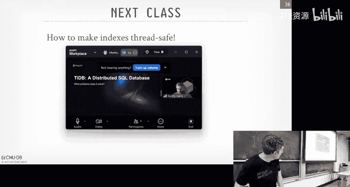
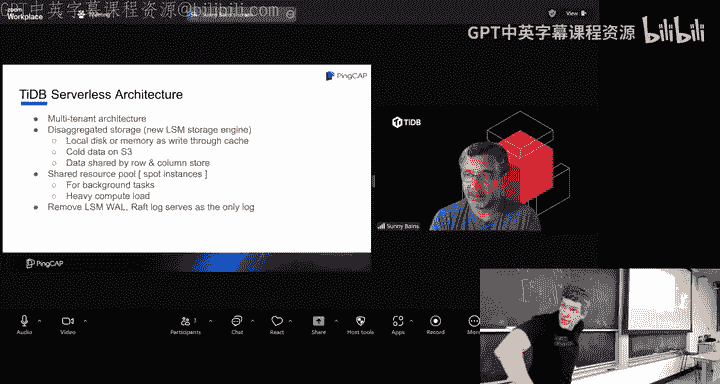
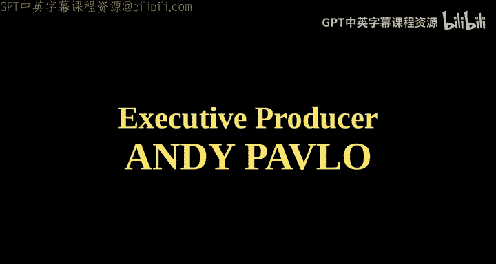

# CMU《数据库导论｜Intro to Database Systems (15-445645 - Fall 2024)》中英字幕（deepseek翻译 - P10：#09 - Vector Indexes, Inverted Indexes, Filters, Tries ✸ TiDB Talk.zh_en - GPT中英字幕课程资源 - BV1Tys8eQELW

Yeah。Official Yeah thepers in the room and then like I was late and like the cops like mouthing off to me I'm like。

I didn't know， all right， sorry。All right， there's a lot of cover today。

 This is gonna to be a big sort of brain dump of a bunch of different data structures you guys should know about in the contact of databases。

 So let's get much of we can。 So again， for the class。Project one， again， is due this Sunday。

There's a recitation and the tutorial had a profile。

 the performance of your system that's post on piazza and the video is available。

 As I said beginning the semester， we have extra office hours this Saturday the day before any project is due and that'll be in Gs 52 7 and then you'll sign up using the OHQ website thing point out too。

 a reminder， as I said beginning the semester， do not email individual Ts about like how to debug your project。

 please either come to office hours or post everything on piazza because instead of explaining the same thing over and again to different people。

 if we post on piazza than everyone else can see see what the solution is how to fix things。

 homework3 will be out today and then I'll be due on actually October 6， not September 6。

 So not the past in the future。 and then the midterm again will be in three weeks coming up in class。

 So again， if you。😊，呃。If you haven't started Project1。😡。

You start now right if you're struggling with what a deadlock is。

 this is going to be a problem because project two is be much harder than Project1。😡。

So if you don't know what a deadlock is now， you don't have to debug a multifoed T+ program。

 you're gonna have a lot of problems later on。 So if you haven't started now， please start。

 And then if you have questions， obviously don't show up on Saturday's office hours and be like， hey。

 how do I get started。😡，You're going to have problems， okay？All right。

 so last class we were making distinction about talking about indexes in the context of E plus trees。

 and we sort of said that there is the notion of an index。

 which is the data structure we can maintain our database system that allow us to find the location of a given tuupple or record based on some number of attributes。

 certain number of columns and so forth。😡，And the Bry is the most widely used one。

So today I'm going to talk a little bit about filters because this is going to be an important data structure that's going to allow us to do a bunch of other optimizations later on。

 especially when we talk about joins and similar to how the mod law keeps appearing in different contexts in the data system。

 filters be useful and in a bunch of different contexts as well。😡。

So the difference between the filter and an index is the filter can tell you whether something exists。

 like does a key exist in a set， but it can't tell you where it is indexex will say yes。

 it's in the set and oh， by the way， here's where to go find it。😡，So a lot to cover today as I said。

 So we're talking about blue filterers and a little bit about other filters that are out there。

 And then this is gonna to be again a smorsborg of a bunch of different data structures that are super useful and widely used in databases again。

 not be frustrating is the most common， but we'll see how tries and Skipless are using in other contexts as well and then we'll have a flash talk from the co foundunder of TiDB。

 I think he's the CTO who was here last week and give the talk when we had our on campus event。😊。

So actually quick show hands， who here has heard of a bloomom filter before？Half， okay。

 who heres heard of a try before。Allright， okay， skipless， Any， very few。

And then vector indexes and vert indexes。 Well， you know。

 there isn't one data structure we can point out。 say that's what it is the same way like a try of ratry is。

 But we'll cover that。 Allright， so balloon footage are super useful， not just for databases。

 but data is the most important thing， but you， you'll see these throughout through other aspects of of computing。

So a B filter is going to be a probabilistic data structure that is going to answer again set membership queries because it's a filter。

 it can tell you whether something exists in a set or not。😡。

But the key thing about it is that it's probabilistic。😡，Meaning， unlike in a B plus tree。

 which always give you an exact answer。 Like you said， does this key exist， You follow the， the。

 the the inner nodes， leaf nodes down， sorry， inner nodes down the pointers to the leaf nodes。

 And then the key either is there or not there。And in B filter， you'll never have false negatives。

 meaning if you ask whether a key exists， it will definitively say yes， it does not exist。😡。

But it may give you false positives on keys， meaning it'll tell you that it exists when it doesn't actually exist。

😡，And then it's up for you to go figure out， you know， look at the real data。

 depending on whether you care， whether that you know， the answer is correct or not。

 You have to go down and look up the real data to see whether that's true。Right。

So so an example would be， we saw this when we talk about chain hash table in my bucket list。

 I could have a balloon filter in the the bucket pointer array。 So when I hash a key， I landed。

 I landed that bucket pointer。 I checked the bloom filter based on that key to see whether my key could even exist in the chain。

And it might tell me， yes。 and I go scan it， and I find nothing， but it definitely doesn't exist。

 Then I know it's not in my chain。So that's an example we can use this to optimize other things。

So B that is' going to have two operations or two commands you can do on it。 You can insert a record。

 and then you can look up a record。😡，You can't do deletes。

 We'll see a accounting Bo filter in a second。 that'll handle of delete。

 But in in the the original balloon filter idea and how what most widely they use。

 you can't delete keys。 and you'll see why in a second。

I think Bloom filter are date back to the 1970s， it's called Bloom because the guy's name was Bloom。

 that's why you'll see it with a capital B because it's a proper noun。All right， so at its core。

 Bloomfoot is just going to be a bit map。😡， my， my toy example here， I'm showing 8，8 bits。 And some。

 you know， typically it'll be but much larger。But but not significantly larger。

 And obviously there's a trade off between how big your bitmap is and how many hashes you want to do into it。

 that'll affect the false positive rate。All， so if I want to populate this thing in the beginning。

 everything's all zeros。So I say I want to the key rhythm。So in this example here。

 I'll have two hash functions。😡，Right，And I could be the same hash algorithm。

 like like X hash just with different seeds。 So that produces different random values。

 But it doesn't matter。 So I'll get a hash value， modified by number of bits that I have。

 And then whatever number comes out of that is going to correspond to the offset in my bitm where I'm gonna flip the bit from 0 to 1。

If it's already one， then I'll just leave it there。Say now I want to insert another key， Gizza。

 same thing， hash it twice， modify by number of bits， I get two locations and I flip the bits。😊。

So going back here， actually， from this case here， I always landed it in locations where the bits were really zero。

 so I always flip it from0 to1。😊，And then say now we want to do a look up on Risa。

 It's just the reverse of an insert。 right， It's a pretty easy algorithm。 hash it again。

 modd by the number of bits。 I land in my location。 And then as long as both bits that I land on。

A set to one。Then I know that this thing potentially exists in my set。😡。

If one of those bits were set to zero， then I wouldn't have't inserted it because otherwise I would have set it to one。

😡，Now we do look up a ra on the chef same thing。 hash it， get different locations。

 do a look up in this case here， the first hash gives us at offset 5。

 that's set to0 right the second offset at3 is one。 So again， even though one of them is set to one。

 the other one set to zero。 So I know that this this is not my set。😊，Again。

 this is why you can guarantee that there's no false negatives。

But now if I do a look up on ODB rest and piece， same thing when I hash it， I landed locations。

 now I have to have to hash to locations where the bits are set to one。😡。

So this response isn't going to come back with true， but again， in my toy example。

 I didn't insert it。😡，Right。So this square？Again， you can imagine like if you have a bigger bigger bitmap and more hashes。

 the accuracy of these lookups will increase， but again。

 there's a trade off between having a larger bloom filter。😡，Sp more computer time hashing things。

So as I said before， in this the basic balloon filter， you can't delete things。

 you can only insert and do lookups。 There's a variant called accounting B filter where instead of storing the bit。

 sorry， a single bit at every offset， I'll just store an integer。😡。

And every time now I hash when I do an insert and land in my bitmap or my vector。

 all of increase the counter by one。And then now I actually do deletes as well。

 because now I can go and when I want to delete something， I just。1。Yes。

They lead something that was never in。Your statement is it would be the college responsibility to make sure they don't delete something that was never inserted。

Yes。We' like， yeah， don't do that。Right， again， this is something we internal to the system。

 We're not writing， we could write bad code， but we we're not writing explicitly malicious code。

 to mess ourselves up。Right。So again， same thing I'll get。I， I'll get， you know。

 I could never get false negatives， right because the counter is set to 0。

 I know it could not in any of the position It's not set set Its， could not exist。

 but I still could get false positives， where I could count something more that than actually exists。

A better variant it is called Ka filters。And the idea here is very similar to the Koo hash table that we talked about a few classes ago。

 where but instead of storing the full key that we want to put into as we put in our hash table。

 we're actually to show what's called a fingerprint。😊，Sort of thing it's like a hash。

 but it's a way to reduce the number of bits we have to do to uniquely represent something。You know。

 a given key。So。The advantage of this is that versus using a hash。 is like。

 this is potentially cheaper to compute。 And there's still。

 because it's not sort of randomly peruting the bits in the way a hash function does。

 there's still some resemblance to what the original key was。

 And that means that things that are closer together will potentially overlap in a way that you can't do with just regular hashing。

So again， like before in the accounting footfiter， you can do adding and you can do removing because it's just removing things in and out of this hash table。

And the last one is a different data structure called a Succinc range filter。

 which is would be a very compact version of a try that we'll see later on。嗯。

This one is actually immutable， unlike the other two。

 meaning I have to have all the keys ahead of time。

 And then the data structure is essentially frozen。But this is gonna allow me to do the， the same。

 you know， exact match key lookups。 like does this key exist or not。

 But now I can also do range filter and say， does a key exist in this range。

Can we think of an example of one of the components we were talking about for in this class where。😡。

I would， I could have all the keys ahead of time and write something once and only once and never have to modify it again。

The log structure mature， yes， so when we wrote up that SS table。

 right could you have all the keys you're doing this compaction so you could build this this range filter now or at the moment you're doing the compaction and then write it out once and read it a bunch of different times。

So these two things were actually invented here at CMU。

 so the cuoo filter was inventeded by Dave Anderson， and then the surf。

 this succinc Ra filter done by a Ph student that was code by by myself in Dave Anderson。😊，Right。

And so his exact example， this is what we originally built the surf for。

 we put it on Ro DB right instead of they built a balloon filter and their SS tables， we put in surf。

And then we saw the amount of bureaucracy you have to go through to get something merged by Facebook。

 and we decided not to pursue it further， but the code is there，😊。

The ka filter is why they use in a bunch of different locations。 and actually， if you use Redis。

 Redis will give you explicitly a cua filter type。RightYou can call a command and say the for a key bite pair。

 the value is gonna be a cookieoo filter。So again， filters are super useful and again。

 we'll see them over and again throughout the semester。All right。

 so let's switch back over and now talk about indexes。So last class。

 we sort of showed the D plus tree and we showed the inner nodes and root all the scaffolding above the leaf nodes that when I removed the leaf nodes。

 sorry when I removed all the inner nodes and kept the leaf nodes，It was essentially a linked list。

Right， so thats a linked list is the easiest way to build an order preserving data structure right that。

 you want to be dynamic， meaning I want to be able to insert something into different random locations at different times。

RightAnd as we said before， if without the things up above。

 then it's always going to be a linear scan across every single entry or O O of N because I got to keep scanning till I find the thing that they want。

Now you could do binarynet surge that cuts things down。The problem with， if it's a link list。

 you don't know what to jump into， right， because you can't assume that the bits are all packed。All。

 the values are all packed in the single right。All right。

 so what's one way we could speed this thing up？Well， we saw in the case of V plus3。

 we sort of built these nodes above this that had these separators to tell us when to go left and right。

Well， what something even more simple would be。What if we just had another level of。

 of a link list up above the， the bottom link list。Where it just skipped every other key。😡。

And we can do it again on another level above， now it's skips every other key over the list below it。

So now when I want to do a lookup， I can start here at the top。

 figure out what this thing is pointing to and then give them the key that I'm looking for。

 if it's less than what I'm pointing at， that I know I don't want to go this way， I want to go down。

😡，And then now they do the same to look across there。Pretty basic， right？This is what a S list is。

It's just having these multi levels of a link list with these extra pointers that allowed you to jump to different offsets into the link list that's at the bottom。

And what's going to be different than what the example I showed before is that it be a probabilistic data structure。

 meaning。You're not always going have the， the， the higher levels skip the same number of keys。

 You're essentially going flip a coin every single time you insert something and decide。

 how many things you should be jumping。I'll show that the next slide。So in general， every。

 every level is going to have half the keys then the one below it。

 because the probability that you're going to have a link at a given level decreases as you go up。

Right from the bottom to the top。So like a B plus tree， it's going to give us log n search times。

 but it's going to be approximate。😡，On average， it's going to be log in。

 but there's no guarantee because again， it' have some bit of randomness to it。

So skip lists are widely used for in memoryory data structures。

 so just going back to my example here， I'm showing this on PowerPoint。

 you can essentially think of this existing in memory。

 so we're not really even talking about pages anymore because this thing is not going to be spilled a disk。

 we're going to assume that this is sitting in the heap of your process。😡，And for inme stuff。

 it's pretty fast。So this is used a lot of times for the meM table in the logchar of Merry。

 like in rocksDB， the meM table we talked about is going to be a skip list in wirere tiger。

 which is the underlying engine for MongoDB because they had MAP that was a disaster。

 they got rid of that bought wire tiger， wire tiger had a log structure of mery。

 again using an inmemory skip list。Cuchbase also uses this for an memory indexes。

 Single store originally started as memsql， and that was an in memorymory in memory database at least originally it was。

 And those guys saw the things that Microsoft was doing。 this other project called Heathton。

 And they were all in with Skipless at Microsoft。 The guys saw those talks。

 They went off and did mesqL and and barred the ideas and they built their entire system around Skipless。

 But then they missed the later talks from Microsoft that said Skitless or a bad idea。

 But they they were still riding with it for a long time。😊。

So skipless are are they're newer than a B plustry right like from 1990 invented at University of Maryland。

 And again， they mostly pair for in member data structures。 There。

 there are some attempts they make them dis basedte。Al right， so let' let's go through a quick as。

 So we got through the different pieces we have。 So here we have the levels。

 and basically these are the entry points into the data structure at a different level。

 And then below， you have the probability that a key is going to exist at this level。

 So at the lowest level， you have to have all the keys because you have to know that they have to exist in there。

 So the probability is n。 But then above it， it's n n divided by 2 and N divided 4 and so forth going up。

😊，RightAnd so this bottom layer here， that's equivalent to the leaf node we saw in the B plus street。

 again， where it's in sorted order and has all the keys that could possibly exist in in your table or your set。

And then this one here， now you see we have the entry point into at this given level and then set immediately pointing to K1。

 it's going to point over here to K2。And K2 is going to have a downward pointer to go back down to the level below me where K2 is。

 but also has a pointer to go across and jump to the next entry。Yes， is a probability？

AtP ist like probability。呃。Yes。Yes the count， yes。On an average is the count， yes。Yes。

You divide by 100。Okay。All right， so if I want to insert K， K5。So what I got to do now。

 I'm basically going to flip a coin。You know， a uniform ran about like 01。And multiple times。

 And every time I get a one， then I'm allowed to have an entry at the the next level。

 And then I flip the coin again。 If I get another one， I entry the next level。 If I get a 0。

 then I stop where I'm at。 And I， and I have my， I， that's where I then have my levels going across。

so in this case here， I flip the coin， say I get a1， then I'm not to go up here， flip the coin again。

 I get a one， now I flip the coin here， now I get a zero。So I'm going to stop here。

 and then now I got to put my entry into here。So K， so as I scan across。

 I would say this thing is pointing out to an infinity。 So I got。

 I got I know my entry should go at the very top in between the starting and the endpoint right there。

 right， So I would add my entry below。 And then I have the trace along here to know that I come after K K4。

 come after K4 there。😊，Right，So before I do anything when to set up the data structure。

 these things are still pointing to wherever they were pointing before。

 So anybody coming along at the same time I am， they're still going follow the pointers and not see my data。

Right， so now I've got to start adding the pointers from the from the bottom to the top because I don't want someone to come across。

 see that there's an entry at a higher level。 then try to go down looking for that key。

 and they end up finding nothing。 So when I build this thing。

 I'm building from the bottom to the top。So again I have all my pitches going down so I had the K5 to the K6 and these guys here they're actually pointing to nothing at this point。

 so they point to the end there and then now I flip this point or here， now anybody coming along。

 they may not be able to use the pointer to get down more quickly to where I am。

 but they'll at least find me if they come along in any other level there。

Flip the pointer for the next level， and then flip the pointer for the next level。

 and then now my key is fully integrated in the data structure。

So we don't do split mergers like we did to be plusy。

 it's just finding where we need to be in the link list and in inserting ourselves。

And we can do a little tricks to just do essentially a compare swap in memory to replace these pointers and now have to take latches on anything。

So if you have the link list only going in one direction， then you can do this in a walk free manner。

 a la free manner。Like you just do compare swap。Alright， so now I， I going to find a value。 So again。

 I now I start at the top level。And again， scan across and figure out what I'm pointing at from the entry point。

 So in this case here， I scan across， I find K 5。 K3 is less than K5。

 So I know that the thing I'm looking for is not going to be after this K 5 here。

 So I need to start before it。Now I go down to the next level， I scan across。

 I see K2 K3 is greater than K2， so I know again the key I'm looking for if it exists。

 which at this point I don't know whether it exists or not is going be on the other side of this so whatever comes before this guy in the linked list。

 I can just skip entirely。😡，So now I come across here。

 follow the pointer at now I see K3 is less than K4， so again I know that K3 has to be before this。

 so now I scan down the bottom and then it's just a sequential scan along the leaf nodes to find that I want。

So it's in this diagram like here， it looks like a right。

 It looks like a bunch of lick like on top of each other。 But if you sort of visually。

 you can sort of rotate it in your mind， it's gonna look similar to。Like like a tree data structure。

where these things are basically the split points that we have before。Yes。

 if we start adding a lot more data， do we choose to add another layer or are these layers like predetermined。

 His question is， if we start if we start adding a lot of keys。Do we。

 do we choose to add more layers， No， you keep flipping on the coin， right， If you get 100 ones。

 you have to have 100 levels。 I mean， guess you， you could put a stop in there。 But like， yeah。

 that that's basically how it works。The back yes。I just want to make sure I'm better。Po correctly。

 so let's say。co it says that we need to put it in like two layers we always like。

Out ofwhere and then。His question is。Going back here when I was doing the insert。

 as I'm flipping the coin。And going up the side here。If I flip the coin and get a one。

 I need to go out of up here。 So I I always have to have it at the leaf node。

 but now I flip the coin it tells me I'm going to this node here。 So every level as you go up。

 you have to add your key in。😡，Yes。Yes what is the point of。we determinly decide for。His question is。

 what's the point of flip in the coin， Can you justistally find where it should be。

 If you don't know the keys ahead of time， How would you know how to space space out the levels how many keys there。

His question you don't know have how many keys that are in each level。

So as soon as the dynamic data structure， I don't know the keys ahead of time。

So I'm incrementally inserting them。YeahBut you know how many kids are there in each level。

Like you need with sorted。 So without balancing， you have to like resort to like problem。Pbilistic。

Yeah， if you't， if you don't re balance， you， you have to。You know， the resort everything。

The flip and coin gives us the randomness and gives us that login property we want。

And because we don't know the keys ahead of time。This is good enough。Yes。

 so if you get very lucky every key is on the lowest level and but now if you're lucky， you always。

 always have to have alone。 So if you have only one key that you the10 and you to insert like the hundred level。

 So you have a really long。 Yes， So every time you do like like search you have to go down there long change then yes。

😊，So that's that's the so like， so I mean， we'll see this when we talk about tries。

 You could virtuallyly compress that and recognize that。 Okay， there's， I have。

90 straight pointers down with nobody else there。 Then yeah。

 you could collapse that and it keeps them extra metadata。There's variants。

It's like these are called towers， I think in the original paper， there's alternatives called wheels。

There's optimization you can do， obviously， yes， I'm just showing like the vanilla skip list。

The basic idea again， is it's like it's different than the B plus tree where we we were deterministly deciding where to go。

 This is like adding randomness to it。All right， let's quickly see how I handled leadss。

So there's me two steps。First， we're going to logically remove the key from the index by setting a flag in the record。

 in the entry in the linked list that says， hey， this thing's been deleted。😡。

Then at some later point， when we know that no one could be looking at us。

 which we're not really to talk about multicur or multi thread until the next class。

 if we know that nobody could be looking at us， then we know it's safe to go ahead and actually physically delete it and swap pointers。

Again， this is easier to do if the pointers are always going one direction so you're not worried about someone coming the other way and doing something weird。

So again， now with every single entry， we're adding this little leaf flag that's set to false could be a single byte or a bit。

All right， so now now we want to delete K5， again doing the traver algorithm， we find where K5 is。

 then we go ahead and flip that bit to true。😡，And then now again。

 anybody comes along that may be scanning along the leaf node and finds us will encounter five。

 and they know to ignore it and just go past it。Again。

 the data structure at this point is still correct logically。😡。

But then now we when we want to remove it， we're going to start doing it from the top going down。

Right， so we'll remove this this， thiss up here。 So try followss down。 So again。

 by doing from the top going down， we know that when we start。

 when we actually physically remove this node， there isn't somebody coming down from above trying to trying to grab it。

 right？ So we're because we're gonna beleting things as we go down。Versus like bleeding from the top。

 and then all a sudden someone points to the node that got physically removed。

So we all we do is prepare and swap and change this pointer。 That's good。 change that pointer。

 now we're good。 and then change that pointer， and now we're good， right And again。

 assuming that there's no， we are you know， keeping track of like is someone still looking at K5。

 which we'll talk about next class， right once we know that nobody is actually physically looking at any of these nodes。

 then we can go ahead and actually physically remove it for the memory。😊，All right。

 so skip lists are。The advantage of the skip list is that they're going to use less memory than a P plus3 because you don't have this extra space to account for new inserts showing up and therefore to avoid having to split all the time。

 So typically they could be using less memory as long as you don't use reverse pointers。

And then we never have to do split emerges when we delete things because it's just excciising out the individual key that we want from。

 from the。From the data structure。If youve got to smell a disc， and this is terrible because。😡。

Now now you're dealing with reorganizing things as a block structure instead of having a single key by itself hanging out in memory。

 now you got multiple keys in there， now you got to account for that in how you design in the pointers or things like that。

 it becomes more complicated because now you're sort of links going down or pointing to a page and you need to be aware of like oh that page may not have exactly that key that I'm trying to skip past and I understand where you there's more better to keep track of just scan along。

And again， for the MAM table， you don't scan reverse， so this is less of an issue。

 but if you need to have it use this as a general data structure， a general index。

 where you need to be ascending descending scans， then skipt lists becomes more problematic。Okay。

So going back to B plus3 again。😡，As you said before。

 the inner node are essentially guidepost that tell us we want to go how we go left and right until we get to the leaf node。

So when we land on innernode at that point， we don't know anything about whether the key we're looking for actually exists or not。

Because we could see the key in an inner node and that tells us to go left to right。

 but then when we get finally down to the leaf node， we find out that it's been removed。

So if you're really memory constrained and you something really stupid， like you only have one。

you only have one frame in yourre bufferuffable to store data。

 then you might be having a bufferable miss for every single entry as you go down。

 only to find out once you get to the bottom that the key that you're looking for doesn't exist。😡。

So an alternative to a B plus tree is called a tribe。

And triess were actually older than B plus trees， triess were like from 1959。

 im invented by this French dude， and the B Plusries， as we said class was 1970， 1971。😊。

And the interesting thing about the tries is that。You're not going to store the entire key at any one given node。

 You're actually gonna break up a key into its digits。 And I don't mean like， you know。

 Arabic numeral。 I mean like sort like1 by or1，1， you know，1。Sort of atomic unit of the key。

And we're going to store that at our nodes as we go down。So to reconstruct the key。

 it's actually the path from the root to the leaf node that gives us back the key and not the in key itself。

😡，So I said， these are really old， sometimes you'll see them called as digital search trees or prefix trees。

 if you think prefix trees is more common。And actually the term tribe means retrieval tree and it was invented by or the French guy invented the data structure。

 and then this guy Edward Fenken coined the term Tri， he's actually is or was， I think he's dead now。

 he's CMA faculty for the longest time he was on the website of the faculty list。

 I never saw him and the faculty meetings， but he was still listed being here So the guy that coined the term was from CMO。

All right， so all the operations are going to have this complexity OK where K is going to be the length of the key because again。

 I may have a key that's really short and the key that's really long and depending on what key I'm looking for。

 that's going to tell me how many nodes I have to go look at。😡。

So we can jump through this really quick because I think everyone is familiar with tries。

 but say I have a key， hello， again， when I want to do a look up and see whether it exists。

 I follow down the path into into my try， and that's going to find the key for me。😊。

So the span of the try is going to be equivalent to the number of bits that we're going to use for each digital representation。

 right and the。As we go down， we can start storing all the different bit combinations within a byte or something。

 whatever we're deciding how to chunk the thing， chunk the keys。

 And then if if the thing you're looking for has an entry for the given key。

 then youll have a pointer to the next level for the next digit in the key。

 otherwise you have a null and therefore if you're looking down the going down the path。

 you know couldn't exist down below and you can stop。

So the span is going to determine the fan out of the。Of each node。

 and it else is going to determine the height of the tree because again。

 really long keys is going to give be a really long tribe。

So let's see a sort really simplistic try representing one bit。

And we're going to see is how we can lay things out in the data structure。

 and we'll see how we can apply some optimizations to actually compress it。😊。

And depending on whether the data structure is mutable or not。

 then some of these compression schemes will work for us， some of these wont。😡。

So I have a 1 B span try means every single level of my try is's going to correspond to a single bit within our key。

 And again， in a real system， you wouldn't actually do it on a bit bit by bit level like this or1 bit try you would do typically on a byte or some larger chunk。

So say I want to start keys 10， 25 and 31， so I could represent them as 160 min integers。😡，Again。

 assuming there were 32 or 64 bits， you would have the full keys。Ignoing bit packing optimizations。

 but。You， assume that's the case for for simplicity。 All right。

 so the dash charges are gonna to look like this。Where again， at every single level。

 there's a 0 or a1， and if a key， it had to exist in our set when we inserted it。😡。

If they have a value for that digit， we'll have a point or two the level below us。Right。

 so when we want to do a look up， we started the very beginning here。

 which is again the first bit offset。 Again， we checked to see whether the key we're looking for has a0。

1。 In this case here， we only have zeros when we inserted it。

 So we have a pointer from the zero position down to the to the next level in the try。

 and the one we leave is null。😊，RightThen we go down here and for simplicity。

 I'm just showing this repeat 10 times because we have 10 positions in in our bits or in our integers。

 they're all just set to0， so is repeating over and over again。

 having the zero bit set to a pointer and everything else is nu。😊。

Then we get to the next discriminatorator here， the first sort of discriminating bit position。

 and now we see that for some keys， we have a 0， and we go down this path， other keys， we have a 1。

 and we go down the other path。😊，RightAnd then for here， we see basically it's alternating back in4。

 0，1，01， and we have at each level， just one pointer coming out。And at the bottom。

 just like it was in the plustry， the bottom position would have this either record ID or a pointer to whatever it is that actually the data structure we're pointing at。

😡，Same thing on the other side here， we have the discriminating bits。

 and then we have a branch going below， right？All right。

 so what's one optimization we can do for this to reduce the size of it？😊。

And the advantage of getting reducing the size means that there's less CPU we have to spend to do lookups on it。

Yes。are so he's correct， he said if you know that there's a single path。

There's one pointer coming out of one level down below。 And you see this over and over again。

 You can actually vertically compress them。 you can compact them。Rightい。The second one。

 the repeat 10 is an obvious example of this。What's another optimization we could do？So yes， sorry。

Right， so we move zeros and ones so implicitly， if I'm destroyoring zeros and ones。

 it's either the first bit or the second bit， why store zeros and ones so I can horizontally compress each level。

😊，Right。And you end up with sort， well， we did the horizontal compression that he proposed。

 but then now we can also do the vertical compression that he proposed。

 and you end up with something like this。And so this is what a ra x tree is。

 Red X tree is just a specialized form of the try。 I think it's try as the general tri data structure。

 but then you can do this optimization， compress it， and you end up with what is known as a rax tree。

Sometimes also called a Patricia tree， I don't know why I don't think there was anybody named Patricia that invented it。

I probably should look at that whereas chat GBT， what that is， right。

 But we've done the vertical compression， and we've done the， the horizontal compression， right。😊。

And nothing we've also done too， is going back here。

 we actually just cut off these bottom parts of the data structure here because there's nothing right。

 It's just from the from the top to the bottom。 we're just going to always end up pointing to this outbound pointer。

 So we cut all that off。 and now we have a shorter try。Now。

 this example here actually could produce false positives because I look up my try。

 I follow the keys down follow the bits down。 and it says， yes。

 here's the point to the thing you want。 But then when I follow along。

 then I find that the key actually isn't what I want。

So you still have to do the actual check like we saw in balloon filters where you know。

 it told me it was there， but I actually go really， if I really care。

 go really verify whether it's actually there or not。Right。So triess are used oftentimes to replace。

B plus trees or even the skiplesss like in Cassandra。

 Casandra was using it's a log structure me tree， they were using skipless for the mem table。

 they switched to use a try。And then other ones， other other systems replaced。

It replace a be tree entirely with tries or something called the adaptive Radx tree。

 and much of these systems are using that。Right， so the adapted Raix tree started off in hyperper。

 This is a very influential German system at a T U Munich。

 And then the DD B guys basically copied a bar a lot of the ideas out of hyper。

 So D D B doesn't have a beless tree as far as I know， it has a raix tree。

And then Ubra was the follow up to Hy because hyper got bought by。Sales Tableau or Salesforce。 No。

 they got bought like Tableau。 and then Tableau got Salesforce。 So， if you run Tableau now。

 they have imageory cache， it's running hyper。 There would to be7。

 But then the umbr is the follow up to it。😊，And then SoDB and gunn， I think。

 are using just Radix trees， not specifically the German tribe。Right。

And then there's actually a commercial incarnation of umbrella called Cedar2B。

 which again is just a fork I think it's the fork of the original Muni code。Al right。

 so quick if talk about how you actually support modifications in a try。 again。

 there depending on how the data structure layout out， there's different approaches to do this。

 I just want to show you that like it isn't always gonna to be im middleable data structure。

 and then you can make decisions how to adapt things and merge up and down accordingly。

So say I insert the key hair into this again I would follow my try down the HA。

 then I landed this node here， assuming I had space。

 I can put the IR at the end and have a pointer going out to the tub。😊。

But now if I say I want to delete hat， same thing I follow the H， go to the A， go to the T。

 find entry that I want， I go ahead and delete this。

 and then I could decide whether I want to if just leave it there or not and merge it up or leave it where it is。

But now let's take this here， I'd delete have。Then I followed out ahead and delete that。

 And then now according some threshold， it isn't like the the， the B plus tree， where you say。

 if I'm less than half full， then I have to merge， you could just leave it。You know， you。

 you could just leave it empty or having one issue there if you want。

 It depends on whether you're willing to pay the performance penalty to do the merge。

 But that's this case here。 I do want to merge it。 So then I just slide it up here and I can pen to the a up above。

 which was the only discriminating key to get me down below。And everything's still correct。Again。

 so tries will be used again in many cases where the。嗯。

TheOftentimes will be more compact then a B+3 as well， because you're not repeating keys over again。

 like every key will only sort of exist in a form by itself。😡，Or only once。Okay。

So any questions about triess， Radix trees， yes。Why will they be false positive。

His question is when are the false positives， so going back here？

So I have this bit this commercial love was coming down here， and then what I was saying is。

After this discriminator， I， I have pointers going both directions。 When I land here。

 it's a straight path down to the。To the tubcal pointer， right？So in a radix tree。

 I would compress that。😡，Cut off that branching path entirely。And now up above。

 instead of having the pointer to the next level， I have a pointer to the tuple。

So now someone might do a look up on the key， what is that 00，0，0，0？Right。

 but they might have zero zeros and it might be zero zero like four zeros or three zeros and then one。

And both of those keys is always going to land out in this pointer here。

 so when I go then look at the tuple， I got to go see whether the key actually really does exist。😡。

Are we seeing that es tree only matched a pre。Yes， so in this example here。

 you would only match the prefix of the key。And that might be okay。Right， it depends。Again。

 it's classic compute versus storage trade off。O。So we finish up in 20 minutes， good。All right。

In all the indexes we talked about so far。You can use them for point queries or range queries。

 point queries is like give me a single key and you know tell me whether it exists or not give the tuupple Find all the customers that have the zip code 157 could be a producing multiple tus or single。

 but the I is like you have one key discrimin looking it up。😊，And it's also used for range queries。

So find me all of the orders within some kind of date range。But they're not good， if you want to do。

Keyword searches where you actually want to look at the content the inside of a attributes value。

And look at sort of a portion of it rather than the entire thing。

If I have a column on for zip codes that I'm doing my first look up on。

Is the only thing in that column is going to be the zip code。But if I'm storing。

 let's say all the Wikipedia articles that exist in my database。

 and I want to find all the articles where the word Pavlo is in it。😡。

Then all these data structures that we talked about for aren't going to be good。

Because how would it work， right， I've got to take the content field and build an index on that。

That doesn't make any sense。Because again， I want a portion of it。Right so going back here， again。

 soon this is a small mock up of the the。What the Wikipedia schema looks like。

 if I build a B plusy index on revisions on content。

 then I can't really use it to do a predicate like this， finding all the content where wildcard。

 Pavlo wildcard exists。Because it can't use the index because to do that traversal down to my B plusy。

 I have to have the entire key。😡，Right。Actually， this queer actually won't work either。

 iss actually technically incorrect as well， because it's going to find。Wcard， Pavlo， wildcard。

 meaning like there， there's like another character at the end of Pavlo。

 it'll match that like that Russian scientist Pavlov， right。So actually。

 this query also won't work either because I actually found out yesterday they' removed the the Wikipedia article about me on Wikipedia。

 And the reason I found out is that I got some spam email from some guy trying to get money out of me to get me。

 to get the Andplo article back on of Wikipedia so。😊，Anyway。It's a scam， I'm not giving them money。

 anyway。So I'm not in Wikipedia anymore，So this is what inverted index is going to solve for us。😡。

Right， sometimes called a full text search index。 The idea is that we're gonna have a mapping of the the。

 we'll call it terms or the the sub elements of of a value in our in in our。

And our Tupple forgiven an attribute。And now we can do those partial lookups we want to do is find all the entries where this thing matches。

😡，All。This originally called before computing was called coordinatecordance。 right。

 This has to do with like。They would had people in the old days literally read books and find basically build the glosslosary。

 find me all the pages where this thing exists。 like some。

 some guy did it in the 1200s in Europe where he had 500 monks read the Bible and build basically a full text search index。

 right。So many of the major data systems that you care about will have some flavor of a full text index or averta index that we'll talk about。

😡，But the， the more specialized ones， there are all more specialized libraries out there in data systems that react actually way better than what the。

 what like Postgs will give you or what the other system will give you。

 And I'll talk a little bit about that。😊，So basically what the inver index is going to look like is there's going to be two pieces。

 there's the dictionary and then the posting list， so the dictionary is basically all the extracted terms you can to call it that doesn't have be words could be other elements of a value there'll be a dictionary that's going to maintain all the terms and then the frequency in which those terms exist。

😡，And then they'll just have a pointer to。A posting list where every single term here's all the record IDs where this term exists。

😡，Right， so， so in my example here， there's three articles about that mentioned the word Carnegie。

 right， And so I have my my frequencies is set to  three。

 and my posting list has the record Ids or whatever， whatever it is。

 unique identifier for those three entries。😊，So now when I want to say。

 go find me all the articles where the term Wutang appears， I would check this。😡。

That's a quick lookup。 Let'll talk about how we find that in a second。 find my dictionary。

 I get my pointer to my posting list， and now I can immediately jump to exactly those records that have the value that I want。

Versus having a a sequential scan and look at all the values and basically split the strings or parse through it to try to find the thing you're looking for。

 you're precoing this index。So as I said， there's a bunch of libraries that provide these data structures。

 The most well-know one is this thing called Lucne right it's in written in Java。

 there's a one in C P called ZappiN， and then the new one is this Ttvi， which is not written in rust。

 Think of like Lucine but in rust and we'll have people coming talk about how they use that。

 I think next week the PreDb guys use this。😊，Am。And then again。

 it can provide the dictionary and and the posting list that we'll talk about。

 I'll show the next slide。 And then there's a bunch of systems that take these， these， these。

 you know， inverted index libraries and build larger data systems around them。

 The most wellknow one is Elastic search。😊，So userucine， solar user luine。

 I think Sphinx does as well。 Open search is。Amazon's fork of Elasticse because Elastic searcharch changes their license to make it less friendly for cloud vendors。

 So they did a hard fork。 Elastic searcharch didn't realize that was a mistake and switched back their license like two weeks ago。

 But by then open search is kind of。Ring prominence。So anyway， but at their core。

 they're both just using Lucne and have like a sort of friendly。

 nice interface and other features around it。And then thatpot Splunk is actually。

lunk is much olderly。 Splunk is very expensive， ands， that's very common enterprise world。

 I think Cisco just bought them this summer。Al right。

 so let's talk about roughly what Lucne looks like。

 and then we'll talk about what Postgs looks like for these。嗯。Yeah， these weren't index。So。

For Lucine， the way they're gonna organize their dictionary is through this FST or finite state transducer。

 And it's gonna to look almost like a try where。It's going to sort of break up the key into individual digits。

 but instead of having at the leaf node of the data structure， the pointer to where I need to go。

 actually the weights on the edges in my data structure。

 it's going to tell me how to compute the offset to where I need to go。That's a neat little trick。

 And they're basically going to incr。 They incrementalcrly create dictionaries for individual records as they're inserted into the。

 into the。Into the database so that。😊，It's sort of each dictionaries localized to some some subset of the documents。

 then in the background they're going to do like almost the compaction stuff we saw in the walk Shater Mer Street where they're going to start combining these segments together to make larger dictionaries and reduce the redundancy。

 reduce the repeated values in the dictionaries。So say that in our dictionary we have four keys， BR。

 Brav， PV and PLA， and so the finite transdur would look like this where I'm going to again break up the digits and then each edge is going to have a weight that's going to tell us how we get to the bottom here。

😡，So now if I'm going to do a look up like find PAV as I traverse into my data structure。

 I'll keep a rolling tally of the offset based on the weights as I compute them。

 and then when I'm done I hit a terminating node in black here。

 that's going to tell me okay where I'm at now I need to go look at look up and that's going to me how to get where I need to go。

😡，All right so first character in PV is P， so we land here and now our update。

 Ill that should be two not three， sorry。Then we follow this weight down here up by one。

 that should be 3。 and then this weight here， you can have weights of0。 that gives us three。

 we would jump to that offset there， I'm off by one down there。😊。

So this is like a different form of a try， and because it's immutable。

 we're not worry about maintaining this all on the fly。

 we would have all the keys and the offsets ahead of time because the dictionary is going to be sorted。

The interesting thing is that they're going to use all the same techniques for compressing things that we talked about before because you're going to have these immutable data structures and a bunch of the bits sort the values we all laid out almost in the column order。

 like the posting list is just a column of integers。😡，So they can do delta compression。

 they can do bit packing， they do all the things that we saw before with column stores。

Lucine can also do extra stuff like precubate aggregations for terms like rolling counts and things like that。

 So now when you do a look of like count the number of times a given term exists in all my values。

 I could just go through that frequency list very quickly and they have a precomp。

 They can precubit one you don't have to look at every single segment separately。

So the liceid is widely used and it's pretty well optimized at this point。

So let's see what Postgres does， so Postgres has a thing called the gin。

 the generalized inverted index， and essentially the dash structure they're going to use is going to be a forest of trees。

😊，So they're going to use a B plus tree for the terms， the dictionary。

And then the values and the keys are the terms and it be the entire keys again。

 we're not trying to store the entire Wikipedia article。

 we're breaking it up into terms and then storing that。

So then the values of this initial dictionary B plus3 will vary depending on the number of records that correspond in the posting list。

 so if you have a small number of records， a few number of records。

 then the posting list is just going to be a sort of array。😡，That's sitting in some page。

 that's fine。But if you have a lot， so you set a threshold to say if my posting list grow to this size。

 then they stop appending to this really long list。

 because now if you have to find individual records，😡。

don't do sequential scan of binary search on this， they instead will then create another B plus treat that just has the record ID。

Also similar to， we saw in。And last class we saw the B Epsilon tree。

Where they had this mod ball I get every single node to absorb all rights。

 they recognize that if I do an insert into into a table where I have one of these inverted indexes on。

 say I have know it's's a large Wikipedia article。 I got to break it up on all the terms。

 then not to insert all those entries into my my dictionary。😡。

And now I'm doing all the split stuff that we talked about last class， and that could be expensive。

So instead what they'll do is they'll have this mob log on the side called the pendingning list。

 They insert all the pending updates into that。And then occasionally， when this thing gets full。

 then they'll do a compaction and apply all the changes into the dictionary。

And you can do that bulk insert we talked before where you certain the things ahead of time and sort of build things from the bottom up。

So when I'm going to do a lookup now， I got to first check the pending list like we did in the MEM table。

 check to see whether the thing I'm looking for is in there， and then if it's not。

 then I got to switch over to the full dictionary。It depends on what the query is。Again。

 this solves a different problem than the be plusy and these other indexes because we're not trying to do again the point queries we're trying to find the things that have the content that I'm looking for。

😡，I'm not going to talk about this。 There's a whole other class at CMU that does talks about you know。

 text searching and full text index indexes， but the。

Like the things like Lucucinian Elastic Surarch have a bunch of other stuff that。

That go beyond what we talk about here， like， they know how to break up。Break up。

to normalize the data storing in it so that you have you can do fuzzy matches so for example。

 if I have like wootang with a hyphen without a hyphen。

 you can have your full textex fulltex index or inverted index recognize that these things are actually really the same so if you see one you know should map to the other or say like USA with the dots without the dots。

 those things should be equivalent based on the semantics of language and therefore they know how to handle those things so they're not just really just taking the raw words。

 they're not splitting on strings they're doing much about the tricks or they can throw away common words like the to know yes。

 things like that。So inverted indexes are all about searching data based on its contents。 Again。

 as I said， you can be a little bit fuzzy about the。😊。

What characters are in the word and whether they match or not。

 but at high level you're just trying to see does this thing exist？In my my data。

But sometimes you want to search on the semantic so the high level meaning of what's in the data。

And if you're just looking for keywords of the terms， you can't do that。

So instead of just finding all the records with the cane， the words boottang。

 say I want to find all the records where there's lyrics about hip hop groups slinging rocks。

But what does that mean， like the days that doesn't know what slinging rocks means。

 doesn't know how to map that to a certain activity。

 So if you try to do a key exact keyword search in averta index， this will produce nothing。

So this is where the vector indexes come in。 And I sort of mentioned this briefly being in the semester。

ButThe idea is that we want to rely on these embeddings that we can generate through transformers。

Like things like opening eyes in the working on or the the Bt from from Google that know how to take。

Sort of arbitrary text or whatever data we want to store。

 and then it spits out these floating point arrays or arrays of floating point numbers。

 where somehow embedded in those numbers is a higher level meaning or deeper meaning of our data。😡。

And then now when we do lookups， like my example of trying to find all the layers where they're slinging in rocks。

 it somehow knows what sling in rocks means， knows that there's a bunch of layers talking about similar activities。

 and therefore those embedding should somehow match。But it's never going to be an exact match。

And so we have to rely on nearest neighbor search， or approximate nearest neighbor search。

Find me the embeddings that are close to my embedding。😡。

Because somehow that somehow they they they're meaning somehow they're similar to each other。

So this may be really different than all the queries we've seen before because there isn't going to be an exact correct answer。

😡，Because you don't know what the embedding actually is producing。

It's not meant to be depherable by humans。When a query comes back with an answer。

There's no magic oracle you can say yes， this is I know for fact this is the right answer。😡。

I think of like I have billions of records。How would I know within that doing that like the。

 the thing I'm getting back is exactly what I wanted。So it ends up being like what feels right。

 what feels correct？So there's a bunch of these vector databases that are out there that have vector indexes。

 I'm actually showing that the vector database specific ones， but as I said before， a lot of the。😊。

Relational data systems have their own flavors of these vector indexes。

And they're standing on libraries that everybody's incorporating that are built by other people。

So I want to talk about the two basic approaches to this， the invertify ones。

 and then the small worlds， and I'll just talk about a high level how to do this。Again。

 there's other classes that the teach us， but we， we care about how we actually incorporate this our in our data system。

And one of the big challenges that the vector index have to face is that the vector index will be lookups on the embedding。

 but oftentimes I want to have additional prediccateates and my wear clauses that aren't going to be captured by the embedding。

😡，Find me all the lyrics where they were talked about slinging rocks and was written after 2015。

2015 isn't going to be an embedding， that's going to be an additional attribute。

 so now have to side do I want to filter on 2015 first？😡。

Then do my nearest neighbor look up on on the vector， or should I just get a bunch of vectors。

 and then itly check to see whether know the year is greater than 2015。

 which me means I keep going back And if I don't have enough answers。

 if I'm throwing away too many things。So this is what the。

 the the Pine to guys and Leviiate guys claim they they have have solved。

 It's not clear the Wevy8 guys write more vocal about their doing it。 They basically。

You when we talk about the graph structure， the small worlds。

 they can store the metadata in the nodes as well。 So like you don't have to go back and look at a separate index and look up。

All right， so the most basic one is do it invert a file， the most common one is this IVF flap。

And the idea is that you're basically going to take your vectors。😡。

Break them up to smaller groups using some kind of clutching algorithm like K means。

 Pick your favorite one。And then the idea is that when I want to do a lookup to see。

 find me the nearest neighbors for my lookup vector。embedding。

 then I would land in some group and then just look around me to find the entries that that are close to me。

Right so you would take your， say this is our vector space。

 and we're plotting it down at two dimensions。 and then we use whatever key means cluster average we want to put them in groups。

 And then we have all the other vectors are hanging near the centroids for all of them。

So now when query comes along， it gives me a vector。Right。

 I would land in some kind of space like this。 And I could just check whatever in the the group that I'm looking at。

 just sequentially scan through to find the。😊，Find the nearest neighbors。

 and may want to check other nearby groups because maybe that'll improve my accuracy。Right。

I could build an index or do other preprocess， like quantizing， the vectors as I'm storing it。

I I still want to keep the original one， but in this vector index。

 I'll quantize them to be lower dimensions so that my lookups are faster and without reducing accuracy。

But it's a really simple divide and conquer approach。

 I just do this clustering to land in some space where I know the data that I want should be close to me。

The other approach is to go navigable small worlds， I'll show the single one。

 the sort of single level， which you basically can extend this through multiple levels。

 again I think another class covers all this kind of stuff。

 but the idea is that we have a graph structure where we would specify how many edges we want coming out of nodes that doesn't correspond to its nearest neighbors。

And then we have some entry point into our data structure that this tells us if we want to do a search。

 where do we start？And then we just follow along the path in this graph。

Choosing a path that gets us closer to where our target vector is。

 So say our query has some embedding and that lands us in the space here。

 So to find the nearest neighbors， we start at the entry point and again just fall along the path and find all the things that get us closer and then at some point we'll get to a node where we can't get any closer and therefore our search stops。

And if we have multiple levels below this， if we won't have additional things。

So I think Facebook's fast is probably the most well known one of these that's actually worked on。

 and then I think the original authors have this AsianSW Lib。Live library you can pinch use as well。

But lot again， a lot of electron data systems are using a fast one。

 I think Pcor actually uses fast as well。Okay。So finish up。

 So we're going to see filters again as it head multi times throughout the semester。

B plus trees are almost always going to be the default choice still over tries。

 over Redic trees over definitely over skipless。And as I said。

 the inverted index will go more details in I think this is LTI 1142。

 like they cover how to do the tokenizer， they cover how to do all the language modeling stuff。

 all that is in that course。😊，There's a whole other category of data structures that we didn't talk about。

 these multidial data structures。Things like R trees， quad trees， kd trees。

 things of like geospatial things， like if I have a two dimensional space。

How do I know my point's going to land if I have a given point， what， what， you know what。

Polygon is a landin。Oftentimes this is how they basically do lookups。

Find me find me shortest pass and things like that in mapping in mapping systems。

 So that's covered in 15826 multimedia databases， and that's taught by Christmas flulues。

 which I I think you know I know he's teaching this semester。

 He may not be teaching it next semester。 But again， there's all these other data structures that do。

Can handle multiventual data much better than regular people issue that we talked about。Okay。

All right， so we're switch over now to do the talk from TiDB， but next class will be。

 how do we actually make our indexes thread safe？Which is something we've been glossing over entirely throughout the entire semester。

 but now we'll actually understand how that all works。O。Let's see。Sony， can you hear us？

Yeah， I'm right， I'm mut turn up。There we go。All right， Tony， now say something。Sorry， there we go。

 can you hear us？Yeah I can hear you once again， let me make this full screen。I slide you over。

Do you have interest slide or can I say how awesome you are on my own。Ma。

 I must be something wrong with my idea。 I couldn't hear that。 Al。

 let me it's let me check what my time on one sec。啊。I do。 let's do。Is that better Can you hear me。

Yeah， I can hear you。 the echo is going。 Yes， I hold， let me do。 you can't see the class。

 but I'll do。You can look at me if you want。All right， this is， let me turn up the recording。

 this is all correct。So this is sunny。He used to ran mySQel for 20 years。😡。

He knows everything about my sequel， but he's not at my sequel anymore。 He's with tidy B。 So Sony。

 the floor is yours。 Go for it。Okay， so this is a high level view of T Db and if there's one thing。

That I want， you know people to take away from this is how does IDB handle scale and what the core idea is and the rest I think you should be able to figure out。

 Sir。啊。So what are the data growth trends， just I'll quickly go over all this brief history of how TDD came about。

 what problem it's trying to solve the general architecture and what we are trying to do next。

So these are the people that use TDB， so it's used by all the major companies and by banks。

 it's like a general purpose database that can handle betterytes of data。

So this is roughly the way the data is growing every year。

 I stole this from some site that obviously gives statistics。 And as you can see， I mean。

 it's just getting out of control。 So， this is the problem that I D B is trying to solve。

And if you look at 2014， that's when the founders of TIDB were working for a company that was growing very quickly and then the data wasn't growing there as much。

 but it still was quite a lot。So it was the best of times， worst of times business was growing。

 but handling that data that was coming in was becoming a huge problem and there were hundreds of terabytes and the only solution in those days was manualual sharding and resharding and it used to take forever weekends were short and sort of pretty bad。

And keeping consistency across shards was a very difficult problem because all they had was my SQ replication at that time and。

So then they discovered spanners。 a spanner came up with this idea that you split the data into chunks and then you move it around and you have some kind of access or some kind of consistency protocol over it。

 I won't go over this。 I'm sure you can read it from the Google spanner paper。

But Spner was proprietarying and not open source and special hardware is required to run Spner and the founders of TDb wanted to run this on commodity hardware and on standard。

SQl and not some custom SQl with some custom protocol。

 they wanted to support my SQl because that was very popular。 It's still quite popular。

 I think the second most or the the most popular open source database anyway。

So they decided to go with the MayosQl protocol。So this is the core I D B design philosophies share nothing architecture。

Developers should not be concerned with chart details。

Developers should not have the should have the flexibility to control data placements。 So T D B also。

 it does it automatically， but it also gives you SQl to。

Do placement on a rack on a particular host or the data center region and those sort of things。

As I said earlier， standard SQL and you should not have to have any specialized interface。

And in order to support the distributed model of data that spanner sort of came up with and triedD implement。

We need to provide strong transactional consistency guarantees out of the box。

So that it's easy to reason about the system and flexible read consistency policy should be provided。

 it is highly available but not at the cost of strong consistency so consistency is extremely important。

 it just makes it easier for people to reason about things and reduces the risk and corruption and those sort of things these are hard。

Really difficult to deal with in the production system。

So this is the general architecture so you have。A metadata server。

 those are the PD cluster PD is as a placement driver。

 but it's really a metadata process and there's a cluster of them it's managed the state is managed through the PD instances themselves don't have any state they're all stateless and the Td nodes that in red are also stateless the state is all in the storage cluster also。

There's an ETCD instance running with the PD where the PD state is stored。

So PD is really the brains behind T heavy so if， for example a query comes into T。

 the front end Ssql nodes， the ones in red。😊，It has to ask P where is this region or tablet located and so it tells it that's the address you go to such in such host and that's where the current leader of the RAft group is and you can read the data from there so this allows for distributed execution of SQl queries so let's say a  query spread out across N shards or regions or tablets whatever you want to call it it can issue a request in parallel to the different TK this blue the blue nodes that you see there。

Additionally it has an optional component called Tflash so this is a column format version of the same data it's a copy of the data。

 they do not participate in the raft election that's the only thing they just learner nodes。

 they just read the data from the the ra messages from the log and convert it into a column store and that's and TDB can the optimizer can even send subqueries to the column store in case it makes more sense to do an aggregation or a file scan or whatever on the column store。

So this is the high level thing， so what is this thing mysterious thing called region？

Oh hang on first we go to T K so T K， you can think of it as a rocks Db distributed rocks Db。

And so it has an key value API that has a transaction model which is percolulator。

 it's a modified version of perculator， which also comes from Google and it uses raft to distribute。

😊，The regions， and。Underneath is one instance of rock TVb per attack heavy。

And there's a thing called a copro so this is used internally for query pushdown。

 I won't go into the details of that， but it's essentially aggregation scans and those sort of things can be pushed down so that they are processed closer to the physical data and reduces network traffic and then they send the summary back to the SQL nodes and then the node that issued the request and then collect them all and send the result back to the client so that's the idea。

So just to give you an example， so imagine you have a very large。

 your entire database is composed of one tables， that's the way to imagine it in an abstract sense and there is some special encoding of the key that allows you to separate tables。

 indexes and whatnot。And imagine you can each of those that entire table is chunked up into the regions which are by default 96 megabytes it can be changed。

 but that's what they are so imagine and they're all ordered and imagine your data is ordered and you can shop it up。

And。😊，Each of those individual regions is a separate raft group。

And those regions are spread out across your pca cluster。 So if you look at this。

 those this type things， you'll see。Then'll be I hope you can see the arrows。

 So there are arrows pointing from region2 to one region3 to one。

 So all that means is that where the arrows actually like region one would be the leader region。

So that's where the current data is， it's quite possible that the data has only been synced to region1 and region like the first and the second the leader in one follow and the third one is still in the process because that's all that the consensus protocol really requires。

So T Kmi will always read from the leader。 It always gives you consistent data in theory。

 you can read from the other regions， but we don't do it simply because it's better to be correct than to be fast。

 faster。So if you understand this you'll more or less understand how TKV's storage is scaled out。

 you just chunks it up， uses RA per chunk to spread the data around and PD monitors the health of all these nodes and PD is the one that knows where the data is actually located。

So that's that's why it's called the placement driver and it also monitors the hotspots。

 it monitors how much RAM is being used， how much i is being used， how much free space there is。

 all kinds of metrics， and then it will also rebalanced to so that the load is spread evenly across a cluster not all your machines have to be the same size so it has to or have the same amount of capacity So it has to use all this information to cleverly place or move data around if there's a one of the nodes goes down。

 then it does an election over the regions that were the leaders on that region。

 So that is all localized to a region。The rest of the cluster can keep going if that if those regions are not being accessed by any nor。

 so that's how basically it works。So a region is like a logical scale unit， so load balance。

 scale out scale in are all balanced on regions so a region shrinks， I mean you delete some data。

 it can merge the regions and go back to whatever its previous state was。So they are， as I said。

 you know， they're replicated using the raft consensus protocol and each region is a separate raft group。

 that's why we call it multi raft and they spread all across the cluster。

And a single load can contain many regions and regions are stored in rocks to be and there is one rocks to be per node sir。

 and rows are the key point is the rows in a region are ordered。We don't support hash partitioning。

So the distributed transactions in TDB are based on percolator。

 so it supports read committed and snapshot isolation and the snapshot isolation because it supports the MyosQl protocol。

 it's mapped to InDB's repeatable read， there are some minor differences but we can we won't go with them。

And。A transaction require it requires a start timest and it started when it ended so it's required for MVCC and the component that is responsible for handing out these timests is the placement driver。

 which is why I said it's a mettro data survey， it does more than one job。So。

TDB supports acingN commit and in this it uses two phase commit and in this it the el nodes。

 the front end SQl nodes which are stateless otherwise。

 they actually in reality they have a little bit of state to optimize the distributed transactions actually。

But it's not like a permanence if it goes， it goes。

 but it does have they do try and store some some state。

The T heavy nodes are the participants in the two phase commit。

 and it works extremely well when the transaction right set is small and phase two time dominate。

 So phase two in this case would be。So you've sent out what you want to do。

 And it's let's say these are the。The first phase will be notifying all the changes you want to make。

 and the second phase is when you you get the。The act back saying that yep we can handle the second phase and so then it sends all the data that needs to be sent to all the different nodes and passed around so all this is handled through the rough log actually。

 so if you only modify one region。Or you insert a record without the second index because it would go to a second region。

 or it can do all this in a single one phase commit。So if if you're。Rightites are small。

 and they only touch one region。 It's a small batches or with that click within a page。

 It can do single phase commit。 Basically， the rough log you write to advance。

 and the rough log is your。Point that guarantees durability。But it's nothing is perfect。

 So as I said， the data is growing massively。 So how do you improve stability at scale， copying data。

 So you add a new node moving data around it becomes expensive before that node can start serving requests and before that data can be moved。

 it can take a long time。 depending on the size of the node in your data Compion within LSM trees is a huge problem。

And because there's one LSM and if your data is huge， it can become a big pain， a really big pain。

So how do you solve all these problems so data volume is huge now we have customers asking for 200 petbyte cluster。

 I mean this is in my mind it's ridiculous that's what people are asking。

ipSo people also want to reduce cost， they want to share a single cluster across multiple applications。

Otherwise， the complexity of managing things and the cost also goes up。

So you want to take the maintenance burden of a distribute distributed system that are difficult to manage。

 So you want and also trade offs that you've made in the design of a system。

 They become knobs that you have to constantly tune and fiddle with to balance your system manually。

So it just adds to the complexity。So you also want to scale down when the workload reduces。

 So when you provision your system。And you do capacity planning。

 People obviously plan for peak traffic， but you don't get peak traffic all the time。

 maybe like these， you know， sales that like this Black Friday sale or some other gimmicky sale thing that they have。

 So the traffic will peak。 but most of the time it's low and you don't want to pay for all those instances。

 So you want it to be elastic in the true sense。 you want it to scale down and only pay for。

Let's say if your instance is a question， so you only want to pay for storage cost。

 not for all the networking and everything else that goes with it。 So that's like the ideal。

So we wanted to leverage the cloud infrastructure。So that a developer can start small and scale to any size。

 So one of the things you want to do， which is one of the cheapest things。

 at least on AWs is S3 and S 3。The costing is very interesting。

The amount of data you send it is not such a big deal。 It's a number of requests that you make。

 So if you have your database doing sending every request to S 3， it becomes extremely expensive。

 but the size of the data is not such a big deal。 So you have to balance these two things。

So you want to leverage that for elasticity and resilience S3 is very resilient。

 It is actually a fantastic system。😊，And you want to leverage that and other things in the cloud too。

 but in our case， that's the storage is like a very big thing。

And you also want to hide the complexity so you don't want people， I mean。

 you just want people to connect to a point， run the queries and it should scale automatically。

 it should scale down automatically and you shouldn't have to worry about any of that stuff。

And you want to interview like regular it should be like a regular database and work with other services。

And like I said earlier， the only cost of a vision instance should be storage and nothing else。

So we came over with this Sunny we're out at of time here， show one last slide。

Okay， I'll just show this slide。 This is a new storage engine。 That's it， okay。😀Okay。

have one question。So he showed a slide at 200 petabytes。That's a lot of data， that's a lot of data。

Who has that kind of data？INot you guys， I'm like， what organization in the world has 200 peyed data？

Think acronyms， they keep everything。Sony can't save it I it， right？The guy has that kind of data。

 it's a lot， in his heart。Right， and so I say I one more thing else to do。

 Soni said Tidy B Start in 2014， The rule of thumb It takes 10 years before your data is actually becomes good and useful and safe。

😊，It's 2024， It's 10 years。Right， do the math。 All right， let's go study rattle applause。Thank you。

All right， again， so if you had not started Project one， that's a huge problem。

 it is due this Sunday， if you're struggling in Project one， that's a big problem too。Do something。

H money some refreshing when I can finish manifest to call a whole bowl like Smith West one court and my thoughts hip hop related right around I in my then toxicoxicada live some quicker with a simpleor for some cityer way way some wor Rob I create rotate out a way too quick to duplicate fill breeze out escape Mike a Fahrenheit when a hole real tight then I mid flight that we hit night。

🎼starts to boil， I heat up the point for you girl Rome and mymic down for oil red still tu with third degree burn for Rome。

I heat up your brain， giving it a sun， so just cool up the temple to rise to cool it all or saying a。

