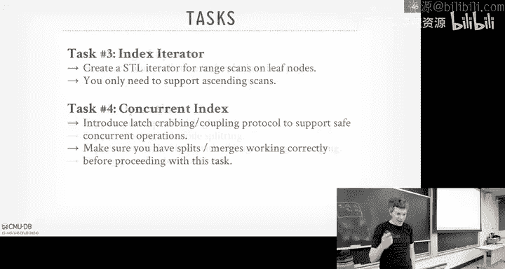

# CMU《数据库导论｜Intro to Database Systems (15-445645 - Fall 2024)》中英字幕（deepseek翻译 - P11：#10 - Index Concurrency Control.zh_en - GPT中英字幕课程资源 - BV1Tys8eQELW

Yeah。🎼O a lot discuss this would be a really fun lecture can encourage yourself stuff。

 which I find super fascinating because it reallys can break your mind sometimes thinking about how you normally write programs and what's going on the inside and what the application you can see we'll talk about that today forever in the class again。

 Project one was due last night without naming names。

 but we were discussing this someone got the highest score we've ever gotten on the leader board this semester。

 so congrats to that person。Like normally 25000 Q P is what we normally see on the leaderboard。

 But someone got 15000， which you've never had before。 And then we just saw this on the。

 the nonsia one， the fastest ever seen for somebody who've not Siia was 95000。😊，So 10。

00 is blowing everyone out of the water impressive All right。

 so homework threes out and that'll be due this Sunday， actually October 6， not September 6。

Is that even the right date， yeah？When does that really do should be next week， right？Yeah。

 whatever whatever this is wrong。 Go by the website。 Project 2 is out today。

 I don't think we pushed the code yet， but the right up is there。 you can start looking at that。

 and I'll discuss this into this class。 and announce the recitation for next week。

 And I'm gonna say this multiple times throughout for the next three weeks。 Project 2 is much。

 much harder than Project 1。 So there was a bunch of people that waited the last minute to do project 1。

 And yeah， you got it in good， you're not gonna be able to pull that same stunt off this time。 Okay。

 so you should be doing Project2 immediately。 soon as the code comes out。

 start looking at it and start writing it immediately。 It will be much， much harder。

 much more difficult。😊，And you're not going to get by running printf statements to try to debug things anymore。

 you have to really use a debugger。😡，The midterm exam will be again in class on Wednesday。

 October 9th， again in this room， and then we'll announce this and post the study guide later this week。

 okay？I's say also too quick about Project1， there was a couple of people that used either chatt TBT or found some Rado's implementation on GitHub。

 and we changed the semantics of the Buffpo this year from previous years as they kept breaking a bunch of tests and not knowing why they were failing because again things have slightly changed from year to year so I advise you again don't do that。

 you're making your life harder。All right and then for some database talks that coming up today again at 430 we have actually the creator data fusion is going to talk about something they built at Apple called data fusion Comet。

 it'll be a spark accelerator for or sc for Spar basically sparks it in Java。

 it's row based it's slow we'll talk about next class what it means to be vector based and then so when you're running your Sp query。

 it can drop down into data fusion and run that really quickly。😊。

Databricks has their own thing on photon。 That's proprietary It's not open source。

 This thing is open source。And then also tomorrow we're having a talk from one of the top people at Oracle talking about their JSON storage system and that'll be in Gates 8115。

 and that one there will be pizza。 and that's over to the public。

 And then next week we have parade Db， which is the version of Postgres where it drops down into data fusion and other toolkits or libraries to accelerate extratal queries。

 So it looks like Postgres on the outside but the inside is doing a lot more and these are all optional。

😊，Al right， so last class we talked about different data structures， right， Skipless。

 inverted indexes， vector indexes， Bfiters are filtering。 And when we talk about the B plus trees。

 or when we talk about the hasht table to talking about these other data structures。

 we made this huge assumption that the data structure we were talking about would be single thread。😊。

We did this to simplify the discussion。 so we did not worry about tripping over different threads。

 updating things at the same time。But obviously in a modern system。

 we need to support multiple workers， threads or processes we'll talk about later。

 but multiple workers running at the same time that want to make changes to our data structure。

 and we need to make sure that we don't break things。😡。

And so that's what today's class is really about is how we introduce safety mechanisms in our data structures so that we can take advantage of a modern CPU that has a lot of cores。

 or when one thread stalls because it has to get something from disk or over the network that we can allow other threads to keep running at the same time and hide those stalls。

Thatistal be less an issue for for the dash talking unless you have to get something from disk into the memory。

But the other mechanism we talk about transactions later on that that can hide these things as well。

 But it's really that these low level primitives how to make our， our。

 our data structures thread safe。Now I will say we're not going to talk about it。

 but there's a whole other category database systems that don't do any of the things that we're going to talk about today because there's an argument to be made that introducing the  latching protocols that well talk about just makes things slower and that you actually would be faster if you just allow things for run single threaded like only allow one thread to do one thing at a time and then you don't have to do latching。

😡，And that'll make things actually run fast as possible because you're basically running at bare metal speed。

So most famous one is probably Redis you might have heard that before。

 that's a single thread execution engine， single process， single thread。

 so only one query within the process can touch the data at a time and therefore you don't need any latches because。

😡，There won't be any conflicts。There's VolultDB， and Nick takes us to the extreme。

 that was based on a system I helped build called HDOR。

 there's another system called KDB out of this thing called KX， you've never heard a KDB。

 you probably never will see KDB unless you go to Wall Street this thing is everywhere。

And it doesn't use SQL， It has its own K programming language。 But again， the。

 the core engine itself is single threaded。 So it doesn't do a lot of these latching stuff。All right。

 so how are we going to make sure that our threads don't trip on each other when we're inside our data structure inside the system？

So this can be done through what is called a concurrentency to protocol。

You can think of this as like the traffic cop inside the database system that is responsible for determining what thread or what worker is allowed to read。

 what data at what time and in what way。😡，The idea is it's the thing we're going to use to protect a shared object or entity within our system to ensure correctness。

And I'm putting the word correct in quotes here because there's two notions of correctness we could care about。

Theres logical correctness would be， can my worker or can my thread see the things that it should be allowed to see while it's running？

Meaning like if I insert insert， you know key 5。If I do a read again。

 can I see well I see key5 or could have come back missing。

 Maybe someone like deleted it by the time I do my reads。

 That's a higher level concept of correctness that we'll cover after midterm。

 but you'll see why we'll make certain decisions today where we know that something else is going be responsible for maintaining this logical correctness and there's optimizations we can do to not slow things down。

The thing that we're going care about today is the physical correctness。

 meaning how do we make sure that the internal representation of our data structure is going to be sound or correct。

 meaning if I do a lookup in a B plus tree and I get a pointer to the next page。

 that pointer is going to take me somewhere real。😡。

Either a memory dress or a page that actually exists。

 which should be part of the V plus tree and not some random offset and not some random page with a bunch of garbage in it。

Because by the time I'd read it， I got the page mat， I read the pointer。

 then before I could follow that pointer， someone changes what the memory is pointing to underneath。

 and then now I land in no man's land and I Se fault。So that's the thing we care about today。

 how do we make sure that the data structure is correct when multiple threads are reading writing to it at the same time。

😡，So begin to begin we'll talk about what latches are， how you actually want to implement them。

 And there's gonna be a high level over you to understand what's going on underneath the covers with latching so that when we start using them as a system。

 we can understand the ramifications of protecting data structures with latches in one waiver versus another。

Then we'll see a really simple latching scheme for hash tables。

 which would be pretty trivial to understand because hash tables are by themselves pretty simple。

 but then we'll spend most of our time talking about B plus tree latching because that's what you need for Project 2。

 but also this is a more complicated scenario because you would have threads coming in different directions and split emerge mergers and the data structures is more dynamic than a hash table。

😊，And then we'll finish off talking about having leaf node scans， all the sibling pointers。

 and then we'll finish up talking about Project two。😊，Okay。😊，And like I said。

 I'm going to get very excited because to me this stuff is really cool。

 but can we just slow down if I go too fast？😊，All right。

 so we talked about this in the semester and we talked about this notion of between locks versus latches。

 and this is sort of like this conflicting， what we in the database world think about the semantics or how to describe certain concepts in systems and what everyone else。

 the operating system world people， how they're describing things and we're correct and they're wrong。

 at least within the database system。😊，So there's a notion between a lock and a latch。

 and a lock is going to be used to protect transactions from each other。

 and latches are going to use to protect workers， meaning processes or threads。

 like low level things running in the system。So a lock is going to be held for the duration of a transaction。

 I haven't to defined what a transaction is， but think of like running multiple queries at the same time。

 and I want them to be atomic。😡，And they're going to be protecting the logical contents of the database。

 a table， a database itself， a single tuple。😡，And then the database system is going to have mechanisms inside that it's going to implement in its concurial protocol that it's going to allow it to detect when there's conflicts。

 when there's deadlocks or other problems， and can automatically roll back changes to make sure that we don't have partial rights or torn updates。

😡，This is what sort of handling the unwashed masses， like the JavaScript program。

 sending us crappy queries or whatever， and we needed to handle that in our system。

The thing we care about today is the latching， and again this is where we have these primitives that allow us to protect critical sections of our data structures。

 of our internals of our system。😡，That。Are going to be affected or touched by other working workers that we've implementeded in our system running at the same time。

😡，So the critical sections for the the lashes that're protect are going to be really small relative to what locks are going to protect。

 Like thing of lock is like I'm going to protect a twople through multiple round trips between the application and the database server back and forth that could be。

Typically milliseconds， but can order in seconds， worst case scenario order hours， days。

The old days kind of queries， you know， run for hours and days， unless it's more rare now， but。

But in this， this world， it's like a low level like， I'm going to jump into a page。

 do something to jump out right away， almost like the pin stuff you did for the buff bowl。

And now the thing about the latchches is that there isn't going to be a high levelve traffic cop in our system that we're going to implement。

 that's going to be responsible for deciding who gets to read what at what time and how to deal with deadlocks。

😡，It'sOnly through us as the system programmers， it's our responsibility to make sure that we don't do something stupid。

Either said than done， we'll talk about how to handle some things later on。

 but there isn't going to be something to bail us out in the way we'll have for locks and transactions。

😡，There won't be a deadlockx detection algorithm running in the background。

Another way to think about it is this nice table from the guy this guy Gritz Grafy， again。

 the famous data researcher， he wrote that B plus Street book I mentioned last class。

 he's going to vent the volcano stuff we'll talk about next week。

 He's going to also invent a bunch of stuff with the pre optimizeizer we'll talk about later on。

 But in the B plus street book， he's got this nice table。

 he shows the distinction between locks and latches。

 And the way to read this is that sort start start from the top and go down and that sort of defines what this thing is actually doing。

😊，So in the case a latches， a latch is going be it's going to separate workers from each other that's going to protect the MMory data structures during during the operations of the critical section。

 We'll talk about modes in a second， but it's only going to have two modes in a latch read and write。

 right， exclusive， non exclusive。And then forlock handling deadlocks。

 it's through avoidance through code or discipline。

 making sure that we don't write bad code that could put us into a deadlock。

 and then we're going to maintain these lashtes inside our data structure。Again。

 there isn't gonna be a separate lock table。 There is like in case of transaction locks。

 it's going to be in in the pages themselves Our data structure is where we keep track of what lashes are set or not set。

Locks on the other hand again we'll cover this at the midterm。

 but again these are for protecting transactions from each other， there's a lot more modes。

 shared exclusive update， intention locks， we'll cover these later on。

 but again and there'll be some higher level mechanism that can protect ourselves from deadlocks and handle things deciding what thread to kill to break a deadlock whereas in our case in lashes we won't have that。

Al right， so latches can only have latch are going to have basic two modes。

 read mode and write mode pretty much as you'd expect right so in read mode。

 you can have multiple threads， read the same object at the same time。

 and if the latch that you want to acquire is already in read mode and you want to acquire in read mode。

 then you can go ahead and acquire it as well。😊，basically I have a simple counter that says how many lashes hold this thing in read mode？

Rightite mode is a synonym for exclusive mode， basically saying that there's some thread that can only have the latch in right mode at a time and any other latch acquisition requests are incompatible and therefore it will have to wait。

So basically read latch requests are compatible out with read latches。

Ltches that are held in read mode and write Latch requests are incompatible with everything else。

So now if you actually want to start implementing lates。😡。

There are some things we're going to care about in the context of databases。😊，Because again。

 these latches are going to be in lined in our data structure itself。

 we obviously want them to have a small memory footprint。😡。

And we don't want to store a kilobyte of data just for the latch because we could be said storing that for the data itself。

 because that's going to begin， have to sit in somewhere in memory。And then  latches aren't going。

 even though we could store the latch itself in the page like within the frame of the buffer pool。

 we don't care about when it gets written out the disk because' you wouldn't hold a  lach or something that's going to get swapped out because then the time that  latch becomes too long causes problems。

We want to have a fast exrusion path when there's no contention in the latch。

 which would be that compates in those scenarios most of the times they're going to go request a latch and it's going to be available so you go ahead and inquire it and so you want that operation to be fast as possible。

We can't want the management of the latches to be decentralized。

 again there isn't going to be a higher level table that's keeping track of what latches are being held by what workers。

 everything has to be done in line。And then lastly。

 we want to avoid expensive system calls because anytime we have talk to the OS or go down to the OS。

 that's just going to make things so much harder or so much slower for us。😡，And again。

 because we're database people， we don't want to rely on operating system primitives in a real system。

To do any of this。The operating the people say the opposite。😡。

Right so there's this famous post from Linus from a few years ago talking about the pros and cons of spinbox。

 which we'll talk about in a second。 and he's got Linus has this big blurb right。

 Do not use spinbox in user space unless you actually know what you're doing and be aware that the likelihood you know what you're doing is actually basically new right So again。

 that's for the unwashed masses。 if you're actually someone responsible for actually building a database system。

😊，Like， we know what we're doing。 and he's actually wrong。So let's see how we can do better。

So I'm gonna to talk about basically three basic concepts that we can build they're going to build one from on top of the other。

 and we're gonna end building essentially what is a reader writer lock。 Now。

 what I'll describe it has how to do it in the context of P threads or in the standard template library。

 But in a real system， you wouldn't rely again on P threads or OS OS level primitives。

 But for simplicity， I'm just going to show it in those terms。

The are more advanced im that we're not going to cover in this class we cover in the advanced class are adapt to spinlocks from Apple。

 the Q based spinlock from MCS locks。 And then there's this thing optimistic lock coupling that's used in some of the German systems that basically has viin information when when you acquire latches。

😊，I would say at this point， I haven't looked in a while like what is the best  laching limitation you should use。

 I mean， Postgres has its own thing， like a lot of the atmosphere systems have their own implementations that are。

Pretty primitive compared to the modern things you can do。 And then obviously。

 the commercial systems or closed source。 So you can't see what they are。 I mean。

 lot of commercial systems， they have to be also portable right So like the P thread implementation on like3BSD might be is definitely different than what's on Linux。

 And so they don't want to rely on the O S providing these primitives and therefore they ship their own。

 So that way， the semantics and expected behavior will be mostly the same from one system to the next。

But just to highlight again how what extra things you can do。

 So this is a blog from almost 10 years ago，8 years ago from from Apple talking about their locking mechanism called parking lot。

 which again， as far as I know， this is the best one that's still open source today。

 And so they have this little blur here that's talking about how if you rely on P3 Mut。

 their implementation is 64 times smaller and 180 times faster than what provides you。 And again。

 that's like that's like a hardcore like tight loop benchmark， micro benchmarkch。

 But when they say we actually run it compared to other things。

 in sort of more full workloads about 10 to 5% faster。😊，And just replacing the latum miation。

 you can get a pretty significant improvement。All right。

 so let's look at the those basics stch you can implement， the test and sets spinlash or spin lock。

 right？And so the way this basically works is that it's you just some flag or some， some variable as。

 as what as the latch。 So here I'm using syntctic sugar in C plus plus to say atomic flag and define my latch。

 And this just again， a synonym for。😊，Defining an atomic bullolean。 And so this is gonna create a。

 you know，8 bit value that I can set call a test and set on。 And so now if I want to acquire a latch。

 I just have something like this where I find a lat that I want to acquire。

 And then I have a while it and says， keep trying to to test and see whether it's false。

 And then if it's false， set it to true。 And then if you're able to do that， return true。

Should we actually wild test and let。 Yeah， if if you can set it。Actually。

 this returns to it should just be a not here， right。

 So try to try to get it if you can't set it to spin and keep trying over and over again。

 So this's why it's called it spin。 like you just basically spinning over and over again until you can acquire the the lock that you want。

the latch that you want。So this is obviously not scalable because what are you doing here。

 if I can't get the latch， I'm just burning CPU cycles trying to set it over and over again。嗯。

So you can inside this wild loop， you can be a bit more clever。 You can say， well， I've tried。

 you know， a million times。 Let me stop and break out return back an error。

 which we'll talk about how to handle that in a second。 or I could yield my thread and say， well。

 I can't get this now。 Let me sleep for a little bit。 then， then try again。

But even if you do all those things， this is not gonna to be very friendly for modern CPU。

 especially if you're running on a multi socket system， because now。

 depending where the latch is located， you might be going over and interconnect between the sockets。

 trying to update things over and over again or check things over and over again。

So we're not gonna talk about like p numa architectures in this class。

 but say you have a two socket and CPU and the latches over here on this side。 So this。

 if you have a thread over here running on this socket and once acquire the latch， it's calling this。

 test and set over over the interconnect to try to get this value。 And that's gonna be it's much。

 much slower to go through that interconect versus like running in local memory。

 Does everybody know what Nuumma is。😊，Non uniform memory access。 Okay。

 so P Nuumma is this thing where。I think a multi socket CPU where every socket has its own local Dra that you can access really。

 really fast。 But there there's other sockets， you can also access their D Ram。

 But now you're going over this interconnect， which I thing is like2 X slower than your local D Ram。

 And so Intel does all these tricks to hide that the location of memory from you so that you don't have to worry about that。

 know， where is it actually located。 So looks like giant uniform memory access。

 even though the speed from one address might be different than another address。

You can get actually information about where the memory is located。 So you can be clever about like。

 okay， why I'm only gonna to access data that I know this local I D ramp。

So I'm trying to say is is theres， there's some inter between these two。

 So for me to go access this D Ram， that's too X slower than the guy trying to go get it locally。

And so that sucks becauseuse now there's all this traffic on the interconnect。 again， think of like。

 you know， two machines running in different data centers， right。

 It's not the same because we're talking about， you know。You know， nanoseconds。

 but still it adds up you're trying to spin this you get this thing over and over again。Alright。

 does everyone know how this Te set works or comparing and swap in hardware。Alright。

 so modern hardware， modern CPU provide you these atomic instructions called test static compare and swap。

 right， They're they're basically the same thing where。😊。

You can give you have an instruction where you can give it a memory address and a value you expect to be in that address。

 And then with then that single instruction， it then checks to see what that value is what you expect。

 And if it is， then you can go ahead and set it to your new value。

And you can do this again anomically， meaning like。

 you know that somebody else isn't gonna come in between the time you check and then you set it and try to try to write to it before you can。

Right， so this is， this is the built in intrinsic。 I think this is GCC， right， S compare swap。

 So any time you see like a double underscore and in encounter code in C plus plus or C。

 it'ss called an intrinsic thing of like， it's just an a as to the underlying instruction of the hardware provides to do exactly this。

 So even though instead of writing the assembly you would use using in intrinsic。😊，Right。

 so in this case here， I have the address， the compare value and the new value。 So when this runs。

 it takes that memory address， looks to see what you know， finds where it is。

 check to see whether the value is， is that's in there is what you expect it to be。 And if it is。

 then again within within a single atomic operation， you can go ahead and set it。😊。

So I think Intel added this in X 86 and the 90s Ar has their own version of this。

 You typically don't want to write intrinsics because it makes the code less portable。

 Like if you land X 86 versus arm。 But， if you know your own hardware， then you should be okay。

So the atomics came out in sequence plus 11 and there's this great blog article from the guy that I think he runs the standards committee that talks about what the。

 the memory model semantics of this are。 But for purposes today， we just need to know like。

 I think I want a single atomic operation to set test some value。 And， if it's correct。

 then I go ahead and set it with what I want。 meaningan I know I've acquired a latch。😊。

so that was the test set。 That's the most basic one。 But in my example， there。

 it was a single Boolean value， meaning there wasn't different read write modes for that lash。

 which is like， do I have the lash or not。So if you want to do something that's more complicated。

 you can rely on start using O S primitives like the O S blocking mut text。So this is what you get。

 if you call a stand utex， right， So you can state stand in Utex M。

 And then it has the lock and unlock operation。Right right。

So everybody know what you get when you call standard Mutex。

 what does the compiler actually give you？😡，PF text。What are the PframeM matrix。

 how's that implemented？At least in Linux。Was that。Few text， exactly， what is the fewt？😊。

It doesn't actually do a lot if there's only like one thread or if there's no contention。

 what is Pt stand for？Fast user fast user mutt。 And so his point， yes。

 like keep describinging correctly。 So the way basically saying it works is that it's our spin latch that we had in the last last slide or two slides ago where that thing sits in user space。

 And the idea is that you don't want to go down to the O to try to acquire a heavyweight Ut。

 you try to acquire the one in user space because remember I said making system calls is very expensive because there's。

😊，The security permissions that has to do with the hardware， that you get the copy contexts。

 it sucks， we never want to do that。So if I now have two threads to try to acquire this latch。

 they both first try to acquire the user space latch。 If one of them gets it。

 then they had the latch， the other guy has to go den now down to the OS and acquire lock essentially a conditional variable or muttex down there。

😡，And it waits until the other guy releases it。So I've said before， you。

 just now why system calls are expensive， but now going down into the to the schedule for the OS。

 that's even worse because how does how does Linux maintain the list of what threads to schedule or processes of schedule。

It's got its own hash table。How is it protecting that？It's got its own latches， right？

 So now you're taking latches down into this， this， this data structure to say， hey。

 I can't acquire this latch right now， but， you know， wake me up or， you know。

 schedule me when it becomes available。So now what should have been a single latch is multiple latches because I have to go tell the OS I can't be scheduled。

😡，So that's terrible。 And We never want to do that。So the and again， but this is example here。

 it's still a single reader writer mode。 If you want to support reader writer latches。

 there's more complicated examples， but at least in bustub we're using the S。

 the standard ladder shared mut text， But know， any other system。

 any other system would roll their own。 again， relying on those the spin latches as basic primitives。

 And then what they do after that， whether they have a queue and keep track of things that depends on the implementation。

😊，So if you call a standard standard shared muttex， which you get is a P thread rewrite lock。

 which is actually a combination of some conditional variables and then another P thread Mu text T。

 which again is just a few text。So the basic idea is that in user space。

 we would have a counter that keeps track of how many how many workers hold the latch in readwrite mode or different modes。

 and then how many threads are waiting for for this。Again， if you rely on the O S。

 the O S is gonna to keep track of this for you down down in with the conditional barrels down in the scheduler。

 but we want to do all the， all this in user space。

So now a thread comes along and once acquire the latch in read mode。

 we check to see whether anybody holds it in write mode or read mode and they don't。

 so we can go ahead and give it in read mode and we increment our counter by one。😊。

Another thread comes along was to also get in read mode。 again， it's already in read mode。

 so we can go ahead and give it the latch and crement the counter。

 let's say now another thread comes along was to get it in write mode。

 it has to block and wait because the latch is being held in read mode。 So we we would deschedule it。

 put it in some kind of queue where we keep track of where it is。 And then now。

 depending on our scheduling policy。 if any other thread comes along and says I also want this now latch in read mode And so even though I could potentially get it because it is going to be held in read mode because I have one right or waiting。

 it's gonna block and then have to sleep。😊，Right again。

 some additional metadata or queues are keeping track of who's waiting for what and how long they you've been waiting and other things。

 It depends on the sophistication It depends on， you know。

 what data structure you want to use this in。 So if your critical section is really very short。

 you probably maybe don't want to use something that's very heavy weight。

Versus if the cr section might be a little bit longer。

 maybe a couple microiseconds or even a millisecond。

Then then this heavyweight stuff might actually make sense。But， yes。So question is。

 why do you want the third reader block for fairness， because otherwise if readers keep showing up。

 I'll never put it in right mode。😡，So that's a really simple scheduling policy you could do for this。

 soon as someone shows up and that's a writer， the writer gets higher priority。Okay。Okay，'s again。

The different systems will do different things， but these are the basic commitmentmins we need to do the more complicated latching we need for in in our data structures。

So let's start off with the easy case， hash tables。So we'll ignore the， the。

 the extendable hashing and the linear hashing， which you could resize things。

 but the basic ideas are applicable to them that we'll talk about。

So one of the advantage we're going to have in a hash table is that。

Deadlocks are not going to be possible， because。All the threads are going to move in the exact same direction。

😡，Meaning they're going to do some hash land in our data structure。

 assuming some linear probing that's a giant array of slots。

And then when they have to scan to find the matching key that they want。

 they're just scanning from the top down。And so as they go along。

 they can release lashtes behind it to free things up and acquire new ones going forward。

 But they know that nobody else is trying to acquire the latch that they need， you know。

 if they need a latch， we need a latch and the person who holds the latch we need holds the latch is's waiting for our latch。

 we know there can't be a deadlock。Because everyone's always going in the same direction。Now。

 to size the table doesn't more complicated， the most basic way to handle this is that you would have some page at the top。

 like the header of the hash table， and you just put a global right latch in that thing。

And anytime that you need to read it， you just set it in read mode， that's fine。

 Anytime you need to resize it， you set it in write mode。 and then that locks the whole hash table。

 and you go ahead and double the size and rehash things。But we can ignore that。

So the big question now， if we want to do hash table latching is what granularity we want the granularity of the latches we want to have in our data structure because that's going to determine how much parallelism we'll be able to achieve。

 But again， be classic computer science trade off between computer versus storage。

We could have a single latch of the entire data structure。

 the amount of space it takes to store that single latch is small。

 but then that makes our hasht will basically single thread it。

Or we could have latches for every single individual slot that will increase the amount of parallelsism we have。

 but again， now we have to store that latch。😡，In our data structure， in every single blocker page。

That's the basic two choices we have。So you can have it either latches at the page of the block or the latches within each of slot。

So let's see what that looks like。 So say we do either the page or blocklashtes。

 So a thread T1 comes along。 They want to find D。 So the first thing we do is hash D and say we land into this block here。

 So I'll just take a read latch on the entire block。😊。

And so that implicitly locks these slots here within within my page or my block。Then I can use the。

 again， the linear probe scanning go try to find the， the， the record we want， right。

And then in the meantime， another F shows up and they want to insert E。 So when it it hashes it。

 it wants to insert it into this record here。Right， but now we want to take this latch and we want。

 take this block in， in write mode。 But that's incompatable with the latch that's being done in read mode。

 So this thread has to stall。Because we don't know what you。

 we don't know what this thread' is actually trying to do other than it's just trying to read things。

RightWe don't know there there could have been a free slot where it could inserted something and not interfere with the。

 the， the other thing that's reading inside of it。All right。

 so then now T1 keeps scanning through the page， and then when it's done， it jumps down here。

It can go ahead and release the latch on the first page。

 even before it jumps to the second page down here， because it's not dynamic。

 we know that these things have to be read in order right from top to the bottom。

 so we can go ahead and release this latch， even before we require the latch on this one here。

Because we know that someone isn't going to try to insert a new page inside here while we're going into it。

So we're not going to to be able to do this when we talk about B plus trees。

 we have to hold on the latch where we're currently at before we jump to the next page or the next node and acquire that latch because we don't know whether someone's going to start reorganizing things and swap out where we actually should be going to。

😡，So this is one of the key difference between hashables and B plus trees。Alright， so then now again。

 it gets the read latch can do a read here。 The T2 can can then acquire the the right latch on this page。

 go ahead and do its insert， but can't find a free slot。 It has to go down here。 Again。

 wants to get this thing in right mode， but it can't because this guy's here waste it back。

 I release it。 Then it gets the right latch and then go ahead and keep scanning and do the insert。😊。

Right。Slot latches are basically the same thing， but again more fine grain。 So I come here now。

 and I I don't quite that lach on the page。 I quite that latch on the value or of the slot。

I'm trying to find the thing I'm looking for。 This guy jumps down here ahead of me。

 gets the right latch。So now when this guy scans down and tries to do the relatch on the next on the next slot。

 it has to block and wait。 It actually could could release the latch bh， blah。 I didn't show that。

 Yeah， there it is。 So then then this guy keeps scanning， going down。

 This guy has to gonna to keep blocking。I this guy does his insert。

And then the guide down below can get find as read。Right。P straightforward for it。

And so an extendable hashing or linear probe hashing or sorry， linear hashing。😊。

You basically want to do page level latches， and then you have a sort of separate latch for controlling the split pointer and that that sort extra metadata would have in front of the hash table。

Let's talk about B plusries， Ca that's more complicated and more fun。😊，So again。

 we want to allow multiple threads to access our data structure at the same time。

 and we want to avoid two specific situations。And they're obviously going be related just split emerge mergers because that's when。

The data structure itself is reorganizing， and therefore the pointers may end up being invalid if we come in at a bad time。

Right。So let's look at an example here。So say we now we have T1。

 wants to delete 44 down here at the bottom。So it's， it's scanning down follows the， the the。

 the guypost to figure out when they gonna to go left and right。 We get down here。 We find 44。

 We go ahead and and， and， and， and， and delete it。Right， but now in this case， this node I。

 the leaf node I is is less than half full。 So we're gonna have to rebalance。

 We're gonna move a steel from sibling。So we're going to move 41 over。

Let's say now before we can do that move over。We get descheduled for whatever reason the OSSI and desched this threat or whatever the system scheduler。

 whatever our threat is paused。But then now T2 shows up and they want to find 41。So the same thing。

 they started the root， they start scanning down the bottom， tells them to go down this way。

 and then now at this point they're at node D， they look at the inner nodes keys and they say。

 oh I want to follow define 41 between 38 and 44， so I want to go down to node H。

 but then it is key scheduled。T1 wakes up， it goes ahead and moves 41 over， and it's done。

That's fine。But then now T2 wakes up， it follows that pointer which was valid on the last on the last slide or when it last looked at the node D。

 it gets down to H， and it gets a false negative。Right， it completely missed the， the。

The key that should have been there because someone moved it while it was running。So this is。

 you know， obviously， dly point is bad。 But this is another example we would have， you know。

 correctness issues。Physical quickness issues with their data structure。Because again。

 there's no global status about telling other threads what we're doing down inside our data structure。

 We can only observe what the node that we're connected is looking at。So we' gonna。

 way we're gonna handle this is through a consial protocol called latch crbbing or latch coupling。

 I think the textbook calls it latch coupling Wikipedia calls it latch coupling。😊。

The basic idea here is that we want a way to allow specify how we want our threads to acquire latches as they're going down in such a way that we can ensure that。

Something is in the get moved down below us and invalidate the， the。

 the information we've gathered on our way down into the data structure。

And the way this is going to work is that we'll get a latch for whatever parent we're looking at。

 hold that， figure out where we need to go next， then get the latch for the child node the one below so where we need to go。

And then when we get to that child node， if we know that it's considered safe。

Meaning we know that it won't split or merge based on the operation that we're doing。

 Then we can go ahead and release， release the lash on our parent。

And it's sort of called latch crbbcause it's like， like starts of walk like a crab as you go down。

 monkeykey bars might be another good example。 Like， I， you。

 before I could jump to the next monkey bar， I have to hold hold onto to the1。 I'm currently holding。

 swing over。 And then then I can let go the one behind。😊，Right。So for find。

 were basically say read latches all the way down just two before。

 And then because we're doing read operation， it's always safe for us to unlashtch the parent。

 It's for the inserts and deletes。 That's where we have to check whether once we latch our child we're jumping into if it's safe。

 then we can go ahead and release all the latches on our ancestors on our parent above because we may。

 in some cases， have to hold the latch for the root until we reach down far enough。

 we know things are safe。😊，rightSo let's say T1 wants to find 38 Again， start out the route。

 I get the root in read latch mode， jump down to B， get that in read latch mode。 And this point here。

 I'm on B。 I there's nothing。 there's no information about A that I need to get down further down because it's only where to go next。

 So it's safe for me to go ahead and release the  lat on A because I'm obviously doing a read operation。

Get down to D， Sam thing。 release the latch on B。 get down to H down here， release the lach on D。

 and then I do my read， and I'm done。Right， that's pretty easy。Let's say now we complete 38。Again。

WeWe get the right latch on A， get down to B， get the right latch on that。 Now， again。

 we're doing a delete。 So at this point， as we hold the right latch on B。

 we don't know what's going to happen below us in our data structure。

 We don't know whether the leaf node is going to have to do a merge。 And therefore。

 that could cause sort ofverberate a chain reaction up the tree that would cause us have to do to merge B with something else。

So because of this， we can't release the la on A because we don't know whether we did update A because we did emerge。

But then when we get down to D at this point here， we recognize， okay， well， my simple example here。

 I have two cute keys。 But at this point， I know that no matter what， if I delete below me in D。

 I know that I'm not if I have to do a merge down below。

 I can easily I can accommodate deleting one key in D。

 So therefore I'm never going have to do any modifications to B and A above me。So at this point here。

 we know that B is not going to merge， so therefore， we can release the latches on on B And A。

In what order should I release the lashtes on B And A or A And B in this example。With with that。

He said first B， then A， why？Just the opposite of。You said the opposite order you required them， Yes。

 So if you release a before B， then someone wants to acquire A， then acquire B have B， they have a。

So she said， you have to release B before A because you're worried about deadlocks。S。So。

Dlocks can't happen in this example here， because。Everyone's gonna be starting from A， right。

 So get they get the less on A before you can get thelash from B。

So there isn't a situation where someone would hold B and not A in this example here。

So from a correctness standpoint， both are correct。

 Like you can go top down from bottom up or top down or bottom up。But for performance reasons。

 you actually want to go top down。Because again， the way to think about this is。

The latron A implicitly has right lat on， everything down below。Right， so no one。

 even if someone wants come around on this side and do a read。

 they can't do that because I hold the latch on a。 So I'm gonna to release the sort of the most encompassing latch first。

In that case it would be the root， and that could allow other threads to go down on this side here and not get blocked on me holding that latch。

So you always want to lease the lasts on the top going down。

Because that that maximize increases the amount of parallelism。But both are still correct， yes。

Can you explain why we know that？So he says the reason why I be， his question is why。

 why do we know this that D will not merge with C， So at this point here， I have two keys， right。

 So I get down here。 So no matter what happens below me。Right。

If I have to delete one of these guys down here and delete one of my guidepost keys。

 I can absorb that that update and not have to go update my parent。Right。Yes。

 so will this strategy be considered a potential dead by threat by threat question。

 would this be considered a a deadlock by， by like the LL VMs threat enter or Google threat enter。

Don't think so。Why would it？We can take it off。 it shouldn't。嗯。

They always taught me that we should just acquire a or we should just reverse the order of this。

Other to protect whether we。I would double check take this off online I double check in Project2， we。

 we tweak the threat sanitizer or give it permit， like to try to avoid like false false positives。

But it shouldn' be an issue。Again， the O S told you what。

 you released them in the order that you acquired them。你 reverseされる。So if we told you this。

 if or just OS classes？But then wrong。Right， like。Whi should be pretty obvious， right。

 You want to release a because that that unlocked implicitly all the other side of the tree。

Yeah the wrong。I don't know how told you that， it's wrong。Okay。All， so again we get down here。

 then we get down to this guy on H， and again I know I have to delete one of the key41。

 I can this node H can absorb that right， I go ahead and release a lash on D。

 go ahead and do my delete and then I'm done I'm sorry delete key 38。Inserts can work the same way。

 So I want to insert 38。Sorry， it third，45。That's down here。Right， so I， I scan scan down。

 take the right latch on， on A， take the right latch on B。And again， at this point here。

 I know that if I had to do a split and another key is gonna percolate up from the bottom of the tree into B。

 I have space to accommodate it。 So I can go ahead and release the the latch on A。

RightBecause I'm never got to modify。 Now I get down to D。 and it's the opposite。

 I don't know what's below me in in my， my leaf nodes。 So if a new key does come up。

 I'm gonna have to split D here。 So therefore， I can't release the latch on B。

 only when I get to the bottom。 now I see， okay， I'm not gonna have to split this node。

 So it's okay for me to release B and D。 And I release B followed by D。 Do my insert。 Then I'm done。

Okay， so let's see now if you insert key 25。So get same thing。 I get it right on A。

 I get the right right latch on B。 Get down here。 I can release release the right latch on A just like before。

 because I know that I'm never have to update it。 I get down to C。 Same thing here。 I know I。

 I would have room for it。 So therefore， I I can release the lashtch on B。

 But now when I get down to F， I see， okay， I am I gonna have to do a split。😊，Right。

 so in this case here， I take the right latch。 I maintain the right latch from C。 I insert。25。

 but then I got to create a new node。 these things just get split over visualizations。

 these pointers haven't changed on D and then leaf nodes。

 then I add the new leaf node for J and I put the new guidepost key into C and point to there。😊。

Do I have to take the latch on leaf node J that it is added？To update this， yeah， So yeah， maam。

Or sibling on F。 or if if youre going in the reverse direction， if you a the G， potentially yes。

 we can ignore that。But basically， no， because， again， I have right latch on this node here。

 Nobody can read this thing until I release my right latch。 So implicitly， I also have J in， in。

 with a right latch。 So therefore， it's safe for me just， to do do my update there。😊。

And then once I have it， once it's all done， then I'll go ahead and and release the latches。

One a reason why we don't want to emerge those in the same level， but some。question。

 is this the same reason why we don't want to merge nulls from the same level what we need from different like J and G。

Your question is， why don't we want to do what， sorry， sorry？Like。

 why don we So we're going back here， I't， I can't steal from these guys， right，Allright， I sorry。

 I'm doing insert。 So there's no place for me to put anything。 I got， I got to make a new node。

 right， So it goes there。 I'm missing a silly point I it would go there， too。

Let's tell how to let's about how to take the latch going this way in a few more slides。 But you。

 you would take the lach on this because， again， you're not updating its parent。

 You're just updating what this， the sibling pointer is。So I， I get a right latch on this guy。

 update the assembly point and point it back to my new one。Let's talk about few more slides。Okay。

So in all my examples， what's the very first thing I did Any time I updated the the data structure。

 B plus3。See take a right latch on the root。Right， and this basically is gonna limit the amount of parallelism we can achieve because。

It's basically， it's putting our data structure in like a single threaded mode。RightBecause again。

 nobody else can take a even a read latch on the route if I'm holding it in right latch mode。

So a better approach is to basically do this optimistic lot coupling。It's。

 I think's not the algorithms called the bear Schlolatneck algorithm because it're written by this guy。

 Baron Schlottenck bearer was the guy that that invented the B plus tree at Boeing with the other guy from CMU back in the 70s。

 I think this paper from like 77 to 79。 and， and they're gonna make this observation that well。

 most of the times the， the。The the root node is gonna be safe from any split emerges。Sim。

 you have the really high fan out'm showing my examples with two keys per node。

 thinking like hundreds of keys per node。So the likelihood within any insert of deletete operation that I'm gonna have to。

You know， update the route is very， very low。So I'm going to assume that split mergers are rare。

 and therefore I'm going to take read latches all the way down to the data structure until I get to my leaf node。

 then I take it in right mode。😡，Because most of the times， that's gonna to be good enough。

 And if I'm wrong， then I just repeat it again and， you know， take the pessimistic right lockdown。

 right latches all the way down。So we're gonna see this technique later on when transactions because there's a whole protocol called optimistic Kgy control that was embedded here at CMU。

 where basically， again， I'm gonna assume that conflicts are gonna be rare。 And therefore。

 I take the fast path of。Of you know， taking lashes or locks in a more permissive mode。

And then just double check at the end。 Was that， was that assumption correct or not and。

 and fix myself， if need be。Intel used to have this actually in the Harvard X86 in the 2010s。

 there's thing called TSX transactional memory， and it did basically same you could declare a block of C plus code or C code as being transactional and it would run it。

 then when you finish that transactional piece of code。

 it would then check to see whether any invaris were violated。

 and then if not youre just run just fine kept running if it did violated。

 then it would roll back and run in a more sort of single thread of mode。

That was invented by a professor that used to be here at CM Maurice Hurley。

 He also been in linearability， which we'll cover later on。

 I think then Intel found a bug in it and they turned it off。 And I， I don't think it's still。

 still turned off as far as they know。 But this is actually， this basic idea was using hardware。

 which is pretty cool。😊，All right， so with this better latching algorithm what we're to do is if it's a read operation。

 a find operation， we same as before to take readlatches all the way down and then releasing the parent once we land on our child node。

😡，If it's an inserted delete or to set the latches in read mode as if we were doing a read or find operation。

😡，Then when we get to right above the leaf node， we take the the leaf node in right mode。

And then we check to see whether rental split merge if we don't， then we're fine。

 we just do our up and we're done， if we do do a split merge， then we just ab operation。

 come back and try again。😡，So I'm going back here， deleting 38 down here to the bottom I take the thread goes down。

 takes readlatch， soon as it lands on the child on B， it releases to the latch on A， gets down to D。

 takes that in read mode， that's fine， releases it latch on B， gets down to H。

take release thelash on D。 And at this point here， we know that our guests turn out to be correct because we're deleting a key。

 We're still gonna be more than half full。 So therefore we're not gonna to do have to do merge。

 So therefore， we can do our delete。And not worry about rebalancing anything。Right。

So this is a huge win for us because now we're not pessimistic blocking things from coming down to the tree if they're reading other parts of the branches as they're going down because we only took the right mode latch for just one node at the bottom。

Same thing if we're doing insert， right， Take relatch here。 That's fine。 relatch here。 That's fine。

 reslashttion A， get down to C， right， get down to F。 Now we recognize， okay he。

 we are all gonna have to do a split。 So therefore。

 what just restart our execution and take right latches on the way down。😊。

And obviously you could be a bit clever and say， okay， well。

 maybe I'll keep track of like what was the last， you could say what was the last node where I could have been unsafe and therefore take relatches up to that。

😡，You could do that。 that's maintaining additional metadata。

 which could just be slow and then just blindly restarting and starting over again。Okay。

So most systems are going to implement some some variant of of this algorithm here。

 and and we'll see this idea of like opt doing something。

 the fast path and then rolling back if you get it wrong。

 We'll see this in other parts of the system as well。Allright， so。The。

 all the physics examples we've shown now before so far and our B plustry have been going in again。

 this top down manner。RightIn this case， there wasn't it。

 There couldn't be any deadlocks because everyone starting from the top and going down and only acquiring lashes in that order。

But as we said， last class， we're going to have these sibling pointers that can now allow threads to at least along the leaf node。

 go left and right。 In the case of the B link tree， they have。

 they have sibling pointers within the inner nodes。 but we we can ignore that for now。

I could show you how to handle that later on if you're curious。

Now we could have deadlocks because now we have threats coming in different directions and need acquire latches if the other guy holds。

So really same example here。 we have t1 wants to find all the key is greater than4。 So you start A。

 get the relatch on this node， get down to C。 and now we're doing an the sending scan。

 So now we need to go in this order。 and we're not gonna to release the latch on C until we get thetch on B because we need to know that the pointer we're pointing to is still correctly。

 This is the right node we should be looking at。 someone doesn't swap it from why we're trying to get over。

 So then then we get over to B then go ahead and release the latch latch on C。😊。

That's straightforward。If we have another fed running the same time and wants to scan in different directions。

 so T1 wants to get all the keys greater than1， T2 wants to get all the keys less than4。

 so they can both get the root node in a relatch mode。

 then they get two leaf nodes B and C in relatch modes accordingly and then now as they want to scan across because these  latches are compatible with each other they're allowed to acquire the opposite nodes in the relatch mode。

😊，And then they just swap over。That's fine， that's easy。So now if we acquire。

 have one of them do an update。T1 wants to delete4 and T 2 wants final。

 the key is greater than greater than than one。 So let's say that this guy gets in there first。

 He gets the read latch。 So he， he gets down below and say again。

 we're doing that optimistic lot coupling where he get the T1 got the A in read mode。

 gets down to C and wants to do delete， recognizes that it can absorb the right。

 or he can absorb the delete without merging。 So it just gets C in right latch mode。😊。

But now B once again， scan across and start looking at all the keys in， in node， Sorry。

 T1 once scan across and looking all the keys in， in， in leaf node C。

But it can't acquire the latch because the other thread is holding that leaf node in right mode。

Right。So the question is what should it do？Just three choices。One is。It could wait。

Two is it could kill itself。Aborid the operation。 and you're shaking head。 No。

 A its operation to come back and retry， right， hoping that the next time you come around。

 the la will be available。And the alternative is， you try to kill the other guy。Take their latch。

 take their wallet， and do whatever you want to do。Pochtion is the right choice。I， wait。

 originate if say， wait。Raise your hand and you say， kill yourself。 I'm sorry。 Yeah， cure yourself。

And raise names to say， kill the other threat。Why， how would you kill the other thread。

Why would you want to do it and how， how would you do it。Then the other thread would have to start。

Yeah， but how would you do it？一。You need access。The lat you mean？But like。

 what did that mean access to the latch。Yeah。So like his suggestion was。

Or what if I just reset the  lach。 And then so that that way I can take it。 Okay， that's fine。

 But how do you tell the other thread that they don't have the  latch anymore。

You could have a little global flag that says， okay， kill yourself。

But you don't know when they're going to check that。Sick， well， that's that takes on everything。

 yeah。But hes close you could， you could send a signal， right， But for how do you。

 how do you handle that， you interrupt handler。Now you're going to put that sprinkle out in your code。

 and that's going to suck。Right， so this is not even really an option for us because we can't。

 we can't do it。if we could do it like check some flags。

 see whether to try I to kill myself now when you do that。

 you check every single time before you run a line of code。

 go check to see whether you should kill yourself， that would be possibly slow， right？😡，And we said。

 wait， a lot of， lot of you wrote for weight。How long。Pretty funny。He says pretty fine time。

 pretty fine timeout。 What did that mean。Maybe a week for。过航日。100 milliseconds。Sorry。

 just I don't know what the problem number。He says， wait for。have about a millisecond。

And and if we still can't get the of languages。He said， if you's okay get the latch。

 then you just retry。I'm going to kill yourself if you try。Is1 millisecond good enough。Yes。しの。For。

でかて。So didleting code with。his question is， say is， well。

 what if this case here at three wasn't here and I delete four， and now I have to do a merge。Right。

 I again， this is a toy example， but you would have had acquire the。I know。

 you could have done that because if this guy would have got the relashtch on this。

 Give out the relashtch above。 This guy who gets the right lashch on that holds the right  latch comes down here。

 So， yeah， you could still do that。 again， this first saying she said。

 just wait for how long he said 100 millisecons。 I got him down a millisecond。I'。So he says。

 wait until the other lecture released。 Okay， when will that happen。Does it matter？啊。Well， what if。

 what if they're again， assuming I have a billion keys and this on leaf node and it goes all the way over there。

's more leafhouse over here。Does this guy， this thread do what this thread is doing？😡，No。

So long doesn't know how long it's going to take。Yes。好。If sign just speak。Our question statement is。

 how is killing yourself better than waiting or this different from waiting， Because if I。

If I kill myself， I'm gonna come back and basically start waiting all over again。So， the。

So I mean I'll answer your question or statement。 Like the correct answer is gonna gonna be kill ourselves。

 but you could do a little bit of waiting。And they a little bit of waiting to depend on what you've done so far。

Meaning like， if I had to do a bunch of updates， this， I mean， this guy is read only。

 So it's not a big video。 And and the index is just stupidly small。 But if I did a bunch of updates。

 I got to hold the right latches for all， all the pages I are notes I modified。

So other threads may be blocked， waiting for me to release those lashtes。

And as soon as I can free them up， they can maybe do a bunch of reads。

But if I did say a million updates， then it was really expensive for me to do all those updates。

 So killing myself might actually kind of sucked too because I basically throw away a much useful work。

So you should sleep， but like not a millisecond， maybe like sleep like a yield to the scheduler。

And then come back and kill yourself。And it seems counter countertuitive because like this like。

 it seems wasteful， right， But again， we don't know the other thread doesn't know anything what the other threads are doing。

And oftentimes， for those simple thing for this situation here。

 because we're really worried about like， you know， microsecond times in our data structure。

 accessing these nodes， killing yourself is actually going to be the best thing to do。

So the answer your question is like。I don't know how much work the other guy did。 So therefore。

 and I't know how much work it still needs to do。 So therefore。

 I don't know how long I should be waiting for。 And depending on how much work I've done。

 I could then be a little more sophisticated say， okay， I've done a lot。 So therefore。

 maybe just wait a little bit longer， not milliseconds， like again， maybe like1。

1 round of scheduling。But， not indefinitely。Because I maybe blocking other people。

Ebaring other the threads， trying to access to the data structure。Now。

 when we talk about locks and transaction locks， that's a whole different ball gameme because we know exactly what everyone is doing because SQL is declarative。

And we know what work you've done already。And in some cases。

 depending on how the transactions are submitted， I know what work you be doing in the future。

So therefore， I can a better decision decide what， what thread to kill to break this deadlock or break。

 break up this， this impasse。But that's where again。

 that's when like the millisecond scale down in nanosecons or microseds。

 We don't have the time to to and don't want to maintain data structure to keep track of this information。

 That's why just again， shooting yourself in the head。

Rolling back anything you've done is going to be oftentimes the best thing to do。So then say， okay。

 what about the case where it's a high contenttion data structure where I keep starting over and over again and I keep having to kill myself because I can't get the lashes I need？

Well， when you roll back and import it and try again， there is a higher level mechanism。

 like a schedule of the system will keep track of it， okay。

 you've gone to this data structure a million times and you can't do what you need to do。

 let let me stop scheduling other threads。😡，From running so that your query can run to do what needs to do。

 because you've been waiting so long and now you have a higher priority。

But that mechanism is not inside of our data structure。 Because anyway about。

 you' have to recreate that for every single B plus you have in your system， no。Right。

That would be wasteful because now they're all maintaining their own， you know， history information。

All that should be in the higher level parts of the system。AndSo again， that means that in， in the。

 in the， the code of the system that actually uses these indexes。

 it there's gonna be a little while loop in there that says， try to insert this key。

And there's some fars are not recoverable。 Like， if I try to insert a unique key and it comes back and it already exists。

 Yeah， I don't want to retry that that， that won't make sense because that's。

's a high level integrity violation。 So that goes back and put the error。 But if I。

 if I can't do the insert because I can't acquire the latches I need。Then I want to be able to retry。

 And maybe I back off on on on that loop，' sleep a little bit longer to try retry again。

So simplicity is going to be our benefit or to our benefit here。Right。

 so this is basically what it repeating what it is set。

 So the latches aren't gonna to support any dial detection avoidance or mechanism。

 So there's nothing to say， okay， you have this lach。 I have this latch。

 Let's try to figure out how to get along and how to share things， right。

 It's I only have in the scope of my thread running in my data structure， what I know about myself。

And therefore， I should be able to go ahead and kill myself because again。

 I can't send a signal to the other person。I can't set a flag and tell them to kill themselves。

I had to I can only deal with myself。Right。And this is sometimes called the no weight mode。

 I was say almost no weight because again， it's okay to put a little bit of sleep in。

 but microseconds， not 100 milliseconds is like basically going halfway to the country and back across the country。

going around the ones 300 milliseconds， I think。100 milliseconds is， is super， super long。

 Don't do that。And again， there's this query engine thing we'll talk about next class。

 This is this is the part that's going to be responsible fig out， okay。

 I couldn't do my operation because on this data because I couldn't quite the latches I need。

 go ahead and retry。😡，And this is all in this is all transparent to the query that you're actually trying to run。

 Like when you get your query response， you don't care that I try to acquire less in B plus3 20 times and I couldn't do it。

Right， the query， it'll run a little bit slower。But you don't tell the application anything about this because they don't need to know。

 They don't care。Now， in obvious scenarios where if everyone's trying to update the exact same key。😡。

Then there's no magic sched we can do to make that work well。😡，everybody's trying to update。

 for whatever reason， the same same page， a billion times at a second。That's going become bottleneck。

 no matter what。Right。And there's， there's。Within the data structure itself。

 there isn't ways to handle that。 There's ways to handle that in。in transactions at a higher level。

 higher low parts of the system。 Like was it last year， people crashed the， the。

 the tailorship ticket system， crash or whatever。Because they were doing transactions the wrong way。

 Most likely， there's high level things to be able to handle that。Which we could talk about。

All right， so this is clear。 So again， this is a load of data concept where I can't get the lashes I need。

 I go ahead and kill myself， but I'm gonna to retry again。

 And someone else will be responsible for tell me to retry。

And I could have some additional history to make better decisions the next time I retry。

 maybe sleep a little bit longer。 The next time I try again。 But beyond that。

 there's no introspection into what other threads are doing because you just。

 you simply can't know because by the time they get in and out and you make any decisions based on that。

 you know， they've already out of out of the data structure。

And I can have hundreds of these B plus trees running at the same time in my in my database。O。😊，Yes。

What if that kills itself， how does it know a key track？てにすれ。Yeah， so his question is。

 if a thread kills himself， how does it know to keep track。

 How does he keep track of what it knows it need do， So basically you， you。

 you have in thread local storage， you keep track of like， I update this node。 this is the change。

 This is what I took out or or put in there。 like so you can reverse it。And then when you roll back。

 you undo that yourself。And you want it to be autoous， you don't do partial rollbacks。Okay。Alright。

 so this is very， very hard。 And we we barely scratch the surface on how to make B plus3 thread save。

 You know， there's enough here for you able to do Project 2。 But like I said。

 there's a whole bunch of other optimizations that that you potentially do like delaying updates so that you don't have to do split emergence right away。

 We saw similar things like the B epsilon tree with the modb box in every single node to make these updates go faster。

 But then end of day， at some point， you're going to reorganize things。

 And therefore you do need latching to protect yourself。😊。

I would say also too a lot of the techniques we talked about in the B plus trees are going to be applicable to other data structures。

 skipt lists or different beast， but like the the tries， some of the inverted index stuff。

 the lashing stuff that we talk about here today or you can apply to those guys as well。Right。

All right， so next class， we're finally to talk about how to do all this stuff we don't take all the pieces we we've talked about so far this semester and now run real queries。

So we'll quickly talk about again what the execution engines will look at a high level。

 but then I think we'll start off talking about the sorting algorithms and aggregations。

 and then there we'll get into to joins and then full fledged query execution and that'll take us up to the midterm。

😊，Okay。All right， project 2。So for Project2， you can be building a thread safefe B+ tree。

And then the pages in your B plus Street are going to be backed by pages in your Buffalo manager。

So if your buffalo manager has bugs， then you're going to have a really hard time when you build the B plus tree because now you're not going to know whether you're Se faulting because your data structure is wrong or your buffalo manager is on the fris。

😡，So I'll talk about in the next slides。 but there's basically four steps。

 you define what the pages should look like， then the basic insert deletete operations for them。

 then you have to build a CB plus iterator so that you can scan along the leaf nodes and then you have to again put it all together and make it threads safe。

 So we'll define what all the API you'll need for the different parts of the data structure。

 and you're just going fill in the methods。😊，And again， this is much， much harder than Project 1。

 Do not wait till the last minute to start immediately。好。😊，Alright。

 so the first task you're gonna to find what the page layout is。 And this year。

 the page layout is gonna be different than previous years we've done B plus3。 So if you use ChaBT。

 it's gonna break。 And so for simplicity， you're only going need to support unique keys。

 You you don't need to support nonun keys。 So you don't have to worry about overflow pages that we talked about。

 it's just gonna be for unique keys。😊，The basic operations to start with our point queries do single key lookups。

 So not worry about necessarily range games within the data structure itself and then inserts with nose splitting and removal with with sibling stealing and then supportinging merging。

 So in the first， the first the first phase here， the first two tasks， or three tasks。

 this doesn't need to be threads safe。😊，So you can get that working。

 the basic data structure are working and not worry about other threats coming in at the same time。

 and we have separate tests that can check these things。

Then the third task would be to an index iterator。 So there's a the standard type of library specifies what an iterator API should look like。

 So you have to input one of those so you can put it in a regular for loop in your test code。

And I'm pretty sure this is true album but double check。 but you only need sports extending scans。

Becauseuse I think the iterator can only go plus， plus go up and knock knock a reverse direction。

And then you can finish off up by talking about how to do how to implement or extend your data structure to support a acurrent index with latch grabbbing and coupling basic what we talk about here。

 But then theres there's other optimizations that we can talk about if you're curious。So the the。

 the semantics of what the data structures should do in different situations。

 you should follow what we talk about in in the textbook， which I I think the slide follows as well。

 But if there's any like discrepancy between the slide。

 say one thing and the textbook says something different， go by with what's in the textbook。

 it shouldn be an issue， I think for this year because you clean up the tests than previous years。

 But again， if you're unsure if follow the textbook and not like other online guides or Wikipedia。

The other advice I gave also too is make your page size and your b manager small， like 512 bytes。

 and this will cause it to do split emerges more quickly than if you have larger larger。

Largeger page sizes。And then this happens every year。

 make sure you always protect what the Ro page ID data member looks like because that can again。

 if you do a split on the me， so if you do a split on the root。

 you can end up with a new root and that can cause problems。So just like in P1。

 we also have a leaderboard where if you're ranked the first you'll get 50% bonus points。

 and then you have to pass all the test cases to qualify。 and you also have to submit it on time。

 someone post on Piazza today， like it's not fair to other people。

 if you submit it the day after And then day do want your optimization so you can get that 50%。

 So it has to be submitted on time。ok。And then again， don't playgi drives or otherwise。

 we report you to war a home。Okay。Any questions about P2。

 So when the recitation is next week and then the coach should be going out either today or tomorrow。

 yes。Confirm for the Bbu tree， we're supposed to support like an arbitrary number of keys that。

Because all the examples on our slides are like cables。This question is for， for the B Street。

 should report an arbitrary number of key keys per node size。 I think it goes by。

So we only support fixed life keys， no barchars。 And I think there's a constant expression of calculation where it gets the size of the I think it automatically gets the size of the key you're trying to insert because it's template in and then use that to compute how many keys you' actually have in it。

😊，Yes， how likely are in our offer manager we pass out test。Especially how how。His question is。

 how likely are there unknown bugs that we're not testing for in P1 that you could hit later on semester。

 I mean I like to think we've done a reasonable job of implementing enough tests to cover things。

I think there was。Well， the thing is I passed all tests。

 but I still saw a potential dead when I want stress。Okay， let's take that offline。Like I said。

Thret sanitizer， I guess said。I think we might have turned it off for something like I know that it can give false positives for parts。

 certain things。Right。Yes， can we still make submission to graycope for P1。 Yes， question。

 can we still make submissions for P1， So we'll make a new graycope submission with all the tests from P1 or and then that you can just。

 it isn't grade just hit that up as much as you want。😊，Yes。Yes。Q1 performance and bag。

His question is， can P1 performance affect P2 performance？We定。How much？U。Again， it you。

 no actually going back， so。Well， all right， so it's going to be in memory。So we say this somewhere。

So it's going to be in memory。 So it's not like you're spilling from the disk。

And it's not like's the LRUK piece is going to run。

So that like if you have a really slow LRU implementation， that's going to slow you down。

 but like yeah， if you hit the page table itself and that's inefficient， that will slow you down。

 yes。I forget whether we allow for swizzling。O the doubleubtepe， if you do swizzling。

 then you almost never have to go to the Buffo manager。But I don't know whether we say that or not。

Okay。Any other questions。So， again。Going back here。

Every year， people wait to do this， right？I'm trust me。

 I'm warning you every year people wait till the last week to try to implement this。 and it it。

Always fail， I can't think anybody who's waited at last minute because we can see the submission history。

I don't think anybody's ever like wait last minute and they' able to pull themselves off， right。

It like the week befores do， you're like， oh， let me start my B plus tree， right， What's a latch。

 right， like like。Like if you do that， you're going to have problems， trust me， okay？😡。

H I some refreshing when I can finish manifest to call a whole bowl like Smith Weson。

 one court and my thoughts hip hop related right around then my bed then toxicoxicated lyrics a quicker with a simple home lior for summer city ser way waves a quicker rh I create rotate at a way too quick to duplicate fill breeze at escape Mike a Fahrenheit when a hole real tight when I'm in flight the we hit night。

Start to boil， I heat up the for you let girl Rome here and my Mike down will oil red still tu with third degree bird for warm。

I heat up your brain giving a sun so just cool let the temp to rise to cool it off or say aye。

