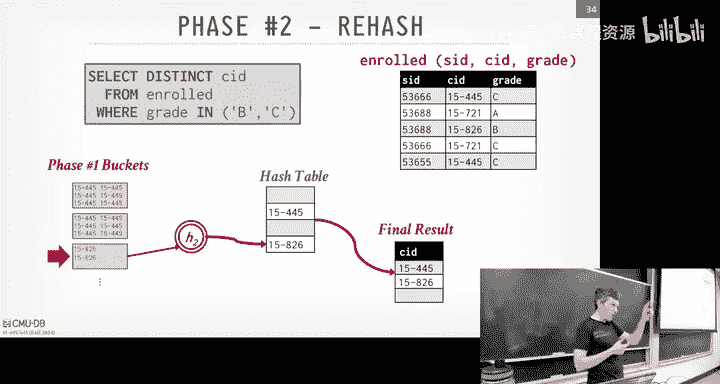
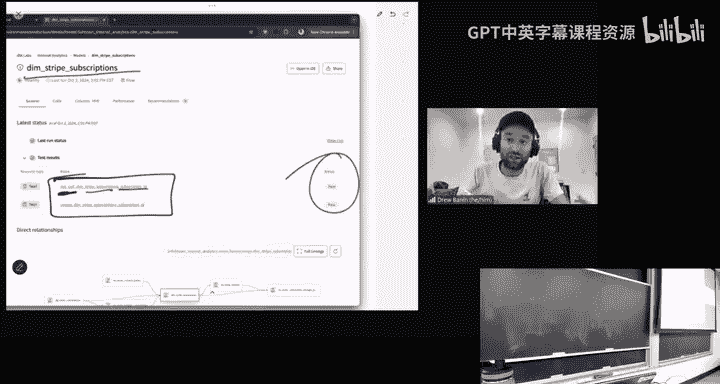
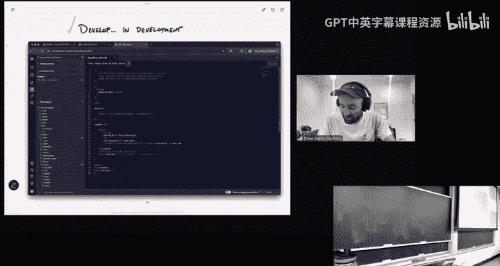

# CMU《数据库导论｜Intro to Database Systems (15-445645 - Fall 2024)》中英字幕（deepseek翻译 - P12：#11 - Sorting & Aggregation Algorithms ✸ dbt Database Talk.zh_en - GPT中英字幕课程资源 - BV1Tys8eQELW

Yeah。🎼Oic So today we're going to begin to start talking about how start executing queries and running operations on the data that are coming up from the scans that they're doing down below again。

 reminder everything for you guys homework 3 is do this Sunday coming up the plan is to have it do this Sunday and then give you out the solutions and greater responses by the following Monday because you'll need it for the exam on next Wednesday Project2 again we do after fall break in the 27 and as I posted last minute in Piazza that now a online study guide with the practice exam you can use with the solutions and explanations and then the study guide tells you basically what you do。

The main thing you need to be showing up is with your CMU ID so we know who's who when you fill it out。

Okay。Any questions about any of these things？Again， homework  three is do the Sunday。

 we'll get you out the answers by Monday morning。So。So as I said last time。

 now that we've discussed like how to actually build indexes and how to actually organize the data on the disk。

 again we're now going up the stack further and we can talk about how do we take all those components we've built so far and run queries on them so for the next four lectures we're going talk basically the low levelve operator algorithms we need need to execute more complicated queries。

 how we actually want to organize the system to process those queries and process meaning how do we move data between the different operators in our query plan and then we'll talk a little bit about the runtime architecture for how you actually build a system where you make a multithreaded multiproces and so forth again。

 we're focusing on single node systems today or for this part of the lecture。

 but we'll see how we can extend all these things to do distributed execution later in the semester。

😊，Okay， and again， for this today's lecture， this will be on the midterm， Monday's class。

 and going forward will not be on the midterm。😊，Sorry， keep getting robot。 All right。

 so we saw this diagram earlier in the semester of a query plan， right。

 I said roughly that you take a SQL query， you running some parser。

 It generates abstractbs synintax tree and then from the abstractbs synax tree。

 you can then generate a query plan。 We haven't talked about exactly what the query pan looks like and what these operators actually look like just yet。

 But a high level， you can think of it as a tree， oftentimes most times it's gonna be a tree。

 It's better to be a dag when most systems don't do that。

 And the idea is that in the the leaf node of the tree is where really reading data from from some source like from a table from a file。

 you know， some lower part of the system。😊，And data is going to move up from one operator to the next right so in this case here we're scanning R。

 we feed that up into a join operator， we do a join on S， we feed these up to projection。

 and then the top the root node where the projection is that's the final output that we're sending back to the client to the response for this query。

😡，And so this is obviously a PowerPoint diagram doesn't say anything about what these blocks of data that I'm moving around are。

 what the granularity is， how often we're doing it is the bottom pushing it up or are we pulling it up there's a bunch of those things will discuss after fall break。

 but at high level this is the general idea that data is flowing from one operator to the next in order to compute some portion of the query and then the root or the top of the tree is what the client gets as the final output。

😡，Right。So。Since we've been talking all the semester about diskor systems。

 the same assumption we have before that when we want to do something on a piece of data or a table or some collection of data that we can assume that everything's going to fit in main memory。

 we're going to have the same issue when we actually start running these operators that implement the nodes in the query plan。

😡，Where we can assume that the intermediate results。Of of these operators fit entirely in Dramar。

 It fit entirely in memory。 right， going back here， what if it's the case that like。

 I only have a gig gig of memory， but R is feeding up to this hash。

 when this hash table ends up being two gigs in size。 Well。

 I need to be able to accommodate that and have， have my hash table spill a disk because again。

 I want to have the illusion that I have more memory than than I actually do。😊。

So in the same way that we built the B pull manager to manage bring pages in as we're doing scans and so forth。

 we're going to use the Buffal manager again， the same thing you built for Project1 to spill intermediate results to like temp data on disk。

😡，Right。And because of this， because we could end up going to disk if necessary。

 that means that our implementation is typically going to prefer algorithms。

 again that are going to maximize the amount of swach YO and minimize the amount of random IO。😡。

Because again， doing random discs is more expensive than reading much stta data that all contiguous with each other。

Right。So again， we don't want the OS to manage the memory for us。

 We're going to do it ourselves and because we know that we're the ones managing memory。

 we'll choose algorithms that can maximize this sequential IO。

So one of the backbones of the fundamental algorithm we're going to use for a lot of these different operators is sorting。

😡，I recall that when we talked about the relational model at the very beginning of the semester。

 we said that it's inherently unsorted。It's based on set algebra。

 it's an set unordered collection of data without any duplicates in relational systems and the actual implementation of these systems can be bag algebra where it is still unordered。

 but there can be duplicates， and so we'll have to see how we can use sorting to remove undesed duplicates as needed。

So obviously thered be some applications that are going to want data to be sorted。

 like if there's a nice order by clause in our select statement。😡。

Then we need to be able to sort of data to handle that。But at other times also too。

 even though that the query is not asking for our data to be explicitly sorted through an order by clause。

😡，Some of these algorithms we're going to use， like for aggregations and joins， we'll see next class。

 will actually be faster if we sort things ahead of time。😡。

Then do whatever is the operation that we want to do。

 But this seems kind of crazy that I want to do a bunch of extra work to sort this thing。

Kown that I might still spill a desk， but then when I actually do whatever the processing I need for that given operator。

 because it's sorted， that's going to make my life a lot easier。😡。

So it's worth to pay that upfront cost to get the benefit later on。In some cases。

 in some systems like a SQL server， for example， when we will see how to do sorting with external motor sort。

 like in SQL server， it can say， hey， this data would be great if it was sorted and if I had an index。

 so it'll build you a B plus tree， they call a sppoing index。

 It'll build a B plus tree just for your query， do whatever it is the operator wants to do to process the data and then immediately throw it away。

😊，And again， this seems crazy， but again， the construction costs of of that data structure or the construction cost of sorting the data ahead of time will maximize the amount of sequential IO we have later on。

 and that's going to make our life a lot easier。Right。So again， as I said。

 we need to account for the fact that we may have the spell of the disc。😡。

If everything can fit in memory， well， that's easy。Right。

Pick whatever your favorite sorting hour you learned in you like early CS classes， like merged sort。

 Quick sort， Tim sort， gnome sort， cocktail shaker sort。 if you look at the Wikipedia Bas。

 there's a bunch of them in general， Quick sort and Tim sort are probably the best two that you want。

So if everything's in memory， our life is easy。😡，We just use whatever you learned， again。

 in early CSs classes to sort things。It's when you have to spill a disk。

 that's the challenge that we're trying to overcome today。Right that we need to account for that。

 we may have to read the data in and we can't bring it all of it in。

 and how can we divide up the problems so that we can still get a globally sorted data that doesn't fit entirely in main memory。

So most data systems are going to use Quicksort or variations of this or insertion sort sometimes if everything fits in memory。

 like Postgres will use Quick sort。 And if you look at the query plan。

 it'll tell you that it's using Quick sort because if it fits everything in memory。😊。

And then obviously， if youre you know， how would you know that you can use Quicksort versus a sort of Mer sort of the disb sorting。

 Well， you make， you make an estimation about how much data you think you're going to need coming up the query plan。

 coming up between the server operators and decide， oh， with the data is this size。

 I have this amount of memory， my buffer pool to sort it。 Therefore， I can use Quicks。

And if you get it wrong， then you can just stop and revert back to use a diskb sorting。

Protoscripts can't do that， other systems can， if you recognize you get it wrong。

 you adapt your query plan and change it。Right。But we'll ignore that for now。Al right。

 so today we're going talk again about the two basic sorting algorithms I' going to care about the most in a disord database system。

 top top end heap sort is a special case when you know what the query actually once and therefore you don't have to don't have to sort everything and external merge would be the core algorithm we used to do disbase sorting and it'll see then how we can use that sort of data to then do aggregations and then also compare it against hashing。

 which is then segue us into how to you joins next class and then we'll finish up with a guest lecture guess less talk from DBT which is a very interesting tool you may have never heard of it。

 but it's widely used everywhere， which every single company in the world is using DBT。😊。

And the reason why men have heard it， because you't you guys are students。 you don't need data。

 When you start getting data at your startup or your your company， whatever it is。

 then you realize what you need DVD for。 But Drew will give a talk and and explain why。Okay。

 so as I said， top end Heap sort is a special case where if you have a query with an orderbi clause with a limit。

 then you know that the data knows that it doesn't need to global sort everything。

 it just needs to get whatever the subset is。😡，For the greatest or the smallest values based on what the autobi clause is。

So in this case here my query is getting all the student IDs。

 getting all the student records from the role table。

 ordering them based on the student ID in as sendingending order。

 but then now we're adding this fetch first four rows with ties clause we didn't talk about limits but this basically says order by the student ID。

 but give me the first four values that are the top values for that sorting。😊。

And then with tie specifies whether you want to include the records with ties or not。

So the way you would do this is that assume you had this original data and for simplicity reasons I'm just showing as a single column like this。

 all conous data。😊，But you basically allocate a sort of heap data structure。

 like a priority queue or something something pretty simple。

 And the idea is that as you scan along the original data， you just insert into the sort of heap。

 if you have a free space or if there isn't， meaning like they're all occupied。

 then you check to see whether the value that you're looking at is greater than the highest value into my sort of heap。

 If yes， in this case because I want things in acending order， but I know I just ignore it。

So in this case here， the first thing the landlor is three。

 our start to heap is empty so we put in the front， then we land them four， we have an extra spot。

 we put it after three like that， six goes there， two goes， two is less than three。

 so we just slide everybody over， and then now we can fill in two。And now we come across at 9。

9 is greater than 6。 so we know that because they're only asking for the four top values。

 this query never needs to look at9， so we just ignore it and skip it and keep going。😡。

Then we get to one， in this case here our sorter heap is full， so we just slide everybody over。

 drop six， make a free space for one， insert one。Now we see four now we already have a four in there so we have to recognize that。

 but again they're asking for ties， so we just add a little bit more memory to the end of this to start putting in additional things and obviously we have to keep track of like are we going past the original four because we have ties or not just adding things to we think we have more space？

😡，So keep scanning down， caseks4， we add it again， we find the eight， we know we don't need it。

 we skip it and we're done。The advantage of this approach is that it's one pass over the data。

 and it didn't actually have to sort anything。I had my little sort of buffer heap on the side。

 and I just use that to fill in the data that I need。

 I didn't have to do the quick sort pivots or anything like that。 It was one pass over the data。

And this would be super fast。 if your data is petabytes and， that's me a problem。

You know having doing one pass algorithm over data is always going to be a huge win。

So most of the high end systems do this， Postgressres does this， I don't know whether my SL does。

 and I think Ducky B can do this as well。😊，Because this is such a clear win and this like give me the top 10 elements based on some ranking is a pretty common thing。

Think of it like a leaderboard in this class or any kind of online game。

 given the top 10 players that's going to run this algorithm。O。So also in this case， too。

 like because I'm doing one password with the original data， I just， you know。

 I can have one buffer pull frame， just use that to fetch in something， scan it。

 throw it away then get the next thing。I could do prefeting all other optimization tricks we talked about before。

 but like I really only need one buffer for the data I'm reading and then another buffer so for my he。

All right， so what if we had to do a more general sorting and again， everything doesn't fit in disk。

Then we're going to rely on what is called external merge sort。And again。

 most database systems are going to be able to support this because otherwise。

 if you try to sort data and you can't spill on a disk。

 you're going to run out of memory or if you start using Quick sort。

 it's going to be really really slow。Because that's me a bunch of random eye up。

So external merge sort is going to be a divide and conquer approach where we're going to split up the data that we need to sort into smaller units called runs。

😡，And the idea is that we're going to sort those runs by in memory。

And then write them out the disk to make room for the next things we need to sort。

 And then we're going to do this through multiple rounds and multiple passes until we end up with a globally sorted complete complete data set。

So what's gonna be confusing is that what I'm describing today is the external merge sort algorithm。

 we're also going to use this algorithm next class when we talk about the merge sort。

 So in your merge sort algorithm for the sort phase you can use external merge sort。

 which has its own separate sorting me phases So for now we can ignore that but next class I'll try to be very careful to say look what's the external merge sort versus what's the sort merge。

Hm。All right， so again， in the first pass， we're going to get sort of chunks of data that fit into memory and then write the sort of chunks back out the disk。

 and then the second pass we'll read those sort of runs back in。😊。

And then just merge them together and producing more larger runs。

 write those back out and keep doing this until we've sorted everything。All right。

 so let's see what it actually before we get that， let's first talk about。

 what are we actually going to restore in these buffers or these pages as we're sorting？😡，So。

You can sort of think about what we need to sort is， is a combination of key value pairs。 right。

 The key is going to be whatever， whatever is in the order by clause or whatever it is that we're asking being asked to sort。

And then the value could either be the tuple or the record that we actually need to sort or the record I。

So again， and the way to think about this is when you actually want to materialize the final result that you need to again give back to the client of the application that exited the query And so the way to think about this is notion between early materialization and late materialization in early materialization。

 the idea is that as I'm sorting the data I have the full tuple that corresponds to the key that I'm actually sorting on。

😡，So that I don't have to go back up as I go up the further query plan。

 I don't have to go back to the original data and get the rest of the tuple。

In the case of late materialization you just have a record ID and what happens there is I can do all the sorting I need just based on the keys because that's the all the information I need。

 but then later on in the query plan if I had to do anything else that needs the rest of the tuple。😡。

I have to go then fetch that from disk。😡，Right，So say like if I have a billion tus and I have a filter。

 where I remove 99% of them。And then only， then I sort it。

 And then I we need to go back and get the rest of the data。 In that case。

 late materializationation is gonna to be a big win because I threw。

 I didn't have to copy a bunch of data around that I didn't end up actually needing。

 which is gonna be one of the ultimate goals we have， when we try to optimize queries。

But in the case of。If I didn't filter out all those 99% of the tus， then after I do my sorting。😡。

Or after do my filter， then my sorting， then I got to go back and fetch all that data again。

 which might be much more sy I。 I basically have to read the data twice。So that would suck。

So there's not， you know， depending on the workload， depending on the data， depending on the query。

 one of these approaches might be better than another。 If you're building a row store system。

 you typically do early materialization because you go at the page and all the data you need is right there in the comm store system。

 some of them will actually try to do late materialization。But in some cases， you。

 you don't actually want to do this。 We'll cover this more when， when we。

 we talk about career execution。 I'd just be mindful that like。

I'm going to show these algorithms in terms of just the K is the key and we're done。

 but actually it's the key plus the value。 and that value it could be actually quite large。

 Yes So what happens if we sort two key is the primary primary the same we sort by the secondary key do we use the early materialization but have two keys or because sorry do we use the earlyization because we can just look for primary secondary key within that or do we use lit materialization buts question is if you're doing sorting based on the primary key primary first then secondary an order by clause has two and the question is do I you what bothization or。

For like multiple piece。I know early meization should for sure work。

 because you had just looked up the other keys in the two hole。

 but for late materialization two weeks。Right， so a question is。

 say let's ignore actually the indexes because the answer is the same， right？

The question is like if I'm sorting based on two keys， let's say the first key is the primary key。😊。

Could use if you have a belustery， could you just do that sorting on the primary key？😡。

And then do additional sorting based on the additional key afterwards。

 depends on whether the data is actually sorted a cluster based on that primary key we'll see later on。

 typically though you need get both of the keys and try to do the sorting altogether together。

So you would try sort of materialize the key you want to sort on。And then look at that。

 and whether or not you go get the rest of the tube。

 it depends on when you're doing these two different approaches。I don't know if any system can do。

I think what you're originally proppoing is like you're using two different indexes sort at the same time。

 I don't think you can do that。Okay。So let's use a。

Let's sort of a simplified example of the externalomer sort。 We'll do what is called a two way。

 two way external numberomer sort。 And then in this case。

 the number two corresponds to the number of runs， I'm going to bring into memory and merge together to produce a new sorted run。

So if you did like a three way me sort， you could bring in three pages and mergese them together，Yes。

So making late， we only them。His question is， with late materialization。

 do I only bring the keys in to memory and sort them？I mean， yes。

 but my just the key value pairs are like the key in the record ID。

 even that might be really huge and I have to build a disk。😡。

The idea is that I'm not copying around the rest of the TL data as I'm putting things into sort of runs and so forth。

 think of like when you implemented quick sort in like， you know， C101。

 you just given them a bunch of numbers。 And you have to sort them。 But it's actually， know it's。

 it's a key guy here。 It's there's a payload。 You have to actually copy around as well。

 So when you start doing the pivots and moving things around， you got to copy that payload as well。O。

All right， so going to do two weeks starting tomerse sort。

 we're going assume in this case here the data's being broken on end pages。

 and then now we have to specify that how many buffer pool pages or frames we're going to be allowed to use to do our sorting。

😡，RightBecause we can't assume we have infinite amount of memory。

 We have to be told how much memory we're allowed to use。And for simplicity， we know。

 we can assume that in this example here， we just， you know， we have。It would use three pages， right。

3，3 buffle pages， the simplistic one。 But in a real system。

 you obviously want to use as much memory as you can to do the sorting because then you be fewer passes going back back and forth the disk。

 But if you're running other queries at the same time。

 you don't want the one  query that's doing sorting to slow down and trash your buffer pull for everyone else。

So typically， there's a knob or parameter you can set to say how much memory you're allowed to use for sorting for any particular query。

You can change it on a per query basis， but usually there's a global value you set。Alright。

 so in the first pass， pass 0， all we're gonna to do is just read one page of of from the table in memory at a time。

 sort it。To create this new run and just write that back out the disk。😡。

And we're going to repeat this for every single page in our table until they're all sorted。

Then in the subsequent passes， we're going tocursly merge those pairs of runs that are contiguous to each other。

 bring them in， sort have a cursor or iterate through them， compare values。

 and then' right out to a new output buffer the values in that sort of order。😡。

And we do this for all the sort of runs we have。 And once we're done。

 then we go back and repeat the process over and over again until we end up with a single run that has all the data sorted。

Yes， can these be dying parallel because like Pas euro seems kind of independent？Yes， her statement。

 And she's correct。 Can this be done in parallel because past zero is in。 Yes， but for。

 for simplicity， I'm not even really talk my workers with threads here， but yes， they're good。😊，Yes。

 do we need to a new page？Yes， so his question is he's correct。

 Do you need to allocate a new disk page to sort the sort of run， Yes。

 you would have like a temp page。That's still be backed by the buffer pool。

 but it's like a scratch base。But then I can delocate it once I know I'm not going to need that run anymore。

So if you're stupid about it， you would need three copies。

Three times a number pages of the original table size。

 because I would have the sort of page and the new output page and the original data。

But you can throw pages you throw eight runs pages， pages for runs once you've merge them。

The they typically won't call a cause a storage problem。Like， what do you。

 What do you know my storage problem if I need to a really large table I。

And I need to double the size up the table。So if I need to sort a really large table do I need double size of disc。

 yes。But it is like。With the alternative。You try to sort in place and be super slow。Right。

Dis is cheap now， right and serious。You know， it's， it may not be fast。 right NM E is getting much。

 much faster， but like it's。I forget what the price for a gig is， is's nothing。

And so if you go to S3 it's nothing， at least to get it once。All right。

 so let's walk through your example。😊，So again， we're doing2 external Mer sort。

 so at the very beginning we just have our original data and assuming here I'm just drawing in each page there's two values or two keys and I'm not showing what the values are whether it's record ID or the actual twoL data for this visualization doesn't matter。

😡，So again， in past zero， we're just going to scan through， read every page in。

 and then just sort the two keys that are inside that page。😡，So then at the beginning of page1。

 I have now runs of size 1。Of one page。So now what I'm going to do is。In。

 in to produce the output of the second， the next pass， I'm gonna take two contiguous pages。 Again。

 locally， each page is sort of within the keys that they have。 But across the two pages themselves。

 they're not， they're not globally sorted。 So I'm gonna take these two guys here。

And I'll allocate one output buffer for me to write data into。😡。

So I have to bring these two pages in， I have an output buffer to write some data out。😡。

And then now you have a cursor that's just going to scan through them sequentially。😡。

And whatever the cursor is looking at the first page and whatever the cursor is looking at on the other page。

 compare them， whatever one is less， that gets written out， and then the one that I put in there。

 that cursor moves ahead by one。😡，Now you do the same thing。

 compare the two values or two keys that the cursors are pointing to。

 write out whatever one is the smallest， iterate that cursor and now that this page here with the two and the6。

 that's full， Id write that out the disk， reuse the memory now to for new output buffer to continue the rest of the merging of the two runs。

😡，So again， I only need in this example here， I only needed three pages， two for the input。

 one for the output。So I can just now then just go do that one by one for all the other ones in the case of the last page over here。

 it didn't have two pages and only had one， so I could be smart and say I don't have to bring that in just to write it back out。

 I can say， oh this thing is already locally sorted。

 I don't need to merge anything else and just carried over to the next phase， next pass。😡。

And then now I'll do the same thing the next pass， right。

 I'll bring in from the sort of the first set over here。 I'll bring in the first page It 2。

3 and the second page 4，7， have my cursor。😊，Scan through， look at them。

 compare values and write them out to to the output and new output pages。

And then now within that run of size 4， the data is locally sorted。😡。

And I keepcursly doing this until I end up at the bottom with now a a globally sorted。

Globally sorted data set。Yes。Espec are these all in memory？No， so going going back here。

So at this point here， I only have。Do my pointer， I'm a pointer。And you can't see it。

 I have the page where it says three，4 where thearrow is pointing to and I have the page where two6 is and what that's pointing to。

 and then I had this output page。Everything else is out on disk。

Right so then now once this thing gets full right at this point here， then I write out the2，3 page。

Reuse the memory now for this next one to fill in 4，6。And then when that's done。

 I do that again that incrementally for all the other run pairs until I produce run a size2。

So the number of passes here is going to be one plus log2 n。

 The plus one is that first pass zero where I have to again make my small little you。😡。

Small runs of size one。And the log2 n is I like， again， like the， you know。

 it's like traversing the B plus tree where I'm cutting down by half the number of things I have to look at or the number of passes I need as you go down。

So the total IO cost of sorting this data is to n where n is the number of keys I need to sort。

And then times the number of passes as I go down。So this obviously would be would suck to have like。

You know， log2 n， again， typically an algorithm class， that sounds great。 log， you know， log2 bit。

 you know， log2 n， that's great， but didn't think of like I have a billion pages。

That log  toN is not going to be that great。So the way to make this theme better is that we want to change this too to a larger value because that means we can bring in more pages into memory at a time and have larger sort and run。

 so we don't have to go through so many passes。😡，Right。So again， in my example here。

 the number of buffable pages we need is three。😡，Because it's two for the inputs， one for the output。

But if we have more space available， then we can try to do more bring things at the same time。😡。

But if we just do the 90 example where I showed before where we just sequentially or with a single worker thread。

 go look at sort of one run at a time， then it's not going to be that fast。

So there are some tricks to optimize that。 we'll see in a second。So in general。

 for a sort of general Mway sorting algorithm iss going to be have B buffer pools and we take the ceiling of n divided by B because again。

 that's because we could have pages at the end that' don't easily or equally fill up all the possible runs wed have within that last section。

And then in the subsequent passes， we just need to bring in B minus1 pages into memory because we always need one pages's output。

RightAnd then it's plug and ch on the total number passes to get the total IO cost for this as well。

Itretty clever， right， Like this is the divide and conquer approach is widely used in databases and other systems because it's breaking the problem out to smaller chunks and then making so that each sort of chunk of the problem is is manageable。

 yes。在这里还那。waited in that case， like when the boys from their school。Send it to bis。

 and you can use the second one to keep continuing。But like。Yes， so he's saying。

 what if you had two output pages， couldn't you then basically interly bioo。

 It's called double buffering two more slides， yes。

Is this faster than just doing a two way merge in parallel。

 because you can still use all the buffer pool pages that way。 This question is。

 is this still faster than doing a two way merge in parallel。

Because you can still use all the bubblepo。嗯。I meanSo your question is like should I still have like could I have multiple threads doing two way at the same time？

The challenge of that one is going to be if you have。Well。

In the old days you would not want to do that because you couldn't have so many parallel quests to the disk nowadays the disk cuess are actually quite large。

 so you could eventually do that， but in general ends up being the same。Actually， no， in that case。

 you would end up writing straight you show them if you're。If you do what you're proposing。

 you're still going have a large amount of passes。 You may be reading and writing it out over and over again。

 versus I use a bunch of memory。 I use all my memory to just sort things。

IIt's fear of passes like the tree gets shrunk that I think that's going to be always better to do。

Even if you have parallel IO。Yes， so just for B buffer pages we are merging B minus1 rounds and using the last page as merged so but the merge result will for sure be bigger than the rounds so what if we run like one page is now up or holding like the merge of the output。

 that's fine right again going back here。When I was here， again， I have my output page。

 when I'm putting two， I put in three， it's full。😡，Write that out and just reuse the memory。

And then for the next one。Because again， as I'm doing the merge。

 I don't have to go back and look at the page the output page I just wrote。😡。

So that's why I I can write it out and reuse the memory。Okay。

 so look how the math works out going through this example here。

 So say that we want to sort some data。😊，And we have 108 pages with five profitable pages。

 so n equals 108 B equals 5。 So in pass zero again we take the ceiling of antibiotic 5 because we're going to break it up into sort of runs of five pages each so we have 22。

And the last run has a remainder it's only three pages。Then in the subsequent pass。

 again now we'll be sorting together putting together pages of five pages。

 so since we have four pages we can bring into memory。

 we're going to end producing output runs of size 20 pages。

So we're multiplying the size of the sort of run is multiply4 as we're going down。

 then the subsequent pass we end up with getting down to 80 pages with only two sort of runs。

 then in the final pass we end up with the complete sort of run of 180 pages。

And then the form of the works out like this， so in this case here it only took four passes。Again。

 108 pages is nothing， think if you have a billion records petabyte of data。

 this algorithm is still going to work in that case。So the exact details of like。You know。

You can you do asynchronous I O to write things out in the background when you're reading other things。

 All that's gonna depend on the hardware。 is all that's gonna depend on what what the system actually implements。

 right， How much memory you should use， allocate for a query depends on what else is running in the system。

 So it's not like these values。 There's not like like there's not gonna to give you values for N and B that would be。

Opttimal for any possible situation。 right， The answer is always depends on databases。

So now the optimization that he brought up， and he's correct， is that the。

The problem with the sort of general album that I showed is you basically have this phase where you're reading things in or writing things out。

And as we talk about before， disk rates are going to be slow。Right，Wors case scenario， you know。

 tens of milliseconds of if you're going to ask 300 milliseconds。

 but even then your CPU is blocked waiting for the， the next batch of things you have to go read in。

So a better approach is to basically divide your memory into half。Where you have。

Half the buffers being used to sort some data you have in memory right now。

 And then the other half is being used to fetch the next things that I'm going to need。

 And then you're basically alterating back and forth of what what sort of phase is writing。

 writing things out or what are the sets of buffers are writing data out。Right。

 so this would be nice because it can reduce the time the wait for IO because the system is always going to be able to have something to do some work to be done because data will be in memory。

So we can think of like really simple look say these is are our buffer pool and we have basically few pages and we have one page for the output buffer。

 So if we do the basic algorithm I showed before， we bring the first set of pages in。

 sort them into our output buffer and write that out the disk then when that's done we can go go ahead and get and fetch fetch the next pages。

Again， that disk right might take a long time， so that would be slow。So instead。

 if we have the double number of memory we need for the inputs and for the output buffer。

That we could have the system can fetch data in like we did before， merge that out。

 But was doing that disk right， we're going and fetching the other data for the next。

 the next sort of round， bringing that into memory and then sorting that and writing that out as well。

 And again you're ping pong and you're atating back and forth to keep the system always running and doing useful work。

😊，So all this this reduces your effective IO or sort of effective memory that you have available by half。

 if your disk is really slow， and then this is going to be a huge win。

Because you're hiding that disc goal by still doing useful work。

And this is why you'd want to use a disk manager with non blocking I O。 So you can say。

 here's the data I want you to write out。And have whatever thread do that right for you。

 then you can go go have your work or thread， go process more data。

If you're relying on like an OSS call to do that， the OSS calls be blocking so you don't want your main worker thread to be blocked on the operating system why it's doing the right。

 the flush。You wanted to be doing other things。Yes。Can you trip it off， Sure， Yes。

 but some you run out of memory。休すか。is the technique you press yes？It's a common use。

S it's a common use。 I don't know。 I think Pesgt does this， I don't know about MysqL and others。

Again， if your disc is like super fast， then like it's less，'s less helpful。O。

So one is thing we you really talk about another way to optimize this is the thing you wouldn't really think but do would be an issue and that is。

Actually， comparing the keys can be expensive。😡，Again， just going back to like CS101。

 when you first implement that Quickword， you're taking two30302bit numbers and just going， know。

 comparing less than greater than。That's a single instruction in the CPU。 That's fast。

But data isn't always going to be fixed length values。And so you want a way to， to。

 to optimize that comparison because you can be doing a lot of that for a really big data set。

And then you don't have to reimplement your sorting algorithm over and over again to have all these different variations of possible data types。

 So instead what often happens is that when you call your sort method or sort operator in your database system。

 you also pass a pointer to the comparison function。😡，Now what happens then when my system's running。

 I got to do a jump call to go to my comparison function to do compare the less greater than then return back to 01 as accordingly。

 that jump call is gonna be expensive on modern CPUs if you're doing this again for a billion times。

So there's some two ways to make this go better， go faster is one through code specialization。

 we'll talk a little bit about this when we talk about query execution after the fall break。

 but the idea here is that instead of having this general purpose sorting algorithm where you have it past the function pointer and then make the call to the function to say do the comparison。

It's better off to inline or hard code that compares an operator based on the type。

So then now it's just all in line when I do my comparison and I'm not making that jump call。😡。

So if I know I'm going to to be comparing two floating point numbers。

 I could have that floating point instructions directly inside my sorting algorithm。

So there's a couple different ways you can Coend this。

 you can do this as at runtime based on the data type， Co end。

 the sorting algorithm with the inline function， or you can do this at compile time。

This is what Postgres does。 It's a bit of a hack， but it works。

 They have a pearl script that takes their sort sorting algorithm implementation and just duplicates that it makes multiple versions of it。

 one for integers， one for flows， one for whatever。So the ink now compiled in the， in the system。

 They'll have the different flavors of variances， if you will， of the。Of the。

 of the comparison function。 again， think of like temping C plus plus。

 But Postcodes are written in C。 So that's why they're duplicating the code。So then at runtime。

 I know what data type I have that I need to compare when I do my sort。

 and I make sure I call the sorting algorithm that has the hard coded comparison for that data type。

And now there's less indirection， there's not this jump to the comparison operator。

Another trick we can do for really long varchars or strings is similar to what we saw when we'm talking about B plus trees。

 where instead of having to compare the entire string to see whether there's a match。

 maybe pass that data around， I instead could just lop off a prefix of the key， sort based on that。😡。

And then had that in line be really fast， where I maybe have to look at the first three characters of。

 of a really long string。 And that's enough for me to figure out whether I want to go left or right as some'm sorting things。

And then if， if the prefix or the prefixes are are equivalent。

 you still have the way to back out and call the actual full comparison operator or comparison function。

I don't know what systems do this。 This， This typically mostly appears in maybe some of the。

 the the commercial systems or say for O left itself。Okay。So she brought up the question of like。

 okay， what if I had the primary key or secondary index， can I use that to make sorting go faster。

 The answer is yes， if you have a index order preserving index like a B plus tree that's already on the keys that you want to sort in your orderbi clauses。

 then it doesn't make sense to sort that。Again， because it's already sorted for you。Am。

Some systems like Postgs can do this， but they have to have an exact match。

 like if I have my my order by clause is on is on columns A and B。

 I have to have an index on A and B in order to use it。In Oracle and the enterprise systems。

 if my order by call is on A and I have an index on A B。

 I can still use that index that I know the a values are going to be sorted correctly or in the order that I want。

But Postgres， again， far as I know， has to have an exact match。

So now I again to get the data we needed in sort of order。

 it's just a matter of jumping to some point in the tree， scanning along leaf nodes。

 and we get back the data I want， but depending on whether the data is clustered or uncllued based on that index。

 this could be a good idea or a bad idea。Because as a reminder， when we talk about cluster indexes。

 the idea is that the pages where the tu is actually being stored。

Are in the same order as they exist in the leaf nodes of the index。RightSo now again。

 if I want to go get all the sort of data， I just sequentially scan along the leaf nodes。

 get all the pointers to jump to the data I need， and again I don't have to do any additional sorting it's already sorted for me。

That's easy to do， that's really fast。If it's uncllustered。

 then it's the problem we talked about before where I may end up doing much of random IO。😡。

For fetching pages in an order and having to go thrash and bring them in the memory。

 throw them back out and read them back again， if I'm not careful about this。

So for top end queries where I only need to get a certain number of values across the data set。

 then this is probably okay because the number records I need should be subset or much less than the total number of records that exist。

😡，So I could maybe just jump to one side of the tree。

 scan the first keys that I need and go fetch to those pages。Again。

 different systems or different things， if it's index organized。

Storage where the leaf node actually store the data itself。 Then this this isn't an issue。 again。

 assuming that the order by clause is based on the key that this thing is sort of on。Yes。

Goodford open very。目ミれ。If any is more enough that。たす。Especially its like。

 it's good for a top inries because if it's small enough it's smaller pages。 Yeah， so like。

 if I only need to get the top 10 things。So assuming that this is in say descending order right。

 So the highest value is going to be on this side， I jumped to that side of the the the tree。

 traversed down and then scan along leaf node and get the1 things I want and then go fetch to the 10 pages。

Versus like if we did the top end heap sort， I got to scan all the pages。

Because I don't know where it's actually going to be stored。

Right even though that's one pass and better than sort of Mer sort。

 going and get the index of getting exactly the minimum number pages I need is always be better。 Yes。

 there a case that we actually want to use on cluster B plus3 because this seems like a bunch of random I O。

😊，So question is， is there any case we would actually on cluster B plus for sorting No anything for anything compared to cluster B plus。

 So question is like the question is， when would you ever want to use on cluster B plus3。

 Most systems use on cluster B plus。Right for ined organized storage like My SQL and I think SQL server can do this。

 our next SQL light， like the leaf nodes are at the data itself So this' is not an issue in other systems like SQL server。

 you can say I want this or an Oracle too， I want this thing to be sorted based on the you know on the index。

😊，In Postgres， you can call the cluster command， and it'll sort all your data。

 but it's not guaranteed to be synchronized。 So it'll one， it'll do external MR sort to all the data。

 basically， rewrite the tables。 And then over time， if you update things that could get out of order。

 But the idea is that first pass kind of keeps things。Get things sort， at least initially。

And we haven't really talked about this if there are tricks you can do if you know the data is S sorted。

😡，Then there's some tricks you can just say， okay I know that it's sort of enough and therefore。

 I may have to look at less data than I actually need to。But most， most the indexes， when you。

 when call create index will not be a clustered index。It does treat this。Temp。The question is。

 is it because the Bla tree is only used temporarily？If I call it create index， it's not temporary。

Different index。Like maybe you're asking， why aren't。

 Why isn't everybody doing a cluster clustered index and why isn't everybody using index organized storage。

Right it's a design choice of when you built the system whether you want to do that or not。

 based on what you think the workload should be。So PostGs was invented in 1984。

I don't know whether index organized。 I， I don't know whether the idea of storing。

Data in the leaf node was even that thing back then。MyL， first order My SQL didn't do that。

 it's only NB did that， that came around like 99。SQL light is 2001， so it's a semi newer technique。

But to your point， if you have a bunch of like the idea is that you have the heat pages where the tuples are。

 that's unsorted。 and then I can build whatever indexes I want。And that might change over time。

 I might say， okay， most of my queries need to be data sort of in this way。

 so I build an index for that， and then over time it becomes another column becomes more important and you want to build an index on that。

Again， that's the great thing of relation model SL is that you can make that change without having maybe throw everything away。

The index organized storage kind kind of makes it more obvious or suppose to more about the underlying storage mechanisms of of the data because now you know it's going to be sorted based on whether you specifyifies the primary key for the cluster red。

But that's more philosophical of whether you want to design your system to do that or not。

Orracle and SQL server will give you the choice。 Like， you do things unsorted。

 you can have un un unsorted heat pages or you can have indexor pages。

 You can specify on a per table basis， which one you want to use。

My SQL with EnDB always does index organized storage。All right。

So now we' gonna talk about aggregations。 Again， sorting is gonna to be a backbone。

 one potential way we can implement aggregations， but hashing' is gonna to be the other one。

 And we'll focus more on hashing techniques next class And this is like the blood with the crys。

 like this is a classic trade off between these rival approaches like making your data system fast。

 sometimes sorting algorithms be better。 sometimes hashing algorithms would be better。

 And then if you look at research literature over the last couple decades， sorting was faster。

 then hardware got better then hashing got faster then the algorithms got better for sorting。

 So it goes back and forth。 But in general now nowadays， the hashing's almost always gonna be better。

😊，But we'll see this next class， there may be some times where the query has an order by clause。😡。

It needs the data to be sorted， and just so happens that if you sort the data once then you can do your aggregation very。

 very quickly without having to do the hashing technique。😡。

RightLike the byproduct of getting the data sorted so you can do agggregation ends up satisfying the order by clause for free。

 And so you get a big win by just doing doing the two together。But in general。

 hashing is almost always going to be better， especially if you your' disc going to be slow。

Al right so again， we talk about aggregations in lecture too。

 but the idea was we have some collection of data and we want to do some computation to collapse it down into a single scalar value。

 like account， min Max， sum， so forth。And so what we're going to need is in our system is we need a way to quickly identify that tus have the same key。

Like whatever， whatever it is that group I is based on so that we can put them together to compute whatever aggregation is going to be。

So let's start with the simplest aggregation function， distinct。😡。

It give me all the unique values for a given column。And this example here。

 I have the autobi on the coursese ID， and my dig clause is going to be the course ID。

 So in this case here， sorting is going to give us kill two birds of one stone because we'll get it sorted for the autobbi and we use sorting for the distinct。

😊，So let's say now we do our filter based on the where clauses。

 get down the minimum number toolss we need， then we do our projection to remove all the columns actually we don't need。

And then now we just sort this using the X merge sort。

 and then now we just have our iterator go through our output of the sort of data。

 just check to see whatever the cursor is pointing at is its the same as the last value I just looked at if yes I know ahead I can go ahead and remove it。

😡，And that removes all the duplicates。So that's pretty simple， pretty easy。😡。

So if we don't need the data to be sorted， then。Forming the groups， you know。

 it may be actually beneficial to you use hashing because you can sort of quickly identify where things are and check to see that is whether they're equivalent to whatever you are trying to do like a distinct or whatever the the aggregation is gonna to be。

It reduces the rules the problem。 having to do maybe sequential scan to look at all the data find you're looking for。

 especially because again， if you have to spell a disk。

 what I'm trying to find a duplicates if I have a bunch of things that Ive had to spell the disk because I ran out of memory。

 I don't have to go fetch these things back in to see whether I'm the same or not。😊。

So in this scenario， hashing always always is gonna be better not not almost always always。

 if I don't need to be data dude because I can again do the same divide and conquerd technique we saw with the external Merar where I can break it up to the subprom that I can bring into memory now a small portion of the data I can bring into memory。

 do whatever the computation I need on on that data while it's in memory and I know because the way hashing works that there isn't going be a key that I should have be looking at that I missed that's on some other page that out on disk because if it was equivalent to me and therefore I cared about it。

 it would have been brought put in the same bucket that I went into。Right。

 and there's almost always going to be way cheaper than having to sort things ahead of time。

So the way we're going do hashing aggregation， so we're going to first populate an ephemer hash table for the query。

 that we'll start putting our keys in and depending what the computation is the value will be like a running total over computing a sum or the min Max value。

 of course whatever it is。😡，And then now as we scan the table， we'll go check that hash table。

 see whether our key art exists， and if it does， then based on what the aggregation is going to be。

 we determine what to do like if it's a distinct and our key art exists in this hash table。

 we throw away our key because we know it already't exists。😡，So again， just like before。

 if everything fits a memory， then this is easy to do。 I scan through the data once。

 pop it at my hash table， and I'm done。But again， if the hashi oil can get quite large。

 then this is going to be a problem。😡，So we want to be able to be smarter again by spilling in the disk and doing a divide and conquer approach。

And we' want going to make sure that we minimize the amount of random IO。😡。

And try to maximize the sequential Io。So this is what external hashing aggregation will do for us。

 so it's going to have two phases。And first phase would be a partition phase。

 we're going to just scan through the data once。Hash all the tus we're looking at based on the aggregation key。

the group by clause， the key。And they want to write it out into unordered buckets。

And then if that bucket gets full， then we just write that out the disk and use another one。😡。

So we'm going to prepare the data ahead of time by dividing anything up into these partitions。😡。

And then in the second phase， we'll just bring these partitions in one by one。

And do whatever it is the computation we need to do to produce our final output and again。

 because we've hash them such that keys that are the same will be in the same bucket。

 the keys that aren't the same may not technically be in the same bucket。

Then we know that there isn't， again， some other bucket we should be looking at to find a match for what we need。

And this will amount maximize the amount of control I we have to do。So again， in the first phase。

 the partition phase， we'll have one hash function， H1 to split the twos up into partitions。😡。

And then if， if the partition gets full， then we just spill it out。

The DS can write it out and then again reuse the memory。So assuming we have B buffers。

 we're going to use b minus1 buffers for all the partitions we're bringing in。

 I sorry for the output buffers， and then we'll use one buffer for input。😡，And again， obviously。

 you can paraze this by using more buffers at so point。

 But the basic algorithm is it's the opposite of what we saw with the external merge sort was I had to have B -1 buffers for the input and then one buffer for the output。

 This is， I use one buffer for the input。 and then B -1 buffers for the output。

Becauseuse like in of me what the idea was you you're bringing。

 you sort of have a fan out of data you're bringing it and you're coalescing down to sort of you know one stride of data where this is the opposite。

 I sort of have one piece of data and I'm fanning it out because Im because that's what the partitioning the hashing is doing for me。

So going back here， again my query now doesn't have the autobi clauses。

 so I want to get this distinct， so in the first pass I do the filter and then I review the columns and then now in the first pass of the external hash aggregation。

 I just scan through whatever the data I have here。

 I run it through my hash function and then I start filling up these buffers and just running out sequentially。

😊，And say this guy here， he gets full， well， I just go ahead and write that out the disk and reuse the memory the next for any other key that gets hashed into this。

And I'm not going back at this phase of the algorithm and looking at whatever I just wrote back out。

Once it' out the disk， I'm done with it until this phase is done。Then now in the second phase。

 I'm going to bring those partitions in。And I'm going to hash them again and write it now to an EmE hash function or hash table。

And the idea here is that my hashable will be small enough to fit into memory。

For the set of buffers that I'm looking at。And then once I'm done with computing whatever I need for that sort of set of buffers。

 I can then pop it in a new hash table after I write it out to the the first hash without the final result。

 So again， it's a divide and conquer approach。 I'm bringing in the data in smaller， smaller chunks。

 And think I don't have to go look at other data that's not in the chunks I'm looking at。

 And therefore， I compute whatever answer I need just on that data。

So meaning once I fill in my hash table and I populate it。

 I don't need it again to ever update anything else because I'm not going to see any keys that'll hash have the same keys in the first hash table。

So in the first page here， again， it's going to bring in all the buckets we have for this the first chunks and the B-1 partitions。

 and now I'm just going to sequentially scan through these hashm。

 install whatever the key is in my hashable。 again， in this case here， I'm computing distinct。

 So there is no value just like does this key exist or not It's basically a set。😊。

So then keep scanning along， do the same thing hashing into there。 Then I get down here。

 hashing to there。 when I'm done。 So now for these B -1 partitions， when I'm done， right。

 I can take whatever exists in my hash table and now produce portion of my final result that let get send back to the client。

😊，Then I can keep continuing for all the other partitions that I have。 hash it， fill。

 fill in a new hash table。 And then when that's done， then I write， you know。

 write the final result out to。😊，To the client。Again。

 whether or not the final result and it has to merge together， is just。Right in this phase here。

 depending on my aggregation is I need to quickly do you know， a random IO。

 a random lookup into the hash table。 So since this I had the mechanism to go find this。

 I don't want to actually use the final result as my hash table。

But I can just scan through and find all the keys and produce my output that way。So this is distinct。

 distinct is easy， does the key exist or not？😡，For the。And， for， for other aggregations。

 we'll about in a second， like the value portion of this hash table will have additional。

 additional summarizations as we go along。So what do we do with this？😡，Again。

 instead of having to do a sequential IO to go look at everything。

 and maintain some potentially giant hash table to see whether I have matches。

 I'm breaking up to smaller problems。S chunks of data。

 and then now I just have a bunch of sequentialrunch IO to go through the data once I've divided it。

Again， going back here， once I finished with these buckets。

 I never have to go back and check out again。😡，And because in the first pass。

 I've already hashed them， I know that down here in additional pages。

 there isn't going to be another 15，445 because it can't exist because if it did。

 it would have been hashed in the same location that I did。

So there isn't going to be some random thing down here that would cause my aggregation to compute the incorrect result。

Yes。Is there a reason why we have。question like why。

 why do I have a separate hash table for like for this phase。

 And then I throw it away and make a new one。Because I don't need the memory for the first hashable。

 and it might be large。Right。Yes。Benefit of having like multiple rehashing phases like。

Eial is there any benefit of having multi rehashing phases。 Yes。

 so we we'll talk talk about this next class。 but it may be the case that this thing。

 there's a ton of people in 1545， this thing gets really， really big。

 or let's say not even bunch people 545。 say like a bunch of keys all hash into the same set of buckets。

 Then what you want to do is another round of reppartitioning。 where you pick another hash function。

 hopefully that divides it up further。 You just cover acursive hashing， We'll see that next class。😊。

If your data is skewed， you'll have that problem and you to handle that。😡，Okay， so for aggregations。

嗯。😊，Again， the basic idea is that instead of having does the key exist in my output hash table。

 I'll have the key point to some total or computation that I'm maintaining to again compute the final aggregation that I need。

😡，So now， depending what the aggreg function wants， when I do my probe my hashtag。

 and I find the key that I want， I update this running value that I'm maintaining accordingly as needed。

😡，Otherwise if it doesn't exist， then I install it。So going back here， say in this case here。

 I want to get the the， the average GP of students based group by and course I D。 So now， again。

 ignoring how， you， I'm going through the sequentially， but assume this is。

 and this is all sort of happening。😊，one by one in my hash table now I'll have the key that I'm hashing based on the group by the course ID and then the value will depend on what the aggregation is in this case here they want the average。

 so I'm going maintain the number of keys that I've seen the count and then just a running total of the summation so then when when I went then produce the final output that return back to the client I just divide that running total divided by the number of records that I've seen the number keys that I've seen and then that produces the average。

M and max is maintaining the highest and lowest I've seen。

 some was just counting things up and count just increment everything by one。

Like all aggregations can be computed in this manner。咩。But again。

 the main takeaway here is that hashing is going to be better for us when we have to spell a disc than doing sorting because I can still do the divide in concrete。

 even though it would normally be random IO， but because I break things up to smaller chunks。

 I can still get so much IO。Okay， so next class， we're going to talk about joins。

 but we'll see more again， the difference between the benefits of like sorting versus hashing into Co join。

 joins are be super important because that's the most it's the where typically data systems are going to be spending most of their time。

To compute joints， basically for really large tables。So。

The the optimizations we discussed so far is sorting like things like。

Chunking IO to amortize costs through the double buffering。

 a lot of those techniques will also be applicable for us when we doh or start doing joints。

And other computations， we could potentially want to do in our database system。Okay。Yes。

And face hashing would had like first， would do the first scan and distribute them to buckets。

 Does it have to be one distinct。Perfect。So question is。In phase one of the partition phase。

 when I'm doing the initial pass， the first hash function and writing these the data out here。

 does the keys have to be distinct no。Because， again。

 you can have collisions based on your hash function。 That's fine。When I really for the second round。

 we can't have that。 And then for the second round， Can I still have hash collisions。 Yes， right。

 it's the same， This is just a linearar probe hash， what we talking about before。

 pick whatever your favorite has hash you want。 cuckoo hashing， whatever， right。

 You're still gonna have collisions， potentially。 And then the， the。😊。

The hashing scheme then tells you how to handle the collisions。Right。So in my example here， yes。

 I'm showing you that like this thing maps exactly where it was。

 but like it could have hased into this。😡，And I know that this thing's occupied my skin now and the first free thought to put my data in。

Again， to think of like the， the， the things we' talked about in the previous lectures are the building blocks we used to do more complicated things。

 So we already know how to handle conflicts in our in our hash table。It's。

 it's the same mechanism here。 It's not special。Any other questions？Yes。あく除。I story。Your question is。

 where's this final result actually being stored。 And as I said， like the reason why this。

 this thing can't be this because this is some giant hash table， right。

 And I don't want to send back the hash table to the， the。

 to the client because they're not gonna to do with that。

 So where's this thing actually being stored。 So you would have to allocate some output buffers。

It technicalically intermediate results。 So think of in the query plan。

 every operator would have a little output buffer or start filling stuff in。

 And depending on the implementation of the system。

 you could start sending back results to queries to the query or to the like as soon as you get something in here。

😊，Because you know there isn't anything you have to do after that。

 but most of the times it's like a blocking call like so once you have the entire output buffer filled in。

 then you return a hold it。Which means， of course， again， you could run out of memory。

 which when you start filling at your upper buffer， if you like， if you do something stupid。

 like select star from table with a billion records。With just getting everything back。 then yeah。

 you， it's gonna start going slow because it has to start paging as， as you start writing out the。

 the， the buffers over the the wire protocol。And it's most systems will have like a like built in export functions So you don't do that。

 So you can kind of stream things out。

Exllent thought I going about DbT too。 this is Drew。 He's the cofoer of DBT， as I said。

 you don't know you need DBT。But you will。 Okay， And that's not me pitch a great issue。 Yeah， thanks。

 Andy and hi everyone。 So yeah， my name is Dr from DBT Labs。 I have an iPad and an Apple pencil。

 and I'm inclined to use it。 So this can be hopefully a fun and quick presentation about DBT My contact info here would love to hear from you if you're ever interested in chatting I live Philadelphia and I love mentioning this。

 I did not get into CMU。 I did apply。 I did not get in Co。😊，So。I want to kind of talked through。

A story here and part one of this story is you know the promise of analytics and business intelligence and so the way this story always gets told if you talk to you know honestly a lot of vendors is you have tons and tons of data sources that represent data about your business so it's your application logs and your you know payment providers and your customer success tools like people opening tickets things like that。

😊，And so the promise is you can extract and load all of your data from those sources and load them into your cloud data warehouse。

 your single source of truth， and that will unlock BI and analytics for the entire organization and make everyone super efficient and productive and it's going to go great and so this is the promise that we often tell people about analytics。

😊，The reality is that you get something that looks more like this。😊。

These data sources represent thousands and thousands of tables， some of them are up to date。

 some of them are not like some of them are deprecated。

 meanwhile you have different engineers creating lots and lots of other tables kind of as derived data sets or maybe their views and I kind of make a joke about this here but it's not that much of a joke you're going find a table at some point in your career called something like Prad。

vW underscore XRF 30D V2 underscore underscore John and it's mission critical for the business and nobody knows who John is because he stopped working here like 10 years ago。

It's powering these mission critical dashboards and reports and operational tasks that are critical to the functioning of the business and yet you have no idea how it works。

 you're afraid to touch anything because you might break it and all the people who knew you know what any of this stuff does left a long time ago and so the actual computer science term for this is I think an F ton of tables is how we refer to that。

So there's some real problems here right there's no data lineage。

 we can't tell where data is coming from。😊，And so we can't trust it， is this up to date。

 was this built by someone I think is reputable or someone I think is like not very good at their job or someone who doesn't understand the domain。

 things like that。There's no data documentation right it's just tables in a data warehouse in a database so you can't reuse any of this stuff it's hard to build on top of it。

 you don't know if it's going to change out from under you or be there next week there's no deployment process for any of the stuff it just exists in the database people just create tables and views ad hoc and so as a result you know everyone just develops some prod and that means that you're going break stuff in Prad and then you're going to have a hard time undoing it so really not much in the way of like mature software development workflows happening here。

😊，And of course， you know there's no quality assurance when you're editing stuff in prod except you know crossing your fingers。

 that's part of it so the result there is you break people's dashboards。

 the CEO hates when that happens， right？And finally。

 kind of the root of all this is you get this really fragmented business logic。

 so they come back to this image。The logic that defines， you know。

 information derived from your data is spread out across hundreds or thousands of tables。

 you can't actually understand the reality of how we calculate a daily active user or weekly active user because it's spread so far and so wide and you know is far from centralized anywhere。

So all in， there's a lot of problems here and they have really meaningful negative impacts for the business。

 or let me say the organization in general。Unfortunately you there's a lot of good and well understood solutions here so the first one is you know we think that you should version control your data transformations so if you're building derived tables you know from your your source tables loaded by。

😊，Loaded in your data warehouse and if you version and control those transformations。

 then it becomes really easy to view and change business logic down the line as your organization or business evolves。

😡，If you can visualize data lineage， then you can understand how data flows and figure out if you can trust the table。

 so maybe if I'm looking at a customer satisfaction score metric。

 I can understand if that's coming out of ZendDk our customer successful tool or you a Google sheet that we set out to 47 customers last year。

 where's this thing coming from？Okay we always recommend using a CICD process so is continuous integration and continuous deployment if you're not familiar the big idea is that when you you know effectively open a pull request in GiHub or GitL something like that you can test all of your changes and make sure that everything's passing and then when you merge those changes they'll be automatically deployed out to production right so having automated deployments is a key ten of a mature software development workflow we think that data people should work the same way and one of the big punch lines here is you get to develop in depth not in Prod which is you know where you should be developing。

😊，Automated tests are a huge deal， this helps you find out if your data is broken before your CEO finds out it's okay to break things as long as you fix them before people find out or if you communicate while it's broken。

😊，But definitely you don't want to find out that you have a problem because， you know， the CEO。

So first， that's a bad way to find out。Okay， lesson and。

 it's very important to document your data sets， right。

 you're doing all this work to create drive tables that represent some sort of transformation of data。

 some sort of business logic rule that you think is important。

 You should document that so that other people can build on top of your work And so you can sort of collaborate instead of all you know。

 stepping on each other's toes and rebuilding things that have already been built。😊。

So I just want to show you some screenshots of how this works in DBT this is our kind of approach to lineage here which is pretty cool so we can see these I don't know if it's gonna to come through on zoom so well but these are like source tables so these are loaded for us by a tool called Fivet that extracts and loads data from in this case strippe our payments provider so this is data landing on our data warehouse which is snowflake and then all these blue nodes here in this lineage graph are transformations that are kind of stacked on top of each other so we only need to solve some of these problems like one time and then we can build on top of those derived data sets and then you can see lots and lots of interesting information here。

😊，Like where the table lives in the database， for example。

And this is a table called the dim straightCustom。So I talked about virtue controlling your code this is DBT's approach to doing that and basically what it looks like is you create you know dot SQL files in a GitHub repository and these SQL files are mostly SQL select statements so this here is that's a common table expression if you're familiar but basically it's just a SQL select statement and the only big difference between DBT code and pure SQL is that we have this templating language called Jinja that allows you to refer to another table or in this case another source so this reference to a source table's called Github stargazers is how we automatically infer the kind of lineage that you see here so you don't actually have to go and define lineage yourself you just reference another table。

😊，Cool I just want to show you a couple more things we talked about automated testing this is pretty cool this is the same table we were looking at earlier I think dim stripes descriptions dim a short for a dimensional table。

😊，And。The big idea here is that we can run these tests， like in this case。Not null。

 I'm sure this is really small on your screen I'm going to try to help you and I'm sorry if you can't see it so not null。

S subscription subscription ID so a database like snowflake doesn't actually enforce you know uniqueness and not nu list constraints。

 most like data warehouses， Calary data warehouses don't actually enforce constraints。

 but they will use them to optimize queries， but it doesn't stop you from putting null values and do a column or duplicating values in what you say as a primary key column so that's kind of scary。

But you know with something like DBT you can actually just assert。

 I expect my subscription ID column to be unique and not null and then DBT will check for you in this case。

 you know the test pass， which is great。😊，And so if ever you change your transformation logic in a way that violates this constraint。

 or if you get new data from the upstream sources， in this case。

 Stripe with duplicated or subscription ID， will' alert you。

 you'll get an error message and again you'll find out about it before your CEO does when their dashboard doesn't load。

Okay， and the last thing I talked about is the importance of developing and development instead of production。

 and so this is an example of we call this the DBT cloud IDE。

 so this is an our SAS product DBT cloud it's that same model we were looking at。

 I'm sorry I'm saying model it's that same SQL code that we were looking at earlier。😊。

Except here it's in a kind of integrated development environment。

 so this makes it easy to build this derived data set， run your tests。

 check out sort of the preview results of the query and manage all the files in your code base commit them with Git and GiHub。

😊，And you our goal is for to be like a one stop shop for developing your DbT project。

So in some， you know our goal is bringing software engineering best practices to data teams。

 I know that everyone in this room is a computer science person and so that might feel obvious to you but I'll tell you that is's usually not the case out in the real world you get a lot of people doing a lot of random stuff in the database and I'm wondering why it's all not working。

😊，Okay， awesome， remember plug。Any questions for Drew？Yes。His question is。

 will the test be expensive that you show， will that be expensive to run？

If're earn lots of data would be expensive。I mean， Jewt， you want answer that？Yeah。

 totally it can be。 I think a lot of the power of DBT is that we run the queries that you tell us to run that also means that if you do something inefficient。

 it can be expensive and it heard you say if you try to select star from a billion row table。

 it can overflow your buffer or something like that like same ruless apply so。😊。

We have tons and tons of cost optimization stuff like only checking the last seven days of data for your uniqueness not all this because you don't need to check very old data just say you've already checked it。

 So lots of faculties like that and DBT club。 So I'll say Dr can't say this I'll say they're not hosting the data。

 So yes， it could be expensive， they're not paying for it。 Now。

 if you're the customer it's your snowflake database， you control it。You're telling DBT。

 make sure this data looks good and like yes， it's expensive。

 but like there's a lot of cases where you know fat finger mistakes or mistakes in data cost people millions and billions of dollars。

So yeah， it's worth paying for it。Any any last question？The worst table name I ever saw was they had。

 It was called table 1。 because they had table 1，2，3，4。 And then there was table 1。

 real and table 1 old。 And the production one was table  one old。 That was the worst。 Okay。

 let's give through another round of applause。😊，H I some refreshing when I can finish manifest to call a whole bowl like Smith Westson one and my hip hop related right around in myoxiclyrics quicker with a simple home record through on city Ser when waves of pickup Dr gave rotate at of way too quick to duplicate fill breathe out escape Mike a Fahrenheit when a hole and real tight when on in flight。

I night what start to boil， I heat up the point for you let girl Rome here and mymic down will boil red still turned with third degree burn for warm。

I heat up your brain giving it a sun， don just cool let the temperature to rise to cool it all or saying a。

