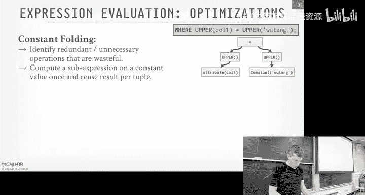
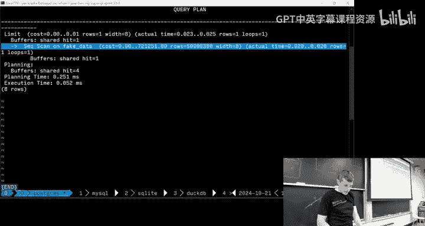
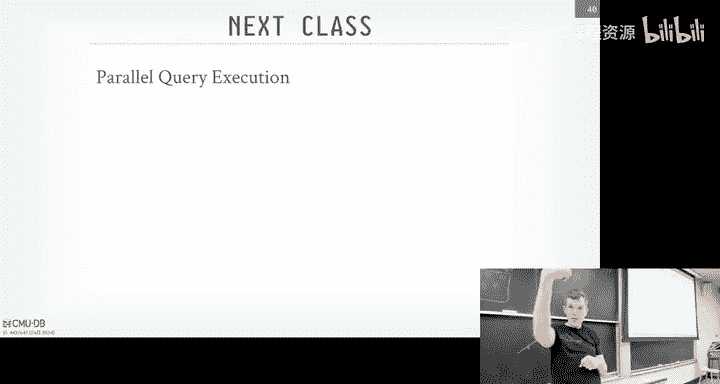
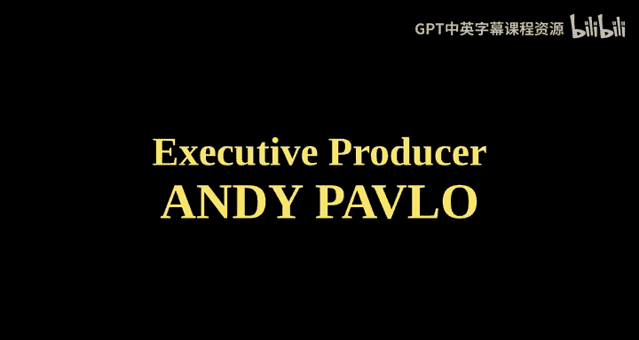

# CMU《数据库导论｜Intro to Database Systems (15-445645 - Fall 2024)》中英字幕（deepseek翻译 - P14：#13 - Query Execution Part 1.zh_en - GPT中英字幕课程资源 - BV1Tys8eQELW

Yeah。い？OffI sort of say this every year man it's almost November， it should not be 75 degrees。

But it is what it is， go register vote outside， I can't vote this year， but if you can。

 please go register， Okay， administrative stuff， Project two again is due this coming up this Sunday。

 who here has not started Project two。Excellent， fantastic。 Okay， So， of course。

 the people that are in the lecture。😊，Probably having started。 All right。

 so we having our Saturday office hours again， this Saturday。

 the day before it's due between three and 5， we'll announce this on Piazza。

 It'll be in the same location。 Any questions， comments or concerns about Project 2。😊，Yeah， yes。

But again， we gave you guys the test for that reason that we gave you all the tests for everything ahead of time so you can debug locally。

Allright， homework 2 will be out this Wednesday， and that'll be due in two weeks on November 3。

 and then midterm exam grades。 Almost all of them are graded。

 few people had to take take the makeup exam on the weekend。

 So those who need to get graded and hopefully we'll post those on piazza tomorrow。

 And I think the midmester grades are due Wednesday is。

 but that's on me not you guys the other things that that are happening。 again。

 we have a lot more speakers this semester that fall break is over。 So today we have spiced AI。

 there is a spiced TV that's different from these guys， these are spiced AI。

 Okay And so they're basically using duck TV data fusion。

 I think sQL light and everything all the ones doing。😊。

AI we'll figure what that means and then the Exxon guy is coming to give it a talk on Zoom next week。

 let's see whether he changes the name of the system by then and then Sonata is a streaming system and they'll be also using dataussion and they'll begin given call in three weeks again these are all optional。

😊，All right， so right before the fall break and， and the midterm， we were discussing joins。

And then prior to that， we talked about how to do sorts， how to do aggregations。

 these are the fundamental building blocks of the operators you would need to have in a relational database system。

😊，So now the question is okay， so I know how to implement In operators。

 how do I put this all together and run a real query？😡。

And that's what today and next class will be all about。

So today we're going to be talking about how you actually want to build the system to define specified how we're going to move data between these operators。

😡，When we actually want to executeQ queries， what does the output look like。

 how do we handle insert updated deletes？Right。So when a database system。

 relation database system is given a SQL query。It's going to convert it into a query plan。

And ideally， what this query plan to be a directed acyclic graph， a dag。

 Most systems implement implement them as trees。 We can discuss a little bit as we go along why dags are preferable。

 but basically if it's a tree， you can't reuse output very easily without do some trickery， right。

But for some simplicity say we do here， join an RNS。

 the query plan tree is going to look roughly like this at the leaf nodes。

 we're doing the scans in RNS。Then the R feeds into the build side of this joint。

So when we're doing hash join， it actually doesn't matter。

 the S speeds into the filter operator does the join and then produces the output we do a projection。

😊，So this again， this is the logical plan。 I didn't specify， I said oh it' probably a hash showing。

 but doesn't matter。 like RNS is not specifying how what algorithm we're using to exit this data。😡。

And that's what sort of today's class and next class will be about these。

Operator implementation are actually going to do and how they're going move data between the operators。

 And then next week， we'll pick。 We'll talk about query optimization and how do we decide of the choices we would have or given operator implications。

 which， which one we actually want to use。So this is pretty easy to understand sort data is flowing logically because we'll describe physically how we do it in a second。

 but data is flowing logically from the scan on R into the joint or scan on S into the filter operatoror。

😡，But now we can define boundaries within this logical plan called pipelines。

And the pipelines could be a sequence of operators， where。

The data can move continuously from one operator to the next without having to block or wait for more data to be processed。

😡，So what do I mean by that so in say we have this first pipeline here on R。

 I can scan R and assuming it encompasses say this is again the hash join a build side。

 I can scan R and feed into the build side of the join here。😊，But then at that point。

 the pipeline is done because I can't do anything else for all the data。

 I just this came out of R because now Ive got to do the probe。 Ive got to do the joins。

 the probe side of the join。 So the pipeline breakers essentially the boundary。

 the endpoint says I can't continue up with this any tuple in this pipeline until I run something else in my query plan。

 another pipeline。So pipeline2， assuming again we ask you pipeline 1 first， we do the scan on R。

 and now any will sorry scan on s， any tu coming at of S。

 we can ride all the way up to the top to produce our output。😡，Assuming we've already run pipeline 1。

 so I scan a 2。 S， I do my filter， I do my probe into my join， say the join predicate gets satisfied。

 if the people will keep going up， then I do my projection， and then it's output it。RightAgain。

 the idea of a pipeline is basically that， it's the。

 the boundary which we can execute a bunch of operators。

Without having to go materialize them into intermediate storage。

 have potentially a buffer that we have to spill to disk。

And then a pipeline breakers mean anything where we can't keep continuing we can't execute anything else until we get more- until we get all the tuples below us。

😡，RightThis would be obviously if we're joined on the build side。 if we take subqueries。

 nest queries that we don't derelate them correctly， we've got to execute the entire sub nest query。

 then as a pipeline that we execute another pipeline or like an orderbi clause's kind of obvious。

 I can't produce any output of an order by operator ignoring even heap scan。 you can't do this。

 you can't produce any output of an order by operator sorting operator until you sort everything because you don't know what the ranking the ordering is going to be。

😊，So this is the high level model that we're going to work with。

 and then the question we're going to talk about today is。😊，What are these lines？

I'm saying they're logical because it' logical logically data goes from R into the join。

 but what are we actually sending？And who's actually invoking us to send it？

So that's what today's lecture is about to execute queries。

So first I go about how do processing models。Again。

 this would be how we're going execute these queries and move data from one operator to the next then we'll talk about the access methods we've already discussed these in some ways like how to do index in this form。

 but that's the lower portions of the query plan where data is coming out of base tables but doesn't necessarily have to be。

 then we'll talk about how how to handle queries that modify data and then finish up with talk about how we actually evaluate the predicates。

In our wear clauses in our join clauses， like a equals 1， how are we actually going to execute that？

Yeah。All right， so a processing model defines how a database system is going to execute a query plan and how it's going to move data from one operator to the next。

😡，And just like before， when we talked about row stores， or the column stores。

 there's going to be trade offs in our system design that will be preferable for a OTB workloads of row store。

 essentially and preferable for a column store。In an analytical workload。

And then as we define our processing model within our system， we're going to have two mechanisms to。

 to。I' a control because there's a control flow。 But there are basically two mechanisms for how the data is going to coordinate。

The execution of these operators and producing output output tuupples。

 and then where it's going to go。So youre can have the control flow is the mechanism for how the data system is going to say。

 okay， you're the next operator I want to run， go ahead and run and produce your output。

 or it could be a pipeline or series operators。And then the data flow is going to be where and how the operator is going to send its results。

😡，And we'll see in one case， in the iterator model。

 they're actually going to blur the lines between the two of these。😡。

Because the way they're going to say， I have enough data to stop running me is the same way tells it stop running at all。

Right？And as we see as we go along， the output of an operator will depend on what processing model we want to use。

 and it could be either the entire tuple， it could be the subset of the tus， if it's comm store。

 and it can be one tuple， all the tuups or some of the tuples。And I I said。

 and there's trade offs for all of these。So the three approaches is going to be the iterator model materialization model and vectorized model and the hi level idea is that the iterator model is the most common one is what people implemented when they first started buildingated systems and just going to be moving tus one at a time。

 and then the materialization model be all the tuples come out of an operator and then the vectorized batch model is sort of a hybrid between the two of them。

And so a way to think about them is the mostces that you know about。😡，The Postgressrees， the Mysqels。

 the oracles， the Db2s， all those， the mongoes， most of the them are'm gonna be using the iterator model to send one tu at a time。

The materialization model is very rare， it's probably five systems in the world that I know of they do it。

 and then the vectorized model is more common in the last 10 years because this is what all the OLAPP systems are going to do。

😡，These are just snowflakes and your data bricks and so forth， they're going to do。

 so go we'll talk about the advantage and and disadvantage of each these one by one。

 And then there's a second design decision we'll talk about afterwards is like。

 are we moving the data from the top to the bottom or from the bottom to the top。

But that's orthogonal to the processing model right now。 we'll cover that afterwards。All right。

 so the iterator model is the most basic one， again this is the most common implementation that especially in row store systems that they're going to use。

😊，And so each operator in your query plan is going to have to find this or implement this API that that is provided in the system that's going to have basically three functions。

There's a next function that says， all right， give me the next tuple that。

The operator produces the next tuple that's be part of the output of the data that's processing。

And the idea is that the parents gonna keep calling next over and over and over again on their child child operator keep getting more tus。

 And at some point， the child operator says， okay， I don't have any more twos for you。

 And it sends back on a null pointer or end a file marker to say， okay。

 there's no more tus for you from coming from me。 Never call me called next on me again。Right。

And then what's going to happen is because we just have this sort of simplistic API I'm just calling next。

 now we can compose these operators together such that if I'm some operator and I have a child。

 I don't care how that child is actually producing data。 I just know that I got to call it next on。

 So I don't care whether it's coming from over the network or coming from an index or coming from a sequential scan on a local file。

Or it's actually a subquery。😡，It doesn't matter， I can intermix these operators and everything just sort of works together nicely。

😡，There's some extra metadata we can maintain about the state of an operator。

 So we have to have open and closed functions So think of like when you call open on an indexant operator。

That's like I creating the the iterator for your your B plus tree that you instantiate the iterator。

 you move it， produce one tuple。 And then when you call it next again。

 you just move the iterator over by one and get the next tuple。

And then when you reach the end of the scan， you return back in a file。

 and then the closed function will you can go ahead and clean up the iterator？

So as said this approach using most data systems， you'll see these sometimes called the volcano model because there was a guy。

 the guy who heard that book on the B plus tree that we talked about before。

 he had a very famous paper on a query optimizer and a processing model called the volcano model where he described how to do this to extend the iterator model to do parallel queries we'll see that next class。

 or it's also something as the pipeline model because again the idea within you call next going down in a pipeline and the tube will rise all the way up to the top。

😊，Right。All right， so we look at the high level diagramm， so we have a simple join on RNS。

 and then we have a predicate on S dot value greater than 100。😊。

So I normally don't like to show code， but I think this is pretty simple for you guys to understand。

 so you can think of like each operator implementation is going to be essentially a for loop。

Over some data source that they're getting from。 So the bottom guy on the scan scan R， right。

 It's getting every single two in R。 But the ones up above， they're。

 they're getting tu posts from their from their children。

So you can think of all these functions like these are like the next calls。

That all the operators are going to in voteke on each other。

So when I start off right you start at the root of the query plan and so you have this first query plan up here and you call some the data system calls next on this function。

 and inside that we see we have a four loop， we're gonna get every single tuple from its child the next function from its child So this will be a blocking call。

 So when the first guy at the top calls child dot next there's a blocking call that then jumps down to the operator below it and its next function implementation says okay well now I want to start scanning data to start producing output to my parent Well the first thing it has to do is go build the hashhe bugs because this is going to be doing a hash join So again。

 so first thing we do is we do a scan for every single tuple on the left child called dot next and then as this thing gets a vote down here。

 that it jumps down here and then now we do the scan on R and then for every single tuple in R。

 we call admit almost like a yield function if you written like a python naerator and then the data goes up as a single tuple goes up to。

😊，The parent and the joint operator who then inserts it into the hash table。

 and then a loops back and calls next again on its child。And get until you know。

 keeps going to get all the twoos。 And then at some point。

 it's done So I don't have any more tuos for you and doesn't evoke it anymore because now the hash table has been built。

Then now we drop down to the to the right side of join。 And again。

 this is still from one call next from the root root node。 one call and next says， okay。

 I can't admit any tuples for you until I first build my my my my hash table。

 So I got to go iterate on on R until you run out of the tuples here。

 Then I'm now gonna come down the other side。 It calls get next on on the the filter operator。

 which calls get next on the。On its， on its child， which is the scan on on S。

 And it keeps producing tubs up1 by one， which then bubbles up if they pass the filter up to the。The。

 the joint operator。And then now I can do a probe in my hash table， and then if there's a match。

 then I produce a tubo at the top up there。Pretty straightforward for it， right？So again。

 thinking in terms terms of pipelines， pipeline number one is the scan on R。

 And Im really easy way to show this。 but like it's the and the build side of the join。

So it's this operator here， the scan R， and then the first part of the joint operator when I build the hash table。

RightAnd again， the pipeline breaker is that I can't。

 I can't produce any output for my child up above because I still have to go the right side and call the right child question。

For each quarter。The second。Why is it that we go？别 tire退过。Here， here。So questions。

 if we go back here。Why I have the go call left out next to get every single two in R before I get on the right side？

😡，呃。Like for each call next， we're looping through the entire table。Yeah yeah， yeah， sorry。

Think of this like as a this is an iterator like， like， so I call get next。 And then。

 then when I call admit， this's like a。I'm returning control， but when I call on next again。

 I'm picking up where I left off。Right。I don't want to share like again it pseudo code。

 I wasn't trying to show that。 Yeah， it's for one get next， I only get one tuple，But now， again， the。

 trying think there are， there are' any situations where you you could do that。 But like the。

 the thing up above， the parent doesn't need to know how this thing actually implemented。 So for say。

 for some reason， it did have to scan everything all over again。

 It's still only to produce one tuple。But that the thing about b doesn't doesn't care。Also， which。

 which you could happen， which we'll see in in a second in the materialization model， but like。

If I really wanted to say somehow like scanning R was really expensive to keep sort of doing it like piecemeal。

 So I could to scan all of all R， produce some， some buffers， intermediate results。

 And then every of time I call get next on this， it produces one from that buffer。 But again。

 up above， I don't know whether that happened or not， I don't care。Okay。So as I said。

 this approach is premise user knows almost every single data system that's out there。

 it's the easiest thing to implement， this is what busTub uses。

 it's easier tobug because you just walk through the code and see all the function calls and then see how things break and again speaking from experience and speaking from students working on bustub for years。

Another nice advantage of this is that the output control is really easy with this approach because if I have a limit clause up above。

 like last give me the top 10 twos or give me only 10 twoples。

The way I implement that is I just stopped calling get next after I got 10 things。Right。

So this web where the control flow and the data flow logic paths are sort of intermixed。

There isn't a way to say， hey， go stop going back here。

I don't have an easy way if this thing is scanning。

 I don't have an easy way for someone else to come in and say， hey， stop scanning， kill this query。

 stop what you're doing。Right， because you've already。

 the stack has gone down and you've recursed into the query plan。

 and it's doing whatever wants to do。 and you have to have sort of a side channel method to kill it。

Yes， back？question why there are two pipelines instead of one。 So again， I scan R again。

 think of like the build side of this as part of the first pipeline。 I scan R build the hash join。

be able to hash table for the join。 I can't produce any tuples as the output。

Until I build that hash table。Right because what would happen if if this thing was running and then I have 100 tubos。

 but I insert 100 of them and I keep trying to put the rest in。

 and then I start running this guy over here。 Now when I do a probe in that hasht。

 I may under a false negative because the tula that I would match just hasn't been inserted yet。

 So so the data set knows that the dependencies between the pipelines and say， okay。

 this first pipeline can run。 And second pipeline cannot run until this one finishes。😊，哎。

And like I said， pretty much every single data system you can think of， for the most part。

 anything that's a row store will be doing something like this。

The alternative model is the materialization model。And this is， there is still a sort of。

Next function， but it really is like give me everything。So instead of producing one tuple。

 anytime you invoke down the operator， you get all the tuples from that operator。

 and then at which point you never go back and ask it for more data because you have everything that you could ever ever possibly need。

Right。And again， you would， you， you could have't produced either a single sorry。

 the all the tus or sorry all the attributes or columns for for the tu or are subset of them。

 Obviously， if I have one， you know， one petabyte table。

I want to try to push down as much as I can into the scan operator because I't to pass something along one petabyte of data when maybe I only need a small portion of it。

So this is a。This technique was developed in the 1990s out of this project called MonetDB。

 I think I might have mentioned MoonetD before， came out of the CWI school in Amsterdam and the first version of DuckDB was actually an embedded version of the first version of DDB was called MonDb's light because it was like an embedded version of MoidDB。

 they threw all the code away and then rewrote it based on what the Germans do。

 but it's from the same school。So again， I don't want to show code because it have to。

 So now instead of having single the next function and producing sort iterator model。

 we emit Tple's output as output。 now there's a return clause that says， okay。

 here's my output buffer at all the tus that I'm gonna need for this operator that output buffer and then never turn it back。

😊，So just like before， I'm to start from the bottom。

 the root calls Ch out output calls down into here， again now we're doing a hash joint。

 I got to call a left out output that jumps down to here。

 now this scan operator can produce all the tus from R into this buffer that gets passed up into here and then now I can build my hash table and then I come down on this side of the query plan or the pipeline and then do the same thing but scan S。

 produce the output， pass it into this operator then passes up that operator。

I think it is a good idea or a bad idea。I've sort of said before， why was the bad idea？

I'm just taking this game right here， right？ So what am I doing， I'm taking all the Ts and S。

 adding to an output buffer。 and then now passing to this operator who's just going to scan through it and apply the predicate。

Again， always think of the streams， I have a billion twos， but my pred is only to match two of them。

😡，That sucks， right， because I just passed a billion tus to only throw away 99。9% of them。

So a realistic simple optimization you can do in this world is what's called operator fusion。😊。

Where the idea is basically in line or combine different operators that are within the same pipeline where you know that you don't need to have that sort of excess copying。

 So in this case here， it says scanning the output of this guy and then apply the predicate。

 well I could just do that all together once scan R， then apply the predicate。

 if it matches put them mine to my output buffer。So you can use for projections。

 you can do this for filters。Not， not， not， you can't do it for everything。 You can do it for limits。

 If you know you don't have an order by up above， right。And then just like before。

 the pipeline breaker would be， I can't。Can't you know， keep writing tuples up。

 I really really do pipeline。 wouldn't do pipeline in a material model， but you know， I can't。

Can't produce an output of this operator here until I first build my hash table and then do the probe on the joint。

So Moon N be started off as an OAP system。😡，originally designed as a overlap lab system。

 And It was one of the first column store systems。 And was meant to be idea like processing entire arrays。

 of。Of certain entire columns of tubs， and that's sort of why they thought it would be good to have this fertilization model。

It's only really useful in the O TP world because in that world。

 the queries are only accessing a small number of twoples at a time。 So yeah。

 you're going to materialize the entire output of the operator all at once。But。If you do that。

 then you never have to go back and get more data。😡。

So if you call like think of the get next in the iterator model。

 I say' my apparatus is produce one tuple， I call get next， it gives me one tuple。

 I call get next again， then it comes back and says， okay， end a file。Right。

Those function calls actually add up， especially if your database is in memory and your  careers are really。

 really fast。Because it's a jump call in the CPU。So if you now if you have sort of designed like an array。

 like I know this thing iss going to call this， this is going to call this。

 and you actually don't even have any indirect to figure out what needs to call what。

You just can w through that array and call these operators produce their output and pass it one between the other。

 and it's much faster。But you can only do this for OTP。

Because the output coming out of one operator is really small。

So this is actually what we implemented in H storeR over 15 years ago。

 which then got put into the commercial version of OTB。

And then C Db is that a Europe Raven Db is a document store based。Similar similar like Mongodbe。

 these systems use it， but Moidity be and high rise。

 Mo high riseise where the Oap system is trying to do this， Mobe still does it。

 high riseise got rid of it and switch to the next thing we'll talk on the next slide。So again。

 good for OTP， bad for OLAPP。But we kind of we need something in in between， right。

 We know that if we're。For OAP， something calling get X is going to be expensive because I have to scan a billion too I don't want to call getting next a million times。

But then I don't want to materialize everything all at once because again。

 I want to be able to break things up and paralyze it and not worry about， using all my memory。

 just produce the intermediate output of an operator。So the obvious the X is do something in between。

It seems obvious now， but again， this has only existed since 2006， 2007。

Because people are't either doing materialization model the or the。Iterated model。

So the vectorization model is basically like the iterator model。

 but said when you call get next instead of getting one tuple， you get a batch of tus。Right。

 think of like something like 1024， like 1000000 tu or something like that。

And then now you're giving a back a batch of tus and now the operator that got that batch of tuups will process on them that entire batch before it goes back and gets the next one or produces the output up a above。

Right？So we'll see in second。 theres a bunch of tricks you can do now because you know you're processing on a batch of tuples that you couldn't really do easily if it was a single tuple。

 again， ignoring you can do all these tricks。 again， if you have all the tuples。

 and then they becomes almost too big。Like， for example。

 if you know that all of the tus forgiven attribute within a column are coming back with the exact same value。

 like integer id equals1。Then instead of storing that entire vector of 1，1，1，11 over again。

 you can have a constant vector and says I it's like run length encoding。

 I have the value 11 thousand times。 Now， the thing you're passing around is super small。

Like duck D does this underneath the covers。 When you're running queries， tries to figure out， do。

 do I have constant values and uses them， You can compress the the data as it comes across。

 like do doing does coding and other things that we talked about before。

 because now you have a column of data columnar data。Right。So going back to our example before。

 again， this is with sort of the iterator model， but instead of now passing the single tuple。

 we're passing back a vector， So just like before we call get next。

 go down this side of the pipeline and then now we have an output buffer that we're filling up and then when our output buffer exceeds some size。

 then we produce it as an output。😊，Not showing extra code you need to have outside the for loop if you have like the buffer was't completely full since the last time you iterated。

 you send whatever remaining amount you have goes up as well。Again。

 so this stands back a twoa batch and everything just works just like before。Appreciate what。Alright。

 so as I said， this thing has only existed since 2006，2007。

 the original paper was was a project called based on Moon8 B called Moon A B X 100。

 They tried using Moon B to do to run on modern CPUs and they realize here's all the parts that are super slow。

 And one of them was the materialization model。 So they forked the code and built a sort of a high performance system that's based on the vectorization model。

 Like nowadays， it sucks because you say if you Google like vectorization model or vectorization database。

 You're can find all the vector DB stuff。😊，You may also still find a bunch of Cdy stuff。

 which we'll talk about next class， and that's clearly independent of this。

This is just saying I'm passing back， when I call my operator， they're getting back on vector tus。

 faster tubs。So as I said， pretty much every OAP system that has come out in the last 15 years。

 that even the old ones have been retrofitted to now follow this approach。😡。

RightBecause the advantages， especially on modern CPU。

 are pretty significant because now you have these kernels that are iterating over batches of tu the same thing over and over again。

 And that's exactly what modern CPUs want。They don't like indirection。

 they don't like students running these instructions and these other instructions and these other instructions。

 if you say here's a stride of memory of data， do the exact same thing a thousand times。

 see ifs love that。 That's the best thing to get you'll get the best performance crs of this。

Right right。So again， if you're building an OAP system today。

 you pretty much want to use this approach。Alright， so again。

 we talked about the three processing models， iterator model， materialization model。

 vectorization model。 If you're building a row store system， you want to use iterator model。

 If you're using an all that system， you want the vectorization model， materialization model。😊，Again。

 it's，' it's pretty rare。 If you really care performance at L TP， you could do something like that。

So in all my examples that I showed just now。The way the query was actually executed is that we started at the root of the query plan。

And we called get next on the root， which then percolated down called get next on its children。

And the essentially what we're doing in that world is we're starting from the top and we're pulling data up from the leaves to the top to produce our output。

This is how most database systemss are going to be implement it， but it's not the only we。😡。

So that approach would be called the pull approach， the pull direction。top the bottom， again。

 you always start with the root and you pull data up from its children。Right。

The alternative is to start at the bottom。The leap nodes of the query plan。

Have them execute and then push data up to their parents。Right。Concept， the sort of the same。

 But the when you start doing。When you start fusing in the operators that we talked about before。

 you can do some crazy tricks and be very， very efficient if you know you're doing a pushb model where you're not going to be calling get next on something else。

Because again， that's indirect to the CPU and in some systems in the case of hyper。

 I should also put Ubra here U is the other one that CDb does this as well。

 but not only are they trying to keep data in CPU caches。

 they're trying to keep data in CPU registers， which is the fastest memory you can have I know I say we weren't gonna to talk about low levelvel hardware below CPU caches but then get insane performance is because now for one tub but。

 I can wide it up a pipeline as far as I can and just sit in CPU registers。

And that's going me the fastest memory you can have to execute things。

So this what the pushb model looks like。So we're going to have two pipelines there before。

 and so in the first pipeline here， it just looks like what we had before where now we're going to scan R but instead of calling emit or pre some output that we then passed to another operator。

😊，It's just going to scan R and build the hash table。It's just this folder here。

Then now in the second pipeline， now we're going to do that fusion we saw before。

 we're going to scan S and immediately evaluate the predicate， and then if it does put the hashea。

 and then emit it if it does。It's part of our projection。So the thing though。

 is gonna to be different than the pushbase model of the pullb models。

 Now we don't have this get next thing thats。Tickling the operators， telling them， okay。

 it's your turn to run， producing some output。 We now need a sort of coordinator schedule that。

 sit's above all this。Which then now makes explicit invocations to these operators to say， okay。

 it's your turn turn to run。go ahead and go， this thing runs to completion and then it's going to be nos sort of be set up ahead of time because that's part of the query plan we would generate it's going to know okay。

 the hash table to generate iss going to go at some location in memory in the buffer pool or whatever。

😡，And then now once this thing is completed， it says sketch says。

 okay I know pipeline1 is done now it's time to put pipeline2。

And it's already baked in or you're passing in。 Here's where the intermediate results of the hasht you cared about that was traded by the first pipeline。

 Here's where to go find it。 Now， it can just run completion， produces output like that。Again。

 so you can do this sort of operator diussion in the different models。I。

And I'm not really showing here， in this case here， it's。The for that is operating on a single tuple。

 but it could be operating on a vector tus。😡，You can mix and match these different processing models and the processing direction。

based on what the work they're trying to support。So the top to bottom approach I。

 is the most common one， it's easy to control the output like how many tubs you want because you just tell。

 stop calling next。You don't need any explicit mechanisms in the operators themselves to say， okay。

 I've got enough data to stop。The parents are you know they keep calling get next。

 that's going to have an overhead， of course， because you especially if you implement that's C+ plus when now you you basically have an operator interface and then you have to look up the virtual function table on C++ to say。

 okay， what actually implementation do I have？And then as you said before。

 the CPU cost of this can be actually kind of high。 Now， again。

 if you have to go to speed out a disk and read something disk。

 who cares about your your branch call and your jump call and your CPU。

But if you in a well tuned system， you try to keep much as memory as you can。

 this can start to matter a lot。The bottom to the top approach， the push approach is rare。

 but you can have really tight control of where data is actually being place。

 you can in caches in registers， you do need to have additional mechanisms to say， okay。

 Ive got enough data， stop running。Like you basically have to embed somehow in those sort of nested foolops that I showed before。

 a way to say， I've got enough， I got to quit。Whereas you don't have to have that explicit control in。

 in the the pool model。So Im saying this is rare，ductDB actually originally started off with being a pool brooch。

😡，And then they decided to switch over to this， and one of the things that they highlight is having the ability to have a separate control flow。

 control mechanism for these operatorsors made engineering the system actually a lot easier。

Snowflake follows this approach as well。But the， like I said， the， I didn mentioned this before the。

 the Mo project I I mentioned before that like the way they， they developed a vectorization model。

 those two researchers then went off and built a commercial system called vectorwise that got bought by Action and and。

Which is sort of a holding company for old databases。Eventually got killed off。 But then Marcin。

 the guy that developed the recization model， he then went and became a cofounder of Snowflake。

So the guy they invented vector his model also founded it Snowflake。

 and a lot of the ideas that he developed on that earlier Mon DD system is what Snowflake is based on today。

So that's kind of cool。All right， so any questions about processing models or processing directions？

Yes。Can you explain in more detail at first bullet point？To to。Yeah， question， your question is。

 what do I mean herete control of CPU caches and registers and pipelines。 So going back here。

We're not gonna talk about this right。 We're not talking about this semester， but like。

In some systems， you can actually。Just in time compile the code for this because now you you're just nesting onto four loops and you can have really tight control of like。

 okay， how big should my batch be， Okay， well I know my CPU has this amount CPU cache or maybe this amount of registers so I can decide what increment do I want I want to iterate over in the four loops so I can decide。

 okay， I want to keep everything in CPU registers So therefore only look at a single tuple。

 And then now I can control when I call these things that it's more likely to get sit in CPU registers。

And not L1 and LL2。Whereas as soon as you have a next call， I mean， that's all over。

Because they' had the jump in the CP instructions。Okay。All right。

 now we're going to talk about access methods。Um。Again， the access methods is basically the。

 the leaf nodes of the query plan。Again， this is independent whether we're doing you know iterator versus vectorization or push versus pool。

At the end of the day， we got to get data out of our tables that people have put data in， right？

And there's only really pretty ways to do it。You do a sequential scan。

 which is the brute force approach which is reading every single page until you find either what you're looking for or all the tuples。

You can do NX scan， and there's a lot of different variations of this based on whether it's a hash table。

 itll be plus tree， a try or whatever data shop you have。嗯。And then the third approach。

 you could do a multi index scan。We can kind of mix and match we have a bunch of indexes instead of just picking one。

Pick a bunch of them。And then combine their results。We'll see that in a second。Right。

And then depending on the sequential scan， if it's clustered or non clustered data。

 you can make various optimization choices based on that。All right， so go again。

 this is like the default choice if I have no indexes or and no index is going to help my query。😡。

It' it's the most basic thing you can do and it's probably what you wouldn't implement first when you build a new data system because it's's a way to prove the way you got you're storing the data you expect to be in there。

😡，Right， and so it's a really basic loop for every single page in my my table。

 Go retriever from the buffer pool using the page Id。

You use the page directory or whatever the mechanism to go get that data if it's an LSM。

 you got to basically look at everything。Or just look at what's the you the way to figure out what are the。

Yeah， select star without a where calls an LSM， you you have to basically look at everything because you don't know whether there's something in a lower SS table that you haven't seen before。

That isn't an upper level， and you to make sure that you catch it。So again。

 this is the game where LSM will be actually worse for this， but assuming we're doing on heaps。

 get every page。For everything go the page， evaluate and preica and then do something。

And then in our operator， as I said before， it's basically like an iterator in the scan operator。

 itll be like an iterator in Python where I keep track of my cursor or what's the last page I looked at in the last slot I looked at so that when I call get next or however I'm producing tuples as part of the scan operator。

 I know how to continue along where I left off last time。So if you think， okay， well。

 this is the most brain dead thing you can do the today it's basically reading every single page。😡。

Is there any way to speed it up？Let me take a guess？In many of my ideas。

 how to make a sweat can go faster。Whats that。Paralyze it， you said。Was that vectorization， sure。

Pload pages， excellent。 Al right，3， Alright， perfect。 We've already discussed a lot of these。

 parallelization， Veization are new， but we already talked about preloading， pre fetching。😊，Right。

 so you think， again， this is like the， the worst thing you can do in dataism。

 But we've already discussed a bunch of ways to actually make this go faster。

We talked about how to I compress the data so that when I go fetch a page。

 I get more tu than I would if it was uncompressed。

We talk about prefeing or scan sharing a bable bypass If I'mqueinching。 you know。

 I don't want to pute my， my buffer pool with data。 I know I'm not going to need right away。

Task parallelization， the multi threading and data parallelization of vectorization we'll discuss that next class。

 clustering and sorting， we've already talked about that。😊，Right depending what my wear clause is me。

 I want to sort of the data first， then look at over the sort of data。

 late materialization we talked about， right， Just pass around the record I D。 If it's。

 if it's a column store in my query plans and I go back the get back the data that I eventually need。

 right。Data skipping， we'll talk about next。 We're not gonna about materialized view and result caching in this。

 this class。 But just think of like result caching is obvious。

 select star from data from select star from table where Id equals Andy。

 If I see the same query over and over again。 rather than is running it。

 I just have a cache and says， oh， yeah， you want， I D equals Andy。 Here's the result。😊。

Chaairized is a bit more complicated， you can have a more complex query that you then store as an in result and queries can then maybe execute get sub portions or subsets out of that result cache。

 rather than blindly returning back the result。😡，Now， of course。

 then this is tricky because how do I keep these things in sync with the actual table？😡。

We'll discuss a little about that we talk about courage control。Code specialization compilation。😡。

We won't talk about there' too much this semester， but I'll talk about a little bit about compilation at the end of this class。

 It's a way basically saying， instead of having giant switch calls and say， if my operator is this。

 do that or if my data type is this， do that。😊，I basically want to Jt or precompile a bunch of stuff ahead of time so that since I know what the data is gonna to look like because it's a relational database and I've been told the schema。

 I can say， okay， I know exactly what this column looks like。

 I know how to run this predicate you're trying to run。

 Here's the exact function I precomped that does what you want。And it'll run really fast。Rightright。

 we wont again， these don't discuss too much。 but I won't talk about data skipping。

So the idea of datascaping is sort of。It's sort of like an index， almost like a filter。

 basically saying， does the thing I want actually exist？And the basic idea is that it's a way to say。

 I know that there's some subset of a table that I'm trying to scan right now that I don't need for my query because I look at the wear clauses。

 I look at the prediates and say。know this is what I'm actually looking for。

 and if I have some precomputd data about my tables， I can make a decision。

 I know there' are certain pages or blocks I don't need to read。😡，So。

There's basically two approaches， there's loss e versus lossless。

 similar when we talk about lossy compression versus lossless compression， right？

Lawy compression or data skipping we won't talk about， but the idea here is that。😡。

If I know my query doesn't need to see exact results。Then don't scan every single page。

I'll just sample the pages。And then I could have some kind of statistical confidence to say。

 how accurate is my request。So in a lot of systems， they'll have， especially the cloud system。

 the O systems，'， you know， they'll have。The standard aggregation functions that we talked about for count min Max average。

 but then they'll have approximate versions of those that count approximate。

 I think is called an Oracle。So that'll be， okay， well。

 I'm just gonna get a subset of the data and compute your average on that。

 And that's probably good enough for you， depending on the needs of the application。

If you were say how many people visit my website in a single day？You know。

 if it's 999 million versus 998 million。If I'm off that much， do I really care， probably not。

So there's a lot of different application domains where you you。

 you're okay with the approximate results。 but the data system won't do this explicitly for you。

 sorry implicitly for you。 you have to tell， I really want this to be approximate。

 And then some systems can give you bounds of things I can get pretty complicated。

The thing we're going to talk about instead is actually Z maps。

 and basically this is just precomputer information that says。

 here's what the data looks like at a high level inside a given pages or a set of pages。😊。

And then you can decide whether you actually want to go look at it or not。

And you can have really fine graining zone maps within like a single page。

 or you can have more coarsegra zone maps for a large number of pages。 And obviously。

 the larger it is， the less selective you may actually be may end up having a look at more data than next you want it。

😊，So pretty much every single data system now supports。

 at least an OL upside side supports some notion of Z appss。

so let say we have a really simple table with one column with five values right so our Zoom map to be precomp aggregations that we have before。

 main Max average sum count。😊，And then say this is one page， has this data。

 all my other pages would have similar done maps。And then now when my query comes along。

 select star from table where value equals value greater than 600。😡。

So even before I look at the pages for the data， I'll look at the zone map and says， okay。

 well I'm looking for values where greater than 600， but I know my max value for this column is 400。

 so I'll never find a match in this column， so therefore I' can just skip reading this entire page。😊。

And again， think on larger scale， I'm showing five tus if I had 1，000 twopos or a billion twopos。

Then that's a huge win of skipping all that data。So the open source file format that we talked before。

 parquet and orc， they support this out of the box。

 and then pretty much all the column store systems will generate something that looks like this。

 I'm using the term zone maps。 That is what Oracle calls them。 I'm sure it's copyrighted， whatever。

 but that's sort of the canonical term。 Everyone uses same way Kleenex as a face tissue。

 you just say Kleex someone knows what you mean。 So you say a zone map。 It's It is the oracle term。

 but everyone knows what you mean。 The original paper calls them small small materialized aggregations。

😊，And materialized again means that I'm precomp it I'm storing that precomp result。

 so I'm not competing on the flight and then I can use that from one query to the next。Alright。

 so that's squ scans。 Like I said， there's a bunch of optimization we can do。

 Some of them we've already covered， some of them will will cover in the future in in the next class。

😊，Now， the other choice again is it give me an index game。

So the idea here is that we the applications create indexes on our table that we're trying to access。

And then a query shows up and at runtime， the data system has to figure out， OK。

 what's the best index I could use？For this particular query。

 and's a bunch of different choices the system can make。

 like does it have the there the index chain the attributes that are in our query is is the the predicate going to be very selective if he uses the query or by still going to have the end of doing a complete leaf node scan。

😊，Is it a unique index or nonun index？ So there's a bunch of different choices the system is going to make to decide what's the best index I want to use to execute an index scan。

That's not this class， that's next week when we talk about query optimization。

We're still sort of dealing with high level things at the logical level。

 although we're talking about physical scans now。How to decide what's the best index for my choice of indexes to use is going to depend on a bunch of different factors and we'll sort this out next class。

But let's look at a simple example here， suppose we have a single table with 100 twoples and we have two indexes on this table。

 we have one on the age， one on the department。And so in scenario one。

 there's 99 people under the age of 30， but only two people in the CS department。

For this given query is the query is trying to find everybody that's under the age of 30 that's in CS and is in school in the US。

😊，Right so now the other choice to be， there's not9 people in the test department。

 but only two of them are under age of 30。 Again， we have to decide which index we want to use。

Becauseuse we have both of them， obviously in this one。

 the index on departments be better for us because there's only tub peopleule in CS departments。

 if I use that index， I'm going to get those two tuples very， very quickly。Whereas if I use age。

 then I'm to basically doing a leaf node scan， and then I still got to go look up the twoples to see whether they're going to match on the age or not。

In this case， the scenario is the better index is on。So this one， two people in the。 Yeah。

 this one better in is better index on age because I'm only looking up again。

 I'm I'm gonna find the two people instead of doing the complete scan。😊。

So this choice is pretty obvious。😊，Which we want to use？

But there are other situations where both of them look pretty good。

And so I actually want to use both of them for my query。And this is called a multi index scam。

I think Oracle calls them， I think multi index scan。

 process calls them bitmap scan because they generate bit mapps and then union them or take the intersection which I'll show the next slide。

 My SQL calls these index merges， but all the high load they basically doing the same thing that we're going to use do do multiple scans on our indexes。

 get back the record IDs of the matching tus。And then do either a union or intersection based on whether it's an an clause or an ore clause in myware clause to then figure out。

 okay， what are the matching record IDs， then go fetch them。

AndNow you see why have we negative a big about having this sort of generic API for our operator so that we can compose them in any different ways and not worry about one parent has to worry about how the shot up are is actually producing data。

 because now when I call get next， seems I'm going to iter a model with this approach。

I'm actually going to do the index probes first， get the record sets， then do the union。

 and then now walk through and find the the tus that I want。 So I did a bunch of work on the first。

 the first next call。And then now any subsequent call will just be reusing those cache results from the。

 from the intersection or the union that computed。So let's see what it looks like。 So again。

 so say we have the same query here， both of them， the indexes look pretty reasonable。

 so we're going to first retrieve the record Ids on age less than 30 using index number1。

 then we're to get then we're going now do the lookup on the second index where department equals Cs。

😊，Take the intersection of the two results of the two indexes。

Then go fetch those tubs to see whether they actually satisfy the last predicate or country equals US。

My hand waving here probably doesn't help， so let'ss actually look at an example。So again。

 Im first can do the lookup on the age， get the record IDs， then look up on CS department。

 now the intersection of these two record sets， record ID sets are the ones that that match on this predicate and the other predicate。

Right。And then now I take those records that matched， go fetch them from the pages。😡，Right。

Because I know where they exist because I have the record I and I convert the record I into page number and offset or file number page number offset。

 right saw， we all had to do that before。 Now， I see all these things are fitting together。😊。

I go get the records， then apply the other predicate。

 and any people that matches that less predicate or this final predicate is then produced as my output for my operator。

The way Postgress does this， Postgress does this。It's called a bitm scan because these are actually bit maps。

 So for every single tuple in my table， the bit will be set to one if it matches here。

I think in Oracle， they actually do sets and they take the intersection of the sets。All right。

 so we've covered how to do sequential scans， index scans and multi index scans。

 That's the basic three access methods you have to read data。We basically at this point。

 we we now know how to run select。But now we get data inside our database。

 and we've got to be able to modify it。So we modification queries。Yes。It question is。

 in this example here， am I building annex on the fly or am I using existing one， does not matter。

RightAgain， the operator like。You would have so in the case of like SQL server。

 they would have a special operator calledpooling index scan。

 and it knows to build the index on any tub coming from its child。

 So you would have the index scan and below that would be the sequential scan on the data on the tub。

But again， you can imagine though。Like you could do me it getss the iterator model。

 you have index scan， the spliting index generator， the index creator。

 and then below that sequentialcho scan， so you can sch your scan。

 feed twoples up to record the operator then builds the index。

And then that's a blocking call when youvoke that thing。 Then now when you call above that。

 basically the index hands， okay， now I have my index。 now you can start scanning and probing it。

 produce output up above。 And all the rest of the system the rest of the query plan doesn't know that you created the index on the fly。

 It doesn't matter。 You're getting tuples。All right。

 so we' going to talk about how we do inserts ups and deletes。😊。

The other DMLs or the other modification queries you can do are there's upt， merge and trunkate。

 we don't need to discuss those ups are just basically I check to see whether a T exists， if it does。

 I update it if not I insert it。😡，It's a sort of shortcut way doing that truncate is basically deleting all the tubs。

The way you implement that is just drop the table from the catalog and just re it。

 That's faster than doing a special scan and deleting it。

And merge is basically a join in producing outputs， it's like an up。All rightSo for In up delete。

 the idea here is that those operatorter implementationations。

 those operatorer themselves in the system， they're responsible for actually modifying whatever tables they want to modify and also updating the indexes。

 as well as checking any constraints that may be violated or that are placed upon the table to see whether the change you're about to make is allowed to happen。

And then the output of these operators will either be the record IDs that got modified or inserted。

 or in some cases， if you care about the result of the tuple you modified。

 like if you have an update query， you can pass this returning keyword at the end of it and say。

 update the query， so update the twos or update the table and also return me back the tuups that got modified in their modified form。

😡，But by default， I think you just get the number number of things insert， update it or delete it。

So for update and deletetes， the idea is that there'd be some lower operator in our query plan that's responsible for finding the two pool we want to update or delete。

😡，And then now they're passing up those record Is。 and then those update delete operators are just saying。

 okay， now the record I， let me go ahead and make the change that I want。So again。

 we have these composable query operators。Think about what your update query looks like。

 update table set value equals true where then some predicate， that where some predicate。

 that's just a scan， either index scan or sequential scan。

 that's a scanning down below producing tus as part of this output that then feed into the operator who then complily the update。

😡，So you don't need to reimplement。The access methods to scan data in your update operator because that would be redundant and all the optimizations you'd have for multi- indexdex scan versus other kind of scans。

 you have to re implement and all the update operators instead you implement it once in your scan operators and then that just feeds twoups up to the updates。

One thing we argument to do though， is also keep track of the tus we've seen before。

 because now if we're doing a poolbased method like the iterator model where I'm calling get next gett Next gett next。

 I may end up in my update operator updating the index that then I'm scanning down below。

 so I may do an update that changed the position of some tuupple and now I keep scanning and now the scanning says up and I found this another tuple。

 but it's the one you just updated。😡，We'll see you in the next slide what happens here and what this is called。

For inserts， there's two choices， one is you have the insert operator itself be responsible for materializing the tupa that then gets inserted into the operator。

😡，This is what bustub does， it's a most sort of simplistic way to do this。

The second choice and the better choice is， just like before。

 where you have scan operators feeding tus up into the updated delete operator。

 you have some lower operator that's going be constructing the tus or materializing them。

 And then now， when you pass them into the insert operator。

 it just blindly takes whatever you're given it， it has to check constraints， of course。

 But then it inserts it into the table。So the second choice is better because this allows you to support select into where you can take the select output and route it into side of a table。

 That's just another insert operator into a select query， right， The select produces the output。

 and then it writes it into a table and the insert operator can keep passing it up。

 So you see the result。😊，Right again， this this， this innerplay of proposing things together is really neat。

All right， so let's understand this update problem I mentioned before。

So let's say we have a table of people。😡，And then we have an index on salaries。

 how much money people make， right？And it's the end of the year bonus or something。

 and we want to bump up everyone's salary by $100 if they make less than 1100， right？So again。

 say I'm doing the iterator model and a pullbase method。

 so I'm going to start executing this thing for every single tuple in the child called get next。

 this is now going to be an incan operator。😡，And this is going to do a probe into our index。

 looking where the salary is less than 1100。So again， since， since the B plus3。

These things are sorted based on that salary， so I assume I do my initial probe down to the leaf node。

 now I might iterate it I'm going scan a close of leaf node and keep giving out twoples that satisfy this predicate。

So say the first people you find is me and I make well I make $999 a year， great， right。

So that then gets passed up as a return result for the emit operator here。

 and then for that given Tupple， I'm going to go ahead and remove it from the index。

 because we're now changing the salary。😡，And then I'm going to increase my salary by 100 bucks。

 now I make 1099， and then the second part then inserts back into the index with that new value。

 and then I'm done for that iteration in the loop。Right。But now my index keeps scanning。

 And then lo and behold， it's going to find another matching record， but it's going be me again。

Right，Because I just inserted myself with a new salary。 I'm scanning along。 right。

 We're not to write transaction yet。 assume I'm seeing anything that's in there。

 So now I see Andy at 1099 again。 and I'm going go back and do the exact same thing I did before and bump my salary up again。

Right whichch is obviously incorrect。 We want to update every salary only once。

Who has heard of this problem before out of curiosity。Or the aware of this tissue。

So this is a very famous one in databases， it's called the Halloween problem。

And this was discovered by IBM back in the 1970s when they were building SystemR was one of the first relational databases。

😊，Right， and so the basic anomaly， here's that the。In our update operation。

 if it changes the physical location of the tuple， then as we're scanning along。

 we may see that same tuple again because say I'm showing in the con index。

 but say I'm just scanning through pages as a sequential scan。

 I may see the tuple here update it and then it gets injected back and sort of back down to a smaller page or sorry。

 a lower page。Or a later page in that scan。 And then keep scanning， then I find it。Right。So。

It has nothing do with the Halloween， right， which Halloween is what next week。

 So so the time is always right to be able to talk about this。 And。

 and it's actually the holiday in the semester。 It has nothing with with Halloween。😊，Right， the the。

 the researchers， IBM discovered this problem on a Friday on Halloween and like， oh。

 this is a hard thing。 How are we gonna fix it。 And they said， all right， well， it's Halloween。

 Let's go party。 We'll figure it out on Monday， And they just called it the Halloween party and the Wikipedia article mentions this。

 And I've talked when people IBM at the time like like。😊，Theyre like， oh， this is hard。 Let's。

 let's worry about it later。 Let， let's go drinking， right。

So the solution and this is what you would need to do for Project three is you just have to keep track of the records you've seen before。

 like the logical records， not the physical records because the physical location may change。😡。

Keep track of the logical record you seem for so that you don't try to update the same things twice。

Because because it should appear as everything when you update your query under like set semantics or back semantics。

 you should update everything in only once， apply one operation。

 even though physically you're kind of doing something in a linear fashion're scanning the whole index why don't just for everything we see we update we delete it once we're done scanning we insert。

His question is， why don't set for removing the index and then inserting it back in。

 want to update things first and then insert immediately after removing the。

The question is why insert everything you need after removing if we only want to update things once。

So in this case here the index is on salary， so I have to remove it， right， we're going to do that。😡。

Now， your question is， well why insert this right away， Why not wait， But again。

 always think in extremes。 they have a billion people in my company。

Then I have to have intermediate buffer for those 1 billion twoples。

 to then I have to go later back and update it's just not scalable。😡，Yes。是。When。打ちなと。

Will there be some kind of。Thanks。Ex questionion is。

 if we have a really large table with the billion tus would it be thrashing on the index in terms of like pages getting evicted and you to bring back in。

 absolutely yes， it's notoidable transaction。So he says， what about transactions when you bought。

 how do you roll it back， Give me two weeks。Yes。啊。The answer is gonna gonna to be basically。

 you maintain an undue log。 So you keep track of all the things you did。

 so that in the case you do aort， you got， you got to know how to reverse that。

 So you basically would do， you would do the opposite of what you did here。Give me two weeks on that。

 I love Trans are are super awesome。 This is all awesome。

 But big transactions are a really wild way to think about things。

 especially in the content database is we' come to exact， that exact problem later on。😊，ok。All right。

 so the last thing I want to talk about is how we actually evaluate these predicates。

 which is we've been sort of hand waving about， oh， yeah， a equals 1 and8 ID equals Andy。

 how are we actually doing this？😊，So the data isn't going to represent any predicate that's in wear clauses or on clause or any projection。

Like， you know， AI plus one as part of the output， it's going to represent those as initially as an expression tree。

And the idea is that just like sort of the query plan there's a route and we evoke that。

 and we traverse down， in this case we would go through a depth first manner。

 we traverse down and start producing true falses for our predicate or whatever the output needs to be for expression tree。

 we could represent anything we potentially would want to do in a data system。

So the idea is that you would have these all these different expression trips。

 put all of various operators， the conjunctions and disjunctions， any ethmic operators。

 referencing tuples， making calls to function， all of these be represented nodes in this tree。😊。

So now let's sort of a simple example here。 So now when I want to。Run a query。

I'm basically looking for every single two， but I'm going to evaluate that expression tree you over and over again。

So in this case here， so I didn't teach you prepared statements。

 but think of like a macro for a query because I know I this query over and over again。

 so instead of calling that select star of whatever ever ever again。

 I say prepare my query with the name Xxx and then now I have this execute operator or execute SQL function or command that says okay I a prepared a statement above called Xxx now invoke it and you can pass in now the function 991 in this example here and that'll get substituted where the dollar sign equals1。

😊，It's like a simple macro thing。So now say it， I have a sequential scan operator。😊，At scanning T S。

 and now I've got to evaluate this predicate。So what's going to happen is I would define or convert this predicate as part of the parsing it into the sQel into actually the plan or abstract into a plan and I would convert the expression into this tree like this So again you traverse it and a depth first matter so you started here at the equal sign because that's the root and you traverse down to the left and this is now a attribute lookup for whatever two we're valueuing it right now we want the value of the value column。

 a value attribute so for every single tu I set up this context information and say here's the parameter I was maybe passed in when I book the query。

 here's the table schemas so I know what the types are that I'm looking at and then here's here's the current tu that that I'm scanning through and I'm looking at as I do an examination。

😊，So in this case here you go look up in the exclusionion context and say okay the current tub is column 1。

2，3， first column is 12，3 1000， so I look up at my table schema and that says I know how to map S do value into what offset of a column that I actually want and then I get my value like this now I again do death first search go down the other side same thing I reach the leaf node here now it's referencing parameter dollar sign1。

 do the same thing， look up my extion context and I want the first parameter so I get now 991。😊。

Jump down the other side。 This one's the constant。 now I pass it up and now I'm doing simple evaluation。

 99991 plus 9 equals 1000， that then bubbles up to the equal sign here。

 and then I compare it to see whether these values are true， if it's true。

 then I produce that as the result。So I'm doing this for every single tuple。As in my table。

 that I essentially got to traverse this tree。Would it be expensive？Right could be very slow。

 but this is how most systems are actually to implement their expressions。For simple things like。

 you know， value equals one thing， it's not that bad。

 But there's a lot of indirect again because I got to know what the the type of the the expression node is looking at。

 know the type of the values。And this could slow things down。especiallyspecially in in a modern CPU。

 I again， we're not trying to optimize entirely for CPUs。

 but to be aware like the CPU wants things to be sequential。

 having to follow down pointers in a tree is as always me bat。

So a better approach is this we can just evaluate the expression directly。RightMy example here。

 flex star from table where S dot value equals 1。 So if I have a billion tuples。

 I don't want to have to traverse this tree over over again to see whether the value I'm looking at equals 1。

What I really want is just。Noone says if you're writing code。A function， if you will， that just says。

 okay， check this expression and just go some value that I pass in。 check the C equals 1。

Because that you can do something equals something。

 assuming there' are two integers that you can do in a single instruction in the CPU。😡。

Like X86 will rip through that very， very quickly。 Arm， everybody will。 GPs will。

So to avoid all of this， what I could do is。I can maybe generate this code for the query as it shows up。

😊，And then now I basically have a code representation of the tree。Then I run that through GCC。

 clang LL VM， wherever your favorite compiler is ICC。 And then now I have a machine code。

 now I basically have a little function compiled code。

 So now when I scan through my table and I look at every single tuple。

' run I don't traverse that tree。😊，I call the function。😡，And thats be way faster。Yes。

 and what's the point of having these trees in general？It question is。

 what's the point of having these trees in general if I can just compile it。 Well， one。

 not every system can compile it right， That's pretty rare。2。

 you have to represent as a tree anyway in order to then convert it into the procedural form。

 Re form， right， You need it。You need to tree representation first because additional optimization you can want to do。

 but some systems could generate this。We won't talk about this class。

 we talk about in the advanced class， substances will actually cogen the entire query plan。

 including all these predicates。That's actually very， very， rare。 very few systems do that。

Some systems will actually could do this， Posts can do this。And we can do a demo。

Alright， so I have a really simple table。 I think it's called fake data。Right。

 single value column that's a big end。So the first thing I'm going to do is call PG Prewarm。sorry。

Right what PCG Preorm does is basically fetch everything from disk and make sure that that's in breathuffable。

 and I said our system have enough memories that we could do this。Right。

 so my query is going to run a really simple thing It's a select count star from fake data。

 where I' was doing some much arithmetic in the， in the。

 the wearla to see whether my toolup is going to match。😊。

So Postgres has what they call justin time copillation for wear clauses。

So let me turn that off first。 right， You set those off with this parameter。

 So now when I run this query。We see how long it takes by itself。Without Justin time compilation。

And tells you the bottom， it took 1。7 seconds。嗯。Right so it spent0。 to。 Yeah，0。

2 milliseconds doing planning。 and then 1。7 seconds doing execution。 And again。

 this is the explained outputs。 you can see all of the know。

 that it ran in parallel that it did all these loops and things things like that。

 And then I'm producing the output of the buffers and telling it what percentage of the。

 how many pages were in the buffer pool that I got to hit on versus how to go get the disk because I prewarmed everything everything is in。

 is in memory。😊，That's good。 So now， let me， so it was 1。7 seconds。

So now let me turn the jet back on。And run that same query。 And again。

 everything started to be in memory。 So it was an issue。Right I'll keep them down。

So now the query time went to 1。3 seconds。 So we shaded 400 milliseconds， which you can see in here。

I mean， maybe just the size， it's kind of jumbled。The font size。

But you can see that it has the calculation about when it decided to。To。

Enable the just time compilation。Put it down to 14。Maybe that help？Yeah， that's a little bit。again。

So here you see that the planning time was just before like 0。2 milliseconds。

 but now here's the Jit piece。And you can see that here's the time is' spent to do it。 right。

 So the total amount of time was。诶。To do the gt piece was 200 milliseconds。

So we got to win our query。We spent 200 milliseconds to save 400 millisecons。

 so the query ran 600 milliseconds faster with Jit turned on because again。

 I don't have to tra that tree for every single tube but as I'm looking at it。

 I compiled the function that it does exactly what I wanted to do， and that runs much much faster。

So Postco does this there's a bit of a cost calculation to decide。 you know。

 is it worth Postco is going to try to decide how many tuups do I need to look at how long do I expect to take to compile the predicate。

 the where clause and is it worth doing that。 So in this case here because I had enough tuples。

 I think 50 million tus it was better to compile it。

 Sp time compiling then run the query versus just running the query without compilation。Make sense。

Again， not every data system can do this。The alternative and what snowflake does。

 Snowflake doesn't do this just in time compilation。 Snowflake precomps the functions ahead of time。

And then it sort of stitches those， those functions based on what， what's in your predicate。 Again。

 there's only so many data types you can have in。In SQL。So what you can do is say， okay。

 I'm gonna to have a bunch of macros， and I'll have comparing two integers less than greater than equals。

 not equals。 I pre generaterate all those functions。 I compile them。 then at runtime。

 I now just invoke the function pointer to invoke that that function to do whatever the operation I need to do。

😊，And because they're running the vectorization model and not the iterator model。

 they amortize the overhead of making that function call because they're processing 10 tuples at a time。

On a really tight kernel that can rip through 10 twos very quickly and using Cdy。

 which we'll cover next class。And because everything is precomplid。 Now。

 if it was the iterator model where I would be making a function call for every single。

 every single tool， as I did my predicate evaluation， that would be terrible。

 I fully fully admit that it would not be scalable。 But because again。

 the vectorization model takes a batch of twos， that's why that that technique works。

So most systems do not do what PostGs is doing here because it's additional complexity to the engineers to actually implement this。

Dataricks for Spar SQL actually used to do something like this。

 They would compile the whole query using the Sch compiler。

And then they got rid of that because it became too difficult to maintain an engineer。

 And it's better off using the， the， the， the snowflake model。

Where you precompile things ahead of time。 And you stitch your together。

 I can talk a little about that that that next class， but。P guy doubt this， but it's sort of。

 it's very rare as he was asking like， you know， what if you， why doesn't。

And it a white and bother with the expression of a tree， if you can just compile it。

 most systems don't compile this。😡，Yes， better approaching performance。Sa again was what sorry。

So actually， in terms of performance， is this better than pre compileiled。

 we actually have a research paper that I wrote with the Germans and the people at CWI came out few years ago。

 it's a wash。😊，Sometimes the just time calculation is better， sometimes the precomp is better。Right。

 from engineering perspective， the conventional wisdom is that precompiling is better。

If you're doing OTP， if you're doing R store， you don't need any of this。

Because there's going to be index lookups to find single tus。

 You need this if you're doing analytics， You need something like this if you're doing OL queries。

ProsGress is a row Star system， it's not designed to do analytics。

Somebody decided they added this a few years ago。And it doesn't always help。In some cases， again。

 if the compation is expensive， it'll make your query first， run worse。Right， if I。

 see if I can do this， if I put a。Put a limit 10 here。Same query before， put a limit 10。

That's what Post does。Still still decided to compile it。

 which makes sense because it has to know actually， why do they compile it。

It's kind of hard to read this crplan， so it's actually doing a parallel scan。

 but the limit so you can see the very top， the limit clauses is at the top。

I don't have an order buy so I don't why they didn't pushed down the limit。

I figured how to turn off parallel queries in Postgres。Like max workers。Sigma this。Max。

And this is like， there's different ways to control。Equals0 or1。I got it。 Okay， since。

See what it does。Workers， maybe do zero。So this will do a non， hopefully a non parallel scam。

Now so that workers plan workers launched。Partial aggregation。So the it still compileed。

What if I do like？just keep it really simple。呃。Select star from。Fake data。Limit one。

So Postgres in theory， you should be smart enough say I don't need a compile this and it doesn't right because it says。

 all right， go get the first two， It's easy。は。So again。

 it's trying to figure out what you actually want to do。

 What's the likelihood that's going to read a lot of two bowls in this case here。

 they had the aspir say。Rose。What have it？Actually， here's a good example。😊。

This is hard to read for me so Postgres， so this in Postgres's query optimizeizer。😊，This is。

 this first thing here。 This is the estimated cost of this operator。

 So Postgres estimated I' gonna have to read 50000 tuples。For whatever reason。

 but when you actually look at the actual results， it said， oh， I actually only read one tuple。

So Postgress is off by several orders of magnitude。 how many tu is it expected to execute here。

I suspect because it didn'。 I didn't run analyze when I inserted this。 So if I analyze fake data。

So analyze again to post idiom， although it might be in a single standard， it's basically telling it。

 go collect statistics from this table now。And then now， in theory。Nope。Well。

 now the number is different。啊。Yeah， okay。 so al right， so， here's what's going on。 So， again。

 Postgress is doing。Itator model top to bottom。 So the limit clause is on the top Now I say before。

So the limit cause it knows has a limit one， it expects to only execute one and sure enough it calls get next on the sequential scan once get back to the result and says。

 okay， I'm done， but the sequential scan operator knows nothing about the limit operator so it just says。

 okay， I have 50 million tubs， I expect to read 50 million tubs。That's what's going on there。

All right， over time， quick optimizations。 you knew constant folding。

 they recognize that if I'm doing the same thing over and again that's stupid， right。

 So if I'm coming upper calls on a constant， let me just run it once。

 use the constant over and over again。 that makes things run faster。

Another common sub expressionpression elimination， if I see the same sub expressionion being booked over and over again。

 again， I can just compute it once and reuse it， right？All right， so finish up。

The the same logical query plan， the same query， if you will。

 can be executed a bunch of different ways and be trade offs for for various systems what the data looks like。

 what the hardware looks like。And so you have to design this system with some expectation of what you think is actually going to come down the pipeline。

Most systems， most data systems， especially in the OTP world。

 you can try to use as much in the skins as possible and try to avoid sequential scans。

 but we saw a bunch of tricks we could do to avoid having sequential scan everything if we could。

The expression trees are flexible for us because we can represent anything。

 but they're going to be slow andit compilation can sometimes speed things up if we're on the right situation。

All right， so next class we'll continue with the query execution。

 but now how to talk about to do parallel query execution you how to take our query plan and now instead of scanning a single one thread scan a single K at a time at a time parallel。

I heat up your brain giving it a sun to just cool let the temperature to rise to cool it all with same eyes。

