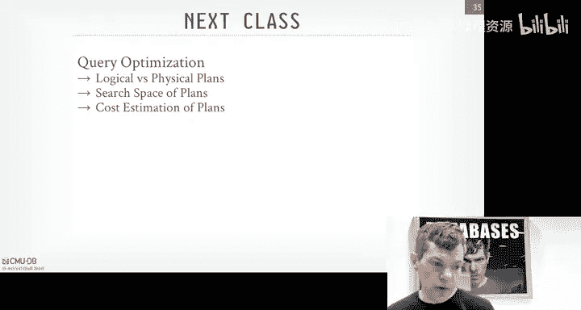
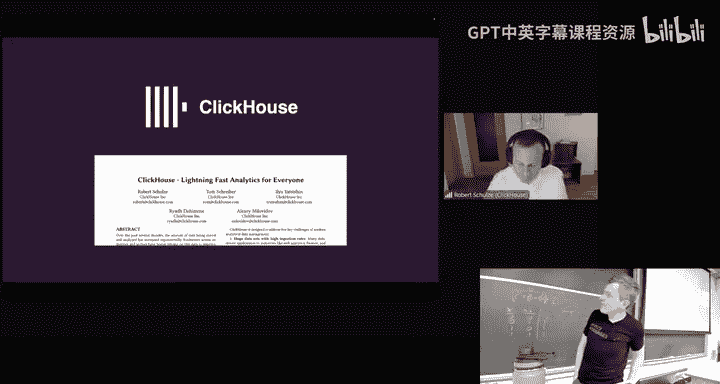
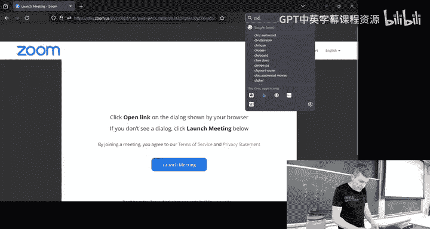
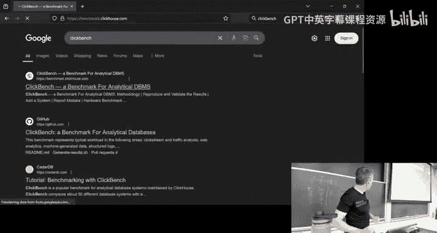
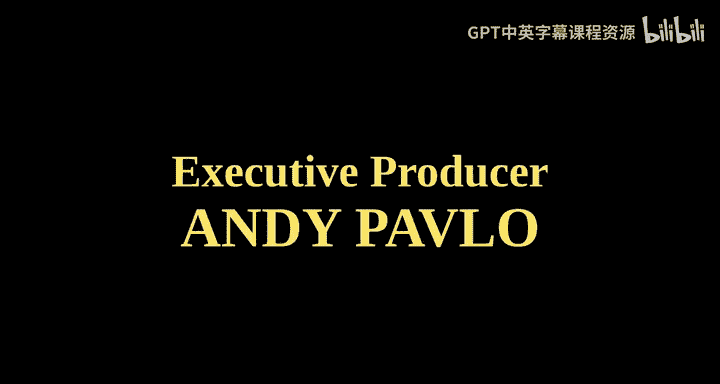

# CMU《数据库导论｜Intro to Database Systems (15-445645 - Fall 2024)》中英字幕（deepseek翻译 - P15：#14 - Query Execution Part 2 ✸ ClickHouse Database Talk.zh_en - GPT中英字幕课程资源 - BV1Tys8eQELW

Yeah。い？🎼Official we All right， so I screw up the recording for Wednesdays class。

 the audio didn't get captured。 at least with the part of the lecture。

 So had a call my parole officer， let me come here on a Saturday in the lab to record。

 So this would be re recordinging of what was discussed on Wednesday。

 So before we get into the material everyone should be painfully aware of all these things homework。

😊，So our project two is due tomorrow on Sunday and then today Saturday we're having the special office hours but again we've already announced this on Piazza and then homework forward came out this week and that'll be due the following week on November 3rd and then we'll be releasing Project three this Sunday as well。

All right so last class we were talking about how we' were actually going to execute queries。

 it was basically the discussion of how data moved between the operators in our query plan。

 remember we talked about， do you send a single tuple。

 do all the tuples that operators going to admit， where do you send a batch of them？

And then we also discuss the way sort of the control flow of the query plan works。

 do you start at the top and go down and pull data up or you start at the bottom and push data up？

So today we're talking a little further about how we actually now run these queries in our system now actually in parallel。

 using multiple workers。And so all discussions weve had pretty much so far this entire class。

 except when we talk about concurrentency control and indexes。

 it's really assumed that the data system has a single worker。

 single thread or process that's running queries， It's not going to interfere It's not interfering with other queries running at the same time。

 So now we got to worry about okay， how do we actually how do we build a system to allow it to run multiple queries at the same time。

 And then furthermore， how do we allow it to take a single  query and run that in parallel across multiple workers。

So today's lecture I'm going to try to use the word worker and not thread or process because you see worker is a sort of higher level computational component of the system。

 which could be a process， could be a thread， could be a combination of them。

 but I'll try to use worker when I say thread or process to think worker and listen explicit about it。

So the reason why you want to run queries in parallel is kind of obvious right in a modern modern systems。

 modern hardware， you have a lot of parallel resources and obviously be you have a lot of cores on a single CPU that pretty much even the laptop has at least four cores at this point。

 you can have multiple multiple CPU sockets， you have multiple entire processors running together on the same box。

 but you also have multiple storage devices， not multiple storage devices。

And we'll see how to run those and handle those in a parallel system as well。

So why you want to do this is pretty obvious。 So some cases。

 the database system or the database itself can't fit on a single node and therefore you have to scale out horizontally or scale out vertically by adding more resources in some cases we'll also get high performance。

 meaning our  query is going run faster， we going to run more queries at the same time。

 and then we won't talk about this so much today， but when we talk about distributed systems。

 we'll see how we can get better fault tolerance and redundancy by duplicating or replicating the database across multiple machines。

 So now if any one node goes down， we can rely on another one to pick up the work behind us。

The key thing that I'll understand about this discussion is that even though underneath the covers。

 we may be making copies of the data or taking a query and running it in parallel across multiple competition units across some workers。

When a application invokes a SQL query， that same SQL query should produce the same result。

 whether or not it's running on a single， single laptop with one CPU core or some giant distribute a system you know。

 thousands of cores。 Again， this is the separation between the logical and physical storage of a representation of data。

 You just declare maybe SQ query， this is the query， this is the result I want。

 And then the data system then decides how it wants to distribute it and execute it across one or more resources。

 So again， if it runs on a single node in theory， it should run also across multiple nodes。

 across multiple workers。 not always the case， but for today's class， we don't to worry about that。

So in this class also too， this lecture today， we're explicitly talking about would what I would call parallel databases。

And there is a distinction at least in my mind between what a parallel database is and a distributed database conceptually the same thing。

 you're using more resources to execute your queries。

 but the key thing I want to differentiate is in a parallel data system， the resources。

 whether it's storage or compute are going to be physically close to each other like if they think of like on a single box a single laptop。

 you have one CPU and you have multiple cores and therefore the cores are running basically right next to each other on the same silicon but they could also be potentially in the same rack。

 when one thread wants to communicate a worker wants to communicate with another worker。

 we're going assume that that connection in that communication is me fast and reliable。

And potentially cheap， meaning it's sort of。You're not paying a high cost in terms of money or know。

 wait time latencies to make that do that communication。 So again。

 think of like two threads running on the same CPU， I can use， you know。

 if they're running in the same process， then they can easily just write into memory and other other thread I can read it right And that's really fast。

If you， if that communication starts going awry， meaning like you send a message and the other thread doesn't get it。

 then you're having like severe hardware problems and the whole machines going crash anyway。

 right Now there's ordering issues we've got to query about。

 and we'll see how we handle that after starting next week， but。For now。

 it just assumed like we read a message the other guys gonna to get right away。

In a distributed database， the assumption is that the nodes。

 the resources are going to be far from each other， either not the same rack。

 at least in the same data center in the same state。

 the region of the country or in some cases worst case scenario on the other side of the planet actually worst case scenario would be out in space where the latencies are massive and so in this environment we can assume that the communication costs is going to be fast and we can't assume that it's going to be reliable So that means in our algorithms。

 we're have to accommodate message loss or node failure and so forth in our protocols。

Because we might send a message to a resource to get some data or do some computation。

 and the other side never gets it。 So we have to account for that in our our implementation。

 So again， we're not going to worry about that so much in this lecture here。

 but we'll see how we have to handle this a little bit when we talk about currentent control。

 But definitely when we talk about distributed database later the semester at the end of the semester。

So for today's lecture， I'm going of talk about process models is the way we're going to organize the workers in our system。

 then we'll talk about how the different variations of parallel execution we have for queries。

 Then we'll talk about how new variations of IO parallelism And then as I said。

 we have a clickhouse talk that I'll just cut over to from class because it was actually really。

 really good and covers basically covers all the things we're talking about this lecture he the Robert from Clickhouse basically says the exact same thing and talks about how clickhouse does the things later on。

 Soll cut over to that at the end of this。😊，All right。

 so the data system process model is is the way it's going to organize the。

The computational resources of the system to execute queries or requests in parallel。

 tasks in parallel。And as I said， the component we're going to use to schedule things or actually execute things and we schedule things for them is going be we'll call a worker。

 And this is gonna be some some computational piece of the system that can execute tasks have the client and also internal background jobs or internal maintenance jobs。

 So we'll see later on， when we talk about garbage collection and multiversionion crial。

 there's a background processes we have to run and something like Postgres that has a periodically go through and do garbage collection。

 Or when we talked about large structure mergeies。 We had to do compaction in the background。

 you would assign that task to a worker。 the worker could have been used for execute quiries as well。

So there's basically two approaches to how to organize workers a database system and we'll go through the process per database worker and the thread per worker。

 and then there's a third category that doesn't actually line up exactly with this dichotomy between processes and threads it's called embedded systems。

 but I think it's discussing because it is an important aspect of database systems how to build these things and then we'll talk about what that looks like for in the organization of the system。

So I would say the most common approach of being used today if you're building your system is going to be the second one。

 the thread produce worker and this is because in the modern era writing threads is not a it's not as owners as used to be back in the 80s and 90s So we'll talk about process for workers I going'll see why people had to not use threads back in the debt in the old days and then why they switched the threads later on。

So the oldest process model is a process per worker if you want to support parallel execution。

And this is where every worker is its own entire OS process。

 like you're calling Fork to get a separate process that has its own address base and is scheduled separately from all the other worker processes in the system。

So the basic setup would be something like this where you would have your application。

 it would send a connection request to a dispatcher process running on where were the data systems actually running。

 and this batchcher would actually be part of the data system。

 so in Postgres this is called the Postmaster。😊，And then the dispatscher says， okay。

 well you want I cant the dispatcher can't actually execute queries。

 so it's going to pick one with worker processes to assign to this connection or fork a new process if one doesn't exist。

 And then it tells the application， hey， here's the port number of of the worker you want to talk to and then the application then makes a second connection request to connect to the worker and then that's where it sends equalQL command for that worker that then execute the query and then return back results as needed。

So you could have the dispatscher just be like a coordinator where queries show up to the dispatscher and the dispatscher just hand them off to other worker processes。

 or you could do like where you have of the dispatcher is really assigning workers to the application。

So one next advantage of this approach， although it does have additional overhead actually uses this because now if you want to communicate with one worker once communicate with other workers。

 you have to use some kind of IPC mechanism when in the case of Postgre。

 they use shared memory as a way to communicate things So it's a bit more work you have to do。

 And of course now you're also relying on the O to provide a bunch of the stuff for you it's in charge of scheduling and so forth。

 you can play around with priorities and schedule， but you really can't。

Do more complex things than you may want to do if you have complete control of all the brokers。

So the reason why old systems like Postgres， like Postgres is old Postgres was first started。

 the first im in version of Postgres was 1984。 But Oracle does this。 DB2 does this。

 The reason why these older systems use a process per worker is because back in the 80s and early 90s。

 the threading packages for the different versions of Unis out there were inconsistent。

 now we have P threads， we have poss and all that。 But back in the day。

 the threading package for Hpos would be different than the threading package for AI X。😊。

And so be really， you had to basically have all the reimplement all the the threading infrastructure if you wanted database to port a bunch of different architectures and systems and operating systems。

Whereas like if you had posss， fork and join where the basic building blocks are a lot of things and all operating systems have those。

 so you could just do the fork processes and everything would just work。

Across different systems without making major changes。The modern implementation。

 though the modern approaches use a thread per worker。

 and now you get your spawning P threads or whatever operating system you're running on。

 and you're having your system coordinate and schedule across those things。So in this case。

 the data set will actually be able to manage his domain scheduling now because it has complete control of what threads going to run and when everything's all in the same address space。

 so communication costs are pretty cheap between the different workers。Now。

 unlike in the process Pro worker model， if a crash， in the process model of a process crashes。

 it's isolated just that process， if a thread crashes in world in this model。

 then that takes down the whole system。So just like before。

 the application will connect to the dispatcher and then the dispatchcher can decide it say， okay。

 this is the thread you're going to run on， and again we can either have the dispatcher be responsible for forwarding query requests to the worker thread to execute or we just give it back say here's the port number you want to connect to and send your request to this。

😊，So pretty much every data system implemented in the last 20 years support this。

 even systems like DB2 and Oracle have gone back and added support for the thread threat per worker model。

 even though they originally started off what process per worker， like I think in DB2。

 you can switch to say you want to use threads or processes and depending on one environment you want。

 you choose one versus another The only systems that really don't do this is that if if they're forked from Postgres。

 they're based on Postgres they just inherit that process per worker model that Postgres has。So。

Again， and then the other category would be the embedded database systems so embedded data systems don't really have their own。

 typically don't aren' in charge of their own threads are。

And because they're embedded inside of another application。

So the idea is that the application makes calls into this embedded Davisson library。

 and then whatever thread made that call into it is then used by the Davisson Library to then evoke whatever the query they need to do。

Duck D B can， you can tell it， hey， spin about additional threads that it can use to actually queries in parallel。

 But the and sort of the classic embedded system model， especially like SQL light。And Ro CBB。

 its whatever a thread that's be entered to an operation。

 that's the thing that's going to execute it and said there isn't a dispatcher。

So in the case of the application code。The application has its own threads。

 and then it can make calls to data system to do whatever it needs。

So as far as you know that one of the first embedded data systems that supported this model was Berkeley D B。

 It came out of obviously University of California， Berkeley in their early。Early 1990s， late 1980s。

 that was bought by Oracle in 2016。 when a query shows up。

 the data has to decide how and where it wants to execute it。

 and when should execute it So most data systems are gonna do a really simple first and first out priority queue。

 So whatever query shows up that gets the first execution gets to execute first but doesn't have to be that。

 right， There's other policies and things you can actually implement。 But the datas often decide。

 Okay， for this given query on this， I know a data is gonna access。 And therefore I can decide。

 how many tasks should I break up the query into how many many cores a worker should I use to execute things when when a worker execute and produces some output。

 Where should it go should it go in the same the same worker should go to another worker all these things。

 the data system can can schedule for you and。This is， again， why we want to do everything ourselves。

 even though the operating system has has their own scheduler。

 It doesn't know what the queries are actually want to do and what's in the pipeline to execute。

 So because it just sees blind processes or threads。 So again。

 the data system is always gonna be better positioned than the operating system to figure out what to do。

 And they the higher end systems like the enterprise systems like Oracle and DB2 is single server have again。

 they rewrite basically everything and don't rely on the operating system to do anything。So the。

So the different process models are going to allow us to in。

Take advantage of different multiple workers in our system and potentially run things in parallel。

 But the key thing to understand is that just because a system supports multiple workers running inside of it。

 it doesn't mean that they're always going to be able do what we'll call intro query parallelism。

 meaning just because they can have multiple workers run， if a query shows up。

 it doesn't mean they can divide that query up across those multiple workers like My SQs probably most famous of this。

 like My SQL is the thread per worker model So it's a multithreading database system。

 but one query shows up only one thread can execute that query into its entirety。

They can't split it across multiple cores。 so we'll see that in a second。And as I said before。

 pretty every system that is based on Postgres or Redis supply other most famous one that's a single process single worker system unless you're fork of these things。

 you're gonna to be support you're going to distort multiple workers now that we define our process models we want to talk about how we're going architect the system support parallel execution of multiple instances or multiple operators either running in part of the same query or multiple queries at the same time and the high low approaches that we're talking about here today aren't going to really don't really matter whether you're using multithreading or multiprocess a multinode and attribute a system because it's just about like how do I say here's what you're going execute and then where do you put your data and then that communication costs between the workers。

 the cost of that will depend on one environment and what process model we're actually using。

So there's two high level approaches to do query parallelism。 So first be inner query parallelism。

 and then we'll talk more detail about intro query parallelism。

So interquery parallelism as I've saying before， where you can have multiple queries from different connections or different application requests running simultaneously in the system and as I said most systems are just going to do first come first serve。

 so whatever queries shows up first， it'll get scheduled execute before any queries that come after it in some systems like DB2。

 you can specify transaction or queuing priorities based on the username so like the CEO might have their queries run faster than somebody in sales。

So if all the queries are read only， meaning they're not actually modifying the database。

 then this is pretty easy to do because you don't need to coordinate between the different queries running at the same time because you know no one's going to update anything now you still have to use those internal protection mechanisms that we talked about in the B manager and the indexes。

 as I said before because they may be trying to access the internal data structures at the same time。

 but the logical database isn't going to get changed。😡，So we'll see how we handle that。

 how to hand updating queries。And in two classes for now， but for now。

 we're now to assume that's not going to happen it makes our lives a lot easier。

Again the challenge is again， if they do update things。

 then we have to worry about who's reading what and when， but again， we'll cover this later in Le 16。

So for introque parallelism this is typically most people think about what say I'm running queries in parallel。

 the idea is that we have a single query that we can break up into multiple tasks that we then assign to multiple workers that run at the same time and we can cut down the executionion time query potentially。

😊，So you can sort of think of the same way that we talked about operators in our query plan when it was a singleth execution of sending data to one operator to the next。

 it's sort of this high levell produce a consumer model。

 We're going to do the same thing now when we run things in parallel。

 but now we're going to have explicit control mechanisms to say。

 I know I have these tasks running in parallel and I can wait until they all produce the results I need before I move on to the next pipeline the next stage of my query plan。

So there's going to be two approaches to do incurry parallelism。

 the ver would be horizontal parallelism， sort of scaling out multiple instances of the same operator。

running at the same time， and then vertical parallelism or interoper parallelism。

 that'll be different pipelines or operators running simultaneously again。

 and then there's a explicit dependency graph between them。

So these techniques are not mutually exclusive， you can mix and matchsh of them， again。

 the higher end systems can do that。And the way we're actually going to implement all the various algorithms we've talked about so far。

 be basically some minor changes to them， but there's almost parallel versions for all the algorithms that we talked about before。

 And so for example， if we go to our hash join we do before the gray hash join remember how we talked about how in the sort of first phase。

 we went through the build side and the probe side。

 the R ands tables and we generated buckets for each of them so that when we when we so we divide things up that now we can just bring in things sequentially into memory and do our joins for just the buckets we know that things to match you can now sort of think of like the buckets now can after I partition them up。

 the bucket can then now be processed independently by different different workers at the same time。

 so like the worker one can do the first level of the hash table and it does need to coordinate with the other workers processing other buckets or other levels because we've already divided things up before。

 So basically all the divide and conquer stuff we talked about before， we can apply。

In the same world as well， but now we just run things in parallel。So as I sort of said。

 there's the horizontal parallelism， there's a vertical parallelism。

 and then I think the textbook mentions that there's this third category of bushy parallelism。

 which my mind is basically just the combination of the first one and the second one。

 but we can talk about it and the way to think about how common these different approaches are。

 the first one these obviously the most common one but having multi operators insist of the same operator running parallel interoper parallelism is slightly less common。

 but you'll see this more especially in streaming systems。

 which we'll talk about a little bit late in the semester。😊，And then the Bush of parallelism。

 that's just again， the higher end systems can do all these things。Al right so in intra parallelism。

 the idea is that we're going to take our query plan and the operator invocations are going to be then now duplicate or replicated across multiple workers that they run and parallel at the same time。

 but the key thing we're going to do is we're going to assign each operator instance。

 each task for our operator to process a different subset of the input data。So again。

 think I have a table of 1000 tuples and I have four worker threads。

 I'll give the first 25% of the data to the first worker。

 to the next 25% to the next worker and so forth， and then now they can do the scan。

 apply any filters to do whatever operations they want in parallel and they don't need to coordinate to each other and we're not duplicating work because each one processing a disjoint subset of the data we're of partitioning things and handing them out to the different workers。

But now we've got in some cases， we have to put the data back together。

 so we sort of split things up， allow them to operate on physical subsets。

 but now in some cases in order to do some additional operators in a query plan。

 weve got to put things back together because remember talk about I can't do a hash join if I don't completely fill up my hash table。

Because now I start probing it， I get false negatives。

So there's gonna to be we're introduce this new mechanism called an exchange operator that doesn't map to anything in relation to algebra。

 but it'ss something we need to do this coalescing。

 We're going introduce that almost as pipeline breakers， again， to as a way to say。

 I can't proceed up in the query plan until all the operators below me that are my children produce the results that I need。

 And again， it doesn't matter whether I'm doing a push versus a pool model。

 doesn't matter whether I'm doing the iterator the materialization or the vectorized processing model the exchange operator and is that barrier to make sure that we don't proceed in the query plant to we know we have all the physical data we need。

Postgres is going to call this this gather if you're familiar like the mapprouce world。

 it's sort of the same ways the barrier between you start before you knocks the next phase。

 but the original paper that describeds this approach came from this guy Grs graphy。

 the same guy who wrote that P plus G book that I was talking about before and the same guy he's going talk about queryry did a bunch of this stuff we're about in queryry optimization in the next class he wrote this paper in the early '90s or late '80s for this project calledvolcano。

 and then he defined out exactly this exchange operator there。

rightSo they we were doing an a query now joining A and B， where're BID。

 and then we have additional filter on A dot value and B dot value。

So the first thing we're going to do is execute the scans on act。

So to say now again we' divide the table A up into three partitions with three shards。

 and we're going assign each of those their own worker。

 but now we actually can sort start building up the pipeline in our in each of these for each of these workers because again we know we don't need to coordinate between any of them yet because each one can scan a but now they can also do the filter on a value here and then just keep going up the query plan and pushing things up and then say we also want to then bring down the projection to throw a bunch of the data that we don't need because again we know what we or need up in the query plan。

 we need AI and to do the join so we could actually filter out anything else that is an AID after we do our filtering here and again we can do this all in parallel。

 we don't need to coordinate between different workers to do projections。

And then now we're going to build our hash table。And then this is where we introduce our exchange operator。

 So for simplicity， just assume that there's a single global hash table here in the。😊。

In the you know， in sort of the high higher end systems， you can have multiple hash tables。

 but we can ignore that for now。 But for assume simplicity。

 everyone's writing into the same hash table。 So they're building a hash table。 And then we don't。

 we tell the exchange operator above， we don't sort of invoke that until we know that all the data we weve。

We going to process is， is done。 So the exchange operator again is the barrier waiting for the for all the the children workers below to say I got everything。

 I process everything I need to process。 I'm done。 You never never have to come back to me。

So you can sort of think again， these are the pipelines that are again run these tasks one after another。

 these operators one after another， and then they're feeding the exchange operator saying like I got more or I got more and then it keeps going until it says it's done。

And then now above the exchange operator， that's where we can the join operator because we know we built everything we needed in our hash table on the build side of the join。

 So when that exchange operator gets the notification from everybody below then it says， oh yes。

 now I'm go to my side we can do the join。😊，Then now say they do the same thing on B。

 You can divide it up into three shard or three partitions。 They're also do the， the。

 the filter and the projection just like before。 And then now they can also probe the， the。

The hash table in parallel， but we don't need exchange operator above the probe because we're doing the join to the hash table see we have to match and then twoLs are coming out of that operator and again we don't need to coordinate anything at this point between the three different workers but we do need to know whether we've finished processing all of the data in these pipelines for B so we'll put exchange operator above that that says okay I know I have three workers below when they're all done let me know and it's producing a single output stream for these pipelines down below。

So this is the most common version of exchange operator。

 This is the gather approach again taking multiple input streams and producing a single output stream。

 But there's other approaches you could do。 And so this is this is a sort of taxonomy that's defined or that's used by SQL server。

 describe the different variations that they have of of exchange operator。 So again。

 the gather one is taking multiple outputs and putting into a single multiple output input streams in producing a single output stream。

😊，The distributor operator is taking a single input stream and then resharding and repartitioning to spread across multiple output streams。

And then the repartition one is basically the combination of the two。

 so I have multiple input streams and then I'm producing multiple output streams。

 but doesn't need to be a one to one match between the inputs and outputs。

 so I could take in my example here， I'm taking three input streams from three sort of pipelines below me and I'm producing two output streams。

So the distributed operator or the rep partition operator。

 This is used often in distributed systems because you may want to rebalance things based on what the data looks like as it comes in。

 So my example here is for Dremel Bigquery， which are the same systems。

 Dremmels the internal name of what Google calls their Bigquery system， but the。

They have an explicit pre partition step between every single pipeline sometimes， again。

 called shuffle。 The idea is that。When you first plan the query。

 you think the datas going to look a certain way。 So you say I'm going to run on， say 100 workers。

 but then as the data comes in， you realize your filters are more selective so you have less data so you can scale down after after three partitions say I thought I need 100。

 but I only need 80 or you go to the opposite。 I thought I need 100 but I need 200。

Or I thought my distribution was going to look like this。

 But it uniform distribution of the data now looks really skewed。

 So's kind rebalance things differently。 So it's a way to sort of like reorganize the query plan while it's running in a dynamic fashion or adaptive fashion。

Most systems don't do this or it's part of that adapt。

 but the repartition1 be common in the OLAPP systems of data warehouses。

AlSo now I'm going to talk about okay how do that was intratro operator parallelism。

 So within sort of one operator I have multiple versions of it running the same time。

 Now we're talking about intraop parallelism where you have distinct operators that are running actually the same time。

 even though there may be a dependency of data between them。

 but in some cases like the way the query plan is sort of set up。

 I want to run them at the same time and have not have one operator wait for all the data come out of its child operator before it starts from running。

So， the。This is sometimes called pipeline parallelism。

 We're still going to need the exchange operators that we talked about before because you need to know you may need to coalesce things from multiple shards from down below and produce one or more output streams based on the input streams that are coming in。

RightSo really same way that would be something like that。 So they have that same join before。

 but let's now say I do my join in one worker as one sort of operator instance and think this thing is just scanning through the table。

 the two tables and producing the join and then emitting them out as the output stream。

Then now let's say I have this projection， this projection operator instead of inlining or fusing the in that we saw before in the pipeline。

 I'm gonna have it run as an own separate worker as well。 Sa for whatever reason， this。

 the projection here is very expensive to compute。 Like we're computing a hash of a hash of a hash or something。

 And therefore， it's very CPU intensive。 And therefore。

 I don't want to burden the join down below with doing that hashing。

 I'm gonna to put that on a separate worker。Right， so now as the， the， the。

 the the first worker is doing the join producing output。

 it puts it in a queue that then gets sent up to the separate worker。

 And then thing this thing is waiting for a new inputs to come in。

 And soon soon as it gets something， it crunches it and produces the output。Again。

 this is more common in streaming systems like SparkSQL。

 Kafka and other things because in that world， you sort of have this continuous query operation where there isn't actually an end to the data that you're inputting like it's an input stream of like stock ticks or temperature readings。

 There's data it's always coming in as a stream。 and therefore it's not like scan on a fixed size table or you scan and you're done。

 This thing is just always running。And then the last one again， as I said， is is bushy parallelism。

 And this is just intermixing a combination of the horizontal interoper， sorry。

 the horizontal parallelism with intraoper and the vertical parallelism with intraoper just putting all together and using them at the same time。

😊，And again， we're still going to need exchange operators because we need to know in some cases that I get all the data expected from my query down below。

So this is a contrived example， but I'm doing a Cartesian product between tables， A B and C and D。

 And so now I can do my query plan。 I'll do my join on on A and B simultaneously as the join in C and D。

 And then there's the cross join up above。 that I'm running on worker 3 and4。

 intermixing all of these tus and producing all possible combinations of them and I buffer keep track of what I've seen before and as new tus come in。

 I can match them。 this obviously be a very expensive operation And yes， the size of the in results。

 but explode but can again， you can at least computationally run these in parallel。

 And rather than waiting for everything get queued up and finished。😊，Allright。

 so everything we talk about so far is about computational parallelism。

RightHow do we get multiple workers to run simultaneously and and process things in parallel。

 Of course， though， if now you're bottlenecked on the disk。

 even though it's gotten a lot faster than than in the past And as modern SSDs and theME， know。

 that still could be a bandwidth or you have to read a lot of data in your query。And then also too。

 if you're using a page table。And managing managing that with lashes that could become a bottleneck。

 But the the getting things off the disk and bring a memory that can be a bottleneck depending on the speed of the the drive。

 So in some cases， it actually doesn't matter that if you have a bunch of parallel workers。

 that can run queries in parallel or run a query in parallel。

 if they all have to go to disk and you're blocked on that， then you're sort of。

The parallelism isn't going to help as much。Now we'll see later on how to do tricks of like if I know one guy's got to go at the disk and get something and this other guy can run because everything they need is in memory。

 that I can play tricks of scheduling that guy first and then letting that disk guy happen asynker to see in the background。

 so that way I'm always doing do useful work， even though I'm blocked on disk。But again， in general。

 I think if this is just slow， then the parallelism can only go so far help you。

So this is why we're going to need IO parallelism。And so the idea here is that if we can take our database systems data in our database and we can spread it across multiple storage devices。

 then this could potentially produce our disk bandwidth because。

I could have some part of this as read data from one disk and another disk。

 and now ignoring whether my PCIe channel is the bottleneck， I can get data。

 I can have more concurrent requests and have a higher throughput for my data。

There's a bunch of different ways to do this， like the most things is like you have a single database one per or sorry a single disk per database。

 you could have put multiple disk for a single database。

 so logically it seemss like a single database， but physically it's across multiple storage devices。

 you could put a single table， a single relation per disk。

 you could split a disk across multiple disks， split a relation or table across multiple disk。

In some systems， you could actually say for the right intensive portion of the system。

 like the right ahead log， the log keeping track of all the updates I do。

 you put that on one disk and then put the data from the regular table， put that on another disk。

 So you're always writing real fast at this thing and then you reading your reads to the data doesn't interfere with the rights the whole different combinations ways to approach this in the higher end systems they will have explicit control of how to handle iop parallelism like in Oracle。

 you can say， again， put the right ahead log on this drive and then split my tables my data tables across each other drives and the data will manage all that for you in systems like my SQL。

 for example， the disk can just be managed by taking a。Just in the actual data directory itself。

 you just put ss to different drives。 And the data center doesn't know you've done that， which is。

 you know， now you're getting that parallel because the the multiple disks can can run simultaneously not interfere with each other。

 Postgres having has table spaces， where you can say these tables belong in this table space and then tells you what。

 what physical location goes on disk。 But again， the the the hiring systems have complete control。

 all these things。All right， so what does this look like？

So say now we have a database and have six files sorry six pages， really simple。

So I'm going to show two extremes of the different variations of how to support a multi disparallism in the first case here say we have three disk drives and we'll do the first approach we called striping or if you're familiar with it's a raid zero and basically every single page in a round ro and fashion。

 we're going to write them out to one disk drive at a time。

 so page one goes to disk1 page two goes to disk2 and page2 page3 goes disk3 and we keep looping around this round。

So now this is where that。that page director we talked about at the beginning of the semester。

 This is where we keep track of this information。 So now if I do a look on page 1， I'm gonna know。

 oh， sos on disk drive 1。 and therefore and this location， let me go fetch it because again。

 the data system manage this itself or you can rely on the hardware to do this for you where just transparently looks like a single logical disk even though physically it's broken multiple disk devices。

 And again， the data system has control this。 It can be responsible for deciding how to split things up。

The other end of the spectrum of striping is called mirroring and this is Ra1 and this is where for every single page we have in our database。

 we're going to write that out multiple copies out to every single unique disk we have so page one we've written on disk1。

 disk2 disk3， page two is written on disk1 disk two disk3 and so forth。

Right and so the advantage of this now is if I have to do a bunch of reads。

 that's gonna go faster because now I go fetch the。

 I can go to actually any of the disk drives and Ill get exactly the copy that I need。

 Where now this makes the rights more expensive because anyone right you do to a page has to be written in trip like get across these3 drives。

 whereasas in striping， it was always a one to one mapping between a page and an A。😊。

A page and a disk drive。So the。There's Harvard actually can do this all for you。You know。

 I'm saying these rate 0 very1。 There's different levels of array that can enter mix and matchsh all these things。

 And there's different trade levels to all of them。 So in some cases。

 you can get harder to do this for you。 So now。It appears like a single logical device。

 but physically it's all split across， and this would be transferred to the database system。

 because the data system wouldn't know that has multiple disk drives。

 It just thinks it has a faster disk or higher capacity disk based on what you're doing。

The softwareb approach when the data can manage themselves and now you can do much other tricks to not to have to do either striping or mirroring。

 you can use a ratio coding to do some get some sort of blend of the two of them。

 And this is typically can be faster and more flexible than doing hardware support， but again。

 not all systems actually support this。So the way to sort of think about this。

 the trade offs for Iowa parallelism or disparalism is a trade off between performance。

 durability and capacity。 So in my examples before， where I was doing。

Say I was doing the mirroring approach。I'm'm basically wasting， if you will， multiple disk drives。

 but I'm storing the data in duplicate。 So one， now if one disk dive crashes。

 I can rely on the other two to still read my data。

 So I'm getting better durability and my reads are gonna to go faster because now I can have any one re from any one page be handled by any any of the free disk drives。

 But my capacity is basically cut by a third because I'm I'm down to one third total size could be because now every every disk has the entire copy of it。

RightWhere striping is I'm getting great capacity， but my durability and better performance。

 my durability isn't as good。 So theres tradeoffs that you have to consider when you sort of deploy real data system of how you want to handle this。

 S3 China changes all of this because S3 is now managed by Amazon or whatever the object store in your cloud provider're using whatever the equivalent is and they're storing data I think in five times But again。

 it's all transparent to data system， you don't know if you do a read request or write request where is actually being physically going and S3 is actually not that fast。

 That's like1 hundreds of milliseconds potentially per read and writeite but the data that doesn't manage any that Amazon manage that for you。

 again there's trade offs of how much you want to do yourself versus how much you rely on external services。

 either through hardware or through a cloud service。The other thing to also mention。

 but we'll talk a little about what we'll go more detail our distributed databases is how we're actually doing this splitting things up。

 So I sort of said before when we' were talking about the horizontal parallelism。

 theop intraoper parallelism， I would have my different operator instances crunch different portions of a table or input data。

 that data is we partitioned or sharded based on some attribute。And so， it's。

If the data systems are stored in separate directories。

 then that's what really easy to do because you say this operator process of this directory。

 this operator process is other directory。But what we really want to be able to do is do explicit partitioning within our database system。

 where the database is responsible for deciding how to divide things up， where to store it。

 and then how to bring back things in into memory， and process it in parallel。So again。

 this is the advantage of SQL again， because the same query that would work on a database is not partition that's not split up should still work in theory on if a database is partition is split up because it's only processing these logical tables doesn't actually the physical layout of things doesn't always happen in some cases but that's the goal in doing this partitioning scheme。

 so again， we're not about talking about any further right now we'll go into more detail when we talk about distributed databases around Thanksgiving。

All right， so finish up。 parallel execution is super important。

 I pretty every single major data system you can think of is doing some variation of it。

 even SQL light SQL lights like it's a very sophisticated system it's an embedded data system that doesn then involve the features of like a fullfledged oracle or DB2 or SQL server but it supports parallel execution does inter interquery pillarism So you can have multiple readers and a single writer that all works just fine。

 But all the things we talk about that to get right like coordinating the different workers scheduling them if they have to start doing write。

 how do you handle that， What if everyone's trying to read from the disk at the same time。

 how do you handle that， all these different topics and things like that。

 you have you have to account for when you start building things out。

 and it's ideally don't want to rely on operating system to manage disk Io and other things for you you want to do everything yourself。

😊，All right， so next class， we're going to talk about query optimization。

So this is the idea of again taking our SQL query and then actually now generating the physical plan that we're going to execute on our workers and so this semester we're only going to do one lecture on this and it sort of be a quick overview of the topic。

 it's very， very hard it's the thing I know the least about in databases。

 but then in the spring class， spring 2025 we'll be teaching of course。

 entirely on optimization so if you' ingen this kind of stuff， we can go this in more detail。😊。

Basedase at Clickhouse Inc， and I wanted to give you a high level intro to the things that make clickhouse equalL database。

😊，You probably think Clickhouse is a funny name， I guess it is Clickhouse was originally an appbbreviation for Clickstreamre data warehousee so that should give you an idea of what the system is about。

But you know， people like the abbreviation and we simply kept it。Here you go。 All right。

 so what is clickhouse at Hyla the Clickhouse is an open source column oriented distributed Oup database development started 15 years ago at Yex 80 years ago Decode was open sourced in these As Clickhouse became super popular now with more than 2000 contributors on Github Decode is written in C++ and it compiles into a single statically linked binary which runs from pretty much anything from Raspberry pis to the most powerful servers。

😊，Being a column store， people typically use Clickhouse for and aggregation tories over billions and trillions of rows。

The storage layer under the hood is optimized for append only workloads。

And it provides very fast insight that I get to that in a second。

You can also build a cluster of clickhouse nodes and replicate and chart your data for higher availability and scalability。

If you do that， the database will be by default only eventually consistent in the interest of high performance。

Typically use case of Fhouse include business intelligence。

 lock and event analysis and real time dashboards。Let's dive a bit deeper into the architecture of the system。

 there's a lot of stuff in the slide， but the important parts are in red。

 the query processing layer and in blue the storage layer。

The query execution and Clickhouse follows the traditional approach of parsing a SQL query。

 building and optimizing logical plan， building and optimizing a physical plan。

 and then finally executing the physical execution plan。

The storage layer has a concept of pable table engines which each represent the location and the format of the table data there's a similar abstraction in MySQl so we didn't come up with that idea by ourselves in the interest of time I will only talk about the native storage format of clickhouse which goes by the name mergechthrough table engine it's actually a family of table engines therefore on this slide it's called mergerch pre star table engines。

This slide shows the me cave engine in more detail。

What happens if you insert a bunch of rows into a table is that the new rows are sorted by the primary key columns of the table and then stored as a so called part on disk。

Once written a path cannot be changed anymore， it is immutable。

We encourage our users to insert the data in batches for instance 20。

000 rows at once to avoid that too many to little parts are created。

To prevent the parts from accumulating， they are also continuously combined into bigger parts by a mech shop which runs in the background。

Now remember the parts are sorted， this means that the merch shop can use a Kway merch sort algorithm to combine the parts and that is relatively cheap。

Clickhouse also provides an asynchronous insert mode which basically buffers the rows from multiple inserts before they are flush to disk。

 so if you really want to do lots of smaller inserts with very few rows each you can use asynchronous inserts。

Now， if all of this reminds you of lock structured mergerch trees or L entries in short。

 you're right。The difference to classical L entries is that all parts in clickhouse are created equal。

 they are equal， they are not organized in a hierarchy。😊，This has advantages， this has disadvantages。

 on the one hand the mergech can freely pick which parts are combined。

 it is not bound to certain LM tree levels。On the other hand。

 updates and deletes become a lot more tricky， but I'll not talk about these today for the majority of all use cases。

 updates and deletes are the exceptions so that's usually fine。

I talked about parts on the previous slide， this slide zooms into a single part。

The stuff shown here isn't terribly interesting， I just say that after a few rounds of mering parts typically contain a few dozen million rows。

 Loly each part is further divided into a so called grannules， each of which contains about 8。

000 rows by default。All the disc exses are made at the crnularity of crannules。

 not rows in the example on the left you see two crannuialles G0 and blue and G1 in red。

To reduce the data volume， we also compress consecutive kernels。

Users can specify the compression algorithm to use their are generic cortex like CSD and logical cortex like Delta。

Okay， now Clickhouse has a reputation for being fast。

One of the tricks we use to speed up queries is aggressive data pruning。

 the idea is that you want your select queries to skip as much data as possible because every bitete you don't read and don't process head performance。

Clickhouse uses three data pruning techniques， the first one are primary key index excess。

I mentioned earlier that each part is sorted by the primary key columns of the table。

Clickhouse will additionally create an index factor which maps from the primary key column values to graanls。

The mapping is quite small compared to the total table size and kept in memory， for example。

 there's just 1000 entries you can index already 8 million rows。Now。

 if you have a query that filters on a prefix of the primary key columns。

Clickhouse will use the primary key index to find the rightquis directly instead of scanning the whole thing。

The second pruning technique we use are table projections。

Think of a table projection as an alternative version of a table。

 a projection contains the same rows as the original table。

 but it's sorted by a different primary key。If you have lots of query which filter on other columns than the original primary key columns you want to use at projection The cool thing is this works at parkcrity。

 that means a part can have no or one or multiple projections and the query will choose for every part the optimal data representation to read from at query time。

The third printing technique in clickouts are skipping indexes。

 the idea here is to annotate the granles this metadata that metadata enables the scan to check if no rows or some rows or all rows up in the grannus that match the predicate。

Down are different types of skipping index access in clickouts， for instance。

 you could store the minimum and maximum value for every grannule or the unique values or you could create a bloom filter for every granle。

Each type of course has different tradeoffs， but generally speaking skipping indexes are more lightweight than projections。

 but theyre also a lot more data dependent and harder tune。Secondgan。Exely。

Clickhouse also has a really cool feature that we call Knowgetime data transformationing。

I mentioned earlier that parts are continuously getting merge in the background。

The mergech job is able to apply additional transformations to the data， for example。

There are so called replacing mes。A replacing merge will check if there are rows with the same primary key values in the input parts。

These rows are basically considered as duplicates if it finds such rows。

 it only keeps the one from the most recently inserted part。

You can think of this conceptually as a kind of mergetime update mechanism。

Another example are TTL or time to live nurtures。They look at the age of the input parts and possibly compress or move or delete tops based under their age。

And finally， they are aggregating mes， they are really interesting but also a bit more complicated。

The problem we try to solve here is that aggregation group by over billions and trillions of rows becomes super expensive。

If you think about it， a normal agregation in a normal selectary needs to scan the entire table。

 build a heh table， and then for each row find the aggregates and update the aggregates。

Now aggregating mes are supposed to have that， what happens is that the aggregation is done at merch time a select variable build and simply use the precalc aggregates instead of scanning everything。

You see an example on the right。There are two parts which are combined by an aggregating merge into a new part。

And then there are two aggregate columns， the maximum and the average latency。

 both of them are of a special data type which allows to update them incrementally， for example。

 the average latency column is internally stored as a sum and the account。In the top left part。

 you find region APEC， which has an average latency stored as 80 and stored as 80 for the sum and one for the count。

In the top right part youll also find APEC with a sum of 180 and the count of 3 in the mergech part APEC is computed as a sum of 260 which is 80 plus 180 and the count of 4 which is 1 plus3。

That's tricky but the point I'm trying to make on this slide is that muchtime data transformation is a really powerful tool that calculations are decoupled from the normal queries and they don't affect them The only downside is that you cannot control when the transformation happens and on which parts they happen。

If that is important for your use case， Clickhouse also provides means to run the transformations at query time。

 at least some of the transformations。啊。Okay， a few words about career execution and Clickhouse。

 like every modern database， Clickhouse will try to utilize all server resources and also all cluster resources if you happen to have more than one server。

To use all CPU cores， we unfur the physical execution plan into n lanes with n equals 3 and the sample on the right。

Each lane processes a thisjo range of the source data。

 so we've basically split the source table into three equally large ranges in the example on the right。

Of course， in practice things don't always go that smooth so you could have， for example。

 the situation that thes become imbalanced， for example。

 then the selectivities of the data ranges differ a lot from each other。If you let that happen。

 your course become underutilized， so what we do is we we insert exchange operators in certain places in the plan。

The operators themselves pass multiple tablets at a time instead of single tablets。

 or to say a bit more fancy， Clickhouse uses the vectorizedvolcano model。

This has three performance benefits first it has pretty good cash locality。

 second it amortizes the cost of calling virtual the functions and serve it enables simply operations across multiple tablets。

That's my last slide about S instructions and we use them a lot to speed up hot loops and make it really quick。

Hot loops and clickhouses are often implemented in multiple versions that we call computer kernels。

There's always a generic version and one or more vectorized versions。

 either using compiler auto vectorization or handwritten intrinsics。At runtime。

 the database will check the system capabilities and execute the fastest available compute kernel。

The benefit of this approach is that the system utilizes modern hardware there。

 but it will also remain compatible with legacy systems， which our users happen to have a lot。

That's it from my side today， if you'd like to know more you could have a look at the overview paper that we just published this year at BLDB so that's it thank you any questions。

Sorry， Rob my problem， No your problem Rob。 Al right， sorry， Any questions for Robert。

 He basically described everything we talked about today， right， Actually， Robert。

 can you go back like to the slides of the executionition engine。

Which this one， perfect。 Yes， look。 So exchange operators。 you were asking。

 why would you ever repartition or distribute。 It's exactly what Robert said， right。

 If the data ex turnss up unbalanced， you have to， you have to you know。

 move things around and repartition and then distribute put puts it back together。 Right。

 the vectorized volcano model。 So the S piece we didn't really talk about， but。😊，哎e。

Vcano model we say was the iterator model。 But again， the termss are used。

 They're not like they're used loosely。 It's they're using the vectorized batch model we talked before。

 So they're sending up batches of twos between the operators to process now， you know。

 at the same time。 So now in the next slide， can hear the Cindy one。

So I got all excited when you were talking， you can't see me。😡，So we didn't talk about Sanddy。

 I'll send the lectures from last class， but basically it's sort of what I was saying before。

 Now you have a batch of tus going up from one opera to the next now within instead of processing them one tuple at a time in that four loop。

 you can say， all right， let me take eight tuples because again。

 I have column let me take eight values across eight different attributes。😡，Same column。

8 values across eight different tuples。 And then instead of be again looping through one by one。

 there are specialized instructions on CPUs that do like one plus one or number plus a number or something equals something。

 you can do that in parallel。 So single instruction multiple data。

 We don't talk about Cindy in this class， but that that's why they're getting amazing speeds。

 And not only are they running the queries in parallel doing all the things that we talked about today。

😡，Then now， in a single worker， they're basically running operations on that worker in parallel at like the Harvard level。

So that's why， like， again， they get， they get amazing numbers。 Sorry， I got excited。 I， I。

If everybody has any questions， sorry。Any questions for Robert？Alright， so let me show you guys。

 you can't see this here， Robert。 I'm gonna show them the the click benchch website。 So as I say。

 say before， the。

Clickhouse has this amazing website where they keep track of the the benchmarking all these different database systems for this workload。

 so it's a bunch of select queries with no joins。 But you can look at the ranking here。

 So this is from the Germans。 And then below that is clickhouse tuned right。

 And then after that is all is all doors。 right， So the Germans are all what's that。

 I believe I believe U is number one right now， Uber number one。 Yes， Yeah， But how far a you guys。

 yeah。😊。

A， little bit。 I mean， like， actually， so。Do you do you， I mean。Do you know what's。

 what's holding you back from beating umbbra and in your implementation。It's a really good question。

Their code is unfortunately close for， so we couldn't have a like a closer look。

 correct They use query compilation a lot。 Everything's based around query compilation in Uh。

 now views。😊，Very compla， to some degree。But yeah， it's really hard to answer at this point。Question。

 yes， are you guys usingditives？The question is， are you use precomp primitives， yes？Yeah。Right。

 if we go back to the Z show sharing。Yeah， so this slide here。Right， so these。

 these multi target function， like that that gets precompiled。 And then at runtime。

 they're figuring out what the harbor is。 And then based on that。 like they know what。

 they know what parameteritive you got to run。 like does something just 30it integer equal 3Git integer。

 And then it will have the Sd versions of that。 And then they can always fall back to to the the scalar version of that。

Clickhouse is a freak system， I mean， Robert， if you don't mind saying this like you have 20 versions of hash tables you guys have all these amazing things where most systems are like they'll have one hash table。

 but they'll have all these specialized based on the different data types and the size of them and that's just to do hash tables and they have all these different storage engines So like the Clickhouse gets amazing performance because it just has so many different specialized components for different data types and not workloads because it's still doing analytics but like for different workload patterns。

Right， yeah， And again， the Germans are number one because they're like freaks or this one。

 Thomas Stoneman， he's the freak。 But clickhouse it again it。I see this。

 Clickhouse gets great performance because it does。

 It has all these specializations for the different data types that we talked about。 Ubra。

 is's just because he like。😊，What they do is a query shows up and then instead of actually interpreting it。

 like you guys do in a bust。😡，呃。And they're also not doing precomp primitives the way Clickhouse does。

He generates X86 assembly on the fly。😡，Runs that， runs that through the assembly。 It runs that。

 you know， the query starts running。 But then the background。

 he runs LL V and then compileile that assembly into like02。

 and and then then slides that in when it's ready。 So there's a bunch of other tricks the Germans are doing at T U made for umbr。

 But Clickhouse is like Clickhouse is sort of throwing everything at it rather than being sort of specialized on one sort one technique。

😊，Yeah， right， so， so you can learn a lot from looking at the clickout source code because like。

 how do they do hasheels。 Here's different ，20 different versions of how they do it。Right。All right。

 any last question？And Robert， are you in Amsterdam， or you're in Germany， where are you？

I'm in Germanyvey， Yeah got it， okay， the good part。はは。😊，TheNo， the other one， okay。

That was a trick question， yes， all right guys， let's get Robert round of applause。I guess。

 Clickhouse is amazing。たていです。Duck be nice or those small things running your laptop if you want to go hard。

You you do something like clickhouse。 All right， Robert， thank you so much。 Thank you for being here。

 Very。 Thank you。 See you guys， Bye bye。😊，H I some refreshing when I can finish manifest to cold a whole bowl like Smithiff We one court then my hip hop related right around then my toxicoxicrics and quicker with aor for some city waves some quick ro I create rotate and a way too quick to duplicate fill breeze Mike the Fahrenit when real tight when I'm in flood the we night starts to foil I heat up the party for you girl from here mymic down for still turn third for warm。

I heat up your brain， giving a sun so just cool rip the temp to rise to cool it all with saying a。

