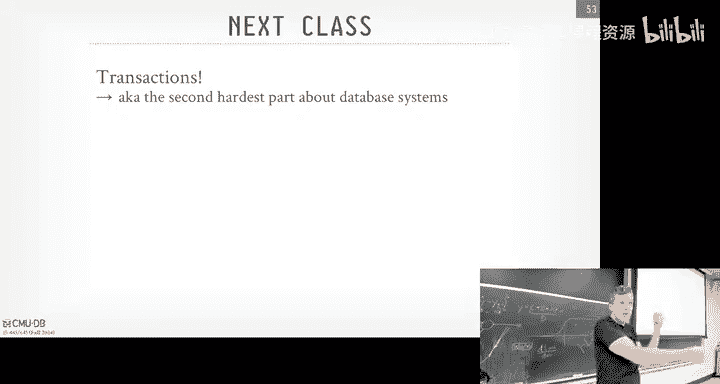
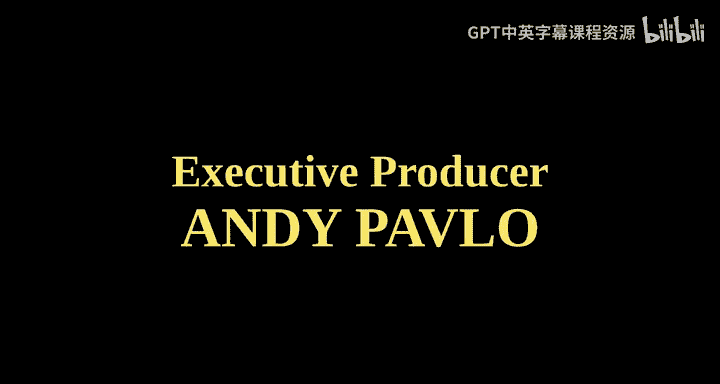

# CMU《数据库导论｜Intro to Database Systems (15-445645 - Fall 2024)》中英字幕（deepseek翻译 - P16：#15 - Query Planning & Optimization.zh_en - GPT中英字幕课程资源 - BV1Tys8eQELW

Yeah。い？🎼Official All right so today now we're going to talk about Que optimization query planning right how do we take a SQL query and generate a plan we actually want to run Before we get into that。

 the logistical things in the class again， Project two was due last night。

 Project three came out yesterday as well and given that we were late and releasing it。

 we bumped it up another week so you have now three weeks completed instead of two so we do on November 17 we announce the recitation next week homework4 we' still be do this Sunday coming up at midnight yes question。

The project。At least bumpers We're gonna try to release project 4， especially as project 4。

 at least itd be dumped。 we're gonna try to release it sooner。

 And then given that we have potentially less time now on project 4， we'll pa it down a bit of it。

Okay， any other questions。And as far as know， they haven't announced the final exam dates and times yet。

 So when missed that， okay， al right。13th。Okay， whatever he said。Fri 14， and then we'll forget。

 you know， if it's in the morning， we'll get coffee and donuts and cigarettes whatever you want。

 okay。For again， for additional database talks， we have somebody today coming talk about a database they built using data fusion specifically designed for bioinformatics。

 And then Sonata is giving a talk the following week their streaming system。

 And then influx DB is the only database company we've had talk three times here at CMU because every time they come back。

 They're like， yeah， we made a mistake。 Here's a new system we're building。

 So they came the first time we told they were doing wrong。 And then they went ahead with anyway。

 And then came back the second time said， oh， that was a mistake。 We had to redo it。

 And then Paul is talk in a few more weeks saying now they're based on data fusion。

 But before they were using M。 and told it was a bad idea。 And they they didn't believe me。 And then。

😊，I was right， okay。All right， so again， last class。

 we were talking about how to take a query plan that some the system generated。

 which we haven't really talked about， which today's about and run it in parallel。 I mean。

 prior to that also too， when we talked for separate query execution was how do we architect the system such that we can move data between the different operators and you know。

're removing the whole tu part of the tuple V batches and so forth。😊。

And the thing we were talking about is at that level we were talking about these physical operators in the query plan。

 It was no longer I'm doing a join in an abstract way。

 I was saying I was doing a hash join or an E loop join or certain join or I was doing my I'm doing looking up the table or data from a table on the index or the actual Sc stand on the table itself。

😡，So today's class is really trying to understand， okay， great。

 we know how to execute the queries now， but how do we get those query plans。

 How do we go from a SQL query and then generate the physical plan that we can then execute on on our system。

 using the process model that we talked about before。😊，So that's what really today' is about。😡。

So to set things out， let's do a really simple example here。

 we have a join on an employee's table and a department table based on the department ID D。

 and we want to find find all the name of all the employees that work in the toy department。

So this is the SQel here we're given。 And then we haven't really talked about catalogs a little bit。

 We have， but not in detail。 But think of this now。

 there's some internal database of metadata about what's in our database。 Here's the tables I have。

 Here's the columns I have。 Here's the types that they have。

 Here's the indexes I have on what tables。 and are is it clustered or uncllustered。And some。

 as we saw before， some basic information about， I have， so many records or so many tus in my tables。

 and they're broken across so many different pages。Right。

So if you take the SQL query and almost do a little translation of it into relational algebra。

 you would sort of end up with a query plan looks like this where at the leaf if the leaf node。

 we have our scans on the employees and department table。

 then we're feeding that up into a Cartesian product。

 And then the output of that gets filtered based on the matches of the joins。

 Then there's additional filtering we're doing on on the department name。

 and then we do a projection at the end to produce the employee name as the output。😊。

So if we want to start tackling the cost of this， because that's the thing we really care about now when we start picking deciding what query plans we want to use for a G SQL query。

We use some approximations or estimates based on what we have in our catalog to determine whether one plan can be better than another。

So just quick back of calculations， what we can do here is say， okay， well。

I know Ive got to scan the employee table and the department table。

There's be 500 reads for page read for this。Million p for that。

 And we's going to pick all the output and just write it down to a1 file， right。So then now。The。

 the the next operator is going take that 10 files。 this input， read it all back into memory。

 do the filtering。 And let's say again，'s it's a foreign key join which is back back of the envelope calculation。

 we're gonna to say。a certain number tu is going to match。

 So we're going only get to write out 20002000 records。

So then now we write that out into a temp file， T2 that gets read in by the second filter。

 and then now again， we're doing some filtering， say we'll have 50 employees per department。

 assuming uniform distribution， which will cause problems for us later on。

 and then we'd write that out to another temp file。

 which we then just read it back in in get the employee name and do the projection。

So for this gross approximation， we're doing about 2 million IOs， which is not great。Right。

 and so the question is， okay， how can we start in our query optimizer。

 start reducing this IO cost because that's be the dominant thing for us。 And again。

 whether it's coming from disk or coming over the network。At this point， it doesn't actually matter。

 You know， what can we start doing to start optimizing this further。 Well。

 the most obvious thing is that we have a Cartesian product。

 which is almost always going to be the worst thing we actually want。

 unless someone explicitly ask for a cross join in our query。

 we almost we never want to be be doing a Cartesian product or a cross join。

 So we can just replace that with a a block based or page based nest loop join。

And then now the amount of data you get have to right out after you join is significantly less。

We then feed this now into our projection。 sorry， our filter operator， who's now reading less data。

 It's going to write up the same amount before。 And then the。

 the projection at the top is going to do the same amount of work。

 So now we got it down to 54000 ios。Again， just by just replacing that cartesian product with a page based or block based nest of loop join。

 done we've read less data at the leaf nodes。Can we optimize this further？Of course。

 we spent a whole lecture talking about crappy how crappy nest of loop joints were。

 So what if we did something better， like a soer's join。😊，Right， just again。

 by just replacing this join algorithm。decision we're making in our physical plan of like instead of using a nest loop join。

 replace the physical operator with a Smers join。Now that reduces the cost of amount of IOs we're doing quite a lot。

Now we're down to doing 7000 iOs for this one query。What's another thing we could optimize。

We talked about query processing models， right， We talked about the iterator model。

 We talked about the materialization model。 We talked about the， the vectorization model。

This is the materialization model because I'm taking all the output of this physical operator。

 writing it out to a file， and then reading that file back in in the next operator。😡，Now， idealally。

 if you can keep everything in memory， sure that'd be great。

 but let's assuming that we can and this example here。

So the materialization model is going to give us 7，000 IOs。But if I'm。If I'm smart about this。

 and realize， well， if I use that， then I'm not doing any pipelining。

If I switch to a vectorization model， I get rid of the rights。

 the reason rights down below the leaf node here， I still got to read everything in。

 but I don't have to read it back in in the other operators。Right， so by switching to pipelining。

 I'm getting down to 3000 ios。Now， in most database systems， nearly all database systems。

 they're not actually going to be able to choose between utilizationization and vectorization model they usually just implement one。

But。If you then， if you are careful about how you organize and what operator executes in what order。

 then you can avoid having to spelled a disk unnecessarily。 and you can get。

 get more better pipelining。So this is like， this is like an extreme case of like no pipelining。

 all pipelining。 But it's a bit more nuanced when you actually do further refinement of the query plan。

All right， so now we're down to 3000 IOs， can we do better？

What's another thing we said that we we we can do when we start figuring out how to make the joins better。

Swap the inner with the outer， right？And then obviously also here I have this filter up here of filtering out the departments based on the name。

 the department name， well I clearly want to do that before I do the join。Right。

Because why do join a bunch of tuples on departments And and then just gonna filter out later on。

 So I want to consider swapping the employee of the department。

 And I want to also consider moving down the， the filter the predicate below the joint。

So if I do that now， switch Fop this， move this down slide this over here。Right。

 now the on the department case， I can start using an index next loop the index look up because I have an index on the the department name where I up up。

Here， right， I do look up my department name。 That's gonna be fast。

 And now I'm just doing the lookup for give me the department where the department name is toy。

 That's a single lock I'm going to get that right， and assuming I still have to write out them material materializing the output。

 And then now when I'm doing my join， I'm doing much。

 much less work on the join because I'm not joining tuples that I don't care about anymore。

And in this case here， I just do inectness a loop join。Because now I have a department ID。

And I have another index on department I D on on the employee table。

 So now it's a single probe to go get all the。All the employees in that department。

 See there's 20 of them。And then now I feed that up and I'm still doing that final projection on the twos at the end。

So now I got it down to 37 IOs。We went from 2 million doing something really stupid to 37。

So that's what today is really about。 How can we get it down， How can we take a query plan。That。

If we do the naive thing again a little translation of the SQL query into relation algebra。

 Now that's not always gonna be relation algebra constructs where everything can sQL。 But high level。

 I think you understand what I mean。 But how do we go from something that's terrible to something that's good enough。

And datass are amazing， like when you sit at the terminal and likeduct DB and SQL light and Postgs or whatever。

 When you write your SQL query and hit enter， it's going to do all this stuff for you and then then run the query。

😡，It's very impressive。 what these systems can do。Alright， so today we're gonna talk again。

 the high level background about query optimization is going to be about。

 Then we'll talk about the the main two ways to do query optimization。

 One't be rule based or heuristics， similar of what I shared here before where like。

 I actually don't need to consider whether this is a good know doing a switch is me a good idea。😊。

I mean， switching the switching the join algorithm that that that requires more thought。

 But like predicate push album is almost always you're gonna want to do it。

 And so the most rule based optimizations you can do。

 And this is what most systems build when they built build query a the first time。

 They're gonna build something that looks like this。

 Then we're talking more sophisticated more complex way But do this using cost based optimization will finish up then talking about how to actually do these cost estimates。

😊，Alright， so I had three warnings for you today's class。First of all， buckle up， this is hard， okay。

The joke in databases is that if you try to make it in query optimization and you fail out and you can't do it。

 then your backup plan could be a rocket scientist because doing query optimization in a SQL database is much harder than doing rocket science。

Whether that's true or not， you know， it's abatable， right， I would say alsot tune。

 The second one is this is the part of the data I know the least about right you know， today。

 we' rarely scratch the surface。 I could talk about what the what other systems do。

 But like the the low level rules and all these X amount of things you can do to optimize queries。😊。

It's， you know， something that I'm not really。 I'm not， I would not say I'm an expert at all。

You know， he's the expert in this。 sorry， actually， of course。

 The German who wrote that  Ubra system， He wrote his own cr from scratch， right。

 So not only he has the best query out， So he has one of the best engines。 It's insane。 sorry。

And then last one to be。 the good news is that it's not really a warning that if you're really good at this。

 I'm not saying this one lecture you'll be an expert in this。 We'll talk about 7。

99 at the end of the class。 If you're really good at this。

 you can get paid a lot of money because the Davis companies when the email means。

 hey do you have students to hire， they always say， hey。

 do you have any students working on  query optimization we really want somebody works on  query optimization So this is always gonna be demands the rest of your life because it's just so hard at every data system has to struggles gonna struggle with this。

 And no AI and L M aren't gonna magical make this problem go away。😊，All right， so at high low。

 what's going on here？So your application is going to send us our SQL query over the network or through a local connection。

 and it's going to hit our data assessment。 and the first we' we going to do is hit a parser。

The parcel is going to take that sQL query and convert it into an abstract syntaxt tree。

Now there's libraries now like SQL parser in Python SQL Parson rust。

 there's Lib PG query in CAOSS or C。That's right。 Like there's libraries that can do this for you。

 Most systems now that are going to try to speak the Postgs dialects there's a modular version of the Post parsel you can get。

 So that's going to spit out an abstract syntax tree。

 you then pass into the database binder and the binder's job is basically take string tokens of database objects like a table name and then map that to some object I or internal I in the catalog。

😊，Right。In Postgres， there's a P G class table that sort of we， we store all this， right， But again。

's just making sure that if you're reference the table that doesn't exist， the binder will。

 will check it。 The parsel is basically checking whether you're sending malform SQL queries。

So then the binder is not going to produce a logical plan。That's basically say， here's the joins I。

 you know， I want to do。 Here's the， here's the the tables I want to reference。

 Here's the projections and filters I want to do again。

 But the logical plan doesn't specify how to do it。 It just says what you want to do。

You then pass that into the optimizer and depending whether or not it's doing cost based optimization。

 there will be a cost model component along with the catalog。

 Well usually sort of statistics in the catalog anyway。

 but there's be some components it's going to say， okay。

 for different physical plans I could have for the logical plan I was given。

 here's the ones that I expect to take the least amount of time to execute or have the lowest cost。😡。

And then there's a crunch for a while。 And then at some point。

 it's going spit out a physical plan that you can then actually finally execute。

So when you call explain in like Postgss orductDB or S light。

 that thing coming out that you see the tree structure， that's the physical plan。Alright。

 so to reiterate the logical plan。 It' going tell us what the， what we want to do at a high level。

And then the physical plans are gonna say for forgiven a logical。

Given the logical steps I went in my query plan， here's how to actually physically execute it。

 Like if you want to access this table， use this index or do binary search on the sort of table。

 or if you do a join， do assortment join， have a hash join。

And you even get more fine grain things like do a hash join。

 but allocate the hashable to be this size when you run or use this hash function and so forth。

So there will always be a 11 mapping between a logical plan operator to a physical plan operator。

Right， like you could have a logical join and a logical order buy。

 and then that could be collapsed down into a single sortr merges join because that gives you the order by property you want and does the join。

Right。And in some cases， too you you take it to your logical plan and break that up into multiple physical plans。

So there isn't always going be a one mapping between these different plans back and forth。

And typically， you know， when we talk about the actual implementation， what'll happen is you'll。

 you'll。Once you have the logical plan， you convert it to a physical plan。

 you never convert it back to the logical plan。😡，Right， like it doesn'。

 because it doesn't really kind of make sense to say already。

 I know has joined the best thing I want to do。 Why would I go back and lose all the information I've collected doing that optimization to go back to a logical join operator。

 sort of the transformation occurs in in one direction。All right。

 so what are we actually doing at high level here？So query optimization is a really hard problem。

 It's been proven to be MP complete or MP hard。 If you account for the。

 the different join orders you can have， Just think of different ways permutations that could have for joins that write that by itself is it can be MP hard。

So then now the idea is that we want to find a bunch of different logical plan candidates。😡。

And then for each of these candidates， we're going to then try to estimate the cost of them。

Everything in cost based optimization。And then we， at the end。

 we either run out of time or we we exhaust our search and we say， okay。

 here's the best plan I could have right now， Ph plan。 I'm gonna go ahead and execute this。

So the reason why this is really hard is to just think of like， here's the entire search space。

 the solution space for all possible query points I could have for any complex query。

And then there's no way we're gonna to be able to explore everything。

 So we need to be intelligent and decide how do we jump into some place inside this total pushing space and muck around or look around and try to find a reasonably good plan in a short amount of time。

😡，Because practically， it's just not possible to do an exhaust search for simple queries。 Sure。

 like select star from table where Id equals1， and you you have an index on IDd。

 you can find the optimal plan， right， that's easy。 But when you start doing joins And again。

 think of like 6 joins，7 joins，7 way joins。 the crazt what I've ever heard is maybe up to 1000 joins。

 because they're all machine generated queries， It's not coming from a dashboard。

 not like human typing these things。In that world， you know， it all， it all comes。

 all comes falling apart。 Nobody does those things well。Except for the Germans。 Okay。

 because they have， yeah， they have another technique。 we'll cover later， okay。Right。

 so this is a big picture of what we're trying to do here。 And as I said。

The two general purchase we're going to do are。App rules and heuristics that can rewrite the query to remove things that we know is probably going to be a bad idea to do。

Right， the predicate pushed down is most obvious one。 Like I want to do。

 I want to do filter things before I do my， my joins。Not always the true， right。

 You'd have something like the predicate does in a very expensive calculation or makes a call to like open AI。

 which costs money now。 And maybe I't want to do that after I do the join because I don't want to pay money you know。

 to out outbound requests。But in practice， you always always always want to push that down。

In some cases， we almost always have to maybe look at the catalog and understand what's going on。

 but the key thing to understand about these heresian rules is that they don't require us to actually look at the data。

Becauseuse at this point， when we're optimizing the， the the query。

 we can't look at the data because the query hasn't even started running yet。My SQel does something。

I don't know if' a good idea， a bad idea， but they' the only ones。

 And need to understand a bit further。 In some cases。

 they'll actually run part of the query during the during the crapr。

 They'll go run the part of the query， get back some information and then say， okay， yeah， let me。

 me， based on that， let me go decide how want to do certain things。

 Some systems we'll do this for sampling to collect data we'll cover that later。 But in general。

 for these rules and hereuristic。 you don't look at any， any data。

And then the alternative again is gonna to be the cost base search。 These are not mutual exclusive。

 Most systems will do this one followed by this one。 Postcard does this one a couple times。

 does this one， and then goes back to this one again， right， because it's kind of a hack。

 But we'll cover these things later。 Allright， So let's first talk about how to do the rule one。

So the rule one is really about doing logical plan optimization。

And then the idea here is that we're going to have these rules。

 basically patterns that we're going to match on our query plan。😡。

And if we see this pattern getting satisfied， we know it has certain inefff that we want to remove。

 And then we apply a transformation rule to then do the rewriting to change things。

And the basic idea here is that we're throwing away things we know are stupid and kind of pushes the query plan towards the direction where when we have to do a cost based search。

 which is more exhaustive， that we're kind of in the right location。

 at least at a good starting point。😡，So in this world， though。

 we can't do any comparisons to decide if I do this transformation， is it better for me or not。

 because again， there isn't going to be a cost model that says this is one better than another。😡。

It it's sort of ingrained or implicit in the implementation of the rule as database people building it。

 we know， again， predicate putdown is going to be a good idea。Therefore， always do it。Right。So again。

 in this world， we can't guarantee we'll be able to find the optimal plan， but in practice。

 this gets us in the right direction， which again will help a lot。

So these are the examples that we saw before the credit could push down。Right， and then now。

 maybe instead of operating directly on the， the on the query plan tree itself。

 I could operate directly on relation to algebra becauseuse that maybe be it's more compact and easier to do。

 easier for the system to reason about。So in this case here。

 again I have the filter on department name above the join。

 I just want to move it down to be below the join， and so I can just match that pattern either on the relational algebra expression or on the tree itself and then go ahead and do the rewrite that way。

And that's fast， right？And so typically， what happens is when， when these systems get implemented。

 they'll be。A。Well， in some cases， in Postgres it as much if then L statements。

 which is not great in other systems， you could define the rules。

 maybe using a DSL and then you set a priority， say， I always want to check for pre push down first。

 then followed by this one， followed this one In Postgres is a bit tricky because you have to do certain rewrite rules in exact order。

 otherwise the tree ends up in a invalid state。But in theory these things should be composable。

Allright，The other role we saw before was doing the replacing the Cartesian product。 Again。

 if I just see a Cartesian product with the filter right above it that actually has the horn claws from my join。

 that' the node brainer， I wanted to rewrite that into the inner join。😊。

And you' remove that filter entirely because the filter goes inside of now the joint operator here。

Right。Again， I don't really care what's above or below me。

 I can sort of pattern match on this part right here。

 and then I keep everything else the same because I know that again。

 I want to get rid of the Cartesian product。 It's always going to be a good idea。

And then the last one we saw before again was projection pushed down。

 If I know that I have a a projection above a join。

That's going throw away most of the data that that I would actually need。

Alright it's not throw away mist the data that's coming out of the tuple。

Then I may want to duplicate that projection operator to be below the join。

 And then now I can do a calculation， say， okay， what's the minimum number of attributes I need for this table feeding up to the join and filter that out。

 project that out so that I'm only passing up the the small of records I need。Now。

 here's where you imagine a cost model could actually help， right， because if my， if my。

My table has three columns， then spending the time to actually do this projection and copying data from。

 you know， from the the scan into the the join might be actually wasteful。 But if my table has。

 I don't know，10000 columns， then yeah， this projection pushdown would be a huge win。So oftentimes。

 in these rules， you'll see。Hard coded values， you'll see them the cost models too。

 where like someone says， okay， yeah，10。 if it's more than 10，0， I do do the projection push down。

 if not， don't do it。Yes。projection pushed for It question is projection pushed down helpful for store debates。

 Yes， so my example again， if I have 10000 columns。

And I can calculate my optimizer that this query only needs two of them。

Then I can throw away the other 9，000 of them。Right， not not just common stories。Becauseuse， again。

 like think of like。In my example of the material model， I was。

 I was copying from one upper to the next， right， I I'm wasting space。

 copying these extra columns that I'm not gonna to need。Right， even even it's pipelining， I can。

 I can keep more things in memory if I'm not polluting with with data that don't need。

 the end of the day， the goal of of the queryat is really trying to throw away as much useless things as quickly as possible。

At a reasonable computational cost。Alright， so again。

 like pretty much every single data system is gonna do some version of。

 of these kind of rules because， again， they're fast。 They're easy to implement recently。

 And then they're， again， said， they're almost always gonna be the right thing to do。

All right so now the next thing weve discuss is to do cost based search。And this the part where。

 think things get really tricky。Right？And so the idea here again is we have this logical plan that we're converting to physical plans。

But there's a bunch of candidates of physical plans we could have， And show you the example of like。

 I could do a， I have a join。 I use servers join。 That's a loop join， in S loop join。

And so I need a way to say， okay， of my choices to do this this one join operator。

 which one is is the best one。So the question is， how do you actually start enumerating the different choices that I have and reason about them and decide know。

 how to guide myself towards an optimal solution。I would say also to this cost modeling for this cost referring to this estimate。

 this is going to be an internal cost that is specific to a database systems implementation and is not。

Sort of comparable across other systems， meaning like process is gonna spit out a query cost estimate for its queries。

 If if I take that same query run on My SQl， it's gonna put out a number  two。

 It says this is the cost。 Those numbers don't mean anything across systems。

 It's only do relative comparisons within the system itself。Because certainly also too。

 if the data changes， the hardware changes， or other parameters and tuning of assessment changes。

 those costs actually might change within the system itself。Al right。

 so in our example here we're going to start with sort of the most basic cost base optimizer to bottom model cost optimization。

 and this is actually the first cost base optimizer that was built by IBM in the 1970s。😊。

So basically IBM invented how to do cost based query optimization back in the day because one that they didn't exist and two。

 they realized， okay， with something declaredlar of like SQL。

 you need a way to compile it and generate an optimal query plan。

 similar to how the C compiler compiles C code into assembly or machine code。😊。

So what they're basic going to do is theyumerate a bunch of different plans for the query and estimate their costs。

 and they're going to have separate sort of paths or passes to handle the case when you have a single table in your query。

 multiple tables in the query because you're joining them。

 and then the hardest one else to do is potentially also subqueries or nestA queries。So again。

 the optimizer can be able to run for。enuming all these different plans。

 trying them out until either it realizes I've seen all possible physical plans。 And therefore。

 I know which one is the best one like in the optimal case。

 you can do that for single single table queries。 in never can do it for。Above 3。

 things get things get tricky or there the timeout。

 like in Postgres and MyQql and all these other systems， you can specify how。

 how long you want the query measure to actually run。Again， the trade off is going to be。

Saing my query is going to run for 10 milliseconds。

 Do I really want my query optimizer to run for 100 milliseconds。

 or maybe I just let it run for 10 milliseconds， and then I'll find a query that runs in 20 milliseconds。

 And I'm still ahead versus doing， you know， still running faster than just letting the the query we trying to maybe try to find the true optimal plan。

Again， the heating， we can't do exhaustive search here because everythings going to be because of the problem going to be envy hard。

So as I said， if it's a single table， this is easy because it comes down to me what's the first。

 what's the best access method for my query。Do I do a sequentialro scan。

 which is always the fallback method for a table？Is there is my is my data cluster on index。

 Therefore， I can do binary search。 Maybe choose that。

 or then I try to pick the index that is gonna be the most selective for my query。 Again。

 if it's a primary key look up on and you have a obviously at the primary key index， that's easy。

 Like select star from table where I equals Andy and I have an index on I D。

 that's easy where things get trickyies。 Now if you have like。

Doing a lookup with the wear clauses on A And B。 But I have an index on A。

 and then a separate index on B。 How do you handle that。

 Well we saw how to do multi index scans before because you combine together to the results。

 take an intersection。 So there's all those things。 This is where we have to figure those things out。

We won' to talk about predicateate evaluation ordering， but that also matters a lot as well。

 because I want to be able to throw in as much data as I can quickly as possible。 So therefore。

 I want to evaluate the predicate that's going to be the most selective right away。Right if。

 if it's find me all the the email addresses that end with dot dot CM U dot ED U versus all the names where the last name equals Pavlo。

 I think there's I'm only here at CMU。 So like that index on。

 on the index of names to find people named Pavlo， that's gonna be way faster than looking at everyone has。

 you know， dot CM U do E U email address。And then the query apparatus can then figure out how to reorder those predicates based on those cost estimates。

Yes， but how would it know that there's less Pablos than CM？His question is。

 how would you know that there's more Pavlos at CMU， Sorry， there's more。

 How would you know that the Pavlo email Pavlo name is more selective than the email。 Well。

 since a second we'll have statistics in the catalog。

 basically histograms keep track of what the data actually looks like。Right， you。

 it's never gonna to be perfect。 It's often really， really wrong， but it's be better than nothing。

 But you'll have some information。 Also， T， you could also look in the catalog and say like。

We'll say instead of looking at last name equals Pavlo where Android ID equals a Pavlo。 In that case。

 you know Android ID is unique， They have some asshole had Pavlo。

 and they won't give give it to me from20 years ago。

 I't think these guys dead too and they won't give to me anyway， Like that's a unique key。

 And you look in the catalog and say， I know I'm doing look up on a unique key。

 And I have an index on that unique key because I have to have it be unique。 That's me way faster。

 Do that look up first。 So ass a combination of the catalog and some basic statistics we're collecting。

😊，Okay， so now okay， simple simple queries， or， you know， single relation queries， this is easy。

The tricky one is going to be we have multiple tables。I'm going to show two approaches。

The first one is going to be with the system R1 that sort of mentioned the classic approach。

 the bottoms up dynamic program style， where we start with nothing in our query plan。

We start with like here's all the tables that I I know I would need to join them。

 and then you build it up iteratively start doing the joins and try to figure out what's gonna be the best join ordering and the best algorithm as you go up。

And then you just choose the one that has the call the best path going down。

 getting back to the starting point。And then the alternative will be this top down approach or transformation。

 where it's like a branch of bounds search where you start with。At the very top。

 like this is what I want my query to produce as an output。

 And then you work down to adding in the operators to get you back to where where you want it。Right。

 so idea is you start with nothing。 The first one is you start with nothing and build it up。

 The last one is you start with the the answer you want and then per it down to generate the plan you want。

So I'll go for each of them。 So as I said， this is the first。

 the first query optimizer built by an IBM。 It's this bottom up approach。

 And what they to do is they would first apply a bunch of static rules that we saw at the beginning to throw away things you know are going to be stupid。

 And then we're gonna to do dynamic order dynamic programming to figure out the best join order for the the tables basically doing divide and conquer approach。

😊，Right。And they said most database systems that are open source are going be using some variation of this。

 I don't know what Clickhouse does。 The German Upress system does a， a。

Cocaine fueled version of this with hypergraphss's we'll cover this in the class next semester。

This is the basic building block that how most systems do query optimization。

So a systemR would work is that they would first break the query up to blocks。

Think of like a join in two tables。 that was gonna to be considered a block。

 And then they would figure out the ph operators of block。 They want to figure out how to do the the。

 pick the best join algorithm and the join ordering within that block。

 And you sort of construct together now the query from all these blocks that that you're， you'， you'。

 you're building up。But one of the key design decisions that they made in their implementation is that they would only consider what are called left deep trees。

So a left deep tree would be like I'm joining A and B， and then the output of that I join C。

 and the output of that can join with D。Contras with a bushy plan which something like this where you would join A and B。

I joined C that produces some output， and then I joined the two joins together。

Let me take a guess why， why did IBM decide to throw away the bushy plans。

He says the hard can a lot of pieces。 Yeah， so one， that's one answer， right that you。

 if you just throw away any of these， any bushy plans that look like this or anything that's not a left deep tree that cuts down the search space quite a bit。

 right。Alright， so why， why would they only want to consider these then， Right。

 Because I I could just say， oh， I'm only taking bushy plans。

 throw away all the left deep right deep joins。 So why only do right deeps。Pipelining。Right。

I joined A And B。 And then the output of that and those tus come out， right。

 I can then just feed that up now join join the C。 So what you could do is say youre。

You flip the orderin this， say now you're gonna build these are all hash joins。

 You build all the hash tables and B， C and D。 do a first pass in those。

 you build a hash table on those guys。 Now you come back and take a and you can write a the pipeline。

 you never have to spill the disk。 If you say， okay， do my A， check the C with。

 It's in the hash table for B， If yes， check the see with as hashable C。 If yes。

 check D and the silver pre output。😊，So if B， C and D are really small， you do one pass on over them。

 build your hash table， then now A is the really big table。

 and I'm just scanning through that once doing my probes and all these hash tables and see whether I have a match。

😡，I can opt this even further again， as we talked about before。

 like as I'm building the hashts on PC and D， I could build the bloom filters on them as well。😡。

And then now， as I write this up， it's even faster because you know， if if 2。

8 doesn't pass the blue filter。I never have to go， you know， you know。

 I don't even even probe the hash table。 So I could keep those bloom votersers in memory and only go get。

 go to disk get the， get the hash tables if necessary。 if I'm， if I'm really constraining on memory。

So they do this for pipelining。 And because again， it's 1970s。

 the computer is really slow and memory is really limited。 It cuts down the search space a lot， yes。

When to。Went to A。com you gives true many。The question is when when operators are communicating through memory。

 do they go through the buffer pool。Typically。Doesn't that， they don't have to。

 But if you think you're have this sp of disk， then you wantna basically have。

Temp buffers you write into that could spill a disk。So in Postgres， yes。

 they will be backed by blockss that dis to disk in other systems they could say， all right， well。

I wonder as fast as possible。If I run out of memory， I'll just reject the query。😡，Right， right。

 and then you come actually give me more memory。 You could do that。

RightSo if you have to spell it the this， it have to be back by the profitable。

But as we talked about before， it's like this temp space。

 a scratch space that's assigned to your as a query that nobody else can read and write to and it could get evicted sure。

 but it's not like someone else can take the page lock on it while you're running。Alright。

 so let's look at more， more， more complex example here。

 So now we're doing a three a join on a sort of Spotify example。

 We're going to find all the artists that appeared on my remax from a few years ago。

 and we're going sort it by artist I。 So we're doing a join to the artist table。

 the appearss table and the albums table。 This is example we showed at the first day of the class。😊。

So what system I would do is the first thing you got it is say， okay， I need。

 I know I need to access the artist table， the appearss table and the album table。

 So let me just choose what's the best access path for each of these。And again。

 you can just do this in the catalog using rules and say， allright。

 I know I got to do a s scan an artist and appears because I don't have an index that can satisfy any of the predicates in my。

 my wear clauses， my join clauses。 But in the case of album。

 I can I'm doing a look up on name and I have an index on that so I can use that。

Then now you're going toumerate all the possible joins that you could do for these three tables。

 because this is PowerPoin， I can't show all them， right？But it's not only， you know， I。

 am I doing innerjoins， but also for all the Cartesian products as well。

And then now youre can determine the join ordering one of the lowest cost。Again。

 the rule you apply is you need to throw away anything with a Cartesian product because you don't yout want to consider that。

 But now it's really now trying to figure out for the ones that are doing joins's which of these is the best ordering。

 And then also which， which joint algorithms do I want to use as I'm scanning along。Al right。

 so again， the SsR optimizer is a bottoms up approach。

 so we're going to start at the bottom here that we just have this logical plan that says I want to have I have artists。

 I have Al， I have appearss， join them。I'm not saying what order yet。 I'm not saying how to do it。

 But as you start that， that's the starting point。 And then the thing of the top is。

 here's the logical output that I want。 I want， I want to produce the query result when I join these three tables。

So in the first phase here， you then say， allright。

 I can have different orderings of the do the joins so I could join with artist and appears first or album appears。

 appears an album and dot dott because it's PowerPoint this goes on quite a while and then now the path from that starting location at the bottom to the next stage。

 a next logical operator along this path that will specify。

 here's the physical operator I want to use to compute this， a hash join versus a certain rejo right。

And now I'm just annotating again with just the predicate that I love using to do that join。

So now for each of these paths， I can then go to my cost button and say， okay， to join。

Artists and appears using a hash showing， How much is this going to cost me。

 How much disk am I going to read， How much CPU could I potentially use or for the sort join to do that same join Art appears。

 how much CPU， how much disk， whatever else I want to use my cost model。

 I then calculate the cost for that path。And then now for each of the logical operators at the next level I just pick whatever a path that has the lowest cost and throw away everything else。

Because under dynamic program and the P optimal mali， if something had the lower cost going up here。

 then in the global optimal plan， has to be the lowest cost between this decision right here。

At that level。So at this point here， I don't know which of these three choices or as it extends out。

 all the different choices of the physical path going at the next level is that has the lowest cost。

 but this stage here， I know from here to here， this one has the lowest cost。And again。

 I'm only install Cbers join versus hash join， nested loop join。

 all the different variations that we talked about before， we be part of this as well。

So now I going to do the same thing， so now I say okay。

 now I have Art and appears peers and I'm joining with album and then likewise where all these other guys here。

 so now I say well what's the path the different join paths I could take up to get me to my final final result。

ermOr perermute all the possibleumerate all the possible joint algorithms I could have for each of these。

Compeute the one with the lowest cost。 Throw away the rest。And then now I want to say， okay。

 now that since I'm at the top， I have multiple path for get me down to the bottom。😡。

Which one is going to have the lowest cost？And that's the one I I'm gonna to choose。Makes sense。

Its que is actually， this plan is actually not even correct， though。Right。隔状。Going back here。

I have an order by clause。But when I choose my path going back here。

There's no notion of ordering here。😡，Right。So one of the limitations of IBM's first implementation of a query optimizeer is that they had no notion of the physical properties of。

 of the data， sorting as the most obvious one。You can imagine compression and other things， right。

So the hack they would do to make this all work and modern systems can fix this。

 The hack they would do is that they would keep track of the plans that had with and without the sorting property。

 whatever the physical property that I cared about。

And then they would check to see whether for the plan that didn't have that guarantee that physical property。

 if you tack on whatever operator you needed to make it conform to the property you want。

 like added order by clause， add a sort clause or operator。😡。

Above the join to get it to the to the the form that I need。

 if that cost was less than the the one where the the query plant satisfied that property。

 then I would choose that one by just adding at that sort of thing。

So they're using the cost model to get it to， to determine whether the physical property was what actually I needed to produce the actual correct plan that I wanted。

Make sense， yes。It's the cost of a pestol for one query。Will will be different for different。

His question is， is the cost for is the cost of a hash join different per query， Yes， absolutely，use。

This question is for a。It questionestions。If we query with that orderbi clause， wouldn't the。

 the server joint always be better。No， hash joins hash joints are proven to be。

Algomically better than more efficient than sort rejoin。Right， so maybe the case。

 depending on what the， the data looks like。doinging the hash drawing， making the data unsorted。

 then doing the sort afterwards， that actually would be the better way to do it。Right。

Say the hashron only produces two dups。Then then that would be， you know。

 that's be this faster because then the sort cost is so small。another way to say is。

Maybe what you're asking is， is the hash drawing costs always going be the same regardless of what query I'm looking at。

 No， it depends on the data coming in。Depends on the joint clause， how selective that is。Right。

 depends on the hardware。 depends on how much memory you have。

 depends on all the different factors that are very hard to， to determine。And estimate。

It's very hard， yes， there you go。The light bulb just went off。 fantasticastic。 Yes。

 this is super hard。嗯。I mean， you， so you can play some games of like recognizing if。

 if the data hasn't changed， like， I've never seen an update， insert update query。

 And I see the exact same query over over again。 Could you reuse the， you know。

 could you reuse these estimations， yes。But oftentimes that isn't the case。Yes。😊。

If we only keep in track of the risks。佢先 that我 like件佢 up。So question。

 are you only keep track of the best paths， In't this， Yeah。

 so this is not gonna be the global optimum。For the choices that we're considering。

 this path down will be the global problem。Right。Again， point at the system are。

 they're only considering the， the left deep trees。 The bushy plan actually might be the， the。

 the global optimal。But they're not even going to consider that。

The new modern systems will with budget plans。But I'm just。

 I'm highlighting the system R one because that shows you like things you can do to cut down the search base becauseuse you。

 you can't exhaust look at everything。Alright， let me talk about the， the top down optimizer。 So I'm。

 I will say I'm， to me， I like the top down optimization approach better This what we're building。

 the new system。 we're building at CM U does this。😊，The the Germans disagree。And for me。

 this is easier for me to reason about than the than the， the bottom up one。

 But let me go through it and see what you guys think。

 So the idea here is that we start with the logical plan of what we want to produce our output from。

 And then now we do， we do a sort of search down， traverse down and start adding in the， the。

The physical operators that get us to the approach that we need。

 And the idea here is that if we recognize that at some point of a branch。

 that our best cost we've seen so far going down this branch or the cost we have the branch going down so far is already worse than the best cost we've seen ever in in our search。

 we know we don'tterre down the rest of the branch because at no point is gonna magically the cost going to get better because it can't do that。

So this is what Microsoft SQL Server does。😊，And remember last class we talked about volcano。

 we talked about the B plus3 from the Kurtzgraph guy。

 He's the one that had invented this approach in the 1990s。 He wrote a paper about it。

 It's called Cascades。 It's indiscrutable it's very difficult to understand that you can't take that paper and build anything with it。

 Microsoft hired hired and pay him a lot of money to basically build up their new query optimizer and SQL server in the 1990s based on this approach in cascades。

😊，And in my opinion， now， SQL server。With things they can't talk about Se Ser reply has now。

 I would say they're gonna reclaim their crown being the best query optimizer。

 Whereas the German one was the best for a while， The sequence server one is is getting much better this year。

 But we we， we'll discuss that in the class next semester。😊，All right。

 so what's going to happen here。 Start with the logical plan at the top。

 We know we want to produce the a join with artist appearss and album。

 We're also going to include the physical property we care about that this data has to be sorted by the artist ID。

And then now there can be bunch of rules that we're going to apply that can convert logical plans to other logical plans。

 like a join on AB can just be a join on BA， those are equivalent， and I can do that transformation。

 but those also me rules that convert the logical plans to physical operators。RightSo a join on A B。

 I would convert that to a hash join on A And B。And as I said before， when you apply these rules。

 you don't go from a physical operator back to a logic operator， it only goes in one direction。

 but the logical operators can get swapped around as much as they want。

So now we introduce all the logic operators to build up our query plans。

 we have the scan on the artist album appears and above that we have the different join orders we would want and again assume this gets blown out for all the different combinations that we have so then now we start at the top and say okay well。

 what operator do I need to below me to allow me to produce this output of the join of the three tables？

So I could add the merge join。 in this case here， I'm doing a I'm doing a join on the I have some input that given to me that's a join on a1 A2。

 And then I'm joining with a3。 So I have this sort of placeholder here thing to say down below me。

 you're going join a1 and A2。 I don't know how it's going to be join。

 but I know that something's going to feed into me that's going to give me that result。

So you sort to keep track of like what needs to be coming into you in order to produce certain results。

 So then now you come down here and say， okay， well。

What below me would give me the join on A 1 A2 and feed up into the result of A3。

So say now I have my joint artist and appears as a large gra that would feed up into this placeholder here。

 and then the album is part of the scan of A3 and that feeds up into what A3 is。Yes。そエせ Aワテ。

Three were still like it's abstract。At this， at this point here， you would have placeholders to say。

 somebody below me is gonna to give me a3 is the album table， right？

 I don't know how they're doing it， but I know they're gonna feed up to me right。

 And same thing with the join A 1， A2。 Something below me is gonna give me the joint team artist and appears。

 I don't know how they're gonna do it。 It's gonna to come up into me。Right。

And then now iterate down here and say， okay， well， what。

 what would I need below me to produce the join of this， Well， I could have a hash join。 Well。

 then same thing， How do I get the data in my hash joint。

 I have to feed in artist and it appears and then do the same thing。

 I could also have a merge join So same thing What's the physical operator to this and how what feeds me into that。

And as I'm going down， I'm doing cost estimates and say， okay， well。

 how much would it be this hash join， given that I'm expecting this many tuups coming up from artists and appearss。

😡，Or what would the cost of doing the merge one？So now there be additional enforcer rules we can apply to make sure that。

 again， the data coming in from one operator to the next is in the form that we would want。

Right so in this case here， again， my enforcer rule would say the data that comes at the very top has to be sorted on the artist Id。

 I don't care at this point at the very top。 how it got sorted just has to be。

So when you have things like a hash joint feeding into it， hash joint is inherently unsorted。

 so therefore I know that there's nothing I need to consider further down from this physical operator because。

It's not going be sort of the data that I need。But then I could have the quick sort feed into me。

 I got order by operator。 and then therefore， by adding that。 now I can explore that further。

 But now I can do things like， okay， if that was being fed into me by a hash join。

 And at this point here， the the cost of doing the hash join plus the quick sort。

Is already greater than the the the， the， the smallest cost I've seen for any possible plan complete plan in this this tree。

 I know it， I don't need to traverse down further because it's never gonna get magically better。

 Like you， like the cost is always incrementing。 It can't magically get faster for no reason。

So again， this is the pruning thing you can do here。

 but you can't do that in the dynamicyn programming approach。Yes， does it。

Does he use that enforce from the beginning or just after the his question。

 does it use the enforcer rules since the beginning or afters， It's in the beginning。

 It's always part of the search。Right， I' was just highlighting as they able here。Yes。

Approximately the size of like join， like it really taking a tough down。

The question is how do you approximate the size would you' even take a top down approach？Yeah。

 so at this point here， you would have to。You， you kind need to go you go to the bottom some cases。

 But then you basically memorize all this information。

 So when you have to go to the bottom at least once and say， okay。

What's the cost of this path going back up here， Like how much data do I expect to get out of。

 I'm not showing the physical plans are doing the scans which indexes like how much data would be coming out of scanning this table。

And therefore， I store that in a memo table。 And then now when I go down a different path。

 I would say， I know that I'm going to join an A1 A2。

 have I clean the path down the bottom for if yes， I can use that cost。Right。

 and then that allows you to charge circuit。 But yeah。

 you have to get to the bottom for at least once。So the guy that invented this cascade stuff that goes Gry。

 when he won a test the time award war at Sigma a few years ago。

 he said that the best way to do this would be you do cascades first to generate a sort of rough outline of the plan。

 And then you would use theem programming afterwards to do the join ordering。 So he's actually。

 you know he inventeded this。 He said， you don't want to use this entirely。

 You want to use the the hypergraph approach from from the Germans。Did you join a ring。

 nobody actually does that yet。But to me， again， I。

 I can reason about this much better than I can about the， the D P stuff。2。So。

We got a a lot of cover。 Let me try to get through the net query as as possible。

 Just basically just give you understanding what's actually gonna happen。 And again， if you take the。

 the， the class next semester， we'll go in more detail。

Nesttic queries are are going trip us up because they're not really joins， right， There are these。

 these subqueries that you have to be reason about and。You know。

 you don't want to do the stupid thing of like for every single tuple invoked the nest query over and over again because that' would be super slow。

So what you want to do is either rewrite them to derelate them and flatten them down to joins。

 or extract out the NSTA query， run that once， almost like a CTE for the given query。

 and then inject the result into the call and query。The first approach is always be better。

 you're not always going to be able to do this。 This is like the fallback choice you can do that if it's not entirely correlated。

Or not correlated。 So they a query like this。 We're trying to find all bunch of sailors for reservation and trying to find people that all reserved a a boat on a given day。

So in here we can identify that the inner query is referencing the outer query。

 so therefore I could rewrite this now to it out to be a join right This is the best case scenario because now I know how to make joins run faster instead of having to run for every single tuple in the sailors table。

 run the inner query， I can now just do my join and rip through that very quickly。Right。

 for the hard queries again， you w to break up the queries into blocks。

 just like we saw on system R and try to then reason about what to do with that one block at a time。

 And then in some cases， again， if if I can， if I can flatten them through rewriting， that's great。

 if I can't， then I just run it separately as as if， if it's C T E。😊。

So in an example like this where it's now more complicated query。

 now inside this we have a nestA query that's producing an aggregation on the sailor table。

 and we're checking that for every single record in the outer query。

 If I could take this nestA block， extract that out now to be a separate function or sorry a separate query again like a CTE now at runtime。

 I can run that query at the top once and then inject the value there。Right and that'll run fast。

The the Ambra system andductDB can do the best these right now at derelating these these subqueries。

 SQL server is catching up very soon。 Yes， if you write CTs in your query。

 say its like redundant CT like you write CT uses it once will a query optimizer and like modern systems recognize you did that and then。

Like de aggregategregate that and put it back in or well always compete the CT。

That even if it actually is not like you shouldn't have written one。 His question is。

 if you have a CT TE。Maybe a high level， what does a data system do with a CTE？

Baically once to we write it as joints。 That's， that's that the ideal case。Yeah。

 because if it's something like this where there's an aggregation where no matter times you invoke the CTE。

 it's always gonna to have one twople， it's always gonna just just do a join for that right And this example here could。

 you could rerite that as a CTE would would produce the same result。2。

Another thing we got to care about is handle expression trees。Right，The idea again。

 that we have a bunch of wear predicants and our wear clauses or own claws。

 and we want to convert them down to be the minimal amount of work we have to do while still also producing the the correct result for。

 for the given query。And so similar to， we could have a rule based system for the query plan itself。

 we can have a rule based system for doing pattern matching and rewriting for expressions。

For the this one， you don't need a cost model unless you're doing reordering。

 But that's not really re expression。 Its。Ordering the expressions as you evaluate them。

In most cases I I think。In most cases， you don't need a cost model to do this。

 and most systems don't do that。So there's some obvious things you would want to do。

 like impossible predicates， like select star from table where one equals 0。

You do pattern matching on this to say， all right， I have two constants with the equal clauses。

 check to see whether they allow it to true， and if not just rerite them to true or false。

And in some systems， again， if it turns the false， Postgs and other systems can recognize I have an impossible predicate。

 And so instead of actually。Scanning the table of getting every single two and check and see whether false equals false。

It just bypasses running it entirely and says， you get no results。

More complex things when you have functions in this case here。

 this is now you got to go in the catalog and figure out， okay， well， the thing you're invoking。

 what function is that and can it ever produce null In this case here。

 the now function get the current date and time can never produce null。

And you would know that in the catalog， say this function never returns an null based on the return type。

 and therefore you can rewrite that as false and then optimize that accordingly。

For other things like user to defined functions， it becomes we're tricky。

 you may actually have to run the run the the function to see whether it produces no or not。

 In that case， it's treated as a black box and can't do any optimizations， yes。

The overhead of checking。Andエ but impossible。Is it considering is what worth it， Sorry to do this。

 do this optimization。Considering usually。Try to select something， your workloads。グリフォース？

Your question is。Your question is， is it like taking this sample here。

 is it worth doing this rewriting。Checking。Considering the one we like。I anybody maybe asking。

 is anybody that's stupid？But there is some of her head in checking them。right。

 question there is overhead in checking this。 Now you're like microseconds。Right。To check this。 So。

 so。In your question， would people write these stupid queries？😡，Typically。

 nobody would write where one equals 0， right， And， and if。You could argue if you write that。

 that's your fault， pay the penalty， but。A lot of times these queries aren't written by humans。

 they're generated by different these dashboards that are composing the queries。

 and therefore it's like a nested nesting， nesting at some point。

 once you start evaluatinguing things down， you may end up with a 1 equals0。And therefore。

 and if I have a billion two bowls， I don't want to check a billion two balls says one equals zero。

 I can short circuit that immediately。Yes， I guess my question kind of builds on that。

 let's say you have like a human that writes very condensed。

And then you have someone else that just writes like 200。Tons of garbage and unnecessary things。

Like after the query optimizer， how close would the performance？So your question is。

 if are they semantically the same。 question is。If I， if I generate some， have。

 if code that generate some query that produces， you know， some result set and， and the。

 the where clauses and the joint ordering and whatever it's very verse versus the human written。

 a very tight。SQel query， how close would how close would the optimal plans actually be？I， I mean。

 it's a cop out。 but it depends on， depends on the data。 It depends on the query。

 depends on what query optimize you're using。 Like for much of the little Postgres。

 it chokes and some really stupid things， right， Like it won't pick indexes if you。Like。

 if you do anything like order， if you have like a wear clause with a。Or order by calls with with a。

An expression in it， it won't pick it。If you do order by ID。Plus 0， and I D is an integer。

 It's always gonna be the same。 But it sees the plus 0 and says， I can't do that， right。

 So there's like。It depends on so many different factors。 It' tough to say。The， the machine。

 I would say that the machine generated queries often are much larger。

 not because they're adding superfluous things， just because they're being generated by dashboards with。

With very large like selection sets and things like that。 I can't say who， but a very well known。

Cloud company you've all heard of and used like they have queries that been coming out that are 10 MB。

 Like the SQL string itself is 10 MB because it's a dashboard with these。

 these massive ink clauses for every single possible combination and so forth， right so。😊，You know。

 so the complexity depends on some many factors。 It's tough to say what， you know。

It's tough to say whether it's always going to be one to going be better than another。

Becauseuse you could argue that like sometimes the the more verbose you can make things。 therefore。

 the more information you could provide to the query optimize or what you actually want。 But again。

 if you're optimized， there's crap this is， kind of choke on that。Yes。

 it written This question is because are most coordinates written by humans are machines。

 most chs are written at this point in machines， computers。Right think about you're on the web page。

 you load a web page， as much as SQ queries， that's all generated computers。Right。Okay。

There's a bunch of optimization rules these are two major ones。

 and I just want to hear like you have have a disjunction guy between1 and 100 between 50 and 150。

 you obviously can just rewrite that into be a single between clause， and then that's much faster。😊。

Right。Again， there's one of the tricks you could do to figure this out。Alright。

 so now the last 13 minutes I want to cover， how are we gonna actually。

Do these cost estimations as itve been saying， like。

 how do you determine one query plan that's actually better than another？

Right so we have all these formulas they're going to tell us like server join is going to cost this amount and。

 and hash join is going to cost this amount。But now the actual runtime costs of these things are going to depend on what's being fed into them。

RightSo now to compute the total cost of this query plan。

 I got to not only know how much data I have in these two tables。

 but now I need to know what's the selectivity of these predicates to say how many tuups am I going to fill the route？

Likewise， for the join， how much data is going to get past。

 going to get filtered get past the past the join operatorator。

 but then feeds up now to the my projection operator。Right。

 and now the big challenge is gonna to be is that computing these estimations is super hard because we can't actually run the real queries because that would be too slow。

 right， We， we just said it was MP hard。 I can't run MP hard queries and figure out what the best one is。

 I actually pick that。It is kind of what Mongad B does。

 Mgadb runs all the queries and see what comes back first。

's that's what they pick for if you have no joins， that's fine。

 But for joins if you know the number of possible choices you could have we to explode and be a bad idea。

😊，Right。And the problem is gonna be as we see it go along。

 Like this lecture is kind of a downer because I'm gonna tell you， here's what you can do。

 And here's what it sucks。 And we don't really go into how to actually solve it because because it's not solved。

 But it's basically a house of cards。 like if I have crappy estimates coming out of this thing and I feed that into this and I have crappy estimates coming out of this。

 then that feeds into this。 And I have crappy estimates come into that even further。

 like it's like crap build on crap build on crap。 And beyond three joins。

 all this sort of sort really starts to fall apart。😊，Right。But what， getting home。

Try to get through it，So， again， we're use this cost model we have that's going allow us to predict the behavior of the query plan for a given database state。

 meaning what the hardware looks like， what the data looks like and what the the the configuration of the system looks like。

And they will produce some internal cost number that tells us to say one query plan is better than another。

 because it's simply too possible to run everything。

And what the cost is going be comprised of is a combination of physical costs that says。

 here's how much CPU time I'm going to spend or here's how much IO I'm going to use or if you're really fine grain。

 here's my number of cache measures I would expect for one operator versus another and you sort of aggregate them。

 weight them a CPU costs more than disk and so forth， that produces some number。

And then you can combine this also now with the logical cost that says here's the number of tus I expect to come out of this operator。

 Here's the size of those tuples， like the number of columns I have because again that helps me figure out whether I want to do that early projection。

And then I could feed that into the next operator to say， okay， given this input， what。

 what is the expected output of the next operator。So， the。

Those systems will do sort a combination of the two of them。

The high end enterprise systems will do more the first one。Like Postgss will do mostly desiredO cost。

 I think SQL data does the same thing。 but like DB2， when you turn along。

 it runs much of micro benchmark to see how fast your CPU is， how fast your disk is。

 how fast your network is and uses that as the constants to fill in for this physical cost calculations。

Using process as， as example。They just had this notion of I have CPU costs and I have IO costs。

 and the costs of them are relative to each other。Sayve they were sequentialial versus random I O。

 The costs in them are relative to each other。So there'll be some magic values or parameters you can set to say。

 you know， the sequential page cost， the default is one。

 So now a random page cost will be some multiple of this。😊，Same thing for CPU right going back here。

 I think they say CPU is if you say memory it4 and x faster than reading from disk and then sequential IO by default is 4 x faster than random I。

😊，Right，And if you go read the documentation， they basically have this big warning here and say like。

 hey， look， like these are just。You know， magic constants。

 youve got to figure out how to set them correctly if you wanted things work right。Hm。But， of course。

 and adjusting them can， you know， end up producing widely different plans。

 that may not be the best thing that you want。They can drift over time。 Obviously， is， is your。

 is your。If you're having SSD， SSDs actually get slower as you fill them up more。Right。

 because there's less room for the garbage collect to move things around。

So what might be the best parameters for these things when your disk is basically empty will change when your disk is like 90% full。

Right。And， this why， the commercial systems tried to run Michael Bcher that figure this app。Alright。

 so now， again， how do we， how do we then try to estimate what。

 what the input and alphaar are going be for these different operators so that we could then use something like the physical cost estimates to say。

 here's how much work we we plan on doing。So they say before。

 there's a catalog that everyday system is going to maintain that has a query optimizer that's going to maintain statistics about what data looks like and then use the statistics about to estimate the selectivity of different predicates in different operators to then say how much work is going to be done。

So most of these systems will maintain these things in the background for you。

 but you can trigger them through these SQL commands like analyze or analyze table or update statistics。

 like this causes basically a query to run in the background that does a sequential scan over your tables and then computes whatever internal representation they have about the information where histograms or sketches and so forth。

😡，Right。Like in。In in Orac， I think it runs at like 9 PM or 1 PM every night。

 This thing will run as as a crime job and recompte all， you know， new data for you。In Postgres。

 I think it gets triggered when if you have a table， if you update 20% of it， then it gets fired off。

 or the vacuum runs， the vacuum can also maintain statistics as well。

So let me give one example of how we actually use these statistics to then compute estimations。

 And there's obviously gonna be different。Formulas for all these different kind of， you know。

 less than greater than so forth that you can use。 Well， let's see the most simple one of like。

 something equals something。So we're going gonna to have a notion of a selectivity on a predicate。

 the predicate is where age equals 9， and that's basically what fraction of the tus we expect for a given table are going to qualify or satisfy that predicate and therefore would be producers output for a given operator。

All right， so we maintain a histogram of like for all the people we have in our database， their ages。

We basically want to say for the number currents we have and the number st values we have for the predicate。

 this age equals 9， we would just jump to this offset here and say， well。

 the cardinality of age equals 9 is just four because we have four occurrencecurrences across the entire table and therefore the select of this predicate is if I have 45 tuples。

 four over 45。Right， so I can do that and say， okay， for forgiven where claws on a scan。

 even though my table has。Say， you know，45000， I'm gonna get four tuples coming out of it as part of this predicate。

Then now I can use that to determine join ordering because if I apply the filter first because I've done the predicate pushdown。

 now I say after I do my filtering， how much data do I expect to come up from this table and feed into my join operator and therefore I can use that to determine whether one is larger than the other to change the join ordering。

😡，Something equal something。 that's easy。 something equal something on a unique calls。 Oh。

 that's the best， right， because that that's the easiest thing to do。

 It's when you have non unique values and then non non equality predicates。Right。

 a not equals to B B reverse to this。 That's easy。 It's1 minus the， the calculation。All right。

Seems easy， right？What's the problem？This， in many cases。

 you're going to assume uniform distribution of the data。Right， for heavy hiters。

 you can set them set them aside， like， say the top most the top most frequent values。

 I'll have exact counts for those。 But I don't want to store a histogram for every single possible value because if I have a billion records。

 a billion，1 billion unique values。I don't want to store 1，1，1。

1 over again that I've seen at one time。 So you start collapsing things down or aggregating things down to make these things more tractable。

Another big assumption that a lot of students are going to make is that they're going to assume that the predicates are independent。

 again， thinking back to statistics class。 if I have something equal something and something equals something。

 I'm going assume those two predicates are independent。

 and therefore I just multiply that their probabilities together to produce what I think is a global probability。

But that's not always the case。And the last one inclusion principle just means that like。

 if I'm doing a join， I'm gonna assume that when I join into another table。

 there's gonna be at least one key exists in another table do that match。

 which is isn' always the case。So to really quick I want to show where this always goes bad with this example here。

 same in my database with keeping track of cars and every car is going to be make a model instead I have 10 makess and 10 models or00 models。

 So I have a pdicate like this where making equals Honda and model equals a chord if I make that independence assumption and uniforming assumption。

 it becomes terrible。Right， because。One independence would assume that there's a car called a cord。

 but it can be made by different manufacturers。 But that's not true。

 We know Hannda does is the only one that makes a cord。Right， so if I assume they're independent。

 I take 1 over 10 and one over 100 multiied it together。

 And that gives me what the the estimation is the selectivity of this predicate。

 But the true estimation is this。So I'm off by order magnitude just for this simple example。

 because I assume that they're independent。So there's this notion of correlated statistics。

 you'd actually some systems you can tell them， I know these two columns are correlated。 Therefore。

 don't compute their statistics separately。 compute them together。 But you。

 as a human or the operator of the system have to tell the data system what these correlations are。

 It doesn't figure them out for you。Yes。Their systems。Handle this。We say again？You learn like。Youこ。

Megan。At the same time。Computing correlated statistics This question is。

 are there systems smarter than recognize that if I'm computing。

 make a model always and always again in the same warehouse clauses。

 therefore don't treat them as separate predicates or independent predicates。

 Comp correlated statistics for them。The high incentives might， but I don't think so。Oracle might。

 I don't know， the others。What's that bust out Well， there， there's no notion。 But I don't think we。

 I don't think we even have the statistics。we's do what project for。 I don't think it does， okay。

All right， so。This is a bit of a downer page。 Im just sure to say that like， okay。

 this gets worth hard。 All right。 So how do you actually can can calculate these statistics。

 what we're gonna use。 So the three choices of either histograms， sketches and sampling。

 I want to b through these real quickly just show you that these exist the problem they can solve。

 it's not something I would cover on the exam because I just want to be aware of like when you get a cost estimate。

 Where is it actually coming from And the combination of these three choices。

 Some systems do all of them。 Some systems are only to do some of them。😊。

So the histogram we saw before again， we just assume that there's for every single unique value。

 we have the number of occurrences， but obviously again， if we have a ton of unique values。

 then this can be really expensive to store account for every single value So what you can do is you can aggregate them together using what's called an equi histogram And the idea here is that you just have these bucket ranges we say between one and three I'm gonna have one count four to six have another account and so forth and then now your histogram is basically aggregated together and I can reduce the number of counts type of the store。

Orce now the challenge is going to be like if I have a unique value。Right， say I'm trying to look up。

 you know， 5。5。 It wasn't really my original data set， but it would land in this bucket。

 and I may be overestimating the number tools that I actually see in there。But again。

 the alternative is， I distort it。 and does that count for everything you value。

 And you can't do that。 So this， this reduces the size quite a about。

The alternative approach to do equi depth histograms。 And the idea here is that the size。

 the range size of the buckets will be variable。 I just want the count of the number of elements of count within that bucket to be the same。

 So this first range would be 1 to 5。 The next range is from 68， but both cases。

 the count is equal to 12。again， same thing。 I'm reducing the number of。

 of unique counts I have to maintain。 but at at the cost of accuracy。Going back to project 0。

 you're asking about hyper log log。Ill answer question。 Like， what was that actually being used for。

 Well， you can use this for now cost estimations in your query optimizer。

RightThe countman sketch is the other one that we talked about。

 basically there are these probablybilistic data structures that can give us approximate counts for the number of elements within some range or whether this value exists or not。

 and we can use that now to improve our accuracy of our estimates。

And you can do this combination with the histograms or in some systems。

 you give rid the histograms and use these sketches entirely because they're sweetest sketches you can use that have the different properties that you would have in the histograms。

😊，Another approach to do sampling。 Now I said before， like， oh。

 it's so expensive to run these queries。 you wouldn't actually want to run all of them。

 but you kind of do a little bit of this with actually sampling， but not every system does this。😡。

The idea here is that you collect some subset of of the original table。Into this sample set。

And that's just sort in the catalog or certain the days as if it was another table。

 it's like a local copy of this。And then now when I want to do cost estimates for predicates。

I'm not running the full query。 I'm just running like a sequential scan on my sample。

 and now that's going me give me a better estimate of what the actual selectivity is。

So say I do a random sampling here of this table。 right， And then now when I want to evaluate。

 find me， what's the number number of people I expect to have。

 or what's the average age of people where the age is greater than 50。

Well now if I take my predicate here and I apply it to this sample here。

 well one third of them are going to match。Now I could use that to say。

 well the selectivity is this predicate is maybe one third。

 and then based on that I could determine whether it makes sense to go look up an index if I have one or do a sequential scam。

There are some systems that actually will use the samples to produce the actual answer of the query。

 you can do approximate aggregations。😊，But again， that that's explicitly you have to call that in your S statement。

 Most systems won't do that for you automatically。Okay。😊，Alright， so again， this is super hard。

 We barely scratch the surface。 I just kind of like the smoke board just brain dump up like。

 here's the things you have to consider when you building a query optimizer in a data system。

 and you'll see this in in project 3， you have to touch the query optimizer a little bit to do do your queries。

 But they're not cost based。 I think it's just rules。😊。

But the high level what we're doing is going from a SQL plan。

 SQL query to a logical plan to a physical plan， and that physical plan could be the cost based or it could just be generated based on rules。

DifferentDifferent optimization we can do to evaluate the expressions。

 try to flatten the nest queries and so forth。 And then our cost model estimates will come from summarizations that we collect from looking at the real data。

So if you like this kind of stuff and we gonna make a lot of money going to industry， again。

 we're not teaching 7，21 next semester。 We'll be teaching a special topics course on 7，99。

 and that'll be entirely on query optimization。😊，And I guarantee like guarantee you like you will have no problem finding a job if you do well in that class next semester。

 okay。Any questions。Yes， I a question about the hisogram go for it。 Yes。

 should we update it every time a tool deleted or only a fixed size interval question is。

 for the histograms， when do these things actually updated。You would either do it time based。

 like every 1212 o'clock every day， run it。Or when 20% of the data has changed， then you run it。

I could otherwise2% to maintain。All right， so。Next class。

 we're transitioning out to a new topic on transactions control。

 This is the second hardest part of data database systems。

 Gr out to the first transactions the second because it' would be challenging the reason about correctness when like things like the order you submit queries doesn't have to be the order you actually run them。

And that's okay。🎼Okay， I something refreshing when I can finish manifestcent to call a whole bowl like Spiff We one then my hip hop related write then my pantsoxicicadaric quicker with simple to some city suck when waves some pick rh I create rotate out of way too quick to duplicate fill breathe out escape Mike the Fahren when real tight when I in flight the we night what starts to boil I heat up the girl here mymic down third degree firm for man I heat up your brain give it a So just cool temper to rise to cool it off or same eyes。

