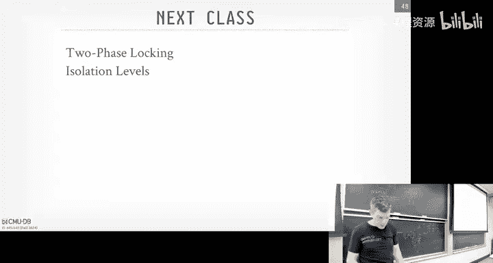
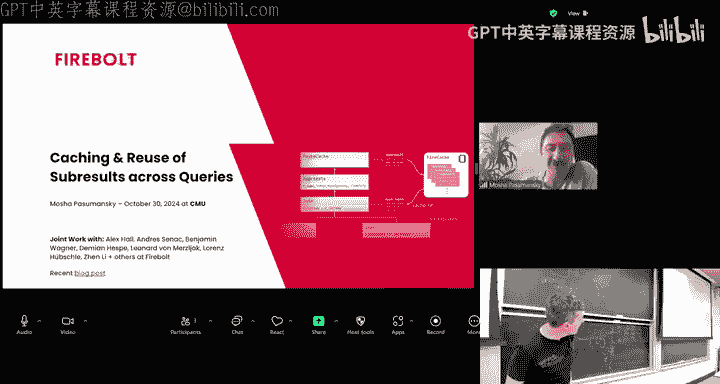
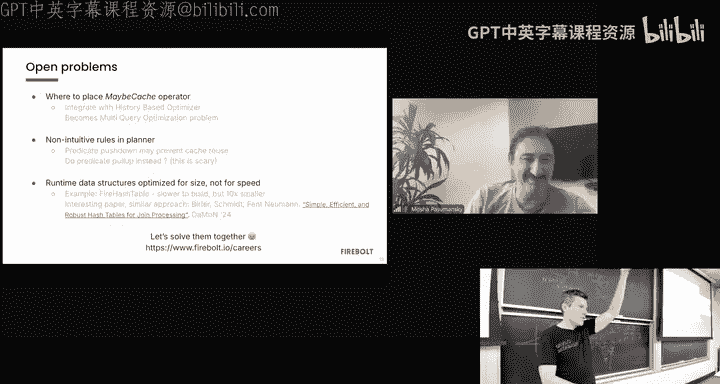
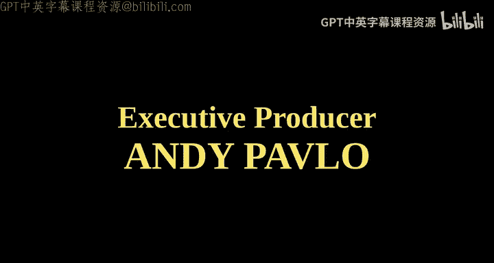

# CMU《数据库导论｜Intro to Database Systems (15-445645 - Fall 2024)》中英字幕（deepseek翻译 - P17：#16 - Concurrency Control Theory ✸ Firebolt Database Talk.zh_en - GPT中英字幕课程资源 - BV1Tys8eQELW

Yeah。い？Official should not be this warm in basically November that's not good All right。

 so for everyone in the class。W when the agenda， again project three is out we due on November 17th。

 we have announced our in Piazza or we will announce the Piazza we'll have a recitation this Monday coming up at 8pm because Tuesday supposed be an off day for everyone。

 but in homework 4 we do this November3 coming up。Okay。

Any questions about Project 3 or any questions about homework 4。

s it depends on project two question does Project3 depend on Project two？There is。

 you have to do index scan and then indexness a loop join that would use your B plus3。

If you can't make it concurrent， just put a fat latch on top of the whole thing。

That was protect and then I don't remember what the leader board is。

That that'll be sufficient for correctness。O。All right， so。Where we at in the course。

 So we made it to the top like last class was about query optimization right so we now know how to do query planning like now we know how to take requests from the application you know。

 for SQL queries， convert it into to a physical plan and execute it and we now know how to whatever the operators we pick。

 how to access the data， how to manage memory coming in and out of disk。

 how to organize things with disk like to this point in this semester， you can build。

A full and end database system。Yes。question you haven't covered the parsing part of the query。

 I don't care about that。 No， no。 So like， there are， like， that's a solved problem。

 There's open source libraries to parsqL。use one of those， right， There's。

 there's sQL parts in in rust。 There's lip P query， lip PG query in C plus loss or C。 Just use those。

Right， iss taking that A S T， binding it to to object I the catalog and then running through the optimizer。

 the， that's the hard part。So where we need to cover now， though， yes。

 we can build a database system that can run queries and store some data and return results。

But we haven't talked about what happens when the thing crashes。 How do we make sure we。

 we don't lose any data， or what happens if we have two queries trying to update the same thing at the same time。

 What do we do。So overarching across all of these these different layers is going to be what we're talking about for the next three weeks is the concurrential mechanisms。

 which we'll start with today， how to make sure that transactions or queries are updating things in a safe manner。

 And then there's the recovery piece which recover in two weeks。

 and that is like if my database crashes。😡，How to make sure that I don't have any corrupted data。

 I don't lose anything。RightBecauseuse again， if you start， you know。

 what good is the database if you write things into it and then it just crashes or the system restart and you lose everything。

That would be bad。And the reason why I'm sure of showing these is these layers that are overlapping all the other parts。

 because as we see as you go along that，😡，All the design stations we want to make in our different layers have to take an account and know what cur protocol we're going to use or how we're going do recovery Like your buffalable manager needs to go back and says。

 okay， well， what transaction updated this page is the log record for that page written at the disk yet。

 If yes， I can evict it If no， I have to wait。😡，So the additional logic and the eviction policy we didn't talk about because they haven't talked about logging yet and recovery。

 So that's， that's what we're gonna head into now。Okay。

So let's talk a motiv example of what transactions look like。

say we have a really simple application that that it's the ATM at your bank。

 And you basically the logic is somebody wants to take out some money。

 You got to make sure they have， at least have that enough money that they want to take out。

 take it out of the account， pay it out， basically transfer it out to somewhere else。

 And then right back into the database and say， okay， they took out this this amount of money。Right。

 so you can sort of think like the application logic would be like this。

 But the steps we would do it in the system was that we to read what the current balance is for a。

Check to see whether it's sufficient funds， if yes。

 then we can go ahead and pay out the $25 or transfer $25 to somewhere's else。😡。

But then now we've got to deduct the amount we took out to our new balance。

And then write it back to the database and update the state。Right。

So this is sort of a high level operation that you would want to do in your data system。

 like before we were talking about like these are SQL queries。

 it's sort of thing like more high level than that。

 like here's this is some piece of work I want to do to perform some operation and may be comprised of multiple queries。

😡，Or additional application logic。All right， so the first one I'm got to deal with is what happens if we crash here？

😡，Right， so we。Check， we read the bank account balance。 We had 100， took the money out。

 transferred somebody else。 But then now we crashed before we wrote it back。Right。So in this point。

 what should the state of the database be？😡，Should it be the $25 I took out。

 to that be accounted for？Right？ say instead to pay $25。 I put $25 into somebody else's account。

Right they' gonna have $25。 And I'm and I'm still gonna have my 100。That would be bad。

RightBecause we we end up losing data， corrupting the database。Well。

 let's say another situation like this。 say you and and your best friend share accounts for some weird reason。

 right， And you both want to take out 24 at exactly the same time。

So the logic here is going to execute it twice and say。

 like two different workers or two different machines， it doesn't matter。

So you're both going be the balance。 yep， we have 100。 So we go ahead， take the $25 out。

 transfer it out， and then we go ahead and update the new balance。 we $75。

 And then at the exact same time， they both write it back to the database。Is this correct？No， right。

 because now like there's a magic $25 that went missing from the bank account because two people try to write back to the same thing at the same time。

Right， individually， they were correct， right， They did all the right steps。

 Check to see whether I have， know， sufficient funds。 Yes， if yes， take the 25 out。

 Trans someone's else and then write it back out。 But concurrent running time simultaneouslyaneously。

 then we had this weird effect where money went missing。And that's bad。

So how can we avoid this problem？What's that， a latch， He says， use a right latch。Rightlash on， what？

On A。His question is there way to do that？Yes， we won't call them latchches to call locks。

 but that is one way to solve that problem。That's next， that's the next class。

So why do we do something like this？What have we just said that we don't allow queries to run ses or transactions to run Sams at the same time that we have some kind of cu。

A single queue and one worker that pulls out one transaction at a time， one piece of work at a time。

 executes it to completion。Right， and then when it's done， then it's allowed to go execute the next。

 the next thing in the queue。Alright， that solves the problem of， of。

 the second example where I had two guys simultaneously At trying to update the same database。

 It's the same record。 right now， that won't happen because only one thing can run at a time。

 That's essentially the right latch that he's proposing， the right lock。 right。

 It's a single thread of execution。But now， what about the problem I said before where the。

 in the first example， where I I did an update。And then I crashed before I was able to get the money back to the account。

But what if I did this， What if I。Before any transaction starts， So I pull out of the queue。

 what do I just take the database file， As it's a single file or directories doesn't matter。

 And I make a complete copy of that data。Then have the transaction operate on that copy。

And then when it says， okay， I'm done done on the work。

 I just now flip a pointer to say my copy version is now the new version of the database。

 So any of the transaction that comes behind me will look at that new version。

 and then I'll discard the old version later on。😡，If the transaction fails for some weird reason and we come back。

 well， we just see that we had this copy that we' modified， but we never had actually fully saved it。

 so we go ahead and just ignore it。😡，So is that correct， that would avoid update problems。

Second head， yes。Is it a good idea？那完了。The power。Srian。

He said the amount of parallelism is basically zero。Sure， but it's correct though， right。A lot of。

 in most cases。As actions don't actually。He says， in most cases。

 two transactions don't actually share data。回到。He said that you paraze them because。

I would say that a lot of times in， in transactional systems， there's， there's。

 there's a hotet a working and that's like。Think of like when you go to like hacker news or Reddit。

 you post comments on like whatever's on the front page， right， Everyone's trying to update that one。

 like the small set of things so that usually there's a hot set。

 what everyone's trying to update and modify the example you students gave was like Taylors Twitter account or just be Twitter account like those would be they actually run on separate machines because they have so many people trying to update read it at the same time。

 So usually there's hot records that everyone's trying to modify So it's not always true that that every transaction would be touching distinct things。

He said she says it's not scalable。 correct。 Yeah， so if your database is 10 MBby。

Or say the smallest case，4 K page。 Sure， no big deal， right， copy it， do whatever you want。

 write it back。 If I got one petabyte of data， then I don't want to be copying one petabyte every single time。

Now， there are some file systems that allow you to take like an XFS， you can take Delta snapshots。

 or copyright snapshots that are really fast。 but in general， this is not going to be a good idea。

Right。So this would be correct。 But， in some systems actually would do this。

 The one of the first systems relational data systems system are， they did this。

Called shadow pageaging。We'll see this in a second。

But it has a lot of problems that we'll cover as we go a along。So。

The problem we're trying to solve today is that we want a better approach than just。

Having transactions run one at a time。And we want a better approach than having to make an entire copy of the database as like a shadow copy or a dirty version of it。

 we going to avoid all that extra overhead。 and what we one is we want to allow transactions to run concurrently and be clever about how we interleave their operations。

 their queries so that we can maximize parallelism， but still also ensure correctness。😡，Right。

And it's pretty obvious that we'd want this。 right if one transaction that blocks it has to read something from disk or rice significant from disk。

 we can let another transaction run at the same time。 or in modern CPUs， They have a lot of cores。

 We want to， you know， we want to be able to utilize all of them。We'll see in some cases。

 some systems like SQLL， they'll allow multiple readers， but they only have one writer at a time。😡。

And that makes certain things a lot easier。 But in a system like Postgres and MySql and pick your favorite。

 know， transaction data system， they're gonna allow multiple transactions run the same time because you just get better performance。

😊，So the way to understand or sort of state set up the problem we're trying to solve today is that we want to allow this arbitrary interleaving of operations。

 and I'll find what they are in the next slide。 But think of there reason rights。

 We want to arbitrarily allow them， to run simultaneously。

 but we be smart about how we schedule things。So that we end up with a state of the database that is correct。

And I'll put big， big quotation marks around correct。

 that that can mean different things for different people。 But today。

 we'll talk about serializable or serializable scheduling。

 And that'll be like the gold standard say this is this is。

This would be equivalent to if I ran in serial ordering。 But we'll see you next class。

 most systems don't actually do that。One important thing to understand， though。

 is that when we talk about transactions today， that the database system can only control or only has purview on the things that it can do on behalf of the application。

 And that's end up being reads and writes。And that means that we could define a transaction that could do a bunch of steps for us。

 But then if the application says， okay， in the middle of that transaction。

 let me send an email confirmation to you。Right，But then something happens and the system crashes。

 We got to roll back our changes， and we've got to run that transaction again because that email step is not controlled by the data system。

 We can't roll that back。 So we can only we can only control whatever happens inside of us。

 If someone does something in the outside， like launch a missile。 we， we can't stop that。

So we need a way to define what it mean to be correct and to determine whether when we start interleaving these operations within transactions。

 whether that's a valid thing to do or not。So for today's class。

 we're going to talk about the database of sort of an abstract manner。

And we're not gonna talk about tuples。 We're not going to about tables。

 We're not talking about any other things youd have in the database system。

 Were gonna say that we have objects。And we just give ABCD and so forth。Right，It doesn't matter how。

 you know， what it actually is。 all the algorithms we'll talk about today and。

 and going forward will still work， no matter what the size is。 And obviously。

 if the's smaller you make it， the more parallels you have。

 but there's more overhead of maintaining and tracking who has what or who's doing what。

For today's class， we' going to assume the database is fixed size。

 meaning we have a fixed node objects at the very beginning。And any operation。

 right operation just gonna be updates。 So we're not doing， we're not doing deletes。

 We're not doing inserts。Those are cause additional problems for us what we got to cover our next class。

So then now we're to a transaction again in the in within the scope of data system。

 we're going to say our transaction is going to be a sequence of read and write operations on these objects。

Al right， I'm not saying whether there' are SQL queries。 I'm just saying like。

 I'm reading something and I'm gonna to write something。

 I'm just overwrite whatever the current value is。Transactions will start with this explicitly with this begin command。

In some systems， if you just write any one query， that's' sort of implicit。

 there's a beginning and commit around it called auto commitmit。

 But for operators today will assume there's explicitly begin。 That says when transaction starts。

 and then the transaction ends when either the application tells us that we commit or roll back。

And then we'll see this next class。 just because you tell the system I want to commit doesn't mean you're actually gonna commit。

 It's not until you get the acknowledge。That you know that thing's actually been safe because in some cases。

 you may say I want to commit the data says， no， no， no。

 youre not doing that and it actually kills you。Right， and。

 and it's a allowed to do that according to the sort the programming paradigm that we're going to expose。

So again， today we're just going to focus on doing reads and updates， no inserts。

 I'm assuming the data is a fixed size， and then we're going to have explicit begin and commit commands。

Alright， so the way we're gonna determine whether a schedule of of transactions on our data that are correct is going be through this notion of。

 of， of this acronym called acid。 Quick show hands。 Who here has heard of acid before。All right。

 half ish， a little more half。And so this is an acronym that was developed in the early 1980s by this German guy。

 and a basic stands for aity consists to the isolation durability。

So adity is going to mean that all the operations within my transaction have to occur。

 or none of them occur。😡，All or nothing。Consistency is a kind of a weird one。

 but it basically means that if my transaction does consistent things and my database starts off in a consistent state。

 then when that transaction runs， that they will be consistent。Alright， well， that's kind of fuzzy。

 too， right， We'll cover in more details later on， but。

This will make more sense when we start on distributed databases。

 basically if I have do an update on this one machine and I have data replicateator on other machines。

 if I say this transaction commits， if I have providing consistently guarantees。

 if I immediately try to read that thing I updated on another machine， I should see that exact value。

😡，CC the correct value。The truth is the German guy that kind of to came up with this acronym。

 aacy isolation D， this makes sense of transactions。

 he kind of shoehorned consistency in there to make the acronym work。

 and then also the joke goes apparently he was trying to make fun of his wife because his wife didn't like sugar so said。

 oh， she's an acid woman so they added so he won to make sure you got kiss in there。

That's what the book says， I've never met the guy， so I don't know that's true or not。

Next one's isolation， this will be really important， we'll focus mostly on this today。

 this is just saying that a transactions will execute under the illusion that they have exclusive access to the database and they're isolated from all the other transactions running at the same time。

😡，And that means that we don't want to see any intermediate updates from transactions that may have run the same time that we did。

And the durability one is pretty obvious。 It says if my transaction commits。

 the database system tells you that it's committed。

But then if the system crashes and when it comes back， you should be able to see your changes。

So today's class， we're going to go each of these one by one。 And again。

 this is just sort of the high level concepts。 We're not going tell about any specific implications or algorithms you you would have in your database system to actually support these things。

 That's what we'll cover starting Monday's class next week。And then today also too。

 we have a guest speaker from Fireboat last class or last week， we had Clickhouse。

 which I thought was a really great talk。 Firebot is actually a forkca Clickhouse。😊。

So they took clickhouse。 They forked it， rewrote a bunch of stuff。

 Then they got one to people out of Germany to go do a bunch of rewrites。 and they。

 they sort of diverted from being pure clickhouse anymore。

 So he's gonna talk about some of the stuff that they that they're doing。Okay。

So we're going to go each these one by one。😡，So again， aimity。Again。

 either all the operations are going to happen in a transaction， none of them。

 So there's basically when you say a transaction is going to run， there's me two possible outcomes。😡。

And all the operations will commit in the order that the transaction specified。

Or he either gets aborted by the application saying， I you know。

 go I don't want to do what I just did， roll back the changes。😡。

Or you go to try to commit and the data system no you're not allowed to commit。

 I go ahead and kill you。So it's the data's job to make sure that all these transactions are atomic and it's not something that you specifically like the worry about in your application code。

 you just know this if I get a transaction in my if I separate transaction in my system。

 I should expect my operations to be atomic。😡，So there's two basic approaches that guarantee adtacy。

 and again， we're not going to go into too much details of what these are。

 We'll cover these in the following weeks。The the first one is the most common one， like logging。

And it's unfortunate that the term logging is used typically like for debug logging。

 like we print out print statements when your application is running to try to figure out what's going on。

 But a logging would be a way to keep track of like。

 here's all the operations my transactions made while they're running。

 And I'm going write them into this almost like a ledger， if you will。

And that actually can be maintained separately from the database itself。

 or if you remember log structure meies， all the update operations that was in this log。

 same concept， same idea。You can think of this as like again， the black box of an airplane。

 So like if I crash airplane crashes， they go find the black box of a courseor all the steps the plane is doing right before the crash。

 samee thing here if I do a bunch of operations， my database。

 I go ahead and commit and I know my project should be saved and all the effects should be atomically persisted then when I look at my log。

 I'll see all those updates and I can replay them back in the state I was before。

So I don't have any loss updates。As said nearly every single data system today is using some variation of logging。

 you get better performance in some cases， we saw this in log structuremrry because I can turn all my random rights into sequential rights and then also for audibility or recoverability。

 it also is super helpful for that。😊，The other approach is when， when I talked at the beginning。

 this thing called shadow paging。And my， my sort of strawman example was the extreme case where I copied the entire database into a shadow copy and then make any changes that I want。

 Typically， you would do this with， with at a page level。 any time I try to update a page。

Then I make a copy of that page in the shadow space and then apply my update。

 and then when I go and commit， I just make sure I atically install all those new pages into the database system。

And as I said， this is what IBM first implemented in the 1970s。

 Then they realized it was actually a bad idea for performance reasons。 He basically had a bunch of。

 You had to run def fragmentation on your。On your on your pages。

 because now all updates ended up having holes in your space you got to reuse and it made sequential scans really bad。

 Few systems actually do this。 Kaohibi and L N V are probably the two ones that are the most famous。

 I think Kahibi is still doing this。 I might be wrong。

 Tokyo cabinet was a key value store out of Japan。 But I think that's been replaced by a Kyoto cabinet It's much faster。

 And I don't think that's a shadow page。😊，So again。

 I I need to explain this to say that hey this thing exists。 But of course， I gotta say。

 don't do this。 You always always want to use the logging approach either with he or the right head log or through log structure meries。

 which we we already covered。看。So。One advantage you'll get though。

 from shadow paging over the logging approach is that。😡，Recovery。

 like when after a crash is instantaneous。Because again。

 all you have to do is come back and then you immediately have this consistent or because this correct state of the database because any changes you made for any transactions that was running while the system crash made a bunch of dirty modify some dirty pages on the side and you ignore them when you come back。

So if you care about recovering really， really fast。😡。

Then you want to use this right ahead logging is taking some time。

 You got to replay the log and depending how fast your diskca how often you take checkpoints。

 which will cover later on， it might be okay。 But if you need to have instant recovery。

 could you expect to crash all the time， you want this。Another system。

 I don't know the name of it that did this back in the 1970s was。You， it is in the news。

 but from Puerto Rico。 So the Puerto Rican Power company built their own specialized database system that did shadow paging because in the 1970s。

 they would have power outages all the time。And so if you're having multiple power averages throughout the day and your database is going to crash when it comes back up。

 you want your database to be able to recover right away not to wait hours， you know。

 every single time。 So they， they did something like this。

Because they knew they're dealing with that environment。Again。

 we'll contrast the shadow paging in redhead logging and we'll have a whole class on righthead logging in a few weeks。

 so the next next one asset is consistency。And as I said。

 this is kind of a fuzzy thing that says like if the transaction is correct and the data is correct or consistent。

 then whenever a transaction runs， it should be correct。And。

The application has to then tell the data system what they means to be correct。

 And you do this through integrity constraints。You can add check commands when you create table statements or you can add constraints after the fact。

 like if nobody's age can be negative。Then you add those integrity constraints and the data will guarantee that no transaction tries are run to insert someone with a negative age。

 because it'll violate that constraint， which put the database in theent incorrect state and rejects the transaction。

Right。So basically， the data is going guarantee that all the integrity constraintss will be are true or satisfied before transaction runs and then after transaction runs。

And typically it's done on a per query basis， like you can defer your consistency checks to the very end like you say I'll let anybody do anything and then only when I go ahead and commit。

 then I check to see whether I violate things because maybe you could batch things up but as far as most systems will as soon as you do a query to update something。

 they'll check the category streams。😡，You may have heard of the term eventual consistency。

 especially in the context of distributed systems or no SQL systems。 Again。

 we'll cover this later on， but it's basically what I said before。

 Like if I have now my database copied across multiple machines。If I have strong consistency。

 then when I mentioned transaction updates the database on one node。😡，And I go commit。

 and the data has told me， yeah， your data is committed that immediately if I try to read that record on another node。

 I'll see that my update reflected。Eventuallyual consistency says that eventually your updates will get propagated。

 so I could do my update on this one node， commit， and then I read try to read that record on another node。

 and the update hasn't arrived yet。So I may see an older version。Or I may see multiple versions。

 depending on how it's actually implemented， if you're using vector clocks or not。So again。

 this consistency makes more sense on distributed context。But know。

 we'll cover this in way more detail in near the end semester on Le 23。

We'll to talk about how to use Paxos or RAF or twobase commit to guarantee strong consistency instead of measure consistency。

R。Alright， so now， again， as I said， isolation is the big one we want to spend most our time talking about。

So what we want to have is our database system provide this abstraction where transactions can run。

 and the， the application doesn't have to worry about。

Is it going to see funkywear data that it doesn't expect to see from other transactions running at the same time？

So we want to provide the illusion that any transaction that's running has dedicated access to the database system。

😡，And it's running by itself without any other transaction at the same time。

 But as we said in the beginning of the class， we won't allow transactions run at the same time because we'll get better parallelism。

Right？So a way we're going to achieve this concurrency is by interleaving the reason rights on the database objects that we talked about before in transactions。

 but then we still want to have the database state end up to be as if we executed the transactions one by one or in a single file。

😡，So it concur you a protocol that we would implement our database system。

If you ever heard of two phase locking or OCC or Opim current control， that's what these are。

It's going to be an algorithm or implementation or a system that is essentially going to be like the traffic cop in our database system that gets to decide what transaction gets to run at what time and in what order and for their individual operations。

 what are they allowed to read and write to。Right， and we。

 and it's gonna come up sort of the dynamically generated the schedule to say， okay。

 here's the things that you're allowed。 here's the order I'm gonna execute things to again。

 to try to avoid the problem of。Transactions or the， the。

 the database ending up with the state that would not have occurred if I。

 if I didn't execute them in the serial order。So again。

 we'll spend all the next week talking about these two protocols。

 So the first one would be pessimistic concurrent control。 And this is basically saying。

 before a transaction allowed to do something， I'll check to see whether it's an okay thing to do and I'll block you if it's not or I'll you if you can't do that。

 So you're trying to avoid problems before they occur。Optimistic current control protocols will be。

 I assume that I'm not gonna to have any problems。 So I'll let people do whatever they want。

 the transactions do whatever they want。 I'll keep track of what they do， what they read and write。

 And then when they go to commit， then I'll check to see whether it allowing them to run was the right thing to do or not。

😡，So Monday's class next week will be on pessmic protocols。

 and then Wednesday's class next week will be on optimistic ones。And in most systems。

 you implement just one or the other。All right， so let's look at an example here why this matters。

So soon we have two accounts， A and B， each of have $1，000 in them。So the transaction we want to run。

 or we want to run two transactions， the first transaction wants to transfer $100。

 so take $100 at A's account and put $100 in B's account。😊。

And I'm showing sort of simple procedural logic here。

 and then transaction two wants compute 6% interest。On the bank accounts and update them。

So now the question is。If I have these two transactions and I can interleave them in any possible way that I want。

What are the possible outcomes that I could have for T1 and T2。

 What what were the possible outcomes the state of the database after I run them。Yes。Do休。

Incrementing by。His question is， do we assume that incrementing by 100 is atomic？No。

 we'll get that in a second。 So what am I doing here， I'm reading A， then writing A。

We're not creating that。You got to read A as's one operation。 Then write A， it's another operation。

So there's a lot of different outcomes we could have。😡，Because I mean。

 it's not infinite right because there's only four operations per transaction。

 but we know that if we want the state of the database to be as if we executed T1 followed by T2 or T2 followed by T1。

Then no matter what， when we add up the two bank accounts and compute the 6% interest。

 the final result of the total amount of money that should be in this bank。

 assuming only has two accounts。Should be 2120。Right。

So this would gonna be a mind trip for a bit for you， but like。From a database systems perspective。

 what we're allowed to do is that no matter whether T1 is submitted first followed by T2 or T2 first followed by T1。

 we're actually allowed to execute them in any order that we want。

If you cared about making sure T1 xs first followed by T2。😡。

You either have to do this in your application code。

 like have a queue the application then send requests。😡。

Or there are some systems that provide a stronger level of， of consistency guarantees。

 something like if you ever heard a Google Spanner， they provide external consistency。

 like what they'll guarantee is that the order you submit is the order that things will commit。

But most systemss don't do that。Most applications don't even need that。

So this can be a a little trick we can have that we can reorder things anybody we want。

 But all at the end of the day， all that matters is that we add up the money and put 6% Comp 6% interest on it。

 the final sum is 21，20。So the two legal outcomes we have is we execute T1 first followed by T2 or T2 followed by T1。

 and again， it doesn't matter of what the final state is for A and B as long as again。

 A plus B at the end of the day is 2120。So what does that look like？

So I would have if I execute these in what I call in serial order。 So this is an execution schedule。

 So you see I have a begin， then I have my my A A equals a minus 100 B equals B B plus plus 100。

 In this first here， I executeute T1 first followed by T2。In the other example here。

 I actually do T2 followed by T1。And in both these cases， even though A and B have different values。

Again， if I just add them together， then I'm guaranteeing 21，20。So this is a serial ordering。

 right that I can execute one transaction at a time。But then now if I want to interleave them。

 and again， we talk about why we want to do this， get better parallelism。 if one。

1 transaction has the block because there's a miss in the buffer pool， right。

 Another guy can keep running， right。This is all fine at Danny。

But now I' gonna to be careful about now I want to interleave things that I don't violate or I don't end up with the state of the database that would not have occurred if I。

 if I had executed them in sur order， either T 1 followed by T 2 or T2 followed by T1。

So if I go back here。Right， now T1 starts， take some money out of out of A。

 But then for whatever reason， it gets blocked。Because page miss or whatever。

 and then T2 starts running。And then it computes the interest in A。

 then there's a context switch back over T1 starts running again as the $100。

 a goes ahead and commits， and then T2 starts running again， it then adds the interest to B。

 and it goes ahead and commit。Again， and this example here， even though I'm inter with transactions。

 it's equivalent to one where T1 x differs followed by T2。

And the key thing to point out here is that。We're， we're making sure that any operation。

 any update operation on T 1 on A and B happens before the， the operation。

 another update operation on that same object in the next transaction。Yes。

 why do we define equivalent based on the sum of A and B， not the values of A and B。

 because the A values， the values for A and B are different for the。So question is。

 why are we defining their equivalent based on with the total sum of this and not the actual values A and B。

 because what I'm saying in this programming model，😡。

We're allowed to order things any way that we want。Right， so along as the the。

 the state of the database is equivalent to。Exeing I executing one。

 the transactions in a serial order。In this world， that's okay。

And that's different than maybe what you're used to in like parallel programming。

And in like Tof Flos or Python or whatever you're using。But in our role of transactions， that's okay。

The reason why we want to do this is it's gonna open a bunch of opportunities for additional parallelism that we would not be able to get。

And again， at a high level， this is correct。But it' it's different idea of correctness。

So we look at this example here。😡，AllThis is again a bad interleaaving， I take $100 out of A。

 then a contact version should now execute T2。😡，Then I compute interest on A。

 Then I compute interest on B。 Then I now go switch back over and then add 100 hours back to B。

 right， The end state here is not equivalent to one where I would execute them in a serial ordering。

Right，Because I add the two numbers together。 now I get 21 21，14。And I'm missing $6。

And if there's a bank， you'd be pissed if it's your money。Right。So he was sort of asking before。

 Like， can I assume that these， this， the A equals a -1 and the B equals p plus1。

 Is that what the David actually sees。 No， right， what you're really seeing is a read on A followed by right on A。

 and then a read on a read on B followed by right on B。Right。

 so that s is can reason about these operations。 It doesn't know the high level semantics about what the operation is actually doing。

 It just knows that you read something， and then you wrote something。We'll see you later on。

 if we do know whether we do， we we can somehow infer these semantics of what the the transaction is actually doing。

 we can actually get even better parallelism。But that's impossible and nobody actually does it。

But we'll see that later in this class。So now the question is。

 you can sort of easy to see from out just looking at this whether this schedule is correct。

 because it's only two transactions they're doing pretty simple things。

 and I just sort of add the numbers together。But this is obviously， this would not be scalable。

 And this would actually work in a， in a full， you know， in a real system。

 There's a lot of transactions。So we need a better way to figure out how to determine these are。

 this is okay。So the goal we're trying to figure out now is can we look at a schedule and say is this can be equivalent to a schedule that would would that would put the days in the state from a schedule that executed in zero execution order。

So this is just re implementing what our。Repeating what I've already said。

 So a series schedule is one where we we don't do inter inter leavingaving with different transactions。

 And we're gonna say， again， two schedules will be equivalent at the end of the database will be equivalent to be executing。

 the first schedule and the second schedule， assuming they start at the same database state。

So the thing that， the， the gold standard of the isolation level that're gonna want to support is calledizable Serizable isolation or serializable schedules。

There is actually a higher level of serializability。

 And that's that strong serializability strong consistency。 I said。

 where you guarantee things are executeded in the order that they arrive， but。Again。

 most assistant don't give you that。No， most don't need it。

 So a serializable schedule is gonna be one where it'll， it'll。

 it'll be arbitrary inter leadinging of operations and transactions that put the data in the same state as if it was in executed in serial orderant。

So this， this is a bit different than than again which may be used to in， in。

 in programming in other contexts。Right， the， the correctness is not gonna be based on the things。

 the time that things arrive or actually， in some cases， at the time the things commit。

Because your transaction may say commit， and then the order that it gets committed is not the order that arrived and also not mean the order that it executed。

😡，That's kind of fun。But again， because we can play around with with these games about how we're going to order things in our database system。

 we're going to be way better parallel than we would if we just have a single。

 single queue execute things one after another。Yes。

Examp where the order of transaction doesn't matter。He said。

Can I give an example when the order of the transaction doesn't matter？I mean。

 the bank account one just gave us now。 It doesn't matter whether T1 X first by T 2 followed by T 2 versus T 1。

 It doesn't matter。This the N of the div is still correct。

 because it's equivalent to executing things into serial ordering。

If if I wanted to make sure I did the transfer first， followed by computing the interest。

 then you have to do it in your application， you have to tell me X through T1。

 and then only when to keep T1 comes back and says I've committed， then you execute through T2。😡。

The data system can't do that for you， though。Spanner can， but most systems don't do that。Alright。

 so now we got， we needed a way to formulaly define。 Okay。

 how do we know whether two schedules are equivalent。

And we kind of intuitively saw that what had to do of the ordering of the operations of when we read and wrote objects to the same object across different transactions。

So we're going to find this as conflicts between transactions in the schedule， if they。

Do some kind of operation on the same object。😡，Either one。

 either one does a read and a write or one does a write and a read。

 And they're from different transactions running at the same time。

 and they they're touching the same object or objects。

 so that'll be the notion of a conflict to say that these things' can't be equivalent。

 or't We can't inter leave them。And then there's going to be now different anomalies that can occur based on the type of complex we can have in our schedules。

So you can have a read， write， a write， read and a write， write conflict。 Why not read read conflict。

It's fun because if you read the same thing， and I read the same thing， not a conflict。Right。

So I'm gonna go through these three examples in more detail。

 I'll just also say there are two other types of conflicts that we're not going talk about today。

Called Phantom reads。And write Skew。 So it's how about Fom Reads next class。

 it' basically if I scan some data， I don't see something。

 someone's insert something in between that range， and I scan again and now I see it。

But now we you talking about aggregations， right and not not simple re operations。

 So we'll see that next class， how to fix that。 And then right， we'll see in two weeks。

 we'll talk about multiversion search control。 It's basically， I read the Davis at the same time。

 Everything was okay。 And it may up writing things。 And it's not equivalent to the serial ordering。😊。

That does not make any sense， you'll see this later on。😡，Right， again。

 we we'll cover this in lecture 1719。 But today's class， I， I want to focus on the the basic three。

Alright， the first one is on repeat reads。 These are read write conflicts。

And this is where a transaction will get different values reading the same object multiple times while it's running。

So T1 starts reads A， A gets back $10。Then there's a context which T2 starts running。

 it reads A gets $10， and then there's some logic that says if my account has $10。😡，Give it $5。

 make it $15。 And then now it writes it back into the database to go ahead and commit now。

 when T1 runs again， instead of seeing $10， it sees $19。And again。

 if I was executing in serial order， T1 followed by T2， if I read A twice， I should get $10。😡。

But because I interleaved the second transaction， was allowed to make that update。 Now。

 I'm getting again， what is called unrepeable read。

 I'm reading the same thing and not getting back the value that I saw before。

 which should not occur if I was executing them， again， in serial ordering。So this is a problem。

 we want to make sure we avoid this， yes。我是给母。The second transaction question is。

 what have we moved in the commit on the second transaction， Like so basically。

 if I put this down here。Again， this depends on on the implementation of the data system。

 which we're not talking about just yet。You would have to make sure that this thing that this right is either can't occur because this guy holds a lock for it or this right occurs in a private workspace that this guy can't see and you hide it from him。

😡，So the locking will be next class。 The hide from you will be Wednesday's class next week。

 but trying to get with the intuition and not actual implementation。

But you can kind of see how we can start doing these things to protect ourselves。

Because they made the worry about deadlocks too， if we start walking， again we'll cover that。

All right， the nextomaly is a right read conflict also called a dirty read。

 and this is where a transaction is allowed to read something from a transaction that hasn't committed yet。

 so we read a， get $10， write back $12， this guy then reads a sees $12 which again it should not have Saul if if they were running in true serial ordering。

And then it writes back whatever $14 whatever value you want。 But then now， later on。

 T1 aborts or rolls back。So that means we' got to undo the change we made on A， but wait a minute。

 teach you Reddit。😡，And already committed and we told the outside world， yep， we got your change。

 but again， the logic could have been if my bank account has $12， make it $14。😡。

And that would have not occurred if if you're running in serial ordering。

So this is the problem we can't allow this。And the last one would be write。

 right complex or loss updates。And this is where when we have a one transaction overwrites an update made by another transaction that shouldn't have occurred。

So again， T1 starts right on A。 T 2 then starts， writes $19。 And then for B， they put in Bob。

 And then when this comes back over， now does a write on B and puts an als。Right。

This should not occur because it either should be $10 Alice or $19 in Bob。 But in this schedule here。

 we have $19 in Alice。Which， again， would not， cannot not occur if there were。

 if there was running in a true serial ordering。An example。All right， so now。We know how。

 We know how to identify the conflicts。啊。But how do we know， again， for any arbitrary interleaving。

 how do we know whether it's actually equivalent to serial ordering。

How do we know our schedule is actually sterreizable， as we would say？So to do this。

 we're going to go ahead and check whether our schedules are correct。

 by literally looking into conflicts。And， in today's class， this is just understanding the the。

 again the theory behind it to understand what correctness actually means。In， in a real system。

 you would actually not have going back here。 you would not have the schedule ahead of time in most systems。

Because thinking how this would work in your application， you call begin， you write it。

 you send a query， get some data back， goes back to your application。

 then do some logic and then do another query。 So the data system doesn't see。

 Here's all my reason write ahead of time。 It says it sees one read one write back and forth。

 So things are coming in incrementally and you wouldn't be able to figure this out。

 So the protocols next week。 But how do I do this in a dynamic environment to make sure that you don't know。

 violate， don't hit these anomalies。 Today's class is really saying okay， if I look at a schedule。

 If I know all the operations ahead of time， how do I know whether it it's correct or not。

So now this， this also gonna be a little bit weird because now we're talking about two different levels of serializability。

 There's actually more。 It's in the theory theory world。 We don't care about that。

 but there's be the notion of conflict serialerizability and view serialerizability。

In most database systems， if they support serializable transactions， some systems will lie to you。

 Oracle does this。 Some， if they support serializzable transactions。

 you're getting conflict serializability。View Ser is a notices can do this because you have to understand what the application actually wants。

 but Id like to present it to you guys in class because again。

 it's a different way to think about correctness and show that there's opportunities to get even better parallel you could get using twophase locking and MVDC and OCC。

 we'll talk about next week。😡，But to do that， you got to know what the application means when it says do something for me。

Which is， is very difficult hard to do。So again， most systems when you say I want a lot of transactions。

 you're getting conflicts or liability。 Again， in oracle， if you say I want say lot transaction。

 they say， yep， no problem， but it's really a lower isolation level。

It it's been that way since since the 90s。And then， okay。And again， most of you may not care。

Allright， so we're going to say now on a conflict civilability that two schedule be conflict equivalent。

 if and only if they are theyre multiple transactions actions touching the same same objects。

 and then the ordering of the conflicting actions like a read write， write。

 write or the same thing that they're going to be ordered in the same way。

So then we can say a given schedule will be conflicts areizable if it's equivalent to some serial ordering。

All， but this is kind of vague， what does this actually mean being kind of hand we be here。

 How can we actually determine this？So to do this， a really simple algorithm is to generate what's called a dependency graph。

So the idea here is that we would have in our graph a node for every single transaction that's running in our schedule。

And then we would connect an edge between them if the one transaction is doing an operation on some object that conflicts with the other transaction。

And then that operation appears in the schedule before the other conflicting operation from the other transaction。

😡，So in Wikipedia or the textbook， they might call this dependency graph， but the idea is the same。

So now to determine whether our schedule is conflict serializable。

 so equivalent to a serial ordering。That as long as our depend graph doesn't have any cycles。

Then we know that we， we're not going to have any conflicts or have any issues。

Or any of theomaomas they talked about before。So let's look at this sample here。

 So I T1 followed by T2， T1 writes an A， reads an A， and then write reads some B and writes on B。

 and the T2 is going to do the exact same thing。So we just sort of go down one by one。

 and for everything operation， look across to see， do we have any any conflicting operations。 Again。

 where're one， it's either read followed by a right or write on a write。

 And then the operation T1 or the one transaction occurs before the other one。

 the conflicting operation and the other transaction。 So in this case here。

 we do a write on a followed by a read on a。Right， that's a conflict。

 We we would have an edge from T 1 to T 2 on a。 We have a read on a on T 1。

 but then we do a write on a on T 2。But the read occurs before the right。 So there's not。

 there's not an edge going in the other direction， at least at least on a。

But then now we have this write on B and T 2 occurs for the right on sorry write on B occurs for the read on B and T1。

 So then now we have an edge between T2 and T1 here on B。

 And then now we know we have a cycle underdependency graph。 And therefore。

 this schedule will not be。 it's not equivalent to a serial ordering。Right， right。

 and the high intuition is that the the output of T1 depends on some T2 doing something and the output of T2 depends on T1 doing something。

 And therefore， we know that this cannot occur if they were executing in serial ordering。All。

 for two transactions， that's pretty easy。 Let's see how to do this now three transactions。So again。

 so first we start off with the read on A。Occurs before the the right on A。

 So that's So' we have an edge there。 Then we have now the write on A。

 course for the read on A there。 So we have an edge。 that's another overlapping edge。

 The write on A before in T 1 occurs before the write on A and T 3。

 Now we have another edge going on there。 But that's a repeat。 We do have write on B and T 2。

 follow I read on B and T T 1。 So the edge going there。Right，And then we have the right on B。

 I by right on B， that's not a conflict。 So there's no edge there。And then we're done。

So is this equivalent to a serial ordering or serial execution ordering？😊，Yes。

 because there's no cycle， it says equi act T2 followed by T1， followed by T3。

you think about it like all I care about is like， what's in my end state。I had the write on B。

 That's good there。 So the right on B from here。Or second the T 2 executes first， right。

 So that happens here。 Then T1 executes。 That's there。 And then T T1 X T 3。

 then executes right So T 2 followed by T 1， followed by T 3。Again， so in this case here。

 remember I said even though the transactions may have started at different times。

 I'm going commit them in the order that the guarantees that， the things are stizable。

So T3 is going to run after T2， even though the begin command started before T2 begin command。

And that's okay。So let's look at another example。 So again， now we're going back to doing more the。

 the more complex operations。 So now we have we intermix with the the object code。

 That's why the procedural code。 But we still have the read on a followed by the right on a。

 But now we see like a equals a-10。 Like that's gonna happen outside the database。

 that's like we take a local variable and make a change。😊，And then now in our T2 transaction。

 all we're doing is computing and aggregation， like the sum of all of the values for the accounts in A and B。

 and then there isn't a command with the print in SQL like this just echo to these I'm going to spit out whatever the final result of the sum is。

I can't think of returning the value to the sum。Alright， so now if you do our analysis， again。

 we have a conflict on T1 T2 on the write on A and read on A。 So we have an edge there。

 But then we also have a write on A， and then。What is this red on A， I don't know。

 there's two edges that ignore that。 The read B， follow read here here。 And now that's going back。

 Now we have a cycle， right。So this example here would not be equivalent to a serial ordering under the definition of conflict serializable。

Because we have that psychodependency graph。Yes。What happened。One of the transaction form。

His question is what happens if one of the transactions ofboards？So say this guy aborts here。

Under this schedule， what would happen is you would read the right from the this guy。

 The T2 would read the right or the A， and it shouldn't have read it。 So therefore。

 it because even though it aborted， I still have that cycle and I， I I have to roll back with them。

In the simplest。来逼。If T1 reads a twice and S only reads A and T 2 modify these， and then the bought。

I don't see how this。てく。Your statement， if if T1 reads a twice。Sa reads A and then T2 writes A。

And then T1 reday again。T2 aborts。Then T1 also range again。So。That's not getting into like。

 if you call a board how， like， what did that rollback actually look like， Just take it like。

In your example， yes， if I called it a board and I roll back the change from T2 and then T1 reads it again。

 and it it would see the previous value， you're correct， that would be。

 that's okay and it wouldn't get picked up in the pen graph。Assume that for all just。

Ignore whether a boards are going to roll back or not。

 Just take it for what the operations that I'm doing。

 And then I feel my dependency group based on that。why is there a dependency from WH to RV？

This is a mistake， you though that， yeah， give it at that edge。I'll fix that later。All right， so yes。

Why is reading for writing a problem？😡，啊。Because if this thing have if this was running in true serial ordering。

 then this thing should have read this update and it didn't。Right。So it read the first update。

 there's an edge there， and then it doesn't read the next update。

So you should either read both updates or none of the updates and have read half of them。

 and that's wrong。All right， so is there a way we can modify or change what this application code is doing？

😡，To still be correct， even though it's not conflicts orizable。

 even though we're still gonna have a depend graph。Well。

 what if instead instead of just adding the sum together printing out。

 what if I just go check to see whether the value inside of it is greater than 0。

 greater than equal to 0。 And then I increment sum or the count of the number of accounts that are greater than0。

 So the logic is changed。 I' the previous one was computing the aggregate sum。

 This is just now saying， give me the count of the number of count that have more more than0。

Assuming all the counts are with， you know， more than 0 that。

Even under this ordering with his interleaving， this count would always still be the same。

Right assume all the values， all the values have enough that they they $10 out。

 and it doesn't cause any problems。 And the count is still gonna be still gonna to be the same。

Even though I， this is not conflict or liable， if my logic looks like this。

 then it actually is equivalent to a serial ordering， even though it's not。

 even though I'm interleaaving。So this is what view Serizability is。

 So it's a more broader definition of serializability。Where if。

 if you understand the semantics of what the application actually wants to do。

 then you actually can interleave things that you would not be able to do under conflict liability。

Right， so there's a former definition here that we don't need to go to right， about view equivalency。

 It's just saying that， again， if you。It's the final value that comes out of the transactions。

Is equivalent to one way of a serial ordering？Even if the operations actually should not have occurred because the conflict。

 then that's okay。So my， maybe this example is a bit difficult to understand。

 But let's look a really， much more simple one。So I have three transactions。 T 1 does a read on A。

 write on A。 T 2 does a write on A。 and T 3 does a write on A。 So these are called blind rights in。

 in transactions。 So if I just write to something without actually ever reading it first。

 it's it's called a blind right。Because you're updating something without actually looking at it first。

So again， if I now build my dependency graph， I would have a conflict on T1 followed by T2。

 and then T1 followed by T3。Going back to T2 to T1， and then from T2 to T3 as well。Right。

Becauseuse again， they're're writing things that you shouldn't be allowed to write。

And then additional one between T2 and T3。But if I look at this。Schedule。

 the only thing I care about is what's the final value of。Of a。And in this example here。

 all it matters is whatever T3 wrote to it。😡，Who cares whether T1 read something and wrote something and whether T2 read something goes all。

 I'm basically don't you know， the end of the database is just whatever this last guy I wrote is what survives。

 and that's the only thing I care about。So this would be equivalent or view equivalent to a schedule where T1 x first followed by T 2。

 followed by T 3。Because again， the only thing I care about is who last wrote to T3。

So view equivalency is going to allow for all the schedules that are conflict surizable。

 as well as additional view Sereriz schedules， in particular， the ones that do blind rights。

Because you just don't care。So， I mean， this is defining more more formulate。

 It's just starting to say that again， like that there's。

 if you can support viewerilizability that you can do。

 get more better parallelismca you can understand what the application actually wants or the meaning of the transactions themselves at a higher level。

But that requires you to basically do some kind of static analysis or or talk to a human。

 which is more thing to do to say， is this actually O or not。

 And so that's why no system actually supports this， yes。Was so if someone reads after T1 commit。

 but before T2 begin， it would actually read the commit added by T1， but for the first schedule。

 it doesn't work like that。 So does that not break see your question is。

 there's another transaction that reads。Reads what T1 is A or T 2 A。

 if it reads a after So for the actualizable schedule， if it reads after T1 commits。

 But before T 2 begin， it will read whatever that T 1 writes。 correct。 But for the schedule on left。

 if we read it like at the approximate same。A position is actually not going read the value that he won write。

Does that break equivalency or for conflicts aizable or abuse orizableiz So question is。

 if I have another transaction that's say that doesn't read in between T1 and T2。

 does it write anything？Then。Let's see how would that works so it'd be basically reading right here。

Before the they。Before reading here。If it just reads， that would be okay because it would see。

It would see the update by T2。😡，そですが。No， you would have it。 you would have it be。

You would have it be， say this is T4， you' would have T1， T2， T4 then sees the right on T from T2。😡。

And then T3 commits。That's okay。But that would certainly have conflicts。In that case。

 because it's just a read and there， it doesn't do anything else after that， it。

 it actually wouldn't introduce a， a cycle in the dependency graph。 But just going back here。

 like the。This thing has like without that additional thing， you already have a cycle。

 so it doesn't matter。That you would， wouldn't。 this would not be a complexizable schedule。 But， yes。

 you could introduce a read like that。 It would， was， it would work。All right， so。

A better way to think about all this sort of isolation levels and scheduling stuff is you can certainly this。

 this space here is all possible schedules you could have for any possible ordering of transactions。

 They're doing anything in your database。And then a small subset of this is going to be the serial orderings。

But then around that will be the conflicts are liable schedules。Which includes。

 which is a superet of the serial ordering。And around that is the viewerilizable ones。

And like I said， there's additional ones that go around the V surizable ones。

 but we don't care about those。And we'll see next class。

 when we talk about like cascading andboards and other things。

 there'll be some schedules that will be another category schedules that'll encompass viewizability。

 conflict serializability and serial scheduling， but also some some non serialerilizable schedules。

So in most systems， again， when you call Seriz weight， you're going to get this boundary here。

And we'll see you next class， how do we actually enforce that？All right， finish up real quickly。

 I'll talk about transaction duability。 Again， we're gonna have a whole lecture on righthead logging and checkpoints and recovery。

 So there's not much to say here。 but it's basically the things that said beginning in the class。😊。

Is that we need to make sure that if a transaction commits and we tell the outside world。

 the data system tells the outside world that your transaction is successfully committed。

Then is is a crash？Then no matter what happens， if they come back。

 they should still be able to see if their changes。You can have even stricter levels of durability。

 meaning if I crash and then the machine catches on fire。Or the data center burns down。

Then if I have really strong derivative guarantees， I still see my data。How。

 well you have backups on on， you know， another data center or another machines。Right。Again。

 we we'll cover。 we'll see how we handle that later on。

 But the basic idea is is gonna to be the logging and the and the shadow paging。

 and we'll see how to make these run fast in a few weeks。Again， so going back to our。

 our asset acronyms of all these different properties， right。

 you can think of like the aity and the durability。

 Are we relying on redoing un new mechanisms in our data system to like the。

The right head log will give us redo， the shadow paging stuff will give us undo。

 right head log gives us undo as well。The consistency models be guaranteed by the integrity constraints and additional consensus protocols like Paxos and RAF that we'll see later on。

And then the isolation stuff will be handled by the concurrential protocols。

 like two phase locking and OCC that we'll see starting next week。Okay。😊，Alright， so again。

 hopefully again， just a quick crash course brained up of like。

 here's the high level of things we're gonna start talking about now when we talk about transactions。

 What does it mean to be correct， What does it mean to have serializable serializable isolation。😊。

And again， there's another good example of why you don't want to in your application code。

 You don't want to write a bunch of database like stuff yourself， because this is really hard to do。

 It's really hard to get correct。 And you want to rely on an existing data system that already has a battle harded concurrenial protocol and recovery methods or protocols implemented and not you wing in it like using an M map or something stupid like that。

 right。And so there was a phase about 10 years ago during the Nosel movement。

 if you ever heard that term where all these guys were like， hey， transactions are a bad idea。

 They're slow。 We don't want to do them。Who is the big people。

 Who is can I I name the one company that was probably the most， the biggest proponent of this。Mgo。

 Mongo came before Mongo。个个。 that came from Google。 Yeah。

 but level E D was a single nodede storage manager。 But Google built this system called Big T。Right。

 which is still around。 And they were like， oh， we don't need transactions on this。 It'll run faster。

 It be more web scale and so forth。And， but then Google wrote a paper， paper on Spanner。

 was very famous transaction system。about 10 years ago。

 and there's this little blurb in here that says we believe it's better to have application programmers deal with performance problems due to overuse of transactions and then have how to make those things run fast rather than everyone running much of code to deal with the lack of transactions。

So basically saying instead of having your randomdo JavaScript programmers have to figure out how to deal with inconsistent data or incorrect data because your system doesn't run transactions。

 you're better off getting people like Jeff Dean， give them a lot of money。

 get really smart people in a single room to make the transactions run as fast as possible and deal with the people deal with people as performance issues that come up。

😡，RightBecauseuse that's gonna be way more， way more productive for the company。

 for the organization。 if you have this is sort transactions because you don't have the right additional repeated logic over again to deal with。

Bad data。Right， so all the Nosql systems， he mentioned Mongo， Cassandra， Ca G B。

 there was a bunch of systems。 actually， Ka G does I just for trans。

 But all the systems that made a big deal about， oh， we don knowt square transactions。

 Look how web scale we are。 Guess what，10 years later， they all added transactions。😊，Right， because。

 these concepts are super important。 And it's， it's， it's from a programmer's perspective。

 it's way easier to deal with。If you can assume that the Davis is running。

 your transaction is running in serial ordering。Alright， so next class。

 we'll talk about two phase locking， which is a pessimistic conial protocol that will we use to provide or guarantee the ordering the serializable ordering of transactions。

 And those are what isolation levels， which will be the sort of dirty secret and all this where I made a big deal about how important serializability is。

 And then we'll talk about protocols to guarantee it。😊。

What turns out most systems don't actually even support this or even give it to you by default。

 by default， they're going to give you a low isolation level where some of those anomalies I talked about could actually occur。

And does it matter？Nobody knows。Right， so we'll cover that next class we'll open up Postgres and see what it does。

 okay。Any last questions before we fit a fireball， Yes。

 is it necessary for like old system to have transaction his question is。

Do Oep systems often have transactional features， yes。Why is it question。 Why for like bulk updates。

 right。Oftentimes， people want to like you， you you upload a bunch of data。

 And then now you have maybe corrections for it。 And you make sure that happens atically。

For this isn that that not reason。This question his question are there systems that don't support any transactions。

I mean， yeah， there's ton of them， right， from O up and O TV operational side， Ably， yes。嗯。

Try to think probably the most famous one that doesn't。I think CalCbi might support them now。

Even Dyna D from Amazon that for a longest time they were like we don't not do transactions。

 they now have transactions。What they do is slightly different。 they I may have said。

 like most systems don't see the schedule ahead of time。 in Dynna mood D B， you sort of run your。

 your transaction first。 It doesn't actually update anything。 It just watches what you do。

Get all the read， gets your read right operations and then submits that to the database system。

 and then now can actually figure out the schedule of things。F a D is another system that does that。

 But most systems don't't work that way。 But yeah， there's trying to think any off hand， but like。

Pretty much all the major overlapap systems， though all support transactions。Any。

 the key value stores。 and now most of them the support transactions。 But you can。

 you can build larger transactions around them。 And we'll cover that later on。Okay。

 so let's see if the firebo guy is here。

Okay， I wish you didn't say it's for of click house。 It was not the best not Sky pass。 Wait。

 would you say？I said， I wish you didn't say， didn't characterize firevols fork of clickhouse。

 This is just like I don't know，10% of what firevols。

 but it was originally a for Like because I remember when when the webage came public a few years ago。

 I was like， did you this this I' like how hell did a brand new startup have all these amazing features and like they've only been around for two months。

 I mean you guys rewritten a lot of。 I'm not trying to beli the work。

 I'm saying that like the proven sorry， go for it your time thumb systems for folk of clickhouse others for folk of systems。

 but doesn't matter anyway， my name is moreman and I represent Fire by the way。

 can you switch to the slides。 I think I'm sharing。

Oh， you see okay， just I don't suit it， okay， I'll go。So lets start my time out。

So I represent Firebolt here and we thought for this presentation we will go and talk about something related to the stuff you guys learned recently last week and this week。

 unfortunately I thought this week you're going to learn about K planner otherwise would have talked about transaction manager on Firebolt。

 which I think is very interesting but maybe next there so rather than going into breath and talking about the hit so without we'll spend a little bit more time on one of the aspects of Firebolt and hopefully you can connect it with the staff that you were learning so even though I'm presenting this this is a joint work of many others in Firebolt so they should get their credit。

Before we go into the subject itself let me set up a context and talk about what fiability is and what is it for so our slogan is it's cloud data warehouse for late intensive applications which sounds like some kind of marketing slogan so let me break it down for you first of all it's data warehouse so it has typical data warehouse features like column storage vectorized execution post compatible sQL dialect obviously you know transactions we use。

Optimistic concurrency control on VCC and snapshot isolation as a default isolation level and so on it is also run in the cloud so it has all the typical cloud features like to separation of storageor and compute mu hitject where any auto cluster can update any data if it has permissions of course。

Since were talking about analytical data volumes it's distributed execution engine。

 so all the typical stuff， so the more interesting aspect is the second one for data intensive applications and what we mean by data intensive applications like user facing applications that you will run in the browser or in mobile device something that can have low latency by low laency。

 I mean tens of milliseconds our fastest material production crs。

5 milliseconds and highK currency and by highika currency I mean thousands of QPS。And again。

 this is typically like even a single node my can handle it on relatively small data volume。

 but we're talking about analytics， so we're talking about tens of terabytes。

We have customers who are beyond petabyte scale。And like data warehouses today are very capable can do many things。

 but Sarah cus are facing applications is something that they cannot do and this is what Firebot is trying to do and we kind of drug that you know we want to be faster than Blinkov and I and here's a guy to prove that weia although we're using comedian latency which is a little bit of cheat but hopefully the point what occurs so how we' able to do it like it's not like we have some magic won。

So it's hard to achieve all those properties but there are a few things which are work in canal favor and most importantly if we're talking about support and of applications。

 there are few things which are fixed， the workload is fixed it's predictable。

 there are tens or maybe hundreds of query patterns but it's not like you see completely different query pattern every time or you know schema changes and frequent usually if workload or schema changes it means new version of application get deployed we also deal with mostly queries。

 we do support updates and again， that's right transactions are important it could be bulk inserts。

 it could be also point GL updates and deletes that's fine。

 but their volume is not that big and usually happen on fact tables and not on dimension ones。So。

Since we have those things that help in cast two to achieve the low and concurrenion scale and there are few techniques。

 some are classic ones like index innc which is well known just you know your work you built indexes for it。

 others I thought you will talk about costbased optimizer today so just wanted to say like the biggest problem of costbased optimizations is crinlogy estimates and how they're propagated。

 so we use historybased optimizations instead so rather than tank to guess all the crinologies just look at query history at every stage what actually happened and feel it better the planner。

But today， so there are quite a few of those today we're going to talk about sub result cash continuous。

 so let me break this into its component。First of all。

 caching continues use what is it so as we mentioned our workloads are very predictable you know the query patterns are very stable doesn't mean we're seeing the samequez all the time but the same pattern so most of the query stays the same some element of it changes may be filter condition may be something else but the rest of the query stays the same again do analytical system the querysa kind of complex they can have many drawings and window functions and whatnot so obviously if you have something to shape it over and over again Ca is an obvious solution to go to and Caching of course is you because in software in general in databases in particular and。

There are different forms of it buffer pool， you can think about it as kka disconnect level at the bottom of the query plan and then many systems do full result cash which you can think about k at the top of the plan but of course you know one my wonder why not do cash anywhere else in the plan and this is what we mean by subre k and they use and even though this has been research like first papers about it showed up in ages and there are Ma recentian plans that we put here。

 it's so presently rare in real systems to do it， but fireable desert and that's what we're going to talk about。

So that was question what do we mean by sub result so to explain this let's be this made up example of query on top of TCH schema there are a couple of joints here three tables to joints for an navigation let's take a look at how query plan of it looks。

This is the clay plan， exactly what I just said， phase comes to drones for neigation。

By sub resultss we mean two things， one is output of any app can be cacheed and you know if it's from the top of the planet。

 it's the final result， if it's in the middle it's subre okay which is straightforward forward。

 but also some artifacts of the operator， it's not the final result， for example。

 hasj join builds the hash table that it's going to problem to2。

 so it's a def target for the Keng it's not final result but we still call it subresult k。Okay。Well。

 how it works in practice like a little bit more details。

 so rely on planner to insert what we call maybe cash operator which tells us what are the good points in the plan to do cash。

 it's called maybe cash because runtime doesn't have to produce cash。

 it looks at some constraints like it doesn't want to trade caches which are too big or violate some other settings that we have。

 that's why it's maybe。嗯。The interesting thing that with vectorized around time。

 it's relatively cheap to do discussions because vector around time works by passing blocks between the curs。

 so question clearly means just don't throw this block away after you're done with it。

 start somewhere， so it's cheap to do， they still take memory of course。

 but that's why I say it works well in this setup。So let's take a look at how this work in example of our query。

 so the same query plan here Planner decided to put maybe cache operator at the top of the plan so it's full result cashing and also both join are going to store their hash table so we this query has to execute everything and there are three things starting in fire cash。

When we're on display second time。Of course， there might be caches on the top and we already have results for it。

 so we had to do nothing。Okay so this like full result cash kind of table state forward。

 let's make it a little bit more interesting， so now create changed so where that filter to it see filter on the order table。

 which is the biggest table here。And now plan looks different。

 the cost filter all the way down to the sc of orders。

So we can no longer use the cash for the entire layer because it's different。And clefate changed。

 but the I'd say didn't change this filter doesn't affect nation and customer dimension tables。

 so we don't execute the entire rights up and we don't rebuild hassh table for the second drone so this query is still much much faster I think it's like five times faster on execution。

Another example， so which can change query in other ways。

 let's say we wanted to compute a version and for whatever reason was said some divide by count instead of A Dr。

 or maybe planner decided to write it like that。So。In this case， it's different query。

 but no planunder notices well there is kind of。It's low cardinity like the you know there are only in the result will only have euros because nation is a small table and this final projection to do division actually keeps the Kinage。

 so maybe it's better to put maybe cash below it。And it send it for smart decision because all the plan below it is exactly the same as we saw before。

 so the square will also work very fast， even though it's not identical to the original one right。

So this is basically the idea， a few other things obviously like with any other cash we need to think about cash eviction and the most obvious commonly used polish who turns out is not the best one the best one is to look at cost benefit that was described in the papers we write out different ones and paper was right so basically say how much。

Benefit you get from it and you estimate by looking at how much time you spent executing the sub and how much it costs you。

 like how big the cash， how much memory spend on it and you take both of those into account and in our experiments in real production we saw that can be。

Up to device as more effective as a simple algorithm。Okay。

 how does it actually work in the real production of real customers？So if we get in general。

 we get 10 x saving usually sometimes even more and 10 x sounds like a good number。

 but we actually think we can make it much， much better because right now our planner is to consider put maybe cash。

 so we think we can like some calculation show we can go  to00 x so maybe even higher。

And here we can see it's uneven some customers in more than 95% of savings and some injuriess and we need to work on them。

So this is what we have， there are still plenty of open problems。

Very exactly to put this maybe cache this is we talked about that we use history by stepr so obvious the solution is to go look at the historyster。

 find common subplants， put mycche there， this becomes multi optimization problem experimenting with it。

It also requires our planner to do some scaling on intuitivetu of things like pushing the down predicate is such a common rule。

 but it may destroy cashcious if it goes too deep， like if it went to the our rights update our example。

So sometimes maybe planets should pull up prediqueics instead， which does sounds scary。

 but can have great benefits。Also， the way we design our data structures。

Even though we aim to be fastest， we don't design them for speed， we design them for size， we say。

 okay， if we can design hash table， it's not the fastest cache table。

 but it takes 10 times less memory and actually build something like that。

 it will still be that benefit to our system because we'll be able to fit 10 times more of those hash tables and share smokeque from the cache and so on so and by the way。

 if there problems and many others some10 has to you。

 here's a link to our open positions and this is the end of 10 minutes。O any questions for Moa。Yes。

The case where everything is。Do you have any statistics on like what percentage of this stuff is？

So his question is， in the case， do you have any statistics to you keep track of what percentage of the items in the cash are used versus not used？

Well， so we right now can the amount this cash can take because there are other things which are like。

 especially with execution。 I think we are going spending about 20% of our on the discussions。Still。

 I meant the big cache， right， these boxes running with a lot of Ram。Yeah， another question， yes。

His question is， how do you determine whatres of what operators are cached？

So it's a little bit of heural now， so the way we go about it。

 all the hash tables are and also put maybe cash at the top of the plan and see how much down we can push it as long as it goes to cardioinology preserving cap so as I hinted。

 it's not as aggressive as it could be。ublic Yes， all right。 So yeah。 I want to not back what I said。

 But like， yes， Fireballs start to click a fork clickhouse。 But as you talk about here。

 they've rewritten everything as far as I can tell over the last couple years and so。😊。

Clickhouse doesn't do this caching stuff that they're doing。

 And one of the reasons why they can do all this cool stuff is because it's a cloud system。

 You see all the queries。 So you you can see what the workload looks like across all your customers。

 You identify what are the ways to optimize them and this caching stuff is a big part of it And again it's awesome think about we talk what we talked about last class like here heres how to build the query plan and she showed basically that query plan。

 it looks like everything we talked about before。 now you inject this caching piece that doesn't change anything about the query plan itself。

 But now you're reading stuff from the cache and the query produces the same result。

 This is why relational model and why SQL is an awesome idea because you can do all these tricks and the application doesn't change any of their stuff because it just gets all the benefit of this caching stuff for free。

 I mean free and to paying that。 But you know what I mean you don't have to change any of your application code does get all these benefits。

😊，And this is why SQL is is is racial model， it's a brain idea。And。

Because why people hear a lot of money for this。 Okay， alright， let's give Mo Rams。Okay。

 homework fors do Sunday and I'll see everyone on on Monday Okay thank you so much that was awesomeric night。

Start to foil， I heat up the point fo you Red curl Rome mymic down for oilil。

 red still turned with third degree firm for warm。I heat up your brain， giving a sun。

 so just cool let the temp to rise to cool it all or saying a。

