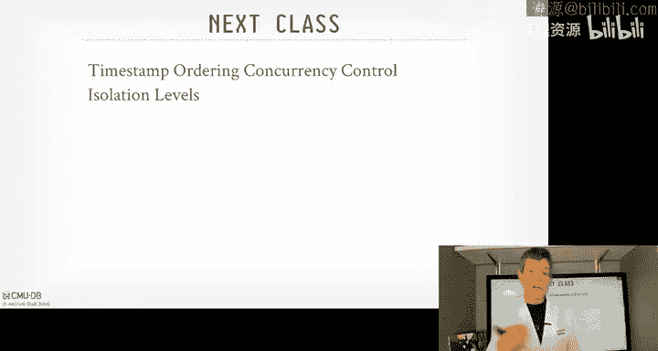

# CMU《数据库导论｜Intro to Database Systems (15-445645 - Fall 2024)》中英字幕（deepseek翻译 - P18：#17 - Two-Phase Locking Concurrency Control.zh_en - GPT中英字幕课程资源 - BV1Tys8eQELW

Yeah。い？No it sucks boching the recording third time semesterer for the lecturer and of course I got to record it but I can't go back to the campus because you have to tell you PO we're going to go first and you have to approve it before we can go anywhere so I figured it's money night。

 let me go ahead and rerecord what we talked about today。

So last class we were talking about the introduction of concurrent control and we spent most of our time talking about acid。

 aity， consistency， isolation and durability， and we spent most of our time discussing isolation and in particular we were talking about how we want to have the system the data system be able to run transactions as if they were running one after another in serial order。

 but of course then we still want to leave and leave them to allow for better parallelism to get better performance in our system。

 and so we had this notion this idea of serializable schedules where one where the outcome of the database is as if the transactions were executing in serial order even though they were being interleaved and so we talked about these two types of serializability or serialreizable schedules。

 we talked about conflict serializzable and view serializable。

 conflicts serialerizable is one where we said that we had this dependency graph and if we could recognize that there were no cycles in the dependency graph where operations occurring between different transactions on the same object in different。

Or then we know that that schedule would be equivalent to a serial ordering。

And then we said there was this other notion of Serizability called View Sererizable。

 where this allows for additional schedules that you couldn't do otherwise in conflictt Sererizable because conflictt Serizable was trying to be a bit conservative in how it schedules transactions。

But in order to make this work， you had to have some higher level meaning or understand the semantics of what applications。

Thought or cared about the data to identify that。 Yeah， you could reorder things a certain way。

 The example we showed that you could do a blind write on。

 on an object where you don't care about the inner leavingavings or the transactions before then。

 as long as the last transaction successfully written to that that the one object at the end。

Of course， as you said in order to do this， you either have to do static analysis or program analysis on the application code or do the worst thing possible which is talk to a human which is a non-star for database systems so in that case for that reason no data system is going to support this So when you say I want serializable transactions in a database system。

You typically youre always， you're always going to get serialized isolation。

So last class though was looking at what we called static schedules。

 meaning where all the operations for transactions were known to the database system ahead of time。

 so all the reason rights we would declare ahead of time and therefore we could then decide how to interleave them to determine whether we could produce something that was conflict orerizable。

And of course now as we said， in a real system， most systems don't work that way you have all the transactions operations ahead of time。

 there are some systems that can do this and if you store procedures。

 you potentially do this as well， but most systems don't work like that so instead we have this sort of fog of war if you will where transactions are submitting query requests。

 they're requesting to do some operations on some objects in the database and the database system has to figure out on the fly as it goes along in what operation from what transactions is allowed to touch of what data at what time and in what order。

 and again to ultimately end up with a execution schedule for transactions。

 even though they're dynamically coming in beginning end of the state of the database that be equivalent to one where we executed them in serial order。

So we didnt be again， the idea is we would have figured this out on the fly without knowing the schedules ahead of time。

So in today's class the solution we're going to look at how to do this is through locks。

 and then next class on Wednesday we'll see how to do this with timethoods。

 a different approach to trying to solve the same problem。

So if you called back to the beginning of the semester。

 when we talked about In andcur tool and the B manager and we talked about latches the protection mechanisms we would have inside our data system to protect the critical sections of of the internals of the system and I sort of was being very handba and say。

 oh yeah there's this other thing called locks that if in the OS world then when we say latch what they really mean is a lock。

 but in our world locks are something different because they're a high levelvel construct。

 So now today we're at the point where now it's time to talk about how we're going to use locks to protect transactions。

 So again going back to this table that we had from the grid graphic guy。

 these locks now are being defined to separate transactions from each other based on the contents of the database So it's no longer low levell things like a node in a B plus tree or pointer if we want to swap something out again that linked list for example。

 now it's protecting objects in the database。A database at table， tuples， attributes， and so forth。

And they're going to potentially hold these locks during the lifetime of a transaction so I could acquire a lock and hold it for that entire duration that as long as that transaction lives and then I go ahead and release it。

 whereas like the latches moment we were saying it supposed to be for a small amount of time to come in get a latch on something。

 do some operation and immediately go ahead and release it。

There was two types of modes for latches that was just read and write now in locks。

 we're going to first start off with just two modes， share an exclusive share just means read。

 write or exclusive just means write we're just trying to not use the same term。

 but then there's all going to be these additional locks modes we're going to have later on when we talk about semester or end of the lecture by hierarchical locking that's going to make things that make the life more complicated as well。

 but these are to be special locks we can have for different contexts to explain to other transactions what we're trying to do in different parts of the system。

In latches， we had to write our code in a correct manner to avoid deadlocks， but again。

 if we try to acquire a latch and it wasn't available。

 we said we just shoot ourselves in the head immediately and give it back up。

But now with locks on transactions， we are going to have additional protocols that are going to handle deadlocks within the assessment system itself because again。

 it's going to be some random jobscript programmers sending you crappy queries and they may incur deadlock。

 and so we as a database system people building it。

 we have to protect them from themselves student themselves in the foot。

 and so we're going to have this higher levell concurrential mechanism a traffic coordinator or transaction coordator if you will。

 that can determine that there's a deadlock and we go ahead and break it or in some cases to order the operation the request for locks in such a way that we never have deadlocks begin with。

And then the other key thing about the locks is that instead of having them being maintained inside of the data structure themselves。

 remember like the D plus tree， the lates were in the nose themselves。

 we're now going to have this centralized component in our data system called the transaction manager or the lock manager。

 where it's essentially a hash table that can keep track of what locks exist。

 who holds them and what mode， and then priority cues or cues to keep track of who's waiting。

 what other transactions are waiting to acquire that lock。

And so this is going to be a much more expensive and heavy machinery to maintain this lock information versus the latching width be more lightweight。

But the reason why we want to have this heavyweight lock manager is that we want to。

 since the duration that transaction be holding locks。

 it's okay for us to pay this penalty to keep track of all the locks in the centralized location because now we have a complete global view of what all the transactions that are running in our system assuming it's a single node。

 Shiidta Davis will make that harder for us later on。

 but now we can at least see everything that's going on the system so we can make better decisions about how to deal with conflicts or issues that come up because thatll allow us get better parallelism if we do it this way。

Al right， so let's go back now to a really simple example of the schedules that we showed before。

 and we have T1 T2 T1 wants to read on a write on A。

 read on A T2 wants to do a read on A followed by a write on a。

 But now we're going to introduce these explicit lock and unlock commands in our transaction schedules So T1 starts off the first thing it's gonna do is before I can do any any look up on A or write on A。

 it's got to go to the lock manager and say I want the lock on A because I want to do something with it。

And then the lock manager keeps track of who holds the locks on a if any transaction right does right now and into this sampleple here。

 nobody holds the lock， so it's allowed to grant the lock request to a and now a acquires that lock。

 so then it can go ahead and execute do the reader A and then now there's a context which T2 starts running and the first thing it wants to do is request the lock on a。

 So now in this case here since T1 already holds the lock the lock manager would recognize that that that lock on a is already being held and therefore it denies that request and essentially puts the thread the worker running T2 the T2 request has to go into the queue for that lock and it just has to stall in the weight。

Then T1 can switch back， now do the right on A， read on A。

 and then at which point it releases the lock on A， while T2 is sleeping。

 and then that request goes back to lock manager， it releases the lock。

 it's allowed to go ahead and commit later on， but at this point when the lock is released on A。

 then that wakes up T2 and the T2 and get the lock request， do the read and do the right。

So at the high level this is what we're talking about today is how to design a protocol based on these sort lock and unlock commands to generate schedules of transactions that end up if they serializable ordering。

I'll say also too that transactions typically don't make explicit requests for lock and unlock。

This sort of happens automatically if I run a select query， for example。

 then I'll acquire like the shared lock on it first， the right lock and relock on it first。

And that's not something the programmer has to write explicitly。 the data will do this for you。

 And likewise， we'll see later on when you do commit， it could go ahead and unlock things。

 but I first want to understand how the protocol works today and then as we go along with and say。

 okay， how can you actually do this automatically in a real system。

So today I' going first talk about the different lock types that consist and the basic lock types。

 and then we'll expand them later on when we talk about hierarchical locking at the bottom。

Then we'll talk about the basic two phase locking protocol， basically understand how that works。

 then we'll see how it strengthen even further to avoid additional problems may occur later on。

 and then we'll talk about how to do with deadlocks and preventions in different ways。

 and again I said， we'll finish out with hierarchical locking as a way to be more efficient in a lock manager by taking locks on regions of objects rather than single objects at a time。

Al so again， for the basic locks， we're gonna to have shared locks and exclusive locks。

 again Sha locks if reads exclusive locks or write and the capatibility matrix here basically looks like like it did for read and write latches where if someone has a read latch or shared lock someone doesntqui also a shared lock on that the same object but anything else is incompatible。

 So someone holds a shared lock， I can't get a write lock。 Someone holds a shared lock。

 I can't exclusive lock。 Someone holds a exclusive lock， I can't get any other lock。😊，So again。

 for simplicity， I'm showing just starting off with these two log types。

As as a preview what's coming later on， you can just see from the manuals of real database systems。

 there's a whole their compatibility metrics are much。

 much larger because there's a bunch of different。A bunch of different lot types you can have。

 And for different types of objects like catalog for updating tables for。

 for catalog updates versus doing index updates。 There's a whole bunch of different variations on this。

 So again。Thes good to understand the basics of two phase locking。

 and then we'll see how to make it more robust later on。Okay， so。How is this working with locks。

 So the basic way we're going to go this is transactions before they can do any operation on an object。

 like a reader write， they have to go acquire the lock and the lock manager for that given object。

You can do lock upgrades， meaning if I hold the object in a lock I hold a share lock on an object。

 and I know the next very next thing I want to do is do it write on it。

 I can then say I already hold a shared lock， upgrade it to an exclusive lock。

 and that may be possible to go ahead and do。 Otherwise you may may have the stall。

And the lock manager is is responsible for figuring out who holds what locks。

In what mode and then who's waiting for those locks in what modes as well。

The NAS transactions finish with whatever operation they want to do， they go ahead and release locks。

So the lock manager is typically implemented as a hash table in some systems like Postgres。

 you can query it as if it's a real table， but I think it's just a view over a function that access as the internal data structure because we don't need all the things that we've been talking about before like well you don't need transactions on the lock table because you need a lock table to have our transactions so how could you do that。

 but you still need to protect the data structure with latches and when we talk about logging。

 you don't need to save the lock table to disk because it doesn't make sense if you crash and come back who cares what locks are being held because those transactions are on anyway so it's sort of a special case of a kind of table that doesn't fall under the same protection mechanisms as a regular data table。

Al right so if we go back to our example here and now we're going to introduce the same set of it before。

 but now we're going to do use the different lock modes for her transactions。

 So T1 first gets the exclusive lock on A then does the read on a followed by the right on A Now we could have gotten the share lock on A first do the read and then upgrade it to an exclusive lock and then do the right for simplicity to make it fitness slides。

 I'm just doing it as a single exclusive lock acquisition。

We'll see how to do that in SQL at the end of the lecture。Then after T1 is finished the first right。

 it'll go ahead and release the lock on a because there's a context which T2 is going to start running。

 so yeah， let me go ahead and give up the lock。T2 starts running， it gets the exclusive lock on a。

 and it does the right on A， and then it says up， I'm done and releases that lock back on A。

But now T1 starts running again， and I guess the share Laanehe goes ahead and reads it and then unlocks it。

 But the problem is that in this example here， T1 is going to read the right made by T2 when it should have seen the right that it did earlier。

So this was an unrepeatable read anomaly that we saw before。

 but we're reading things multiple times and we're not seeing the same values。

RightSo the main takeaway here is that just because we're using locks doesn't mean we're going we can guarantee that we're always going to get a serialerizable ordering of schedules or transactions。

So we want to be smart about how we lock things and unlock things to avoid anomalies like this。

And this is what two phase locking does for us。 So two phase locking is going to be a con protocol that we're going to use that's going to determine or dictate at which point how we acquire locks and then what happens when we actually start want to go ahead and release them。

And this was the first previouslyably correct concurrenial protocol from the 1970s that could generate serializable ordering of transactions without having to know all the queries ahead of time。

 and this was inventedended by Jim Gray at IBM working on SystemR。

 which he later won the toruring Wood for this in the 1990s。So two phase locking is as it sound。

 it has two phases。So in the first phase called the growing phase。

 the transactions are allowed to keep requesting as many locks as they want。

 and then the lock manager can just grant or deny them as it normally would。

But then soon the transaction releases a lock。Then we automatically switch into the shrinking phase。

Now， at this point here at when you're in the shrinking phase， you can never go back。

 the transaction can never go back and acquired new locks。

 it can only release locks or commits and releases all the locks that it has。RightAnd so again。

 this is the key idea that sort of avoid that problem we saw before because it unlocked the A and then it tried to acquire another lock。

 that wouldn't be allowed in two phase lock game because you can't go back and acquire locks when you unlock something。

So the way another way to think about this is that you think about the lifetime of the transaction over time for a single transaction。

And along the X axis here， we're showing the number of locks that it's accumulating over time。

So in the growing phase， you're acquiring lock， lock， lock lock。

 you're getting all the locks that you won。 And then at some point say， all right。

 well that's enough， I have enough locks and you go ahead and release them。

 Then you again automatically switch into the shrinking phase where you're just returning locks back to the transaction manager。

So the way you sort of think about this is like you're climbing up the mountain acquiring locks。

 and then at some point you reach the peak and now you're going down the other side and you never come back to another peak。

 meaning like I can't release some locks and then go acquire more locks because this would be a 2PL violation and we can't allow this。

If we least guarantee this， then we can show that we're always going to be able to generate conflict areizable schedules。

Al right， so let's go back to example before。 So T1 starts。

 gets exclusive lock on a that gets granted。 So we give it back。 sorry T1 starts running again。

 does the read on a and then write on a。 And then now there's a context switch where we switch back over and now to T2 or T2 starts running。

 It tries to get the exclusive lock on a。 But that's blocked because it's being held by T 1。

 So then it waits。 And then T1 can start running again。

 do the read A that it wants to do go ahead and unlock it and then commit。 And then now the。😊。

AndNow when that when it's unlocked， T1 gets sorry T2 gets the lock on A。

 it can go ahead and do the right and then releases it。 And again。

 now we don't have that unrepeatable V problem that we had before。RightIt's pretty simple。

 but it's's， it's really elegant solution that's。That you。

 he works again without having to see all the transaction queries ahead of time。So as I said。

 two phase locking by itself is enough to guarantee that the transactions or schedules will be be complex or liable because any precedent graph or any transactions sequence of transactions is always going to be ascyclt。

 meaning there's not going to be edges that could cause a cycle between them。

But there is another issue that can occur， another problem that can occur that isn't a correctness issue。

 but rather it's a performance issue， and that's called a cascading abort。So going back here。

 so now I'm going to do an T1， I're going to do going to read on A， write on A。

 and then a read on B and write on B， but then at some later point its going to say it's going to go ahead and abort。

Right， so if T2 starts running during this and gets the exclusive lock on a。

 which is a allowed to do because once T1 unlocks A， it's in the shrinking phase。 So that's fine。

 So then T2 can grant that lock。 then it does the read on A。 But at this point here。

 it's reading the right that T1 made。And then it has to stick around。

 and then at some point when T1 aborts， we actually also roll back T2 because we can't let T2 commit having seen the uncommitted change from T1。

So a schedule like this would be permissible under two phase locking。

 but when T2 goes to commit or any transaction that reads data from under another uncommitted transaction。

You have to track the read and write set and you have to recognize this transaction read something from a transaction that has not committed yet。

 so when I go ahead and commit， I have to wait to find out whether that other transaction is successfully committed before I'm allowed to commit。

Becauseuse the thing we want to avoid is having T2 leak any change that T1 made to the database leak to the outside world by allowing T2 to commit because again。

 you would be able to see a change made to the database from a transaction。

 they end up getting rolled back。The other problem also， too， is that any， you know。

 since its now we need to pause or need to wait to see whether other transactions commit。

Before our transaction is allowed to commit， then we have to then。

 if we identify that our transaction are going to abort because another transaction aborted。

 then we have to roll back any changes that we made。 So now in this case here， in T 2。

 all the work that it did it was running on the assumption that it would be allowed to commit。 know。

 because T read something from T1 and T1 is gonna to commit。 We have to roll all that back。

 And now all that's weights of computation。So my example here， again。

 I'm only showing T2 doing one read and one write， that's no big big deal。

 but always think of extremes， like if T2 did a billion reads and a billion writes。

And then to end up getting aborted because it read it change from a transaction that it didn't commit。

 then that's a lot of ways to work。 and then the application， if it's written correctly。

 we have to resubit that if they want it readone to do all the work all over again。So the。

With two phase locking， there are potential B schedules that are serializable。

 but we're not going to always allow them because。Because， you know it。

It would normally allow them because TV is locking it again。

 it's a bit more conservative than maybe it necessarily needs to be。

 but then we still have this problem where again， we could have dirty reads because we're allowing transactions to keep running。

 but then when they got a wait to see whether anything they read from an uncommitted transaction。

 what they have committed。I give these the dirty unrepeatable read problem。

So the solution to this will be a variant of two phase locking called strong strict two phase locking。

 I think the textbook might call them rigorous two phase locking or other systems might call them or rigorous two phase locking。

 but they're essentially the same thing。And the basic idea here is we're going to make a slight adjustment to TV's locking to avoid this particular problem。

So under strong straight2 phase locking， the way it works is that the growing phase。

 just like before as I'm acquiring locks， the growing phase， the number of locks I'm holding goes up。

But then now there isn't really a switch into shrinking phase because you don't actually release any locks in a shrinking phase。

 It's only when the transaction commits。 when the end of the transaction。

 then you release all the locks that you have。RightBecause again。

 the idea here is you don't want anybody to have read read something that you the idea that you wrote。

 So therefore， I'm going to hold my exclusive lock on those objects that I' wrote to until the very end。

 then I commit， and then then someone else can then read my changes because at that point。

 I know I've successfully saved my changes or committed。Theyre they slightly less。

Conservative version of this called strict2 phase locking where you you're allowed to release the shared locks and the shrinkky vase。

 but all the exclusive locks you hold at the very end。

 but under a strong strict you hold both shared and exclusive locks to the very end of the transaction right。

So the way to think about this is that the the formal definition of a schedule。

That doesn't allow a other transaction to read or write data from another transaction until that other transaction has committed would be termed as being a strict schedule。

 like it's sort of the strict ordering of the operation so that were not we're not modifying in flight data or reading from in flight data。

So the obvious benefit is that we avoid the cascading a board problem that I shared before。

And it actually simplifies the implementation because now when a transaction of boards。

 since we know that no other transaction could have read data that we wrote to。

 it makes rollback really easy because when I in transaction boards。

 I know I'm only have to roll back that one transaction because my data hasn't leaked to other inflate transactions whereas if you allow for cascaing a boards have to handle them。

 then I could have a long dependency chain of what transaction read data from what transaction data from what transaction and then when I go to go ahead and the board。

 I got to figure out all that out and roll them all back in the right order。So。Most systems。

 if they're going to doiz support serializ execution or serialerizable schedules are serialreizable isolation。

 and they're doing two phase locking， they're going to give you strong strict two phase locking。

And can also too because there isn't actually explicit unlock command like I'm showing my schedules like there isn't a SQL command that says unlock something。

 So theres isn't a way say like I know I'm not going to read this thing again or write it again。

 So I'll go ahead and release my locks now。 So most systems will just give you if you say I want serializable transactions。

 You get strong strict to because locking by default。

All right so let's look at some other examples and how this all works together。

 So say here now we have it's similar to the banking example we saw last class。

 we have T1 once to move $00 out of my account into my book'iess account。

 So debit $100 from account A and credit $100 to account B。😊，And then for T2。

 they want to compute the sum of all the accounts， all the bank accounts and report it back you know to the application。

 Again， I'm showing this echo command here that there isn't a SQL command。

 there isn't anything like that It's just a way to say here's the return statement of the operation。

Of the transaction。So here's how it happens if we execute these transactions without two phase locking。

 so T1 must start get exclusive lock on a。T2 is start try to get the share lock on A。

 but it can't because T1 holds excuses the lock。 So it pauses and waits。 T1s allowed to read a。

 subtract 100 from it and write it back to the database。 now ahead， goes ahead and unlock A。

At which point the T2 gets the lock on a and it goes ahead and read the value of a so without a without the 100 I took out unlock A takes the share lockum B before the T1 can get the exclusive lockum B。

 so T2， sorry T1 has to wait。T2 is allowed to then read B adds to the total and produces the output。

 and then at which point T1 can then run again and do the update on D。

So if you look at the output of T2， it's going to be A plus B is going to equal 1900。

 So because we were able to read the value of a after taking $100 out。

 but then the value of B before putting that $100 back in。

 So now the bank is missing $100 here because we were able to get interleading of the transactions that wouldn't occur if they were running in serial order。

So if we do a basic two phase locking， T1 gets exclusive lock on A。

 T2 pauses when to try to get the show lock on A， that's fine。T 1 gets the exclusiveal lock on B。

 and then immediately release the。Excuseive lock on a。 at which point T2 can start running。诶。

And then when T2 then tries to get the shared lock on B。

 that gets stall because T1 holds the lock on that T1 is allowed to then add $100 to B。

 goes ahead and unlocks and commits it。 And then at which point T2 can see the value B。

 So even though we're actually able to interlea the transactions。

 So while while T1 was doing the update on B， T2 was allowed to read A after it was modified by T1 But we're producing things in right order。

 and we the correct number at the end。If we do strong strict two phase locking。

 again basically T2 tries to get the share lock and A。

 but it gets blocked until the very end that when T1 commits because again。

 T1 is going to hold the locks that any locks that requires until the very end to go to head and commits and then at this point here it's basically running it in zero order and we're producing the correct result。

So if we go back to the schedule that we diagrams showed last time we' sort of said this region of space here thats saying this is all possible schedule you could have for transactions and we said there was a small chunk of it。

 a subset of those schedules the ones that were running in serial order and then the runs around them were the one that would be conflict verizable and then runs around them could be viewerizable so any schedule that's viewerizable sorry any schedule that's conflict surerizable is implicitly also conflict viewerizable and any schedule that's serial is。

Implicitly， conflicts are liable abuse are liable。So now there's this region here for no cascading boards where some of those schedules are going to overlap with the serializable ones and the serial ones。

 but some of them are not going to be in that space and then within that region within conflict surizable and also bounded within no cascading boards。

 we would have the strong strict two phase locking schedules。All right。

 so going back to this slide here， we've talked about how to handle dirty re pumps using strong sh2 phase locking。

So the next issue we got to deal with is how to handle the deadlocks。

 and there's made basically two approaches to this Deadlock detection is using a background thread to figure out a background worker to figure out when there's a deadlock can go ahead and try to break it and then prevention is the idea like we're going to order the way in which transactionally allowed acquire locks in such a way that we guarantee that there couldn't possibly be a deadlock。

So if we go back here， we have a transaction T1 wants to take an exclusive lock on A and relock and do a read and then take exclusive lock on B。

 T2 once gets a share lock on B， do a read on B and get a share lock on A。 So in this case here。

 T1 starts gets exclusive lock on A。 That's fine。 T2 starts get the share lock on B。 That's fine。

 But then anyone tries to get the share lock on A It has to stall on weight when T1 starts again。

 tries to get the exclusive lock on B。 It sells a hand to weight。 And of course。

 this is your classic deadlock。 So this is the problem we're trying to avoid here transaction could be waiting to require locks that be held by another transaction but that other transaction is holding the lock that we hold and they're waiting for get a lock that we hold。

My classic， classic order level parallel programming deadlock。So it's essentially again。

 a psychoture action that are waiting for locks to released by another that are never going to get released because unlesss we do something。

So they said there's going to be two approaches here。

 there'd be deadlock detection and deadlock prevention and one of the main takeaways is that the enterprise systems。

 the highend oracles and so forth， systems costs a lot of money they're actually going to im both of these and they will have ways to toggle on one versus another based on the workload。

 and they're also going to maintain a bunch of additional statistics internally in the system to make better decisions of how which one you use and then if you have to do deadlock detection。

 how what transaction should you kill and steal their locks from they give it to the other transaction in such a way that you you can minimize amount of waste of work and improve your performance。

But we'll cover what those protocols or what these metrics are later on in a second。

So with Dlight detection， the idea here is that we're going allow transactions to acquire locks。

as they need them or as they want them， and then there'll be a background worker that occasionally wakes up and looks at the weight for a graph。

 which is basically keeping track of what， what transactions are waiting for what other transactions。

And if it detects a cycle in that weights for a graph。

It knows that it goes has to go ahead and choose a victim to kill。You know， take their wallet。

 take their car， take all their locks， and give it to another transaction and allow that transaction to run。

Right。And then of course， now there's gonna to be this tradeoff between how aggressive we want our this deadlock detection worker to run。

 if we run it every 60 seconds， then the overhead of checking for cycles is pretty low。

 But I may worst case to never have to wait 60 seconds before it can resolve a deadlock。

 But if I have my deadlock detector run every one nano one microsecond。

 then now I'm basically burning CPU cycle is checking for deadlock over and over again。

 which I could have been using those resources to execute queries and execute transactions。 So again。

 what the right mix or how aggressive you want to be depends on the workload depends on the Harvard depends on a lot of different things that we've been talking about this entire semester。

So let's look at some example like this。So again， the T1 was going to share lock on B。

 but that's being held by T2。T2 wants to share lock on excuse the lock on C。

 but that's being held by T3， and T3 wants to excuse the lock on A， but that's being held by T1。

 So again， in this example here， every time when one transaction is waiting for the lock for another transaction that weights for graph。

 we introduce an edge。Then now we' got to run our psycho detection algorithm。

 of which there are many pick your favorite and to decide which one you want how to break this。

And so the way this typically works since it's NP hard problem to find these cycles。

The they'll run the data system run a simple form where they maybe look for cycles between just two transactions like transaction1 is waiting for detection T2 and T2 is waiting for T1。

 So you do a quick pass to find cycles to really quickly using a quick heuristic algorithm。

 But then if you don't find any any cycles just through that simple detection。

 then you run the more expensive one that takes a longer time。 So if you do that。

 then you can find some quick things some obvious things pretty quickly and avoid having to run a really large psycho detection algorithm that be more expensive。

 Again， my example here I have three transaction and a high end system。

 they can be executing hundreds of thousands of transactions a second。

 So in that you could have a huge graph or the huge number of cycles with long edges and might take a lot to actually find them。

 So you do the more expensive one only if you have to later on。So， again。

The background worker runs the deadlock detection algorithm based on what we know in our lock table and is lock manager。

 And again， this is why we want to have that centralized data structure。

They asked decide which one's going to be the victim to go ahead and kill steal their transaction to break the cycle。

And so what will happen is when you identify the victim and you go ahead and abort it to break the cycle。

 depending how the transaction was evoked， you either have to send an exception back to the client and say your transaction was killed。

 please restart it， or if it's in the case of a store procedure。

 you could just actually just rerun it from the very beginning。

 just invoke it as another RPC request and not have to alert the application you maybe do this a couple of times and then if it still gets aborted。

 then you only throw back the exception in that case。So again， as we said before。

 there's a trade up between how aggressive we want to be for running Delect detection versus how much time we want to spend looking for cycles versus letting transactions run。

So now how to pick your victim is a very complicated thing and this is what separates again。

 the enterprise systems from the open source ones because there's a bunch of different things we consider in our decision and again。

 which may vary depending on the application needs and the enterprise systems you can tune these parameters to specify how you want to pick deadlocked victims。

So it could be something like， oh， I want to run this transaction that is kill the transaction that's the oldest。

 like if they're running for five days， it might run for 500 days。

 I don't want to wait and let me just go ahead and kill it。

Or you could say pick the youngest one because the transaction just showed up。

 we'll go ahead and kill it， and then the application can then resmit it right away。

It could be by based on how many queries they've already executed so far， so I've executed。

 say  a0 queries， maybe I'm less likely to go ahead and kill that versus a query that has run one query because。

If I roll back to 10 queries， they may have to remit that again and I have to do 10 queries all over again。

 and that would be a waste of resources to that。It could be the number of items that they've already locked。

 so maybe I've only executed two queries， but I've acquired a billion locks for some reason。

Getting all the good those locks and the lock manager are expensive。

 So I don't want to waste that work。 And so I'm better off killing another transaction that has less locks。

Could be the the number of times the transaction。The times you've rolled back a given tri before。

 So this transaction keeps going roll back over and over again。 I may get sort sympathetic and say。

 okay， well， I can't just keep killing this guy。 I got to let him run at some point。

 So after a certain amount of time， you know， if you can roll back 10 times， then the data system。

 okay， well， you've suffered enough， let me go ahead and let let you let you run again。So。😊，There's。

This is important because you， you。You want to， you know。

You don't want to starve transactions Actually mistake I made was the by the number of transactions roll back with。

 Again， that's the cascading board thing。 If we have to kill this transaction。

 But we know there's 1000 transactions that depend on what it wrote。

 is if I kill this one transaction to break the deadlock。

 I to kill another thousand transactions as well。 then that would be real expensive than it' killing one transaction by itself。

 So again， like if there's so many different factors。

 you could account for all these things and getting this right， is like super hard to do。

 And again the enterprise system can be a bit adaptive on this and try things out learn from that and get better over time。

 And some cases， just punt it out to I assume experience humans can know how to set these things。

And the last1 I was just saying is what I said before， like。

If we know the transactions have been restartted a ton of times。

 we don't want to have it burn cycles。 You， we want to be sympathetic and say， okay， well。

 you you've been restarted enough。 you can go ahead and run。Al right。

 so now the question is how far do you want to roll back。

 And so the most simplistic thing to do is say just roll back everything that the transaction has done and start it from the beginning or punt it back to the application。

 say restart it if you want to run it again。 There are。

 in some cases where you can run roll back to do partial rollbacks to save points。

 Think of this as like a marker in the life of a transaction。

 you give it like a name or number and you say。I've done a bunch of work。

And here's a save point and then the transaction keeps on running。 so now if there's a deadlock。

 I can roll back partially the changes back to that last save point and then resubmit things all over again。

嗯。You typically only want to do this if。You typically going to do this if you're running store procedures because you don't know whether there's application logic where given some output。

 given some result of a query， have an if calls it maybe runs one query if it's this。

 if you not love a query if that。IfWithout that logical of running the system。

 you may do the wrong thing， but you can do partial rollbacks and still or end up with a serializible order in some cases。

All right， so that's deadlock detection right is's a background thread running to figure out what to go ahead and kill the alternative is to do deadlock prevention and the idea is that when a transaction goes to request a lock。

You decide at that moment， are you allowed to take this lock or not？

And if it's being held by somebody else， you decide， okay， am I allowed to wait for the lock？

Or am I allowed to go kill the other guy， take their wallet， take their locks。

 or do I commit suicide and kill myself because if I can't wait。

RightSo in this approach we don't require the background worker， we don't need that weight for graph。

 we're not looking for cycles because again， cycles aren't going to be able to occur because in the way in which we order the request and what transaction。

 lot of weight for other transactions， we can guarantee that we're not going to have any deadlocks。

So for this， we're going to assume that the older transaction。

 one of the older timestamp is going to have a higher priority。

 so we assume transaction to assign timestamps when they show up and the older of the U are potentially the higher priority。

And so the two variants of this dead lack prevention algorithm are going to be wait and die and wound and weight。

 And then again way to think about this is going to be。And what age of a transaction is。

 if you have the age of one transaction and the age of another transaction。

 they're never gonna be equal because otherwise they'd be the same transaction。

Then the protocol specifies。If I'm younger than them， what do I do if they're older。

 if I'm older than them， what am I allowed to do。And so in wait and die。

 the idea is that the old is a allowed of weight for the young。

 So if a requesting transaction comes along and they have a higher priority than the holding transaction。

Mean the other transaction is older， then we're allowed to wait for for that transaction to release the lock and then we go in and acquiring and get into what you want。

 Otherwise， if we're younger than them， then we we have to go kill ourselves because we are not allowed to wait。

Wound weight is the opposite， the young is allowedweight for the old。

So if the requesting transaction has a higher party than the holding transaction。

 then the holding transaction has to abort， you're allowed to shoot that other transaction。

 kill them and abort them and then take， take their lock and releases it。Otherwise。

 you go ahead and wait。So looking at real simple two examples like this。

 so T1 starts in the top here， T1 is gonna to have a older timestamp than T2 like1 is less than 2 so at the very beginning t1 starts then T2 starts then T2 gets exclusive lock on a then T1 wants to acquire that exclusive lock on a and then now depending on what protocol we're using if it's weight and die old weights for young then since T1 is older it's allowed to weight for T2 since T2 is younger or under wound and weight。

 which is young weights for old and that case T1 is allowed to shoot T2 calls them to abort and then take their locks。

And then down here at the bottom， if the opposite T1 starts。

 it gets a smooth lock on a T2 wins that acquire the lock， that lock on on T1。On her weight and die。

 which is the old way for young， T2 has support because T1 is older than T2。

The young are not allowed to wait for the old under weight die。

 So T2 has to give up on a board and kill themselves。In when and wait。

 because the young is a allowed of wait for old， T2 can wait for T1 to release the lock and then then go ahead and inqui and do it at once。

So why does this work， Why can we guarantee that there's no deadlocks。 Well。

 in the same way that we talked about with in a B plus tree when we were doing latching。

 ignoring the sibling pointers， where we had transactions only acquiring latches in one direction。

 like from the top of the B plus tree down to the bottom。

 we weren't having anybody coming up from the bottom to the top this guarantees that know under weight and dime we weight。

 since all of the the weights of to acquire latches are going or locks going in one direction。

We don't have anybody going in the other direction。 There can't be any deadlocks。

So now when a transaction restarts to prevent it from getting starved for resources。

 if a transaction gets aborted when it gets restarted， it uses the same timetamp that it had before。

 and then that guarantees that it's not given a new times stampamp over and over again and therefore it may try to acquire locks over and over again and not be able to get them get killed off So eventually it'll be the oldest person there。

 the oldest transaction in in the system， so depending on the protocol。

 it'll be able to get the lock once right away or it's allowed to wait for it get the cho lock that it needed and not how to abort。

Al right， so everything we talked about so far have has been about。Assuming that for for one block。

 it goes a one object。 And again， I've been being vague。 I haven't said what we're locking。

 I said they're database objects。 and kind of assume that they're like tus。

 but doesn't necessarily have to be。 it could have been a database could have been a table。

 It doesn't matter。And so the challenge with this approach， one one mapping routine。

The object we're trying to for a lock and an object。

 the problem with this is that if we had to require a lot of locks， then that's expensive。 again。

 going to the lock manager is not like trying to acquire a latch because I gotta take latches to get into the lock manager table。

 and then I may have to go go read some data， update a queue and so forth， right。

 that's very expensive to do so。If I had to do that for a billion times for a billion tubs。

 that's going to be really expensive。And so we're willing to make that trade off because again。

 in the transaction world。The the， the work we're doing for on object required a lock floor。

 that could be you know。Could be milliseconds， could be secondsd， could be hours， days in some cases。

 And so it's okay to pay that penalty to have to go maintain the go update the lock information。

 But again， we want to avoid maybe in the common case， having going to do that。Acccessibly。

So this is why we're going to introduce now particle locking through lock different granularities。

 So now when a transaction once acquire a lock。And we can decide what scope。

 or what granularity it wants to acquire that lock for to try to balance the need to。

Bance the acquiring as many locks that it absolutely needs。

Versus maximizing the amount of parallels I want， so there's this trade up between I can take very coarse grain locks and therefore I only't like to go to the lock manager a small number of times。

 but then that blocks anybody else from running and my system。RightWhen Mongo DBvo first came out。

 they had a single lock for the entire database。 that means nobody could read and write to the database while somebody was updating even one twople。

 even though it may be updating other parts of the database that wouldn't be affected by that。

So that's really easy to implement because it's a single lock。

 but you get terrible parallel because now everyone blocked behind a single writer。Again。

 gives me the trade between trying to acquire the fierce lock that we need， but also balance the。

 the。The granularity of those locks so that we can still get good parallelism。

So the way to think about this is now your Davis is represented in a hierarchy so you have a Davis at the top and the Davis is comprised of tables。

 tables are comprised of pages or groupings of row groups or groupings of tuples。

 and then with those twos we can have multiple attributes。So now when T1 comes along。

And it gets a lock， say on a table。That implicitly locks everything below it in the hierarchy from all its descendants from that node in the tree。

So if I get a lock on the table， I'm implicitly locking all the things down below because everyone has to come through that same hierarchy when I wants to acquire locks。

 has to go and follow the same protocol and go in the same order that we saw before。

So in terms of how these things are how common the different kind of lock hierarchies are implemented。

 the most common ones be locks on tables and locks on tus。

 locks on pages are probably the next most common thing， but not all systems actually implement them。

Locking databases are。Some systems will do that if you're doing DMLs or sorry DDLs and it changes to the schema。

 but it's it's。It's it's not as common as like locking tables and tus and then super rares being having sort of really fine grain locks on。

 on individual attributes， individual columns。 the only system actually know that can do that that know that does this is。

Is Ugabyte， right They， They have an example where like you could。

Instead you try to crack a lock on tube， but when you recognize you're only updating know small set batteriess。

 you convert that actually down then to a to lock on on the columns。 Again。

 that can try to maximize amount of parallels in the system in that case。All right。

 so now we're now we're going to introduce additional lock modes because now we're going to have this hierarchy because it may be the case that。

If we have to go acquire locks in this hierarchy at upper levels in the system， maybe you know。

 if we have to update a single tu， we don't want to acquire。

 excuse a lock from the entire database entire table or you a group of tus。 And so。

 but we still want to have a way to provide hints to other transactions that maybe trying to do。

The other types of locking in the hierarchy about what's going on down below without explicitly having it record everything。

So this is where these new attention locks are going to come in and the idea again these are hints at a higher level node in this hierarchy to instruct or tell the other transactions。

And that you're taking things in a shared exclusive mode at lower parts of the tree。

The idea is that the intention locks tell you that somewhere down below。

 I I have something in explicit lock mode， but I have this， this fuzzy intention locks up above。

 And again， it's just， just just for hints。So the three types of intention locks are intention shared。

 attention exclusive and shared attention exclusive。

 So attention shared is saying that I'm giving you a hint to say at some lower point in the hierarchy。

 I'm taking something with explicit shared lock。Intention exclusive is the opposite saying someone below me。

 I'm taking something in an explicit exclusive lock and that prevents someone from again from taking incomp locks that maybe trying to read the whole all the twooss would。

 you know， you need to update one of them so the intention exclusive can block them from doing that。

Sharing attention exclusivecl is really。Two locks put together。

 so it's the regular shared block that we talked about before。

 but then also in intention exclusive lock， and so you would do this to say like I want to be able to read everything below me and read that in a shared mode block。

 but I'm also going to be updating a subset potentially some number of those of object Pelo me in the hierarchy in exclusive mode。

 but I have not taken the whole thing as as an exclusive lock。So again。

 it's a way to introduce a additional amount of parallelism。

 but still have the hinting capability somewhere in between a shared lock or intention choose lock a shared lock an exclusive lock。

 it's someone to say like it's a shared lock， but also like I'm modifying some things。

So I'm not going to go through the matrix like this。

 but you can start to see it gets more complicated again。

 the intention shared is pretty much compatible with everything except for exclusive mode blockss。

 you if you have exclusive mode that blockss everything。

 but then as you sort of have higher levels of attention or shared intention。😊。

Then it becomes a restrict of what you can do。So the protocol is going to look like this。

 It's the same thing as that two phase locking the episode said before。

 So it' theyre going to have the growing phase and the shrinking phase whether you're using strong strict or regular two phase locking。

 all that's going to be the same。So now what's going to happen， though。

 is that we have to traverse that hierarchy。And we want to acquire try to decide what's the appropriate lock to acquire at some given level of the hierarchy。

And usually you try to take intention locks as far as you can to get the very bottom of where it then you actually get the explicit locks of the things you want。

 but it may be the case that as you're going down， you recognize that maybe I took something at a higher level in an attention mode lock。

And you realize that was a mistake。 I just want to go back and go explicitly convert it into a share exclusiveive lock。

 and so you can go back up the hierarchy and or upgrade a lock type if you recognize that things aren't going the way you thought they were going to go。

So， the。You start to see why now we have all these different objects we want to acquire locks on and we have all these different lock modes we can have。

This is why the the lock manager， the lock table itself isn't going to be a regular table because if you think about it if I have a billion tuples。

 and I want a billion entries in my lock table for。You know。

 for any possible lock because I'm gonna to take on those twos。

 instead the lock table is meant to be dynamic where I can。

 if I recognize that no one has a lock on something anymore。

 I could go ahead and delete it to free up space or if I bulkload a billion tuples。

 but I only lock 100 of them for my transactions and I'm not wasting space my lock table for all those tus that no one's ever going run in context of a transaction。

All right， so let's look at first example here， and we're going to be doing a getting the balance of my bank account and then also increase my book'ies bank account。

 compute interest zone by 1%。And the question is what locks we're going want to obtain。

 So for all the leaf node， those you have to acquire an explicit mode。

 So either shared mode or exclusive mode。 But then the higher level。

 we're going try to acquire things in intention locks。

 But we recognize in some cases it makes sense to go back and put into explicit mode。

We can go ahead and do that。So for simplicity， I'm not going to show ash level locks or。

Page logs or Davis logs， which is keep it simple and do a two level hierarchy。So T1 starts。

 I'm going to read the record on a。 so what it wants to do is figure out how to get through the table to find the table that is down here that it wants to read。

 So the question is what lock do we want to acquire at the table level before require the shared lock down below。

So in this case here we can say we can do an extension shared lock and say hey。

 down below me in this table， I'm taking one of these tus， one or more of these tus in shared mode。

 I don't know what they are at this point， I don't need to record that in the higher level of the hierarchy。

 it's just a hint to say if you're coming down through the hierarchy be aware that I have something down below in shared mode and that might be incompatible with somebody else coming along later on。

So once I have the intention Sha lock on the table。

 then I go ahead and get the shared lock on the Tple and go ahead and do my read。Now。

 in the case of T2， it wants to update the bank account record。

 So now we've got to look at the capatibility image can say what lock should we take on the table level before we take the exclusive lock on the tu but down below。

So in this case here， we want an intention share or sorry extension exclusive because that's going to be a hint to say again。

 it's somewhere in this table I'm taking a tuple in exclusive mode。 I don't know where。

 but just be aware that this is happening。 And so it turns out now according to the category a matrix。

 intention shared is compatible with intention exclusive so。

Bow transactions can hold different locks on the same object at the same time that are compatible。

 So， again， now we need to keep track of what mode。

 what locks are being held for given object could be one or more and what modes they're actually in。

Al right， so let's look a more complicated example。

 We have three transactions running T1 wants to read all the tus in R and then update one of them。

 T2 wants to read a single tu in R and then T3 wants to just read all the twos in R。

So when T1 starts， again， we got to agree through the hierarchy。

 and again it wants to read all the tus， but one of them is going to do a read followed by it right。

So in this case here we want to get a shared intention exclusive lock。

 so what this is going to do for us is that the shared portion of this SIX lock gets all the tuples at the leaf nodes in the hierarchy in shared mode automatically because we have the table locked in shared mode。

 but then there's also an additional hint to say， hey down below one of these tuples is going to be locked in exclusive mode。

 I don't know which one it is again， but at enough the high level hierarchy to tell you that there's something going on down below that does this。

So now T2 comes along and once I read this one tuple down here。

 it's not the one that being held in exclusive mode， so in theory。

 we should be able to allow these two transactions to run simultaneously at the same time。So again。

 looking at a compatible matrix， we can see that we can take an attention shared lock on the root node。

 and that's compatible with the shared attention exclusive mode。And then down below。

 it can then take the shared lock on 21 right and go ahead and read it Now if we try to read the tuple that was being modified by t1。

 well the excuse the lock is obviously incompatible with the shared lock。

 so it would have to stall and wait for that depending we're doing de detection or weight and die we'd wait。

 we had decide how to resolve that at some point， but in our example here it worked out just fine。

So now when T3 starts， it wants to scan all the tus in R down below。So to do this。

 it wants to get the shared lock on something down below。

 but the same wants to get the shared lock on the table。

That's not compatible with shared intention exclusive and being held by T1。

 so therefore it has to stall and weight。Right。So then now when T1 and T2 and T1 finish。诶。

Then now T 3 can go ahead and get the shared lock on， on the table R。

 and now go ahead and it can scan and read everything。So as I said before。

 we can support lock escalation， so if we recognize that the data system can recognize that I'm acquiring a lot of locks at this lower level explicitly。

 then it might be better off just go back up the hierarchy and escalate the lock I have up there to put into an explicit mode so I then get all the locks without having to have entry for every single one of them inside my lock table and this reduces the number times I have to go to lockmanger。

 which I protect with latches says if it was my page table or any other data structure in the system so now I'm going back in and out of the lockman over and over again。

 then there's be tension on those latches which would slow things down。All right， so as I said。

 in practice。You typically don't specify I want。I want to acquire lock or unlock things again when you run a select query。

 you run an update insert update leak query， the data system will automatically acquire the locks you need in the right mode for you automatically but there may be in some cases where you actually want to give hints to the database system and tell it about how you plan to use data。

 use objects in the database so that you can override maybe what lock would normally try to acquire for you and put it in the mode that you know is going to help you later on it's like a hints to say here's what's going to happen later on my transaction。

Doqui locks in this way for me， and that'll make things better for us later on。

You can acquire exclusive locks on databases， we'll see example in class next time on these advisory locks and Postgres like or these named objects you acquire locks on one and you can do certain things like。

You can in some systems require just a lock of things， but most applications aren't written that way。

So let me look at two examples doing hints。 So the first to do select for update。 So so again。

 when when you run a select query， the data system will automatically lock any object you're reading into shared mode。

But again， a very common pattern is to do readmod right。

 And you saw this example of like might transfer money in the bank account。

 I had to read the record first， then I modified it and then wrote it back to the data to the new value。

 So in that scenario if I was just doing the share lock when I did the first select。

 I then have to go back into the lock manager then upgrade my lock to an exclusive mode when the update query comes the write query comes。

 So instead， I can add this modifier to my selectqueries， I add this for update keyword at the end。

 So now when I run the query， it says run this select， produce the result as a normal select would。

 But when you acquire locks on anything。 don't acquire and share mode。

 acquire it for in exclusive mode because I'm going to go ahead and update it later on in that forces of the system。

 acquire the locks in write mode or exclusive mode at the moment it tries to acquire them and read them because you know you can update things later on。

😊，And this。And screenshot here from the Postgres documentation。

 You can see there's a bunch of different variations for this。

 You can set share locks and do select for， you know， select for share， which is。诶。

You be ideas there。If you're not running with serializable isolation。

 you're running a low isolation level， it forces transaction some of locks。

 maybe longer than you normally would at a low isolation level。

 Postgs MySQL this but left for update is very common， most systems actually support this。

Another one that's kind of cool is called Flleck Sip Lock。And so the idea here is that。

I can perform a squarium。But instead of waiting around to acquire locks and any data that I might even to read from my select。

 I can tell a data system to just ignore it， to skip anything that's locked in locked that's already locked and I can't get it。

So again， thinking of like sequential scan， if I'm scanning and another transaction is updating data at the same time。

 when I do that scan and it it sees that the tu is locked with my skip locked modifier。

 I just go ahead and skip it。So you say how is this actually useful。

 why would internet actually do this so a common design pattern is actually to put to use the data system as a queue so you could have a table here's all the task that I'm putting into the queue and you can have a bunch of workers pulling the most recent entry to pop out process and work so in that case the way it would work is that you would have a transaction start read the table pull out the first one essentially delete it or market as being completed and then go and commit。

 but now another worker may come along and try to once to get the next task to do。

 but it doesn't actually want the very first one that's starting to being held by another transaction it just can skip that one's slot and pick the next one。

Right。So it's kind of a cool idea， it just starts to leak the abstractions to transactions into the application。

 which you can argue is a good idea or a bad idea。I， I I think it's cool because again。

 I like transactions。they are。It's different variations to try to do， you know。

 different variations on the basic protocol to handle different applications scenarios。

 So I think it's worth pursuing。All right， so in Fin up。

 two based locking use almost in every single data system we seeing next class optim current control。

 which is not as common。TV locking is in most systems that you can think of。

 but OCC is so very important in using other systems。And again。

 what two phase locking at its core is doing it's generating。

 it's automatically generating interleaving of transactions that can guarantee things that are scheduled out as conflicts are liable。

 In the case of using strong strict2PO。 You can guarantee that you don't have any casca boards。

 We said to we looked how to handle deadlocks， either through detection mechanisms or prevention protocols。

 There's a bunch of other aspects of transactions that we haven't talked about。

 we can about later on， like nester transactions we talk a little about save points。

There'ss multi no transactions distributed transactions we'll cover when we talk about distributed datas late in the semester。

 like transactions are super cool。 It's a super hard problem。 It's really hard to get right。

 As I said， it's the second hardest thing after query optimization。

 but it's a really fascinating topic。 and people are still trying to make these things faster even even today。

😊，All right， so next class， again as I said， we'll talk about timestamp ordering optimistic con protocols and then we'll also finish up talking about variations of isolation levels and additional anomalies that we haven't talked about so far。

