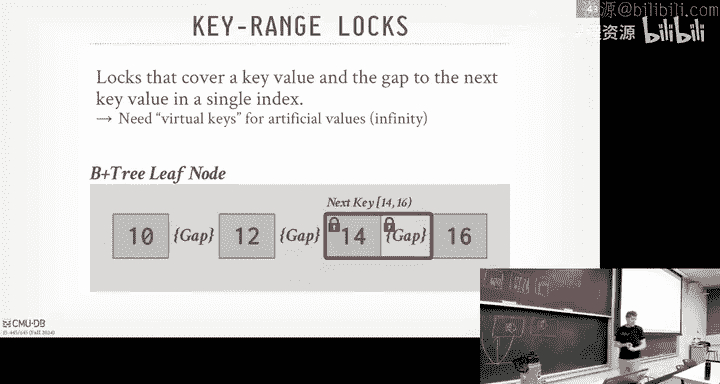
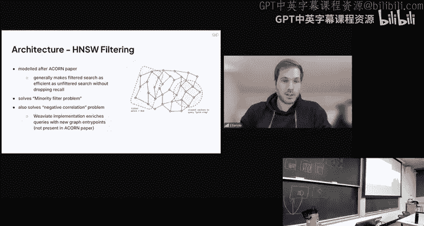

# CMU《数据库导论｜Intro to Database Systems (15-445645 - Fall 2024)》中英字幕（deepseek翻译 - P19：#18 - Optimistic Concurrency Control ✸ Weaviate Database Talk.zh_en - GPT中英字幕课程资源 - BV1Tys8eQELW

Yeah。い？🎼OfficialToday we're going to continue our discussion on optimistic andcur Jo or protocols recall from last class we spent time talking about two base locking and that was the first。

Right， so yeah， last class we talked about two is locking right and that was a concurgory protocol we would implement in our database system that would generate complex verizable schedules for us without having to know what queries the transactions were going to execute ahead of time or what operations they're going to do。

 what objects they were going to touch ahead of time。😊，Right。

 and so the way to think about today is locking， it's a what we'll call pessimistic protocol。

 meaning I the database system is going to assume that transactions are going to conflict。

 So therefore， it requires you to get the locks for the things you want to touch before you're allowed to touch them。

Right。But。It may be the case in some workloads and in some environments。

 in some databases that conflicts are actually rare。😡，Right， and furthermore。

 that most transactions are pretty short lived。 Most transactions are like， jump in。

 begin the transaction。Read and write a few number things and then commit and you're done or write read and write a few things and you're done。

 Like we're talking maybe the orders of milliseconds at the most of seconds。 yes。

 there are transactions that can run for minutes， days and hours， worst case scenario weeks， right。

 But those， those are rare。 Most transactions are in and out。 think like you loading a web page。

 That's a transaction。 That's pretty fast。So therefore。

 if we assume that conflicts can be rare and we assume that transaction be shortlived。

 then it may not be a good idea to always require them or always require transactions to acquire locks before they start running。

 because if I don't think you're going to conflict， why acquire locks？

So a better protocol might be try to optimize the system for the no conflict case。

 where transactionsact aren't going to try to touch the same thing or modify the same thing。😡。

And therefore， we， we can speed things up。 And we'll have to check at the end to whether that assumption was correct or not。

 Like when a transaction commits to see whether it actually violated serializable ordering。

 But at least now when they run， they can run as without having to take a headweight lock in the lock manager like we talked about last time。

So the way we're going to do this is through what's called timestamp or protocols。Again。

 there's basically not basically。 there are two categories of concurture protocols。

 There's the pex of ones that use locking， and then there's these optimistic ones。

 and the backbone for how they work is typically done through timestamps。

So now what's going to happen is the database system is going to assign timestamps to transactions。

And it's going to use that to determine the， the， the order in which they are allowed to commit。

And because we， if we order the the the time stamps in a correct way or they assign the timetamps to the transactions allowed them commit in a certain way。

 then we can guarantee that we generate schedules in our system that are equivalent to a serial schedule or conflict thatiz schedule。

 right。So the way this is going to work is now timestamps are going to permeate all throughout the system。

 meaning we're going to assign timestamps to transactions。

And we're also going to assign timestamps to objects in our database。😡。

Meaning like for every single tuple， for example， we'll have a timestamp that corresponds to the last time a transaction accessed or modified or did something with it。

RightRemember I said there was that in the very beginning of the class of semester。

 we were talking about the layout of pages and tus， right。

 we said every page had a header about keeping track of like the slot array and so forth。

 and then every tuple had a header include things like null bit maps or what you know what attributes are null。

 all we also can store timestamps in that header。Keep track of like。

 what was the timetamp of the transaction that created this object or last updated them。Right。

So now these timestamps are may not necessarily be a actual physical wall clock timest， like 2，0。

5 over there。But it's going to be some integer that's going to be a proxy for some ordering of the transactions that we want to occur。

😡，Right。Typically， you know， best case scenarios you do 64 bit timestamps。

 some systems like Postgres use 3 32 B， right。So now what we're going to say is that for a given transaction TI。

 we're going to sign it a unique fixed timestamp that is always monotonically increasing in value。

 meaning like we can't have timestamps go up in time and then magically jump back in time。Again。

 Postgs has this problem because they use 32 bit integers for timestamps。

 So they if you run a lot of transactions， you're going to have the wraparound problem and we'll see how to handle that next class。

But in general， like the time times are always going forward in time。

 And the reason why you don't want to use wall clock time unless you peg it to UTC is because because of what we had over the weekend。

 like daylight savings， now time can start moving back and forth。

 now your transactions are moving back and forth in time。

 which may probably which you don't want to happen。Right。Alright。

 so there's will be some part of the system that can allocate timestamps to a transaction。

 I'm not saying when they're getting assigned yet。 And I also I'm not saying how many timestamps you get。

Just assume that we can do that。Today's class will assume that there's one time stamp purchase。

 next class， and we can actually see these in Postgres。 you may get two times stampamps。

So the way we to implement this， as I said， you can use the wall clock time。

 you can ask your local CPU like what' what's the current time。 Again， if you make it UTC。

 you don't worry about daylight savings。 Of course， the problem is the clock drift。 that's hard。

 And then depending on the grandear later clock。 if can only measure things in milliseconds。

 I could have two transaction show up but exactly a millisecond。

 I'm not we have to wait a millisecond。 If I can give a new timetamp。

Another approach is geological counter。Just again， had a 64 bit integer add one to it。

 do compare and swap real fast。 it's add one over and over again for every time a new transaction shows up。

That's going to be really fast。We're not talking about distributed databases yet。

 but that's me a problem when we go to the distributed database world because if you have a counter and another server has a counter and they're both adding one to it。

 how do I keep those globally unique？So we've got to deal with that。

Typically the best approach is gonna to be a hybrid of these two right We'll see spanner later on。

 They actually do wall clock time and lockeddown counters sorry， they do wall clock time。

 but they're doing atomic clocks in every single rack or in the data center and GPS satellites or GPS receivers on the roof。

 so they can guarantee you across know across the world， all their clocks are in sync。

 which is amazing。😊，But most of them don't work like that。Okay。

 the main thing here is I assume that there' be some integer that's going to correspond to the timestamp of a transaction。

 how we get it doesn't matter， but it always has to be marching forward in time。

And we won't wear wrap wraparound。So today， we're going be spending most of our time talking about the optimistic andcur protocol。

 Now， this part is confusing because。The category of protocols we're talking about today are the optimistic category。

 as opposed to two phase locking with the pesimistic category。

 but the main protocol that everyone uses in the optimistic con protocol category is called optimistic current control。

OCC。Just know， keep that in mind that there's a category of optimistic conial protocols of which。

The optimistic cr protocol is the main one。Then we'll deal with more anomalies that we didn't cover last time。

 how call phantoms， then we'll talk about isolation levels。

 how to actually relax the requirement for all this stuff we have to do to maintain serialeriz for transactions and then we'll finish up with the flash talk from the WviA guys。

Allright， so that does the thing The， the main optimistic protocol that everyone would use is called OCC or the cur protocol。

 And there is a timestamp ordering based cur protocol where。😊，When transactions start。

 the database system is going to create what we'll call a private workspace for them。

And anytime they read anything or write anything， the reads will always get copied into this private workspace and any rights they make will also be in this private workspace that is unique to that transaction and no other transaction can look into that private workspace while they're running。

😡，So it means anytime I do a write， I don't acquire the lock on the global database。

 the global Tupple， I make a copy of that tuple in my private workspace， then update that。😡。

And I don't need locks to do that。Then now when when transaction commits。

Now you get to go look in your private workspace and compare the private workspace with other transactions or the global database。

 the global state， to see whether there were any conflicts that occurred。😡。

Since the transaction started running。And again， the idea is that these times temps are going to tell us the order in which you know。

 these transactions are allowed to make these changes， and we'll use them。

 use those to determine whether we're violating the serializ about ordering。

So now if there's no conflicts， then we're allowed to then imply our changes that are in the private workspace for our transaction and update the global database。

 now everyone else can see our changes that we've made because we've committed。

So two bay locking we last class that was invented in 1976 at IBM。

 OCC here is actually invented in 1981 here at CM MU。😊，By professorfess H。 T Kung。

 he's no longer here。 He got stolen by Harvard to fix their CS department back in the early 90s。

 Well so the Harvard CS Department was famously very。Old school， like in the， in the 80s。

 like they were applying the sort of their tenure policy， as they would for like other。

Signence field at Harvard， like biology and so forth。 And therefore。

 the tenure case was the they they expect you to write a bunch of journal papers。

 There was this guy Philil Bernstein who who meant a lot of stuff we're talking about in in terms of transactions。

 He was like the Daviss professor there。 He meant all this concurrenency of protocol stuff。

But then he wrote conference papers and said of journals。 And they're like。

 what's a conference paper。 We don't know what it is， right。

 So they denied him famously denied him tenure。 and their C department was a wreck。 And they， they。

 they took H T Kung from a CMU to go fix it。嗯。And so so it's gotten better over the years。

 But anyway， but he， he was actually not a database person。 He was a networking person。And I。

 I met him you， many years ago， and he was a really nice guy。Alright， so how do OCC work。

 So OCC is may broken up the three phases。 And again， the， the authors aren't database people。

 So this， the terminology， what these phases are might be kind of confusing。

 But we're just going go with what the textbook says and what the， the Vi paper says。

So in the first phase， they're going to call this the read phase。😡。

Where transactions actually can read and write to the database。But again。

 any time you read and write something， you're copying it from the you're copying it from the global state。

 the global database that everyone else can read from into your private workspace。

 any subsequent reads that you make when objects you've already copied in the private workspace。

 you read the private workspace copy of it。So this guarantees that you have repeatable reads。

 which is one of the anomalies we want to avoid。And then now once the transaction says I want to go ahead and commit。

 you automatically switch into the validation phase。 and this is where you go。 sorry。

 This is where the the data system has to go。Assign you a times stampamp for your transaction。

 So they don't get timestamps when they show up。 They get timestamps only when they go ahead and try to commit。

And then it's going to check to see whether it conflicts with other transactions。

And there other transactions could either be things that that have already have completed in the past。

 or actually running right now。 And we'll see the two directions you could do。

So then if you pass the validation phase。Then you let us go into the right phase and that's where you can then apply all the changes that you made to the global database and then there's be this right timetamp we're going to have for every single tuple to keep track of what was the last transaction that wrote to a Tple and we're going go ahead and update that right timestamp in the global database to be the transaction that we were assigned to or sorry the timestamp we were assigned to in the second phase。

Yes， when you say like private workspace， do you mean like a separate space on this or it something？

He says， what do I mean by a private wordspace， at this level we're talking today to assume that there's a memory space that we can read in my two that in practice would be backed by the buffer pool。

 but doesn't have to be and the protocol doesn't care then if like that buffer is large。

 that's going to take a lot of excessive memory。His statement is if that means if if the， if the。

 the， the workspace is large， if I update everything would that take a lot of memory， yes。

But it's worth。Is it worth to do it？Again， it depends like if， if you're。It's。Again。

 there's no free lunch like either I have to maintain a lock table。

 keep track of all the locks up acquire for a billion tuupples or make a copies of them into my private workspace for a billion tuples right we'll see next class and which you actually implementing in Project4 is you don't copy the entire tuple。

 you copy just the diF of the delta， the thing you modified So yes。

 if I have 10 attributes and only update one of them。

 then I can just copy that one attribute to my private workspace right。😡，Poscos doesn't do that。

 Postgs is basically doing what we're talking here。 They make copy the entire tool。

 No matter if you only update one thing or all things。

But they don't make copies of it when you do reads in the original protocol here。

 you're making copies in the reads if you want to guarantee repeatable reads。All right。

 so let's look at this looks like visually。First thing to point out is that now we have we're showing our database and we're showing as an object in a value。

 I think of an object as like the primary key or something， right。

 the unique identifier and has some value。 And then now we have this additional column。

 WTS which be the right timestamp。It's going be the timestamp of the transaction that lasts successfully wrote to this record or this object。

Now within our schedule also too， we have these labels that correspond to the phases we' be in when we run OCC。

 and again， like lock and unlock from last class， this is not something the application would explicitlyly would call。

 I'm just showing you the boundaries here to say like what phase are we in when we run the OCC for these transactions。

😡，All right， so in transaction T1 starts。And when we call began。

 we go ahead and allocate the private workspace。 again。

 assuming it's some space and memory that we we have clueclsive access to read and write to。

I would also point out， too that although we're not talking about im。

 this would have to be also threads safefe as well， because you could have multiple threads。

 execute queries them have to the same transaction， and they may all need to update this。

 this buffer space。 So just because I'm showing a one transaction。

 don't assume that this is not being protected with latches as well。

 we have to make sure that that's threads safe as well。All right， so T1 starts。

 we get a private workspace。 then we get the first first operations to do a read on a。 So again。

 what we're going to do is copy the object A from the global database down to a private workspace including again。

 including the right timestamp which corresponds to assuming there was some transaction with timestamp0 that inserted this record。

Now we have a context switch over to T2， T2 calls begin， it gets allocated a private workspace。😡。

Then it's called read， same thing， goes up to the global database。

 makes a copy of the record and puts into the pre boxeses。 And again， I'm not saying how I found a。

 assume there's an index， whatever it doesn't matter for this at this level of the protocol。Right。

 so then now it enters the it wants to go ahead and commit。 So say explicitly calls commit。

And then we enter this validation phase。 At this point here。

 this is when we can assign a timestamp to the transaction。

That is going to correspond to its commit order。So this important to point out here。

 T1 started before T2。😡，Right， but T2 is committing before T1。 therefore。

 T2 is going to have the timestamp of one， assuming counter going up。Right。

 so the arrival order doesn't correspond to the commit order of the timestamps anymore。

So then now we， we， in this case here， we would look at the， the read set， read write set of of T2。

 which is empty because we didn't。 We only read one thing and we didn't write anything。

And we'll tell you how we do evaluation in the second。 But。

 but since read only there are no conflicts， no problems。 So it's lot in the right face。

 it doesn't do anything。 right， We just， we just blow away， the private workspace。

But then now we switch back over here。To to T1， T1 does does the right on a。 So again。

 that will be modifying the the entry in the part of workspace。

 But now we set the right times stampamp to infinity because at this point。

 T1 doesn't have a timestamp because it hasn't started begin the commit process。

 So we just set the the right time stampamp to infinity And that's enough to keep track of that that you know。

 that's the value that we wrote。Then now when it does the read or A。

 it doesn't go to the global workspace or the global database。

 it just reads the same entry that it modified down here。😡。

And this guarantees now you have repeatable reads， I read the same thing that I wrote or read the same thing that I read earlier。

Now， when it goes ahead and enters the validation phase。

 now the data system allocates is at a timestamp， so time this transaction will get timestamp2。

We do the validation to check to see whether we conflict with any of other transactions。And again。

 T T2 is gone right， So there's no conflicts here。 So we'll now we get allowed to enter the right phase at which point we'lls overwrite the infinity timestamp with the timestamp we were allocated。

 and then we go ahead and install the change up above。So again。

 think about the order in which things got committed。Right， so even though again。

 T2 arrived before T1， T 1， red A。That was allowed to happen， right。 And this guy writes a。

That was also a lot to happen， too， because。If you think of like in the order in which these transactions are actually getting committed。

Even though T2 started after T1， the end state of the database is as if T2 started before T1。😡，Right。

We do the same thing in two phase lock as well。 right， So if if T1 took took a shared lock on A。

 T2 got the share lock on A， Those are compatible。 that they can both get that。

 T2 goes ahead and commits， then T1 escalates upgrades the lock to a right exclusive lock you know。

 this would work just fine too。Alright， so again， the read phase is pretty straightforward。

 Like I said。 All you have to do is just track all the the。

 the read write sets for every transaction and store the changes in the private workspace。

 If you want to guarantee repeatable reads， you have to make a copy of anything you read and put in the private workspace。

😊，If you don't care about rehetal reads， then you don't have to do that。Right。

We're going to ignore now what happens with we update。

If we update records that have tuples because now sorry it has indexes because now the question would be okay。

 how do I find my indexes pointing to the the global database。

 How do I also know to also look in my private workspace。You know， would。

 you basically to do an extra check to see， I know。

 I know with the record I D of the thing I should be looking at through the index。

 do I have that my readwrite set in my cardspace， yes。Can we go back toYes。

Let's say T2 was reading A and then。Writing。Let's say， A was。Yes。So T1 would read it。

So a is equal to1 for T1。人机注。1。Let's say it's incrementalcr。Right2。But then， T1。I still think。

A is equal to one and also increment。So your question is。

 what if T2 did a read on A file by write on A？Doest matter。 again。

 we just see reasons why we don't care what you're actually doing， right？ So what。

 what would happen here。So we'll get that on a second。

 the evaluation phase when this guy goes to validate。We'll see this the next slide。

 There's two ways you could look at to see whether I have conflicts。

 You could look it forward in time or back in time。So。This behavior is only because we don't write。

That they're allowed to commit。 I mean this， for this simple example。

 it doesn't matter the validation step doesn't matter when're going back in time a4 to time， right。

 if， if you add a right over here， then when this guy goes to validate。You know。

 either this guy could abor or this guy could abort depending how we're doing validation。 Next slide。

Yes， so what do you mean by repeatable。Repeated ream， this means that like if I read。

 he reads a up here， this guy reads a and sees the value going back， sees 1，2，3。

 If I immediately read it again， do I get 1，2，3。会。His question is。

 are there systems that don't guarantee repeat or reads， yes？我。En of this lecture， you'll see why。

Please say it' Postgress。Pcra will give you gives you re committedm。

 There's isolation levels that tell you how。What anomalies you could incur？But again。

 they could occur。 don't mean there will。 All right， So let me。

 let me follow up with what he was asking like， okay， if you throw some rights in here， what happens。

 Well again， this is， this is going to depend on what the validation phase is。So again。

 when we hit the validation phase， basically when they call commit。

 the data system can then figure out， okay， are you allowed to commit and in what order should I expect to to commit you。

 So the original algorithm， and what we'll talk about here today is keep it simple。

 We'll do serial validation， meaning only one transaction can check to see whether it's allowed allowed to commit through the validation phase。

If you want to allow parallel validation， it's a little more extra work because now you gotta。

 you have to have transactions to look in the rerite head of other transactions at the same time。

 and you have to maintain  latches and make sometimes you want to order things a certain way to avoid deadlocks。

 Like we let's keep it simple。 just keep it zero threaded。So again。

 the goal of the validation phase is to figure out whether their transactions allowed to commit so that we can guarantee that we only allow for serializable schedules。

And the two approaches are going to be in what order do I look for conflicts。

 Do I look back in time to see whether transactions that haveve already committed and I missed my transaction missed their updates。

 or I look forward in time， meaning I'm making changes that I know other transactions in the future。

😡，Again， think logical time in the future that they， they should have saw saw， but did not。So again。

 to keep it real simple for validation is checking whether committing transaction intersects its readrite set with any active transactions that are still running。

 but not have committed。 And again， we， meaning they haven't entered that validation phase。

And then backward validation is going back to see。Are there transactions that made changes that I should have seen。

 but I didn't。And therefore， if I am allowed to commit。

 then I would have violated that serializable order because then now either my entire transaction or part of my transaction is magically going back in time to a state of the database that existed before I was existed when I started running that I shouldn't be able to see because these other guys have already committed and they've already told the outside world they've installed that state。

So we're gonna do just forward validation。 But it's， it's。

 I think one of the homework assignment is they ask you going backwards。 But。

 the logic basically works the same way。 It is in what direction you， you're looking at。

So with four validation， we're gonna assign a timestamp to every transaction with the empty validation phase。

And then if our our transaction is。Is going to commit。

 Then there's one of the following three conditions have to hold for every other transaction that is running at the same time。

So basically， when， when your transaction commits under forward validation， you know what。

 the system knows what other transactions are are active。And you go look in there。

 rewrite says their private workspaces and see what work they've done。And then for each transaction。

 as long as one of these three cases is true， then you're not conflicting with that particular transaction。

 and if you don't conflict with all possible active transactions，Then you're allowed to commit。

All right， so the first case here is pretty obvious。😡，If my transaction say I'm T1。

 I want to go ahead and commit if T1 completes its right phase。

Before I even start completing my read phase。 So I say T 2 wants to commit here。

 T 1 is already committed。So sorry T 1 wants to commit T 2 is。

 is going to start running in the future。 But in this case here。

 if T1 has completed the right phase before T 2 has even started， then that's this。

 that's the same thing as serial order。RightAgain， if my transaction is going to commit today and your transaction is going to start tomorrow。

Like， I don't know about you。 can't know about you。 So therefore， we can never conflict。Right。Now。

 this means because there may be some transactions。😡，Like if I move this begin to the top。

 say two transactions show at the same time， but one of the he started running at all。

They haven't done anything。 They haven't read anything， haven't written anything。

 I can't con of them。 So its， it's it's trivial to do。The next case would be if。T 1。

 my first transaction completes its right phase before T2 starts its right phase。

 meaning it's still running。 It still could be doing reason rights on on the database。

 And T 1 is not modified any object that's read by T 2。Then I know there isn't a conflict。

 and it's safe for T1 to commit。More simply simply to think about it is I had the right set of my first transaction T 1。

 If the intersection of my right set with the resetet of， of another transaction is the null set。

Then you didn't read anything that I， You didn't read anything that I wrote。 So therefore。

 we can't conflict。If our readsets intersect， who cares， That's fine， right， There's a commutative。

But if I write to something that you should have that you read。

Which should not have happened because I haven't。I sorry， if Ive write to something that you've。

 you've read， but you've physically read it in the past， but logically。

 you should have read it in the future。Then were violating that timestamp ordering。So again。

 let's look same here。 So T1 starts， we can begin， right， so we create the workspace。

 Then the first thing it does is as the read on A。 So again we just copy that into our private workspace。

 No big deal was saw that before。😊，Now I do the right on A， and again。

 I install that update to a in my private workspace， and I set time the right timestamp to infinity。

Now there's a context switch。T 2 starts running。 A calls begin。

 The system allocates its private workspace。And then the first operation is do a read or A。Again。

 so it's getting the copy from the global database that was createdd at timestamp 0。 right。

 doesn't know anything about this other transaction running here。 So you can't see that right yet。

Now I enter the validate phase for T1。And at this point here。

 because the right set of T1 intersects with the resetet of T2。

 then we can' allow T1 to commit because again， think about what would happen if I allow T1 to commit here。

 it's going to get timestamp 1 so the state of the database is now at timestamp 1。😡。

But when T2 goes to commit， it's going to get timestamp 2。

 meaning it should have solved the state of the database at timestamp 2。

But it really saw it at timestamp，0。So it read something back in time that it shouldn't have seen。

So therefore， this is a conflict。 and we can't allow this。 We can't allow T1 to commit。

So in forward validation， we're killing ourselves because we are actually in either one you're always killing yourself。

 the determinations is whether are other people going to miss changes that my transaction made or did I miss changes from other people's transactions？

😡，And so forward validation is making sure that other people don't miss your changes。

So I just change it up like this。 So T1 now does the begins， does the read on A， that's fine。

 Does the write on A sorry， does the read A。 and then there's a context which T2 starts。

T1 does that right。T2 does the read。Now， T2 enters its validation phase before T1 does。So。

Under the first case， T 2's right set cannot have any intersections with the， the reset of， of。Of T1。

 in this case here， it didn't write anything only red A。😡，Right。

 so it read the version of a that existed logically at timestamp 0。So that's fine。 We we。

 it's committing before T1 finishes。 So it's allowed to go ahead and complete its validation。 Now。

 there's a constant switch back over to T1。 Now T1 goes to this validation phase。😊，Right。

 and we know it's safe to commit because T2 has completed its validation。 It got timestamp1。

I'm going to commit。Now， T T1 is going to commit。 It's going to get timestamp 2。

Both T1 and T2 read the version of a at timestamp 0。😡。

Which was the latest version for the most recent version for both of them， the most recent timetamp。

So logically， the read of done by T 2 on object A occurred logically before the read on。A by T 1。

 And then the right on a by T 1 happened after that in time。Even though physically it occurred。

Before it。again， there's like these two notions of time going on。

 There's like the time in which things physically happen and a time in which the data is enforcing that they happen logically。

Does this clear？Yes。😊，During that don。the垃圾。The transaction。Otherwise， they can might concurrently。

We don't right。His question is in the validation phase。

How am I protecting the transactions from each other？Right， so I'm saying keep， to keep it simple。

 assume there's a global latch in or in the entire system that says the validation latch and only one transaction is allowed to have that at a time。

 So only one transaction can can validate。In practice， you obviously that that would be a bottleneck。

 right？ So， yes， you， you， you protect these data structures with latches and make sure like you're reading them they're writing for them at the same time。

 There's other tricks you can do like。If you。Make sure that you only。

 if you examine the objects in lexographical order， meaning like ABC in that order。

 And then everyone follows the same order， then you don't worry about like deadlocks。

 like I'm trying to acquire a lat thing you have you trying to latch。

 Everyone goes and locks up in the same order。 of like we talked to face locking and go to the hierarchy or the plus everyone going in the same direction that avoids that problem。

 But yes， you would would have to protect each other during this period。Alright。

 so the last case is basically the， the extended version of case 1 or sorry case 2。

 where my transaction committing， T T1 is committing。And I need to make sure that my。

 my right set doesn't intersect with the reset up or the other transaction。

 And then my reset also doesn't intersect。 Sorry， my right set doesn't intersect with their right set。

So going back here now。If now I do， in this， say prior to this， I've already set up the database。

 So T 1， read A and wrote to a T 2， red B and wrote red， sorry， red B and red A。

But now if I that validate step here， it hasn't read a yet。

 and I don't know whether it's going to read A because again， I don't know the queries ahead of time。

 So in this case here， there's no intersection between the right set of a right set of T1 with the read right set of T2。

 So therefore it's safe to go ahead and commit this。😡。

RightWe can go ahead and it and give it a timestamp So we update the private workspace and set the timestamp to one。

 and then that gets applied up up here。And then later on now， when T2 reads a。

They will then see the new version that T1 installed。And again， that's okay。Becauseuse now， again。

 the， the time tempamps are moving in the crap order over time。 So。

 so when it goes invalid validates， it'll get timestamp T 2。 sorry， sorry， timestamp 2。

So the way they're going to think about forward validation is that。

 say this transaction in the middle here is going to commit in。

In the sort the physical time in which the transaction is committing。

 the scope and what we need to examine is since the beginning of our transaction。

 and then we have to look at the readwrite set of all the transactions that are still running at the moment that we're committing。

Or that the moment that we're in the， we're in the validation step。

So you don't care about what transactions ran in the past。

 because they've already committed who cares， right， that was case 1 we talked about。

Backward validation is the opposite。 Backward validation says that assuming T2 is 1 I1 to commit here。

IThat I don't care about any active transactions。That is still running。

 I only care about going back in time for recently committed transactions。

And check and you see whether they wrote something that I should have seen。

 but I didn't because the change that they made was in a private workspace。

 like if T1 made a change made a change like to an object say T2 reads A here， T1 writes to a here。

 it's in his private workspace。 and then when it gets committed。

 then it gets applied to the global database。 and therefore T2 missed it。

So I got to check to see did someone write to something I should have seen if I was running in serial order。

 but I didn't。Yes。Itter。Which transaction to。His question is how do you determine which transaction to look at so you go backwards？

So you， you would have to。basically you know what objects you read and wrote。

 so you go look to see in the database is the right timestamp greater than the timestamp that I saw when I brought it back in。

 when I brought it into my private workspace。😡，Right， and again， in， in the backward validation。

 I don't need to look forward in time because if this transaction now commits。

 it's going to do the same thing。 It's gonna to look back in time to see what it missed。Right。

 so you don't need to go in both directions。 You， you just have everyone go in the same direction。

 And that guarantees you won't miss anything。Yes。This validation。In cases that have to be atomic。

This one here。 Yeah， if the validation for T1， that succeeds。T hasn't read A yet。

 but if the right happened later on after like this thing？Yeah， like yes， yes。Yeah the。

 the algorithm specifies it separate of phases。 But like， you'd have to。

Without bringing it and locks， you could。You， you could have a way to post and say， hey， guess what。

 I I'm validated。 I'm about to update these things。

 Make sure you you get the latest version that I'm about to put in。 right That's one way to do it。

 or you just go just put right in。Yes。I there that's his question is between forward and backwards。

 it's one better than another。They're basically same。Everyone looks like more。

It question is one one more company used than the other。 Actually， that 1 I don't know the answer to。

Yeah， most systems are going to do2PL or2PL with multi versioning。😡。

Next class we'll talk about multiverrgging， basically it's going to be almost the exact same thing here。

 except now there isn' in a private workspace， the virgins end up in the global workspace。

 but then you use timestamps to figure out what virgs you'd be seeing。😡，But you can。

 you can still use， It's complicated。 You can still use locks or you can do two v locking or OCC with multi versioning。

And so， it me。哎。There's other considerations。 There's， this say。

 There's other things you you have to worry about of how you're gonna do multi versioning that are gonna matter more whether than you're going backwards or forwards。

 And what that'll be next class。Yes， so is it possible to record the timest。His question is。

 is it possible to to assign the timestamp at the beginning of the transaction rather than at the valuation。

The problem about is you。If you did that， then you need to make sure that no one violates that。

 and I would say it would open up less opportunities for you get less parallel that way because you're basically then defining a serial order。

😡，Becauseuse it look so if I sign a timestamp when I start。Let me go back here to this one here。

Right， because this one got the lower time stampamp than the other one。 So this guy starts。

 I give him T 1。 So T 1 gets timestamp 1。 T 2 gets timestamp 2。Then I need， I need to make sure that。

嗯。When I go to commit。I did I， did I see what I should have seen at。Times M 2。Right。

But then in case of OCC， I don't know about this right over here because that's in the private workspace。

And depending when I we' back with validation， if you're doing forward validation。

 you could see that。And in that case， you would then have to abort because I showed have red。

I should have read the database， at timestamp 1。Becauseuse that's that's this guy I made that change。

 but I didn't。 I read it at timestamp 0。 that would not be conflict orizable。 and I have to abort。O。

So let the cover of let me jump through this。This is asking what he was saying about how to do serial versus parallel commits。

 So in practice， OCC works well when the number of confidence is low。

 like if your database is huge and your access pattern for your transactions is uniform。

 meaning I have a billion tus and at given time， transaction two transactions are not touching the same twople。

 then this is me fantastic be really fast。 If all your transactions will read only even faster because you're not taking shared logs。

😊，RightAnd then you can do what we'll see next class on multi virgging。

 You actually only make a private workspace。Right， if everything's read only。But， of course。

 it's gonna have like。Not all， you know， not all workloads are going to look like that。 And so。

We made a big deal about how going getting to the locks and the lock table was very expensive in two days locking。

 Well， over the overhead copying that tube workspace is expensive。Again。

 we can mitigate that by taking Dltas， but still it'， it's copying memory。 and that sucks。

There's the right phase， the validation of the right phase are going to be bottle access you said before。

 because now I've got to take latches to protect data structures as applyinging those changes。

Furthermore， the cost of an importoring a transaction is way more expensive in OCC than 2 PL。

 because in 2 P， I can't divide a touch of billion things。And I can't get locked for the first one。

Then， and I abort。 then I really didn't waste anything。 But in OCC， I would do all， you know。

 update all the 1 billion things。 then go ahead and commit。

 only to find out that the first thing I tried to modify。

 I wouldn't have gotten the lock for it anyway。 and therefore I had to roll back everything。

You have to run transaction to its entirety。Just to find out whether it's actually going to be successful or not。

And the extreme cases is if you have like everybody's updating the exact same tuple。Right。

 then there's no difference between 2 P L N OCC just just generates to single thread executionion。

And no protocol is going to be better。But in practice， again， depends， depends on the。

 depends on the work club。Okay， so。For OCC and2， when we talked about it。

 we made this big assumption that the。The database is going be fixed size。

 meaning the transactions are only going be able to read things that already exist or update things already exist。

But obviously， in a real database system， we have to support inserts and deletes and updates。

And so when we now allow the size of the data to be dynamic。

 this is going to introduce additional problems that OCC and2PO by themselves aren't going to be able to handle。

So， let's look at an example Now。 We're actually running SQL queries instead of just read and update operations。

So the first transaction wants to count the number of people in records on the people table where their status is lit。

And so to do that twice， but T2 is going to insert a new entry。Into that table。 So T1 starts。

 it runs this query。 It gets count equals 99。 Now， we have context switch to T2。 It doesn't insert。

 That's fine。 That's lot to happen。Right。Then I come back over here， and I run the same query again。

 and now I get count 100。So it's， you know， it's， it's like the unreatable read where Ive read。

He ran the same query。 I'm getting back different results。

 which should not happen again if I was running under serial ordering or serialli execution。

I shouldn't see that because it should be。 I run T 1 first。 I run the two queries。

 get the exact same value。 And then T2 is allowed do the insert。喂。So what's going on here？In。

 in two phase locking， this wouldn't work。 We couldn't We couldn't prevent this because the record that caused our query to produce incorrect results。

 the second time you run it。It didn't exist the first time we ran the query。

So we can't lock something that doesn't exist because we don't know right。

 We don't know what to lock because it doesn't exist。So。Onor today's locking N OCC。

 this is only going to work。 again， the basic version of these protocols only work if the objects are fixed。

This particular problem is called a Phantom read。And the idea basically。

 is that if I scan a range of in a table。A range of values。Multiple times in my transaction。

And in between one scan and another scan， another transaction inserts or deletes。An object。Then。We。

 we， we end up with inconsistent results。Right。Like it's it's called a fan thing of like a ghost or an apparition like data is magically disappearing。

 appearing and disappearing in a way that we shouldn't see if we're running a true serial ordering。

All right， so there are ways to handle this。In most obvious ways is just。In two days locking。

 you just lock everything， lock the entire table， lock the entire database。

 lock every single page in a table， Then no one can update anything and sort of delete anything。

 right， Of course， that's gonna suck。 That's gonna be be bad for parallelism。

So the alternative approaches。Will be， we'll go through these one by one。

 just re execute every scan you had when you go to commit and see whether get the same result。

 And that will tell you whether somebody has， has slipped in and something before you ran last time。

Petdit locks will actually actually look at the logical conflict between different operations or different queries and decide whether there's a conflict that could produce a phantom。

And then index locking will be relying on indexes themselves to actually protect ranges of things。

So this is going to get kind of weird now because this is now we're bringing in the physical aspects of the data structures。

呃。To help with logical things in our database。So in practice。The most common one。

 especially in the enterprise systems， is going to be index locking。

It's less common to you lock everything。 And again。

 this is something you can explicitly do in in in your application。

 like lock the whole table because if you want to avoid any any phantoms。

 doing the executing the scan multiple times， that's rare。 Predicate locking is very， very rare。

There's only three systems that do it。And three of those systems were written by one guy。

He needs German。Okay。So it reacts to scans， also I say this is probably more common in memory systems where scans are cheaper and the data isn't like petabytes and petabytes。

😡，ButThe basic idea is that you just track the where callss at every single query that you run。

And if you notice that the。If you notice that， check the where calls are every single  query you run。

😡，And then now when your transaction goes is commit。

In addition to doing the validation phase if you're doing OCC or whatever two phase lock in protocol you're doing。

 you just。Rerun the scan portion of those queries。To see whether there's any new new new results。

Right， so if I have an update query has a where clause。

 I want to make sure I update all all the all these records。

 I don't want to run the update again when I commit。

 I just run the where clause and see whether I'm seeing different result sets。Questionless。

During the react。And they out position。All， his question is。When I do the react scan。

 if I see new tus I't see before， then I abort。Because I know I I'm incurring a phom。 mean。

 mean when you are doing the execution， if other transaction to insertion and decision。Right， so。

 so if other people so。We're saying the same thing。 If I run this， the scan query again。

 when I go to commit。And other people insert things I'm。

 when I'm running that scan query or before I ran that scan query。

 I'll see different things than when I ran it the first time。 Therefore。

 I know if a phantom occurred。So therefore， I conflict。Again。

 you only want to do this if you can run the scan fast， if it's like in memory or a small data set。

 if I had to rescan a petabyte of data， you don't want to do that。

You'll see sometimes the reverse of this and in some systems like dynoDB and Phononic Db can do this。

 they call reconnaissance transactions。 Basically， you run you run all the queries first。

Just to see what they read and write， but don't actually make any changes。

 then when you go to commit， run it for real and see whether actually that they match and then go apply the changes and roll back it if you don't。

😡，It's the reverse of it。Predicate locking is， is， again。

 sort this logical locking scheme where you look to see whether there's conflict over a multimental space of the locks that transactions want to hold。

 This is actually what system R first proposed， know， back in IBM in the 1970s。

 But then they deemed it like too impractical to actually implement efficiently。

And there's real known attempts to actually do this real。

 except for approximations using a technique from the 1980s called precision locking。

And this was was first adopted by the Germans in hyper。嗯。😊，And then Duck D B copied what they did。

 And then the guy that he sold hyper to Tableau。 So then he built a new system umbbra and then got forked off by Cedar Cedar DB。

 So the one dude found this paper from like 1981 that had like 20 citations。

 no one ever read that solved this problem doesn't solve it entirely。

 some corner cases but it's good an approximation。And then very few systems do this。

 or it's only those four I know about。All right， so what are the basic ideas so again。

 say for our scan query we have that transaction T1。

 you can think of again in the multidimenional space。

 there there's some bounded region that corresponds to the tuples that could exist within this region specified by this wear clauses。

😡，And so we would have a logical lock on that multimenal space and then now we all have to do is check to see for any other query。

 is there an intersection between its multimenal space and this space and therefore if they overlap。

 this is just a two dimensional projection， but if they overlap or intersect。

 then I know that they're logically touching the same tuples and therefore that could violate the serialeriz ordering。

😡，Again， think of you having like， you know。I'm showing you two dimensions here and two transactions。

 but think of 100 thousands of transactions， all sorts of crazy queries。

 it becomes very expensive to do this， and that's why it's not practical。Right in general。

 to get to do this correctly like and its full entire， it would be empty complete。All right。

 so what do people actually do instead。Well， again， we're going to rely on indexes。

 assuming B plus trees。To use them to keep track of locks on ranges of values。

So that we just check to see whether there are conflicts now between。You know， those ranges。

So we're to sort of of build up and go through sort of the basics of it。

 and we'll see how we do this and incorporate it back into a haal locking scheme。 So again。

 these locks， these index locks gonna be basically the same thing as as the tuple locks we saw last class。

 This why saying I was distracting away whether we're talking what the objects actually are。

 But you could assume they were tuples。 But now they could actually be。

Things inside of the inside of your B plus。So the most simple kind of lock you can have is a key value lock。

 And this is sort of saying that within a specific value in my in the logical space of some attribute。

 I'm acquiring a lock on that。 So now my lock manager。

 I would keep track of like for this given value within this range of of this B plus3 there's a lock for it。

 14 to 14 inclusive。You can have then also what are called gap locks， where。

You can keep track of the space in between the values within your index。

 and then now you can take locks on the empty space in between them。

So I can take a gap lock on 14 to 16 exclusive。Right， so now， if anybody tries to insert 15。

RightThat that would conflict with this gap lock。 and the transaction would be protected。

So then now you can combine these up into key range locks where you would have for a given key。

 you would get the lock on that key inclusive， and then the gap lock right next to it。

Right so I could have a next key range lock to say on 14 and then the gap up to it exclusive to 16。

And then again， I'm showing this in context of a single node， But obviously， if you， if you。

 you want your gap to spanm multiple or to the next node， you could do that as well。

I could have a prior key lock where it's the， it's the。The the the value 14。

 and then the gap that came before it。 And typically you go in one direction because you don't want to have weird。

 weird overlaps。So then now I can bring back all the hierical lock we talked about last time and start taking more coarse grain locks on larger portions of ranges。

And then within them， as sort of as I go down the hierarchy。

 I can have more fine grain locks that are more that the explicit locks that are more。

They're locking in in in exact modes or explicit modes。

 So I could take a a range lock from 10 inclusive up to the gap before 16。

 And I'll put that in intention exclusive mode。But then inside of that， I'll take the。

 the range lot from 14 to 16 exclusive。 and have that explicitly in， in exclusive mode。

Or I could take another， I could have another transaction come along and do an intention exclusiveive lock on the range。

 that's compatible with the intention exclusive。 That's fine。 But then within that。

 I have exclusive lock on a single key。😊，喂。So we' relying on the data structure itself to help us to identify the or demarcate where we want to be able to maintain locks or things。

😡，Alright， so I want to bang through weaker levels of isolation。

 and the bunch of demos I want to show you guys help like as you're running remote transactions。

 postcards on MysQql and things。 we'll do that。 do that next class because we want to jump to the Vvi talk。

😊，So。I made a big deal for the last three lectures about serializability。

 how this is the gold standard in transactions。 this is the best way to write your database system and best way to write French transactions。

The dirty seekkerers that in practice， most people aren't going to run with serialerli isolation。

But I wanted to teach that first to understand this is what you should be striving for。To understand。

 or at least have an understanding what it means to be running things in a correct order。

But then now we can start turning some of these things off。😡，And， and get better performance。

 if we deem it necessary。 And so by default， most data systems are not going run with serializable isolation。

 by turn by default。Instead there's going these lower forms。And we talk about distributed databases。

 we'll talk about weaker levels of consistency， how to keep maybe I don't need to have two nodes be exactly in sync。

 but again we'll worry about that at Thanksgiving。Alright。

 so an isolation level is going to specify in in the database system。 what anomalies a transaction。

Could potentially see。 doesn't guarantee it's gonna to see them because if I only want run transaction。

 I'm not gonna conflict with any other transaction because there is no other transaction。

But if in a highly current environment。If I run at a lower isolation level。

 I may end up seeing some of these anomalies。And the reason why you want to do this is because we do less。

 theism is doing less work to protect you from from these anomalies。

Then there's more opportunities for parallelism。 and you can get better performance。

In exchange for potentially having wrong results。Of course， the question is， all right。

 how wrong can it get？Nobody knows。It depends depends on， depends on so many different factors。

So if recall the fouromalies we talk about were dirty reads， unreedal reads。

 loss updates and fanner reads， there's a fifth one called Right Ske， we'll cover next class。

So in this sort of table here， you think going from the top to the bottom。

 the highest isolation level that in SQL you can get。

 at least to the SQL standard is for serializable， below that will be repeatable reads。

 and this is saying that it's all protections of serializable except phantom reads may occur。😡。

So you don't take the index locks or don't re executeute scans that we talked about。

Below that will be recommitted where you could have phantoms， you could have unreal reads。

 and you may have loss updates， and again， I'm underlying May because it depends on whether applications or other transactions could cause these problems and run at the same time。

😡，And the last one reader committed basic says you're driving up driving out your seat beltt。

 all of these things may happen。Right。So a simple table like this shows you that with serial li。

 you're protecting from everything。So how this actually implemented again we're talking about two days locking。

 if you want serialized isolation， you execute it with strong strict2PL。

With the faint protections mechanisms that we talked about before。

 either lock everything or recususe scans or do index locks。If we want repeat or reads。

 then we just do everything as we do strongt 2PL， but then we just turn off the index locks。😡。

With recommitted。We run Str to to BL， where we hold the right locks to the very end。 But we。

 we can actually release shared locks immediately。So what does re committedit mean means， again。

 like， if another transaction has successfully committed， I may end up reading them their results。

 So I may， in that mind mistake， my may re a。notice transaction right day and commits now everyday again。

 and I'm going to see the right because they're successfullyly committed。

And then read Un committed basically says。You know， you can do any of these things， yes。Why strict2O？

Instead of strong strict。 I mean， so though this is， this is strict to PO。

Strict basically says strict KPO is I。I hold the right locks at the end。

 but I can release share locks。😡，The Shalock， as soon as I'm done with something。

But he still can't buy these twoP， like I can't release locks and try to add them back。

Not' run to a lower level。So I'm gonna skip this we'll do next class about how to actually run this and turn these things on and off。

 You basically say when I want my transaction to run， what what isolation on what I want。 And again。

 that's specific to your transaction。 So another transaction might be running at the same time and run with serializable isolation。

 And you may see anomalies and they won't。😊，This is a quick survey， a bunch。

 a bunch of systems that are out there that showing their first column。

 their default isolation levels and their maximum that they have。

So they' meeting a point out right here for the top four relational data systems， SQL server， My SQL。

 oracle and Postgres。None of them default for all of them is never going to be serializable。Right。

Typicallym gonna be recommitted。 My Seco actually is repeat or read。

 So it has its default is a higher isolation level。In case Oracle。

 they have this thing called snapsa isolation for the maximum level。 That is what I've saying before。

 Oracle lies to you。 So if you say I want serializ isolation。 It says， okay， great。 here you go。

 But it's actually going to give you a weaker isolation level that we'll see next class。😊。

Cosap isolation。There are very few systems that run with serialloism a default。

 So VolTB is a system that I help build。 cockroach GB is an open source system， a distributed system。

 and then Ingresss was the precursor to Postgres， like before Postgress it was inGgresss。Right。

 and by default， these guys a serial of isolation。Spanners here from Google。

 And they have something called strict serializable。what is that？

So that's they can guarantee that the order that transactions arrive in the system is the order that they will commit。

Because they're doing what he was asking before， how can I assign timetance when they show up。

 and that's essentially what they're doing to guarantee that。 we'll cover this later。

DB2 has something else called cursor stability。Which we haven't talked about。 What is that？

And we'll cover this next time。 But the way to think about it is in a hierarchy like this。

 Reid Uncommitted is at the bottom bits he says you're driving up the seatbelt。

 any anomaly can occur。 recommitted is a little bit more protection。

 but now there's this weird two paths where we have cursor stability。

 repeatable reads and then snapation and go to the other path where this is basically saying there's some anomalies that concurren in sasa isolation that can occur in repeatable reads and anomalies occur in repeat reads that can occur in saa isolation。

Cursor stability basically says like， as my， as my cursor scanning a a table。

 I'll take a lock on the page。And then when I， when I'm done reading that page， I release that lock。

 So within the page， as I'm scanning it， nobody else can come and modify anything。So now。

 if you ask DBAs or people running database systems。

 what isolation level what they're actually running。So this is a survey we did a few years ago。

To SDDba is okay， for all these different isolation levels in your data system。

 what isolation level you're running at？And you can see that very few of them are running with serializable for most of their transactions。

 And instead， most of you are running with recommitted。I say guess why？B。

Is that better performance now？default， there you go。everybodybody else。

Most of you who don't know what it means to have serialerilizable transactions。 or if they do know。

 they're not worth， it's not worth paying the performance penalty for it。

 So they're going to run at a lower isolation level。And again， that might be okay。All right。

 so finish up。As I said， every single cr protocol that exists in the world is either going to be a pessimistic approach where you assume transactions are going to conflict。

 And therefore， you have some protection mechanism like locking to protect the objects before they're allowed to do anything to it。

Or it's an optimistic approach where you assume that they aren't going to conflict。

 but you still need a way to determine what， in what order should they， should they get。

 should they be allowed to commit， right， Even if I just take them the。

 the order based on they write the order I'm gonna allow them to commit is the order that they write in the system。

 That's essentially the same thing as as a timet。 because it's a counter saying your first。

 your second， your third。 It's the same thing。There is no other way to do concur protocol that I'm aware of as literature is aware of。

 and other than these two basic approaches， it's like the fundamentals of how you actually do concurrent programming。

I's based on these two methods。I had one guy come up to me at a talk I gave a talk somewhere。

 He's like， hey， man， like， I have a protocol that isn'tsimistic。 isn't notistic。

 It's completely different。 I'm like， sure go ahead and tell me， right， And and it was right。

 these only two things that you can do。And the。It sort of later to his question before。 Like。

 is one protocol better than another， It depends on many different factors。 It's different things。

 And itss hard to pick one。 There is in the academic literature。

 some techniques to adapt of protocols where like， if you don't have a lot of conflicts。

 it's OCC and maybe you notice more conflicts， then you dynamically switch into2 P L。

But as far as I know， no system implements that because just implementing one of them is so hard。

 So in a real system， like a postcard or MyQl， to have both them and make sure that theyre both correct is。

 is a big challenge。Alright， so next class， we're to talk multiversion control。

 and we can play we around with existing systems。 see how the isolation level affects things。

 But multi virgging is basically be the same thing weve talked about so far。

 except now in the private workspace， the virgin you keep track of or in the global workspace。 Okay。

 Any last question， Yes， Yeah， I one question about the index locking， Yes。

 how did that prevent phantom reads， Do you just take a lock in the entire。😊。

Index that not that they can't be updated before you read it again。His question is， how， how。

 how do these things protect from phantoms。 Yeah， Do I only take latches on the gaps not locks。

 not latches locks， right， So like I could take， so my example before， like， if I had a。

 where status equals lit， if I had an index on， on the status attribute， then I could take a， a。

 I could take a lock on。I can take a gap lock from here so say this is status equals lit into whatever the next status is。

And so I know that if anybody wants to come and get inserted。

 it would have to either be like within that gap or on me。 So therefore， I'm protected from that。

Alright， so this is Eane。 He is the CTTO and cofounder of Wevi8。

 It's one of these new vector index vector vector database that we've been talking about early in the semester。

 And so he's awesome。 Ethan， go for it。 The floor is yours。😊，Awesome， thank you。 Yeahy。

 Andy Papllos that I'm awesome。 Thank you for having me。

 I have a lot of content that I'm gonna gonna get started right away。

 like this is this edge just copy pasted this from our salest。

 This is really just to tell you like we have actual logos like people and companies that actually use Vviate。

 but really want to get into the architectures just skip over that before I can get into the architecture。

 you should probably know what it is that people do with V。

 and the most common use cases are on the one hand semantic search。

 So basically rather than searching by keyword lexical search exact matching。

 try to search by the meaning basically create vector embeddings with with large language models and then search through that meaning very common in ecommerce-merce。

 for example， the other thing that you've probably heard about is ragg retrievet block Men generation。

 and we see this a lot in these kind of ask AI use cases。 So you have like separate data sets。

 typically your own data and then you have like multiple data sets where everyone wants to chat with their own data like think of chat with your dropbox。

 your notion your whatever whatever。😊，Kind of data you have or your email email is also super。

 super common one。 Then another one's recommendations。

 which is something that we're just launching in beta。

 The ideas like recommendations need similarity search。

 but similarity search alone does not make for good recommendations you see these examples like hey you like this pepperoni pizza you're also going like this pepperoni pizza in this pepperoni pizza and they're all identical because the plain of similarity search is find the closest batch。

 So there's more to good recommendations， which is what we're trying to solve from an invent perspective。

 And then there's a new thing this is currently titled generative feedback loops is a bit of a working title and it's in alpha。

 but the ideas rather than rag which you just apply on the retrieval side can you actually write that back into the database's kind of this concept of the selfup database or maybe in the self-lear database where like you could say take everything that I have in my database translate it to Spanish and summarize it into 80 words max and just write it back into the database。

 which is kind of a cool concept。😊，For this next slide is architecture finally。

 but I think architecture follows business functions and those are represented in features here so he has a very opinionated list of a couple of features that I't want to highlight this is really a database centric kind of view on the features would probably look different depending on who we're talking to but I thought like these are the ones that you're probably most interested in。

 it starts with object and vector storage so something very， very simple。

 but the point here is you don't have to use a secondary system just to serve the end to end case with for the user wevaA does not just return like IDs from a search and then you look up what the ID means in a secondary system but it has it all in wevi which has its own challenges advanced filtering support So it's not just vector search。

 but you can set all kind of filters that you can set in any kind of search engine or Db system from simple equal to not equal filter to range filter so like find all products in a specific price range for。

in minority filters， which may not make sense in this context。 but will later when we talk about it。

 hybrid search， the idea of like combining traditional keywordbased search with vector search mash it together somehow。

 for example， using recipro code rank fusion， and is highly uptable。

 which I think is in the context of databases， you want to update it's a database。

 But for vector indexes this is actually kind of kind of challenging。

 And we have one reallife use case where we're doing 150 million vector updates per day in a single cluster。

 and that was kind of challenging to get there and then also kind of interesting to do that。

 wevi is distribute it。 So you have all the good things like replication sharding。

 you can offload certain things to cloud storage， which decouple sort the storage and the computer bit。

 and there is a lot of focus on performance。 So whether it's ind optimization。

 whether it's algorithmic optimizations or just good old dedicated indexes for specific types。

Which brings me to the architecture Ga， it starts with the object store。

 which is just it's really just the custom built LSM store。 So lock structure merge tree。

 and we use this already said it to serve objects。 It has all the typical traits of an LSM tree。

 So you write into some sort of a memory structure。

 you also write into an append only write a aheadlock to make sure your rights are persisted。

 Those are flushed into segments over time and then you have many segments。

 which need to be compacted over time。 We have several compaction strategies for doing that。

 the default is just sort of leveled compaction。 If you've ever played the game 2048 where you like combined tiles and they have to match the kind of exactly like this。

 like my favorite example to explain leveled compaction。

 but also one that we've seen in this case with a lot of updates， for example。

 is if you have a lot of data and you have a lot of updates。

 a regular level compaction may not be enough to free the disk space。

 if a lot of data is overwritten constantly， which is why we introduce an inplace compaction。😊。

To sort of remove something that's deleted in a future segment without requiring two segments to be merged。

Then for filters， there's a lot of bitmap index season。

 it's basically an inverted index that built on that same LSM story that we just talked about。

 but rather than serving key value objects， it serves bitmaps and these are basically the posting list you would call them in search of everything that's matched by a specific filter and even if the list get very long like if the single filter matches millions or hundreds of millions of objects。

 this is still very， very cheap to initialize because it's basically a zero copy operation which yeah you just read it as fast as you can read it from disk is sort of how fast you can initialize it。

 and this is also an LSM story， so basically if you have in like future segments or in multiple consecutive segments。

 if you have the same key but different Is for this key。

 then you have kind of a merged strategy and this example here basically the merged result after compaction is the content of both list。

And then of course you also need to be able to delete it。

 so in this example sort of we merge the list， but also remove one ID and then you end up with the final end。

Next one is range indexes。 So in ecommercemerce， for example。

 you don't just have these exact match filters， but you could have something like give me all the items price between $5 and $500。

 and a classical inverted index would really struggle with this because it could have like almost infinite number of combinations depending on your float precision a different values that are matched。

 and the way that we're solving this is with a bit sliced index。

 which kind of sort of turning this around rather than indexing the value。

 you index the individual bits。 So for $64 bit number that basically means you end up with with $64 bit maps。

 which is kind of a tradeoff， that means for any lookup。

 you always need to emerge 64 bit maps but it no longer depends on the number of matches made。

 And this is a similar concept that's also in Apache Pot for example。

 shout out to our friends from Star Tree who also talked about this concept in the CMU database retreat and feature also have that。

 And both of those databases have really cool block posts。

if you're interested in reading more on this， then we have the BM25 index。

 which we use for hybrid search， which is basically BM25 is an established algorithm for keyword search similarity before there was such a thing as semantic surge with the search algorithm but for us in the context of vector search。

 we mainly use it to like overcome limitations of vector search。

 like if a model doesn't know a specific keyword or so because it hasn't been trained on it。

 then we can aid it with hybrid search。For this， we have a diskbased index and there are a couple of sort of well-known pruning algorithms。

 one of them is wand， which is the one that we're using right now。

 which allows you to not score something that can't move the needle anymore in a way， which is good。

 but not perfect， which is why we're just rewriting it to use block Maxax1 same idea you don't want to score something that can't move the needle but you're skipping entire blocks。

 And the reason that we want to skip entire blocks。

 is that because then we don't even need to read a block from disk， we don't even need to decode it。

 decompress it， don't need to copy anything and that makes the whole thing a lot more efficient。Now。

 everything that we talked about so far was not really vector database specific。

 but now we come into the vector database part。We're using HNW which you've probably heard of。

 it's either people consider it state of the art or if not then sort of variations that also are graph based vector indexes are considered state of the art and they're basically just similarity graph。

 so something that's close in the vector space is also close in in that graph and that's the most commonly used one in weiate。

And weD implementation differs a tiny bit from the sort of paper and reference implementation。

In two areas， One is the support for a large number of updates and deletes that we talked about。

 which is mainly sort of an async process that constantly repairs the graph。

 And it does that in a way where neither latency or or or recall degrades。

 And this is highly parallelzable。 So this is in a way that if you need more updates and you need to like your repairs are not keeping up。

 you just add more threats。 And that is something that I think is pretty unique to allviiate and allows us to to support cases that have so many updates。

 And then the coolest one which we added lately and this is where I'm finally getting to minority filters is in place filtering。

 So maybe you've heard of the acorn paper the general idea is that you want to make filtered search more。

 more efficient with this minority filter problems。

 So so basically or you want to overcome the minority filter problem。 And what that problem is。

 is in that graph。If you， if you only allow a certain subset of points based on some hard filter condition like a price condition。

But those are not necessarily the closest matches semantically。

 Then one of two things is going to happen。 Either your quality drops。

 because you ignore those points that are not in your allowed list。

 and then your graph is not connected well enough anymore。 So basically， your your recall drops。

Or you don't skip those points。 you still follow the points。 But then in a later step。

 And this is why some people would call that post filtering。 in a later step。

 you actually prune those those points that you need again。

 because they're not allowed to be served because they're not matched by the filter。

 But you still need to to navigate through them。 And that just kills performance。

 because you need to score way too many points， even if you're not in using them。

 And then where the acorn paper comes in it's basically， again， a pruning strategy。

 It sort of takes a look at your neighbors neighbors and and it evaluates those。

If they are on the list and it， it avoids scoring them and don't have to。

 So basically like use them purely for navigation to get to the point。

 And that that improves performance quite a bit just released in the most recent weviiate version in 127。

 And then there's also this negative correlation problem。

 which is like if you search for luxury watches。 And then you have all the semantic matches close to luxury watches。

 But then you have a filter condition like less than $10 that does make a lot of sense。

 because like the semantically closest match for luxury watch is gonna to be more than $10。

 So you find all these points that are not allowed。

 And then basically you have this this is what's called the negative correlation because basically the similarity search wants to go in one direction。

 But the filter wants to go in the opposite direction。 How do you marry up the two。

 And this is something where where weiate has something that's also。Quite unique。

 which is using sort of enriching at search time。 You enrich that graph with new entry points based on the list of things that are allowed。

 And that that sort of keeps you from from moving in the wrong direction and scoring the one that。😊。

That are most relevant。 I know we started a bit late。 Are we still good for times。

 This is my last slide， but I'm， I'm also happy to skip it if we're。😊。

If we're out of time。Keep on cool okay so this is roadmap of what is next for wevite all kinds of different directions。

 boring stuff， necessary stuff like enterprise readiness our back support and then we just talked about large scale for hybrid search we're introducing Bmax1 for example。

 then if if you're heard about vector search in general you may have heard about Colbert or col Poly。

 which are these new algorithms that basically use a lot of vectors per token and then you need multiple vectors and you need some sort of a max similarity support to aggregate them and again sort of efficiently prunne them on the efficiency and performance side。

 locally adaptive quantization is one that that we're super excited about there's maybe some of you have seen my guess lecture of Brown earlier this year where I compare like different quantization techniques I' really good to get the memory footprint down without degrading performance and that's super cool。

Gerative feedback loops we call we talked about in the beginning already， and then yeah。

 recommendations as a service， as I said in the beginning。

 the idea that you don't just want your closest matches of recommendations。

 but you want like actual useful recommendations。Yeah。

 that's that's it from my side feel free to connect and please also apply to us for either our summer internship positions or our。

Our yeah， full time positions。 Okay， thank that round of fluse。We're over。

 We have time for one question。 if everybody has one。

🎼So of all the vector databases that are out there。

 the V81 in my opinion has the best blog and this documentation because they're very open about talking about what they're doing plus they're open source I when they names some of them。

 other vector databases can be a bity describing what they're actually doing and they say use certain words that don't match up with call stuff。

 the Vva guys are very， very open about everything they're doing and it's really cool。

Heat up your brain， give it a sun to just cool let the temperature to rise to cool it all with same eyes。

