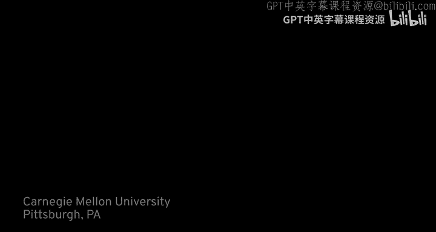
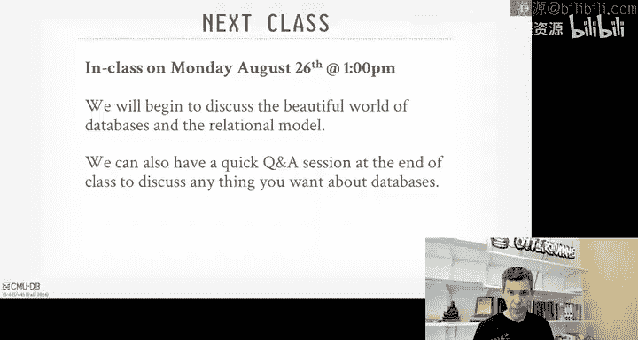

# CMU《数据库导论｜Intro to Database Systems (15-445645 - Fall 2024)》中英字幕（deepseek翻译 - P1：#00 - Course Overview & Logistics.zh_en - GPT中英字幕课程资源 - BV1Tys8eQELW

그。그。Hello Professor Paavlo this is off Street the Carnegie Mellon University Police Department would you be able to give me a call back please I need speak to you number here is 412 I'll be here tonight until 11 and I'll be back in tomorrow and3 Thank you very much All right so since the mic last time let's try this again so this lecture is supposed to be about the course logistics and what the overview of what this semester is going to look like for everyone and that way we can cover this material now and not have to worry about spending time the first day of class and we can focus right away on the good stuff Laci model Laciial algebra。

So before we begin we want to thank all the companies that have been involved in helping with course development and research at the Carnegie Mellon Dataase Group this semester。

 so all these companies will be coming on campus in a few weeks and you have a chance to talk with them for recruiting events either our internships of full-time positions and they're also be coming throughout the semester and giving sort of these 10 minute flash talks to discuss the various things that they've going on the companies building their system or database products。

 so we really appreciate their support and we look forward to seeing them on site on here on campus pretty soon。

So today I want to first discuss the waitlist because that's probably for a lot of people。

 the most important thing， and then I want to talk about what's expected for you as a student taking the class and then we'll finish off talking about like here's all the logistical thing of things we need to worry about as we go along the semester。

So for the waitlist， unfortunately I no longer have control over the waitlist because the class got so popular and now there's separate administrators for both the undergraduate 445 and the graduate 645 level or sections of the course so if you email me unfortunately there's nothing I can do I have since learn that the university there' is back room channel discussions between the various programs of letting students in for one course in one school that helps another student get into another school so all of this is beyond my control I apologize if we can't take everyone that we want the good news is that since we now hired a new database professor J Nesh Patel in the last year。

 we can now offer 445， 645 every semester so if you're not able to take it this semester you can then take it again in the spring。

So at this point， like if you're not enrolled the course。

 it's probably unlikely that you're going to be able to enroll in the course。

 so you probably start thinking out other options。Okay so I will say this again on the first day of class。

 but the only role I have during lecture is that I want you to interrupt me as most as possible with questions as we're going along I get excited on top of my databases and I can start talking fast so if you're confused by something or something doesn't make sense on the slides by all means stop me raise your hand and say know what's actually going on and so what I won't do is answer any questions about the lecture immediately after the class over and previous years I've had a bunch of students line up and say you know hey on slide whatever you said this in slide 34。

 you said that and has kept repeating myself over and over again and so it's better to get things captured for the video and the audio we can go back and look at previous years and try to improve things so there'll be no questions that won't answer any questions about lecture material immediately after class。

😊，During class though I ask that you don't ask questions about things that don't concern the rest of the class。

 things like can I go to the bathroom， you're all adults please just go without asking and then don't ask anything about blockchain。

 I think blockchains are a terrible idea for databases and we're not convenient discussing yet throughout the entire semester so no questions about that。

So this course is about the design and implementation of database management systems so it's about the internals of the systems of the algorithms。

 the data structures and the methods components that we build in a system to process and manage a database so its not a class about how to use a database or administrative database the first homework assignment we'll write some SQL but then after that you're actually building your own database system to support SQL and a relational databases so if this is not what you're looking for then there are courses in the Heinz College and information systems。

 on how to use and administer databases， I think one of them is based on Oracle so that's what you really want then you should go take that course and not this course I think there's a software engineering course as well in SCS about how to build an application using a database I think it's web programming and again that's more applied then what we're discussing here this course really is about how to build the internals of a database system。

So all of the material for the expectations for you as a student is available on the course website so the schedule has been updated。

 the syllabus there the calendar with all the assignments for the homeworks and projects and when they're due is now online as well all of the discussions should occur through Piazza and if you're a student you can log in through that everyone should have been invited and if not we can send out a aimed by code for everyone to use as well。

 so all the discussions for any of the projects and logistics。

 things like that should be done through Piazza all the homeworks and projects will be submitted and auto graded through gradecope and I'll talk about how to do that if you're a an non-smed student in a second and then the final grades will be posted through Canvas sort of be the final spreadsheet to see the breakdown across all the the grades for all the projects and everything and then from Canvas that goes on to S3 for the final grade the regrave requests will also be done through gradecope and the announcements for when assignments are due。

And everything we've done through Grco as well。If you're not a CMU student and want to follow along with the course。

 we also make available a non CMU graycope site， you have to sign up for an account and then use this login code。

 you have to specify that your university is Carnegie Mellon University， otherwise it won't work。

And so in exchange for making everything available that we make for CMU students outside of CMU。

 we just ask that you don't post any of your solutions on GitHub。

 don't email instructor of the TA for help， there's an unofficial discord channel that someone outside of CMU maintains。

 but none of the TAs or none of my students should go there for help。

 if you're a CMU student do everything through Piazza。

 but you won't sort of follow along with other people and I think every semester they go along with the course there's people you can meet up with there or work on projects and so forth。

The projects will be made available or the project will be made of grading on gradecope to nonSeU students after the deadline for the CMU students if you're a CMU student。

 we strongly encourage you not to go find some random off the internet off GiHub and copy their work because。

😊，What we'll do is we end up you know if we find all the GitHubPOs we have that are implementing these projects from non CMmU students and we throw everything in the plagiarism checker on Grcope and to track down and find people copying code they shouldn't be copying so don't be stupid offhand I would say usually the CM the nonCmU code is not as good as the CMU code because we can see the leaderboards so we just strongly encourage not to copy from other people whether' from CMU or not。

There is a textbook for this course， I don't think you can actually get a physical copy anymore from the bookstore。

 I think you can only get a PDF form， so this is database assistant concepts from Hank Chnderen and Avi。

 for every lecture they'll be assigned readings for that as well。

 but for some of the topics we won't they're actually not in the textbook so we have supplemental readings through the notes if we want to follow along for those things as well。

😊，It's， in my opinion it's probably the best data assessment textbook that's there now。

 it's the only one that's actually sort of actively being maintained， so this is the one I recommend。

😊，So if you're a student， the breakdown for the grades is listed here as shown here。

 so homework is going to be 15% and then projects will be 45% in your final grade and the reason why it's so much is because this course counts as a software systems elective for grad students and for undergraduates and so it has to be very heavily project based and we'll talk about the project in a second and then it'll be a midterm and a final exam that each count for 20% of the final grade。

😊，And every year students always ask， is the class curved， yes。

 by how much I don't know it depends on what the grades look like from year to year。

 the complexity of the difficulty of the course is roughly about the same from year to year the plan is to tweak the midterm exams in final exams a little bit more this year than previous years。

 but I'm expecting the curve will end up being being about the same and then we'll announce also too there's a chance for extra points through the projects by ranking higher on the leader boards but we'll cover that throughout the semester。

So for this year there's going to be six homework assignments that we do throughout the semester。

 so the first one is going to be writing SQL queries forductDB and SQLL。

 and then after that all the homeworks will be pen on paper answer problems and everything is through gradecope and it will be autod and then the solutions will be made available after the deadline and like the projects all the homeworks should be done individually and shouldn't copy from other people。

For all the projects， this is gonna be as I said a systems programming heavy course。

 all the projects are going to be written in an educational database system we've been doing here at CMU for a while called BuTub it's a written in C++ I know people want us to switch to rust but at this point that we too much code that it's kind of difficult to do that we may consider it in the future so of course that means you need to know C++ in order to take this course and we're not going to teach C++ and there is no course at CMU that strictly teaches C++ because it's computer science not a programming degree and so there are some materials that we make available I'll show more in the next slide but we also have a boot camp repo with additional information and everything you need to know about C++ this is why also in Project zero that we're going to make available you're required to implement that in the first two weeks just to prove that you can write C++ code so don't assume that you be able to pick up C++ as you go along many have tried it often doesn't work out because it's not just writing C++ also dobu。

th loss concurrent programs and multithreading， which can be a bit tricky a bit hairy so again。

 do whatever you can to prepare yourself accordingly and that's why we're requiring everyone to finish the first project in the first two weeks。

There are late days allowed for the projects， everyone's automatically given for late days that can be used for any reason throughout the time of semester。

 thats obviously for medical emergencies and other problems， we also account for late days。

 but we'll take that on a case by case basis。And then for each project， except for the project zero。

 there'll be a recitation that we're going to do online at night where you can come in if the project's been released and ask questions and we'll go over you the key ideas of the project and how to get started and that'll be for CMU students。

So again， as I said， if you don't know SL， at least C++ 17 there'll be some elements of C+ S 23 in there。

 but if you don't know CL 17， stop what you're doing and start learning now because you're gonna to have problems later on。

 it's hard enough to understand the core concepts that we're trying to try to focus on in the projects but then have to also learn C+us as you're going along which just make your life much much harder so in this page here there's a bunch of topics and links to sort of self-quizzes about the material you can go look at and then the link at the bottom is from the Germans about additional C+ programming system programming in the context of databases。

😊，So again， even if you know some of less， it's pi worth it's going through and seeing what you need to brush up on and again product zero we' stress that as well。

So the project Ze， I think has been released， we'll make some minor changes to it to fix up some of the descriptions of things。

 and then we'll make it available to submit on GrScope later today on Monday。

And so everyone has to complete this assignment by Sunday， September 8th。

 it's not meant to be challenging， it's not meant to be hard。

 it's implementing hyperlo log data structure， it's a pretty simple one。

 but again it's forcing you to come to terms of whether you actually know S loss or not。

You don't get agrar Project zero， but everyone has to complete or pass all the tests perfectly。

 otherwise if you don't do it before September 8th。

 we have to ask you to drop the course which is because we don't think you'll be able to handle the projects going forward so sort of preventing you from getting too far deep into the course and then realizing you're in over your head and you have to drop the course or fail it and that would be bad we've been doing this for several years now and the attrition rate for the course has gone down significantly because kids again you're coming to terms about whether you actually know CL test or not sooner rather than later。

So again， everyone has to complete this for assignment Project zero， there's no exceptions made。

 so just get it done in an hour or two and the submit on grade scopepe。😊。

So we'll have office hours for both myself， the instructor and the TAs。

 everything's been posted on the course website， there's also a calendar we make available to see throughout the time。

 different times into the day when the office hours are available。

So we're not going to have any office hours on Sundays when all the projects at Homes are due and the regular office hours will be done through Monday and Friday。

 Monday through Friday， the idea here is that we don't want people。You know。

 a project is due on Sunday， waiting to the very， very last minute to start working on it。

 so by having office hours only during the weekdays。

 it sort of forces you to start working on the project earlier rather than later。

But the day before the Sunday of one of the four projects is due。

We will have a we'll have sort of a power session on that Saturday afternoon with multiple Ts for multiple hours。

 just in case of sort of any last minute things you want to help with to clarify so again。

 we'll announce those throughout the semester as we get closer to the different project deadlines。

 but that'll be the only time we have Saturday office hours。So as I said。

 there's automatic for late days that you can use for any reason for any of the projects。

 there's no late days for the homeworks， they're all or nothing， but if you're out of late days。

 then every day that you miss turning in a project， your grade goes down by 10%。And again。

 if there's something comes up like a medical emergency or you know a。

Un controlt of the reason why you have to be out of town and miss a deadline。

 please email me and we can discuss various accommodations。

Excuses like I'm leaving town to go do for job interviews or I'm preparing for job interviews。

 anything related to hiring， that's not a sufficient reason to miss projects。

 you can try emailing me but just telling up front we won't be granting exceptions in these cases here。

So this goes without saying but I have to say it every year。

 please do not plagiarize and the homeworks or the projects， as I said。

 in previous years people try to find the solutions to the projects from people falling along outside of CMU on GiHub and we catch them because we can see those reos too they're public so we put them into the plagiizer checker on greatcope and you'll get nailed and then now because this is on video。

 I just take this video to over to Warner Hall， show them the timestamp and give them tell them this is the time when I told the student that not to plagiarized and they they still plagiarized and then now you don't have any excuses。

 so don't copy from your friends， don't copy from people random things on the internet。

 there's anything you may be confused about just email me and have a discuss if it's some rare case or something like that word something needs to happen and if any doubt just look at CMU's economic policy policy for academic integrity shown in the link here。

All right so that's the main sort of course materials that' expected to you as the student One additional thing that we're doing this year is we're also having what we're call flash talks and as I said we have a bunch of industry partners that are helping out with this semester this year at CMU in the database group so starting I think next week on every Wednesday will have at the end of class we'll have a 10 minute sort of flash talk where one of the representatives sort of engineers or the founders of these various database companies will just come give a quick 10 minute talk about here's what their system does here's why it's interesting and here here's the problems that they're trying to solve and the idea here is that。

😊，Instead of me just saying， hey， here's how things look in the real world。

 these companies can come in and show， oh here's all the stuff you're learning this semester and here's why it matters and here's how it applies to solve real problems they face at their companies so sort of reinforcing the topics and material that we're discussing so these aren't recruiting talks in- class sessions will be strictly about about the course systems and the ideas。

We will be having a separate recruiting session， an event on September 16th and 17th。

 if you're taking this class， everyone is invited， I'll havell post more information about it on Piazza in a week or two。

 but all the companies are coming to campus to meet students and talk about internships and full-time position openings。

 so encourage you everyone to come check those things out。

And then I'll also post additional information how to apply for these companies on Piazza in a week or two as well the idea here is that rather than just pointing you at the the company website you just submit your resume and it goes into a pile with everyone else。

 we've asked them to set up specific channels， email addresses and portals for senior database groups or senior DB students students taking this class so that you can apply directly to the hiring managers on these various database projects and not just again thrown in the mix with everyone else。

And then the last thing is that we are also having a seminar session or seminar series this semester and that'll be on Mondays at 430 so after class and this is entirely optional this is not part of of the course。

 but if you're like needs can't get enough databases and this is an additional way to sort of learn more what's going on in industry so we're having this we' call the Data building blocks seminar series where a bunch of companies and people building projects or open source projects on whether they're using the sort of。

😊，Thesese libraries that implement specific components of a database system and then build a larger system around it。

 So we'll cover this more as we go along the semester。

 but you sort of think of systems like Postgres and SQL light and Oracle。

 These are monolithic database systems where the database system itself。

Is use custom implementation from all aspects of the system。

And then now there's sort of separate movement what we'll call composable systems where people are building sort of libraries。

 standalone pieces like an exfuion engine or storage manager that can then be reuse across different systems and then you build a larger sort of more complicated system on top of that。

 So data fusion is sort of one of these core components that's come out of the Ru community or part Apache arrow that a lot of systems are being built based on。

 So there'll be a bunch of different database companies talking about how they're using data fusion and other components throughout the semester。

 So this all online through Zoom will post the videos on YouTube afterwards。 And again。

 this is entirely optional。 This is not required for the course， but like。

If you want to live a database centric lifestyle， then I encourage you to check this out。

And I'll announce these throughout the semester。 So that'll start September 23rd the week after the on campus database group recruiting event。

All right， so class next class will be on Monday， which is actually today。

 but as I said I'm rerecording this and that should be 2 pm I should have updated that sorry it's 2 pm in TEpper and then again I'll mention some briefings in the beginning some announcements but then we'll plow it through start talking about relational model and relational algebra and then as also I said on piazza I want to have a quick Q&A session about hiring databases or database questions in general if you want to ask something at the end a lot 10 minutes for that because every semester this order comes up people ask a bunch of questions throughout the semester when we cover some things in the very beginning and then we can build upon that during the rest of the semester。

😊。

All right guys， see you in a couple hours。