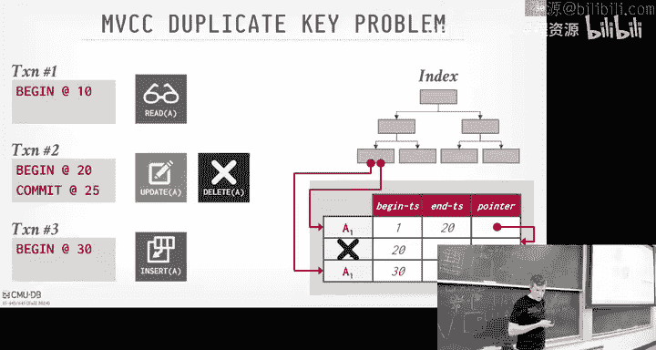
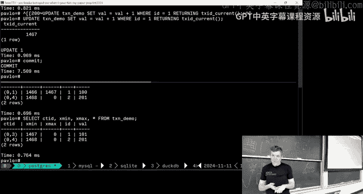
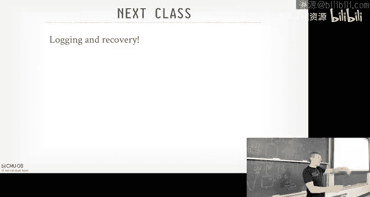

# CMU《数据库导论｜Intro to Database Systems (15-445645 - Fall 2024)》中英字幕（deepseek翻译 - P20：#19 - Multi-Version Concurrency Control.zh_en - GPT中英字幕课程资源 - BV1Tys8eQELW

Yeah。い？Official members bounce bus off theone realizes rail hair where we call home Off members bounce bus off the realizes hair the inside one official fat lick and mat clips the proma make the average imitated do backfl like a pistol to put the vest the coming from members thats official。

A lot I want to cover today。 Plus， I want to spend time at the end。

 hopefully popping up my sQel Postgres and throwing real transactions at it so you guys can see that like。

 oh， Andy's not making up The stuff that's actually how it works。

 when we expect what the data does when we run transactions。 So quickly， administrative stuff。😊。

Project 3 is due this Sunday on the 17th at midnight again。 Project 4 were released on this week。

 I think on Wednesday or tomorrow。 The final exam will be Friday， December 13 at 830 AM。

 forget where but that again， there will not be an early exam。

 I don't care if you aunt uncle's50 wedding anniversarys gonna be on a cruise。

 And therefore but you already have Taylor Sw concert tickets as well。 you got to go。

 you can take these。 I've heard it before。 I don't care。 do not make travel plans。

 be there on this date。 And then as I on Piazza if you can't get enough with databases。

 can't get enough of this class or you hate databases and you hate bus and want to fix it or you're sadistic and want to make torture the next round the students make bus to even worse。

 don't do that。 but please sign up if you want to be T A withnesh next semester。

 Any questions about Project 3。😊，Alright， and then more database stuff， more talks。

 today we're having influx DB， the cofounder and CT TO。

 So this is their third talk given at CMU about what they've been building on influx。

 The first two talks。 first talk was whether the new system they were building told him was a bad idea。

 came back the second time said Andy were right We're building a new one And then this third talk is basically oh yeah。

 here's what we did after we we fix things。 everything is based on data fusion。

 I'm also hosting Camille Ferri， who is a SS alum， I think 2002，2003。

 She's coming to get back a distinguished alumni talk in New York City a lot of executive positions and VP engineering positions for a couple of different companies。

 She was CTO of rent runway， which is like the。😊，And you rent designer clothing， whatever。

 and they went IPO。 and she's brilliant。 She's giving me talk this Thursday at 430 in Gates。

 And then next week we'll also have the G D giving a talk so you can make Camille's talk on Wednesday sorry Thursday great。

 She's also a PMC or for the Apache zookeeper zookeeper is a distributed value store that's often used for as the backbone for a lot of distributed database distributed systems。

 will cover zookeeper and other like systems like that in a few weeks。

 But worked heavily on that project as well。All right so。呃。This slides wrong side。 wrong slide。

 right， but last class， we were talking about timestamp ordering。

 not two days locking right And the big thing about when you understand timestamp ordering because we're going to see this today in multiversion concur tro is that there's a notion of physical time。

 like what we call the wall clock time of when things actually occur in the real world。

 the order of the events in the real world。But then there was also this another notion of a logical time of or the commit order of when things actually got saved to the database。

😡，And when we saw OCC， there was this private workspace the transaction we were using。

 that would allow them to sort of stage their changes。 And then when they went to go commit。

 then we had that validation step where we had to go figure out， okay， did anybody。

 did my transaction miss any updates I should have seen or is anybody going any other transaction that's still running。

 It's gonna to miss the updates I'm about to make And we passed the validation steps。

 Then the transaction was allowed to install changes to the global data and never going to see them。

So we're going see today with multiverging， it's going to basically look the exact same thing。

 except now there isn't going to be the private workspace and the vers are'm going to hang around in the the global database。

 And depending on how we how we run transactions。Some transaction actually could see some updates。

 some transactions that haven't committed yet， depending on what isolation level we're running at。

So conceptually， when you think about what was happening in OCC。

 that there was multiple versions of tuples。So multiple multiple physical versions of single logical tuples in the database。

 So a physical， sorry， a logical tool would be like a， an object identified by a primary key。 right。

 primary key says there has there's only one， one and only one record that can be mapped to this primary key。

But then under under CC， when I was making changes， maybe to that tuple。

 I had made a copy of it into my private workspace。 and now I had another physical version。

 another physical copy of that single logical tuple。

So that's the same idea we're going to do here at MCC，' now we're going to do it on steroids。

 where the data system is going allow be allowed to maintain， again。

 multiple physical versions for a single logical tu or logical object。So anytime now I want。

 I want to update something in the database， I'm going to make a new logical version of of that object。

And then the the example that I saw when we talk about O T， that。

 that new version was just a complete copy of the entire tuple into that private workspace。

 We'll see， as we go along， that's actually not a good idea。

 and we can be a little lot smarter about it。 Maybe just take copies of the subset of the things that got changed。

And then now when any time a transact one to read that object。It's going to have this view。

 or we'll call it the snapshot isolation snapshot view of the state of the database that existed at the moment that the transaction started。

So that means that if another transaction is running the same time as you are and but they start start after you and they just start making changes。

 you're not going to see them because you're gonna to see a consistent snapshot of the database at the moment。

 the logical time that you started。This make more sense as we go along。 And I'll say also。

 too that we're gonna we can still combine multiversion curgi with two phase locking and OCC and other protocols that are out there because multi versioning isn't just about。

 oh， I'm making copies of things and maintaining snapshots。

 We still have to do all the con stuff we talked about before to figure out who's allowed to update what and when。

😊，But now the backbone of the way this architecture is going to work。

 the is going to work is going to be predicated on this idea of I'm going to make versions of things。

😡，SoMVCC is an old idea。 the first sort of what is acknowledged that the first description or implementation of it goes back to this PhC dissertation at MIT in 1978。

 but that was sort of in like the systems world And it wasn't until a few years later。

 then people said oh this is actually applicable to what we care about in databases with con control and then it was added into some existing systems。

 So what is cited as the first implementations of MVCC in a database would be this thing called RDB VMS。

 and then another system called interfacebase and these are both built a deck in the early 1980s by this guy Jim Starkey He claims he's also the aventor of blobs like the binary lab objects。

 I don't know whether if that's true or not， but that's what he says。And then actually。

 who here has ever heard a deck。Nobody， that was a huge company back in the day。

 Like the Google of this time。 And then they got bought by compact and then compact got bought by H P。

 And now they're basically。Not really。 If you ever have vax machines。 that'， that's these guys。

 right， But they were also better do because they were。

 they were writing software to run on the hardware they were selling。

So these systems are still around today。 So Interbase you can get there company。

 there's still a company called Interbase， and they sell something that's a。

 like a mobile phone better database。 But the， the sort of enterprise code was forked off many years ago。

 and open source is this thing called Firebid。If everyone want to know why Firefox is called Firefox because when Mozilla went under and couldn they want to rebrand Nescape。

 they wanted to call it Phoenix because like know rising out of the ashes。

 but there was some other software that had that so they couldn't call it that so then they wouldn't call it Firebird。

 couldn't call it that because this database system already exist， so then they came with Firefox。

 right。😡，Oracle buys everything。 It' so Oracle bought RDB from the carcass of De。

 and then they rebranded that as Oracle RDB。 So there's the Oracle， the company。There's。

 the Oracle database， the big money make that everyone is aware of。

 But then they also call something Oracle RDB。 That's this， that's the descendant from this， this。

 this deck machine。Right， so Oracle's branding is not very good here。

 And the Oracle database that everyone knows of is a relational database system。

 You could call it the Oracle database， A RDB， but it's different from the brand name of this。

Alright， so now， again， even though thiss back in the 70s。

 pretty much every single data system today， if you're going to build a new one from scratch。

 is using， is me using multi version current digital。All right， so there's two key ideas about MVCC。

The first is that the writers are not going to block the readers。😡。

And the readers are not going to block the writers。So， again。

 the idea is that when a transaction shows up， they'll be given a timestamp。

 And that timeamp is going say， here's the timetamp of that allows you to view a consistent snapshot of the database at that timestamp。

 So you won't see any uncommitted changes。And you won't see if a transaction commits while you're still running。

 all of a sudden their changes won't materialize because those changes didn't exist at the timestamp you were assigned when you started the system。

😡， so that's me my snapshot。And now， since， since the readers can read things at a certain timestamp。

 when someone， when a transact was write to an object or write to a tuple。

They're going create a new version of that。 And that doesn't interfere anybody else from reading the older version。

Likewise， when， when someone is reading the older version and Im want to make a new version。

 I don't have to block on them。Wait till they， they finish reading。

So we're going allow our transactions to basically get its consistent snapshot without acquiring explicit locks。

 because again， I'd given in a timet when I started， I can see everything that existed at that time。

And then by default， by naturally or implicitly， we're gonna get this different isolation level that we didn't really talk about yet called snaptcha isolation。

 And again， that just means that I'm viewing the database， as it existed at a certain point in time。

So。One of the big things that was tad about M PCCC when it came out in the 1980s is that could support what are called time travel queries。

So the idea is like， if I say run this query for me。

 but on the database as it existed three weeks ago。If you have all the versions。

 because you didn't do any garbage question clean things up。

 then that's trivial to do because you just figure out， okay。

 what's a timestamp from three weeks ago， Let me go view the database at that time。

Postgres originally shipped with that feature。 right。

 That was one of the things they were titled when they came out 19 early 85，84。

 that was like one of the design points Postgres is that open new time travel queries。In the 1990s。

 when they， when the first of building out the open source version or improving the open source version that came out of Berkeley。

One of the first things they did was get rid of the time travel thing， because again。

 if you don't do garbage collection， you run that storage pretty quickly， right。

If you're not familiar with the history of Postgres。

 so Postgress was an academic project at Berkeley。I want and guess what the first language postcode has written in。

But he said， see， no。Basic， no， not that bad。A worse spinning， what？Close。Lisp。

Right and what it would do， it would take a list。 then they run a compile that confirm the list into C and then compile the C。

 and they realized well， this is stupid。 This is why wasting time the list is writing in the C And so there was a academic version of Postgres。

 and then Stonebreaker started the company。 I think the first version was called montage。 then Monet。

 and then they got su for that and then got renamed tolutra。lutra got bought bought by informs。

 So the first version of Postgres that came out of Bkeley became the startup that got bought by informex then merged in which inform got bought by IBM like you see how these things get just eaten by the bigger companies。

 But then the reason why it's not called Postgres Now the official name is Postgres  Ql。

 because in 1996， two grad students took the original academic code。

 removed all thequell stuff and added SQL to it And then a bunch of people started picking up and actually started using it。

😊，And one of the people that actually started making a lot of work on Postgres is this guy， Tom Lane。

 Hes CM me alum。 He still lives in Pittsburgh because he was a day trader and needed a database。

 and he started， started working in Postgres and took off from there。

And so he I think he was part of the team that took out time travel queries in like 99。Alright。

 enough history。 All right， so here's an example。 M。 So now we have in our database。啊。Now。

 we see have some additional fields here。 right， Last class， when we talked about OCC。

 we had this right times stampamp to say， what was the timetamp of the transaction that wrote this record into the main table。

 right， But now we have this additional column here。 We're gonna keep track of the version number。

Now， this is not something you actually would materialize in a real database。

 I'm just showing this for the illustration， to say what version we're actually looking at。

 But you wouldn't actually store this。The way you keep track of the versions is through these additional timestamp fields。

 So just like OCC had right timetamp。 Now， we're gonna have a begin timetamp and end timestamp。

And that's going to scope the visibility range of when a version is actually visible。😡，Alright。

 so now when a transaction starts， calls begin， we have to assign a timetamp。

 with it's begin timetamp because again it needs a consistent snapshot。

 It needs to know what timestamp I should use to view versions， right， That's different。 OCC。

 OCC gave you a timetamp when you want to go commit。😊，In MCC。

 you need to have a timetamp when you start because you have to know what。

 you know what you're allowed to see。So now I'm going to do a read A again ignoring how I find this object like through an index or whatever。

 but I'm going to land through version a0 for this tuple， and I'm going to be able to read it。

 I should also point out to the end time stamp is infinity or null or whatever。

 just indicate that this is the latest version， it's not bounded like the end timetamp scope is infinity。

😡，So if we can read this version， that's fine。T2 starts， it gets timestamp2。

 now it wants to do it right on neck。😡，And so in this case here。😊。

I'm going to create a new version of the tuupple， again assuming I'm just making a complete copy of it。

 and then now I'm going to set the begin timetamp to be the timestamp of my transaction T2 when I started。

 and then I'll set the end timestamp to again affinity or null or whatever。😡。

And I installed the new update in the value。But now I need to go back to the previous version and set it's end timestamp to be my timestamp。

RightBecause now that bounds any other transactions that comes later on。

They'll know that if my time stampamp is greater than 2。

Which it has to be because we've assigned two to T2。

That if they go start looking in the database and they see a0， say their timestamp is3。

 where you look at begin timesamp and end timestamp，3 is outside that that range。 So therefore。

 you know that a0 is not visible to you the transaction and therefore you would follow down and see that next tuple has the next version has timestamp between2 and infinity。

😡，3 is is， is greater than two， less than afffinity。

 So this is the version you'd actually want to see。All right， so what's missing， though？

How would another transaction know that this， this is actually a committed version。Right？

So additional thing that have they maintain is a transaction status table。

Where we just keep track of here's all the transaction Is of the transactions that are active in my system or running in my system。

 Here's their timestamp。 so they were signed when they started。And then they have the commit status。

 what's happening with them， Are they Are they， Are they aborted， Are they committed。

 Are they cleaned up。So we'll also maintain this table as well。

So now the idea is if a T3 shows up and says， should should I be able to read a1 depending on what isolation level I'm running at。

If I only， if I only see committed changes， then I know I should be looking a 0。

 if I'm allowed to read uncommitted changes， then I could read a 1。

 And I would look at this status table to tell me whether is this transaction finished or not。

Then we switch back to T1。 T1 does read an A， and in this case here。

 we can just read the same version that we had before and this gives us that repeat to whatever we guarantee that we wanted。

And then we can go ahead and commit， right， for both these guys。Te forward。Now。

 one thing I didn't mention is how we actually find the different versions for foril logical tuple。

 We'll cover that later on。 Yes， if the transaction like it's in a third transaction running。

And it wants to access A at some point。Sa the third transaction starts。Transaction A1。

 like between A0 and A1 and then tries to read。Will it read based off of its own？Start timetamp。

So go back here， so say those our transaction 0。5。Right， so what is 0。5 c。 Well I'm to read a。

 it's going read like it'll read the a0。 even if， even if I got point A one's already written it。

So A2 does it right here。 So you're saying even a1 doesn a right。 So A1 write。1。

5 reads a at some point while A0 and A1 both exist will I read a。It'll read a 0 because a 0， again。

The 0。5 is the timestamp that gives me what's the consistent snapshot of of the database at that given timestamp。

So a1 doesn't exist yet， you know， it might physically exist， but logically， at timestamp， 0。5。

 it does not exist yet。So I， I have to read that that older version， which is correct。Yes。

 and then for like rolling back， like say a third transaction starts after this。Reads A。全然。

Abortion room， A1 abortion room。Reverse， will it have。

They're cascading the boards here or does that His question is。

 so say we're at this point here where I've。I've written a new version of A so T2 wrote A1。😡。

So then now transaction 3 comes along。 And again， say they get timestamp 3。T 2 is not committed yet。

So again， what should transaction to T3C consistent view of the database at timestamp 3？

RightAnd that means then。It should only see committed changes。

 assuming you're running with that isolation level。 So therefore， they won't see a 1。

 They'll see a 0 again。 So you also subtract。Data of whether or not。The value belongs。That's this。

So I you would say， all right， in this simple example here。

 I know that a1 is written by time transron timestamp 2。 Okay。

 is that commit or not should I be able to read that， Look in this thing， Oh。

 it's still actively running。 Therefore I shouldn't be able to see that。And I should know。

 I need to look at the older version。Now， I'm glossing over how you actually make this efficient。

 but that's the general idea。Okay， so let's look another example。So in this case here。😊。

T 1 to do read a A， write or， read。 And then T 2 is gonna re and write an。So T 1 starts。

 gets the begin time stamp 1， does a read on A。 gets a 0 because that's a consistent view。

 That's fine。 Then now it does a write on A。 createates a new copy in here。 That's fine。

 just like before。😊，And then again， we have to go update the the end timestamp to be one to indicate that a zero is bound now。

 or its visibility ends at timestamp 1。Then the context switch over here， T2。

 T2 can read a because again， it would look in the status table for the transactions and see that T1 hasn't committed yet。

 so therefore we don't want see uncommitted changes， so it's going to go ahead and read a0。

Then now it's going to go ahead and do a right on A。But in this case here。

 because NBC by itself isn't going to protect us about right， right conflicts。Right。

 so so assuming there's some kind of two base locking going on。 So in this case here。

 we would recognize that because this， this end time stamp is。Is infinity。

 we're trying to overwrite this。 We go look in the status table and see that T1 has not committed yet。

 Therefore， we're not allowed to create a new version。😡。

Because we could potentially overwrite those changes， and that would be an inconsistent view。

Her incorrect view。And therefore， in this case here， it's gonna to stall and weight。

Then when T1 goes ahead and， and and comes back， does read on a。

 It's gonna read the version that that that。That error is wrong， should be down。 Ar should be here。

 You should read A1。Because that's the one I wrote before。 Then it goes ahead and commits。

 And now when it commits， sayy， there's a lock on that tu or an A that gets released。

And then now T 1， T 2 can go ahead and create the new version and go ahead and allow to commit。Yes。

 when is the end time assigned questions。 When is the the end time assigned when you commit。

Like when you call commit， how does a I mean， how does the n1 sign of a0 to be1？

So for a word version， how does it zero to1？So going back here， when？So sorry， there's the。

The end timestamp is the timestamp of the transaction that created it。😡，Right。

 so in this going back here。 So when he does the right， we create a new version here。 right。

 we have one to infinity。 But now we have 0 to infinity。 So again。

 if I'm following this thing like a link list， I'm following the version chain， I would see a 0。

0 to infinity。 Okay， this must be the latest version。 but that's not， that's incorrect。😊，Right。

 so it has to go back and set the end times stamp to be whatever its timetamp is is。

 So 0 to one exclusive。Okay， so assume there's no right in T T the T1。

 then the like the enzyme time of a0 will be assigned。When when a1 commits。So your question is。

 when is the end time stamp of of a one assigned， say this doesn't happen。

This guy's calls commit what I said to the end timestamp to， infinity。

Because this is the latest version。So is this actually serializable？Preci say yes。

What do you saying is say no？Or if you don't know。No， right？

Because what should have happen if Vi's running in serial order？😡，Going back here。

 see if we get to this one here。If we were running serial order， so the answer to the database is A2。

 right？😡，This guy here read a0， because that was the view of the Davidson Saul when it started。😡。

Even though this guy did a write， which he should have seen。But under snap isolation， it doesn't。

Then I'm when it goes ahead and commits and now it's installing its new change。

And so if it was in serial this is one values， it's kind of trivial。

 But like if it was running in serial order， I should have saw this guy should T 2 should have saw a T1s right and then do its own right。

 But it saw saw the right from whatever transaction is 0。

So this is because snapnaapcha isolation is susceptible to an anomaly we haven't talked about called the right Ske anomaly。

Right。And again， the basic idea of S Sapshot isolation says that you get a consistent view of the snap of the database as it existed when the transaction started。

So you won't see any torn rights from from action transactions， right。

 You won't see if they update5 things。 You， you're not gonna to see3 and this the other two。Right？

If two transactions tries right the same thing， then whoever， whoever gets there first， will win。

 assuming you're not allowed to stall and wait。But this R screen La me is a different idea where the I。

 it's like， I got to see since snap of the database。 But when I apply my changes。

It would it's not equivalent to being if I was running transactions in a serial order。And again。

 I realized me waving my hands doesn't make any sense。

 Let's actually look a really simple visualization。 So this was invented by Jim Gray。

 Again the guy invented conial interfaceface locking when the Toian War in the 90s for all the stuff。

 He was very good at like dumbing down simplifying very complex topics and databases。

 You ever heard of the five minute rule。 That's from him。 You ever heard P99 latency。

 That's from him or the 59s。 That's from Jim Grray。😊，All right。

 so say your database is comprised of marbles。And they have two colors， black or white。

And you have two transactions that went run exactly the same time。

 First transaction was turn all the white marbles to black。Second Joe second。

 we're going to turn all the black marbles to white。So when they both start running。

 this is the consistent snapshot that they both see in the database。Two blacks and two whites。

So therefore， when the transaction runs， the the guy at the top is going to take these two bottom ones。

 flip them in the black。 The guy the bottom is going take these two black ones and flip them in the white。

And then now， when they go ahead and commit。We end up with database， database like this。Again。

 on the snap side isolation， that's allowed to happen。

Because they didn't take right locks in the whole thing。喂。

They just updated the things that they cared about。And if it was running in true serial order。

It would really be this。 First transaction changes all the marbles the black。

 Second transaction changes all the marbles to to white。 So either are all black or all white。

So by itself， Snapchat isolation does not support is not serializable。

And it's something like Postgres， there's extra stuff we have to do。

 but we're not gonna cover in other systems to contort snatchshot isolation to make its support。

Serializability。And this is why Oracle， for example， again。

 when you ask for serializable transactions or isolation level， you're getting snaps to isolation。

 which would be susceptible to this problem。 It this anoma。

The original specification for transactional isolation levels that came out in 1992。

Doesn't mention this， this problem， right， defines。

 snap defines isolation levels in terms of two phase locking。Right， read and committed， recomit。

 repeatable read and serialerizable。But again， as I showed that graph last class。

 isolation levels there sort of this branching thing。 And that side branch snaps isolation。

And I had the guy that actually was the author of this。 He was， he。

 he would telling me that he was at Microsoft at the time。 And the reason why the。

 they missed this skewman is because the one guy forgot to read it or something like he was too busy writing some code。

 It didn't read the spec over carefully。 And then they， they had to come back and fix it later on。

All right， so。So the high level， this is what MCC is。 Again。

 the idea is that wouldequate logical physical versions of logical tubs every time they get updated。

But it's not just getting to concurrentency protocol like we saw the two phase locking and and OCC。

 the concept of versioning permeates all throughout the database system。 And I show that diagram。

 like here's the different layers of the system that we were running up the stack。

 But then when I said now we're bringing concurrenion control。

 And there's the giant blob of con control assumed all the other parts。

 That's because all throughout the system， it has to be aware that it's dealing with different versions。

And as I said， pretty much every single database system built in the last 20 years。

Even maybe 30 years is going to be doing some variation of MCEC。And some are much better than。

 than others。So what I'm want to go through quickly is。

Here's all that design station you have to make。When you。

 you say you want to build a multiverging system and you really want to sort of think about， again。

 what are the implications of these different design decisions about how they're going to affect other parts of the system。

 So in particular， how you're going to do version storage is going to have a big influence on what happens when you do index management。

especially with secondary index neexus。啊。And this is not going to be， I mean， this is going to be a。

 brain developed。 Here's all these different things。You， you want to do， or， you know。

 you could do The main takeaways is gonna be。 And I'll try to say this as we go along。

The worst implementation MVCC that is out there today， at least I'm unaware of， is actually Postgres。

So you don't want to be doing what Postgres does， despite me， for me， you know loving Postgres。

 it's actually the worst im at VCC。And we'll see why as we go along。

 My SQl work will actually do it better。And every other system today， unless the forkcal Postgress。

 are doing it the My Sql oracle way。So I was good hand wavy on how we're actually protecting objects。

 from two writers at the same time， But it's all the same concurial protocols that we talked about for。

 Like you still need to bring， bring all that machinery back right。

 So if you're doing two phase locking you still gonna need a lock table。

 you still need deadlock detection prevention。 You need all the things we talked about in the previous lectures and the same with OCC。

Whether or not you're using a private workspace with the new versions and still doing OCC with validation steps。

 that depends on implementation。Timetamp ordering is the basic thing that we talked about before。

 We're like， yeah， I sign a timestamp。 and I just make sure I commit that order。

 And that gives you basicll thatll give you snapsa isolation。

 But you have to do extra stuff if you want， if you want serial liabilityability。

 which we don't cover in this class。 We'll cover in the advance class。

The next thing we've got to worry about is how we're actually storing these versions。

 So Im just showing against lines that are in a table and PowerPoint It not exactly how actually we would implement this。

But the way to think about the version。The version that you're maintaining for a single logical tool。

 it's essentially a linked list。So the version chain is going to be have pointers to say。

 here's the next version that you need for a given tuupple。

So there would actually be a field with with a record I D more or less that's going tell you。

 Here's where to go find the next version as you， as you tra along the version chain。

It'll be a single direction linked list， Doub Doub linked list normally for this。

 you don't really need it。 doesnn't really help you。 It extra maintenance。

So the entry point is always going to be at the head of the version chain。

ButThen now the question is going to be， what order do we do we sort the versions， Old and newest。

 newest to oldest， And then what are actually the versions themselves。

And where are they actually being stored？So there's three approaches to do version storage。

The most basic one is a pen only storage， where every single time I make a new version。

 I copy the old one， insert it into the table as if it was a real tuple another tuple。

 and I just keep track of the version chain in the headers。😡，Right what I showed my example for。

 this is actually what Postgres does。The next approach is to do time travel storage。

 which is basically like a pen only storage。But instead of storing the new version back in the same table。

 I'm gonna have this separate table that's designated as， as the time travel table。

And I'm going to put all my versions in there。 So I'll have a main table that always has the latest version or the the oldest or the newest version。

 depending on the version chain。That's always going to be in， in the main table。

 And then they're gonna to pointers to these auxiliary tables where I'm going to put all my。

 my versions。And then the last one， which is actually the， the best one， is that。

You basically instead of storing entire tus， you just store deltas。Like。

 think of like a get diff or or diff。 So if I have 1000 columns and I going update one of them。

And the two other approaches， I have to copy all 1000 homes。But under Delta storage。

 I only stored the one the， the， the subset of the columns that actually got modified。

And with their new values or previous values。And I'll store that in a separate record Delta record storage space。

So the top one is the worst case。 Don't do this。Right，cause as you see as go along。

 It's gonna have a bunch of storage issues， a bunch of。It just makes everything more more expensive。

The reason why Postgre did this is because the idea of Postgs in the 1980s was。

There wasn't going to be a right ahead log， which we haven't covered yet。 That's next week。

 but there was or yeah， next class。 there wasn't a log that says here's the changes that I'm making。

 They said， okay， well， the tubs themselves， that's the change。

 So recovery would be instantaneous because you just come back in theory。

 And then you would have all your tus that you you were modifying and working on to sitting in your tables。

Of course， that's really slow because we'll see a bunch of random rights， and that'll be bad。

 And so the writer head log gives me a better approach， and they've added that later on。

But they still had this idea of like every single time I make a new， make a new version。

 I make a copy of the whole thing。And they have some hacks to try to make this be faster if you can try to keep things on the same page。

 we'll cover that in a second。So the bottom one is of what you want to do。

 But we'll go through E G1 by one。So again， a pen only storage just says that I have a single table every table in my database。

 I'll have one table space for all that。😡，And then now anytime I make an update。

 say I make an update to version 1 or A1 here， I'll make an entire copy of the record down to the new space in the table。

😡，Install the new value and then go update the Virgin chain now to point to。

The new version I just created。And this example here， I'm going oldest newest。 a 0 is the oldest one。

 So I want to find the newest。 I follow along the the version change， who I find the one that I want。

And the points are are just record Is。 That's gonna be a page number and a page number and a slot number。

The Virgin chain ordering actually has big implications for performance， as well。So。

If you do O us a newest， that means that every single time I do a lookup。 say I follow an index。

 I look up an index。 I get now a I get a record I D that's gonna take me to the head of the virgin chain。

 Now I got to scan along that versionrgin chain till I find the 1 I want。 And again。

 you're looking at the beginning end time stamp that I showed in the beginning to determine whether the version you're looking at is actually the one you want or not。

Right。Newest to Otis is where the head of the version chain is going to be the latest version。😡。

So now when I do a look up at the index。And say， I just need the latest version。

The first thing I land on when when I do the lookup is going to be my the version that I want。

So that sounds great。The downside is， that every single time I updated a Tol。

 I have a bunch of indexes。 I got to update all their entries now to make sure they point to the。

 the new head。If you're doing depth of shortages， it' is actually not a problem because you。

You overwrite the head is always me that the latest version。And everybody always points to that。

 If you a pen only， then I make a new version。That's now a distinct physical tu but it's in a new location。

 And now I' going to update my my index as a point to that。So these， these， these trade offs are。

 these choices aren't aren't。Aren't independent from each other。

right so time travel storage is basically same thing as a penless storage， except now。

 instead of storing the the physical versions in our main table， we had this whole separate table。

 which basically just another table。By that， we're going to stir all the previous version from this。

So I update this thing A2。😡，I'm going to make a copy of it into the table the time travel table。

And then now I just update the master version in the main table with the latest version that I'm installing here。

And then I update the pointers now to。Nowll point to the next one here。

Let take I guess why we do this， yes。我自己证价。Sa again。

What if the change affects the index team or the index key？If。

 if you basically treat that as a delete follow an insert。So if you say you update the primary key。

 right？Well is that really，s almost a philosophical question。

 Is that really the same logical tuupple， Well， no， the primary key has changed。

 So it's really a delete of the old， the old record based on the old primary key Then insert with a new one。

So you lose that virgin chain continuity， but it makes the book even way easier to do that。

If you change the secondary index key， depending on how it's actually keeping track of the second index。

 we'll come to that in a second。You may not to update anything。You update the entry。

 but you may not have to。Actually you have to update the second index， but the key。

 the value of the index will still， depending on how you organize it will could be the same。😡。

So you said like。Previous one， like。Enclo。A lot of ways because you need to copy the table。

 but I don't see you copy like the unmodified D1。差不。Right， so his question。

 so his statement is I made， I made a big deal that app pen time travel storage would waste a bunch of space because you're copying tower our tubs。

 But I have this B1 here。 and it isn't have an entry the time travel table。 What's up about that。😊。

Garbage collection。 We'll get get to that in a second。MVCD doesn't come for free， Right。

 It's a great idea。 And it it makes things a lot easier。

 both the implementation side and actually from the application standpoint。

But someone's got to clean things up because otherwise， you just run out space。

 So you assume B1 has been cleaned up because no other transaction could there was a B 0。

 no transaction could see it。 No， there's no extra transaction that where that tu will be visible to it。

 Therefore， we want't reclaim the space。Yes， what I understand this time table essentially is just doing a pen only change putting a separate table。

 So how is this significant better than the Her question is this basically seems to same as a pen only。

 which is correct。 But instead of putting it for the main table， you put it in the time travel table。

 Why is this a good idea or why is this better than pen only。

 So I'm not saying it's better than pen only， What I'm saying is that。

This comes up in systems that didn't have multiversion to begin with。

Like SQL server when they was originally single version two days locking and then oh when I add MCC。

 you can graph this thing on， still keep all your single version stuff here and everything still works the same。

 But now if you want to go see older versions， you have this auxiliary table。

 you can just follow along and read。So in the systems that didn't maybe weren't originally designed with multiversioning。

 they would use this approach。So if you as the downsides， you're making tired copies of tus。

 like have100 thousand columns。 I only They update one of them。He have to pay the penalty。

And so this example here， we're going from， we're going from newest to oldest。

 So SQL server works that way。 There's another system called S A P Hanna。

 They were doing oldest newest。😊，So any time I did a new version。

 I would make it actually in the time travel table。 And then when I ran garbage collection。

 then I would basically like compaction。 then I would promote it to the main table when was when it was the latest。

Alright， again， the last one is the Delta storage。RightThe basic idea is that now every time I do an update。

 I'm only to copy the columns that got modified with their their previous values。

 And I'm going to store that into this Delta storage segment。

I think mysel calls it the rollback segment basically the same idea。 It' it's like an undo lock。

So in this case here， the original value of a1 was 111。 So again。

 I realized that there's only one column value， but you know。

 we assume there's 10 columns you're doing the same thing。

 But then now so I'm going to start what the value was before and with the version information that was that was here when it was in the main table。

Then now I set a point to that， and I override in the main table。

 here's the latest version of this tuupple。😡，Again， that's fine。

 if anyone wants you see the order version， you look at the timestamps and say。

 oh this one's not visible me， you follow the pointer to find the double set and you're basically now replaying the log to put it back into the state before。

Same thing I updated again。Then I just， I update with the a new new entry in there， right。So the。

This looks and smells a lot like the log structure mercury stuff we talked about before。Right。

But in the law structuremrry， the idea was I was appending the the new entries。

 the new changes that I made。This is the new changes get applied into the main table。

 and in the previous value。Gets put into the version version the version storage。

So it' sort of the same， but not exactly。you can imagine you could piggyback。

 You could combine the two and sort of achieve the same thing。Yes。

So if I modify so say I have a transor that modifies A and B together。

 that's going to be one entry in the Dta table。 The question is。

 if I I have a transaction that modifies A and B together。

 would that be one entry in the Delta table， no。Because there'd be， again。

 think of the virgin chain as like for a。For a single logical tuple So A or B。

 here's the versionrg chain for that。 Because think about what would happen if now if I。

If another transaction only modifies B， then they would come along the version chain。

 they would see changes to A。And they may actually not be visible to it or like makes things more more complicated。

 And nobody does that。 But if I have this trans that modifies both two balls I want to revert it back with the Delta storage。

How we it know that these two entries for A and B are actually for the same transaction we need to re them。

Her question is， if I modify A beam。And so the old version got put into the Delta storage。

 and I need to roll back that transaction。 How would I know that these are the changes I made because I would see the end timestamp of the the entries I'm putting in there would be my timestamp or my transaction。

 Therefore， I know this is the one I wrote。 Therefore got， I got to reverse them。

So I basically scanned through all the other changes and find the corresponding times stampamp。

Your question is would you scan through all the delta changes and find recorded on timestamps and a naive im。

 yes， you can imagine and actually you'll see this in P4。

You could have the transaction record in its own local storage。 Here's the changes that I've made。

 Therefore， you know， you look and see write them right away。 But yes， to your point。

 that that's a shortcut， right， That's efficiency improvement。 Like you could just say。

 you can always go back follow the version chain and find the version that you created if you created one。

Like， because the data will guarantee that it's not gonna， it's not gonna。

Clean up our garbage collect or reclaim the changes you made until you finished。

 because then that would be， you have other problems。Yes。Where are the timests？So question。

 where are the times haven stored， I'm not showing the example here。

 but they'll be in the two of the headers of the records themselves。 And we'll see this in Postgres。

Okay， cool。 So now I got to clean。 We got to clean things up with garbage collection。

 because otherwise we， we're going around that space。😊。

So the idea is that we're going to reclaim space from the old versions that no other transaction needs anymore。

 meaningan there's no actual transaction that can view a a version of of a tuple。 Therefore。

 there's no reason to keep it around。 unless again。

 unless what time travel  query is which most people don't。

The only time that you ever want time travel periodsries is like if you get。

 you were to getting audited or something like that。 like， like， if you're like a， you know。

 securities exchange， most， most people don't need it。

So we want to be able to reclaim space and be able to use that for new versions and new data。

So a version is deemed reclaimable if no other transaction can see it under snap isolation。

 or the version was created by an aborted transaction。Right。

 we can set a flag say this thing from a border transaction should not be installed。

 and then everybody to skin long can just remove it。

So the two design stations we've got to consider are how do we look for the inspired versions？

I said one example here。 I just keep track of the things you made and then you go reclaim it。

 That's one approach。Right。And then how does it， how do we determine when it's actually safe to reclaim the space or storage for。

You know， for records。So to two approaches to to find things is to do twople level。

Garbage question where。Look at the versions themselves and say。

 is this thing actually visible by anything that's running right now， yes。Have question about like。

Changes are sufficient。Within one transaction， we。We write pay twice。 Would I appear in two entities。

His question is， what happens have you write to the same record twice。If the data system was smart。

 it would say。It would overwrite the first one。Right， now that seems to get tricky。 like。

 if I allocate space， if I， if my first update updates one column and they allocate some memory。

 you know， some space for that one column， then my next update on the same logical tube updates 1000 of them。

Then I got a little more bookkeeping to manage that。 But in general， think about it。

 It doesn't make sense for you to have multiple versions for yourself。RightBecauseuse again。

 when you commit， then you're installing whatever the version， you know。

 the version that you created， nobody cares that you had intermediate steps to get there。Well， we。

 willll pop up， pop up and Postgs to dance but they do。 I think they'll just overrite it。 again。

 in Postgres， it's easy because it depend only。And deathless surge its hard。Alright。

 so the first first level， the first type of garbage collection is dotable level， where again。

 we're just going to scan through all the versions and try to find something that that's reclaimable。

😊，And we'll either do this with a dedicated， dedicated worker。 We'll call backroom vacuuming。

 or we'll do it while we're scanning data。ISo cooperative cleaning。

And then the other one is what I was suggesting to her is that you just to have all your transactions keep you track of like。

 Here's the things， here's the versions I invalidated。Tell some garbage collect like， okay。

 by the way， here， you know， here's things you， you。

 you may not be able to clean right away becauseuse it may still something running if they can see it。

 But eventually you， you， you go ahead and clean this up。So in the first case here。

 the background back of me， the idea is that。 we have a separate thread that's period going to wake up and look to find reclaimmo versions。

 And no matter what storage scheme we're using， dependon Delta storage of time travel。

 this works just fine。 So say we have two transactions T1 and T 2。

 and they have different timestamps。😊，So now there's this background vacuum thread， our worker。

 it's going to look at the version numbers from action transactions。

And then's gonna literally just do a sequential scan。 Look at the beginning end timetamps and say。

 okay， well I know I have a transaction with timestamp 12 transaction with timestamp 25。

Are there any versions of tuples that aren't visible by these two transactions。In this case here。

 the A 100 and B 100 are not visible。So we could go and delete them and we claim the space。All。

 this sucks。 If I have to scan my entire table every so often。

Blindly looking for things that got modified。So you can be a little bit clever and maintain a dirty bit map that keeps track of。

 you know， set a bit to one。Every time a page is modified。

The last since the last time I ran the vacuum。 So now when， when the vacuum wakes up， he says， okay。

 I， I just look at my， my dirty bit map and only go fetch those pages and go see whether go prune out anything。

 I don't know how they were modified because there's only a single bit。 But I。

 I need to look in there and figure out if there's anything I should be cleaning up。

Those are basically what Postgres does。Right， so there， there's a bit more cleverness to it。 Like。

 if， if youve updated the tube， if you updated a table and you've touched 25% of the tus or 20% tus by default。

 then the vacuum would go look at it。Right。But this is basically how it works。Or you。

 you can call vacuum from the command line in the terminal， it'll kick it off as well。

With cooperative claim， the idea is that the worker threads are going to know。

 here's the things that are visible to me。Visible to any actual transactions。

 So now when they scan along the version chain， if they identify any。Any。

 any version that's not visible to any other transaction。Then you go ahead and prune it。

So think of that， there's now there's a global global timestamp that says， here's the。

The lowest timet of any active running transaction。

So now you're just scanning along if you see that anything is less than that。Then you know。

 you go ahead and clean it up。And then you just update the version the annex now point to it。

So this make your scan slower。 But now you don't need a separate background thread， yes。这个乖る了。

E question， do you need acquire a lock on the logical tub， yes？Yeah。

And you update this thing as well， yes。Cause otherwise， people people could do the same thing。

So this works great。😊，But you still need this thing to kick off every so often， because。

If I say I update， I update a record。 I create a new version。 It invalidates a previous one。

 and then no one ever reads it again。You' never， never gonna reclaim it。

SQL server calls dusty corners， and you have the again， every so often。

 then you kick off the background thread and clean things up。

And transaction level G C is what I mentioned again， you just keep track of like。

 here's all my transactions。 Here's the things that they modified。 So I update A1， A A2， create A 3。

 and Is keep track of the old versions there。It could be like a record ID or offset or a pointer to say。

 here's the thing that I invalidated。Go check at some later point。哎。

Same thing up B added to my entry in here。And then now one of my transaction commits。

 I get some commit timestamp。 And then we just pass this information along to the vacuum that says。

 okay， if there's any timestamp， less than 10， because that was my begin timetamp。

Then these things can get cleaned up。哎。This is rare of。Most systems do the， the background thing。

 the background vacuuming。 But again， if're doing Delta storage。

 it's easy because you don't have to scan the entire table just scan the Delta record。Rightright。

 and it's easy to clean that up becauseuse you now you don't want the like。

The problem the pen on storage as well as as， as you' vacuuming， now you have holes in in your。

 in your storage space。 you have to compact the pages。

And Postgs doesn't reclaim space unless you run vacuum in full。

 So you could have a lot of empty space in there。 Where whereas if you're doing the rollback segment or the Dlta storage like MysQL。

You'd blow away that deelta storage。And leave all your tables by themselves。Al right。

 so next thing we've got to worry about is what our indexes are pointing pointing to。Right。

So the primary key is easy。 primary key is always gonna point to the the version head。

 no matter what storage scheme you're using， right。And。As he was asking before。

 the way you just treat someone updates the actual primary key itself。

 you just treat that as a delete followed by an insert。Because again conceptual or philosophically。

 it is a new， new tuple。Right。It's the secondary indexes that are problematic because depending on what the secondary indexes are pointing to。

Now when I impending what my versionin ordering is， like newest oldest oldest the newest。

 now when I update。Of record， our logical tubo， create a new version。

I may have to update every single index Now， the  point to。The new version。Right。And so， the。I， I。

 I'll post this link like earth in the slides。 The great example of。

 of why you need to understand what the hell is going on inside of a database system。

 It's this blog article written a few years ago by Uber。😊，The title of the blog article goes。

 why Uber engineering switched on Postgres to MySQL？

The real title is why Uber engineering switch from MySQL to Postgres back to MySQL。

they were running on MysQL before they they were having scaling problems like any other startup。

 They hired some guy who was really big in the Postgres， which is fine。 it's a good database system。

 but they didn't fully understand what Postgres was doing on the inside and what MySQL was doing the inside for their workload and their workload was actually the worst case scenario for Postgres。

So after they deployed Postgres， they realized， oh， that was a huge mistake。

 And had to go back to My SQL。And I'm sure they paid millions of dollars to do this。

 They should have paid us millions of dollars。 We told， We told them not to do it and save them。

 save them much of time， right。So this is why even if you don't go off and work on data systems in your career。

 you need to understand what's going on the inside and what the data is going to be doing。

 because when you start pushing these systems really hard。

 these different design decisions are gonna or can cause problems。Alright。

 so if you have second indexes， the question is， again， what do they point to。

The key is still going be the same。 key can be whatever the index attributes that I have。

 The question is now in the value， what， what is that。So there's two ideas or two approaches。

One did you have a logical pointer。That just says， here's a。

 here's a some kind of logical identifier that they will help me find that I can use to find where the actual physical location is for the head of the virgin chain。

See the best thing to do is just store the primary key。My Seco does this。

So when you do a secondary key secondary key lookup on that index， you get out the primary key。

 which you then go probe the primary key index to go find out where the actual physical data is located。

Another approach to to use a tube identifier thing synthetic I D。 Nobody does this。

 Butca you need to maintain another another index for that。 it's not worth it。

Progress stores the physical version， physical pointers to the head of the Virgin jam。Right。

And you use that to go find exactly what you need。So again， so say we're doing this。

 say we're doing a pen newest oldest。So Postgres has an order to newest。

 but the idea is still problematic that。Alright， so again， when I do look up my primary key index。

 you know， get object A。 I get a record I D。 That's a page number and a slot number。

 as we talked about before。 And I land exactly to where I want the head of the version chain。

 And I just traverse the version chain to find the version that I want。😊。

If I do a secondary index lookup when I call get a。

 I get the head of this version chain or the record I like this。But again， in O TB databases。

 you're going have a lot of indexes， a lot of secondary indexes。Right。

 so now all of these are now going to be pointing to the head of versionin chain。

 So in this case here， if now I update the tuple， even if I don't update the attribute。

That the secondary indexes are based on， because now the head of the virgin chain is going to change。

Right， with with a new physical address， I have to go update all these secondary indexes。

So Postcos try to be a little bit clever here。 And what they do is。Actually， postcard will have a。

 for every single version。They will have another entry in the index。But they try to be clever。

 I think theyre call Heap only updates or hot Tple updates。

 where if the new version because its independently a createate the new version。

 if it's in the same page as the previous version， the latest version。

Then I don't need to update the index I just have now in the in the page itself。

 when they follow the version chain land in the page， it says， oh， by the way。

 you came through me through an index， but the version you really want is the next one。

 followll that pointer。😡，So Postcasts won't actually update the secondary index if， if the。

 if the new version is in the same page。And that happens maybe。

 I think 40% of the time we've seen in experiments。Right so so again。

 it's so the hack they have to do with because they're dealing with their penantly storage。

what my Seco does is that the second index will give you the primary key。

 and then the primary key will give you the record ID， the location。

 So now any time I update anything down here， I'm only updating the primary key index。

 I'm not updating the secondary indexes。My sqel is a little bit more complicated because my SQL is because an end toB actually the leaf nodes and the B plus3 because it's index organized storage。

 that's actually the data， the twos。So in that case。

 when you're not really getting a record if you file the primary K index， you're getting the tool。

But the basic ID is the same， yes。So why add you another layer of interaction？

Pro two ID because like here， if you store the primary index， you will go to another query。

 which is essentially。Another。Level of indirect。 But if we add another layer on top of those。

Record I Ds。 We can redirect all the secondary index to that。最で。Every time you update。How me。

Update both the index。LikeSo his， his statement is， instead of， what if I did a。

The second index points to a Tple I。And then there's another lookup table that maps the Tple I to the the physical location。

 Now， everybody， all the index is destroyed the Tple I is the value portion。 And now I have another。

I have that map。 Tell me where to go。It's another index。But you you don't have to go。B plus3。

 this is very。It's a hash mapap， sure， it's a hash table。It's another。

 another thing I got to maintain。Right。It's additional machinery。Additional storage space。

 digital computational space or computational overhead。

Where the primary key index lookup is probably good enough。Right。It is not worth it。Again。

 Bebl Street， for the large fan out， it's not gonna be that expensive to do a single key lookup。

 right Traverse down， land the Bbl Street and everything I needed is there。

Your primary key index actually could also be a hash table as well。I don't recommend it。

 but you could， right there's stopping you from doing that。Okay。So， the。The indexes， the。

 the multi version information， like the the the beginning end time stamp。

 that's always gonna be in the， in the the tus themselves， most systems。

Don't store that with in the keys part of the。As part of the， the。Part of the index。Again。

 the exception would be something like Postgres， where they store some version information to。

 So that way， I， you don't have to actually traverse the version chain。 You， you can say。

You can do a look up on a key and a version within the index and then jump to the offset exact tuple version you want。

Without having to traverse the chain。 because， again。

 if your version chain is spread across multiple pages。

Now what should have been a single page lookup for one Tple can be a large scan。

 and that's going to crush performance。 That's why Postgs deals with that。

But how they're going to handle duplicate keys， some different snapshots that that gets pretty tricky as well。

Right。So say transaction here wants to do a read on A。

 another transaction wants to do an update on A。So if I， for this guy does the update。

 he would again follow the version chain and down here to a1。

 create the new version and then update the pointer， right， But now they're going to delete a。

So in this case here， again， I can， I set a little tombstone in the in the。

 in the twoal header say this thing has been deleted。

 We know how to do that from from previous previous lectures， right。Then， now， I commit。

Another transaction comes along and wants to insert A。So now I create a new version here。 and the。

 I need to make sure that。If another transaction is running， or case it T 1， it's just see A 1。

 because that existed at the time that it started。But now， if anybody else comes after that。

 I need to make sure that they don't see。That should be， that's a type， sorry。 That should be a typo。

 It should be。That should be A 3， right， So any transaction comes later on。With a timestamp after 30。

 make sure I'm going to started。 they see A 3。And any transaction that's still running the past。

 I need to make sure they see a1， but in my index， unless I store verrgging information up in there。

You know， they say， oh， go give me key A。If they， depending on how things are ordered in there。

 they would maybe land the first one。 and that's actually not the version they want。

 They would traverse along the version chain and see that thing， oh， this tool is actually deleted。

 but they actually be seeing a3 at a later later timetamp。

So there's some additional information we've got to keep track in the index。To。

 to handle this this case， Paragressre always does it because they want to make sure that you can jump to any point in the version chain very quickly。

But。If you're not doing that， you still need to maintain version information so that you can jump to when you have discontinuity between。

Same values in the index， but different logical tu。In the database。Okay。

 so I think a bunch of these we've already covered， right。Right。

 so basically what happened is that when you do a lookup sometimes you may get back multiple entries with a single lookup and then you have to follow the version chain to figure out what you're actually looking for。

 so say if I have like something like a index on some and I have a transaction modified。

 which actually leads the index plus like merge or split。嗯。

How do I revert back to the original to like the previous version？The question is。

Say in this example here， where I call call this A3 does an insert， creates a new version。

 calls this leaf node to split。 How do you roll back to the previous version of the B plus tree。

 you don't。Well， first of all， went to， to。Say this guy。 So say this guy abors T3。So yeah。

 so I need to go clean up that that entry in the people， but you're not going to immediately do that。

 right， like you would， you typically say you would mark this transaction as aborted。

You hand that information to the garbage collector。 And then， then some later point。

 the garbage collectors would come through and sweep through and clean things up。Right。

And then now the basically the， the， the cleanup process and the index is no different than a transaction doing a delete。

For know， based on the application request。So when the garbage cut goes through and says， okay。

 here's a bunch of versions I don't need anymore， let me go clean up the indexes right now the garbage cut is calling delete in the index。

 So if it triggers a merge， then it just happens。What about if I had a small value for A1 so it's inside this sleeve and then I turned it to like a really large value。

 which leads to like which leads the value to A1 to move to like other leaf now it gets bigger。

And it needs to be moved to like other pointers。Okay， so question is， if I。

Say let's not do a lot with this example here。 Say， yes， say it doesn't update on it。

 So say now I update whatever this， the value this index is based on。 to we now be really。

 really big。So， what would happen here。 Well， in my example here， you don't do anything because。Well。

 actually know， you would treat that as a。You would treat that as a delete followed by the insert into the index。

 but the app starts it。At the moment you do that update。

 you don't delete from the index because it's still correct at this point because it's point you need to still point to the older version because another transaction may be。

 but it'll follow that along。 So all you're doing when a transaction is actually running is that you insert the new entry into the index。

 and then it would point to， depending on the scheme。

 either the head of the version chain or if it's postcards。

 you point directly to the version you just created。😡，Right。So， so then at some later point。

 when the garbageber collector kicks off， it would say， okay， Im， I gotta go clean up a1 here。

But and I know that I have an index based on this table。 and it's based on this attribute。

 So what was the value of the tuple at this version for that attribute。

And make sure I go ahead and delete it in the index。 If I know that no other version needs it。

So at the garbage collection， you would， you would then go clean things up because you still need the indexes to be。

Nvigable。 so you can find a version that you want based on different attributes。

This is what I' was saying before that like the。When we talked about like sort before we talk about multi version it was like。

 oh， yeah， here's your index。 Here's your data。 just have them point to each other。

 And then you do deletes and inserts。 and no big deal， Right， now with multi version。

 you gotta keep bunch of crap around because you， someone's got to be able to go see the previous snapshot。

So in the garbage collection， that's when we go tidy things up。

Going back to what I think you were saying before， though。

 it sounds like you were saying if I care about the split or merge， how do Ivert that back。

 I don't care about the physical structure of the index。

While I'm doing all this high level transaction stuff。 So if the index wants to split merge。

 I don't care。RightWhen I do my operations on it to get move data in and out as needed。

 if it wants to do it， it doesn't。 But I don't need to guarantee when I roll back a transaction that I end up with the exact same physical layout of the index as it exists before the transaction run。

 I don't care。 I only think the logical contents at this level。

There's a separation team what's in the table。So there's a separation between with the the logical。

 we review what the logical contents the index are versus its physical layout。

 and we have the flexibility where the index can change things around as at once， and we don't care。

Same way of if the data typess to swap out pages to disk。Becauseuse it ran out of memory。

 doesn't affect the， the correctness of our of our transactions。 It'll make things slower。

 but we don't care about it， it won't affect correctness。like， I， I can riff all day on this。

 Transact are w。 it's like， there's so many different levels I think about what's。

 what's gonna happen here， what's gonna happen there And again。

 this is why doing this is really hard And people pay a lot of money for this。

And you make it distributed， it all falls apart。Makes it harder。I actually。

 this is basically what it just said， right， the D B S physically is gonna to lead twos from the database。

 all the all the versions that are logically logically delete from the logic video tu are not visible。

 right。There's no rightright conflicts here because it's just first ridder wins right。

 And then we just need to keep track of that。 We have a way to say that a tuple has been deleted at some point in time。

 usually you know， set a delete flag in the header。

 and then the end time stamp would also like when the visibility ranges。Right。

 and the flag or the tos in tubbal。So I'm kind of rushing because I want to get through the show actually pop up and post。

 show you guys some stuff。 right， But here's a table we we put together a few years ago for a paper on looking at all different implications of MCC。

😊，And you can see under verrgin storage， the， the real standout is。

 is Postgres Postgres is append only heathton and nuity being and developments are doing sort of the same thing。

 but they are。You know， they're doing this in the distributed system。

 and Heathton is doing it because they were trying to do graft on to SQL server to add in memoryory storage for that。

Right。So a penon is is gonna be a bad idea for most systems。 Actually high rises using a penon。

 They got rid of that， and they switched to use deltas like hyper。Okay。

Let's see if my laptop doesn't done good。So we're going to do this in Postgres first。 sorry。

And then then we have time to do it in My SQL。So we're gonna have a sample table that has。

Hello again。Simle table that has two twos。Right， so now in Postgres， remember we。

 we saw that C T ID field before， right， It was this hidden field。😊，It was。

 it wasn't actually being stored， but it would just tell you。

 the page number and the slot number of a tuple。There additional fields for the。

 the begin end time stamp， right， So they're gonna call them X min and X max。

 the basically the same thing。 And the number there is going to correspond to the， the the time。

 the transaction I that created it。So。What we're going to do now we're going to run two transactions。

So I even talked about how to do isolation levels。 But basically in Postgres。

 when you call big transaction， you can set what isolation level you want。 So we're gonna run this。

 this， this one here at the top and recommitted。I' run the bottom one and remit it as well。

So in the top transaction， what we can do。We'ing going to go grab， do a read on。王进波。

RightThe first do。 So again， we going to get the Xman X max and that tells the range。

 the ID and the value is actual defined by the user。So now I can also run this command。

 This is the Postgress idiom。Where I and run transaction current。We're not。Did I hang it？There we go。

 weird。En I connect again。Oh， see me wfi。That suck。Do you know why Wifi is kind of dicey。

What was the first university that had WiF internet？U， it just， has not。They。

 it's gotten better over the years。 I should shouldn't knock it that way。 But when I first started。

 it was， it was dicey。 Alright， so there we go， al right， yeah， so here we're in a transaction。

 And we see our time。 we now we， we get our transaction at E 1457。 So now when I do an update。😊。

On the， on the table。Now if I select it back。Now， you see that the， there's a new version。

At let me zoom this down。Yeah， I scroll up。Can't scroll up。 I can this way。 hold up。

So when I first did the select， the x beam was 1456， the x max was0。

 and then the record I was looking at， the physical version I was looking at was at page number0。

 offset1。So now when I select it again， now we see we got page number0 offset three because I created a new version of this。

 set the X min timestamp to be my timestamp， set this one to zero。😡。

I don't think I can get back to the previous one， but I I know it's going to still be there because I go to the bottom transaction here。

And say we get first get what our timestamp is。Alright， we're 1458， one more than the last one。

 great。 And I go over retrieve that same tuple。I see the old version。That's expected， right， because？

Again， on the snap isolation， I can't see uncommitted changes。Of， of the， of their transaction。

 So this one is， this one is C is 0，1， right， But now you also see we set the X max to the timetamp of the transaction up above。

tellingling us that the visibility this thing has， is finishing。But I can still see it。Right。

 my time is4，4058 because I'm doing a lookup and say， okay， who wrote this。

 Is that transaction committed， Yes or no。 Oh， they haven't committed。😊，Then therefore。

 this is visible to me， even though the range is stopped or range is cut off。Now。

 let's see whether we can actually read the。The other version， right， So I'm gonna say。

 you can say tell Postgres， give me the， give me， give me all the data at T T I， C T I D 0，3。

 So I'm telling it I wan to see the data at page 0， offset 3。 Should I be able to see it， Yes or no。

He says yes， right here and say yes。😊，Reians say no。No。Because Postgres is enforcing that， okay。

You know， there's something there， but you can't see it。 So I'm going to show it to you。😡。

Where's up above？I can see it。Right。Maybe It even need to do this so I can prove that I'm actually seeing it。

Right， but let's see what I can see the older version like this。Right， I can't。Physically。

 it's there。 Loly， the transaction can't see it。Alright， so now so we've already updated the table。

 Let's see what happens when the bottom guy。Tryries to update a Tol。Right。Was it happen？Hang， yes。

Cause the top guy of above has the right lock on that tuple。The logical version of it。

 not the physical version。 And therefore， the data notes says I can't allow you go ahead and and update。

So now when I come back up here and I call commit。I'm able to go commit。

 and then you see immediately this thing unlocked。 You tell you how long it took。

 It waited 17 seconds， right。And then this thing's allowed to go ahead and an update。So， now。

What versionrgs should the guy at the tops see？Ting he is committed。

What versionrgs of the guy at the bottom see？嗯。😊，W one just wrote？Yep。Right。

 so now you see we have a new physical version at page 0， offsetll 4。 See the X X min X maxL。

 the same as our timestamp。😊，Both them。 and then you see the new value that we just put in。

 but you see that when we did the update。This guy said it to 101。

Or we're just adding one to the value was 100。 This guy set it the1 of1。

 But this guy was able to read that update。From another of the transaction， saw 101。

 and then updated the 10，2。Yes。So question， why is it 1458？给。So why why， why is it not infinity。

 This is postco internal。 I I don' I't understand。Because if I go ahead and commit。Bottom one。

Updated。No， kepts it the same。there's extra metadata they're keeping track of like the order of things but。

The the nuances are normally matter because now， if I I， if I ever run vacuum。On the table。

Then it sets a zero。Because it said， this is the latest version。Right，Becauseuse the idea is， like。

 I think if it's the same。It has to say， okay， this things in flight。 I don't know what's going on。

 go look at the status table' say what what the status of the transaction。

 And then when the vacuum runs as， okay， well，4058 equals 40 like x min equals x max。

 this transaction committed。 So let's go ahead and set the。

 the X max is 0 because now we know it's the latest version。Alright， so that's。

 so we were running with read uncomitted。 or sorry， that was read committed。Let's reset the database。

And now， run our。un transactions under serializable isolation。 So， again， on。

 on the regular steps on isolation。It doesn't handle the， the right ske anomaly。Right。But under。On。

 underizable， which Postg's implementation is has been shown。 It wasn't。 I think。

 I't think it was correct when it first came out and then they fixed it。 So it is correct。

 So here now we have our twoition transactions running 1462 and 1463。So first thing were gonna do is。

Have the guy at the top。Update the。Update that same record。

So I didn't show you your returning calls this here。 But see I say update transaction demo。

 set value value good plus one where I D was one。 And then there's a returning calls。

 you can put whatever you want there to get back like here's return。

 Also the values that were that were part of this tuple。 You can put anything there。

 You can put in anything would would be in the project output， select output。All right， so now。

Let's go down the bottom。Right， and again， we cleaned everything up。 He's seeing the old version。

 right， And I'm just adding the transaction I here，463。 So again， he's seeing the the。

 the original version this tuple。 And you see that we set the timestamp got set by the， the。

 the end timestamp got set by the transaction at the top。Alright， so now。

Let's have the bottom guy try to update the same table。What's going to happen。在在这。

This is going to hang， yes。Because again， he's waiting to see the outcome of the transaction above above。

 He knows that there's a right conflict in some systems that would say， okay， you're。

 you're trying to write the same thing and immediately abort。 In this case here。

 Post hosters are trying to wait to figure out， what's going to happen from the guy at the top。

Alright， so now what happens if we commit what's going to happen。

Should the bottom guy we be allowed to commit？Make its change。Now。RightBecause again。

 that it was able to read the data in the previous version。This guy then updated it。

 Now it's trying to do an update by reading the previous value of it。😡，But again。

 even though there's no application code here between my different queries。

 we leak to the outside world that the version of the database when my design design started。

 the value was 100。😡，Now I'm trying to do an update to it。😡。

Based on that value 100 and set it to 101。But the guy of above already said it to 101。So again。

 even though I know that these are commutative， you got to think about like。I got back this。

 this data in my application， that value was equal 100。 And then I decided to do something。

The data doesn't know that。😡，It just sees that you're trying to do an update on the something got before。

 And， but you read a version of the data that existed。Before the one the guy at the top， committed。

So that would violate the serialized ordering， the serial ordering。 And therefore。

 the data willbt your transaction。All right， one more demo。

We can say with Postgre I want to meet my signal。Let me share one thing my in Postgres。

Pos is going to lie to you， too。Okay， so。Isolation levels are not， They're not global， right。

 So I can have my first transaction at the top。 He's going to run with Serizable。

 my transaction at the bottom。He's gonna run run read uncommitted。 Oh got。Here we go。

So the guy at the top， we're going read data。Right， see say this as， as we expected。

Guy at the bottom， sees the same thing。 That's all fun。Guy at the top is going to update。Now， to the。

It's gonna update the。Updateates the tableupple and return back the transaction I D。 right。

 That's all fine。Now， the guy at the bottom does the。Does the same update。What's going to happen？

He was allowed to do it。Oh， sorry， but he's up eating 2。 That's different， sorry。But now when I。

 when I go ahead and。We' going to select。He's seeing the。The change that he made。

But he's not seeing the change from the guy above。 Well， that's expected， right。

 because the guy up above， I'm sorry， that's that's unexpected because the guy above。

Made a change in the database。We told Postgraphs we want to be able to run and read uncommitted。

So what does that mean we should be able to see uncommitted changes？

But Post doesn't let us see uncommitted changes。If the top guy goes ahead and commits。

Now I'm going to run this。Now I see the change from the guy at the top。😡。

So Postgres actually can't even give you read uncommitted。

Because would they have to do more work to make you be able to see uncommitted changes。

And it's not worth adding that。 So like you get， you get read committedmit for free。

 even though you're asking for uncommitted。 So it's like the reverse of Oracle。

 Oracle says you ask for something higher and they give you something worse or lower。In postcard。

 you ask for something worse， and they gave you something better for free。

 because they don't want to have to write additional code so that you can just go see uncommit changes unnecessary。

Would if the above transaction is also read un committed， would they change anything question。

 if the top transaction was read un committedted would that change anything， no。

 because the isolation depends on what you see， not how you affect other people。Okay， yes。

Is really for free。うんうんうん。Next question， is it really for free for performance， It's more like。Yeah。

 so to his point， he's correct like。No， so like you， you still have to。 even though you un committed。

You would still have to take right lock to protect two guys running at the same time， right。你不 don。

If you don't to to。Like。They're already maintaining these timestamps。😡。

They would have the right extra code to say， make sure I see the latest version。

 And that's just it's more code you maintain for this lower isolation level。

 It's just from engineering perspective， it's not worth it。So is it for free？I mean。

 from engineering perspective， yes， performance reason， maybe you could be a little bit。

A little bit faster。 But again， the way they're they're doing oldest and newest。So， and as I said。

 in the index， they're always gonna have pointers to， to every version。

 long as they're not in different pages。 So it's not like if I was doing oldest and newest where I always had to tra the version chain And I didn't have this extra pointers。

 I had to traverse the version。 And therefore， I just got whatever the first one I pointed that。

 And I'm done。 Yes， that would be faster。But they're not doing that。 They're。

 they're they're jumping anywhere in the virgin chain。 So therefore。

 you might as well go get whatever the virgin you're going to get anyway。

 It's just from that perspective of， that the way its typically there is actually not a performance difference。

O。😊，All right， so。Again， if you want to play around my sel， we we can do that afterwards。

So as I said， the MECC is super important。It's so important that even systems that don't support transactions are doing some variations of it like the NoSQL systems。

 and again， it's not a single decision like， okay， I'm going to do this one thing and I'm done。

🎼You really want to design this system from the very beginning to know。

 I'm gonna to do with the multi viging。 I'm gonna to do make transactions。

 And that's going to affect all all parts of the architecture。 Allright， so next class。

 we're talking about log and recovery。 Basically， now， if we crash， how do we come back。

 So next class is how do we prepare ourselves for a crash。

 And then next we' talk about where do we deal with the crash。😊。

I heat up your brain， giving a sun， so just cool let the temp to rise to cool it all or saying a。

