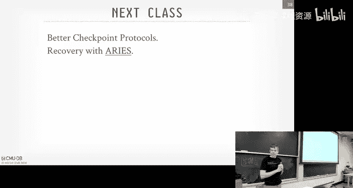
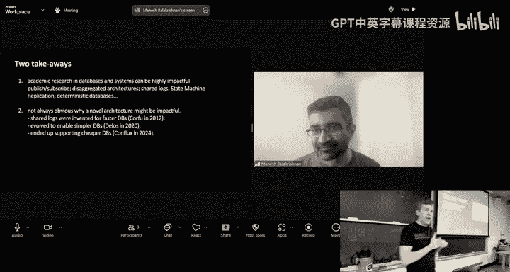

# CMU《数据库导论｜Intro to Database Systems (15-445645 - Fall 2024)》中英字幕（deepseek翻译 - P21：#20 - Database Logging ✸ Confluent Database Talk.zh_en - GPT中英字幕课程资源 - BV1Tys8eQELW

Yeah。い？OfficialIs that how she build a rail system？Yes。We laugh。 But like， that's actually what。

Big database vendor do， right， they， there's some standard benchmarks like TPCC， TPC H， TPC， B， S。

 The queers are， you know， the Theque has been around since 1992。You know what the schema is。

 So you say， okay， well， like， if I know exactly what workload you're trying to test me on。

 I'll do some shortcuts and make things faster。 So， for example， when TPCC。

 there's there's this table for the warehouse。 I think of like。

It's like an Amazon fulfillment Center。 So there's a warehouse， there's a district and customers。

 customers have orders customers items right。 So there's tree structure。

 The N warehouse is limited and you never really update that table。

 So instead of defining a B plus tree when you call create index， you say all right。

 well I know what table， this is a warehouse table for TPCC。 I'll just make an array。😊。

Then you're jumping in exactly the right offset to find things。 And it's super fast。 Like an array。

 where you know exactly the the， the offset to jump into， is's way faster than a B plus3。 that's01。

 So they do tricks like that。 So his question is like。😊。

Is it okay to optimize your data system just for the workloads we're giving you， Yes， but。Yes。

 but in the industry， you not to do that， but people still do it。哎。Alright， make sure were recording。

 Allright， So a lot to cover。 a lot to this get started。 So this is another good one。 right， This is。

 this is another key aspect of what we want to build in our database system to make sure you know。

 people can actually save their data not lose anything。

 And it's why you don't want to write your own， you know。

 database system if you're building application。 You want to use existing one because thiss gonna to be hard。

😊，All right again for everyone in the class， Project three is do this Sunday we have the Saturday office hours coming up on the 16th of Saturday three to5 same location。

 same location and gates on the fifth floor Project 4 has been posted last night and that'll be due on December 8th which I think is the week right before the finals and then again the final exam will be due on December 13 it will be at December 13 I forget what the room is but itll be 8 30 a。

 okay again， don't travel before this date there won't be a you can't come and take exam early okay。

rightSo last class was was us wrapping up the discussion of conker control protocols and in particular we looked at last class we looked at multiversion con control and despite the name being concur control。

 the concept of maintaining multiple versions in a database system is going to affect the entire architecture or we saw at the end that case indexes。

 your index is kind of to be aware like oh maybe be pointing at different versions of the same logical tu or same logical tuupple and you have to account for that in the execution engine has to be aware of these things all parts of have to be aware of it。

So for concurrency troll， the protocols that we talked about are going to provide us with aity。

 consistency and isolation guarantees of the four things in acid。😡。

And so the big thing that we've been。Dancing around or not really discussing。

 And I've mentioned it for a little bit。 know， this is the right head log we handle this。

 But the last piece of the puzzle we need for acid is the D duability。

 Now we're also going to also rely on recovering protocols to give us atity as well。

 in case some transaction write some stuff you know。

 to a database and half a makes a disk and half doesn't make the disk need。

 we need to handle that case as well。So， so it should to be pretty obvious anybody here why we want durability in our database。

 right but the basic setup would be something like this。😡。

We have our transaction running T1 and what it call is begin， it starts reading A。

 and so that's not in our buffer pool， so we're just going to go out the disk and fetch that in put that in a frame we talked about before。

 you got put that in project1， we know how to do that， that's fine。

Now they go ahead and do a right on a， and that's not a big deal。

 we just apply the change to the record of the object in a page in memory in our buffer pool。😡。

Right and then that's time。And then now， when they go ahead and commit。Right。

The guarantee or the property that we want to provide under As is that if we tell the outside world upon commit that your commit was successful。

😡，Then no matter what happens to the database system， within reason。Right。

 if it catches on fire and melts like。You still， we still have to handle that。

 But we'll get that in a second。 Like， but if we tell the outside world that， yes。

 your transaction is successfully committed。Then no matter what happens。

 they should be able to come back and read that data。So let's in this scenario here。

 we tell the outside world that your transaction is committed。

 the worst person in the world comes along， zaps the power station for the data center that's running your database system and your buffer pool gets blown away because it's in memory。

RightSo now of course， the problem in this case here， going back。

 this transaction modified a equals 2。 We told the outside world that you committed。

 but we never put it actually on disk。So now when the system comes back， we get power again。

 when we go fetch to that page back in， we're going to get8 equals1 and again。

 under asset properties of durability， that should not happen。

So today's class and next class will be about how to handle the situation。

 and this falls under the broad category of a description of recovery。

 recovery protocols for a database system。And again。

 it's going to provide us the consistency of durability and andimity guarantees we need despite their being failures。

Right。So if transaction rolls back on their own， we got to make sure we clean that up if the power gets pulled and we told the outside world transaction committed。

 we had to go clean that up。Now， it may be in some case that a transaction goes ahead and commits and we say it's committed。

 but we are about to send the message back to the client to the application say yes。

 your transaction committed in that case， the power goes down before that message gets sent。

 that transaction is still considered committed。😡，Because depending on the recovery protocol we're going to use。

 changes what made it to nonva those storage。Al right。

 so recovery algorithm is going to have two parts。 Thoses be the first part we're going to talk about today are all the extra things we're going to do while transactions are running。

So that we can handle the situation where there there might be a failure。

So we do a little extra work while our transactions are running to make sure that we can always recover things later on。

Next class will be dealing with the situation okay after we've come back from a failure。

 like we got power back， the system comes back on， we had to look around at our disk and figure out。

 okay， what was the state of the system at the moment of the crash and try to put us back into the correct state So today's class is preparing for the failure。

 next class is how to handle the failure。😡，不该。So the， the sort of overall outline is first。

 we're got discuss， obviously， what's going happen in the buff pool， right。

 because that's we're gonna we have to stage all our changes in memory。

 So we have to understand what's going go， what's going happen。 what。

 What did the Buff pool allowed to do to prepare ourselves。

And then we're going to talk about two different protocols， shadow paging and right ahead logging。😡。

The spoiler is going to be righthead logging is an approach you're going to want to use。

 and most systems are going to use this。 Shadow paging is what they invented at IBM back in the very first system and the system are。

 Some systems still do this today。 But in practice， you don't want to do this。

 Righthead logging is always need the superior choice。

Then we'll talk about what we're actually going to put in the right ahead log and then we'll do a preview of what checkpoints are going to look like and explain that is as we go along。

 and then that'll segue into next class where we talk about how to do a better version of checkpoints and then load the checkpoints back in。

And then we have a speaker today coming from Kflin， which is the big company backing building Kafka。

好看。All right， so as we talked about since the very beginning of the semester。

This whole class has been about assuming we' we're dealing with disk oriented database systems where the primary storage location of the database is added on some kind of nonvato storage。

 a disk， a spinning disk， hard drive and SSD， cloud storage。 It doesn't matter。

And then we obviously have to use the classic viomman architecture where we copy pages from disk into memory and operate on them in memory because that's be faster for us。

 and then be some algorithms and choices we're going to make to allow us to maximize the amount of sequential access for reading writing data from disk because that can to be slower than random access。

 whereas if it' in memory we do random access very quickly。😡，So if we got。

 we got to modify something。 We're going first copy the the pages into memory。

 perform the rights on the pages in memory。 and then we've got to write back these dirty records out the disk because。

 again， if we crash， you're gonna lose all the contents of of DRA。

The research basically said you get 30 seconds of DRA， you can actually still read things。

 but all your program counters， everything else is blown away。

 So you definitely need to get things out on disk if you want to retain them。

So the thing we got to have to guarantee is that， again。

 for any transaction we told the outside world that you've successfully committed。

We had to guarantee that their changes are durable。😡，Right and of course。

 now that also means that we can't have any a partial changes。 like we tell。

 if a transaction didn't complete， we don't want to retain half the right they made to disk because the other half was still sending a memory because then you would have torn updates。

 and that wouldn' be that would violate the aity guarantee。

So the two key primitives I're going to rely on to achieve this are undo and redo。

RightAnd they're exactly as they sound。 right， So the undoop is going to be the process of removing changes or effects of transactions that did not complete successfully。

Because they abor it because the， the transaction set aort or the system crash or the data system says。

 you know， because the two phase locking or OCC， they weren't allowed to commit So thebt。

 It doesn't matter the transaction is considered not， not committed。

And then the redo process is just saying that， okay， for any transaction that did commit， again。

 where we told the outside world， at least attempted to tell the outside world that your transaction has committed。

Then we need to make sure that all of their changes are retained when we come back。Now， again。

 another transaction may overwrite those changes from a previous transaction。 That's fine。

 but we we still need to make sure that every transaction that is committed。

 everything's written out。So now how we're going to actually do undo and redo is going to depend on what the buffer manager is going to do for us。

So now we're going back to Project1， we're actually going to modify it a little further because it needs to be a bit smarter about what's going on in the system to make sure that we can recover if there's a crash。

😡，So here's the basic idea。 So say we have true transactions now T1 wants a read A。

 write A and transaction T2 wants a read B and write B， So they're not conflicting。

 We're still going to run two phase locking or OCC or whatever protocol you want on top of this these different layers are somewhat interchangeable。

 but for this transaction they're commutative。 So there's no conflicts there。

So assume we have enough in our buffer pool at the very beginning。 T1 starts， does a read on A。

 So we know how to go at the disk， Fe that page where object A exists。

 assume we have one page Fe it in our buffer pool。 That's fine。

 Then we go ahead and do our write on A。 So then we sorry then we update the record here。

 instead of the A3。😊，Now that the context switch would come over here， we do a read on B。

 well that's already in our buffer pool so that's fine， we're good there。

 now we do a write on B again， it's in the same page where A was。

 we go ahead and update and that's fine and we're done。And then now though， T2 wants to commit。

So what do we say， or any transaction what we tell the outside world that it's committed？

We got to make sure that its changes are written at the disk。Okay， well。

 what if I go ahead and write out this page here？😡，Right at the disk。 What's the problem with this。

T 1， updated a。Those changes are in the same page where T2 modified B and they went along for the ride because they're in the same page because you can't do by the addressable updates。

 They' got to do page based and block based。 So this for code by page where they changed to A and B got written out when B committed or sorry T2 committed。

So now we tell the outside row T2 is committed， that's fine， so it's durable。

 but now we have the problem where T1 needs to roll back。Right， but now we。

 we got to go back on disk and undo the change we did on a。Right。So that sucks now， right。

 because now we gotta， if we just， we just wrote everything out when this guy went go to commit。

It's going to get a bunch of stuff that maybe from transactions that haven't committed yet。

So that's obviously bat。So the policies we've got to be aware of there's two or two decisions we gonna make in our B manager。

 And the first one' is gonna to be called the steel policy。 And the second is called the。

The the force policy。So in the steel policy， determines whether the database system is allowed to evict a dirty object from the buffer pool。

 So a dirty page in our last example。That was modified by a transaction that has not committed yet。

So even though T2 is modified it and they're going to commit。

 there's still another dirty change in there from T1， T1 is not committed。

And the issue is going to be is that if we write out that dirty object to disk， again。

 assuming it's a page， then it's going to be overriding on disk the most recent committed version of that object。

😡，From another transaction。So with the steel policy enabled。

 you're allowed to evict 30 pages before transaction is committed and essentially by the byproduct of that。

 you then overwrite the thing the most recently committed version on disk。If you do no steal。

 then you're not allowed to do any eviction or overriding。

Meaning every page in your buffer pool that has been modified by a transaction has to stay pinned in there。

 it cannot be evicted。So。What we'll get to the the red head logging is gonna be using the steel policy。

 right， because if we're allowed to evict things that from uncomitted transactions。

 then that gives the Buff manager replacement policy， the LRU K piece get you guys built。

 It gives it more options on how to， you know， what frames you can free up。Right， under。

 if you don't do no steal， then everything that a transaction modifies has to stay in memory。

And of course， that means that if the transaction modifies more pages than you have memory for them。

 you're screwed because you can't evict anything out。The other policy is called the fourth policy。

And this just says that when a transaction commits。

 is the data required to write back and flush out all the changes for those dirty pages to the disk before we tell the outside world that your transaction has committed。

😡，So if you do the force policy enabled， the right packet are required。

 meaning when a transaction calls is commit， anything they modify in the buffer pool has to get written out。

😡，If you do no for us， you don't require it。So four things is going to make it easier for recovery because before I told the outside where you committed。

 all your changes are on disk， fantastic， so when I crash come back， I don't have to do anything。

Because I know if I told you you committed， then everything's on disk and everything is correct。

Because that's gonna be slow now becauseuse now when I call commit， I gotta flush everything。

And I've updated a billion tubs that I got to wait for all those billion tubs get flushed。

So let's go back to the example we have before， but now we're going to do no steel force。

 so no steel says again that no dirty pages can be evicted from the bufferpo before a transaction commits and force says when a transaction commits with a then that's when we flush everything out。

So again we do the read on a， fetch in bufferuff pole that's fine， we do the write on。

 it updates the page， says it A3， that's fine， then context with Q over to T2 T2 does a read on B。

 that's our RNA buffer pull we're good there， T2 does now the write on B and updates the page there。

 now it wants to commit so again under the force policy when we call commit all the dirty pages that T2 modified have to be flushed to disk。

But， of course， we have the other problem with the the conflict now is that under no steel。

We're not allowed to write out any dirty pages from transactions that have not committed yet or any changes。

 And because， again， we're dealing， say 4 kilo，8 kilo pages。We have two tros and there got modified。

 One got modified by T 2，1 got modified by T 1。Now we have this conflict where like we want to flush this thing out。

 but we can't because half of it， part of the changes can't be flushed out。

So a simple trick to fix this is just copying the page in a buffer pool。

But only include the changes from the transaction that did commit。

And then now we go ahead and write that out。So then now when we come back over here and T1 goes and tries to roll back。

 now this is trivial to do because there isn't any notice。It。It didn't modify any。

 nothing that it modify it made  a00 disk。😡，So at this point we crash。

 we've already told the outside world T2 is committed。So that's fine。 So we crash come back。

 This thing is correct because it has changes from T2， but not T1。

Do think it's a good idea or a bad idea？Why is it bad？It involves。Sa it involves a copy。

 the Mem copy， correct。 Yes， So this part sucks。 right， Again， it's on PowerPoint。 It's3。

3 cells in a page， whatever， nothing。 I updated a billion pages。

 I got have a billion copies to remove anything， you know， say。

 a highly concurrent system of thousands in transactions running at the same time。

 I got to keep track of what all pages they modified， which youre sort of doing anyway。

 But now gonna make copies of them to figure out what's the。

What' the a bare minimum I need to have to write something something out the desk？

There's a lot of overhead involved in this， you don't want to do this。It does make again。

 recovery easy。Right， and it' it's pretty easy to implement。

You never to undo changes from a Board of transactions upon recovery because nothing got written at disk。

Right，Yout have to redo changes either because on the fourth policy。

 you know that when when you told the outside what a transaction committed。

 all the changes are out in the disk。 So when you come back， everything's just there。Right。

Like I said， but you still have to maintain the right sets about what the transaction changes are're making。

 and that you may run on a memory pretty quickly if you make a lot of changes。So again。

 no system will actually actually do this。A side come and I'll say too is the you actually burn up the hardware pretty quickly too。

 So on SSDs， they have actually a limited number of rights。

So if you just write to the same cell over and over again， I mean， it's in the hundreds of thousands。

 but， if you're flushing every transaction for every single page， you'll burn that pretty quickly。

So the way the hardware vendors get around this is you buy 128 gigyte SSD。

 There's really like 150 gigytes on there。RightYou just can't get to it all because they know the cells are going to burn out and they just replace it with ones that。

That are you know that are。They have less wear leveling。But eventually you'll burn it out。

 no device is going to last forever。So again， if you're flushing 100，000 transactions a second。

 all the pages they modified on a single SSD， you'll burn through that pretty quickly。😡，All right。

 so we want to be a little smart about this and not have to make higher copies every single time。

So this is what shadow paging is。 So Sha paging is going to be a no steel force bufferable policy。

Where instead of copying the entire database every single time。

 we're basically going to be doing what I had just showed before。 We're going to be copying pages。

But we're not going to allow multiple transactions to update the same page at the time same time。

 So now when I have to do a flush at the disk， I don't have to excise out the parts from uncommitted transactions。

AndLike I said， this is what IBM invented。 its system are in the very beginning。

 this is what a lot of the earlier data systems implemented in the 70s and 80s until our right ahead login came around。

Late 70s， early 80s， and that's everyone switched over to bat。

We'll see why this is going to have a bunch of problems other than the ones I've already talked about。

So to keep it really simple， we're going to assume that we have a there's only one writer transaction at a time。

😡，And then you can have multiple re transactions。So in some cases in SQL。

 you actually can call begin when you start a transaction， you can give a hint and say。

 I'm going to beread only。And the D can be aware of that and do some optimizations accordingly。

So the。There can be essentially two page tables。 And you think of that as the page directory of like pointing to。

 here's the latest version of of， or here's the， here's the page for this， this。

 for this page number within this copy of the database。

And so there'll be a master copy that's only going to obtain changes from committed transactions。

 and then the shadow copy will be a temporary space where we'll apply to changes for uncomitted transactions。

Then when a transaction goes ahead and commits， we flush out all those dirty pages from the shadow page table。

 and then we have this pointer that says， here' the latest here's the current master page table。

 and we just swap that pointer， swap flush that out the disk and now we're pointing to the old shadow becomes the current shadow becomes the new master。

😡，Right。So let's， let's look at how those look。 And this is basically how copy and Write works。

 if you ever do like in Linux， like Linux is trying to do copy and， It's basically the same idea。

All right， so we have， again， we have in memory， we have on disk， we have this master page table。

RightAnd then when a transaction comes along， assuming that we're declaring that that we're a readrite transaction。

 So we'll make a shadow page table， which is copying the current master page table and all the pointers think of like the mapping of a page I to some some page on disk。

 all the pointers are going to be exactly the same at the very beginning which because we're just going to point to the latest version of the database。

But then now if the transaction modifies a page。😡，That the first time that it tries to modify a page。

 like page one， we're going to make a copy of the page on disk in our buffer pool。

Write our change to that。 and do this for all the other changes。

 So're basically replacing the links on our page table to copies of the of pages。

For this particular transaction。Now， if that other transaction comes along at this point and is read only。

 then they'll look at the master pointer record。And you'll see， okay， here's。

 here's the location of the master page table。 And so it'll run all its transactions and read all the data it wants from。

 from the， the master page table。 So it's seeing the older version of the。

 the database doesn't see any of the changes that the， the， the writing transaction made。😊。

Then when the writing transaction goes commit。We flush all any pages that it made and changes it to made to in the shadow page table。

 those get written out the disk， we then have to go update the master pointer record think of like it's in the header of the database file or some special location to say。

 okay， this transaction is committed and now the master pointer is going to point to this page table and this becomes the new master page table。

Then again any other transaction that comes along， states read only。

 they're going to see these records。Of course， now we've got to go ahead and clean up the old mesh page table。

 So it's just like sort of garbage clutch we saw at MVCC。NVCC had multiple versions。

 you could have every transaction is updating the same record， you have a long version chain。

This is basically a two version system。So then we've got to go ahead and clean this up。

 reclaim the space。And then we'll just repeat the process the next。

 time next transaction comes along。So what are some problems with this？Yes。Were very well with。

Said would not work very well with multiple transactions。 Yeah， so be so the way you would have to。

 if you want to handle multiple transactions， you would basically have to run them in sequential order。

I mean， actually not really true you could still do two phase locking or OCC on top of this。

 and you could allow them to interleave each other and you still protect tuils and records this is before。

 but when it goes time to commit if I have two transactions in a batch that I run one transaction finishes in one millisecond。

 the other transaction finishes in one second。The one millisecond transaction has to wait until the one second transaction finishes。

 Then they go ahead and commit everything。So you basically run things in batches。

The idea of having a single writer thread and multipleread threads， that's not that outlandish。

 that's how SQL light works。Right， and it works pretty well。So。Recovery is super easy in this。😡。

Rollback is super easy as well。 If a transaction of boards， what do you do。

 Str the shadow page table and clean it up as if it was garbage like you would later on。

And then when you crash and come back， it's super easy as well because long as this pointer got updated。

😡，Then I know that the transaction is successfully committed。 And so when I crash and come back。

 I don't， I ignore anything that's in the shadow page table。

 And the master page table has always the， the latest version of the database system。

Or of all the committed records。So undoing this is easy because you just blow away the shadow pages and leave the master and the Davis root alone。

 and then there's no redo needed it at all because when you come back。

 everything's going to be there， yes。I'm just trying to understand this context within like the B pool manager context so I understand that the master page table and shadow Page table lives in like B pool manager memory but like the actual pages that was being modified like pointed by these page table pointers。

Does they bypass， they bypass the buffer performanceer directly gets through Yeah question is like。

What are these boxes and what are these arrows basically little disk， right， So this。

 this is just the page table we had in your before managed before。

 But now you basically partitioned it and say， like， here's the shadow pages and here's the， the。

 the master pages。And then you would do a copy on right。 So I'm showing the arrows happening。

 like when。Say what's going back here。 When this guy modified one， right， you would recognize， okay。

 well， I'm pointing to now the a page in in the master page table。

 So I'll make a copy of it in my buffer pool。 So I can make changes to it。 And then at some point。

 I got to make sure I I then write that out the disc as well。So in this case here。

 because it's a no seal flush。That when a transaction commits。

 that's when you write all the dirty changes out from the。

 the shadow page table out on the disk for for illustration purposes。

 of just showing it as they were， as they were happening。But that obviously would be slow。Okay。

 so we've covered a lot of these before。 but why this sucks， right。

 So the the copying the entire page table is expensive， right。

And then the overhead of commit is high because you have to do that flush。

 and you have to make sure that everything gets written out。Another big problem is that。

 and this is what the IBM people saw when they first built this is that。

Before all my data was nicely contiguous and thinking out on disk。 So going back here。

 before I made my， my shadow pages， everything was contiguous。

 So now if I wanted to do a sequential scan， I'd just read the pages one after another。

But then after I've， you， I've run a transaction and then I've cleaned things up。

 Now I've got empty space in here。That now it all my data isn't contiguous。

 So now I can't maximize the amount of sequential I O I I can do。So over time。

 things get fragmented and you got to。Basically， clean things up。

You guys are applied to young for this。 But the old days of the hard drive。

 there' would be like a Df command that you'd basically just repack everything。

 Like like like almost like running vacuum full and Postgres。

So you basically have to do the same thing here。So Sequel light actually started off doing something。

A little bit like shadow page， not exactly。 but they had this thing called the rollback mode。

 The first versions of SQL light came with this。 And then I think 2010。

 they then added the right ahead log for for performance reasons obvious reasons。Right。

 so the way SQL lights Wellback mode will work is that you have your pages in memory。 you have your。

 your， your database on on disk。 But then you have this other file on the side called the journal file。

So that now when a transaction wants to modify a page。Right， youd， you bring it up from the disk。

 put it into your bufferuff pool， And then you would neatly copy it out into the journal file。

Before you made any changes to it。Then now you can go ahead and make your change in memory。

Do the same thing for the next page here， make a copy of it right out to the journal file。

At then now， when the system crashes， Sorry sorry say you， you you。

Say some of the changes got written out the disk for page  two。

 but then now if the system crashes before you write out page 3， at this point here。

 you would know the transaction has not successfully committed。

So the buffer in memory gets blown away， but then upon recovery。

 the very first thing you do is look for that journal file。

And then you copy back the pages into memory。 because you know these are the original versions of the pages before a transaction that started modifying them made any changes。

And then you just go ahead and just blindly copy them back out to disk to say。

 because you know this was the correct version of the database for these pages before whatever transaction was running made any changes。

😡，again， Se light has a single writer thread， so they're not worried about a bunch of changes being made to pages by multiple transactions。

 They know that there's only one transaction could be modifying things so either all their changes should get applied or none of their changes get applied。

So then I think when a transaction commits， they just delete the file。

 mark the journal file as no longer needed。 So then when you come back。

 you know not to reverse changes from a committed transaction。

So another big problem with these approaches is that the。They're requiring the data system。

 basically do a bunch of non。No sequentialial rights to disk。

RightMeory said that that was one of the big design decisions we wanted to do in the beginning was that we want to choose algorithms that may actually be not the most efficient way。

 but and pencil on paper， but because it'll maximize amount of sequentialial IO we can do。

 we'll get better performance。So that shadow paging stuff going back here。In my S light example。

During a file。 that's sequential I O because I suck that into memory。 That's fast， right， But。

 you know， I'm showing page  two and page 3 being updated but like。

 but what are the the the updates the pages are scattered around the file。

 Now I'm doing random I O to go correct the database。And that's， that's going to be bad。 That sucks。

So we went away to convert。You know， randomandom rights to disk into sequential rights。

Because that's always going me much much faster。And the way we're gonna to do this is through the right head log。

 And I said before， this is pretty much the approach that every data system that's out there today。

 They're going to be doing something like this。There might be some， you know。

 variance to what they're actually storing in the right head log when they actually flush group commits there's much of tweaks you can do to this。

 But at a high level， this is what everyone's doing。

So the idea now is that we're going to maintain a log file。

That's going to be separate from the heat files of the database where the tables are。

And the log file is going to contain the bare amount information you need to know what change a transaction made to an object in the database。

And what was the state of that object before that change was applied？

You can store some extra stuff in there like checkss and timestamps and things like that。

 but the bare minimum you need is here's the transaction that's making the change。

 here's what they're changing， here's what it was before。

 so I can do so I can do redo or I can do undo and here's what it should be after so I can do redo。😡。

And the key thing we're going have to do to make this all work is this part right here。😡，Is that？

If we tell a transaction， tell the outside world that transaction is committed。

 then we need to guarantee that all the changes that it made to the database。

 the corresponding log records for those changes are flushed to disk。

And before we're allowed to write out any dirty page from the Buffpo out the disk。

 we need to make sure that the log records that made that page dirty。

 those are flushed out the disk first。😡，So again going back to thinking about like I drew that diagram of like here's all the levels and then now we're adding recovery and contro and it encompasses everything because now we need to be now our bufferable manager needs to be aware of what transactions are。

 what changes they made needs to know what log records are because now when it runs its eviction policy has to know the log record for this that made this page dirty。

 that's safe on disk， I can go ahead and evicted or this other page is dirty。

 It log record is's on disk， I can't evict that。😡，Because I would violate this guarantee and could cause us to lose data。

So this approach， it' to me using the steel， no force a bufferable policy。

 So steel means we're a lot of big pages。From uncommit transactions。

 if those log records for that uncommitted transaction have been written a disk and no force means that we don't require us to flush out all the  dirty0 pages in our proper pool when a transaction commits。

 we just have to make sure that the log records have been flushed out the disk。

So if you sort of think of like the different choices now in the quad chart the doing steel no steel force。

 like in shadow paging， that's trivial do right， but it's gonna to be suck from performance。

 we want to be in this upper quadrant here。 we want to be we want to allow we want steel to be turned on because we want to be able tovic things before transaction is committed that gives them more flexibility and can make more room for data as we need and then we want to be able to not require force because when a transaction commits。

 we don't want to flush everything out， which could be a bunch of random ion。

If we just flush out the log record， well that's the to a file， that's sequential IO。

 we can make that fast and work well。So again， with force。

 it's going to require us to flush every page when transject commits。

 but it're going to get poor response time with a no deal。

 we're going to get bad performance because。We have to keep。

 we're keeping pages in memory that we could have been used for new data that we might need for other transactions。

But it's really easy for ab transactions because nothing got written disk。And in this case。

 here are no force that would be great for us because。Well， it's， it's gonna。If he， if he。

Transaction fails。 The system crashes before Four everything's written out。

 we got to be able to redo the changes。 And so we'll handle that with the righthead log。

And then with steel， this allows us to flush out  dirty0 pages。

 even even if a transaction that's updating it is still active because we can reclaim that memory for other transactions that are running。

So we want to try to hit this again， the top quadrant here in the top right。

So the way it's going to work is that therere going to be this。Log buffer space。

 it could be back by the buffer pool typically not not always。

 but it's some dedicated space in memory where we're going to stage all the changes from transactions for all the log records for those changes。

😡，And then we keep track of of， of a way。 we have a way to keep track of like a log sequence number we'll cover next class。

 We know the order in which these log records are getting applied。

 and then we know the the log record number that corresponds to a change that that made was made to a page so that when a。

When we decide whether to evict a page under the steel policy， we would know is the log record。

 what's the watermark， what's the threshold for the log record numbers that have been written at disks。

 and therefore I know anything that was modified by log records prior to that are durable and disk and therefore I can get evict。

And as we said before， a transaction is not considered committed。

 we don't tell the outside world that your transaction is safe and durable until we flush all the log records out to nonbler storage。

Now， 30 secret is a bunch of systems actually don't do this by default。😡。

RightSo everyone know what Eync is， Eync is a blocking call telling the operatinging system that do not return to me until I know all my changes have been written are safe on disk。

And so in some systems， you call commit and they'll come back say yep， good， you're committed。

 and then eventually it actually get flushed out。So you can turn synchronous commit on。

 but you're obviously going to pay the penalty that and performance spending we'll see how to make that faster in a second。

 But most systems by default， don't give you synchronous commits。There it's like good enough。

 like if you， if you're okay with missing， maybe there's a crack。

 you might miss the last5 milliseconds， that might be okay for some people， some applications。

All right， so the protocol is when a transaction starts。

 we're going to append a begin record to this log buffer we have in memory。Now。

 most systems you know。I'll show this for completeness in the diagrams in most systems。

 you may not even store the begin record until you see the first query of a transaction。

 So just because you call begin doesn't mean you actually start writing anything in other systems。

 you don't actually put a begin at all because you know first time you see a query Well that's the beginning of a transaction So that's the starting point。

But for simplicity， we'll assume that there's always an explicit begin。And that now。

 we're going to have a log entry， a log record for every single change we make to an object。

 And for this， we're going to store four things。 transaction Id。You know。

 the transaction that made the change， an object I of what was modified by the transaction。

And then the before value that we would need to do undo and then the after value that we need to do redo。

I said， in， in different systems， we'll have additional information。 maybe check sums。

 timestamps and other information。 We'll see what。We'll see different actually， the logging schemes。

 you actually could restore like， here's the page number， here's the offset， here's the slot number。

 There's bench check yourself。 we can store in there。 but for now， we won't put anything else。

And then actually， as I said last class， the version version of Postgres really didn't do right ahead logging because they were doing a penon MVCC。

And they just assume that the says I'm always making a new tuple。

If I have a wait to say whether transaction is committed and write that out to the log。

 and then I don't need to go back and reapply any changes because I'm always doing copy on right。

So if you're not doing pen if you're doing a pen MBCC， which most systems aren't。

 then you can get by with not having sort the undo。

Because you're always going to have the original version of the tuple。

So then now what a transaction finishes。We're going toend this commit record to the log。

And then before again， before we tell the outside world that youre committed。

 we've got to flush the the， the log up into that commit point or maybe even a little bit farther。

 depending how we batch things up。And then once that's durable on the task。

 then we can acknowledge to the application to the outside world your transaction is committed。

So let's see what it looks like。 So T 1 starts， wants to be right on A and right on B。

So when it starts calls begin， we add again， we added a begin entry to our log。 again， this。

It makes it look like the redhead buffer log space in memory is much larger than the buffer pole。

 This is always going much， much larger， But for some make a fit on Powerint I'm just you know。

 showing it approximate size， whatever。All right， so we got the call begin。

 so again we add a begin entry to the right head log。Then it does a right or name。

 So the very first thing we're going to do before we modify the page is we're going to put a log entry in for T1 of the transaction ID。

 the object we modified， and then the before and after value。Then we go ahead and modify the page。😡。

Because we actually want to record in the page， we'll see this next class。

 well record actually the log record number， the log sequence number of the change that we're making。

So we need， we need to put the entry in the log log first， the buffer first。

 before we make the change。Now we do it write on B， same thing。

 I'm going to pen the log entry in the buffer， go ahead and apply the change to the page。😡。

Then I go ahead and call commitit。And then now at this point。

 seemingly there's no other transactions running， I'll flush the log buffer and append it to the log file out on disk。

And at this point， again， when we get acknowledgement from the hardware through the operating system or if we're doing。

 you know， remaining， if you're doing the direct I yourself。

 like when we get the acknowledgement from the hardware that our changes have been flushed。

Then we can tell the outside world that our transaction is committed。Because now at this point。

 it doesn't matter whether this buffer pool actually， the page 30 page actually makes up to the disk。

 right， if， if we now crash this all， all the the contents of memory get blown away。

Everything we need to replay that transaction is out in that right ahead log。We it begin。 We， we。

 we scan through and say， okay， the first thing you did was update A。 Allright。

 here's the value it should be。 And then update B。 Here's what the value should be。

So we can recreate the page that was modified by the transaction just through the red head block。

再 correct。And now the Ben also too is。As I said， this is all sequential IO。Right。

 because I'm just app the log， writing out particular data at the disk。

That's me way faster than if I updated a lot of pages and have to do a bunch of random I。Right。

 so now the committing the transaction is， is much， much faster。Furthermore， you think about it， too。

 like if I update。A billion tuples， and save those1 billion tus across 1 billion different pages。

Right。If I got to flush all the buffer pool pages， I have to flush all 1 billion pages。

 which you know，1 billion times for8 kilobys。Versus the log record or have 1 billion entries。 Sure。

 but the amount of data I'm have to flush out is gonna be much smaller than bunch of 8 k ride。

And that's all be sequential。 because it's all a be contiguous memory。

 I just write that all that out。Of course， now the problem is going to be if I'm flushing every single transaction when they call commit。

 that's going to be a bottleneck。Right， becauseuse the right time for SSDs。

That's about about a millisecond， one to five milliseconds。That sucks。

 If you have to go to S 3 and forget about it。 That's 10010000 milliseconds。

So one trick we can do that was sort of similar to the example that I brought up when we were doing shadow paging or batching things up。

 we actually can batch together a bunch of transactions that have committed。

They're all allowed to append to the log。And we， we don't have to worry about having a single writer thread。

 They can to end in any order that they want， right， because because up above all。

 this is going be the current protocol that's determining who's allowed to modify。

 what data at what time。 So all that still still is in place。

But then now I'll batch up their changes to the right hairlo so that there'll be some timeout every 5 milliseconds or so。

 Then I'll say， okay， whatever's in the buffer now， that's gonna to get written out the disk。

And so if， if you're the first transaction in that one that 5 millisecond window， Yeah。

 you gotta wait 5 milliseconds， but。For some applications， that's， that's not。

 that's not a lot of time。 That's not a big deal。So you basically get the main two right ahead log buffers now。

 I'm not showing the buff pages。 I'm just showing the right head log buffers。

T1 starts does a write on A So we put an entry in the log buffer for that。 Does a write on B。

 does put another log entry in that。 Then we context switch over to T2。

 We have to put the begin entry for that。 Does a right on C。 We have an entry。

 And then now before we can do it write on D。 The buffer buffer the log buffer is full in memory。

So we're going to go ahead and write that out the disc， we knew that asynchronously。

Because no one's asked to commit at this point， so it's not like we've immediately have to do it。

Well， write that outynchronously。 and then now we just tell any， you know。

 tell any other transaction that wants to add new entries to this other log buffer to start filling that up while the other ones getting written out the disk。

Then now say that there's a stall for whatever reason， right？Again， under a group commit policy。

 I would say， okay， every 5 milliseconds every 1 milliseconds。

 usually something you can tune in the system。HowHow often will trigger trigger flush。

So say these guys are waiting because they're going back to the client to get more information。

 it doesn't matter。 So then at some later point they say， okay， well enough time he's elapsed。

 I'll go ahead and write out this log buffer， even though it's not entirely full yet。😡。

And that's fine。 Everything's still correct。Right。And then now when this one gets flushed out。

 the other one is now free。You know， the top one to the transactions started pending law records there。

basicallysically just doing double buffering him。Pretty good。All right。

 so you go back to these sort of quadrants。The way to think about now a recovery policy or recovery protocol for a data system is how fast is it going to be at runtime？

And how fast is it going to be for recovery time？Again。

 we're not really talking about the recovery process yet， but you can sort of see。

 we saw examples of this like foresha paging， recovery was instantaneous because。

You just ignore whatever's in the shadow page table when you come back。So， the。

For the runtime performance， the buffer pull manager with the right ahead log side the right log approach is going to be the fastest under steel no force because again。

 I depending log entriesries that's pretty easy to do and Ive flushed them out and write them out as I need as I need doing scch IO whereas the shadow pagesaging is be expensive because you're blindly copying whole pages。

But now for recovery time， shadow paging is going to be instantaneous because you don't have to do any。

 There's no log to look at。Whereas in the。With righthead logging， there is a log。

 and you basically have to replay that。Because you have to do undo and redo to put the state of the database back to where it should have been at the moment of the crash。

 whereas with shadow paging， there's nothing to do because the da is。

Magically or instantously comes back as being correct。Alright。

 so now we've got to discuss where we're actually putting in the logs。Like like I was sort again。

 I'm showing things on PowerPoint， transaction ID object before and after value。

 and it could be a bit more。So。Physical logging would be the approach of like basically doing a byte level diff of like。

 here's what the page was before。 And here's what it was afterwards。

 or here's what the record was before。 Here's what it is afterwards。

Where you're specifying the exact physical location within a file， within a page。

 here's the changes that I made。Logical logging is can be the other end of the spectrum where instead of recording the low level byte level changes I'm making to data。

I just record， here's the query I executed to make that change。😡。

And then now when you basically recover after a crash， you just replay the query， re execute it。

Physiological logging is somewhere in the middle， where。

It is going to be like physical logging where I'm going to keep track of like here's the exact page that I modified by this transaction when I made a change。

But I'm not going to tell you exactly what offset within that page I made the change。

So I'll just record the slot number。And then now at runtime or when you recover the system。

 the data seems a lot and decide where in the pages， it's the a allowed to reply that changes。😡。

Right。So again， say we do a similar transaction that has one query like this。

 if you' do doing in physical logging， again， now within each entry for the updating the table。

 you're going to record like here's the page number and here's the offset within that page that I'm modified。

😡，And you're also going to record the change you make the index pages。

So you know to say for the primary key index， here's the modification I made to that page。

Because we got to make sure our indexes are in sync as well。

Because it's basically another copy of the data。 and we don't because otherwise if you crash。

 come back， know your indexes are gone， now have to do a sequential scan to rebuild them。

Logical logging literally records， here's the exact query that I executed。😡，So again， when you crash。

Assuming things are in order， you're basically replaying the trace of the queries that were executed for transactions at runtime。

This， this is more tricky to do。 You typically only see this in memory systems where there isn't actually。

A。There isn't actually a table heap that you're maintaining。

It's like you have snapt test to the database and you， you bring the entire thing back into memory。

 and then you reply the changes。The challenge， the cheeky thing also the two is like if you have nondeterminism in the query。

 like I have where set value equals X， Y， Z， but it was like， where was vow equals random。

Or timestamp， I got to make sure that when I re execute the query upon recovery， that I get the same。

 you know， use the same seed or get the same value that I had And when I ran before。

 So a little more work， you know， you have to do for this。And then physiological logging， again。

 it's just a hybrid approach to this where I'm still recording the changes I'm making within a page。

 but I'm just telling you， here's the page number that I modified。

 or here's the index page that I modified。 I don't know where the change is actually going to be applied。

 You'll figure that out。 The system will figure that out upon recovery。

So most systems are going to do a physiological logging because it。系い。Again。

 provides you more flexibility upon recovery， more freedom when the system boots up of how to reply the changes。

 so you you don't have exactly the same physical layout within this single page。

 know from one crash to the next or one recovery passed to the next。You have to make sure your。

 your scope are changes in the same page。RightBecauseuse there's all this internal data structures to keep track of like。

 here's the page directory and so forth。 You don't want to mess that up。 But within the page。

 you can， you can reorganize things。And that indirection layer of the slaughter array gives us that ability。

So a bunch of as I've already said before， like logical logging is going to store way less data than physical logging and physiological logging。

 like if that update query I showed before， if that update to 1 billion tuupples with physical logging and physiological logging。

 I need 1 billion entries for all those tuupils that are modified。But with logical logging。

 I destroyed the query string。And that one cr could represent a billion changes。Well， like I said。

 if you start trying to recover the database after a crash。If you， if you just replaying the， the。

 the queries again， there's no magic button we can hit upon recovery to make those queries run faster。

 faster than they would。Versus when they were actually running during regular execution。

 like even though we're in recovery mode。We can't the query takes an hour to run the first time is it can take an hour to run the second time in recovery。

It gets even more tricky or if you're running transactions at lower isolation levels because now if you start trying to intermix the transactions upon recovery。

 you may not guarantee the exact same outcome because you may read data from another transaction that you didn't read the first time。

 but now you're reading it the second time。So there's things get very。

 very difficult if you start doing this and most systems don't do this。For these reasons。

So I'm gonna show one quick slide about this other concept， because I want to be aware of it。

But it's's it's very common in the real world。 but this is not something we'll cover in an the exam。

 but。Remember the beginning， we talked about there's these OTB databases and you have these data warehouses and you can stream updates from the OTB database to the data warehouse and do all your analytics on that。

And we talked about this being what's called extract transform and load。

 and the DBT guys came about this That's sort of what DBT is providing for people。

A ability to do that。So what's cool about the right ahead logging is that we can use the right ahead log。

 not just for recovery， but also for replication and propagation of changes from one database to another database。

😡，Because what， what is recovery。While it's taking the redhead log and looking the changes I made and applying it to a database。

You could do the same thing for another database that has a copy of the data。

 We just sort of like it's in this virtual recovery mode。

 you have another database where you're getting all the changes and you're just sending over the redhead log and applies it to that system。

It's essentially how distributed systems do replication as well。😊。

So this is called change data capture and you would use this in the context of an ETL or extractionions from a load pipeline。

 so there's a bunch of different ways to do this。 right ahead logging is the easiest one because you already have the mechanism to generate the right ahead log for recovery So now what you have is you just have to send that right ahead log over to another system who then applies the change and synchronizes its database with the original one。

So you're piggybacking off a core component。Or of the recovery protocol was right had logging in a data system to do more things with it。

 to send changes。Becauseuse otherwise you have to replicate queries。

 like it's another way to do this。 And we'll see that later on。

 Well tell what distributed database is next week。 but， this is pretty easy。

So there's a bunch of tools that can do this， Oracle Golden Gate is probably that one of the most famous ones。

 Dbeium is an open source or tool out of red hat。The reason why I'm kind bringing this up now is today's talk。

 Al Speaker， is from Kafka。And thebeessium basically is is the arrow piece that facilitates the movement of the right ahead log from one system to another。

And you would send that over Kafka。And copper guarantees that the the data will arrive in order。Okay。

 so。Right a log that seems like Claire Wayne， we wantan to do this。But there's an obvious downside。

 is that。The right analogs is going to grow forever。

IfI'm constantly running transactions that I'm keep app things to the redhead log。

 they'll flush out the disk。 that's fine， but this thing's going to grow indefinitely。

And then now if I crash， come back， depending how long my right analog log is。

 that recovery time might be really， really long。Like if my system has been running for a year。

 or10 years。If I crash and come back， I don't want have to replay 10 years of log of a lock。

So the way we're gonna， we avoid this is periodically。

 the system is gonna to take what are called checkpoints。

Where we're going to flush out all the duty pages that are on disk。

Put a little hint in the right ahead log and say at this point in time， we did a checkpoint。

 and therefore the system may not have to go all the way back the beginning of time in the righthead log to recover the data stack back to the correct state。

Because we've flushed everything out。And then therefore。

 depending on what transactions were running what they were doing。

 we could truncate the log and cut off at some point and not， you know。

 not not have to retain that that long history。So I'm going to show a naive checkpointing scheme today and how this incorporate this in the redhead log。

We'll see why it has problems， and then next class we'll see how to actually do a more efficient one that everyone really does。

So a naive checkpoint scheme would be blocking or resistant checkpoints。And basically。

 every so often， youre say， all right I'm to take a checkpoint and you pause all transactions。

 pause all queries。😡，Maybe if some queries start running， let it finish， right。

 you basically stop everything。Then you flush out the。

 the log records that are that that are in memory to disk。

 Then you flush out all the dirty pages that are in the buffer pool out the disk。

Write a checkpoint entry into the right head log file， flush that。Then on pause， everyone。And again。

Because all the log records for any modified pages have written a disk。

 even the transactions haven't committed yet， which were allowed to do under the steel policy。😡。

That when we crash come back， the， we have enough information to restore the database back to the correct state。

So let's see how this works。 So say we have this red ahead log we're generating here。

 And then after this last entry by T3， we， we crash， right。

So now when the system is going to come back up， it's going to look in the right head log and say。

 aha。I I took a checkpoint here at something you basically start at the end。

 scan back until you find the checkpoint。So I know that at this checkpoint entry here。

 I got to look around before going back in time and forward in time at that checkpoint to figure out what was running at this time。

 what changes they made and what transactions that I need to guarantee those changes are durable in disk and what transactions that I need to roll back。

😡，So at this point here。😡，We know because if we look up in the log， we see， oh T1 committed。

 when we took the checkpoint， we flushed all the dirty pages at the disk。

 therefore we don't need to do anything with T1， we can just ignore it because we know all its changes have been reflected in the pages on disk。

😡，That's fine， that's good。But now for T1 for T2 and T3。We would look back and say， well。

 we see the begin entries for them。Before our checkpoint。

 So these were actual transactions at the moment， the checkpoint occurred because we。

 we paused them and then took the checkpoint。So then now we' got to scan forward in the log and figure out what what do they committed or not。

 So in the case of T2， we see a commit entry。Before we get to end the log。

 so we therefore we know we told the outside world this transaction is committed。

 so therefore we need to make sure all the T2 change is made at the disk。But in case at T3。

 T3 didn' we didn't see a commit with T3， so therefore we need to make sure that all its changes get reversed and undone。

So the reason why we have to stall the transactions is because we don't want to start flushing dirty pages and if a transaction say updates two pages or one query updates two pages。

 we don't want to get half of the updates on one page and then get the updates on one page。

 right that to disk and not write the ones from another one。😡，Right。

So we'll see how to fix this next class， these the techniques basically called fuzzy checkpoints。

 where you allow transactions to keep modifying things while you're still running。

 and the way we had to handle this， we just sort of keep track of additional metadata about what was going on in the state of this system and what did our buffer pool look like at the moment we took at the checkpoint。

😡，Allright， and so then we have to do extra work when we find the checkpoint。

 we scan back to figure out what transactions are running。

 and then we scan forward to see whether they they committed。

 but we'll see how we can add extra hints in the checkpoint records about what those actual transactions were。

 so we wouldn't have to hunt forever for to find them。And course now in our example here。

 it's on PowerPoint， know it's a small number of log records。 and then I put a checkpoint in there。

 But in a real system， you got be you got to be aware of like， oh。

 how often should I be taking a checkpoint。Because that can have real facts on performance。Right。

 just like the garbage clutch stuff we talked about before or the compaction stuff in log structure mery。

 Like， if I've run this background task over taking checkpoints over and over again constantly。

Then I'm going to be spending more time taking checkpoints instead of running queries and transactions。

 and's going to make my system run slower。But if I turn off checkpoints or take a checkpoint every month。

Then now if I do crash and come back， now I've got to replay one month's worth of loss。

So there isn't a magic number I can say， oh， you take a checkpoint every five minutes， right。

 even though that is often the default。It really depends on what is the acceptable amount of performance penalty you're willing to pay in your application and how quickly you need to recover after a crash。

And it varies depends on what kind of application it is。I think I mentioned that there was this。

The Puerto Rico power system or power company in the 1970s。

 built a database system down there on the island， and because they were having such frequent power outages that were non-deterministic。

 wanted the systems that had instantaneous recovery。Because they lost power， this isn't crashed。

When it came back up， they didn't want to spend， know。

 hours and hours recover the database because it might crash know， might lose power again。

 So they essentially did shadow paging。Because we only pay the performance penalty at runtime。

 but that gave them the instant recovery they needed in their environment。

So how often people want to take checkpoints and what the tolerance is for recovery times depends on what the application actually is。

But honestly， most people are run with the default。All right， so to finish up。So right ahead。

 logging is almost always gonna be the best approach to handle loss of and crashes on the system。

 We have to write things out to nonba storage。And the way we're gonna to handle this is do through the steel no force policy。

 where Steele says， again， we're allowed to evict pages from transactions that have not committed yet。

At the disk， only if the log records that correspond to those changes that made that page dirty。

 long as those have been flushed out the disk。And then no force says that we don't have to require all the dirty pages from a transaction。

 People flush up the disk when when it goes and commits。So again， this is what we'll do at runtime。

 where we append these log recordss to the buffer， and then occasionally take these checkpoints。

 and then upon recovery， we'll look in the right ahead log。Basically。

 I almost like the black box of an airplane to figure out what would， what。

 what was going on in the system at the moment of the crash and then try to recreate this。

 the state of the database to be where， where it should have been。

Through a combination of redoing transactions that did successfully commit and undoing the changes from transactions that did not commit。

And， and the checkpoints allow us to sort of shortcut or jump more quickly into what should be the starting point for。

For the database。Okay。So any questions about this？So the warnings， so I would say next class。

 we're going to talk about how to do the better checkpoints and how to do recovery with areasries。

And I would say this is probably the third hardest lecture of the semester， right。

 and rightfully so because。You don't you don't want people to lose data。

 Getting this right is really， really hard。 And so you'll see that we'll first describe the areas of recovery protocol。

 We're going to be very， very judicious and very careful like we're going to do this， this。

 this and this。 And actually in some cases， we'll actually be redoing changes that we didn't actually need to redo because we wouldn't be guarantee that we're ending up the correct state。

 we're going to do this。Because people get mad when you lose data。

O。😊，Alright， there's Ma， He's from confluent， which I said， is the， the company that。

 that is building Kafka and much of other tools。 And Mahesh can tell you like。

 I told you again use Kafka for change data capture and debeium。

 But people use Kaka for a lot of things as well。 beyond that。 So the floor is yours， man Goport。😊。

Okay， so thank you And and it''s Andy。 and it's great to meet all of you。

 even though I can't see you， I'll just assume you're there。

 So I'm going to be talking today about some work that I've been doing at confment。

 So for those of you who don't know what Kafka is it's。😊。

yeah so Kafka is what you call a published subscribe system publish subscribe is an idea that emerged from academic research in the 80s and early 90s and it's just this idea that you have a bunch of people or machines who are producing data producing a totally ordered stream of data and you have other people or machines consuming that data so you have a notion of a topic you publish something to a topic you subscribe to that topic and you pull updates from it。

And Kafka is something that got built maybe 10 to 15 years back。

 it was a project at LinkedIn and then the founder of that project Jacobrebs turned it into a company。

 so at this point it's a pretty big deal practically confluent is a billion dollar revenue company。

 there are other companies that sell Kafka products that make quite a bit of money。

But the thing about Kafka that's interesting is that it's not a cloud system。

 it was designed for on-premise workloads so if you look at its design it's basically a single machine a broker and then you run a whole bunch of these brokers and the brokers do everything in one box。

 what is called a hyperconverge design。There's a great design if you're downloading and running Kafka in an on premisem setting。

 not so great if you want to run it in the cloud and today a lot of the Kafka business is in the cloud。

 we're running Kafka as a service in the cloud。😊，So when I came to confluent two to three years back the mandate was can we build a cloud first Kafka what would that look like and this turns out to intellectually not be that mytifying right because Kafka if you really think about it topic is kind of like a file there's something called a topic partition I won't go into that but it's basically like an appon file you're appending to the file other people are reading from it and so the design of a cloudfi Kafka probably looks a lot like a distributed file system you have a compute layer you have a data layer you need to store some metadata somewhere and just to make it very clear this metadata is essentially a map from a topic name like a file name to a list of data blobs that constitute the topic right so when you produce to the topic you're essentially adding more pointers in this linked list and when you're reading from the topic you're just reading data from this list。

All right， hopefully that crystal clear you know what we're talking about and so it turns out that if you really want to build a very scalable cloud first implementation of the Kafka API。

 the this publish subscribe API， then what you're really looking for is a metadata earlier where you can store all of this metadata。

So for example， when you produce data， when you publish data。

 you can write it to something like S3 and then you go to this metadata layer and you write a new pointer saying the next data blog in this topic happens to be at this location in S3 so someone reading the topic subscribing to it can go and read the data。

Okay， and that is a bit rushed， so I apologize， but I'm trying to fit this into a 10 minute talk。😊。

So if。If building a cloud first CAfka is all about the metadata。

You know how do we make that work so confluent like a lot of other companies builds on top of cloud providers like AWS and Azure and so on so the easiest thing we could have done is just take all of our stuff and shove it in a database like dynamo Db or something like that I'm going to use the word database in a very loose very imprecisely you know compared you're taking a database class so I'm not talking necessarily about SQL databases。

You know I'm going to call dynamo Db a database It has Db in the name so the nice thing if you I store all of my metadata and something like dynamo Db is that from a very practical standpoint it's a very easy system to operate right dynamo Db is not going to lose my data So if the power goes up on my machines I don't have to worry about durability I kind of caught the tailmentd of what Andy is talking about right ahead logs and all of that that stuff is really complex and I don't want to deal with a lot of that So。

Dyammodb takes care of it， right？The problem is that if I store all my metadata and Dynamo DB。

 it's extremely expensive because every time I want to read my data。

 I have to issue a request to Dynamo DB and these workloads tend to be fairly read intensive。

The other issue is that again if I have a very chatty protocol out to keep going back and forth on give me the next entry and the link list。

 give me the next entry and so on and there's a third issue which is there's only like maybe five to 1 of these actually usable database APIs that AWS will give me for example。

 so I have an impudance gap problem。The other option I have is I just build a new database from scratch and I run it on EC2。

Right， and then I can do anything I want。 I can build， you know， a span clone or whatever。

 The problem with that is。It's I mean I get all the properties I wanted。

 but it is extremely difficult to operate a durable database in production because as nodes fail you have to make sure that you don't lose Qrum。

 you don't have data loss and so on that's like a 10 x00x difference between running a durable database versus just running some soft state servers。

So the intellectual question we were looking at is can we have our cake and eat too can we somehow make the cloud responsible for durability so all of our machines can reboot and lose power and lose state and it doesn't matter at the same time can we get the cost latency and flexibility benefits that we would like to have。

And in a previous life， I used to work at Facebook before confluent before there as a professor。

 before that is at Microsoft Research。AndWhen I was at Microsoft Research I did some work with someone called Phil Bernstein who you would have encountered。

 I hope in this class and Phil had this idea that you could build a replicated database on top of a shared log。

 and then I did a bunch of work on making that a real system so the idea here is fairly simple if you give me any database your favorite single node database。

 SQLite MySQL Postgres or something simpler rocks DB， Berkeley DB and so on。

I can run multiple copies of the database and I can keep these copies synchronized through a shared log。

What's a shared log， it literally is a log that sits across the network from your database copies and it's fault tolerant and it's replicated。

Now the implementation of the log itself can be some very complex distributed protocol。

 the important bit is we are separating the logic of the single node database from the logic used to replicate it。

All right。Now when we I'm going to like brush through how this might work so when a client talks to a copy of the database it sends a command a mutation right a SQL command to the database the database does not execute the command it upends it to the shared log and then every copy of the database is playing that log forward and materializing the state so the database is the log right or the log is the database or the famous saying goes。

Now why is this a good idea well we kind of liked it because you can completely separate the database and the replication framework so you can run any database with any API and the logic used to replicate it doesn't change and there were a whole bunch of reasons why in other settings you know you got some properties from this architecture you could replicate any API you only needed one copy of the database you didn't need codes at the database layer I'm not going to go into those in too much detail。

But the one interesting property that you know in the early 2010s。

 we kind of looked at it and we thought well that's nice but we don't know why it's useful is that you could use any consensus protocol under the log API once you have an API you can have any implementation you can virtualize and switch between implementations。

And I remember in 2013， 2014 having a conversation with someone and saying， well。

 we could also just use something like S3 for the log。

 but why would we ever do that right that's such a dumb idea and I kind of forgot about that idea for a while。

Now， coming back to 2024 at Confluent。We needed this metadata database and we wanted to somehow get the flexibility and the cost and latency benefits of having our own database。

 but we didn't want the headache of running a durable database it turns out that the architecture I just described is a perfect fit because I can spin up some EC2 machines and I can run whatever database I want to I can run RosDB or something else。

And I can implement a log directly on something like Dynamo Db as a pass through shn。

And get a replicated fault tolerant database right using the protocol I describe but every time I talk to a copy of my database I am synchronizing via this shared log so this turns out to solve a lot of our problems because now we have you know the cost benefits and latency benefits because every time I want to read this database I have a full coherent cache setting on my EC2 machine at the same time if all my EC2 machines get blown away my log is still in dynamo I'm missing some details because I do have to take snapshots and store it in S3 but you know but basically none of my EC2 machines have any hard state in this world。

So I think that's pretty much all I have time for I did want to make you know two statements that are kind of interesting when as a student。

 you know I did my PhD at Cornell and I remember my professors would say things like you know state machine replication it's very important it's used all over the place and I really didn't believe them as like you know it looks too simple and it looks too abstract it can't be that important I'm sure in an industry they do something else but it turns out that if you really spend enough time in industry you realize that all the big ideas are actually coming from academic research they're coming from rooms like the one you're in where someone has an idea and they write a paper and it turns out to be really impactful。

And one of the reasons that's true is that when you come up with these new ideas。

 even though you know there's a lot of emphasis on saying tell me why your idea is practical。

 often you can't tell at the time why it might be a good idea so there's something to be said for just doing random research and some of it may be good some of it may be bad that's fine you just do a good job and then over time I think these ideas find practical utility in my own case the reason I got into these kind of databases was because you know Phil came and gave a talk Phil Bernstein and he said we can build a faster database and I said sure I'll build you a log and it turned out that at Facebook the reason this architecture made sense was they needed simple databases that you could evolve over time and the funny thing is that confluent the same design ends up being very important for saving cost which I didn't anticipate you know 10 to 15 years ago that that would be the case。

Thank you。 That's all I had。Thank。All have time for one or two questions。

So the logs talk about is basically what the whole class was about。

 right Here's all changes were making to the database。

 And I was saying the CDC or the change data capture stuff。

The you don't have to replay the log in the same database that generated the entry。

 You can send into whatever else。 And this doesn't even be the same database system。

 so I could take Postgres， take out the righthead log entries， send it or Kafka to whatever。

And then replay it on MySQL， Mongo， whatever you want， or snowflake， that's a very common pattern。

The other thing I also point out too is he mentioned Phil Bernstein， remember I talked about H Kung。

 the guy who invented OCC and how he left CMU to go fix Harvard。

 and I said the guy that and then a lot of controversial stuff that was a professor at Harvard was a genius and they didn't give him tenure。

That's Phil Bernstein， the same dude， the guy invented all this like transaction stuff。

 he's like almost 80 I think， but he's like he's a genius。 he invented a lot of this country stuff。

 He laid down all the core principles of how this stuff works。

 That's the same guy thathesh is talking about and he's still at Microsoft today。Alright。

 any of you last questions。

H I need something refreshing when I can finish manifest to call a whole bowl like Smith and Weson。

 one court and my thoughts hip hop related right around in my bed Z topoxicicrics and quicker with a simple lior through on my city Ser wave waves a quicker rhs I create rotate and a way too quickke to duplicate fill we out escape Mike a Fahrenheit when a hole real tight then I in flight the we night。

🎼starts to， I heat up the party for you， Let girl Rome here mymic damn for oil Red seal turn with third degree burn for woman。

I heat up your brain， give it a sun to just cool let the temperature rise to cool it off with same eye。

