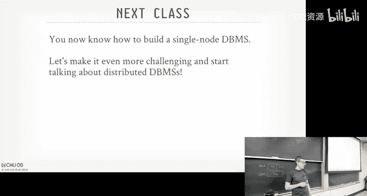
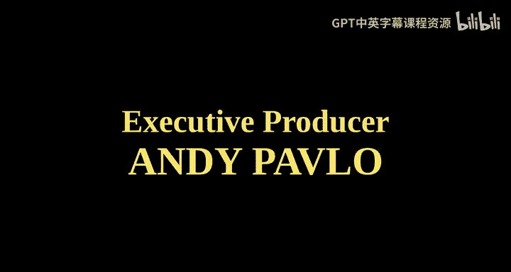

# CMU《数据库导论｜Intro to Database Systems (15-445645 - Fall 2024)》中英字幕（deepseek翻译 - P22：#21 - Database Recovery with ARIES.zh_en - GPT中英字幕课程资源 - BV1Tys8eQELW

Yeah。い？🎼Official we so today's lecture is going to be the third hardest one the semester。

 because obviously losing data is bad。 We don't people to lose data and you'll quickly realize this is again。

 why you don't want to be writing if your random job programmer don't want to be writing your own recovery stuff or recovery components in your application。

 you want to be using a data system that is bad or hard and tested you can do this correctly right so quickly for the administrative stuff project 33 was due last night as well as homework  or homework。

catch1。 And then so Project 4，' not， that's way wrong， sorry。

That should be whatever it is in December。 I think it's the date's the Sunday。

 I think the sixth or 7， right， So ignore that date。 But the recitation is tomorrow night at 8 PM。

 And there's a post on piazza for this。right， so so this week。

 I got to go to Chicago deal with with Muushu's court date stuff。 Try to get him out。

 So I won't be giving the lecture next class。 It'll be my number one P student Wen Lim。

 So he's gonna kick off the discussion on distributed database。 Okay， He's smarter than I am。

 so please show him the same respect。 You would show me okay。😊，All right， so let's jump into this。

So last class was talking about the logging protocol right when transactions are running as they make changes to pages。

 we're going to put entries in this right ahead log that's going to record what those changes were。

RightThe vehicle transaction I， the object we're getting we're modifying。

 And then before and after values， right。So that was all the things we were doing while during normal processing so that if there's a crash or there's an uncleaned failure。

 unclean shutdown that we can come back now and pick up a pieces and put the database back in the correct state。

 So that's what today is about。 today is about saying， okay。

 given all the things we were doing while we were running normally。

 now after a crash when we come back。😊，How do we use that write head log to put us back into the state we should have been。

 So then that we maintain the adity， consistency and Dbo to guarantees that we want our transactional data system to provide for us。

Right。So I'm gonna go very slowly， you know， throughout today's class。

 There's a lot of stuff to cover。 And there'll be some obvious optimization we can do。

 especially when we start talking about the how we'll do the recovery。 But I'll sort of do the。

 the sort of basic。😊，The basic version of it。 And then it would be some cases where say， okay。

 if we did this instead of this， things would go faster。 But again， we recovery we super。

 super careful。 So we want to be very methodical and deliberate and very conservative in how we're gonna apply these changes。

 And then once we make sure that that's correct， then we can go back and optimize it further。

So recall last class， we were talking about buffer pole policies and we said that we' were going to use steel。

 no force， Steel says we're allowed to flush out dirty pages from the buffer pool that have been modified by transactions that have not committed yet。

 only if the redhead log records that correspond to this change has been written。

And no force says that we don't we're not required to flush out all the dirty pages from the buffer pool when it transaction commits。

 we do have the right analog changes， but not not the buff pole changes。😡。

And so the basic setup is what we're trying to achieve is that， say we had three transactions， T1。

 T2 T3， T1 does a write and commits T2 does a write and then aborts。

 and then T3 does a read and then a write and then now there's a crash so now after recovery when the data system comes back online and says okay I can start running transactions again for you right we wanted to be the case that T1 is changes are durable。

RightBecause we told the outside world when they committed that yes， your transaction is committed。

 So if they come back and read it again， they should be able to see these changes。

 But T2 and T3 should be aborted， meaning when we come back。

 we should not see any partial updates from from T3。 And obviously。

 we should not see any changes made by T2 because T2 is aborted。

 We told it it aborted And so we want to thing clean that up。

So the core algorithm we're going to use today is called Aries。 Actually quick show a hands。

 who here has heard of Aries before。No， right。10%，215%。 That's， that's different。 That's good， Okay。

 so。I'll say that like the I'm going to describe what sort of goes along with the textbook。

 this is at a high level what the original A's paper talks about。😡。

And I will say not every single database system is gonna implement exactly what we'll talk about here today because again。

 there'll be some some optimization to things we can do differently。 like， you know。

 most systems are not gonna flush out all the pages after you finish areas， They'll say。

 it's enough just keep running。 But this paper is basically the canonical implementation or definition of how to make a database system safely recoverable。

😊，Prior to this paper， it came out in like 1992， it's like 70 pages long。

 if you read it it's not like you sit down and read one go， it's very。

 very methodical in describing all the different scenarios that could occur。

 So there were recovery protocols before this paper came out。

 but they were all trying to optimize given certain things。

 and and most of them were missing not handling all the different corner cases that could occur。

And one of the big problems that we're going to see as we go along is that we'll have the ability to also recover the daily system if we crash during recovery。

Which can occur。Right， and areas protocol will be able to handle that for us。 So again。

 I'm not So Postgres is not to do exactly what this does， but at a high level。

 it's being good enough。' gonna it's gonna be close enough。So there's three key ideas in areasries。

 The first is that we've already covered from last class that there's a right ahead log that we're gonna when transaction makes change to the pages。

 we'll make log entries that says here's what that change was。

 And then when a transaction commits or before we're allowed the data allows to flush out the dirty page from uncomitted transaction that we had to flush out the log records for that。

And this is just steel no force that we talked about before。

Another key idea is that're always under areas， you're always going to repeat history during redo。😡。

So that means that when you crash and come back。You're can be very careful about figuring out at what point in the right ahead log。

 I'm going to jump back in time， and I'm going to replay all the entries or redo all of them until I get to my end of the log。

😡，Even though some of those changes may have already been successfully flushed to disk。😡。

We're gonna be super careful。 And we we're not gonna， we're not gonna try to guess whether， oh yeah。

 we made a change and that got flushed out to disk because there again。

 there's no right to head log entry that says page flush to disk。

So rather than trying to guess about whether we got the page out the disk before the crash。

 we're just going to apply the change all over again。😡，RightAnd that way。

 we guarantee we know we're putting the data exactly the same state it should be。

The other big ideas now is that we're going to log the changes when we undo an aborted transaction。

We're going to introduce new log records， just as if we were doing when the transactions are not normally。

 when we do't update， we put a log entry in that， when we now abor a transaction and roll back its changes。

 we're also going to add log entries for what those changes are。😡，So， so again。

 you could not do this and try to opt you know maybe run faster。

 But since we want to be very careful， we're going to be very robustbose in what we're putting in the right ahead log。

 So we we can guarantee we're putting the database back in the correct state。

So first thing we need to do is talk about extending our log records now includes log sequence numbers that's going to give us an ordering of when these events occur in log。

😡，Then we's talk about how transaction was normally execute or ab when we're running sort of extension we talk about last class。

 then we'll introduce an optimized version of checkpointing。

That is allow transaction to keep running without stopping everything。

 And then we'll talk about the end of like， okay， now we put we put everything together and we do the three phase。

 three phases in areas。Okay。Alright， so the first thing we got to do is that now we need a wait to record the order on which transaction log entries are going to appear in the log。

And obviously， you can just say， okay， well every line or。And we delimit our character in our。

LetMake sure I was recording sorry every delimiter character in the in the log is enough to figure out what's going on。

 But when now when when we do recovery， the log can be really big and we want a way to identify。

 you know， each log log record individually and also now keep track of what's the sequence of log records I would have for a given transaction。

So these log sequence numbers we're going to add are just a monotically increased counter and it says here's log entry。

 whatever， and it gets log of record one， and the next one gets a log sequence number this and we're adding one over and over again。

 sort of like the timestamp stuff we talked about concurrenency control where it's a synthetic number this is maintaining but we're going to use this for a different purposes again to keep track of the order of these events。

And then now we're going to use these log sequence numbers all throughout the rest inside the database system to keep track of who cares about what log sequence number to tell you what's been written in to disk or where the next thing need is。

 where the thing in the system we need to modify。😡，So again。

 there's logy numbers that can maintain for every entry we have now。

But now in every page in our database system， we now need to extend our format to now include the page LSM。

And the page AllN is just going to be， what was the last log sequence number of the entry？😡。

For the last updated modification to that page。😡，And this is basically going to give you a way to tell you where is where is that log entry。

 is it in memory or is it out in disk， because if it' out in disk。

 then I know it's okay to flush that dirty page because the log entry has been written in the disk。😡。

Then we add this flush LSN， and that's just keeping track of the max。

 the largest LSN of the last flush we did from the redhead lom disk into memory。😡，So then now again。

 when I'm trying to decide， can I flush a page for my buffer pool at the disc。

 either because the eviction policy says we need to make space and you got to go or the background writer comes along and says。

 we want to write this out。Now you could look at this flush LSN and say for a given page。

 is the page LSN less than or equal to my flush LSN， if yes。

 then I know that the log has been flushed out to a later point than the entry for this page。

 the modification for this page。So that's how we're going to be able to keep track of what's in disk and needs to stay on disk in our pages and what's actually out in the log。

😡，These LSN are gonna be used for a bunch of other things。 we'll cover as we go along。

 We already to talk about flush LSN and page LSM。 There'll be this rec LSN need for the dirty page will come later on when we do recovery。

 And this is keeping track of what was the what was the oldest update we made to a page since it was last flushed like what was the first entry。

 first modification we made to it。 And that just tells us we since we got to replay everything。

 where to jump to in the right ahead log that we can put put the page back in the correct state。😊。

Last LSN to keep track of what's the the last record for given transactions。

 So I know how to jump to its starting point in the log。

And the master record is a global LSN that keeps track of what's the last checkpoint that I took every time I take a checkpoint。

 it's an entry in the log。 So that's least going to be a starting point for us to go jump into that location in the log and then figure out what was going on and the system at the time of that checkpoint to decide how far back further we need to go in time。

That's a shortcut shortcut from prevent us from having to scan the entire log。

 which again could be several gigabytes or terabytes。

 depending how long you keep the log around for and how many transactions running per second。

So the master records just to LSM to go find things。So don't worry about the Re LSN and less LSN。

 we'll see this later when we do recovery， but the page LSN and flush LSN。

 that's the key thing we need to understand。So it looks like this。 So now we send our log record。

 our entries。 Now we include this additional column in the beginning。

 It's just a log sequence number。 Just think a global counter that we increment by one every time we want to hand out a new log record。

😊，Then we have now in our pages， but in memory unit on disk。

 we'll have this page LSN as this corresponds to the last log record that made a change to it。😡。

And then the flush AllN is just saying what's the LSN of the last entry that was written out from memory to disk in the lock？

And the master record just says where my checkpoint is。All right， so。Say in this example here。

 our page LSN is pointing to record 12 or LSN 12 out on disk。Can we flush this page？Yes。

 right because the log entry 12 is on disk so it's safe a flush disk because the page LSN is less than you go to the flush LN。

😊，That's good。But if the page L end points to something in in the inme portion of the red ahead log。

 you can't flush in。Right。So again， in the Buffo manager， when it runs the eviction policy。

 if it sees a page that where the page LN is less than the flush LN。I nose it can't flush it。So。

 if the page outside sign is greater than the flush Al sign， you know you can't flush it。

 so either you have to immediately flush the log record。

 then you can flush the page or you got to go go find another page to e to reclaim space。

AndYou guys didn't have to do that in your first implementation because and project1。

 because there wasn't a notionional log sequence numbers。

 but it's extra checked you'd have to do to make sure whether something can be evicted。

So this basically summarizes what we just talked about， all the log records have in LSM。

 we update the page LSN every time the transaction modifies a page。

 and then we update the flush LSN every time we flush out the right hand log buffer in memory at the disk。

哎，陈亮。When a transaction normally executes， as we said before。

 there's a new bunch of regional rights to data records。

 we don't put read operations in the righthead log because it's not making modifications。

 It does make sense， but we only put the rights。And then now a beginner or a commit or it makes a commit or a rollback。

And then we got to decide， okay， how are we actually going then say。

What's the protocol for decidinging， Okay， what we actually you put in the right head log to truly say that this transaction has committed and what needs the system needs to do in the back end to write all the  dirty pages that that it needs to for a giving transaction。

So we'll make some quick assumptions about for the rest of this lecture to make our lives easier。

 So we're gonna to assume that all our log records will fit in a single page。The way you handle that。

 if log records need to be spam multiple pages， like if you have a really big field and your page size is 8 kilobytes and you're updating 160 kilobyte record。

 youd basically have segment numbers So within a log record you would say I'm one of two。

 two of two or two or three and then that way on recovery you would know how many log records you expect to see or sort of partial log records you'd expect to see for given one log record and you would know that if you don't have all of it then it's actually not truly written flush to disk。

We'll assume our disk rights are atomic， even though again maybe a larger doesn's a matter。

 we'll assume that we're doing single version transactions or single version commercial with strong strict to PL so we don't worry about running things rolling deck changes from transactions that may have read something we can ignore all that and as as I said before。

 we' assume we're doing steal no force。来。And we'll ignore B+ logging again。

 there's much more going on I what to be aware of， but to get through today's class。

 we'll just understand the basic of areas that you can then see how you would extend that to support more complex objects in data or other concurrent show protocols。

All right， so。Last class， we said when a transaction commits that we're going to add a commit log record to or commit record to the log。

 and then we just guarantee that before we tell the outside world that your transaction is committed。

 that we flush all the log records for that transaction， right。

But now we're gonna we're gonna to add this new kind of log record called transaction end。

And this is just for internal bookkeeping。😡，That we're going to use for ourselves to say at this point。

 when we see a transaction end， we know that we'll see no more entries for this transaction ever again。

And therefore we can drop it from our internal data structures at that point in time。

 so to think if I'm scanning through the log going from older to newer records。

 once I see transaction end， I know after that I won't see this anymore。

 I won't see this transaction anymore。So when we successfully flush out the commit record。

 we can then tell the outside world your transaction is committed。But internally。

 we may keep some additional metadata around for it until we till we get the transaction end。

 And then when we add that transaction end record to the log。

 we don't need to flush that out immediately。 it'll just get flushed out eventually as part of the flush for another transaction because again。

 this is only internal bookkeeping for ourselves It's not necessary for to tell the outside where the transaction is committed。

So sort of looks like that。 So I have in my， in my redhead log in memory， I have transaction T 4。

 Does begin， Does't update on A。 A doesn't update on B， then it calls commit。So at this point here。

 when it calls commit， we had to flush the redhead log buffer in memory out the disk。

 when that's successful， we update the flush LSN and now' point to the latest log record。

And then we can tell the outside where your transaction action is committed。

But we'll maintain some internal metadata about like。

 this transaction its successfully committed and maybe it modify these objects and so forth， right。

 similar to what we saw in OCC。 We' gotta kind of keep keep the rewrite sets around for a little bit longer。

Then at some later point， there's another， once we know that we're finally completely done with this transaction。

 we add this transaction N record here。Again， that's just internal bookkeeping for ourselves to say we don't need to worry about this anymore。

 and then we can reclaim the memory and use it for other stuff。

That'll make more sense in a second when we talk about aborts。Which is next slide。So。In areas。

 aoring is basically a special case of， of a transaction where you just kind of。

Reversing the changes you would make as if it was the transaction itself was calling update to reverse changes for you。

So we're going to add log records for those reversal changes。

 but we're going to keep track of that they're sort of special for us to know that this is being used as part of the undue process rather than the normal execution of a transaction that we'll eventually commit。

And then now we're going to add this additional field called the previous LSM。

And this is just going to be to improve the efficiency of the protocol of the algorithm so that when we're looking through the log。

 the previous LSM will point to the next log sequence number。

 the next log record for this aing transaction that we need we to then undo。

And so think of this it' just like a linkless to say， okay， as I do this scan trying to figure out。

 here's all the things I need to reverse for this transaction that are aborted。

 the previousLSN is now you're going back in time if you execute the queries in one order。

When you do undo， you gotta replay them in the reverse order。

So the previous Alexanders tells you we need to jump to the log， say。

 what's the next thing I need to undo？Right， you don't need this for correctness。

 You need this for efficiency。All right， so say we have this transaction here。That suck。 whatever。嗯。

Let me go back， sorry， sorry there。AlrightSo now you see we have the log seamless number。

 And then media the next it。 we have the previous LSN。 So the first record。

 the previous LSN is null or nil， because there isn't one。

 But as I go down and keep track of the next one， I have the update on a and it's previous LSN is going to be 12 because that's the one that came right before And again。

 these are contiguous。 So it's pretty obvious what they are。

 But imagine something where like I have multiple transaction running at the same time and they they're putting which entries interlea with each other。

 and as I want to go back and reverse them。 I have easy jump off to figure out where they are right。

😊，So now the transaction aborts right and then then later on。

 we do some cleanup and then we put the transaction end in。 So the thing we like， okay reaction。

make sure that we。Undo all the changes for this subborinate transaction so that if we crash and come back。

 we don't see any of its partial rights。So to do this。

 we're going to add a new cover log record called the Con log record， the C CLR。And this is just。

 again， the， the reversal of a normal update operation to go back to the previous version that we had。

 And this is why in our log records， we were recording both before and after value。

So that when we have to generate the CLR to reverse an aborted transaction。

 we know what the previous value was。Right。And that's why you're st absolute values in the log records。

 right this is what physiological logging and physical logging is doing for us rather than logical logging。

 we're st with the exact value it is that we're placing in in the go back to the previous version rather than something like your value equals value plus 1 and the reversal is value equals value minus-1。

😊，We need to know exactly what the previous value should be so that we can install that back into it。

So now， unlike in a regular transaction， when we play updates and then when it commits and finishes。

 then we have to flush those log records。At the moment we know transactions aborted。

 we can just tell them they've aborted。They don't need to wait for anything。

 so when we add these CLRs into the redhead log。😡，The data some node doesn't need to immediately flush them to drive them out the disk。

 They'll just get written out eventually like， like other things that we talked about before。

And then just like the P LSN for these CLRs， we're also going to maintain the undo next LSN。

 which is again for efficiency reasons， it's just a point to say what's the next LSN we need to reverse。

To undo things。Alright， so let's now expand out what the law work is looking like。

 So instead of showing it in that sort of single column thing。

 I'm gonna to get it up into a table because now we're adding a lot more our metadata and we're running out space in PowerPoint。

 So we're putting in table form here。😊，Right so we add this transaction T1。

 it goes ahead and calls abort and then at some later point it says。

 okay as soon as you see the abort message you tell the outside world yes you've aborted and then now we're going through and adding the CLRs to say here's how to reverse back the change that you made so we have now a type of what the entry is going to be。

 So now we have this is CLLR 002 the number doesn't mean anything。So this is going to correspond to。

 well， the 002 means it corresponds to the undo of log sequence number 0，02。

 but you could store that as a separate field rather than as part of the type。

So you see here now again， when we first did the update， the before I was 30 and the after I it' 40。

 now the CRLR is just doing the reverse of that， we're just swapping that in there。😡。

And then we also have this un next LSN， which is keeping track of here's the next thing that we need to then undo。

 and it's different than the previous LSN because in this case here。

 the previous LSN is taking to 11， and that's the aort entry。Right， so we could look at that。

 jump at that。 And then this， this is previous example Tell us how to get up to the。

 the previous ones， right， But it's really， we want to know what's the next thing we actually need to undo。

 And since this transaction only did one update， the next thing we need undo is basically take us back to the begin。

 And then therefore， we know we're done。😊，So the previous AllSN takes you in log sequence order。

 here's the changes that transaction made。 the undo next AllSN is sort of like here's the changes you need to reverse and you can skip over metadata things like aborts and so forth。

And then now we once we reach the end of following undo next LSN， once we get back to the beginning。

 we know we' undo all the changes that this transaction made when it ran normally。

 then we can go ahead and now add the transaction end record。😡，And this is saying that， again。

 we won't see any more CLRs and any other log records for this transaction anymore in the law。

Is this Claire？Yes。To complete and transaction。This question is what's it if it between commit and transaction N。

 So a commit is when you tell the outside world like your transaction is successfully completed。

 and at that point， youve flushed all the log records for that transaction out to disk。

 So everything's door disk for the log records and that's enough that's all you need that's enough for you to be able to replay the transaction if there's a crash。

 So you's safe to tell the outside where you've committed。 but at some later point。

Once you know you've cleaned up everything about this transaction。

 we'll see that in these digital metadata table are' going to maintain a second。Once we。

 we know we we're never going see this transaction ever again。

 we can go ahead and remove it from that。 So could there be any other between the commit and the transaction。

His question， could there be other other commit log records between a transaction commit and an end in this protocol no？

For abort， yes， because you have the C Rs between between the abort and and the end。Yes。

Her question is with， there's two updates what happened to the CLR mean the update object A。

 optic object B。You would have separate CLRs for those because they would be separate update log entries。

And so so I first update A and then update B， then upon aor。

 I would first reverse B in it with a CLR， then reverse A with the CLR， and then you're done。

Assume A A and B are twoples， they don't have to be， but assume they are。So even though like an A。

 I may update three fields and then B might update7 fields。

 each of those are still will be individual right ahead log log entries。

Is always going to be like two pole level or it's going to be like other granularities？

His question is， say for the class or we're in real systems。So especially as like。I just said that。

 oh， assume A And B are tus in real systems would they， would it always be。

 would a log entry always be， you know， a single tuple。No， there are typically， so typically yes。

 but there' sometimes there's there's sometimes special cases where like in Postgres。

 I think in Postgres。When you bring a page in a memory， the first time you update it。

The log entry will be the entire contents of the page。😡。

And then if there's subsequent updates to it while the page is in memory。

 then there'll be sort of more fine grainin log gs because again。

 the reason why they do it is they dont want to lose data。 They're super para about this。

 So let me just make another copy of the page and make sure I had that always as the starting point。

But the original A protocol， you didn't have to do that。But typically， yes。

 it'll always be the same granularity of the content。O。So how do your board， again。

 we've already covered this。 You first write the board record to the log for the transaction。

 then you look at the the right set of the transaction of all the updates that have occurred and you're going。

Unapply them in reverse order that they originally applied。And then every time you undo a change。

 you create a CLL record right to the log and then restore the old value。

 And then once once you reversed everything back， you can go ahead and write the last transaction and record。

😡，The CLRs never need to be undone。Meaning， like， if I'm undoing a transaction and I and I write some。

Sa it updates5 tus， and I add CLRrs for the first two tub updates。 Then I crash come back。

I'm not gonna add more C Rs for the ones I I've already applied。 I just replay them。Redo them。Right。

more questions about this？This is the core bedrock of how we're going to be able do recovery。

Now the question is how do we do people covering it in the right order？So。

Now we got to talk about how we do checkpoints。哎。In an efficient manner， because， again。

 the right head log grows forever。 We don't want to replay the entire log because think about like。

 I have transactions from 30 days ago and that I aborted。 I'm gonna know。

 replay theLrs over and over again。 I want to avoid that。

 So we'll first look at sort of two bad ways to take checkpoints。

 And then that'll be a motivation to see how we do fuzzy checkpoints and areas。So last class。

 we sort of had a strawman proposal where we say。Any time we want to take a checkpoint。

 we just stop the world。 We haul all transactions。 We haul any new transaction from starting and any active transaction that is currently running。

 we let them run to completion。Then we go ahead and take a checkpoint because at this point。

 we know that we have a consistent snapshot of the database of the pages in the bufferuff pool because we're not seeing partial updates for any transaction。

 at that point， there are no actual transactions direction running。Right。

So this makes recovery really easy because now when I come back。I at my checkpoint。

 it's a consistent snap out of the database， there's no partial updates。

 so now I just need to replay all the log entries that occurred after I took that checkpoint。😡。

It's obviously bad for performance because。Say I have one transaction I have two transactions that are running。

 so I block any new trans starting。 The first transaction finishes in like 10 milliseconds。

 but the next transaction runs for like three days or something crazy like that。

 Now my system has to wait for those three days before I can take a checkpoint and it's blocking everything。

😡，So obviously that's a non starter for us。All right， so a better way to do this is that。

That we want to pause transactions that are running in the system。

Go take a snapshot of writing out our dirty pages。啊。And then， and then， you know。

 let them sort of keep on running again。So either they have active queries instead of saying。

 wait to completion。 We'll just stop the queries from running。you know。

 no matter what stage they're in， then we go ahead and take a checkpoint， and then once that's done。

 then they can start resuming again。Is this a good idea or a bad idea。

 I've already said it's a bad idea。 Why is a bad idea。Partial updates， absolutely right。So again。

 say say I have real same aboveuffable and only it' few pages And you think your checkpoint is basically a sequential scan of all the pages that are in memory。

 but you're writing them out the disk right So say I have this transaction here。

 I wants to update a bunch of pages。 So transaction starts at the bottom my checkpoint modify page3。

 my checkpoint is gonna start at the top scan through all the pages and write them out。

 So the transaction already modify page3。😊，So now when I scan through， I see that。

 see that modification。 I write those out to disk。Then I unpause the transaction who then goes ahead and updates page one。

But now I'm going to miss that change because I paused it into my scan。

 it had made a modification to page1。 So now if I crashed， come back。

 I have half the changes that this transaction made。So。

This is essentially what we're going to want to do。😡。

But we need to maintain additional metadata to keep track of what transactions are running。

 what page has been modified since we started。 And now we're we're going to keep a demarcation in the law that says。

Here's when the checkpoint started。 here's when the checkpoint finished。

 and then we just know that things may have gotten modified in between them。

 and this additional metadata will help us keep track of this。

So the actual transaction table is just an internal hasht over to maintain the system。

 that's to say for every single criminal actual transaction， what is， what is the transaction Id。

What is its current status of？Coode or mode of the system。 like， is it actually running。

 Is it in the process of committing。OrOr is this something we're going to want to undo？

So on a normal execution， unless we see an abort or a commit， every transaction is just running。

Upon recovery， though。What we' we're going to assume every transaction is going to get aborted。

And then it's up for the log that tells us whether we should put it to be committed or committing。

So again， we'll keep track of the status and then we'll keep track of the last LSN of the most recent law record that they created so that we know again。

 what changes that they made， was that written out the disk in between our checkpoint interval。

And this is the sorry， this is the sorry this table we will maintain。

We'll maintain enter end transaction until we get that transaction end message。 At that point。

 we can drop out of this。Because we know we're not going to see any more changes from it。Again。

 now if I'm boarding a transaction， I may be putting bunch of CLRs reverse pages while I'm taking the checkpoint。

 and I want to know what was going on during that checkpoint。😡。

So that's why there's an abort message and an end message because in the case of aborting transactions。

 there might be some more stuff that you're doing in there。

The dirty page yellow is is keeping track of all the pages in the buckpo that are dirty at the point when the checkpoint starts that have not been fleshed out to disk。

😡，And then now we're just going to keep track of for every single dirty page in the page table。

 an LSN of the log record that first calls the page be dirty。

 So a transaction may read the record and a page is brought in。

 But as soon as a transaction modifies that page， we keep track of that LSM。

So that we know at the time in which the checkpoint started。And then the page was modified。

 Did that occur before after the checkpoint began， the checkpoint ended。

So let's look at something like good。But first， the checkpoint the first checkpoint we're taking here。

 right， we'll assume that we've modified sorry， assume that page 11 has been been flushed up above。

 right， becauseuse it's not an our dirty page table and that we are aware of a， of a transaction 2。

 right。So in the checkpoint record we're maintaining now。

 to assume this is when the checkpoint occurs， we're going to keep track of this metadata in there。

Right， so we know about transaction T2。 And then our dirty page evil says that there's a dirty page 22。

Then now at the second checkpoint。We see that we aware of two transactions T2 and T3， right。

 because T3 started after the first checkpoint and T2 started before the first checkpoint。

And then we now have two dirty pages， 11 and 33。哎。So， this。

This gives us additional met to be able to solve that problem we solve before of like。

For that partial update。 But in this still in this example here。

 we're still stalling the transactions。 We're stalling the queries while we're taking the checkpoint。

 So that's not great。 So that'll handle the case where like。The query is running。

 and nobody's that first page。 Then we take the checkpoint， we pause it。

We recorded our dirty page table what we saw at the moment， we， we， we di the checkpoint。

 So then afterwards， we would know here's the log records that maybe modify things that we missed in our checkpoint。

But again， we're still stalling transactions while we're doing this。

So the fuzzy checkpoint solves the problem by。Just taking the adding an entry to say this is when the checkpoint starts in the log。

Keep track of what the dirty page table is and what the Act transaction table looks like。

Then you let the checkpoint run。And then when when the checkpoint completes。

 then you add another entry into into the log for the checkpoint end。

 and that's where you stuff in the actual transaction table and in the dirty page table。To tell you。

 okay， if you see the checkpoint end， here's what I saw at the beginning and then you can figure out from all the log records between the beginning and the end。

 what potentially got modified。😡，Right just because there's a log entry that say a page got modified and it was made dirty doesn't guarantee that's flush out the disk。

But the dirty page table will at least tell you what， what was not。

 what was modified beforehand and whether it got flushed out。 And then now between the checkpoint。

 what was modified and check and see whether that that has been successfully flushed out。Alright。

 so go back to our example here。 Now you see again， we have the at L N 7 and L says 10 L N 10。

 Now we have the， the begin checkpoint。Log record， and then the end checkpoint log record。

And so we have this transaction up here， T2， right it started before the checkpoint started。

 so that's going to be an actual transaction table， and then before the checkpoint started。

 T2 modified page 22， so we have an entry for that in our dirty page table。😡。

So this is telling you that when the transaction started， there was a transaction T2。😊，And again。

 it's a hint to the recovery protocol say， hey， there's a transaction to2 was doing something before the checkpoint started。

 Go find out what it did and make sure you apply all its changes or reverse it it for the ports。

 And the dirty page table says before I took the checkpoint， there was a dirty page 22。That。

Would should have gotten flushed。Between the checkpoint， start and checkpoint end。

But it also may have been modified by another transaction before the transaction you know。

 during that checkpoint after the checkpoint flushes out the disk。

 So go make sure you understand what's going on。 Yes， so during recovery。

 that just means that anything in the dirty patientship doesn't have to be undone because it was never committed。

His question is， is the dirty page table telling us that？嗯。

if it's in the patient about do we never have to。Update it， because you may may have to redo or undo。

 Well I'll see it in a second is I never I gonna update it because I can guarantee that it was flushed out during the checkpoint。

 It wasn't flushed because It was flushed， but you don't know whether another transaction modified it after it was flushed。

Right。Right。We'll see this in a second。 But like， you' basically say I I see the checkpoint begin checkpoint N。

 figure out what's in between that。 And that's gonna to tell us what I need to do。 But I， again。

 there's no log of record that says this is when the page was flushed。So I don't know， say that the。

 say the dirty page came to 11， right， So at， at that transition up there I updated page 11。

This transaction also updates page 11， but I don't know whether my flush got this change or the change up above。

 so go make sure you find out what happened。😡，So， again。

This additional metadata for us again to keep track of what was what was going on the state of the system at the moment of the crash to help us maybecon。

 reconstruct the system and understand what's going on。When we successfully flush out the。

 I think the checkpoint end， that's when you go ahead and update the。The master record to say， okay。

 if you're now coming to me after a crash， here's where to jump into the right ahead log for the beginning of a checkpoint and then use that as the starting point to figure out what was going on in the system at the time of the crash or before the crash again to re instantsantiate all the actual transactions and put you back in the correct state。

All right， so now。Using the log seamless numbers， the compensation log records。

 the transaction end log record types。 And then now these fuuzzy check pointss with checkpoint begin。

 checkpoint end。 now that's enough for us to be able to recover the database。And so under Aries。

 it's a three phase protocol。And the first one is called Analy， basically when you go back。

 look at the right ahead log。At some point in time。

 based on the master record and figure out what transactions were actually running at this given time and what was dirty in my page table。

 again using that checkpoint information。So then you scan for it in the log and figure out。

 here's all the things I need to undo and redo。In the second phase， after analyze。

 then you're going to go back in time you're going to go forward in time。😡。

Where you're going to jump to some point in the log and then replay all the changes that you're going to see。

Eim for transactions that are going to abort。Then in the undo phase， after the redo phase。

 you could say， okay， when my actual transaction table contains bunch of these transactions and I never saw a commit message for them。

 therefore I know the aborted。😡，So now I'm going to go back and reverse order and undo any of those changes for uncompleted transactions。

And add the conversation log records to record that I undone the changes。

So analyze is going to go forward in time。 Red is gonna to go forward in time。 And then the。

The undue is going to over first in time。So say this is our redhead log。

 again going from time beginning to the end。 The first way is analyze。

 you basically want to again and figure out what was going on the system。Since the last。

 since after last checkpoint or during the last checkpoint to to the end of the log and go figure out。

 you know， who needs to get a board， who get who needs to get reapplied。

So you would start to last checkpoint and then scan forward in time and then look at all the information。

Yes。Sorry， can you go back。How far back， sorry。To the the the one。Yes。So。I think like。

We assume we're assuming that we're doing。Mmhmm。おす？Mmhmm。😊，Not the case that a transaction。

Another transaction like the schedule might make it so that this is conflict equivalent to a schedule where。

That transaction happened before。The other trend。So your question is， I've seen strong strict2PL。

Is it possible that a transaction will？Start before another transaction。And if we。

 if we take a check。We just say， okay， we're only going to keep track of like these ones which began before。

Mmhm。😊，Is it possible that the schedule we generate。

MOr like the equivalent serial schedule might still treat some of the transactions before this check。

As a。After ones， which happened。And so I， is the con。It's the concern。

 it's a concern that the right ahead log might actually write entries out。

Such that when you replay them， it would change the order of the transactions。W？嗯。So no。

 I don't think it's an issue because。In order for a transaction to update a record， update。

 update an object in the database， I got to get the lock on it。Right so now I have a lock on it。

 I can do the update or I add a log entry there。 So the strong to be in in this example。

 the order in which the log sequence numbers are showing up is the order in which that the transaction or applying changes。

If we assume serializable ordering， then this makes this a lot easier once you start getting into like multiversiononing or lower isolation levels。

 this complicates a lot of this， but we can ignore that for now。RightAgain。

 so I'm showing this red head log。You still have to think about all the stuff we talk about before when we talk about Kgy control。

 There's still， you know， in， in the case strict in2 PL， There's still a lock manager。

 There's still a protocol running above It decides who's allowed to update what。At this level。

 we assume that， somebody else has already figured out for us who is allowed to update things and we're just dealing with the entries that we're seeing。

Allright， so going back here again， with analyze， you st start to the last checkpoint。

Scanamp for a time， figure out what was going on the system。Then now under redo。

 you look at the smallest rec Lcent in the dirty page table。

 so what was the earliest log record that modified a page that was in our dirty pageable when the checkpoint started？

😡，Jump that back in time。 Now， scan forward and get all those changes。 because， again， I have。

 I have a page in my dirty page shape that's dirty。 I got to know who modified it。

 So what's the earliest log entry Since that page was brought into memory。

ThatThat corresponds to the modification of that page。

there may be subsequent modifications after that page was brought into memory。

 but I don only care about the first one， and that's the wreck LSN gives me。😡。

So this is going to redo everything。😡，So if you have a transaction that got aborted。

 you would apply the changes， see the abort message， and then apply the CLRs。

And then the transaction end， it's done So you can replay all the changes you can see in the redo phase。

Then now you got to go look at， say for all the transactions that were in my actual transaction table after the redo phase completed and getting into of the log。

 which ones didn't commit。Which have the status code as a candidate for undo。

Then I got to go find the， the oldest log record that they have for any of the transactions that I've got to roll back。

 And now you got to go back and reverse order。And onapply all those changes。

 you skip over the transactions that that successfully committed。

You're just undoing the ones that got aborted and you're creating the new CLRs to the right a log as you're doing that。

So read， so analyze， jump forward some point in time， scan forward， figure out what's going on。

 Then with the read of phase， jump to another portion， higher up in the log potentially。

 scan forward， reply everything。 then look at your active transaction table。

 figure out what's not running or what shouldnt have not committed and then reverse back in time to undo them。

That's the core idea of areas。Al right， so this repeats everything I've said。 So again。

 analyze scan4 times to the less successful checkpoint。

And you're adding entries into the actual transaction table based on whether as soon as you see it。

 you add it， but assume it's going to abort it and once you see the commit message。

 then you know you can change the status to commit。😡，Right？

And then if you see for any update log records， if the page is not their dirty dirty page table。

Again， we'll be maintaining this as we go along so then we keep track of it and to know that this is the modification we solve for this page for this log record so that we know that if we never need to undo it。

 we know how to find back to the transaction that created that change。

So the analysis analysis phase finishes。The actual transaction table is going to tell us everything that was all the transactions actions that were actual time that they crashed。

And the DPT is can tell us all the pages that may have not been successfully flush to disk since at the moment of the crash。

So let's look look another example。 So we had the check when began， right。

 So we add that entry into to our， our log record right。

 this is now now we're just showing what's in the ATT and the DBT。😊，Then as again。

 I'm scanning point in time， now I see this transaction t96。😊，Well， I don't have it。

 My actual transaction table doesn't have anything in it yet。

I didn't see a begin message for this transaction 96 since my begin message。

 so I know that somewhere in the log up above this begin checkpoint begin。

Is this transaction 96 starting and maybe doing some stuff？😡，So I'm going to add entry into my ATT。

 says， I know about a transaction 96， so I'm seeing it in the log。

And I don't know what's going to happen to it at this point， as I'm doing my analysis。 So therefore。

 I'm going to assume it's going tob。 So I said it's saddest to make sure I undo it。

And then we see that this transaction modified page 33。

 So I'm going to add entry into my my DPT that says here's page 33 that was modified。

 and here's here's the recalN。The oldest LSM for the transaction that modified it。

Now I get to my transaction begin， transaction N。Right and now I have additional information about these transactions Well lo and behold yes I saw in 96 that's good。

 but there's also is 97 up above， I didn't see any log messages for that So there's another transaction 97 I got to figure out what was going with them。

 and then now I know I have another dirty page that was in my for page 20 that was modified by know an LSN8 before the checkpoint began。

😊，Then now I get I see the commit message for 96。 fantasticastic。 I'll update my ETT and say， oh。

 T96， you made it good job， said status to be of a commit。 I still don't know anything about 97。

 so it still still still can it be undone。😊，And then at this point now I see the transaction end and now you see why one had this transaction end because now I say。

 okay， well this transaction is done at this point here。

 I can go ahead and remove from my L from my ATT。😊。

Because they don't care about it anymore after this。Right， yes。ま that afternoon。なとか見。It question。

 is it not enough to move it at the commit phase？That's an opposition you could do that， yes。O。

So again， now the reading phase， the point is， okay， So now at the end， our analysis phase。

 we have the A T T。 says here are the transactions that we knew about。

HereAnd here's the  dirty page table。So now we got to figure out well what was in what pages were modified。

啊。Sorry question， yes。難しくな。If you were to remove it at the committee。

when you write the commit message， that doesn't mean， changes were made in the Yes he's right， yes。

The reason why you still need it is because it could have modified something in a dirty page table。

 And I need to know whether it。 Thank you。 Yes， Yes， and that's why you gotta keep it around。

Thank you。Yeah，ca yeah， implicitly through the rec LSN。 So this guy modified what，96 Mo by 33。

 So implicitly， this LN of 20 corresponds to this transaction T96。 So implicitly。

 I I had I'd have to I want to know， you know， what， what transaction generated this。

 What generated this this log record 20。😊，Did it commit。 So if it's not an ETT， as he pointed out。

 then I don't know。So that's why I get heat around。All right， so the re phase， again。

 this is where we're going to jump back into history。Before the checkpoint。

 usually before the last checkpoint began， and then we're going to scan for a time and replay all the changes。

 even if we know the transaction is going to abboard because we see it in our ATT as a candidate if we're on board at the end。

 we're still going to replay everything。Because again， we want to put the Davis the exact same state。

That it was at the moment of the crash， even through all the transitions to the end of it。

There's obviously some optimizations you can do， like if I see a bunch of changes at the same page。

 could I collapse them to do one update， yes。We're not doing that。We're gonna， we're gonna be very。

 very careful。So it's going to seem very wasteful。Again， if it's your data。

 you don't want to lose it。Al right， so we're going to scan forward in the log containing the smallest ren of a transaction or of something in the dirty page table。

And at that point in time， we know that there's the earliest log record that modified a page that we saw during our。

During our analysis phase， and we're just going to scan through every single one and replay all the changes。

So the logic basically says that。If we。For each log record C or CLR。

 then if the page is not in the dirty page table。😡。

Then we' got to bring into memory and modify if the page is in the dirty page table。

 but the last log record that modify the page is less than than the Rex LSM。Then we know that the。

That it's the previous version of the page right again。

 this is we're bringingian pages after the crash， that we know this。

 the previous version of the page and we want apply that we know that the change that we would try to apply has already been applied。

😡，So therefore we don't need to reapply it， so this is how we know that the page has successfully written out the disk。

啊。Since the last checkpoint， or at least the law record that we're analyzing， and therefore。

 we don't need to reapply our change。If it's not dirty page table， then it wasn't in memory。

 so we don't care。 this is basically saying if I bring it back in a memory to see that its basic version number is in the future。

 then the L I'm trying to reapply， then I I know I don't need to reapply because all the changes is made it out there。

Right。Otherwise， we， we， we， we have to go ahead and update it。So to redo an action。

 you just replay the entry， whether it's an update from a regular transaction or a CLR。

 it always works the same thing， same way。 And then now we just set the page LSN to be our LSN。

There's no additional logging we need to maintain as we reapply changes because we already have the right ahead log that tells us what we should do。

 we don't need to maintain a redundant one。And as we're also in this reading phase。

 as we're scanning along， we don't need to flush the pages as we're you know and when we see a commit message for a transaction because again。

 we're in this recovery phase， we're not allowed to run regular new transactions anyway。

 so we don't have to make sure that we're flushing things when we see end ends or commits。

Then now when we hit the redo phase with the end of it。

For any transaction that was successfully committed and are still in the A TT because we didn't see the transaction end message for it。

 we go ahead and add the transaction message for it， and we go ahead and remove from A TT。😊。

Because at this point here， when we finish redo， the only entries that should still be an actual transaction table or transactions that did not commit during normal operations。

 and then now in the last phase， we need to undo them。This is basically what it says。 So again。

 any transactions that are still in the actual transaction table means we didn't see a commit message form。

Or the aborant transaction then， therefore we need to go clean them up。

So we're going to process them in reverse order， and this is why you have that undo next LSN entry in the CLRs so we can jump through in the right ahead log to find the entries that we need to undo a transaction and not make have to scan everything。

Because if we only have one transaction that that got aborted in this really log log sequence。

 we we got to replay， we don't want to scan all that back back over again。

 we just want to jump to the entries that we want。And this is what the un next Allam Gis gives us。

So we're going to reverse them in the same order and just basically undo the changes we make。

 and then for every modification every we change that reversing， we add a CLR for it。Again。

 we don't need to make CLRs for CLRs because when we did the redo phase。

 we would apply the changes to that CLR。And then if you crash during in the redo phase。

 what we'd just come back and do is do it all over again。😡，So let's look for example here。

 So we have a transaction or sorry， we have in a red ahead log。 We call begin or checkpoint begin。

 we checkpoint and。Then we have some T1 makes a change， T2 makes a change， T1s aors。

So then now once in normal operation， when we see that T1 abor。

 we want to start undoing the changes for T1。 So the first thing I'm going to add is the CLR for it。

And then now since it's the only change we have to undo， we can go ahead and add the transaction end。

I'm not showing this， but implicitly there's also the previous LSNs。

 we're just keeping track of all that and again undo an next LSN as well。Right。So then now we see。

 say we T 3 starts running。Makes a change。T2 makes another change， and then we crash。

So at this point here， we know at least there's a transaction T3 and T2。

 there might be other transactions we don't know about。

But they would be in in our ATTU at the checkpoint end。All so now we've got to cover the database。😡。

So we got to now populate after we finish the analysis phase。

 we would populate the ATT and we have metadata to keep track of like for every transaction and here's the undue status we think they're going to after finishing the analysis phase。

 we didn't see commit message before them so we know we need to undo them and the DPT is telling us that we know that theres pages P1。

 p3 and P5 that have a bunch of changes that may not written out the disk we need to make sure that we go ahead and reapply those changes。

😊，So the first thing we've gotta do is say， okay， going back and now we， when we do。Undo。I'm sorry。

 yeah，'， we're doing undo here。 So we're we're going and reverse order。

 So the first thing we need to reverse back is the change that T 2 made right here。

 So we go ahead and create a a CLR record for it right with information about what。

 what change we're undoing。 And then we have now a pointer also that says， what's the next。

What's the next reversal we need to make for this transaction here？

We need to make undo the next change for T3。So that's the same thing again。

 keep we're just undoing what occurred in LSN 008， reverse that change and go ahead and apply it。

And then now at this point here for Trans 3， we know that there's no more entries for it because the next undo next is basically null。

 so we can go ahead and put the transaction end message here。Now in the original A protocol。

 at this point here， when you see the transaction N under undue phase。

 you would actually do flush the redhead log and flush all the dirty pages。So at this point here。

 you would know that if I crash come back， at least this point in the log， I plan all the changes。

 Most systems don't do that because again， at this point。

 you're not actually running real real real queries and transactions。

So why make your recovery slower if again， if you assume you're not going to immediately crash right right after you crash before。

 then why， why spend that extra effort。But again， the visual protocol does this。

Then I update my flush LSN to say， here's the， you know， if I do that flush。

 here's the log entry for the the latest record that I flushed out。

But then now let's say there's a crash。At this point。So we crashed during recovery。

So now we need to recover from our recovery。And this what A's got correct and much other systems did not。

So now when we come back。It's basically the same thing before。

 We'll do the analysis phase still the latest checkpoint is on one of the top here。

 So the ATT is basically going be the same thing。Right。U。Actually， you， you。

 you could get rid of sorry， T 3， T 3 is done。 You can get rid of that。Say this， this is。

 this is what you see in the， in the A TT at， at the checkpoint。Yeah。

G rid to T3 get it to T1 at this point， you know， they're gone。 right， So now I need。

 I make sure I undo this change that T 2 because I didn't see the undo change didn't see transaction for T2。

 So go ahead and just do the same thing I did before。 After replaying all the changes。

 And now I go ahead and create the CLR for for this one here。

Pointing up there that I didn't undo yet。 Once that's done， then I know that。

Or when I' following this back， I know that I've already applied this change here。😡。

Right so then now I go ahead and transaction M and this point I'm done。

 and now the data is the exact same state it should have been at the moment of the crash with any partial updates from avoid transactions are all reversed。

And you can then now you now see the outside world are systems successfully back online。

 and you can start accepting new changes。Yes， I might be misinterpreting this。

 but can you explain again the dirty page table， is that the set of pages that were changed but not committed and then written out to disc or？

So yeah， So it's I actuallyma it's more clear causeuse I'm like， I'm showing this and like。I think。

At the checkpoint end， it'll contain all the， the pages that were modified at the。

And when the checkpoint started。Then after you complete your analysis phase。

 the dirty page table will contain， here's all the pages that were modified and I don't know whether they were flush out the disk and then here's the oldest log entry that corresponds to the change that they made so there may be subsequent changes afterwards。

 but I don' only care about the oldest one because that tells me how far back I have to jump in time。

And then in the redo phase， you're gonna redo all the changes。 Yeah， so I'm not。

 it's clear on PowerPoint here。 Like， I'm showing this is like， is it after， after the analysis。

 after the redo， right， ignore that for now， just saying after the redo phase， I would know。

 here's the， here's the。Here's the pages that were modified that may not have been written disk。

And you don't really need that to do the undo because the undo thing all you care about is here's the transactions in my actual transaction table that did not make any changes。

And I just use the undo next pointer to tell me how far back of the change I have to go back to make sure I do undo all their changes。

😡，Right。你。Right so when you start undoing all the changes， you would say， okay。

 since you're recording here's the undo next， say you get to the CLR here， this points is 004。

 which is up there， and that's not a CLR that's a regular update。😡。

I'm not showing the P LSN because it's PowerPot， but now you have the P S LSN。 So now you can say。

 okay， well I've， I'm done this。 this is then I'm going to tell me that when the next thing I see is going to be a real operation that I modified。

 Therefore， I know there isn't anything else for me to undo。So therefore。

 this transaction ist successfully rolled back， I can go ahead and add the transaction end。Yeah， so。

 so I apologize the ATT and DPT aren' aren't clear here。 Like what the actual。Like going back here。

 I think the previous slide。Right， in this case here， this would be after the。

After you've done your analysis， would drop out would drop out T1 because you would see transaction n for that。

 and then you would drop out T3 because you would see the transaction n for that as well。

 So the only thing in A T T。 after doing redo should only be T2。 And that's why after the crash here。

 when you come back， you would say， okay， well， the only thing I need to make sure I undo is ti is T2 because I know I've undone everything else because after the analysis I would say。

 okay， I saw a transaction N T3 transaction N for T1 T2 is hanging out here。

 me go clean him up and you're done。O。So。Some some obvious questions of bidding what we talked about before。

 So if I crash during recovery during the analysis phase。Do I do anything extra special， No。

 let's just come back and do recovery all over again， right， Ana phase didn't modify anything。

It maintains some internal data structures and memory back get balloon of the crash。

 so I had to start all over again。If I crash or and redo， do I do anything special？No， right。

 because then redo， you're just blindly overr whatever's on the pages anyway。

re just making sure you're doing in the right order。 So if I crash during redo。

 I just restart redo all over again。😡，If I crash doing undo。

 then I can be a little bit clever and and， and。呃。So， if I crash on undo， again。

 it's the same thing where again， I just in the redo phase。

 if some CLR has made it out the right ahead we got flushed out。

 well they would get picked up in the redo and that means in my undo phase。

 I may have to do less work because I may have got some things done the last time I went through and undone things。

So no matter how many times I crash and restart over and over again。

As all long as I'm making a little bit more progress on the undo。

 then eventually I'll get through everything that I I reverse， everything and need to be reversed。

 and then there isn't going to be an undo phase because now my redo phase contain all the transactions I I need to undo。

So can I make redo faster。 Well， again， if you assume you're not gonna crash immediately right after。

 you know， crashing， which is not always the case。 Sometimes the the crashes are correlated。

 especially in older hardware。 then I don't have to do the the immediate F sync of the flushes as I'm going through and redoing things。

 I'll just assume that gonna flush out eventually。Right。To make the。

To make the undue phase actually even faster， No system does this。 There is There is a paper， though。

After I do my redo， I know all the changes actually I need to reverse。

 So in the same way we did that mod log approach where where we had like in my S， they had like。

 here's all the changes I need to apply to a page。 So before you read it， apply those changes first。

 the B epsilon tree was doing the same thing。I could keep track of every single page。

 Here's all the changes I I need to undo before you can read this page。 Now。

 if any transaction comes along says okay， let me start reading this page。

 they'll get blocked while you undo that change， but now I' going to want to wait for all my pages to get undone before I can start running new queries。

😡，So you can sort of lazily， incrementally reapply the changes to， to avoid this problem。

Of course now， if you rewrite your application to remove any long running transactions。

 then then your undue phase finishes really fast and in the recovery time will be much slower。

 but that requires you to rewrite things and most people aren't going to do that。All right。

 that's there is。 That's recovery。Not这 bad了。The devils in the details again。

 when you go read the visual Ares paper， they're talking about light。😡。

Dealing with like bad sector rights and things like that， it's very。

 very low level in a way that I don't think you need to understand the core concept of other areas。

But like， this is the basic protocol， again， that every system is gonna to use。

Right above above is going to use steel no force。 we can flush out  dirty0 pages from uncommitted transactions as long as log records have been flushed out and we're not required to flush out all dirty dirty pages' commit because again the log records will have enough information for us to reapply those changes。

We'll take fuzzy checkpoints。 So don't block transactions while， while we're taking the checkpoint。

 we just have to record。 Here's all the pages that were dirty at the checkpoint started。

 And here's all the transactions that we running when the checkpoint started。When we redo。

 we run back to the earliest log record from a transaction that was active when our transaction our checkpoint started。

And we make sure we reapply all their changes。Simple optimizations。

 keep track of like you looks since we know the page LSN and the LSN of the log record that we're trying to redo if we know that the page LSN is older。

 sorry newer than our log record， we know that our changes are already to been applied because again there's no entry that says in the log says this page got flushed out。

The LSNs are telling us are giving us information about in what order things got flushed out？

Undue transactions never had to commit， but we had to apply CLRs to undo them。

 and then those are just regular log records like before so that if we crash come back， the CLRs。

 we would know whether our CLR has been applied or not。

And then the log sequence number scan just allows us to provide the ordering of these things。Okay。😊。

Alright， so at this point in the semester， you can pat yourself in the back because now you know how to build a single no database system。

 congrats， right， You can build a Sel light， You can build a Postgress， You can build my SQel。

 whatever， right， You can build your own ducky B。😊。

I'm not saying it' would be good but you could do it， right， That's fine， right。😊。

Starting on Wednesday and again， my Ph G student1 will， will。

 will present that Now just make your life even harder。

And start with introductionion of how do you actually build a distributed database system。

 So all the same techniques and things that we talk about this entire semester。

These are still applicable in a distributed system。😡。

You always want to build a single node system first， push that to its limits。

 and then when you realize， oh， like this is not working， we got to scale out。

 then you go to a distributed architecture。😡，So you understand you need to walk before you can run。

 So you need understand how so all the things things we talked about for concur control told all the recovery that we just talked about。

 how to run， queries and execute queries and and run transactions。

 All that still applies in the distributed system is just way harder now because the node you might be talking to might be gone。

 is there 10 milliseconds I ago now missing。 What do you do。

 or I got two transactions running on two different nodes。 They were on different sides of the world。

 And they want to update the same record。 What do you do。Very few people need distributed databases。

 most databases are like for the 99% people can run on a single box。Right。

And so the rare cases that you are a Google， you are a Amazon， you are a know， Microsoft。

 then you bring a distributed database， then you pay a lot of money for you guys to make this distributed。

 okay。

🎼money something refreshing when I can finish manifest to call a whole bowl like Smith We one court and my thoughts hip hop related right around then my toxicoxicatedlyrics a quicker simple record to some city slacker waves of pick up crimes I could game rotate out of way too quick to duplicate fill breeze out Mike theahren height when real tight then I'm in flight the we in night what starts to boil I heat up the here mymic down for oil still turn third degree for warm man I heat up your brain give a sun to just cool let the temperature to rise to cool it off or saying a。

