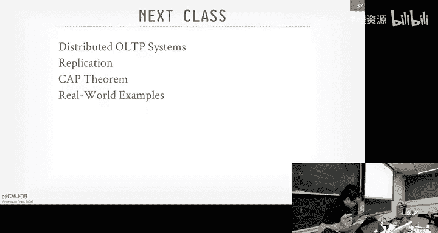
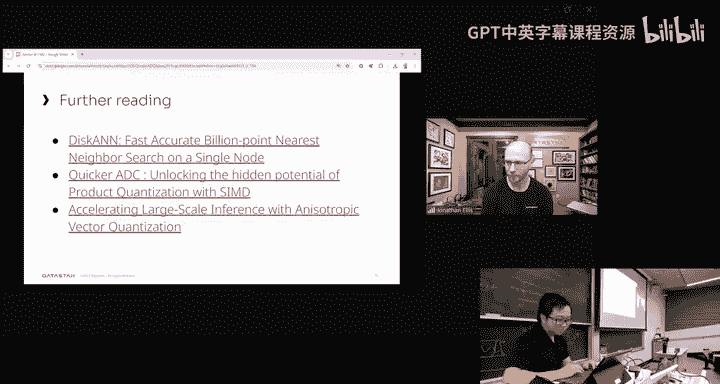

# CMU《数据库导论｜Intro to Database Systems (15-445645 - Fall 2024)》中英字幕（deepseek翻译 - P23：#22 - Distributed Database Architectures ✸ DataStax Database Talk.zh_en - GPT中英字幕课程资源 - BV1Tys8eQELW

Yeah。い？🎼Y so all right， so Andy is in Chicago， so I'm here today instead third and let's get started。

So yeah first administrative stuff project3 was due on last Sunday。

 so hopefully you are either done or you have at least three late days Project four is going to be due on December 8。

 1159 pm and that's a Sunday and the final is going to be on December 1330 a that's a Friday so there are no early exams please don' leave campus before that date。

😊，On the other hand， sorry， let me drink some water。According to the PMU exam policy。

 if you have more than。2 exams within a 25 hour period。

 Please let Andy know if you need accommodations， please let Andy know。 He will work something out。

🤧K。Cool， so as Andgie said last class， at this point in the semester， Basically。

 you should already know how to build a single node database system。

And that means systems like heelite， myheQl or postcrus。

And you kind of went bottom up here with your class project with project 1。

 you started with the storage layer， the buffer pool manager in project 2。

 you sp up access to that storage layer using the database index， the3。😊，And then project  three。

 you kind of covered the basics of like query execution。

 maybe query planning if you did the leaderboard。😊，And your next project。

 which I think is already released， is going to be on concurrency control， so。Also。

 let me just double check that I'm recording sorry。Yes， I am。 Yeah。

 So your next project is going to be on concurrency control。 and rich recent lectures have covered。

 You also covered some database logging and recovery。

 which is pretty important if you want people to actually use your software。So all that。

 all of that is to say that like， you have all the ingredients to build like a single node database system。

 However， if you want to。Do a distributed database system， clicker。Hello， click good。

 If you want to do a distributed database based system。

 the key the here is going to be problems around coordination。And so when we talk about coordination。

 we mean that your database system might send messages through like the top components。

 the query planning components， or at the bottom level， the disk manager， B pool manager。

 or even somewhere in the middle。😊，But the key aspect is like everything that we talked about before in the single note case。

 that's still going to remain here。 that's still going to be a problem。It's just that now。

 when you run a query， should you be pulling data from the other nodes。

 Should you have some kind of like central location where you're pushing this data。

 These are the main challenges of like making your single node database， a distributed database。

And with all of that said， one thing that Andy likes to say is that like these three lectures on distributed databases。

 they're just a crash course because these are actually pretty complex systems。

 The goal of these lectures and your aim should be to just like familiarize yourself with the terminology。

 vernacular that people use and also kind of get the ability to like understand what the design trade offs are so that you can evaluate real world systems in terms of what they do。

And so about one month ago， at the end of I your query execution lectures。

 Andy already brought up the point of like parallel databases versus distributed databases。

But we're going to quickly recap that here。For a parallel database。

 you can usually assume that your notes are going to be physically close to one another。And by that。

 we mean something like a data center。 They're on the same rack。

 So they're connected with a high speed line， and your communication course is assumed to be pretty small。

 You can think on the order of like nanoseconds or microseconds in terms of like how fast your messages can get to each other。

😊，And also， your communication can be pretty reliable。 Usually if you send a message。

 it's going to be received。This changes a lot in the distributed setting。

Because in the distributed setting， your node can be far from each other。

 You might have a node here on the East Coast and a different node on the West Coast。

The nodes are going to be connected using some kind of public network， usually。

 So you can think of something like the Internet that's linking these notes together。

And so because of that， the communication cost is also going to increase greatly because you might have a note that somewhere on the East Coast and a node somewhere in like Asia or Europe。

 And now when you're going across the world to send a message。

 the speed of light is actually also going to start mattering here。

So one more aspect of that is also that your messages are no longer going to be reliable if they're going over the Internet。

And by that， I mean that TCPI only goes so far， even if it has slight retried or retransmissions。

 if your network is congested， your messages are going to be very slow。😊。

Even the like undersea cables are connecting your nodes， they can end up getting cut。

 So your messages could be lost。 They could be re。 They could show up multiple times。

 show up out of order。 Basically， there's a whole bunch of problems here。Yes。

 so why will we distributed over？Like it's just a it possible。Great question。

 So the reason we kind of want a distributed database is， for example。

 in terms of like availability zone， when you have something on like the US East and US US。

 then your data is like more。Reli reliably safe and secure。 For example， on the West Coast。

 they just had this like really big cyclone hurricane， something like that。

 And so some places lost their Internet。If you had all of your stuff as a parallel database like on the West Coast。

 now you just cannot assess it anymore because it's down。It's cut off from the Internet。

 But if you had something on the East Coast and something on the West Coast。

 even though the West Coast is down like right now。

 you can still assess such things because it's on the east Coast。 Does that make sense。い。

I forgot to repeat the question， I will try to repeat the question next time。😊，And so yeah。

 to kind of recap our go for today in a distributed database。

 we're going to use the building blocks that you have already seen and use in your single node database setting。

😊，And we are going to extend them to support transaction processing and query execution in this new。

 kind of like distributed environment。And so today's class is just going to be like a high level overview of what a distributed database system looks like。

😊，And when Angie is back next week， he's going to talk about first distributed OTP systems and then distributed O lab systems。

But to give you a quick preview of what changes here。

 we'll go over some of the like single node system components。So for example。

 you just finish a project on like career optimization， career execution。😊。

But now you also will need to worry in the distributed case where like your data is actually stored。

 and there might also be some cost associated with moving data from one node to another。

 So now that should also factor into your your query optimizes cost model。For concurrency control。

 which is one of the more complicated parts of a distributed database。

You also now need to find ways to get every node to basically agree on two things。 one。

 what happened and two in what order did things happen。For example， right now it's actually 2，0。

9 as opposedly 206， and time sync is like already pretty hard。

 So even agreeing on what time it is can be pretty hard。As for logging and recovery。

 if you only have a single node， then， okay， your system is either up or it's down。

 But if you have a distributed database and you have like 20 nodes。

 and let's say two of them go down， is your system up or iss your system down。

 Can you still process queries， That's kind of something that you have to think about。

 And that's what we're going to do。Also， feel free to stop me at any point if you have questions or if I'm speaking too quickly。

 So yeah。So this is today's agenda。 Basically， we are going to talk about like system architectures for distributed databases。

And then following that， we will talk about the core design issues that will come up。

We will also cover like different partitioning schemes。😊。

Which are basically how we are going to spread the data around in our distributed database。

And lastly， we're going to do a super fast preview of like distributed concurrency control。😊。

Following which we are going to have a flash talk today by Datas。

They also work on the distributed database。 We will talk more about them later when we talk about Appsy Cassandra。

So starting with the basics， distributed database systems like system architecture is basically just going to specify what shared resources are directly accessible by a CPU。

So the essence of that is just like answering these two questions。

 Where is the memory and where is the disk， depending on your answer to those questions。

 where the memory is and where the disc is， this will influence the kind of messages that like you have to send between the different nodes and who should send them。

 It basically will affect how these CPU is coordinate with each other。

And so absolutely everything you have done and seen so far this semester is what the database literature people call shared everything architecture。

😊，And that means that every every single node is going to have its own like CPU。

 That's a top diagram。 It's on memory。 That's the middle。 and it's on this。 That's the bottom。

So this is basically what bust hub and post stress is for example， if you ignore replication。

 meaning that there are no additional nodes around。😊，But for most people。

 when you say distributed databases， what they are going to think about is a shared nothing architecture。

 And that's the term invented in the like 1980s by Mike Stonebreaker。

 who is like this database curing a war guy。You have nodes and they each all have their own like individual CPUU。

 memory and disk， but they're not allowed to directly talk to each other。

 So whenever you need to communicate between nodes， they need to go through the network。So。

 for example， if you store data for like C S major on like the leftmost node and E C major on the right most node。

 then if your query is like who is coming to this who is inside this class right now。

 you have to go over the network because you have to talk to like。Both of the notes。

But with the rise of the public cloud， maybe like around 2010 or so。

 shared this architectures have actually become much more popular。 and in some sense。

 they are dominant nowadays。 Most of the newer database startups in the last five years are going to be shared this architectures。

And as the name implies， all of the nodes still have their own CPU and their own memory。

 but now they have a shared view of like one big logical disk。

And so you can think of something like Amazon S3 or just the Internet。

 the cloud as like what that logical disk is。 And that's not to say that these node cannot have their own local disk。

 They can still have their own local dis as like a faster cache。

It's just that they all do have this access to like one giant pool of like。

 this is our logical disk representing what our data is。

 That's a distinguishing characteristic of like， a shared disk architecture。And for completeness。

 you can continue like moving this red box of the network around on this diagram to arrive at the short memory architecture。

And with the shared memory architecture， that is basically going to be where every node just has a CPU。

They will share both the disk and the memory。 And by sharing memory， what we mean is that like。

If you have some kind of like in memoryory data structure。

 you already have to go to the network and say， please get me the value at like memory address X for reading that data structure。

 So the usual use case for this is something like a high performance like computing kind of setup up。

 scientific simulations。 And you're going to see things that use like RGMA or infinity band。

 like technologies like that。But in practice for a distributed database setting。

 there is no real light use for light。I shouldn't say use。

 There's no real example of like shared memory architectures that I know of。

 So shared memory is kind of just like academic thing。Question。The purpose slide。Yes。

 if it would go back， hello。Yes。For the shared desk。

 may I assume that theres a machine like in for the desk machine， logical， it's not just logical。

 it's a physical machine with a desk only without。About any memory that you。因为 just是。

So if I understand your question correctly， your question is for the machine that is containing the this。

 Can you assume it kind of has like no CPU， no memory。 Yeah， conceptually。

 it has no CPU or memory relevant to like the processing of your queries。 Obviously。

 I think it might still need like some kind of like computation ability of its own in order to actually send the data back to you。

 but it's not going to be the kind of computation that is answering your  query。

 Does that make sense。 don't care about。Inside the desk， but you only use。The desk off。Yeah。

 you can think of it as like you make an API call to Amazon S3 and like just download the file。

 That's like your logical disk。Good question。五一。And cool。Then。

So we're going to zoom in one by one on these different architectures。

 and we're going to start with the shared nothing architecture。So I'm going to need to look this up。

 I academic prototypes。 The first commercial like shared nothing system would be Terra data back in like 1982。

 And again， what that means is that each node is going to have its own CPU， memory and disk。

 They are only allowed to talk to each other over the network。

And this is actually really good for performance and efficiency if each node has all the data that it needs to answer a query。

😊，So it's currently course registration， season and people on like wait list and stuff。

 So in the earlier example， the C S department could just use like the C S node and the EC department could just use that ECE node。

 And then you can kind of have this nice like way of splitting up the work。😊，Alternatively。

 if each node contains like all the data for everyone。

 then you could also just give everyone one node。 Basically。

 they won't be bottleneck and like fighting with each other to say， I want to run my queries first。

 your queries first。🤧。But so， yeah， that's the ideal case where like。

 you can break up your query and send it to like， max out the work on each individual node。 However。

 the problem with that is that it gets harder to scale the capacity because。Sorry， sorry， sorry。

 I lost where I am。 It gets harder to scale capacity because the data is basically going to be tied to the local disk of each node。

So that means if you want to spin up a new note for answering like enrollment for C S majors。

 for example， then you have to copy that over。It's also going to be hard to ensure consistency。

 because each node does not know what's going on in the other nodes， right。

 So as you're updating things， you have to go over the network to make sure everyone has the same picture。

So there are a lot of shared nothing databases。 And these are just a few of them。

 Antiax maintains a encyclopedia of databases， G B， G B dot I O。

 I don't know if she has advertised this to you before。But yeah。

 you can go there to look for more databases if you are so inclined。

The conventional wisdom for how Yep， question。 Yes， in your example of like C S students， whatever。

 if you wanted to get an inner join on two things like the C S and E， Y。

 youd have to get data from both and join it somewhere else。 Yep。

 or you might get like data from the E E1 and then put it to the C， S1。 That's one way。

I need to remember to repeat your question。 Yes， sorry。 I that why it's part of skill。

The joint thing I need you pass overnight。So when you say scale capacity， sorry， your question is。

 is that why we need。 is the reason it's hard to scale capacity。

 the fact that we need to pass like join data over the network。 That is maybe part of it。

 But usually what we mean is that like if you want to add a new node to answer queries。

 Like let's say course registration for like E E major is really getting hammered because everyone on the wait list or something。

 and you want to have a second E E node， then you have to copy over the existing data on the existing E E node。

 So scaling capacity is going to like have a lot of data movement。This。You add another machine。

Both through that。呃。Yeah。So I guess maybe this will make more sense once we look at the shared this example。

 but let me see if you can see my cursor。 I don't think you can。What happens is like。

 let's say you have like two  TB of data on this disk over here。

 And then you want to spin up a new node and then to spin up that new node and have it operate in this shared nothing architecture。

 You're going to have to copy over this two  TB of data to like the new node disk as well。

So the part that makes it expensive or hard to scale capacity is that you have to copy the existing data to the new thing that you are making。

It's much harder compared to shared this。 Yes， sorry， yeah。In terms of， can you do the copy。

 You can do the copy。 It's just going to be。painful蝠。Any more questions？

And thank you for the question。啊。Yeah， but so basically from like the 1980s to early 200s。

 this architecture was actually held up as like， if you want to do a distributed database。

 you should do it this way。 And so that's why a lot these systems here are doing it。

And part of that is also because a lot of the single node algorithms that you have been looking at in the semester so far。

 they apply to this kind of like。Sharre nothinging architecture without too many changes。

 You can use it， You can use these algorithms to like minimize the amount of data copying or coordination that you need to do to answer like joints and stuff。

However， with like the rise of the public cloud， a lot of like these systems have been adapted to use shared disk architecture instead。

 And that's what we are talking about next。Or that is what we will be talking about in two slides。

 because first， here's an example。So， for example， we have here a shared nothing database with two nodes。

 And so each node will have its own local CPU memory and disk。

 And the way that we have decided to like split up data here is we have a single table that is partition on I D。

 So the top node will have I Ds that go from like 1 to 150。

 and the bottom node has I D that go from 150 to 300。😊，And then the query comes in。

 and it has to talk to some kind of like abstract cloud that represents a metadata catalog that just says。

 if you want to ask for I D forever， go talk to this node。

And then let's say once you get Ie like 200。 So it's going to go to the bottom node。

 the metadata service will like tell it to go there。And then it's just going to get the response。

Similarly or not similarly， on the other hand， if you want to get Is that kind of span across multiple nodes。

 you don't want your application server to have to like。

Talk to each and every single node individually。 So the distributed database is expected to kind of like figure this out for you。

 Talk to any node that it needs to answer the query。

 Then it will pull the data back to like one of the nodes。

 The one that originally the application server was talking to， for example。

 perform all the join name processing there， Comp the answer and send back the response。

So this is the shared nothing architecture。 And yeah， does that make sense so far。Question。

For example， when pull I need to。Does it story then。Is it just memory？Yeahep， so the question is。

 when it post I D 200， does it store it there or is it just in memory and flushed out。

 It does not store it because it's not like logically in charge of the I D。

But so now suppose that like our notes are super busy。 Let's say it's， I don't know。

 like course registration season or Black Friday or something。

 And the two notes that you have are not enough to answer all the queries。Then you might say， okay。

 in self storing like 150 IDs per partition， we just want to store like 100 IDs per partition。

This is a part that earlier， you had the question on like， why is scaling capacity hard。

 It's a bit harder because now you're going to have to copy the data for those like 50 on the top。

50 on the bottom and send them to the middle node and then make it in charge of like managing those I now。

So we have reppartition so that the top one is like I D1 to 100， then 10 and 1 to 200，20 and1 to 300。

And I believe， yeah， it's also pretty critical at this step that when you do the copy of like spinning up a new node。

 you update the catalog metadata service to say that， okay， this new node actually has that metadata。

So an anti story would be that when Mongodb did this originally back in the day。

 they had support for like auto scaling。They could do the cough being part fine。

 but they could not update the catalog metada in like a single atomic operation。

 So what would happen is that like。The data would get copied to， let's say the middle node。

 But if a query comes in and then ask for like， give me I D number 101。

 it would still be sent to the top node， could not find the data。 and then people would be sent。So。

That was the shared nothing architecture， and next we're going to move on to the shared this architecture。

😊，And here node are assessing like a single logical disk by some kind of interconnect thing something like they all have direct access to like cloud storage。

 like Amazon S 3。But each node is still going to have its own CPU and memory。

 and it also could have its own like locally attached this if it wants to have like a larger cache。

This architecture was actually also designed in the 1980s， but it was not successful back then。

And yet， what I said earlier is that every database startup。 Well。

 most database startups in the past like 5 to 10 years are using shared disk architectures。

 So what change。What really kind of changed was the rise of the public cloud of Amazon S3 being available。

 And so like the general availability of this kind of infrastructure that's already pretty good。

Let's a database developer avoid having to implement this shirt this part themselves。

And so the nice thing about this is that you basically have like infiniteite cloud storage up to the limit of like your credit card bill。

 And if you want it replicate it like however many places， it's just magically handled。

 It's just a lot of engineering， like niceness， I guess， that makes it take off now。😊。

And I guess one of the maybe really beautiful parts of this architecture， in my opinion。

 is that like。😊，What this lets you do is it lets you scale like the。Computing part。

 like the part above the network and the storage part separately。

 So previously in the like shared nothing case， if you want to have more storage。

 you have to pay for more compute or if you have more compute， you have to duplicate the data。

 even if like your data was perfectly fine as it was。In this case， now。

 if you want to add like more CPU， you only need to pay for more CPU and you get more CPU。

 And if you want to add more this， you can just add more this。 You're not bundled into it anymore。

And yeah， so this is a pretty popular architecture for facilitating like data lakes and serverless systems。

 And I'm not sure whether and even over the definition of that。

 So just in case he hasn't a data lake is basically。

The big idea behind data lake is that people don't really actually like loading their data data into a database that much。

 They just want to be able to tell the database system。 Hey， I have this list of like giants。

 this giant list of like CS SV files， Gson files， whatever files in S 3。 It just like where it is。

 Please go and query it and figure it out yourself。😊，So it's supporting this kind of like。

 less structured data。Ping， and conceptually， that's kind of like shared this because you just have this giant pool of like data in the cloud。

For serverless architecture， what they tend to have is like they have stateless compute node。

 So basically what you see on the diagram here and the final resting place of the data that they are computing on is still also going to be somewhere in the public cloud。

And so when you're in a shirt this setting and those stateless compute nodes are idle。

 you can shut them down and everything will be fine。

 But if you're in a shirt nothing setting and you shut them down。

 you're losing some data that is no longer able to be able to write。😊，Quing or updated。So as before。

 if my click awards， I forgot to click that just now。As before。

 here are some examples of like shared this systems。 And here's also a good time， I guess。

 to pause for any questions。 I would say if you have to take away one thing from this slide or this lecture。

 make sure you know what shared this architecture is。It operate on the daily late and how。Right。

 so I think conceptually how we are thinking about data lakes here is that you have a lot of like random files in the cloud。

 Some of them are CSV。 Some of them are like based on。 some of them are parquet。

And they are not necessarily like ingeted into your database。 by in into your database， I mean。

 like they are not transforming to like two posts that stored in a relational He table。

So conceptually， you are kind of just telling your database， hey。

 here is this like g logical view of what data is accessible。 Go figure it out。

 And that's what we are pitching us like。Also kind of a shared this architecture。Oh I get it did。

I think it's like， kind of a。Do you view it as like， Are you sorry， The question is。

You get the data lake part。 But how is data lakes kind of like shared disk。

 I would say it's more like shared disk facilitates data lake architectures because it's used to this model where any data that you want is kind of already accessible there on the cloud like abstractly。

 And so it does not have to be like natively loaded into your database。Yeah。

Then moving on to a quick example with like shared this architectures。

 like before we are going to have two nodes， and each will have its own CPU and memory。

 We still have the catalog metada that tells the application server which node to talk to if it has a query。

😊，But the storage is now conceptually like separate。 It's like a single logical disk。

So when the application server is going to ask for an I D specific I D like 1，0，1。

 what you do need to do in this setting is you need to convert that into something that the shared list understands。

So whether this map to like some kind of S3 bucket， click hello。

 whether this map to like some kind of S3 bucket， which is like page AVC in this case。Or if I D1 or2。

 then it would map to page like X， Y， Z。 Basically， you have to convert like the。

Tupple I into the shared this I。And。So the advantage of the shared this architecture。

 which we will show in this example， is that let's say I D 101 is really popular。

 And in our previous case， in the shared nothing example。

 we would have had to copy the data for like I D 101 into the middle node， right， over here。

 we don't have to do that copying anymore because again。

 it's just going to translate it into like something that the shared this layer understands。

 And then it's just going to read it directly from the shared this layer。 No data copying involved。

And this is kind of like the easy scaling part。And so so far so good。

 But who if you want to do an update of I D 1，0，1。Well， in this case。

 it does get a little bit more complicated because while updating it itself is fine。

 you have to make sure that like anyone else who is holding on to a local copy。

 either in your memory or India their disk knows that you updated it。

 And there's a bunch of different ways to do that。 I think Andy will actually cover more of this next lecture。

 So I'm not going to go do and de。 but at high level。

 you could either broadcast a message to all the nodes。😊。

Or you could like flip a bit inside the catalog metadata so that next time someone ask for it。

 you know that。It should be invalidd that you could do some kind of like gossip protocol between the notes。

 stuff like that。And again， for completeness， we have shared memory。

 It looks a lot like shared everything with like separate physical notes。

 The main difference is going to be that you have some kind of like common memory address space。

 either through like RGMA or infinity band or something like that。

Because nobody really does this in like a distributed database setting。

 we are going to skim right past it and move on。And yeah， oh， yeah， sure。Well， actually。

 I guess you could think of like the earlier slide where there were four of them side by side as like a classification back when they were thinking about all these different designs in the 1980s。

😊，And in practice， you do want to use this for something like maybe high performance computing。

 high performance computing is something that you might see in like。

 if you take parallel over here 4，18，6，18， and you will use like the bridge supercomputer。

 It has a lot of like RDMA。It's just not as relevant for the database setting。

 And that's the reason we're kind of like not paying a lot of attention to it。If you are interested。

 I would recommend you taking like parallel in course registration right now。

I need to repeat questions。 Sorry， so design issues。

 now that we have a kind of a high level overview of like what the system architecture looks like。

 the main design issues we are going to be concerned with are like。

to do how does the application server actually like kind of find the node that has the data at once In our previous examples。

 you have this abstract like metadata catalog and okay， in practice。

 you have to actually implement a thing。 So how does that work。Another option， for example。

 is to have like a central coordinator that everyone will talk to instead that basically access the metadata catalog。

But even after you can find the data， that's the question of like。

 should you send the queries to the individual notes containing the data or to the central coordinator。

And when you do send the query， are you so calledled like pushing the query to the data。

 meaning that you do the computation on the node that has the data。

 or are you putting the data to the query， meaning that you do the computation on the node that requested the data。

There's also the question of like， how you are dividing the database up across different resources。

 And that's the partitioning that we alluded to earlier more on that later。

And there's also the question of how the database system continues to ensure kind of like correctness because。

Given that different notes are reading data， writing data， some of them are being given up。

 some of them are being shut down。Possibly involuntarily。

 that's also one more difference in the distributed world， because like， for example。

There was this case where like a sheep ate my Internet in New Zealand that you can look up。

 And basically， a sheep8te a network cable and brought a note down。 Yeah。

 it's a kind of crazy environment。 And so you have to be able to tolerate stuff like this。😊。

I had a note here to say that like in the interest of time。

 were also going to skip some slides on the history of like distributed databases。

 So you can find And office hours if you're interested in that。

 because some of those protocols and database systems are still being used for stuff like buying ATMs。

😊，And yeah， that's why the next class。So design wise。

 one big design goal that we have is this idea of data transparency。

And the idea behind data transparency is that like you don't want to have to rewrite your application。

 depending on whether the data that you're querying is physically like located on the East Coast or the West Coast。

 You want it to just work。 if you have a query that runs today。

 you want to continue running tomorrow。 even if the data has actually shifted location to like。

 I don't know Asia or something。In practice， your developers and people writing SQLqueries might still need to be aware of like where the data is actually living。

 But this is more for like cost reasons， because data movement across like different regions can get very expensive。

In terms of like， can you do it， You want the system to be able to do it。So now we get to。

 I guess maybe one of the core parts of this sector。

 which is database partitioning or how we want to split our database up。

And by database partitioning more explicitly， what we mean is that we want to divide our database lab into thisjoin subsets so that you can spread the load on your database around evenly and basically get full use of whatever resources that you're paying for。

For example， if you have like， let's say。Note is typically， let's say， around $5000。

 And you have 10 of them to answer queries。 If half of them are idle。 You're raising a lot of money。

Partitioning is also something that you might see called sharding in no he systems。

 or like if you play a lot of MMO RPGs， sharding is also a term that arises there。

And what that is is the database system is executing query fragments on each kind of like partition。

 And then it will combine like the results to produce a single answer。

So let's talk about different ways to do partitioning and maybe the first like trivial obvious idea is to do naive table partitioning。

And by that， we mean that each table is going to be assigned to a different node。

This node is going to be responsible for like this table food。

 that node is responsible for that table bar。😡，And according to Andy， not to many system students。

 Mongo Gbi actually did do this because the customer wanted it。 which is good。

 Listen to the customer。 But obviously， this only works if like each node can hold the entire table。

And so actually， if your queries never really join data across these different tables。

And the access patterns are like kind of uniform。 This is a pretty O architecture because it does spread out the load。

 But in practice， a lot of work loads do not look like that。 So that's why it's naive。

And so let's look at a quick example。 We will have two color codeed tables。 One is red。

 and one is blue。And we will have a bunch of nodes。 so we will tos table 1 onto node 1。

 and we will tos table2 onto node 2。 Then queries for table 1 like this ideal query over here。

 select star from table 1。 It's going to go to node 1 and similarly for node 2。Creage for node two。

 go to node2 for table two， go to node2。So more context for why。

 like the Mongo D B customer wanted a feature like this is they basically had the equivalent of like an audit table。

 If you've done like web app development。 and that table was just logging everything that like happened in the application。

 So it's right， very， very， right heavy。 but's read almost never。

 you only look at it when like something goes really wrong。And they wanted to make sure that， like。

 the rights to that table would not affect the performance of the rest of like the distributed database system。

 So they wanted to isolate that table to a partition of its own。That's the context Sir。

So that was table partitioning， and now we are going to look at vertical partitioning。😊。

And what that is， it's kind of like a hacky version of like turning a row store into a column store where you split a table into separate partitions based on like its attributes。

So like a column store， you are going to need to maintain some metada after you do the split to reconstruct the tuo back into its original form。

But unlike a column store， you cannot benefit from like all the query executions stuff that like you have talked about and maybe be implemented in your projects。

 And there's actually a great paper by Dananaba professor over like Maryland， where。

He kind of explores the limits of approximating a column store with a roador。

But back to this example， we have a table with like three in columns and one text column。

And so let's say that this text column is really expensive。 Maybe it stores like megabytes of data。

 And yet at the same time， let's say that the text column is only occasionally assets。

 Most people are really only interested in like the tree in attributes。

So we can do vertical partitioning like this。😊，Clicker， good morning。Oh， sorry。

 Zoom has decided to kick me out， stealing my focus。 I will rejoin Zoom later。Clicker issues。

 Clicker issues。 Okay， so， yeah， so we can do vertical partitioning like this where we basically have split of attribute for into a partition of its own。

 And we have the tree in columns that most people care about in partition 1。

The problem with what we have just done is that now if most of the queries are assessing partition 1。

 we have load imbalance again。 And so in practice you want to do both vertical partitioning。

 which is this and horizontal partitioning， which is coming in the next slide But high level what we're going to do is we're also going to spread around these twopleos across the different partitions。

😊，So horizontal partitioning is when you split a tablesto post into destroying subsets based on like some partitioning key and scheme that is somewhat abstract。

 we will look at some examples later。😊，But we are basically going to pick some columns and just like。

 hopefully divide up the database equally in terms of like some kind of metric。Good question。 Yeah。

 just go over back to the current petition。 That's basically a current store， right if that'。

What's like the file format for you。B store of those。You say it's basically a column store。

 conceptually， it's kind of like a column store， but we have not applied any of the column store optimizations like。

Running andco。 I'm actually not sure which ones you cover in this class at this point。 sorry。

 but there are some optimizations you can do if your system is natively a column store in this history we are assuming you take like a row store like bus come and split it up like this。

 and you're not going to get any kind of like magic performance improvements。

 It's kind of like having a row with only one text attribute。 So is it bad。 I mean。

 it's just a technique。 It can be improved。 Shall we go with that。😊。

I did not repeat the question once more。So yeah， I guess。So partitioning can only help me so much。

 though， Like， ultimately， if you're trying to figure out if everyone is trying to figure out the。

Answer to the same question。 Like， is Andy really in Chicago， Is he really meeting Muhu then like。

 no matter how you partition it， everyone' sitting the same exact same tuo。

 So it can only help you so much。But with that's said。

 we are going to cover a bunch of different common like horizontal partitioning schemes and in this case we're going to cover hash partitioning。

 This is when like you take a column， you hash it， you use a hash value to decide which partition it should go to。

😊，We have already actually seen range partitioning。 That was from our earlier example where like。

 the top partition has like I D 100， sorry1 to 1，50， and the bottom had like 1，50 to 300。

And then predicate partitioning is this kind of interesting idea where like。

 you can kind of specify a where clause to define your partition。 You're like。

 manually specifying partitions。So you can say one partition is like where the species is human and they are currently awake or the other partition is like the species is human and they are currently asleep。

 So that you can kind of manually divide things up that way。

It can be pretty effective when like predicate partitioning is done well。

 But the reason it's not so common in practice is because it requires you to really understand the workload。

 and that's hard。Question， are we choosing or。In this case， we are choosing columns。

And maybe we will see an example to kind of make that more concrete。So in this case。

 we have a table with like rows going from like 101 to 105。

 and we are choosing to partition based on this key， ABC D E， like this second column。

And let's say our partition key Partition name key is that column。

 What we're going to do is we're going to hash it。 We're going to take the value mod for。

 And that kind of decides what partition it's going to go to。

 We are taking it mod for because we have four partitions。So some pretty animations。

 it moves like that。And so that's how we are going to store the data。And later， at query time。

 when we have this query that comes in， select star from table where partition T is some value。 Well。

 the value will be provided。 So we just has the value again。

 And that tells us like which partition we should be looking in to answer the query。Question。

We have to ask。Yeah， if you have so the question is， if you have a more complicated。

 like predicate on your work clause， where maybe multiple partitions are relevant。

 then you have to scan every single partition。 And that's why picking a good partition tea can be important。

And so。You might be thinking at this point how partitioning is going to work for a certain dis setting。

 because kind of the whole point of like。For sure this is， is that we have one big gological disk。

 right， So how does partitioning work in this context。The key idea here is that we have like。

 let's say ID 1，2，3，4。 We have these two like stateless compute nodes。 So something like serverless。

 for example， and we're going to assign like different IDs to different nodes。😊。

So the top node would be responsible for like any queries involving IDs1 and2。

 The bottom node is responsible for any IDs like three and4。So if。

 so if you have something cur for I D 1， it's going to go to the top node。

 And if you have something for I D 3， it's going to go to the bottom node。But yeah， sorry， question。

Responsible。Gotcha。 So the question is whether they are really stateless if they are responsible for some part。

Conceptually dislike。Which Is they are responsible for is that abstract catalog metada thing that is not directly part of the node。

Also， let me check that I did not get kicked off recording yet I did not sorry。都。And that's before。

 if you have。If you have a query that spans multiple partitions。

 then the database system should figure this out automatically for you。So I guess that's a question。

 actually， why do you want to do this。Conceptually， for this lecture。

 you can think that the node that is returning the data is always the node that the application server is talking to。

So that nodes job becomes like figuring out what other node it has to talk to。

 and it will do this like internally。 But it will not make the application say， okay。

 after youre done talking to me， go talk to that person。

And that's because if you think of how the SQL query is formed like the SQL query itself might encode many different I D S S that it needs to do at once。

 So it makes more sense for the database system to have to do it。

 not the like application server question。That means the application server server can random interest any of the node and they will come we will consume that assume that every node just return the result for even they don't know the answer they will ask the other for health。

 right， the question is， can you kind of assume that the application server can talk to any node and the node will figure it out。

 Yes， but the notes， the application server should be guided by this like catalog met data to minimize the amount of like cross node communication you have to do。

So there's some some kind of service that says， okay， for your Seco query。

 you should go talk to like that node。😊，So that means the application server still need to figure out which is the best to talk to you What's not shown on this slide that is still there is the catalog met data service thing that basically tells you which node it should talk to given a query。

 We are going to see a country implementation idea for like how to do this in a couple of slides。Go。

So sorry， one more question that I guess is like， why would you want to do this？

So I heard the word caching。 Can you elaborate， So just if you send like the exact query to the same note every time it's gonna keep the cache from the S3 or whatever。

 So it's like less。Yeah， perfect。 So the answer was exactly， as you said。

 if you send the exact same query to the same node。

 it can reuse the data that it already got from S 3， and you can lower your bill from AW S。😊，Co。

And so now we're going to have a very short slide on like how partitioning works in a shared nothing environment。

 It's very short because it's basically the same slide you have seen many times at this point in the shirt nothing partitioning。

 the data lives with the node， so。IdDs 1 and 2 go above I3 and 4 go below。

 depending on who it wants to get the Id from。 it will just talk to the node。这个。Thank you。

And so going back to the previous slide on like hash partitioning。

What's one potential problem also with this approach？Any takers？Inter。So， load balancing。

 I think that's along the right track。 could you elaborate？

That God men requested and I don't know what be id why this note will be。Yeah。

 so the response was like， if there's one node with many requests。

 then that node will be active and other nodes will be idle。 And that's along the lines of like。

 where we're going with this， which is that。In that case， you would want to like scale out， right。

 You would want to add maybe more notes or like really do the hashing somehow so that more of the queries are going to go to the other node。

And one issue with that is that we said that the hash function here is mod 4 because we had four partitions。

 And that means if you add a new like partition， then it's now mod 5。

 and you have to move all this data around。 And that's going to be hilariously expensive。

So in practice， Andy likes to do a survey at this point of like how many people have heard of this consistent hashing。

I will say that's roughly one third， so Andy that would be one third moving on。😊。

So consistent hhing is this idea that lets us like incrementally add and remove node from a cluster without having to rebalance everything and move data around as in the previous slide。

😊，So consistent hushing itself was introduced like the terminology in 1997 by Cargo。

 he's this professor at MIT， and his name you will probably see again in our algorithms class。😊。

Consistent hushing is actually also the I product idea behind like Aka my C D And。

 If you've heard of that， they're a billion dollar company at this point。 Pretty cool， anyway。

The idea is pretty clever， and it's also pretty simple。 You have a hash function， right。

 and hash functions small properties of good hash functions。

 Theyre very good at distributing things like uniformly。 Is that question。 sorry， yeah， then So okay。

 so if you have a good hash function， then it can also distribute value It kind of like uniformly around the unit circle。

 So let's say the circle goes from value like 0 to 1。😊。

Then you can place partitions roughly evenly on this unit circle。

 and now when you has your partition P。😊，It gets assigned to the partition that you get to by following like this。

I should stay closer to this。 It gets assigned to the partition that you get by following the ring clockwise。

And so the hash for key1 goes to partition 1， the hash for key2 goes to partition 3。

 and then Andy did some color coding here， so basically the color coding shows the range of hash values that assigned to a particular partition。

And so far， that's kind of like， okay， kind of cool， but whatever。

 But what makes it interesting is later when you add a new partition。😊。

Then you don't need to move all the data。 In this case， we added a new partition P4。

 The only kind of like data that needs to get moved around is all the stuff that was previously in P3。

 And so for everything in P3， you check if it will now has to P4。 And if it does， you move it there。

So you have greatly reduced the amount of like data movement that kind of has to happen here。

And so some more examples， P5 is going to get inserted there， move some stuff from P3 into it。

Or sorry， yeah， P1 into it。And similarly， for Ps。What you will see again next week is that you can also use this idea for replication。

 So replication is this idea that like， if one of your partitions goes down。

 maybe like the sheep from the earlier example 8 it。

 then you don't want to lose that data permanently。 You want to have like copies of the data。

So what you will do with like replication factor equals to 3 is say， I want three copies of the data。

 So you're just going to put it into the next three copies as you walk along this ring。

So here are a bunch of companies that are distributed database systems that kind of use consistent hashing and so famously。

 I guess like in the context of database systems， consistent hashing was like used in Amazon's 2007 research system called Dynamo。

😊，Though in 2022， they actually wrote a research paper saying that when they turn Dynamo into Dynamo DB。

 they drop consistent hashing in favor of hierarchical replication。

 and that's something that you will see more in future lectures。😊，But that's a consistent hashing。

 It's still actually a very powerful and practical idea。 I think Snowflake still uses it for like。

Something to do with the cashing subyst。And reacts logo over here is also supposed to be like the consistent hashing ring。

 Re as a product， I think for the the company went bankrupt。 But on the front page of like， wait。

 maybe not bankrupt。 So don't quote me on that。 But so they got bought over by like some other company。

 and on the front page of I can use today。 There was this like post on open react。

 You can kind of see all the people like having good memories about it。

 I have not actually been able to read that post because I was preing for this lecture。 But yeah。

 question。Like halfway。Right。Great question。 So when you add a new partition。

 where do you decide to put the new partition Yeah。

 ideally you want to put the partition where it will balance the load on。

 so that might not be halfway。 it depends on like how many keys are mapping to that space。

 but you do't want to spread the load around Great question。😊，And I think， yeah。

 while we're on the slide， I said I would talk more about datas while we had Cassandra up here。So。

Apay Cassandra is also in this list。 It uses it pretty heavily， I believe。

 And here has some fun facts for， yep， before the fun facts。😊，What if he gets he。

What if the partition T gets bigger than the partition， Could you elaborate on that。那有啥申请吧。

You fashion on specific yeah then。你我做 record就得 sorry。Partitions。月た story。

The partition space gets bigger than what can be stored here。 If I understand the question correctly。

 it's whether like you run out of places that you can put partitions。 Does that make sense。こな後五時間とい。

Oh， I see。 If you run of， let's say a partition runs out of like storage space。

 I think that's your question。 then I guess you would have to do。Add a new partition to handle that。

 right。put one right before。Does that make sense？我来。The same key is still the same key I think。

Gotcha， gotcha。 Then I think， yeah， you would just have to increase your partition sizes。

 like what the limit of what you can support。It doesn't really like magic that this algorithm would handle for that case。

Question， also。very unlikelyucky that are two key after the crashing is almost the same。

 And so the location is almost the same。 So that's not。Not balance the case。Yeah。

 if you are very unlucky， the question was like， if you are very unlucky。

 you could still end up with imbalance。 This is where you kind of hand waveve a way to like the algorithms and theory people。

 they will come up with these like very nice hash functions that will make it evenly distributed around。

 if you are keeping running。 And some you are want to add a new node。 And at that time after hashing。

 you find it's almost the same hashing location after that，s。

 it's hard for you to change that hash function again。😊，Yeah。

 in terms of like when you change the hash function on the fly， this one。

 I would double check with Andy， but I don't think you can really change the hash function on the fly。

 sometimes if you're unlucky， you're just unlucky。But so， yeah。

 the reason I brought up datatax in the context of Apache Cassandra is that Datasax offers a cloud database as a service also based on Cassandra。

 And the speaker today， Jonathan Alice， he'll be here in like 10 minutes。

 He's the co founder of datatax。 He was also Apache Cassandra， like project chair for six years。

 So that's like the guy in charge of like decisions for where the project is going。😊。

In terms of the largest known like Cassandra deployment， that Apple。

 they actually have over like a00 petabbytes of data with over like 160000 instances over a couple like thousands of classes。

And the second， like， well， maybe not second biggest， but another big one is like Netflix。

 They have around 6 pet of data with like over 1000 instances。

 And the reason I'm bringing up like how many petabytes of data they have is that the reason we like this idea is that you don't have to move around all those petabytes of data。

 You only have to move around what's on the partition before。

And now for something a little different， you'll see transactions again in more detail next class。

 we have reached a like set up for next lecture stage。😊，And the big challenge in。

 like distributed transactions is just going to be a transaction shows up。

 We look at this like catalog metada service to figure out whether it's going to be a single node or a distributed transaction。

In the latter case， where it is going to be a distributed transaction。

 meaning that it has to assess data at one or more cluster。

 then we're going to have some kind of expensive coordination problems。

 If it's a single node transaction， meaning you can do all your processing with just this node。

 that's not going to be an issue。And so that I think I'm not skipping anything。 Yep。

 takes us to the next slide where if you want your database system to support like multi operation and distributed transactions。

 we need to coordinate their execution。And broadly speaking， there are two ways of doing that。

 Either you centralize it or you don't。 If you centralize it。

 you basically end up with this what they call a global traffic cop。

 It has a global view of the system， and it can decide like。What's going on at any time。

 So whether the transaction can proceed or not， that's easy to do。In a decentralized system。

 the node will kind of self organize and figure out what to do among themselves。In practice。

 most distributed database systems are actually going to use the hybrid of these two approaches。

 So what I mean by that is they were periodically elected leader node。

 And if the elected leader kind of like dies or like the time just expires。 It's time to move on。

 They will just elect a new leader。 and that leader will proceed to continue。

 This is for like performance reasons。So the earliest use cases for like distributed transactions were things like bank ATMs and like flight reservations and some of the code and protocols that were developed back then are still out there and being run today。

 If you're interested， I recommend finding Andy at office hours， asking him about T monitors。

But with the examples， at this point， we are not really talking about like shared this or shared nothing。

 We just have like partitions。 They can't talk to each other。

And so in a centralized coordinator kind of like setup。

 we still assume that we have this like catalog met data service that will tell the application server。

 which partitions to talk to if it needs to。With a global transaction coordinator， though。

 what happens is that the application server goes through like the coordinator and says， hey。

 the met data service told me I had to do stuff to like P1 P3， P4。 Can I please lock P1， P3 and P 4。

 The coordinator has this global view Its a traffic cup of what partitions are locked or not unlocked。

 And so it will say， okay， you can lock these3。 I acknowledge your requests。

 You are free to do whoever you want to these partitions。😊，And later。

 when it's done doing however updates it has to do or reading whatever data it has to read。

 it will send a commit request。 The coordinator will just double check with the partitions that。

It's safe to commit。And it will send an acknowledgement request back to the application server。

 and that's kind of how the transaction will now work。

So there's a bunch of older systems that are this kind of like simplified model of a transaction centralized transaction coordinator。

 Trans are actually came out of PM M U or rather the founder is like。

The founder is a professor here at CM M U。 He's just at Pja。

 So if you're taking web application development this semester， you can probably ask him about it。

 He's in the software engineering department。 or what do are they call now， S3D， yep。

And an alternative approach， which you might see a lot more nowadays is you have this middleware。

 And by middleware， all I mean is that like， you have this kind of like coordinator。

 But now instead of like the application server talking to the partitions directly。

The middleware is responsible for talking to the partitions on like the application service behalf。

 and it will like send out the。对对对。It will do the locking， it will send out the requests。

And they will send back the response。So， yeah， this different from the previous example in the previous example。

 the application server was talking to the partitions directly In this example。

 the middleware is talking to the partitions on the application service behalf。

 But in the previous example， we also had a coordinator。

 and we just said that the coordinator is one of the。Previously， we had a coordinator。

 and the only job of that coordinator in the previous example was to kind of manage the do table。

In this example， the middleware manages a lock table and also managerss talking to the partitions。

And this is an approach that is actually a little more widely adopted。

 A lot of commercial systems do this now。 So， and these examples should be like Facebook you used to scale use this kind of architecture to scale out mysco back in the day because MysqQ had no like native support for distributed transactions。

YouTube also has something similar。 Google had something similar for ads。 Yeah。

 so this is kind of like common nowadays。But so what if there is no middleware。

 So in a decentralized scheme， there is no middleware， no global transaction coordinator。

 And using the metadata， a transaction is just going to show up to some partition and say， hey。

 I want to start a transaction。This partition， as an example， might then decide， okay。

 I'm the leader node， So I have to coordinate that between the other partitions they wants to talk to。

And as part of that， now， after it has established that， like， we have。A leader note。

 the application server can directly talk to all these partitions。 do whatever stuff it has to do。

But ultimately， when it's done doing that， it has to send a commit request back to the original leader node partition。

 and that leader node partition is responsible for checking that is safe to commit。So super quickly。

 there's also going to be this idea of like federated databases。 We have assumed。

 or at least when I took this course， I also assume that like the node in your distributed system。

 distributed database system would at least run like the same software。😊。

But this does not have to be the case。 Like the different nodes can be running different versions。

 or in some cases completely different database systems。 Some of them can be postous。

 Some of them can be Mysql。 in your typical like corporate environment， you will have like。Postgre。

 and then someone introduces Monol。 Your financial system uses oracle。

 There's like 10 different sl light instances running around。Basically。

 there's a lot of different data silos。 and it would be nice if you had a single query interface that could assess all of them。

So federated databases are one way to do this。And what those are。

 are distributed architecture that uses a single middleware approach。 Ially。

 you have only like a single query interface， and it can access data at any location。 So maybe。

 for example， it will rewrite the queries that you're sending so that can speak postg dialect to like Post Sql。

 Mysql direct to Mysql and so on。But in practice， this is really hard because all these different systems have like different data models。

 query languages， and in practice， you have to speak like the lowest common。

 lowest common denominator。And additionally， as a database developer。

 it's already hard enough like in project 3 to optimize que for a single node database。 Now。

 you have to make it distributed。 Now you want to make it optimized across different systems。

 That's just kind of a mess。That's it it's an interesting idea。 So， yeah， people do try to do it。

So as a quick example， you have an application server that's somebody where before。 You have Mysqel。

 Mongo， Redis and Mr。 Pickles and。The middleware is what's going to be responsible for like sending requests and translating them to these different like backend systems。

Thuhua is known as connectors in the industry jargon question would be we are trying to communicate with differently。

There is a SQL。 And so the question is， what queryie language do you use to communicate across different database systems。

 There is like。A SQL standard is just that everyone has a different interpretation of the SQL standard。

 So I assume you would probably end up speaking like some very limited subset of SQL。In practice。

 it doesn't really like， there's no standard answer here which。The。

The middleware exposes some kind of API， and the application server will just speak that API。

 The middleware is responsible for like translating it into these different dialects。

 So to give a country example， like。There's， for example， Postg foreign data wrappers。

 And what those are is there's a way for you to。From inside Postgres。

 you're writing like Postgres dialect， Postgres Sql， you are able to query external data sources。

 So this might be parque files。 This might be like。😊，Some other database instance。

 And it's going to be exposed as a Postg table。Alternatively。

 you have systems like Trino or also Presto， which come off like Me， Facebook。

And what those do is they also expose connectors to like different database systems。

 Sometimes if they understand your query。 if it's like simple enough。

 they will push it all the way down to like Mysql。 So like maybe if it understands Mysql。

 it will just speed myheql directly。 And then only the result has to come back up。

 But if it cannot support that kind of like pushing down。 it will have to pull the data back up。

 and then it will do that processing in its own layer。So that's no like satisfactory answer。

 It's just whatever is supported。And we're almost done with the lecture content， I guess。

 But so this is going to be more set up for next week's lecture。 We need to allow like。😊。

In distributed concurency control， we need to allow multiple transactions to execute simultaneously across multiple nodes。

 So on one hand， we can adapt a lot of the stuff that we have learned for single node database systems。

 But on the other hand， we have new challenges。 For example， with replication。

 How do you think up data across like all these different physical locations。

 If the locations are far apart now， then communication is a lot more expensive。

And no it can go down from the earlier， a sheep made my Internet example。

 If the sheep just ate like the network cable， then it's a temporary outage。

 But if the sheet made your entire server， then it's basically a permanent outage。So。And oh yeah。

 there's also the issue of like clockte， which is like time syncnc。 For example。

 my phone says it's like 3 or，6， and that clock says it's like 3 or，3。

 Getting times to agree across like different computers on the network can be pretty hard if you take distributor。

 you'll learn more about it。嗯。Google Spanner is a system that famously kind of put atomic clocks in every single one of like nodes so that you can get time in sync because the atomic clock is like a very。

 very high precision like kind of like timing thing。

But those are going to cost you like 5000 to 50000 per clock。

 And regular people can't really do that everywhere， so。

Andy has basically described Spner I as like one of the most advanced transactional systems out there。

For the rest of us， without like thousands of dollars to put atomic clocks everywhere。

 you can look for things like cockroach TV。 They have a post on like hybrid logical clocks。

 Those are some ways to approximate。This timing problem。 Just agree on what time it is。 But yeah。

 the key takeaway is like timing keeping is hard and you will see more of it next week。And okay。

 so for last example， if you have two different application servers and you have a distributed database that has two nodes。

 Note 1 is in charge of like A Note B is in charge。 Sorry， Note 2 is in charge of like B。

Then what's going to happen is。That let's say the application server on the left。

 once you modify A on the right， Once you modify B， then it can take this lot。 No problem。But now。

 if they want to modify like each other stuff， you have a dead lock because they already have the lock and they want to take the other person's lock。

And in a single note case， okay， you can just build the weights for graph。

 I think you have already done this in some homework assignment and you can figure out like， okay。

 you have to retry， you have to wait， whatever， But if you're doing this over the network。

 then you have a bunch of problems。 Where is the weights for graph。 Is there on node 1。

 Is there on node 2， or is it some kind of like central location。 And because it's over the network。

 you can't do this for like every single thing。 The communication cost is going to be very。

 very high。So these are just like some problems that you're going to face。 And as a spoiler。

 if you've heard of cap theorem， like there's no magic solution。

 you have to kind of pick what you're okay with。That's next to us。

The key takeaway here is that distributed database systems is hard and like。😊。

Back when I was like interning for one of them， You have a whole team dedicated to storage。

 whole team dedicated to like career execution。 It's not something like like one person writes everything。

 That doesn't really work。That said， Andy likes to emphasize that most people can get by without distributed databases because if you ignore like your applicationplication。

Most database systems or database deployments are not that big。 Theyre in like tens。

 hundreds of gigabytes。 They're not in like petabyte scale。And if you're interested。

 you can look up the terms like small data and Gib to learn more。

And in the event that you do need like a distributed database。

 there's like products like Snowflake that have already basically handled a lot of these problems for you。

 So if you're a developer that just wants to use the database。

 it's usually way easier to pay them to like build manage all this yourself。

So that should be it for like today。 Andy will be back for the next class。

 And he's going to talk about distributed O TP replication capture room。

 and he will have more rew world examples。 I would say that if you have not been talking to Andy about rew world examples in office hours。

 You're missing out because that's like I love the advantage of having him as your lecturer。

 But yeah， with that thanks for having me。 I need to fix my zoom link。 So yeah。

 so today's speaker is Jonathan Alices from Datas。 I'm going to do a quick read of his bio。

 Jonathan is a cofounder of datas before datas， Jonathan was project chair of Aes Cassandra for six years。

 where he built Cassandra's project and community into an open source success。😊。

Previously， Jonathan built an object storage system based on like read Solomon encoding for data backup provider Mohi。

 that scale to petabytes of data and gigabs per second throughput。 Jonathan， thank you for waiting。

 Also， it was really nice starting to problem Well he was here。 The floor is yours。😊，Thank you。

So lately Datastex is focusing its efforts on building a cloud database based on Cassandra。

 but today I'm going to go really deep into the weeds and talk about how we built the vector index that powers vector search in Astra our cloud database as well as in Cassandra。

 so just to give a really quick introduction to kind of the foundations of the field。嗯。

Broadly speaking， graph indexes are categorized as either partition based or sorry vector indexes are categorized as partition based or graph based and we can simplify it though because practically speaking every meaningful system out there today is based on graph PG vector was the exception they started with a partition-based index and then they switched over to graph because it's almost two orders of magnitude faster to get the same level of accuracy with graph algorithms so the first graph design of note was the H andSW design coming that came out in 2016。

And what made this special is that they were the first ones to figure out how to create good edges between the vectors in the graph and what they did was they invented this diversity heuristic and what that means is'm other things being equal。

 I want to have edges to the closest other vectors in my neighborhood。

 but in order to avoid being stuck in local maxima I'm going to introduce this rule called diversity and what that says is。

I cannot add a new edge if the node connected by that edge is closer to an existing neighbor than it is to the target node。

 so in this diagram I'm inserting the new node in green and so after I've added edges to the three nodes in the lower left all the other nodes in the lower left are closer to one of those three then they are to the green one so I'm not going to add any of those nodes as neighbors instead I'll go to the next closest one which is all the way in the upper right and so that helps me improve the quality of the connectivity of the graph。

The problem with H andSW and it is still used today in some systems。

 but the problem is that it's very memory hungry， and so when I started pushing an HNSW based index past with the data set that was larger than memory。

 this is what my F graph looked like and so you can see that there aren't any actual flames。

 there's just one big hill that starts if you look at the tan in the middle that's random access reader。

read floats at so that's me reading the vectors off of disk to perform the comparisons to figure out if my greedy search is getting closer to my target。

So this is a well known problem with H&SW that it does impose a fairly low limit on the number of vectors that you can insert because it's holding them in memory。

So a more advanced graph algorithm is called diskN and came out of Microsoft research three years after H andSW and it divides the search into coursear and accurate passes and the course pass is going to be done purely in memory using vectors that are compressed with it can be an arbitrary compression scheme in the paper they use product quantization today you also see people using binary quantization and scalar quantization but product quantization gives you the best combination of compression ratio and search accuracy and then after you do that course pass you do a reranking where for instance。

 if you want to select the most the closest 0 vectors you might do the course pass for 200 and then of those 200 you'll load the full resolution vector from disk and then order those using those。

Resolution vectors so this gives you， it's basically a free lunch。

 it gives you competitive speed while dramatically reducing what you need to keep in memory。

I just want to talk really quickly about how product quantization works because that's going to be important later The idea is that i'm going to divide up my vector into a bunch of subspaces in this case i'm taking 128 dimension vector i'm dividing it into eight subspaces 16 dimensions each and then i'm going to take each of the vectors in my data set and i'm going to。

Carved those up into those subspaces and once I've carved them up。

 I'm going to take each subspace and do a k means quantization with it and say what are the 256 most distinct vectors that I can represent the subspace with and then since I've said I'm going to do 256 that means I can represent each of those centroid that the k means comes up with as a single byte and so I can represent each of my subspaces now as a single by corresponding to the centroid that I can map each vector in the subspace to with some loss of accuracy because obviously it's an approximation。

And so what that gives me is I can compress these vectors by a factor of 32 or actually for most a machine learning embeddings today by a factor of 64 with very high speed without losing a ton of accuracy there are faster compression options binary quantization I mentioned it is faster finger is faster but you lose a ton of accuracy when when you switch to those by the same token there are quantizations that you can do that give you higher accuracy like anisotropic quantization but you give up a lot of speed to use those so product quantization is really a sweet spot。

So with diskK&N， if we look at its performance characteristics。

 the course search is logarithmic and then the rerank is linear in the number of course candidates that you pulled out。

 however as commonly implemented it has poor update concurrency and it's still linear in the amount of memory we' using。

 we've cut it down by a effect of 32 or 64， but it's still a linearly increasing amount of memory which obviously puts a ceiling on how large of a graph we can build eventually。

So with J vectorctor3， we wanted to address these problems and as well as a bunch of other improvements but the ones I'm going to focus on are those two。

 so we put a lot of effort into building a non-blocking index。

 you can insert as well as read from it without blocking using optim and concurrency control and by the way this is my pitch for why you should write more code in Java I know that the class mostly C++ based。

 but Java is actually a very productive language to build systems in developer productivity is through the roof compared to C++ and I bolded the important point here。

 quote from Cl click who was the architect of the hotspot Jit compiler for Oracle's JDK and he says many concurrent algorithms are very easy to write with a garbage collector and totally hard to downr impossible with。

And my experience matches that and that's one of the reasons I believe that all of the C++ vector indexes use pessimistic incurrency control to my knowledge。

 but J vector uses optimistic concurrency control and is much， much。

 much higher throughput at ingest than the others。So really quickly how we reduce the memory footprint to a constant amount and this is using a technique that was implemented by Yahoo Japan as far as I know they were the first in open source index called NGT and the idea the idea is you're going to apply something called quicker ADC to graph indexes where and I used a new term there called ADC so what that means is it's a standard term of art when you're dealing with product Quaize vectors and it means asymmetric distance computation。

 that means that I have my search vector， my query vector that's not quantized and I want to be able to compare it to these quantized vectors in memory without having to convert one to the other domain because that's a copy and a slowness that I don't want to impose on myself so I've got my Kmin centroids and I've got my。

Press representation of each of my vectors， and what I'm going to do is I'm going to take that product quantization codebook。

And I'm going to precompute partial distances from the query vector to each subvector in the codebooks。

 and then when I go and I say what's the dot product of this query vector with this compressed representation。

 all I have to do is go through those partial distances table and add them up。

Now the only problem with this is that you're now memory bandwidth constrained the actual addition is super fastsed。

 but pulling it out of cash or out of DRAM into the registers to do the math is actually your bottleneck now so a Sdy genius named Feabion Andre created three papers on incrementally improving his solution to this and the idea is you're going to represent your precomputed distances。

In a format that can be kept in AVx512 registers and so we're going to do that on a pern basis。

 load it from disk when we're doing the search and compute the scores all at once and because we're so much faster pulling those distances out of registers that actually makes up for load from disk penalty and so we've reduced our memory overhead to virtually nothing without making it slower so that's what the memory overhead looks like it's about it's under two megabytes per index that we have to keep in memory so in conclusion to build a fast vector index today you need support for product quantization support for reranking and you want highly concurrent ingest and a constant memory footprint some links to further reading the disk in paper quicker ADC and then if you want to nerd out on better quantization with math this is the anisottroic。

Pro quantization paper from Google research at the bottom there and thank you for your time and I hope to hear from you if you're interested in working on things like this。

 my email address is on the first slide and I'll provide the slides to one。Thank you。

Does anyone have any questions for Jonathan。Because if not， I have one。So can you hear me？Yes， yeah。

 so I'm wondering， where do you think it goes next right now。

 your overhead is like 2 MB you said on a few years ago。

 So do you think 2 MB is practically good enough or would you like to reduce it further。😊。

And in terms of the overhead， yeah， I'm happy with that。

 what I think the next areas for optimization are， how can we reduce the number of read from g that we're doing？

And I don't think anyone knows the answer to that， but that's definitely the bottleneck now is doing those reads to do the full resolution vectors to do the reranking。

I will say that people have put a lot of effort into trying to improve the quality of the graph and that seems like a dead end。

 nobodys people have tried lots of ideas and they all maybe you increase it by 1% or by 3% situationally。

 but past a certain minimum quality， the graph edge just don't seem to matter a great deal。Cool。

 thank you。Then yeah， H Oh one question， yes。K of off the topic。

 So you talked about Java G C and C plus+。 So why is there so much of a difference between Java G C and maybe C plus plus。

SharePoer。So I'm going to repeat the question for the mic。 The question is。

 why is there such a big gap between like Java， GC and the C++ Sha pointer mechanism for like handling similar problems。

I'm not super familiar with C++ shared pointers， if it's similar to rusts。

 automatic reference counting， then the key difference is that a real garbage collector can deal with cycles and many。

 if not most of the concurrent collections that I work with do in fact deal with with cyclical references。

Thank you。Cool， then yeah。 thank you again for your talk。 and well sync up on email。😊。

H I need some refreshing when I can finish manifestcent to call a whole bowl like Piiffping West one court then mys hip hop related right br then my pants in toxicoxicated Livingric some quicker with a simple moon record to some cityer way way from w rhs I create rotate out a way too quick to duplicate fill breeze out a escape Mikes a Fahrenheit when I hold a real tight when Im in flight the we hit night。

starts to boil I heat up the party for you let the girl here mymic down willil back still turn with third degree burn for one man。

 I heat up your brain give it a sun to just cool let the temp to rise to cool it off with saying I。

