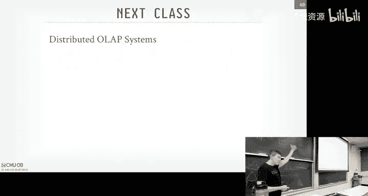
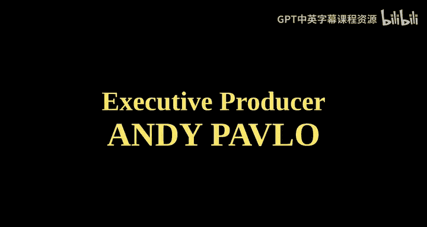

# CMU《数据库导论｜Intro to Database Systems (15-445645 - Fall 2024)》中英字幕（deepseek翻译 - P24：#23 - Distributed Transactional Databases.zh_en - GPT中英字幕课程资源 - BV1Tys8eQELW

Yeah。い？🎼OfficYeah we have three lectures left， so for you guys in the class。

The roomm to finish up the semester room is there。no class， obviously， should be Wednesday。

 not Thursday。 this Thursday Thanksgiving， Wednesday。

 there's no class on campus or university so don't show up here。 I still will hold my office hours。

 I'll post it on slackla or not slack on piazza we do it over。

 So if you want to talk to me on Wednesday Ill hold my office hours。

 even though we're not having having lecture。 Wednesday's class next week at the end of the semester。

 we typically do this pope Re where in the past， we've had students vote for what systems they want me to cover。

 So it's like flash talks from Andy I'll try to cover as many like like five minutes we can do real ones。

 we can do fake ones're not we can do hobby ones or joke ones。

 parody ones like mango Db instead of Mongo Db things like that。 or we could do。😊。

's bunch of topics you guys， want to learn more about。

 We can cover like try to go off the cuff in like5 minutes， try to cover those。

 So I'll post on piazza what we want to do this this semester。

 I'm not for anything you guys can vote for what you want to do in previous lectures we've done call in shows where people like from the outside team You can call in and ask crazy questions you can ask questions。

 So we can do anything。 So I'll post Piaz what we want to do Project 4 we do on the Sunday。

 December 8 at midnight homework 6。 I think the gray said it was due December 4。

 The website was December 8。 I've changed now grayco and the website now giving you an extra day thatll do on December 9。

 Okay yes。😊，Can you use lateate days for Project 4？Yeah， why not。some some causes like。Don't know。

スこした。I mean， like， I don't think the the university doesnt want me to have。

 doesn't want anything do the week of finals。But like， I don't care if you don't care， right， like。

So yeah， you， you can't use like this。 I mean， final grades aren't due till like December。

18th or something like that， right， There's some， some date I had to put in final grade。

 So as long as you get it done before that， I don't care， right。

And then the final exam will be December 13 again。 So we want to get the part of the reason why'm making this do earlier rather than later because we want to give you the solutions everything by the 13th。

 So we'll we'll put them out like maybe the the 11th but the the homework 6 isn' isn' there won't be a lot of topics is covered in homework 6 in the final exam because you're not building that。

 you know， it's not you're not building up for the projects。

 we we want to emphasize the things we do in the projects。 So again， December 13， Friday，8 3 AM。

We'll do the study the final， final exam review Wednesdays next class before the Po recession。

 but there won't be early exam， and then don't。Don't disappear before the date。 Okay。

 there's two more talks Data talks this semester。 Today， we have the guys in China doing Gr time Db。

 the time series database built on data fusion that'll be at 430 again on Zoom。

 And then next week we have another dude for another system in China called Databd But they've sort of in the same way that like data fusion was sort of the standalone piece that they built to do query executionion。

😡，OpenDoll is a data access layer， meaning think of the disk manager in bust。

 like you have your buffer pool talk to some disk manager then goes out to some disk and gets the data。

 so they have a layer that replace the disk manager that you go replace the thing in bust to go readta from S3 redta from EBS or whatever remote URL you want。

😡，So that guy is gonna give give a talk actually not November 25， whatever。

 whatever Monday is next week， I think December 2 or something， okay。All right。

 so I wasn't here last class， I was in Chicago， then I had to go to Amsterdam for an award session and then my parole officers all pissed off because like whatever So because it was out of the country。

 But even though it was an award session， it wasn't my award。

 but I was I was giving a talk at the award So like oh。

 that doesn't count for work because it's not my award， but like whatever。 All right。

So that was lessy。 So I apologize for not being here， but know， when did a good job。

 So last class W talked about again the introduction to distributed databases and he presented these sort of the basic three system architectures that you can have in a data system shared everything is what we understand bus tub or something like Postcast to be where's like a single system that's running on a single box that has control of the disk。

 the memory in the CPU and everything' is all local to it。

The shared disk architecture is where something is like running on S3 or there's a distributed file system layer where you have multiple computee nodes that essentially aren't holding the data。

 but know how to access that shared storage to go pull the data out and do something with it and then shared nothing it the classic distributed system where every node is holds a piece of the data in your database and any time you want to run queries or transactions across them you're sending messages between those nodes and they knew how to talk to between them So in before the cloud before something like S3 and the prominence of that。

 shared nothing was the most common distributed system approach and shared disc was actually considered a bad idea because Oracle tried it and tear data tried it。

 it was always kind of expensive but with S3 that's a game change Snowflake was one of the the first systems that came along and said hey let's build on a shared disk architecture on top of S3 so we don' have to do storage ourselves and that was a huge win for them again so the word summary that was that last。

Was the cofiner of Snowflake？嗯。then we saw different ways to split up the database right the partition charting schemes。

 hash partitioning， range partitioning。 is's just a way to say I have a database。

 It's larger than I can fit on a single node。 How do I split it up and distribute it across my different nodes。

 even if you're doing a shared dis architecture or something like S 3 has technically infinite storage。

 You still need a way to assign what compute nodes are allowed to touch or look at what pieces of data in a partitioning scheme would give you that。

😊，And then he talked a little about at the end， the different ways you can coordinate transactions。

 And that's one of the things we're talking about today is， do I have this。

 this sort of global traffic cop that is in charge of deciding what transactions would allowed to commit and when or am I doing interralized architecture where I have the different nodes coordinate amongst themselves of how to commit transactions。

RightAnd so we're。We're not going go， we're going to see a really distinctiont andize decentize today。

 but like。The protocols we'll talk today。 It't actually doesn't matter which one of these two you're doing。

So as a reminder for everyone， what， what do we mean when we say we're doing O O TP， right。

 we have this distinction early in the semester。 we talked about O TP versus OAP or online transaction processing versus online analytical processing。

The transactions processing world， we're talking about queries that touch a small amount of data。

 but actually can modify the database， they can update records， insert and delete and so forth。

 and we basically doing the same operations over and over again。😡。

But we don't care whether they're doing the same thing and over again。

 The thing we care about is that now they're modifying the database。

 or now they want to see the database in a consistent state with all the asset properties that we we learned about before。

 And now how do we manage that and coordinate that across multiple nodes。

And I realized I'm only giving you a single lecture if you count last or last class as two lectures like distributed databases。

 distributed transaction databases are super hard。 We can do years on this。

 I'm just trying to give you a quick brain dump。 Here's the things you' gotta be aware of。

 So when you got in the real world， you can at least be aware of the different things you have to consider。

😊，And then Monday's class next week， we'll talk about how to do a distributed OAP system。Right？

Basically， how to do a join across multiple nodes。That's actually really hard。啊。Al right。

 so if we go back to the diagram we had before from last class。

 its distributed the centralized coordinator。Right。

 say we have a transactions to run the applications server here。 It wants to touch data at these。

3 nodes。 and soon we're just doing， civil partitions。 We have P1 or P4。So we get a begin request。

 somehow we know to land on this one node where P1 is located。

 and we're going to designate that as the primary node of this transaction。

Right what that means we'll see in the second。But then now assuming that the application server can talk to any other other node。

 it can send query requests to all the other nodes to update things， get some data。

 do whatever it wants。And then now， and this is all done in the context of a transaction。

 So then now when my application server says I want to commit。

 this primary node is responsible for communicating with the other nodes and say， hey， all right。

 we were all involved in this transaction。 Is it safe to commit yes or no。

And then once they all agree， we' will talk about how we get that agreement， which is not easy。

Then we can send the acknowledgement back to the application server and said， yes。

 your transaction has successfully committed。And again。

 assuming remember running with all the same asset guarantees that that we talked about for on a single node。

 shared everything system。No matter what happens to my database system， if I crash。

 if any of these news crash or the whole thing crashes come back， I should still see all my data。

 or now if I tell the outside world my transaction is committed。

 if anybody then tries to read data maybe P3， I should see the changes that I saw that were created by this other transaction。

 assuming hasn't been updated yet。So how to actually achieve this？I's not easy and very， very hard。

 And， and people often get it wrong and really wrong。 And oftentimes， in the nosel world。

 they just don't do it。可是超儿。An。So our big idea we're trying to do is what we talked about before is that。

We're gonna to have our database split across multiple resources。 So multiple compute nodes。

 multiple you know， multiple disks， it doesn't matter。

 But we want them to appear to the outside world to the application server as a single logical database system or a single logical database。

 So we don't know。 We don't care in our SQL code。What， you know， what node is gonna run a query。

 We just say， here's the query we're gonna to run。 And so whether our database is split across one machine or 1 thousand0 machines。

 our SQL query should just work all the same。But things we havent haven't discussed so far is what do we do to make sure everyone agrees that a transaction is allowed to commit。

And then when it does say go to commit， how do we make sure that it actually gets committed。

And again， when we come back， we saw our changes。So it's easy when everything's up and running up running just and fine。

 right， There's no failures， no big deal， right。But it's when when things start to go bad and they will in the real world。

 then， then things become more challenging。So things we'll talk about today is what happens if a node fails。

 why are we'd running a transaction？😡，What happens if a message gets delayed？

Right I think because it's T CP PI P， or doesn't mean it'll guarantee within the stream is gonna come in the right order。

But like there might be some weird network hiccup and your message to one node for one stream might get delayed。

😡，And then show up like a second later。Or what if the other node actually doesn't physically crash。

 But they it's running a Java database database system。And then the garbage collector runs。

 and it pauses for like five seconds， which can happen。So now the date that system looks unavailable。

 but it's still alive。You can ping it。 You can send， you know， you can ping the node。

 It's still going to be responsive， but the database over process itself is not responsive。

 What do you do。And then what happens if we don't want to wait for everyone to agree that we're gonna to commit a transaction and we send back responses early。

 Okay， well now what happens if one of those notes and crashes comes back。

 how do we account for that？😡，So this， this， this， I just want to re emphasizes that this is very。

 very hard to do。And this， again， this is why you don't want your random jobscript program over。

Building these kind of things。 this is what you want to use a data system to do this for you。

And when we see vector clocks， it gets even worse if you let JavaScript promoters handle that。

All right so。For today's lecture， we're going to make a very， very important assumption。And that is。

 we're going to assume that all the nodes in our distributed data system are friendly。

 or we control them。 They're in the same administrative domain。Right。

 that means be the software itself will be well behaved。 Now， there could be problems。 like I said。

 the JVM should kick in and start doing garbage collection and pause your pause your node。But。

 but again， it's not like we're worried about someone。

 a hacker coming in and running malicious code on our Davis node。Right。

So that means if we tell a node， one node tells another node， let's commit transaction。

 and that node says， yep， let's commit it。 I agree。 Let's do it。

It's not going to reverse that decision， later on。On purpose。Fails is again。

 a different thing we'll handle that。Right。If you don't trust the other nodes。

Then the protocol your needs is not what were talking about today。

 You're going to need what's called a Byzantine fault tolerant or BFT protocol。

 And this is basically how blockchains work。blockchainlock is gonna run transactions。

 It's basically a database。 They're gonna run commit， but they're not gonna trust the other nodes。

 So they're gonna have this other， this， this BFT protocol to be able to handle that where nodes can start lying and doing things that that that you don't want them to do。

So don't do this unless you're doing Bitcoin。Right， we don't。 we。

 We don't want this anywhere near any anywhere our O TB database systems systems， right。

 because the performance overhead for this is like。

5 to 10 x over what the protocols we'll talk about today。 It's bad enough。

 We've got to send network messages potentially over the wide Air network。

 And now we're dealing with the speed of light。 But then you got some protocol here because you're worried about。

 you know， Bitcoin miners and stuff like that。 we're not going to do this。And most applications。

 unless you're money laundering through Bitcoin， you don't need this， okay。I this is clear。

 So I mean， I， it always comes up like， okay， why are we doing this， You know， how we handle this。

 if we want to do committee do blockchain instead of doing all this stuff we're doing。 No。

 blockchain is gonna be a case So what we're talking about today and slow。Okay， so assume again。

 all our node are friendly。 We wrote the software。 We're running the software。 We control it。

We don't expect them to do malicious things， but we still need to count for failures。An anoma。

Alright， so first thing we to talk about about is how we're gonna replicate the database across multiple nodes。

And then that'll lead us to discussions like， how do we extend or proc 8 changes between these nodes to keep things replicated？

Then now comes to the question of now we have a bunch of replicas。

 We told them to do a bunch of stuff。Can we get everyone to agree that。

 that those changes are allowed to happen and， in the right order。

And then we'll finish up talking about the consistency issues we have to deal with under the cat theorem or the passic extension to cat theorem。

2。So the first thing we want to do is replicate our database。😡。

So now I maybe be thinking this doesn't sound like a distributed database where I'm just saying。

 okay， I have a node primary bunch of replicas。 that's distributed database。Right。

 it's a simplistic form of it because we'll see in a second。

 because you're just having all your updates going， Right going to one location。

 But you still need to propagate them。 and you still need everyone to agree that those are the changes you want to propagate。

I would say for the basic non partition replication scheme of top today。

 like 99% of people out there， this is what you would want to use。

RightBecause you want to use this for scalability， be able to run extra queries。

 But you also want for durability or availability。Right。

 because the primary could go down and you can fail to a replica。

We'll see the multi primarym in a second。So this would be independent of what we're talking going here today of whether we're doing partition or nonpartitioned databases。

 meaning does every node have a complete copy of the database or do they have some partition of it？

And also whether we're doing Sha nothing or shared disk。Because share this systems like Aurora。

 they're basically doing the same kind of replication stuff we're talking about here。

 but they're going to do this underneath the covers for you and hide it from you。

So the question could be， how do we configure our replicas， like， where do the rights go。

 Where do can reads go。WhenWhen do changes actually occur？

How do we wait for those changes to be acknowledged from other nodes？😡。

And then what happens when we have to do， how do we actually want to update the database。

Do you run queries or do， do replay the log。 So again。

 this is basically a brain dump of all these different decisions。 And we just go through one by one。

 and you understand the trade offs between them。All right， so the first issue is。

What the configuration of the system is going look like when we have replicas。 And as I said。

 the most common one is going to be the primary replica。

And sometimes this is called leader follower in the old days， you you called master slave。

 So if you want to look up， you know， older papers on this， theyll refer to it Master slave。

 There's a lot of documentation using that terminology。 So use that term to find what you need。

So the idea here is that there will be some node in our system in our distributed system。

 or distributed data system that we're going to anoint or elect。As the primary。And then all， sorry。

 all rights have to go to that， to that primary。And then it's the primary responsibility to then propagate those changes to the other to the replica notes of the followers。

AndSo if you ever want a consistent view of the database。

 you can always go directly to in the latest version of the database。

 you always go directly to the primer because all your rights are going on there。

 things get committed there。 you'll see them right away。

But you can offload read only transactions or read only queries to the replicas。

 And that takes some of the load off of the primary。

 so it can just try to do the rights as fast as possible。

 And then you can do the reads on the on the replicas。 Now， again。

 you may not get the latest version of the database on the read replicas。 But for some applications。

 that's probably okay。没。Now the key thing we're have to deal with。

 and we'll see how to handle this in the second when we talk about consensus protocols is。

At some point， the primary will go down。Either by accident。

 like someone trips to the power cord or there's a software hardware failure。 But oftentimes， too。

 when there's a recordversion upgrade like like Amazon will force you to upgrade your versions of your database every so often。

 so at that point， you have to restart the server。 So at some point。

 the primary is gonna not be it's going to go down。

 And you have to elect a new primary from when one of the replicas。😊。

And so we'll see how to handle that in a second。The second configuration scheme is to do what's called multi primaryaries。

 sometimes called multi home。And this is where the。The any transaction can update any data object。

On any possible note。And now the replicas have to synchronize between them when these changes occur。

To make sure that。To figure out who's allowed to actually commit。

 Who actually should be the the correct version of a。Of the data of an object。

So let's look at two visual examples。 So the first one is primary replica。So again。

 you have the primary， all your right queries have to go here。

 but then you also can send read queries as well， read transactions。😡，And then in the background。

 the primary is going to be able to send messages to the replicas to apply the changes that occur on the primary to the replicas。

😡，And let's see in a second。 this either could be basically the actually。

 the most common one is is the right handlock that we talked about before。

So maybe we talked about the change data capture where you could have all your updates occur on one node。

 and then you have this other component or tool that looks at the right head log you're writing out the disk and also can send those redho messages out to another node。

😡，That you would use that for this。 So now the replicas are basically in kind of this pseudo recovery mode where they're getting these red head log messages over over the wire over the network from the primary and just replace them and applies the changes as if it was doing recovery like normal。

 normally。But it's like it's an infinite size or it's a never ending log file。Right。

Becauseuse not some point， you're gonna reach the end like an area and say， okay。

 I'm done now except running transactions， you're kind of constantly always applying the changes as the prim sends them over。

So the primary will always have， again， the latest version of the database。😡，If you want。

 if you want to read the latest version of the database， then you have to send your re queries here。

 but you could also send re queries to the replicas。And again。

 you would do this to offload the work that the the primary would have to do。

 So then maybe the primary only does rights， which again。

 which are expensive because you have to update indexes。

 you have to generate right hell log messages， You have to run whatever the transaction protocol whatever currential scheme you need。

Right。And then so if I want to have my， my。I want to avoid my primary doing amount of work for for my。

 my read queries。 I can send the read queries to the replicas。Most workloads are read heavy， right。

 maybe like。1% of the queries are 1% of the transactions are updating。99% of them are reads。

 Just think how you you browse the Web。 You， it's usually the case。

The other scheme is to do multi primary。And this is where you can do reads and writes to any possible node。

And then now when a transaction goes it commits。Now I have to figure out who。

 you know what should be the correct version of this， right， So again。

 we can use that right ahead log scene that we talked about before。

 we're propagating updates between the different nodes。You could have， you know。

 multi tiers a hierarchy like where you have， say these two different data centers。

 you would have one leader within a data center that gets all the updates and knows how to propagate them to a bunch of followers that that has locally。

 right。But in general， again， there has to be some。

 some process to figure out who's allowed to commit what changes if， you know。

 if two rights occur at the same object on different nodes。So most people， again。

 most systems are going to do this。😡，It's only really， really large guys need something like this。

 Like， this is what Facebook uses。 right， actually， Facebook started off with this。Right。And the。

 the problem， of course， is that， when Facebook became this global thing， you know。

 over 10 years ago。If now I'm down in Brazil， their data center is up up in California。

 If I do a right to my timeline or whatever it's called you when you post like a stupid cat cat video。

 right， that post would have to go up from Brazil to。To the California data Center。

 do the right there。 But now if I click refresh on my timeline。I may not be able to know。

 the change may not been propagated down to the replica down in Brazil。 So I may see a sta version。

Of course， now people get pised。 like， where's my cat video I just posted。 So。

 so Facebook will play this little trick where they would actually put a cookie in your browser。

That recorded your timeline post so that when you refreshed your page。

 it would read the local browser copy to see your post and show it back to you。

 even though it actually hadn't been propagated to the database yet。😡。

So you can do that when everything's in the browser for some for some applications。

 but as you start doing more different kinds of services and different kind of application types。

 they had to switch over to something like this。 this is what they do now。Google。

 Spner will be like multi primary， But again， most distributed datas only need to be the primary replica。

All right， so next thing we have to consider is。How many copies of data are we should should we maintain it all the time to make sure our database is still available。

 I'll cover what I mean by it available when talk about the cat there in a second。

 The basic idea here is that it's a threshold to determine。We assume nodes are going to go down。

 How many nodes are are we allowed to go down or how many copies of our data are allowed to go down before we say we don't want to allow anyone reads and writes because we don't want to take a change from a transaction。

 modify an object。On the last copy of the data we have， then that node crashes and we come back。

 And now all our replicas that that we had before don't have that copy。So in the database world。

 this is called case safety in the Tri systems world， it might be called something different。

 it's basically just say again at what point or how many copies I must have before I start I halt operations。

And we'll see in the case of the， let me talk about the cat theorem again。

The no singlegel guys would allow this to go below。Below a majority。

Whereas in the sort of relational distributed data world， we don't want to lose data。 So we very。

 very careful about setting the threshold to a number that says， okay， once we go below that number。

 then we just halt the system。And so it makes it unavailable。

 But that's better than we some people would argue that for some applications。

Not being available is better than losing data。Alright， so now the question is also going to be。

 how do we actually propagate the changes from either from from the primary to replicas or between the the multiho systems or the multi primarymary systems。

And this is where this consistency stuff when I talked about acid before， I said。

 oh it's kind of hand wavy when it's on a single node。 Now。

 this actually should make more sense when you do this in a， an distributed system。So the idea is。

 then when a transaction says I want to commit。At what point do I acknowledge them back to tell them that they've committed？

Again， assuming I need to replicate the change across multiple nodes。

Do I wait for all those replicas to acknowledged that they got the change？Do I wait for none of them？

W wait for some of them。So the two extremes are you wait for none of them。😡。

And you wait for some of them。 or sorry， wait for none of them。 wait for all of them。

 If you wait for all of them。 that's called strong consistency。

So that means no matter what if I'm told a transaction is committed。

 no matter what node I then go to。I'll'll see the changes of that transaction reflected。

In eventual consistency， the idea is。I won't wait for all my notes my replicas to say I got the change。

 I'll immediately come back and say， yeah， I got it。

 But now if another for another query tries to go read data on another node that hasn't applied the change from the primary。

 I might not see that change from that transaction that is committed。

 even though I was told it was committed。😡，So eventual consistency。

 the idea is that you're not going to wait for the， the notes to acknowledge it。

 they'll eventually get updated。So it basically looks like this。So。

 assuming you have a really simple setup， we have a primary and a replica。

And all the rights go to the primary。 We tell the primary we want to go ahead and commit。

And so then we propagate the change to a replica， and we tell it go ahead and flush。Right。

 we'll talk about how， you know， how it's actually staging the updates and the right head log in a second。

 But assume that it's got all the changes at this point。And now we say go ahead and flush。 as again。

 as if it was a transaction being run directly on the replica by， by an application。

 it's like the the prim is telling I want to run this transaction。 go ahead and commit it。

So we' got to make sure we flush all the changes because， again， it's the。

 all the buffer post off we talked about before， right， It's， it's the note， the。

 it's the still no force。 where you have to flush all the flush all the right head log changes to say our transaction has committed。

So that means the primary has to stall and wait， we send them flush message and has to wait。

 and then at some point it does the flush， sends back the acknowledgecment。

 and then at that point we can then tell the application our transaction has committed。😡。

A cigarette command or event consistency， basically says。I go， go ahead and tell commit。

 I go tell the other， the replica node。 go ahead， and flush this as well。

 but I don't wait for them to respond。I don't need to。And I immediately about semi acknowledgement。

 Now， again， this， this node may crash。And then this one gets elected as a new primary。

 So I may come back here and actually now my transaction is missing。

 because maybe this message didn't actually make it over。You typically send the flush measures first。

 then you send back the acknowledgement。 But if you did the the order。

 if you send back the acknowledgement， then send the flush， the flush may never make it。Right。

And now that transaction doesn't the， the replica doesn't know what was the fate of the transaction。

You saw this last class when we talked about consistent hashing。We talk about quorum rights。

 so that's somewhere in the middle where I do a right to commit my transaction。

 my data is replicated three times but I have to wait for two out of three notes to acknowledge that they flush the data。

 then I send back the acknowledgecment。The idea is that， again， if you assume that failures are rare。

 what's the likelihood that this thing one of these guys are going to crash？You know。

 it's pretty low or maybe they're both me going to crash at the same time。Potentially pretty low。

So rather than paying this penalty to weight， I'll immediately get back my response。Okay。

 we'll see how this fits into the cat theorem in a second。So most systems。

 the NosQL guys are gonna be down here doing some kind of version of eventual consistency。

 the sort of classic relational， distributed relational data systems like a D B2， an oracle。

 nonstop SQL。 Those guys at the top， they're gonna be doing synchronous commit because you they don't want to lose any of your data。

Allright， the next question is， when do we actually propagate the changes from the primary to the replica。

And again， it doesn't matter whether you're doing shared disk or shared nothing。

 doesn't matter whether they're doing multiho versus multi primary versus a single primary。

If you do continuous propagation， that means as the primary is getting or one of the node is getting all the changes from a transaction。

It's immediately sending out the redhead log messages， the log messages to the replicas。😡。

And as soon as those， those queries get， get executed。think of like it's like again the redhead log。

 I'm putting my red helpilt my， my， my log entries into my buffer that eventually get flushed to disk。

But as soon as I generate a log record， I also immediately send that out over the network。

 I can still batch it up maybe with other messages。

 but I'm not waiting to acknowledge orm not waiting for a commit message。

 I'm just sending those things over the wire。😡，The downside of this approach is that I have to also then send a commit message。

 which is fine。 But if I send an abort message， then my replicas may have been applying much of changes only to later out find out that the transaction didn't commit successfully。

 And I they have to roll back the changes。If you you do the propagation on commit。

 then basically you stage all the log records that you have on the primary。😡。

And only when you know the transaction is going to successfully commit。

 then you ship that over to to the to the replica。And now this guarantees that it only sees transactions that has committed。

 and you don't have to waste time rolling things back。

Or boards are typically rare in in most systems。 I think how often you browsing the Web or doing know。

 using your bank website or something。 How often do youbor things， You know， not bad often。

So the top one is always gonna to be better because you don't to wait to know whether transaction is committed because you assume it's going to commit。

 and you send your log messages as soon as you get them。Yeah。Allright。

 this last one could be confusing。 so bear with me。And please ask questions if you're confusedfuse。

So。It' been kind of hand wavy and PowerPoint showing arrows from from one node to the another without really saying what。

 what are we actually sending along。Right。But for the most part， you。

 you can assume that we've been sending right ahead log messages。

So that means that when we want a transaction， the queries are running on one node。

They're making changes to the database。And then we're sending the right head log messages to them to get applied to the replicas。

This is known as active passive scheme。😡，And the idea is that the transaction is actively executing on one。

On one node。And then the other replicas are passively applying the changes。

That the transaction made on the node where it was actively running。

So it doesn't have to be this way。I could actually run the transaction in multiple locations。

Let them run independently。Make whatever changes that they want。

 I don't have to send any right to hell log messages between them。Right。

 the only thing I need to do is at the very end when the transaction commits。 everyone says。

 did you commit， Yeah， I committed， done。Right。So this is called active active because their transaction is actively running in two different locations at the same time。

And。Depending on what queries they're doing， they can run independently without coorating between each other as they're running。

So again， the only message they need to send at the end is did did you completely successfully， Yes。

 I did， too。So this only works if you can guarantee that the transactions are deterministic。H right。

 so how do you do that？Well， if I have a random call in the SQel query。Then I just make sure。

 they had the same seed on both nodes。 That covers that。What do they call now？

I try to get a time stampamp with current time。 Okay， well just make sure that they， you set the。

 the transaction time stamp to be the same when they both start。

I said now how to keep the clocks coordinated， that's kind of hard。

 but so maybe the transaction shows up at a centralized system， you assign a random seed。

 you assign it at a timetamp when it starts， and then you send it to the Ju of node that execute simultaneously。

Yes， so you save on communication because you don't have to like do it only in one and pass the data。

 but then don't you at the end still have to make sure that all nodes are the same？

Like what are you really saving here？And the statement ist， he's correct， is that。

Since I still at the end when a transaction commits。Since I have to just make sure that。

 I still have to make sure at the end that everybody's committed successfully。

 So there's still never a ground trip for that。What am I actually saving？It's avoiding。

 it's the intermediate data I'm sending along， which could be a lot。

I could update a billion records in my transaction。

 and I I sent a billion redhead log messages over the network to propagate those changes。

I avoid all that。Yes。け？して。Con actually ends up。The same result。T with。对面。Doing some work up from。

The design of the database。Such that any transaction。Be deterministic。

Check at the end of each transaction and actually send something in between the。Right。

 so hes through the second question statement here。

 I'm saying you need to check at the end whether end with the same result at each replica。

 iss this something I'm doing at the application level to make sure my transaction transactions are all deteristic or。

 or should the database system provide this guarantee for me。It's the latter。

So you would have to have a system that can guarantee that you have the same ordering Si ordering。

 if you will， of， of， of transactions on both same nodes。And that the。

Anytime there is non determinism in the queries。Like a random call， like a timestamp。

That you guarantee that both， both all the copies where that transactions is running will see the exact same thing。

Almost very， very few systems actually can do this。The only one at least I can think of is Vol T B。

 which is based on assessment called H， which I help build。 there might be a few others。

But you typically would see this in a system where you execute transactions as store procedures。

 which we haven't talked about。 But think of a store procedure as like an RPC call。

 you can make to the database system that has all your application logic。

 things you can't normally have in SQL， like if clause four loops， exceptions。

 you could have procedural logic， comparative code。

 you run in the data system as a function call intermixed with bunch of SQL queries。And so again。

 now， if I instead of sending these back and forth with the queen， the queries。

 because the timing can get off between the client and the server。I say run this transaction for me。

 looks up the catalog， gets this function， and runs it beginning to end。Again。

 avoiding any nondeminism in those functions， you're guaranteed to end with the same state。Yes。

How its active has it different from primer replica as shown on the slides because from what I understand the Act bringing like the primary to actively。

 execute and replica just receiving the updates from right head on。Actually， question question is。

 I'm saying this is not the same as primary replica versus primary。

I just mean to that like you could have。You could still have a。

You still could do an active active scheme with primary replica。

 but instead of me shipping the right ahead log to you， I'm just telling you。

 here's the transaction I'm about to execute， you executed it too。And as long as you come back say。

 yep， I did it and got the same result that you did。

And result is the state of the database that we care about。

And the reason why both T B can do this is because they run all transactions in serializable ordering。

 They actually， Their execution is actually single thread it。

So I can have a single photota engine per CPU core。But now all I need to do is order the order。

 I specify the order of the transactions when when they arrive。And think of like it， it know。

 it's much of the batch of sort need to execute as long as both node execute them in the same order。

I end up with the same state。So most systems are going to act a passive。😡。

Because it's going to build off the right head log infrastructure we talked about before that we already have in our system。

And it's just easier to again to put the， put the replicas into recovery mode。

Or does have the ability to replay a redhead log message。

That's coming over the network instead of coming from a file。Yes。

 so active actives can always be like higher lows for like each node compared to active passes active active always be higher lows when I mean。

 I mean workflow like you're basically sending doing like the same query run same query over every node that you have to replica instead of like。

Sa I have like two transactions， two requests。I could have like， if it's primary a multi primary。

 I could have like compute one in one node and computed the other one in another node。

 But if you do like active active， you have to do to like in both。 Yes， so David is。

The statement is it may be the case that the amount of work you have to do in act active will be more than you have to do under active passive。

Again， it's a cop out， but it depends right， So I could have a query where it doesn't update and sets some value。

 you know， a equals a equals a plus1。But I don't a wear clauses， I have a billion tuupples。

 I got to scan if I do Act active， then every node has to do that billion record scan to find the record it needs one update and apply that one change。

 but under active Pass， I I do the scan on one node。

 then I send the log record for that one record I found I need to update that then gets applied。😡。

Right， but again， if you assume you're doing that synchronous commit or where I can only send the right ahead log message and not to wait for get it applied。

 I got to scan the the billion records， then send the one log message to get applied and wait for that to get acknowledge come back to me。

 whereas if everybody's doing it independently。 Yes。

 that may take a long time for that one particular query。 But when they're done。 it's just like， hey。

 you get it。 yep， or' good we're done。 Like it's， it's not multiple non trips back and forth。嗯。

And then there may be another case where the query is super simple， but I do a billion updates。

 and I' got  send billion log records。 Again， there's。

 you can come up with different examples for all these where one's better than another。

From an engineering perspective， this is going to be better because this is just relying on the right hand log infrastructure we already have。

 And to be honest， most applications can't be most applications don't run to store procedures and most applications will have nondemins in them in them。

😡，Once you start bringing in lower isolation levels too， then the problem is if。

 if you're doing active active， if I can run at different isolation levels。

 then depending what other transactions are running at the same time I'm running。

 I may get different results in different nodes。And it's super hard to do。

 Nobody does it because it's not worth it。Alright， cool。 I， I， So I， I， I think we get the bit。

 the gist of this。 This is good。 And again， most， almost every system is gonna be doing active passive。

😊，Okay， so now。If only one node is has to decide whether transaction is allowed to commit。

Then making that decision is easy。Even on， you know， this this precludes primary replica setups。

 right， because under a primary replica， you have to， you know， the primary say， I want to commit。

 you gotta wait to everyone else to say， yeah， we， we， we can go ahead and commit this， too。

 Did they apply the repa。 The replicas apply the changes。So if you're running on a single box。

 committing transaction is still hard because we have to do all the contures stuff we talked about before。

😡，But at least the node can reason about what's going on in its own purview in its own system。

Things are much， much much， much， much harder， I can't emphasize this enough when we have to bring in multiple notes to decide whether transactions allowed to commit。

Because first of all， how do we get everyone to agree thatll transaction allowed commit and get notified about that agreement。

And then what happens if now we try to go commit the transaction， get everyone to agree。

 and then one of the nodes goes down or the primary goes down。

And then now you need to elect a new primary。Right。

So how do you handle that so the main takeaway this is the same decision it takes to say whether a transaction is allowed to commit is actually going to be the same decision about who's allowed to be the primary。

It's just another transaction。But， slightly different semantics。

So this is what is called an atomic commit protocol。In the， in the data world。

 you call this atomic commit protocol in the distributed systems world。

 you call this a a consensus protocol， or atomic consensus protocol。

 but a high level they're basically doing the same thing。

And the idea is that we want to be able to decide the order in which transactions are allowed to commit across our different nodes。

So again， if you come， if you take them to distributed systems class。

 they talk about these state machines， like in Paxos。

It's basically the same thing because the state of the database is defined by the order in which transactions commit。

 including transactions that are not allowed to commit。In the state machine replica， I think。

 I don't know what example they sorry in distributed systems。

 I don't what example they always use like like a simple counter who's allowed to increment the counter or whatever。

 It's the same thing。 The commit order our transactions is。

 is is determined by the state of this distributed system。And again， we're going to have to do this。

 no matter whether our database is partitioned or replicate or not。

 we want everyone to agree that a transaction is allowed to commit before we acknowledge the outside world that it has successfully committed。

So there's a handful of protocols that can do this。We're going to focus on these two here。

 two Bs commit and Paxos。😊，Because these are the most common ones distributeds。

 although raft is probably probably more common than Paxos to this point。

 but it's just it's a simplified version of Paxos。 and so I'll discuss Paxos in a simplified way that basically is the same thing as raft。

Right， there'， there's a minor difference。So two phases commit。

Was first written about by or was always sort assigned or attributed to Jim Gray。

 the guy who met two days Locking and a cur we talked about before because he has a paper in the 1970s that mentions it。

But then he， Jim G actually refers to some Italian guy that。

Designed the first two phase commit protocol for some， the Italian version of of retirement system。

 and Social security system in the 1970s， right， But that Italian guy says he didn'tvent it either。

 It's basically this the same thing we use in the old days of， of contract law。Right。

 so this is actually taking something we do in the real world and applying it to a distributed database system。

So two phase commit came first。 Stonebreaker came along and did a three phase commit because they're trying to overcome this property if a N no goes down。

 if the pause is the system。 So three phase commit was an attempt to try to try to deal with that problem。

 but it't Nobody does this because it's complicated and it doesn't handle the corner cases。

 There is a four phase commit from Microsoft。They do that because they're running on hardware Exceleller or。

re using RDM with like afinna band stuff。 We could ignore that。

View stamp replication came out in 1988。 again， this was done in the distributedbut systems world。

And then the the one everybody knows that is Paxos。 So the view state replication is by Barbara Lisk。

 She won the Turing Award a few years ago。And then Leslie Lamport did Paxos。

 but he didn't know about viewtford application。 So I don't think he cites her。

 Zab is from zookeeper。 It's the zookeeper Atomic broadcast protocol or yeah broadcast protocol。

 Only zookeeper uses it， but it does exist。 And then RAF came out of Stanford。

 It supposed to be a simified version of Paxos。Right。So。For view stamp replication。

 I think that was the one that was first proved。 It was proved to be correct under all possible failures。

And then the only system that that I know that is view stamp replication is a thing called tiger beetle。

 the distributed distributed O TB Day system out of South Africa。But again。

 most systems are going to use Texas as to raft。So at a high level。

 all these hoomic protocols are basically doing the same thing。

And there's this great paper we'll and see in a second from Jim Gray and Lesard Laport that basically assess the state of the world for all these genomic protocols and sort of try to distill down what they have in common and what's essentially what they're all trying to do。

So at a high level， the idea is that these notion of these resource managers。

 I've been using the term node， but basically there's something that is can control or can determine the fate of data in our database system。

😡，And so that now when a transaction wants to commit across these resource managers。

 we have to go through these series of steps to determine， is this thing allowed to commit。

 yes or no。Right。And so the idea is you the basic state machine of any protocol is that when we start off in the working phase。

 we're applying changes to the database at any point if any of the resource managers。

 any of the node decide this thing is not gone the way I want to go。

 I'm going to go ahead and abort it。 Then you immediately go into the board phase。

 soon as one node or one resource manager says this thing is not allowed a commit。

 That's the game over。 That thing has to go down。 The transaction has to fail。Then at some point。

 the transactions work is done and you enter the prepared phase where you say you're trying to get everyone to agree。

 is this thing allowed to commit or not。If no， you go to a board it if yes。

 then you're successful committed。So for any commit protocol。

 we want for our distributed data system。We want to have these two important properties first is that the protocol has to be stable。

Meaning that once we decide these transactions is allowed to commit。

And everyone agrees at least well， long as the majority agrees in Paxos， but in two phase commit。

 everyone has agree has to be unanimous。But once you decide this thing is allowed to commit。

 you can't reverse that change。That's how the blockchain guys are trying to avoid that problem where people rolling back changes or changing their minds in our world。

 we don't worry about that。And then we need to guarantee that our protocol is consistent。

 meaning at some point at some undetermined point that everyone's going to agree that this is the correct state of the database。

 and again， for our world， the state is the order which transactions are committed。😡。

We're also going to assume that our protocol will provide some guarantee of liveibness。

And that just means that no matter what there's some way to keep the system moving forward。

 the state machine moving forward and try to make some progress。

Does it mean it's going to be efficient？But at we're going to least not be stuck in a state where we can't get out of and can't commit new transactions。

Right。And the， the， the guarantee achieve this basically says at some point， we need to be alive。

 The nodes need to be alive and， and， and。Communicating with other nodes to make forward progress on this。

So the first protocol we'll discuss is two phase commit。

 we'll see what the issues with this are and some optimization we can do。

 and then we'll see how Paxos can handle them。And so the main takeaway is going to be， again。

 two phase commit came first， Paxus came later， but two phase commit is actually a subset。Of Paxos。

 or degenrate case of Paxos。And again， this paper from Lelesssley Laport and Jim Gray basically proves that shows that they're actually the same thing。

But the the Pa has a different， different requirement for deciding when。

 when their transaction is allowed to commit。So we have application server。

 we have a bunch of nodes and without determining how we decide that this one is the node that's going to be the one we want to talk to to commit a transaction。

 we're going to go to this node one first。😡，So under the parl for two phases commit。

 the node that's in charge of deciding whether transactions is allowed to commit。

 it's called the coordinator。And then all the other nodes that are going to be involved in this this community transaction will be called the participant。

Paxs will use different terms， right， butre basically the same thing。

So now the first phase of two phase commit is to send a prepare message to all the notes。

And that's basically what they do whatever checks that they they need to do to say， okay。

 we're about to commit this transaction， I this allowed to happen yes or no。

And then if each node looking at its own context on what the transaction did on its local node。

 because it doesn't know what it did on the other ones， potentially。It can then decide yes。

 this is lot to happen。 I'm going to go ahead and commit。

 or I to acknowledgement okay that we're okay with preparing this thing for committing。

Now I'm not showing this in the PowerPoint slide， but for all these messages I'm sending out， sorry。

 all the messages I'm receiving and all the messages I'm sending out。

 those are gonna to be another right hell log messages I'm going to maintain。😡。

And then when I want to go ahead and commit， I got to flush all my network messages that I for involved in two days commit out the disk so that I I crashed to come back。

 I can know where I was and then do Facebook protocol。When， when I was running a transaction。

And you can put them in the same right head log you put for your regular queries。

So now once the coordinator gets all the acknowledments from every node that's a participant because it has to know which ones it needs to talk to。

Alright， it may not be all the nodes of my distributed database。

 but it's the nodes that that are involved in this transaction。Once they all agree。

 I get all the okay messages。 Then I enter the second phase where I said， okay。

To out all the other nodes， go ahead and commit this transaction。

 Same thing the each node goes ahead implies the changes。 If I care about synchronous commits。

 then Ill I'll flush the changes and and wait， wait till the flush finishes before I set back acknowledgement。

 but I don't have to。😊，And then now these come back and also send OK， and at this point here。

 the node can then respond to the application and say now your transaction has successfully committed。

哎。So again， the key thing in twos commit is the coordinate has to wait for everyone to come back。

 and I'm going to agree to say this transactions will have to commit。Yes will。OK就 send个OK了。

His question is question is， how would participant decide on its own whether a transaction is allowed to go ahead and test commit。

It's just all the stuff we talk about when we were running on stickdo anyway。 So say you're doing。

 say you're doing OCC。Right， and you didnt enter the validation phase because you got a commit message。

I may， if I'm doing forward validation， I may。 my right set may intersect with the transaction that's already running。

 and therefore， I can't commit。Right，If it's two phase locking。

 if you hold the lock and you complete the all updates， it's fine。

WellIt depends on when you check for integrity constraint violations。 So in some sisters。

 you can say， go ahead and play all my changes， but only check the indexes to see whether I have a duplicate key when I go ahead and commit。

Then you would fail this， you would fail that。So， it depends。But it wouldn't be because like。Oh。

 because you did something on node 2 and then node 3 did something different because you're not talking to node 2。

 you're just looking at your at your own system， your own node。

Right so the abort case is basically what we ask them about。 So node1。

 the coordinator sends a prepared message， say for whatever reason node 3 decides this transaction cannot commit。

 No no， no no we can't happen we can't let this happen。 So they send back the abort message。

 then no matter what node  two thinks is allowed to happen。 as soon as we get onebort message。

 the game is over， this transaction has to abort So we immediately enter the second phase where we tell everyone to go ahead and abort。

we don't to wait for the acknowledgeknowgment for the second phase from all the participants before we tell the application your transaction is aborted。

 because as soon as we get one， we know the transaction is never to commit so we immediately can return back to the client。

Right。So this is repeating what what I just said， right。

 each node is gonna record the inbound and out messages into some kind of right ahead log of nonvaal storage。

 And then now when you crash， come back depending， depending on whether you're the coordinator participant。

 you can do different things， again， depending on how far you got into the two base commit protocol。

 right。So if I was a participant and I crashed after sending back the OK on the preparepa message。

When I come back online， I look at my log。 I say， oh， I sent out an okay for the prepare message。

 Let me go figure out what actually was the final outcome of this transaction。

 you would go back to the coordinator and say， hey， member transaction 1，2，3。

 I said it was going be okay to commit。 Did it actually commit。

And depending on what the coordinate comes back with。

 you could either reverse the transaction which you would have all its changes because it's in your righthead log。

Or you could you could apply them and say the transaction is actually successfully committed。

If you never got through the prepared phase， then you just abort the transaction。

 like if I was getting much of updates and then my no goes down。

 that's essentially the same thing as aorting the transaction。

 So no matter what the transaction I'llbort。So if everyone was saying。

 let's go ahead and commit this。And you're the codinator and you go down。

Then when you come back online， if you do come back online。

 then you would send a message to all the nodes and say， yes， we go ahead and committed this。

Even though you may may have not told the outside world your transaction has committed。And under。

 under the， the transaction protocol， the transaction guarantees of a data system， if， if if the。

If we successfully save all the changes to disk。But don't send the commit or acknowledgement back to。

 to the client。Before we crash， did transaction still considered as committed？

So now it's up for the application server to say go back and do a look up and say。

 did the thing I just sent you actually get committed or not？Alright。

 so I've said all this a lot this already。 But like， what happens if the coordator crashes？ Well。

 the participants can decide amongst themselves what to do after some some amount of time up。

So typically there'll be like a heartbeat message you're sending around between the different nodes to say。

 are you awake， Yes， I am。 And at some point， the heartbeat heartbeat messages don't come back。

 So eventually you'll time out and just say， okay， well。

 this thing is we have to decide whether did you tell this。

 Did you tell the codator we're going go to commit yes or no。And then if everyone says yes。

 then you can decide again whether you want to commit the transaction。

ButThe key thing about this is that the system will not be available while you're trying to figure this out because you can't commit any other transactions。

Why are you're trying to figure out whether the current transaction you're at is allowed to commit or not？

RightBecauseuse what happens if that， that other transaction read something from the this first transaction。

 But then the first transaction ends up being on board it。

 But we've already told the second transaction is allowed to commit。

And that would violate asset guarantees。Alright， if a participant crashes。

 then the coordinateordator is going assume that。It's an important message。

If you don't get that first prepare okay back from the participant。

 you assume that it's going to fail no matter what。

So you go ahead and tell everyone that transactiona has a board it。

So there are two optimizations you could do for twob commit。

 one is very common and one is not so common。The first one is called early prepared voting。

The basic idea is that if you know that you're。If you know that when you send a query request to a node in the system。

That this is the last  queryer you're ever going to execute for this transaction on this node。

And you're never to come back to it with another query。

 then you just piggyback in the message and say， hey， run this query for me。

 give me back to the result， and oh， by the way， also send back me your vote for the prepare phase。😡。

So you get back the query result and you get back either an OK or abt message。

SoThen now when you run two phase commit， you don't want to wait for that round trip again between the coordinator to the participant because you already know whether it's going to commit or not。

From that last query。Most systems don't do this because you don't。Have a way in the， in like。

 you know， the sQL to， to know where the query is actually gonna run the first place。

 So how would you know that this is going to be the last query you may send？ I think JDBC。

 I think you may be able to send a flags， say this is the last query for this transaction。Ha。

I know in all the systems， both of me you can do this， but most of times you can't do this。

What is more common？Is to do early acknowledgement have to prepare where instead of waiting。

 once I get all， once I get back to the para fade， get okay from all the participants instead of waiting for them to say。

 okay， did you commit yes or no。Which at that point is， once you pass the fair phase。

 that transaction committeeting， no matter whether the notes go down or not。

 So instead of waiting for them to all you know acknowledge， yes。

 we got got we went ahead and committed， you merely shovedho the the acknowledgement back to the client。

Because you assume the window between the time when the client， the。

 the the time the flush and you automatically make the acknowledgement， it would be small。

And you have any recovery protocol any to deal with if one of the notes crashes during the commit process。

You assume it's going to go ahead and commit。So you can send the commit message back right away。

And this is very common。So instead basically， I get the application server。

 they submit submit a commit request， node one sends prepare phase messages to all the different notes or the participant。

 sorry the coordinator sends the prepare message to all the participants， they all say， yep， good。

 yes， we' go ahead and commit this。And then immediately。

 once you get back all the Os from a participant， then you can shove back the commit response， the。

 the success message to the to the client。 But then you still have to run the rest of the twopa commit protocol。

Right， you're just cutting off one round trip from。You know， cutting off one round trip。

 waiting for one round trip on the commit message。 You still have to do it。

 just you don't have to wait for it。Yes。こ。His question is。What if we're here。

 we get a pair okay from all the participants。And then。We send back to， now we crash。

 what you know crashes。she said， what happened the Nor coordinator crashes。 Okay， well。

 as I said before。The participants will have a heartbeat message。That it eventually will time out。

 You're not hearing back on the coordinator。 You told her you want to commit this transaction。

 You can't commit any other transactions until you figure out whether this transaction is committed。

 right， So at some some point you time out。 So then you you need a way to say， okay， Well。

 who else is in my cluster？ Oh， node 3 knows about node 2。 So they start talking to each other， say。

 hey， you remember transaction 1，2，3。 Did you say it was allowed to commit。 Yeah， I did。 Did you。

 Did you say it was allowed to commit， yes。And then， and then， then。

 then you go ahead and apply that record that being successfully committed。Or before you time out。

The coordinator comes back online， right Sa that you sent Sa that you got the okay messages out。

 Sa you sent the success messages out and said， okay。

 let me just make sure I tell these guys they't they haven't figured out yet。

 Make sure they know the commit。This is hard， right。

 there's long of these corner cases you got to deal with。Yes。

Could you say why we need a okay message for the？His question is。

 why do I still need this phase here？No， the response。Like sorry this。

 like why do I need this okay from everyone？嗯。His question is， why do I have to wait。

 if I send a command message to everyone。Why do I have to wait for the response back and say， yes。

 I went ahead and committed。So it's basically for， for。

That you know that everyone has has successfully applied the change。 and therefore。

 when I go ahead and now commit the next transaction， I know that everyone's in sync。

Soless in this case is I send a success back to。But from the。At the same time。

 I doesn't receive all the。Does that mean I cant start the next？So you could start it。

 you just can't commit it。So they have another commit message shows up。Right。

 so you send back to success。 you haven't gone through the commit phase yet。

Another commit request shows up， what do you do Well you would know that you're still trying to finish off the first transaction。

 you can't start committing the second transaction until you get back for everyone to acknowledge that they successfully apply the changes。

Cause you don't want the case of like， if I don't do the second phase。Right。

 these guys don't know whether this things actually committed yet because they don't know that everyone voted O。

So they're waiting to find out whether the transaction they just ran is actually going to commit or not。

Right， so now I do this。 Now I say， okay， guys， we all agreed to commit。

 guesss what they've committed。 Great。 So at this point here。All of the， the， the no2 and no 3。

 they can actually begin the process of committing another transaction。

But this guy still can't because he doesn't know that everyone has has acknowledged that they have successfully applied the changes from this transaction。

Becauseuse I asked， I， I told， I asked them to commit。

 I don't know whether that message actually showed up yet。

 And it's only when I get back to the acknowledgecment。 I， I know that they applied the changes。

 I told them to apply。So now when I commit the next transaction， I know that transaction。

 if it read anything from the first transaction， it will see the correct version of those records。O。

We have。13 minutes left， Let's go through the hardest protocol and distributed systems in that time。

 right， Well， Paxos， again， it's， it's。Again， it's going to be a degenerative case。

 tree based commit be degeneerative Pa。 So if you understand commit。Again。

 the I'm gonna to simplify it。 So you'll see that how it just maps into the the same ideas and all the things we care about under your phase commit。

 we still care about in in pes， right。So again， this is thely resilient protocol。

 atomic cr protocol in the face of。Anyynchronous networks？

So it's basically going be the same thing under our twob commit。

 where we have a coordinator telling the world I want to commit this transaction。

But under twobs commit you had to get everyone to agree that this thing was allowed to commit under Paxos。

 you just have to have a majority of the nodes agreed to something's allowed to commit。Right， again。

 now you see white two phase commit is a。Degenative case。The original passcode P's paper， actually。

 Who here is Reddit。What do you think of it？We shaking his head no， it's It's crazy。os actually。

 Paos symbol is not not good either。s not right go read this paper。

 just go spend five minutes looking at it。 It's crazy。 It's the best paper ever。

 But in terms of like its prose。 It's not a traditional computer science paper。

 It's written as if he's an archaeologist finding this this ancient voting system from this tribe on the island of Paxos in ancient Greece right。

 That's nothing with computers。 This is how they vote by throwing tablets into a hole。

 and you come back and read later on what was thrown in the hole， right。😊，It's brilliant。

 it's amazing， but if you try to take this paper and say let me go implement this。

 not going to happen， right？😡，So the story goes， he wrote it in 89。

 submitted it to a distributed systems conference， and it got rejected， right？

And if you go to Leslie Laport's website for like， he has。

 like this this chronological history of all the papers， like what he was doing， where he was living。

 who he was dating， what he was eating， like for every single paper。

 So he talks about in this Paxos paper， the the part time par meant about how it was a genius paper。

 It was， it was a work of art。 And idiot is on the reviewing committee。

 they didn't know they didn't how to appreciate it， right。So when I was in grad school。

 I was assigned to present this paper， my distributed systems class。

 and I basically said the same Lior said， like those papers know the genius the work of art and those reviewers they were stupid。

 but they didn't know they were doing。 The professor actually was more least hurley he who used to be here at CMU。

 and now was at Brown， He was actually one of the reviewers in this paper。

And he said that the story goes like they were originally okay with this Greek archaeology metaphor。

 All they asked him was put in the appendix proof to show that like how， you know。

 what this thing was actually doing of the algorithm。 And Leslie Laportt basically said。

 this is a work of art。 I'm not making any change。 So he he got rejected。 So then he puts it。

 The story goes， he puts it in in in his filing cabinet forgot about it。

 saw all these papers in the 90s where people were sort of dancing around the corners and kind of getting close what Paxos had already implemented。

 but wasn't solved in a complete problem。 So then he pulled out， dusted it off。 then reubmit it。

 And then this little， there's a prolo here that talks about how like。

It was this submission was recently discovered behind a filing cabinet of the editorial office despite its age。

 editor in chief felt that it was worth publishing。

 So they dug it out and got it accepted or got it published。

 Then he pointed out there's a follow paper from Leslie Lamber called Paxos Made simpleim。

 That doesn't help either。 the best paper to read of Paxos is the Paxos made live from Google。

 That one describes how that's my opinion， that's the best description of it。

 at least in the modern papers。 that came out 2004 Ti03 right。So， again。

 and then there's this other paper from Leslie Laport and Jim Gray。

 This came out in what is this 2006， right before Jim Gray disappeared at sea。

 Does everyone know that story。Jim Gray won the 21 databaseist in the 1990s。

 He was standing on his boat in the San Francisco Bay in like 2006。To dump his mother's ashes。

 And he went to part， normally don't sail to by yourself。 And then his boat disappeared， right。And。

 they never found it。 They didn't find any any sign of them。 He got declared dead。

 I think a few years later。 But like give an idea how important Jim Gray was and how much he meant to a lot of people。

 This is the early days of like crowdsourcing。 They actually moved satellites in space to go over San Francisco Bay and take pictures of it。

 And it was an early crowdsourcing effort where people would like。

 look at pictures of the ocean or of the bay and try to find his boat。 right。

 And they never found it。😊，So anyway this is one of the last papers that Jim Gve wrote with before he disappeared。

It's kind of heavy way to start this。 But let's go to it。 All right， so Paxos。 what is it， Okay。

 you have a commit request of the application server instead in calling these coordinated participants Paos can call these proposer and acceptors。

 There's a third no type in Paos called learners。 We can ignore that。 Basically。

 someone doesn't participate in voting。 but can see the changes in update things。

 think of a nonvoting replica。😊，So we send this proposed message out to everyone Sa for whatever reason。

 except or node3 dies during this process。😡，Just like two phase commit。

 they all agreed that this thing wants to go ahead and commit。 And long as we get a majority back。

 not all of them， just a majority from all our acceptors。

 then the transaction that's considered committed， then we do the second phase and tell them to commit。

Right， and then they they all send back acknowledgements。At some later point。

 if the acceptor wakes up， then they can learn from the other nose what what happened with this transaction to get up to speed。

Right。So in RAft， they're going to call these， I think they call still proping acceptors。

 I think the learners they call followers。 again， they're all basically doing the same thing。But。

Another way to think about this to guarantee the live in this property we talked about before。

 where we can always still make forward progress。Under， under two phase commit， if， if we crash。

 if a node goes down in the middle of a commit process， they got to figure out， you know。

 they got to figure out what was the state of that of that transaction。And then。

 then decide what to do。 again， the system that's unavailable during this time because you you're trying to figure out whether transactions allowed to commit or not。

And Pax says， you don't have that problem because。Proposers can keep proposing new stuff。 And。

 and you still， you know， theres still things are moving forward。To say along this timeline here。

 we have a poser over here， he's got three acceptors and there's another pose on the other side。

 So he says， all right， I want to commit this transaction。

 so I'm going to propose that this is commit N right。

 how they come out with this timetamp or this number， it doesn't matter。All the have say fantastic。

 Yes， we know about this transaction。 We agree to go ahead and commit transaction at， at。

 at an order N。😊，But then now， say this other proposal comes along and is unaware that this is the first proposalr and they propose to commit n plus1。

😡，Soon as you see a new proposal to commit a transaction。

 any previous uncommitted transactions have to abort。

Becauseuse you always have to be accept new proposals and always keep marching forward at time。

 right In two phase commit， you have to wait until the the first transaction commits before you can propose to commit another transaction。

So， now。The all they accepter C M plus one。 They haven't acknowledged that they're going to commit it soon as they see it。

 That's enough to say that anything came before that it's aborted。

 So now when the first proposal comes back and says。

 I want to go go ahead and commit this transaction， you guys told me it was a good idea or not。

Then they come back and say， I want to reject this and tell。

 you know you're telling us commit transaction and we just saw M plus one， you're no good to us。

 come back again。Right so then they all agree to commit n plus one。

 they commit the first proposal says to go in and commit it。

 they send back the acknowledgement and we're good to go。

 and then this guy can then propose commit the transaction again or abort it entirely。So obviously。

 this will be very inefficient if you have a bunch of nodes in your system。

 all proposing to commit transactions and just clotering each other。

 like it'll be the system will be live。 It be， you know， you can accept new things。

 but you're never gonna commit anything because。You know。

 contractions are going to keep keepingboard and over again。

And so this is what Google put together in this paper I mentioned about Paxos made live。

 or and they put an idea called multipxos。And basically。

 the idea is that you only have one node get anointed as the leader。😡，In a sort of paxist group。

 And then they're the only ones that's allowed to commit transactions。And if you have this。

 you can just skip the proposed phase because you know。

 no other node is going to come along and try to propose and commit a new transaction。

If now when one of the node goes down， you fall back to the regular pests protocol。

So to handle the case where the leader may go down and this isn obviously we was grind to halt。

You set a lease or timeout for how long they can be the leader。And then when that time out。It， gets。

 it finishes off。 You run a leader election， which is just another round of paxos to decide who's allowed to be the new leader。

And then now you basically introduce like， you know， incremental back off， where if I try to say。

 I want to be the new leader and I can't get it， then I'll sleep for a random amount of time。

 and then maybe somebody else will be able to sneak in and get it before I do。 Again。

 the nodes aren't malicious。 If I can't be the leader， It's not the end of the world for me。

If you're a leader， that's fantastic。 We， we can commit transactions together。 It's beautiful。😊，哎。

So how to set the timeout depends on the system， right， the longer it is。

 the less time you have to spend doing these leader elections。

But now the long you have to wait to time out on something because later has failed。 Again。

 the heartbeats can maybe pick that up earlier， but it could depend on know。

 how often you're sending those。So in Google Spanner these leases are 10 seconds。

 I think they say in the paper。Yuggabitte is two seconds。Cchroraach shouldB。

 I think the default is five minutes。Tidy B is 10 seconds because they just follow Google。Right。

 it depends on， you know， depends on the environment you're running in and the expectations of the notes。

All right。So quickly， two phase commit versus Paos versus ra again。

 two phase commit is going to be all transactions that the block of the coordinator fails。

After the prepare message is sent until the coordinate comes back or then you then figure out。

You know， amongst the node themselves， who's allowed to commit？Paaxs is non blocking。

 long as a majority of the participants are alive。And provided that you can keep going without continued failures。

 Raft is the same thing with as paxos， but there's fewer or no types that's basically just participant and and acceptor。

 which I think they call follower。And then when they do a leader election。

 rather than letting anybody be the leader。You have to have this requirement that basically it says only the nodes that have the most up to date log。

😡，Is allowed to become the leader。 So if someone is falling behind。

 you don't want to become the leader because obviously。

 they're slow and going make things worse for you。So if you you had the freshest data or the freshest commit record all the transactions。

 then you're allowed to go ahead and commit。All right， let me blaze through cat theorem again。

I think this should be， again， if you take it a students class。

 this should be pretty be aware of this already， but we can touch this up next class for fresh people。

Alright， so Cat there Im this proposed in the late 1990s by Eric Brewer at Google。 or he was at。

If some web startup， basically they recognize that， oh， if you have a distributed system。

 that's what distributed database is。That it's impossible to have three properties。

 You can't guarantee be always consistent， always available and still handle any time there's a network partition。

So the real way to think about the cap theorem is basically。

Are you gonna to be a consistent system or an available system anytime there's a network failure。

It doesn make sense to be a consistent available system。

 And when there's there never network partitions or network failure， communication failures。

 because that that doesn't really make sense。 It really has to do with What do you do when there's a failure。

So consistency just means what we talked about before， right。

 The idea is that if I make a change on one node， say I copy of of my database is。

 I apply the change here。 I should then apply the change also on my replica。Once I do that。

 then I could tell the outside world this transaction is successfully committed。 Now。

 if anybody comes along and tries to read that value on the， on another node。

 they'll see they'll see the correct version。Right。Availability just means that if a node goes down。

 assuming it's a simple primary replica， then I can have any transaction run on on this node。

 get back any up changes and the other node on the other side of the network。

 assuming we still can communicate can go ahead and read data over here。 right， That's fine。

 So the Davis is still available， even though some of them are going down。

The hardware is network partisitions。😡， Sam， I never get severed。

Now the two nodes can't communicate with each other。So what's going to happen。 So I again。

 Z I'm primary replica， this prim can't talk to this replica anymore。 It says， okay， no big deal。

 I'm the primary。This replica says， I can't talk to the prime anymore。 well， guess what？

I'm now the primary。Right，I'm only showing two nodes。 You would do basically， you know。

 a leader election between all the replicas on maybe on each side。 But this guy says， yep。

 I'm the primary too， because it doesn't know that this guy is still alive because it can't talk to him。

So now the problem' is going to be。you know， both these guys think they're the primary。

You don't know about the other one because you can't talk to them because it never's down。

 So the first transaction modifies a。 The second transaction over there modifies A。

 They both get acknowledgecments， say that your your transaction has committed。Now。

 the network comes back up。And you got to reconcile these changes。

They both thought they were primary。 They both thought these changes were allowed to happen。

 But now you have conflicting values。So this issue here， when you have this， the network theory。

 you can't communicate， this is called split brain。Right。

Both sides of your brain can't communicate each other， but they， they both can operate independently。

So again， the question is， what do you do when this happens？😡，If you care about consistency。😡。

Then you basically would halt the system or you halt the system where you don't have the majority of the nodes。

And then this means that when the network comes back up。

 now node the portion of the network that had the majority of the nodes。

 it maybe got a bunch of updates and you now propagate those updates to the replicas。

 but at no point do you deal with conflicting values。😡，So again。

 most relational distributed distributed relational data systems will will choose the first one。

The second one is you allow the split to happen， you allow the rights to occur on both sides or heresides you have。

 then when the network comes back， youve got to do a little magic to figure out what should be the correct version of those values that got modified。

So you either let the server do this or let the client do this。If the server does this。

 then you just last update wins。😡，Like whatever had the， the oldest time， the newest time stamp。

 that's the latest version。 Good enough。So Cassandra does what most systems do， most of the no Ss do。

The other approach to do was's called a vector clocks。This is actually invented by Leslie Laport。

 It's basically multi version as we did before。 We keep track of But here's the the version of it of a value。

 a version of an object at this timetamp。And it's like， you have a list。 So now。

 when I go read a value。 go get a instead of getting one value。

 I get back a list of values for different timestamps。 Now my application code。

 I got to figure out which one should I care about， Which one is the correct one。

And maybe go ahead and apply the changes。I only know one system actually did this， it's called Re。

And it was a nightmare。Because again， your average job programmer isn't know what the hell a vector clock is。

😡，It isn't going to know how to reason about if I update two things and now they both have different timestamps because one got modified。

 one did get modified by another side， which is the correct version。😡。

You're basically repeating the logic to figure out what is the correct version of multiversion Kgy tro in JavaScript。

This's not going to go well。Don't do this。Okay。So I'll just say there's an extension to Paxos our cat theorem called Palic that came out in 2010。

 It's basically。If there's a failure， again， do the same thing。

 are you partition tolerant with partition are you always available or exist。

 but on our normal operations you' got to make be this trade up between latency consistency consistency it basically says。

 if I have a primary， I do my update in one data center。

 I've got to prop the changes the other data center， the question is。

 how long should I wait for to acknowledge it？😡，Because I can made an infinite amount of time。

And I'll guarantee to be consistent。Right eventually I'll get responses back。

 But then now the system is not available。Right。Or maybe I only wait for one of the updates。

 come back and， or， you know， and then I can send back the acknowledgement。

 So there this trade up between how long do I want to wait versus。

How how quickly I can respond to things。All right， so hopefully again。

 you recognize how hard this is。 And I sorry for going over。

 Google is one of the first systems that said， hey。

 we don' want to do transactions because we want to be web scale。

 they did this in big table and much systems copied what Google did。

 But while everyone was recreating what Google did in the open source world， Google said。

 wait a minute this looks like transactions are a good idea。 They hadn't published it yet。

 but they've been working on a system called Spner for a long time。

 So everyone else is trying to writing the no SQL wagon。 no SQL wave。

 Google was actually building a real system。Sanner。They didn't support SQL first that came later。

 but they had this nice little snippet in here。 and it's basically saying what I said before。

 We believe it's better to have applications， programmers， AkaA ja programmers。

Deal with performance problems due to over transactions。

 rather than always coding around the lack of transactions。

 meaning dealing with vector clocks and inconsistent data。

So basicallys said you have some really smart people like you guys。😡。

Spend time making transactions run fast on your distributed database and let everyone else deal with that and not make them better programmers。

 okay。All right， sorry for going over have a good break Monday next class distributed that systems See refresh manifest likeoxicric night。

🎼What starts to boil。 I heat up the for you Reper girl here mymic down for oil still turn with third degree firm for one man。

 I heat up your brain， give it a sun to just cool lipper temperature to rise to cool it all with saying eyes。

