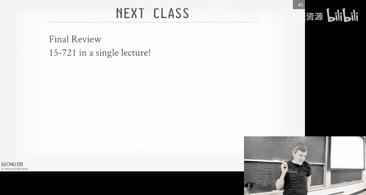
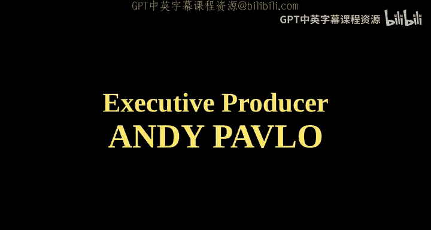

# CMU《数据库导论｜Intro to Database Systems (15-445645 - Fall 2024)》中英字幕（deepseek翻译 - P25：#24 - Distributed Analytical Databases.zh_en - GPT中英字幕课程资源 - BV1Tys8eQELW

Yeah。い？🎼Oicial Today's the last real lecture that'll be covered in the final exam。

 So it's sort of like finishing up the thing of the semester last that we cover the final exam。

 next class will be session and what I decided to do this year instead of having you guys vote for something I can click。

😊，instead instead of having you guys vote for like what systems to cover since I'm not teaching 721 next semester。

 I'm gonna try to cram 721 into a single lecture and just go through like clickhouse。

 bigque snowflake data bricks to try to yellow brick as many systems as we can。

 and you'll start to see how we synthesize again all of the ideas that we've talked about the entire semester。

 we now start putting it into real system。 So again。

 you'll be in a position that that when someone comes along， says hey。

 I have this new system It does amazing things。 and you go look the documentation。

 see what they're actually doing。 You realize， oh， it's this and this from the things we covered this semester。

 It's not you know it's almost always never gonna be something we haven't looked at before。

 variations of it。All right， so again that'll be Wednesday's class and we'll also do the final final exam review in the beginning of the lecture Project4 again it' due on December 8th。

 homework 6 will be due on December 9th， we'll have the I'll announce next class。

 we'll have on Piazza， we'll have the Saturday session on the seventhth for the Ts on the Saturday before the Sunday when project due we'll announce that but it'll be the same time。

 same location as before。😊，Final exam will be on December 13。

 and I'll release to some guy with a practice final exam。On on， on tomorrow。Palpiaz。

Any questions about any of these？Yes， is the final exammulative or is it question is the exam cumulative No。

 it'll be， it'll cover the material covered since the midterm。

 but obviously there's things you need to know that we covered before the like if you forget what SQL is。

 youre gonna have problems。 So don't do that right You got to know what a buffal is because we'll actually see that today a little bit as well。

 But am I going to ask you like what's the complexity of this something the beginning the semester now。

Other questions。 And then it's， it's a three hour slot of time， but it'll be the。

 the number of questions would be roughly same as the midterm。

 If you want to take a whole three hours， go ahead。 I don't care。Okay。And then I don't。More in class。

 but if you have need accommodations， please contact me as soon as possible。

 make sure we go through the office and get all that set up for you ahead of time， okay。All right。

 so today we have we have another speaker and there is actually very relevant to what we're talking about today about object stores。

 So there's a system out of China called Datab。 And then they forked off this piece the architecture that abstracts away what the storage looks like talking to object stores。

 which again， we'll see today in Oaf systems So he's giving a talk today at 430。

 The Gr time Db guy overslept last week。 I felt back because 4 AM in China when he' was calling in he missed his alarm。

 So we're giving him a second shot next week。 to try to try to come and give the talk。 again。

 so this is optional。 But again， it's starting toty all the things that we've been talking about the entire semester。

😊，Al right， so today we're to talk about distributed analytical systems right Last class we distributed transactional systems。

 Now we're to see what we're going do differently in a database system architecture when we now have to spread across multiple nodes。

 but before we get to that， we sort to understand what these sort of largescale analytical environments look like。

 like where's the data coming from， where does the data actually look like And so we sort of show this diagram early in the semester where we said a typical setup is that you'll have your frontend O databases these are the things the application that's talking to the outside world like whatever your phone app is when it communicates to the web server it's gonna to be usually hitting up one of these transactional database systems。

And then the idea is that you want to get all of your data from these these different data silos。

 the LT systems into a single data data warehouse or OLAP system。

 So you can do analytics across all your data and not just a subset of it。

And so he said that there was this intermediate layer here。

Typically call it extract transform and load， E T L。

 where the idea is that it's a some kind of middleware framework that knows how to go to these systems。

 get data out of them and shove it to the OlF system。

 we saw a change data capture where you look at the righthead log entries that are be written by the database system and you just convert them to data records that you then insert to the data warehouse。

 These E TL pieces trying to keep everything in sync。 there's an old topic。

 There's a bunch of tools in this space。 Informatica and5chan pi most famous ones。

 But Amazon has glue。 There there's a bunch of these things。😊。

But we had actually a speaker early in the semester from DBT。

 And what they're actually doing is slightly different。 So instead of E T L， it's E LT， extract。

 extract low transform。 And the idea there is you set up doing some computation to change what the data looks like before you put in the data warehouse。

 you just throw everything in the data warehouse。 because it could just be bunch of files on parque files in F 3。

😊，And then you would use something like DBT to transform them。

 convert them into sort of curated data sets。RightDPT isn't the only one。

 but its certainly the most most famous one in this space。 right， And so what's different about this。

 And with the DPT guy， we were sort joking about， like， they don't care if your queries。

 you write a bad query because it's gonna run on snow like whatever your back data warehouse is。

 They're not paying for it。 Like all the transform pieces happening inside of your data warehouse because these systems can are scalable and can handle processing and crunching large data sets。

Right。So again， this is a very， very common setup right an example I like to maybe use is like Walmart basically has a bunch of databases。

 I think that might not be public。 but every store has a database and and so you sort of that is like a data like within one store。

 there's a data to tell you what people are buying。

 but then you want to get that back into the data warehouse to a centralized location。

 So you know across all your stores is what people are buying。

And then you can start doing extrapolate new knowledge from the data of collecting to make better decisions on how you run your organization。

 So a， a。A wellknown use case was Walmart wanted them know what people were buying before a hurricane hit and after hurricane hit。

 And so they would look at all the sales records from all the stores。

 put in the giant data warehouse， figure out within these regions。

 these time ranges times of the year at in Florida and wherever else hurricanes hit what are people buying ahead of time so you can stock up before the hurricane hits And then what are people going buy neat after like I don't know。

 blankets and things like that。 And so they can stage all their trucks right outside the danger zone the hurricane。

 but after the hurricane hit， they can then flood the stores of all the things people need to buy。

RightThat's an example of using， know， using data to extrapolate to find new things to do and make decisions on how you run run your company。

So these are typically a college decision support systems that example I say。

 like instead of Walmart guessing what people buy before and after hurricane。

 you just look at the data and look at what people bought and then make decisions based on that。😡。

Right， so this idea is not new。 It goes back into。In the late 90s， early 2000s。

 And back in the old days， again， it was only the Walmarts of the war， Walalmarts of the world。

 like big banks， big companies that had large data sets now doesn't take very much of， you know。

 S up a Web app and get a lot of people using it pretty quickly and start collecting a lot of data。

 So the， the proliferation of these sort of large scale data analytical tools has。

Ha only increased because theres more people actually need be to do these things。Now。

 I don't think we talk about star schema， snowfl schema， right。No， okay。

When we looked at the O TP systems， we sort of talk about how the。

 the schema look as like a tree hierarchy。 Like you have。

 you have all your orders to have Andy's orders and Andy's has has the order items and the items that they purchased。

 right， sort of like this clear hierarchy between entities within within your data set。

But that's actually not gonna be great for analytics because now when I want to go start， you know。

 start processing my data and figure out what people are buying it at a circle trends。

 I got to do a bunch of joins across that tree structure。 And that's gonna be expensive。

 That's gonna be slow。So there was this moment in the late 90s，200s。

 And this is actually pretty common today where you would organize the data in your data warehouse different than how you would organize the data。

 the schema， if you will， of how you organize data in your， in your transactional systems。

 And the two major approaches are star schemas at snowflake smas。So in a star scheme。

 the idea is that you have this sort of center point， this center table here called the fact table。

And think of this as like the thing you're recording some event over and over again。 So again。

 if you're like Walmart， the fact table would be every item that anyone has ever bought at a Walmart store would be another row in this fact table。

 So this thing is massive。 Like， you know， think of like Amazon and Walmart。

 billions of not trillions of things people bought and bought over the years。

And then you have in this periphery， you have these tables where you have this far K relationship between the fact table and these outer tables called dimension tables。

 and this is the additional metadata you would use to enrich the data that you have in your fact table So example somebody bought something bought an item there would be a far key reference to a product table and then the product table you have what' was the name of the product。

 what was the color， what was the size， where was it source， what year was it created， right。

So now the idea is that I have， anytime I want to do I want to do any analytics on my data。

 I'm primarily always going get the fact table。 And now I'm just doing join one level deep to all these sort of outer dimension dimension tables。

RightSo it's you're sort of simplifying what the data looks like so that at most。

 you're only doing one deep join out through the dimension tables。Right。

And so this was very common in the late 90s or the 200s because the analytical systems。

4 comm stars became a big thing before vectorized execution became a thing like doing analytics was super slow in a row store。

 And so if you reduce the number joins that to reduce how much data you you're processing。

 crunching through。Whereas now， of course， your means are duplicating data， right。

 I could have in my product table， my dimension table， I have a category name。

 I'm gonna have a bunch to say， bunch of I't know diapers。

 I have different copies of diapers or different types of diapers， brands of diapers。

 They're all gonna be the category diaper。 I'm gonna repeat diaper category name over and over again。

 So I I'm gonna have duplicate data。 But that's okay in some cases。

 because I'll be able to run queries faster。😊，The alternative is to do what's called a snowflake schema。

 so you just to think of a star schema as a restricted form of a snowflake schema。

 And the idea is that you still have this centralized fact table where again。

 everything anyone's ever bought over time。 But now your dimension tables can go multiple levels deep。

 I think of like the arms of a snowflake spreading out from the center point。Right。

 so now for my my product dimension table， I've， I've factored out the the category name。

 and now I have a foreign key reference to another dimension table called the category。

 And so I want to get the category name and and the additional attributes for the category。

 I would do another join from this outward。😊，Right。So， the。

The difference when we would want want to use one versus another， right。

 So in the case of sfl schema， it's gonna to take up less storage in our system because we don't have to have this duplicate。

 you know， attributes over and over again， right And oftentimes that's a good thing because when you have duplicate data。

Anytime you got to update something， which doesn't happen that often Oap systems， but certainly does。

 like if the category name changes， I got to make sure I find every single copy of where I've duplicated diapers and and change that everywhere。

And the data system can't do that for you automatically。

 because as know that these things are linked together， you have to do this in your application code。

Right？So we haven't talked about normalization or normal forms。

 I don't teach that because you don't actually need to know it。 Just be aware that。

 this is the one lecture。 There's a thing called normal forms。

 It just tells you how much you should break up tables。Right， so Andy's orders and Andy order items。

 Should I embed Andy's order items into Andy's order record， or should I keep them separate tables。

 If you break it apart， it's called normalization， if you put it inside， it's called denormalization。

Sometimes you want to do it。 Sometimes you don't want to do it。That's all you need to know。

 so we used to teach like a whole lecture in like functional appiceencies and Armtroongt's axioms。

 And then you got in the real world， nobody does this stuff。

If you've ever written an application using an OM， think of like active record or hibernate。

 and you create objects and you link them together ph keys。

 you basically end up in third normal form automatically without any thought。😡，Right。

 if you start to care about these things， then this is where you pay a DBA or someone who knows what they're doing to figure this out。

 But 99% of the time， you won't need to know normal forms。So going back here。

 this is an example of deorization。 right， So I took the Mac product dimension。

 If I collapse it all together， that's denormalized。 If I break it up and cross co tables。

 that's normalized。And then in theory， you can keep doing this forever。

 There's like fifth normal form six like then you' get in the theory world and nobody cares about。

Third reform， PC and F is probably good enough。 But that's， This is literally all you need to know。

 But you might see it in the real world。 when it brings up normal reforms。

 It just means how you split things up。Okay。So the， the normalization can be good or bad。

 depending on what the， how much actual work I'm willing to do in my application to make sure my data is all in sync。

 And then the complexity of the query is actually gonna get harder in a s like schema。

 because now I'm doing like 3，4 level levels of joins， whereas in a， in a。In a star schema。

 because the dimension table can only go one level out。 then that's just gonna be a left deep join。

 And we know how to rip through those very efficiently right。

 And you still maybe want to figure out what the join order is for the dimension tables。

 because you know that the last table you always want to be joining on the right through in the pipeline is going to be the fact table because that's gonna have tris of records and you're gonna to go very。

 very quickly in this。Right。Most nowadays， every， every analytical system that that people actually widely using is actually going to support both of them It's not like you would go into the system and declare that you are a star schema or a snowflake schema。

 You just do whatever you think you want to do setting up in different ways。

 And certainly if you don't use a snowflake schema。

 every every major analytical system will still do joins for you。

 But it might not be as efficient as setting it up in this way。

 You ever want why snowflake is called it snowflake。Because of the snowflake schema。All right。

But in the early season， you could only do， you could only do star schemas。

 Not sort of like but like think like early 200s， right。Right。

 so that's the environment we're trying to deal with。 We have these giant fact tables。

 and we're trying to join them with dimension tables。 It could be one level deep， Multile deeps。

 It doesn't matter。 That's what we're trying to make work efficiently。

 But now we're trying to do this in a distributed environment。😊。

So basic idea is that application over comes long， sends a query。

 and say our data is now split up across different partitions that we want to do a join on。Right。

And so we want to have the illusion that even though our data is put across multiple resources。

 whether it share disk or shared nothing， It doesn't matter。

 we wanted to be able to take the same SQL query that would run on a single node。

And distribute across multiple nodes and still produce the correct answer。

So the stupidest thing to do would be just to take all the data that I want to use for this query and copy it to one node。

 then compute the join and then return the result。It would be correct。

 but it defeats the whole purpose of having a distributed system because now I' just put everything back on a single note。

And certainly， if this thing maybe has the data， maybe is like petabytes and this single node only can hold a couple couple terabytes of data and only a small amount of Ram。

 then I'm gonna easily know run out of space quickly and not be able to finish the query。😊。

So so we're trying to avoid this， we're trying to distribute things across。

 and the main thing we're to care about is joins and moving movement of data。

RightIn analytical world， analytical workloads。The queries mostly read only。So yes。

 we have to update things， but it's not like last class。

 we cared a lot about making sure that if I do an update on one node。

 it gets propagated to another node and everythings synchronized and there's a crash and make sure everything is all correct。

We still have to worry about that， but it's not the most critical thing， right。

 The the thing we're trying to really avoid is having to move data around or minimize the amount data we have to move around to avoid having to。

 again，Overwhelm the network or had one node it become burdened。All right。

 so first we're going to talk about high level what query execution looks like in distributed world。

 we'll talk a little about what query planning looks like in this world as well。

 we won't go too deep into it。 Well spend a lot of more time and talking about cloudjo distributed join algorithms and then we'll finish off doing a quick sort of preview what cloud systems look like and a lot of things we'll talk about will be relevant for OAP and OAP and transactional systems but then that'll set us up for next class when we just plow through a bunch of the distributed OAP systems。

😊，All right。So， as I said， the the。Because SQL is declarative。

 because the application doesn't want to have to know have to care where the data is actually located and what what nodes are going to run it。

 right， again， we want to get the illusion that we're， we， we are a single logical database。

 even though we might be broken across multiple， multiple resources。And at a high level。

 the way we're going to execute a distributed query plan in an analytical world is going to be basically the same as we do in a single node system。

 except now when we have a pipeline breaker， we may have to send data to another node。

 and we may have to wait for the data we need to come from another node。

And we obviously want't avoid any false false negatives or false false negatives where we try to maybe do a join locally and the data that we need to do that join hasn't shown up yet。

 So we do a join against a hash table that's not thats incomplete。 and we produce incorrect results。

So we need to be aware of where data is coming from in our query plan。 and ideally， you know。

 actually， we have to wait for the right time so that we don't end up missing things。

So all the the stuff that we talked before had to do table scans， joins， aggregations， and sorting。

 again， all of this just way more complicated in an OLAP system。

 but the core algorithms by themselves。The way we want to sort divide and conquer， partition things。

 all that is still going to be the same。So here's a rough high level architecture of what a distributed O lab system will look like。

 So， so say we have some worker nodes and it could be shared nothing or shared disk。

 It doesn't matter。 We have some， some nodes that can compute queries for us。

And so the first step is we've got to go get what we'll call persistent data。

 and again this could either be on the local box if it's shared nothing or some S3 object store。

 if it's shared disk， but think of this as like the leaf node of the query plan。

 can start producing the scans doing the scans over our base tables or underlying data and start producing some results。

And then as they crunch you the query plan， they're going to produce what we'll call intermediate data。

 And again this is just the data we're passing for one pipeline to the next for one operative to the next。

 But in an distributed environment， again， we might be accumulating this and then have to send it off to another node for further processing It's not like we in one of the single node。

 the pipeline ends and here's all our intermediate results when the last pipeline and the next pipeline just picks up and starts using it So it's a bit more coordation we have to do to figure out where this thing needs to go。

So one way to do this， and we'll see this in further detail later in the lecture is that you could have a shuffle node where you're just sort of sending data to this this intermediate layer。

 And this could either be a standalone service it could just be the nodes themselves that be involved in this。

 It doesn't matter。And then when the next phase of the pipeline， the query plan starts。

 the next worker nodes come along and they start retrieving data from this shuffle shuffle node。

They're the shuffle layer。 and then they process process the next part of the pipeline。

And you should keep doing this over and over again until some point you traverse it or you converge root of the query plan。

And then now you have like the final result that you would then maybe send to a single node to put it all together and return this back to the client。

So above all of this， what it's not really going to talk about is that there's going to be this coordinator component or scheduler。

 if you will， that is aware of what queries are running。

 at what stage of the pipeline they're running， where the data is coming from， where it needs to go。

 and it keeps track of like if a node goes down how do I replace it。

 if a node's falling behind of a stagggr， how do I maybe spin up new nodes to run it？😡，Right。

 so there's something thats sort of brain up above that's figuring out what's。

 what's supposed to happen next as you run the query。And again， yes。question。

 is this similar to map produceuce， That's a touchy subject， map produces garbage， But yes。

 And so I would argue mappro copied this。 They didn't know it， though， right， So this。😊。

ButSo the shuffle piece。Well， and I'll cover this later。 What does shuffle sound like。

 We already talked about this。 And we talked about parallel execution。Exchange operator， right。

 They didn't call it exchange。 They called it shuffle。But yes。Without going to his details。

 MaRduce came out map Red came out 2004，2005。 There's paper from Google that said， hey。

 we have this new programming paradigm we have this map function and reduced function。

 And everyone said oh wow， Google's the hot company。

 this is clear the way you want to distributed data processing。

 And then people started building clones like Hadoop and map R and Horton works And then all the data people basically said。

 wait a minute wait a minute you're just reinventing did in the 1990s and parallel databases and youre actually doing a terrible job at it。

 And then all the map produceuce a Fionados or zealot。

 So were like oh the data people they're all old。 this would be like Stonebreaker and people that inventedvent all the stuff。

 And then I was involved with this。 we wrote a paper in 2009 basically showed map produceduce was super slow inferior to a distributed system like Vertica And then basically mapred died not because of about paper as part of it And again what does snowflake do Snowflake when map reduce came out people like oh yeah。

 this is great。😊，I can do， you know， large scale data processing fantastic。

 and I don't need a really very expensive distributed database system， which at the time。

 I agree with that， right， there wasn't a good， scalable， open source solution， right。😊。

And so then people realize， oh， writing Java functions to process data that sucks。 Oh， SQL。

 that's a good idea。 Let's add that back。 So they had things like hi。

 we take a SQL query and would convert the SQL query plan into mapreduce job and then run your map produced job for you。

 But even that was an inferior implementation to what parallel distributed database could do。

 And what the snowflake guy got right was they bypassed all the hype round map produceduce and said。

 oh， SQL relation model。 That's a good idea。 Let's build a scalable system that's going run on the cloud and be shared disk。

😊，And then when when people， oh yeah， I realized SQel， people came back and said， yeah。

 SQL' is a great idea again。😊，And then Snowflake was right there at the right place at the right time。

 And that's why he's worth billions， right， So， yes， is this map produced， Yes。

 But what I'm describing here is from the 90s and map produced bar from this。😊，Don't use that reduce。

Yes， this be a。 but what is the point of shuffling the。

 especially what is the point of shuffle the data， We'll get to this later。 right。

 Snowflake doesn't shuffle。Thequary does， Spark does。

And I had dinner with the snowflake cofoer a few weeks ago when I was in Amsterdam。 He's like。

 oh yeah， if I had to do it all again， they would add a shuffle。You'll see why you went do this。

 It makes things a lot easier。 It seems like it'd be an extra step。 make you slower。

 It opens up additional things you couldn't do otherwise。We'll come to that later。O。

So we've already sort of said this， the category between persistent data and and intermediate data persistent data would be data that's coming from either like anult database or the data that's that's saying this is the primary copy of data that we have and typically again if you're stor using single S3。

 those files are gonna to be immutable like as much parquet files that are sitting in S3。

 you can't you can't do fine grain updates to them So just sort of reading them sucking them in and a beginning stage of X unit and query and then all the results that you're generating derived from the persistent data from doing joins。

 aggregations， other things that's called intermediate data and you have to send metal around to the different nodes based on who needs to read what。

😊，So the big decision we have to make now in our distributed system is how we're actually going to process this data。

And again， the distributed system knows where the data that you want to access at least in the very beginning。

 where it's coming from， and then all the intimate data obviously knows where that is and where it's going。

So the question is， how do you start moving this data between the different the worker nodes。

And a high level of the two approaches are， more than a high level there are only two approaches is going to push the query to the data or the query。

 pull the data to the query。So push the query of the data means that wherever the data is residing either at another node or a an distributed system。

 whatever that rather than sucking out all the data。

 bringing it to you where you want to compute your query。

 you send the query to where the data is located and let it process it and back send back the results。

😡，RightIt seems like it's kind of obviously that you want to do this because if I have one petabyte of data and I'm I'm going to do a scan on it and I have a filter that's very selected。

 It's going to throw away 99% of it。 I don't want to send all that one petabyte over to the network to my node just for me to throw away all of it。

Right。So this is what the shared Nothing systems could could do。 We're very good at。

 but they have other problems as we talked about before， where you know。

 if you have to add new nodes to the copy things around， and that becomes expensive。Right。

Pulling the data is typically thought of how you would do this in a shared this system。

 at least in the very beginning， when you're reading persistent data because I have my data on S3。

 I can't， but you kind of can。 we'll talk in a second。 You can't really run queries on S3。

 So you got to read all the data out of S3， bring into your node。

 then do it whatever computation you want on it。 And then after that。

 you can then do the push the query to the data method once you get further along with intermediate data。

the way they think about is the SQL string itself is going to be maybe a couple tens of kilobytes。

 the data itself could be petabytes， so it's much better be sending a small SQL string to go around that than a bunch of data to process it。

And the reason why I'm saying it the lines are can be blurred on this because Amazon S 3 will actually let you run SQL on data sitting sitting in S 3。

So it's called S3 select， so you can basically pass along something that looks like SQL to S3 and say you have a bunch of parquet files。

 you have my CSV files， and you can basically do predicate pushdown and projection pushdown。And。

 and S 3 would crunch that， know， your data and only send you back what you actually need。

Azure has the same thing。 I don't think it does SQL， but they does use SQL， But you basically。

 you can pass along in your when you do a lookup like some predatess and filters。 And again。

 they'll do additional processing for you。 I have to double check to this。 I don't Google。

 I I don't think supports this。 And actually， I don't have the screenshot here。

 Amazon just announced like a week or two ago that they're not sunsetting this SQL select thing。

 But if you're new if you're new customer， you can't get it。 existing customers can get it。😊。

Because you think about it， this is expensive。 right' you're doing much to compute and they're not charging you for it。

 So eventually they're going to figure how to charge you for it because again。

 you can do if I have a petabyte of data， I can send them a select query that then throws away almost all of it。

 But they're the ones crunching through that data something I I assume looks something like like Redshift to then filter out the things you need and send it back。

And I don't think they charge you extra for that。Right， so again， the lines can be a bit blur。

 But but when S 3， for the most part， object short， you think of like you're。

 you're pulling the data to the to the query rather than pushing to the query to the data。

This is just repeat what I've already said right so say if I'm on a shared nothing system or I send the query over here to the one node。

 the one node recognizes， okay， well the data I need to do to to process this query is locate this other node。

 so I'll shove down the join up request to this guy here。

 he does the processing locally and then sends the result back up。

Versus what I showed in the very beginning， which was a bad idea where this node would send all the data it has up to this other node。

 and then it does the processing there。😡，Again， we lose all the parallels of having extra compute nodes if we shove everything to a single node because I got to copy the data all over and then do the join for my data and then do the join for the data that got copied to me。

Again， this is only，2 nodes。 But think again， you have tens of nodes。 This would be expensive。

And a shared disma basically works the same way， The query goes here。

 we send the plan fragment down of like， hey， do this join。

Each of these guys can then go to Sha Ds and just get the data that they need。All right。

 the pages or the files whatever， they get a local copy， they each do the join locally。

 and then this guy sends the result back up。Right。So this is typically you the。Its， it's。

We're still splitting and partitioning the data up and letting the the node process them in parallel。

 And so even again， even though this is a。This is a。Shared disk architecture。

This phase here I had to， pull the data to the query， but then after I do the processing。

 all the intermediate results get pushed to wherever who needs them next。对。Alright。

 so it's important to understand that the。Again， we still have all the things we talked about in this distributed architecture that that we。

 we talked about earlier semester。 So they're still going me be a buffer pool。

That we're going to maintain at every single node so that when data comes in， right。

 we store it in pages in that bufferuff bowl。 And if we've run out of space。

 then we go ahead and spell the disk。Right，We can be a little more clever with scheduling and recognize。

 okay， well， this is the data that's coming in。 And I know I'm immediately gonna gonna process it as it arrives。

 And so maybe make sure I keep it in pages that are pinned and don't let it spill to disk。

 And like if other data comes while I'm still processing the first batch of data。

 then that maybe it gets spill to disk。 Like it's a bit more orchestration you have to do to keep the system running running efficiently。

But at a high level， the buff stuff we tap for is still the same。But now。

 the challenge is going to be that。If I start processing data as part of a query。

And I produce results。 And maybe I haven't sent them out yet to the next node or to either the shuffle service or or another node。

The system might crash， like my single node might crash。And in that case。

 that portion of the data that would being used to process the query。

 that's now missing from the final results set。So traditionally， before the map Red stuff came along。

Traditionally， what the way a data system would handle this is would say， okay， well。

 if one node is down during query execution， it's rare。 And if it happens。

 we'll just kill the query and restart it。Right， but again， now if you think if， if。

In like the map produced world， they were running on thousands of machines。

 Most databases aren't running on that side。 Most databases are running in tens of machines。

 But still the likelihood that something could crash would could happen。

 And if my query is running for days， I don't want if one node goes down， I lose all that work。

So this idea that we need fault tolerance for the intermediate results part of our query so that if one of our compute nodes or something goes down during execution。

 we don't have to throw everything， everything awayt。RightAnother thing about this is like。

 I don't recommend this， but you could run your data system on spot instances on Amazon。

 If everyone knew what S instance is， right， Amazon basically says。It's an non reserveservd instance。

 They can take it away you many times， but will'll charge you less for that。

You could build your data system on that。 Some systems do。

 and then they have this notion of fault talent so that like as I'm running。

 I'm paying less for than a reserve E2 instance。 And you know what。

 if the thing gets crashed or taken away from me， no big deal。

 I don't have to restart the entire query。 I just pick up another one and keep running。Right。

So the idea is that we want to be able to have a sort of a snapshot of the immediate results while we're running so that if one of the nodes goes down。

 other nodes can pick up the pieces and keep running from it， right？All right， Well。

 how are we going do this， If I just said that we have a bo manager， we're getting know。

 processing whatever data we have。 We're producing in results。

 and then maybe we're storing that on our local disk。If that node goes down， we can't get it back。

 right， because the， the disk is attached to。That node。So that means we need storage area。

 we need disks that aren't attached to any one compute node。😡，What is that？Ass three。

 exactly it's the shared distance of。 we talk about4。

So now what I'm saying here is when we actually do a query， right， this guy says， hey。

 do the joinner R and S， this guy can go get some do whatever processing you want either from local data or goes goes to S3 and get it。

 But now instead of sending the result directly to the node above， it just writes it out to S3。

Or some distributor caching there。That that is disconnected from this。 so that when this guy dies。

There's again， there's some schedule coordinator above that's keeping track of what nodes are of running my query。

 It would recognize I don't get a heartbeat back from this guy。 it's dead。

 So instead of restarting the query the query plan， I could go look and say well。

 I know I told it to go right out its join result to shared storage at this location。

 Let me go see if it actually made it there。 If yes， then I can just pull that and resume execution。

 maybe spin up another node because it's stateless to let it keep running that part of the query plan。

 but I don't have to stop everything and start all over again。😡。

This is something the Matt reduce guys did。 the Hadnoop guys did that the earlier distributed database systems did not do。

 but this is pretty common now in relational distributed database systems。Alright。

 so for query planning， again， all the same optimizations that we talked about before。

 like predicate push down， projection push down， the optimalim majority learning。

 all that still applicable here。😊，RightWhat's different now is that the instead of maybe county diskgus。

 as we did when join algorithms， maybe got to care about network cost， like where's the data located。

 where' is it need to go， How is it partition or not partition， Is it replicator or not。Right。

We can account for that in， in our cost models to make better decisions。

We'll cover more of this again， if you take the the special topics class the semester。

 but in some systems， they'll do， they'll do sort of single or no planning first。

Like to solve that problem， and then they would then do a second phase， nearly after to go。

 then hack up your single node query plan and make it distributed。

This is roughly how Microsoft does that in SQL server， at at least from what they tell us。

 right I'm not saying he's right or wrong just saying that that's what they do。Some systems。

 and then we talked about where。Instead of having like hard coded values for like， oh。

 here's what network transfer cost is， when the system boots up。

 they do some micro benchmarkchmarks really quickly to say how much。

 how fast can I send data between different nodes and my cluster and they'll use that for their cost model estimates。

 right So a bunch of different tricks， you can handle this。Yes， so the。Results too。

So question is in my example here， if the bottom node failed to wrote the data S3， what happened。

 you basically the Schr coordinator could recognize， okay。

 I asked you to this worker to process this data， it didn't complete it。

 let me assign that task to another node or a new node。😡，And they can spin up new ones。

So we at like in the very beginning， right for this  query here。

 we asked the top guy asked the bond guy， hey， do you join an RNF？😡。

And if it crashed before it write that result there。You think I write the result。

 then I tell the schedule codinator， hey， by the way I finished。

 here's where to go find it and that notifies that that it's completed if you don't see that notification then you it didn't actually complete it。

 you can then assign it to another node。Also， it doesn't have to crash。 like whatever whatever。

 whatever， say this is running E 2， you ran on a bad box where they there's another tenant on the same machine as you。

 And they're like Bitcoin mining or doing something shady， right。

 That's gonna slow you down because they over provisionion the hardware。

And so to say this guy it's just a slower box for whatever reason。 So it looks like it's dead。

 even though it is producing some results。 So if by the time everyone else has completed this computation and this guy is falling behind。

 you can say， okay， they't complete。 let me sign it to somebody else。There was a。

I can't say who There was a Davis company or it was a， it was a web out company。A while ago。

 and they were running Mysql。 And every time they had to spin up a new Mysql instance on E C 2。

 they would spinit up three instances。 Ron Mi Benros on all of them figured out which one was the fastest one and killed the other two。

 right， And they were just doing this constantly to figure out what what knows were were not having noisy neighbors。

Okay good。O。So we， we talked again， we already talked about this and how to take query plan。

 And we had to care about all the things we talked about before。But now the question is。

 what are we actually going to send between different nodes。

And guess the spoiler is going to be everyone's going to do the first one。

 sending these physical operators。But there some can do can do send SQL。

 So the idea is that memory have we take a SQL query， we generate an A T。

 then we generate a logical plan from a logical plan。

 we generate a physical plan that says here's the actual operators that I want to execute in this order and on this。

 this portions of the data。Right so when a query shows up。

 there'll be sort of the centralized coordinator or some some some some part of the system say do all the query plan for you and it' trying to build a global optimal plan that is gonna distribute across all the different different nodes。

 and what it sends is actually gonna be again， a physical plan。

 It could be something like substrate which we can cover next class。

 different ways to represent the standardized way to represent a query plan。

 but it's essentially gonna be the physical plan that we want to send to the different nodes。

 And then now when a compute node gets that physical plan， it just says， okay。

 here's the task I got to do， let me just go execute it produce result。It's rare。

 but there are two systems that do send instead of setting the physical plan。

 after they generate an essential location， the physical plan from a SQL query。

 they then break that up into subtask， thing like breaking out portions of the query plan。

 and then they convert it back into SQL。😡，That they then send to the different nodes who then command。

 take that SQL and do all the parsing planning and optimization that we talked about before。

And the idea here is that you。You have a would assume that your global view of what the data looks like in essential location is never going to be exactly up to date。

And therefore， the local nodes could be in a better position to decide what data actually looks like and can make their own local optimizations。

RightSo single story does this。 and Vites does this。 Vates is it's a。

It's a distributed middleware for that YouTube invented for MysQqL。 So a sharder version of My Sql。

 It's not really for analytics。 is this is what the way they do it。

 So they have your query shows up into this Mysql front end。 They generate the physical plan。

 and then they send them the query plan fragment to another node。 they convert it back into SQL。

 So then Mysql on the next node and then just do all the processing as if it was a local query。Again。

 it just looks like this。 again， I have a SQL query。 I then generate subplan to say， all right。

 for this node it has values from ID1 to 100。 So the query plan they're to be getting is just with a where clause with I I1 to 100。

Right， and then now all these different nodes can just take this take this query plan and do a local plan。

 and maybe the case that this chooses a different joint algorithm than this one based on whatever data it has。

 And again， that's okay because logically， it'll still produce the same result。Yes。

For the second approach， do we generate optimized plan first， convert it back to SQL。

 then send this translated SQL to the node。 Why don't we just directly send like why is the global optimization。

Steps do necessary， given that we are also optimizing locally Her question is。

 why you bother doing the global optimization， You gotta have to do that in order to figure out like what portion of the query needs execute or different nodes。

 So my example here again， I'm just doing a join on RNS， I mean， you could just send this。

 you could just send the top part down here and to say， oh。

 only process the data you have locally don't because you don't worry about communicating with everybody else。

's basically equivalent the same thing。 something I should pick a better example。

 But you could imagine where something like。I don't want to。啊。

I maybe have additional information in my query plan about where data is going to go at like through multiple stages。

Instead of this is just like everyone produces the same result or different part of the query。

 and then union the result of the end。 I may have multiple stages where I still want to have。

I still want to have a global plan that I had to optimize first。In this case here it's join R and S。

 but say there was a third table， I'll join RS& T， I still have to know at a global level what order I should be the first level join and should be the second level join。

😡，And the idea is the centralized node may not have up to date statistics。😡，But again。

 in a lakeal system， like a databricks that we'll talk about in a second。

 there's barely any statistics anyway。 So this doesn't really make any sense。O。So。

Most of the time on a single node system， the most expensive part of a query plan is going to be the join。

we've said this multiple times。 The joins are always gonna to be the most thing。

 depending if your disk is really slow and you have a lot of memory。

 then maybe the join's not the most things。 It's getting things off the disk as being expensive。

 But in practice in general， the joins are going to be maybe 50% to 60% of the entire time of a query。

Right。So the question is going to be now how are we're going to do this in a distributed environment where the data we need to process。

May not be aligned correctly or aligned based on what our join keys are in our query。

So we saw what we did before， right， I could just take all my data across whatever nodes and pp it into a single node。

 But again， if that's petabytes of data， that's not practical， that's not feasible。

 and I have to pay the cost of transing data over the network。

We're also assuming' running in the same data center here， that's a fine assumption for this class。

 but again it could be the case you're trying to join data at different data centers。

 now you're paying Amazon or Google， wherever your cloud provider is to descend send data out and into the different data centers。

 and that's going to be expensive。Right， so again， we want to minimize the amount of data we have to send between different nodes in order to process the joins。

So today we have a really simple example， when join RNS。

And there' will be four different scenarios we have to account for of how RNS could be stored in our database system。

And again， it doesn't matter whether it's a shared disk system or whether it's a shared nothing system。

At the end of the day， there's going to be data， and it may or may not be partitioned。

 It may may or may not be replicated at the different node that we want to be used to compute a join。

And again， the goal is that we want to produce the same result。

As if we were running on a single node system， the sort order could be different。 That's okay。

 depending whether it's an order by clause or not。 the sort order could be different。

 whether it's a single node or multi nodeode， But again logically， the result has to be the same。

Alright， so the first scenario is。The most simple case。Where the。

 we have a table R that's partition on the Id。 And it just so happens that the the I R I D is what our join query is based on。

 So the join call says， do you join on on on the I field。And then there's a table S that's smaller。

That's replicated at every single note。Right， so think of again， I is the partition key。

 and then this metadata information here is just what range of values do I have with this this I here。

 And then S is just replicate ever。 So again， think of this as like the R is like the fact table。

WhereHe have this huge thing and that's partitioned based on the sale ID or something。

And then the S is like one of those smaller dimension tables， like like the zip code。

 There's only 4000 zip codes in the US。 And that's just replicated on every single node。

So this is great when we want to do a join because now we just do a local join at every single node with whatever data we have in R and the replicated copy of S。

And then we just ship the result from one of those nodes to another node。

 union those two things together， which is cheap to do。

 just pending one block of data versus another block of data。

 give that to the client or whatever the next stage is in a query plan， and we're done。Right。

 so that's easy。 That's nice。 This is like the ideal scenario。 if， if your data looks like this。

Another scenario might be where again you're still partition in the join key for R。

 but you actually also partition on the join key for S as well。And again。

 just like in the before with the replicated data in the first scenario。

 this is great because I don't have to send data between the different nodes with all the information I need to join R and S at each node is local to me。

 I just do the local hash join Sobers join nestest loop join for crazy。 like do all that locally。

 just as before， produce my result， ship just the result over。

 concatenate the two result sets together， and I produce my final value。😊，Right。

So this is the second best scenario。Cause， again， I have。I mean， in some ways， its。

 it's indifferent to that what first scenario whether， whether it's replicate a part or not。

 But like， I'm partition on exactly the keys I need to do my joint。

So I don't have to No node has to go sniffing around and talk to other node to figure out。

 am I missing something I need to do in my joint to avoid any false negatives。So。

This is nice when it happens。 But this is this。This can be rare。

RightBecause you may store a bunch of data in a bunch of parquet files in S3 and you didn't do actually any partitioning because you don't know what queries you're going execute later on。

 and then some guy comes along a year later and starts doing some join that something you'd even consider before and now your data is not nicely aligned with how things are partitioned。

😡，Or how the Jo key your query wants it。So the third scenario is when。

 say the first table is partitioned on the ID we want to join on。

 but the second table is partition on a different attribute， like a value attribute。Right？

So now again， I can't do a local join on every single node because。😡。

II may get false negatives because I may be looking for， say ID 33。And I look here。

 and it's not in my copy or my portion my partition of the S table， it's actually over here。

 but I don't know about it。So what I need to do is I need to basically repartition。 or。

 I'm gonna send my portion that I have。 or every is gonna to send it's portion of S that it has。

To every other node。To put us back into the first scenario where S is now replicated at every single node。

 So the first guy here just takes his， his copy of S that he has。

 sends it over the wire and appends it here。 And this guy does the same thing。

 sendends his copy of S over here。 append it。 And now again。

 now in the first scenario where S is completely replicated in its entirety at every single node。

 And then I just do my local join that we did before， produceuce the correct result。

 Shi that result set over the wire to one of the nodes， append it together。 and I'm done。

So sometimes you'll see this called as a broadcast join。So they'll say it's a broadcast join。

 doesn't really tell you what join algorithm them arere going to use for the local join。😡。

It's just the idea that you're broadcasting your copy of some table or data set to all the other nodes so that you can then get a replicated copy。

Of that data at your node。So you say I'm going to broadcast join or broadcast hash join。

 broadcast certain join。 The broadcast piece is that extra step。And in this case here。

 you have to wait until you get the entire copy or all the data you want for S before you start processing the join。

 if you coulds still to build the hash tapepe if you wanted to on R。😡。

And then do the probe on it if you wanted to， but you could you still do other work while you're waiting for the copy to S。

 but you can't complete the join itself until you get all the data。Yes。

 case do we assume that S is a smaller table His question is， do we assume that S is a smaller table。

 Absolly yes， because otherwise the problem we had the beginning where you're sending a petabyte data as a one single node and it gets overwhelmed。

Okay， so this is the third scenario。The fourth one is the worst case。

This is where now both R and S are not partitioned on my joint key。

 and they're not replicated and they're too big to put on a single node。 So I。

 I got to do something different。So this， this， this is sometimes called a shuffle joint。

 And the same way you would say you're doing a broadcast join。

 but it's really like a broadcast hash joint。 You say you're doing shuffle join。

 You're probably doing a shuffle hash join。And the basic idea is you're just going to repartition the data。

😡，So that that aligns with what you want your join key be or what your joint key is based on。

 So I take my copy of R that I have basically hash the ID field because again。

 assume I have all the attributes for this data my node and then to send whatever this range of data to this guy over here。

 I'm doing range partition is that a hash part but the ID is the same and this guy send his portion of the data for R over here and I do the same thing for S and then now we're back in the second scenario where all the data I needed to do the join RNS is nicely partitioned exactly in the join key and all the data I need is there and I just my joins all in theend together。

So he was asking， why， why would you want to do a shuffle。 It seems like an extra step。

 This is an example of what you want to do with it。

It you to be able to redistribute the data based on。

to partition it based on a key that you know you're going to need for the next stage in a query plan。

So as I produce my table scan， if's ifs not if it's not partition on my joint key。

 then I I could do that intermediate shuffle step， then to then partition on that joint key and then send it out to who needs it。

 Yes if I multiple。So question is， what are you doing on multiple attributes。I mean， it's just。

 you just。Its partition with the model attributes。It's no different。Like again。

 say this is range partitioning， say it's hash partitioning。

 It's the same thing when we did multi multi attribute hashing in a hash table locally。

 You just can catate the bytes， hash it。 and then tells you where you need to go。Again。

 all the same primitives and techniques we use throughout entire semester were now just throwing an distributed environment。

But it's the same。Yes， I don't know if we talked about this。 but if each node needs an index。

 do they index the entire data or just the stuff they have。

 This question is if if each node needs an index， would they build an index on the entire data set or they build it on the local one。

 So in the O that world， you typically don't build indexes。Right。

You're not doing like like a B plus Street really gave her like point query lookups。

 Im not I'm not typically doing that。 I'm trying to rip through everything。For O that So O that yeah。

 you typically don't build an index。 And if you did， you。

 you would build it to the local to the data。But you would do like zone maps would be like like thing like minm max values or columns。

 And then you would put that in like a centralized location and use that to do early pruning like。

 oh， I know I don't need to read this file because it does not have data that I need in the transactional world。

 typicallyy， you do it。In most systems， the index is not global。

And so that means that if you do a look up on something where like on on a key that isn't what the partition key is。

 you have to do a broadcast of that。 there is one assessment called clusters that came out of A L that got bought by。

Oh， well God bought my Maria AD B。 And then I got renamed a cluster or re B expand with an X because。

Whatever。And then I think they killed that off。 But I think that one had you could build a global index。

 So if you query showed up and it wasn't on the partition， you would hit that global index first。

 and they had a way to keep that synchronized。 And then they could figure out what node you wouldn need to go to next。

 But most distributed oil to be systems don do that。So， yeah， if you do， but like。

 that world's different again， think of like。Going back to this like here's Andy's orders。

 Andy's order items， like you're given Andy's account ID so so you would know how to find the oneNot that has that data。

😡，This is like trying to scan everything， not looking for ins records。

 looking for everyone's records， and therefore you don't need to worry about the you know finding an index to finite individual thing。

 but I still need to know how to do the join。 And then you may say， okay， well。

 building this hashcha is expensive。😡，All right， if I'm going to see the same query and over and over again。

 instead having to do this shuffle over and over again。

 could I just cache the in result so that when I come along and do the query again。

 I don't have to you， send data around。 Some systems do that。 Some systems don't。😡。

We saw this on fireball， Fireball talked about how they were trying to build a cash service so that they could have reus inmate results。

 that's what they're talking about， they're trying to avoid this shuffle step。Because in their world。

 they're paying to go red datata from Amazon。RightSo they you're going to pay the same amount for the query。

 whether than not you read them from Amazon or not， so if they can avoid talking to Amazon。

 they save money when they run your query。Alright， so the last one is， is， is。

 is an optimization we can do when we in this environment。

 We don't really talk about semi joins this， this semester just。😊，Just be aware that exists。

I don't the the SQL standard doesn't。 I the SQel standard doesn't doesn't say there' semi join。

 Some systems， you can declare a semi join。 But again， this is something that you。

 the system should just do automatically for you。the basic idea is that if you can recognize that you don't need the entire data set or all the columns or attributes to do a join。

 then instead of sending the entire copies of tus，😡，Over the wire to another node。

 you just send a compact form of it， either doing projection pushdown。

 only send the bare bare minimum data you need to do the join。Or in some cases， you。

 you could send a filter data structure like a bloom filter。

So they say the idea say that my fact table is this massive thing。

 And then I have this dimension table that's really small。

 So I wanted to do a join between these two guys。😊。

But before I just before I maybe copy all the data back and forth。

I'll first do a local projection and filter on the dimension table to produce a minimal form of it。

Send that over the wire。Now I do my join locally on that。

 but then what I'm going to produce out is just again。

 the bare minimum I need to complete the rest of the query。😡，I then send that back over to the。

 to the first node who can then do its own local join。Again。

 I think it's just like projection push down。 sending I'm sending the。

 if I'm doing join on the I D field， I just send that I D field。And not anything else。

And then when I come back and get the result， after not having to send all of the data。

 I can then do bring along the data actually need to produce the final result。

It sort of seems obvious， but it's called a semi join。 And again。

 it doesn't have to be like you list of Ids。 You could actually build a blend filter。And again。

 we talked about four， like the same way like， oh， people say I'm doing a shuffle join or during broadcastcast join。

 but it's really a broadcast hash join or a shuffle hash join。 People say you can do a bloom join。

 but it's gonna to be a bloom hash join。Right， they're，'re just doing this extra bloomprintcept。

 And that's， that's called a semi joint。And this works because， again。

 if you look at my projection output， I'm doing for the fact table。 I'm only getting the price。

 and I'm getting all the data from the mention table。 If I had fact dot star。

 getting all the columns from the， the， the fact table， then I couldn't really do this optimization。

😊，Or at least sending the minimal back data back in both directions。O。So。

We talked a little bit about the shuffle phase。 but， for the most part。

 we've been assuming that nodes can talk directly to other nodes。

That means that when I have my query plan， I produce know that I've generated at the very beginning。

 I'm gonna be aware of how I'm gonna stitch the path of data from coming from from one operator on one node to to another node。

Right， and this means that I'm making big assumptions of what my data actually looks like。And again。

 if I'm reading much of files at S 3。That were generated by some outside external service。

 where I download a bunch of data， and I dumped in S3。 and I'm trying to crunch through it。

I may have very little to no information about what that data actually looks like。😡。

And my selectivity estimates way off。 And I could have either too many nodes or too few nodes to process the data that I need。

So， the idea。What I want to be able to potentially do is have an intermediate stage that I have。

In my query plan where I can reassess what data actually looks like and then readjust my query plan and my resources based on what the data'm actually seeing。

 not what I predicted when I first ran the query。😡。

And so this is one of the advantages of the shuffle phase that that we've talking about。

 So in addition to the examples we saw before of reddibuting thing we' have to a join。

 But you can think of like a shuffle phase， this intermediate step is like a pipeline breaker。

Where I look at all the data I just produced from from this pipeline below me。

And then I could decide how how to proceed going forward。

So this comes out of the bat reduced world that he brought up。

 and this is how actually Google BigQury is implemented。Spark does the same thing。

park Spark was originally built as a better version of Hadoop a map produceduce。呃。And in some ways。

 it is。 But you know， one of the things they added they have in it's the explicit shovel step in some systems。

 like in SQL server。When we looked at the exchange operator。

 that was like it can decide whether it wants to use it or not。

 but like at thinking like BigQuery and Spark， they're always doing the shuffle and that opens up opportunities again to reassess what the data looks like and adjust things as you go along。

😡，The shuffle phase is so important， actually in BigQury。This is semi public。

 but they actually have a dedicated hardware service to do in memory shuffle。

So they built custom hardware to do the shuffle as fast as possible。

 because this is actually where we're going to be spending most of your time。

So who cares how fast maybe your sorting algorithm is。 the end of the day。

 the shuffle is most expensive thing。 So they try to make that run as fast as possible。

There's also standalone services you can get that are completely separate Suffle services。

 Salli born came out of 10 cent。 Uni came out of another Chinese company。 But think of this like。

Like when you run Spark， Spark does its own shuffle。

 but it's just in memory memory local storage at every single node。

You can then hook up celibar to it so that it can then say， okay， I'm doing a shuffle。

 Here's a standalone service here that I'll communicate。 It's basically a key value interface to say。

 here's the data that this key and here's some value for it。

 And then it knows how to organize that and then have have nodes pull that data off as they need。

So this is basically a simplified version that we saw before。

 So you have a bunch of workers in the first stage they're processing some kind of data I think of a producer consumer model and then now the producing results have they then send out to the shuffle nodes and then say this thing gets too big so the data gets too big and try to keep as much as memory as you can as possible。

 again it' another buffable manager that we talked about before but if I run out of space I can then spill to a shared disk。

And then now at the next stage， want to go get data。It to say， hey。

 the data you need is also in this shared disk as well。

But notice here at the first stage here I had four processing nodes。

 but in the second stage I had three so I can scale up and scale down the number of workers I have as I'm seeing the data arrive。

Or if you notice that maybe one key is super hot， you can then do that recursive partition we saw when we saw gray hash joins to further subdivide it across more nodes instead of having one node process。

 a really large data set for some popular key。So there's's a bunch of optimization you can do when you have the ability to basically take a pause。

 why your query is running and say， okay， how should I change things based on the data that I'm seeing？

😡，And as I said， this is basically the same exchange operator we talked about before， right。

 It's basically this bottom one here。 what Seco server called repartition。

Distributed O systems is called shuffle。你看。So that's sort of a crash course。

 everything you need to know for OF systems。 Obviously we can go more details about certain topics and we'll cover some of these additional things next semester of how next class。

 I'll put it all together into big query and other systems。 But like the end of the day。

 the join of the shuff are the most sense of things。

 you need you still't get the join order to write， but all the classical stuff or single the stuff we talked about before。

 all that still applies here。Alright， so make it give me a quick brain dump in the last 10 minutes of what a cloud system looks like when someone says。

 hey， I have a cloud database。 What does that actually mean。So in the last 10 years。

 there's been a proliferation of we'll call database as a service， DBAS。

And this is where there's some cloud vendor that's gonna to offer you a， a managed database system。

So instead of you spinning up an EC2 instanceense， going to your Postgres's website。

 downloading the binary and running it yourself。You basically give them your credit card。

 and then they'll give you a。They'll give you an address or you know a host statement and a port number you can then connect to and they manage the data system for you。

 So they handle all the backups， they handle all the recovery。 They handle all all of those things。

 right。And as I said before， the。The initial distributed systems in the space were very much a shared nothing approach if they were distributed at all。

 but now with like S3 Select and things like that， the lines get blurret。

So the very first cloud database system is what we'll call a Mans system where they basically took an off the shelf open source system or a single node system。

And just slapped it on an AC2 instance for you and again， manage everything underneath the covers。

 but the core architecture the system you were running on was the same as if you were running locally on prem versus running in their cloud service。

 right。Like Amazon is famous for this。 Amazon took Postgres， made it。

 made it slaps it up inside of E2 instances， and they charge you double for it as if you' were running yourself。

 right， they charge double for the storage。When you run through their RDS service versus you' running Postcards yourself。

Right。And mean， you know， they do。Somebody's like you don't have manage it yourself。

 they manage it for you， is that worth double， debatable， right？

And then what Snowflake came along with was sort of the new breeder system that were cloud native。

 And this is where the architecture was originally designed from this onset to run in a cloud environment。

 typicallyy with a disaggregated storage， compute storage your compute layer and you have your S3 storage layer or EBS or something like that。

 But again， the idea is that this system is not meant to run on Prem。

 It's meant to run explicitly in the cloud。And systems like Snowflake can run。

 I think they run a GCP， Amazon。 I think they run in Azure as well。 right。

 So they have all of the control mechanisms they need to communicate with whatever the cloud vendor that they're running on and they hide all that from from you。

Right， you can't run。 You can't download snow like I can run them on prem。

 It' only run runs the cloud server。 Big queries the same way。So then in the last five years。

 there was this sort of new buzzword that's come along with serverless databases。

 which seems kind of weird， right， because we just spend the entire semester talking about how the data system is going to talk to this server that's running on。

 And then now people are saying， hey， we have a database that is serverless。

 What does that actually mean。And so the basic idea here is that instead of having a。

Dedicated piece of hardware， like a machine that's gonna run， always running your database system。

The idea is that。they're going to evict your database instance from the hardware when it becomes idle。

And the various systems have various thresholds aside when it's id or not。

 and whether they're killing the VM or they're just turning off your portion of a sliver of VM depends on the implementation。

The basic idea is that the application server is talking to some node right。

 and let's say that the guy using it goes to the bathroom or falls asleep， whatever。

 the application is not sending any more queries。Well， again。

 if you're running on dedicated hardware， that you spin up an EC2 instance yourself。😡。

You're that thing to sitting in there waiting for the next query that's never going to come。

 And you're just paying for that。 You're paying for the compute。

 you're paying for the storage you're paying for the memory。So with the server architecture， again。

 if we disconnect the storage from the compute。When the application， sends queries。

 everything this looks like before， right， This thing has a buffer pool。

 It's paging in from shared disk back and forth。 All that's fine。

 Then when your application goes sleep or doesn't do anything。

Then they will go ahead and evict the contents of your buffer pool。Out into the shared disc。

 Think of like the checkpoints we talked before。 It is a checkpoint of all the dirty pages。

 flush that out the disk。 But it is actually also gonna write the contents of the page table itself。

 Like what pages do I have in my page table。 Like， think about in bust。

 that's that's an ephemeral data structure。 It's some hasht when you build a memory When you kill bustub and come back。

 The page table contents are all gone。😊，The pages ideal， flushed disk。

 but what pages were even more in there， like that metadata that's gone as well。

So they' try to write all the internal state of the system。Out to disk。

Then then go ahead and kill your instance， and again。

 whether this is running on a dedicated node or there's multiple database instances running on the same node they just turn your sliver off。

 it doesn't matter。😡，You're still paying for the storage in this world because。

If you don't pay Amazon money for which you're showing us 3， they're gonna， they're gonna。

 they're gonna delete it， right， that be have to do that。So you still have to pay for that。

 but not paying for that compute that was idle from before。

And then now when the application then comes back and excuse a new query， there'll be a little start。

 a slow pause where you're fetching all the things you had in your bufferuff pool back into memory from a shared disc。

 and you're trying to sort of basically put the data system back in the exact same state it was before。

😡，Like you kind almost like freezing the VM， but little more fine grained。

And so you reulate the buffer pool， typically， you get the first page you need for the query。

 And then in the background， you go fetch the rest in。But again， now in this environment。

 you didn't have to， you didn't have to keep this server around for a long time。

So there's a bunch of data systems that are in the space。

 Neon was one who's given the talk because of us before。

 like they basically took Postgre the storage layer。

 rip that part out and have now this this distributed page server that's doing basically。

Sor of this step here for you， writing pages out here。

 and then when you get when you get evicted because you go to sleep。

 it writes all that out as well and then can bring it all back for you。

Fon is another one that's in this space。 SeQ server and Amazon have their own very various versions of serverless data systems。

 right。So this is what it means there's still a server。

 It's just the idea that it isn't dedicated for your， for your application。

 who's not running queries， for some period of time。And obviously again， this will be。Per query。

 this is more expensive， but again if your application is like sending one query a week。

 then this is the way to go， this is way cheaper。All right。

 so to segue into what we'll talk about next class， I want to briefly talk about data lakes。

And so you could sort of think a data lake is， is the successor to what Snowflakes architecture was。

 like Snowflake was a。Disaggregated storage， compute and storage and the。

The Dson was still managing all the storage layer， even though they weren't running the actual system itself。

 like it was Amazon S3 was in charge of actually storing the bits and bytes within your database。

But Snowflake was still keeping track of what they were actually putting in S3 for you。Right。Oopay。

And so typically， what they would store would be a proprietary format。

So say I would have to call C table， it goes through the compute node of the data system and the compute node is responsible for setting up some catalog that' is going to store in S3 and inserting the data that would then put into the databases here。

Again， think of like in bust， bust has a proprietary format， like in the page shape you created。

 like the actual byte sequences with the pages themselves， that is specific to bust。

No other data of them can actually read that samee way， bus stop can't read Sgel lights data。

My SQl is data， Postgressre is data。All these systems have their own proprietary things。So now again。

 to have to do a query， Comp node knows go to the catalog and knows how to find the data that it needs。

 So in this model here， where all the data has that you want to put in the data has to go through the data assessment itself。

 This is called managed storage。 The data is managing the contents of what's in the shared storage here。

So what a data like it is basically saying that， all right， well。

 not all my applications want to write data going through the data system。Right。

 I have some Python job， some Lada function or whatever。

 that it's just generating much of S 3 file or sorry， bunch of parquet files or Json files or CSVs。

 whatever。 Like they're all just inserting directly into S 3 itself。Now。

 you have to have some governance of who's out to store what and when right。

 that that all doesn't go away。 But I don't have to go through the data system to put data into my database。

 my data lake， if you will。And then now when a query comes along。😡。

You still need some kind of catalog to say， here's what data files you have。😡。

But this is not going to be exactly in sync as it was in a man of service or man of storage where。

As I was doing the insert， I know what was being inserted so I could keep track of where it was and what actually the content was。

 I could build whatever zone maps or blue filters I want as the data is coming in。

 This is like the catalog is saying， hey， here's a bunch of files。 I don't know actually within them。

 But if you want to go process your query on it， go ahead and go for it。

So this is basically what a data lake is， and then what databricks is branded as a lakehouse is again。

 is this layer up above。Where you're letting anybody else store much of crap in your S3 storage or whatever blob storage you're using。

 But then this thing here is managed by databs and they know how to keep track of what files you have。

 simple notification to call and say， here's my files here' for these tables。

 And then this thing knows how to read a bunch of data off of these guys and produce results。

So this is this is basically what a lakehouse or data lake is。

 It's just the idea that the data the data storage itself。

 the contents of it are not always being generated by the database system。So。

 so snowflake basically had a pivot or not pivot away。 They still do by default。

 you still get the managed managed storage， but they can support this this well。

 Re shift was originally a shared nothing system， and then it became a。Shahared this system。

 and then it became a eventually to a sort of lakehouse system that could read much S3 files as well。

They're always a little bit more farther behind than data breaks and snowflake。Yes。

 wouldn't it be cheaper to do compute if when the data is coming in。

 you just store it structured as in like the transform while it's coming in rather than always storing and unstructured and always doing your analytics on the unstructured。

 question， Would it be cheaper to always do the computation to put it into a。

Unstructured data into a structured form， as the data arise， then having new processing later on。

 Well， one is it。You may not know who's actually generating this data for you。 It may。

 maybe some data scientists that doesn't know doesn't doesn't have permissions。

 Maybe go through the database。 And just chuck them my S 3 files there and trying to make sense of it later on。

Furthermore， it's like the part problem we talked before。

I may store a bunch of data and try to figure out how to guess how queries are going to use it in the future。

😡，So therefore， I did my transformation or partition at the beginning。 But a year later。

 two years later， what if the demands of the application are completely different。

And now all the assumptions of how things got transformed were wrong。That's very common。

So the idea is like。This storage is cheap， right relative to something like EBS or direct attached storage。

 S3 is super cheap。So I just let people whatever they want on it。

And then we'll just clean up the mess later on。I'm not saying it's right or wrong， depends on again。

 what the organization's protocols are， what the demands of the application。

 sometimes it makes sense， because it lowers the threshold to store data in like if I have this new data set I'm generating。

 but you tell me before I can put into S3， I got to do bunch of stuff to transform into a form for like some guy I don't know who's going to need to process it later。

 I'm just gonna to keep to my local laptops screw you right？

But you just kind of let anybody throw this data in your data lake or data swamps is called。

 Then you people come come try to make sense of it later on。

 And the catalog is sort of what they try to keep track of like， here's what you're putting it。

 So like。'll talk about a second to things like unity and iceberg and。And each catalog。

 the idea is that before I put anything in here， I'll keep track of what I'm putting in up here so I could maybe declare a sma so people can at least find what data actually have。

And then do whatever transformation they want on it later on to put it in the phone that they need。

Yes。How is concur？Online data can be modified now by data based many in the system。

His his question is， how is con man， How is con handled when。

The underlying data can be modified by multiple people。 So， again， S 3 is a pen only。

I can't make in place updates any files I have an S 3， right， So I can't。 Once the file is in there。

I can append to it， but I can't modify。 I can't delete sorry。

 I can't overwrite with' already end there。 I can delete piece pieces of it。

 Then you have other protocols to handle that， but I can't overwrite something through， through。

At the file level， you don't wear back a currency control。At the physical level。At the logical level。

 right， these are just saying logically， I have a table。 and it's a match bunch of files。

 And now I want to do updates and deletes on them。 How do I handle that。Two more slides。

But this is what iceberg does。Iceberg gives you basically a cruut interface can updates and deletes。

Over logical data sets and then underneath the covers。 And it how to map that back into files on S 3。

Alright， so I wna maybe just quickly go through this one of these things。 And we。

 we can pump this to next class， but。One of the big trends we're seeing in in data system is that no longer you have a company to build a complete monolithic architecture where they do everything。

Where they build the storage layer， the compete engine， the  query optimizer， the user interface。

 all of that。That there's been this trend in what the whole seminar series this semester has been about of these reus components or building blocks where you can match bunch of things together and build a distributed O S system or distributed data system in a short amount of time。

It's not easy to put these things together。 and we saw one speaker this semester basically started with something like data fusion。

 realized it didn't work for what they wanted to do。

 and now they're running everything from scratch themselves。

 but that is sort of the dream that the idea is that in a sort of a open source data ecosystem or data science ecosystem that you could put together these different components and be able to reuse and take advantage of engineering that other people have already done to get your new system up and running your new application and running them pretty quickly。

So the catalog stuff is super interesting， even though it seems like an unsexy thing。

 like it's metadata about your data。That doesn't sound super exciting。

 but there's a lot of activity in this space because everyone needs this。

 So H catalog came out of hive。 hive was the thing I said in the beginning where it was took SQL queries and converted to map reduced jobs。

 And they realized， oh， yeah， if I have bunch of files that own HS when should distributed storage and you keep track where they are。

 They built H catalog， the cloud vendor just have their own thing。 Databricks has their own thing。

 And then Apache iceberg is probably the hottest one right now。 who here is heard of iceberg。😊。

Databbase has heard of them because they paid a billion dollars for them for 40 people in iceberg this year。

Another cloud vendor， can't say， who was trying to buy them？

Daabbricks caught word and came in with a billion dollars and scooped it out from them， right？Yeah。

 so like it doesn't seem like a catalog be super important。 I mean iceberg does other things。

 iceberg gives you that insert update delete interface on top of your files that then store on S 3。

 It's basically you do insert up delete， I think it writes everything is Json。

 And the background they do compaction and convert it to parquet。 and then write that out to S 3。

 But now you have a of unified interface of how you actually want to create your data。

 So catalog seems like a super boring， but it's very important topic。😊。

Qury up modules we've already talked about。 I'll just say again next semester。

 we basically covered this in topic。 there isn't a lot of activity in this space because it's super hard to do。

 And we're trying to do this ourselves here at CBU。 And're not， it's going okay。

 but Apache Calalcite is probably the most famous one in this space。 And this is。😊，Basically again。

 think of like it's a standalone service that does all the transformation rules and optimizations that we talked about before。

 but it's designed to be extensible， So it doesn't have to be exactly your dialect their dialect to SQL。

 You can plug and play or put in different pieces of what you need for the query plant。

The data file format stuff we've talked about before instead of just having your proprietary format if your data system。

 you want to be able to have a binary file format that a bunch of different systems can read so that it doesn't matter whether my data was generated from this library or from that library or it's in this format of that format。

 my query engine can still process it no matter what。😡，And I think again。

 we covered a lot of these already parquet and oruppiied the most famous ones。

 and then we have a paper that came out this year last year with one of my former students who's at Shiinghua and then the guy that invented Python pandas and Apache Ar。

 we basically showed how Or and Parquet are like from 10 years ago and for modern hardwareware doesn't make any sense。

 And we're working on a new file format map。😊，Execstion engines， again。

 we'll cover this one in this class， Velox and data fusion are of the main ones。

 Intel had their own thing but didn't pan out。All right，The。

 the main takeaway from this lecture is that the the again， at a higher level。

And other data processing on the cloud or distributed system is basically the same as as a single node。

 again， I have this intermediate step， where Ive gotta care about where the data is。

 what format it in and where does the need to go next。 And then that shuffle phase。

 It seems like it be introducing this extra step where move data around as could be expensive。

 But actually makes your life a lot easier makes things more flexible。

 And I can show examples of how databs and Bigquery。

 use shuffle additional optimization to next class。So there's a lot of money in the space。

There's probably more。More people need transactional data systems than analytical data systems because think about it like。

 if I'm a new startup， I don't have any data。So Ive got to get data into it。

 the people using my product that you need an operational database first。But。

The people that already have existing transactional data systems。

 they're very risk adverseverse because if you break the transactional data system。

 your company can't process any orders or do anything， you lose money。

And so it's very hard to dislodge the oracles of the world in transactions。

 but in terms of analytics， this space is very areaactive because companies are willing to try anything now because again。

 if I'm running Terra data which is old systems is very expensive and I try snowflake out or some other system new analytical some out and it doesn't work out I still have myter data running and I can still just use that so people are more willing to try analytical systems in certain environments in larger scales than transactional systems and they're going to pay a lot of money for it but it just makes everything much harder。

Okay。😊，Alright， so next class， we'll do the final review。

 Please come with any questions that you may have。 And then I'm gonna cram。

 try to cram a single semester into11，1 hour lecture。 I don' was is gonna work。😊。

I don't know whether you're going to remember anything。But we give it a try， okay？

🎼All guys say money something refreshing when I can finish manifest to call a whole bowl like Smith West one and my hip hop related right my toxicoxicrics quick simple to summerer wave waves I rotate out of way too quick to duplicate fill breathe Mikeahren when tight when I'm in flight the we night starts to boil I heat up the let girl my down still third degree warm man I heat up your brain a to just cool let the temperature rise to cool it off the same a。

