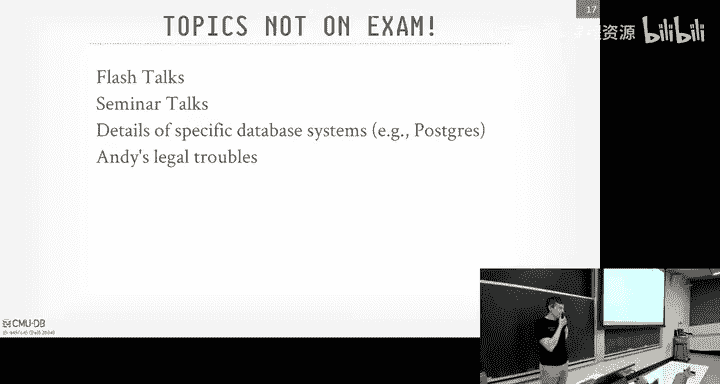
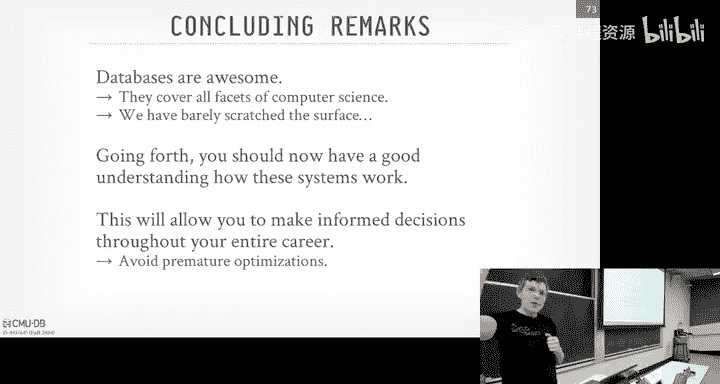

# CMU《数据库导论｜Intro to Database Systems (15-445645 - Fall 2024)》中英字幕（deepseek翻译 - P26：#25 - BigQuery + Snowflake + Redshift + Databricks + DuckDB.zh_en - GPT中英字幕课程资源 - BV1Tys8eQELW

Yeah。い？🎼Offic blockchainlockcha for databases is a better idea， let's not do that all right。

It's right， yes。Yes。That guy， right。All right， all right， so much to cover， so much cover， al right。

All right right， so Project four is due this this Sunday and again the I don't have it listed here on Saturday again we have the TA session and8 with 207 that' be from three to five and then again a bumped homework  six to be due on an extra day on Monday。

 December 9th the day after Project four and then for some of you that are planning user late days I need to have everything submitted by midnight on Monday。

 the 16th。In theory， you could go longer with like the 10 late days。

 plus the four late days you're given without penalty。

 but in order to get grades in because people need to graduate， right。

Please get everything in by December 16th， okay。All right。Other administrative things。

 So Nash is teaching 445645 next semester。 So if you're really interested in this kind of stuff。

 And then some of you've already talked about this。 and you want to be a T A。 please sign up。

 We'd love to have you。 And then if you're hang around in the winter and you can't get enough a bus stop or you think bus hub is terrible and you have strong opinions you want to fix it we have had Ts who are gonna Ts in the spring。

 stick around in the winter break wherever remotely and actually clean up some the source code clean up some of the projects in particular projects 3 and 4 that if you want to go fix up bust and make it look better for the next batch of students then please let us know。

 this would be a pay position。 So I think I posted this on Piazza but I do it again if haven't you can go sign up T here next year。

😊，All right and then for the coursey vows right I say this every year。

 we actually look at your feedback and listen to it now the undergrads are very brutal and they'll tell you what stinks and I appreciate that Master students you guys just love everything I get straight fives。

 please don't do that well if you want to do that's fine but then the dean doesn't complain but but I mean honestly give your true opinions like what didn't work what you didn't about the projects were dean about the homeworks。

 the exams， anything because we we actually will listen them yes， go back to the Monday 16。😊。

Can we take late this pasta？I'm saying I got to get final grades in， so like don't go past this。

 yeah。If you really， I mean， if you go past this， then I got to get like fill out a form and the whole process get change a grade because you would get incomplete。

 I got here with the dean。 So and avoid that。Because then that won't get processed until people come back in January。

And then so if you're trying， if some people are graduating and trying to go start their jobs and need proof of graduation。

 then they're re blockedlocked in this， let's not do that， okay。All right， yeah， so yeah。

 get feedback on anything。 Again， it's anonymous。 I don't care。 One year。

 someone give me a psychiatric evaluation。 That was nice。 But by the。

 please tell us what you don't' like and don't like for office hours。

 I'm having my regular office hours today at 330 immediately after class next week。

 I will also have on the Wednesday class or say Wednesday even though wet have class I'll have office hours then I'll have additional hours on Thursday。

 Dave before the final exam at 3 o'clock in my office。

 And if you're not able to meet these times or you want to chat on the weekend or for whatever reason。

 send me email and we try to make an appointment talk on zoom or come in another time。

 And then my number one PC student will who the T who's the T hope having office hours on his regular time on Wednesday。

 December 11 But all the other Ts will be finished。😊，You know。

 finished on the Saturday after the the Saturday session because they have their own finals and things that finish up as well。

 Okay， and then the the people will be around to help on Pia， but again。Don't assume past。有。

past the week， people going to be immediately responsible。Al right， so final exam。 All right。

 Who has to take it。 Everyone is in the class。 it could be in Baker Hall， A 51。

 that you actually gave us two rooms。 if you look at the exam schedule， we get two rooms。

 which show up to this one first， and then we'll figure out where you need to go。

 And then as I posted on Piazza last night， the final study guide is available along with what's gonna be on on the exam。

 which I'll cover in this class as well。 But also like a practice exam with solutions。Okay。

And then if you need accommodations， which again， I don't think anybody does at this point。

 But if if you haven't contacted me yet any need accommodations。

 please do that as soon as possible so we can make make arrangements。All right， so as I said。

 we have two rooms， show up to 851 first， and then you'll be sign a random location and then will and the other Ts will be in one room and then I will and other people will be in another room and I'll sort of bounce through and answer any questions and clarifications as we go along。

Just like the midterm， bring your CMU ID， a pencil and eraser， a calculator。

 where you can use your phone that's okay。 And then you're allowed one one sheet of handwritten notes double sided。

 Don't take the slides or the lecture notes and try to zoom them down。

 If you want to write in your iPad and then print that out。 That's fine。 I don't care。

 just we don't at least be handwritten。Okay。Al， so what's gonna be on the sorry。

 what's gonna you on the final。 So the stuff that you have to need to be aware of。

 maybe not know the exact details of certain things。

 but like you have to obviously know SQL because if you see SQqueries and you can't read it。

 you have problems。 But the the basic。What the architecture of the data systems we've been talking about and the different techniques and methods prior to the midterm。

 those are all fair game。 And then just as as a warning for everyone。

 like because we know chatT can be used to write all the projects， at least not well。

 but it can some of them There will be one question that has some basics of。

required you understand some basic bustub So it'll be a little bit of code you have to read and answering your question。

 but it's obviously not like， what does this line of code do， It's more like conceptual things。Right。

 and again， it's， it's， it's a paper exam。 So we can't， you know， it's not gonna be that much code。

 Yes， No， no， no， it's not， it's not like， what does this function do。

 What does this head or file do， No， it's just like。

It'll be bus hub code that you can very much figure out。 Yes， it's not。Again， it'。

 it's not meant to like， what is this， What does this file in this line number say don't， don't。

If you've done well， if you've written the projects， you'll be fine。 Okay。

 so I'm not saying that you do any additional work。 It's a warning for people like， oh。

 I'm gonna to do chat GPT for everything。 There'll be something here， okay。😡，Al right。

 so the major topics that we cost covered。 again， this is basically what we we've gone through since the midterm。

 So we spent a class talking about query optimization。 And again。

 that was a really quick overview of the basic ideas of it。

 But just be aware of like what does it mean to use heuristics， do predicate push down。

 projection push down， How do we handle nest subqueries。

 What does it mean to collect statistics on on data as you see them。

 How can you use that for cardinality estimation。 We don't go through the formulas in this class。

Obviouslyous things like somethings a unique key and your where clause is something equal something。

 You should know the selectivity of that is just one over the number of rows or， number tuples。

 So basic information how we keep track of things as histograms and then understand when we did the plan enumeration or were doing cost based search we saw two methods。

 the bottoms up approach from system R where you sort of start with nothing and you add use a dynamic programming technique to add edges to figure out the join order and the top down approach was starting with the goal and then you traverse down and do a branch ofbound search to build a query plan。

 So I understand again that the tradeoffs of these two different ideas。

And there's a question on the Pra exam that gives you a rough outline of the kind of stuff we care about。

We spend a， a lot of time talking about transactions， so obviously be aware of what acid is。

 understand what conflict serializability means， what does it mean to have to check for correctness or to say that one schedule is conflict equivalent to another schedule or serial ordering。

 we didn't go too deep into view serializ， but to understand that there are relaxations that you could do to get additional parallelism under few serializability。

 but you can't do under conflict serializability。But， of course， again。

 no system can actually support this or implement this and sort understand again。

 the highly reasonableable why you couldn't just do this automatically。

You spent time talking about isolation levels。Right， and the anomalies that can occur， Phantom reads。

 unrepeatable reads， dirty reads。Lo updates。Right skew on a multi version control control to be unaware。

 what does that mean in the context of a schedule and what are the implications of that and what the what the isolation levels could expose a transaction to。

And then we spent time talking about the Kerio protocols。 So we talk about two phase locking。

We talked about how of the regular version of it， where you have the two phases and then strong strict where you hold all the locks until the very。

 very end you actually commit。There was a relaxation of that called strict to two days locking。

 Is it a strong strict of district that was you hold all the right locks to the end。

 But you can release the read locks during the the。The unlocking phase， the second phase。

We looked at multi multi granularity locking， this idea with intention locks。

 I traverse this hierarchy， you say as I'm， as I'm acquiring locks in the。In my database system。

 I inquire locks at a really granular level， like the entire database， entire table。

But instead of doing that， could have these intention locks that give hints to other transactions about what you're doing down below so we understand it was intention exclusive intensive of shared and shared attention exclusive。

I understandstand how those fit into the hierarchy。

Then we talk about OCC or optimistic currency control protocol。

 and the main thing we spend a lot of time on is understanding the validation phase。

And I think in the lecture we did backwards validation， but there's also the forwards validation。

 backwards is when you're looking back at previously committed transactions to see whether they wrote something that you missed and then forward validation is looking at the currently activector transactions and seeing whether you wrote something that they missed that would violate again the serial ordering based on timestamps。

I understand that under OCCC， you assigned the timestamp when a transaction enters the validation phase。

 not when it starts。What does it mean to copy stuff during the read phase into your private workspace？

And then how you write it back and then a write phase。

Then we spend whole extra on multiversion control， which is very similar to OCC。

 But instead of having a private workspace， we're making new versions in sort of global database。

And we talked about how there's different ways you could store these versions like you do the Postcast style。

 as' a pen new twoples， you could do the time travel table。

 you just copy things into a separate table that's linked to the master one。

 and then the best one again， is be the delta versioning I just take dis of the changes I'm making andend them out to a version chain。

We talk about garbage collection， how to clean things up， how to do index maintenance， right。

 This was for secondary indexes。 How do I keep track of if if my version chain is changing depending by theest new。

 oldest oldest and newest。Do I have to update my secondary indexes every time I insert a new record。

 how to keep track of find the head of the versionrgin chain。

 or just understand what the implications of how all that fit together？

Then we finish up with well we switched a crash recovery。

 So understand what the different bufferuff pool policies you can have， steel versus no steel。

Right what does steel mean。When commits， but you're allowed to evict dirty pages from the buff pole before transaction commits。

 no steal says you can't。And then enforce， no force force says that when a transaction commits。

 you have to flush all 30 pages before you tell the outside world that transaction is committed。

 no force says that you don't。So with right ahead logging。

 what is right head log using steel versus no steel？I heard steel， yes， steel。

 and then is' using force and no force。Exactly right。 So I understand how right ahead logging。

 which the dominant architecture everyone uses， how that's going to relate to the policies up above。

 Don't worry too up about shadow paging， but just be aware of like how does that fit into the buff policies as well。

嗯。And then we talked a little bit about the logging schemes， physical versus logical。

 just understand， like。Again， the trade offs we the different approaches。

 Those systems are going to use physical or physiological logging because getting the ordering for logical logging upon recovery is tricky。

 especially at lower isolation levels。 But that's that's low level details that you don't have to worry about。

Then we talk about how to handle crashes so we talk about checkpoints with fuzzy and fuzzy non- fuzzy and fuzzy checkpoints right Aries is gonna to be using fuzzy checkpoints you have a checkpoint begin checkpoint end and you keep track of what occurs during that time then understand what the areas of recovery protocol looks like or what it does there's the analyze phase where you read the red head log。

 where do you start in the red head log forget what was going on before the crash the redo phase is reapplying all the changes that you see in the red head log。

 make sure that they're actually occurring that they land on the pages。

And then the undue phase is undoing any transaction that did not commit for the crash。

 Under what's going be in the dirty page table， how this gets updated。

 Same thing with the actual transaction table。And then understand what CLRrs are。

 the compensation log records as I'm recovering the database and I'm undoing aborted transactions actually you need to without or sorry without recovery for aborted transactions。

 but as I'm undoing the transactions and reverse the changes， I add CLRrs to the right ahead log。

And then the last one is distributed database。 And again， we didn't go too much details on this。

 There was a homework on it， but obviously you didn't build anything in the bust。 So the， you know。

 sort the high level understanding of what the different system architectures you can have。

 And we'll see a lot of this today。 when talking about the different systems shared nothing。

 shared disk， shared everything。And then highly level understanding what replication looks like。

 the different partitioning schemes can have like like horizontal partitioning versus vertical partitioning。

And then the basics of two pays commit， and I think there's again a Homer question that asks you about these things。

We're not going to ask you to prove the correctness of Paxoss raft or anything like that。Okay。

So the things that aren't on the exam will be any of the flash talks we have from the the friends in industry。

 any of the seminar talks。 and then anything about like， oh， Postgres does this。

 My SQL does that Like all those slides are just for your general education。

 I understand how this all relates to real systems， but it's not meant to me like， hey。

 what does Postgre do， because what kind of test does that And anything about my life troubles is not not worth discussing。

 okay。Any questions？

Now我 the fuck。😡。

Alright， and so that's the most important you guys know need need to know for the final exam。 Okay。

 any more questions。O。Let's try to do this。So 721 from spring 2024。

 I'm gonna to try to speed run goes as fast as possible。 and again。

 interrupt and ask questions as we go along。 Were try to cover again， the core things you。

 you won't need to understand from sort of high performance analytical data systems， okay。

So we showed this slide， I think in lecture 13 or 12。 when talk about career execution。

 And we said for， for sequential scan。Right at the end of the day。

 you got to go through it and just read data right。

 there isn't any magic to avoid necessarily doing that。

 And I said there's a bunch of these optimizations that you can do right like encoding anding。

 pre-fetching， scan sharing， the idea and so forth。

 So we've covered all of these except for materialized views， result caching。

 materialities are very complicated。 I can't I don't fully understand this myself how it would actually do incremental updates。

 but it's just like if I have a query， I can set it as a view and it gets computed and every time there's an update。

 I could just rerun the entire query and use that cached result or the smarter systems can do incremental updates。

😡，That's really hard。 We， We're not gonna cover that for all caching just like， hey。

 have things changed since the last time I ran this query。 If， if no， here's the result。All right。

 some systems do that。 What I want talk about today is down here。

 code specialization and compilation。Becauseuse this is what's gonna be。

 This is what's gonna separate again， the， the。Sor of the analytical systems on the modern era versus what people were doing。

 10， 15 years ago，Alright， so the first thing we got to cover is how do we design our database system to run analytics more efficiently based on modern hardware。

 based on modern CPUus， right， So say we have a simple query like this。

 Select star from table where key is greater than than some low value and key less than some high value。

😊，So in busst or any sort of generic system， like Postgres， whatever。

 you probably write your code like this。😡，Right I don't like I don't like to show show code。

 But for this topic here， you kind of have to。 So we're gonna go for every single tube on a table。

 go grab the key。 We're trying to do look up one。 And then we have if if clause says if the key is greater than this or key less than that。

 Then we're to copy that tube and put it on our output buffer。哎。So。

This is actually the bad thing to do on modern CPUs。I'm going to take guess why。

And the superscalealar architecture， what happens。I hes the branch or what does they try to do？

Trying to predict， right。But now， if your data is this like completely intermixed and， you know。

 every other key or every other tubo is gonna satisfying this predicate is gonna do brand prediction and get it wrong。

 And What does it do when it gets wrong， It has to expect executes and has to roll back all its changes。

 flushush the pipeline and restart it。 and it's really slow。So it turns out in a modern CPU。

 you actually want to write code that looks like this in your database system。So in here。

The first thing we're going to do is always copy the tuple in our output buffer。

 Even if it doesn't match it， Always copy it in。Then we're going to run that the check for us where the key pre greater than low or less than high。

 and then we're basically doing an n operation on one。

 So if it matches on one of them it sets to one and it both matches and it set to one。

 then the delta is set to one。😡，And then now we have this offset here where we're keeping track of where we're writing into our output buffer。

😡，And if it set the one， then that means that we're gonna iterate the upper buffer by one more position and keeps whatever we just put back。

 we put into our， our when we caught it in the buffer early up above。 If it's 0。

 then when we come back around， we're just going overwrite it again。So this seems kind of insane。

 right， This seems like， as a human， you look at this。

 this seems like the wrong thing do because I' I'm blindly copying something over and over again。

 And then I go check to see whether I actually need it or not。 And obviously。

 I'm missing a little code down here below that says like when you come out of the for loop。

 check whether the last delta was one or0 to be aware whether you want to get rid of the last thing you just cop it in。

 But we can ignore that。But again， like from， from a human。

 the first way seems like the better way to go。 But from a modern CPU， you want the second one。

Because that's it's going to be now there's no indirection in the for loopbe。

 it's a tight kernel where he be ripped through very quickly。

 just trying to feed all the data in and just doing this quick and dirty evaluation， right？😡。

And so there's a bunch of experiments from 10 years ago that shows this phenomenon。

 So this is actually from the vector wise guys。 The people that were at a CwiI were were duck D B and came from thefl snowflake coer。

 So the blue line is the branching code。 And then the X axis is here is the selectivity of the predicate。

😊，Right， so when it's 0%， then none of the twos match， when 100% all the two matches。

 So when it's 0%， that's the great thing for the CPU。

 like it's it's not doing that extra copy unnecessarily。

 It predicts that you're never going to fall into that if if clause So the CPU， this is fantastic。

 This is great。 But then as you increase the selectivity。

 And you see you basically peak around 50% where like 50% of the tus are going match and 50% don't match。

😊，Then the CPU is is burning cycles， undoing the branch predictor can't do anything to make this really work well to keep getting it wrong and wrong。

😡，But the red line is the non branching， the branchless version I showed you。

 and its performance is basically the same because no matter what the selectivity of the predicate is。

 you're always going to copy every single table。 but doesn matter whether you're going to overwrite the last one you looked at or not。

So this performance is basically the same， no matter what。 So， yes。

 it seems wasteful that you're doing more work。But it's better for the modern CPU。

 And that's what the modern ob systems are gonna to be really， really good at。

That Postgres is not going to be， or My SQL is not going to be。For analytics。

 these guys are really attuned the kernels themselves that are doing these scans。

We'll see how to optimize this even further。All right， does everyone know what CD is？

Who here does not know as India is。All right。I have one quick slide。嗯。Alright。

 same D stands for single instruction， multiple。Data。I thought that' like hold up， I do。Yes。

 here we go。All right， so say you have this you want to do x plus y equals z and say x and y and z are just matrices or vectors。

 right？So again， the way you would normally write this code in like C S 101。

 you have a dis before loop for every every single element in in the in the three arrays or two arrays。

 X and y， assuming they're the same length。 I'm just gonna loop through add X I plus Y I put it in Z。

 right So if you do this with 60 single instruction， single data。

 most code is runs You're gonna again， go through this loop1 by one。

 add all these the elements together and write it out to to this buffer。😊，So in this case here。

 we're doing， we had what eight elements。 So we're doing， say 8 edition instructions。Right。

SMD allows you to do the same operation in parallel across multiple data items at the same time。😡。

So in this case here， assume I'm doing these are 32 bit integers， So I have 128 bit Cdy registers。

 they can be up to 512 or 1024。 we ignore that。 so I can put four elements into a single CD register And then now it's a single CD instruction to go take all the the first offset for this array and the first offset of the second array。

 add them together and then write them out to the first offset in my output output register。

So now I do it for the first batch of4 and then for the second batch of four。

 So before I was doing 8 cyst0 instructions to add these numbers together， ignoring loads and stores。

 to deal with the addition operation。 I can now do this in two。改了。So there's addition。

 multiplications， subtraction， there's a bunch of other crazy tricks you can do。

 but for now we can all ignore that。All right， so。We talked about vectorized execution in terms of query processing。

And it's an unfortunate name， because。You can。People oftentimes say。

 when I'm doing vectorized career execution， they mean Sdy。

So now because I am doing the the vectorized execution we saw before of the query processing model。

 I'm taking a batchsh of tuples and then passing them up to the next operator。

 now I have a vector of things I could process simultaneously with Sdy。So。Now again。

 now for basically all my query operators can use SD to run these things and sort of in parallel。😡。

RightSo again， so here's that simple scan we have before， but this was again the branchless version。

 so I can now replace this with a Simbi version again， it's crappy pseudocode。

 this is not how you would really write this， but it's fine for now where I'm going to take a vector of tuples in the table。

 Then I'm going to load them into my SIdi registers based on the key or pulling the key out。😊。

Then I'm not going to do a vectorized comparison of these different。

Of know of the values that I'm looking for， that's going to produce CM registers with ones and zeros based on whether I match。

 and then I can take that and use that to decide which elements of my vector that I'm processing in this iteration before though do I want to produce in my output buffer。

😡，And how you get all aligned and everything like that， we could even know that for now。

So let's change this query to be like for looking for a key based on a string so say this is my table。

 I have a two ID column and I have a key。😡，So I'm going to load in the key into a single vector again。

 assuming that I can store88 characters So the first I're going to do is that Cdy compare。

 And what this is going to produce for me is a bit vector or its sometimes called a selection vector that says you。

01 based on whether the element in that Cdy lane then also within the CD editor。

 whether it matches my predicate。So I can do that for the first for the first part key greater than equals n。

 I can do for the second part key less than equal to0 or sorry less than equal the u。

 And then now I can just take those two maed registers or and then just do S and on them that runs in parallel that just doing a binary bitwise operation to produce ones and zero is where at any given lane or both elements 1。

 then I take then I generate a simple array， just has0 to 7 that's corresponding to the offsets of of the tus where they would exist in the array。

 and then I just do a S compress operation that just says if anyone if any value in one lane matches to one。

 then just take whatever values in there and produce it in the first output lane。

 So now I get my offset matches14，6， and that corresponds to offsets 146 in my input vector that told me how to do this match。

Right， so you can do， again， this is just for simple selection scan。

 But you can do this for a bunch of different operators We talked about the entire semester。

 all with Cdy。Right， this， again， this is what snow place is gonna do with the Clickhouse is gonna do。

 Clickhouse is even crazier because they have different， for different。

There's like different size registers， like 5，12，2，56。

 different versions of the Intel puts out of Cindy。

 They have all different variations of this because sometimes they're faster， sometimes they're flow。

 but most， most systems。I'm going to target like AVX 256， AVx2。And they're right。

 they're right intrinsics by him。All right， so Cindy is one optimization you do。

 Another optimization you can do for code specialization is actually compile your queries。

Into machine code。So there was a very old project in 2010，14 years ago out of Edinburgh。

 and I think Amazon basically bought this guy he was built this at Amazon， I think or one of the two。

 So forgiven and SQL query， Remember you run through the optimizer， we get out a physical query plan。

 you can then take that physical query plan。 and then code Gen like create C or C plus plus code that does exactly what that query wants to do。

 So instead of like in the bust code where you're interpreting the plan and then you invoke the operator and the operator has to go look at the plan and forget out what to do。

😊，You literally you bake a C code that does exactly what your query wants to do。

 then you compile that and then you run that。😡，And that's like the fastest you can possibly have because like it's a hard code program that is exactly what your query wants to do。

So the bus hububway would be like this interpreted plan， so you got to go look at this pseudocode。

 you have this get Tupple function， you've got to go get the schema for the catalog。

 figure out the all sets of the tuupple size， based on what the data types are returner pointer。

 then you do evaluation of predicate， and we saw that predicate tree before。

 we had to traverse down and the equal clause and the in clause。

 figure out whether the predicate is going to evaluate to true。😡，And then if it does。

 then you return true a false。So instead for a given query plan。

 you could generate some template of code like this where you're nowre just going to fill in whatever the values that you have in your query and then you have basically injecting that directly into this query plan。

 you then compile this using Gcc or clang or whatever your favorite one is and then now instead of invoking the interpreter for the query plan。

 you just evoke a function that executes exactly your query。😡，They understand this。Yes。

 is a compile code expected to run multiple parts。His question is the power code detector run multiple times？

Good point， Give me a that。So。His point， his question is。

 is would you check the powercode to run multiple times。Well。

 how many different ways can you write a warehouse clause。How many data types there are， right。

 how many， like how many different variations could you have of a query plan in SQL。No， well。

 in theory， it's infinite， but like in actuality， no。So like。Think of like。

Where select star and food， where I D equals 4。 I D equals some number。 I D is an integer。

 and I'm trying to compare against an integer。 That's super， super common。

That's like you know that' probably 99% applications are going to be doing that exact query。😡。

So instead of compiling on the fly， like I showed before。😡。

I could just precompile what we'll call primitives of all these different variations of the most common query patterns。

😡，And then now at run time， when my query shows up， it says， oh。

 it's select star from table or I equals 4。 I have a precompile primitive for integer equals integer。

😡，And I just invoke that。Instead having to compileil things， Compiling can actually take some time。

 right， How long take your run Gcc， Well， bust stop it's a big program。 It'll take a while。 I， again。

 seconds。 But for your query， again， even take 500 milliseconds or a second。 That's a long time。

You don't want be compil your query for 100 milliseconds。

 If the query is' only run for 10 milliseconds。 It's a bad idea。 So if you precompile everything。

 then now you're doing at runtime is figuring out， here's the things you're gonna to invoke。

 I build a little wrappper program around that。 This makes function calls and do these things。

 And I have all the the precompiled stuff for me。And it course now， function calls aren't cheap。

 right， Jus are gonna to be bad。 We talk to this in superscale architectures， that's bad。

 But if we do vectorize execution when we're passing a batch of twos。

 now our function call is on a batch of twoples rather than one two at a time。

And now that amortizes the jump cost。So again here's a simple query。

 I have a predicate on a string column， a prediccateator on an integer column。

 so I have a precompyle primitive that says for a selection on a vector of strings and does tell me the offsets of the tupo in my input vector that match some input string。

😡，Then I have the same thing for selection on an integer column for a 30qubit integer。

 but now in this case here I now I'm passing in the positions array that was the offset array that was generated by the first function。

 I can pass this now to the section function。😡，So then now when this function returns the offsett。

 it produces exactly the answer I'm looking for。So this。

There's basically two approaches during this this compilation stuff。

 You can actually code in exactly the query on the fly as you come along。

 or in case of like snowflakeduct T B， they pre generaterate all these different permutations you could have。

 because there's only so many。And then you sort of stitch them together at runtime。

And we'll see one system that we'll talk about today。 we'll actually do both。Okay， so。

There's 15 minutes to cover the basics of how you do optimize query execution in analytical system。

 Let's now go through a bunch of these systems and see what they're actually doing， okay。

Google BigQury， this is one the original ones that came in this space。

 and actually BigQury started before snowflake。the internal project。

 the internal project was called Dremmel， this is somebody built in 2006 to basically do data processing and run SQL queries on top of a bunch of files sitting in GFS。

 like CSV filess and so forth。😡，It was originally a shared nothing system。

Meaning you had to copy the data that was sitting in your shared disc your object store into the compute node。

 then you can run queries on it， and then they end up rewriting the whole thing in 2010 to now shared disk on top by GFS。

 which is now colos， whatever the Google's internal file system， right。And so， you know。

 we talked this before， Google is the。Without saying they're explicitly， you know。

 we're a no SQL company。 But they were sort of the first ones like they were putting out papers。

 saying， you don't need SQL。 like， this is， you know， you want to be doing this other stuff。

And then Drremo was was sort of。Seen as the thing that made SQL popular again at Google。

And then Spanner and others came along later。Right。

 so they released this as as a commercial product called BigQuery in 2012。

 If you don't know what Drms。 Drels like it's like's a company。 they make like a power drill， right。

 I don't know why。 And if I was Google lawyers， I would never let them announce that we named our internal system after some other company。

 Heres asking to get sued。 So that's why the products called BigQury。 But internally。

 it's called Drlin。 you read the papers about it。 It's it's called Drremel。Al right。

 so for all these systems， are' gonna provide sort of basic overview like this or say。

 here's the high level points about what these systems are actually doing。 And then now， again。

 this is， you can start putting together all the things we talk about this semester。And see， okay。

 now I know we spend a whole lecture talking about vector query processing。 Now。

 you know what that is。 you understand what these systems are doing at a high level。 right。

 They're all be slight nuances slightly different for the， the the low level details。

 but a high level， you know。Saying they're doing vectorized query processing。

 you know enough about what they're doing。All right so BigQury is a shared disk disag storage to vectorize query processing。

 They have a shuffle operator that we talked about last class， but we'll see it again in a second。

 they have their own internal file format at Google。 I think it's called capacitor。

 There isnt isn't public of what they're actually doing。 But if you talk to them。

 they basically say it more or less smells like parquet and org。 but it's packs columnar storage。

 they're doing the Zoom maps， the filters， B filters， dictionary and already compressionpress。

 The only additional indexes they sport are the inverted indexes that we talked about before。

 This allows you to find like keys within like a document like JO or text field。😊。

The only support has joins so no Smers joins and they're only going to be doing the query optimizer is a combination of a heuristic key a rule-based optimization。

 but then they have additional optimizations while the query is actually running because of the shuffle phase。

 they can dynamically change our adapt query plan on the fly as they see the data。

So I want to talk a little bit about this because this is one of the key things that BigQury does that Snowflake doesn't do。

So BigQuriium is always going to have an explicit shuffle phase。So between every single pipeline。

 they're going to run shuffle， and they have dedicated hardware with custom silicon they have custom。

 I think FPJs or something that are doing the shuffle as efficiently as possible， Yes sh。

questionest is for these shovles like pipeline burgerers， yes。

RightBecause it's data you got to send the somewhere results that you can't can't process locally right because you need data from somebody else needs to do additional processing someones out。

 So the shuffle gives you a couple things， gives you the the fault tolerance because now if a worker dies。

 the results will always be sitting in this memoryory shuffle service。 So you just。

Spit up another worker and， and that order worker can resume based on getting data out of the shovel phase。

 But it's also going allow them to do dynamic scaling of what they're using in compute queries because now。

Now， you sort of have this pause between the pipeline breakers the shovle phase。 You can say。

 all right， we， we don't have enough nodes or we're unbalanced or we we need more nodes。

You can reorganize things。 So we saw this diagram before， right。

Right the workers are producing output that goes to the shuffle phase or the shuffle service and save that whatever reads in this guy here is super slow。

 he's falling behind so all the other workers finish， but this guy doesn't。

 we just go ahead and kill him and then assign the work to this other worker who produces the results and because it's always going to the MM re shuffle and not some dedicated node or other node。

 there's nobody immediately waiting for blocked on this guy here they know everyone else knows the pull from the shuffle service so this guy then finishes up they then maintain internal statistics about what the data looks like it's not so blind key value story you're actually looking because you're hashing into these buffers and saying right which partitions is getting for which partitions are underutilized。

And then based on these statistics， you can then say at the next stage。

 before you even start processinging query at the next stage， you say。

 do I have enough workers or not and you can dynamically scale this up and down based on the data that you're seeing。

So the number of workers between one stage and the next doesn't need to be the same。

Another tip they can do is that they could dynamically load balance a single partition。

If it becomes two full。And they're doing this as you're actually filling in the， the， the。

The the partitions in， in the shovel phase。 So say have two workers， the producing output。

 the both writing to these two partitions。 say partition 2 is， is getting too full。

So when this happens， the shuffovel phase goes to some coordinator says， hey。

 here here's what's happening。 I'm getting too full。 This is bad。 The coordinator says， okay， well。

 let's do more partitions。So then now what happens is you send a notification to the other work and say。

 okay， instead for anything that would go to partition2。

 just do that recursive partition we talked about with the gray hash join when bucket got too full。

 you would do another round of partitioning for just that bucket， you do the same thing here。

 Partition two is getting too full， do another round of hashing for anything that gets do you add to it。

 fill things up and there。😡，Then now when you finish the shovel phase。

 you got to get things back out of partition2 and fill it back up the other two partitions。

 so you just feed the beta back into another worker who then does another the same repartitioning again and then signs it to the new partitions there。

And you just kill the other one here。So BigQu makes heavy use of the shovel phase to do a bunch of dynamic optimization that you couldn't do otherwise without it。

 It would be very difficult to engineer that。And then now what happens also too because you always have this explicit shovel phase。

 it makes it very easy to scale up and out to different operators and each operator implementation does not need to be aware of like。

 oh， I'm going to be a scan on these number nodes， which says I need to scan this data。

 I preach my apple here and the shovel phase hides all that complexity of the scaling out and scaling down。

😡，All right，nflling。Snowflake is。Okay， say it was one of the the original。

 if not the original cloud native data warehouse right， that was， you know。

 really designed for beginning to be something something sold in the public。

 Where like Drel was in internal And they said， oh was a good idea that exposed it a Bigque。

 So it is a managed that data system written in C plus。

 be shared disc with very aggressive compute side caching because snowflake is paying for the res to go to S 3。

😊，So if they can do caching on local disk on the EC2 nodes。Of the data you don't have to worry about。

 you don't end up paying Amazon for that。Open over again。

So one thing that's interesting is that they wrote everything from scratch。

 They didn't borrow any components from any system。

 It's very common out the Postgres frontend Postgres parser right and reuse that and then build a new system underneath it。

 A Ugabyte did this or cockroach Db started with rock Db as the internal storage。

 they wrote everything from scratch。 including their own custom S dialect and and network protocols。

Which is very rare today no do we do this？And I always like to show this。 So again。

 we know that the snowflake co hunters。 And I said， I was。

 I was in Amsterdam with him a few weeks ago。😊，He's this hardcore by database。

 So he has a snowflake tattoo on his leg。 That's that's how much people care about databases， okay。

All right， so。Of course he did Okay。 He's fine。 All。 So what is snowflake。

 Cloud native lab system discuss this shared this。 Theyre doing pushb vectorized query processing。

 So the vectorized query processing model。 That's what the snowflake tattoo guy invented as CwiI vectorwise。

 And then he later been built in in snowflake。 The pushbased model came from the Germans。

 but they're sort of combining much of different techniques together， make this all work。

 Well see Db switches from pullbase to pushbase later on。 They're doing pre operator primitives。

 which again， that came from the vectorby project。 They're separating the data table from the metadata。

 basically they run foundation Db internally as the catalog rather than just like in Postgres they store the catalog the table data all the same database They're now starting the separately。

 They don't have a buffer pool。😊，Right， so they're not worried about spilling the disk。

 It' just is seeing my cash yes or no。 And they have a separate service to handle all that。

 They have their internal file format that that basically looks like packs k storage。 But again。

 they also can read。Read data from parquet and other things as well。 That's new。Alright。

 so they're doing precoal prims。 as we talked about。

 they're just using sequence those templates for all the different possible data types you could have。

And then they just compile that and that gets linked into the project run time。

 All the binary when you run it， they use they only use on the fly just in time compilation for one part。

 and that's if if you're serializing decentizing data between workers。

 then they will then co in with LLVM， the program that says I know how to take this data and serializing decentized is if you ever use protocol buffers from Google or protobuuffs that's basically doing the same thing。

 you define a schema and then it generates the code for you to read and write the data。

They don't support partial query retryries these as far as they know， I don't think has changed。

 So their argument is they're so fast that a worker fails and who cares just's restart it。 again。

 they're not paying for that。 You are so from engineering perspective， it's just easier for them。

So one of the cool things that Snowfl can do， one the optimizations for adaptivity is they can push down aggregations if they determine that the amount of data you're shoving up is through the query plan is going to be expensive。

So what will happen is as you're doing like I say， a table scan on this side of the join。

 if you recognize that this thing is producing a lot of data and all you're really going to do is aggregate it up above after the join。

 then you can basically turn on an aggregation of an early aggregation of the data。

 still do the join on it and then you just change the query plan at the top to say。

 okay I know how to put this into the form that would actually need。

So they run it without the aggregation pushdown， but they notice your data is changing。

your data is larger than they expected， then they're go ahead and push that down。

I always like to bring this up because one of my students who also took 4，4，6，25 many years ago。

 he still doesnt snowflake He worked on this and he wrote a blog article about it。 By the way。

 was a good dude。😊，And he saw that。 And he came， when somebody came to visit a few weeks ago。

 he came back and， it was a good dude。All right， one of the things they also do because they now in the cloud。

Which you can't do if you on Prem， or at least not very easily， is that because on the cloud， it's。

 it's elastic。 you can kind of throw more nodes in to if your  query is running slower than expected。

AndWe saw this in the case of adding more workers in， in。In in Google。

 like that's just running Kubernetes or Borg， which is their version of Kubernetes。

 right They can add more workers。 and that's no big deal。 But if you're on pre， it's very hard to do。

 one of the things that Smithflake will do is that if they recognize that you have a really large scan here that it's going to start running slowly So then then they'll change the query plan to pull out some portion of of it。

 then they run that on spare nodes。A K， A idle nodes。

 So if you're customer A and you're not running queries now。

 customer B comes along and they need some extra extra resources。They'll borrow yours。You don't know。

 You don't care。 You're still paying for it。 That's fine。And if your query needs to run in。

 they need extra research， you can borrow from somebody else。

So they have the notion of with the bullpen， they have sort of spare resources based on idL customers they can then reuse to make your query run faster。

😡，And they don't charge you extra for that。So you scale， they call it flexible compute。

 you scale some extra stuff here。 And then now since this is running on somebody else's hardware or somebody else's machines。

 this will materialize the output to storage。 like that'll be a little local cache that they have if it's too big for that S3。

 whatever。 And then now this all gets computed。This can die at any time。 if if they need resources。

 that's fine。 But then they rewrite the query plan to now do a table scan on the to materialized result。

 as if it was like a native table， even though it actually got produced from another query running on somebody else's hardware。

And again， you can do this in the cloud because the resources are fungible。Most machines are idle。

 like in your laptop right now， you're not doing anything on it。

 and so like it could be running queries。看。W it。Redshift is Amazon's flagship Oap system。

 They have a bunch of other products。 They， They have this thing called Athena。

 That's just Presto D B that they changed the name on and slapped it up and sell it。

Amazon is notorious for taking other systems， rebranding and putting it up。

 and then seeing whether it makes any money。 And if it does， then they put the energy into it。

That's what Redshshift was。B shift fork is based on Park cell。

 Park cell was a fork of Postgres so it was a distributed version of Postgress。

Park sell was was backed by Vcs。 They didn't really get a lot of traction。

 Amazon bought a license of the source code to them for $20 million。

And then basically Actin bought Park cell later on， I think less than that。

 and Park cell basically died。So Amazon only paid $20 million get get a start on Redshift and it makes billion a year。

 Now， they spent you know， millions of dollars to like rewrite all the code。

 But that's however you started， they just we need， we need a OAP system。

 They bought a license the parks out， slapped it up called a Redshift。 Why is it called Redshift。No。

 well yes， but。Yeah。shippinghippping。Boom， they're shifting Oracle。 What is the oracle's color， red。

 There you go。So originally it was a shared nothing system based on Postgres。

 they've added this serverless piece that had this thing called spectrum。

 now you can read like the lakeout system， you can read from S3 and so forth， right？

Their big goal was to remove as much administration and creation choices from users as possible。

 I don't know。 I don't think they've succeed in that in the same way that Snowflake has。

 I think Snowflake does a very good job of hiding all that from you。 I haven't used Bigquery。

 So I don't know how well it does So it's more of it was started out as a more classic data warehouse where like it wants to manage all your storage for you。

 Snowflake sort does that started that as a way as well。 But since over time。

 they've expanded the support reading things from S3。😊，So all things we' talked about before。

 share dis storage， pushbased vectorized query processing。

 the things I want to cover though is that they're going to be doing both compilation techniques that I talked about before。

 that they're going to do the code gen with the holistic query compilation where they generate the query plan。

 then they're going to compile that， but for the parts that are really common reusable。😡。

There're still going to be the pre compilelid primitives that we saw in snowflake and vectorize them earlier。

 right。We want to talk about all the cashing stuff and the sorting stuff。

 But I always want to bring out they also have additional。

 they have accelerated hardware in the same way that Google Bigquery has hardware to make their in memory shuffle go faster。

 They had to thing called Aqua that would make actually， your scans go faster。😊，This is dead。

 they change it， we'll cover that in a second。All right， so。

They're going to be doing compilation for， for queries。 So a query shows up。

 They're going to generate C code。And then they're going to vote GCC to compile it。Gcc is expensive。

 So what happens when you call Gcc， It's got a bunch of config files， right。

 then it's got to actually parse your parse your your your code。

 then actually run all the compilation steps， right， Gcc03，02 is expensive。

 even even though the program is really small。And as he said before， as I said to him before。

 like there's not that many variations in queries。And also， if you're a cloud vendornder。

 you see all the queries。So what they do is they'll， they'll have， they'll have。

They generate a query plan。 then they check a cache to see have you run this query before。

 There's a paper that came out from Amazon this year last year that says I think 96% of the queries in redshift are exactly the same。

 like not just the same SQL with different parameters。

 literally the same SQL with the same parameters So people are running because like a dashboard。

 you're running the same thing over and over again。 the data change but queries are the same。

So they're going to check their cache to see whether for you have you run this query before， if yes。

 and they used the cache query that's already compiled， they used the show up invoke that。

If you don't have it in your local cash， then they check a global cash for the entire fleet of all rest of customers。

He's insane。 because every every query， anyways I ever actually ran。

They have a cash query plan for that。And then if you， if you， if you run a real query。

 you never that you've never run you can get， you get the class version from somebody else。

And then because it's SQL， there is no proprietary information that you're leaking from one customer to the next right if I call select star from table where IDd equals four on my my data and you call it basically select star from data from table where ID equals6 and they're both ingers on your table。

😡，Again， the query plan doesn't have any specific data in it， it's just the query plan。

 I can reuse that from one customer to the next。And at Amazon scale， like， you。

 for the billions of queries that are running per day。

 not having to compile every single one saves them a ton of money。

 Your query runs faster So you're happy， but they save a ton like millions of dollars a year by by having this cash。

I had one of my students did internship where they they worked to a project where every time a new version of Rshift came out。

They had a basic job that would go through and take all the query plans and recompile them right so that you always have。

 you made sure you run the right version of Redshift because the data alignment might change。

So forth， so I think。This is public。 I can say this。 The cash hit rate for them is 99。95%。

So our query shows up within 99。95% they've seen it before， so you're not unique， right？And then the。

That's with the local cache。Then for the。If it doesn't exist locally， I think it's like 87， 88。

 89% it's going to be in the global cache。Right， so 90% of the queries handle local cache and then 8% of thequeries that don't handle local cache or be handled with the global cache。

 Yes， does does it take less time to go get from the cash。all these been crazy。

 you have to go to the global cache and they're just compiling it then in there。His question is。

 is it faster going to from the cache than than compiling it？诶。I mean。Potentially yes， but then like。

The the compilation is CPU intensive。So again， for one query。

 no big deal for billions of queries at their scale， it's a huge。

 And that's going to save them a ton of money， absolutely。All right。As I I， before。

 So they had the thing called aqua that came out in 2021。

it was basically doing predicate pushdown on FPGs running on a layer above S3。

 So your query shows up and once you read some data to the block。

 you always to go to this thing called Aqua first and this knew how to get data from the storage。

 but it could do predicate pushdown so it would say go get the blocks you would need from storage。

 bring them up into the aqua layer and then that had FPGs that could run your wear clauses super fast in hardware。

And then it produce the filter results of above。Now， that idea is not new。

 There's a thing called Naisza。 came out in 98，99 that had FGs running out of Postgress。

 IBM bought them。 I think it still exists today， but you can't get it with the FPGs。

 I'd be wrong about that。Oracle does as the exada。 So not what EG is， but basically they have。

They have a shared architecture exit data， but they have you can do predicate pushdown and run the wear clauses on where the data actually exists right So they quietly killed this in the last year two ago。

 and what they changed is that now they have on the NIs on the actual the storage storage nodes themselves。

 you can do predicate pushdown and run queries inside of the NIs themselves。

RightIt's this thing called Nitro。 It's， it's it's their it's their hypervisors。

 the cards all the specialized hardware， the Amazon Fabs and the bills running in in their data center。

 And they can do this because at their scale like 150 million for R And D to go fab hardware is a drop in the bucket because you're gonna save。

Save well over that and charge a lot of money worth it。So hardware gonna get weird。

 going get wild in the next next 10 years if it isn't already actually wild。

 but it's all gonna be the big cloud vendor like like Navidia is going to do this thing， of course。

 But like Microsoft， Google， they've been this for while。 they fter on hardware， the T Ps。

 the aqua stuff。And so it can be very hard to get the kind of performance that they're going to get because they control the whole stack and they can fab things。

All right， so that's redship。Al right， so next I'm to bring up with yellow brick。

 This is not a wellknow system， but I like it because it's， it's pretty wild what they're doing。

 This is hardcore engineering。 and they hate the operating system as much as I do。

 which is fantastic， right， So this is the fork of Postgres 9。5 I Al and C plus， and they basically。

😊，Retain the Postgres front end So queries show up and that part is also still Postgres， sorry。

But then when you actually tend to run the queries， all that's gonna to be custom code。

 And that's a very common setup。 like Ugabyte does the same thing as I said before。

 So they originally started as an armprem appliance that ran with FPG acceleration like I just talked about。

 So they you'd buy like a rack unit that had the storage。

 had all the data And then when you ran queries， it ran fast with with the FGs。

 But they switched to a database service now and you get it in the cloud。

 We're not going talk about this too much。 one of the cool things they do use is that they use for their control plan。

 they use Kubernetes for everything。😊，So instead of having to write your own like distributed cluster manager and the control plane to keep。

 keep track of where the nodes are up and the coordination of， of who's getting what data and when。

 they just rely on Kubernetes for everything。And they actually expose like a SQL interface。 can。

 you can。Change change Kubernetes configurations through SQL， through yellowel brick。

 I think it's kind of cool。Alright， so what are they doing。

 So they have shared search like everyone else doing push base vectorized query processing。

 They're gonna be the the full query compilation or the wholelistic query compilation by generating super plus code and then then invoking that with Gcc。

 Of course they need to cache that。 the mix order not spending the cost to be that over again。

 I want to talk about that compilation piece。 and then all the crazy engineering that they're to do make thing run as fast as possible。

😊，So this is what the high level basic architecture looks like。

 so on the front end side is Postgres queryries show up through here。

 they then hand it off to this compiler service that runs asynchronously that's going to start compiling the T plus code for your query in the background and then they have this scheduler here that again distributes out the request to the different worker nodes who can then pull data from S3 or the object store as needed。

😊，To avoid you need to get data into the system。 So they're not going to be like a lake house system where you just read you write a bunch of parquet files and I store and read them。

 they're going have the managed service or managed storage insert data through the database system。

 So if you go through Postgreds， that's gonna be really slow。

 someone's like bulkloading gigabytes terabyte the data。

 So they have a sort of sidecar method to get data into the system that can bypass it bypasses Postgres front end and just can sort things directly into it。

So。What's wild about what they do is that。When the system boots up。They call malloc。

 get as much memory as they can， and they never make a cis call again。

Right they allocate all of the threads that they need， allocate all the memory they need。

 and then never talk to the OS。This is actually very common in embedded better systems。

 but these guys for data systems， you guys are doing it right。

So that means that there's a bunch of stuff that they had to get crazy performance。

They wrote their own everything。So they don't use TCP。 They。

 they run their own network protocol on top of UDP。

They don't use they don't use the built in drivers in Linux to talk to MVme E devices。

 They wrote their own MVmeE drivers。 They wrote their own SD drivers for the D system。 right。

 They don't use the the Amazon SDK for communicating with S 3。 They wrote their own drivers for that。

 right， They're doing kernel bypass。 So they're not letting the O S copy buffers from TCP or the Nick into putting user space。

 They manage all that in the cells。 Yes， what does it mean that the row store and the object store separate question is。

 what does it mean to the row store the comm store So going back here。upp here。 sorry， yeah， yeah。

 so。Very common that which you would do in in these O systems。 if you want to support like。

Transactions， again， we talked the report that with un store not at like the high end like million transactions a second。

 But like I want， I want to get data into this thing。

 So it's expensive to store data right out as the column store。

 especially if you don't have all it yet to put it into a giant file。

 So you just have a little buffer space in the row store。

 it's like like log structure storage pen toend to pen to。 I can do that very fast。

 when the table was full。 Then I compact it convert to a column store of disk。

 So the object store is column all the caar data is in the out store。

 row storage like the most recent data。😊，And then some background job will put that in there。

All right so they're doing push based query query processing and they're support row and columnar data as we talked about。

 they're doing the complete query compilation， again taking your query plan。

 generating s code and then 14 Gcc right we won to away this too much but the way they design their compilation surface like the code that they're generating is we won to have really。

 really tight kernels so that at any given time you're reading data from at least CPU caches like going to memories even too slow for these guys they always want to be reading from L3。

As I said before， they wrote mallc。 So when the system starts up。

 they allocate all the memory that they need。 they are using Mmop， but Mmap anonymous pages。

 but use Mlock on it to prevent the OS from paging it out and they claim that their allocator is 100 x faster than em Maloc that one I。

That's not surprising。 I don't know how much faster they are than J E Malic。 But again， like。

 think of like J E Mal trying to support any possible application。

 if you know exactly what the kind of data blocks you're gonna be you're gonna be allocating and you know what you're gonna be freeing them。

 you can do way better than than existing systems。 Yes， because I think we question M is bad。

 Mm with or when you call Maic is basically Mm right。

 But I'm saying if you use Mm to allocate Mm to manage the movement of data in and out from disk into memory。

 that's bad。 don't do that。They're just calling M mapap to allocate a bunch， bunch of data。

Using huge pages would' even talk about， like instead of getting like a 4 kB page from the O。

 you can get like a。I it's2 MB or one GB page。 You basically get huge strides of memory。

And you call andlock on it to say， tell the OS， never page this out with virtual memory。

So it's basically like turning off M map's paging mechanism in in the O because the O S is gonna try to screw you over。

Right。So they again， they make a use of a bunch of custom components like kernelron byss and everything to make this run as fast as possible。

 They're using the bicyclee style L U cases that we talked about before to store cache data files and in vector them。

I've never seen anybody do this， at least publicly talk about it， which seems insane， but like。

They're like， oh， yeah， the crap you give from from， from， from， from Linux for， for MBME and， and。

 and Internetns or ethernetn， They' are too slow。 So we're gonna write our own drivers and load that into into the kernel。

 and so。😊，Again， these are the numbers that they're showing。They're not like insanely better。

 It's better， but it's not like you're getting 10 x better。I like it because they did it。

 But I'm saying this is probably， if you're a new Davis company。

 this is probably not the first thing you should consider， right。All right。Just story again。

 people care that much about performance in databases。

 Like these guys are willing to write their own kernel drivers。 right。

 There are some people that that want to basically switch to a un kernel。

 You basically write the O S。 Do we run nothing but the data system。 People tried that in the 80s。

 It's coming back invo now。 We'll see。 All right。60 minutes， let's get through Dataricks。 Okay。

 so Databricks is based on Spark， but Spark is， yes， got quickly。You mentioned that。

The cloud version use。Yes， doesn't that create another？Se of constraints that slows out there。

So I if you're using Kubernetes， there's not pretty much constraints that slow down the system。 Like。

 why would that do that， Because it's not a virtual， It's not a virtual machine like the。

 the container the the process just running inside a container。

 but it can still talk directly to the hardware。Right。Like， you don't it it's just a way to say。

It's a way to have a global management of the processes that are running on a bunch of different nodes。

But it's not like a VM which is a hypervisor that that that's slowing you down。 Of course。

 now you're running in， you're running off E2， there is a hypervisor there。

 the firecracker stuff or whatever that like the Amazon controls。 But that they've optimized pretty。

 pretty much。 But you still like if you get the bare metal machines on E 2。

 you can talk directly at hardware。All right， Dataabbricks Databricks is is a。

Originally based on Apache Spark， but it turns out if you're running queries in Spark。😡，For OAP。

 it's actually really slow because it was a row based system。And it was written in Java or Scala。

 which runs in the JVM， and the JVM， like the O is do a bunch of stuff that's going to be getting the way from your beautiful DVD system。

So the endnot pattern build this additional， it's not a standalone engine。

 but it's an enhancement to the spark runtime called photon that basically is going to be much of a CBL code that when the Java code starts running your query。

 it says， oh， I have a CL photon version of this operator of this kernel that I want to run。

 and it invokes that in instead of running the slower Javava version， right。

So there's a bunch of things about about the spark that we don't really need to get into。

 but like they basically had an earlier version of Spk。 It was SQL that was based on。

It's called Shark， its based on the hive stuff we talk about when to take a SQL query。

 convert it map produce jobs， so they had the SQL query show up and they convert it into。

To map reduced jobs running in Spark without a Ss they built a custom engine on top of the SpsqL。

 And then that was all based on Salla。 was doing they were doing cogen。

 but it was generating sca code。 And then for really big tables and really big queries。

 the JVM would freak out and say， I can't compile those for you and either fall back to the slow interpreter version。

 So photon is trying to avoid all of that。 But going directly into seamless slot for the certain operators。

😊，So as the paper came out a few years ago that discusses photon and then the students I'm highlighting here。

 these are students that that have taken4，6，35 or 721。 or this is my former PhD student， Bant。

 Ryan Johnson got his PhD from CMU before I started many years ago。

 So there's a lot of CMU people working on databs and working on photon。😊，All right。

 so what is photon along with Spar SQL， What are they actually doing。 again， Sha disk。

 gagger storage， all the things that we talked about before。

The 1 Im to cover here is the pull based vectorized query processing。

 And then how photon fits into that fits into this。

So photon is going to be a poolbased vectorized engine that's going to use pre-complied operator primitives that we talked about before where when the query shows up。

 you don the query plan， you then identify which portions of that query plan could be all floated to to a photon perimeter photon operator。

 and then now you're making passes over through J and I， the Java nativeative interface。

 going from a Java world into S world and letting that run as fast as possible。So now。

Databricks had previously built a code compilation engine that we talked about before。

 They would actually take again the entire query plan。

 generate Sca code or Sca byte code or whatever it' called and then compile that the JVM。

 And as I said， it didn't work out great because the JVM would freak out when things are too big。

 And then it turns out they've struggled a lot getting good performance because you kind of need to know databases to build this kind of query engine。

 But you also need to know the internals to the JVM and understand what that's trying to do for you or trying to not do for you when you're on your query plans。

And so they had struggle finding engineers to work on this。

 and they spent a lot of time just trying to get this to work。

And then when you actually you want to start， well， they found themselves。

Basically running a bunch of tools and and and mechanism to get data out of the engine to understand what the GABM is doing rather than spending time to make the query engine just run faster by itself。

So when they built photon， they switched over to running everything Steven was plus because。

As you guys know， in this class， you， working on bustub。

 there's a lot more people running that know Su slot and database systems than people know JVM internals。

So it may they even though initially the。The first prototypes they were building with the CL engine was not as fast as maybe the previous one。

 they were iterate it more quickly and have a more agile development process and get better performance and take advantage of Cindy and all the other things that we've been talked about so far。

So one of the things they， they do slightly different than。

In some of the we've seen before is they had this notion of expression fusion。

 So we talk about operator fusion before we said like if I have like a predicate and a scan clause。

 I can combine those two operators together right and you can do this in a coji and engine because you say the scan is just a for loop and then you just put the predicate inside of that for loop。

😊，And so they don't want to do， we'll call that vertical fusion。

 They don't want to do that because there's there's like。From usability standpoint。

 it's hard to understand maybe what's going on for certain things。

 So instead they're going to do what to call horizontal fusion where within multiple predicates within a single wear or filter。

 they'll combine that into a single function， or a single compile primitive。

So say you have a query like this， where you have between calls on a date。Right。

Normally in a precopo primitive system that you would have separate functions to do like the less or greater than equal to on the date and less than equal to the date。

 and you would invoke these both separately at runtime and just take the output of one and feed into the other。

instead what they're going to do is they identify these patterns when you see the same prediccateates over and over again。

 and they'll combine them into a single function。RightBecauseuse then now when I make my call into into these different functions。

 I'm only making one function call。 And again， because it's a cloud service， you see all the queries。

 you know what all the different patterns you could possibly have。 And so you know this guess。

 it's infinite， which could generate。 but like in actuality， it's finite and it's reasonably sized。

All right， so we talk about other tricks you can do when you have with a shuffle phase and identifying when you're running out of space。

 So one of the things that they do is that they recognize that if these these partitions are underutilized。

 then they just have a separate an extra step after the initial shuffle phase to go take the data from the unutilized ones and then fill them up into another one。

So again， it's like recursive partitioning， but in the reverse， instead of splitting it further。

 just combining it when you recognize things are idle。All right， two more， Dr。 B。

DuckD B is the opposite of all this。 DD B is not a a highly parallelzable scale scale out system。

 I it is a parallel data system， but it doesn't run multiple node。 just running on， know。

 on a single machine。 So's the shared everything system。

 They support the post dialect and they have a bunch of。

Changes they made to theL through the SQL interface to make your life easier。 But， you know。

 like queries are a select star from table， you can actually do from table， select star。

 You can actually change the order of these things。I break the SQL standard。 But like they。

 it makes people happy so they they do it， right。And it's really designed to be an embedded system that allow you to get data in and out of other applications。

😡，And then process them inductDB very， very quickly。

 So thinking of like I my Python notebook or Jupyter notebook， I want to I have some data。

 I want to do some processing on my notebook instead of set up doing a separate system to do that。

 I can make a call intoductDB， it then passesarrow buffers and memory basically columnar storage that the Python notebook knows how to understand andductB knows how to understand so that I have to do extra copies。

 I can just pass data back and forth between the Python world andductDB world without making extra copies and things run really fast。

It's nearly entirely custom sequence code， Their big thing is that they don't require any third party libraries or dependencies。

Like I don't think they aim for SSL or if it is is a separate extension。

 And then this makes it really easy for them to like Kaala Wasm。

 and you can runductD B in the browser and all these other weird locations。

So this seems kind of weird that we just spent the last half an hour talking about all these like super expensive big scale out systems like snowflake。

 BigQury， Databricks and Redshift。And D B says， oh， no， you don't need that。

 You you can run on your single laptop。Well， it turns out that most queries。

 most people don't have a lot of data。So this is a survey that or it's a collection of data computed by this guy who's a CEO of FiveT。

 P of5 Tra is like we talked to ETL like they're moving data from one front end system to another back of data warehouse。

And they just looked at it， but he looked at analyzing bunch of data put out by Red chipip and Snownflick。

 what queries actually look like。And most of them are only processing about， less than a gigaada。

RightSo most the queries running redsh with snowflake are not in the petabytes or terabytes。

 It's one gig。It's on your phone， right， it's nothing。So Dy B is basically saying the argument like。

 okay， well。Most of you don't need a lot of data。 Why goats spend a lot of money for something like snowflake and Redshift where when your laptop can do just fine or a small machine can do just fine。

 and I， I think， I think there's a lot of merit to that。 Like。

 most people probably don't need a snowflake。RightNow there's other things that snowflake and those guys can do that like duck B can't do in terms of like。

Sharing data， generating reports like there's a lot of value to that that if you're running on a single box。

 you can't do， but for quick and dirty data processing。

 DDB should be default choice for a lot of people。爱。All the stuff we talked about4。

 we didn't talk about more Mouls and stuff like that。 We could have talked about that。

 It's a way to basically break up work and hand it off to to， to workers for execution。

 that comes from the Germans。 Actually， a lot of these ideas come from the Germans。

 So we do precomp primitives from we saw vector wise。

 But the push based regular processing is super fascinating because。😊。

They started off doing pull based processing。😡，They were originally a pool based system still with pre primitives。

 and then in 2021， they did a complete rewrite， and you can go see the PR here from Mark。

 We basically talks about here's all the design decisions of why they're switching to a push based model instead of pool base。

And one of the big things they talk about is。In their world where like。When you do the get next。

 get next in a pool based system。呃。That like， if now in a leaf node。

 it's got to go read something over the network。 like go read from S 3。

You don't have an easy way to then pop up the stack and say， okay I'm doing this read。

 call me later on， but you can go do other stuff right now， but when it's a pushb model。

 you have a centralized view of what all the various jobs that are running and you can make better decisions about who gets scheduled or not gets scheduled。

😡，So again， they start up poolb and they rewrote everything。 It's fascinating。

We didn't really talk about what the in data looks like for these vectorized systems。

 like in bus tub， when you pass data up， it's just like here's the rope。 it goes up， right。

 There's not really any magic to it。 It just popping things as you go up。 but in a。

In a vectorized system。If you see repetition in data。

 you actually can do some lightly compression as you move data from one operator to the next。

 and avoid having copying entire twos entire records。Right， so say I have a single column of data。

 if I know if my data isn't clearly in， it looks the same way。

 But if I have special cases like if it， if it's a it's a vector where all the values are the same。

 why copy that， why copy up data with that， the value， repeat multiple times。

 I'll just have a special vector that says， hey， look， you have one。

 here's one value and it's repeated x times。 So it's like the one length en codingding。😊。

You can do the same thing for dictionaries， you can do say anything with the del on codingd。

 like if you know if you're reading a primary key column， again rather passing ，2，3，4，5，6。

 you just pass， I have six values increment by one。

RightSo they're basically doing codingd to compress data as they're moving from one eye next。

 do this on the fly。 and that's be things a lot。 and you use less memory。

But then now the challenge is going to be do I make how do I have a？

For all these pre compile primitives， you don't want have to generate a for everything possible barriers you can have like less than greater than all the where options you can have。

 You don't want to have then another pre primitive for every single possible vector you' be sending up。

 So they have this unified data format where all the vectors basically can look the same and you just have some additional metadata to keep track of like what kind of vector it is and how to interpret the data。

 So it's uncompressed， you have the data you keep track of the data。

 and then you have the thing called the selection vector。

 It is just basically telling you what values should be set would offset with corresponding to these different values。

 So if I have the constant one， you just say here's the selection vector that I pass along like they're they're all basically the same thing。

So he's basically saying as they move data from one vector to the next。

All the vectors are going to look the same or have the same basic layout of data。

 just there's an extra flag to tell you what the type is。

 and you can just reuse the same preco primitives that we saw before。All right。

 let me tell the last system tab Db。When， this is probably the one system in， in my career。

 when I found out about it， I was like， damn， this is a good idea。 I wish I invented it。

 It's pure genius。So T is a relational database system that runs in your browser。

And they store data in the titles of your tabs in your browser。So it's actually running SQL light。

I bring up a demo。It's running SeQL light。Complied with。Inscription。 I'll make a little bigger。

So let me give rid this tab。So we're going to do is。When we click this and add a bunch of tabs。

 then we come down here and do a create table。Run that。

 And then now you see that in the titles of the tabs， that's your data。So now I do an insert。Boom。

 that update is some， now I can run a select。And I get results。 And basically。

 what SQel light is doing says in the browsers is here's my tabs， right。Look at the titles。

 here's the data。Genius。I don't know。Looks like 100Yeah。So we get S more there， right？本能。

So if I sort like a super long thing， just going open word have。 No。

 I don't think I would to open it， right， if I do。You want do like this？Let's do。Yeah。

 I feel like if you something that's more than available。Like this。s happens。哎，交给。Oh okay。

 trunket it right， Oh no， no no。It's okay。気しい。There's new update。So update people。

 so I hate typing of thing。Update people。What was the first column name？Ning。Equals。Name plus， name。

Now what does the table name， sorry？哦没 you。That's one of a few more times if it happens。

ai now we're going know it It's correct not though， right， because like。Oh got truncator。

 there you go， right？Gius， I tried to get this guy come to give a talk at CMU。

 and then I was gonna try to get it be like distinguished lectured and make it like pretend it was like a big deal that he was coming to talk about T D and try to get like the mayor's officers to come and like。

 say anyway， genius。Alright， so that's it for the semester。 Okay。

 so hopefully I I convey to you guys how awesome das are。 again， as Ted earlier today。

 you guys are just discussing oh about。😊，呃。You knowDas is in the real world in the cloud computinging class。

 like even if you don't go off and build database systems as a job， I guarantee you in your life。

 even if you're not in computer science in tech， you're gonna come across databases and at some point someone's going to say to you hey。

 this query is slow， this database sucks like and you're gonna be like what's going on and then you guys are now be in a better position or understand what data systems are trying to do for you and are you working against them or you working with them right？

😡，I would say that。Also too， if you go off and do a startup or try to build a new project and your application。

You want to avoid making premature optimizations and assuming that， oh。

 my database it's gonna to be huge。 Therefore， I got to choose a snowfl or choose one of these big scale out systems。

 Your first choice should be Postgress。And then after that， probably should be， at this point。

 duck me be。And that'll get you maybe like know，99% of the way there And at some point。

 if Postgres orectomy starts falling apart。Then at that point， you probably have money， right。

 No nonprofits or whatever that's harder。 But like at some point， you have money to say， okay。

 now can hire somebody go build a large scale system or switch over to a larger system。

 But you avoid doing premature oppositions the very beginning。

 Postcast for 9% people is gonna be good enough。Okay。Any final questions or comments？

Can youYou talk about mother duck's and second， yes。

Is there some pre guide you would recommend in terms of backuping data？AllThese are very。

His question is， like what should be the how should you back up data and Postgres？There's PG backup。

 there's an attention that does that， right't。Huge sink seat。I think it can do Delta does。 I think。

 I think yeah， you do that。Pend those back like。I mean， so I mean。

 that's basically what I like for my， my， the data my website or for DBD I O is like。Not that big。

 that's what I do every night。If you're running like RD S， like Amazon。

 whoever the cloud was provided will do that all for you。 But P G back， if you're just running local。

 you're good enough。Yeah， wouldn't it be simpler if you could just have like lots of replic？

When you say to have a bunch of developerss， what are you running， you're running a real website。

 you're just running your local blog。Yeah， I I I'm trying to like belittle you。

Something like a little bit big， but like not too big stuff。How big？どうした。

And how many active users do you have？No， I just a hyposthetical。 oh， okay。

You can get by in the very beginning， Postgs with PG backup writing out to external storage。

That will be good enough for a long time。Right and I think there's more sophisticated ways to do Dltas。

Now for high availability， you do want to do a replicas right and postcus has gotten better at that。

 so yeah you want to have a standby replica now you got to start manage that crap yourself。Again。

 if you're a startup， you're probably better off to using a host provider like Nn will give you whatever the first first you get to start off free。

Yes。Do you recommend manage DB or just manage the D on your site？This question。

 do I recommend using a Man DB service or managing yourself。

 again depends on how much money you have and what you care about。Right， if you're。How does it is？

Like if you' if you're trying to sell if're trying to do a new startup。

 which I'm happy to talk you guys about， you trying to do new startup and like no one's gonna care。

 oh， I'm running on Postgres and it's backed up and it' like versus running yourself。

 then like you're better off spending the time making the application better。 So then yeah。

 allload it to a managed service， let them handle that for you。

 Like I said I'm not trying to show for neon。 But like I think they offer like free tier for like it's pretty generous。

はい。Your question was about Mother duckuck。Yeah， so mother duckuck is the。A commercial offshoot。

Ofduct T B， It's not。 it wasn't founded by the original duck B guys。 It's actually。

 it founded by the the guy that helped big big BigQury。

RightAnd he has a blog article says basically thing the slide I show before。

 Like most of it isn't that big。 So he ran Bigquery for 10 years。 Masy said， yeah。

 most don't don't need BigQury。 Duck to me is good enough。 And so what mother duck is。

 as far as I know， is that。It's a way to offload computation in in aduct to B query to the cloud。

 So say， I'm running D toB my laptop and some of my data is my laptop。

 but I have much much S3 files that that in the cloud。If I connect to with the DB extension。

 I run my query。 DuckDB can recognize okay， or Mother duckuck recognizes the extension， recognizes。

 okay， well， the data you want is over here。 you have， you have a mother duck account。

 Let me send that portion of the query plan over up to Mother duck。

 They run DDb in the cloud for you on the data this local instead of copying it all back down and then send you back for results so。

It's actually kind of nice it's like a seamless integration that you can say， again。

 it sounds like I'm shilling for。 But like you can say pay for the DB the mother duck cloud。

 but then without having actually change your query。

 the same SQL query can then allload some piece to the cloud as needed。

 I don't know whether they're trying to makeductB B scale out crossmodal nodes。

A bunch of V Cs asked me that like before， before Mark and Hannes did Ducky B Labs。

 which is like the services consultancy company for for D B。

 I mean that's where they're mostly building D B bunch of Vc is like， hey， look。

 if we go give money to Mark andhan to do a D B startup， Can they make it the next snowflake。

 What would it take to make Ducky B turn into a snowflake。 I like that's a major rewrite？

 And I don't think Mark and Hannes want to do that。Right， and they did， which I think is smart。

All right， any final riff random questions？🎼Allright， good。

 good luck at your classes good luck the semester and for those of you graduating congrats。

 but I'll see everyone next Friday， A 3 AM come early， there'll be coffee doing us some cigarettes。

