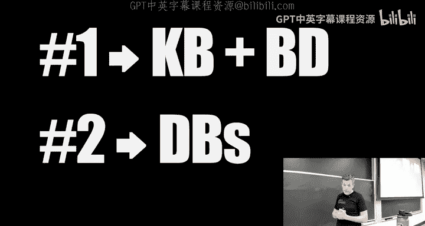
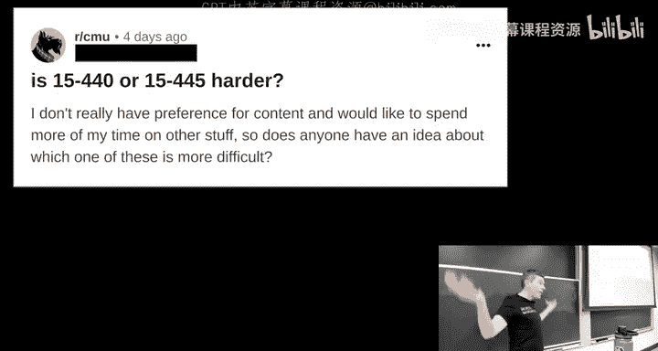
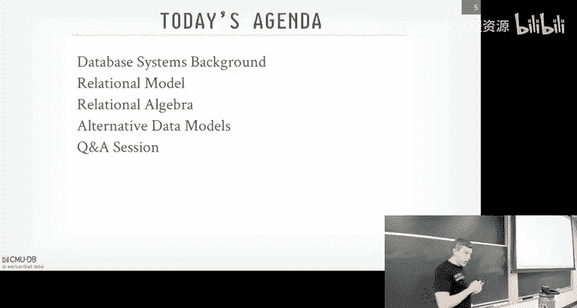
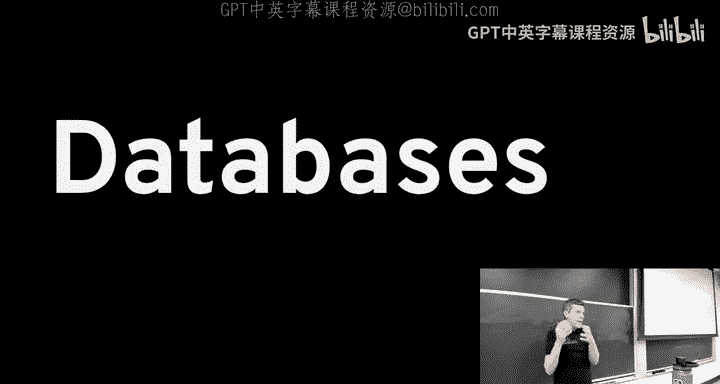
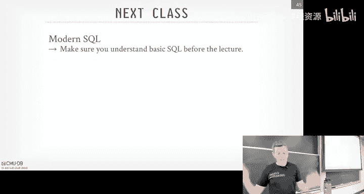
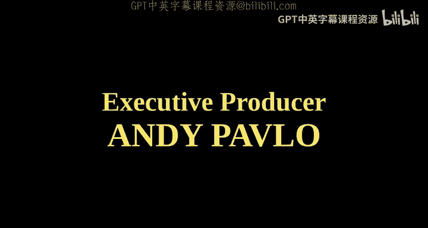

# CMU《数据库导论｜Intro to Database Systems (15-445645 - Fall 2024)》中英字幕（deepseek翻译 - P2：#01 - Relational Model & Algebra.zh_en - GPT中英字幕课程资源 - BV1Tys8eQELW

Yeah。う。So before we get started， I have to read this out。

So I do not have childild Protection clearance for Act 53， this is the state law in Pennsylvania。

 so if anybody here is under the age 18， you cannot be in this classroom。😡，No， it's not joke。

 seriously。I don't think they would have notified me but to make sure that anybody here who's not 18 or older。

 it' say it long on criminal history patch。I I don't have the criminal background history or Kim history background to pass this so again if coming in if you're under 18。

 please leave the room with that aside I'm want to give a quick shout out to people who's helped us get here where we are today so there's EZE in Crookland。

 J Yale in Seattle and then DJ dropped tables unfortunately passed away the summer so RIP to him and then DJ Mushu is in lockdown which is a whole not issue so we send our respect for him okay。

Alright， so with that out of the way， let's get into databases。

 So I sort of mentioned this in lecture 0， which I did record rerecord today。

 I apologize for the mic， but it should be better now。 So as we go on throughout the semester。

 you will see I get very， very excited about databases。 And this is for sort a very important reason。

😊，I only care about two things in my life right the first thing is my wife and my biological daughter and then the second thing is databases。

 I don't care about anything else， I don't talk to my family。

 they're all Trump supporters and antiVax， I don't care about them I dont many hobbies is just databases I live what you call a database centric lifestyle and hopefully I hope in part to you guys what that means what that entails and you could continue down the path beyond this course now。

😡。

Earlier last week， someone posted this on the C you readit。Right。

They want to know whether taking 440 or 4，45 is harder because they want to spend their time doing other things in their life。

 right， So I chime in and say whoever this person is should not be taking the course because I don't care whether they think it's harder or easy。

 right， you will see throughout the semester that if you take a viewpoint of everything is pretty much a database problem。

 And then all your time should be spending working on databases。

 then you you'll be happier in your life。

So again， I don't know if someone's in the class here at opposed to this， you don't belong。As again。

 it's quickly a reminder about for the course logistics， everything's on the course webp page。

 all the announcements and discussion for projects， Homes。

 and logistics and other things weve done through piazza。

 all the homeworks of projects will be submitted through gradescope and autograded your final grades for the Mife grades and the final grades for all your project homeworks will be in final exams will be posted on canvas if you're on the wait list I think our max capacity is 140 before the fire marsll shows up and as of an hour or so ago。

 we have six open seats and the administrators will fill off people from the waitlist into that So if you're still on the wait list you may have a chance to get in but I can't guarantee it。

😊，ok。😊，And then if you're not at CMU， we'll make everything available for the projects through this graycope。

 use this code， make sure you put yourself the University of Carnegie Mellon。

 everybody in this room right now do not do this because then you won't get a grade and they they ask everyone else who's not at CMU watching the videos don't post your solutions on GitHub don't do the stupid thing of submitttting the PR with your code because' going to put a wall of shame up for that and then don't email myself for the Ts if you're not a CMU student everybody else here in the class。

 please post some piazza and we will respond。😡，Any questions or comments about any of these things？

Again， if you're coming in， if you're not 18 or older。

 you have to leave the room because of the act B3， okay。All right， so。Today's agenda。

 we're going to talk about a quick background of what the database systems are that sort of sets us up for what the course will be about。

 we'll spend most of our time talking about the relational model and relational algebra。

 this is going to be the bedrock for how most database systems that you're going to care about。

 not all but most systems will be predicated on this。

 we'll talk a little bit about alternative data models that are out there。

 like MongoDBs document stuff， JSON stuff and vector databases。

 but these will sort of be ancillary to what we talk about in this course。😡。

The core ideas beyond the relational model of how we're going to build these these database system will be applicable to these other alternative data models is just。

I care less about them because I care about SQL， I care about the relation data model。

 and as I said on Piazza yesterday， we'll have since this comes up every year。

 people always ask sort of high level questions about databases throughout the semester。

 and I want to try to cover as much as they can at the very beginning。

 So if you have any Q& A if you have any questions you want to ask me at the end。

 we can take those okay。😊，And again， as I said on in lecture 0， I get very excited about databases。

 I talk very fast。 Please tell me to stop and slow down。 If you have any questions。

 please interrupt me and ask me repeat myself。 and I'm not gonna I refuse to answer any questions about the lecture at the end of class。

 So don't line up and say， what do you say in lecture， slide5 said this。

 What do you mean interrupt me as we go along because if you have a question。

 somebody else also probably has the same question And so we want to cover these things okay。😊。

All right。Databases， the second most important thing in my life。

 Can anybody give me an example of a database。Yes， he said a clickhouse。Anybody else？

A dictionaryHave you said a dictionary。Yeah， that's pretty good， what else。

Can nobody get in dangerous？Contact manager， good， excellent。我们儿。Sa whatい。IM D B， good， excellent。

 Allright， So he said Clickhouse， he said dictionary said he said content manager。 He said Im D B。

 So Clickhouse is a database management system。😊，The other examples are all databases。

 And so what's tricky in in well， the common semantics of how people describe databases is usually they meant the database systems。

😊，Wwhichch is what we'll focus on this class， but I want to first to discuss what a database is and then how we're to build a data management system to manage it。

😡。

Okay。So the database is going to be an organized collection of data in no surprise there that are related to way in some some manner。

 and it's meant to model some aspect of the real world。

 So he said dictionary and what is the dictionary， a bunch of words and then their definitions and maybe like the part of speech or whatever。

😡，Right， so that's modeling sort of the vocabulary。 He said a contact manager。

 that's modeling someone keeping track of elements of a pencil and paper。

 Here's all my contacts and their phone numbers and email addresses。 right。

 You're modeling some aspect of the real world， and you're trying to capture all of the constraints and aspects of that real world concept in in your database。

And again， I'm highly biased because all I care about is databases。

 but the database is gonna to be the core concept， almost all computer applications and almost all of computer science。

 In end day， what is a computer doing， Some input comes in， You do something on data。

 you produce some output。😊，That's a database， that middle part almost always is database。

 what is a file system， fossil system is a database， if you use a website， what are you doing。

 you're interacting in some form that talks to a database。😡，Right， what if an LLM。

It's a database more or less。😡，Right， so this。Important thing in computer science。 again， I'm biased。

 but you're going to encounter databases all throughout your life。

And what this class is going to teach you is to understand what a database management system is trying to do for you。

😡，Why are things going slow， why is my query coming back with garbage？😡。

RightSo if you understand what the how the components are implemented， what they're doing。

 you're in a better position to， to use a database system to manage a database。

So no matter where you go off and become a database systems internal developer。

 like all the companies that are coming in a few weeks to talk to us。

 or you go off and do something else， at the end of the day。

 you're going to interact with databases because that's what really life is all about。😡。

Everyone's got a smartphone here。Right， all those applications are running SQL light。

 SQL light is a data management system。 So this' is widely deployed  one。 right。

 So we'll understand how SQL light is actually implemented。 And then homework  one。

 you'll use SQL light。😊，So let's discuss a toy example and they can use that as to claim the various parts of the racial model and database managed systems as we go along。

So soon， we're trying to build a Spotify clone。Right，So's something a digital music store。

 and we want to keep track of the artists that are putting out music and then the albums that those artists release。

 We want to know what， forgiven album， what artist appears on those albums。

So a really simple implementation of the database could just be a bunch of files on disk。Right。

 my example here， I'm showing them as CVs or comm seative values， but it could be Json。

 The kids love Yaml。 You could do Yaml。 It doesn't matter， right。

 But we're gonna to have a separate file per per per entity。

 So we a file for the artists and artists have a name。

 the year that they came out and maybe the country that they're located in。

And then we'll have albums with the name of the album， the artist that appears in the album。

 And in the year the album was released。This is a database。 I don't recommend doing it this way。

 but you could do it this way， bunch of files on disk。😡。

So now anytime you want to update or insert a new record。

 we just could go open the file you pen to the end of it， or if we to enter a query。

 we just scan through it until totally we find the answer that we want。😡，Right。

 so save one answer query， like what year did the Jiz go solo。 Well。

 I could write some Python code that just opens the file up， reads every line。

 par parses it as a CSV to get back an array or list of values。

I know that I'm trying to look up the name Gza。 Well the name is the first field in my file。

 So I just jump to the the first element of the array， check to see whether that value equals Gza。

 if it does， then I print it out。Right。This is the database system more or less。 Well。

 this is interacting with the database。That I'm basically embedding the logical data system inside my application to do this。

This is a good idea， or a bad idea。I guess this a strawman at the top， you know， it's a bad idea。

 So why is it a bad idea？Yes，So he says you kind of need the little cover every entry， yes。

So my example here my file has three lines， Okay， who cares like that'll sit in L1 cache。

 they'll be super fast， but always when you think about in computer science， especially in databases。

 think about what happens if you scale up to really large numbers。😡。

So what if my file had a billion records？😡，Do I want to be scanning through and parsing every single line just define the element I'm looking for one entry now？

What are some other problems？Yes。You have to rewrite the。我们清。Excellent， so he says。

 you have to rewrite the code every time you want to change your query。😡，Worse than that。

 what if I want to add a new field？Now I've got to change much of my code as well is updating the file that sucks。

😡，Maybe one more。In back， yes。Yes， so he says， what if you come across a line that's reordered in a different way？

😡，Right， maybe like they swap the some， someone some stupid somebody stupid。 again。

 these just files on disk。 They open up a text editor and flip the order of these things。

 And now my Python code is， is gonna choke on it。RightOr even like。

 what if I put instead of the year of 1990， I put a phone number in。What happens then？

there's a bunch of problems doing this approach。 but this is。

 this is what the data system is going to prevent you from。

 from encountering these these issues because it'll manage all these things for you。

So there's some other issues we have to deal with， right？So in in my file。

 I just if if an artist puts out multiple albums， then in my my album file。

 I'm just repeating their name over and over again， Wutan Kan Wutan K Wutanang Kan。

 but how do I make sure that someone doesn't like drop an in。😡，In the， you know。

 the name of the Wu Tang Kan。 And now it's Wu Tang K。 right， Well。

 I know that they should be the same thing， but the data says that they're different。

We brought this up before， what if someone comes along and overwrites the album name with a weird string。

 puts an email address in， or puts in a random number that shouldn't be there。😡。

And then we didn't talk about this， but in my toy example。

 I assumed that there was one artist per album。But if it's a mix tape。

 there's a lot of artists on that。 and in my simple example， I couldn't handle that。

Then what happens is what if I delete an artist by accident or by choice from the artist's file。

 but now I've got a bunch of albums that mention an artist that doesn't exist in my table or my file。

😡，So I basically have a dangling pointer now。We've talked about how on the implementation side。

 how do we find a particular record， Well， just iterating over single file and parsing it one by one。

 That's terrible。 That's slow。What if you have another application that wants to use the same database Well now I got to basically copy and paste the code that I wrote to parse that file and get records out and put it to my other application。

 But what if I wrote the first version of the application in Python， then I rewrote it in rust。

 now I got to translate all the Python code to Ru code。😡，That sucks。But then what also。

 what if the file sorry， what if the the， the other application is running on a different machine or what the cell phones。

 Now， I got to make sure that they， all the application implementation can access that file some way to like a distributed file system。

 which is the database， by the way。And then what happens if we have two threads try to write the same file at the same time。

Well， we can do something really really stupid and doesn't let the OS lock stuff for us。

 lock the file， and then only allow one thread to write into it at a time。

But a reoccurrent theme you can see throughout the semester is in the world of databases。

 the O S is our friend of me。 We never want to let it do anything for us。

 So letting the O lock files for us is a bad idea because we're database people。

 and we can always do it better than they can。😊，So only allowing one thread it to file at a time。

 that is actually what SQL light does， but SQL lightss meant to run on cell phones。

 you're running a machine with10 cores， you don't want to do that。😡。

And the OS implementation is is always going to be more inefficient anyway。And then lastly。

 what happens if we're modifying the file？😊，And we going to write a new record。 We write half of it。

And then it crashes， the machine crashes， someones chips over of the power cord lightning strikes the transformer or whatever。

😡，Now we come back online， what should be in our file？😡，Well， if we just write to the file。

 we'll just see whatever we wrote before to the crash。 But that's invalid。 right now。

 we have a record that's missing half of it。And then what if we want to allow multiple machines to access the file or the database。

 and we're going to make sure that and if any one of those machines goes down。

 we can keep running and still serve queries sort of request。Well。

 I've now got to basically implement a bunch of low balancing stuff to handle accessing the file。

 that sucks。So this is just a quick smattering of the problems that we're going to have to solve that entire semester to make it so people don't have to do stupid things。

 like relying on the operating system or managing a bunch of stuff in application code。😡。

RightAnd this is what a database management system is going to do for you。

 right It's going to be the software that that allows applications to store。

 analyze query data in a database。And a general purpose database system will be one that can support any arbitrary schema within reason。

 of course， it can allow any arbitrary queries， meaning it's not hard coded just to do that one lookup on the Gsza。

 you can change the query to any look up on any artist or any field or do any kind of transformation。

And so're going to do this according to what we'll call a data model。

 it's a way the high level representation of what is in a database。Right， and again。

Just to push this point home further， database systems are some of the most widely deployed and widely tested and vet pieces of software in the world。

 that maybe rivals， you know， maybe operating systems。

s the only one I could think of maybe some embedded systems。 right， There's。

 multi-billion dollar corporations that are running off of database systems that are tested and sold by major enterprises。

 There's a lot of money involved in database， both know。

 building them and selling them a lot of money riding on a system operating correctly。

And so at no point， it sake and if you go off in the real world and you do a startup or whatever。

 at no point you， you should say to yourself， oh， I'm just gonna build my own， you know。

 database system in my application。 That's a bad idea。 You're gonna have problems。

 You're gonna rely on these existing， existing tools that are out there。And again。

 this class is going to teach you how to do it。Alright。

 so a data model is going to be this high level abstraction that is going to represent data in a database again。

 according to some， to some scheme we'll see in a second。

And within most database assessment support only one data model。

 like a relational database or a document database。

 the lines start to get blurred more recently because in relational databases。

 you can store documents you can store JSON now in a field and now the document databases all support SQL and relational like things on top of JSON。

So in some cases， it's clear that there there's a distinction between the data models。

 But in the more widely placed systems， again， the lines get blurry。And so given a data model。

 your database will be defined according to a schema that just specifies。

 I have these tables or these collections of data， they have these attributes with this name and this data type。

 we'll see this throughout the entire semester， but it's a way to test the structure of the things you want to store in your database。

😡，Because without a schema， it's just a bunch of random of bits， and it doesn't mean anything。

The schema has allow you to provide a structure to the data so that you can write queries against it。

😡，Now that way think about this， save I bunch of log files for my application server。

 it's a bunch of text lines， with timestamps and so forth。😡。

If I don't have any structure on top of that， I， then there's no way to sort of find the data I'm looking for。

 But if I say， oh， a log file entry is gonna have a time stampamp followed by maybe an event code followed by a string that with the event。

 Well， that's a schema。 That's a structure that I can then run queries on top of it。

Becauseuse otherwise， again， it's just a random bunch of blo random bunch of bits。

 the data is useless if the data is meaningless。Yes， how is differentating the data model？

The data model is， we'll see a data model is the abstraction for how you define。Collections of data。

And then then there relationships between other collections。The schema says， okay。

 within that data model， I have these collections I have these attributes with these types。😡。

Think of it like a， it's almost like a like a。Class versus object in like Java world。

 The class is the definition of， the， the， the data model and then the instantiation it would be actually。

 that's a bad example。mIt would be like a maybe like in the programming language you specify。

Like in Java， the Java has a way to define how you represent data。

 and then you would create instances of it in classes。Let's go further along。

 I think it's the better to able to， but。I think it makes sense when you start seeing differentiations between them。

Other questions。Okay。So I'm gonna be highly， highly biased throughout the entire semester。

 I love the relational data model。 I think it's how every data system should be implemented because the relational model can be contorted at least the modern version of it into any possible data model you would care about。

 except for one。 I'll talk about in a second。😊，So most database systems that we're talking about this semester and those database systems that are in the real world that you've heard of are very likely going to be relational databases。

But it's not to say that' it's the only one out there。

RightThere's these key value stores that are out there。 Things like Ro Db， level Db。

 Redis is sort of like this， where you sort of have a key， and then a value。 And that's it。

 And there's no meaning to the actual value except for what the application puts upon it。

 So this is typically used for simple applications or caching like a video cookie I D to some payload。

They need have this whole sort of category falls onto the moniker NosQqL。

 which is ironic now because now now they really mean at the beginning when No SQL came out they were like。

 oh guys， you know， SQL sucks。 we're not doing any SQL， No SqL。 Now they really mean now they say。

 oh， NosQL really means not only SQL， right because they've seen the light and basically become relational databases So the documented stuff of the Json database is probably the ones that you've heard about the most。

 like Mongodb would be a document database。 wide column or column family is a subset of document of Json databases。

 It like。😊，Google big T was this， Cassandra was this。Then you have these array databases， or vectors。

 matrices， and tensors。Tensors are probably the thing you don't want to store in in a relational database。

 because。Since it's like a multidimensional array， it's kind of weird to do that in a relational model。

 even though the SQL standard last year just added it a multimenional arrays。

And then there's these hotpoage of these ones at the end。

 Hiarchical network semantic anti relationship。 I'll talk about network1 a little bit from Kodail。

 but these are like stuff from the 70s and 80s。 they were doing cocaine back then they were experimenting。

 but basically the world has come after to realize that the relational model is the right way to go。

😊，Every 10 years though， there's always this repeat where someone says， oh，veal model stupid。

 SQL stupid， we're going to have a new data model， and then everyone gets all excited about that on hacker news and then eventually come around and say。

 oh yeah aveal model is's the right idea。😊，So we're right now。

 we're in the phase where all of these guys have said， oh， yeah， SQL is actually a good idea。

 And then the next step is gonna be the vector databases。 come back and say SQL is a good idea。

 but we'll get them。😊，All right， so again， this course is going to be about relational databases。

 but it's not to say that the things we're talking about can't be applied to the other data models it's just。

😡，You know most of the systems you encounter are going to be relational。All right。

 so why is relational model matter and why why am I so keen on it， Well。

 if you go back to like the 60s and early early 70s。😡。

The there wasn't this sort of plethora of database systems that we have now。

 There was a small number of them， and it was very difficult to build database applications。

 I think of like mainframe days。 And so in the early days。

 the first database systems that built a thing called IS or integrated data store that was actually built by G E in 1965 or 66。

 IMS was a higher database built by IBM to manage the Apollo Moon mission。

 that came track of all the parts to build the rocket going up。😊，And then part of this IS work。

 there was this thing called Codail， which came out of the cobal world。

 I was basically trying to define what the API is， how you would interact with with the database。

And so back in the day in the 60s and 70s， computers were very， very expensive。

 and humans were relatively cheap， the labor of humans were relatively cheap to computers。

So it wasn't that big of a deal that people had to spend a lot of time rewriting their code as he brought up every time they could change your database。

 if you use these other data models。And that's because there was a tight coupling between at the logical level how you're defining your database and then how the data system actually physically represented it。

 so now in your application code you had to be aware of how the data is laid out the bits on disk and how things were connected with pointers and you had to basically traverse those data structures mainly in your code so that meant that any time there was a change in your database schema。

 you had to go back and rewrite all your application code to account for that。😡。

So an example would be in IMS， least the early days。

 you would define a table and then you would tell the system I want to start it either as a hash table or a bee tree。

And then say if he made a mistake said， oh， I really want to store it， I decided to do a hash table。

 but I really need to do range scans and you can't do range scans on a hash table。

 And I want to switch it to a Bre。 Well I got to dump the data out， then load it back in as a Bree。

 then rewrite all my application code because now the API to that table has changed because I went from a hash table to a B tree。

😊，So there was this guy at IBM who basically saw all these programmers doing the same thing over again。

 making all these these mundane changes to their database applications every single time there was a change and there's always going to be changes in databases because as the world evolves or the data yourre capturingtioning evolves。

 you want to evolve your database。So there this guy named Ted Cod who was originally a mathematician。

 who did a Ph in mathematics。 He joineds IBM research in New York， and as I said。

 he was seeing all these programmers doing the same thing urban organs rewriting their applications every single time the layout orchema changed。

😊，And he obviously thought there has to be a better way to do this。

And so he devised the relational model in 1969 as a sort of abstraction to a database based on sets。

😊，Or sorry， based on relations， which I'll explain that in a second。

 and that there would be this logical connection between data through values rather than physical connections like pointers and offsets and things on disk。

 as you would have to do in the other data models。So the first paper that defined the racial model came out in 1969。

 I think this was an internal tech report at IBM， but the one that's really。

 really famous that everyone refers to is this one here that came out in the CACM in 1970。

 so if you say what's the first paper of the relation model people typically point to this other one here？

😊，And so when this came out， all the academics thought this was the greatest thing ever。

 This is clearly how we should be building database systems， but IBM。😊，Po poed it or ignored it。

Right because they are making so much money on IMS S， which is the high echo database system。

 And then one of their own employees comes along and say， hey。

 the thing you're making a lot of money on is actually stupid。 You don't want to do this way。

 You want' to do this other way for this system that hasn't actually been implemented。

 But here's the better way to represent databases。AndAgain， he was a mathematician。 He didn't。 He。

 he wasn't building a system at the time。 And actually， in this first paper here。

 it's all mathematics。 There is no， there is no sQel at this time He didn't define a programming language。

 It's all through relational algebra and how you manipulate databases。So from IBM's perspective。

 they were like， well， we can't do anything with this。 It's just a paper， right。So， but eventually。

 the IBM did do this。 Ki take the paper， but not in New York， actually in San Jose。

 They got a team together， which will cover throughout the semester and actually build one of the first relational databases。

As a prototype based on Ted Cod's paper。So。😊，I mentioned Kodail is a hier code database that was spearheaded by the guy that' was building IDS or Im at GE。

And so theres a sort of back and forth between the relational guys。

 people that were like in academia that like relational database is the way to go。

 And then all the coic cell people， all the cobal people say， no， no， codaol is the right way to go。

 And so actually， who here has ever heard a cotisol， cotiol。😊。

No one right because it's dead right so codeta sale was based on these like sets so you would have you would define like these collections as of tables and then you would define the relationships between Team them through these sets and you would basically iterate over every element each set and follow pointers to go find the data that you're looking for。

😡，And so there was this famous workshop in 1974 in Michigan。

 where they got all the people from the Codedaale camp and all people forlational database camp。

 put him in a single room and they fought over it。 this is a very， very famous meeting。

 Obviously Ted Cobb was there。 But there's been for touring awards in databases。

 and all four of those people were there。 So we're gonna to cover a bunch of these guys throughout the semester。

 Bachman was the Ko of sale guy。 He's dead。 Jim Gray invented two phase locking。

 we'll have a whole lecture on that。 He's dead。 And then Stonebreaker invented ingressss and Postgss and a bunch of other stuff that you may heard of before。

 he's still alive。😊，He's 80， he turns 81 this year。 he was my Ph advisor。 He's brilliant。

 But basically all the codeo guys are saying， hey， there's relational model stuff。

 you can' actually build a real system doing this， right。

 people aren't gonna understand what it means to have relations and tables。 And then furthermore。

 if you're gonna be programming at a high level language。 Again， SQL。

 the guys that been to SQL were actually at this conference too。 But at the time， SQL was。

 you know very early。 But you're never be able to to take SQL compile it to a program that can run efficiently。

 right。😊，So they all complained， the Curtoo guy said that relational database is a bad idea。

 but then the relational guy says。😊，They all say that this co cell thing these sets and you have to walk through these records deal with the physical data structure。

 that's all a bad idea， too。 Like it makes the application brittle。

 makes the application more like to break when one part of you know the database breaks。

 It breaks all the other stuff because it relies on the physical integrity of data And as I said。

 nobody here has ever heard a codeda cell， the relational camp one。But again， as I was saying。

 every 10 years， people forget all the things we've learned before。

 And now the graph database guys are basically making the same claims now as the codaol people did in the 70s。

All right so。What is the rational model。So it's a data model that's going to define a abstraction for a database based on relations to avoid the cost of having to maintain the implicit knowledge of what the data looks like physically in your application code。

So there's three key ideas in the relational model。

First is that we're going to store our database in as simple data structures， Ie relations or tables。

And that we don't expose that information to the application code， right。

 You get this abstraction just， I have tables， and I can interact with them。The physical storage。

 the way that actually the data system is going to actually write down the bits of your tables is left up to the implementation。

😡，So the idea here is that， say I have a database， I use a database system， I have my database。

 and I sort on a database system that stores things on disk。

 but maybe I want to store things in you know in memory and in memory database。 Well。

 if I things through relations and interact it through SQL。 in theory。

 I could take my database out of the disk database and put it into the in memorymory database where some some new store device comes along。

 I just plop it in that one。 And now I don't have to change any my application code。

 even though the physical layout of the bits has changed。😊，Now。

 I'd say in theory this should work as we see next class， there is a SQL standard。

 nobody follows it exactly。 the only sort of de factoro SQL standard we have now would be Postgres because everyone can take the Postgres parcel and reuse that。

But we'll see many cases where just because I have two relational databases doesn't mean they're always going to be compatible。

So again， I say in theory， you should be able to do this， but not always。And then at the last one。

 again， is that instead of writing procedural code like a low level 4 loops。

 the iterator single you know， one record at a time， as I showed my toy example before， we're gonna。

Write queries in some kind of high level language。In the spliter， it can be sQL。

 but we have to do relation optimal first before we get there。 And then that way， we just say。

 here's the answer that I want。 And it's up to the database management system to figure out what's the most efficient way to to implement it to execute it。

So my example before where I said I was parsing that file to trying to find one record and instead。

 what if I have a billion records。Then that would really be slow。

 But if I wrote it as a SQL query and say I had to build records and things went slow。

 But then I can go back and add an index so I can jump to the exact record of that I want Think of like glossary in the textbook I can jump to the page I want for。

 for some keyword。😊，And then now again， I don't towrite my application code because I have an index。

😡，Because I've abstracted away the implementation of the data and the query plan。So we'll see。

 as we go throughout the semester， again， back in the 70s。

 people were making the same arguments when C came along the C probing language that， oh， you know。

 there's never going to be a compiler that can generate assembly for C code as well as a human can write。

 Of course， now we know that's crazy， right， compilers are very， very efficient。

 Same thing was said about SQL back in the day。From the Kodao guys that no。

 no computer program is going be able to generate a query plan for a SQL query that's as efficient as what a human could write themselves。

Of course， again， nobody writes SQL by hand anymore or at least sorry nobody writes the query plans by hand。

 let let the data system't do it for you。All right。

 so there's me sort of three components of the relation model。

 there's going to be the structure of the database again that's going to be the definition of the tables we have。

 you can use the term tables and relations interchangeably。

 but to be pedantic you would say relations not tables。😡。

But you define what's going to be in your relations and then their contents。

 and you define this independent of their physical representation。😡。

And we'll cover that a bit further the next slide， and then you can also define what well call sort of integrity constraints。

 And these are going be definitions of what the data is allowed to look like in accordance to whatever you're trying to model in the real world。

Right so if you store someone's age in a database， we know no one can be negative。 right。

 There's nobody that's negative 10 years old。 So we can put a constraint in our， in our table。

 say this value of this age can never be less than 0。

And then the last one is going to be the manipulation mechanism。 and this is basically the API。

 the programming interface that that is exposed to us to allow us to access and modify the content in our database。

 and this relational this is what relational algebra will be that we'll see in a second。

But I'm going to cover the independence thing first a little bit more because this is it seems obvious now。

 but again in the 1970s， this was considered groundbreaking。

But the idea of data independence is that， again， we don't want to。

Have to expose necessarily the physical layout of data on whatever storage device we're storing it on。

😡，To the application so they can program against it using a high level extraction。

So at the lowest level， there's database storage， I'm not defining what that is because it could be in memory。

 it could be an SSD， it could be an object store， like S3。😡，Again， for our purposes here。

 it doesn't matter。And then you would define a physical schema of basically how to represent the database you're trying to store in that database storage device。

😡，So this would be defining the pages， the layouts of the pages。

 like how the bits are actually lay in a single page。

 where the how the files are organized is your database one file， multiple file。

 multiple directories， what do your extents look like are you're packing multiple files in multiple pages in a single stand or is a single st for per table。

 all that is handled at the physical schema level。😡，And then above that， you have the logical schema。

 which is how the application is going to define what's in my my database。 I have these tables。

 They have these columns and have these constraints on them。 Typically。

 you would do this through SQL。 I get a cr。Cate table command。

Then I have a further abstraction on top of that called an external schema。😡。

And this is where I can define sort of virtual tables on top of my existing tables。

 And these are called views。Again， we'll cover this throughout the semester。

 But the idea here is that， say， I have some table of student records。

And I want to expose to different applications， portions of what's in that table。

 So say like accounting needs to know your social security number。

 but they don't need to know your your grades。 say it's all on a single table。

 so I can create a view that says this application can see the table with these columns and this application can see the table with these other columns。

 even though physically it's the same table。 It's exposed to you in a different different way。

And above that at the very top， this is the application code。 right， This is the Python code。

 JavaScriptscript， whatever doesn't matter that it's going interact with with our database。

So physical independence would be this part here where I could define my tables and their contents。

 but I don't care about how they're actually being physically stored。😡。

And I have a further level of logical independence where I could say， I had these logical tables。

 but then I could。Sort of recompose them in different ways for different applications or different users。

 And they don't need to know how things are actually being stored at the logical level。

 right below it。So this physical data independence， this was。

 this was a big deal because code of sale couldn't do this in your application code。

 you had to know how to follow the pointers of the data structures that the data system was storing for you。

 Relational model says there is no notion of pointers。

RightEven though we're going use pointers to implement our system， but we don't expose that to。

 to the application code。Again， it's one of those things where it seems obvious now we hear it。

 but back in the day this was groundbreaking。Alright so let's go a bit more now what what relations look like。

So as I said， I'm could you use the term relation interchangely with table。

 but to be sort of again pantic to the relation model， we'll call relations。

So a relation is going to be an unordered set of data that contains a relationship of attributes that represent some entity in the world。

So again， if going back to the artist table， at one record or one entity would be an artist that exists like the Wutanang Kan。

 and we would have all the attributes that represent the information of the metadata or sorry。

 not the metadata， the attributes of that entity。😡，Together within within a record。

And a record we're going to call a tuple， again， think of it I want to use this term row because a row applies to a rowtor。

 We'll see column stories later on， but a tuple is going to represent some entity or instance of an entity within my relation。

And so the original relation model had to define that all the attributes you would have in your relation had to be atomics or scalar。

😡，You couldn't have lists。 You couldn't have nested documents like Json that has since obviously been relaxed in the SQL standard。

 and most data systems support these things。 But back in the 70s， you couldn't do this。

We'll also have a special value of null if it's allowed because we can define that things can't be null in our relations。

 but this is just a way to say that the value of something is unknown for a given attribute。

So you would say a。Again， to be pedentically correct， you would say n area relation。

 meaning relation with n attributes， that's more or less equivalent to a table with n columns。Right。

 again similar if you say， oh， I'm using， what data they' using， I'm using My SQl or Postgres。

 people know what you mean。 So if you say table with these columns， people know what you mean。

So a core concept of ovlation model is this idea of having a primary key。

And a primary key is going to be some set of attributes。

That uniquely represent one entity within our relation。😡，RightSo save， for simplicity。

 wed have like we could say that there's， no artist can have the same name。

 so we could say that's our primary key。 Of course we know that doesn't know。

 that's not correct in the real world。 But for our purposes here， we can say oh yeah。

 theres the primary key is a name for an artist so for a given name like a string。

 I could jump to one tuple that has that information。

So you don't always have to define a primary key。Most relation databases will let you define tables without it。

😊，What we'll see later on is underneath the covers。 If you don't define a primary key。

 some instances will actually create one for you。And then even though you may define a primary key。

 some systems may ignore that。Treat that as still a unique constraint。

 like the value of the primary key is still unique， but underneath the covers。

 it maintains its own primary key。So SQL light does this。

 SL light has its own increment value as the primary key。

Even though and it treats whatever you define as primary key as a unique attribute。

So going back here。As I said before， we could use the name of the primary key。

 but that's that's bad because obviously， artists could have the same name。 So to get around this。

 we could rely on like a a synthetic Id。Like like a number。

That could represent that given attribute or sorry， given tuple。

And they could just be incremented monotonically 10，1，1，0，2，103。

 So the Seal standard allows you to define what are called identity columns。Again。

 think of these like synthetic values that don't really map to things in the real world。

 but it's going allow us in our application code to uniquely define where that data is located。

SQL standard calls his identity。 Postcus and Oracle called these sequences。

 And as we'll see throughout the semester， My SQL， for whatever reason does things differently。

 they call it an auto inement key。😊，So it would be this column here。

So in addition of the primary keys， we also have foreign keys。

And the foreign key is are going to allow us to map some set of attributes from one relation to another relation to define that those things are linked together。

😡，And again， this is different from what Kota cell did。

 Cota cell would actually have pointers from one record to another record that you would literally follow either through memory or through a disk access to go find the things that it was connected to。

😡，But in a relational model， instead said， we're gonna to use values to。

 to represent those those relationships。So say before， remember。

 we wanted to be able to keep track of all the artists in our album。😡。

But if the album only has one artist， well， that's fine because we just store the single value。

But what if I have a mixed table with multiple artists on it？Now again。

 I said you can store arrays as attributes， ignore that for now。And in the sort of。

in the true relational model form， you would actually have to store this as a separate cross reference table。

That keeps track of forgiven artist ID， what album do they appear on？😡。

And so these would be called the foreign keys， so you would have a foreign key from the artist table。

 the artist ID that points to the record in the artist table， and you have an almiD。

 it's a foreign key pointing to the album table。😡，And again。

 it's up to the data to decide how to make this work efficiently。😡，Typically。

 there's gonna to be an index that says for a for this record here。

 given a look up on if I have an Al I D， I had to have an index on the。

 on that Id in the other table。 So when I go insert something into this table。

 and I need to quickly check， does this al I actually exist。 I can quickly do that lookup。

And these foreign keys are't allow us to handle constraints or other issues where like if now I delete a artist and don't want to cascade and remove all their albums well I can follow this table to go find all the albums that they belong to and then go make sure I delete things here or in some cases you can prevent you from deleting things you say I can't delete a record if I know I have a foreign key reference over here。

Basically， the data system is preventing you from shooting yourself in the foot。And you may say。

 oh I'm a senior student， I'm not going to make mistakes。 Everybody makes mistakes。

 And so the data system can prevent you from causing a lot of problems。

So I sort of mentioned this with the foreign key is what the idea of constraints。

 These are a way to define what data is allowed to look like。

And that could be either within a single attribute or multiple attribute within a tuple。

 or what values are allowed to look like across multiple tuples within a table， within a relation。

So he said， oh， the artist ID has to be unique because that's the primary key。 That's a constraint。

 That's saying that there's only one tool can have a given artist ID across the entire table。

So the most common ones are going to be unique keys and then the foreign key references。

 the SQL standard from 1992 has this idea of basically global asserts。😡。

I think maybe some systems implement this， but they're rarely used because they're really slow because thinking like every single time I insert into the table。

 I got to run this other query to see whether my constraint has been violated or not。😡。

So the most common you'll see them is defined in the table itself。 right。

 So if I can say I have a name， it's going to be a v chart。 that's a string string type。

 and then not null。 That not null part is the constraint that says。

You can't sort a record with a null name。Another one could be explicit check down here。

 where could say that the year has to be greater than the 1900 because， you know。

 nobody can be born in the 180s。 It' not correct。 but， you know， in the real world。 But like。

 that's the idea of how you could apply different constraints like that。And as said。

 you have these global sorts。 There's a create assertion command。

 You basically put a SQL statement in every single time you modify the table， this thing runs。

 But again， they're super slow。You can always think big， I have a billion records。

 and I got to scan to make sure that some constraintss not violate across those billion records。

 Everything I update that table。 I got to run that across a billion tables， and that's bad。All right。

 so then next thing is the DML and this is basically the way we're going to manipulate。

 interact with the database through the relation model。

And there's sort of two categories of the DML you could have a programming language you could have for in a database。

 the first is going to be procedural where this is basically defining the exact steps you want the data system to execute in order to run your query。

And the other one would be nonprocedural or declarative。

 where this is're specifying the answer you want， that the data to compute for you。

 you don't define how you want to compute it。😡，I just say，But this is just what I want。

So for this class here， today's lecture， we're going to focus on this one because this is be relational algebra。

And they said， no data system will expose a relational algebra interface to you because it's justs too cubersome to write it。

 and again you're basically defining what the query plan should be。Most systems will support this。

 a declarative language， and this will be based on what we call relational calculus。For this class。

 you don't need to know relational calculus， but it's a higher higher level form of defining operations over the relational model。

So if you take the advanced class or we might do the special topics class in the in the spring semester on query opt optimizes。

 the relational calculus will come up。Sparringly， but for as is here today in this semester。

 we only really care about relational algebra。Earlier in versions of this course used to teach relational cculus。

Nobody uses that in the real world， unless you're bringing a que optimizeizer。Right。

 so relation algebra is going to be based or it's going define。

 So the racial model is going to 7 primitives。 And the idea is here is that we can use these to construct。

Any possible  query you would want to have on a relation database。 Now， not entirely true。

 Ted caused rental paper in the 70s to find these， these these7 primitives that's since been expanded because you this doesn't handle things like sorting or aggregations or group Is。

 But I want to cover the core the core primitives。 And then it's sort of trivial to see how you could extend that to do other things that you want to do in a real system。

So we're going to be able to chain these things together to compute more complex queries。

 but I'm going to go through them each of them one by one。😡。

So the most basic operation you do is a select。😡，And this is basically the first order predicate logic to say。

 here's how to identify the tu that I want for a given relation。

And it could be what I'll call the base relation， like whatever I defined find in my database。

 I'm going directly at those tables， or it could be from the output of another relational operator and that's feeding into to my select operator。

😡，And so basically you're going to find predicates that be based on bullolean logic to define tus are allowed or what tus satisfy the constraints you want on the data。

 and then any tuple that that does satisfy is then emitted as output。😡。

So say have a really simple table or relation with two attributes， AID and B ID。

I could define a do a select what the prediccate is where A IDd equals A2 against the relation R。

 and that just matches any record where AID equals A2。Right。

 it's like the wear clauses in a select statement like that。

And you combine combine these things together with conjunctions and disjunctions。

 So I can say find me all the， the twoos some R， where A I D equals 2 and B I D is greater than 102。

 and produces that relation as the output。Right。So for me。

 the way I always remember this is like the， it's the the lowercase Sigma symbol S for Sigma。

 S for select， Easyneonic。 remember that。So in SQL， which most are going to be writing。

 it's just the wear clauses， right， So select R from R。

 and then have my wear clauses be the predicate for how I'm filtering twos。😊。

And that's equivalent to defining the the select operator here。AllThe next thing we do is projection。

😡，And this is where we're defining what the output should look like in terms of what attributes that we care about from our input that we want to produce as the output。

 as well as how to manipulate those attributes in any given way。😡，So again， same。

 same relation on R with AI D and B I D， I could have a projection。

Where I take whatever the input is from from this interlation or sort operator here。

 So here I'm doing a select on where AID equals a2 and then I take the output of this inner selectlect and now project it where I take the BID value or B ID attribute。

 subtract 100 to it， and then also produce AID as the output。

 So not only am I selecting what attributes I want， I can change the order of them。

 I can manipulate them。 I can do ametic operations string functions， whatever you want。Right。

 and you're just defining what you want the output to look like from any given input。

And that's equivalent to the， like the select operator。

 the projection clause of a select operator in in SQL。So far so good。😊。

So then now we' going to be able to start combining relations together。Because， again。

 the idea is that instead of having this one giant relation with everything single possible attribute I could have for whatever。

 whatever is whatever it is， I'm trying to model my database， I want to break it up into relations。😊。

And then combine them together to reconstruct the original form。

So I have the union operator that basically just takes all the attributes from one side and all others from the other side and just sort of mashees them together into a single single relation。

In this case here， this operator only works if if both the relations are're trying to union have the same。

The same attributes with the same types。Right， because it literally is taking concatenating。

 you know， taking R， and putting S at the bottom of it。 And that's the output。So in SQL。

 you can do this with there is a union operator。We basically combine the values of two select statementss and again。

 they had to have the same attributes because you're just concatenating the two bowls。

 combining them into a single output。Of course there's a union， there's an intersection。Right。

 and the intersection is just。Taking the finding the where back is。His question is for union。

 if there's a two pillar in both tables， will it reuse them？いあ、明ばです。In the original racial model， no。

 because it's based on sets in SQL， the answer is yes。

I sorry other the way around in in the relation model， it have removed duplicates in SQL。

 it will keep them。So in SQL， if you do a union， it keeps them， if you put union all。

 then it removes them。😡，Because by default， they want to be efficient because it's extra work to find the duplicates。

Ill say also too is this is unordered。 So even though I'm showing R followed by S。

 this be a key thing we see throughout throughout the semester is。

The order of the racial model and SQL is undefined。

So it's okay for things to end up being maybe inserted into your table。

 And then when you read them back， they come back in a different order。

 And this is gonna to open up a lot of opportunities for us to optimize things in different ways because we don't have to maintain that order。

 Now， in some cases， we do want that order。 we have to put constraints on top of that to do that。

 And some systems will always store data in sorted order in some manner。 But we'll see examples。

 when we see know manipulating or updating the database through transactions that if we maybe be running a background garbage collector。

 it could reorder things in any way we want。 and we get back things in a different order。

So if you care about getting back things in the right order， you define an order by clause in SQL。

 but again， the original version of the relation model does not have that。So intersection is， again。

 finding things that are that are in both。 in this is this case here， I have to again。

 I have to have the same attributes。 There's only one tuple that matches both them，8，3 and 103。

 and that produces the output below。😊，Difference is finding all the tus that appear in the first relation。

 but not in the second relation。Right， again， this is just sort of set theory stuff here。 nothing。

 nothing exotic。 right， So I can do this again in SQL using the accept operator again here， I have a。

 my produce my output A1，100，1，0，1， a 2，1，02， because those things don't exist in S。

 But because I have a 3，1，0，3， also in S， that thing is excluded as from my output。😊，Al right。

 so this is， again， this is basic set。But it still doesn't。 It's not allowing us to， to identify the。

The relations that we would or the relationship are the connections between different relations that we would want。

So to do that， we want to do what are called joins。 But before we get joins。

 we have to do a Cartesian product because that's the basis of how we're going do joins later on。

So Cartesian product， yes。😡，For the operations。Com下。His question is， for these operations here。

 do the concept do the same， yes？Joins， we'll in a second they don't。

 for union intersection and difference， they have to yes。Alright， so the， the。Let say the easiest。

A naive join would be the Cartesian product， we're just taking all the tuples that are in one relation and all the tus in the other relation and just finding all combinations of them and producing the output。

😡，Right， so in this case here， if I do the Cartesian product on R and S。

 I get all of these So for every AI D sorry where A I D is is a1 and  one on1。

 I then generate all of the like o， sorry。😊，I generate all of these guys here。

 just mash them together， and that's these。 And then I go into the next twople on this side and get all the A2。

102s and then mash them together with that。Right。So you may think， why is this good idea。

 Why would you ever actually want to do this， because you're generating a bunch of data that actually doesn't actually match with what's in the real world。

 This shows up when you do experiments and experimental analysis and' in testing because you wantna get all possible combinations over your inputs。

😊，You would do the Cartesian product for that。But more importantly， from a theoretical perspective。

 this is going to be the basis of how we're going to do joins in the next operator because what we're going to want to do is find all the where the AIDs are matching the AIDs and Ss because we know they're going to be connected in some way based on how we define them in our schema。

😡，So you can do this in SQL。 There is a explicit cross join operator or keyword， right。

 So I can say select star from R cross join with S， and that gives you the quotesian product。

 or it's not recommended in the standard， but you can just put， you know the。

Coma separated list of the tables， and this will produce the Cardesian product for you。Right。

But joins to be the important thing that we care about。 This is basically a。

Getting finding all the matches from one relation， quoting some value with with the given attributes in S。

 and so unlike in the intersection operator where the schemas of the two relations have to be the same join doesn't have to be。

So implicitly， it's going to look for the name of a column and find the corresponding matching name in the yellow column when I do a join。

So if for an RNS here。😡，When I do a join on R and S with a join operator。

 I'll find where the values of AID and BID are the same。

And then value just sort of comes along for the ride too because it was part of the matching tuple。

Right。So again， you sort of think of this as like。You're sort of mashing the two twos together。

Then checking to see where things match like our AI D and for R has to match AID for Fs。

 and the B I D for R has to match the B I D for S。 And then you just you throw away the duplicate attributes。

And then that's your output。Joins are going to see this。 We'll spend a whole lecture on this。

 Joins gonna be where， where data systems are gonna spend most of their time in， in running queries。

 So this is the thing we're gonna try to optimize the most make them run the fastest。😊。

There's a lot of different ways to define joins， a lot of different types of joins we'll see more in next class。

 and so my example here where I'm sort of implicitly joining based on having the values be the same or sorry the names of the atrophy be the same that's called a natural join So there's a natural join keyword that's basically going to look up the names and of column and see whether they match and then do the join against them。

I don't recommend doing this because again， it's st implicitly figuring out what the joints should be based on。

And you actually want to actually define how you want to do your join。

 So you can either do this with a join clause for R and S and there's a using keyword。

 you say what you're doing your look up on， or you can do the own clause。

 where explicitly to say like AI has for R has equal to AI D for S and the B I D for R has to equal the B I for S。

Right。So the bottom one is probably， if you're writing my hand is probably what you're going to be doing。

 This has a little bit more information because you're actually specifying what columns you wanted to do the join on。

 and then natural join again， is not something I recommend。Again。

 the anti SQL standard wants you to explicitly define as much as possible。 So that way。

 if the schema changes as things evolve， it doesn't break your application code。

So there's a bunch of other stuff that came along later in the '70s for the original model。

 had to rename columns， had to assign columns to variables， removing duplicates。

 aggregations and sorting and division and these all came after TEDCO's original paper and most data systems are going to support。

Maybe not division， but everything above。Yeah。So that's the crash course。

 which you need to know for relational algebra， but we'll see how this， you know， as we go along。

 should build the query engine of a system that's being predicated on these ideas。All right， so。

As I said before， relational algebra is considered a procedural language。

 like even though it's mathematical notation。But you can kind of easily see how you can implement a system to implement it。

One of the complaints about Ted Co's paper in the '70s was they thought it was too mathematical。😡。

I I'm not saying that I'm， I， I'm brilliant。 And I could easily decipher。

 but I was surprised when when they said it，'ca it it's not that。It's not that esoteric。

 it's not that hard。Having think any CS undergrad people should be able to understand that。

But it's still defining the steps you want the data system to perform in order to compute your query。

So I have to say， if I'm going to join R and S， I have to define in what order I want that to happen。

 So I would say， all right， first my choices are first join R and then S。

 then do the select on it to filter out the tus that I want。😡。

Or I could do the filteror as first based on the BID。

 then take whatever the output of that select operator， then do the join against that。😡，And again。

 there would be pretty dramatically different performance of these two queries。

Based on what the database actually looks like， like again。

 if if if R and S only have like 10 twoples， then it's not that big of a deal。

But if R and S have billions of tuples， then I definitely want to filter as much as I can out from S before I join it with with R。

But in racial algebra， there is no concept of allow things to be reordered。

 I'm defining exactly what I want to happen。So this is going to lead us to next class talking about SQL。

 but a better solution is going to be say， again， the high level definition or declaration of the answer that I want in my query and let the data system figure out what's the best way to perform that。

And again， now， if I change the physical layout or data structures that are in my database。

 I don't have to change my query plan。Or don't change my query if it's a minus a SQL。

 I let the data system figure that out for me。So that's why SQL matters。

 and again we'll see this more next class。Allright， so the。As I said。

 the  relational model defined by TedDCO in the 1970s didn't come with a programming language。

 SQL was inventedend by IBM a few years later， Ted Cod eventually proposed his own query language called Alpha。

 but nobody actually implemented that。 And there was actually an earlier version of SQL called square。

 which we'll see next time， which required a keyboard that didn't exist because you had to write things vertically was a bizarre thing。

 But SQL basically became the in factious standard that it is now。 It wasn't the first one。

 There was another language called Quell。 and then it by Stonebreaker ingress， later became Postgres。

But there was， there's bunch of， there was other variations of of relational query languages。

 SQL end up being the dominant one。 There is a SQL standard。 But again。

 nobody actually implements that exactly in every system。

So the idea is that instead of writing procedural code like this， like doing my look up in， in。

 in Python code， I'm better off writing SQL。Cause now I don't care about how stuff physically stored。

 I don't care how， how the query plan is actually gonna execute。

I let that data handle all that for me。So any questions about the racial model？Yes。

 when we talked about relational algebra， there was no concept of a key like a primary key in that situation because when we did unions。

 I didn't understand like what if we had two values of this。So question is we didn't。

 when talking about listen algebra， we didn't mention primary keys。 And that's because。

 you would define that in the schema。Of like here's what my relations look like。

 the dataism can then enforce that the constraint that the primary key has to be unique。

 but then when it came time to actually run queries， you don't care what the primary key actually is。

So I can do joins， I can do intersections， all that without worrying about with the primary heats。

Likewise， I didn't define what the pharch he was。 right， It is there。 It it's a。

It's integrity constraint。Allright， so I want to briefly talk about in the last five minutes the leading alternative which gonna to be the Docker and JSO model and then the vector database itself is the hot thing now。

 I just want to expose you to do this real quickly what these ideas are and then we can mostly ignore them throughout the rest of the semester。

😊，All right， the Do data model is Dis think JSO。😡，Right， or XML or object orients。Data right。

 but the idea is that you're gonna to have some kind of high collection of data。

 whether it's going to be these name key value pairs， but then within a given document。

 you're gonna have a nesting of arrays， nesting of other documents and so forth。Right。

JaSON is how you implement this today， there's older systems from XML。

 and then even earlier than that in the early 90s， late 80s。

 when object oriented programming was a big thing， there's these object oriented databases that you've never heard of that basically try to map like C++ objects into objects in database So instead of operating on relations。

 you would operate on objects。So we'll see this more next class。

 but the problem that they're trying to solve is the idea of the relational object impedance mismatch。

 meaning I'm writing code in my application based on objects that have this hierarchical structure。

 but then when I have to store it in my database， the data requires me to store it as relations。

 and then now I need a way to map that back and forth between relations and objects which can be cumbersome。

There's a bunch of systems out there that implement this， the document model。

M going to be is probably the most famous one， cache GB or cachebase is probably the second one。😊。

But again， this idea goes back to the the 1980s。So。Going back to my example our music store。

 I would have a relation for artists。 I would have relation for album。

 and then I have this cross reference table， cross reference relation that maps artist to albums So now if I want to get for a given artist all the albums that they appear on I had to do a join to go from the artist table to then the artist album table and then to the album table。

😊，So the document model people say this is stupid， Jos are slow， you want to get rid of this thing。

 and instead what you want to do is just embed for a given artist。😡。

All the albums that they appear on or the reverse of that forgiven an album。

 all the artists that appear on it。So the idea is like if you're writing much Python code or Java code or whatever。

 you define these classes。 and then when now you actually want to store it in your database in this case here。

 for given artists， we're now going to embed the list of albums that they appear on。So now again。

 when I want to do that lookup， for a given artist， go give me all their albums。

 it's one query to go fetch that artist's record， and then it pulls out all their albums。

This is a good idea， a bad idea。Again， it's obvious what my answer is going to be。

Why is it a bad idea？Yes。の誰て。然后不能。He says you can't query directly on elements。 you could。

 You can do like you， you can do nesting inside to get get things， yes。You said yes。

 you said and she's correct。 This is you have to predict what the queries are gonna want to look up on and then model that in your。

 in your data。 absolutelys yes。 And then likewise， I I'm gonna be end up duplicating bunch of information if。

 if， if a artist appears sorry， if multiple artist appear on one album。

 I gotta re recordd that over and over again。😊，So in some cases， this nesting makes sense。

 in many cases， it doesn't， yes。そ成言われて。No分に。And he said if you guys delete an album。

 they' got to find all the artists where the album appears on， yes。You could do an index。

 an index could help find that， but still it's， it's implicitly in in your application of what the layout is。

So in some cases， you do want to store things as JSON in your database， but oftentimes you do not。😊。

Alright， so the last one to talk about is vector databases， so。This is the hot thing now。

 There's a bunch of companies that have gotten a lot of money that are building systems in this space。

 Wevi8 is coming to talk with us on campus in a few weeks。 I like those guys。

 they're good people but。😊，Yeah， theyre。 I was on their podcast。 They're fun。😊，So。

A vector database at its core， when you say on a vector database。

 they really mean a document database that also has this extra data type called a vector and embedding。

 and think of that as it's a large array of floating point numbers。

And what they're trying to provide is the ability to do approximate nearest neighbor searches based on these vectors because these vectors are going to be generated from some kind of transformer embedding that's trying to represent what's actually in the data you're stor。

RightAt the end of the day， there's just a fast index to do approximately nearest neighbor search。

So what does that look like， So， again， say I have my album table。

And then somehow I'm gonna get out all the lyrics from these albums from you know from rap genius or whatever。

 right， And then I'm gonna to feed that into some kind of transformer。

 either I'm using obeying eye or something from hugging face。

 And then that's going generate me a bunch of these embeddings。

 which is just floating point ray of floating point numbers。

 And that somehow the magic of the transformer is that somehow implicitly the information or the semantics of the data that I fed into the transformer is in those floating point numbers。

😊，So then I'm going to show that in my vector vector database。 It's kind of vector index。

 The most common one is HMSSW，arch hierarchical navigable small worlds。 I IV F flat。

 It's another one， but there's one of libraries like Me or Spotifyno。

 but it's going be some data structure we'll cover in a few lectures to easily do these nearest neighbor searches on these。

😊，On these embeddings。So now my query， instead of doing exact lookups， like Fe me G albums。

 I can say things like Fi me albums that are similar to liquid swords。😡，And somehow。

 assuming I have lyrics to liquid swords， I can。Convert that information into put that into my transformer。

 I get out the same kind of embedding that I would get when I first load my database。

 and then I do nearest neighbor search on the vector index and then turns back a rank list of matches。

😡，Right。So the vector database is essentially this part here。😡，They can also store metadata。

 like they also store this information that I over here as JSO。

 so I can say find me all the albums that are sound like liquid sources that came out after 2012 or something。

 and I can incorporate that in my lookup。 But at its core。

 a vector Davis is this vector index piece here。😊，But in the last year or so。

 pretty much all the relational databases now support vector indexexes。Right， so it again。

 it' it's Ive argued and I'm told wete guys this directly like it's not。

The idea of vector search in engineering research does not mean you have to build a whole new system throws away。

 Everything we talk about the entire semester is just an extra thing we can add。

 and the relational model can accommodate it。So the SQL standard does not support or does have a notion of this nearest neighbor searches。

 Postgres through PG vector has their own API， Or Q has copied that。

 I think that's going to end up in the SQL standard in a few years and the vector guys will have to figure out how to overcome that。

拜喂。This is like crash course and vector vector databases in in two minutes。

 the mediaA guys will come talk about it more late in the semester。All right， so whatever it is。

 databases are ubiquitous， databases are important， databases are the second level of my life。

 relational algebra is going to be the foundation for how we're going to build our systems to support them and then we're going to see this over and over again we talk about career optimization and career execution and certainly we'll see this next class when we talk about SQL。

😊，Okay。😊，So next class will be not on Q&A。Next class we're going to do Mo SQL So by modern SQL I mean like I'm not going to teach you what a select star is it's 2024。

 you guys are seeing as students， I'm assuming most of you have seen SQL before in some form these basic form of it。

 so I'll try to teach you the more advanced things and where things break in the SQL standard so please make sure you understand basic SQL for straight up this class okay。

😡，All right， we have eight minutes left。Any questions about databases？😡，Yes。So you talked about。

cational。I've used a little bit。Feels like。Theyport SQL now， right？So， like。You explain like that。

So his question is， he's used DB。 DB is one of the from Amazon。 One of the first NosqL databases。

 It originally started off I think as a key value store。 Then they add more for Json。

 And then more recently， they've added basically looks like tables。

 And I don't think it's directly SQL。 I think it's part of Q L。

 not graph here this part of Q L is Amazon's dialect or SQL。 and it looks like SQL。

 So why is why is this convergeence between the NosQL guys and and the。😊。

In in the relational world well because all the things we talk about today are why having a relational model and making sure you can't shoot yourself on the foot in your database is a good idea。

 they've come and realize， oh customers actually want these things and they've added added it on top of it So that's why I think there's a convergence because。

Like in the same way that no one's going to vent a new mathematics where like because1 plus one equals 2 is just true。

I think the relation model is just the true way， the correct way to implement， to represent data。

 and you can add accoutrements like the vector indexes on top of that。😡。

Or the various things that deal with JON。But everyone's basically coming back around。

 the relation model is the right way to go。Kakov is a genius。Yes。

I have a question about the vector database。 Yes， I actually know thiss a very famous。

R said they didn't think cry by。Yes， I wonder like for this kind of real time back to the search database？

What kind of realistic。一种Aplication可。For Beck exit， predict ladiess。Hi。

 so his first question you start off is。Open eye made a major acquisition this summer。

 They bought rock set。 Rocket was a database startup。

 a relational database startup based on the guys that that created rocks TV out of Facebook。

 an Open eye。😊，You pay a lot of money for it。 And so its question is。Well first of all。

 what is opening any with Rockt， I can't tell you， what are some uses for a vector database？😡。

So going back to my example here。😡，Am。Right， this idea of this semantic search。

 like5 me albums that are similar to liquid sos。 I'm not defining what it means to be similar， right。

 or5 me albums where they talk about slinging rocks。Well。

 you could have your transformer know that slinging rocks means dealing drugs。

 and even though you asked for slinging rocks， it somehow magically knows because the training data is based on how to match that to different things。

😡，So it's a way to do better searching based on the semantics rather than finding exact matches。😡。

That's， that's what these things are being used for。Yes。

 are we not able to do like these kind of semantic or like fuzzy search through a relation database。

 The question is， are we not able to do the semantic search in relation this， No， I said absolutely。

 yes， again。 assuming you can store this an embedding and then have a vector vector index。

 You do the fast approximate nearest neighbor search。😊，You could write SQL queries against this。

 Postgres does this with a PQ vector almost all relation databases have now some form of a vector index。

 You can do this。Prior to this， though， the way you would do lookups would be like fuzzy matching。

 like find me all the albums that had the word swordwords in it。😡。

you couldn't do the semantic meaning is that's the part that's new。In the back， yes。Re recordings。

W would I be first。His question is if every record needs to go through a transformer。

 wouldn't that be slow， yes。I you push。I mean， milliseconds， it takes milliseconds。 Yeah， it's not。

 it's not seconds。So it's slower than like that。I can be very clear here。 Like， you can put this。

 you can put this into relation database， right。The question would be， is the。

Is running through the transformer to get back the embedding that then do the lookup。

 Is that going to be slower than doing an inverted index， which we'll cover later on。Mi女。

Depends on what this is， depends on what the memory。 There's so many different factors involved。

 It's hard to set。And and then that assumes that you're。

 you're going to get the data youd want using a fuzzy， fuzzy search anyway。Again。

 for some things like it's not gonna work cause there's no understanding of what actually is in the。

 in the， in the data， what it means。 that's what the transformer does for you。Yes。

Thinkking interviewers， sometimes the interviewer ask us to design a system and they want us to choose which kind of database like SQL or No SQL sometimes they have more with you when you choosing No SQL you that right。

His question is sometimes in the job interview， the interviewer would ask you。

 pick a database for whatever prototype system you're building， the answer is Postgres。

 always pick Postgres。😡，De dead serious。Right， and you can't say， oh， because Andy said so， but like。

Posgres is a rock solid database system that has a lot of the features you would see in a sort of enterpriseprie system。

 and actually not just for interviews， for anybody doing to startup anything like。

 your're first sure to be Postgres right， because because。😊。

You w to be spending your time like building the application and not worry about what data you want to build。

 So you can say Postgres because I want to spend my time building the application because that's what matters。

 Like no one's gonna know or care that your application is running on Postgres among the Db because they don't interact with the data at that level。

 Postgres is almost always the right choice。 Now， you make get the point where Postgres can't scale and handle your data。

 And at which point you pay not me somebody has a lot of money to help figure out what data how to make post scale。

In the back， yes。咁那个哋。Keep you take upside。で多くな？It's a good place to work and where you can live okay with you kind。

His question is， what are some good database companies that work at。

 What are some bad database companies that work at。Alright， so good database companies。

 This is the great thing about databases。 There's a lot of money and there's a lot of。

 of lot of people building database systems。 So like， say what you're operating systems。

 Where can you go to build an opposition。😊，IBM and Red Hat， maybe， right。

 The latestest guys are all doing their various things。

 But like there isn't there aren't a lot of competing operating systems。 There's a ton of databases。

 And if you want to go to big company like Microsoft， the Amazons， the Googles， even the Facebook's。

 all them are building database systems。 And then there's a bunch of startups that are all in the space as well。

 Now， some of them have questionable the financial footings， I say that because my。

 they start failed this summer。 But there's a lot of choices in databases。

 there's a lot of money in it， even now， even though you know。

 the relational model relation databases are 50 years old。

 there's still people trying to build new systems all the time。😊，Now， in terms of bad companies。

 I mean， I'll say off the bat Enter DB。The， so avoid enterprise D。In terms of other ones， I mean。

 for startups， obviously， you want to talk to people and see what they're。

The finances look like you can maybe get a sense of how much they're chasing fads。 like if theyre a。

 all of a sudden they they， they start off being， you know， some kind of database。

 Now now they're in a vector database because it's the hot thing or the AI database。

 then that looks a little dicey， right。Another interesting avenue is also， I mean。

 I mentioned like Google， Google and Amazon， they'll sell you， you know， they sell data services。

 Then there's companies like， I can't say it。 well， I'llble it out like。

They're budding a database system。And like the great thing about it is they're building it in house。

 they don't have to worry about getting customers because they're they their own customer。

 but they're actually building a whole system from scratch and doing some interesting things。

 So there's so many different options to do this in databases。

 And this is why I think this class is super important because you' encounter this throughout your life。

 And the companies don't want to hire a bunch of random javascript programmers because those people are gonna break your database system。

 You don't want to touch internals。 They want CMU students who know how to handle these things andre dying to hire you guys。

 Yes， this class is a good preparation for His question is this preparation database career。

 I am biased because its my class。 I've been told by certain database companies this class is the onboarding process for database companies。

 I've also been told that the interviews for some Davis companies are basically entire lectures from this class。

 So take that to me what it means。😊，There's always money in databases。😡，How about that， okay。

Last question。What's the best way to incorporate blockchain information？あない。All right。

 dude give it a real question。Wele to the DJ。 right Yeah， So unfortunately。

 we cannot have a DJ this year because of legal problems dealing with Warner Hall。

 So I apologize they I there is the moral Trpe。 I have tenure。

 but there is the moral Trer2 clause that see me where I can still get fired So I'm trying to lay low this year。

 So I apologize okay。😊，All right， all guys， that's it， see you on Tuesday or Wednesday。

money something refreshing when I can finish manifest to call a whole bowl like Smith and We one and my hip hop related right around in my then toxicoxicric and quicker with simpleor for summer city playing waves of quick rh I creating rotate at a way too quick to duplicate fill breeze Mike the Fahrenit when real tight when I' in the night what starts to boil I heat up the party girl from here mymic down for still turned third degree for warm。

I heat up your brain， giving it a sun to just cool let temp to rise to cool it off with same eyes。

