# CMU《数据库导论｜Intro to Database Systems (15-445645 - Fall 2024)》中英字幕（deepseek翻译 - P3：#02 - Modern SQL.zh_en - GPT中英字幕课程资源 - BV1Tys8eQELW

Yeah。う。🎼OOkay so today we're going to talk about SQL。

 this will be the only time in the semester we really discuss like at the application level。

 but again I'd feel like I'd be doing you a disservice if you graduate from Carnegie Mellon taking aib class and never touch SQL so we're going to cover SQL today。

 but again， as I said last class I'm assuming everyone already knows the basics of SQL and so we're going to focus on the more modern things you can do with it and that'll be related to homework one that's going to go out today。

So last class we talked about the relational model and on how great it is and why it's the superior choice for any database system and then we showed how relational algebra is the building blocks we would use to run queries and manipulate the database and then later on the semester we'll see how we design a system basically the query engine and the execution engine to execute those relational operators relation algebra and produce results for for applications so today's class we're not really going to touch on relational algebra。

 but you'll see how the things we talk about last class like a projection and select operators were。

 you'll see how they could be the underpinning for relation algebra。

 we'll go more details of how to implement the execution engine later in the semester。All right。

 so some quick background history of SQL goes back into the 1970s。

 as I mentioned the last class when Ted Codd wrote that seminal paper in the relational model。

 it was all mathematical， he didn't find a programming language and so other people at IBM took that paper said。

" hey， this might be a good idea， let's see if we can implement a system that could run the relational model and run queries on top of it。

😡，But then they had to design their own query language。 And as I mentioned last class。

 the first version of a relational query language that IBM invented was this thing called square。

 and this came out of this work done in the UK before system R which is a very influential early database system at IBM relational database system There was another project in the UK called the the Peter Lee relationlational test vehicle which sounds like it's a pro rock band。

 but it was an early implementation of relational system。

 So they implemented this thing called square。 but as I said last class。

 you couldn't actually write it。 you can't came write it today it's like this vertical language you get to write things up and down top each other so this is the paper that define square and again it's like weird notation So this didn't go anywhere。

 nobody actually implemented of this but the guides that invented this chamberberlain and Boyce they went back said okay let let's make one actually for Rio now and that ended up being what we now know as SQL。

😊，The first version of SQL was not S QL， as we understand it today。

 The first version was spelled out S E Q， E E L， right。

 And then when IBM standard when this IBM came out with DV2 in the 80s， we'll talk about later。

 they said， hey， now we support SQL， It was S E Q EL。 Some already had to copyright for that。

 and they sued them。 So then they just shorten it down to S QL， right。

So this first version will be more true to the relational model in that it didn't support JSON because it didn't exist then。

 didn't support to array， all of those things we'll see you in the next slide came in later updates to the spec。

😡，So IBM built a system called System R， again， we'll cover that throughout the semester。

 as where they invented two days locking， a lot of early stuff that we're going to care about in this class。

😡，But then they never commercialized system R because they are making so much money on IMS。

 even till today， IBM makes money on IMSs because there's all these banks and insurance companies。

 a Social Security administration for the federal government。

 All these systems run IMS which say set up in the 70s and it's too expensive to get off of it。

 So they still run it。 IBM milks the maintenance fees。 But then in the early 80s late 70s。

 they realize okay， the relation model is going be going somewhere。

 So IBM put out a bunch of different systems。 System 38 didn't go anywhere。 SQL Ds is still around。

 But the big one is gonna to be DV2 that came out in 1983。 And that's still around today。

 and that's still a juggernaut in industry。Again， we'll see DB2 stuff late in the semester。

 And as we go along also two through a semester， you'll be able to see what makes what I'll call an enterprise database system like an Oracle or DB2 or a SQL server。

 what makes them better so to speak against like a Postgres or MySQL because they're gonna have way more advanced features Postgre is go。

 but it doesn't do everything that like DB2 can do。All， so again， the first paper on SQL came out。

 I think in '72， '73， and then in 1986， this was designated as an antite standard。

 the American National Standard Institute， and then it became an international standard in 1987。

 and this is where they decided how to call it SQL as a structured query language。😡。

And so SQL is not a dead language even though it standardized in 86。

 there's been a bunch of new updates of the spec that have come out every so often。

 And the last one actually came out last March in 2023 and you kind of see here over the years。

 the various features that they've added because this is there addressing the changes in how people write applications and what features they would want in query language or databases Xml was the hot thing in the late 90s or the 2000s So they added support for Xml JSson was the hot thing with Mongadb in 2010 or and so forth。

 So they added Json support and 2023， they've added support for property graph queries So now you can do sort you know Neo4j or cipher now traverse a graph based on top the tables all through SQL they also added support for a multimensional array As far as they know。

 at least as the 2024 the only support property graph queries is Oracle Oracle got their version of what they wanted they worked with the standards body。

 but they're the only system today。😊，right now the sports proper gap queries。

So if you're building a new system today and you say you want to support SQL。

 the bare minimum you would need to support what we'll call SQL 92 that has all your favorite things。

 the Ss， the Froms， the group I's， aggregations， that's the bare minimum you need to say。

 my database system support SQL。😡，It's pretty simplistic。And so as I said before。

 SQL is not a dead language， although every year every 10 years or so。

 people keep proclaiming it's gonna be dead it's gonna to get replaced。

 Google just put out a paper this week。 I think， yeah。

 they have a rewrite of SQL that they're gonna run internally that makes it look more like pandas There's always always somebody saying they're gonna replace SQL。

 and it hasn't happened。 So you see a lot like this。

 like this guy is saying that natural query languages are going replace SQL this guy is saying he saw a demo if someone using chat TVBT to rewrite SQL and that's all all going go away。

 or SQLs all gonna die。 I assure you that SQL is not gonna die in your lifetime。

 I've made public statements about this。 Its printed。😊，So it was here before you're born。

 it was but here when you die。 now this may not mean that everything you're going to always do is going to be writing in SQL。

 And in fact， I think using something like ChatCBT to get a first approximation of what a query should be is a good way to get started。

 but you still have to put the right controls in and understand。

 is it actually producing the answer you want。😡，So in the same way that， I think in the long term。

 in the same way that you wouldn't write assembly now。

 but there's people that still do it and need to know it。 SQL might be something like that。

 But in the short term， it's super important。Unless you think I'm also being hip that I'm not practicing what I preach。

 I've already started teaching my four year old biological daughter。

So this is her first SQL query she4 her first query that she wrote C earlier this year。 Now。

 I realized me showing you like my child is annoying so I'm not going to do that， but。

She needed some help。あち。There you go， that's your first SQL query， what do you think？

That coolThat's pretty exciting。Yep。Good job。If father love you。嗯有。All right。So in the SQL spec。

 what do you get， It's not just the select statements and insert update deletes。

 You get sort roughly categorize as three three groups of our types of queries。

 There's the data manipulation language。 So these gonna be the selects， the updates。

 the inserts deletes all those the data definition language， the Els。

 This will be like the create tables， create indexes， create views。

 The things that allow you to create constructs or create entities within your database。

 And then there's something we' focus on too much for the data control language。

 This is like as for SQL。 So some systems allow you to specify who's allowed to read what table read a column。

 even read an individual record in a row。 You' like where clauses。

 like can this person read anything from this date or something。

 And then it'll prevent you from reading stuff。One thing we talked a little bit last class。

 but we'll see more of this today is that although the relation model is based on sets。

 meaning it wasn't going to be duplicates， because it's all math， it is easy to compute that。

 SQL is going to be based on bags。😡，The bag is an unordered set where there could be duplicates。😡。

Ls can have duplicates， but they have defined order， sets cannot have duplicates。

 but they don't define an order， and the bags can have duplicates and they have no order。😡。

And so we'll see some cases where well could run the same query multiple times on the same database just maybe at different times a day or when the system is reorganized things and we'll get back different results and from SQL's perspective。

 the data systems perspective， it's still the correct answer。😡，Right，If we cared about the order。

 something we're going have to add order by clauses or other things to enforce the remove duplicates and enforce the order that we're going to want。

So we'll see that in some cases as we go along。😊，Alright so today's class again。

 this is just me like sort of crash course on on what I call modern SQL。

 This is like the SQL plus plus， the things you really need to do to get SQL to do manipulated data and use data and a way to answer really complex questions。

So let's first talk talk about aggregations of a group Is。

 we'll talk about how deal with string date and time operations and one of the things we're going see with this is that although there is a SQL standard and the basics of SQL queries will be the same across different systems。

 once we get into dates and times， it all falls apart across all these different systems。😊。

We'll look at Apple control and redirection， wind function nest queries。

 lateral joins the common table expressions， so again， these bottom four here。

 this is what I would call super important for understanding how modern SQL works。😡。

So for today's class， we're going to use a really simple database modeling a university。

 there's a table for students， and there there's a table of courses and then students take courses and they get grades right and we have really simple data with a small number of rows。

 and we'll use this as our examples as we go along。

So aggregation functions are a way to basically compute a single value that's derived from a bag of twos or multiple tuples。

😡，RightSo this is things you would expect， like averages， min Maxs， sums and counts。

 Sometimes you can do standard deviations， geometric means and so forth。

 like different systems will have different aggregation functions。

 but these are considered the core five。Some systems also let you define user defined aggregates。

 UDAs， so there's some computation that you want to perform across Tples that isn't available in the SQL standard or these basic aggregates。

 you can extend the database system to support those things。

That was actually one of the main ideas of Postgres from the 1980s。

 What made Postgre different from other systems is its extensibility。

 And we'll see how people have leveraged that over the years as we go along。

So here's a really simple example， right So we want to get the number of students that we have in our table where they have the their login ends with at Cs is's trying to find all the computer science students that are enrolled in classes So we see we have account function account aggregate here and we're putting it over a login This is actually meaningless because you think of what does it mean to count of a login。

 you're just counting tus right So you could replace this with a star or a one。

 it doesn't matter It'ss still all the same。😊，And then you see here in the where clause。

 we have login。 And then this like operator is how we do wild cards in SQL。

 You can do more complicated things like regular expressions， but the basic SQL syntax is say like。

 and then for whatever reason， the percent sign is， is what is what the wild card is。

And if you want to， it'll match。I think it's one or more characters， including none。

 and if an underscore it'll match only one。You can put other crazy things in the count function。

 you1 plus 1 plus1。 Again， it doesn't mean anything。

 the data system will just ignore that computation if they do it correctly。

And all these will produce the same answer。So say now we want to get the the number of students and their average GP that have an at CSs login right。

 so you can put multiple aggregates in here so we can do get the average GP and then count the number of students and get we'll get an answer like this。

Right。All pretty simple。But now we do something more complicated， say we want to get。

 the average GPA for all of the students that are enrolled in each course。So what do we do。

 we add the course ID to our select output projection clause。Is it correct？No， right。

 What does this mean to say， right， what I'm trying to do is get the average E per course。

 but then I'm having the course Id along with it。But again。

 the average is being calculated across the entire， all the records。😡。

The data set doesn't know what you mean that you're trying to get a course ID out of this。😡，Right。

 so some systems will allow you to do this， yes。Sos。成鬼都会。

Her question is what is that like actually doing， is it looking for substrs。

 it's looking for any string that'll match a wallcard followed by the Suffix at CS。

So if I just do like at CS， I think it wants to do a whole match。😡，都咋 better？

time makes it do a walk art。Right， so going back here。Right， so this example here。

 if I'm trying to get the， the average GP of a student in each course。

 if I just put the course I D here。It doesn't mean anything from SQL' perspective， because。

It's collapsing all the average function is collsing all the tuples down to a single value。

 and then I'm asking for the course ID from any of those tus， right。

So you could do it the right way to do this。

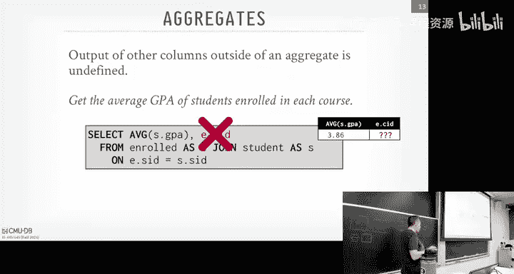

Well， this is the the course I here is meaningless。 If you don't care what the actual value is。

 SQL now allows you to put this any value in here。 But without that。

 this is technically going to be an error。RightBecause again， it doesn't know what course I you want。

And we can just pop open。The different database systems and see what happens。So。

 so I'm gonna have on， on a machine running back my office。 I have Postgres， My SQL， SQL light。

duct D B， SQL server， Oracle and Clickhouse， all running。 And again， these are all。

 which you would call relational database systems that all support SQL。😊。

If we take that  query we had showed before。啊。And we run it run it in Postgres， right。

 Postgres is gonna to complain because， again， I have that course I D in in， in the。In the， the。

 the projection clause， the output， and it doesn't like。

 It doesn'tcause it doesn't know how to compute the aggregate on。

 It doesn't know what youre gonna to give you。 But if I add that any value on it。嗯。K operator。

 then I， it'll produce some result， right。 But again， what did that mean to have。15，4，4，5 in there。

Like across all the the， the， the average GP across all all the courses， that's sort of meaningless。

So if I can go now to my SQL。Right， do the same thing。My s gives me an answer。

A without the any value？Is that correct？ my uncle seems to think so。啱。But so in my SQL。

 My SQL is going to be one of the biggest offenders of like doing weird stuff or incorrect things。

 And so they have different SQL modes。So if I say want follow the the ansi standard， right。

 then it'll actually throw by an air， throw an air。

 or I can tell it I want to be strict to follow the， the sQL spec。And I can't be spit。 it it's easy。

 I think that's one you want。Right， the basically saying， follow the SQL spec。

 and then it'll throw the same line of errors that Postgres does。We can go to SQL light。

Who thinks SQL Light is going to do it？He says， yes。Gives an answer。Go toduct D B。Dr。

 B throw is the same error the Postgre does。And， and D B is actually super helpful。 Dr B says， hey。

 if you wan to do this， add any value， that's great output。 I like that。 Let's go to Oracle。😊。

Oracle doesn't like that。 SQL command not properly ended。 That doesn't help。

And that's because Oracle doesn't like as。Right， what does as do as is basically an alias。

 So I'm saying enrolled， but treat it as the name as as a the table， what tables name E。

 But if I get rid of that as。Right， then it allows to work。 again， the other student， the other as。

Right， then it complains about the。The aggregation。So， let's go now to。Clickhouse or SQL server。

Secret server complaints。 That's correct。And then the clickhouse， clickhouse also compliance。 right。

 So a pretty basic thing。 And they're all producing pretty different results。

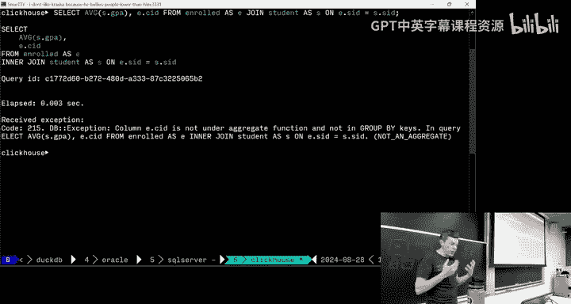

But it'll get worse。All right so。For this query， what we really want is this group I clause because what we want is what is the average GPA per course based on the course ID。

 so we add this group I clause down here， then we can say group them by the course ID。

 now I can reference the course ID in my select output and then now I'll get the result that I want。

😡，RightSo basically， what is it doing， It's scanning along our table of all， all the the grades。

 and it's just gonna bucket them up based on the course Id。 And then for each of those， it's then。

 then going to compute the average and produce the output。Right。So group I。

 you can actually have multiple columns， right， you can do multi meal aggregations。😊。

But basically anything that's not going to be anything that's going to be aggregated or sorry it produced in the output has to be in the group by clauses。

 Otherwise you have to add any value， right。So this won't work because I'm grouping by on Cose ID。

 but I'm also now trying to reference name， it doesn't like that。

So I'd have to put the name down at the bottom。Right。

You can also now do additional filtering on your on your aggregations through the having clause。

 It's like a where clause for group I。 So say I want to say I want to get all the all the students enrolled in the class and I only care about the classes where the average GP is greater than 3。

9。 I can can't reference my output up here where take the average A list to average GP。

 I can't reference it down here to addition additional filtering right because when the data is actually running this。

 it doesn't know what average GP is， when it's evaluating twos because that's think of like the aggregation is is computed later in the query plan。

 so it doesn't know how to filter twoples at this point。😊，Right， so you can't do this。

 All you do is just adding a having clause。But this doesn't always work either because some systems won't let you even reference the alias output in the projection output in the having clause。

 like My SQL will allow this Postgres will not allow this， which you really need to do。

 which I don't care for， but you basically have to say。

 here's the computation I really want and then do the filtering based on that。😡，And again， in theory。

 the data system should be smart enough to say， okay。

 the average GP you' computing down here is the same as average GP up above。

 I don't need to compute that multiple times。Right。And sake good time we can skip that。Again， it's。

 it's， it's， it's different idioms for the different data systems。

 And you basically it'll be thinking of this as like without the having clause。

 They get this kind this output。 and then the having clause would do a filter。

So aggregation is clear。It's a way to again to compute。

 it's a way to derive newde information from the data that you already have。😡。

If people say I I'm a data scientist or I'm a data analysis analyst。

 This is more or less what they're doing at a high level。 right， You're deriving new。

 new facts from the data you've already collected and allows you to get a better view of what's actually going on for larger trends。

😊，All， so of course SQL is going to have strings。😊。

Therell be basic operations of strings you can do like quality checks less than greater than there's much of the functions you can do to manipulate your strings or varchars as they're called so in the SQL standard。

 as defined in SQL92， the string cases are sensitive， meaning that the values of the string。

 we actually care about whether they're lowcase or uppercase。

 like capital A is not the same as lowcase A。And then the way we're going to reference or to wrap a constant string is through single quotation marks。

😡，But you can see from the list here， everybody does something slightly different Postgres is pretty good as following the standard。

 so that they're going be case sensitive and only allow for single quotes。

 my sequenceQels be case insensitive and allow for single double and you SQL light allows for both as well。

😊，So what does that mean。 So if say I want to check to see whether the。

 the name Tacac is equivalent to you know， mixed case Tacac， I can cache both of them to upper。

 then do my comparison。In the case of my SQL， it doesn't care。

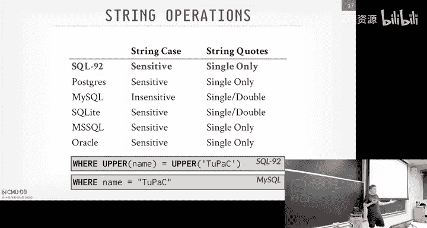

Right。Let's go back here。Right， so say in my Postco table。Right。

 select star from student where name equals2acac。That'll do an exact match， right。

 But if I change it to be。To pack like that。Right， doesn't match。That's expected， right。

 That sounds good。But if we go over to My SQL。It finds it， right。

Do even lowercase or whatever you want like that， right， because it ignores cases。And again。

 this is what their strict mode turned on。I can also use double quotes。Oh。correctly。

 So if I turn it back to。Traditional。By default。Yeah， it'll handle that。But you put， again， you put。

 you put it in the strict an mode complaints。 So with the double quotes。

Baically saying it's a way to escape the names or columns。I don't recommend this if。

 if your column has a space in it， you can use double quotes then to then reference it。嗯。

And then let's go over to SQL light。RightIt is K sensitive。But I can still do double quotes。P。

Oh that's new， can't do that anymore either， all right。Hey， every year I upgrade。Fantastic， good job。

 Richard。 Okay， Sequel light is a phenomenal system。

 The Sel light is written by one dude down in North Carolina， right， He puts in the public domain。

 There is a Sequel like company， but he put everything in his wife's name。

 Like his whole all company is is owned by his wife。 Hes， he's brilliant。 and he's super duper nice。

😊，Okay。

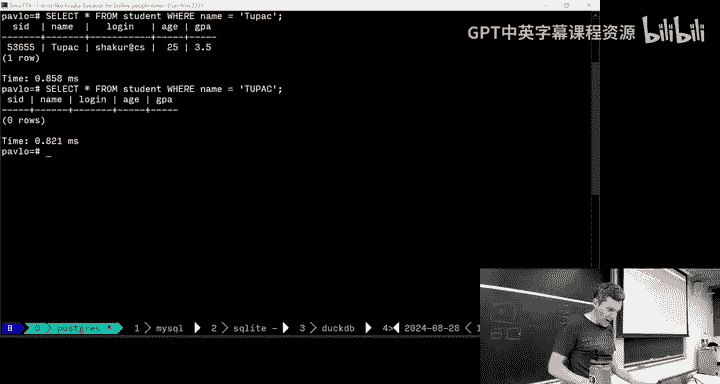

So for string operators or do matching- she has questions， for whatever reason in SQL。

 they're going to use the percent sign to match any sub stringing including empty strings。

 and then the underscore is going to be matching one character， yes。When I' using these databases。

 then would you recommending lines？Yeah his question is， if you're using my SQL turn to anti mode。

 yes。Yes， as far as I know。As far as I know in My SQL is the only one where you can change that SQL mode just because theyre they're trying to write the。

The the wrong cause they've done in the past， which is good。

 right in enterprise systems like an Oracle， I don't know where you can do this in SQL server。

 but you can actually specify what version of the SQL you want from system。

 So say you're running on Oracle 22， you can tell it， I'm gonna give you Oracle 11 queries。

 So the idea is you can still upgrade your system get newer versions of Oracle。

 but then still not not three applications as their SQL spec changes。😊。

And then Postgres is updates every year。😊，Right， so as I said before。

 there's also be a bunch of string functions to do anything you can imagine。 again。

 think of like string functions in Python to lower uppercase， lowercase， sub string。

 replacing strings， all those things。😊，All， all that is available。

You can cat concateating strings should be like a simple thing。 But this is where， again。

 where everyone does something different。 The SQL spec says you would use the。

 the double bars like an or。 That's how you can catnate strings in SQL server， use the plus。

Right likecateing strings and Python， and then in my seat。This again， they don't。

 They don't support either of these。 You have to use a explicit cat function。Why is this way that。

 you know， somebody decided to do that way long ago and I。We have to live it。All right， strings are。

 pretty straightforward， pretty easy to understand。

 other than again when the concatenation stuff comes along。But， let's now。Let's let's。

 let's see how the problems we get when you do dates and times should be a pretty simple thing to do。

 right， It seems that kind of important。 databases want to keep track of dates and times of things。

 You know， you would think the SQL spanner says how to do it。

 but everybody is gonna to do something wildly different。So let's try to do something really simple。

Let's just try to count the number of days from today。

 which is August 28th to the beginning of the year。Right。Seems like a pretty simple thing。Let's see。

 Let's see what happens。

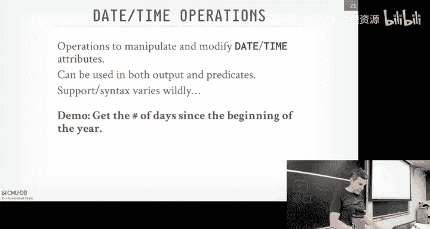

So let's start with Postgress。So the first thing you say， how do we get what today is， right。

So the SQL standard specifies a now function。Right that I can get back a date and time。Al。

 so let's now see if everybody has that。 So if I go to My SQqL。They have it。 make sure I'm in。

Anti mode。Right， they have now。Scle light。Does not have now。Oracle。Does not have now。

This is SQL server from Microsoft。Does not have it or has something。M。ちい。喂喂喂。😊，Oh oh。Alright。

 we'll come back to that。And then clickhouse has it。 Okay， well， let's go back to my who is。

 who didn't have it。OrductD B， D B should have it， too， I think。Doesn't have it。Okay。

 so the another way I get time is the the current time is through the keyword or through this thing called current timetamp。

Right。Except in Postgres， it's not a function， it's a keyword。Right。So， let's go now to。う。

Make sure I'm doing the right one。My sea。They have the function。They have the keyboard。See the light。

Doesn't have the function。Has the keyword？TuckDb。Im sorry， this is Oracle，ductDB。

Doesn't have the function， has the keyword。Orracle。

Doesn't have the function or gives a different error dateate time， interval precision at a range。

 We'll come back to that one。Let's try it with the keyword。Now to get something else， another error。

 yes， sorry。His question， oh， I don't know if bring time zones。 His question is。

 what time zone are they using。Of the same。Yeah， so。

There is a date time type and then a date time with time zone type。So you can say， again， Posts。

 you can say， I want to store date time， and I'm explicitly going to tell you what the time zone is。

😡，Do that。 Always do that。Or you can say whatever the default is， like on the system。

That's what's happening here。All right， so Oracle has given me two errors， right。

 It doesn't have select current time stamp with the。With the function。

 and then I got another error where it doesn't like the keyword because it's missing a from clause。😡。

So I think this is fixed in Oracle 24。 I think I'm running Oracle 21，22。

Oracle does not let you run queries without from clauses。 So like going back to Postgres。

 I can do select plus1 plus  one like that。 And it's like I calculate。 I get in an answer I want。

 And I can do this in all the other systems In Oracle。

 you can't run a query without a from clause without a table。

 So they give you this thing called the dual。😊，And it's like this built in magic table that has nothing in it so that you can write。

Querries against nothing， right， So if I do select star。From dualul。Right， I get some X thing back。

 right， I don'， I don't know what that is。So it's basically， it's a way to like， to。

 to have one tuple to do a query without， without a from clause。So， again。

 so now I can go select current timestamp from Do， and I get my result。

 But if I try the function now。Right？I get this datetime interval precision at a range。

 but what's that？😡，Well， when I asked ChaBT， it says， oh， you actually can specify the precision。

Of the time stamp that you want。Right， so just give me a precision by1，1 decimal place。 Okay。

 that's cool。 I didn't know you could do that。 Let's go back to Postgres and try that， because。😊。

They don't have the function。Who had the function My SqL did， right。Can I put one there？

Let me do it because they try to copy what Oracle does。What can I do like this。Again。Right。

 so I couldn't do the function without the。Without argument， if I add a one there。

 then I get my result， But everyone's doing something different。So keep going。

 This one had the function。 right， I know， this didn't like the function。 If I had one。

 then it doesn't let me do it。 That's duck D B。SQL server Live， nope， all right。I。

 the only thing to the knock Se server is a very good system。

 Don't I don't want to give the wrong impression。So clickhouse， Clickhouse has it the function。

Does not have the keyword。And it has the function。 does not have the function with the arguments。

 Right， Okay， so this just getting the time stamp。 getting the current day was was a big ordeal across all these different systems。

 We're still trying to get the number of days since the beginning of the year。So in Postgres。

 they have a way to get out the day of year。Am。So， so there's the thing called extract functions。

 So I can give give it a date。 So here， here I'm taking the string today's date。I'm。

 I'm casting it to it to casting the string date of a date into a date。

 And this extract function says， give me out some part of this date。 So I can get out， for example。

 like the day。 and I'll get todays the 208。 so it gets out the date。😊。

But I can also get out the day of the year。Right， and again 2，41。

Which is not exactly what you want because。It's county January 1。

 we're trying to count from the number days since January 1st。So what you can do is。

Just cast the beginning of the current date。And the beginning of the year has dates and dis subtract them。

And you get 2，40。That's correctrrect， right？So here's an80M post that I do like with the even Richard systems。

 this cast function calling this date function could be that cumbersome。

 they have this nice syntax where you can put a colon in after anything。

 and then it'll cast it for you。Only Postgs can do this。 And D DV do it can do it。

 D D V does it because they took Postgre as grammar。 right， So then I I do that and get。

 get the right result。Alright， so let's try to do this now in。In my SQL。I get this。What is that？

So for several years， I've do this demo and I would say I have no idea what the number is one year somebody in the YouTube comments says like。

 hey， this is what it is。😡，The first number seven is the current month subtracted by January 1。

 so 8 minus-1 is 7。And then it's 281 28 minus-1 is 27。RightSo that's weird。U。Turns out。

 so the first way I figured I tried doing this and you get ask chat if you do it now。

 but you can convert current the dates to Uni timestamps。

 So that's the number of seconds since the Uni epoch， January 1，1970。

 and then you subtract them multiple by 60 minutes by60 seconds and 60 minutes in 24 hours。

 and you get 2 40。There's an easier way to do this。 There's a date di function in SQL server。

 or sorry， in in My SQL just to get that。If you tried in Postgress， Po doesn't have it。

 We'll come back to SQL light。This doesn't have a date di。 So what what are we in。 This is D D B。

 So duck D B， I should be able to do the same thing I could do in Postgres。

I can cast it and subtract it。 That's cool。If I hop over to Oracle。Right， again， I I I。

Well complains。doesnn't have this this。Does doesnn't know how to cast the string to a date。 Well。

 it turns out you have to specify the format that you want， right， So I have four year digits。

 five two months for two days。 then I get the answer that way。Ttt did that one for me。SieL server is。

Lets see if it comes back。 Yeahep， we might be back。So SQL server。😊。

The way you cast is through this explicit cast function。Right。That looks cool to we get that。

The also have a way that you can call convert。But， again。Pr guy says'， nobody else can do it。

 That's a seas sort thing。嗯。So they actually have the date di function。Right， but you get negative。

 So we got to do the。I gonna put the what the current year。 Sorry， I' gonna put the first day first。

The beginning of the year first， and then subtract it。你就看。So。

 you're getting the impression that like。As great E SQL is， this is kind of annoying。

And then clickhouse。Week。Right， we get today， which is just it's an a as we're now subtracted by casting the string through two date to a date。

 then we get 2，40。So again， something to be really simple。

 Everybodys doing something wildly different。And even the semantics and cases of these calculations are different in other cases。

InQuestion， so you My SQL one the one using unique times step in which step is the converted to date。

I mean， shouldn't it be like seconds or milliseconds。His question is， is this。

 is this Uni timestamp function， What is that actually converting it to， I think it's seconds。

Let's find out。I guess we have where we know， right？Y。That looks like seconds。Right。

 and it's integer。 So it's not milliseconds。 So you。

 there might be a way to get the Uni times and milliseconds。 I don't know。Yeah。

 this feels like quite you by the way too。This shows what， No sorry。He said， said this。

 the way I'm doing this in first convert to。That this。

 this be the right way to do this across all different systems。 Well， let's find out。

RightBecause they don't have。Doess it listen here。I mean maybe it doesn't like round。 It's missing。

 let's give to the round。 Then that that might be F foul up。Yeah， to's point。

 like this seems like something that should work everywhere。Right。missinging up。Anyway。啊。But let's。

 let's so let's see how we do this in SQL light。So Sel light did not have a。Doesn't have。

 I don't think it had the Uni timetamp function or I couldn't get the work right。

 So the way I came out with it。 And then if you asked Cha B T， Cha B T came out with the same thing。

You actually want to convert the， the timestamps into。The Julian calendar。

You know what the Julian calendar is。 It's the number of day since Julialius Caesar's birthday。

 right， You laugh。 but hold up， this is how a lot of the banks in the 60s。

70s and 80s calculated interest。😊，RightBecause I think there's always 30 days in a month in the Julia calendar It it's always a fixed number where the gogo calendar it varies per month。

 So they have would compute interest based on the ju calendar。

 This is actually one of the things that Postgres going back to Postgres being extensible as I said。

 Stonebri was the guy that sort built Postgres But he built the first system Ingress and when they went to go So Ngress to the banks they were like great。

 you have date types， we need that to compute interest But but it was all the go calendar and the banks are like where's the Julia calendar and they're like we don't have that。

 So they had to go back and modify the ingress source code to add support for the Julia calendar as explicit type and Postgres sorry to go back modify ingress source code in Postgres。

 they had these user to find types。 So now if you implement according to their API in see you canload in your own custom types and then specify what the operator should be like plus minus and so forth and division based on that type。

😊，Right，And that user defined types are widely used in， in systems today。 So the Julian calendar is。

 you know， is' important。 It was super important to banks， maybe less so today。Right。

 so if you got to see a light， we can take the current timestamp and get again。

 the number of days since since Caesar's birthday and you get back the number you want。😊。

And then you just cast it to。To an integer to make it round。When I asked Cha to B T。

 it gave me syntax I've never I've never seen before where I can go say， Giillian Day。

 But rather giving a timetamp， I give it the string now。Right。

 and then I can then also convert a date from now。Based on the start of the year to get the beginning。

And it computes the same result。Again， I， I don't gonna ha this too much。 But like。

 this is a pretty basic thing， but everyone's wildly different。Okay。

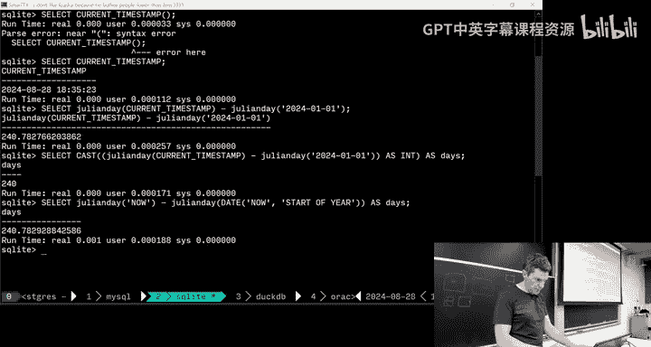

嗯。Alright， so we only have half an hour left。 So I'm gonna skip output direction redirection because you don't need this for for the homework。

 but basically you don't always have to have the output of a query come back to you the client。

 the thing that invoke the query， like either through the terminal I'm showing here or your application code。

 you can actually have the data system right into another table So the into clause you can say。

 take whatever the output of the select query is and put into this table here in my SQL。

 you can actually create the table and have it be populated with whatever the scheme is。

 So it infers through the select query since it's declared。

 it knows what the types of the data you're accessing。

 It knows how to populate or set up that table on the other side。😊，Posgres。

 you can actually create temporary tables like this by adding this into clause right before the from。

嗯。I' skip all this。 Basically， you can do distincts， order buys， which should be pretty obvious。

By column names， multiple ones。 And then I， I can get。

 you do limits or get the first number of records you want， you know， and do jumps in offset。

 They receive see like pagination and web pages， like， you know， search results shows the first 10。

 You click next， shows the next 10。 They're doing it through techniques like this。😊。

And then you can handle ties and other things。Okay。So let's get now to the good stuff。

 window functions。So。I don't I forget when window functions are added。

 they're probably in the last 20 years or so， but it's like an aggregation where instead of an aggregation where it collapses all your tuples down to a single scalar value。

 the idea of a window functions is that you can compute an aggregation in a rolling manner still retain the output of the tus that you're scanning in your  query result。

 but then you can update that aggregate result as you go along。

 like you want to compute like ranking of records or a moving average or running total even a row number。

You could use a window function。 So the way to think about it is like the。

 the function name for the window function will be like an aggregation or a like rank a row number of that specific to window functions。

 And then you can specify how you want to slice up the data or group it or even sort it to produce the result。

😊，You can think of the over clauses as like a group eye。

And this is super common when you're doing time series analysis when you want to like keep moving average of a stock price or something like that。

So you can do all the aggregation functions that we talked about before。

 mid Max average in some account。But then the special ones are going to be row number and rank。 Now。

 row number is a weird one because as I said。SQs based on bags。 There isn't an order， but obviously。

 sometimes you want an order， or you want to know the position of a record of a tuple in your output and row number will give you that。

Rannk is similar， but it's like the ordering， it's the position within the sort order。😡。

So in this case here， I can do a select star from the roll table where I'm going to get all the values or all the attributes for each record。

 but then I'm going have this window function that says。

 what's the row number and where does it appear？😊，And you would get output like this where they have this column at the end that gives you the row number。

 just  one，2，3，45。So this over clauseuse is going to specify how we want to group these twos together。

😡，And instead of calling it group buy， they call it partition buy。

 but the idea is basically the same。So now here I can say give me all the records in the role table。

 and I want the course ID and the student ID， but I want to partition them by the course ID。

 and I want their row number so the idea is like what position are you in each course？

And you would get a result like this and now you can see the row number will basically reset every time it switches into a new partition or new bucket。

😊，You can put order by clauses in in the over over output， right， And this is basically like it's。

It's way to sort the results， then compute the the， the window function you want over the。

 over the sort of data。So to example like this， we want to find the student with the second highest grade for each course。

You couldn't do this without a window function because you don't know what it means。

 Theres there's no notion of like what my position is in the course and how to get the second one。

 because there is no like， there's no concept of a row number within an output。😡，I'll get the output。

 you know， if I just do an order by calls， I can get back to my client。

 to my terminal things in an order， but within the SQL itself。

 I have no way to say I'm the second one and the third one and the fourth one。😡。

Unless you do a window function。So this in the over clauses here。

 we're going to group by the course ID， then we're going to sort by grade。

 and then now we're going to have our rank position's going to be in where we where does the record exist in that。

Within that partition or group。And then now， since ranking is going to give us our position。

 now we can reference it in the where clauses of the outer query。

 these are nestqueries that we'll see that in a few more slides， but in this outer query here。

 I can reference the rank that I computed to give me the second entry。😡。

The offset of the rank is to start at one， yes。rryBut the keyword to ascending？From low to high。

His question is， the keyword ascending here， is that load high， yes ranking？A。So if you're going by。

😊，It should be descending yes。Yes， you should be descending grade。

 actually figure whether it's A or B。I， the grades might be ABC here。 Yeah。

 so that that be why that's the case。But yes， ascending or descendendinging would change the order of that。

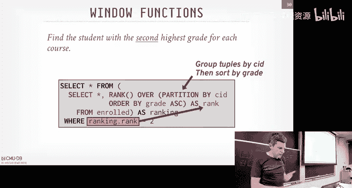

Let's check。 I'm pretty sure it was。ABC。So we'll do this in Postgres to start with。Again，'ca its。

 it's always the right way to， it's always the best thing to start with。

So let's see the grades in aroll。Right， they're letter grades。Alright， so I put my。

I put my my query in here。 And again， so I'm going to get the in the inner query here。

 I'm going to get the。The select star， get all the records and then compute the rank of them within the course order。

 So if I maybe if I do this， I'll remove the outer query。 So I won't sort by。嗯。

I won't sort by the or I won't filter by the ranking。 And I'll run the query。 So here's the。

 here's the the。Yep。Like that。 So here this， this is the raw apple without that filtering。

 So I'm gonna， I'm grouping by the course Id。the partition by and then then they're sort by their grades and their rank is gonna to be their position in the grade。

 And you see in this case here， two people got A's and 7，21。 So they both had the rank of one。

 And then the next， the next record starts at  three， set of 2。There is no two in this case here。So。

 let's try that in。All our different database systems。 see what happens。This is so in。

In the early days of this course， when I give this demo。A lot of these didn't support it。

 so this doesn't have it。Y， my secret doesn't like it。SQL light should do it。Yep， See they can do it。

DoD should do it yep。Orracle。Probably not。No。嗯。Oh， because the ass。

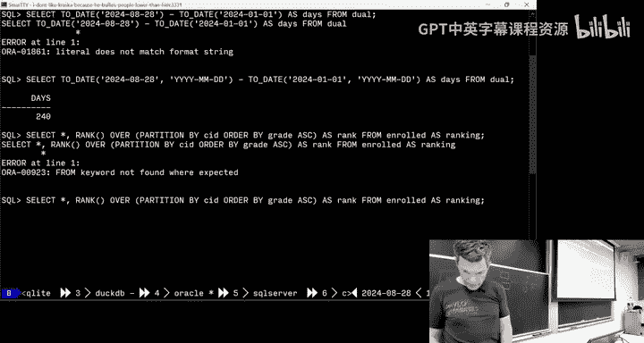

Another has yep。Still doesn't like it。All right， SequL server should do it。

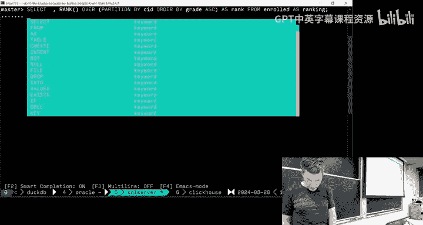

Yep， and then click how to do it。Yep， click Is going to do it good so。All of them。

 but my My SQL can do this。And welcome。

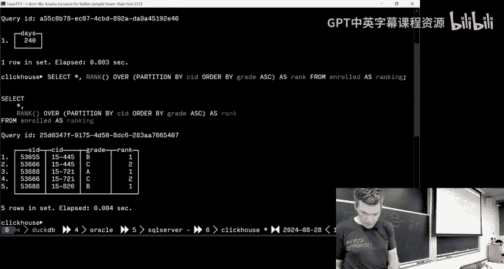

All right。So this example here was a anesA query so that you have this inner query here and the outer query。

😡，So nestA queries are another super important aspect of N SQL。

 and it's going to allow us to do really complicated things。

 And so a nestA query can basically appear anywhere inside of a select statement。😊。

So you can put it in the from clause， what we refer to is the call query。

 the outermost queries that considered the outer query。

 and then whatever's inside of that would be called the inner query， but again。

 an inner query can have its own innerqueries that you can nest these things arbitrarily deep。😊。

But you can put it in in the select output， you can put it be in the from calls。

 as if it's like a temp table， you're referencing， you can even do weird stuff。

 like put it in the auto by clauses。RightThis is meaningless， right。

 This is like getting the max student I as a number。 And then you're sorting things by that number。

 right you can do sort by one plus one。 It doesn't mean anything because they all。

 they all gonna have the same value， right。But again， you can， you can put it anywhere。

 And we'll see later on when we talk about query optimization that this is nested queries。

 especially correlated nest queries are gonna be the thing that that breaks chokes most database systems because the dumbest way to execute these queries is just for every single tu in the outer query。

 outer query rerun the inner query。😊，Right， and what you really want to do is rewrite it to be a join。

 If I， if I look at I'm doing here， like I say this one here。

 So I'm doing for every single student in the roll table。

 I'm doing another  query to go get their name。 Well。

 I could just rewrite that to be a join on the roll table in the student table。

 And then I could do joins efficiently。 and that'll run fast。

 The dumbest thing to do would be for every single tuple in the enroll table。

 rerun this this thing one by one。😊，My Seco used to do that。嗯。

And there's some cases where the different data systems。

We'll end up doing that too because they can't reason about what the  query action wants to do with nest queries and ends up falling back to the slowest thing。

Yes。C we optimization standpoint， is this faster than doing a temptable with a keyword width than selecting from that temp table？

Her question is， is doing a nest query this being as fast as using a temp table with being a CTE。

 We'll get that a few more slides。 Is this going be faster than a CTE。And。I don't know。

 it depends on what the query plan is。At this point here。

 we're just trying to define the SQL to produce the answer that we want。The。

 how good the query plan is gonna be left up to the， the， the optimizer in the data system。

 So what I was saying is like。The for not。For any arbitrary sub queryry ornessA query。

 most database systems cannot handle them correctly。 There's only two systems can。Umbra。

 which is now commercialized as C or D B from the Germans。 And then D D B。

 But the D D B copied what the Germans did， right， I don't mean that disparagingly like they it's all in the papers。

 They did it， right， And actually， D D B couldn't do everything。

 Then our students send them patches to handle lateral joints correctly。 Vanessa queries。

 like So D D B is probably the best open source one that can do handle us now。

 And it's always going try to rewrite it as a CT TE。 or sorry as a join。With Cs。

 you're also going try to rewr them as joins as well。But for today， we don't care。We don't know。

Alright， so let's try to get the names of the students in 154，45。 Again。

 this is gonna be stupid because like you just rerite this join that the query。 Yeah， yes。😊。

Where youこれ。This one。Were you point into the different。I don't know what the。嗯。

Partition you put the functionQOh the terminal terminal like it was different。For the ones that。Why？

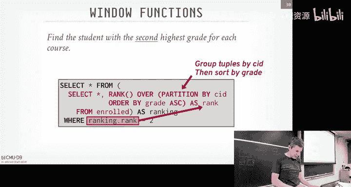

Alright， so the statement is when we ran this one query， we were getting different answers。

 So let's double check that so。It like that one has like  six lines。 and it has like a three in it。

 And then I think another one， like， another one has like  five。 and it only had ones and twos。Yeah。

Let's make sure we have all the right data。 So select star from。So with that，1，2，3，4，5。He。

 I may have an extra tuple from an earlier demo。哦，对。Like Taylor Swif money taking a class。嗯。Yeah。

 I have an extraubable。Yeah， theres。I can show demo next time， there's。With nest queryries。

 you can get weird evaluation orders of things like the。

 if you have a nest query that references like an aggregation。

 When does it compute the aggregation before they get the tus get processed or not， Like I。

 I'll show demo next time。 Like you can get wrong with different answers。Let me come back to that。

 I think of one we show。There's definitely rounding issues as well， we can see those。Yeah。

 so let me come back to that and I'll show other examples。

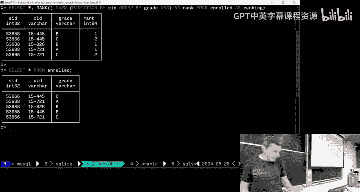

Okay。

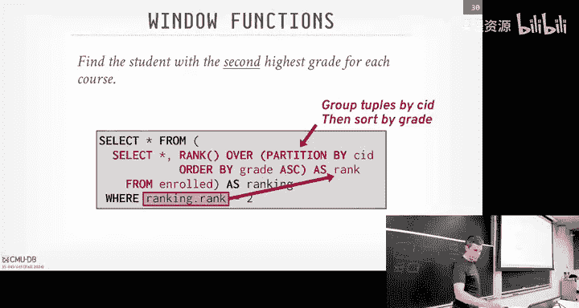

嗯。Thank you。 sorry。

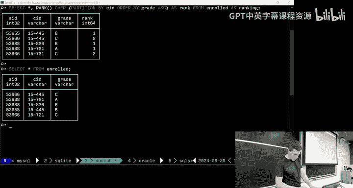

これ。So。Right， we covered this。 covered this。 nest queries。So again， this example was kind of stupid。

 Like we're trying to get the the the name of students that are that are taking 1545。

 We could rewrite this as a join， But say for simplicity， we're gonna write this as as a nestA query。

 And then we could use this in clause。 that basically say that's in operator says give me and match any people from the outer from the outer query from the student table if it exists in the enroll table for the。

😊，You know， for the you know， for 154，45，4，45。 And so what's happening here is that now the scope of this。

 of the student I， the S ID field or attribute。It's going depend where we are in the nesting of of the query。

 So in this inner query here， the student I D is gonna be from the roll table。

 And then in the outer outer query， the student I is obviously from the。诶。From the adder table， yes。

Speaking of the efficiency， is that same as。As question， is it the same as join？Let's find out。

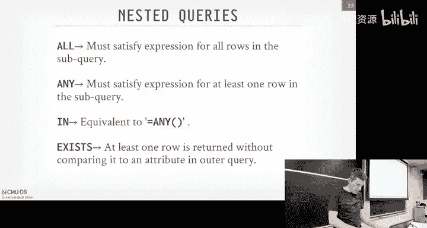

So in SQL， you can actually ask the data server to give you the query plan。

So let's see what query was this？It was the in clause， right。So here's Postgress。Right。

 I can do equals any or batch's equivalent basically to n。 So let's do n。Right。

 and produce some input。 So if I put the， the keyword explain in front of a SQL query in Postgress。

 you get back the query plan。RightSo this， these are basically almost like the relation operators we talked about before。

 This is how the data system is gonna execute this query。

 So it tells you sort of visualize this as a tree。 It's going to do a sequential scan on the student table。

 a sequentialial scan on the on the enroll table。 And here's the filter looking for 15，4，45。

 And then it's going do a nest loop join。😊，To compute the result。

 think of that as like a two four loops for every tuple on the student table。

Check to see whether there is a match in the。In the the enroll table。

So we can see what other data systems do for this as well。 So go to My SQqL。Right。

And you get something like this。 That's not really useful， right， And it has a warning。

So let's see what that warning is。Complains about something。

It looks like it told me that if he wrote it as a joint。So to get the full plan。

You got to do explain format equals。Ci。Yeah， there we go。嗯。So in this here， it is here。

 It tells it is doing nest of for the bit of before。

 But actually now it's going to do a index lookup on the primary key on on student Id。

 So for every single tuple in theroll table， it's then going to probe the student table on its index to get a result。

 So it's a nest nested index。😊，Nested index or index nested loop join。So let's go to SL light。😊。

do the same thing。Right for certain SQL， I can actually run this query。Yeah。Sorry。😔。

These different terminals， like sometimes like， like， you can move faster with with the control keys。

 sometimes you can't。So SQel I execute it。嗯。I can't put。Put explain。I get this。What's this？Right。

 so way SQL light is actually implemented is they convert the query plan into their own op codes。

you know like the JVM， right， and they have basically a virtual machine inside of the database system that then interprets their own programs。

It's genius， right？It's now he didn't amvent this idea， right Actually， IBM。

 will' say this about through the entire semester。 A lot of things that seemed new。

 IBM did in system R in the 1970s。 IBM used to take your query plan and convert it into assembly And then they would run instead of like interpreting the tree and walking the tree。

 They just run that that assembly code。 So figure like it would generate a code that hard code for your query。

 and it run that super efficiently。 So SQL light is basically doing the same thing。

 And this allows him， when I say him， Richard。 allows the SQL light guy to ensure that like。😊。

No matter what weird hardware SQLite is running on because it runs almost everything。

 right It runs on all the airplanes， It runs on satellites and space if on everyone's phone。

 that like all I need to do is change the the make sure that the VM works。

And that no matter whatqueer program he gets， it can run anywhere。

So if you need to get the full plan， I think we got to go explain。Query plan。Yeah。

 let me get the tree， right。I don't know how to do this in Oracle。 We could ask toBT。But in。

 in inductee B。Ill explain， and it'll actually give me a nice。Every year you guys go， oh， amazing。

 right， it's just Uniiccode， right，'s not。It's not not that it's not mind blowing。Orracle。

 I don't think you can do this。Yeah， I we have to ask Hput。And then this is Clickhouse。Right。

The merge tree。This is， again， a good example of the the， the data independence。

Trees can be organized in different data structures。 So this is tell me I'm reading from one the。

 the merge tree data structure for my table representation。 But no matter what the SQL is。

 it it's I don't have to regret the Sel。 if I change change the syntax。 And then for SQL server。

 I don't think it's gonna to work either。Yeah。So here， let's go ask ChaBT。

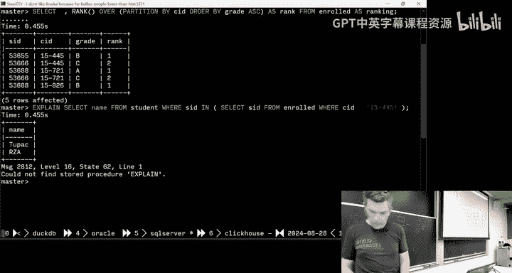

I mean， this， this is the way the world， right， Why wouldn't you do this。How do I ruin。喂。

 what's that。哎对。Hey what。Oh good nice search， look。All， all right， explain plan。Oh I hate this。 Yeah。

 I remember this。Yeah， so if I call explainplain plan。😡。

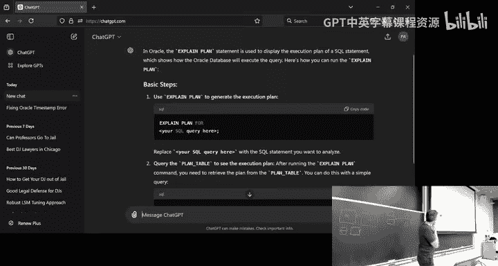

It's going to。

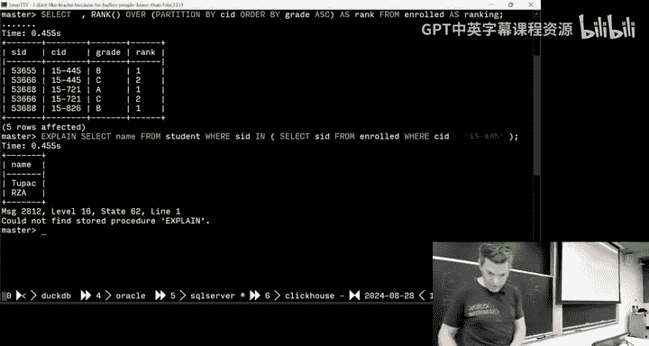

This is super annoying。 So in all the other servers， I call explainplain plan。

And it would give me the output。Was it four？Right， explained。So then。いep。

So then I got to go back and I go to select star。From plane。Plan table。Yeah， so it's， it's in there。

 Trust me， right。はい啊。I forgot what was the point。Whats the question。Oh yeah。

 it's going to getwritten as a join， yes。Yes， if they do it correctly， not always。Allright， so again。

 these are different ways to access tuples in nestA queries。

 so you can say match all where I don't care all the tuups have to satisfy satisfy my sub queryry。

 any means at least one n is equivalent to equals any like I can do like equals this less than that any and exists just saying give me back any tu。

 I don't care what it actually is。😊，So。If now we to get the names of the students in 1545。

 I could do in， I could do equals n， and it's all equivalent。

So let's now do something more complicated。 Let's try to say find the student record with the highest ID that is enrolled in at least one course。

 Again， you wouldn't be able to do this easily in just regular see without nest queries because。You。

 you need to know that something at least exists in in another set of set of tus， right。

 So this query won't work in sq  I2 with strict mode because I can't reference。

I can't have this aggregate here and reference name without doing a group by if I now have I do a group by own name。

 that would be sort of meaningless It doesn't gonna be what I want so the way to sort of write these necessary queries is you sort of conceptually how I do it is you start with sort of the outer thing of what I want。

 Like I want the student I and the name for the student table。

 and then I have some where clause that says that's I just writing English what I actually want the answer to be。

 So I want to know that the student is enrolled and has the highest student Id。

And then now I could write what that inner query is going to be。

 and then now you just need to figure out how do I match the record from the outer table from what the inner table is going to compute for me。

😡，Right， so in this case here， I'm sorry。it's missing B equals any here。 But again。

 it's just a way to to take two of of the output for the outer table without outer query and match it to things on the inner query。

Its sake of time to skip this， but this is basically like。You know， doing further examples of this。

 I want to get to lateral joints， because you need that for the。Did do this for the homeworkbar。

When you have nest queries。The inner query can reference the outer query tuups。

 but the outer query can reference the inner query tuupples。

Because it's running on the inside until it's materialized the outside。

 you can't do anything with it。 And if I have now multiple nest queries。

 I can't have them sort of look into each other and to figure out what what they actually have。

 I just have have this sort of strict tree tree nesting。

So where later joins come in is allow me to have one query。

 reference data or twos or attributes from the previous nest queries that appear before it in my query plan。

😡，So say a really simple example here。 So I just want to have a， I have a nest query。

 select one as x。 So just it's a single tableple with one attribute with value 1 and some temp table T 1。

😊，And then now I want to just add one to it in a next nestA query。

 So I've added this lateral keyword now in my inner query here。

 I can reference things that were computed from the queries that been appeared before。

And this seems kind of bizarre in the case of SQL， as we talked about。

 because you're not really supposed to have this ordering of how things should be executed。

But a lateral is imposing upon that， it allows us to say this thing has to be computed for this other thing can be computed。

And whether or not the data set that decides to run actually these in parallel。

 if they you write them or executes them the serial order， it doesn't matter。

 it's just from the computation of the answer that we want， we know it has to be done in that order。

😡，So。Open up， let's open up Postres again and see what it looks like。

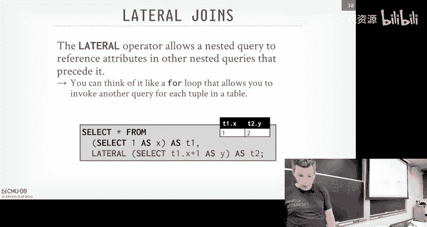

So。Right， so what am I doing here， So I have select one as x。Again。

 this is going make a synthetic table， a virtual table that has one tubple with one attribute x。

And then now I want to add one to it。In my， as part of my next output。

 So if I had this lateral keyword here。After the comma， I say lateral。

 and then I then specify what competition I want， but now I can reference T1。

 which is computed over here within this nestA query and get the answer that I want。😡。

If I remove that laterto keyword。RightIt's going to complain because I'm trying to reference T1 in this other query here。

 and it's not there。 And It nicely tells me I should be using lateral。

So I think I can do this in most of these systems。My SequQel can do it。Sel light can't do it。

Talk to me should be able to do it yep。我好。Nope。Oh， the as is， no， let's get that。嗯。In， in SQL server。

 they don't like it because they don't have the letteral keyword。 They have cross applied。

 which is basically the same thing。And then I get the answers I want。

But also what's sort of confusing is。I say as T1 then cross apply I then with my nest query。

 but I don't have a comma。When I define the lateral join in Postgres， there was a comma。

 And I think the SQel standard says there is a comma。So for whatever reason。

 SQL server does it differently。 I think SQL server came out with this first。

 and then the SQL standard deviated。From them。 But I might be wrong。And then Clickhouse can't do it。

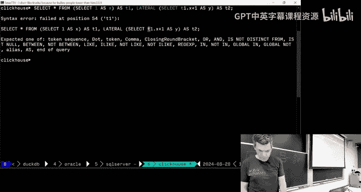

Okay。So let's see a more complicated example。Say now I want， I want to compute the。The。

 the number of students enrolled in each course and the average GP for them。

 And then I want to sort them by the enrollment count and the sending order。

 So I want to get all the the， all the students in each course get their average GP。

And then rank those， that listing by the， the。By the number of students that enrolled in that class。

 to the class has a lot of people that I'm ranked first or not。

So there's basically two subqueries we want， then for each course we want to compute the enrolled students。

 and then also for each course were want to compute the average GPA of the enrolled students from above。

😡，So you could write this as two laterals here in this first part where we can reference we're producing the output that we can then we're referencing up here in the CID。

 so the in queryry here is referencing what's coming out of the aqueries from the s calls here。😊。

And then the bottom query down here， it's now going to reference the same thing。

 but it also can reference anything that was computed in the one before。

And then we get our answer like this。It's think about a way to have four loops within within SQL that are executed in order。

 Yes。You don't need it， just showing how to do it。All right。

 so last thing is commontable expressions with the thing that she brought up， sometimes called CTEs。

And think of this as like a way to specify a temp table within your query whose scope is only within that query that's invoking it。

😡，That allow you to then reference it in other parts of the query。

So a really stupid example would be I could define a CTE where all that does is call a select1 produces a single tuple with no name with no column names just the value of 1。

 and then now down below it in this select clause here， I can reference my CTE。

As if it was a table and then get any result， I won't out of it。Yes， so for join。

The table from the subium and join them together。His question is for lateral joints。

 is it like creating the table？We like join。two support。Can I say。Id create a temper table from。

多いんですよ。So it' crazy statement is I think a later joins is like creating a temp table。

And then I can then reference it and do joins in other other parts of the query with later joins。

At a high level conceptual， yes。But the lateral join is specifying that this first part here has to get executed before this one does。

😡，At least conceptually to produce my result。But it could。 again。

 the decision could just rewrite it to be joins。But you don't know， you don't care。

They're doing the same thing。When you say it depends on again。Like。

I don't want to get too much of the weight of how these are in with this。 that comes later。 But like。

 does it produce the answer you want is what you really care about right now。

How iss actually going to be implemented underneath the covers， we'll cover later。G like I said。

 it's going to try to rewrite it as joins， but not it can't always do that。

And if you're curious and know what it is actually doing。

 you just call explain and see what it actually wants to do。Yes。

T tables are doing things that are really similar to nest  query。

 It's saving is T tables doing the same things are very similar to nest tables。 Yes。

 but a temp table will will persist for the session。

 So if if I open up the terminal and I call create temp table， I can put stuff in it。

 and then I can run multiple queries and still reference it。 And then when I close the session。

 it gets blown away。But like a CTE or a nestA query， it a lifetime is only for that query。

It see that 10 sampless make code also cleaner。 So why would we not just in。

Its statement is it seems like T tables make code actually clean。 or one does always use them。

why do you think it's cleaner？His statement is because it's I think you're interested saying， like。

 you define the。You define the query or the temp table outside of the thing you're trying to invoke on it。

It's like a helper function。It depends on what you want to do， right in some cases， if it。Sa is is。

 in some cases， it may be better to。You define that10 table。

 you're right and then have multiple careers invoke against it because you're not materializing over and over again。

 In other cases， it may be more efficient to put everything。

 tell the do something all at once what you want to do。

 and you can try to figure out the best plan for it。 It depends。All right， quickly， CTEs which is。

notar only concept， but we'll get through it quickly， but it's not that difficult。

 think' like a temp table again that you can reference within in the query。So。

You can bind an alias of things， so I can say the name of my CTE is CTE name。

 and then I can say the output of whatever is in my innerqueries here is going column1 and column 2。

 and I can reference that down below in Postgres， I think you can actually give them the exact same name and it'll still work。

😡，My SQel doesn't let you do this， but Postgres when I tried before， lets you do this。😊，Don't do it。

嗯。Right that's a postg online thing So if you go back to say find the student the highest ID that's enrolled in this one course。

 I could say for my CTE， get the max student ID from the enroll table and join against that。And then。

it's gonna to get me written as a join， but conception I can think of like it's like the NA query。

 Think about said it starting from the outer query and so this is the answer what I want。

 then figure out how to do the inner query。 starting with the inner query first。

 I want the max student ID from the roll table， and then I write the outer portion of it。

 It's just a different way of thinking about how to solve solve the problem。Okay。So let me finish up。

 If you talk about a lot of these different differences， there is， again， the SQL standard。

 you can go buy it。 It's a lot of money。If you're working at a company that's building a database。

 they will buy it for you， but。We'll take it offline。 There's ways to get if for free。Al right。

 so SQL is so important。 SQL is the most important programming language right， I think right now。

 And again， it's gonna be here。 was here before you're born。 It's be here after you die。

 This is a from a survey from 2023 from IE， basically saying， what's the most。

 what are people They ask programmers， What is the most important query language or sorry。

 programming language that they did know SQLs always at the top。 They always had that S S Jeeopardy。

 I think when to have the talent day。 And they poll the students， What's the most important， know。

 programming language。 And every year I say SQL and every year it doesn't rank。 Trust me。

 SQ is way more important to standard or Ocal Okay。😊，Yeah， I said that。

And then sort of what we saw today is a bunch of different tricks to try to do as much as the computation within a single single query。

 rather than having to go back and forth between the application code。

 the terminal and the data server。😡，Homework one is coming out today。

 you're going to have to implement the I think five SQL queries in both SQL light and ductDB the syntax will be mostly the same and what happened is you'll run the SQL light。

 youre run in the ductTB， one of them is going to be faster。😡，Let me， I guess which ones be faster？

DDB， why？Let take a guess？Nobody knows。 Great。 This is what this class will be about。

 So we'll come back starting on。But today's Wednesday on Wednesday next week。

 we'll start talking about what the internals by data looks like。

 And we'll understand why duck T B is will be so much faster than SQel light for those queries。 Yes。

 so I will allow to have only one version。😊，How we write different versions for？His question is。

 for SQL lightduct TB， do you get have the right， No。

 does not have the exact same because the syntax like we saw syntax is not to be the same。

 But what I'm saying is that the variation to go from SQL light toduct D B。

 like whether or not you start fromduct Db to go to SQL light or SQLlect toduct B。

 I recommend starting with D TB。Like it doesn't， you know， they're not going to be the same。ok。😊。

Any questions？All right， so next class， again we start with the internals of the Dave system。

 and we're knocked up by happened SQL ever again。

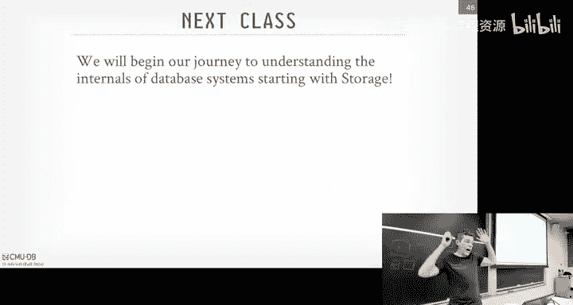

See money some refreshing when I can finish manifest to call a whole bowl like Piiff We then my hip thenicer summer some w rh I rotate way too quick to duplicateahren real tight when in flight night I heat the down。

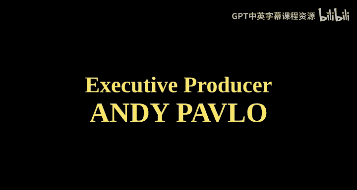

I heat up your brain， give it a sun to just cool let the temple to rise to cool it all with saying a。

