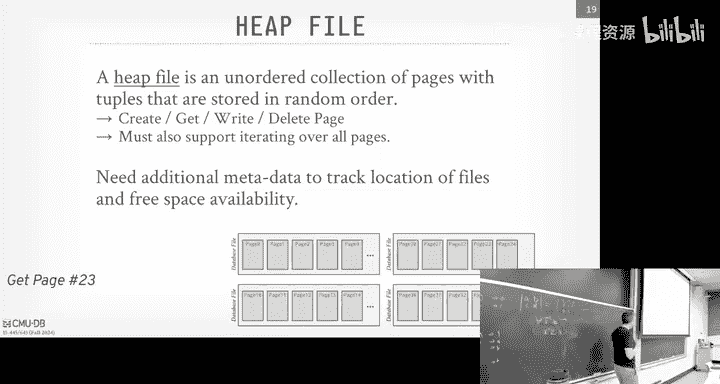
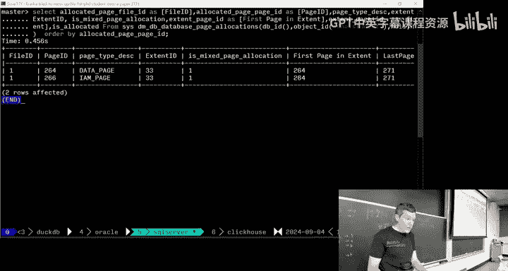
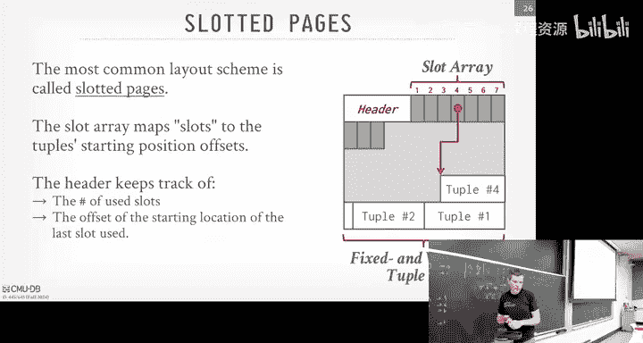
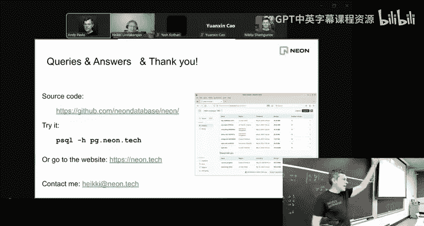

# CMU《数据库导论｜Intro to Database Systems (15-445645 - Fall 2024)》中英字幕（deepseek翻译 - P4：#03 - Database Storage_ Files & Pages ✸ Neon Database Talk.zh_en - GPT中英字幕课程资源 - BV1Tys8eQELW

Yeah。OfficAll right so as I said last class today and going forward rest of the semester。

 this is where we start talking about what the internals of the database system look like so today we're going to start at the very bottom with files on pages on disk before we get to that though。

 just go through what's due for you guys right now homework1 and project zero or do this Sunday at midnight I think about I think check this morning about 10 or 100 out of 130 people have completed Project zero if you haven't started Project zero。

 please get started now and then homework one again it's not meant to be very taxing。

But you write some SQL heres inductB and SQL light， that's also to do it at the same day。

And then so starting next week on Monday， but maybe Tuesday we'll release Project1。

 and this one is actually for a grade and this will be implementing buffer a pull manager。

 which we'll cover in a few lectures， but we'll get it out early by now since you completed project zero。

 you've already set up your development environment to write code locally so that shouldn't be an issue for anyone else and you can start banging on the code right away。

😡，So any quick questions about homework1 or Project zero？It has not started Project zero？Good。

 awesome。 Every year， someone' always somebody。 I'm glad to hear that nobody is waited that late。

 okay so。Right， last class was we talked the relational model and relational algebra and then with SQL and that was just to understand what the application is going to see in the data at the logical level the right SQL queries that hit up against tables and so going for it。

 as I said， at this point， we're not going to go revisit the relational model except to understand how we actually implement something that can support it。

 So we have to understand again what the application is going to see and then now we'll start designing a system that can provide that logical view for in a database。

So the overall outline of the course is as follows。

 So we've already covered relational data again that's the logical level。 And then going down here。

 it's a bunch of the different layers of the system。

 and we're gonna go in reverse order from how the system is actually implemented So we can start at the very bottom like at the disk layer。

 the storage layer and then work our way up and query execution coach kernel of things So you can sort of think that the conceptual database system we're gonna to be building throughout the entire semester is made up a bunch of layers It's a very common approach in in computer science and software development is that you abstract away the details in different parts of the system and you just expose some kind of layer that has an API that is that the layers above and below it can interact with the operating system provides this applications provide this database system is going to work basically the same way。

😊，So again the the lowest layer will be the thing that actually talks to a disk or nonvol storage as I'll explain in a second。

 then we'll bring things into memory。 the Buffalo manager。

 then we'll expose a way to get access to the data we bring into memory through access methods。

 then be way to execute queries and then lastly be a way to actually take a SQL query and plan it。

 So the application it's floating up above here。 And it's just gonna to send us SQL queries。

 And then it's gonna basically tickle all the parts going down the stack to actually execute queries。

In some cases， all your data and memories， you maybe you don't go to the disk manager。

 but you don't want to always assume the case。So they said， today's class。

 and for the next two lectures， we're at this part here at the storage level。

 like what does the Davis actually look like on disk， what's inside of the files on disk。

 what do tuupples actually look like， we're sitting at that lowest level and then we'll work our way up。

😡，So we'll first provide some background about what it means to have a diskbased database system or discordient database system then we'll talk about what the files look like。

 what the pages look like and because could of going inside now the file is made of pages。

 pages has tuples inside of it and then we'll talk about what the tuupples look like next class we'll talk more like actually the layout of the bits or the bytes within actual attributes in the tuple look like。

😡，And then as I said on on the first lecture， every Wednesday we'll have what we'll call a flash talk。

 So today will be neon。 he's a former postcast developer， the cofounder of Nen。

 He's gonna come give a 10 minute talk about。 Here's what Nen is。 Here's why it's interesting。

 And he may not understand everything's gonna talk about。 But as we go throughout the semester。

 a lot of it start to make more sense。 Okay so we'll try to stop at 310。

 and then we'll switch over to him own Zoom give the talk okay。😊，All right， so。This semester。

 we're focusing on what I'll call a disk based architecture。

 or disk oriented database management system。😡，What this means is that we're going to design the software inside of our database system to assume that the primary storage location of data。

 of the database that we're managing in our database management system is going to be a nonvol disk。

😡，And so what the system is essentially doing for us is orchestrating the movement of data back and forth between nonva storage and memory。

😡，It's a classic von Norman architecture， right have you have a storage。

 you have some kind of disk thing。 You can't operate directly things on disk。

 Not entirely true with a modern hardware。 We could ignore that。

 but you can't operate anything on disk。 You got to bring into memory。

 Then there's this thing called the CPU that's going to do some computation on it to manipulate the data or get extract answers that you're looking for。

So our whole system， the entire semester really is me around this key idea here that weve got a bunch of things on disk。

 we got to bring it into memory and to do able to process it。😡。

And the tricky thing iss going to be see as we go along is， okay， if I write something in memory。

 how do I make sure it safely lands on disk。That'll be a whole other several lectures discuss how we're going to do that。

 but for now， let's assume we got something on disk， we're bring a memory， how do we do that。

So the way to think about now the hardware that we're going to interact with and we have the support in our data management system is typically through this hierarchy like this。

 I'm sure you've seen some kind of variation of this in other the classes。

 but the way to to think about this is that at the top level of this hierarchy。

 you have what's the most fastest thing you can have a CPU register there's only so many registers on the CPU。

 that's the fastest thing you can access data from in your CPU。😡，And then below that。

 you have CPU caches， D Ram， like， you know， like memory， SSDs， spinningitting these hard drives。

 and then network storage would be like。A distributed file system or' on Amazon， S 3。

 something like that， right。So again， this， this hiarchy is not， is not novel。

 not that interesting by itself。 The thing that we care about in this class is understanding how the things get slower and faster and smaller and larger。

 e you go down the stack。 And that's going to determine what algorithms。

 what data structures you're going to use to maintain data at these different levels。😡。

Right so at the lowest level， things are really big， a lot slower， but a lot larger。 like S3。

 from our purposes here， it's infinite storage right obviously is a limit because there's only so many physical drives in Amazon。

 but like your credit card run out of money before you can store enough data there， right。

 But the very， very top is CPU registers， right those things， there's maybe a couple dozen of them。

 depending on what CPU you're using right。So we have to understand like as we move data back and forth。

 what tier are we at， how is actually should be accessed， and how much can we actually put into it。

 and that'll determine again what algorithms we may to choose。😡。

This division line here is also pretty important to us because editing above this division line is going to be volatile。

😡，Meaning if I pull the plug on the machine。Whatever is being stored in there is gone。Right。

 not as actual for D Ram。 I think the studies show you pull the plug in D Ram it last for like 30 seconds before the charge runs out。

 But for CPU caches and everything else。 like it's all gone。 right。

 adding below this line is non volatileat， meaning like having an SSD。

 I write some store write some data there。We'll discuss when the harbor lies to you。

 but the context says yes， I store it for you。 you pull the plug and you come back。

 it should be there， right。The other key difference is that anything above this line is going to be byte addressable。

😡，What does that mean？I mean it's in the name， it's addressing bytes。 so what does that mean。

I could jump to any offset。 Sorry， yes， good friend。 the smallest unit of。

He says the smallest unit of memory is a byte。 so what does that mean？To carry something。こてこ。He said。

 you want to query something， I'm even want to query because that sounds like a SQL query。

 but like if you want to access something you can access it at a fine grain at a byte。Right。

 not entirely true because there's cache lines， but like we can ignore that for here。

 and then block storage should be what like an SSD。

 I can't go get like it's some random offset just give me 64 bits at this offset。

 I gotta bring in the whole page at little block， which are typically4 kilobytes。😡。

Right just to access a small， small piece of it。 And again。

 that's going to determine what data structures algorithms are going to use depending on what you know。

 what， what how， how it's addressable， how to get access to the data， right。So now again。

 this is the canonical classic hierarch you may see modern harbor the lines are starting to get kind of blurred right so like you have sorry sorry before we get there。

 so for this class in this semester， we're going to refer to anything that's in DRAM as just memory。

😡，Right，We're going to ignore CPU cachings and all that。 That's in the advanced class for now。

 then ending below this， what is called disk。Whether it's S3 or SSD or spinning disk hard drive。

 I'm just going to say disk， assume it means something down here。

I was saying where the lines get blurry is you have things like fast network storage where it's not local to you。

 but you can access it pretty quickly and it may be durable because you don't actually know what you're writing to。

😡，network is getting much faster than the CPUUs these days。

Then there's this other class of storage called persistentent memory。😡，Who here has ever her opt？

From Intel。1，2，3， right， What happened to it？No， it's dead right Intel is hammermorrhaging money and then the new CEO came in 2022 and killed off。

 But what was amazing about this was it was specialized hardware that sat in the dim slot like DRAM。

 but if you pull the plug on it， it would actually retain whatever you're storing。

RightSo if had Intel not killed this off a bunch of these lectures。

 we could talk about the buffer manager， a lot of that goes away in this class because no longer are you moving back data back and forth between D and disk because this thing is just persistent memory It's not as fast as Dra。

 you got to flush things and it's a bit more tricky and it can wear out。

 there's always issues like that， but had this really taken off if this would have been a game changer for databases and we wouldn't be talking about disk orient systems about moving pages back and forth you'd be about designing systems that access this directly。

😡，Which is what an a memory Davis does， which are not correct this class。

 But there are systems where you don't assume everything's on disk， You assume everythings in D Ram。

 So if you assume everything's in persistent memory， then that that changes a lot。 But like I said。

 Intel killed this。 It doesn't exist。 And what's replacing it now is this thing called C， XL。

 there's sort of different types of C XL。 But the one that we're gonna care about we can talk about a little bit later on。

 is C X L type 3， which is basically。😊，Bite addressable memory that may not actually reside on。

 on your physical machine。Right Samamsung will sell you a device that'll sit in on the PC P E slot。

 So it's like expanding the number Dm slots。 You can go down the PCe。

 But like there's no reason it has to be on the same box。

 It could go over the network to something else。 It's called disagative memory。

 So that could be a game changer， too， because now I could design a system where I'm writing to memory C Xel。

 But on the other side， is's some fast SSD。 And I'm retaining things。This is emerging hardware。😡。

There's no real system taking full advantage of this yet and there's no new database system。

 but this might be a game changer going forward but for our purposes， we're going to assume again。

 we have disk， we have memory， one's bitete addressable and fast。

 one is block adjustable and slower and we the hell have to handle that in our system。😡。

Another way think about， again， these devices is through how fast they are。 And again。

 you might have seen something like this。 sometimes attributed Jeff Dean has a version of this。

 But I think prior to that， there was Jim Gray had a version of this as well in the 1990s。

 But it's just a way to think about the relative performance differences between these different devices so that again。

 when we design the different components or algorithms in our system。

 We have to know what we're actually talking to or we're gonna to read and write from。

 and we'll choose some algorithms over other based on the properties that they have。😊，Right。

 so like at a high level doing L1 cache reference is about 1 nanoseconds and going down。

 you're down to what a million nanoseds to read tape archives it's a billion。 sorry。

 right's it's like something like Amazon Glacier or physical tapes from or backups。

 nobody nobody would store nobody may run a database off tape archives， but they exist。

So if you think of nanoseconds， it's kind of hard to wrap your head around it because humans don't really can't think of that sort of minute measurement。

But Jim Gray had an easy way to think about this if you just change one nanosecond to second。

 Now you see how ridiculous the numbers actually are and the performance difference。

 orders magnitude performance differences。 And so that we're going to design our system to try to keep everything we can in Dra。

 because it's just means so much faster than having to go from disk。 But of course。

 we're not always going to be able to do that。😊，So the way they get this also do is like。

 say instead of like reading reading piece of memory， I want to read something from a book。

 If it's in L1 cache， then it's like me reading the book off this table。 that's really fast。

 If it's like on in D Ram， maybe I got to walk over the library and go read the book。

 But if it's in a tape， I got to fly a Pluto to read one page in the book。 it's that much slower。

 I gonna avoid reading writing disk as much as possible。 but it's not always me possible。😊，Now。

 another key difference in this hardware theyre to care about。

 the storage devices is the notion between sequential and random access。

And this is be different than how made think about algorithms and data structures in your other courses because。

😡，in the theory we world， you assume everything's pencil and paper， everything consistent in memory。

 you， it doesn't matter how you access things。 But in real real storage devices。

 there is a difference depending how much data you're accessing and in what manner。

So random access or nonp storage is almost always going to be slower than doing sequential access。😡。

So what does random access mean？It's in the name of DRA， right。

So he says you could be getting data from clearly different locations。

 So what does the sequential access mean？Nearby is probably still in。

nor cache is right It says nearby， basically the data is contiguous And if it's kind of be hard to wrap your head around this in terms of an SSD because that's all digital。

 there's no moving parts inside and flash storage。 But think of like an old school spinning this hard drive。

 which still exists in a lot of systems today' it's basically a platter of rust spinning around really fast。

 floating in helium。 And then there's this arm like an old vinyl record player that you have to put down and read bits off of the platter as they spin。

 So if I'm doing sequential access， then I move the arm once。

 plop it down and then read as much data as I can off of the device and then shove up to the CPU to do processing on it。

 But if I'm doing random access， I'm literally physically moving the arm jumping out a bunch of differents that's a physical movement that can be slow。

And therefore， the speed of sequential versus random is going to be ordered of magnitude faster。

Because I don't have that physical issues。😡，Now SSDs the performance difference is slightly less but their switch is still going to be faster。

And we can talk about how to do parallel operations as well on modern devices， and that's next week。

So what does this mean， That means that when we design our database system And again。

 as we design the data structures and the algorithms。

 we're going to choose things that are going to maximize the amount of sequential I O that we we can do。

That means that we may lay out data in such a way so that if we had to build a disk because we ran a DRA。

 we can write all that sequentially because the sequential rights is certainly to be faster than random rights。

We'll see this later with my Sgull。 the way my Sgel writes dirty pages from memory to disk。

 they'll first write。To this side buffer， as as a sequential right， get that on disk， Flush that。

 That's faster than doing random right。 And then in the background。

 they would then actually go update the physical pages， which may be in random locations。

So if actually they'll write data twice because they'll write it out sequentially first， that's fast。

 commit that。😡，Tell the outside well your datas safe。

 then in the background they'll do the random rights and hide that from you。😡。

There's a bunch of tricks like that that seems crazy。

 like why would you want to write somebody twice is because you want to avoid random access。😡。

In SSDs there'll be a bigger difference also in terms of reads versus write。

 like reads doing much faster than writes in SSDs， but that's less of an issue in or not so much an issue in spinning these hard drives。

Right。So the way we'll see next class， the way we're going to try to sort maximize the storage of our data to be sequential or key as much as possible。

 is that when we come as time to allocate memory， or sorry allocate pages on disk。

 we'll to allocate large chunks at a time so that through an extent so that the OS kind try to write them out sequentially。

😡，So if we say we know we're going to store a bunch of data on disk in the future。

 so rather than allocating 4 kilobytes at a time， they were allocated a megabyte。Yes。

 there's some unused space， but storage is cheap these see， if that's okay。

 and then that ensures or tries to increase the likelihood that our data is being storage sequential。

We'll do an example with Postgres later on doesn't seem they actually do that， though。Al。

 so the overall design goals we're going to have for our system， not just for the storage level。

 but also for the rest of the semester， is that we're always going to design our system such that we consume that any time we try to go access data。

 it may not be in memory。 It's on disk， and we have to protect ourselves while we go out and get that data from disk and we have to support databases that are larger than the amount of memory that's available to us on the single machine。

What did that sound like？If you've taken the U class。

I'm going to let my datingism pretend it has more memory than it actually has。Virtual memory， yes。

And then we'll see this later on， though。 We don't want to rely on the operating system to do this management for us。

 We don't want to rely on its virtual memory。 We're going to do everything ourselves because can always do it better。

Right。All right， so again， we't handle databases that amount of memory from us and give the al to the user that we can still support it。

😡，We're going to try to， since reading writing disc is so expensive。

 we're going to try to avoid any telling we have to read a lot of data。

 avoid large stalls in assessment and let，😡，Try to let always something do。

 do some useful work for us。 Not always possible。 if everybody's trying to read from disk and the disc is slow。

 you're blocked。 but we can design other things， to avoid this。And as I said。

 random access is always going to be much slower than sequential access。

 so we'll try to maximize sequential of access。😊，That may mean mean we do more work at the CPU level。

 but it's going to be better for us in the long run。All right， so this is a lot of hand wav。

 a a lot of text， a lot of talking， let's just look at what a Discor system looks like。

So at the lowest level on disk， there's a database file。😡，Databases， yes， or just files on disk。😡。

There's nothing special about them。 or I mean， databases are special， but there's nothing。

 they're not like a special file that the operating system knows how to handle or do something special with。

 It just sees a bunch of files。And that's the base。

 the foundation we're going to build more complicated things out of them。

So our database file is going to have some data at the beginning， we'll call it the directory。

 I'll explain what that is in a second， but the thing is like it's metadata that tells me what's in my file。

😡，And then we're going to break up the file into a bunch of pages。😡。

I'll explain what that is in a second。 It's like a block。

 sometimes sometimes you see things word as blocks or pages。 right。

 It's this way to divide up the data that's in my file at typically fix offsets。

 So I know how to jump to things more more quickly。And again in this example here。

 I'm showing one database file， we'll see Postgres in a second， it can be multiple files。

 like MacsL likeductDB stores things as one file， Postgres stores in multiple files in bunch of different directorories。

 but for our purposes we don't care。Then up above above in memory。

 we're going to have this thing called the buffer pool， sometimes called the B manager。

 sometimes called the cache manager， different database systems called different things。

 but this is basically be memory managed by the database system。

That we're going to use to bring pages from disk into memory。

And then some other thing on the side we'll cover later。

 as we get close to the midterm and after midterm， called the executionsion engine。

 think of this as like the query engine， the thing that executes SQL queries and knows how to readwr data from the Buffal manager。

So some query shows up and it wants to do something and the execution just says。

 I need to go get page two to execute this query。😡，So the first thing the David has to do is says。

 well， in order to be to find page two， I have to have this directory in because thats basically again。

 the lookup table says where to go find page two and what offset or what file。😡，Again。

 different data systems are different things， we'll see that in a second。

So now once this directory is in my buffer pool。You can think of this stuff like the TLB。

 the translation， look aside buffer at the CPU level， same idea。But once my directory is in memory。

 then I can consult that and say， where do I find page two and say it tells me it's in this file。

 this offset， so I do now a disk read， either through the OS or through a direct IO to go get the data from the disk file and put it into my buffer pool frame。

😡，And then now once it's in my frame， I hand back the executionion engine or the thread that requested。

 the worker that requested this page， I gave it a pointer to that page because now it's in memory。😡。

And we'll talk about how we make sure that things don't get swapped out when we hand off the pointer that comes later。

Then the execution engine can then interpret whatever's in those bytes in that page。😡。

Depending on what it knows to try to access， is it an index that knows how to access index pages。

 if it's a table and knows access table pages。With these attributes and these types and so forth。

 all that comes later。😡，And then let's say I want to write some data to this， update it。

 So I'll write back to that address the pointer that I got。

 This page gets updated at some point the system will say， okay， well。

 it's time to swap this thing out， flush it out。 So it's gonna write it back to my disk file。

 make sure that's all durable and safe and give back an acknowledgement to to the application to the execution that the data has been successfully written。

😊，So to high level， this what this entire semester about is this little diagram here。And of course。

 the devils and the details， how do we do this safely， how do we do this efficiently。

 all that will cover as we go along。So today's lecture and the next two lectures next week will be what's in this file？

😡，What are the contents of these pages， What do they look like， What do tus look like。

 How can I organize the hierarchy of these pages if I need to。

Then on starting after that lecture six we be the Buffalo manager and also handle disk right we'll discuss how do we fetch things from disk into memory。

 where to restore it in memory， how do we keep it safe in memory。

 and then how do we go write it back out if need be。😡。

The writing back will come after the midterm because you have to。

 you have to make sure things are durable flush。 But like， we'll talk a little bit about about it。

And then starting a lecture 13， 14， so forth， we'll then talk about how we actually actually queries。

ok。So this is the all roadmap where we're going for the next couple lectures up into the midterm。

Alright， so there's two problems now with database storage。

First is how do we represent data in our file on disk？😡。

And then how do we move that data back and forth from disk to memory？And as I said。

 today's class and next class is on this， and then problem two is when we talk about the Buffalo memory management in lecture6。

Com。So as I said。The database at its core， a discd database system is essentially a bunch of files。

 one and more files on disk。 Again， SQL light stores everything as a single file。

 Other systems going to store across multiple files。And typically。

 the database is going or the data assessment is going to maintain data in these files in a proprietary format that is specific to that particular database management system。

So what I mean by that is you typically can't take like Postgres data files。

And then start opening up in My SQ and read them because my SSQL doesn't know anything about it。😡。

Right，ductDB is special because DD is trying to be compatible with a bunch of things。

 you can take a SQL light database file and DD knows how to read that。

 I might be able to connect to Postgres and other things。

 but typically know the secret sauce of what the database that is actually going to store data is only known by that database management system。

Now there is a movement in the last 10 years over these portable open source open file formats like barquet or orRC。

 they've heard Apache arrow， things like that， these are meant to be universal file formats that any data system can read and write to will cover that next week。

 but most of the systems you can think about， the oracleles the MysQs， the Mongoes。

 Postgresses all going to have their own proprietary formats。

And these files are just sitting on what I'll call off the shelf file systems， EX T 4， XFS。

 I don't know what the Windows one is called these days， WinFS or whatever。

 like these are just files sitting on the regular file system。😡。

There's nothing special from the thought system or the application perspective。

 There's nothing special about these files， except for the data system does with them。

Now there was attempts in the 1980s to not use the operating systems built in file systems， so again。

 not use EXT4 if you're running Linux today， and instead they would ship with their own custom file systems to operate directly on the raw blocks of data in storage。

😡，Am。Most systems do not do this because the overhead of it's so hard to build a database management system。

 But now you got to build a file system for it。 That's super hard to do。

 You typically see this in the high end enterprise database systems。 So Oracle， for example。

 will sell you something called automatic storage management or ASM。 And like without ASM。

 it would look like this。 you have you have your database system。

 you have operating system file system， logical model manager。

 and then you have a bunch of a bunch of disks。With ASM。

 you get rid of the file system manually the OS and the logical manager。

 and then you had this thing running in user space that can do direct IO and manage everything for you down there。

😡，Beyond performance there's other management benefits because now you have a single interface with the database to manage all your storage versus having to SSH into the box and muck around with the file system。

😡，Again， typically， you only see this at the enterprise enterprise level。

 most systems aren't gonna to do this。 And for our purposes。

 we're gonna to ignore that possibility as well。 So again。

 we're just gonna assume that we're running on off the shelf file system。 and we'm just reading。

 reading， running files down there。So the data has got this thing called a storage manager or disk manager。

File manager sometimes has。Storage engine might be called another。

 they're all basically the same names with different names are the same thing。

And so the storage manager is been responsible for managing these files on disk。😊。

And it can have components that can be responsible for the movement of data back and forth。

 meaning they do their own discheduling to decide。 here's much request that I have。

 how to line them up or batch them up and then， and dispatch them。 Or in some systems。

 you just let the O S do it for you。 You call it F read and and let the O S。

Figure out when the schedule you read。And as I said。

 these files are just going to be a bunch of collection of pages。

And the database assessment be is responsible for figuring out what data is being read and written to these pages and when things get。

 if I delete things， how to reuse that space， how to do compaction。

 how to expand pages or to expand data across different pages and move it around。

 depending on what the application is trying to do in the data。😡。

Most data systems are not going to maintain multiple copies of pages on disk。

 We assume that they're going to happen at the lower level below us， like the harder level。

 like you can buy like things like storage devices like storage appliances or any of you use Amazon S3。

 they'll replicate that for you and make multiple copies。

 So the data system is not going to be responsible for。Writing out multiple copies for redundancy。

 All right， We'll do this Otherwise way。 We assume somebody else is gonna manage that for us。

 or it can have it above the storage manager at like a sort of。

It sort upper part of the system can do replication。 so one right request shows up。

 it can then dispatch that right request to other copies of the da and running somewheres else。

 but the lowest level， we're not going to be responsible for like for one page。

 write it out four times to to have duplicates。The My SQ exam I said before。

 that's for performance reasons， they'llve read it out sequentially。

 but then they blow away the sequential file once they've updated the random file。And for this class。

 we're also going to assume we're talking about tables， table data。

 but you can imagine if you have indexes or other database objects。

 all of these properties still hold as well。Right， but we'll cover this later。Alright， so again。

 storage manager， is's going to manage a bunch of files that are sitting on disk。

 And then within this files。 and now we're going to break those up into two pages。

And in almost nearly all systems， a page is going to be a fixed size block of data within that file。

Now I can have multiple files that have different page sizes like again。

 the enterprise systems let you do that。 but for our purposes assume that。

 you know a single file has a single page size and just a way to break up the file into fix offsets so you can jump to things very quickly。

 We'll see you how to do that in a second。So within a page， obviously we contain data。

 twos for our table。There' could be metadata about the data that we're storing。

Like what was the last timetamp of when this page was updated or check some of what the page contents should look like？

We can maintain log records about changes that were made that we may not apply to the rest of the data。

 some indexes allow us to jump to things more quickly within a page。😡，Right。

The contents of a page also too are going to be uniform。

 meaning they're only going to be for a specific entity within the database itself。

 So I mean you're typically not going to emit mixing two postss from one table and another table in the same page or two posts from an index and a table together in the same page。

So systems will do that。 we'll cover that in a second。Most states's going to be all homogeneous。

Some such require page to be self contained。😡，And that means that all the information you need to understand what's inside the page has to be stored in the page itself。

😡，Let me say a guess why that's a good idea。Okay。You don't have to read other pages or how you understand this page She says if you read the whole page together。

 you don't have to understand other pages to understand what's inside that page。

So when would that help？I mean， at these states。リスポスト？Nothing between like。5 one。哇。for that metadata。

At least we save that story。So he says， if I need to understand within page 1。

 I can just stay in page 1 and get all the information I need。 and I' gonna to go to page 3。So again。

 think of an extremes， think of like my table has a billion tuples and say it's one tuple per page。

 I have a billion pages。😡，Then would I want to go reexamine every single page over and over again I understand what's the inside of it？

So this self-containment thing is good for disaster recovery， all of you are young。

 all you have have new hardware and of not running enterprise systems breaks all the time and so Oracle famously does this because they want to be able to use this for disaster recovery。

 meaning if my machine catches on fire and melts half the disk。😡。

Then I can still recover some data because I have enough metadata about what's in the page within the page itself。

So most systems don't work this way。 Most systems will start have a separate page for the metadata that tells you what the schema is。

 the catalog about what's， what's actually the the contents of a table， the attributes and and。

 and the data types。And so if that part of the disk melts。

 I then can't interpret what the other bits are。But what's that， Yes，adata He said。

 wouldnn't that create more copies of metadata pages be more helpful， yes。

But it doesn't like what if those catch on fire？Right。In the back， yes。The director。

He says what are the page directoryies missing， so again。

 hopefully none of you have to deal with this。😡，If it's a true disaster。

 like the pay directory is missing， path the disks are melted。 You pay for someone to fly out。

 take the disk， extract whatever data they can off it。 And like almost like a。You know， like the。

 when there's ever a plane crash， the， the federalities show up and try to figure out what actually happened。

 They literallyly would sit and look at the bits page by page and try to figure out what's in it。

You pay a lot of money for that。 Obviously， you want to back up as much as possible。In the old days。

 this was not uncommon。😡，Har got cheap enough or you can have enough copies， it's less of an issue。

 but that's why they do it， yes。So it's like I assume like if the metadata remains contact like and the actual content。

 there's some disc corruptted it is easier to recover， but what if the metadata is selling？She says。

 within the page， if the metadata is corrupted， but the data itself is fine。😡，What can you do？

So you you could also have a checkum per page。 some systems will do this。

 So you would know whether it's corrupted because the checksum won't match。

 Then you can decide a human have to decide。 Okay， is it the data that's messed up。

 I the metadata messed up again， then you can say， okay， well's the metadata。

 But I have another page。 I know from the same table over here。 It should have the same metadata。

 Let me go use that。 But that's that's a manual thing。 Like the human literally sitting looking。

 page by page。And that's a job I don't want want to have，But again。

 they get paid a lot of money to do that， right？Right right， so。Again， but we， we'll。

 we'll discuss how to do disaster recovery stuff later。 But again。

 just be mindful that sometimes you store extra metadata。 This seems we're done that。

 but you're doing it for recovery reasons， right。So every page is now is going to be given a unique identifier。

 which we called the page ID again， the term block might be used block ID。

 it's essentially the same thing。😡，And this page ID is when wait for us to uniquely identify some page within either the database minimum system。

 within a file， within a table or an index， different systems are going do different things。

 depending on what the layout of the files are for them。 Again， SQL light is a single file。

 So the page ID will just give you an offset within within the file。😡，Whereas in Postgress。

 the page ID is unique per table。And so you go look up the file to say for this table。

 what file do I want， and then I know how to jump to an offset based on that page ID。

And so this page ID is going be useful for us because it' going to provide us a way to have an indirection layer to map page IDs to physical locations and that's going to help us later on。

 we'll see in a second because now we can potentially move pages around and not have to update a bunch of other metadata that may be pointing to that page or data structures that are pointing that page because as long as they have the page ID and there's something recording where to find that page we don't have to update a bunch of different things。

You'll see how this really helps us later on when we talk about record Is。

So what's confusing in database is now there's actually three notions of pages in a database system。

 in a computer。So at the lowest level， there's a hardware page。😡。

And this is going to be what the hardware expose it to you as the largest size of an atonic right they can actually do。

 And this is for historical reason， this is always going to be 4 kiloBte。

So what do I mean by atomic rights， what does that mean？Yes。う。

He says smallest take region of memory or say block of data that I can continuously write。And what。

 what does that mean， though。Without instead said without being interrupted by another reader write。

 we're not doing interrupt here。Yes， either everything is done or nothing is done。 Yeah。

 she said either everything is get written it's all or nothing。

 So if I say today this write this 4 KBte block to me or write this 4 KBte block for me。

And then I give it to the hardware。 the hardware says， yep。

 I got it and gives you back the acknowledgecment。 if you crash and come back。

 you should be somewhat guaranteed that that block is gonna be there。

 if I have to write two4 kilobyte blocks， so total 8 kilobyte's broken up across two blocks。

 I can't have the hardware guarantee me that it's going to write both blocks exactly or none of them。

 it might write the first one， then crash and I come back and I only have half the data I'm looking for。

😡，Right。Again， we'll see how we avoid this problem later on。😡，This is something and again。

 the hardware is going to lie to us too and the opportunity is going to lie to us。

 we'll see that next class， but this is something we have to be mindful when we start writing things out。

Then the OS has a notion of pages。😡，By default， it's 4 kilobytes because that's what。

X 86 did in the 80s or something I that。This is in newer versions you can get what are called huge pages。

 so this is either two meytes or1 gigabyte and we'll cover this later on。

 but for our purposes assume that the OS is going to keep track of 4 kbyte pages in virtual memory。😡。

And then now within the database system， building a top of OA page。

 which is built on top of the hardware page， we can have different size pages。😡。

And it's going to vary per system。Right， so the。4 kiloBte is very common in like SQL light。 Actually。

 SQL light can go down to 512 B。 you can change this Other systems like Rock Db and wire tiger。

 which wire tiger is the storage manager for Mongo Db， right， These guys are use 4 kiloB pages。

 SQL server and prores can use 8 kilo pages。 And then My SQL can go up to by default is 16 k pages。

 And again， the enterprise servers like DB2， you actually can set the page size。

 the database page size on a per table basis。😊，You can make one table be 64 kilot pages and another table be 4 kilot pages。

Yes， how do we build 16 kiloB of database page based on one GB or2 MBB OS S page。

 The question is how do I， how do I build a。If I'm using huge pages。

 how do I use a 16 kbyte page if if the O S is managing two megaby pages。

 you just have multiple database pages within within that。We'll cover huge pages later on。

There was a thing called Transparent and Huge Page。

 the OS tried to be clever and trying to automatically convert your pages into huge pages。

 that was a disaster， we'll cover that later。But again which is。Rightright， so。So I say it again。

 sometimes you can have a table have  four kilobyte pages and DB2， sometimes you get 64 kilobytes。

 why would you want to choose one page size versus another page size？😡，Yes。

 I guess if it's better for your operating system。ItHe says it' is better for your operating with default page size。

 ignore the OS in this。Yes。structureture。He says it depends on the structure of the data。

 what do you mean？Orそ small？He said， if your rows are small， it's better have smaller page sizes。

Well， if my rows are smaller then within one page fetch， I can bring in more data or more rows。

 right。Yes。Readeds are supposed to be able to finder grid。

She says if you're research speed to find a greater later to you choose the small space size， yeah。

N N plus also write。So if I have really large database pages and I update1 kilobyte on my page has to 64 kilobytes。

😡，The data is to mess write out that 64 kilobyte page on disk。😡，RightAgain。

 this this is pursuing block based storage。 I can't just write out small， small updates。

 I got to write the whole thing。 And because now thiss organizing my page。

 my files within these larger page sizes， I got to make sure all the entire page makes it out。

Because I may reorder things we'll see in a second。

 depending on how I'm going to implement what's inside the pages。

So there's be a reoccurrent theme across computer science， especially in databases。

 There's be no free lunch。 There's be pros and cons of different design choices。

 and it's really going to depend on what our data looks like， which he sort of talked about。

 but also depends on what our workload looks like， which she talked about。 If I'm read heavy。

 I'm doing much of sequential scans on data， then I want really large pay sizes。

Becauseuse now I'm gonna read the entire， you， I'm gonna read all the day within the page。

 So Im want to go one fetch to do a sequential read。 to go bring in a big page into。

 to my buffer pool and just rip right throw， throw it away and go get the next page。

But if I'm doing a lot of small rights， then maybe I want a smaller page size。

Becauseuse then now if I'm， if I'm writing a bunch different random pages that are just， you know。

 physically in different， know， different locations， yes， that's gonna to be random rights。

 But now I'm not bringing a bunch of useless data that I don't need。We'll see next week， I mean。

 crazyazer idea， we're all using the term rows to represent data or tuupples。

But if we don't store it as a row， what if we stored it as columns？😡，So now within a page。

 I just have one column。😡，That's another way to design a system as well。Again。

 we'll cover that next week。 But， there's a lot of ways to think about how we organize。

 organize our databases at the lowest level。 and it's gonna have trade offs depending on what we want to do with it。

All right， so。The the different data systems are going to manage the pages that are in files in just in different ways。

 the most common ones is going be through he files， which I'll explain in a second。

 And it's basically just I have a bunch of pages that are unordered and tus can land in any locations。

We'll see tree files or index organized structures next week。

 and then historically sometimes there's things called sequential files or sort of files or IMs。

 this is stuff in like the 70s or 80s think of like the pages are sorted in some value based on the Tplet itself。

And you sort of have indexing data search on top of that。It it's sort of not its。

Let's say it' deprecated it's a concept or a technique that if people don't use anymore。

 Those systems are going to be using the heat files， right。So again，' also say two at this point。😡。

I sort of mentioned， oh yeah， you could short of things as row store as a column store。

 but we actually don't need to know anything about what's inside our pages yet。😡。

There's some data we need to be a way to address it。

And the heat fall is going to be the most common one。

So he follows just me a unorder collection of pages that are stored in random order。😡。

Mean that the data itself is going to be in some random order。

And we'll use the page ID and some additional metadata to tell us where to go find the data that we want。

And so the only interface our API would be expose at the storage manager level if we're doing heat files is the ability to create pages within the heat file。

 the table is getting bigger， and I need to pin more pages at the bottom of it。

I need to get a page based on some page ID， you to go to write data to a page and have it flushed to disk。

 and then I need to be able to delete page。And I need to expose to kind of itererate our kids I'm doing a sequential scan where I want to walk through page by page within my heat file。

So it makes all the work， there's some additional metada we need to do to keep track of where the filess are located physically on the file system for us。

 and then what space is available within it。😡，So if our database is a single file。😡。

The metadata we need to maintain is pretty simple to find pages。😡。

Because we can do simple arithmetic to say if I want page number two， all my pages are the same size。

 so I take my page number that I want， multiply it by the page size。

 and that tells me how to jump to an offset within that file to find the thing that I need。😡，Right。

This is what essentially the SQL light does， but again。

 it has some additional metadata to keep track of what each page actually represents。

 is it part of the index or some other thing。Things get tricky now if you have multiple files。😡。

Because now if I even say get page number 23， I didn't know what file is going to have potentially that page。

😡。

Assuming that they're all part of the same table。So there's a thing called the page directory and this will vary per system。

 but think it's like a hash table that says for this page number， it's this directory。

 this file location， and here's how to jump into it to get the data you need。Right。

 and then you there may maybe be additional metadata within the， the header of that file that says。

 here's what the the data looks like below me。So again。

 this page directory is basically essentially a hash table is whether you conceptually think about it。

Different data systems are to do different things， but there'll be one sort of page directory or one entry within within a page directory per database object that says like for index。

 why here's where to go find the file and jump to offsets and get additional metadata for this table。

 here's a go find other things。So this page directory is like the database of the database because it's telling you what files I have。

 where they're located， and therefore I need to make sure that this directory is just more pages on disk。

😡，That this thing gets synced up and written a disc in a safe manner。

Aslong as I'm writing the data pages。So this thing is not updated that often。😡，Right if， if your。

 your database system is， if you think you're you know， you have a bunch of inserts into a table。

 you're not just gonna allocate one page at a time， Although Postgres will do this。

 You may want to allocate a gigabyte of data at a time。 updateate the page directory。

 flush that out the disk， then start doing your rights to your your。To your table itself。

Additional metadata we can keep track with about the pages we have。

 we want to keep track of how much free space we have it per page so that when a new insert shows up。

We're not scanning through sequentially across all the pages to find a free slot。

 to find a free location。 We just consult this， and it's going to tell us where to go find the thing we need。

But you make sure that this is actually failsafe because。This free space map。

 something that's called may actually be wrong because we don't need to flush this as like we do in the page directory。

 So this thing actually might be incorrect for us。 And so if we go jump to a page which we think is empty and it's not。

 we need to be able to go back and find another page。

We can also keep track of the pages that are free or empty so that if we want to do compaction and throw them away and give back this space or reason it for other things。

 we can find this quickly。And then some systems we actually keep track on a per page basis what the page is going to represent。

 like is it storing data， is it storing metadata and so forth。

 so we can consult that to figure out what we're data we actually better jump into when we're looking at things。

So in a really simple example here so my page directory is at the table or database object level。

 so if I want to do a lookup on for table X， page0， I look in the directory。

 it tells me where to find the file location that corresponds to table X。

 and then I do that simple arithmetic to jump to a different location。😡。

So you can actually see this in Postgres。😊，You can see the internals of Postcards and how it actually lays out pages and files in its own data directory and what it's actually maintaining for the page directory。

So me switch over。Okay， so。So we do that student table we had before。Right。I got three records。

 So Postgss has a has a extension you can apply called the free P G free free space。

And it'll give you， you think it's like a special function that is treated like a table where it'll give you back the space that's available for all the pages within a table。

 so I'm saying for the table student， take the available space and compute the ratio。

 so this is saying for block number0 or page zero has 97% is full。😡，Which makes sense because again。

 in Postgress， pages are 8 kilobytes， I only have three tuples， 910% of it is full。

So let's insert a bunch of fake datatum。And this will be a Postgres idiom here。

So this generate series basically just monoettonically increases some counter。

 and so I can sort a thousand tuples by invoking the function generate series。

 and they're all on the same data。So now it's a double check that we actually have the data in there。

Now our table has 1003 tus。 if I go back and now ask Postgres。

How much data I have or how much free space is available on my pages。I got a bunch of zeros。

That's kind of weird， right？And sure， yeah， so I had one page before， now I have seven pages。

But it's unlikely that I sort exactly， you know， have 100% utilization on that last page。

That seems kind of odd。So what's going on there。So we can actually go look what the files look like for Postgres。

 so they have another function called PG relation F path。😊。

And this gives you back now a path on the local file system of where the data for this table is actually being stored。

😡，So now down below。I can bump this up。Right so this is saying that for the student table。

 it's in the base directory。So， I could pace。And you can show what it looks like here。 So this is。

 this is post data directlyy。 So there's a bunch of。Folds here， directories in here。

 might be hard to see， but。There's one， there's， there's a folder 1，4，5。 and then Pg SQL temp。

 for temp data。 But then this one here is 16，8，3，5 or 3，8，5。 Let me turn off the。Turn on the lights。

 That one is the for our table or sorry for our database。再 better。Right， and again。

 when we ran the command and give me the file path， it told us that it was in 16，8 35。

 So now it says the at the。Within that directory is 168385， my date is me in some files called 16653。

So let's go into this。And we can look at the files， What 16。6，5，3。Right。So here's， here's the table。

 Again， justs a files on disk。 So this thing here，166，53。 This is actually the table data。

 and it's 56 kB。 again， multiple of 8。 And then there's something called the FSM and the VM。

VM stands are a visibility map， that'll come later when we talk about transactions， we ignore that。

 but FSM， that's the free space map。That's how Postcasts is going to keep track of what pages have free data in it。

So now if I go back up here。And let's run that same query we did before。

It's still telling us we have a bunch of zeros， and that's because。😊。

Prosgres is not making sure that the free space map is perfectly in sync in memory with its own disk。

Right。Because it's not。That this is， it's not super important to have this be exactly perfect。

 we can write it out at some later point because again， if we get it wrong， yeah。

 we create some new pages or we may not be able to reuse pages really we could have。

 but eventually that'll all get taken care of we would use the space。😡，So。This is a Postgres idiom。

 but there' is a command called vacuum。 Think of this as like the garbage collector in Postgres for tables。

 So if I run that comes out pretty quickly because my tables small。And then now， when I。

 when I run my command。Now you see that， again， the first six pages are completely full。

 but this last one here was only 60% or 40% full。So the vacuum forced the database system to go look at the data and then update the free space map to keep track of where things are。

😡，Right。So now let's do something like delete a bunch of random tuples。

RightSo this is saying delete twoples that have that aren't my original three that I started based on the student ID。

 and then the random function， if flip a coin， if it's less than 0。5。

 delete it So we delete about half of them。So again， now if I run the。

The query to keep track of my free data， in this case here。

 it decided to update the prepa map right away。And now you can see that a bunch of the pages have pretty space。

Right。So if I。If I insert Tal records。And now run vacuum。And run that query again。

You can see that brings down a little bit。I started him or two bowls， but you can't see on this。嗯。

So before， when I ran the query， you said， all， tell me what free space I have。For page 0。

 block number 0， it was at 46% free。 Then I said and inserted 10 new tuples。

 And then now you see the first block is about 40% full。

 So we decided to insert the new twoples in the first page。😊，Right。And again。

 this's an example where the racial model is unordered。 I didn'。

 I didn't insert them and order that in my table in the way that they got inserted by the application。

 It said， I got some free space。 Let me put it there。And that's perfectly fine。So real quickly。

 I can show you additional metadata that。SQL server will can keep track of for you。

 So this command here basically hits up the metadata table。For for a table， the student table。

 and here it tells you I have different page Is and then it keeps track of the page types。

 So there's the index X map and then the data page。

 So it's keeping track on a perk page basis where to find it and what's actually going to be in it。

JustAnd Postcardrel doesn't keep track of you this， this is a sequ over thing。

 And the various data systems are are going to do all different stuff。Okay。😊，Yes。

I first have like。Kin of thing where。After my。내 말 말。So his question is。

 does Postcodes have a concateation function in？I don't see why I would want to do it， but just like。

Curiosity， like a way to。makingking你跳舞。So。So because David is。When when I actually the data。

 we check on utilization， but the pages have were about 40% full。

 I there a way to force Postgres to use more。 So essentially start moving data around to fill in this space。

 Yeah， the vacuum will do that if you call vacuum fool， which we'll cover later on。

 that literally will create a new copy of the table by just scanning through the original copy and then writing them in order that they fill to minimize the number page you're using。

 But that's expensive because you take locks and the whole thing and block anybody else from updating it。

 So you can do that。嗯。Different data since will do different things we'll cover later later。Yes。

When is the back use an application， his question， when is the back use in application code？😊。

You typically as an application， you would not want to call that yourself。😡，Right， cause， it runs on。

 It has various triggers to when it once to run on its own。 So， for example， if you， if you。

If you update， I think， 10% of the twopos in a table， then it'll run。😡。

Or you can said to be like everyone every night or something like that， right。

 there's ways that this is at sort of have administrative level。

yes why are we storing both table to index？The question is why are rest storing the table to file mapping and index file mapping？

Ex same in。I mean， so it's。In this example here， some the directory is saying if you want to know about table X or other Davis objects like an index or other things。

 here's where to go find it。😡，Right， because and then because otherwise， you'd have to know like。

 I'm trying to access the index and you store pay directory for indexes different tables。

 There's no reason not to reuse them。 That's all， that's all it means。Yes。😊，What index。ForEvery。

His question is for the index， is for every value on the index。 again， at this point。

 we don't know anything about values。 We don't know anything inside these pages。

I'm just saying like if I'm looking up for page 1，2，3 on index。Why。😡，I don't know。

 I'm not saying what I'm looking for inside the index。

 I'm not saying where to go find the page for it。 It's at the lowest level。

 The page director would tell you where to go find that page。😡，Then once you land inside that page。

 then you interpret the page to say， okay， what data structure am I looking at is a B plus tree。

 a hash table or whatever， how to go then find the value within that index at this point。

 we don't know anything about what's inside these pages we don't care， yes。😡。

Very lovely is the free space map store is it like in memory that。Its question is。

 where is the free space memory， free space map stored， is it on disk or is it in memory。

 It's in both。Some data systems will store the free space map as part of the page rectory metadata。😡。

Some of them， like in the case of Postgres was sort as a separate file that thens mapped into memory。

A broaden memory。Map it sounds like it's using Map or not doing that。Okay。So and on check the screen。

All right， so again， now we knows roughly how we're going to organize files。

 now we're going to talk about how we're going to organize pages。😡，Am。And as I said， within a page。

 there's going to be a header that's going to tell us information about the page。

 And we talked before about in the case of Oracle， where they they're storing all the schemeche information in the page itself in the header。

 Most systems don't do that。 but there's other things we don't want to store as well like。

With the size of the pages， a check some。 oftentimes。

 you want to know what what the version of the database system that created that page is。 So like。

 if you upgrade versions of your database system， it's。

It's going to scan through all your data and go figure out whether the format of the page is an older version try to change it for you transaction visibility information we'll cover that later some systems will compress data in a different way we'll cover that next week metadata to say like within this page it' still compress as a scanner。

Scheme information we talked about before。 And then sometimes there's additional metadata。

 like a summary of the data that's inside I sketch like you keep track of the min Max value for the data Take again。

Forgiven Col， so if my page is really big， maybe I just read the header。

And I'm looking for values within a range， and I know if the Min Max value is outside the range I'm looking for。

 then I just skip reading rest of the data。We'll see that more in the column stores next week。

But again， there's always going to be some header within the page This can tell us what's in the page。

So now the next question is how are we going to organize？😡，Our data within these pages at sort of a。

Or basically， how are we're going to lay out the tus themselves？😡，Right， for now， ignoring indexes。

 we'll cover that later， but like。If we have a bunch of two bowls。

 how are we going to put them in these pages and what do we actually want to store with them？😡，So。

I'm sort to talk about column stores， but that will cover next week。

 but just assume now we're destroyoring all the data contiguousously for a single single record as a row。

 and then when that tu was done， then we have the next record and we're going to assume also two now for now。

 we'll fix that next week。😡，That all of the attributes for a single tuple are going to fit in the single page。

Right。So theres yeah， it's be hard to hear you over the voice from the background can you hear me okay or basically I'm going to store twos。

 but I'm going store redundant copies of them as they get updated as if it was like a log。

And an index organized storage is what My SQL and SQL light do and other systems do where I think of the tables organized as a tree。

It's a data structure， and then the leaves of the tree will be the extra data itself。

So it'll be mixed with like inner nodes and leaf nodes within it as well。 But again。

 we'll cover that next week。 So today， I just want to focus on2 point0 storage。

 And then these guys willll pick up next class。All right， so say we have a page。

Were start putting couponils in it。So how do we want to do this？

So strawman approach meaning it's a bad idea， which is be in our header。

 we keep track of the number twos that we have， and as new tus get insert to the database。

 we just find that just do the math and jump to the location of where there's free space in the page and we just start writing it out。

Until we run out of space。 And then we move on to the next page。

So this is clearly a bad idea because well， what happens if I delete a tuple。

 if it's the same size if they're all fixed length。

 then that's not a big deal because I just insert it into the next three slot。 but now if。

My data is going to be variable length， meaning every tool is not going to be the same size。

 which is very common。 Think of your email addresses， those are always the different sizes。

 your Android is all different size。How am I going to make this all work now in my page？

So this approach is actually what log structure databases are going to do。

 but they'll do it those total handle variable sized twoples。 we'll cover the next time。

 but for our purposes here， this is actually a bad idea because。😊。

It's be tricky for us to always be able to find free space， to things we want to store。And now too。

 if you start moving things around in our page， like maybe you want to put four after three。

 now we've got to go update everything that may be pointing to 2 before， like an index to say， hey。

 your location got changed。😡，So a better approach is what it called slotted pages。Now。

 what I'm going describe here is the high level what a slotted page looks like。

 This is what pretty much every row oriented data system does may not be exactly as I'm describing here。

 Like the details will be slightly different， but at a high level。

 they're gonna have some slot array。 and they're gonna move things around。 And。

 it's gonna work basically the same way。What they start in the header might be slightly different。

So the way slotted layout is going to work is that at the beginning of our page。

 we're going to have this ser array。😡，F length all sets to locations in our page。

And then now at the bottom of the page， it will be all the fixed length and variable length tuupple data。

😡，And the idea here is that as we add new tus， we're going to pin them to the end of the page so it's going to grow from the end to the beginning。

 and then the slotaughter array is going to grow from the beginning to the end。

 and at some point they'll meet in the middle because we run out of space and our page is full。

So this sloter array is just getting these offsets inside the page to say。

 if you want the two by at position 1， jump to this offset and here's where it is。😡，And again。

 the saughter array grow grows this way。 the data grows this way。 And at some point。

 you run out space。So now， if I delete data at this approach。So if I say delete23。

Then all I need to do is just mark it as being deleted in the slaughter array with the header to say this thing has been emptied and I'm done。

😡，You're shaking your head no。Why。You're shaking your head no。So he made this and I was like。

 as if it's a bad idea， okay， okay。So in this case here， yeah。

 I could delete 203 and I don't update anything。😡，I could just leave the data where it is。

 that's fine。Some systems actually will decide， okay， well， and now I got this free space here。

 So let me compact things。 So they'll say， take move 2 before 4 back to where three was， compact it。

 free up space。 And then now I just update its slot array。😊，Off that to point you its new location。😡。

Is that a good idea or a bad idea？He says， bad idea why？

Like when you want to insert new data into it， Yes got known。Space in those empty slots。

He says if if。You want to turn any new two point into it。I have a free space I'm okay， it's fine。

 Yeah， but what if I have a small tube， but I could fit in there。Always have like wasted spaces。

He always had weights of space， but I certainly would have less weights of space if I can compact it this way。

In back， yes。We have a lot of。す。He says if you have a lot of small tuos。

 you have to shift things in a bunch different areas， it'd be very wasteful。Is that bad？Sorry。

 so the answer here， it depends。😡，Right？not to cop out， right so in this case here。2。And you're also。

 you're thinking about it in terms of。You're ignoring disc。

Getting things from disk is super expensive。 Once it's in memory。

 it's essentially free or cheap to workle。 So if I do this。 if I compact things to free up space。

 that's sitting in memory。 that's fast。s that's not a big deal versus like having to go fetch another page or bring that in memory because I don't have a free space in this thing But though。

 as I said before。 you want to have try to have most of the data you need sitting in memory。😡。

So therefore。When I'm doing this shuffling around， I have to hold the latch on the page。😡。

Laes the lock。 We'll cover that in a second。 Allright， like。

 I'm holding the lash on this page for a longer time。

 So other people may be trying to access this page but they can't get to it because I'm moving things around so they get blocked。

So some systems will actually move these things around， SQL Server does this， think Oracle does this。

 Progres does not。😡，And there's pros and cons to all these approaches。Right。

All right we're well over time， so let me break here。

 we'll come back to record IDs because I want to switch over to the neon talk。

But this slotted page architecture is， is， is fundamental。

 pretty much how every row store system is actually gonna operate on。Okay。

All right， so let's see if we can get to Hecky。Okay， so again， this is Hecky。 He's awesome。

 You' a post comm， right， I am。 Yeah， yeah， let me get started。 So yes Im。😊。

I do have a slide on that actually so yes， I am a Postg Com I've been hacking on Postg for many。

 many years， there's a picture of me like 15 years younger wearing a Postg sweater and now I'm a cofounder of neon but I worked for many different Postcus companies around Postg for a long time so I was eavesdropping listening to youpe for last tens and its a lot of familiar stuff it's funny to hear that with the topple format and all that。

But yeah， so well this neon， we provide Postcus as a cloudless serverless cloud service and it still friendly。

 kind of the unique features we have is branching and auto scaling。But really。

 what is probably more interesting for you guys is the architecture。

 so all of those things are kind of enabled by the architecture。

 which is separating compute where how we separate compute and storage？

I'm going to dive right into that so separation of compute stories first of all。

 compute in this case means Postres so we run Postgres in the cloud for you and that is the compute part like that's the part that our users actually interact with like they connect to Postgres they run their queries there same as any other Postgres instance。

The storage parts is something that we e wrote from scratch in rust。

 like it's it's whole new system and it's。It's designed to work with PostT and it knows a little bit about Postcus like page format and the rid head log and so forth。

 but the way it works is that whenever PostTs modifies a page normally like it writes it to the rid head log and it also keeps it to the buffer cache as a dirt page and so forth。

 but what we do we intercept the wall stream so whenever Postgs makes any modifications they go to the rid head log and we stream the rid head log to our storage system。

And the storage system consists of a few parts， I won't go into too much detail。

 but kind of the page services is where we have most of the code。

But the safekeepers is the first thing that interprets the wall and there is a consensus algorithm more going on there based on taxes where the riderhead log gets streamed to the safekeepers and the safekeepers kind of make sure that you don't lose the recent transactions。

 so at least three of the safekeepers have to receive the well and then we acknowledge the commit to Postg as as committed。

So this is kind of reusing all the same machinery that PostCs normally has for synchronous replication or safekeepers or storage system kind of looks like a synchronous replica from PostCs's point of view up to this point。

But then there's a lot of stuff that happens in the page server aside to process to write a ahead log and what is kind of unique about this storage system is that we keep all of the logs。

 like we keep all of the history of your database， but we process it into a format into what looks a little bit like a log structured merged tree where we can quickly access any of the pages。

🤢，And that becomes important when we're implementing stuff like branching time travel query is another very cool feature that Postgs can do which is much more harder with vanilla Postgs the way this kind of looks like from Postcus's point of view is that we plug in at a pretty low level so pretty close to where Postgs normally like write an8 kilobyte reads an 8 kiloby page from disk we kind of intercept that call and we do this network requestquest to the page server instead。

 and then the page server will reconstruct that page using the right head log it has and then it old page images it has but that's kind of the gist of it so the page server is reconstruct the page and sends it back to Postgs and all of these requests also contain like an LSN number so the re is always get page number one to3 at this specific LSN and that's what allows you to do the time travel query because you can just ask for an older page version or any page version you want by specifying the right LSN。

Now one interesting thing about this architecture is that because the page servers handle all of the reconstruction of these pages。

 when Postgs normally writes a page to disk like evicts a page from the buffer cache。

 that operation is just aOA on neon so we just throw the page away because the storage system can always reconstruct it from the wall it has so you don't need to write it back and that means that there's no checkpoint in neon like you don't need to do checkpoints。

 it's done continuously by the storage system。Um，Or we still do go through the motions of a checkpoint like the code is there。

 but it doesn't actually do much because it just throws away the pages that you would normally write to disk。

😡，So the storage system is a node a single rid system。

 we don't try to do like distributed queries or distributed。

Transactions turns out those things are hard， I'm sure you will have a courses on those things as well but there's always trade offs and like either with performance or consistency or whatnot and it tends to be difficult and it's especially hard to retrofit like a distributed system on top of an existing database like Posts。

😊，But in practice， we can support multiple readers so you can scale out your reads and that means that you kind of free up the capacity for the rights in a single node and you can actually process quite a lot of transactions in a single node these days like computers keep getting faster。

The storage system is more tenant， written in rust。

And it allows you to do this the ination that it's open source if you want to take a look。

But actually one and there is like an earlier presentation of that that I gave in this database series。

 so you might want to look at that for more details on the storage system。

 but what I want to also touch a little bit is how we actually make PostT serverless。🤢，Well。

 one part of it is that separation of computer and storage。

 so that allows us to spin up posters very fast， like you don't need to do water recovery when you start Post on Nen because it can just connect to the page servers and start asking for the pages at whatever point you want without having to kind of sequentially replay the logs。

That allows us to kind of spin up Postcuss very quickly then the other important part is a proxy which is pretty straightforward。

 this is the proxy that intercepts the connections。

 but then it goes through a lot of this stuff to orchestrate and start up the Postcus servers if it's not already running and so forth。

😊，And finally， we put post in the VMs in Kubernetes and there's a lot of orchestration involved in how to actually manage all that。

One part of this is auto of scaling so VMs can be scale up and down。

 we run a lot of VMs on a single big host， but there's some interesting questions on when do you want to upscale and downscale like CPU is kind of straightforward like you if you need more CPU resources you can have more and you can kind of never run out of CPU if things will just if you don't have enough CPU resources then things will just go slower but everything still works。

Dis is a little harder， like if a queryer needs a lot of disc。

 you have to provide that disc or otherwise it fails。😡。

So the question there is to just make sure you have enough basically， but memory is hard。

We haven't fully solved this problem yet either， but these are the kind of problems we're dealing with at the moment and working really hard。

 but I kind of want to plant this idea to you guys so when do you actually want to add more memory to a database server？

🤢，Well， kind of trivial case is if you if you're about to run out of memory。

 then you might have a more， then you probably want to have more memories or you don't run out。

Although there's exempt there， like what if you have a runaway query that is just going to consume infinite amounts of memory if you let it run。

 like do you still want to just keep adding more or when do we actually want to cut that off？😊。

But that's pretty straightforward kind of the next level is that you might want to add more memory to a system so that you can have bigger cache like Postsqua can run pretty big queries with very little memory。

 it will just be slow but all of the core parts can like work with little memory if you only have a little memory available like sorting for example。

 you start with a quick sort and then you move on to on this sorting or you know you can change tune choose the size of the cache the way you want。

🤢，But when would you want to add more memory like if you would add more memory to your system。

 maybe your database fits in RAM and now it's really fast because it's an inmemory database。

 but you also don't want to just always do that because there's no limit to how much you might need so that's kind of an unsolved problem but and it also depends on the cost like how much are you willing to pay for those things。

Kind the third level is like what if you added more memory and now you could do a different completely different query plan and that affects the optimizer too like if you knew that you had more memory you might have chosen a half join instead of emerge join or something and that kind of changes the game altogether like you can't just look at what the query is doing when it's executing you actually have to predict what it would do if you had more memory。

 you haven't solved that problem but it's an interesting research problem that you hopefully tried to do something this autumn。

We love posts， so I'm a post hacker myself， so that's kind of a given bit the company。

But there's a lot of business reasons too like we haven't changed the planner executor。

 all of the extensions work like there's a big ecosystem of Postgs tools out there。

 there's also a lot of like blog posts on how to do things with Postgs and like tuning advice。

 all of that and we try to make sure that all of those things all of those little random snippets of information that you find on the internet would also apply to neon because that makes it easy for people to work with it and because it's the kind of。

It's buck and a feature compatible with upstream Postcus。

 which makes it a lot easier to you know if you already have that experience。

One interesting thing is that I want to point out is that Postca still handles MVCC the way it always does in neon。

 even though our storage system。It keeps off of the history so we could actually go and do time travel query that way。

 but we don't use that for the MVCC part， Poster still handles that the same way with different row versions on pages as always。

That is kind of all I had prepared。 I hope you have a lot of good questions for me and I hopefully Ill also have some answers。

All rightWe have time for like one or two questions， raise your hand then I'll repeat it to them。Yes。

What is the advantages？Ne over planet scale besides they are different from postgresscent noise So his question is。

 what is the difference between neon and planet scale，sp？Otherwise add。

Other than just being MySQ versus Postgres。😡，I don't I don't know plan scale very well I don't think they do the kind of storage system we have where you can do branches and like I think they do that differently。

 but to be honest， I don't haven't looked at the details of how exactly I do it Can I sure nothing。

Can I answer it？あめ。Sure， yeah。 go ahead。 So Plan scale is doing。

 doing the distribution at the front level， the front of the system， right， meaning it's。

 it's based on this thing called a test that came out of YouTube is how they scale my SQ at YouTube。

 So query shows up and at the front line， they say， okay， where do I need to go and move data around。

😊，In case in neon， they're doing distribution at the lower level， meaning like you hit PostgresO。

 they fake Postgress out thinking it's talking to its regular file system。

 but instead it's talking to this neon storage thing that he built。

 and then they do all this distribution below that。So it's like one comes on the top。

1 comes on the bottom。Thank you。Other questions。So hey， right now you're also in Europe， right？Yes。

 Finland。 He's in Finland。 So we appreciate him being I guess it's what9，9 PM。

 And then so there's one of our best former students。

 Qi Zang is actually a full time employee at Nn right now。

 And then one of our best undergrads is doing internship with Yu Chan Leu with them as well。

 And you're taking them to Portugal next week。 Yeah， we're going to meeting next week Okay。

 so let's thank Kiki real quickly。😊，Thank you and actually one quick thing。

 if you interview at Nen do not tell them you're not as good as cheap okay may not who she is but like I've had two database companies tell me that students show up and tell me they're not as good as one of our former students。

 do not say that okay you're all awesome okay？😡，🎼All right all right Hickey。

 thank you so much All guys have a good weekend and then see you on Monday next week Okayric。

I heat up your brain giving a sun to just cool let the temperature rise to cool it off or saying a。

