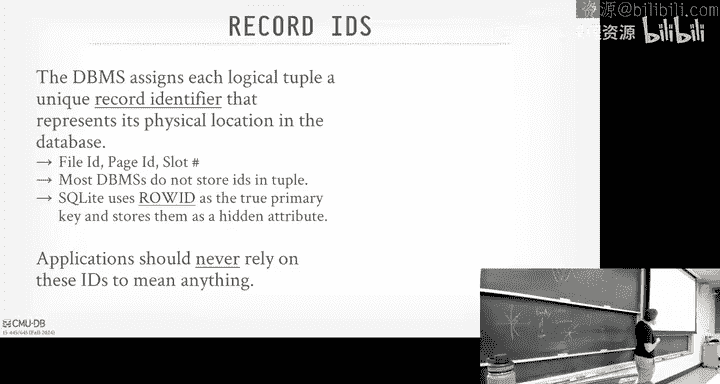
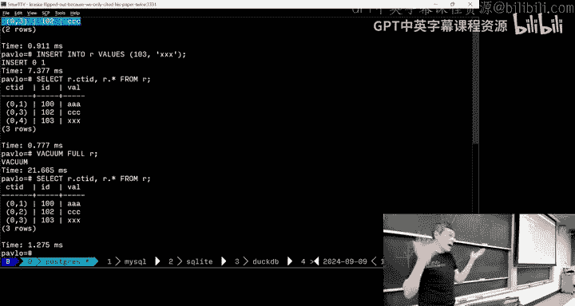
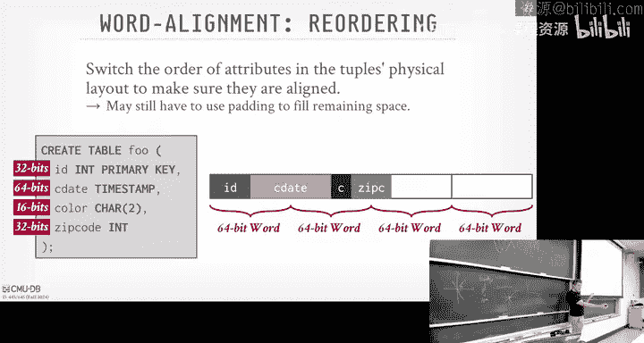
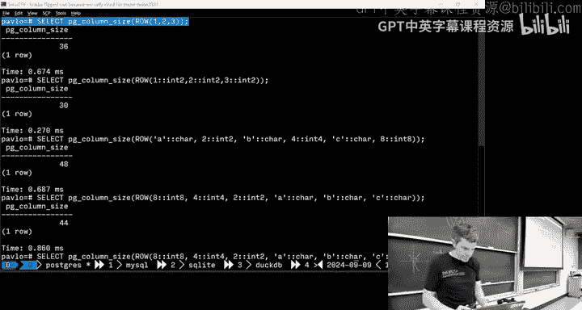
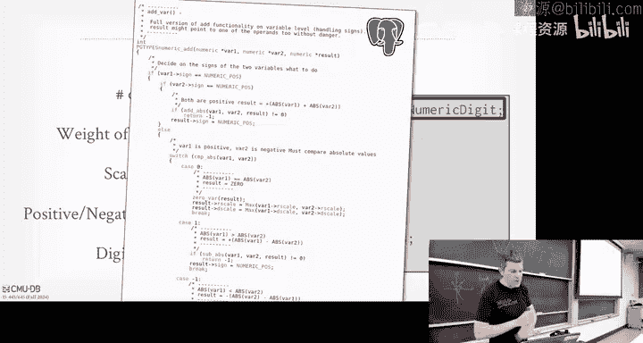
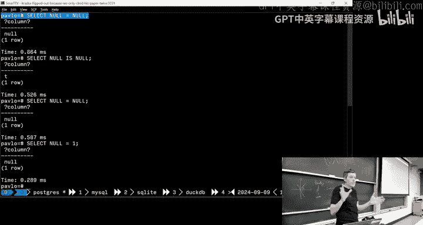
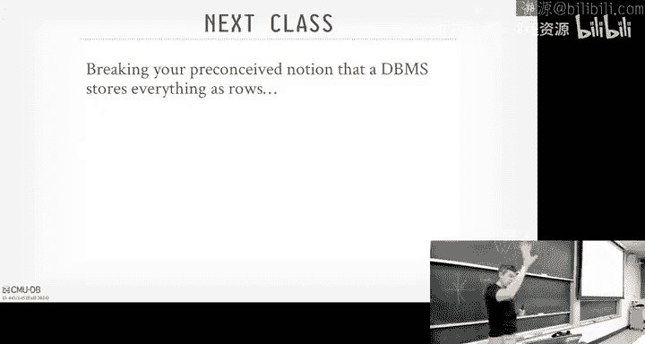

# CMU《数据库导论｜Intro to Database Systems (15-445645 - Fall 2024)》中英字幕（deepseek翻译 - P5：#04 - Database Storage_ Log-Structured Merge Trees & Tuples.zh_en - GPT中英字幕课程资源 - BV1Tys8eQELW

Yeah。🎼We have a lot to cover because we ran a going the last didn't discuss the week on Wednesday and then we'll plow through the new stuff today in classminino everyone homework and project last night I think we had nearly almost perfect project zeros So awesome congrats to everyone who finished Project one will be released its scheduled to be released today It's probably going to go out tomorrow because we upload the source code and the greatco and the leaderboard。

Reation all at the same time。 so that should go out tomorrow and then if we have time。

 we can discuss it on Wednesday， but it probably will' have to punt till next week because it'll be based on the lecture when we start talking about memory management because you have to build your own buffer pool。

Beyond the class there's a bunch of database talks coming up tomorrow in Gates， at6 o'clock。

 there's a tech talk from Databricks， I think you see Mi alum talking about the Mosaic LLM stuff that they bought I think it was last year so that'll be at 6 o'clock I'm assuming they're feeding you at that one。

 then there'll be a talk from Snowflake on the 12th this Thursday at 12 pm that will be pizza and that'll be up on the ninthth floor I have a lot of former students that went actually a lot of former students at Databricks。

 a lot of former students at Snowflake and they all seem very happy and then we'll have our seminar series talking about database building blocks starting with the Data fusion people from Influx on Monday the 23rd。

And then as I post on on Piazza， they'll be on Monday， Tuesday next week， yes。

 while we're having class， but also outside the class time。

 all the news companies that are sponsoring Carnegie Mountain Davis group are coming on campus on Monday and Tuesday。

 and if you're taking this class， you're invited to both these events。

 So the Monday will be research talks and a poster session from all the students working on various database related projects。

 and then on Tuesdays I post on Piazza， all the companies will having one hour info sessions to talk about what they're building what you can do if you work there and internships and fulltime positions。

 So if you want to eat with the companies on Tuesday， as I post on Piazza。

 there's a signup form select your availability for those various companies。

 I think the only one that's not coming is confluent and then if you just want to make money working these companies。

 you should post your resume to that spreadsheet that I posted on Piazza as well。

 and then we'll make that available to all the companies。😊，You know， next week， okay？

Any questions from any any of these things。And as I put in Piazza， there's a bunch of companies。

 these companies have full time and internship offerings， so by all means please apply okay。

And again， I've。All those companies， we liked the people there。

 We wouldn't ask anybody we who we didn't like。So it's not like you're to go you know。

You know digig ditches or do something weird that's not data related。So last class。

 we were presenting again， the high level overview of what a disk oriented data system architecture looked like。

 right And this is where we assume the system was designed to assume that。😡。

The primary storage location of data， the database itself。

 is going to be on some non volatile storage device， a disk。

 right and that the the overall architecture is going to be designed to deal with the case that like it may try to access data on behalf of a query or to do some background operation that needs to do。

 and the data is not in memory and it's on disk and we've got to go bring it from disk into memory because we can't do in place updates on disk。

 we'll cover later few few more lectures how we do that transfer。

 But for now we just assume there's some layout on the disk and we can rewrite them。

So we were talking about， actually， twople oriented， that page oriented。 But the， the。

 the architecture we're talking about was a tuple oriented architecture， meaning that the。

The database， the database system is is all about understanding where tus are， like what。

 where the tus are in pages， how the late and of pages。

 but everything' is very tuple oriented across these heat files， which are unordered。😡。

And what we sort of rushed at the end was we were started talking about the canonical implementation of how you represent tus in a page is through this slotted page scheme。

😡，And the idea here is that we add an indirect layer in our pages that map locations or offsets within a page to Tples。

😡，So within a page， we'd have this header that tells us some metadata about what's in this page。

 check sums and other related things。😡，And then there's this thing in the beginning called the slotler array。

😡，And that's just going to be， again， pointing to offsets to tus。😡。

And all the tu that's going to be the bottom down here。 But fixed length and variablele。

 we'll talk about in a second how we deal with variable length data that exceeds the size of the page。

 And if we go outside the page， we'll cover that。 But the idea is that the slaughter age just point to these offsets。

 and it's going to grow from the beginning to the end。

 and then all the tu data is going to grow from the end to the beginning。

 And at some point you run out of space and the page is considered full。😊，Right。

And the reason why we want to have this sloter array approach is that。😡。

We want to be able to tell the rest of the system， hey， there's a tu in here。

 and if you have the page number and the slot number， you can get to it。

 and no matter how I reorganize what's inside the page itself。😡，I don't have to update anything else。

😡，If I was addressing Tupos with an exact offset in some location in a file。

 any time that Tupple got moved around， I got to go update whatever may be pointing to it。😡。

Like an index or some additional data structure。But having this indirection through the slaughter array gives us that freedom to move things around without worrying about。

Telling everybody else， Indirection is a very important concept in computer science and systems。

 It makes our lives easier。 You pay a cost for it ofho， because now when I landed this page。

 I've got to look in the ster array， then find， you know。

 the offset versus just jumping to the offset。 But again。

 that's a minor cost versus reading something from disk。So again， now if I delete say。😡，I don't need。

Slaughttter array， I could just delete everything as it is， but for some systems， make that want to。

the page is in memory so I could slide2 before4 over， just， you know。

 move the bytes over to reclaim that space。 I update my slaughter， I did now point to its new offset。

 but again， I don't tell anything outside of the page that that change was made。😡，哎。So。Now。

 I've alluded to this， this addressing scheme but it'll say。

 here's how to get to a tuple by its page number an offset or some additional metadata that isn't like a primary key。

 which is a logical construct that the application is asking you to do in your database。

 It's some kind of physical address we're using here to identify tus。

And we' going to loosely call these record IDs。😡，And it's going to represent the physical location of a tuple in the database。

You can see it sometimes from the outside world， we'll see in a second。

 some data systems will actually expose this information to you。

 but it's nothing you should actually rely on in your application because again。

 under the relational model， there is no order to data inside our tables。

 therefore things can get moved around and this physical dress， this record ID may change。😡。

So it's typically going to be a composite of a bunch of information about what the files of the pages are。

 sometimes sometimes it'll be like the file I and the page Id and then the slot number， right。

And so you can look at a bunch of these different database systems that are all going be storing slightly different things。

 And again， this white low by database systems is that there's a basic idea， hey。

 we need a record Id。 and everybody's going do something slightly different。

 And there's pros and cons to all of these。So you're typicallyre not going to store this record I as part of the tuple because it's derived from the tuple location。

 meaning I don't need it doesn't make sense to store within a tuple。 Hey。

 here's my page number and slot number， but I'm already in the page at that slot。

 Itd be itd be a was of space to store this。😡，Sometimes you do。 so for example， in SQL light。

 they'll store the row ID with it because that that's like the synthetic primary key they're using and they have basically a B plus tree that says for given I。

 here's where the data is。Right。And again， most systems should never rely on this because the I aren't supposed to mean anything to the outside world。

 It's for internal bookkeeping of the database system。

So let's pop them in some databases and see what it looks like real quickly。

So first we do in Postgres。 So we have a really simple table here。😊，Select star from R。

Right simple table R has three tus in it。So Postgres is to have this thing called the CTID。

And so now， when I write a query。I can put select star like I normallyly would。

 but I can add this special column here， CT T ID。 And that's going to correspond to the record Id。😊。

And we're going to get back a tuple or pair。Of two numbers。It it was 01，02，0，3。

The first number is the page number。😡，The second number is the slot number within the slotted page architecture。

Right。So now I insert， say or maybe let's delete a table。

 So if I delete the first table 101 or sorry， the second table 101。Now， I do that scan again。

 now you can see my the the 101 is now missing， but now you can see that it didn't reorganize my page。

It still is 01 for the first tuupple，03 for the second tuupple， and there's a gap in the middle。😡。

Becauseuse the way Postgs has implemented， they decided， let's just leave the page。

 empty that empty slot there。And it's still correct。Again， according to the relational model。

 that's fine。So now if I insert， say， a new tuple。Let's insert 1，03。Now， if I do that scan again。

 what do you think one of three is going to end up？

Is it going to be at the end or is it going to take over that free slot？He says the freeze lot。

Rise your hand to say， free slot。Half isnt right。Did， at the end。And that's fine。Right。打照盖。

So if I do the vacuum thing， again， think of that as like the garbage collector and Postgres。

 I run vacuum full。 that literally makes another copy of the table and just scans through your pages and writes out any visible tuples。

 Now when I scan the tu again or scan the table again， now you see that it'ss reclaimed that space。

So that's good。 Okay， so let's pop into secret light。Again， Sgel light has this。This row Id。Right。

 and it's just a montonically increasing counter，1，2，3，4，5，6， and so forth， right。

So if I do the same thing， if I delete that second tub bowl 1，0，1。And now。I scan again。Right。

 that makes sense that it it didn't It didn't re， It didn't reorganize the existing row ideas for the other tus。

 But now， if I insert now the， the a new tuple。SQL light decides to keep counting at the end。很 fine。

There's no， there's no notion of vacuumment in SQL light， so we can't do compaction there。

So now let's pop over to。Secel server。So。You can't see it here， but let me highlight the mouse。

There's percent signs there。Right， so it's percent percent， physical location， percent percent。

 like the magic keyword in， in SQL server。 So now we get some kind of hex number， right。

 what does that mean。😊，So you can ask SQL light or sorry， you can ask ChatGBT。😊。

With this nice little function here。And now you get back what that physical number means。

 So in the case of S server， they're going to have the file ID， the page number。

 and then the slot number within that。And what file one means， I don't know。

 it's some internal bookkeeping that SQL server is doing。😡，So let's do the same thing we did before。

Let's delete。Deelete tuple。Now we run that query again。And this time， it actually did the compaction。

So I deleted the 101 which is at slot 1 now when I select again。

 now slot 1 is being occupied by the third tuupple。😡。

Because C goes over decided when I have things in memory， if I delete something， I have free space。

 it's going to do compaction on that page。Right， and there's there's there's pros and cons to doing either one。

So now if I， if I insert， so， sorry。I insert a new table。Run select on it， and it put it at the end。

All right， last one to show is Oracle。So Oracle art。Like SQelli， Oracle has this row I thing。

But instead of being this monotonly increasing value the way it was s a light， again， it's some。

 some byer ramp。So， what we can do is。Again， thanks to， I think this one is the stack exchange。

 there's some query here。 You run this。And then it breaks up that byer right now into an object ID。

 a file number， block number， page number， and then a row slot， and it tells you where it is。😡。

So let's try to do the same thing。 Let's delete。1，01。And I run that query again。

And it didn't compact like in Postgres。And if I now insert。1 or3。It just put it at the end。Again。

 so this record ID or row ID， whatever you want to call it， this is the physical address of a Tple。

 and all most the internal data structures are going to be referencing if they want to point at a single tuple is going to be using that record ID。

😡，And the system is going to know how to convert whatever that byte array that represents that record ID into a file number。

 a page number， and then an offset set， and an offset is in that sloter array。😡。

Another example here is like in case of seal Oracle， the row slot numbers start at zero。

But if I went back to Postgres， Postgres， they start at one。Why I don't know。

喂。All right， so this two born storage that we've be talking about。😡。

The way it basically works is if I need a sort of new Tupple， then I look at my page directory。

 it's going to tell me what page has a free slot。 remember I'm maintaining that internal data structure that keeps track for every page。

 how much space is being occupied。😡，And then I've retrieved that page， if it's not memory from disk。

 then I look in the slot array， find a free slot， then I insert my tu， assuming that it fits。Right。

So that's pretty straightforward。 right， If I need certain one thing， I go find one you know。

 if I find a page with the free Tupple， insert it， and then eventually it'll get written out the disk。

 Well， worry about that that second part later that had written out of the disk later。

 But that's that's pretty straightforward。But if I need to update existing tuple。😡，I need a way。

 The first thing I need to do is get it to record I D。 So again。

 we'll talk about indexes in a few weeks。 but assume there's some index that keeps track of the logical logical keys like。

 you know， like somebody's email address or Android I。

 And then the value of that key is gonna to be the record I D。Typically， not always， but typically。

 And then from that record Id， I can then extract out the the file number， the page number。

 whatever it is， go to the page directory and say， okay。

 for this table at this file number at this page， where do I find it。 Like， tell me how to get there。

And then if that page is not in disk。 I bring that in in， not in memory。

 I bring bring them from disk into memory。 Then I now I have the page。

I have the slot number that I got from the record ID。 I go look up in the slot array。

 It tells me what offset I should be looking at within the page。 and then boom。

 that's where I get my tuple。Right。If the new data will fit an the existing page。

 we can just overwrite it。😡，We'll see in some cases later on this semester。

 And I know I keep punchting down the road， but likes a lot of moving parts here。

 If the were just leak this overwrite the existing data and it fits， we just write it。

 other mark the tuple that we're trying to overwrite is deleted。

And then we'll find a new page as if we're inserting a new Tple and write the updated version there。

 yes question regarding this。Also the size of the free fls to like find the best。The first fit。

Saw empty slot for insert。 second， why do we have to for the。If there's already。

 if the existing twoole space is not fit。Why do we inserting a different page instead of inserting to。

All right， so the first question is。😊，Is the free space map keeping track of how much space is available so that when we insert a new tool。

 we know how big our tub is and we want to find a page that would have that， yes。

And if there is free space， but the no one page has an updated to store my new Tple。

 I create a new page。😡，And then your second question was， sorry repeat again。 second question was。

 why do we decide to insert the two in the different pages at the same page。 right， question is。

If I need to update a tuple。😡，And。If I can't fit it into the page where the current triple currently exists。

 I have to write to another page。😡，And for now， I assume I'm just going to overrite it。😡。

So say my page has one kilobyte left of data。😡，But I need to overwrite an existing table with two kilobyte。

 it won't fit in the same page。😡，So I had to treat that as a delete followed by to insert。😡。

Because I can't put it in the page where I was， right？😡。

Because then if I can overwrite the existing Tple， I don't need to update its record ID to anything that's pointing to it。

😡，If I do need to create a new page or put it into a different page。

 then now the record ID for that logical tu has changed。

 and so I treat that as a elite fall by answer。😡，We'll talk about multiverrgging later。

 that complicates things as well， but for now to assume you canr things， yes。😡。

Would it be the option to rearrange the tu port to make space for the。His question is。

 is it possible for me to rearrange the tu of like compact it， sorry， compact the the page。

 compact the page to make free space and insert it。 Yes， you could。I that commonか。His question is。

 is that common practice？😊，I mean， it's an obvious optimization。

 I don't know whether the Postg does it or not other systemss do it， right？

In in case we saw a SQL server tries to reduce that fragmentation by compacting every time you update the page。

 The idea is like I brought the memory， I hold a lot latch for it。

 Let me update as much as I can to optimize it。 And then then I release it。

 whereas Postgres is just trying to get in and out of the page quickly as possible and doesn't worry about compaction。

😊，Again， multiversioning complicates a bunch of this and the way Postgres does multiversion is the wrong way to do it。

 which we'll cover later。😊，And so they might be keeping things around longer than they actually need to be。

 We'll cover that later。And I'll come up in logging in a second， too，So。

We've already alludd a bunch of these problems， but thiss two pointed storage。😡，The first。

 as we said， was fragmentation。Assuming I'm not doing this compaction。

Then my pages aren't going to be fully utilized。 But even if I am doing compaction and the slaughter array is going to go this way。

 the tu of day is going to go this way， there's always going to be， unless it's perfectly aligned。

 There's always be a little bit space in the middle that is just unused。😡。

And they had to sort of deal with it。Next problem we have is there's useless disk guy out。😡。

So if I need to update one tuple and I can throw 1000 tuples in a single page。

 I got to go get that one page because we said the granularity of accessing disks was through database pages。

 so I to go bring in in case of Postgres all8 kilobytes， even though I need to update one tuple。😡。

So I'm basically reading a bunch of data that I don't need at all to do do my operation， do my query。

😡，Again inserts are easy because inserts are just a ending a pen to pen and you don't worry about reading things again。

 at least during that insert operation， but in the case of update。

 I got to bring the whole thing in just update one piece of it。😡，And then now related to this。

 in the worst case scenario， if I'm updating a bunch of tuples， say I'm updating 10 tuples。

 and they're not all on the same page， they're on 10 different pages。😡，Now for a single update query。

 I can update 10 tuples， but at the right out， 101 pages， I got to read in 10 different pages。😡。

Again， with all the wasted wasted data I'm fetching for things I don't care about。

 then as I do my update， now I'm updating 10 different pages。

So there's a lot of ways to IO does this architecture。

Another wrench in this is that we're assuming that these non volatile disks。

 the storage that we're writing our database out to， the pages。😡，Can support in place updates？

All the SDs you have now。い。They don't really do in place updates。 it overwrites the whole block。

 It's a little little detail we don't care about， but。What if you couldn't access like for this page。

 here's the new version of that page。😡，That once you write a page to disk。😡。

You can never go back and change it， you can delete it。

 but you can't overwrite within it without creating a new page。😡，So this sounds kind of crazy。

 but this is how a lot of the distributed file systems and some of the object stores in the cloud。

 it's how they work。So I can only do appends to disk。

 I can't do rights or overr or modifying existing data。So most famously。

 this is how HFS works for Hadoop， Amazon S3 sort of works like this。

 Google has their big distributed file system colossus。 These are our pen only access methods。I mean。

 you can only add new things， you can't overwrite existing things。😡，Otherwise。

 you just have to delete them。So this is going to lead us into an alternative way to represent tus in a database that's called log structure storage or log structure me trees。

😡，And this is going to be。Try to overcome some of the deficiencies we saw in the last slide that you would have in a Tuple oriented architecture where you're trying to update slideed pages。

😡，And the high way it's going to do it is that。We're going to assume that we can only append to blocks andend to pages。

And then I'll make our rightss go faster， but the tradeoff will be， we'll make our reads go slower。

We then look at an alternative approach， which I've already sort of been alluded to as well with my SQL and SQL light。

 where instead having you still have a slide of pages， but instead of having a heap。

 you're just going to have an index， like a B plus tree or whatever data shows you want。😡。

And that'll be index organized storage， and then we'll finish up talking about what tus actually。

 the bits of the bytes of a tus actually look like。Okay。So again， we。

 we're behind because we we ran over time last class， but I' try to go quickly as possible。

 but still stop me。 things are confusing。All right， so。

Law structure storages the idea is that instead of having plotted pages where we do in place updates。

😡，Instead， the database system is going to maintain a log。😡，Think of look at a ledger or a。

A listing of changes that have been made to tus。😡，And each log entry is going to represent either a put operation。

 like installing some record or a delete。😡，Its like the lowest level that the only two。

Basic operations you can do on this log structure storage。

And this is an old idea that dates back to 1996， there's a seminal paper from I think out of UMass Boston for log structured mearies。

 and this actually was derived from or based on earlier I worked on early '90s as well on log structured file systems。

 the idea that you're destroyoring log records about what changes have been made and then when you want to read them you sort of replay the log。

So in a log structure storage system， our database system， there's going to be two data structures。

 there's going to be an in-memory data structure called the Me table that we're going to use to actually do in place updates for the database for tables。

 but it's not going to be the data structure is not going to encompass or conclude all possible keys。

 it's just whatever the working set is， whatever the latest changes are that you've made。😡。

And at some point when the mam table gets full。Then we're going to convert it to it on this data structure called the SS table。

😡，That basically going to convert that image data structure into log records。

 and then that's going to get written out the disk。And then we'll see in a second over time。

 we start accumulating these SS tables， and we need to start compacting them because we ever done the information。

 and then that'll sort of speed things up and reduce the storage amount of storage space we're consuming to keep track of these records。

So let's look at a high example， again we're going to have the dichotomy between memory and disk。😡。

And then we'll have this mem table that's sitting in memory。

 This is a what I'm showing you is generic data structure right in rock Db。

 they're using a skip list。 All systems use linked list。 You could just use a B B plus tree or try。

 right， It doesn't matter。 It's some tree structure where we can keep look up some keys and get values。

So if the application comes along and it wants to do a right， so again。

 we can only do puts and deletes。😡，I'll talk about reads in a second， so I want to put key 101。😊。

And assume this， this  one key 1 on1 is like some， again， like almost like the record I D。

 But instead of being a page number and and a slot number like it is in Postgress。

 it's more like a synthetic number like an oracle or or sorry in SQL light。

 where it' like it's some monotonomically increasing counter。

 There's some counter gonna increment by one every time you want to reference a new new key。😊。

So I want to do a put on key 101 into a1 and then assume my Me table has some。

 you know the data structure has some existing guidepost。 but down here in the leads。

 this where actually want to store data。 So I'm gonna to append a new record that says or add a new entry into my data structure that says here's for key 101。

 here's here's the data for it。They'll now want to do a put on key 102 for add new value or install the value be1 for it。

 So in this case here again I put a new leaf entry in my me table。

So now if I do another put on key 101。😡，I would always check the mem table to see whether that key exists。

 in this case here， we just inserted key 101， so all we would do now is just update its entry for it。

😡，So because it's in memory， it's fast， it's cheap to do in place updates。

 so we're allowed to do in place updates for what exists in memory here， so that's fine。😡。

Then now I do a put on 103， add a new entry here， and now at this point say my M table is full。

 right this is a trivial example because it has to fit on PowerPoint。

 but say I can only store three entries。😡，So now I need to spill my M table out the disk。😡。

Alloccate new memory for a new MeM table that can absorb new updates。

 and then in the background I'm going to write this mem table out the disk。

So I'm going to do a simple conversion where I just walk along the leaf nodes。

 find all the latest entries for the keys that I have。😡，St them based on the key。

 which I would get from the leaf nodes anyway。 the leaf nodes are sorted。

 And then now I have an SS table that's going to record。 Here's the log entry。

 a log record for every single thing that was updated in my。In my mem table。

And then I can blow the M table memory away and then it。

 let it be reused for the next batch rightss that are showing up。So again。

 so the order in which we're going to insert them in our me table or sorry in our SS table within that single SS table itself is going to be from key low to high。

😡，And then we're going to write it out to disk。And the。

What I'm going to show here is what rock CBB does and level ebas and most common approaches sort of have these notion of levels and think of like a level within a B plus tree or B tree。

 the idea is that we're going to slowly move data down and create larger SS tables as we go from one level to the next。

 So at the very beginning， we just insert our new SS table and disk at level0。

And let's say now again， we keep running。 there's new tables get created。

 They get converted SS tables and they keep appending new SS tables to level 0。

 And we're still going to order these from newest to oldest going from left and right in my example here。

So now at some point， level0 is going to get full。😡，We have too many SS tables。

 and we need to start compacting them， and we're going to push it down to level 1。

The idea here is that we're going to find a bunch of SS tables that。

Either all of them within our level or things that are adjacent to each other within time。

 and we're going to do a basically a sort mergege。😡。

Find the latest entry for different keys that we have across SS tables again because since we know the order of time that they've occurred。

 and we're going to combine them into a new compacted SS table that's mean larger than the one in the level above us。

😡，Right，And we just keep doing this as we we create new SS tables they'll get they'll get compacted and create new SS tables going down the previous level。

 Sam thing now， level 1， level 1 is going running out of space because we have too many SS tables。

 So we want to start combining and compacting them and pushing them down。😊。

Yes his question is how do you do the compaction of two SS tables， next slide？

But it's basically I know the order in time， so I want to make sure that I always have the latest version。

 if you will， of a key operation。So if I if， if， if。If I first do a put on key 101。

 and then later I do a put on key101， I don't need to see that earlier one。😡。

So I I can just ignore the second one， ignore the older one。

 because all I care about here is the latest version。Yes。

Why do we need to convert it from a tree structure to work？Like， why can't we put。

Especially why can't you just take the mem table and。

Just write out the disk and serial that out at the disk and versus converting to this log log recorder stuff。

Because I。Because I don't need that those additional sort of guidepost。

Of like keeping track of how to go split and so forth。 I literally have a log to tell me。

 here's all the changes I need to make。 We'll talk about the summary table a second。

 We'll talk about how to do efficient lookups on that。 But I also say， they're also sorted。

Based on the key。So I can just do binary search to quickly find the record I'm looking for。Yes。

 would you put in。Would you put what， What do you put like in the node of the man table， Like。

 its the tree structure。 What you put like in the single node in the。

This question is what is in a node in a ME table？😡，So it's a key value pair， right。

 it's a key value lookup。 So like forgiving key， here's the value for it。

And I'm being vague on what the data structure is， if it's a skip list， then you have these towers。

 if it's the people of the street， you have these guide node， inner nodes。

 it doesn't matter all we care about is that the leaf nodes are inserted based on key order。😡。

And again， it's mapping from a key to a value based on the put operations。

And when you write it to SS table， you convert it to logs。

The question is when you write to an SS table， you convert logs。 Yes， you。

 you just scan along these leaf nodes。And then you just write out like。

 here's the keys and here's the value I put for it。

 But like you got likes if I Yeah Im outputs in in the Mm table。 No， you overwrite them。

Because you can do in place updates because it's in memory， it's fast。😡，Yes。

 are we ordering the MEm table as tree structure instead of a log structure just because we want to do fast lookup Her question is。

 are we ordering the MEm table as a tree structure instead of a log structure because we do fast lockups yes？

The MAM table is going to be maybe a couple hundred megs in size。😡，Right， it's not going to be。

 you know， once the levels can be like like gigabytes terabytes and petabytes。Yes。want you ask感じ。

Sium。Won't scans be extensive， The question is， will linear scans be extensive， Yes。

 we'll get to that in a second， but yes。Actually， that's next。So he points out and he's correct。😡。

So our rights are really fast now， because。I essentially can do。You know， blind inserts。

 meaning like if I certain new record， I don't have to go find a page or go put it then maybe bring that into memory。

 I just insert into my mem table。 And then some later point。

 someone else was gonna gonna figure that out for me。 I'm also not showing here。

 there's also a separate red ahead log that we keep in the mem table。 So if we crash， we come back。

 we need to recover the mem table from the log。 And then once it's on SS table the disk。

 we can throw that log away。 we're knowing that we'll cover recovery with logs later in semester。

 but。So his point， the big trail we're making here is thats our writes are really fast。😡。

But now the reads can be expensive depending on where the data is that we actually want to read。😡。

Right， so assume now I I have some mem table again that's been populated in memory。

 And now if someone wants to do a look up on key 101。 I first checked the Mem table。

If it's there great， then I have the latest the version I care about and I can answer the query。

 but it' not there， then I got start scanning down here to go figure out where the latest version is。

And so that the， the the， the brute force thing would be start at level 0。

Do binary search within each S table to look for the key I'm looking for。 If it's not a level 0。

 then go down level1。 So in the worst case scenario， I may up having scanned。

Everything would would be stupidly slow。So the way they handle that is through what it's called a summary table。

😡，And it's basically additional metadata about what's in the SS tables and levels down below me。

 so that rather than having to scan every level individually。

 I can quickly try to jump to the level and the SS table that has the key that I want。😡。

So I still got to go read it from disk go find the thing I'm looking for。😡。

But it's not as bad as doing a complete sequential scam。

So I could have for every single SS table at every level， I would have the Minmax value for a key。

And so I just know like is my key even within the range for a given SS table at a level。

If Im trying to find multiple things， Id also maintain additional filters to say is this key even within the level。

 so I don't even bother looking at the Minmax per key or sorry per SS table because they're going to have。

 say thousands of SS tables per level。😡，If I can quickly ignore entire level because I know it doesn't have the data that I want。

 then the filteril that will give me that。😡，Typically， if this implementeds bloom filters。

 We'll cover what a balloon filter is in a few weeks。

So an index will tell you like an index like a B plus J will tell you a for agiven key。

 here's the exact location of where that key can be found。

 a filter is just telling you whether it exists or not， doesn't tell you where it is。😡。

That just does exist。So I can use the filter and tell me for key 101，' it's nowhere。

's not not it won't be in any SS table level 0。 So skip that entirely。

 then go to a level1 and try to find， you know， do the same lookup again。 And maybe that's in there。

 And then I can do my lookup。And then now even though these SS tables can be gigabytes in size。

They're going to support the ability to read the header and get some potentially index or additional metadata to say here's the offset you should jump into within my one gigabyte file or where your key will be located。

😡，Yes， what do we need to store mean Max Keep or SST？K you for being up to being。

His question is why do you need sort of Mi key accessible if you want to use range scans？

Would you you know， I want to look up give me all the keys。Between 101 and 200。

 I don't know exactly what values could possibly be there。

 so I don't want to probe them individually in my filter the Min Maxax will tell me whether the range overlaplase or not。

😡，Y both。All right， so okay， this is repeat what I said。 So it's it's basically。

A key value storage approach where we're just app log records to that represent changes of two balls。

 either put put their deletes deletes to basically。

 you just put basically a tombstone marker in the mem table。And says， you know。

 this tool has been deleted。 So if it doesn't exist in the Mm table， you insert an entry and put。

 put the tombstone mark on and say this is deleted。 If it is there。

 then you just set the tombstone marker to true。And then when now you do write a SS table。

 you add a delete entry as if you， there's like a put entry， right？So。

The idea here is that if we keep inserting tus。😡，And make changes to the data is we don't actually have to go look at previous records。

Now I'm being hand w here of what the value actually is the value typically is the entire tuple。

 So if I'm doing blind rights like I don't care what your email address is now here's your new email address。

 then I just put a put there with that new email address and I'm done ignoring the other attributes。

 But if I had to do things like take your age， add one to it， then yeah I got to do it look up。

 go get your previous age。😡，Then update it and do a put entry for that。

But for insert heavy workloads， this thing is fantastic because you just plowing through inserting fast as you can and basically you try to get the bare metal speed of what SSD can support。

😡，Yes。His question is what is the key here in the luxury storage， Yeah。

 it would be like the SQL light row ID。 it's going to be some synthetic ID either coming from the application。

😡，Or it could be internal to the data system。How does the database management？Knows what the。えす。

So question is how do the database have to know what the key is for a given tool。

 assuming the two exists， that's what indexes give you。😡，Right。So again。

 if the primary key is based on your Android ID， then to do any lookup your query has to say。

 update this Android ID， and now you can do the lookup on it。

 if it's on a secondary value like your know your phone number。😡，啊。

And even though it is unique to you， it's not the primary key for the table。

 now you need a secondary index to do a lookup on the phone number， get whatever the record ID is。

 then you can then do your look up on the storage。😡，And we'll cover indexes in two weeks。Alright。

 so let's get to his question about how we're going to do compaction。So again。

 the idea here is that in the background the data is monitors these levels。

 it knows how much data it's writing out this as tables。

 and at some point there's some threshold gets triggered and says this level is too full。😡。

And one starts combining them to S tables and to to。To。

Together into new new SS tables because it again， we can't do in place updates。

 We anytime we do a compact， we're always gonna create a new SS table。 And this is。

 this is gonna basically speed up reads for us because now we're looking through less stuff potentially because we're。

 we're removing anything that that's potentially redundant at a level。

And the way this is basically going to work is that we just do。

I'm going to show you how to do this with two SS tables。

 but obviously you can do those multiple SS tables and they're already sorted in key order That was the guarantee when we ro out the disk。

 so we just do a sort merge algorithm where we just have an iterator or go through each SS table whatever merg。

 just do comparison to see whether they talking about the same key。 and then if yes。

 then you always pick the one that's the newest。😡，So if I want to merge these two SS tables。

 assuming that it's going from newest to oldest， so this one's newer than this one。

So to do to compaction， I basically want to have an iterator。

 go start this here in this here and do a comparison and see whether they're referring to the same key and then again pick them on the newest。

 So at the beginning here， this is talking my key100 key100 is less than key101。

 So don I know there can't be a reference to key 100 on this side here。

 So I can just ignore it and skip down and Ill write it out So just doing that process you identify that within the first SS table I want all of these entries in this the second SS table here。

 I can ignore the first three because there's referring to key 101102 and this delete1 103 because I have puts for these all these keys on the newest 1 so I can ignore them So has put to key 104 key104 is in reference and first SS table So I want to retain that in my new SS table。

Right。And you， you know， whether or not you sort of combine them together and go down to the level or you combine them and keep them at the same level。

 there's different systems do different things。 and there's pros and cons for each of them。Yes。ここら六个。

You mentioned about rain scan， right， So you kind of at a particular level， and。I have like。

 let's say seven SSD tables。So do I need like I need to do a rain scan on all of them because some。

 some piece might。Yeah， his question is。I I， I don't wantan to bring range guys to do that because it's like it's kind of higher level up above。

 but。This question is， if I had to keys within a given range。

 does that mean that within a given level， I got to look at all the SS tables at that level， yes。

But so that sucks， don't do that。And you'd want a secondary index to handle that for you to tell you exactly。

 here's the key you should be looking for and where， where can you find them。We'll cover that later。

 Yes， I table President， how often you should merge that table？

this is the cop out answer because it's。You're going to hear see this multiple times at the semester。

 It depends what does your data look like， What does your workload look like。

 What does your hardware look like， There's so many different factors involved。

s there's no one like one prescriptive recipe。 I can say this always do this。

And RoDB has so many different knobs that you can tune to figure this all out and no one can get it right。

 it's very hard to do。Okay。So log search storage is way more common now than it was in the say certainly in the '90s when it first came out。

 but even the mid-2000s and part of this is because RoDB is so widely used now in a lot of different database systems。

😡，So， the。Rocky wasn't the first。 A Ro Db is a fork from that Facebook made of Lel DB。

 levell DB came out of Google。 This came out from Jeff Dean and the big T project。

 we'll cover this next week。 But the very first thing that that Facebook did when they fork Ro DB。

 sorry the very first thing that Facebook did when they forked level DB， it made Ro DB got over to M。

Because Google was letting operating system man in pages， and that's a terrible idea。

 RoDb rewrote it correctly and have their ownbuuffable manager， which is Project1。

 But there's a lot of systems now that rely on rocks Db as the key value storage like in the internals of the system。

 and then they build a larger， more complex database system on top of that。😊。

This is how the cockroachD first got started was using RockDB and RockDb is an embedded storage system。

 so it just runs inside of your process， but then cockroach G build able to ship architecture around it。

and then the neon talk we had last week， maybe this didn't come out exactly。

 but the thing they did was they ripped out the two oriented storage of Postgres like the heat files and so forth and replaced it with a distributed log structured system。

And then now they have a way toend the logs and then they have this page server that when Postgres requests the page because the rest of the system assuming that dealing with he files and pages in that manner。

 their log structured storage system basically creates and materializes the pages for Postgres in the way that it wants it from the log records。

😡，So。The downside of this approach is the big one is going to be right amplification。😡。

So meaning if I do a single right to a record。Then it's going to end up getting rewritten。

Into storage multiple times over the lifetime of that tuple。Right。

 because if I if I insert it and an length the M table， it goes in the first SS table。

 Then it gets written on the disk。 and then eventually it's gonna to get compacted and it gets written again to the next level。

 So for one right to， to a tuple， I may end up writing it out。Dozens of times， hundreds of times。

And depending on what hardware I'm running on， I'm either going to burn out the SSD or if I'm running on Amazon。

 I'm going to pay for that that operation the right operation。 again， there's no free lunch。

So that's a downside versus the T orangeage storage with a slot of pages。

 if I do an insert to a Tple， it lands in that page， ignoring all the vacuum stuff in Postgres。

 then it it's going to live there for the life of the database。😡，It never has to get rewritten out。

That can complicate things， but we'll cover that later， and then compaction is obviously not cheap。

Right so the idea is that。My my answers are really fast because I don't have to do any reorganization of data to insert new records。

😡，But I'm going to pay that cost later on because then the compaction's got to run into the background to sort of clean up。

 clean things up。😡，So again， there's no free lunch in the twoor architecture， I do my insert。

 I'm done now， depending on how I'm organizing my data structures。

 I may pay it upfront call to reorganize that data structure in order to do that insert。😡。

But then later on， the reads are cheap。😡，Whereas in log structure storage， it's the opposite。

All right。So， the。I've been dancing around this， this idea of indexes a couple of times now。

 you guys have asking good questions like like， hey， how do you actually find things。

 how do you find things if you don't have the the record I， How do you get the record I D。And the。

We've been talking about these idea of these indexes and we。

 we don't really need know what the data structure is。

 But the idea that it's basically this associatedsociative array that for a given key。

 I can give you back that value and that value is gonna be the typically the record Id。

 And then with that record I， I can then go to the page directory。

Or the table summary within it's in the log structure。

 and then go find where the actual tool was actually being located。

So what if instead of having these auxiliary data structures。

 these indexes that I can use to find the data I want？😡，What if this。

 the data structure itself was the table。So that when I do my lookup on the index。

When I land in the leaf node。It's the data that I want。😡，So this is called index organized storage。😡。

And the basic idea is that。The the leaf knows or whatever data structure I have。

 or it's a hash table， the the the buckets within my hash table instead of being a record I value that I then can do。

 you know， a look up at the pagerick if to find what I want。

The value within the data structure of the index is my tuupple。😡。

So there isn't another step I need to do， I land exactly where the location has the data that I want。

😡，So this approach is。It was more common in the '90s and maybe early 2000s。😊，Less common now。

 most of the nervous systems are going to be log structured。😡，But again。

 it's the opposite of log structure merries， log structure storage where I'm paying the cost to maintain the index when I do my updates。

 either inserts or deletes， but now my reason can be really fast。

 where log structure did is you're paying it later。😡。

So the basic idea is assume I have some tree data structure。

 say this is a B plus tree which we'll cover in a few weeks， could be a try， it could be skipless。

 it doesn't matter。😡，And then the leaf node can be sorted based on the key。So the， the。

 the inner nodes or just guidepost that just tell us how to go left and right and do splits。

 The leaf nodes are actually actually the tus themselves。

 So now the pages where I'm storing my leaf nodes are going to be the。

Almost exactly like the slotted page we had before。😡。

But instead of having the slot array be unordered。😡，My。Offet array within the page。

 more like a slot array， but just the offset to it。

That's going to be sort of based on the key that the index is based on。😡。

So now when I'm going to do a lookup to find a record based on that's key。

I traverse down to the the the data structure， to my leaf nodes。 I get the page。

 Then I do a binary search on the。On the key themselves within that first array in the header。

Then I can jump to the tur that I want。This is a gross simplification of how it works。

 like we'll cover this in more detail when we talk about Bless trees。

 but at a hi this is how sQL light and my SQL work。😊。

In the case of like SQL server and Oracle by default， I think you get。

 I know in Oracle you get by default， you get heap files in SL server。

 I think you get default he files as well。 But you can say。

 like create table and to be in this organized。 And it's going to settle up this way。

So the high end enterprise systems can actually support both heat files and indexes or index or storage。

And just like before in a slide of pages， the tuples grow from the end of the beginning。

 and then the offset array grows from the beginning of the end。Again， it's。

 it's a different way to organize data and there's pros and cons to to both to all three different approaches。

 You have the two orient architecture， log structure storage， and then index organized storage。

All right， so。We've been talking about how to organize tubs。😡。

Now it's time to talk about what the hell actually is inside of a tuple。And so。

A tubo is basically it's bytes， it's a sequence of bitetes。

With typically a header at the front of it that tells you something about what those bytes are。😡。

Not necessarily the schema。😡，Right like you， this offset within the byte array is going to be this type of this size。

 all that sort in the catalog， either in the page header or in separate pages。

But there might be some additional metadata we'll cover throughout the semester that you can store in the header。

And so what the data systems job at the end of the day is doing is it knows how to interpret that byte array to mean whatever it is the data that you want it to store。

 like the types and the potential values and whether they could be null or not。😡，The end of day。

 it's just a bunch of bytes and a bunch of files， but the data system is imposing structure and knows how to interpret those bytes to give it actually meaning。

So say a really simple table F， has two values。ID is a 30 g bit integer and its value is a 64 bit integer。

 and again， it's just an unsigned cha array of some size。At the beginning， we have a header。

Different data systems have different size headers because they store different things。

 doesn't matter。And then now we have in the first byte sequence， we have all the ID values。

 the bits for the ID， and then all the bits for value。So。😊，Again， when now my query wants to say。

 okay， give me for this tuple。😡，Knowing how I got to that tuple or got to this by sequence。😡。

If I want the I value。What you're essentially doing is knowing where the tuple starts。

 you know the size of the header because that's going the same for every single tuple。

 and I do simple arithmetic to say okay。😡，The header plus what offset within my table is going to give me the starting location in this bicyclecycl or where this value will begin。

😡，And then now I'm just doing the same thing as reinterpret cast to take arbitrary bitete array and put it into the type that I would want。

😡，I'm showing you how to do this in C++， but the idea is the same for other languages。That's it。

 data is just bits or just bytes。😡，Of course， it's not always that easy right because things can go wrong you have to store a bunch of different attributes together。

So。😊，Without going to a little architecture details。CPUs。

 modern CPUs want things to be nicely aligned。In some word size。

 so modern processors it typically 64 bit words， sometimes you would care about keeping things within a 64 byte cache line。

 but for simplicity it' to assume that we care about 64 bit words。And so the date the。

 the CPU is going to want。Software， like your application or your database system to access data along these 64 bit word boundaries。

So the problem is going to be now if someone creates a table and has these mixed types that don't nicely align to those boundaries。

We had to do something。Because otherwise it's going to be really slow。Let's see an example here。

 So now my table has more attributes。 So the first thing we have is a 32 bit ID field right And again。

 assuming you have 64 bit words， I can pack that in the first 32 bits of the first word。😊。

Then I have now the timestamp， Well that's 64 bits。 right it's storing things in milliseconds。

 but now my creation date for this tuupple now the first 32 bits is in the first 64 bit word and the last 32 bits are in the second word。

And then going down for all the other attributes， they're going to see we're splitting boundaries。So。

What happens now if my database system says， all right， this is the two I want。

 I jump to the offset where this byteerite starts， and I want the creation date。

 that's at this offset， what happens now when I access this 64 bit value that span across two words？

😡，What happens？So he says， yeah， so what happens is in modern CPU， what will happen is。The CPU was。

The CPU is trying to hide that you're stupid from you and will do the request you're asking for and give you back the data you want。

 pack together a line， but it's essentially you have to do two memory you cacheline accesses to go get this data and then stitch it back together and give it back to you。

😡，In older CPUs， you actually would get an interrupt。😡，And basically tell you， don't do that。 That's。

 that's wrong。 It's gonna be slow。 But X 86， and now arm， they all hide this for you。

 So to do this lookup now in C day， it' going to cost twice as much as it would if it was aligned。

 meaning your database is going to go slower。And that's bad。So how can we solve this？Yes。Make sure。

Right， so he says just some empty space。 Yeah， so the most common approach is just do padding。

So here I'm saying， again， I， I have a 32 B word， sorry， 32 bit integer， but I have the sort 6 word。

 I'll just add 32 bits， a bunch of zeros at the end of it。And then now， again。

 my data system has to know， okay I've padted them out。

 so when I want to access these different attributes。

 I know how to jump to the right offset within my byte array to get the data that I want。😡。

This is the most common approach because it's easy。We could try be clever， though， yes。Next slide。

 yes， he said reorder， yes， so again， memory we talked about the separation between the logical view or the physical view so there's logical physical data independence so logically the application wants to get back data for this table in this order。

😡，If I call a select star， I expect to get the ID followed by the date。

 followed by the color and by the zip code。But underneath the covers。

 we could actually reorder the layout of those attributes in our byte sequence so that we can nicely pack them in into our byer array。

😡。

Right， so we can just move the the creation date over to start you know。

 over here and move the zip code over there and move sorry it's a move the。

 the color over there and zip code back over here。 And then now we're nicely packed into our。😊。

Into into our boards， we still a little extra space at the end because we don't want that the next two will to start in the middle of this word。

 so we still have some padding at the end， we may not always save space in this case。

 but again we avoid having to access things across word boundaries。Right。

The padding one is actually the most common。嗯。Let see。

 we have a little time I can show you posts real quickly。So。Progress。

Poscards has this nice function called row。Where you basically say。

 you can give it an array and it creates a single tube before it。

And then they have another function called PG column size。

Where you can get back the number of bys that has to use has to store to represent that data。

 So here I'm saying I have three values，1，2，3， and the size of it is 36 B。Because it's it's。

I thinking them is we。 or is that。It is' an overhead there。But it's， you know， it's， it's。

 it's representing the bytes。It some extra bit metadata for like the header information。

 But it's basically a compact size it。But then remember， I said， you can do casting。

So I can add the colon colonant at the end of all the values。And I can cast it to a type。

And then here you can say I want to downsize it from。From， from。30qubit integers to 16 bit integers。

Represent is two bytes， and now my size is down to 30。So if I do something like this。

So I I have a bunch of。You know，A bunch of different data together。 So I have some chas。

 I had some integers， mixed up。In one ordering， Presco is going to say that you can get it'll sort it as 48 bytes。

But if I just take the same columns and reorder them differently。

Then Postcode doesn't have to pad as much and then get it down to 44 bys。So he'sosing you。

 a way to identify that Postcodes is doing some padding based on the size of the data that I actually want to store。

 and one can be more optimal than another。Yes， this4 bike already pen it？This question is。

 is the4 B already pet at the end for this。We need to have both between。呃。

We take a time with to walk through it。 We take it offline。

 There's a way to dump out like the byte arrays as well。 We can look at that afterwards。

O。Sorry， so we know that it starting things as byer arrays。

 now what are the actual bits of the interval attributes？😡，So depending what the type is。

 you'll see there's a bunch of more ways to approach it。 So for basic integers， So 32 bit，64 bit。

8 bit，16 bit integers。It's just going to use the same thing that's in C C++。

When I create unsigned int in C。That's essentially what Postgs is doing under the cover。

 Every data system' doing another cover。For decimals， we'll come back in a second。

 but there's two approaches that one that could be the IEE74 standard for floating point numbers。

But that's going to have rounding issues， but then every single data system is also going to implement fixed point decimalles。

And where they're going to maintain some extra metadata about the dust when we're trying to store so that they' can avoid all the rounding errors that the harbor will give you。

For varchars， random variablelink data are large data like text and blobs。

 typically there's going to be a header for the tuple in line with the rest of the data sorry actually rest of the data we'll see in a second that says here's the size of the data and depending on how big the data is you actually trying to store for these fields。

 it's either just in line with the rest of the data or you have a pointer to some other page。😡。

Almost like another record ID that says， heres here's the data you're actually looking for for this attribute。

We're not going talk about cols and sorting， but we also need to maintain metadata if we're storing strings of how actually you want to sort them。

 Is it UniIcode， is it some Japanese character set and forth。Timetamps can be sort of different ways。

 but one of most common ones is just storing the number of milliseconds or microseconds since the UniI epoch。

 there's time zone stuff you have to maintain as well， it is more complicated， but yes。

Its question is what happens if your strings larger than one page， you overflow。Well。

 we'll come to that。It's just a pointer to the next chunk of it。😡，All right。

 so I want to talk quickly about the numeric stuff because again， this is。

If you're used to writing C your Cvo code。😡，Then you may not realize how。

How inaccurate floating point numbers actually are。And from a database perspective。

 because we're trying to be the system of record for major organizations and applications。

 these rounding errors are problematic， and therefore we want to make sure we do something correct。

So again， the IEE74 standard basically specifies how Harvard should represent the bits for floating point numbers and then what you should do if you add different floating point numbers together。

 what the result should look like be represented as and again if you call get a float or a double in CS5 plus。

 you're getting the IEE 74 standard。And this me really， really fast because。

Modern CPUs have instructions that know how to crunch on these 74 floating point numbers very quickly。

😡，But again， because to they're not guaranteed be entirely accurate。

You're going to get weird rounding errors that could cause problems。So if you write a really。

 really simple C code like this that takes two numbers， two floats， 0。1 and 0。2。

 add them together and just print out the values。It'll look correct。

Just by the default print F statements。But if you actually extend out and say。

 give me all the bytes for this floating point or print those out。

Now you see there's some weird issues here。😡，Because the hardware can't exactly represent。

The decimal is 0。3。Or fractions like that。So for simple things， maybe not a big deal， but for like。😡。

You know， sending rockets up to the moon or it's your bank account and you're calculating interest。

 you don't want these rounding errors because people are going to notice。 and there's going to be。

 real world problems。So most data systems arguments instead give you。

You can also provide these fixed point precision numbers。😡。

Uually represented as numerics or decimals in the case of Oracle。

 actually think if you say you want a float type， they're always going to give you the fixed point numerical American stat。

They've done a lot of optimization that make look make over really， really fast。

So there's budget of ways to implement these things。😡，at a high level， think of like。

 we're just storing almost the string of what the the。

The the the bis of what the floating point number actually is in its like full correct form。

And then there's going be some metadata that says， here's where the decimal point is。

 here's what the sign is， here's whether it's infinity or not。

 there's extra metada we're going to maintain for that value that we then have to use to interpret what that string sequence actually means for the real value。

😡，So you can go look at Postgress， you can actually look on their code and find what they're actually doing。

 so this is their numeric type。😡，So you see that there's a bunch again metadata to store one floating point number。

 they're going to keep track of the number digits， the weight， the scale of the sign。

 and then there's this type D here that says for numer digits， and that's just unsigned char。

 that's just the string of what the decimal is。Then at run time again， they use this metadata to。

 to interpret what that string means to。Generate the real floating point number。Okay。

 so that's great。Is it fast or slow？Well， again， it's going be slower than the hardware because there there isn't going to be single instructions to to。

 to add these numbers together。Again， you go look at the postcards code， this is just as you add。

And you see all these FNls in the switch statement here。

 but the different corner cases are trying to add two numerics together where one might be negative。

 one might be infinity， and so forth。And there's no way that any of this is going to be as fast as the floating point number plus floating point number in the hardware。

But again， that's a cost you pay to have， to have the the exactness of numerics。

And so I'm showing numericalmerics as one example here。

 but there's a bunch of data types that data provide that are going to basically work the same way。😡。

But numeric is the easiest one to wrap your head around。His question is。

 are they especially like Harvard to support numerics of databases？No。Right。

 Postgs is open in source。 they're not fbbing any hardware Oracle， because when they bought sun。

 they bought， they got the spark stuff， they used to put their own oracle database instructions in the IA so that you know。

 if you ran， if you bought their hardware and ran their database it ran really， really fast。

 they don't they don't sell sparks anymore， but。Companies have tried to do that before， yes。

We'll cover specialized harbor later in this semester。And of us never works out。

No because the thing by the time I make a specialized chip。

 ignoring GPUs and FPGs that's different because that's commodity stuff。

 but by the time in the 80s people were trying to， they were call database machines。

 they would make specialized hardware to accelerate the database in one way by the time you designed fab and then shipped your specialized hardware。

 Intel put out the new version X 86 and any gains you had were lost。Every people try every every 5。

10 years that it never works out。GPUs and might be。Proimate GPU is getting data in and out。

 some companies have solved that， we'll cover that late in the semester。😡，Alright。

 so next we' got to do is how we're gonna represent nulls。

So the most common way to do this in a row store。Which will distinguish between rosestone columns to our next class。

 but in that header for every single tuple。You're going to have this bit map that just says for the attributes that are in this tuple。

 for these columns that are in my tuple， the bit is set to one if the value is actually null。😡。

And so I'll still store empty space in my tuple because I don't want to have specialized code that has different you how to jump into different offsets based on whether the bits or null or not。

 I'll still retain the space for the for the empty value or the null value because again， if I do。

 if I do in place updates， I may go back and put a new value in over null。

But I'll check that bit map to say， yes， is this thing No or not。

Another approach is to use special values or placeholder values。

 where you just say there's some value that if I see it。

 then I know that this tuple or this attributes me set the null。😡，So one idea would be。

 if I have 32 bit integers， if I set the tu， the attribute value to n 32 min。

 like the small number you can represent as an unsigned 30 bit integer。😡。

Then then if I ever see that， I know it's an null。 Now。

 that means that nobody can ever insert that value。

 I have to check that in the higher parts of the system and throw an exception if they try to do that and say it's at of range。

But now I just know if I see that value， then I I know it's not。Well'll see this next class。

 this is actually the most common approach or more common now in column stores。😡，Because it's just。

 it keeps everything nicely aligned when you want to start doing。ixFix length offset sets。

The last approach is to on a per attribute basis， you actually store an extra bit to say like as a prefix to the value and say this value is actually nuble。

So instead of having the bit map in the header， you basically have a bitnap。

 but the bits are stored in front of every single attribute。But what's the problem with that？Yes。

use a whole other。She doesn't use a hold。 it messes up your alignment right If I'm trying to store a 8 B bullolean and I have to keep track with noll。

 I have to store it as 9 Bs because I need that extra bit to keep track whether it's null。

I got to pad it out or represent the bit as a whole other bitete。

 so now my eight bit bulling becomes 16 bits。は。So I only know one company that did this， BesqL。

 and then I think when they rebrand a single sort that got rid of this。

 I only bring this up just to tell you like not to do this。

 I'll try to do this throughout this semester。 like this exists。 People do it。 don't do this。

 It's stupid If you're doing a row store， the bitmap header is way to go。 If you're doing Com store。

 special value is probably the right way to do this。Some MD databases to reduce memory footprint。

 instead of determining the bitmap， they restore the extra value instead the placeholder value because it reduces space。

We we just use it。Single placeholderers want to know。Why is it necessary to aOF per data type？

In too that we need a forward like this question is like。If for integers。

 I'm setting it to in 32 min。 what in that case， if it's a 64 B， if it's a 64 B number。

 I want to use a 64 bit Mint， not 30 B mint。It's some bit pattern that it's meant to represent。😡。

And we just use， we just haven to use that one because it's use the minimum one because it's like。

It's unlikely that someone's gonna to set it to that。

 So does that mean to attribute of different type， even though they are both， they are not。

His question is the means of two attributes of different types， even though they're both null。

Are they not equal， do you mean physically or logically？😡，Because logically nuled is an equal null。

 logical null is not equal null。😡，は。So， select。If I go null equals null。No。Right。

 but if I do no is no。True。Now all is not equal like there's something。

 theres unknown equalco unknown unknown。Does null equal 1？Unknown， right？

It's not an null pointer And we think about it in like C。 It's like， I don't know within this。

 Therefore， I can't reason about within it。😡。

Yep。Now your question is， so that's logically， physically no。

 because the bit sequence will be different。😡，All right。

 so I would to say this seems like a low level detail that like people maybe figured out long ago。

 but we actually wrote a paper about it。This I mean this last semester with one of my former students back at Shiinghua and his student。

 we had a paper on nulls， which。It's always exciting。And the spoiler is， again。

 the second ones be better for for column storage， which'll cover next class。All right。

 so nows come up a couple of times now， how do I handle large values？So all database systems。

 as far as I know， most database systems will。Not let you store a Tple if the size of the data that's in line in the sort of say the primary page of it exceeds the size of a page。

😡，So again， so Postgrets is8 kilobyte pages。😡，I can't store you like a billion。

 I can't make a table with a billion columns because that won't fit in a single page。😡。

But now some values may exceed the size of that page。

 and I need to keep track of that and allow them to overflow into auxiliary pages or essentially called overflow pages。

So the idea here say by a table I have three columns as two integers followed by a text field。

 text basically unbounded varchar can be any arbitrary size。😡。

So if the text field I'm storing is small， then I can just that in line with my twoples。

 my regular tus， in a page， things are fine， right？😡，But if it's really， really big。

 then what I want to instead do is have an overflow page where the inline attribute that I'm storing with the rest of the data。

 called the base tub， if you will。😡，That's now going to be this size and this location which is now a pointer to this overflow page。

 So now if I'm scanning along and I'm trying to read this tuple and it says okay。

 I need to read this text field of the contents attribute。

 I would come across this size and the pointer， then I gotta go follow that pointer to go figure out with the actual value it is。

😡，And then his question is， well， what if this thing exceeds the size of the page。

 which is add another pointer to overflow and say， here's the rest of it。😡，Yes。当。

F by fall into the state。This question is var Barnet started the same pattern， var Barnanet。

 var chart2， Oracle， blob， there's a bunch of- they have different names， yes。

 anything that's going to be really big， you do this。😡，OutLike because。我哋 be。

Users store exactly the same。Like the padding。Like the size location。Into that。V binaryry。Da basic。け？

So his question is， what if I create a column called size and location and try to。

They're storing the binary data。Happens to。Be like the same structure of this item。

His question his question is。What if someone stores basically whatever thestruct that Postgs or whatever system maintains or about here's the size and location。

 What do they happen to store a blob that is that。Well， because there's。This is like a header。😡，你的。

down。It's going to。First four bits or sorry four bytes is going to be the size then a flag say is this thing in line or is it going to an page？

😡，So he he doesn't care what you're storing。 It's not going to interpret your bytes to do anything like you can't like。

 that's a huge security。 You definitely not do that。That's another question。

So there's a lot of optimizations you can do with this。😡。

Because this overflow page isn't like a regular data page。😡，Right， in some cases， I， if I。

 if I run my query where I only need the first two columns， and I don't need the third one。

 I don't want have the read the overflow page。哎。So in the case of Postgs and other systems。

 you can actually compress this with like Z zip or snappy or Z standard。 We'll see next class。

 Like you actually compress this on disk and and， you know。

 uncompressed it when you bring it back in because， you know， it's a bunch of text fields。

 it's gonna to compress really well。😊，We won't cover this in this class。

 We cover this in the advanced class。 but there's another technique called German strings where if I know it's a var cha and instead of restoring just the size location。

 what if I also store a prefix the first eight bytes or of whatever that's in this varchar piece。

 So now if I'm trying to do matching like find me all the find me all the email addresses to start with PV。

I can just go look at that prefix in my header back in the inline data。

 because I to fetch the whole tuple anyway， check that prefix if it doesn't match。

 then I know I don't need to check the overflow page。😡，Right， not very many since we do that。

 It's more common in the newer systems。 It was invented by the Germans。 I didn't know what the call。

 So I called it German strings。 And then they， that's what they use now。 I can send the blog later。

 But there's a bunch of things you can do If you know things meant for overflow rather than regular data pages。

All right， well， well over time， it was going to fish out quickly。For really， really big files。

 you actually can store them on the local disk。 And then now the data system just has a pointer to to that like like a UI that says。

 here's where this is。Now， because the data is not managing those pages。

 it's managed by the OSS file system， all the guarantees that we provide for data。

 for data that we're storing in the data system， those are out the door。😡。

And there a bunch of different types that do that for you。All right。

Cataloggues we can cover next class， basically it's the metadata we keep track about our data， right？

😡，All right， so。Finish up。 So we talk about the log structure storage。 It makes organize storage。

 organized storage。 These are these are alternatives to。StoringStoring data。

And there's pros and cons each of them for right heavy workloads。

The logshaer storage is be great because I'm maximizing the amount of Sprunch IO because it's just writing up the giant SS table all at once or compact and writing it all at once。

 whereas like the index organized storage or the heap storage， it could be Ram or random rights。😡。

And the storage manager， although we said there's the abstraction layers that we're trying to hide from the rest of the system through APIs。

 it's not entirely going to be true because when we start transactions and recovery。

 we need to expose some metadata about what we're doing up above to what comes down below and vice versa。

😡，All right， so next class。Is going to be about different storage models。😡。

So this is going to break how you've been thinking about databases probably all your life where you have a bunch of rows and all the data is contagous for given accurate。

 ignoring the overflow stuff。 So now we're basically going to take that row storage model you have in your mind and flip it and start everything as columns instead。

Let me see what the pros and cons of that approach is， okay。All right。

 see you on Wednesday money some refreshing when I can finish manifest to call a whole bowl like Smith Weson one court and my thoughts hip hop related right then myoxic lyrics a quicker with simple wonor to summer cityer way waves a quicker like rotate and a way too quick to duplicate fill breeze Mikes a Fahrenheit when a hole real tight went on in flight the weign night。

What starts to boil I heat up the party for you record girl here mymic down will boil still turn with third degree burn for one man。

 I heat up your brain give it a sun to just cool let the temperature rise to cool it all with same eyes。

