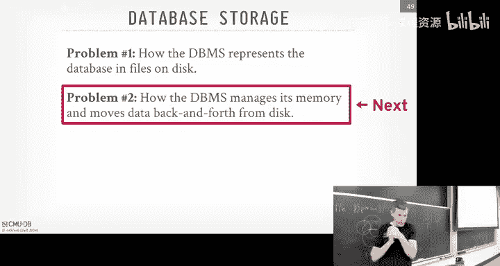
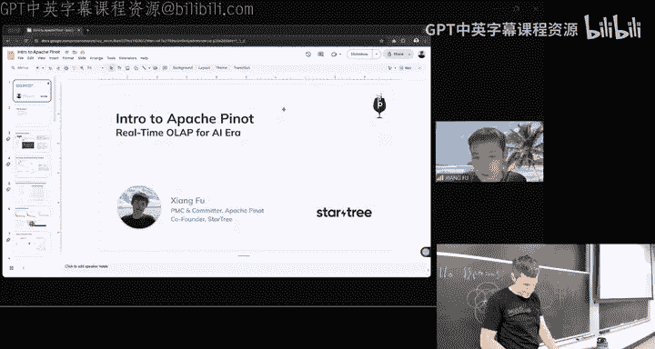
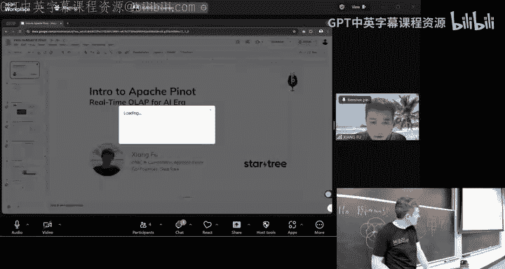

# CMU《数据库导论｜Intro to Database Systems (15-445645 - Fall 2024)》中英字幕（deepseek翻译 - P6：#05 - Row vs. Column Storage + Compression ✸ StarTree Database Talk.zh_en - GPT中英字幕课程资源 - BV1Tys8eQELW

Yeah。🎼Official right so today we're going to continue on discussion this be the last lecture on。

The storage layer， the bottom layer of the database system。

 So we're talking about the different ways of representing data the storage models and then how to optimize it further through your compression。

Before we get to that， you have two things came out today。 homework 2 has been released。

 and that'll be due on Sunday， September 22。 and that's basically three questions， multiple choice。

 and you'll submit those in gradescope。 And then we've just posted Project1 is live。

 The write up is on the website。 And then I think the code and the announcement on Piazza has been released as well。

 And so there'll be a recitation。 at 6 PM next next Wednesday on Project1。

 So we advise you to at least get started on it now look over the right up。 It's very。😊。

It's very thorough in what you'll need to do。 And that way when you go to the recitation isn't like what the buff manager。

 it's probably like， hey， know how do we get started how do we approach this。

 what does this class mean， how does this work together so you want to come up the recitation with questions about like insightful questions because you've already gotten started okay。

And so the lecture on the Buffal manager will be Monday's class next week。

So but it's obvious what it is when you keep alluding to it。

 it's the thing that moves data pages back and forth between disk and memory。

And then I mentioned also that class on Monday and Tuesday next week we're having our visit day from all the industry partners so Monday will be research talks。

 so I'll be there all day and then we'll come here and have class and we'll go back and then Tuesday morning will be info sessions and then we just got confirmation right before the class that confent will' make it so we're trying to figure out what time that'll be so some of you asked to meet confluent there'll be info session with them as well okay。

And again， if you're in this class or if you have friends that have taken 445，6 25 before or 721。

 everyone's invited to come to this， all right？All right， so last class we were discussing again。

 continuing our discussion on what storage level or the storage layer of the data sets could look like and we were contrasting what we talked about in the third lecture of this sort of tupleoriented architecture with slotted pages and then we said。

 hey， here's some alternative approach actually storing data。

 the log circuit approach where you're just app all the changes in glees and then it make the rights go faster but the reads go slower and then index organized storage was basically saying instead of having this heat file where things are unordered。

 we're actually going to use and ordered data structure typically a B plus tree and just have the leaf nodes be the data itself。

So all these approaches from the last two lectures。

 these are going to be useful for workloads that are right heavy， you do on insert。

 update deletes or upts， you're making a lot of changes to the database and you want that to work as efficiently as possible。

😡，But then there's this whole other workload that you kind of did in homework1 where。

It was read only queries。Because you're basically running analytical operations or analytical queries to try to derive you information from the existing data that you have。

😡，And in those kind of queries。We don't care about making the inserts updates at least as fast as possible。

 We care about making the。The select queries run as fast as possible。So that's what today is about。

 today is about understanding how can we store data in such a way that will make selects go faster than we could otherwise in the slotted pages or the LSMs or the index storage。

😡，So。First， you know understand what it means to make analytical clears go faster。

 we going spend a little time quickly discuss here's sort of the rough category of what database workloads look like and put it into terms so that when we use those terms later in the semester。

 you'll know what I mean then we'll talk about the storage models and again this is the way to represent tuples and then we'll see from the column store approach。

 how we can rely on compression to speed things up further and make things smaller and then we'll finish up again with a talk from Star treeree which is going to be a analytical database system that's going to use the column store stuff that we're talking about in this lecture。

So a very loose categorization of data's workloads can be roughly described in these three terms。😡。

The first is called OTP or online transaction processing。

 and this will be workloads or applications that want to ingest new information from the outside world。

😡，If you're a new startup， this is typically what you end up building first like you go to a website to take people put stuff in and you should want to store it in the database those are running insert updated queries that are taking changes from the outside world and you want to store it in your database So these are going to be typically more right heavy than the other ones we'll see in a second。

😡，ButThe thing to note about is that the queries that we're going to run in an OTV workload are going to be- they're not going to touch a lot of data at a time。

😡，So what I mean by that is if you ever think like when you go on Reddit or hacker news or you buy something on Amazon。

 you fill out some forms， you click some buttons and records those changes。😡。

The amount of data it's actually storing when you do those operations is pretty small。😡。

When I buy something on Amazon， I output put things in my cart。

 it's inserting a record in some cart table somewhere， and then I make a purchase。

 it updates my payment information， updates its delivery information。

 I'm inserting a small amount of data to make that purchase。😡，Now。

 the entire Amazon database is massive， right， because it's everything everyone's ever bought since beginning。

 you know， since beginning of time。 So that， that database itself is gonna be huge But the amount of data I'm inserting or changing is quite small。

😊，And that's typical in LGP。So contrast this now with OLAP， OLL， AP or online analytical processing。

This is where we have that existing data， we have this existing database。

 and we want to extrapolate new information from it。😡，I said before。

 this is what data scientists are typically doing， you're trying to derive new things or new patterns or information that you didn't have before from the data you've already collected from the OTP system。

So these queries are typically going to be more complex than you do in the old， or say oldTP systems。

All TB systems like go get Andy's account， do a select star from account where username equals Andy。

 amount the query is quite simple。But analytical could be something like compute the most the what what。

Find the item that the customers have bought the most when it's a day in September， in this city。

 at this temperature， at this time of day， and they have other sort of features of characteristics about we want to break it down on。

And typically， you'd be joining a bunch other tables when you run these queries。

And then the last one is sort of a marketing term， although OLAP was as well。

 but it's in the vernacular now so we don't remember how it came about。

 but this is a Gartner term from a few years ago， it's basically saying that there's some workloads where you want to do some OTP and you want to do some OAP at the same time and can you design a system that can try to accommodate both。

In actuality， most applications are going to look like this anyway。

 like you'll do some OTB stuff and maybe there's some queries that that extract new information。

 but there's a couple of systems that claim their HF system because they want to but try to do other things at the same time。

😡，So if you heard to think about the workloads and these two axises。

 you know first the X axis here is it right heavy versus read heavy。

 And then are the queries of the operations gonna be simple complex。

 You can of think of like a quad chart like this where Ops down on this corner。

 We're gonna be doing not always right heavy workloads， but more right heavy than OAP。

 So we' do much more inserts update deletes， but the queries we're gonna be executing are going to be simple。

 they're only touch a small amount of data。And then O La would be in this other quadrant up here where the queries are going to be more complex than OTP。

 but they're mostly going to be read only。😡，And so the reason why I was saying that this OLAP term was a marketing term of the 90s。

 so most databases up until the late 90s were just O TP was a category。

 but everything was basically oldTP because most businesses， most are running databases。

 you just needed to collect information and only later on did people want to do more complex analytics on it。

So in the 90s， there was this guy named Jim Gray， a very famous database researcher。

 he invented twopa locking and a bunch of other stuff we'll cover that wrestless semester。

 He won the touring warden databases in 96， Well he wrote this paper in like 93，94， he's like， hey。

 here's this new category workload It's called online analytical processing It's called OAPP but then it turned out he was being paid by a company that was trying to brand OAP system so he had to retract it。

 but the name still stuck。😊，And then HTAP will be sort of here in the middle。😡。

But if you say if you tell somebody I'm running an OTB system， they'll roughly know what you mean。

 if you say you're running OF system， they'll roughly know what you mean nowadays。

So to delve deeper now into what these workloads look like and what how storage can affect them。

 let's use a really simple database schema。 So， yes。

 how This question is how do you measure the complexity of a query in terms of like。

 think of the number joins， How many tables am I accessing， how many aggregates I'm doing。It's。

 it's not。 There's no scientific measurement。But like select star where name equals Andy。

 that's pretty simple。 But select star where name equals Andy and join this I join， join， join。

 join and so forth and do an aggregation and a window of function in CTE， that would be more complex。

Yes， no back。二分のた。こ年。The question is what are these other quadrants。

 like what would be a right heavy complex workload？And it's not exact science， it lines are blurry。😡。

So you might have a more complex you have a。I don't really bring up transactions。

 but you can imagine other that I can be right heavy， but doing complex transactions。

 like I want to update a billion records in a transactionally safe manner。Hey。

Just read only comic que or lap。Doing measure write on small amount ofada。

 simple que is OP that that dichotomy is enough is enough to understand what two systems you would want to choose。

Al， so this， this sample Davis scheme we're gonna to use is actually derived from Wikipedia like Wikipedia as far as I know。

 is still written in PhP。 It runs off Mysql。 massive Mysql cluster。

 So you can go it go download their MysQqL files and see what the schema looks like。

 this is a rough approximation of it。 So I have three tables。 I have user accounts。

 pages and revisions and revisions has a foreign key reference to the user I that made the revision and the foreign key reference to the page that that corresponds to。

😊，And for to speed things up， the page table actually has a foreignk key reference back to the to the revision which is not to be the latest one。

 So if I'm trying to look up the latest version of a page， I just follow that foreign key right。

So just remind us again that the relational model doesn't specify anything about how we have to store data in a table or the tuples and there's nothing about the relational model says we have to store the data for a single tuple all within the same page。

😡，We saw that last class when we talked about overflow pages， if I have a real large bar chart。

 I could store that in a separate page and just have a pointer to it，But again。

 as I said at the end of last class， when you think of a database。

 you probably think of like an Excel spreadsheet where all the values for a single row are contiguous one after another。

And the problem is gonna be if we build a system based on that， that sort of that assumption。

 it's not gonna be the most efficient for some of the workloads。

 in particular for the O lap workloads。So if you take the Wikipedia schema and you want to run simple OTP queries on it。

 it would sort of look like this。So if I want to get the latest page for a say latest revision for a page。

 I'm just doing a simple join on page and revisions and following that revision foreign key to get the latest one。

 So it's like doing a single tuple lookup on the pages and a single tuple lookup on revisions。😊。

And we can execute that join pretty efficiently， we'll cover that later。

Or if I'm going to do an update query， this is keeping track of the last timetamp when somebody logged into a given account。

 or if I need to insert a new revision， it's just inserting to the table with all the values。

For overlapla， it would look something like more complex overlap query it looks something like this。

 So I'm only doing a single scan on user count， but now I need to do an aggregation on the defined when somebody logged in with the host name that ends with dotgov。

😊，This is actually a real example from a scandal a few years ago where because all of the provision of history in Wikipedia is public。

 they found that there was like for people in Congress。

 they're like their admins or staff were actually going and updating the Wikipedia records。

 logging in on government computers and you see the dogov host names and so that's obviously illegal。

 you can't do that so this query would help you find these things。So in this case here。

 even though again， I'm only scanning one table， but I'm scanning just basically。

 I need access two comms， the host name and the last login， but I need to see all of the tuples。

In order to find the ones that end with dot gov and then group by， the month that they logged in。哎。

So a database system storage model is going to specify how we're going to physically organize tuples on disk and memory。

😡，And as I said before， depending on how we do it， like a rose store versus a column store。

 that's going to have a significantcker and difference performance based on what workoutload we want to run。

So the canononic approach most people think about when they think about database storage will be called the NA storage model or NSM and sort of the academic term。

 VE row store， it's the same thing。 decomposition storage model storage model or DSM or column store would be the more common term It's another approach and then we'll cover this last one called hybrid or PAs。

 which is going to look a little bit like the NSM， look at DSM but can get still at the benefits of both of them。

😊，So。As I already said， the， the NSM or the the N area storage model is where you store almost all the attributes。

 all the values for a Tple are just contiguous with each other in the same page。

And this is made great for OTP， as I said before， because most of the time on OP workloads。

 I'm accessing a small number of tubs。😊，Like typically one。

 like if I'm doing a primary key look up and I'm typically going to need all the attributes for that。

You know， in that query for that tuple。I select star query from table where username equals Andy。

 The star is obviously getting all the attributes。 So I want all of all the values for that tuupple。

return back to the client。 So if they're conos with each other。

 then I just jump to one page ignoring overflows， jump to the offset in that page based on the slot array or however I'm storing it and just do a me copy and get all that data out that are right next to each other。

 I don't need to jump around the different locations in memory。And as you said before。

 the data page sizes are going to be some constant of the harbor size。And so again。

 if everything fits in a single page， it's one read to go get the data that I meet。

For most of these queries。So this is just a re editinging what we talked about before again。

 what the storage is going to look like again， we're assuming we're doing tuiented storage with slot a page。

 a slot a sloter arrays and so we just have this header with these slot arrays and then as we scan through and add data we're just app it to the end and now I'm showing that every record is going to have some header in front of it this you would store the null bitm that says what attributes are null or not。

😊，And so as I scan down and just insert all this data in from this table。

 I'm just filling it up one after another and just adding punches in the loter array。So again。

 if I want to go select star from where username equals Andy。

 I has some data structure that gets me to this page and then I jump to some offset and then just read all the bits that come after that and that's be all the data that I need and I don't need to jump anywhere else。

😡，So we go back and do a simple query on our Wikipedia database。

 select our from user account where username equals Andy or whatever。

 and then check check the password。Ignoring how I find the the record I want based on the username。

 right， We'll cover that in two weeks or next week in lectures 8 and 9。

 There's some index data structure that's going to give me a record I D for a given username。

Then now with that record ID， I go to the page directory， it tells me what page my data is in。

 I then look in the header， the find the slot entry that has the offset I want， I jump there。

 me copy everything out and I'm done。Right。If I went do an insert， again， that's easy to do。

 look at my page directory， it tells me where a page has empty slot。

 and then I just jumped that all and this write on my bits out。Right。This is easy。

This is perfect for a roast tour。But I run now my analytical query on this。😡。

Now you see why this would be problematic。😡，So in this case here。

 my wear clause says were hostnamed like wildcard。gov。😡，So assuming I don't have an index on this。

 I got to look at all the host names to find know， find the ones that match my， my like clauses。

 So I'm gonna scan all the pages in this table。So assuming I bring this first page in right now I want to start running the parts of the query well I have again the where calls on host name。

 so what do I need to do， I need to scan through the slotter array。

 find all the offsets for the tuples that are in the page， jump to each offset。

 then jump to the offset within that tuple where the host name starts。😡，Then evaluate my predicate。

 my wearlas， then jump to the next one and repeat it。😡，And that's just for the wear clauses。Now。

 for all the twos that match， I want to run my aggregate。 So now I need to look at the last login。

Entry。And， you know， extract out the month and an aggregation on that。

 we'll ignore how we we'll compute the aggregation that's that's in a few weeks。

 But to assume there's a hash shape I'm maintaining in memory that I'm'm updating this counter。

 It's pretty simple。RightBut now what what I need to access， I need to access all of these。

 these attributes over here。 Now， I can do this as while I'm accessing the host name。

 like I'll check the host name。 if it matches， then I'll do the aggregation portion。

 So I don't have loop back a second time， but I'm still have to still going through each two of one by one。

And jump into these offsets。So what's the big problem with this approach for this query？

Ive got this big block of data here for these three attributes。

 and I didn't need them for this query。😡，But because all the attributes and n storage are packed together。

 all the values where are two are packed together， they come along for the ride when I go fetch this page。

😡，Because again， it's block going to the storage， I got to go get the entire database page。

 bring it in a memory， even though there's a bunch of data in it。

 I don't actually need for this query。So this is one of the key problems we're going to have with a row store when we run analytics。

 because it's going to be all this useless IO。😡，So NSM， the road， the advantage is going to be。

 it's really great for inserts updates and deletes， anytime I'm updating a small amount of data。

 this is fantastic because it's going to be one page right and I'm done。😊。

It's great for queries I need to get the entire tuple， and he selects our query。

 which you shouldn't write anyway， but。There's a lot of them。

 then all my data will be right together。And then we can use other techniques like inor storage to keep everything in sort of order。

 so the physical layout of the data is actually good for queries as well。

But I showed that it's going to be bad for scanning large portions of a table。

 especially when I only need to subset of the attributes。😡。

If I have to look at all the attributes and all the data， for all the attributes for all the tuples。

Comster will help for certain things。 But， you know， in end day， you got to read everything。 So。

 but if I'm， most of the queries are gonna do a subset。As we show before。

 I'm jumping around to different offsets in memory。

 and that's going suck from a CPU perspective because now you have a bunch of branching and that you know。

 in in direction。 that's gonna to make things slower。 And then what will cover late in this。

 this class will be。😊，We're not going to be able to compress this data very well because we have a bunch of attributes with different value domains that are all being intermixed。

 and that's not going to be ideal for a compression scheme。😡，I'll explain what that is in a second。

So any questions so far， like why row stores are bad for analytics？😡。

It's pretty obvious once you see it。So the alternative is going to be the decomposition storage model or DSM。

 and this is what you would DSM is the sort academic term。

 but everyone just refers to these as column stores。

 and there is a exact DSM definition and most column storage is going to be using the PAs model which we'll cover in a second。

 but they're loosely at a high level， they're basically the same。

So the DSM is basically instead of storing all the attributes together for a given tuole。😡，You know。

 contiguously in in a page， we're going to store all the values for all tus， for one attribute。

 contiguously in a page。RightSo instead of having the host name followed at the last login。

 I'll store all the host names for all the tus together contiguously and then have another set of pages that store all the the last login attributes for all the tus together in a page。

😊，So again， the relational model gives us that physical logical and physical data independence where logically I'm defining a table as much attributes and columns。

 but I'm not specifying how I'm physically storing it。

 so the database system if it's a column store can say， okay well， I'm a common store system。

 you told me their table wants to be has these columns。

 but I'm going to split them up and store them in separate locations。

 and then when your query comes back and says give me all those attributes back。

 I'm going stitch the twople back together to make it a look as if it's always stored together。😡。

And we hide that entirely from the application。So if we go back to our simple example here。😡。

For the first column on column A， thatll just be stored in a separate page or set of pages。😡。

All the values for column A。And there'll be a header that says， here's what colon。

 here's what's in this page。 Here's check sums or whatever else you want to store。

 There'll be a null bit mapap that stored the header as well。 That's for all the tus。yeah。

 for all the values of for all the tuples。 So instead of having a separate bitmap header per tuple now it's on a per column basis。

 But I know what offset in my bitmap correspond to。

 what offset in value and what tuple that corresponds to， what logical tuple that corresponds to。

And then I had the same thing for the other two columns here， and again。

 I'm showing these as one page， but you can imagine this could be multiple pages。

So if I go back to our query before， so this is what our original page looked like under the Road store model right we had a bunch of tus。

 we had a header at the beginning of the tuple and then we had all the attributes and then once we had to get the last attribute。

 then the next tuple starts。😡，So now what I'm doing ism going to split this up based on columns。

And store these now all in separate pages。Right so there'll be a user ID page or pages， a username。

 last log and so forth。 And then here I have the host name page。 And again。

 we have a header tells me some metadata about what's in this page。

 commonly corresponds to some check some information or correction information。

 and then I have all the host name values。So now when I run that same query we have before。😡。

the first step is to evaluate the wear clauses。😡，And so I the warehouseCause is only accessing the host name。

 so I only need to access this one page， again assuming everything fits in one page。

 I go access this host name， I start at the beginning and now I just rip through this and apply my wear clauses to find the thing that I'm looking for。

So what we're going to end up with now is a bunch of。Maashing offsets。

So saying here's the twos that were the value evaluated to true for this predicate。

 So I keep track of those offsets， which will cover in a few weeks。

 And then now when I want to then evaluate the aggregation。

 I just bring in the last login page because again that's the only column I need。

And then now I know where the offsets were from that match to the host name。

 I know those are the last logs I want to consider in my aggregation。So again。

 this simple example where there's only six pages in the database。

 I went from in a roaster having to read all the pages。To now only have to read two of them。

Or third of it。And if you assume that always think in really large scales。

 like I have billions of pages or petabytes of data。

And either the disk is really slow and it takes a long time， or I'm paying for the access to disk。

 Like if you're running in the cloud， you， you， pay Amazon every time you look something up an S3。

And this is a huge win。😡，So not only by queries run faster， they're going to run cheaper as well。

So this is clear。So this seems like a no brainer idea now。 And actually。

 who here I heard of column stories before this class。Less than， barely 5%， 10%， right。

 This seems obvious， though， right， Like look， of course， if you're doing an analytics。

 you want to sort like this。 The idea is actually really old。 It goes back to the 1970s。

 but it was in this obscure Swedish military tech report for like a file system for the system called Cantor that nobody paid attention to。

 And then that DSM paper I showed you before。 that came out in like 1984。😊。

And it wasn't really till like the 2000s when people said， oh yeah。

 this is actually a really good idea。 We should， we should store analytical data analytical data as column stores。

😊，So it took a while for this idea to come along， and now it' just's commonplace and used everywhere。

😡，Because again， the winds are so big。All right so I was kind of hand wavaving back here right when I said we run our wheres。

 we find our matches and then now when we bring in the last login。

 we have a way to know where the corresponding matches were in the host name to match the corresponding matches or the values we care about in the last login page。

So how are we doing that？So there's basically two approaches。😡。

One is that we just use fixed length offsets for all the values within a column。😡。

And we just know that logically the 2。1 is that offset one at each of these columns。

 and because the values when each column will always be fixed length。

 like therell always be 32 bittegers or 64 integers or whatever。😡。

Then we know how to do that simple as arithmetic to go find the offset that we want to get the value we need for a given tuple we care about。

That this is the most common approach。 And pretty much everyone does this。 In the early days。

 the column stores about the mid 2000s， It was still kind of up there how to do this。

 And the alternative approach was basically to store a tuple Id with every single value within a column。

And then has some additional data structure that says if you want attribute sorry if you want2ple1。

 here's how to jump it into that offset。😡，In the different columns of different types。

There was a system I want to say it was data Lero， which was bought by Microsoft that was basically contorting a Ro store system to make it look like a column store like this。

Microsoft paid， I think pretty sure it was data Laro that did this。

 but even so when Microsoft paid $200 million for data Laro within three months。

 they realized the code was garbage and threw it all away。

 and that was actually gnaious' advisor told him to do that。H。Anyway so。I， put put this mark up here。

 Don't do this， right， But I wanted to tell you you could do it this way。

 This is gonna be the most common approach using fixed length false。投对下。His question is。

 how do you hair on a very length， Next slide， Yes， absolutely， yes。All right， so integers， floats。

 dates， they're all fixed length， that's fine。😡，How do you handle the barchars。

 the text and the blobs？Right。So the way you basically do this is that you want to convert everything into fixed length。

😡，And the way we're going to do that for varchars is to use basically dictionary codingd。Alright。

 if you're familiar with the compression algorithms thatre basically doing some variant a dictionary coding。

 You're taking a arbitrary string and satisfying that string in the column。 You store a number。

 an integer， a dictionary code that maps to that。That， that string。

So I have a separate data structure that keeps all my strings and， and the mapping from codes to。

 to the actual original values。 And then in my columns， I'm just going to store the， the the。

 the integers。And now everything's fixed length， and we're all happy。And in some， some file formats。

 like think I always get this wrong。 This parquet and or talk about a second。

 one of them does dictionary en codingd for everything， no matter what the data actually is。

 So everything ends up being 3 git integers in the columns or 64 integers。

 And then one of them only does it for the strings。😊。

So that solves that problem because because now we just do the simple arithmetic because we know it's going to be 302 energyteger codes。

 We just jump to whatever offset we want to find the data we need。We'll cover that more in a second。

All right， so in the DSM， the column store。It reduces the amount of IO for queries that only need access to the subset of the attributes of a table because we're only reading the data we actually need。

 we're not bringing in things because it comes along for the ride。

 we're only reading exactly what we want。It's going to let us execute queries more faster because。😊。

Because of not jumping around to different offsets of memory。

 we basically can access strides of memory sequentially。

And that's the best thing for a modern superscalear CPU。

The Intel X 86 wants you to actually use bunch instructions。

 one after another and not have branching， not have jumps。 So I can if I build my system correctly。

 which we willll cover in a second or cover it in a few weeks。

 I can rip through that column store and not have any indirects or branches because I'm just going through exactly value after value of value and doing the same operation running the same warehouse clause over and over again。

 And that's the best thing for modern CPUs。And then we'll talk about later in this lecture。

 we can get better compression because now the value domain for a bunch of data that's contiguous in a column store is all going to be the same。

 It's gonna to be a bunch of zip codes that are gonna to be integers。 and I can compress those very。

 very well， yes。😊，タ？Data compression breaks。O。His question is。

 does data compression break the all sets？You mean， if you run like G zipip or zip or snappy？

When when you say compression， what do you mean， we're going to cover this in a second。But like。

 I'll make it clear。 like， so if you， if you， So yes。

 if you just take like snappy or Geeip or whatever your favorite compression algorithm off the shelf。

Yeah， absolutely。 We're not going do that。 We're the database。 We do it ourselves。Okay。

 we'll come back to that。Let's see I was downside of this。Well， again， if my re are going faster。

 what's gonna to get slower Any， any update operations， and he writes。

 because now I had to take for an insert that shows up。

 I got to then split it up in a bunch of attributes and write it off to a bunch of different locations。

 So if I have 1000 attributes in my table。 I got to write out 1000 pages for just inserting11 tuple。

 That sucks。😊，So PAs will solve that problem a little bit。 But in some systems。

 what they actually do is that they'll have。Basically。

 what looks like a log structured system as a rip buffer。

That you do all your insert opt and deletes into， and that's basically a row store。😡。

Then in the background， instead of compacting it， like we talked about before。

 where you're making SS tables and so forth， the compaction part is really installing it into the column store。

 and you do that in the background。😡，Some systems like Oracle。

 they'll have the row stores you normally would have in regular Oracle that does all your OTP is a row store really fast。

😡，And then they actually make a separate copy of the database in memory that's actually in a column store。

So when a query shows up， they say， up， you want to do analytics and the data you want is actually in the in memorymory column store。

 I'll route your query to that。😊，And so you don't change it into the application。

 you don't say I want to go to the roast or the comm store the databases and figures that out for you。

It hides it underneath the covers。And you get all the benefits of a column story。

 but still have fast OTP。I said there's bunch of different ways to。

To to introduce the idea of column storage into a database system。

 some systems are dedicated entirely to a column storage。

 Some systems have it as a sort of supplemental storage or additional storage。Okay。

So comm source are great， the sort of pure comm source is great if you only access， say one column。

m but。Its that is pretty rare。 Most of times you want to access a couple columns。

 Maybe not all the columns， like， I think postcards lets you have 16000 columns per table。

It's a hard coded limit in the code。 Oracle famously has has 1 thousand column limit。

 And the reason why is because it used to be 10 because somebody hardcoded that in the 90s。

 And in the early 20s， somebody said， well， that's dumb。

 let's make it bigger So they changed it at 1000 and had it mainly change up code It was such a pain that they they they told me they never want to change it again。

 You think they would have made it something bigger than the000 when when they did all the retrofitting。

 but。They didn't know why the person did it that way。Anyway。

 so most of the queries are going to access some subset of the columns。😡。

And so if now we're pure comms store everything's completely separate pages， then， yes。

 we're gonna have to go fetch all those pages and that we need and bring them in。

So what we really want is。As I said， it was a hybrid approach where。We are。

Getting the benefits of a column story where things are now the attributes for a column are sort of continuouslyig across for multiple tuples。

 but they're still physically close to each other， such that I can bring pages in and yes。

 maybe getting some data that I don't actually need， but it's not as bad as a pure row store。

So this is what the PACX model does， PAC stands for partition attributes across。

 this was the paper claims or the author of this paper would used to be the data professor at CMU before I started when she left went to EPF the reason I'm here is because she left and with the Switzerland she's brilliant。

 but this was the last chapter of her PhD thesis at Wisconsin and her PhD advisor was also Jgnash's PhDA advisor。

But this basic idea here is that we're gonna have， instead of。

Within a sort a table well have these sort of mini blocks or larger blocks- I don't even different blocks。

 they're called ros or larger regions of data where within that will store things as columns。

 but the data within for a single tuple will still be relatively close to each other。😡。

Lets make more second， make more sense in a second。 The idea is that we want。

 we want to get the benefit of a comm store， but still get the benefit of spatial locality that the data for a single table pool are is close to each other。

And so I was saying before， most systems that they say they're a column store。

 they're really going to be doing this， or if you use these open source file formats like parquet。

 orc and arrow， they're going to be doing packs。😡，And sometimes you'll see it in their literature that they refer to it as packs。

So what we're going to do is we're going to horizontally partition the tuples into row groups。

I think parquet calls them row groups or it cost them something else。

 but it's basically some number of tuples。And then within the tros in the row group。

 now we're going to vertically partition them into column chunks so that say we have a ps file here and this is say this model off something like parquet and orc and so。

😊，Important thing to understand that parking and orc are read only file immutable file formats。

 meaning like I write it once and I never go back and update it。

 So the way it works is that there' isn't a header for the metadata。

 it's always going to be in the footer because as I'm creating all my row grips to fill the file I keep track of what I'm putting into it。

 And then when the files done when you finish it off。

 you put all the things you collect into the header。 try the footer。

So if you want to open it one of these fall， you look in the footer first and that tells you what's going to be up above。

😡，Right， whereasas like in Postgres and systems we talked about。

 it's always going to be in the header becauseuse they're dynamically updating these things。

All right， so we now take we take the first three tuples in this table and we're going to combine them to be in our row group and every row group is going to have metadata like the header from the page so going to tell us what's in it and then within this row group we're going to write out all the data for the first column and then we're done then write out all the data for the second column and then so forth to all the tuples or're to start all the comms and then we're done and then now we're just going to do the same kind partitioning for the next three tuples and that's going be stored as a separate row group。

😡，So the row group size is going to be different than what we typically think about in some multiple of 4K aK like pages we saw before thinking these are immutable files that going to be use for analytics。

 So the row group is going to be quite large。 I think the default in parquet is 128 megabytes work is going to be a million tuples。

 no matter what the size is it's always a million tuples。

RightBut the idea is that if I'm going out to S3 and going this this going get a row group。

 I can do 8 meby chunk reads from S3。 and I get this whole thing。

 and then all the data that I need for any one tubo is going to be there。

So you can actually see this presentation from Databricks。

 the internal organization of a parquet file， and again there's the row groups。

 there's column chunks， and then there's the pages and stuff and the default can be1 megaitete pages because again you're doing analytics。

 you don't want to read single pages at a time but that's four kilobytes or 8 kilobytes。

 you want to read large strides of data because you want to bring those into memory and rip through them。

对。So again， it's like the packs is basically saying I have some data that's is as a comm store。

 but the values for the same tu port are going to be close to each other。And then you can say oh。

 is it 120 mate， but by the way， is that you close？I mean， in modern systems， yes。

It's not going to fit in L3， which is not true anymore。

AD will sell you a CPU that has 800 megabytes of L3 cache， which is insane。😊，But still。

 it's much bigger than 48 kilotes。Alright， so if we say that I O is the main bottleneck for in the data system。

 we be the re datata from disk， whether it's a local disk or S 3， then we need a way to。

And Comware is going allow us to reduce the amount of useless IO that we're doing。

So we've already say we're a pure comm store， we've already got it down to be just bringing and fetching from disk。

 the bare minimum we need to actually execute the query。😡。

So how can we make this thing go faster if we're already retreating the minimal amount of data we need。

Well， what we want to do now is for the data we do have the re disk。

Let's increase the amount of useful information our number two bowls we're getting from any。

 any IO that we're incur。And this is where compression is going to help us。

 So think of like if an uncompressed page， I can read 10 tubs。

 a compressed page will allow me to read 20 tubs。Inside of it。

The classic tradeoff is going to be compute versus storage or compute or speed versus compression ratio。

 I could have a very， very aggressive compression scheme。😊。

And that that's going to be reduced the store size quite a lot。

 But now when I want to go read the data to execute my query， I got to unpack it。

 and that's going to be really expensive。think of a modern video codeak。

 they get great compression ratios， they get really small file sizes。

 and you can barely know that's the difference， but it requires modern hardware to decode them。

Versus like MP3s from the 1990s， that's pretty simple now。So。

We're willing you make the trade off in some cases， depending on our environment and our workload。

 that yes， we'll pay a higher CPU cost executeU queries。😡。

But that's offset by reduction of reading less data from physical in disk。Right，And in some cases。

 we'll see that we actually can operate directly on compressed data without having to decompress it。

And again， it's why we want the data system do all this for us。

So we have three goals for a compression scheme in our data system。

 The first one is the question he brought up is， well。

 if I'm saying in order to have these these fixed length all sets in my my columns to be able to jump to twos very quickly。

 if I start bringing in compression， doesn't that break all that。Well， again。

 if you're using off the shelf compression scheme， yes。

 but we're going to implement compression ourselves inside the system。In some cases。

 we actually want to postpone or delay actually decompressing data for as long as possible as we execute queries。

😡，If if I have a billion tus that's all compressed and I'm doing a lookup。

 and I want to find one tuple's a needle in the hastack problem。

I want to be able to rip through that a billion tuples， keep me it compressed。

 find the one thing that I want， then depress that one tuple versus like decompressing the 1 billion tuples just to find the one thing。

😡，This technique is being known as late materialization。

 we can do this for other things like if it's a column store。

 we don't want to have go stitch the twoer together at the very beginning if we know that we can throw away a lot of data so we'll keep everything you process that one column and only get the other columns until later up in the query plan。

 We'll cover that more in a few weeks， but the idea is again。

 you want to delay as much as possible doing useless work。😊。

Or doing and avoid doing unnecessary work。And the last one is that sort of the obvious that we want to be doing what is called a lossless compression scheme。

What does that mean？In the context of databases。You don't lose data right， so if I compress data。

And then I decompress it， I should give the exact same data， the exact same bits。😡，Right。

And the reason why obviously that you don't want to use a lossless scheme， something like MP3 or MP4。

 where you are taking advantage of how humans perceive music and videos where you can throw in much of bits for things you don't need about because humans are't going to detect it。

When it comes to data in a database， people will notice if the bank account has the wrong number or money goes missing。

 right， So we don't want to be doing a loss scheme。

Any lossy expression you want to do has to be done by or controlled by a human。😡。

So think of like if I have an application that's storing the temperature in this room every second。

And so I let this application run for a year。 So I have a years with the data of what the temperature is for this room at one second granularity。

Do I I really going to care about maybe， again， that that exact one second granularity for。

 a year from now with the temperatures right now， No。

 maybe I could aggregate it together into one minute or 10 minute chunks。

So I have the rough average what the temperature was within 10 minutes。

 but I I don't have exact values anymore。That's an example of a loss scheme。

 And that's not something you want the。I meanDas will do it for you if you ask them。

 but it's not something they'll just do automatically。

All right so there's different granularities of what we can compress。

 we're going to focus on the first one and the last one these two are they exist but less common like attribute level compression would be if I have an overflow page like in Postgres。

 I can compress the overflow page for that one value with that single attribute。

But for what we're talking about today， that kind of stuff we're can't really anything specialized with that。

😡，So we're talk about block level compression and con level compression and we'll use block level compression as the straw band to see again。

 not to pick on you， but like to bring up his example of what what you can do with this and then why it's not going to allow us to do everything achieve all the goals we showed in the last slide doing the late materialization and trying to keep things that compressed as long as possible。

 whereas the comm level compression will be implemented by the database system and we'll get the best performance for it。

So I'll say El two， block oval compression will be more common in OTP systems and row stores。

 and we'll see how My SL does it in a second。😡，Tubbal level compression can be done in in SQL server。

 and then there was a system called Terarch， which was a forca rock Db that。

the TikTok people bought what's TikTok B dance， Yeah， so Bted bought that company。

 but they could do tub level compression for LSMs for a level compression。

 we talk about Postgres and the to stuff but pretty much every column store system every system that's doing packs is gonna to be doing some type of column level compression and like the parquet and orc file formats give you that。

So let's look at a naive compression scheme based on blocks。😡，And so it's pretty， pretty easy。

 We have a block。 We have a page。 We want to write up the disk。

 We'll just run it through your favorite compression algorithm before we write it out。

So it sits on disk in compressed form。You can use LZO， LZ4。

The Spy is a modern variant from Google based on LZ4。

 C standard is what's considered the state of art now from Facebook。

I think it's from the same guy that wrote X X hash。 this is， if you're using compression scheme。

 you want to use Z standards It's considered the best right now。

 It's the best like trade off between like performance and compression ratio。

And then Oracle has their own proprietary thing， which I think they still use called OZip。

Because they patent everything。So again， tradeouts have just look before。

 we're going to care about what's the cost of decompressing and compressing and then what's the overhead of the storage pace。

 but we also need to care about now when we' react actuallying decompress things and how does that fit into our buffer pool because as you was saying。

 now our pages might be different sizes and iss not going to fit easily into that scheme we talked about before where everything has to be always the same page size。

So this is how my Sel does it， so if you have a compressed page。

 it's going to be of four possible sizes， either  one，24，8 kilobytes。

 and if you're less than whatever the next one up， they just pad it out so if you're like 3。

8 kilobytes they'll pad you out with a bunch of zeros to make you be 4 kilobytes。😡。

And that allows them to do use fixed length all to jump to the different pages that you need。

And then they're also going to have this mod log space at the header of the page that they can use to absorb rights without having to decompress things。

😡，So again， this idea of log structure storage is showing up about in a bunch of different places。

 and this is another example that it's basically that log structure thing we talked about before。

 where here's all the puts and deletes that I've made to things that are in the page。

So now if I have a read query that comes along and wants to access this page。😡，Sorry。

 do a right  query。 So on to right to this page， if it's a say an insert。

Then I going just put the entry into the mod log without decompressing it and then doing the insert。

Right， if it's a read followed by a right。 like I'm updating， you know， someone's bank account。

 adding one to it， then yeah， I got to go read it， decompress it and then do the update。 But if's。

 if it's a blind right， I can just do the update directly to it。And then now if some come along。

 I wants to read it。If the three could be handled by the mod log。

 like if I insert TpleFo and then someone reads wants to read TuppleFo。

 if I can find the answer I want in my mod log， I keep it compressed。😡。

But if I need to access something that's not in the mod log or either to derive something that can't be computed from the mod log。

 then I have to decompress it， and then now it'll expand out into the standard 16 kilobyte page that my SQL has。

😡，And at that point， they're basically when it's replaying the mod log and applying the changes into the page。

So that when it gets written out， we will compress it back up， the mod log becomes empty。

 and then I write it back out to disk in that form。Right？Is it a good idea or a bad idea？

Raise your hand and is a good idea。Nobody think it's a bad idea。Wai。What if it's heavy， he says。

 what if it's right heavy？A。But what are your rights， much inserts？Yeah， the will be and。

We have to constantly push modified logs into the comp page。 Right， So he says if it's。

 if it's much inserts， then you're gonna。Keep just append the my blog and it explodes up， right。

But you could be clever about it and say， okay， well， I'll。I， when I create a new page。

 it' it's gonna be uncompressed。 So I'll just insert to the page as it was before。

 and I'll pay that you ever had of of updating the model blog。 I don't know what My SQ does。

 but we might be doing that。Anybody knows why it's a bad idea。Actually， it's a good idea。

My PostPos can't do this。😊，Right my diskguise is smaller。 the data I'm fetching in is now smaller。

 I'm getting more， more bang for the buck。 I'm getting more twos for every IO that I'm doing。

This is a good idea。Again， there's extreme cases where if it's like。

If it's re file by write or write file by read， like where I'm just compressing de compressing over again。

 yeah， that'll suck。 But in general， most workloads are going be read heavy even in row store。

 and if I can answer them using compressed data， then fantastic。And again。

 therell be some metadata in the header that says how many tuples are active inside this。

 So if I just want to do a select count star of getting the number of tus in a table。

 I can in theory， just read that out from the header and not have to decompress it。

So it's not great though， obviously， for for doing you know the late materialization we wanted to do because I in order to read anything inside it。

 I always have to decompress it potentially， right。And the。

The compression ratio is not going to be that great either because。😡，It's it's a row store。

 So all the values within it are gonna be from different domains， right。

 there's different attributes， zip codes， phone numbers， email addresses， right。

 The compression algorithms that really， you know， the best case for compression algorithm is like a bunch of zeros。

 because K says， all right have of a0 followed by know。

1 a billion times that you can compress that really， really well。

 If it's a bunch of different random data， like random bits， then that that won't compress as well。😊。

If you try to take a movie file and run it through zip。

 it's not going to compress it at all or barely。Right。And then as I said before。

 the data system can't derive any meaning about what's actually in the data。

 ignoring the mod log piece because it doesn't understand what the compression algorithm did to the data。

😡，Right。If I run Spy or Z standard， they're doing some variant of dictionary encoding， but the。

 the data set doesn't know how to interpret what the dictionary encoding the the dictionary that that was generated by that compression algorithm。

 It's considered an opaque box。So again， as I said before， what we really want to be able to do is。

Had the data operate directly on compressed data without datacompressing it because it's in charge of compressing it。

 and it knows how it compressed it and knows how to extract information that it needs in some cases。

So I say a real simple table it has a name and a salary。😡。

I run it through some compression algorithm， I'm not saying what it is。

 but say it's some variant of dictionary compression。

 and I've converted all the names into and the salaries into simple two character strings。

So if my query shows up， selectstar from users where name equals Andy， ignoring indexes。😡。

Tos either have the sequential scan。I do some kind of database magic， I'm not saying what it is yet。

 and I convert the input string to Andy into the same code that I use to represent it here。

 and then now my query is basically doing a name lookup a query where name equals xx。😡。

And I know Xx corresponds to Andy because I did that mapping and I can go find exactly the data that I need。

 so I didn't have to decompress these other tuples to find my match。

 I just operated the query directly on the compressed data。

So this is what we're going to want to do in a column source system if we control everything。

 if we control how things are being compressed and not let some third party library do it for us。

But this is only going to work again at the column level because now we're going to have all the values for a given attribute are just one after another。

 which are typically always going to be in the same domain。Jason breaks all that。

 but we can ignore that。All rightSo I'm going to do a quick run through of the most common compression schemes and they might have slightly different names。

 I'm try to cover them for different systems might come different things。

 but these are all going to be common anti compression schemes that the data is can employ and be aware of in its executionion engine when it runs queries to know how to access the data without decompressing it。

So again， some of these you might have covered in other classes。

 but we'll see how we can do this in the context of databases。

So one of the common ones is called runni encoding。

The idea here is that if we see the same value repeated one after another in。

 in a column instead of just repeating that value over and over again， we'll to store the value once。

Sttorore what offset we are within our column and then store the number of times that values appears。

 You basically convert it to a triplet。We can get a huge win for this if we sort our table based on if the tables sorted based on the column we one we run length andcod on。

 because now we could have all the values that are all tables the same value appear in the same location。

Sorting is kind of tricky because now I need to make sure that my offsets all match。

 So if I sort sort my tail I have two columns， I have to sort it the first column you and then come up with the new offsets。

 and then I have to make sure that the second column those offsets get moved around as well。

 So what might be the best sorting might be the best way to get the best compression scheme is to sort this column first might actually be the worst way for sorting the other column。

So database systems have ways to try to figure out how to sort things the best。

 but we'll ignore that。So say every single table has a tuups， it has some ID。

 like a person ID or something， and then there's a flag that says whether someone is dead or not。

 we're ignoring nullles， either dead or not dead yes or no。

 but you can see here that it's intermixed with the different values。😊，So。😊，In some cases。

 I do have some repetition， so I'll just convert those into what the value was， what the offset is。

 and what the length is。In this case here， it's yes or no， it's Boolean 01。

 if I have larger values I could basically store that as an enum。

 say and just map them to 01 so that in my R encoded pieces are the triplets I'm destroyoring what the enum value is but。

😡，For simplicity， you can ignore that。So in this case here。

 we're actually not getting a huge win because these triplets are actually larger than what the original data was because。

 again， as I said， they're intermixed。😡，But now for for a query like this， like you know。

 count the number of people that are dead and group I， whether they're dead or not。

 I just rip through the compressed data and just count up the number time the repeated values。

 and then I'll produce my answer real quickly。I can get better compression， though if I sort it。😡，Am。

RightBecause that avoid these issues where like it flips back into the not dead， dead， not dead。

 if I sort them， then all the dead people go first， followed by the non-dead people。

 and then now my compressed data only has two entries。

 two triplets of just the dead people and the not dead people。

 and then the number of times they each appear。So think of like， again， in other columns。

Like keeping track of the sex of people， right， It's a small number of values。

 If I sort based on that， then I could represent a billion people with just a small number of triplets。

 That's a huge， huge reduction in size。And we'll see how R can be used in other compression schemes like you compress the data once。

 and then you compress it the again with R and you get know， even bigger win。

The next question came is called bit packing。 I it's called bit shaving， sometimes in our systems。

 But the basic idea here is that if you recognize that all。

 the values within a column are much smaller than what the max value could actually be。😊。

Then you don't need to store。A bunch of bits for unused data。Within each value。This is very common。

 right， so people to say， you know when you declare your table。

 you know what these attributes are defined it as an int， well， that's a4 byte integer。

 but if all my values are less than 16 bits， I don't need to store all those extra extra empty bits because there're nothing a bunch of zeros。

😡，So say a bunch of values like this again， it's a 30it inger， but all the values are really。

 really small， less than 200 the total size is 20phy bits， but all this data here I don't need。

So if I， if I can recognize this， then I do bit packing， where I just store the。

The significant bits that actually matter that distinguish one value to the x。

And I compress press it down significantly。 So I went from 26 B to 64 bits to store this data。

And you just do bit shifting to put it back in the right form when it comes time to do whatever operation you need。

Yes。Going back to the previous rolls， including if we stored different columns。

 like as soon as a column or store and we store different column of。I mean if we want to get。

S like one two but we have to go skin I。All right， so the question is if if I'm doing。

If I'm doing RLE， for example， on different columns。

 then how do I stitch the original tool back together？😡。

You'd have to go through and use the triplet to decide， okay， if I materialize this。

 if I expanded it out， the two by1 would be at what offset。😡，You basically again。

 I'm treating the R as a log to say， here's I going to go back to the original form。

 but you want to avoid having to again materialize all of the empty extra bits unnecessarily。😡，Okay。

The next scheme is one problem with the bit packing is that you can have outliers。😡。

And so you have to use a technique called patching in Amazon Redshift they call this mostly encoding。

 it's basically bit packing， but when you recognize there there's some tus that have a value that。

Doesn't fit in your bitpack version。 You basically put a little marker in it。

And like a special bit sequence and say， okay， well， the value for this two by。

 this offset is actually not really here。 You got to go jump to this auxiliary table to go find it。

So you could rip through the column， do your processing， throat， you know， ignore any of the。

Any of the outlier values and then just go back and get the original value that you need the larger value。

 So you get you still get the win of bit packing， but you can handle the outliers。

 So in this example here， again， the original data was 26 Bs。

 but with the bit pack scheme plus the table to keep track of the outlier， it's 12012 bit。

I'm showing toy examples here， but again think in terms of billions。Billions of two。

Next technique is do Bimap encoding。And the idea here is that instead of storing the values over and over again within a column。

😡，I'll maintain a separate bitmap。😡，For each possible value that could occur and just have a1 or a0 based on whether that that offset is set to that particular value。

So again， if I have the isde column here that instead of storing again， yes， no over and over again。

 I can just have a bitnap for all the yeses， a bitmap for all the nos。

 and then I just know how to jump to the offset that I want to determine what the actual value is。

Right。So again， the original of data was 64 bits， but with the bitmap we can get it down to  16 bits。

When does this not work？When the car now is high， if I have a lot of values I have a。

 a lot of bit maps， right， So if we look at a toy example。

 like I have a table of of customers and there's there's a zip code attribute。😊，There's about 43。

000 zip codes in the United States， so if I'm using Bimap andcoding， I would have to have a bitmap。

A separate bit mapap for every single apostle zip code。 And if I have 10 million two balls。

 then those bit maps are going to be 10 million。 You have 10 million bits in them。

So the original data just to store 10 million30b integers is 40 megabytes， but to store。

43000 zip bitmaps for 10 million entries is 53 GB。So in some cases。

 this actually would be a terrible idea。Right， the other problem with bit Mad oncoding。

 too is every time I insert a new tuple， I got to make sure that I append it to the end。 Otherwise。

 I have to go you know， inject it in the middle and then move all the bits down。

 and that could be expensive。Now this is a gross generalization。😡。

No system should not store store bitmaps in this way just raw bits it's actually compressed bitmaps that are really useful for sparse data sets the most popular one is called roaring bitmaps and it's basically like you only expand out the bitmap and have the true bits or keep track of the bits for when you have a lot of data within a region I figured sort of doing lazy expansion of the bitmap but roaring bitmas are used in on a lot of systems and today and it's actually going to be used in Pot which is what star Tree is going to be based on we'll talk about in a second。

😡，All right， let me through theses last ones to make sure you understand that and then I want to talk write dictionary coding as an most important one。

😊，Delta encoding is basically keeping track of some some starting point and identifying that all the values that appear after one particular value are just small increments or decrements of that。

 So instead of stor the value the whole the absolute values over again。

 I just say how much am I different from the one value that that appear before me or some starting point。

So if I'm keeping track of temperatures at different times at different minute。

 all sets the time is always going to increment by one minute and then the temperature is not going widelyly fluctuate massively within in a one minute right it's not going to go from 99 degrees to0 degrees in a minute most cases so in this case here I use this as by starting point the first entry and then all the data that comes after are just。

😡，Pos or minus is from the previous value。😡，So I can compress this even further with RLE because what I have here。

 I have a bunch of plus ones repeated over over again。😡，Right。

 so I can take this column after I've deelta encoded it and then just run our hour on it and compress it even further。

And the data system keeps track of this all for you underneath the covers to recognize。

 I know what the enco scheme is for this data and how to unpack it if need be。

So in this example here， again， I went from 320 bits for the original data。

 just for this column here， down to 96 bits。So in this example here。

 the Dlta encoding is always me that the increment from the previous entry。

 there's another one technique that's similar called frame of reference encoding is basically saying that there's some global value that I have within the column and then all the values within column the delta from that。

So my point here is it's the starting point and then everyone's a dealt number before。

 but I could use this as the starting point， and then this would be plus1 plus2 plus3 plus4。

But it's the same basic idea。All right， the last one real quickly is dictionary encoding。

 I probably should start with this first because it's the most common one。

 but most of you should have encountered this in other CS classes。😊。

But the basic idea here is I want to replace frequently occurring values with some integer code that I can use represent it。

 and I'll have maintain this dictionary， this mapping table that says， for that dictionary code。

 here's what the original value is。😡，In most system， actually， nearly all systems。

 it's gonna to be a single attribute will have a single value， meaning they don't look at if I have。

Value A followed I value B in two continuous twos。 I can convert that to a single dictionary code that represent those two twos。

 It's usually to be one value map one code map of one value。

And we need a dictionary scheme that can decode and encode code quickly for us。

 and ideally we want to expose that to the rest of the system so that for some queries。

 we can operate directly on the dictionary and never have to actually even look at the compressed data。

So let's say we have a simple table bunch of names again all we're going to do is replace these variable length data in this field here in this column with these dictionary codes and in this case I've also sorted the dictionary based on the values for themselves。

 so now the values is going to have the same lexographical ordering as the dictionary codes are the same lexographic ordering as the original data。

😊，And the reason why I want to do this because there's a bunch of tricks I can do to run queries more efficiently。

 if I know that Andy appears before Jnesh， therefore I would know that the value of And。

 the addition of code Andy 20 should appear before 30。😡，So I， again。

 don't have to go back and decompress things in order to figure out what's going on。

So for queries like this， select star from table where name like A and D。😡，Well。

 since I'm to do the wear clauseuse， I'm only operating on name， ignoring the star part of it。

I can just convert this into a between clause between 10 and 20 because again。

 my dictionary codes follow the same ordering as the as the original data。

 So now I can actually this query by just looking at the at the dictionary table and theyre actually can go back to the original original data。

So if I have a billion tus， but only 100 dictionary codes and my query can be answered directly on the dictionary。

 I don't have to read 1 billion tus。Yes。This dictionary。

His question is where is the dictionary stored， it being the header of the pages。

 or like in case of Parquet， we saw the row groups， it goes in there。So some queries， again， you can。

 you can。In this case here， if I actually have to get the original value back。

 I go to go in the columns， but if it's like， give me all the distinct names。😡，And in this case here。

 I can just do that directly on the dictionary， yes。

How do we make sure like say we do the stream matching in D exactly matches code from 10 to 20 na？

Going back here， so the question is how do I convert this name like A& D into between 10 and 20？

So so the user want to specify this the data is basically writing this for us。

 The way it works is that I know that this is the dictionary for this， for this column。

 So let me just run the where A And D sorry， where name like A And D and I go through the values here。

 they're in sorted order and I stop when， when I find something as a match like if I get to Gg Nsh。

 that I know that nothing after that could ever match my where clauses。

 So now I know it should just be between 10 and 20。

So I basically scan do a sequential scan of the dictionary。

 find the matcheshe for my starting point and then my endpoint。😡，And because it's sorted。

 we can exploit that。Okay， to finish up。The main takeaway from this class should be there's a distinction and there's pros and cons between the row store and column stores。

 and then if you're doing analytical system， you basically want to be in a column store。

 but it's typically going to be stored under the PAs model。In the early 2000s， mid 200s。

 there were peoples to try to contort row store systems into column stores and do a bunch of。

Stor extra data structures or try to make it look like a column store， at the end of the day。

 all that went away and everybody wants to do， you want to system it operate directly on columnar data。

And we saw that because we're storing things in columns。

 all the values are going to be the same or the domains going to be much smaller for a single column than intermixing rows。

 that there's a bunch of compression teamses we can do to improve the store size， query performance。

 and in some cases we don't have to decompress things to answer queries。😊，All right， so。This。

 this finishes off the lecture for for storage， how to write things on disk when we start now on Monday next week。

 we'll then talk about， okay， when I have these pages in disk， I bring in the memory。

 What does that look like， how do I manage that and how do I control that？And。

 that's what project one will be based on。

Okay， my， my name is Xiang。 I'm a PMC and commit of Apache P project。

 as well as a cofounder of Starre， which is like the company trying to wrap up Apache Pino for assess solution。

So for this talk， I'm just trying to start with like all the aino。

 like technical things and why we build it and some just like high high level architecture kind of things。

 so。

是 not not really share是的。😔。

Yep。OkaySo for this talk， I'm just talking about those three things first thing is like we're doing were doing the realtime O lab。

 So real time so O lab is for online analytics platform is not really like the traditional transactional databases。

 is's more on the analytical workload。 So the differences here is like for all the queries what we want to solve iss like for a big kind of data scanning and your query is always like probably touch every role of your database。

 That's the typical workload for analytical things that that is very different from the workload or the query pattern of the transactional databases。

So here we are having some use cases like user facing analytics at LinkedIn， for example。

 if you open LinkedIn you will see who via my profile and all those things are being like computed for like all your viewing history for like past like a couple months or those kinds of things so all those kind queries are like serving directly from Pa Pino and were also trying to like keep up all the fresh freshness data。

Similarly， we will get use cases like those case one thing was mentioning here like the query QPS is actually very high we will were serving like more than 10000 queries per second。

 and we also want to ensure the latency is very minimal。

 It's like P910 latency is like smaller than 100 millisecond。

 which means that you can actually query the database at the。

When you open the browser your your your your your profile。

 So another use case is like forber right So whenever you order something。

 we want to quickly show the restaurant owners that okay。

 your revenue goes up and also here is like with within your delivery kind of radius Here is like all the performance of like traffic how people are ordering the supply demand。

 all those kind of numbers。So Uber is like very sensitive to their data freshness。

 So we tend to like provide like a super tight kind of ingestion for them。

To ensure everything is up to date analog use cases here is like for all the business metrics and normal detection use cases。

 this is like for like companies like doing business metrics and trying to analyze their business performance and meanwhile they want to debug or if something goes wrong。

 they want to figuring out why something goes wrong and they also want to cause their issues。

 the last one is for like all those kind of like internal dashboard So everyone want to know like how it's my business or how any of those numbers means So a lot of this kind of like data visualization and you have like analytical database which is powering all those kind of dashboard So why real time So this is because of like from the industry perspective value of the data is actually is like。

Be more or less about like you， if you have a lot of data。 then you do agregation。

 you do machine learning， you can actually drill down a lot of like what are the pattern of the data。

 that kind of value is like super valuable to like business owners and also people try to figuring out the user behaviors。

 But but meanwhile， there will also be like for individual events。 The value is like。

Decreasing based on the time that has been vanished。 So think of like if there's fraud detections。

 someone like just sort up your credit card， you want bank to like immediately detect that instead of like telling you something goes wrong like in in in a day or two。

 right， So this kind of thing it's like single events。 as soon as possible。 That's the value。

 And for every events。As much as data you you have， you get a lot of value。

So that's kind of like we see the industry trend for like analytical workload people are trying to like pushing more real data into for analytics and also like people tend to like putting the analytical workload and also present all those things to the users。

 We call it like user facing analysis。 It means that we are actually use user data as as a product to fit into like the applications。

 right， So now you can see like every application is very smart。

 Its or like changing based on your user behavior and your like user events。

So this is like just don't look at it， this is like just use case requirements which try to demonstrate that people are trying to more on the data freshness and the queries is like very important once this is like user facing once you want more user to use the application or try to like use the database that you actually tend to have like hundreds thousands or even millions kind of queries per second that's kind of the level of overload that we are dealing with So what is the what we are building is like the fastest the fastest realtime old lab databases which tend to provide like very high and extremely low latency and very high like concurrency queries for the industry。

So here， like a different industry， like users that are powered by Ari P spread from like retailer banking cloud size of food logistics logistics。

 Okay now I'm going to give a very high level architecture。

 So in terms of like the pin P things we are splitting pin into like realtime server and offline server。

 This is like where we keep all the data。 And then we have like a deep store。

 we call it second store， usually we use cloud things for example， like S3 to backup all the data。

 and then we have something called controller， which internally is for like all the class management as well as the data management。

So providing all the rest API for。all the management course for the real time data its coming from。

 for example， Kafka or consensus those kind of the real time data source。

 and then we can quickly write data into the real time server and indexing it。 and meanwhile。

 we will persist the data to the deep store as well from the batch of the the offline kind of servers。

 they are serving like more like long long tail persisted data。

 And although data will be like computed or ingeted through something called million。

 which is kind of like the workload。The the processor kind of workload thing is is you can think of this is like similar to like the spark Had do this kind of workers that can do more things like indexing build build build。

The the， the， the pre aggregates all those kinds things that happening there。

 So this is kind of like how we are keep all the data passes。

 And then we have something called the pin broker， which is going to handle all the queries。

So this is like pretty much like all the deployment looks like。

 So from the table and data perspective， what we are doing is like we are splitting one table into many data trunks。

 which we which we call as P data segments data segments is nothing but just like a group of the columns。

That has been placed and that's kind of like your data。 And but meanwhile。

 we are we are going to add like a lot of index， which is going to speed up the queries。

 This is kind of like the philosophy and engineering philosophy thatipino project is working on is trying to adopt adopt is like we want to work smart unlike like the traditional analytical kind of engine working on like okay。

 I want to scanning things super fast we are also working on like a lot of indexing。

 trying to say okay， how we can try to minimize the data scanning and try to either like find out okay here are the data trunks with the data are are the data that you have to scan。

Or we can actually do a lot of things like pre aggregates。

 which will like for the very frequent query， you actually don't need to compute things like again。

 So this is like how we can make the the database， the query engine more smart and then it will help in terms of like getting we hire and also like once the data source the data size is green。

 you you also get like very good performance。So this is kind of like the different kind of indexing types。

 We have like invert index sort index， range index。

 also things like for geospatial kind of things we also do like indexing so that you don't really need to calculate let you the longitude of all thequeries but something like if you draw a polygon we actually know like a lot of things here the points already inside it and one more thing here we want to like emphasize like the trade off of the sort index。

 which is like something very unique internally we are building something like pre aggregates so think of like you have courseries like some go by those kind of things you can either do it in key value store basis it's like okay I compute all let's country across the US and broadly across Chrome and compute all the some numbers and that will be like the key value kind of look up that's。

That that's what we call as like materialized or your pre aggregates。

 So in terms of like the algorithm complexities like01 right do look look up。

 but let's say if you just have a raw table， then you want to compute this。

 you actually into scan the entiretable and then to compute this number right。

 So it means that your latency is very high， but you don't need to keep all the the all the detail numbers So you can actually do a。

T off so so traditionally， if you want to use materialized view， it's like one or nothing， right。

 but we build something called a search index， which allows you to actually do the trade off based on like your storage requirement。

 you can actually achieve some lower litency with certain number of the space usage， This system。

 like you can you can actually be at any point of this sliding lines。

So with this kind of things we actually， for example。

 who for the LinkedIn who build on profile use cases。

 it was actually built on this materialized view with a key value store to serving the 1000 cores per second。

 we were actually on like 1000 machines to solve that。 But once we have pin。

 we can actually serve like 5000 cores per second with only 75 type same type of the machine。

So this is like the engineering kind of architecture what we are doing in slide we have database。

 we also want to ensure this thing is very easy to plugable and also like very easy to be like tensible to like other systems or contributors to write their own code so we make this kind of plugable architecture so if you look at here like we have multiple like Ss in terms of like you have you have pinal segment S which means that you can plug in your own kind of data structure or storage format and then you have pinal query S meaning that you can have your own kind of implementation of your query engine if you want。

This is something that we are building recently， we call it multitage query engine。

 It's like to support different types of the joins and but since Pno is like a super fastt kind of query engine we actually do a lot of heuristics。

 especially for like data especially for the joining use cases。

 we try to like col locatecate the data so that from the join perspective。

 you don't have to like do any do do much like a cross node kind of exchange。

 but a lot of things can just happen locally。Sing I got to cut you off。Okay， it's around time。

 all right， we have time for one question。So he tried to mention that Pot which started at LinkedIn like there's something to be built internally to do user facing analytics。

 LinkedIn actually built a lot of interesting systems Kafka came out of LinkedIn and then became conflict and then Pot is sort of the other more famous one that came out of LinkIn as well so let's give a round applause thank you。

嗯。And yes， and so Neha and are coming next week， and so thatd be Monday and Tuesday。

 so please stop by and talk to them right？はい thank。🎼Whats that I mean yeah。

 we can go the slides yes all right all right guys have a good weekend and I'll see you everyone on Mondayric。

