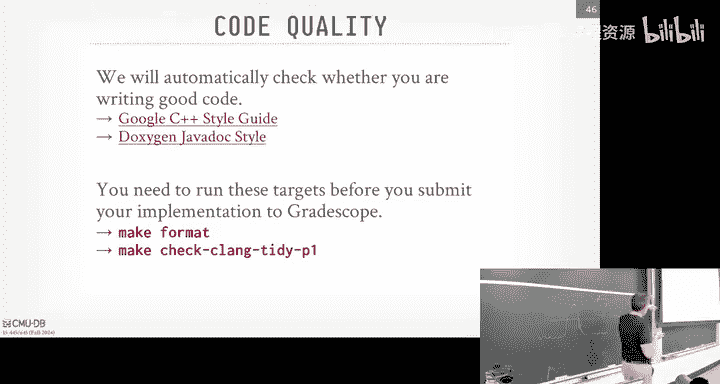

# CMU《数据库导论｜Intro to Database Systems (15-445645 - Fall 2024)》中英字幕（deepseek翻译 - P7：#06 - Memory & Disk I_O Management.zh_en - GPT中英字幕课程资源 - BV1Tys8eQELW

Yeah。OfficialJust to reiterate again for everyone。That's in the class again we have all our friends from industry that various database companies on campus here today tomorrow。

 and then tomorrow morning they're having all the info sessions， I posted this on Piazza。

It own'piazza。Or it's on the website too right So again， if you're in the class。

 by all means come to this。 And if you haven't yet put your CV and your availability on the spreadsheet on Piazza。

 please go ahead and do that。 I think there's actually gonna be a bonus info session at 1230。

 I think the confluent guys are actually decided to come to the last minute。

 So I'll post on that Piazza where that would be。 I don't know what room it is。 So again。

 start at 930。 And again I basically took everyone preference is。😊。

Ask ChatBT to write me a linear program to come up with the Apple schedule。

 This is what it produced based on availability and preferences， so。It looks reasonably correct。Okay。

 any questions about this。 Again， these are like informal sessions about like theyre describe here's what their system is doing。

 Here's some of the problems they're working on。 Here's what internships in full time positions look like。

Okay。😊，And we like all these people。In some of them cases， like Beviate sent their CTO。

 the co foundunders here from Germany， and then the Clhouse guy。

 I think he's coming in from the Netherlands as well。these people。

 you can ask some technical questions and they'll know the answers， okay？All right， awesome。

All right， so last class， we were sp single on the first problem here。

 how we're going represent data for their database on disk。😡，And so today's class now we said， okay。

 now that we know what things are going to look like in disk。

 we need to bring it into memory to do something with it。

 So that's what this discussion is going forward。 And this lecture will be， okay。

 how we actually can facilitate that movement back and forth and how do we keep track of what we have in memory and what needs to be get written to disk at certain times again。

 the reason about the do of this is because the Vineomeman architecture。

 we can't operate directly on disk data our data render die on disk。

 there are specialized disk that can do that like some like Samsung will sell you an SSD。

 that get arm core on it， and you can actually program， do stuff down there。

But for general pre systems， we assume we' got to bring it into memory。 right。

 So today' is really about， okay， how do we do this and how do we make it look like we have more memory than we actually do without slowing things down。

So there's two main things we're going to try to optimize for。😡。

The first is we the spatial control which is where things are actually going to be physically located on disk and the idea here is pretty obvious that we want things that are going to be used together to be stored together on disk。

 maybe not necessarily in the same page but contiguous pages so that way we at least try to do some sequential access to go do one IO or one fetch and go bring a bunch of stuff in。

😡，Right。Some systems like in Spanner， for example， you can actually do denormalization。

 meaning like I have two tables and a this tuple has a foreign key that to the other table and I'll pack in actually the tuple from one table inside the other tuple so that when I do a join the data is all on one page。

 but again most systems don't do that。😡，The approach is sorry。

 the other thing we're not optimized for is temporal control。

 so this would be when we have to read things into memory。

 we want to try to keep that thing in memory for as long as possible。😡。

For as many queries or operations that need it and only evict it when we don't think it's going to be used。

Wor case scenario is that we。We read a page。Do something with over a query， throw it away， evict it。

 Free the memory。 And then next  query comes along， and we just read the same page again。

 or' go back disk again again。 We're basically thrashing things back and forth。

we want to avoid the long stalls so we're having to read things from disk because disc can be significantly slower than than memory。

 And so we're going to see in our buffer over replacement policy and in our right back mechanisms for the background writer that will try to be well try to choose things that to evict。

 if we think it's unlikely to be used， which is not always easy to do。

So there's a high level overview again， the diagram that I showed in the beginning。😡，And my monitor。

 fellow well。If the cop's call。It's here。longong as one。 that's all they care about， All right。Yeah。

 that one okay okay， so here's our our database is a bunch of files on disk and this will be broken it up to a bunch of pages right and whether it's an LSM architecture or the heat file for our purposes here today we don't care。

😡，And then now up above in memory， we have this thing called the buffer pool。😡。

And it's going to be comprised of a bunch of frames。

 And think frame is going to be the same size as as as a database page， right。

 We just call it frames because it's the kit uses the term slot。

 It's the location where we can put a page in in our memory。

 And the B manager is responsible for managing managing the content of memory。

And then up above and higher abstraction level in the system， we have this execution engine thing。

 which we haven't talked about yet， which will come later on。😡。

And the execution engine is gonna run a query and say， hey。

 I want to get page2 and it got page got page number two from the record ID。

 remember said that the physical identifier for Tple would be some record ID we couldr of a file number and maybe an object number and a page number and a slot number So given the page number we can go to the buffer pool and say。

 hey， we want to get page2。 Well， the first thing it got to do if it hasn't done already is bring the page directory because that's gonna to tell us where to find the page2 then we go take that all set in our file copying page two and we're gonna to put it in some free frame in our buffer pool。

😡，And again， this basically BMM copy， we're going to copy the content where the page is its own disk and put it into memory。

😡，And then now what we're going to get back to the execution engine is a pointer to page  two。😡。

And then page two can do whatever it wants to interpret the contents of that page， the bytes in it。

 by reading the header looking at the catalog， if it's an LSM。

 it knows how to parse whatever' ins inside of it。Okay， what do you got just step on it？あ。

All right done， all right。They better。All so right and then you can do whatever it wants with page two。

😡，All right， so then now say the exterior engine finishes whatever that query is。

 and the Buff manager decide oh， I need to free up space。

 ignoring that we have a free frame it doesn't matter。

 we're going to somehow throws throw away the frame the first frame and throw away page two。😡。

But then now the execution engine comes back and says， hey， I need page two again。😡。

The the bufferable manager can say， oh， I don't have it in my in memory。

 I got to go out to dis and get it， but it can now decide， okay。

 I'm gonna put page  two into this other frame and get back a pointer to the execution engine to to where that is。

So the idea here is that we're giving back pointers to pages so that the rest of the system can operate on them。

 but the rest of the system can't assume that the frame is going to be or sorry that pointer is always going to be the same location。

😡，It's always got to go through the buffful manager because that's the final arbiter or the coordinator to decide what's in memory and where can you find it in memory。

😡，So we can move things around the much we want， and the rest of system will work just fine。😡，Right。

 because。I'm at the high level decision is operating on record I that produced page number two。

That's just something on disk。 and then this thing says， okay， let me go get page two。

 I know where to find it and let me go hand you the pointer to it。😡，Okay。

So this is the big picture of what we're trying to accomplish it at。😡。

So I'm sharing this this sort of high example with。know assuming we're getting tuples。

 there's going to be other parts in the data system that's going the LCD memory pools and they can rely on this buffer manager as well。

 but maybe not not always。😡，If any time you need to be able to swap things out to disk。

 like I'm trying to allocate much of memory and I'm running out of space。

 like as I'm running a query， then you want that memory to also be backed by the buffer pool because it knows how to move things out。

😡，So we'll see this later in the semesterer， but there's a bunch of different things we could want to use this for。

 like sorting and join buffers， again if I'm trying to build a hash table due to my join。

 but I want to be able to support a really big hash table in more memory than I have。

 then I can back a buy a buffer pool and it knows how to write things out to a temp space。

 maybe rather than a regular database fall like a scratch space or a swap space。

Buffs for other new maintenance operations， query caching， and so forth， right？😊。

Other things are going to need memory， and sometimes to be back by disk， sometimes they're not。😡。

If you want， if you need to be able to spill the disk and still use that memory， then yes。

 you want to back by something that looks like a buffer bowl。

So what we're going to talk about today is the background of what the buffo manager is going to do for us。

 how we're actually going implement one the policies we're going to use for it。

 Then we'll talk about why you don't want to use Mmap in your database system。

 but then we'll talk about how to handle disk guy scheduling and replace some policies。

 and then this should be optimizations。 We're gonna finish off with optimizations you can do to make your buff manager better than what the OS can ever provide for you and then we'll finish up with discussion real quickly on project1。

 which came out last week。So as I already said before。

 the Buff manager is basically something that's responsible for managing an array of memory of fixed sized pages that it can hand out and reuse for different parts of the system that needs memory。

😡，Right， and as I said， instead of what we're going to call sort of the look the。

The placeholder location within that array of memory that we can reuse。

 we're going to call that a frame。And that's going to be the same size as a database page。😡。

Now some systems can support different database page sizes per table or per table space。

 and they basically have to have a buffer pool for each of those。😡。

You're just carving up with the amount memory that your system is allowed to have。

So the idea is pretty simple that when something， some part of the system wants that wants to。

Access the page。 It's on disk。 We first got to find a free frame that's available for us。

 And we're gonna do a， you know， read read that file from disk or read it from whatever the remote storage。

 And we're going copy that into our buffer pool。And then we can do this for as many pages as we want。

 And that the ordering of the data in memory。Does not have to match with the ordering of the data on。

 on disk because it's page 1， page 2， page 3， in memory， it won't be in that same order。

Because some frame was maybe free at a different time than another frame。

 and we'd put things where we needed。Part thing I understand though。

 is that even though this is the buffer is essentially a cache， it's going to be a right back cache。

 meaning any rights that we're going to make to these pages when we need to operate them。

 we're going to make it to its in-meory representationvisation first。

 and then at some later point which will define in a few more slides。

 then that dirty page would then get written out and flushed out the disk。😡。

It's a bit more complicated than that because there's actually additional metadata like a log file we need to record。

 and we need to make sure that's written to disk before the page that it got modified by that log record I written in the disk。

 but that willll cover later。😡，Right， so it's not a write through cache。

 right through cache would be， I write into the thing of memory and that immediately gets written out the disk。

We don't want that for protection reasons like durability reasons because we don't know whether the operation that maybe wrote that page has actually fully been saved or committed。

 and we don't know whether we want those changes to be durable， but again。

 we'll cover that later in the semester。😡，So in addition to keeping track of these frames。

 there's also going to be this additional data structure in our B manager called the page table。😡。

That is essentially a mapping from a page ID to some location of where you can find that page in the memory of the Buffalo manager。

 essentially a mapping from a page ID to a frame number。😡，If it exists。😡。

And so there be some additional metadata we want to maintain in our page table or in the buffer land either within the page tableable or in separate data structures that we're going to use to keep track of what's going on with the memory that we've allocated and using in our frames in other parts of the system。

😡，Because we don't want to have someone say I need page two， we find a frame。

 put page two in there and then someone else comes along says， hey。

 I want page3 and we take over that frame we just use for page two and now put page3 in there because now other parts of the two parts of the system is going to have a pointer to the same frame。

 but one guys going to think it's page two， one guy thinks it's going to be page3。😡，Right。

So we need some ways to protect ourselves， protect our memory。

 and make sure people are getting back the data that they expect。😡。

So additional mediata we keep track as a dirty flag。

 has the page been written by some part of the system。

 therefore we know that we just can't drop it when we need to free memory。

 we need to write it back to the disk at some point。😡。

There'll be a pin of reference calendar telling us how many threads or workers。

 what do you want to call it， how many other parts of the system are holding pointers to those pages right now and could be accessing them？

😡，And then additional tracking metadata we'll see later on about the timestamps so maybe when things have got accessed。

 either from the last time or the last n number times， okay number times。😡。

And we're going to use that additional information to keep track of what should be evicted or things like。

Who accessed to page， was it a query， was it a background worker maintenance operation。

 was it in a transaction？😡，Things like that。All right to say a thread comes along and wants to access page three。

 we look in the page table， we'll use conional mechanisms latching to get us in there to protect ourselves。

 but if we know that why don't you find page3 and then the pointer back to whoever asked for this。

 we'll put the pin in there or incrementalcrement the reference counter to keep track of hey。

 there's somebody out there that's looking at page3 right now in this frame so don't try to evict it yet。

😡，And then say someone comes along and wants to access another page。That's not there。

 So in this case here， we got to take a latch on the page outside the entry in the page table because we want to say this thing's empty。

 We don't want anybody else trying to insert something while we're trying to insert something into it。

 So the latch is going to protect us。Then we take page two， copy it into a free frame。

 update the metadata inside of this entry to say， here's now where page two has we found。

 here's information about who accessed it and what timestamp。😡。

And then we can go ahead and release the latch on this entry in the page table。

 but we're going to want to pin it obviously first。

 because we to make sure that nobody else then tries to overtake this entry in the page table and put another page in there。

😡，Right。So this is a high level this is what we're trying to do。 Any questions。Yes，It question is。

 when will will a page be pinned， It's like， if I say， do you have page 2 and I get back， yes。

 here's the pointer to it at that point pinned because I'm giving you a pointer to to page 2。

 But it's， it's really a pointer to somewhere you know， in my， my frames。

So so long as I'm holding the pointer， the page is still。And question is， long youre to the pointer。

 the page is still。 Yes， because well could happen。

 Someone could swap out what you're pointing to because Jane。

 you're pointing to to these locations in memory if someone swaps out page 2 with page 4。

 but you still hold the pointer to it。 and you want it there to be page 2。

 Then you start reading things thinking it page 2。 and it'll read something else。Yes。

Is the education engine responsibility。This place。This question is。

 is the responsibility for the S engine to come back to the Buff manager and say I don't need this page anymore。

 yes， or whoever asked for this page， if the contractor and the API is。

 here's the pointer tell me when you're done。😡，Which we can enforce because it' we're the one building the system。

 It's not like we're trying to deal with Rs on the Internet。Okay。So back here， I used the word latch。

😡，They better know what that is。With the latch。With that。Youtex， yes， perfect。

There's this distinction in between sort of the systems or operating systems world and databases。

 where right they're wrong， but what they would call lock， we're going to call latch。😡。

And as he said， it's typically going to be。A mutex。We'll cover locks later on。

 but the reason why we can't use the word lock is because lock in the database world is meant to protect some higher level concept or logical entity within the database itself。

😡，So I can take a lock on a table， lock on a tuple， lock on an entry in an index。😡。

And there'll be some extra protection mechanisms that data systems can provide to make sure if they're deadlocks that you'll kill you'll kill one of the threads of workers holding the lock to break the deadlock。

RightLike this is locks are dealing with the outside world， doing things on the database。

 and therefore we assume they're stupid and we have to make sure that they don't lock up the whole system。

😡，Alash is going to be an internal protection mechanism that we as the data developers， people。

 because're building the system that we're going to use to protect critical sections。😡。

Because we're getting paid a lot of money to build this system that we're not going to be stupid about it and therefore we're responsible for making sure that there's no deadlocks。

 like there isn't going to be some thing floating above the clouds that can kill our deadlocks。

 it's through programmer discipline and we make sure we don't do stupid things。😡，Right。

 so then in this case， yes， you can use a low level mu text。 You can use the the。

The standard library Mut， which is really a few text and Linux we'll cover later。

Most data systems don't want to use anything that opportunity symize you。

 so we're going to roll our own new text ourselves， roll our own latches。

 We'll cover how to do that later。But just when we saylash again。

 think of like a mu text protecting critical sections。

 and therefore we got to make sure we don't shoot ourselves in the foot， have deadlocks。Alright。

 the next question you may have is like， okay， what's sort it between a page table and a page directory。

 So remember， the page directory is this。This thing on disk that is going to be mapping from these page IDs to some page location in the database file or files。

😡，Right。And anytime we make a change， we add more pages to our table or whatever。

 we have to update that page table， and every time sorry the page directory and if we restart。

 then we load the page directory back in and needs to be synchronized with the actual files themselves。

😡，The page table is an ephferemerable data structure that're going to maintain in memory inside our Buffo manager。

 that's going to be the mapping from the page IDs to the copy of the page existing in our Buffal pool frames。

😡，So if we crash or stop the system restart， the page table is going to be blown away and we've got to rebuild it。

😡，RightBecause the second time around， we might be reading in in different， different pages。Okay。

Alright， so now if I just said were， what we're trying to do is maintain some internal data structures that iss going allow us to map。

P IDs to arbitrary locations in memory and give the illusion that we have more memory than we actually have。

 what does that sound like？😡，Virtual number， yes， So they're like， okay， well。

 why are we doing all this work， Why didn' and bother doing Project1。

If the OS can kind of already do this with virtual memory。😡，So how you do this with the OS。

So OS has this feature called memory mapping or Mmap。

The basic idea is that you have some files on disk， you call M map open on it。

 and that's gonna to literally map the the， the contents of that file into memory for your。

 for your application。And again， it's gonna do these la la。 It's only， you know。

 it's not gonna to bring all the contents of the file bring a memory。

 but it's gonna give you some starting point and an end point based on the size says， okay。

 here's the regions of memory where you can access that data。

 And if you then try to access something that is not memory yet。

 itll be a page fault and it'll read it back in。😊，RightSo again it's going back to our database file like this。

 right we have this virtual memory thing here， nothing's populated。

 my thread says I want to access page one， page not one is not in physical memory。

 so there'll be a page fault while this thing goes。

 the OS copies that page brings it into memory and then updates the virtual memory to point to now your page。

😡，Right。Same thing， if I want to access page three， copy it in and we're done， right？

What happens now if I try to access another page？Weve1 access page two。

I don't have any the US recognize。 I don't have any more physical memory。

 So now hits a page fault and says， okay， the thing you want is in memory。

 So I got to decide which of these things I need to evict。And when it does that。

 it stalls your thread。 It stalls your process because it's trying to be transparent to you to not know that。

 oh， I'm the thing you want is in memory。ItIt's just gonna stop you， stop film running。

 deschedule you， fetch the thing you need， bring it into memory。 And then once it's memory。

 then you get back the pointer to the thing you want or do whatever it is that you want it on it。

 right。😡，So the O S is clearly hiding from you the mechanism to。

 to decide how to move things back and forth between disk and memory to give you again that illusion that you have more memory than maybe you actually do。

Right。So。If I'm saying it's going to polish your thread。Well， that sucks right， If I'm running my。

 my， my query。 if I， if I only have one thread of my system。

 then like I can only run you know one query at a time。

 It'll be a long pause while it goes and fetches things out of out of， you know， out of memory。

 out of， you know， and bring them in the disk。 So all right， well。

 what if I have multiple threads running at the same time。😊。

One that maybe high some of the pauses because one threat could keep running while another one gets stalled。

Does that solve all our problems？I guess the opening slide said M is gonna murder your database system。

 So you all， you all think it's a bad idea。 You don't know。 Maybe know why yet， okay。

So here's why it sucks。The first thing is that the operating system can is free to flush any dirty page at once at any time。

And I just said in the beginning， that's a bad idea because。IIf I write， if I write to a page。

 like an update query， update a page。If I'm updating multiple pages in that single query。

 I want to make sure that I make all the changes。And have them all right now atomically。

Before I say yes， this operation has completed successfully。But as I said before。

 we can't guarantee that the hardware can write out more than a four kilobyte page at a time。😡。

So if I'm updating making a bunch of different pages dirty。😡。

And I may be still waiting to decide what's， you know， existing actually confirm complete。

 The other decides， all right， I need space。 Let me start writing out your。

 Let start flushing your dirty pages。And then now if I crash and come back。

 I got to figure out what the hell the OS actually wrote。😡，Before I crashed。

 and I don't know what it wrote because it did it all for me underneath the covers。😡，So。

 that's terrible。We've already talked about the stalls since the data doesn't know what pages are in memory because the OS is managing all that for us。

 you can't look in the page table and say in the OS and say what's actually in memory or not。

 that at any time you could try to touch something and then you end up stalling。😡。

So how do you get around that， Well， you could have something that like occasionally tickles pages in a separate thread。

 So if it stalls no big deal。 And then that way， when your query tries to go and touch it or touch the page。

 it doesn't up get stolen。But now you're building much extra infrastructure to overcome this。

 this problem with the operating system。 and you end up building a lot of infrastructure you would need anybody to have a buffer manager。

And furthermore， how are you going to know what pages to tickle， tickles is not bad whatever。

 you know what I mean， like how do you what pages do you want to touch before you need to touch them if you haven't run the query yet。

😡，So that sucks。What happens if now if there's an error？😡，Right。Do you get an exception。

 Do you get like an error number， no？You get to interrupt。

How do you handle interrupt in your program？Enter up handler。Where do you put that？Everywhere。

Because now at any time in any part of the system that you're accessing memory。

 but it's backed by Mmap， you have to also include the interrupt handler because all of a sudden you may try to tests something and you get a Sig bus and you got to decide what to do with that error。

😡，At least if you use the Lipsy or Posic API to do F readE， F right。😡。

You'll get back an error number。 It's going to lie to you sometimes we'll cover later on。

 but at least now you like it's a single location where I know I'm gonna be accessing something on disk。

 I bring to memory。 Now， the rest of my system can operate on those pages in memory。

 and I don't worry about them touching something that somehow magically got swapped out or some issue happened at the OS is hiding from me。

😡，And then we're not really going to get to performance issues， but to take my word on this。

 it's going to be slow。Because what is the， How does the OS S maintain that， that mapping。

They basically have their own version of a page table。😡，How are they going to protect it？

With New Texas。A they may good New Texas？No， it's gonna be the Li C futex one， which there's better。

 there's better ones out there， even though Linus disagrees。 right。

 So now all the things we're trying to， we， we'll see these optimization later on。

 all the things we can do to reduce the contention on our page table。😊。

And being smart about what we're evicting and why we're evicting and when we're evicting it。

 all I guess thrown out the door because the OS is doing everything for us。Yes。

So for problem that exception or there is no exception you interrupts interrupt Yes interrupt or is that the information not？

His question is。What's， what's the problem is it interrupts Because the problem is that it's any time I touch something in in memory that's backed by the M map。

I could get it interrupt。It's like you basically need to duplicate error handling code all over the system versus like if the error is gonna occur when I read something。

 there'll be one location in the disk schedule that we're gonna to measure ourselves say， okay。

 now I'm doing the F read or the read， Go get my data and I can check at that moment of reading am I do I get an error or not。

 So the blast radius of where that error can break is just just located the part that does the IO versus like I'm touching memory that's magically backed by M map files。

 I have to have error handling anywhere because any operational in that memory could throw and interrupt。

😡，Could hit interrupt。Right， so there are some ways to avoid some of these problems。 but again。

 as I'm saying， it starts to smell and look like a buffalo manager going to build in Project1。😡，So。

You can use the MI function。 you can basically give OS hint about how you're gonna to read certain pages。

 You're going to read these things sequentially。 You're going to read these things in random。

 You can call Mlock on it。 you basically tell the OS that it can't some memory Age can't be paged out Now you can't guarantee it it's not gonna be written now because the OS can still flush out dirty pages for you。

 Mlock doesn't protect you from that。 It just says I can't swap it out。😡。

And then you can call M sync， which would be equivalent to F syncync。

 would be tell it to flush out memory rages at the disk， right。

So there's all these tricks you can do to try to contort Map to do what what we want in our Buffo manager。

 but at the end of the day you end up building something that looks like Project1。😡。

And it's actually going to be even crapier because you still have the core mechanism of reading things in and out from disk。

 mened by the OS instead of the database system， which is always going to be in a better position and know more about how the data is going to be used than the OS could ever be。

😡，Right。So。There's been a lot of systems that start off building Mm are basing their system based on Mmap。

And surprising number over the year that we felt compelled to actually write papers about why this was a terrible idea。

 So there two categories here。 There's all the systems that are make full use at Map。

 And then the systems that maybe started off using full M app and then switched to partial usage and eventually got rid of it。

 So I actually found out today from the VB8 guy， they started off using M。 And then they realize。

 as they're saying that it was a bad idea。 So they got rid of it。

 So all these other people have have made the largest journey of starting with M because it's quick and easy and gives them some basic functionality that they would want。

 And then turns out it's a terrible for all the reasons Ive about before。 in some cases。

 also terrible if you're running in the cloud。 and you want to be able have observability in the performance uses or the resource usage of your data system。

😊，MAP hides a lot of crap from you。So I always like to talk about mango to be。

Mgoby is a very flexible data system， despite some of the hiccups they had over the years。

 and one of the hiccups there was when they first came out， they were based entirely on M。

And they were。 they raised a lot of money。 They had a lot of customers。

 They had a lot of top engineers and。Even after all those engineering resources that were available to it。

They end up throwing away the M engine and switch over to wire tiger。

 which is based on the Buff pool manager that you're going build Project1。

 So if Mongo to B couldn't figure it out， then what hope does any。

 know random Joshsmo startup have without those resources。Sgelite has it。

 but they have it for portability reasons， and it's not turned by default。😡，Right。

Systems like Elastic， they're primarily read only serving read only workloads， same with Moon A to B。

 so MO might be okay in that case， you won't have maybe the safety issues that other systems have。

LMDB is the exact opposite of me。 I'm telling you never use M。 He's telling you use M for everything。

 He loves it right and he emails a bunch of the other database systems and tell them why they're doing it wrong。

 they should be using M。 he's the opposite of me。 they still have some M in it。

 So they're probably really down here， but they're eventually going to get rid of it。Right。Alright。

 so again， the thing that reempsized over and over again。

 the data system is always going to do a better job than any other part and the operating system could ever do because it knows what the queries want to do。

 what data has been modified， what's coming up and can therefore can always make the best decision。😡。

The OS is not going to be our friend。 We need it to survive。

 but we don't want to rely on anything that it's going to provide for us， especially managing memory。

And so as I said， we wrote a paper on this a few years ago。 Never use M in your database。

 we discussed all these issues。 And then we there was also a short little video that's on YouTube you can watch that basically shows the the challenge and trials and tribulations of using M。

 We thought this a big way to again， evangelize our ideas and know he buys an M B manager from a shady guy in the streets。

 and then puts in this database and then realizes it falls apart。😊，Right right， but anyway。

 that's all available online。Okay。So。If we're going to read that things into into memory。

 into our Buffo manager， at some point， we're going to run out of memory。😡，And therefore。

 we have to make start making decisions of what what to evict to free up space so they can use it for。

 for new pages， right。But there's a bunch of things we need to consider in whatever algorithm we're going to use to decide how we I want to evict things because we again。

 we don't want to be slow like the O。 We want to be you know。

 take advantage of all the things we can extrapolate from the worklet and from the queries in the data to come come along and make a better decision。

😡，So this is sometimes called the buffer replacement policies or cash from policies， right。

 They have a bunch of names。 Thiss like one the classic problems in C， sorry。

 one of the oldest problems。 and everyone has a paper in this space。 I think we have two of them。

 I forget So we obviously want to make sure that anything when we decide what what pages to evict we want to pick the correct ones We don't want to pick the pages is most likely be used next by the query because then it'll be thrashing back and forth the disk。

😊，We need make sure that we can quickly determine what pages to evict  quickly as possible。

 by that means we don't want an empty complete algorithm to find the most optimal page to evict。

 because then if our page evi algorithm takes 100 milliseconds。

 but it only takes 10 milliseconds to read the page， that's not a good tradeoff。

We need to make sure that we don't evict anything that is not durable yet。Mean。

 like we don't want things to。If we haven't written out the log record that corresponds to the page to the modification of a page。

 we can't write that page out to the log records written out for safety reasons。

And then for the amount of metadata we need to keep track of for our pages。

 if we want to minimize that as possible because we don't want to use a lot of memory to keep track of all this extra metadata because we could be using that memory for storing pages themselves。

😡，So I will say this is one of the things that's going to differentiate the open source systems between the high end expensive enterprise systems like Oracle。

 SQL Server， DB2， Terraada and so forth。They have spent millions and millions of dollars。

 hundreds of， hundreds of hours of of engineering to try to opt optimize this thing。

 And Postgres and those other guys are just simply not going to be able to compete。

The enterprise system is going to have way more bells and whistles than what is available in the open source ones。

 The problem also too is sometimes they don't always talk about。

 but they don't always talk about what they're actually doing。

 You can kind of glean it from reading the doification。

 but there's a lot of different options that are available in the enterprise system。

 And we'll touch on a little of those as we go along。So。😊。

The most common buffer report of his own policy is going to be what algorithm？She was like intro CS。

LRU， at least recently use， right？It's pretty straightforward and it works reasonably well so the idea is that for every single page we just keep track of when was it last accessed right again。

 the executionion engine has to go to the Ble manager and say give me page two to get back the pointer to it。

😡，And at that point， we can record， okay， what is the timestamp。

 either the wall clock time or a logical counter that says。

 here's the time when the thing was accessed。😡，And then so we can use them on different data structures to keep the pages in sorted order。

 like a link list or a B plus tree or try or whatever。

 and we can use that to determine very quickly when it comes time to evict something。

 which one was the least recently used。😡，RightSo simple example， query1 comes along， touches page1。

 page one is in the middle here， And so now we're just going to move it to the head of the list。

Right。And then when it comes time to evict something， since page2 is at the tail of the list。

 that's the one we're going to choose to evict。Right。

So this is going to keep sort of an exact ordering again， based on that， the access timestamp。

There's a more simplified version of this where you actually approximate the ordering。

 may may not know exactly whether one thing was accessed before another one in the way LRU does。

 but we reduce the amount of overhead we have to maintaining these timestamps by just saying has been accessed recently enough。

And the algorithm he used to you this is called clock， Who here has heard a clock before。

Small number。 Okay， this is actually what Linux uses。 They use a multihand clock。

 but the idea is basically the same。So this going me an approximation of LRU。

 where instead of recording a timestamp， all we need to do is keep track of one bit per page that says。

 has this thing been accessed since the last time I checked？😡，And you're going check every so often。

 every time you got to evict something。 And if the bit is set to one。

 then you know it's been it's been accessed and you can reset it to zero。 If the bits 0。

 then you know the last since the last time you checked， it hasn't been accessed。

And so you basically map the pages in sort of a circular order like a clock。

 and everyone has their own ref bit。And any time your pages access， you just set the bit to one。😡。

So now when it comes time to evict something， I got to find a frame to free。

 so I start at some location that can be random， it could always be the same spot or pick up where you left off。

 doesn't matter。😡，Because eventually it all rounds out。So I go to page 1。

 hass this thing been accessed the last time I checked the ref bit is sent to one。 So yes。

 So therefore I shouldn't evict it。 but I'll said it's rep bit to 0。Clock sweeps around。

 looks at this page now， Brethbed is zero， I know has been accessed since last I checked。

 so I can go ahead and blow it away。😡，And I can fill it in with a new page and set its repbit to zero。

Right I just keep going around and do the same thing over and again。

 and then maybe the clock starts back over at the top。 This guy has' an access。 We said it a do。Yes。

The reason why we were load page5 to replace page two we said it。都关。So the question is。Back here。

 when I swapped out evicted page two。I brought in page5。

 I had this rep bit to zero instead instead of one。😡，Well， the idea here is that。I brought it in。

 but I I have no history about whether it's going to be accessed again。

 So I'm going to set it to zero because maybe I I I had to bring it in。

 I serviced the request that needed it。 right， So that's fine。 I'm able to do that because again。

 we're still maintaining the pins on these things。😡，But I said it to zero。😡，So that way。

 if I come back again， if， if it was a one shot， one time， you know， read， then it'll get evicted。

 If someone else really needed it， then his bit will be set to one， and therefore。

 it won't be evicted。So it all sort of just works out。喂。Yes。😊，Do we just delete need a random page。

His， his question is， would you delete a ramp page if they're all set to to 0。 So you， you。

 whatever sorry， if they're all set to one，1， what do you do。Well。

 when you check and it's set to  one， then you set it to 0， you come back around。 And then it's。

 it's been e。 At that point， if， if you're just stuck an infinite loop。

 you basically have a counter set， how many times I've looped around。

And then if you just can't evict anything because they're all pinned， they're all set to one。

 then you reject the query。 You say， I can't run。You send add a memory error or something like that。

But at that point， queries have run super， super slow。

 so the human or some operator would know this thing's overloaded and do something else to mitigate it。

All right。So LRU and clock are nice。 They're pretty simple， They implement。

But they're going to be susceptible to a problem that with the face and data systems called sequential flooding。

And the idea here is that if we have a query that comes along and it wants to touch。

Do a sequential scan on an entire table meaning it's going to read every single page。😡，In that table。

Either once or multiple times， but the case is doing a join， then this basically going to wreck our。

 our， our buffer pool and all this metadata we're tracking for it。

 keep track of how things are being used because now everything's going to look like it was just recently accessed。

And。It's going to throw away things that maybe were really hot。 We definitely want to keep in。

 but because。We're going going by what was most recently accessed。 They'll get， you know the。

Things that are we should have kept again up throwing away。

So in OLAP workloads or analytical queries， it's actually sometimes the most recently used page is the one you want to et because again I'm scanning through。

 say I'm scanning through once， I bring the page in and I read it。

 then I'm never going to read that page again in that same query and maybe it's a one off thing that nobody wants to read。

 So that's actually what I want to evict the most recently used， not the least recently used。😡。

the problem here is that LRU and clock since they're basically storing a small amount of information。

 when was it last accessed？It doesn't tell you how many times it' access in the past。

 we're not in a good position to make decisions about should we actually keep this thing in memory or not？

😡，So just again show the example， say I have this query here doing a primary key lookup where ID equals1。

 this is very common in the O workloads， looking up single records and say that's in page0。

 we have a miss we bring into our bufferuffable in this frame and we service the query we're done but now someone comes along with computer an average value and across the entire table so that's just going to scan through and reach every page one by one then at some point we're going run out of free frames。

And it have to decide what I want to evict。 well， based on the scan。

 page0 was the least recently used， so I'm going to go ahead and evict this。

to bring in now page three。But now， as I was saying before， this query shows up。

 the same query shows up again once access to that same page because that's， it's a hot record。

 I bunch of queries keep want to read over and over。 Like it's Taylor Swiss。

 Twitter account or whatever she' she's using。😊，Instagram， sorry。Right。I've got read that。 All。

 so what's that ahead。Yes， al right， so anyway。 So。

 so this  query keeps excludedd over and ever again。 page 0 should be， should be kept in memory。

 but because we're only keeping track of what's least reason use， it's going to get evicted。

 And now we have， you know， they're right。 Let go back to just again and get it， right。So that sucks。

So a way to overcome this is a simple technique called L UK。

And it comes from a paper from the same guy that invented log structure me trees that we talked about a few lectures ago in the 1990s。

And the idea here is that we just keep a little extra metadata to keep track of the last number for some K references of the timestamps of。

When the page was accessed before。😡，And then when it was come timed now to decide what to evict。

 you look at this history and decide which one has the longest interval。😡。

From the last time it was accessed from one access to the next。

And that's the one you end up deciding to， to evict。

So what you end up nicely balancing is things that are recently accessed over and over again in quick successession and the number of times that it has been accessed。

There's some additional tricks you can do that SQL Ser does that Postsco doesn't do。

 where they actually keep track of， is this page being accessed repeatedly within the same transaction？

😡，Like， for whatever reason， I go get Andy's order record。 I do something。

 then update Andy's order record。 Well， that if you're just doing regular LR UK。

 that would look like those pages access twice， but it's really in the same transactions。

 So you can kind of technically say it's only in access once。Right。

 so SQL Sub can distinguish in what context a page is being accessed and add that to its additional metadata to keep track of these previous entries。

Right。Another problem I'm going to have is with cold starts right If I stop the system and come back up。

 now I have no metadata about。When things are accessed， sometimes I sort that out to disk。

Or I can maintain things like， if I've recently evicted something。

 I don't want to throw away anything I'm having in that metadata about how many times access maybe I had to temporarily write it out because I had to do something big operation I needed space。

 But then when I bring it back in， I don't want to learn from scratch all over again how often it's being accessed。

 I'll maybe maintain a small cache and say， here's this metadata know。

 here's the metadata when it was accessed when it was in memory before。 And that way。

 I can have my my algorithm converged pretty quickly。😊，So this is actually what Postgres does。

 There's a mailing list post from like 2002 again， open source systems。 So everything is public。

 where someone says， hey， we found this paper。 This seems like a good idea。 We should do this。

 and they did it。This is what Postgres does。AndThats exactly what the paper does。

My Se does something a little bit different。😡，They have a technique they call approximate L UK。

And the idea here is that it's still a single link list， if you will。

 of the ordering on which pages are accessed， but now they're going to actually have two entry points or two heads for the LE list。

 one for a young section and one for an old section。Right， and the idea here is now when a。

When someone accesses a page， it gets added to the buffer pool and we need to keep track of when it was accessed。

 instead of just adding it to the beginning of the LOU chain。

 we'll add it to the first time it's access to the old one。So think of this like。Hey， yeah。

 we know we needed you， but I'm not going to immediately keep you long around for a really long time。

 If I put you in the beginning of the entire list， I'll put you in this middle point here。

Because then if it does， if it does need to be accessed， then I'll eventually get upgrade here。

 right So in this this case here， page1 is going to get put here。 we get the last page。

 everything slides over。 If I now access page1 again。

 I'm going pull it out of this this part here and put it now to the front of the head。

 the young section。Right。So the idea is， again， it's like L R U2， L U K with K equals 2。 where like。

 I'll keep track of like， the last time I was accessed， am I in the old section of the new section。

 And then if I'm in the the old section， then I'll get promoted to the young section。

 So I'm even more less likely to get evicted the next time around。

And eventually it gets washed out because if it gets accessed again。

 then it just moves back down here and then it'll get evicted。

MySQL does this because it's easier than what Postgres does， and SQL server does， it's less metadata。

It's like easy extension to LOU。So there's a bunch of other things we can keep track of to decide when to evict things。

 we can do this on a per query basis。What we do globally for the system。

We actually can give me more fine grain in some systems we can do on a per table basis or even per index per table space。

Right。So in the， the idea of a global eviction policy would be across all the queries running my system outside which page is at least recently accessed。

But in some cases， what I want to do is have a small region of my buffer pole be dedicated to one particular queryry。

And then when I went to decide something to evict， I'm just evicting things localized for that one query that doesn't affect the rest of the system。

So what mean this。 So Postgres does this。 So when you do sequential can on Postgres。

 they'll allocate some portion of the buffer pool as a ring buffer for that one query。

And then now if I'm doing Sccho scan and I'm bringing in pages。One by one。

 if I run out of space in this ring buffer region， instead of just evicting what are the global least recently used page for my entire buffer pool manager。

I'll just take whatever the most least recently used page was for that this ring buffer。

 this portion of memory。 So now I'm ripping through pages。

 and I'm throwing things out and evicting things based on what I need and doesn't pollute the sort of the global eviction policy for the rest of the system。

Right。And this is like。P query， they'll give you like 256 kby in the Buff pool。 It's like 32 pages。

 because it's 8 kiloBs a page。 So it's not a lot of memory。But at least。

 it's enough to print pollution from the rest of the system。

So now if I do a sequential scan of Postgres， I evict things based in this sort this sliced out region is still accessible to the other parts of the system。

 other queries because。😡，I need to know forgiven page number or what frame is it located in。

 but when it comes time to evict， if nobody else actually needs it。

 then I can go ahead and evict something that the least recently page I read。

Another trick we can do is pass along priority hints to the buffer manager about how a query is going to access a page。

 and then now the replacement policy can use that in this decision to decide whether to evict something or not。

😡，So you can almost think like a hint is like a light pin to say， hey， this thing is important。

 I'm probably going to need it a lot， but。I'm not really accessing it right now say if you got it evicted。

 sure you can get evicted， but try not to。So this would be important for things if you have indexes。

W which will cover B plus trees and trees data next week。But say I have a query。

 this is not real SequL， but I just had this auto incrementending value。

 like a serial key where the value I'm going to insert is plus one， whatever the previous one is。

 right？So how， what's that going to look like in my。

 if I insert this to a B plus tree that's sorted based on the Id， Well。

 all my inserts are going to end up on this side of the tree and I keep extending the tree out in that direction。

So what's the very first thing I'm going to access anytime I do an insert？In a tree。

The root and then the path down along the， what's that to your right side of the tree？

So I can give a hint to the， the database system says， hey， this， these pages are kind of important。

 So make sure you don't。You know， don't， don't have vickies if if， if you can't， we don't have to。

Certainly the root page is important because that's the thing I'm gonna hit over and over again。 Now。

 you can say， oh， L R UK would keep track of this thing being hot and being used all over again。

 And therefore I won't evict it， but it'll。Just to be sure， you can pass along a hint。

Right another query like this， again they're going to go down maybe and random location。

 but if I can give a hint to say keep the root in memory， then that'll make things better for me。

All right， so。The again， above whole of financing policy。

 is it all about deciding which page we should evict from a frame so we can reuse it from。

We use it for another page。So。I've already said a couple of times that like okay。

 well we're getting a pointer out to the execution engine and it can do whatever wants and they could decide it's going to update the contents of that page。

 they can insert a new entry into a new slot， update something， whatever。So if a page is not dirty。

Then that's great for us when it comes to time to run eviction， because now I say this。

 I don't need this page anymore。 I'm just gonna。And you have these0 now。

 You just copy over whatever the the， the， the new page you want to put it。

 copy it over the old one because they're always be the same size。

 And you're not gonna to see any data from the previous page。That's the fast path。

 he you just can virtually drop a page from its frame and reuse it right away。😡。

But it's been written， if it's dirty。 if it has been written， then I can't overwrite it。

AllI' got to make sure that the dirty page is written out the disk and it's safe on disk before I can reuse that frame。

So now in your eviction policy， there's this trade off between the， the， the fast path of， okay， I。

 I can just drop the frame and reuse it versus I had to write this dirty page out the disk。

 But it may be the case that the all the frames that are。

That are clean are things I definitely do not want to evict。

And what I really want to do isvic the a dirty page because I wrote something and I'm never going read it again。

 I want to write that back out。So there's this trade off between deciding when to do the fast path。

 which just dropping something versus having to write something out because the thing I want to write out probably could be something I could never have to come back and be done with it。

😡，Right。So it's not like there's like the side buffer where we can say， okay， this page is dirty。

 So let me put it in this other buffer here， and then that way I can use the frame and then eventually I'll write out that other the dirty page because if I had that。

 then I just should just be using that for my buffet bowl anyway。

LikeIt's memory I could be using for other things。So the way we can avoid this problem or try to mitigate this problem。

 can't avoid， it doesn't go away。You have what is called a background writer。😡。

Where every so often the data system has some worker comes along， looks in your buffer pool。

 looks at the frames， finds whatever's dirty。😡，And then flushes and writes it out the disk。

 The page still exists in memory because we're not evicting things there。

 They're just kind of we're eagerly writing things out the disk， assuming at some point。

 it's going to get evicted。 We don't want to block why that happens。

That it's in phasing right right on a dirty， dirty page。 And then once it's safe。

 then we flip the dirty bit the dirty flag in the page。 and now it's clean。

 So now when the eviction policy runs， it says up， this pages clean， therefore， I I can go ahead and。

 and an evict it。This is sort of what the OS was trying to do for us in M。

 He had this background writer where it was writing out pages to kind of make sure that to essentially do the same thing。

 drop the ones that aren't dirty。But again， because OS doesn't know anything about transactions or all the other stuff we're doing the rest of our system。

It doesn't know that it shouldn't be allowed to write on a page because something else hasn't been written yet。

Again， we'll talk about the right ahead log later on。

 but again think of that as just like the record of the information about what was changed and what location。

And that if we end have to crash and come back， we could look at that log and recover any pages that have been dirtied and maybe haven't written out the disc yet。

The OS S doesn't know about that， anything about that。 You can't tell it。

 don't flush it until this thing' has been flush。 in our system， we can enforce that。

So there's different systems of different policies you can set for when the background writer should run。

 like you be very aggressive and you flush out dirty pages over and over again。

 but now you're spending resources writing out dirty pages instead of using those resources to run queries。

😡，Or on the flip side， if you never had the background writer run。

 then anytime you need to evict something， now the  query is blocked， because you have to write out。

 flush out your  dirty0 pages。😡，So there's not any one magical answer I can give you say this is how you want to always set these things。

Differentiff systems do different things and expose different things to you。And this again。

 where the secret sauce comes in for the enterprise guys。

 where they can be a bit more sophisticated than the open source ones of when the background writer runs and what it evicts。

A simple trick would be。I run my when I have to decide what what dirty pages to write out。

 I actually piggy back off the eviction policy， the Buff movement replacement policy。

 find out what dirty pages are more likely to be evicted very soon and flush those guys out first instead of flushing on any random of page。

好看。All right，陈亮。I got a read write from disk。What does that look like how are we going to do this？😡。

So。The harbor and operating system。Is going to have their own bunch of tricks that they're going to maintain or do employ to maximize the bandwidth they can get out of the hardware by reoring and em bashing IO requests。

😡，RightThe reason why modern like M2 drives and MVM E drives are so fast is that you can do a lot of parallel operations on them and get really good throughput out of them。

But the so that means， of course， if you do a stupid thing， like have one thread， do one read write。

At a time， the system is going to be super slow， even though you might be running on the most modern hardware。

So I're going to trying to batch things together， but the OS again doesn't know the relationship between these IO requests and doesn't know anything about whether one request is more important than another because it just sees read these files for me read these blog for me it doesn't know whether one should should be serviced before another。

😡，You can set IO priority in Linux， to say like make sure that these requests happen before another one。

😡，But you can only do that on a per process level。 You can't do this on the individual request level。

So for this reason， most agencies are going to maintain their own disk manager disk scheduler。

 where they've given a bunch of the readWrite requests from the Buffo manager and other parts of the system。

 and they decide in what order should they actually apply them。😡。

So most database systems are going to tell you to turn off any additional scheduling that OS provides for you。

 Linux provides for you and either use like the simple deadline or the FiFO Schr and there's like there's manuals of saying。

 hey you're gonna to run My SQ run Oracle， make sure you turn off all these features in the OS because it's going to cause problems for us。

Priorities also don't work either too， if you change you call Fync， we'll cover in a second。

 Fync basically destroys all the priorities because the OS says， okay， if you do Fync。

 that's the most important thing， let me flush this right away。Which may not be always what you want。

So again， the data system is going to maintain its own internal queuee to keep track of the rewrite request for the entire system。

😡，And then you can decide how to order them and how to service them based on the context of how they're being used。

RightIs it like a mission critical query that has a higher priority。

 Well maybe that should get service first before some background worker job that's cleaning things up。

Or if I'm reading。If I know that something， if I have two queries accessing two different tables and this other query is holding a lot of locks on the system。

 on a lot of tuples and therefore I want to free up those locks as soon as possible。

 I maybe want to service that one first before this other query because if I let if I get that first query done first。

 it'll release those locks and then unblock a bunch of other queries。

There's a bunch of tricks like that that we can do in our scheduling policy to decide。

How to prioritize things。We're not going to talk about asynronous IO in this class。

 but there's a new， there's a whole other way to implement disk managers using IOU ring if you're familiar with that。

 or think asynchronous IO， basically using covertines instead of having your thread make a request and block until it's actually serviced。

 you basically say I need this I need this block of data。You know。

 notify me as a promise or something that when it's actually available for me and Linux has a nice think Iu ring that has a basically buffer that allows you to fill requests in and notify them。

 So you could say if I'm scanning through a table in a query and I know any pages 1，2。

3 I could check the buffer manager。 I know I have pages 1 and3 in memory。

 but I don't have two So I send my request for page 2， let that be serviced asynchronously。

 do whatever our processing on page one and3 and then when page two is available for me then I start processing that。

So there's， there's things like that you can do if， if you control everything in in your data system。

IU ring is still pretty news and not a lot of systems take advantage of that。So again。

 the O S doesn't know anything about what our queries want。 And it's always going to get away。

 And in some cases， it's actually going to lie to us about when we start。

when we try to interact with the hardware， they always can tell us things that aren't actually true。

So if you call Ed in your database system。😡，Against the OS's falses we against the Puss API。

 well what happens？That hits the file system and running inside the kernel， the kernel says， okay。

 you want to read this block of data our page of data from the disk。

It's actually going to first check the OS page cache。😡，Everybody that know what that is。

It's basically a buffer manager sitting in the OS for pages that are on disk。

So it's going to have its own region of memory that it's going to maintain cache pages in memory。

Checks you know you're trying to read this file， this offset， checks the page cache。

 if it's in there， then it services your request right there。

 otherwise then it goes down to the hardware and then fetches it， puts it in the O page cache。

 then makes a copy for you and then gives it back into your database system。😡。

So essentially for every F read。If you're using the O pagega， there's two copies of the page。

 There's one in user space for you， the data system， and then one down in the kernel。And that sucks。

 right now we're doubling amount of memory we're using in our system to ref some disk。

And so for this reason。Most data systems will use what is called direct Io or you pass the O Direct flag when when you call F open。

 and this can tell the opportunity to bypass its page cache。 Now， any egates。

 any read operations go directly down to through the fm down to the hardware。

 and you get back the blocks of data that way。 And now it's only one copy。From the colonel into you。

Right。IfVs redundant copies doesn't the OS Patc is going to have its own eviction policies that we don't want to deal with。

 And that way again， we won't have complete control over any operations we're doing on disk。

There's one famous data system that relies on the US page cache。And it's a terrible idea。

 I'm going to guess who it is。He said， what， LDB， they're using M。 That's a whole different。

 They have other problems。It's Postgres。Posgres famously relies on the OS Pagec。

 If you go read the documentationt of Postgres， we don't time to do a demo， maybe do this nice class。

 but you can see how Postgres uses the OS page cache and it tells that when you allocate memory to Postgres。

 they tell you only use 25% of the amount of memory that's available in the system。

 Every other data system says use 80% of memory that's available to you for the buffer pool。😊。

Let the OS have 20% or whatever minimum needs to survive， the Dson wants to take the rest。

Poscrads says only use 25， 30% because they want the rest of the member to use for the page cache in the OS。

I think this is some remnant leftover thing from the 1980s when they first designed it。

Its a question， is a matter memory of the same。 What do you mean a matter of memory of what。

Proviideed by progress and provided by other。His question is。

 is the amount of memory provided by Postgres the same， well no。

 you're saying like when you set a Buffable manager size， you're telling when the isn't boots up？

Use this matter of memory。 use 10 gigs of memory。Right。

 and that's how much they're gonna roughly allocate for the buffle manager。So Procott。

 say your box has 100 gig of Ram。Pscott says， hey， use 25 gigs， everybody is to tell you use 80 gigs。

Because they want the extra memory to use for the OS pagec。Right， so again。

 that may mean something like that Postg could evict something from the buffer pool。

 and it still exists in the US page cache。They realize this is a bad idea and they're trying to get off it。

 and there's actually a blog article I was on LinkedIn from a few months ago。

 from somebody working Postgres at Microsoft。 and it's hard to see the screenshot。

 but basically there's a new experimental feature that turns off the OS pagec and lets Postgres use direct IO。

😊，There's a budget of things they want to fix for IO and Postgres。

And this is one of them that's coming out in later versions。Again。

 because you don't want to let the operating system manage anything for us。

 we want to do everything ourselves。Let's do a quick quiz。 If you've take an O class or before。

 let's see how this goes。So if our beautiful database system calls F rightite， what happens？😡。

We have some， some page that's in memory。 We call F right。 and we want to write it out to a file。

 What happens。Its copied down down into。Into the kernel。

And the colonel then Bobffer and writes it out to， to the。To， to the device， eventually。Right？

It's going to be some buffer layer going down。😡，All right， well。

 that sucks because if I crash now my F right that is di， I could lose data。So what I need to do。

 I got to call Fync。 What does Fync do。It says immediately flush like who's telling what to do what？

What I， David telling the O in the O tells who。The hardware。

So data system is' beautiful it tells the operating system， hey。

 make sure that that thing I just want you to write is actually written a disk。 the actual device。

 So then the OS then makes the call to down to the hardware device to say， hey。

 make sure this thing's actually getting flush Now the hardware can lie too because it can have batteries down there that can keep things own little buffer and memory so that says。

 yeah I haves no problem then eventually it actually get written now So like there's a small chance of the battery breaks。

 you might lose your data。 but the idea is that you call Fync and by the time you get response back because it's a blocking call to cis call you know your thingss been written to disk。

All right， well， what happens if Estnc fails？What happens？

So you call F sync and you get back an error number。So what does that mean？Did my right succeed？

But you don know this park。You know， but you don't know what， sorry。

 You don't know if it partially succeeded or completely。If she says。

 you don't know whether it's partially coned or partially seceded or nothing been written， right？

Well。Linux would mark your dirty pages as clean。😡，So that would fail。

And then they would mark the dirty pages clean so you would get back the error number。And say， yeah。

 your F sync failed。 But then you you call E syncnc again。

The Linux has already marked the pages as clean。 So it would come back and say， yep。

 your E S succeeded， right。So。In a bunch of different database systems。😡。

They would call Ey in a wall loop。Right， call atync。If it fails，ll just try again。

And because now Linux was marking these pages clean， you come back a second time， you call Fync。

 and it says， yep， the OS says， yep， it succeeded， but it's aligned to you。😡，Right？So again。

 don't do this。So now you say， why would Linuxox do this。

 why would they lie to you and tell you the page table is actually clean？😡。

Because the current developers are worried about somebody plugging in a USB thumb drive。😡。

RightCa E single on that effort it's been pulled out and then it never gets plugged back in。

 So now their page table has a bunch of these dirty pages from these USB drive that's never going to show up ever again。

😡，And they need a way to clean up the page tableable。 So they said， oh， just mark is clean。

 That's fine。RightBut database systems are not running off of USB thumb drives。

 least they shouldn't be。So this is actually the worst thing for us。😡。

So this is actually a big scandal that came out in 2018。 It's not very long ago。

 This is actually a bug in a bunch of datas for 20 years。

RightIt's not just Postgres hit this problem。 Postgres， Mysel。

 Magmi and a bunch of others were basically doing the same thing。I actually。

 I should have tried on chatTT。 if you asked chat P to write cover the supply component put on the file on a wild loop。

 right。And so what happened was some guy shows the mailing list and says， hey。

 Postgrass lost so much of data for me， but I didn't have a kernel panic and I didn't have any air numbers and eventually someone dug down to and realized。

 oh yeah， Eync is actually lying to us for 20 years。

This is why the operating system is not our friend， we should never trust it。

 And when do everything as much as possible， try to avoid relying on it to tell us what we should be doing。

Because of problems like this。O。All right， so we have 10 minutes left I want to blaze through a bunch of optimizations you can do in your Buff manager to make it faster。

 some of these you could employ potentially for project one to boost your ranking on the leaderboard but not necessarily and again these are the things that we can do that the Op system cannot do for us because it just doesn't know what what our queries are wanting to do and what our database actually looks like right？

😡，Again。The I would say thiss me the first one's probably going be the biggest win and easiest thing to do to to multiple football managers。

 The other ones are more complicated and they have various tradeoffs of when it works and doesn't work and engineering engineering difficulties。

 But the first one's pretty easy。 you probably want to be doing this。

I forget whether we in this year's iteration of Project one， where it's possible to do this。

But all right， so the first optimization is。We don't necessarily have to have one giant buffball manager for the entire database system itself。

😡，You can have multiple buffer instances。 You could have one per table， one per index。

 one per table space or different logical databases in the same database instance。

And the basic idea is that we're just partitioning memory across the different bufferpo managers and thatll reduce the last contention we have inside the data structures。

 because now different workers will be accessing different bufferer managers。

 updating their own LRUK information and everything sort of spread out and reduces contention。😡。

So now you say， okay， how do I keep track of what pages and what what people manager or there's two basic approaches？

😡，W you rely on the object ID that's part of the record ID that we talked about before。

 remember when I showed in SQL server， we ran that function on the record ID and it split up told me there's the file number。

 the object ID and the record the page number and the slot number。

 we could use that additional metada that tells us what bufferpo instance we should be going to。😡。

So say like it's a high level operation， like get record 1，2，3。 obviously thiss not SQL。

 So we take this record 1，2，3， we get back convert to convert it into what the logical constructs of the record I represent。

 and then we just take this record ID。 and that just we have some mapping table that tells us what bpo manager we could go to。

Again， on the enterprise system， you actually specify on each bufferful instance like what page size are they using。

 what LRUK algorithm are they using。How to prioritize one page access over another？

You can set those protocols directly on each buffer pool and have them manner separately。

The more easy approach is just simple hashing with round Robbins selection of the what buff able to use。

 This is essentially what My SQL does right So for a given record I。

 you hash it mod end where ends the number of buffle managers you have because you have to define it ahead of time how many you want。

 And that tells you that just tells you where to go。Right，And no matter if you， no matter。You know。

 who， what， what thread accesses the same record Id。

 It's always guaranteed to go to the same same page， right。

 because a page can't exist in different multiple multiple buffer postss at the same time。

Because the coordinate across those things would be impossible or difficult。

The next optimization we can do is prefeching or just sort of obvious thing you'd want to do if you're affecting things on disk。

So because SQL is declarative， we know what the query wants to do。😡，Therefore。

 we can try to identify ahead of time based on the query plan。

 what pages it's going to access in the future and go ahead and prefe them。😡。

So for sequentialal scan， that's pretty easy， right？I'm actuallying page zero。

 I bring that in my buffer pool， but then now I know I'm going to scan down and read page1，2，34。

 so when I go fetch page1， I also maybe go fetch page two and three as well and bring those in。😡。

So that now when I come along and continue processing， the page I need is just there for me。

Because my diagrams just look like I'm accessing page 2 and then immediately access page 3 and page 4。

 there's a little bit of processing going on right that I'm not showing here up in the execution engine like I I'm gonna look at the data。

 and the bytes， run some predicate on it， maybe update some additional metadata or build a hashable。

 So it's not like immediately after I access page1。 I access page  two and so forth。

 I have maybe a couple microseconds to go fetch the next thing。And bring those in。

So sequential graual prefeing。That's， that's not that fancy。 Actually， OS can do that in M。

 like they can pref in sequential order， both in forward direction and reverse direction。

But what they can't do is index prefeting because， again， it doesn't know what these pages represent。

 It doesn't know how they're connected to each other。 It just sees a bunch of pages on disk。

Doesn't know that there's a higher level logical data structure built on top of that。So in adaism。

 you can do things like if my query wants to do a sequential scan。RightSo I started page 0。

 the route， I jumped down here to page one， I bring that in memory， now I jumped here to page3。

 but again， based on what the query wants to do， I know I'm going to have to scan along the leaf node and get more pages。

 but now the leaf nodes aren't contiguous right it's page3， page5 and page6。😡。

So if you were doing blindly sequentially prefashing whatever is in order。

 you would actually go get page two， but we don't actually need page two at all， we need page5。

So in some systems， like an Oracle， they can identify what pages that we're going to need based among the sibling pointers and leaf nodes。

 and they'll go ahead and prefetch things for you。And he always can't do that。Yes。

 is it true that a neighboring index pages are not necessarily closed in？Your question is。

 is it true that neighboring pages， sibling pages along the leaf nodes of the data structure。

 they're not continuous in memory？His question is like。So 453 at 5。

 are they necessarily close in memory in memory。 No， so there's， there's no。

There's no guarantee of the ordering in memory for the buffalo manager。

 it might just happen to do it for pre fetchts things in in order in the account to be， you know。

 I have enough frame to go fetch them in and they're all contiguous， but not necessarily。😡，Right。

Now you're getting to like cash level or cash line optimizations， maybe what you're thinking about。

Like so like disk is so much more expensive。 We're trying to minimize that IO。

 not worry about like keeping things in L3 cache。Okay。Another trick we can do is called scan sharing。

 sometimes called synchronized scans。And the idea here is that。

If I have two or more queries running at the same time and they're accessing the same pages。

Then rather than them independently going fetching pages one by one and maybe polluting my buffer pool。

 I actually piggyback the queries off of each other。 so as one  queryries is scanning along。

 the next  query shows up and jumps on the same cursor that's iterating through the pages and just reads the same pages that the other queries reading。

😡，Right。So this is not the same as result caching。 result caching as query shows up。

 I produce some result， and then the same query shows up again。

 and then rather than running the query， I just reus the cache result。

 this is like at the lower level of the actual implementation of the data system I'm reusing pages that I'm accessing for multiple queries。

😡，So you can do this in SQL server DB2， Terra data and Postgres。

 this is actually one of the nice features that Postgres has over other open source systems。😊。

Oracle sort of supports this， but the restriction is that they can only do this if the queries are exactly the same。

 like literally the same string is being passed in， then they can recognize it。

 these things are running together at the same time。

 there's the exact same thing I can reuse the results。😡，So if you look at their documentation。

 they talk about how if you have a query select star from employees with lowercase。

 and then with uppercase letter or an extra space here。

 these are considered different queries because the strings going hash differently so you can't reuse them。

😡，Whereas in other systems， these are logically the same query and you could reuse the scans。

So quickly， here's what this looks like。 So a query starts。

 selects computing aggregration on table A， query one is ripping through。

 brings in pages as it needs as it goes along。😊，Then now we get here to page three。

 and we're going to go ahead and evict page0 because it was least recently used and then bring in page three。

But now the next query shows up and wants to do basically the exact same thing。

 whether or not has the same where quality doesn't matter。😡。

And if we did this stupid thing and started from the beginning of the page and scanned through like the first query did。

 well， what's going to happen， Well， we're going to have to bring page zero back in。

 even though we just evicted it。So the data is have going be smart and say， OK， well。

 you're accessing the same pages as this other  query that's actively running。😡。

So let me just put me piggyback you， go along for the ride with the first query， it goes through。

 reads the same pages as the and process in the same way that the first query does。

 which we can do again on the relational model because pages the data is unordered。😡，All。

 so we can exploit that here。And then now when Q1 finishes with Q2， we kept track of okay。

 well I started scanning halfway through the table， there's a bunch of other pages I'm missing。

 so let me just loop back around and get the ones that I missed。😡。

Or maybe I'm lucky and there's no wear clause that says， I don't actually need to read other pages。😡。

Right。Now what's tricky about this， which we don't need to show is depending what my query is。

 I may actually get up slightly different results， if I'm filtering things out or I have a limit clause and I'm not sorting them on any kind of order because I got run Q2 once and maybe read these three pages and get some result then I run it the second time and I read the first three pages and I actually get back a different result。

Again， on the relational model， that's okay。Right， if you add like a limit 100 here。Okay。

 last optimization is a technique called bufferuff pull bypass。

 These are sometimes called light scans or originally invented in format， it's called light scans。

And it's sort of similar to the buffer pull thing， the circular buffer I mentioned for Postgres。

 where I'm trying to avoid polluting the eviction policy tracking from other from other pages by localizing my access to a small subset of pages。

 But the idea here is that，Instead of always bringing something into the buffer pool and updating that that all that metadata。

 what if I just have a little memory buffer on the side just for my query。

And when I go read a page in， I put it in that little buffer。😡，That only I can see。

And then if I need， if I， if I sort， if I don't need it anymore， then then I can just throw it away。

And I don't have to go update the page table or anything else in， in the Buffo manager。Right。

So you would do this for like。You have bunch of temp data， like I create a temp table。

 write something out to disk， and then I'm going bring it back in。

 and maybe that I'll bring it back in and put it into my my private buffer because no one else can see it。

Instead of me putting into disback memory that's managed by the Buffo manager。

this one is not as common， but this is one of the example of what the enterprise systems can do that the open source ones cannot not。

All right， so just defend quickly。As I'll say multiple times about the semester。

 the data is always going be better than the operating system。

And memory management is certainly one of those things where we don't want to allow the a system to do anything for us because it's always going to be's always going to make not always the wrong decision。

 but it's going to make our lives so much harder。And because we know what's going to be set at the query plan。

 we can make better decisions on evictions， allocations and prefeing and other optimizations。

All right， so Wednesday next class will be we'll kick off hash tables。

 let me quickly talk about project1。Right so project one is going implement your own multiple manager after all the great things I said about it。

 you do the same thing， so there's to be three tasks。

 implement your own replacement policy based on LUK， a diskor and the actual manager inense for them。

 and so we have basic APIs for all these components're essentially filling in and connecting all the pieces together。

So the LUK policy， there'll be a class， you basically need to manage all that yourselves。

 it's up to you to decide what data structure you want to use to keep track of these things。

 it's okay to use things from SDL。😡，The this schedule， be responsible for doing a background writer。

 I read a writer for requests， and this will be all based on using the SDL Standard Chament Library promises for callbacks。

😡，And it's very important that you use theching latches to make sure this thing is like threads safe。

 because we're going to hit it up with multiple threads at the same time。

Basically requests come into disk scheduler and you're responsible for writing things out to disk。😡。

And the aboveuffo manager is going to sit on top of this and it's going to have a page table。

 it's keep track of frames and run the evi policy， decide when things get written out in and out of disk right and it's super important to make sure you get the correct order for pinning because。

you may end up giving up something that you shouldn't have given up and that gets overwritten and that'll crash your program。

Okay。😊，So some general notes。😊，I think six minute right remember。

There's there's a subset of files that we're providing you where you make all your changes。

 If you change any other file or do something weird。

 those are overwritten when you when you try to run it on gradecope。

 we provide solutions only for the one task to be posted last night， because that was a late entry。

 but everything else is gonna be sort of private， but we try to be very exhaustive in our testing。

 So if you get through， get 10% on this， you should be good to go for rest of the semester and now have any bugs。

 if you have any questions， please post a piazza or come to office hours。

 but please don't ask us like benign or simple simple plus questions。

like in projects there we're going to make sure you write good code so make sure you use all the formatting tools that we provide you。

 and then there is a leaderboard where if you get the highest， if your program is the fastest。

 it's a， it's a different benchmark than the test， you get more bonus points for this project。😡。

Okay right。😊，And then whoever has the most bonus points end of the semester。

 you'll get some kind of bust sck， I think we still have sweatshirts。

 you get have stickers or other things to give out， okay？All right。

 don't plagiarize be ruin guys See you tomorrow and see on Wednesday refresh manifestoxicric。

I heat up your brain giving a sun to just cool with the temple to rise to cool it all when saying a。

