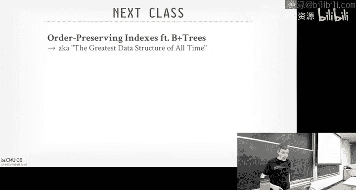
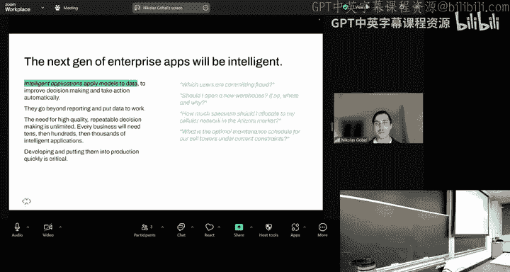
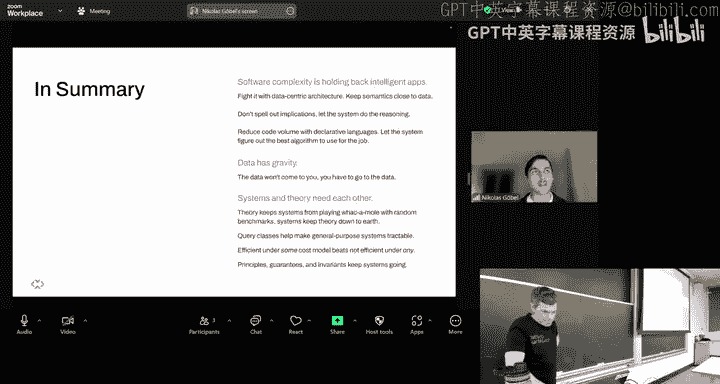

# CMU《数据库导论｜Intro to Database Systems (15-445645 - Fall 2024)》中英字幕（deepseek翻译 - P8：#07 - Hash Tables ✸ RelationalAI Database Talk.zh_en - GPT中英字幕课程资源 - BV1Tys8eQELW

Yeah。OfficialAll right， quickly for everyone in the class。

 the things that's on the docket for everyone here， homework2。

Herwork 2 is gonna do this coming up Sunday on the 22nd and then Project1 would do a week after on the following Sunday on on the 29th。

 And then as I post on Piazza， we'll have a recitation for Project1 tomorrow night at 6 PM that'll be over Zoom but we're gonna record it and post it on Piazza afterwards And as I said on Piazza。

 I encourage you to at least start looking at Project1 that way when you show up to the recitation and you can ask questions like that are more meaningful because you've look at the code and you're asking things that you don't understand rather than like what's a header file stupid things like that。

😊，Any questions about homework2 or Project one？I know that someone's ranking very high in leaderboard。

 congrat to that person and again you get extra credit if you rank higher than everyone else and there's I think up to the top 10 we'll go extra credit okay？

Additional things that are optional that you can attend if you can't get enough of databases。

 So starting next Monday on the 23rd， we have somebody from Influx B。

 one of project commits for Apache data fusion is going to give an overview of that sort of framework that library that you can use to build systems and then the following will actually have the inventor of data fusion and give a talk。

 but is' now at Apple on accelerator that they built for Sp called data fusion comet that uses obviously data fusion。

 that replaces the Java runtime， basically of the executionion engine in Java or executionion engine in Spark that's written in Java with with data fusion。

 which is written in Ru and it's optimized better optimizeizing the Java stuff。And then again。

 so this is all in two weeks， and then on Tuesday， October 1st。

 the database group here will have be a weekly meeting on Tuesday at 12 pm in Gates 6501。

 and we're having somebody from Oracle， I think they're calling in and resume to give a talk。

About some of this stuff they've been working on。Okay。So there's big news this week in databases。

 and if anybody caught it。guess what it is。The founder of Oracle， Larry Elsson。

 is now the second richest person in the world。 Now， he actually checked report class。

 He went back down。 He's now third， But there was a brief moment he was second because the Oracle stock surgeon and he outraned Jaezzos。

😊，Again， Jeff Bezo released to me first， but he got divorced。

And he gave have some money back in to Mackenzie， right， but whatever。

Larry Els he's been divorced four times， but actually his second wife sold her because it was the first year or second year he started Oracle back in the '70s。

 she sold her stock for Oracle back to Larry Elsen for $500。Right， so。

So I'm gonna to mess on that one。 Anyway， again， he's this。

 he's the third biggest person in the world all pay for by databases。

 He owns a Hawaiian Island and like a good one， right， a big one。 Lanaai。

 it's all paid for by databases。😊，And that's why you guys are here。 Okay， again。

 so these are all optional if you want to go beyond the course，😊。

So to recap what we've talked about so far in the weeks in the early meeting of the semester。

 we started at the bottom， we talked to the disk management， then we went above that last class。

 we talked about the Bo manager， how we're to keep track of the pages we're bringing from disk into memory and then now it's time to start doing something with those pages we know how they're gonna to be organized。

 They know we know how to put data in them。 Now it's actually time to build the execution engine to interpret what those pages storing。

And run queries and store data and do all the things you expect a database system to do for us。

So for the next couple of weeks， we're going to focus on what we'll call access methods。

 and these are going to be the internal components of the system that's going allow us to。

As it sounds， access， data access the pages we want that we we're rest storing and derive meaning from them。

And we're to first talk about the data structures we're going to use that can be represented by the disk pages that we're bringing bringing from disk into memory and so today's class we're going to be talking about hash tables which would be unordered data structures and these will be used all throughout the system for various things and then on Monday's class next week we'll talk about trees in particular to be B tree these are going to be data structures that can preserve the ordering of values or keys。

 we're going to want that for obvious reasons because we want to know where things are sorted。

 how to do ranking and other stuff。So again， we're in the middle part of this system now。

 and now we're going to start building more complex things on the basic primitives that we've constructed so far in the previous lectures。

😡，So we'll first talk about the background of what a hash table is and why it matters then we'll briefly talk about hash functions。

 what they are that we're not it's obviously not a crypto class。

 it's not a lowlevel algorithms class we don't really care what hash function we want to use we'll just pick whatever to consider the best one and I'll show you how to figure that out and then we'll talk about two types of hash tables。

 static hashing schemes where you assume the data structure has a fixed number of elements that are key value pairs that it can store and then we'll talk about a dynamic hashing scheme that allows a hash table that can grow Most time you're going to grow up。

 not down like you consider shrinking， but we'll talk about how to do shrinking one of them as well the idea is that you incrementally grow your system over time or so your data structure over time to accommodate more data。

And then we have at the end of today's class， the last 10 minutes we'll have a speaker from relationlational AI who unfortunately the co-fogress has to come this week to our visit day from Monday and Tuesday。

 but he couldn't make it because of other issues but they're going to give a talk today about what they're doing。

And I will say as a spoiler， relational AI is going to be a weird system。

's pretty far out there and much different than what you normally think of in a database system。

 and I think they're really doing some cool things。😊，Who here has ever heard a Data log？Nobody。 Okay。

 so data log will be a alternative to SQL to represent to run right queries over data。

 And I think they translate SQL to data log。 And then data log is allows you to do certain things that you can't really do easily in SQL。

 It's oftentime using in like hardcore modeling。 But again， these guys， they're really smart。

 And they that some of the cool stuff that they're doing。😊，Okay。So is this sort of obvious？

Daavi systems， we need data structures。😡，We need them for basically every part of the system。😡。

So obviously internal metadata， we'll see this when we keep track of like the page directory。

 right that's basically some kind of data structure that allows us to say forgiven page ID。

 where to go find it。😡，We told how in index organized tables。

 we could actually have the data structure itself be the way we represent data。

 like having the leaf node in our tree structure be the place where we're going to store tuple values or tuples。

😡，We're going to need these for temporary data structures。

And this is going to seem like kind of crazy， but oftentimes when you run a query。

 you're actually going to build a big hash table， do something real quickly on it。

 and then immediately throw it away。😡，So we need to have data structures that we can tear up and throw down。

 very quickly。 And we see we'll see some optimizations how to handle those。

 And then last one is what what you're most familiar with using them for table indexes。

 Like for given some key， either the primary key or secondary key， one key or multiple keys together。

 we want to be able to do a mapping from that to to find a tuple。😊，And some of the indexes。

 it'll be the record ID that we talked about before will be the value of the index。

 like a ideal key lookup， I get you the leaf node now I have the record ID that I can then jump to the page that has the data I want。

In some circles like my sQL， for example， the value actually is going to be for secondary indexes。

 the primary key。 So you do a secondary key， look up in the index， get to the bottom。

 Now you get the primary key， do another lookup in the primary key index。

From the data structure perspective， it doesn't really matter what it's actually storing， but again。

 index is going to be very important for us and we'll start covering them more in the next class。😡。

So if we're now going to build our system from scratch and decide what we want our data structures to do。

 we want to think about what are the design goals we need to have in our system。😡。

So how are we going to lay up the data structure in memory or in these disk pages so that we can do efficient access on them？

😡，We obviously want to avoid NP complete problems or those solutions。

 but in some cases the complexity might actually be pretty bad。And again， as I said before。

 we may choose certain data structures that in memory may not be the most efficient way to do it。😡。

But because we could we red something from disk and we want to maximize sequential access。

 that is actually the right data structure to do。The spoiler is going to be the B plus trees actually works for both in memory and disk。

 that's why it's the best， but again we'll cover that next class。

Then the next thing we need to worry about is。How are we can allow multiple threads or workers or processes in our database system to access to this data structure at the same time without causing problems for ourselves？

😡，And then we we'll cover this next class more， but there'd be basically two types of problems。

 There's physical layout problems or physical integrity problems where two threads are trying to write to the same thing at the same time。

 and they collaborate each other or there's like a dangly pointer and then you seg fault and crash because you follow a point to nowhere。

😡，But there'll be later in the semester which about logical problems where。

Two threads try to insert the same key at the same time。 What should happen。

 Should I have duplicate keys， Should one of them fail and how do I handle that or say I insert something。

 somebody else comes and deletes my key， I come back and try to read my key again。 Should I see it。😡。

That's a logical issue we'll cover later on。RightAnd then in two weeks。

 we' talk about we'll start off talking about how to do single threaded data structures。

 I'll sprinkle a little bit about latching as we go along。

 but there'll be a whole lecture just how to make these things thread safe in two weeks。Al right。

 so hash table is a should not be。Should not be a foreign concept to anybody here since this upper level course。

 you probably encounter these in other CSS classes。

 but the high level idea is that it's going to implement what we call an unordered Asative array that's going to map keys to values。

 As I said， we can use this hash table in different parts of the system so the keys and values could vary depending on the context of how it's being used。

It could be something for internal metadata， it could be the actual table indexes and therefore the keys are related to tus in the tables for our purposes here today。

 it doesn't matter， but I'll talk a little bit about how we handle different corner cases with them。

So it's going to get to do a mapping key to values。

 and it's going to rely on this hash function to compute some offset or some location in the hash table for a given key。

 And that location is going to be。😊，Either the exact location that has the key that we want。

 or at least get us hopefully close to it where we could then search around and figure out where's the key that we actually want？

😡，And so because it's unordered， because this hash function is basically taking any arbitrary byte array running through this hash function。

 and then you come out with this random number。😡，You're basically making this be completely random I O。

😡，At least in the first step of jumping into the hash cable with the hash function。😡。

So instead of in a order preserve data structure， like a tree where things are sorted based on the key values or the keys where I can sort of loop through。

 I scan through the data structure and find things in the order I expect them。

 this hasht was really making things completely random。

And this is be useful for us because it'll handle SkuU， at least your half function。

 hopefully handle SU where now you can have the data laid evenly distributed throughout the data structure。

 and there's a lot of benefits of having that randomness。😡。

So the space complexity of our hash tables are going to be ON for ends that's the number of keys that we need to store。

😡，And then the time complexity is going to be on average01。Meaning like in most cases。

 I do my look up into my hash table and get I find exactly the thing I'm looking for。Right。

In worst case scenario， though， it's going to be ON。

 meaning I have to look at every single key to find the thing I'm looking for or discover that the thing I want is not there。

😡，So again， if you take the algorithms course， all the theory guys are salivating over 01。

 right They think， oh， yeah， that's great。 Let me go do that， right， But in reality。

 you know there's a constant factor involved in this， and we actually going to care about them。😡。

So what I mean by that is like if our hash function is super， super slow。

 like it takes 100 milliseconds to compute the hash， then we jump into the hash table， yeah， it's01。

 but like 100 milliseconds is a long time。That's a couple of disguos。So even though the complexity。

 the time complexity is。In our favor， mean we'll see B plus trees where they're log in。

 but we're going to still make sure that we implement everything as efficient as possible。

Because constants equal money。if you're running a large system， expensive hardware。

 you don't want things to be slow。So it looks like a really basic static has table。

 and this will sort of motivate why we're going to do the things and do more complex schemes that we'll talk about in the rest of the lecture。

So let's say that we just have a giant array。😡，Where we know ahead of time the number of keys that we have。

 instead of n keys， and we just added this giant array with which just for you know。

 every possible key。We could have， we just have a pointer to some location。You know。

 on a page or in memory that has the data we want。And we don't worry too much just yet what actually we're pointing to。

 but you can this is the key and followed by some value。😡，Like again。

 that's the associated array of a hashable， mapping keys to valuess。Doess this work？Technically， yes。

Right。This is a good idea， though。You're shaking head in that wife。あ soに。So to you。

 they're really just not。He said， anything you were saying if you have a sparse number of keys。

You could have one to a billion， but if you only have two keys。

 you used to have to store a billion entries because you don't know what keys to be showing up Yep。

 that's one problem。Yes。さく。So he said if the hash of a key could he said clash have a collision。

 collide with another one， But assume again， I assume I have I exactly have n values I could have one slot for every single possible value。

 you wouldn't have a collision。😊，Yes。You're trying to recite the hole。To this。

She says if you have to resize the whole array， you have to red distribute everything， No why， right。

 because I could just。If I have now end and， you know，2 n， I just have two n down here。

 And then I don't think we have anybody up above。That's not a problem。

They get this like an identity function， like forgiven， say again， they're just integers。

The integer that of my key just tells me what all set to go to and then I have a pointer to go find I want。

Yes。It says's not friendly to cash， why？やってる。He says it's not friendly to cash to CPU cache。

 I'm assuming， or actually it doesn't matter that you're saying that when you do the key lookup。

 then you have to follow that pointer， now you're jumping some other location that may not be local to where you did first look up。

Yeah， that is the problem， but we't have a problem for other hasables as well，All right。

So there's basically three assumptions that are not always realistic that wide this sort of simple static has we aren't going to work。

😡，First thing that should mean this obvious is that I'm assuming I know the number of keys ahead of time。

😡，And then as she said， well would if you resize， well you could just double things or add more spaces as you need。

 but it's very rare that you know exactly the number of keys and the domain of those keys ahead of time。

And so as he pointed out， it could be， I have two keys out of a billion possible values。

 but I have to allocate a billion possible slots now， and I'm wasting space。😡，Sort of related。

 he was saying that you could have keys collided。 and I said in the case， if I assumed that， well。

 he said you could have a collision in the keys， and I said， well， if you assume they're unique。

 it's not a problem but it's not always going to be unique。

Just think of like doing lookups on people taking this course。

 if I just try to find all the people in 445， 645， there's a bunch of students here。

 you could potentially have collide on those same keys。And then the other one is this。

 this is more theoretical， but I'm assuming that I have this magic identity function that can map me exactly to the exact location for a given key。

 just a unique location in my in my my slot array， point array， and no matter what the values。

 I can always guarantee that。 And so if they're integers， Yeah， you just take the identity。

 that's easy。 But how do I handle strings。 How do I handle variable length strings。😊，Right。

So this would be called， it was called a perfect hash function。

 I know you can actually doing some research in this area。

 where you basically got the main some extra metadata， extra metadata。's， it's never truly perfect。

 But a perfect hash function would be for any unique key， you get a unique hash value。😊。

It shows up in the theory in practice， it's not easy to do it and no system doesn it。

Right so that means that wed have two keys that we just look at the bits of those keys。

 they're going to be different， but I run into my hash function。

 they're going to come back to the same hash value， and I have a collision， have to handle that yes。

assumption a bad assumption says why assumption to a bad assumption。 So what I So if I have。

Say you have say you have a database that has a list of users， people。

 and then you have phone numbers， right And so that phone number table has a far key reference to your user I。

 But now you can have multiple phone numbers。 So now if I try to say for a given user I。

 give me their phone number if you have multiple phone numbers。

 then I can't have in this example here。 I would have two two things to point to for number two。

 but I can't do that in in this example。So a hash table at its core is comprised of two pieces that are going to handle all these issues that we just talked about。

😡，The first side of this set is this hash function that's going to be a be able to map some large key space like any arbitrary string or float。

 timest， whatever you want， and it's going to map it to a smaller domain。

 and it's typically going to produce a fixed length value， like a 32 B integer or 64 bit integer。

So when we decide what hash hooks we want to use， we'll just see next slide。

 there's gonna to be this trade off between， we want it to be really fast， as I said。

 we don't want something to take hundreds of milliseconds to compute a hash。

 but then again we don't want something to have a high collision rate， meaning for two distinct keys。

 I get back to the same hash value。Right。What's the fastest possible hash function you can have？

With that。I that Danny， even faster than that。0， yeah， we're one， right。

 no matter what key I give you， I give you back one。 the collision rate is terrible， right。

 but it's gonna be fast because that's gonna to be hanging out in in C P registers。 right。

 So we want something's obviously the two extremes。 We want something in the middle。

And then the second design decision is going to be what we'll call the hashing scheme。

 and this is going to be the protocol that we're going to use to handle conflicts or key collisions。

😡，You have two distinct keys， hashing to the same location， your hash table， what do we do？😡。

And again， there'll be this trade off between， we just have this really large hash table with a bunch of slots where we could put keys in。

😡，And then it's really big， it's very unlikely that we have collision。😡。

But then now that means we need to store a lot of memory or used a lot of disk space to store this giant hash table thing。

😡，The other end extreme would be we only have a hashet with one slot。

 and everything collides into that。 We have to deal with that。

 know it's less storage but the compute's gonna be much higher。

 So this is like classic computer science， the storage versus compute trade off here。

 And depending on our environment， depending on our hardware。

 we want to maybe choose one scheme versus another。

So we're going to go through both of these for Hahing team。

 we'll discuss this again in the context of static hash tables， we have fixed size。

 and then we'll see dynamic hash tables where you can scale it and down。😊，All right， so as I said。

 a hash function of this core is just going to be for some inbook key。

 we've returned back some energy representation of that key。😡，it's usually 32 orce minutes。

 right so this is the nice advantage that's taken arbitrary by array。😡，That's the key。

 and coming back with a fixed length value。😡，And as he said。

 we want something that's going to be hit fast， we want something to have a low collision rate。

We don't care about any cryptographical properties of the hash function we're using。

 So if you familiar like Sha 2，36 or Sha 1， these things are very expensive。

 We don't want to use them because we don't。 we're not leaking any information， right。

 This is a hash function we're using internally for our database system。 It's not。You know。

 someone's already given the database system that we're building their data。

 They're going to trust us to operate on it。 So our hash function is， you know， doesn't need to be。

 is not exposing anything of the outside world。 but you don't be a hash able to show it to everyone。

So we don't need to any of these things， we just want something that has the nice collision rate versus speed。

So good news is that we don't need to design a hash function for ourselves。

 There's a lot of available out there， written by really smart people that we can just exploit and use on our database system。

😊，And this with nearly all data systems Postgs uses， I think， roll their alone for historic reasons。

 But most modern systems are not gonna write their own hash function。

And so this is just sort of a menu of the things you could possibly pick。

 The way to sort of think about this is that Murmur hassh was sort of the the。Well the。

The first of these new generation hash functions that care about speed that sort of came in 2008。

 and then both Google and Facebook and other big tech companies kind of made their own versions of these things that have different properties。

 in general， the state of the art one that you almost always want to use is going to be the X X hash from Facebook And by this guy who created the standard compression algorithm。

 I think up to version 3。 and there's different flavors of Xx hash。

 But this is gonna to be the one you're gonna to want to use。😊，Its just in general。

So if if if you're curious know what kind of other hash functions are out there。

 there's this Github repo， I think written by the Murmur hash guy called SMm Haser。

 And it's basically a micro benchmarkch that can looks at all possible hash functions that are out there on the Internet and runs them through his torture test and measures how good they are the collision rate and how fast they go。

 And then so in the readme here， he sort of has the ranking list of the the latest one。

 So this is as of today。 So rabbit hash is apparently the fastest one。 and then excess3 low。

 that's the excess hash one there。 That's the second fastest。 And again。

 it's this trade up between the collision rate and the。😊，And the。And the speed。

Except has is usually the right one in those situations。So that's it。

 that's all you need about hash functions。Use something that already exists。We're done， right？

For data people though， we care about though， actually the data structure inside。😡，So。

Static hashing schememe that we're going to talk about。

 we had two variants called linearar Pro hashing and cuckoo hashing。

And these be also categorized as what are called open addressing hash tables。

And that just means that the location of a key that we're putting into a hasht。Is open， I mean。

 it doesn't always have to be at the exact same location every single time。

And so we're talking about linearar probe hashing， which applied to the most common one。

 and the cuckoo hashing will be an extension of this。

 There's a bunch of different variants over the decades that people have tried to build to make better static hash tables that we're not going to cover in this class we'll cover in the advanced class。

 like Robin Ho hashing， Hospott hashing， Swiss tables。

 I think that's Google has something on this as well。

 therere all gonna to be variants of this and it's really come down to being when it comes time。

 theres a collision， what do I do。😊，Do I move out whatever is in the space I want or do I look somewhere' else to go？

😡，At a high level， that's the variations that they're all trying to have。

 But later probe hashing is going to be the most simplistic one。

And so the tricky thing about linear probe hashing。

 or at least when you try to Google and understand what's going on。

 there's the linear probe hashing that I'm talking about and there's linear probing reverses to how you're going to probe into it。

 this meaning you're just going scan linear， there's also a quadratic probe hashing。

 there's other variants of that。 And then at the end of the class we'll talk about linear hashing。

 which is different from the linear probe hashing table， which because dynamic scheme。

 but to make sure I understand there are two distinct approaches to handling hashing tables。Allright。

 so linear prop passion，s it's the most simplistic thing you can have。

 It's a giant array of slots that are fixed length where we can store。😊，Data， key value pairs。

And so while they take our hash function for our given key， hash it， cache the key。

 then mod and by the number of slots we have in our hash table。

 that's going to give us some starting point to jump into this giant array。

And then we start looking for a free slot to put something in or the key that we're looking for。

So again， the hashing seems are going to vary in how you handle conflicts， so if I hash my key。

 I land into the slot array and the space is occupied because I'm trying to insert something。

 then I'm just going to scan down in sequential order until I find the next free slot。😡。

Then I insert my key there。The inverse of that， if I'm trying to do a lookup of something， I hash it。

 mod in， land of the slot array， scan down literally and look at every single key value pair until I find the what I want。

 or I find empty slot， in which case I know that the key I'm looking for isn't there。😡，That's it。

We'll go in an example。This is what you get， I would say， in。

I think Python gives you this when you get an SVR dictionary。

 I'm pretty sure you get this data structure， but this thing is widely used in a lot of systems。

 So when you in hash joins， which we'll cover later。

 most people are going to build something like this because it's so simple and it's actually really fast。

So the one thing we need to keep tracker in our hash table is this load factor。

 which is basically the percentage of the hash table that is occupied， the slots that are occupied。😡。

And。Every system will have different thresholds， but it basically says the low factor is if I go up some threshold。

 then I'm going to consider it being full。😡，say like 70% load factor。

 Then I'm going to stop whatever I'm doing on this hash table if I need to still insert things into it。

Make a new hash table that's double the size of my current one。

 and then scan through the old hash table， rehash all the keys and put them into the new one。😡。

That's how you do resizing in these， these data structures。 And honestly。

 that sucks because like now you're blocking all your threads。

 why you're just doubling the size of it。 And this is what the dynamic hehing schemes will try to avoid。

 But oftentimes， if you。If you can try to estimate the number keys you need to put into it。

 then you can try to avoid this。😡，Postco tries to do this every sometimes when you're doing a has hash join。

 you have to build a hash table， it tries to estimate the number of tus iss gonna get come up from from the bottom of the query plan from whatever table that you're scanning。

 And based on that estimate， then it sizes your hash table。 If it gets it wrong， it has to stop。

 double the size and load it all back in。 But again， by sizing it correctly。

 hopefully you avoid that。 This goes back about the same before， like in the most extreme case。

 we just have this infinite size hash table， we would never have to do this block and resize。

But because we live in reality， we have to side to something。

 and we want to try to be not too conservative because we don't want to resize。

 but not too big because we don't want to waste memory。That we could be using for other things。

Alright， so let's look at an example here。 So again。

 so say these are all the keys I'm gonna want to deal with。 And this is， this is our hash table here。

 just array of slots， at least for key value pairs。 So if I want to insert a， I' gonna hash it。

 I mod and where ends the number of of slots that I have in my hash table。

 I jump to some offset in this case here。 I see that it's empty because the very beginning of the hash tables empty。

 And I'm gonna store my my key value pair。😊，And we'll cover the next slide what the key value pair is。

 but let's say we're going the original key in there because we need to know when we start scanning。

 is this the same key that I'm looking for， right you still need the key and then the value will be whatever payload or whatever we're actually trying to store。

😡，Alright， so now I want to start B， same thing。 hasht mod N。

 And then I jump to this this top top slot here。 It's empty。 I can go ahead and insert my， my。

 I go ahead and insert key B。Now if I do I want to insert C， when I hash it。

 I land to that slot where a is currently occupying。

 so I can't store anything in there because A' is already in there。

 so now I'm just going to have a cursor scan through the hash table until I find the next free slot。

 then I can go ahead and insert C。And you can think of this as a circular buffer meaning if I get to the bottom slot here。

 and again， I can't find a free slot， I just loop back around and start over。😡。

Now I that means I need to keep track of where I started to avoid getting stuck in an infinite loop。

 but as I said， you would set the load factor to be like 70。

 80% to avoid ever having to have an infinite loop。So now when insert D， D goes where C is。

 can't go there， scan down the next three slides right below。Insert E E once it go over A is。

 can't go there， go down， can't over C is， go down， can't go where D is， go down。

 and then I find my free slot there， and I insert it。And let's let's put at the bottom here。

 same as before。Pretty easy， right？Any questions？Yes， complicated。Does this complicate retrieval？

The value of C， but。A then。So his question is， does this complicate retrieval because if I want to get C。

 say C's already in here， I hash it， I la where A is。

I do my now this way I have to start the key there now I compare C with A， A doesn't go C。

 so I keep scanning aha now the next lot I find C， but say I'm looking for Q。😡。

I hash for A is I compare Q to A， not there， compare to C to A， not there。

 keep going now I find my empty slot， therefore I know that Q cannot not be in this hasy because if it existed。

 I would have seen it in the previous slots。😡，Yes。This question is how do you handle lesionashs。

 we'll come to that in a second。Again， for some， depending on where you're using this in the data system。

 like a hash drawing， you're not going deletes。 You just insert， insert， insert， read， read， read。

 then throw it away。😡，But yes， we need to handle release， we'll get that in a second。Yes。

 is this a good idea？Every collection happens， you get like amorized。 your worst case， yes。

 hows this a good idea？Becauseuse again， if I size my hash table reasonably and I have a you know。

 okay low factor， then I'm not gonna have to do the end scan， I'll maybe be so many jumps away。

A simplicityimp is actually part of its advantage and again。

I'm just showing sort of this diagram on PowerPoint。

 but these would be potentially backed by disk pages。😡，But now， if I'm just doing a sequential scan。

 if I have to go to disk， I'm doing sequentialial scan on continuous pages for the hash table。😡。

RightIn practice， you know， you actually， I don't know the number how many hops you have to do to define what you're looking for。

 But again， there's other variations we won't get into where like Robin Ho hashing。

Well actually can swap the order things and you say if one key is farther away than what it should have been than my key。

 I can swap the order， so it's always kind of closer to where it should be。😡，Right。

Seems like a clever idea。 It actually is。Often slower。

Because simplicity makes a huge difference there。Okay。So what are these key value pairs。

 what are the x entries， where there's two cases？😡。

easiest case is when the key is fixed length and the value is fixed length。

 like a 30 bit integer with a 30 bit integer， then I can easily store that in my hash table because it's always to me fixed length all sets。

Meaning when I hash it mod end by the north slots， I'm going to land exactly where I need to be。

And optionally， if I want to try to speed things up。

 I could store the hash that I computed when I inserted the key inside of the key value pair as well。

Right， because as I'm scanning through， say it's like。30 git integer hashes。

 but then like 128 byte strings。It's way faster do that string inte comparison。

 than look at the strings。 So if I have the hash， that'll you know。

 that'll I can easily check whether something are equivalent to each other。 if they are。

 I still have to check the whole keys。 But if they're not。

 I know the whole keys will never match or I just skip it。😡，Compute versus storage。

 I'm sending a little storage space to store the hash in the hash table。

 but my lookups could potentially go faster。😡，To handle very length keys。

 you basically have to have a whole separate table， a temp table。😡。

Thats storing the thing you're actually trying to represent So Ttable would be private to the query or whatever it actually it is running this。

 So we don't have to have all this extra mechanisms for like recovery we would have for regular data tables。

 In some cases， we can have an optimized version of this。

 And it could just be also we piggyback off the existing page infrastructure we have。

 So I'm not showing this as a slotted page， but it could just be a slotted page。Right。

It could just also point back to the original tube itself， not necessarily。

 you can't do that if you're doing joins。😡，But the key would just be the hash that we have。

 and then the value is going to be the record of E， so both will be fixed length。

 so that'll handle our offset jumps into theite。And the record ID is just a pointer。

 as we said before， a reference to where to find the whole data。So again。

 having the hash is part of the key， I can do a quick comparison to see whether the key I'm looking for hash the hash that I see。

And if not， then I don't need to follow a pointer if it does， then I need to go look down。

So it seems like it'd be terrible because you're jump following this point over every single entry。

 but it's not that bad in practice because the hashes will not match。😡，Al right。

 so let's handle his question。 how do you do delete。Let's say I delete C。😡，So again， doing delete。

 it's the same thing as doing a lookup， I first hash the key that I'm trying to delete that do my offset jump into the slot array。

😡，I land where A is， A doesn't equal C， that's not what I want， keep scanning down， then I find C。

 now I have a match。😡，Right。And I blow away the tubbal。A blow away the entry the hash table。

He's shaking his head no， yes， why。Because if they。Cons。あ分 youす。And downwards， and new encounter is。

テンティスの？So he said， and he's correct， that if now I have this empty space in here。Well。

 I said that I was scan through when I'm trying to do a look up to see， you know。

 to try to find my key。 So I find an empty slot， then I know that the thing I'm looking for isn't there。

 So now if I have this empty slot here and I scan。The scan for D， I looked at it t do look of a D。

 D is going to hash to this location， it's empty， says up， my search is done。

 you don't have what I want， but in reality it's right below where I wanted it。😡，Right。

So there's two approaches to handle this。😡，One is this new movement。

So you take all the keys that are below you in the slotlaughter array from the entry is deleted and you rehash them and slide them up。

You're saying you had no good idea， bad idea。Why， why is a bad idea？He says he has rehash everything。

 Yes， it's expensive。It's not good。And this does solve our problem now when we do a look at Ded it's going to find what we want。

 but as he said， this is super expensive and we get to rehash everything and we don't want to do this。

And in some cases， too， we have things like B over here， like。

 say whatever reason it has to a new location。 we have to slide it down， right。So yeah。

 the blast radius of doing this optimization or doing this adjustment could be very expensive and therefore。

I'm not aware of any system that actually does this。😡，A better approach is use tombstones。

So all we need to do now isre we delete D。😡，Or sorry see。

 we'll put a little marker here that says that this thing has been deleted logically。😡。

And so now when anybody comes along and does a scan， like I do look up a D。

 it lands to this location， sees the tombstone， says， yeah， it's empty。

 but treat it as if something was actually there。 It's not my key。啊。Lis least it could be new key。

 but it's not the key you're looking for right now。

 so then I just scan down through like I was doing before。😡，Right。So。

This handles now the case where if I want to put something in there， again， if I see the tombstone。

 it's okay for me to treat this as empty。 and I could put something there。

 And that doesn't foul up any of the ordering guarantees that we' have under lit linear probeb。

So this is the most common approach now again some systems when they have linear probe hashables。

 they don't actually implement deletes because you don't need them in some cases。

 but if you do need to handle deletes， logical tombstones would be the right way to do this。😡，Yes。

そ法と。His question is， how do you treat teamstones as part of the load factor。

 you would treat that actually a good question， I don't know。Again。

 you probably have to treat it as part of an occupied space because you have to jump through it。😡，嗯。

And oftentimes， you don't actually want to store the。

The the tombstone is part of the entry here because how did you do that the store an extra bit to say this thing the lo is delete。

 and then now that fouls up with the line that we talked about before。

 So a more common approach is either within the page whether the slots being stored and the hash table or even a global data structure where you just keep track of like here's all the metadata about my hash table and I check that first before I maybe go making decisions about what I'm looking at inside the hash table。

 So I can have a separate bit map that says for this slot location isn't empty or not。Yes。おみ成がべての。

what we do。When when I say garbage's question， I mean， what sorry？He has everything to the。本当に。啊。

Yeah， so， yes， I say maybe appear like double culture。 Yes， if you， if you want to keep reusing the。

If you're not going to throw away the hasht and it's meant to be stick around for a long time。

 someone needs to go through， look at all the tombstones， and then free up the space。

 and then potentially move things around， yes。😡，O。So the other thing we got to handle is non unique keys。

😡，You'd have two records have the exact same keys that are pointing to different values。

 which is common in the secondary indexes。So the easy way to do this。

 one way to do this is to do separate linked lists。

So you have your regular hash table doing Lear probing。

 but the value now is going to be a pointer or some reference to some other value list。😡。

And then now when I do a lookup for a given key， I follow that pointer。

 get the value list and then do either a sequential scan if it's unsorted or for the presorted。

 I can do binary search on that， but I have to follow something and look at somewheres else and see whether the value that I want is available or if I want all the values I just iterate over that list。

😡，But this again， this requires now additional infrastructure in our system to maintain these extra pages。

😡，So that's not- this isn't that common。The alternative approach is to have just。

atTreat redundant keys as。Ex ignore them。Just treat them as unique keys。

 even though they're not really， and depending on what operation I'm doing。

 I have to be make sure I get all the entries for a given key and not just maybe the first one。😡。

So the idea is like， again， you just ignore that they're unique。😡，And when I do an insert into them。

 I just do this scan as I did before and find the next free slot and insert it into it。

And then now if someone says， give me all the values for key XYZ。

 I got to scan through until I find all XYzs or I get to the first empty slot。

 and then therefore I know I won't have any XYZ keys in there。So the second approach。Is。

 is kind of more wasteful because you're storing the key multiple times， right X， Y。

 Z over and over again， I have a billion entries for it。 I that billion copies of X， Y。

 Z in my hash table versus this the one up here。 I only store it once。But in the downside again。

 I have to maintain these extra valueless the key。Just treat it I if here's a collision。

His question is， let we store the same key the second time do you treat it as a collision， yes？

Does I mean we need to。I insert insert a new XYZ， I hash into here， it's not a free slot， I skip。

 skip， skip， skip， keep scanning， then maybe the free slots right here， then I insert XYZ。

So the question is， wouldn't this search be quite expensive？Yes， but like again。

 depending on the size of my hasht， I might be okay。

Al right so I'm quickly clue go through some optimization you can do。

 This is more an implementation side So instead of having a general purpose hash table where it can handle any possible key type and whatnot。

 you could actually have specialized through either super templating or handroll optimized versions to handle keys of different sizes and maybe maybe pack things in pages differently maybe you can them in one ways versus others if you know the types ahead of time and you try to do the most common things like here's a bunch of integer keys or integer values。

 you can optimized versions of these。😊，Clickhouse does this。

 Clickhouse has 20 different versions of hash tables in their system for all but possible types。

It's very impressive。Next when you can store a separate metadata or sort met as a separate array or separate hash table。

 as I said before， you could have this this additional data structure that keeps all track of all the metadata about what's in your hash table。

 you check that first before you maybe check something in the full hash table and that way if something's not in the first data structure。

 you know won't be in the larger one。😡，And the last one is to if you don't want to blow the hashable every single time and reallocate all the memory。

 you want to be able to reuse it from one query to the next。

 you want a quick and efficient way to basically zero zero out the contents of that hashable without having to go through it and overwrite everything。

😡，So when clickhouse does this as well， so they basically maintain a version number for the hash table and then the pages for slots are okay or the individual slots。

 So if I know that I'm done with this hash table， I'm using it for the next query。😊。

I just increment the the version number by one。 Now， when I do any look up in my hash table。

 if the slot version number doesn't match my table version number。

 I note it's from the older version and I can treat it as empty。😡。

So there's a really great blog article from the Clickhouse guys with by that person over there that discuss all the very optimizations they do in Clickhouse and it's very impressive。

😊，And of all the systems that I've seen that we publicly talk about what they're doing in hash tables。

 Clickhouse does the most。Like I think Postsgres has two hash tables。then 20。All right。

 so a variation is that this is going to be cooo hasing。😊。

And the idea here is that it mean an alternative to having to use sequential scans to find the next free slot to find the key that I'm looking for。

 What we're going to do instead is have multiple hash functions。😊。

When we do our look up at our hash table。hasash the key multiple times the different hash functions。

 They're all going to jump to different locations。And I use that to find a free slot or find the key that I'm looking for。

😡，Now the challenge is going to be， well， what if I want to insert something。

 I hash it multiple times and all the slots are occupied。😡。

Well now you're just going to steal one of the slots from somebody else。

 make them come out and go back into the data structure。😡。

So now all your lookups and deletions are G to be to01 because you'll have to hash multiple times。

 but it's going to be one lookup to find the thing you're looking for it's either going to be there or not there。

 you never have to scan。😡，But the penalty is going to be when you do inserts。

 now you may be bouncing back and forth， taking things in and out until you find enough free slots。😡。

So the only system that I know that does this is a accelator for DB2 out of IBM called DB2 Blue。

 it's in the paper that they talk about， but it's probably used other systems I'm just not aware of。

😊，And then it turns out the best open source implementation of a Google hassh tableable。😡。

Came from Dave Anderson at CMU。 It was written by an undergrad several years ago。

 almost a decade ago。 he still maintains it。 The last commit was like three weeks ago。

 even though he graduated。嗯。And I think Dave said Google uses their implementation a lot and other internal things。

All right， so let's see what it looks like。Again， so say now I want to put a into put key A into my my hash table。

 say I just have two hash functions。 I think the default is in cuckoo hash。

 The cuck hash implementation is 3。 You can have in any arbitrary number。 And， of course。

 there's a trade on between how many hashings your hashes in your computing， but。😊，This case here。

 I hash a once twice using the different hash functions。

 They're both gonna map to different locations in my slot array。

 And then I flip a coin and pick whatever  one I want to use。 The， The table's empty。

 I'll use the first one。😊，Now put in certain B， same thing， hash it twice， I get two locations here。

 the first hash function maps me to where A is， so that space is being occupied。

 so I can't use that so I just use the second one because that's empty。😡，Yes。嗯，是。The first。

If flip a coin or pick the first， it doesn't matter。😡，中はい。The first oneYeah， his question is。

 would you could actually compute the both hash functions simultaneously or you just compute the first one。

 check it's empty。 You could just do it in in serial order like that。 Yes。

 it doesn't matter for visualization purposes， which just showed like we're looking at both。

All right， B again， B onces go in can't go the first has function because that's occupied by a。

 so we go to the first place。😊，So now were to insert C。

 and the first hash function takes us to where A is， the second hash function takes us where C is。

 so both spaces are occupied。😡，So in this case here， again， I don't think it matters。

 it doesn't matter whether you pick one versus the other。

 but let's say it's going to pick where B is the second hash function。😡。

So it's going to clutter be over the head。Take its slot and kick it out of its house right and now C' is inserted。

 but now we put we put weve got to put B back in so B comes out since we know that it was hash in with the second hash function either we just hash both of them see and keep track of this。

 you wouldn't actually want to maintain extra metadata but。

So we we're gonna hash it again for both them。 We'd see that the second one takes us where we just came from。

 So we've gotta hash it from the first one。 That takes us now to where a was。

 Maybe we saw that before when we inserted it。 But now， again， since we know that we got taken out。

 We' got to find a new new home。 It's gonna go steal a slot。 go insert inserts itself there。

 A pops out。 We hash it again。 and now it finds a free slot。😊，So now when we do a get。😡，Again。

 you can do this sequentially or you do it parallel doesn't matter， we're going hash be twice。

 look at both locations until we find the key that we actually want。😊，So that we don't have to。嗯。

Like multiple times for each hash function and a question is why do I say we don't want to store what hash we use to get us at a location in there because again。

 computer versus storage， I have a billion entries。 I got to store now。You know， some bytes to say。

 you what hash function should I use， is not worth it。Yes。If there are three key that。Yes。

 so he points out he's correct。If now， say going back here。😡。

If I do hash a back in and there's some other key here。

 and now I know I try to put you know A got kicked out before。

 So both hash functions are point to things that are occupied。

 You'll be stuck in infinite loop and you have to break out of that。

 keep track of that and then double the size of the hash table and sort everything back in， yes。

We had no free lunch here， but it's in practice we're making the trade off or making inserts more expensive。

 but our lookups are going faster。So like do we just keep a counter？This question is。

 do you keep a counter， you could keep track of where did I start？

What's the slot that I started if I see it again， that I know I'm in a loop。Okay。

So 30 minutes left actually 20 minutes left。 Al right， so let's go through this the。

The the Na hash tables， I think maybe we'll have to roll over to linear hashing next class。

 but we at least cover chain hashing and extend hashing。All right， so all the hash tables。

Maybe we just talked about so far， you have to know the number of keys ahead of time。😡，But again。

 you may not always know that and you want to be able to grow and so these dynamic hashables。

 the idea is that they're going to incrementally resize themselves without having to rehash everything and loaded it into a second hashable。

😡，So the most common one that you're probably most familiar with is chain hashing。

 I think this is what you get when you get a hash map in Java and the JDK。

 and then external hashing winter hashing are more advanced alternatives。😊。

So chain hashing is when you basically have now a slot array that you hash into and that's going to point to the beginning of this linked list or this chain of buckets where we can insert key value pairs。

And so now when I'm going to do a lookup， I hash myself into the slot array that gives me a pointer to beginning this link list。

 and now I sequentially scan it until I find the key that I'm looking for。

And if I need to insert something and there's more more space in that chain， I just add a new bucket。

😡，And app to the end of it。Right。So this thing you can grow infinitely and we'll see how to handle that in external hashing and linear hashing。

 but again， the idea is pretty pretty straightforward。 so again I have my bucket pointers。

 my sloter array， I would do want put a hash inside this this gives me the pointer to the beginning of my linked list and I go ahead and insert A。

😊，Now when I put on B， same thing， hash hash to my bucket pointers。

 I jump into a beginning of the linked list， I start egg。Same thing with C goes there。

 I put D now in this case here。Yeah obviously would would have more than two slots in a bucket。

 But for visualization purposes。 soon that's the case。 So in this case here， this bucket is full。

 So I'm gonna have basically， I'm gonna create a new bucket and keep track this first one that the pointer to the next one in the chain。

 So I， as I scan through looking for the key。 I'm looking for。 It's not in this one。

 But I'm point to another bucket， then I got to follow along that and get that。😊。

Same thing for E and so forth。So in this case here， this is going to equally penalize。

Insts and lookups， because we have to follow these pointers， whereas like in Co hashing。

 we were makings inserts slower， but lookups faster everyone has sort of pay the same cost with these cases。

😊，A simple optimization we could do， and we'll see this later on when we talk about hash joins is that。

😡，In this bucket pointer thing， I still want to maintain a pointer to the beginning of the hash table。

 but I can put a filter data structure in front of this that tells me whether the key exists in my bucket chain。

😡，Because now basically I'm partitioning the key space within these bucket chains。

 so for this filter here， I could have a data structure that says does this key even exist。

 yes or no， can't tell me where it is， but it just tells me does it exist in my set。😡。

So now when I do a lookup， I check the filter first， if the filter says no， it doesn't exist。

 then I don't even bother following the pointer and look at anything else。😡，Right。

When you use this the filter potentially to be a balloon filter。

 we'll cover that next week what that's going to be。

 but think of that probably the data structure that can tell me does something exist or not really fast。

😡，Again， we'll cover that later。So。In the case of the chain hashable， as I said。

 the chain can grow infinitely。😡，It has no mechanism， no way to say this chain that grows forever。

 and that would be terrible， obviously， because if I have really high skew where everything's hashing to one。

😡，To one chain， then it's just sequential scan or linear scan to find anything right that's the worst case end that we talked about before。

😡，So extendable hashing is going to be a technique that's going to allow us to incrementally split our buckets when chains go too long and then rebalance things without having to rehash everything that we saw before。

😡，And linear hashing will be another technique as well。So this technique is not that common。

 it dates back from the I think the 80s， but the only two systems that I know that implement this is the Ganew DBM。

 think of this as like an embedded key value stored you could have in your application similar to like Ros DB it a key value interface and then asterisk DB was sort a big data system for like HDFS or Hadoop world that came out UC Irvine that I think couchbase now uses but from their documentation they're using S has。

😊，All right， so。It's going to be just looking for where we had this the bucket list or sorry these pointers here。

 they're going to point to buckets。 But now we're gonna maintain some extra metadata to keep track of how do we examine the data that that a slot is going to point to。

So there's going to be this global。Sort of this global bit counter that's going to say。

 what's the maximum number of bits we would have to examine to figure out in our hashes where we need to go。

 and then for just simplicity reasons we're also going to maintain these local counters that says for this given chain of buckets。

 here's how many bits you have to look at to get to them。

So you see we've already insert of some data， the first one is going to be only one bit。

 the bottom two are going to be two bits。😡，And so what does that mean， So that means that again。

 when I hash my key， I'm going to get back an integer， It just wants， 32 Bs。

And I'm going to look at those bits and tell me what slot position do I want to look at in my pointer array？

😡，So in this case here， the first two entries， I'm only going to look at the first bit。

 so both of these guys are going to point to that one at the top。😡。

Because that has a little bit of one。Right。These ones down here。

 I'm going to use the full maximum number of bits set by the global counter。

 and I'll look at both them and they're going to hatch to two different locations。😡。

So now is what's going on here， the slot array could have multiple entries point to the same。😡。

The same bucket。And that's okay。So here's how to do a look。 I do a lookup on a， I hash it。

 mod it So I hash it， get some bit array， and then look at my global counter。

 And it tells me how many bits I need to look at。 And then now when I examine those two bits。

 that's going to tell me what position I'm at in my slot array。

 and that gives me the pointer where the bucket chain is for this key。😊，哎。So now I do what to put。😡。

Again， look at my global counter， its set to two， so when I do a put。

 I look at the first two bits that tells me that I want to go to 10， I follow that pointer。

 and it takes me this bucket chain and I go ahead and insert my entry in there。😡，Do it another time。

 let's put C in， again， look at the first two bits， tells me what location in I want to look at。

 I follow that pointer， and that takes you to this bucket， and now the bucket's full。

So I need to overflow it， I need to allocate more space for it。

But the way we're going to do this is it's going to be localized to just this portion of the hash table。

 and I don't need to rebalance any of the other bucket chains。

So I'm going to increase my global counter to three。😡，Expand out this slot array or this point array。

 That's cheap， right， That's the one just， you know，'s say。It'ss 132 bit pointers。

Our 64 bit pointers， that thing's not really big， so resizing that and copying things over is not a big deal。

😡，And then now I want to add my new nuke。😡，My new yeah， my new bucket chain。

And then I'm going to look and look at all the bits as they go along。

 And that's going to point to the different locations。 So going back here。Again。

 these guys here that that one at the top， that's still only using one bit right。

 so if the first bit is0 in my position in the slotlaughter array。

 they're going to point to that first chain。😡，Right， then the second one。

For this one we're still looking at two bits， so that goes down here。

 but then anyone that has three bits， they're going to point to different locations。

Then I can go ahead and insert insert C。So again， I move things around or so I readjusted the。

The hash table without having to rehash everything。 and because this going back here。

 because this thing overflowed。😡，Right。Instead of having adding another bucket behind it in the chain。

 as we did in chain hashing， I said I'm gonna overflow it， make split it。

 split its keys into two different buckets。 But I， and I just update the ser array without updating all the other。

 without without updating all the other buckets。Yes。Re zero，0，0 doesn't point to anything。

I question is there reason yeah， that's a mistake， yes。0，0，0 should  point to。Com back here。This。

Yeah， point to the top one。RightYeah， and the first bit is0。

 they should all be pointing to the top one here。 Thank you for fine。 I'll fix that。

And then the next one is when it' what is1，1， all point to the bottom one， and then we have 1，0。

0 and 1，0，1， those two are distinguished， they point to separate separate chains。Thank you。我们还问。

His question， what would happen in the first bucket ever flowed， so you'd split it？😡。

And then now it says that the local counter is one。It's countable to go to two。

So now you have two buckets and you would have 001 sorry。

 01 would go to one bucket and 00 would go to another bucket。Yeah， so when you split a bucket。

 you rehash everything that's inside that bucket， but because it's not an arbitrary length bucket chain。

 it's not a major operation。😡，So you're sort of amortizing the rebalancing across the multiple queries。

I'm rushing this but we can cover this again on Monday there's some more questions All right。

 the other alternative approach is do linear hashing。😊，And this is actually what， what Postgres does。

 They called the Dah hash in in the source code。 And actually the。😊。

The reason why Postgress has this data structure because the woman who was a patient at Berkeley。

 she wrote it this hash table and put it to Postgss。

 and then she had a startup called Sleepy Catt software that made Bkeley DB that used the same sort of hash table idea。

And then Oracle bought them。And now Or owns it。All right so。😊，This is a bit more complicated。

 but what's going to happen is that we'rere going to maintain this extra。

 you call a split pointer that's going to tell us what's the next bucket that we want to split。😡。

And this would be different than extendable hashing。

 extendable hashing was any time a bucket overflow became full。

 I split that bucket and only that bucket。Extendible hashing。

 sorry linear hashing is be different where。😡，I'm going to split whatever I'm pointing at with my split pointer。

 which may not necessarily be the bucket that overflowed。

 the idea is that eventually I'll get to that bucket that overflowed and rebalance things。😡。

It's almost like doing this random splitting， but over over longer periods of time。

 everything balances out and everything will get will get split。

So we're going to maintain multiple hashes to figure out what's the right bucket we need to look at for a given key again based on where our split pointer is pointing at。

 and then those other things we can deal with like when should we actually overflow is just when we run out of space in our page for one page if we have 10 pages that are interchaned。

 then we overflow different systems you can do different things。😡，The idea is， again。

 we want to localize the resizing of our hasable to just some portion of it。

 which may not be the one that overflowed， but that's okay。😡，So again。

 we have our bucket pointers that pointing to different locations。

 and these are numbered in sequential order。And then we have this split pointer that's point to what's the next bucket chain that we're going to split whenever we overflow。

😡，And so we'll have a hash function that says for given key。

 run through the hash function and then mod to end where it ends the number of bucket point we have at the time that we essentially this hashable。

 so we have four entries here so we take the key and modify4。😡，All right。

 so now if I'm going to do a get on six， I just take my first hashmo that I have， modify 4。

 and I get two， and then I find the key I'm looking for。😡。

So that just looks like the chain hashing that we saw before。 Nothing fancy。I'm going to put 17。

I hash it， mob by4 gives me the offset of one， but now when I go to that chain。

 I see that the bucket is full， so I need to overflow。😡，So I'll create a new bucket。

Just I my chain hash table extended out。 And then I insert 17。

But now I need to have my split pointer instantiate a splitting procedure to rebalance or to split whatever it's actually pointing at。

😡，So in this case here， it's pointing at0， so I need to go and split0。😡，Even though again。

 it didn't overflow， it still has free space， this is just how the algorithm works。😡。

So now what I'm going to do， I'm going to add a new entry to my bucket point array。

 and then I'm going to make a new hash function。 We're going to mod by 2 n because it's double the number that I have before。

 So I had four entries before and eventually I'm going to have eight entries。😡。

So the reason why we we can do2 n because we're gonna to hash this key first。

 see whether it's it's above or below where our split pointer is located at。 If it's below it。

 we just need this hash function。' if it's above it， we just need the first hash function。

 If it's below it， we need the one down below。And then the split point will keep going down until we reach whatever the length of n was when we sentated the hash function So in this case。

4， So once we get past three， we then loop back around and start all over again。😡。

So let's see what looks like， so now we have a new entry for， we're going to create a new chain here。

 a new bucket， then we go through and all the entries that were in the bucket that we split。😡。

We need to hash them now by the second hash function。 So hash 8， mod by 8， it's 0。

 So it stays where it's currently located。Hash 20， mod 8， we get four。

 that's now going to land down here。And we go ahead insert 20 down there。

So do a delete up there and then do it in certain 20 down below。And once this rebalancing is done。

 again， just for the one chain that we split。😡，We move our slow pointer down by one。Now。

 when I do a look up on 20， right， 20 mod 4 gives me0，0 is。Above my， my split pointer。 Yes， sorry。

's above， if it's above the split pointer。 you gotta look at the second one。 If it's below， you know。

 hasn't been split yet。 So you can just choose the first hash function。 So in this case here。

 I would mod， hash by 20 mod by 4。 I get 0，0 is below where  one is。

So thenre I' going to hash it again。😊，And then now I get four and then I can find the key that I want。

In other case， I get， say do look up a 9 hash by 4。 I get one。

1 is where the split pointer is pointing at。 So I know it hasn't been split yet。 So therefore。

 I only need the first hash function， and I find the thing that I'm looking for。 and I'm done。哎。So。

This， again， seems bizarre that just splitting things that aren't the。what you want to be。

 not splitting the thing that overflowed， you're splitting whatever you're pointing at， but again。

 eventually we will get to that and everything will work out just fine。😡，Alright。

 so in the sake of time， let me quickly just talk about deletes。 Delets basically says if I。

 if I recognize that， I'm deleting entry and now the， the。

 the bucket is empty and I'm below my split pointer。 then I can theory I just I just clean it up。

 throw it away and then move the split pointer back up。And's a localized chain。All right。

 so just to finish up。These hash important data structures that absorb 01 lookups for us。

 and I I said they're going to do these all throughout the data system in different ways。😡。

You can use them for table indexes and we'll look at examples next week。

 but in practice this is not what you're going to use because they're not going to support range queries。

😡，You can't do things less than greater than you can only do a quality predates。

 So something equals something in my hash table。 And furthermore。

 I can I have to have all the keys in order to do my lookup。 So my index is on A B。

 I can't do a look up and a hash index without A B because otherwise， I can't hash to the location。

Right。Whereas in a B plus G， we'll see we can do partial key logoups。

So when you call Cate indexex in a database like this。😡，99% of the time you're going get。

 you're gonna get a B plus stream， right， which are really getting something in Postgres。

 you would declare what data structure you want to use。 But in Postgres。

 you can actually say using hash， you can tell it I want to use a hash table and it's going to use the the linear hash table that we were talking about at the end。

Okay。I realized I was rushing this again， but we can already cap everything on。On Monday。

 So starting next week on Monday， again， we're talk about order preing trees。

 And we're really gonna focus hard on the B plus tree because it is the best data structure of all time。

 right， tries not tries are pretty good， too。 But guess what。

 You can put your tries in in your B plus tree。😊，You can do everything with it。

Okay all right yeah thank you Andy thank you all for having me this will be quite the palate planter from Hshmps I apologize in advance so my name is Nikco I lead the backend team at relational AI where we deal with query optimization and materialized views and incremental view maintenance and all kind of stuff like that and I'll try to give you a bit of a flavor of like what relational AI is all about。

😊，All right， our thesis is that the next generation of enterprise apps will be intelligent and that can mean everything or nothing。

 I guess， for us， intelligent applications apply models of the real world to data。

 and they do that in order to improve decision making and take action automatically。

And that is what distinguishes them from like business intelligence and reporting and all these kind of like backward looking things。

 and it's really about like putting the data to work and actually take action in the real world。

And so the need for this kind of like repeatable high quality decision making。

 I guess is kind of and so we believe that every business will need like。

As many of them as they can get and developing and putting them into production quickly is critical and so to give you some kind of sense of like what decisions these intelligent applications will first help make and then later make themselves we're thinking about stuff like which users are committing fraud here should I open a new warehouse if so where should I do that what is the optimal maintenance schedule right like I have an optimization problem given my current real situation on the ground and all of that intelligent applications are supposed to handle？

But we see that software complexity like so many other things is holding back intelligent applications。

 and here we're really talking about complexity， not in the asympttic sense in the big O sense。

 but rather as the things that make a system hard to understand。

And we believe that at the end of the day this complexity really grows with three things that is state control and the overall volume of code that you're dealing with and that's because state basically the more state your system keeps the more scenarios you have to consider to understand how your system is behaving and the more control logic。

 the more explicit control logic you have the more kind of paths through that state space you have to consider in order to understand what's going on and then the more code you have to describe all this stuff。

 it just compounds these problems right if you you have millions of lines of code then all of this will be worse as if you have like100000 lines of code。

And so the headlines here are kind of inspired by a relatively wellknown paper calledOutof the Tarpit。

 and we at relational AI， we really believe that the things that get you into this tarpit of software complexity are architectures where the inputs into the system and the implications of those inputs are both part of the system state and they're managed explicitly and really like the simplest example of this if you imagine you have like a chat application and you need to model all those messages and whether the message is read or not or whatever。

 and then a very common thing you see is like people basically keep a counter of like the unread messages and now whenever a new message pops in or a user takes in action。

 you have to update both the state about the messages and the state of the counter and that's like cause all kinds of fun things in web applications and it basically doesn't scale to any kind of real worldor application。

 this explicit managing of implication。And in these architectures。

 business logic also tends to be hidden behind like layers and layers of boilerp and JavaScript APIs and all that stuff。

And so we think of these as application centric architectures。

 which really just means that even though all these applications are working off more or less the same data。

 the data that is coming into a business。Each of these applications kind of comes up with their own slightly divergent interpretation of the data。

And so the things that get you out of this tar are systems where only the actual inputs from your state and all the implications of those inputs are automatically derived by the system through reasoning and reasoning for us is just the principled application of rules and other kinds of models in order to derive new information from your inputs and in such a system。

 the business logic should be as much as possible declarative and focused on what is true about your business rather than focusing on like how to compute those things。

And so we and other people call these kind of architectures data centric。

 which again means a lot of things to a lot of people。

 but the key thing here is that the data and the interpretation that the semantics are kept close close together。

 and so my colleagues at relationlational AI， we see this in the wild that many companies and many of my colleagues have helped build these kind of systems successfully at places like Amazon and into it and whatever yeah。

All right， but the problem with this is that if you have a data centric architecture。

 the problem is data doesn't really like to move anymore and it just keeps accreing workloads and it keeps secretccreing processes for governance and budgeting and that's really a problem if you're trying to start a database company and so we want to help our customers build intelligent applications right where their data is today and for us that Snowflake and so relational AI is built on top of snowflake and it runs in the Snowflake data cloud called container services and from that environment we inherit security governance spilling infrastructure。

 all these things that are really hard to replicate as a startup。Okay。

 so if we want to build a system to help our customers deal with all this complexity。

 we really kind of have to manage our own internal complexity right and this is where we believe that database theory has something unique to offer to us as system engineers and there's many examples of where this kind of connection happens at relational AI and I'm just trying to give you like a flavor and example that I really like。

And so the example that I picked here is the idea of query classes basically we need a strategy so that we don't go insane when users throw like arbitrary real world business logic at us right we're no longer talking about like simple SQL queries。

 this is really kind of complex business logic and database theory gives us the frameworks with which we can like understand those queries based on by looking at the variables in the query and by looking at the relations that tie those variables together and each of those query classes that we can identify is backed by like a body of theoretical results and that means if you know the class。

 you immediately know many relevant things like can this be paralleled will this scale can I incrementally maintain this without blowing up this kind of stuff right？

And so we use query classes to drive our evaluation strategy as a whole right so for example。

 a couple of years back we had to ask ourselves like okay how will we evaluate and maintain arbitrary queries over like many terabytes of data and for us query classes are the way right like we look at the query we understand the class it belongs to and we try to break it up into subqueries from simpler classes until we hit one that is low enough that we know how to scale it right and so in our case we try to boil everything down to a class of queries known as prefix joints and we connect those prefix joints with distributed sorting algorithm and both of these primitives have the distinction that they are very scalable and they are latency tolerant and for us as a database that is built natively on the cloud and works with data and bb storage。

 this property of being latency tolerant is extremely helpful and so this is kind of what drives our strategy there。

And then another interesting way in which this kind of like theory framework for thinking about the queries that users throw at us helps us with is to keep the optimization problem trackable right。

 because I mentioned that，We're making this promise that people can throw。

 they can focus on like describing their business logic。

 and we will pick the best algorithm for the job and optimize their logic。

But that's of course a very hard problem and it's hard way beyond like all the typical things about joint ordering and cardinalities and all that stuff right like there's so many questions do you focus on asympttics or do you focus on the time it takes you to optimize the query。

 do you focus on finding the best possible plan for a single query or do you focus on finding something that is reusable in many different situations。

 do you focus on evaluating from scratch versus incremental maintenance。

 there's so many so many different dimensions。And so what we can do is that if we know the class that the query falls in。

 we can pick deterministically a canonically good plan。

 this might not be the best possible plan for that query。

 but it is a known good plan under some well thought out cost model。

And we can offer that plan to the optimizer for consideration right and so that way we don't hurt the quality the optimizer can always overrule the decision。

 but it reduces effort， it improves the robustness of the optimizer's decision and it also helps explain why a query is performing the way that is performing or why the optimizer made a specific choice and so this is really kind of like something to break that problem down into something that is more manageable where you don't have a cost optimization problem with an infinite number of dimensions all right。

And so to summarize this。The first takeaway here is that we think that software complexity is really holding back these new intelligent applications and we want to fight that with datacentric architectures where the semantics the interpretation of the data is very close to the data itself we don't want users to spell out the implications of new data they should let the system do the reasoning and should reduce code volume with declarative languages as much as possible right we want to let the system figure out the best algorithm to use for the job。

The second takeaway here is that data has gravity that we found that out the hard way。

 and it won't come to you， you have to go to where the data already is。

And the final takeaway is that systems and theory in our experience really like need each other they keep each other grounded。

 systems engineers can easily change like random unconnected benchmarks and theorists can easily like go off into space and so in particular ideas like these query classes and these frameworks help us make this like general purpose system that we're building tractable because an architecture that is efficient under some cost model that might not be the most realistic one usually beats an architecture that is not efficient under any cost model and so these kind of principles guarantees and invaris that database theory kind of occupies itself with they are really what keep a system going at scale and with lots of people working on。

All right， and with that I'm done thank you so much get in touch if you like and if you want to learn more about the system。

 my former colleague Martin he gave a long talk here at CMU about two years ago that you can find on YouTube awesome thank thank you Hi we time for one question。

Are used to a guys taking SQL and then cogening it into Julia and then compiling that？No。

 we're not taking SQL so we have our own declarative language and we provide different front ends for that so people can basically create these queries in PyreL that's our Python our Python interface and it boils down to our own internal language called REL and so SQL for us is more like another interface language It's not what we compile to do you compile REL to Julia or the system written in Julia Yes yes。

 so we no longer are an exclusively compiled evaluator， we also do interpretation。

 but we are still written in Julia yes Do you swear data log anymore or that that was large of blocks。

Well， like our internal target language， when basically all the higher order features of the RE language are compiled away。

 that basically is data log with like aggregations and all that stuff and recursion but we don't expose it that much got it right let's thank you again。

Thank you so much。Yeah I really you can't see the people applaudling some refreshing when I can finish manifest to call a whole bowl like Smith Western one my hip hop toxicoxic to quick with won' some rotate too quick tight flight night starts I heat up the I heat up a just let the rise the cool it off saying。

