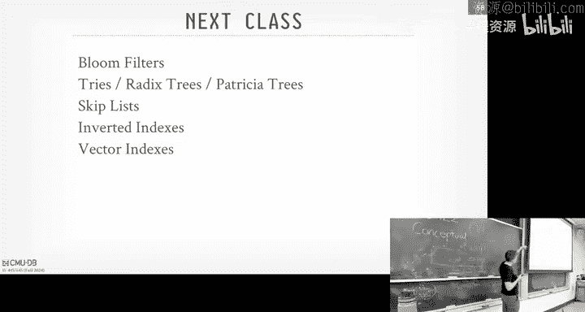

# CMU《数据库导论｜Intro to Database Systems (15-445645 - Fall 2024)》中英字幕（deepseek翻译 - P9：#08 - Tree Indexes_ B+Trees.zh_en - GPT中英字幕课程资源 - BV1Tys8eQELW

Yeah。Official glad you guys are here disappointing turn out this is。

This is the best data you' ever learned done in computer science， right， Forge red black trees。

 right， For play trees。 Nobody uses that。Ppa trees is what we want to use。

 So this is gonna be the best before we get into that again。

 I wanted to hopefully have started or finished Project1 that's gonna to be due this Sunday coming up。

 We had the recitation on last Thursday， we also did a additional recording of how profile the performance of your of your of your buffer pool。

Guys。So profile is so that if you want to get hired in the leaderboard teach you how to do a flame graph。

 and if you've never seen how to use PEf before we have a tutorial on how to use that and you can do this on needed the command line or C line or I think Vi studio can also support it as well however3 were released on the 25th and then midterm although three weeks away because least put it on your radar that's gonna be in this room in class on October 9。

 the Wednesday and that'll cover everything up to I think lecture 10 including Do 10 So whatever the Monday lecture is before the midterm that will be in the midterm well have more information about that next week。

 and then if you have special accommodations you needed us to handle。

 please email sooner rather than later。😊，Any questions about Project one？Okay。Beyond this， again。

 we have some optional talks。 The first one is actually today It coming on Zoom at 4 30 PMm after class。

 and that'll be a project committer for data fusion somebody actually works to influx but influxD will be talked later in the semester。

 but they're based entirely on data fusion。 So Angelines going talk about what data fusion is and why it matters and how how you could build a more complex system on top of something like data fusion so that you have to learn all the things doing the semester。

 but then you could build a more complex system on top of it。

 And then the following next week will have the guy that actually invented data fusion。

 He's not Apple he bought out by Apple from Ed of Na and then he has a project called data fusion Comet。

 basically it's a accelerator for Spark。 Chris Sparson Java sparks old and sparks slow Data fusion comment is a way to use data fusion to make Spar Ri faster。

😊，And then also in the week after that or on Tuesday next week。

 we have somebody from Oracle to Tker who is going to talk about Hall supporting JO in Oracle。

Tthaner is a good dude。 He's pretty high up at Oracle。 A couple ticks below Larry Allen。

 he's good dude。 This should would be a good talk。 And that that'll be in 6501。

 But I think he's calling it over zoo。 And there'll be pizza of that one。😊，Okay。Again。

 these are options we want to go beyond the course。

 these are the things I encourage you to check out because a couple of you have asked me how do I learn more databases other than me cramming as much I can in the slides。

 these are opportunities to go beyond the things we've talked about。All right。

 so I know I said to post some piazza that we were sort of rushed at the end to go over accessible hashing and linear hashing。

 but we can talk about， I can answer any questions you may have at at end of today's lecture。

 there as a reminder that last class was about hash tables。

 which are the data structures are mostly using in the inside of our database system to keep track of various things we need to keep track of while we're running queries and running transactions。

 we can use them as an index， but most of the indexes that we call create index B plus3 that we're talking about today in most systems。

😊，Hash it was on nice because they have the average time complexity of 01。

 meaning you do a look up on a key， you hash it some location。

 and that's going to be roughly where you need to be to find the key you're looking for or that you identify that you don't need it。

😡，Like I said， most of these hashables that we talked about last class will be primarily used for internal things inside a data system。

 not something you normally expose to the outside world。 Now。

 there are some data systems that are built entirely off of hashable where only thing。

 the only thing you get is essentially a hashable。😊，Roughly Redis is basically that。All right。

 so now today's class we want to go beyond this and say， okay。

 we talked a little bit about how hashs we use the indexes and these are meant to be data structures that are allow us to find logical data like tus or records in our databases more quickly So we want to start the background of what that is and also understand filters which we'll in next class and then we'll talk about how again the next two lectures are how we're going to build optimized versions of these different data structures we could use。

So an index as sort of obvious everyone here is really a data structure that's going to be based on some subset of a table's attributes。

 like some subset of a columns or all of them if you wanted to。

 but doesn't have to be where they're going to be organized and sorted in such a way that's going to allow us to do quick lookups to find single tuples。

😡，Now， it's not always the case。 Sometimes you have indexes like in Postgres。

 you can get blocks of tuples， right， but for purposes today， we just assume like for a key。

 you can find a small set of the table。 An example of an index will be a B tree， B plus tree。

A filter is a data structure that can answer what are called set membership queries。

 meaning it can tell you whether a key exists in a set， but it can't tell you where it is。😡。

a B plus tree or index let' tell you for a given key， here's where to go find it。😡，In my table。

A filter says forgiving key， yeah， usually it's probabilistic。 So say， yes。

 I probably do have that key you're looking for or no， I don't。

And the best example the most widely used one is be a Blo filter， which we cover in last class。

 This is something you can a filter you wouldn't declare on your table。

 although some data doesn why to declare Blo filter。

 you can't declare blue filters and tables that can be used for query optimization， but in general。

 this is something like like a hasht， what can be used on the inside whereas a B plus is be something that we have to declare for an index that a human has to tell the data system we want we want this index。

😡，There's whole other thing we'll talk about next week where how do we actually keep these things synchronized and keep them thread safe or concurrent？

For concurrent access， we like if I update a table and I add a key。

 I want to make sure it appears in my index。 So if I do a lookup on that index。

 I don't get a false negative。Again， that will cover throughout the semester。

But to the back of your mind， you got to realize that if anything's in the table。

 I want also reflected it in my filter or my index to avoid again， false negatives。All right。

 today's class we're going to again we're gonna focus entirely on a B plus tree。

 We can teach an entire course on B plus trees， but try to cover much as that can the basics within a single day。

 and then we'll basic talk about the basics of it， different design choices we have to consider when we build our B plus in our data system and then various optimization we can employ to make these things run faster。

😊，And as a spoiler， project 2 will be a B plus3 this year。

So it'll be based on the things that we talk about today。

And so BB is the most widely used data structure in database systems。

 I was actually reading a blog article this morning from Cia to be。

 they started with the red black tree， I don't know why and then they realized that was a mistake and of course they switched to a B plus tree。

😡，Right。All right， so the catthesian thing about B plus read is that there's a。

They're in a family of data structures's called bee trees。

But there is also a specific data structure called a B tree。😡。

And then sometimes people say in you know for a database system will'll say。

 yeah we're using B trees， but it's really B plus tree。 like in Postgres， they say， yeah。

 we have B trees， but as we'll talk about today，'s it's really B plus tree。

 and there' is the distinction between a not to be over to pedantic。

 There's a distinction what a B tree is versus B plus tree is。

 but most people implement B plus trees。But in most of you who don't implement B bus streets as it's originally defined back in the 70s。

 they used bits and pieces of various optimizations that people have developed over the years that will briefly cover。

😡，So the original Bre paper goes back to 1970 and it's from。😡，Bayer and McCate。

 McCts actually see me alum。 He got his PhD here in 1969 before any of us was born or maybe even earlier。

 And then he went off to Boeing and built the。You， it built the bere with Bayer。

 but this is not the paper Norman people read。 There's there's a survey paper from 1979 out of IBM called the ubiquitous Bree。

 And this basically describes， again， by 1979， this data structure was so widely known and employed in database systems like that's why it was called ubiquit because it was essentially everywhere。

 And even though this is you know， nearly 50 years later。

 the B plus tree is still going be the best data structure most of the times。

 Of course we're going to tweak it for modern hardware and smart situations。

But the core data structure is essentially the same。

So there is no original B plus street paper right in there's a a tech report from IBM in like 1973。

 I think where they talk about。Different variants of the B tree。 And in it。

 they include the B plus tree， which I again， I'll find for you guys in a second。

 And then they also never define what what the B stands for。Let me take a guess。He says balanced。

huh balanced。Binary， no。Because binary means you can have only two keys， more generalized。With that。

 he's the author's initial bear， that's another great choice。

The other rumor is that it stands for Boeing。😡，Because they invented that Boeing。Right well。

 so there's a very important follow up paper that came out in 1981 on the B Lake tree。

And this is actually written by someone here who did a PGS CMU and is actually still at CMU。

 So Phil Lehman works in the Dean's office on the fifth flooring Gates。😊，Right。

And so we'll see what the B link the B link tree paper does later on。

 that basically add these sibling pointers。 And this is what I was saying before that like everyone says they're gonna implement a B tree a B plus tree。

 but it's not the classic one that' being known everyone's gonna to use the sibling pointers from the B link tree because it makes concurrent access more easier。

RightAnd if you go actually look in the Postgres code， if you look at all the Ps。

 you can click the links， so let's take you to a source code file and share enough at the top of the file and the header it says this is a correct implementation。

 correctect is always good of Leman and Yawl's high concurrency B tree management algorithm from the B link tree paper。

😊，Right。And so， so I asked， actually， Phil sent me an email last week because I， I mentioned him Oh。

 yeah， We， you know， teaching B plus trees again。 And then he says he's 90% sure that back in the day。

 the the， the bear Mc credittic guy， the B plus Street authors told him it was named named after Boeing。

😊，It says the Boeing tree。anything a wise Boeing building a database system。

 again back of the day that wasn't off the shelf software that we have now。

 so if you're a plane manufacturer and you're trying to keep track of all your parts。

 you need a database system。😡，One of IBM's first A system， they built IMSS。

 they built that to keep track of all the parts to build the rockets go to the moon。

 and you can buy IMSS today。😡，All anyway。So， but B tree。

 the original PB tree bear is is from the 70s。 again， the。

 the B plus tree later sort of came later on， right。So what is the D plus3？😡。

So it's going to be a self balancing ordered M weight tree that's going to support efficient searching。

 sequential access， insertion deletions all in log and time。😡，Right？

And the M here factor is considered the fan out。 So the number of branches or pointers coming out of the nodes corresponds to the fan out。

😡，And somebody said， oh， B stands for binary。 So binary would be m equals 2， right。

And that's only you， Well， yeah， sort of as， too， but like。

The fan out for a real data system thing like hundreds of keys within a single node。😡。

I think of we talk about8 kilobyte pages in Postgres。

How many pairs of 64 bit integers can you put in there quite a bit？

So the fan out is going to be quite large， and that's going to make the height on average for most indexes mode B plus trees。

 three， maybe4，5 is pretty extreme。😡，So it's be pretty efficient for us to go find the data that we need。

So the B plus tree as it's classically defined， has these properties。

 it's be considered perfectly balanced， meaning every leaf node is going to be the same distance to the root。

😡，you get to the bottom layer， there's always going to be the same number of hops going back up。😡。

I mean， traversing down is always going to be the same cost log n。

And then every node other than the root will be at least half full。

So the number keys you have to have per node has to be greater than M2 minus-1 and then M minus-1。

So I always at least to have half the nodes full。And then when they get full。

 we have to deal with that， when they get less than half full， we have to deal with that。

 we'll see you in a second。And so this data structure has going be nice for us because we're not be able to optimize ourselves or optimize the access patterns to handle reading large blocks of data and writing large blocks of data。

 which we said we wanted to do at the very beginning because sequential access is cheaper than random access。

😡，So we'll be our to designer data structure and take advantage of that。😡，Now， the textbooks are。

 you know， the textbook defined these properties。 I'm telling these properties。

 and we'll see you know， throughout the lecture， real world implications aren't always going to follow this。

 They're going to lack some of them。😡，In fact， if I go back to the Postgres code here， right。

 if you can read the file path， it's source backend access N B tree， read me。

N means non So it's non balanceance tree because they're going to break some of these requirements。

 And that's okay because it it's going to allowed them to get a better performance。😡。

But let's understand again， the textbook definition and we'll see how to break it later。

So here's a really simple example of a B plus tree。😡，In this case here， there's two keys per node。

And so we have to firstifying what the node types are。 So at the very top， we have the root node。

 That's the entry point for everybody coming into this data structure and into the tree。

 Then you have the parts of the middle， the inner nodes， sometimes called the non leaf loads。

And at the very bottom， we have the leaf nodes。So you can see。

 think of the bottom as being the leaf node as all the keys we could possibly have that are going to be in sorted order。

 either from lowests to highest to highest to lows。

 you can define this if you want to create an index。So the contents of the root node and inner nodes。

 it's essentially alternating key value pairs where the key is going to be's going start off with a pointer to a node below it followed by a key that represents the separation of the value or key space。

😡，And then in the leaf nodes， we're going to have key value pairs where this is the actual the actual data that we're trying to represent like forgiving key。

 here's the value。 the value could be a pointer to a record I could be something else we're tracking in our system。

 right。So the way to think about the keys and the above the inner nodes and the root nodes。

 they're like separator barriers， a guidepost that tells you as you're traersing the tree。

 if you're looking for a predict particular or key， whether you want to go left or right。😡。

So in this case， here at the top， we have key 20。 So that means all keys that are less than 20 will be to the your your left of it。

 And then all keys that are greater than integral equal than 20 will be on the right of it。

 So if I'm looking now for a key， I could look at this at the very root。

 look at the you know that 20 and decide whether I want to go left to right。

 And that tells me how to go down。And I just do the same operation when I go down below。Right。

One additional thing we're going to have now is sibling pointers。😡。

So I think the original B plus tree implementation where the definition had sibling pointers at the bottom is just a way for us to get to left and right along the leaf nodes。

 but the B link tree paper added is sibling pointers for the inner nodes as well。😡。

And we'll see this later when we do scans along the bottom。

 we obviously can traverse along these sibling pointers。

The Sydney points for the inner nodes are gonna to help us later on when we want to do cocurrent access for split merge。

 because now we can jump across more easily without having to go always back up to the root。Yes。

 if M is greater than two， are there s corners between every possible？

This question is if M is greater than2， are there sibling pointers？To every possible pair， no。

 the tip point would prefer the node。Like for this node， his sibling is over there。 right？ So again。

 think of like large pages。 you know， it' you know， it's not a record idea。

 We have to have the key the page number， the slot number， it's just the page number。

 So64 bit or 33 B integer Not big。 Yes， but for the bottom row， if there's three children per node。

 is it just the left child point to the middle and the middle point to the right or all three point each other His question is if if if I'm the leaf node here or the sibling pointers what sorry if there's three children in that same node because said there can be more than two children per node yes。

 three of them point each other or is it just you going in in leographical order。

 like this guy is a 6， is is 10， if there was there was a say 8。

8 between in here And this would want point to that。😊，Because again， what are we doing here。

 what is the leaf node？With leaf nodes， what do they just look like？It's a linked list。

 that's all it is。Right， and so what the B plus tree is just the scaffolding above this allows us to get to where we want in the linked list without having to do a sequentialial scan。

 yes。I know the start there are no value。For the inner know。

This question is there's no values for the inner nodes， the values would be the node pointers。

 so make it more clear the scheme I'm showing at the top for the root node。

 it's the same for the sibling nodes for the inner nodes。😡。

There's pointers down to children node below it。😡，Yes。As your question， why。

 why am I showing three node pointers here， they would be null in this is example。

 I'm just trying to show that like the layout would be node pointer key， node pointer key。

 And in this case， you only have one key。 the rest is all null。

And you would keep track the metadata to say how many entries you actually have or noll bitnap。

So we'll see this again next class when we talk about S list。

 Sk list is me basically the same thing where they have a linked list and these build crap on top of it。

😡，Right。Again， once you understand， like， it really is just a linked list， but like。

Guidepost a allow to jump into that more quickly Then it changes your thinking about about it。

 it becomes less exotic， in my opinion。So right so we sort already covered this。

 the nodes are to be comprised of an array of key value pairs， where again。

 depending on whether I'm a leaf node， inner node or a root node。

 the values will either be pointers to other nodes if I'm a root node or inner node or a value that corresponds to the thing that I'm trying to the map in my tree。

Most of the time the arrays will be sorted in key order。 they don't have to be。

 but most implications do that。嗯。And then。For null values or null keys。

 you have to decide where to do that。 And， in， in most cases。

 you can either declare them at either the the beginning or the end， right。

 becauseuse you can't compare null with each other。 I can't prepare null the keys。

 So you gotta put them somewhere。 You just put them at the beginning of the end。

So one thing I to point out too is that going back here。

 notice how the ch nodes don't store pointers to the parent nodes。😡，Right， and we'll。

 we'll cover this next class when we talk about how to make this thread safe。 But the idea is that。

Because now we can only traverse the tree in one data structure。

 sorry in one direction from the top to the bottom。

 you can go left and write lateral moves that complicates things we'll talk about the next class。

 but in general， like we're only going from the top to the bottom， now we can't have deadlocks。😡。

Because it's not like I have someone from the bottom trying to come up， right。

 Everyone's coming in always one direction。Again， the sibling nodes sibling pointers cause problems for us。

 Some systems only have the link list in one direction for the ci pointers。 So the same thing。

 you don't have deadlocks。 so you can't have people come in a different directions。

 You always go one direction。Postgresco has doubling linked list， but you don't have to。

And it's a trade off between， again， do you want to spend more time？

Jumping into the tree to find the thing you're looking for or can just rely on those pointers。

 but now you got to maintain those pointers and that causes other condition。So there's no free lunch。

Alright， so go further detail what the nodes actually look like。 So as I said。

 there's there's a pointer for the previous page， the sibling and the next sibling。

 and these are just page IDs，64 bits or 32 bit ins。

 And then I use my page director we talked about before to go find the entry the page that that I want if I'm traversing along。

😊，And then we have these key value pairs that are just alternating one after another。

RightAnd the values are just gonna be pointer to something。

 So the actual structure will look something like this。

 You actually have some metadata in the header that keeps track of like what level you are in the tree。

 So you know how to interpret what the contents are， the page， how many free slots you have。

 the previous exploit pointer， other additional metadata nu map and so forth。

And then you have the key value pair sorted at the end。

 and that's just think of like a struct or pair of key vault probably by value over over again。

 and in bus hub it's set up this way。An alternative and actually a better approach is actually to do this where you store the keys contiguously one after another。

And then have the value array sort of that continuously separately one after another。

Because then it's like almost like the column story we talked about before。

 because now I can rip through and do binary search or whatever I need to on the sort of keys more efficiently and not to jump over。

Pointters that don't or values that I don't care about。Can guys close to thes。Yeah。Sorry， thanks。

 all right， so what are the values？So as I said， if it's going to be pointing to tus。

 it's going to be the record IDs again and most systems are going to do this and the record I is just the page number and the offset or whatever additional metadata we need to jump to things that we need。

 this one's most common。😡，But we talked about before about index organized storage where the leaf node are actually where youre to store the tus themselves。

😡，Right， Postgres， sorry， SQL light and， and my SQL famously do this for Oracle and SQL server， you。

 you can。😊，Oly declare a table you want to be organized in this way。

 but for MySQL at least an EnB and SQL light， always like when you create a table。

 it's going to be stored like this。😡，We discussed this before in in Le four。

So if for the primary key index， the leaf nodes are just going to be the tus themselves。

 if it's the secondary index， like a secondary key index。

 then the leaf node will typically contain the primary key of the tuple you're pointing to so you do look up on the secondary index。

 get to the leaf node， now you have the primary key。

 then you do a second lookup in the primary key index to find the thing you're looking for。

because you can't use the record ID， so you can't use a page number offset because the leaf nodes will start moving around as we'll see when we rebalance the tree and therefore you don't know exactly where the physical location could be。

 so if you store the primary key as the value， then you're guaranteed to be able to find it using the primary key index。

This complicates other things with NVCC， again， we'll cover this later in semester。But again。

 most of the time， this is going to be the record I。If we're using as an index。All right。

 so I made a big deal that there's the B tree and the B plus tree， what's the actual difference？😡。

So in a bee tree， similar to like a red black tree and other trees you may be familiar with。

The values there actually could be in the inner noses themselves。😡，Meaning as I traverse down。

 I'm not just trying to always get the leaf nodes， I could find an inner node and actually the value I'm looking for。

 the key value pair could be in that inner node。😡，Right。

So this would be more space efficient because each key can only appear once。

And then if it gets deleted， then it won't appear anywhere in the tree at all。In the B plus tree。

 the values that we actually care about are only found in the leaf nodes。

 and the inner nodes are just guidepost that get us down to the bottom。

That means we may end up deleting a key。😡，And it'll get removed from the leaf node。

 but it could still exist in the inner node because why pay the cost of going， cleaning it up。

 It's just helping us get to the bottom。 We can leave it there。

WWhy do we hear care about this distinction， What's the key thing between a B2 to B plusy。

 if the leaf nodes always have the values。Tree when you're。

He says you wouldn't have to restructure the whole tree when you delete these things。

 You still have to do that with a P tree。I traversal live nose。So yeah So you。

 so Ill just leave rephrase what you're saying， you're right。That if I do a traversal in a B plus3。

 I get past all the inner nodes。 Now I'm at the bottom。 I never have to go back up， save for a scan。

 And that means I just rip across the bottom sequentially along the leaf nodes to all the data I'm looking for。

😡，In a red black tree or a bee tree， you got to kind of bounce up and down the node that finds all the things you're looking for。

😡，So this is going to maximize this sequential access for us。Take notes。

The same is you might put all the non leaf nodes in memory。Yeah， yes， so。

But you still so we would save it is。What you' were trying to say is like you could keep the inner inner nodes in memory and not just fast lookups。

 but then only fetch the things from disk or evic things that are the leaf node that are maybe not likely to be used。

 You would get that anyway。 if it was a bee tree。 Like if you're only accessing one side of the tree。

 then the buffer algorithm the replacement policy will replace those things doesn't need it， yes。

That is why we want to store the values in inner node。Is why we want to do that。

 We don't want to do that。 That's what the be tree does。 That's old。 We don't want to do that。I mean。

 they're bothable。 But， yeah， we don't want to do that。 We want everything。

 All the values we care about are on the leaf nodes。 So as he said。

 when I do want to look up a sequential scan or range scan， I just traverse to the bottom。

 Then I can scan along the leaf nodes sequentially， ideally。😊。

And his final things I'm looking for and never have to go back up the tree。Would。

 would that approach benefit。If I don't want to search。

It David is with that benefit point query to your point， Yes， in a B tree。

 since the values may be in inner nodes， Yes， I may be lucky。

 And the first thing the root has the thing I'm looking for， and I'm done。

RightIt'll complicate when we do updates because the red black should you have to do rotations。

 that makes all that harder， but the win we get for sequential access it's going to be a huge game changer for us why we want to do this yes。

你给这个。免強 and then。Secondly know that。Like what， what is to， to。2 away Monday。So statement。

 I said that， oh， when we get the leaf nodes。We'll be able to rip through things sequentially。

 But what if it just so happens at the pages themselves。Aren't contiguous。 And。

 and it becomes random。 Well， because I know that when I'm creating the data structure。

And I'm allocating pages， I would know it's a leaf page。

 and therefore I should maybe allocate it to be larger than the inner node， we can change that。

 right？Or then also I could pre allocatecate pages to say。

 here's a bunch of lead pages that could be contiguous to each other。

 and I make sure that they are logically contiguous and both physically contiguous。Yes。

 and how would you tune like the number of？Would be based on like beach size。His question is。

 how would you， how would you tune the number of keys you want to have in a node， That'll come later。

 The answer is depend again， it's a cop out。 I'm gonna to say many times to the cluster。 It depends。

 But one the key factors is actually can to be the hardware。If it's in memory。

512 B is probably enough。 If it's a really slow disk，1 MBby。

You can change that depending on what the hardware is。Al right， so let's。

 let's get through actually how to maintain this thing， do inserts leadss。

 But I think everyone don't understand the basics of how to do lookups。All right， so an insert。

The idea is that we want to figure out we traverse our data structure， the B plus tree。

 as if we're doing a lookup， that's the same algorithm。

And then we find the leaf node where where our key needs to be。

So then if the leaf that we're going to turn into， if it has enough space， then we just insert it。

Inserted order。 and M we're done。But if it doesn't have a space， then we have to split it。

And we'll create a new node and take half the keys and the node that we're splitting into put them on the new node。

 a nu leaf node， and leave the other half there。😡，And then we have to update our parent。

 which may recursively update the rest of the tree。😡，Dending what the layout looks like。

 so that we can readership at everything。Right， so that's a simple example here。 So again。

 we have these guidepost here。 and this again， this is saying that everything less than4 is on this side。

 greater than greater than greater equal 4 and less than12 is over here。

 and then greater than equal to 12 over that。 we use a more tight notation there。😊。

So if I want to insert 6， right，6 should go here。😡，Because six is between five and9。

 but the problem is this node is full。So we're going to have to split it。

So we'll slide over that existing node。😡，Create a new node here and then take half the keys that are in the one that we're splitting。

 Keep half here and put half half over there。So I'll put nine and 10 on this side and then keep five here。

 and then I'm now going to start six。Right。Am I done。When， when are missing。Right。

 the inner node now needs to be updated to reflect that we now have a split。

so I got to put a value here， so all you to have to do is is take the smallest value here。

 which is9 promote it up there， and then this changes changes all the guypost what key range is covered by what subrees。

So now if I want to insert8， again and start with the root。

 Ill use my guidepost to figure out where need to go。8 is less than9， So it's going to go here。Right。

And I just insert 8， and that's fine。That's easy。Let's look at a larger tree。

with more nodes or more keys per node， so I want to search 17。17 is going to go here， that's fine。

 no issue。Now I'm want to insert 16， 16 to between 15 and 17， so it's going to go here。

 but now again our node is full where the new keys should be， so I have to split it。😡。

So we'll do this same thing we did before， we're going to create a new new leaf node。

Slide over the other guy。Split half of the keys to go stay here。

 half the keys go over there like that。哎。Now I need to then make sure I update the parent node to now it points to the new node I created。

But the problem here is that。The parentoid is full。

So I have this new parent guidepost up above in the root node。

 but I can't fit it into my current root node。😡，So again。

 now I just recursively do the same thing I did before at the leaf nodes。

 I'm going to split the root node， put half the keys on one side， half the keys on the other side。

Right。But now I need to go decide。Cause because it's the only node at this， at this level。

 because it's the root node。 I gotta make another level above it。

So I'm gonna pick the middle point here。 Take 13。 That's gonna become the。

 the split point for the level above me。 I take my。Cate a new note here。 Split the Go back here。

 sorry。Take 13 goes up。 naG put 16， but now I need to update 13 to your point to。😡。

To the I need to split this one further。 right， So I take split it out to tune to inner nodes。

 Ha goes here， half goes there。 And then now my root node points to the the two。

 the tune inner nodes are created for the second level。And the boundaries are this。So again。

 recursly keep going do my splits until I meet my root， if my root is full。

 then I got to split the root and make a new level above that。😡。

And then update everything down below。So because I don't have any parent pointers for these leaf node here。

 when I'm going back here， when I did this split。😡，Here。I don't have to touch this side of the tree。

Their parents change because they're not pointing to it。 That's no big deal。

Now the new inner node here just has the pointers down below。Yes。 how do you know where to split？

What do you may wear？How do you choose。It's in the middle。Yeah， that's it。 There's no magic to it。

Okay。So delete is basically going to be the reverse of this。

So same thing I want to traverse the data structure to I find a leaf node that where has the entry that I want to delete if it's not there。

 then then it's negative， I don't do anything if it is there， then when I remove it。

 if I become less than half full。😡，Then I have to merge it or do something to make sure that it's balanced。

😡，Right。So the trick we're going to do is we're going to rely on those sdling pointers to steal a key from our neighbor if we can。

 so that we become balanced。But if taking their key causes then become imbalanced。

 then I have to merge。Because if if they're exactly half full and I'm exactly half and I remove a key。

 and if it makes me less than half full， and if I take a key from them。

 they become less than half full， then I know I can combine the two。And I do the same thing。

 did the insert， I recursly do merges up the tree until everything is balanced。So yes。

What we want the treat to be that is。Why do you want the nodes to be at least half full？

Because you wouldnt。You want to make sure that looking up any key is asymptotically the same no matter what key it is。

😡，And because it's sorted， the data structure will always end up being essentially the same。

 no matter what the order we insert them， assuming we follow the same protocol decide with the split key and so forth。

😡，This will be different than a try， triess data structure is going to change depending on the order which we insert keys。

 but we'll ignore that for now。😡，So again， this guarantees that any lookup for any key is always going be log in。

Alright， so we going to delete 6 again， traverse the root down to this leaf node here。

 We can go ahead and delete it。 Now our this leaf node here becomes less than half full， right。

 So rather than merging， we just go look left and right where we have a sibling pointers and find whether we have a neighbor。

😊，That we can steal key from。In this case here， the key next to it or say the node next to it has three keys。

 so we can go ahead and steal9 without doing anything， right？

But we're not done now because now since 9 was the， the guidepost here， right。

 we'd have to go look and and peek and see whether that did we steal something or actually。

 we would know because that would always be a bug。 So navigate we update the guidepost to reflect the fact that if any value is。

 is。Equal 9 should be over here。 So all we're going to do is just pop up the the the lowest value on this node here。

 which is 12， and then just overwrite it into。It's parent like that。That's easy。

Let's see a more complicated example。 So it's now going to delete 15 here， right， do a tosal。

 end up in the leaf node， Dele 15。 Now， this node is less than half full。

So we can try to borrow from from a sibling。 That's fine。 So we'll go ahead and copy 17 over here。

 right， And then now we just have to update the guide post up above and say that 19 is the the split。

 not 17。😊，That's fine， that's easy。Now if I want to delete 19。I delete do the ver。

 Find the leaf note， deletete 19。Now I'm less than half full。

But now I can't steal a value from any of my neighbors。😡。

Because they would also become less than half full as well。So I have to merge。And again， the。

The different systems will do different things of like do you merge from the left。

 do you merge from the right， do you steal from the left， steal from the right。

 the high level protocols is the sameDifferent systems do different things。In this case here， lets。

 let's merge with our， our neighbor on the， on the， I guess， our right。Right。

 so that we we have to do is kill the guy post up above and then combine these now into a to a lut and e node。

But now the parent node in the middle is now less than half full。And we need to then merge it with。

It's neighbor。Or sibling over that。So to do this， we're going to pull down the root node 13。

And then split it across， it' combine everything together into a。Andto a new root note。

So when you do a delete， you may end up collapsing and reducing the height at most by one， yes。

Con we're borrowing， are we only borrowing from like immediately adjacent siblings？

Like if there's something in the far left that has like three， could we borrow all the way from？

His question is like back shear。When I was had a borrow。

 is it only immediate siblings or could I do major surgery， rebalancing things way over there。

 You could。No don't think anybody does that could be expensive。

Like you kind of want to be in and out of the tree as quickly as possible and so spending time to go look at what could I steal from other than my neighbors。

 immediate neighbors， it just it just makes makes it longer and slower again you're holding latches while you're in the data structure we're not coming now。

 but just it'll slow everyone down behind you。😡，Yes。実際？The beginning。

 you set like the maximum number of key is M minus1。M is like the number of children， so it could be。

啊。Nextction my key is M minus1。So yeah， in this case here you would have。😊。

I mean there's four pointers， that's the degree。And then you have three keys。

 So the number keys is M minus-1， the number point is coming out as M。So M is the number of yes。

 yeah， or the degree of coming out。 Yes， I'll double check the slides if that wasn't clear。All。

 other question about the leadss。Yes。The inner。So going back here。

 why didn't I update from from 19 to 20。Yeah， that might be a typo。Actually， no， no no， all right。

 so good point。So the question is， going back here， I deleted 19。And then I decided to merge。

And then I I removed that out there， but I didn't update the inner node。

 That's what I' was saying before。 the key key can if we delete a key。

 it definitely cannot exist in leaf node， but it may exist in the root node。 So in this example here。

19。 yeah， that's discriating enough。 Like it's still correct。 Any value less than 19 is on this side。

 Any value greater and equal to 19 is on that side， It's fine。 Leave it alone。😊，Right。

 you could clean it up。 there's no reason to， right， Still correct。 And eventually it， you know， if。

 if we。If we keep splitting the notes， it maybe gets removed eventually， but who cares。

 It's still correct。In a B3 you wouldn't have at B plus3， you can。😡，Yes。If we had a third。This stage。

どんな。Second。So the question is if I insert 12。😡，So I would come down here。9 is great。

12 is greater than equal to 9。 So it would go here。 So it would fill。Okay。

 so there already is a 12 here and it points to something else， yes。Ive stolen it。他这个。那我出在。Theデ exam。

right， so his question is， if say had another node in between here that had enough of。

Enough space at Cral Key。I think the rule is because you don't share a parent， you don't steal。

Because if you do that， then you got to take latches on this and it makes them more complicated。😡。

Yes。In 1819， why do we do a pull down instead of merging with？question in D 19。

 why would we do a pull down instead emerging the sibling？Actually， you could merge if you wanted to。

But then it gets weird because now you have like。Root has one at the top of the root。

 there's one node。 And then the next level， there's one node。Right so you'd merge。

He say it's still theoretically correct。No， because it would be more than login。

Could itd be an extra jump to go find anything you need。It's one。Which I said before。

 constants matter。We can么 do that。Yes。没定意见。未や出るとはしない。我直边个。在楼里。

ect to each other theyll only be connected with the shares。No， so。

I'm not sure the simply point is here did I say that the assembly pointers only exist if you。😡。

If you share a parent， no， you have sibling pointers all the way across。

 even if you don't share a parent， his example was if I want。

 can I steal from a sibling where we don't share a parent， I we still have sibling pointers。

But you would know who your parent is。To go to the lake， if I know who my parent is then effectively。

T me to。Qu is。Yeah， I said before you would not maintain your。Yeah， so his question is， how do you。

 how do you know that you don't have the same parent？ That's a good question。Actually。

 I don't know what they do then I'm pretty sure you definitely maintain silly points all the way across。

Yeah， I don't know how to check that。I mean， the obvious thing would be you have to maintain the stack of the pointers as you go down so you know that。

😡，For your parent to get down there， you were the， the leftmost child。

 There isn't anybody on the other side。 you don't go look， that's the easy thing。

 easiest thing to do。Okay， one last question， yes。Yeah tri years。Yes。A tree that was just like this。

 but there was。Insert。But I'm going to。Have a shorter distance。The other side。I think。

 so I think the example you're saying the same he brought up where what if I had a。

 a single note above 13。 So then， then。That single node would only point to 13 and。

 and then the other side。 Or I'm not sure saying like， like， you can't do that。 Like。

 it has to be balanced。so well this。In the caseYeah， so we're here。Theres a case where this。

Looking at a sub。Would it be possible？NowThe question is。

 is it possible to have have one up of the tree subre have a shorter height than the other subree。

 No， it has to be balanced。See， that case wouldn't happen。All right， last question， yes。You have a。

S notes， and you always try。Your question is， do I always check whether I have one sibling and therefore I can pull down？

呃。How would you check whether you。Or like， should you always run that check before trying to do。

So we'll come to next class as you start doing the deletes。

 you actually keep track of latches on nodes。Where you know that you may have to do a merge。

So you know how far up you may have emerged like as you get to the bottom because you don' as you're  tracing out。

 you don't know whether the delete the leaf in your la could absorb the delete without having to change everything So you hold all the lates on everything and then now when you do delete。

 you know how far up you would have to then apply the merge。😡，Okay， there's a lot we need to cover。

 but again， it sounds like you guys have the basics of this， which is good。Am。Again。

 we can go over this recitation for Project 1 or Project 2 if necessary。All right。

Can think what's the most important thing to cover。Yeah， let's get through this quickly。

In all my examples have shown before so far， we've talked about like single key attributes。

 like a single digit， you know， single value， but in actuality， you can have multiple keys。

For an index， this is called a composite index。So in my example here。

 I could have a table called XxX and I could make an index on attributes， A， B and C。😡。

RightAnd then I can declare additional metadata about what the structure of the data structure to look like so I can specify what the sort of order is for a given column and that can change by default it's always ascending。

 and then also specify where do I want to put my nulls Do I put them all at first， I put in the end。

 I think by default throws at the end listen Postgres。😊。

And then now one of the things we can do in a B plus3， if we have a composite index is we can。

We can do lookups on partial keys if we have a composite index。Remember， I said。

 we couldn't do this in a hash index。Hash index X you have have all the keys because you take all the bytes and you have to hash to figure out what you land in the hash table。

😡，So if you only have one of the two keys， the hash means nothing。😡，But in B plus3。

 we can actually do lookups on。😊，Portions of of of the key。 So obviously， if I have a inex， A。

 B and C， I do where a equals 1 B equals 2 and equals 3。

 But I can do a prefix lookup where A equals 1 and B equals 2 without having C。

And then in some systems， I think only Oracle and SQL server， you can do crazy stuff like just。

The inner parts of the key without actually having the prefix。

 I you know B equals 2 and C equals whatever。Right， so visually looks like this。 So again。

 say I have two， to。In my composite index， I have two keys， one and two， or sorry two values。

 So I want to look up a key where the pair of1，2。 again。

 I just break out the individual components of the attribute because I know the type of the keys because I'm starting that in my catalog because we're a relational system。

 So then I just do my lookups as if I was looking up on a single key decide where I want to go down on my tree to find the data that I want。

If I want do a prefix lookup， it's essentially like having a wild card at the end of the key。 Again。

 think of the keys are just just a byer ring。 but I know where the offsets are。

 I know how to jump to the individual types。 So if I only have the A and the first key and not the second。

 again， I just treat that as doing the look up on the first part， land down in my leaf node。

 now I scan along thanks to sibling pointers to find the keys。

 find the rest of the keys that match the predicate that I want。

The last one is a bit more complicated。 again， only Oracle and SQL sub do this right。

 So now if I only have part of the key， again， now I basically have parallel searches going down all possible branches in the tree。

 Now you just have multiple threads。 Youve got to coordinate that of who's looking at what and so forth。

😊，And then you find all the matches， and then you have a way to consolidate the resultss later on。

Oracle calls these skip scans， I'm pretty sure they have a patent because it's oracle and that's why most has told implements。

's a lot more machinery you need to handle this。Now we need to handle duplicate keys。😡，I said before。

 you can have a primary key index， where the key has to be unique。

But then you could also have secondary key indexes where it may not be unique。Right。

 people would have multiple zip multiple youre going to live the same zip code。

 And if I want to index on zip code， I have to be able to handle that。

So there's two ways we can implement this。 The most common one is that we actually implicitly store as part of the key of the index。

The record ID。And then going back to what it showed about the composite index。If now。

 when you look up on someone's zip code。I just do the prefix look up just with that zip code iss gonna find all the entries that with the same zip code。

 even though I don't have the second part。 I don't have the。I don't have the record I。

And then now the data the B treatment limitation just treats all the keys as unique because they are。

Altern is to do overflow leaf nodes， and this is where I recognize that I have duplicate keys and I did allow leaf pages to keep almost like the chain hasht watch you before to keep having more pages appended to the end of it。

😡，W whichch sucks because if I have a skew distribution， I may end up with a really long chain。

 and I'm back to them doing sequential scans。So again， so for app the record ID， again， the key。

 even though I'm showing the key is like 1367， the key really is like at this hidden thing where they keeping track of the record ID。

😡，All right， Postgres does this but I don't think they' even exposed to you。

 you can't get through SQL that it's storing the record ID only if you look at the page。

 the actual bytes， you can see that。So when my SQel query wants to insert6。

 what it's really doing is first inserting the tuple into a page。

 now I have a record ID with a page and want to slot number。😡，And then concatenating that to the key。

 I do my insert and I land exactly where I want。And now in this case here。

 because there's already a six or some other record ID。

 I just do the split algorithm that we just talked about， to add new leaf nodes。😡，So again。

 logically it looks like it's the same key， but physically the record ID is in there。😡。

For overflow leaf nodes， the idea is that you would recognize that I already have the key that I'm trying to insert in my leaf page。

 so then I just extend it out to add another leaf page and then have a pointer down below and so forth。

 yes。这个先都か。His question is do we just say that the value is also the record ID as well， yes。

 so if you're smart you could just recognize， oh the record ID that I already have in the key is the value as well and don't store it twice。

I don't know what Postgres does。Yes。Don't the overflow nodes。ていセ。Absolutely， yes。

 his statement is correct， doesn't having these overflow nodes break what we just said before about having s scan along leaf nodes。

 absolutely， yes。I mean， in some ways that you sequential scan this way。

 then you have to know to pop back up。 But yeah， and as I said。

 if you if you insert the same key over and over again， now you have this really long overflow chain。

And that sucks。It's more management，You search it like， as if its account。Especial is。

 how do you search a key when you have when you have duplicates if it's the， if it's the。

Going back here。 if it's the record， if you pack in the record I D。

 then it's just look prefix search。 So I have the 6。 I know， I need to find the 6。

 but I don't know the record I that's depended to it。

 So I'll get all of the sixes and get all the record Is out of that。If it's the overflow chain。

 you land to the leaf node and you say， all right， well。

 I know the key I'm looking for has to be in this leaf node。

 so let me follow all all the overflow pointers down below， and when I'm done。

 then I know that six can't exist in any other pages。😡，It's the same thing as the chain hash table。

 right， So in the chain hash table， you hatch it， you get a bucket pointer。

 you land that that bucket chain and you scan all those pages until you find what you want。

Same thing。 But instead of having a the hash look up at the top， it's a B plusy。Yes。For over。

in case like an extreme scenario where we have like one really bad key collision that has like a long overflowed node。

 doesn't that break the consistent？I and she's correct。 Does't this break the log and guarantee。 Yes。

 I， you know what， I should put the thing or don't do this。 Do， do the record  at。 Okay。

 I just want to show you that you could do that。 There's another you know one way you could do this。

 but don't， but don't。All right， cluster index is between concept and data systems。😊，And as you said。

 if we're using a heat file storage， the heataps are unsorted。😡，Right。

 but now I'm maintaining this heat data structure that's un sorted。

 but I also have this index that' that's unsorted right。

 And I can do index and organized storage where everything is nicely sorted my leave pages。

 But in some database systems， you can actually say， I。

 I want my he file to actually be sorted based on some index。😊，And in the postcards。

 you can call the cluster command， give it an index on a table。

 and it'll literally rewrite the table to be sorted based on that index。😡。

It won't maintain it forever， right， if you start inserting new things， it'll become out of order。

 but it's sort of like a one shot， one time operation。And again。

 the reason why this matters is because again， we want to maximize the amount of sequential access we have when we're accessing our table。

So if we have a cluster cluster P plustry or again。

 whether it's one time sorting like in Postgress or in index organized pages。

 if now I want to scan along the leaf nodes when to find all the table pages。

 when I access the pages， I know that I'm only going to retrieve them once。Right。

Because there's no value that could be in， you know。

 key that that points in here that that could potentially also exist in here。 As I scan along。

 I have to visit each leaf page once。Right。If it's unsortted though。

the index is now going be sorted on some some sort order。

 And then now my heat file or whatever the pages are， they're completely unsorted entirely。

So now if I scan along here， my pointers may be going to all over the pages。😡。

So what happens now now if I'm just blindly scanning through whatever I see comes out of my index and then go grabbing the page。

I'm going to have random access。Say we have a really extreme case where we only have one frame in our buffer pool。

😡，So just using this example here。 So this little box here represents every single time I got。

 I have to go read a page that isn't gonna to be in the buffer pool。

 And so rarely do I have two pages that are two， two keys that are pointing to the same page con to each other。

 So I'm basically thrashing， going in and out of the， the， the buffer pool。

 going at pages and over over again。😊，So really sub optimization is to not actually fetch any tuples while we're scanning the index。

 just go get the list of tus we want。😡，Then sort them。Based on the page ID。

 now when I scan through and get all the tuples， I'm only reieving each page once。

Pogss calls us I think a bit mapap heat scan， it'll do a scan on the index， get all the pages。

 sort them， and then combine them together。哎。In some cases too， you can actually do this。

 you can get all the page IDs from multiple indexes， then do intersections on them。

 depending on the where clause is， and then now you have a single list of the pages you need to retrieve。

😡，All right， I want to finish up in the last 20 minutes talking about some optimizations we could do。

And how we actually want to build this thing。 And so some of these ideas and techniques could have come from this book that came about 10 years ago called Moern Be tree techniques。

 So again。😊，The B plus Street paper is 1970， B Link is 1981。

 but they're still writing books about how to make these things work because it's the most important data structure in the world。

 not just in databases。😡，The thing how crazy it is。

 there's a data structure for databasess people write a book about。😡，Right。

 there's no book on red black trees。 as far as I know。 There's no book on s trees， No F Da Slater。

 right。It's so important there's a follow up that just came out last month， right。

More modern B+3 techniques， right？😡，So again， it really is that important。😡，Alright。

 so the first question is what he brought up， Like， how do we decide。

 decide what the size our nodes going to be And then as I said， like。

 it's gonna to be based on what the hardware is。 So the slower your， your data， sorry。

 slow that the device， the the larger you want your page page size to be for your nodes because。😊。

When I got to go fetch it， I want to maximize sequential access。 So if it's a really slow disk。

1 megabyte， if not larger， but it's really fast，5 and 12 bys is actually the right size。

So the enterprise systems like DB2， as we talked about we talk about buffer pools。

 you actually can declare for a given index what buffer pool manager you want to use for。

 substantially different buffer pool managers， and you can specify what size the pages should be。

 So you can say for this index it's on this buffer manager with this page size， again。

 depending depending on what you want。😡，And if you know that you're mostly doing point queries。

 it's going look up single keys， maybe you want a different size versus doing long scans。

The next question is what sort the merge threshold is， as I said in the beginning。

 there's the textbook definition that says， I merge when I'm less than half full。

But it maybe the case that you're like deleting and inserting really fast over and over again。

 So all you're going end up be is just splitting emerging over and over again， like insert a key。

 delete a key， insert a key delete to avoid that， you can relax that constraint to let something go less than half full。

So that。You don， you know， you're not， you know， you're not collapsing that node。

 If some inserts show up， then you can fill fill it in。 If it goes completely empty， then yeah。

 merge it。This is why Postcasts， again， they called it a non balanceance B plus tree in the code because it's not exactly balanced as the way we talked about before。

😡，Another trick you can also do is you can have different sizes for the leaf nodes than the inner nodes。

Right。Typically maybe the inner nodes would be a bit larger than leaf nodes because they're going to see most of the traffic。

Next we've got the handle is Ver laques， so there's a bunch of ways to do this。

One way is instead of storing the long keys inside the pages of the nose themselves。

 you just have a pointer to the tub like a record ID。To the pointer。

 and then since we already' know how to store those in slotted pages， we just use all that。

So in memory databases there was a structure called T Tes。

 I think T stands for the name of the dude that inventeded it， but if you look at the paper。

 all the node looked like Ts themselves so that was a nice little clever thing that they did。

Do we think it's a good idea or a bad idea？HeHe said， " depends。啊。I mean， yeah， he's yes。

 like if your keys or like one gigabyte， sure thats yes， definitely。But most keys are not one GBy。

What I have to do to do a lookup， I got to go look in a node before I can do any comparison to the key if there's no keys in the nodes。

 I got to get a record ID to go follow that pointer to get that tuple， then I compare the key。😡。

So it as I'm traversing down， even though if I'm doing binary search in the middle of a search we have to do within the inner nodes of a B plustry。

 I got to go fetch a bunch of tu bolts and that sucks。😡，So most systems don't do this。

 even in memory systems like Oracle timess 10， which originally was using T trees from the 1990s。

 they got off of this and everyone's using P+ trees now。You can have variable length nodes。😊。

You can allow a node to the size of a disal to be fixed within。You know， within a given level。

 this is only in academic systems。 It's， it's pretty rare because it's a lot more memory manage to do this。

 right， The， the right approach would be something like like again D2。

 you say the buffer pool has this page size and everything inside is the name。

You can do padding that we talked about， if I know the max length of the key type。

 then I put a bunch of zeros empty space after the key so that it always nicely aligns。

The more common approach is just within the page of the node themselves。

 just like we had that slotted array， a slotted pages。

 you have a portion of the space where you store the very length keys and in some cases you could have overflow Postgs allows overflow within a given node。

They to accommodate this because the number of keys has to be fixed。Next question is， okay。

 when we land in a node， how do we do that search to decide whether we want to go left or right？

So the easiest thing to do is just linear search。Right， assuming， assuming that it's not sorted。

 I start to begin the end scan along until I find the key that I want and I'm done。And you know。

 it's simple to do， it's easy。A better way to do this though。

 if I could take advantage of modern hardware is to rely on Cindy。Does everyone know what Cindy is。

 who here is taken 418？Very few。 Okay， may not know what India is。

Single instruction multiple multiple data。 So in sort of classical programming。

 you think a cyst or like single instruction， single data， like one plus one equals 2。

 That's cyst you can take one part of the register。

 take one put another register in single instruction it gives you two。With CMD。

 you can rely on the hardware to allow you to take a vector of values。

 and then there's specialized vectorized instructions that do same operation on all the values within that vector。

So we'd use like intrinsics like this for X86 Ar has their own version of this and there's libraries that can do this all for you。

 but let's say I'm looking for eight， so I'll put in my vector register8。

 four times because these are four lanes in here so I mean 30 bit integers and then now within a single instruction I can do a comparison with a vector of four values that I'm looking for and it gives me another output vector output register that says01。

 whether I have a match。So instead of doing that， yes， I'm doing linear scan。

 looking at individual values， but within a single instruction， I look at four values。

 or you go to an AX 512， I could look at significantly more。😡，And then if I don't my match。

 I just scan along and do the same thing again until I find the thing that I want。

And there's bit shifting operations to pull out the one and identify where it was。

So that'll speed things up， that's nice。Obviously， again， if it is sort of。

 then we can just do binary search， you just jump to the middle point， look at the key。

 figure out when you go left and right， and you just can jump around until you find that thing you're looking for。

😡，は。Best straightforward。A the fastest way to do this， which only exists in academic papers。

 I don't think anybody actually implements this is through interpolation。

 So if you know that the keys don't have any missing values in them。

 they're always monoly increasing。Then you can just do a simple formula to say I know that the key has to exist or not exist。

 and therefore I know how to just do the math and jump to the offset that has exactly that I want。😡。

Okay， said， no systems actually do this。 It's gonna to be binary search or the linear search with the Cindi is gonna be better way to go。

All right， let me run through a quickly last set of operations or optimization you can do。So。

Prefix impression is when you recognize that because the value domain within the index are going be the values that con each other are likely to be very similar。

 same reason why we put things as a column stored that now instead of having dispersed values from different attributes within within a table。

 all the values for a single attribute are contiguous。

 So if I recognize that I seen the same thing over and over again， the same prefix。

 then rather than storing that that redundant information， I just store the prefix separately。

 and then everything else that comes after that is the suffix。So now when I'm doing lookups。

 I know how to look at the prefix as needed， and then only look at the remaining ss if I don't have a match。

It's sort of like the deelta compression that we talked about before。

 like the frame of reference compression。For Dduplication。

 the idea is that if I can recognize that I'm seeing the same key over and over again。

Instead of having to store that key redundantly， I can just have the key once followed by maybe a small number that says。

 here's how many values that going to cover for it and then followed by those values。

Pogs added this two years ago for their B plus trees， and it reduces the size quite significantly。😊。

You can actually do same things for the values as well， not just the keys。

 like if I have a bunch of two postss that are all in the same page。

 instead of starting the same page over and over again， I distort at once。

 say all these guys are in the same page with different slot numbers。Why will there be？

Why would there be duplicatelic keys， zip code？Zip code example。So statement he's correct。

 didn't I say you that the record I to make sure it's unique。 So the key is the same。

 The record IDs are different， right I not it。But I'm saying like in the internals of the system。

 we could say， I know I'm app the record ID。😡，And therefore， if I see the same key。

 the same prefix of the key， store that once， and then now just have the record Ids。

And that's the values。So up above in the inner node。

 I think in postcards the up above the inner nodes， I think you don't do the duplication。

 but for the leaf nodes， you could do this。I or yes。Oh yeah。

 it is like a better form of the ooflow nose just because it didn't。She said。

I this a better form of the overflow node？As those an extra extra layers。 Yes， but like。

 you still may have to have the。If you're doing the overflow method。

 you may still have to have the overflow chain。😡，Again， always thinking like stream examples。

 I have a billion people。There's half a billion people in one zip code。Now。

 this so a question is this a bad idea， this is a good idea because you you could do this for the record I thing that I talk about for apptting the record I because now I can extract out。

Say this is actually the key here is that the true discriminator。

 the thing I care about the zip code and that's for getting repeated。

 but then I'm putting the record idea as part of that composite key， I pull that out。

 that's essentially the value now I'm sorting zip code once for all possible values within the zip code。

This is a win you definitely want this。Alright， I can do suffix truation for the inner nodes， again。

 if I recognize that the most of the time I only need or the keys and the inner nodes are pretty unique。

 at least for certain or characters， say for a string。

 then I don't need the rest of this string to figure out whether I need to go left or right So let say hey I have long strings like here it's the full alphabet。

 but I only really need the first letter to figure out whether I need to go left or right I'm showing three letters。

 So I just store that said the full thing。😡，And then now that's enough for me to figure out when I go right。

 Now， of course， this， this may break if and insert something that that violates this。

 So that's why I'm I'm storing ABCs that it just A。

 I'm giving have a little little wiggle room in case， you know。

 in case something comes along I could have to go left to right or go in between。But again。

 I can get away with this because the D plus tree doesn't store the actual key values。

 the true key values in the internet nodes。 so I can store whatever I want in there as long as I'm going left to right correctly。

 I don't have to have exactly the key that I had before， yes。Over time wouldn't。

so his question is he's correct， like over time， wouldn't the minimum prefix be different and we get to change that。

 I just update it。Right again， we'll talk about latching next class。

 but like I'm holding if I need to update an inner node。

 I have to have I implicitly latching the children nodes because no one can get to the children unless they come through me so therefore I can I can do whatever changes I want。

😡，This last one is super important， pointer Wiizz。😡。

Where this is actually going to break sort of the nice abstraction layers we had in our data system around page IDs and record IDs and actually store raw memory pointers。

So if you think about what happens when you do a lookup atB plus stream？😡，So I start with the。

 the root。 I find key 3。 and I got to figure out what I'm to go left and right。 So I。

 so when I'm at the root node， I again do that comparison。 I need to go down this side here。

 But again， I have a。😊，But what is it really？PI。So I got to go now to the and say， hey。

 I want page two。Bring that into memory and give me the raw memory pointer in my dress space where I go' access it。

😡，And then now say I get down to the bottom the leaf node here。 I now I'm doing scan along。

 If I got to follow the s pointer。 Same thing。 I need to know what the what the real memory address is for a given logical page I。

 I' go to my bufferuff pool and ask again。😊，So I'm doing this over and over again。

 I'm asking for you know， this mapping from page Is to physical memory dresses over and over again。

 And that's going to cause a bottleneck in my bufferuff pool。

So if you recognize that some pages are hot and you're always going back and asking the b where it actually is。

😡，You do what's called pointer Swwizzling， where you actually store the raw memory pointer in the page。

So that when you do that chiversal， you don't have to go the buffer full manager。So obviously。

 you would want to do this for the root because everyone。

 you can't go into that structure and let's go through the root。

 so store that memory point or somewhere。And then you could do this maybe before again for the hot pages like the inner noteses。

You need to be careful about this because we're actually storing that memory address in the page itself because it's in memory。

Weve got to keep it pinned。 And obviously， we need to keep track of that when I flush it and write it out the disk that I don't write out the memory address because when I bring that back in。

 that memory dress could be completely garbage。So a little more bookkeeping we have to do here。

 but we're avoiding having to do that extra lookup to have to go the Buffalo manager。

 and obviously I need to know that I swiwizz a little pointer and there may be different pages pointing to my memory address so I don't want to evict that memory address without telling everyone else that it's being evicted。

😡，So you typically， you arrange this in sort of highical manner that you don't。

 You can't evict anything at it at。You can't evict anything unless its parent has been evicted as well。

It' a bit more complicated， but this is a huge way we can do this for other data structures or other parts of the data system as well。

All right， the last one I to talk about is do bulk inserts。😊，So。In some cases。

 you may actually know all the keys ahead of time。😡，So if I load my table。

 typically people tell you unless it's a unique constraint when you make sure you don't have any integrity violations。

 you actually want to remove all the indexes in your table first， then bulkload all the data。

 then call create indexes。Because if you incrementally update indexes that's be much slower than call and create index because you can actually do that in parallel。

So if you know all the key's ahead of time， what you want to do is presort them。😡。

And then now just fill out your leaf nodes with your beautiful sibling pointers。

And then now instead of building the index from top down， you build it from bottom up。

 you build basically the house on top of the foundation here。And in some cases， too。

 if you recognize that， oh， this is rarely ever gonna be updated。 I don't have to keep it half full。

 You keep some extra space。 I completely fill it up entirely。 have these pages completely packed。

Then now my data structure is the most compact that it can be。Right so you'll see this when we。

You'll see this in some cases when we run queries， in some data systems。

 they actually build the index， a build B plus tree for you。😡。

To run your query and then immediately throw it away。 In that case， they'll sort the data。

 then build the index， then use it for that query， and then throw it away because it's faster to build the index and use it to run the query versus doing the sequential scan。

Alright， actually， there's one more optimization I want to show you。

And it's related to the lock structure we talk about important。So as I just said。

 maintaining the B plus tree is expensive if you're doing sort of incrementally because you have to do these splits emerges。

😡，Right？And the worst case scenario could be， for one insert。

 I got to basically rebalance the whole thing。Right。

So what if there was a way that we could absorb the updates to our B plus3？😡，A。

And then only apply them in a batch when we know we absolutely have to。

So this is called a right optimizeized Blu tree， the Wikipedia article calls them Frractal trees。

 there was a guy out of Stony Brook that invented this， sometimes was called B Epsilon trees。

And it's going to look a lot like the log structure mery that we talked about before where you have this buffer where you're doing bunch of write and absorb it and then only spill down below when you have to or we saw the same technique before when we talk about MysQ compression scheme because they had this mod log in front of every page where you want insert without having to decompress everything。

 So this concept of log structured as super important。 And we use it for all in our data system。

So in a B epsilon tree or fracal tree， we're going to have a mob log for every node。

So now when we do an insert， we just write it into the mod log if we have space without doing that full traversal down to the leaf nodes。

Right because now that's fast， right， like we said before， the log charge Merry was super fast。

 It is app penda pen to pen to the log in the mem table and never have to write out the disc。

So now if I want to do a delete same thing， delete 10。

 I put in my bo block here at the top and I don't actually go to the boman and actually delete it。

Because the idea is that now if anybody wants to do a lookup。

 they're going to start from the top of the root the hot root node and they got to look in the mod log to see whether the thing they're looking for has been insert or deleted accordingly。

 and then if it's not in there， then they do the left right toveral that we would normally do in a B plus stream。

😡，So actually going back here。😊，They're looking for 10。

 so I would find the delete record in Mo log for 10 at the very top。

 even though it's still hanging out in the bottom， it's actually in my physical data structure。

 but logically it's been deleted because I have a log entry for it。

 so I go ahead and stop right there and I'm done。And the reason why it's a fact tree is now when we run out of space in our model log。

 then we sort of apply we're pushing things down accordingly。😡，So in this case here。

 if I want to insert 40， I don't have any more space， my mod log。

 So I got to take my entries that are in the mod log up above and push those down so I can put the insert into 40 here。

 And then now you're doing the split left and right。

 you're actually looking at the thing that you modified and deciding should that mod log entry get pushed down the left or pushed down the right。

 So in this case here，7 and 10 or less than 20。 So it should go down here。

 But then it gets absorbed by the mod log guy below。

Now this guy was full and this then gets applied progressivecursively down below， but again。

 the idea is that you do fast updates， and it has all the same complications of the log structure stuff that we saw before。

So I say before the guy they invented at a Stony Brook， they had an assessment called Toki Tech。

 and had this toki D that was based entirely of out of the fractal trees that got acquired by brcona。

 And then I think was called extra D for my sel for a while， but that eventually died。😊。

The S TSDB was the thing out of China。 I think that's dead too。

 But the probably the the most famous one that's using B F launch trees now is Splinter D B at a VMware。

 And in relation to AI， who we had speaker last class， they're using。

 they don't heavily advertise it。 And then there's a new system out of China called Chromo Db that claims they're also using B F trees。

😊，So it's way more competent in a B plus tree because you have to maintain these mod logs and apply them and so forth。

 but again for right heavy workloads， this would be much faster than a regular B plus tree， yes。

Actually modify the D plus。App the logSo interesting， when would you actually apply the log。

 So when you get to the leaf node。 So if this thing had a spell down， I would come down here。

 I would then insert 7 and then delete 10。 And then say， in this case here。

 I'm now less than half full。 I would then go through the normal B plus3 protocol to rebalance。

All right，The vener B plus tree， despite being 50 years old。

 is widely used and its always the right choice for any database system。

 and then you sprinkle in the stuff from the B link tree that we talked about and the other optimization and that makes them be able to handle anything。

😡，And this should be if you're building new system from scratch， this should be the first choice。😡。

I don't care wish you don't hacker news about Stless， they're terrible， right。

 triess are interesting， but you can again you put trieds inside of your B plus trees。

 we' talk next class， B plus3 is almost always going to be the right choice for any database system。

If you want to do， this kind of point query access。 So next class。

 we'll see how much we can get through。 I'm gonna cover a bunch of different other data structures that are out there。

 Sless week momentum。 We'll see why it's a bad idea。 We'll talk about B filters， tries， S Sless vers。

 And we'll finish out quickly at the end。 talking about vector indexes， okay。😊。

All right guys， see it。Remember the 430 today is the data fusion talk some refreshing when I can finish manifest to call a whole bowl like hipoxic quick with a summer rotate duplicateah tight night。

I starts to boil， I heat up the party for you let girl from here。

 mymic down for oil right still turn with third degree burn for one man。

 I heat up your brain giving a sun so just cool rip the temper to rise to cool it all with saying eyes。

