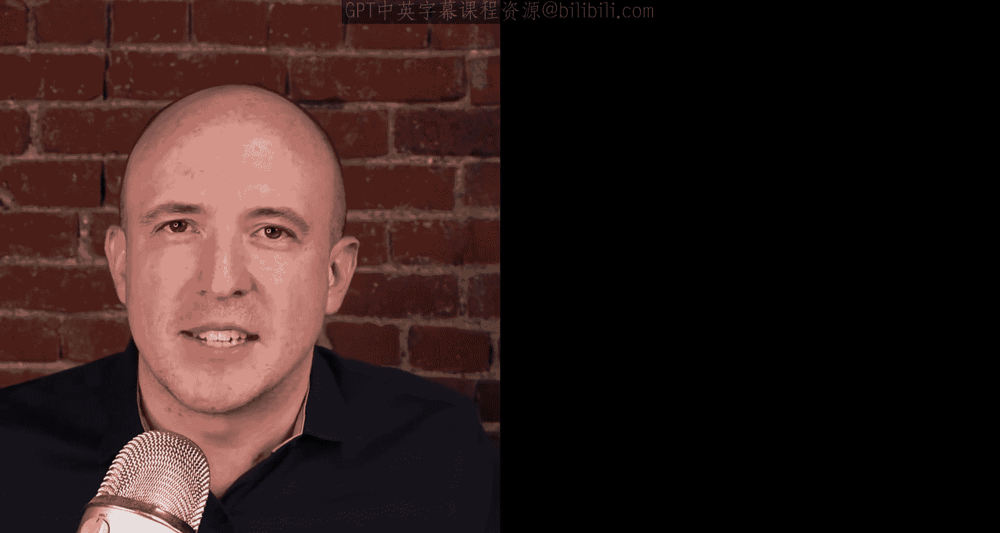

# CMU《计算机图形学｜CMU 15-462  COMPUTER GRAPHICS 2021》中英字幕 p01 -01-Computer Graphics (CMU 15-462_662)_ Welcome Video.zh_en -BV1H3NBemE5E_p1-

Welcome to computer graphics 15462/lash 662 at Carnegie Mellon University I'm Kean Crane。

 I'm a professor of computer science and robotics and I also do research incomp graphics so specifically in the area of geometric algorithms The purpose of this video is to give you all the information that you'll need to succeed this semester so periodically we upload little videos to cover administrative things to talk about what's been going on this week and to answer any significant questions that have come up I should also say that all the information today is available on the course webpage at 15462。

courses。cs。cmu。edduu so please go ahead check out that link read through especially the course info page in detail because there's a lot of things that I won't say here in this video but that are important for you to know as you go through the course I should also say we have a great set of Ts this semester。

So if you have any questions， please at any time， feel free to email them， email me。

 post a question on piazza whatever you like to do， but don't be shy about getting in touch。

 The first thing you should do to get running with a course is to sign up for piazza so go to piazza co CMu find our course for 62 and sign up and second to sign up for an account on the course webage click on the login button in the upper right and you should see a link that says sign up to sign up you will need a special passcode which is available only on piazza so you'd better sign up for piazza first before you sign up for the course webage I should also say if you're not officially enrolled in this course yet don't worry first of all usually there's no trouble getting in we don't really have much of a class size limitation this semester just sign up for the webage get rolling start reading through the assignments and so forth so that if you do decide to add the course。

On track so we will be running the whole course remotely and it basically has three components。

 we have lectures， we have recitations and we have office hours which will all be done online the recitations and the office hours will be done through zoom and you'll be able to find the appropriate zoom links on piazza the lectures will be prerecorded videos that you can watch on YouTube but we will be there during the lecture period to answer questions that might come up while you watch these videos so if you're watching the videos something doesn't make sense just hit pause。

Go to the zoom room， talk to us， ask us questions and then go back to your video。 A couple of tips。

 it can be really hard。 I know when you're sitting at home to pay attention to a long 80 minute lecture video So a couple of things that our students have found are useful。

 One is to simply speed up the video， which you can do using YouTubes。

 if you've never done that before you can give that a try right now。 go to the bottom right。

 you should see a little gear icon and you'll see a little option for playback speed。

 So you can speed up the video as fast as you can as fast as you can take it。

 the other thing that can be very helpful is to just break up watching the video into chunks。

 So if it's 80 minutes long， maybe you break it up into 40 minutes today and 40 minutes tomorrow。

 that can really help to keep focused in terms of work that you'll have to do for this course。

 therere really just three main things。 There are many homeworks。

 So this is just two or three questions that we're gonna ask after each lecture to just make sure that you understand what's going on。

 then there's four major coding assignments。 So over the course of the semester。😊。

You're going to build up a 3D package called Scotty 3D and Scotty 3D is just like any modern 3D package。

 It has modeling， it has rendering， it has animation。

 but the difference is all of the key routines have been stripped out and you're going go ahead and fill them in and hopefully be able to create some really cool content。

 really cool models and animations and finally we will have a midterm and a final。

 but please do not sweat about this。 Each of these is worth only 10% of your grade。

 This is mainly just a checkpoint to make sure that you understand conceptually what's going on in the course。

 not just the coding Also。😊，Please be aware that you have five late days。

 which you can use completely at your discretion。 You don't have to ask us。

 Can I use it for this or that。 just go ahead and use it in terms of collaboration。

 we encourage people to talk to their peers to have interesting conversations on piazza that come to office hours and ask whatever you like。

 But your final work must be your own All assignments in this class will be individual work。

 all the details again， you can find on the webpage about collaboration and cheating and so forth。

 Okay that's it。 So if you have questions， please don't hesitate to reach out and contact us on piazza on email whatever you like。

 Otherwise， if you're excited about getting rolling。

 you can start watching the first lecture right away。

 just go to the course webage you'll see our course schedule and you can just click on the video links to get started。

 So that's it。 Looking forward to seeing you this semester。😊。

