# CMU《计算机图形学｜CMU 15-462  COMPUTER GRAPHICS 2021》中英字幕 p03 -03-Lecture 02_ Linear Algebra (P)Review -BV1H3NBemE5E_p3-

All right， welcome back to computer graphics today we're going to start reviewing some of the basic mathematics that you're going to need for this course today we'll talk about linearar algebra next lecture we'll talk about vector calculus。

So linear algebra really is kind of the bread and butter of math that shows up in all areas of computer graphics why is linear algebra so important in graphics well for one thing it's a very effective bridge between a lot of the subjects that are used to formulate graphics algorithms like geometry and physics and so forth and actual computation so in many areas of graphics once you can express the solution to a problem in terms of linear algebra you're really in good shape you can now just hand off your linear system to a computer to an existing numerical linear algebra package and it does a lot of the work for you and it does that very very efficiently so linear algebra is a very powerful abstraction for formulating different problems in graphics。

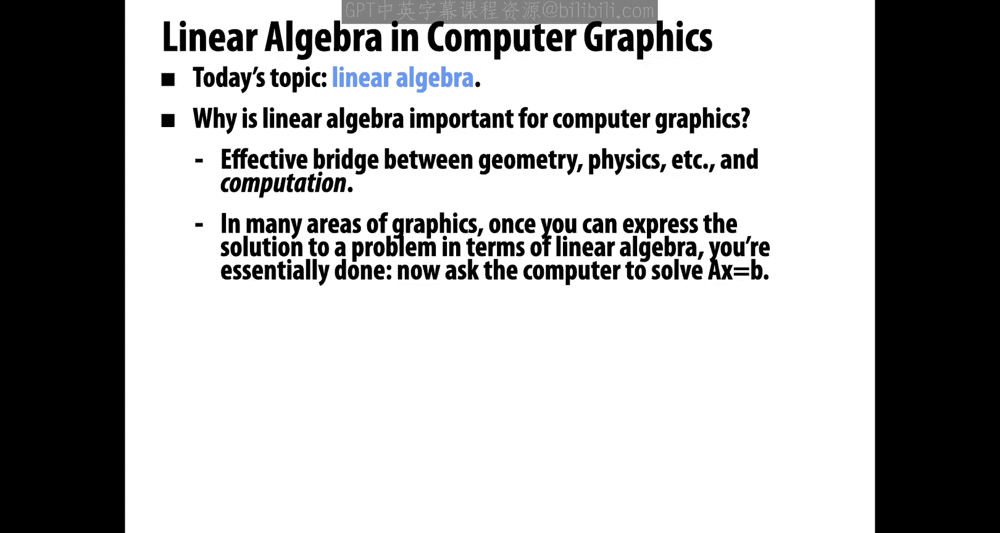

And really fast numerical linear algebra has made modern computer graphics possible if you look at a lot of the developments over the past 10。

 20 years， anything from really high fidelity fluid simulation to various kinds of animation or geometry processing。

 under the hood， you're really running a really high performance linear solvers。

 something that people have spent a lot of work on optimizing and making robust。

So let's go back and remember what is linear algebra all about。 So to be a bit formal about it。

 we could say that linear algebra is the study of vector spaces and linear maps between vector spaces。

 Okay， so again， if we want to give a really formal technical definition， we could say that a。

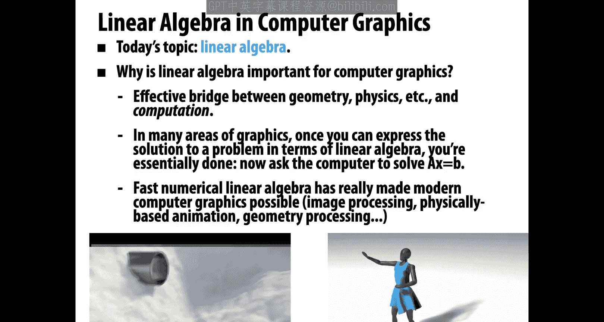

Vectctor space behaves this way for all vectors， UV，W and scalrs A and B。

 we have certain properties like U plus v is equal to v plus u and there exists to zero vector and so on and so on。

This is not really how we want to start though if we just give a list of properties。

 it's really easy to forget that all of the things we want to say about vector spaces come from a very natural place。

It's a very natural thing to study， it's not just an abstract mathematical object。

So when you're studying mathematics and just in general。

 you should just never accept a set of rules handed to you by an authority。

 you shouldn't just let somebody say okay here's the definition。

 here's all the properties let's move on and use it。

 you really want to think about where do these rules come from why is this a useful and meaningful list of rules and this is especially true if you want to do computer graphics because you want to be able to formulate and cook up your own ideas and algorithms and unless you have some deep intuition for why these rules work the way they do。

 why vector spaces behave the way they do and you're gonna to be a little bit lost。

 it's not gonna be' easy to be creative so let's really try to dig in and understand intuitively what do vector spaces mean and in this class I want you to always try doing this whenever you encounter a definition I want you to think about why it's true。

 not just what it says。

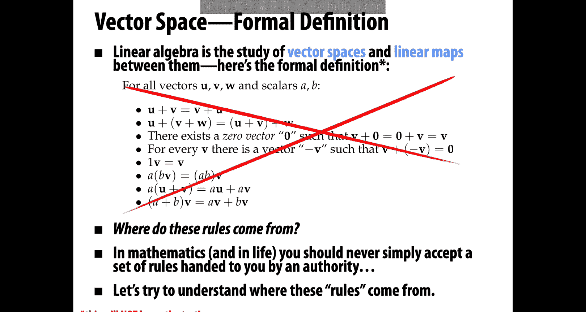

Okay， so first things first， before we get into long lists of properties， let's answer a really。

 really basic question， what is a vector？If you've taken linear algebra。

 you probably have some sense of this or vector calculus， you have some sense of this。

 but if you had to explain to a friend who had never encountered these subjects， what a vector is。

What description might you give them， what little mental picture might you give them about what a vector is？

I think for a lot of people， the image that pops into your head maybe is that a vector is a little arrow。

And this is kind of a cartoon of what a vector is。But it's a really。

 really good cartoon if we start playing around with arrows and looking at their behavior。

We're going to see that the properties we talk about in vector spaces kind of naturally fall out。

And it's important to play this kind of game because in computer graphics。

 we're going to end up working with lots of different types of data that don't maybe look initially like little arrows。

 right we might be playing with polynomials or images or radiance functions or all sorts of things。

But we will notice over time that they behave。In many ways， exactly like little arrows。Okay。

 so having this mental cartoon of a vector as a little arrow is going to be useful for thinking about some pretty sophisticated problems。

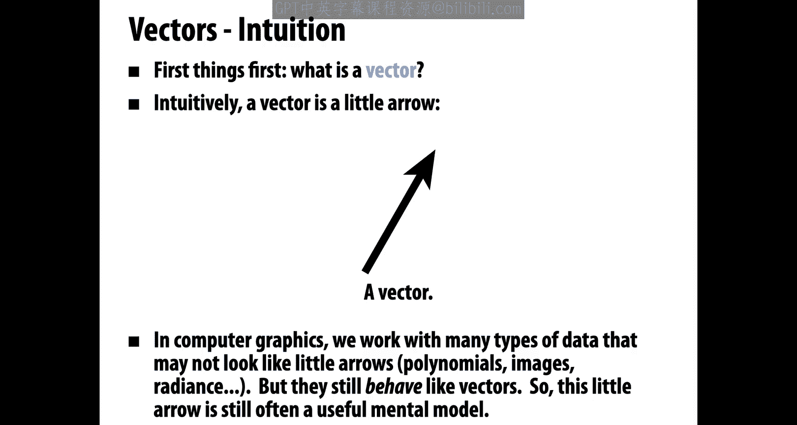

So let's get a little more precise about what a vector is。

One question to ask about any object like a vector is。

What can we measure if I hand you a little arrow。What could you even say about that arrow。

 what information does a vector encode？Okay， and there's actually a couple different good answers to this question。

One very natural one is to say a vector fundamentally encodes a direction。And a magnitude。So。

 for instance。If I have a vector in the plane， I can encode it by a direction given by an angle theta with the horizontal。

 let's say， some reference direction。And a magnitude given by a length or radius R。Okay。

 so that would be what we call polar coordinates in 2D。Now， one really。

 really important thing to say， this is a point of confusion sometimes when talking about vectors is you might think。

 oh， but there's also an additional piece of information。

 which is what point is the vector sticking out of？

And in this class and actually in all of linear algebra。

 this is not really a piece of information we associate with a vector。

 this is kind of like a sort of base point for the vector。

This idea of vectors with particular base points shows up in a topic called differential geometry。

 if you want to make it really formal， but when we're talking about linear algebra。

 vectors don't have different base points， they're all sort of based at the origin。Of the same space。

Okay。An important side note， important question to ask。These two values that we have here。

 theta and R。Do those mean the same thing in any coordinate system？So for instance。

 if we picked a different reference direction here we're using the horizontal as a reference direction。

And this theta might be something like 60 degrees。If instead I use the vertical as the reference direction。

And then I。Tell you about a vector by giving you the same data， let's say， 60 degrees and length1。

That no longer encodes the same vector， right？So you have to be really careful when talking about measurements to realize that some measurements are only meaningful relative to some particular coordinate system。

Other quantities may not depend on coordinates， for instance。

 the length of our vector doesn't really depend on the choice of coordinate system。

Maybe depends on a choice of units。But it doesn't depend on which reference direction we pick in the plane。

So when you start working with coordinate representations of objects like vectors。

 especially when you're writing code， you have to be very。

 very careful to keep your coordinate system straight。

 don't try to use numbers from one coordinate system in another coordinate system。Okay。

Speaking of coordinates， how else might we encode a vector rather than giving theta and R？

Let's say that we're in the two dimensional plane still。What's another common way to encode a vector？

Well， almost surely you've been exposed to this idea of encoding vectors in Cartesian coordinates。

 so we can also measure the components of a vector with respect to some coordinate system。

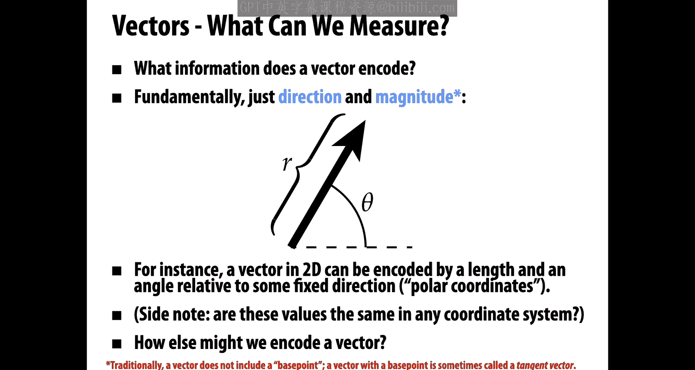

And the reason these are called Cartesian coordinates is that they were kind of cooked up or started to be used by somebody named Renee Dickcart。

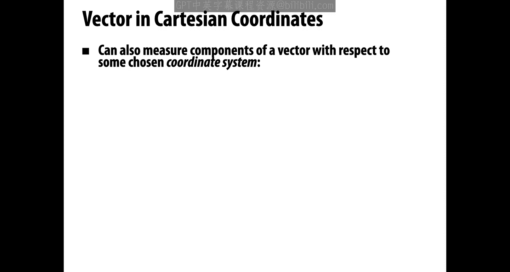

And the story， I think this is a true story， is that Descartes was laying on his back on his bed。

 looking up at the ceiling， looking up at the corner of his room。

 and he was looking at a little fly buzzing around the room and was thinking， well。

 if I wanted to communicate to somebody else， where this fly is at any given moment in time。

What information would I communicate， what would I send them？And an answer is， oh， well。

 I could say how far the fly is along one of the two walls and also how far the fly is along the other of the two walls along the two edges of the room。

That information is completely sufficient to determine where the fly is， while okay。

 maybe I also need a third coordinate saying how far from the floor the fly is。Right。Okay。

 so that's interesting again， we have two coordinates before we have theta and R。

 now we have x and y。Once again， we have to be really careful and I'll stress this point over and over again because it's a source of a lot of bugs in computer graphics code。

That we can't directly compare coordinates that are expressed in different coordinate systems。

We have to be very careful to keep track of our current coordinate system。

 also we should definitely definitely not compare， let's say。

 polar coordinates to Cartesian coordinates。If I want to check if two points are the same。

 I definitely should not just check if r theta is equal to Xy。We have to do some kind of conversion。

Okay。

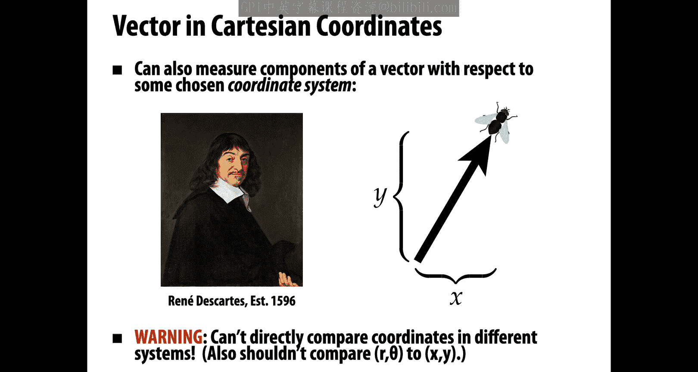

All right， so that's how to describe a vector， what can we actually do with vectors？Well。

There are kind of two basic operations。One thing we can do is we can add them end to end。

 so if I have two vectors U and V。Then I can lay out the first vector U and then the vector V。

And I get some new vector， which I'll just give a name to， I'll call that U plus V。

That's really what plus means， it means go along U and then go along V。And。

Then I can ask an interesting question， what happens do you think？

If we first go along V and then go along U。Well， hopefully it's pretty clear from this picture that if we do that。

 we'll end up in exactly the same place。So if we call that。Vectctor that direction， v plus U。

Then it doesn't seem to matter in which order we add U plus v is the same as v plus U。

Now we can get really fancy about that and say， oh， well， whenever we have an operation like this。

 where exchanging the order of the operaans doesn't make a difference。

We could call that commutative or abelian after this blue fellow， Niils Henririck Abel。Okay。

But the really， really important point to。Remember is that this property， oh。

 vector addition is commutative， you can swap the order of addition。

 it doesn't just fall out of the sky， it doesn't come from nowhere。It comes from thinking in a very。

 very downed earth way about how little arrows behave when we lay them out in the plane。

It's not just a rule that's given to us by an authority that we have to accept。

 but it's something we can discover for ourselves。

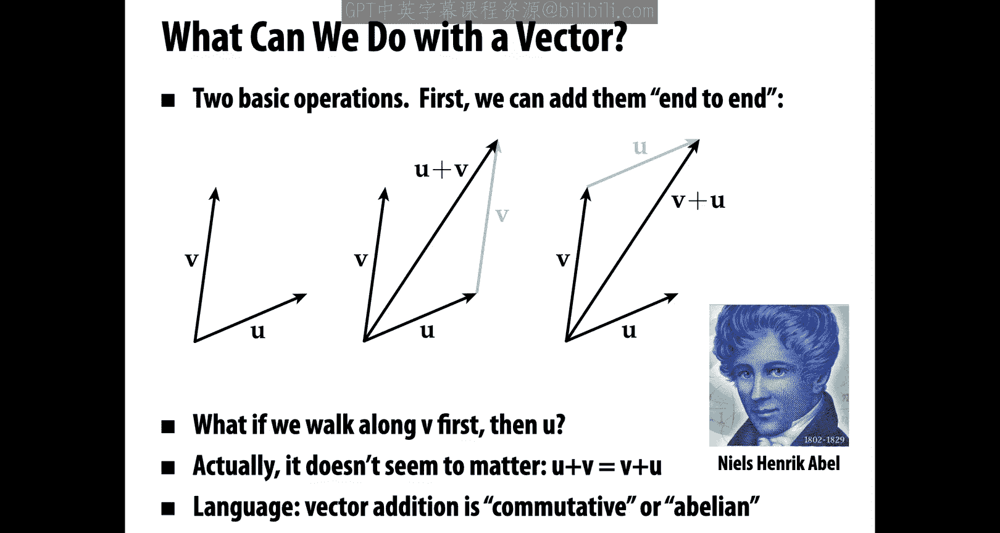

Rightright。What else can we do with a vector？So I said there are two basic operations。

 the other basic one would be scaling。So if I have a vector， U。Then for instance。

 I can scale it or multiply it by a constant two， how do I do that well I just lay out two copies。Of。

The vector U now at this point you might say， hm， do we really need scaling because we already have addition and if I wanted to get to you。

 well I could just lay out two copies of U right， walk along you and then walk along U again。

But it doesn't quite work out if I want to multiply by something other than a integer， right。

 if I want to do 2。5 times u， okay， I have to think about it this way。

So I really think about going in the direction of you。2。5 times its length。In general。

 we can multiply any vector u by a number or scalar A to get a new vector A U。

And multiplication generally behaves the way we'd expect based on the geometric behavior of scaling little arrows up and down。

So for instance。You could pause and try drawing a picture of this relationship。Right， if I say， oh。

 I think that。A times B U is the same as A B times U Y。Why is that true？Well what does B U mean。

 it means I take the vector U and I scale it up by a factor B。

 then if I take that new vector and I scale it up by a factor A。

Can you convince yourself by drawing a little picture that that's the same as just taking the original vector U？

And scaling it up by a factor， a times B。

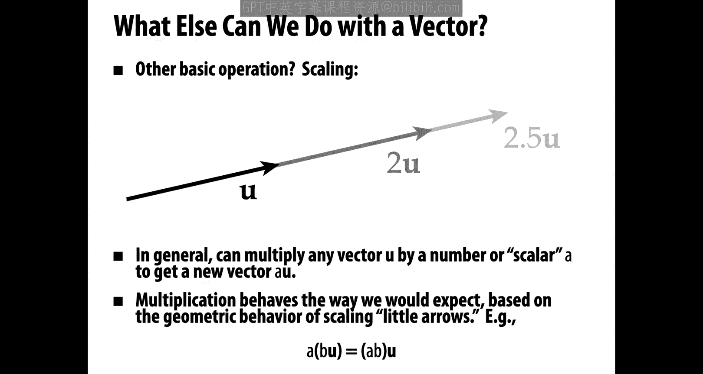

Hopefully， you can。Okay， and then once we have these two operations。

 we can start using them together， so for instance。

What if we try to add two scaled vectors or scale two vectors that have been added together？So again。

 let's say we have two vectors U and V。There sum looks like this U plus V。

 I go along U and then v or v and then U same thing。Okay。

 and then I can scale that resulting vector by some constant A to get this blue vector。

Another thing I could do is I could take U and I could scale it by a and I could take V and scale it by a。

 and then I could add those two blue vectors up and I get another vector。And okay。

 if you believe the picture， these two vectors are the same length。

Can you convince yourself of that maybe by overlaying these two pictures？So it's interesting。

 it seems we really do get the same result either way。

 we get that a times u plus v is equal to A U plus A V。Now， again。

 if somebody had just given you this rule， if somebody had said， oh， in a vector space。

 by definition。Scaling a sum is the same as summing the scaled vectors。You might say fine。

 I accept that and I'll use that rule， but here you see that this rule comes from a very。

 very natural geometric picture。Okay。So as we keep playing this game。

 as we keep playing around with vectors， eventually we come up with sort of a complete list of rules。

That vectors obey， that completely characterize the way vectors behave。And so we get back again。

 this list that we saw at the beginning for all vectors， UVW and Scalarrs AB。We have。For one thing。

 commutivity of addition U plus v equals z plus U。We also have associivity。

 which we didn't draw a picture for U plus v plus w is equal to U plus V。Plus W。And so on。

And again these rules didn't fall out of the sky， each one comes from some geometric picture that we can draw on and if you don't see it immediately。

 if you don't understand where one of these rules comes from。

 you should stop and you should try to draw a picture for each one。

It's a good exercise to do at least。Once in your life， okay。

 and then we can say any collection of objects satisfying all these properties is then a vector space。

Even if they don't look like little arrows。So the point。

 the purpose of formulating this very formal list of properties is that。

We're going to encounter in our exploration of computer graphics。

 other objects that obey this same set of rules。But is not the same as just a little arrow。

 and we'll see a few of those later on in this lecture。Okay。

 so the point is to be able to identify when some kind of object has the same structure or behavior as a vector space。

 even if it's not a literal arrow。The bigger point， by the way。

 of going through this exercise of understanding these seemingly trivial properties by drawing out pictures is that as we go on in computer graphics and as you go on in mathematics。

 you're going to encounter more complicated objects that have more complicated sets of rules。

And you're going to do yourself a big， big favor。If you stop every once in a while to think。

 why are those rules true， how can I motivate them and how can I draw pictures that explain where those rules must come from。

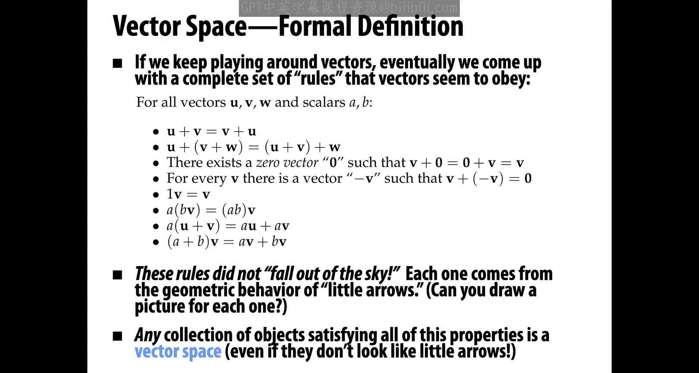

Okay。Okay， so to give the most common example of a vector space。

 kind of the one that we've been talking about with our little arrows。

We can talk about a Euclidean and dimensional space。

 it's a pretty fancy way of saying we have a list of n real numbers for some choice of n。

 So if we have just one number， we might write that as R1 or we could even drop the one just the real line。

If we have two real numbers， a point in the plane， those are elements of R2。R cross R sort of。

Likewise， if we want to talk about vectors in three dimensional space， we could have a point in R3。

 meaning just three numbers like 1。23， 4。56 and pi over 2。Okay。

Why is Euclidean space such a common example of a vector space， well。

 because it looks more or less like the space that we live in？

We live in a three dimensional space where just like Descartes did。

 we can explain where points are in space by three numbers。It's also motivated by computation。

 we can very， very easily encode on a computer。A list of floating point numbers that specify a vector。

And that's really what we'll do throughout graphics very。

 very often when I specify a vector in space， we write out three numbers。

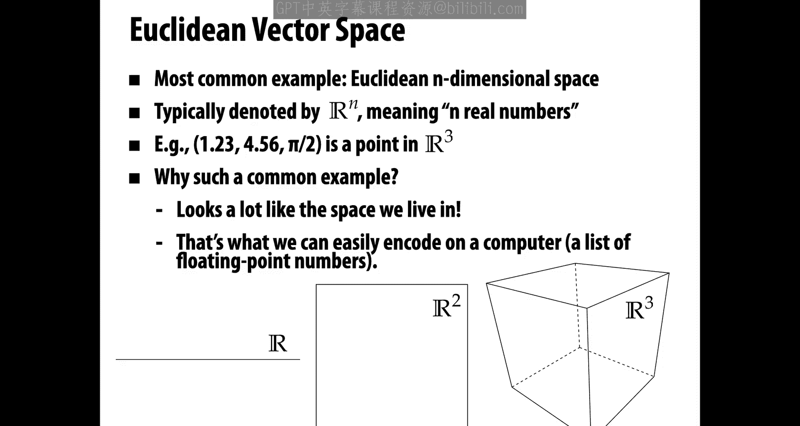

Okay。Very， very important perspective， kind of the reason for talking about all this is that we often go far beyond the idea of just vectors in R3。

 when we do graphics， there are lots of interesting examples of vector spaces that are spaces of functions rather than little arrows。

These functions could describe all sorts of things， a function could be the intensity of an image。

 the function could be something describing the shape of a piece of geometry。

Or the amplitude of vibration on a surface that makes sound。All sorts of things。

 so all of these are vectors， we're going to be able to do the same kinds of operations。

 addition and scaling and so forth that we can do with little arrows。

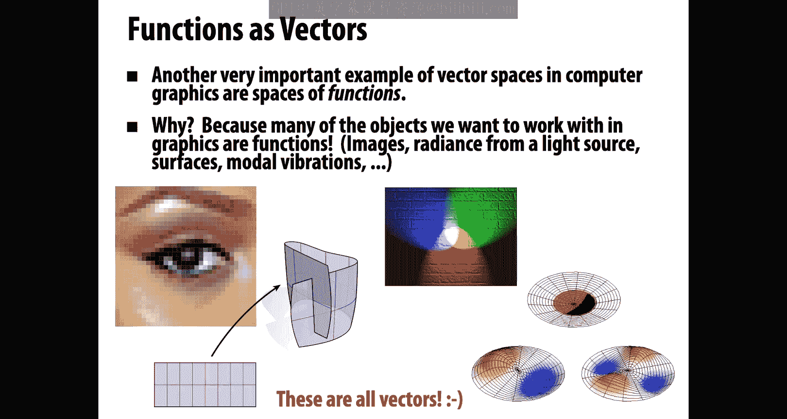

Let's take a。Closer look at this。 So how can we think about functions as vectors？

Do functions really exhibit the same behavior as little arrows？Well。I claim they do。

 at least if we're careful about what we mean by functions。

So we can certainly add two functions of the same kind， let's say we have functions on the real line。

 I have a function F of a variable x， and I have a function G of the same variable x。

So how might you define the addition of these two functions， what would it mean if I said。

 please give me the function F+ G？Okay，Ho not too hard。

 F plus G at any point x is the value I get by just。Evaluating FedX， evaluating GX。

 and taking their sum。So in a way， because at each point， these functions give me a real value。

And oh， the real numbers， that's a vector space。I can just use addition ofReels to define addition of these functions。

Okay。Similarly， we can also scale a function。So let's say I have this function， F of x。

What does it mean to scale F by a constant A？How would you define the function AF？Okay， again。

 hopefully not too hard， I would say AF of x。Is well I evaluate F at x and then I scale the resulting number by a。

So again， I'm using the fact that real numbers are a vector space to turn functions into a vector space。

Okay。What about all the rest of these properties？We said in order for something to be a vector space。

It has to satisfy this long list of properties。Do you believe that these properties all hold for functions on the real line？

For instance。Is there a vector or a function？The zero function。

Such that adding that function to any other function doesn't change it。Well， sure。

 I just take the function that's equal to zero everywhere。Okay。And if you don't buy it。

 if you don't believe that functions are vectors and don't satisfy these properties， well。

 you should try it out at home and verify that each of these properties really does hold。

We already explained it for the zero vector， but what about all the rest？

OkaySo short answer is that yes， functions are absolutely vectors。

 even if they don't look visually like little arrows。Okay。All right。

 so so far we've only drawn our vector operations using pictures。

How would we actually compute with vectors， whether we're doing this with pen and paper or doing this through code？

Well， this is really where our coordinate representation helps to make things very， very concrete。

Okay。So let's say I have a vector U。Which I can give Cartesian coordinates41。

And I have another vector V， which I can give Cartesian coordinates 13。How do I find the vector U+ V？

Well， I just expand it in coordinates， so I replace U with this list 13 and V with the list 41。

And I add4 to1 and 3 to1 to get1 plus 4，3 plus 1 is 5，4。If I then go ahead and plot these numbers。

On the Cartesian coordinate axes。I get this vector。U plus v equals 54。

And then I can verify that the numerical computation。

Actually lines up with my geometric construction from before。

If I go ahead and copy V over to the end of U or U over to the end of V。😡，Lo and behold。

 I really do get the vector U plus v。Okay， so the algebra agrees with the geometry。

 that's a very good thing。

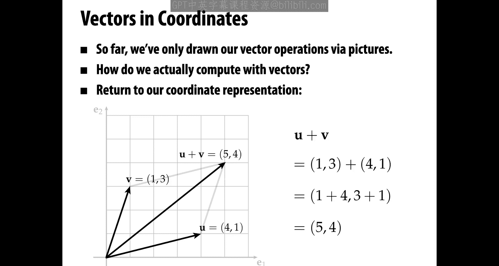

Okay。So。We came up with some rules for adding pairs of numbers。But we have to be careful here。

Because。We haven't yet shown。That this addition operation， the adding component wise。

 these coordinates。Really corresponds to our original definition of。Fector operations， right。

 How do we check。That these coordinate wise operations faithfully encode the geometric behavior of little arrows apart from drawing pictures。

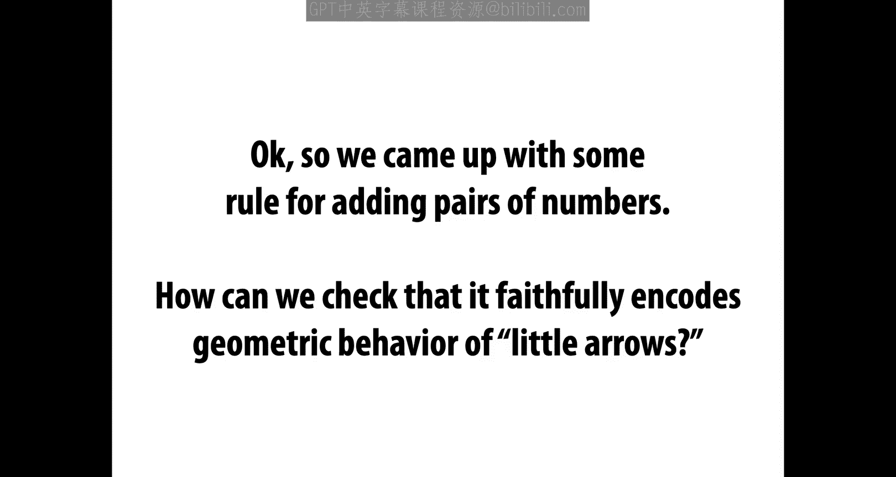

So we just go ahead and we can check that it agrees with this list of rules。

Give this long list of rules for each one we can go through the exercise of showing that in general。

The component wise edition agrees with the rule， so for addition I could say okay， in general。

 if I have two vectors u equals u1 u2 and v equals v1 v2， we have U plus v equals u1 u2 plus v1 v2。

 which equals u1 plus v1， u2 v2。Which equals v1 plus u1， v2 plus u2， which equals v1 v2 plus u1 u2。

 which equals v plus U， pretty tedious exercise。And probably you can come up with。

A simple argument for why all of these should hold。Okay， but the point here is it is important。

 especially as examples get more and more complicated。To take a step back from time to time and say。

 okay， even though this seems intuitively obvious that this is a correct notion of vector addition that this is a vector space。

I should probably check at least once in my life if I encounter some funky collection of functions and some funky notion of addition。

 is this really describing a vector space， how do I know， well。

 I go back and see if my definition of addition really lines up with the definition of a vector space。

 likewise for scaling。Okay。So。

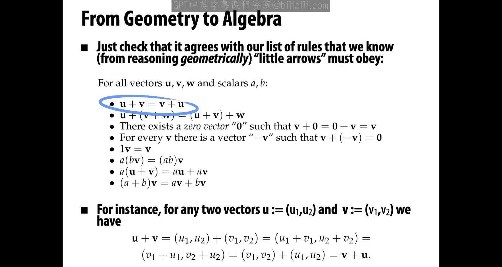

It is really useful to have these formal rules because they allow us to turn intuitive geometric observations into algebraic rules that can be used for symbolic manipulation and automatic numerical computation。

 That's why we like abstraction。But you should never blindly accept a rule given to you by an authority。

You should never just say， okay， the teacher said this is the definition。

 so I'm just going to keep using it。You should always be asking yourself，Wai a minute。

 where does this rule come from？What does it mean geometrically。

 can I draw picture do I really deeply understand what's going on here？

Because the more you have that deep understanding， the more ability it gives you to be creative。

 to come up with your own ideas， your own algorithms， and so forth。

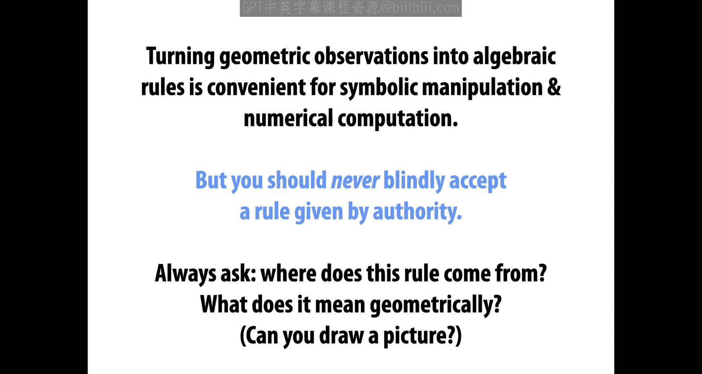

Okay。Okay， we'd also like to be able to scale vectors in coordinates， so how do we do that？

Hopefully this one is pretty straightforward。So let's say again I have a vector u equal to 42。

 those are the Cartesian coordinates and I want to compute3 halves U。Well。

 I'll just substitute my coordinate pair for you。And now I'm multiplying the coordinate pair by three/ halves。

 that just means I multiply each component by three/ hves。

 so I have four times three halves and two times three halves。

Which works out to 12 halves and  six/ halves， or in other words， six and three， not too hard。

From here you could go on and check the rest of the properties。

That addition and scalar multiplication together do satisfy the definitions of a vector space。Okay。

All right。As we start to combine vector operations。

 we build up the basic operations that we might need for computer graphics。

 really simple one that comes up all the time as I have two points in space， A and B。

 and I want to know where the midpoint is I'm doing some kind of interpolation or subdivision or all sorts of things we'll see later on。

So for instance， how would I compute the midpoint of a point A at 34 and a point B at 72？

How would you carry out this calculation？Okay， well。

 the first thing I could do is write out the midpoint in terms of just the points A and B。

 so I want a plus B over 2。Then， I。Exchange the symbols A and B for the coordinate pairs 3，4， and 7。

2。Okay， and then I remember that one of my rules is that scalar multiplication distributes over addition。

So I can independently multiply three， four by a half and 7，2 by a half。And then I could add them up。

Or alternatively。I could first do the addition and then do the multiplication。So I could add 3。

4 to 72 to get 106。And then divide 106 by 2 to get53， lots of ways to do it。All right， so early on。

 we asked what information does a vector encode？And our answer was。

 what are the two basic pieces of information？That are vectoring codes。

We said that it's orientation and magnitude， what direction is it pointing and how big is it？

How do we actually measure these quantities？If I have a vector， how do I figure out Theta and R？

So in particular。Let's say we have a vector in Cartesian coordinates， and we want to measure its。

Length or its magnitude or its norm， all of these words， by the way， are synonyms。

If I say I want the norm of a vector that's the same as I want the length is the same as I want the magnitude。

Maybe you have to be a little careful with the word norm because we'll see later on there are lots of different possible norms。

 but length and magnitude basically the same thing。intuitively。

 the norm or the length of a vector should capture how big it is。

So without giving a precise definition， I could still ask you。Which of these two vectors is bigger？

And hopefully you could tell me without too much trouble that the one on the left has a smaller norm。

 the one on the right has a larger norm。Okay， slightly more interesting since we want to talk about functions as vectors if I gave you these two functions。

Which one would you say has the larger norm？Now， again。

 I haven't given a precise meaning to the word norm for a function， but I think。

You could still intuitively tell me which one you think is kind of bigger， right？So。In this case。

 as we'll see in a moment， the one on the top has a larger norm。

 the one on the bottom has a smaller norm with respect to a certain notion of norm。

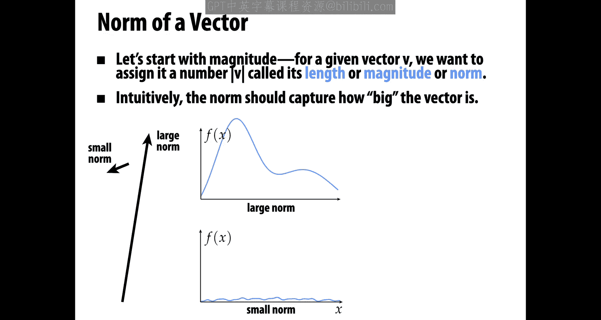

Okay， let's get even more interesting， let's say I have these two vectors， these two images。

 which I claim can be treated as vectors in a natural way。

Which of these two vectors would you say has bigger norm？

We have a picture of a dark cave and we have a picture of the blazing hot sun。Which one is bigger。

Okay， so again， you might say I think that brighter is bigger。

 the sun somehow has a lot more stuff coming out of it， light coming out of it than the cave。

 so I'm going to guess that the sum has a large norm， the cave has a small norm。

We can make this formal。 We'll talk about how to make this precise in a second。

 but the point that I really want to make is that the ideas that you have about little arrows about them being big or small and so forth can be naturally translated to other settings to thinking about functions or thinking about images or thinking about sounds。

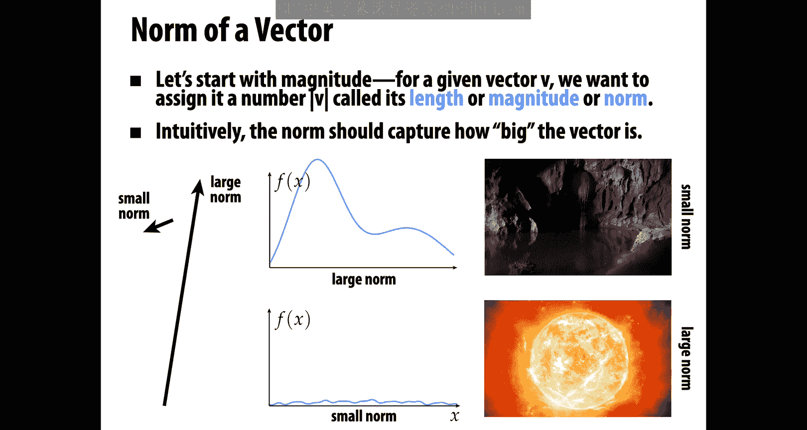

Okay。So when we talk about length。We talk about a norm， there's some very。

 very natural properties we might expect。A norm to have。What properties might you expect？Well。

 for one thing， if we're going back to talking about little arrows and I ask you。

 how long is this little arrow， what's its length？Probably shouldn't be negative。It'd be really。

 really weird if I said， hey， could you please tell me？What is the distance？Between。

Carnegie Mellon and the Andy Warhol Museum。 And I said， oh， it's negative five miles。

You would look at me like， I'm crazy。This doesn't make any sense to talk about length as a negative quantity。

Okay， so one thing we can say about any norm is it really should be a positive or at least a non negative quantity。

When we said non negative rather than positive， when is it that length might be equal to zero？

There's a very， very special case where the length of a vector should be equal to zero。

And that's really if and only if that vector is the zero vector。For instance。

 in Cartesian coordinates， if the vector has components that are all zero。

 the vector starts and ends at the same point。W。Okay， this sounds like a rule。

 but why is it really natural？Again， if I said to you hey。

What's the distance from Carnegie Mellon to Carnegie Mellon。And you told me， oh， it's two miles。

I would look at you like you were absolutely nuts， that doesn't make any sense。

 it doesn't take me any time or distance to get from a place to that place。Okay。

So this is why we say that length， this is why we say that a norm。

Should be0 only for the zero vector。

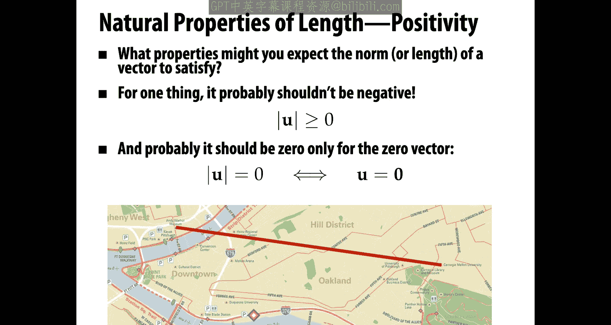

Okay。What about other properties。One thing that we can also see pretty easily is if we take a vector and we scale it by a factor C。

 if we scale， for instance， all the components by a factor C。

Its norm really should change by the same amount， the norm of C should be the absolute value of C times the norm of U。

Why the absolute value of C， well again， what if C was a negative number。

 we really don't want to end up with negative length。That doesn't make any sense。Okay。And finally。

 one thing we know very intuitively is that the shortest path between two points is always along a straight line。

So for instance， if we have a vector U and a vector v。We can add them together to get a vector U+ V。

And just from this little picture， we can conclude that， hey， you know， it really looks like。

The norm of U plus the norm of V。Must be greater than or equal to the norm of U+ v。

There's no faster way。To get between the endpoints。Than to travel along this straight line。Okay。

 and because this。Diagram looks like a Pentagon， we sometimes call this the Pentagon inequality。

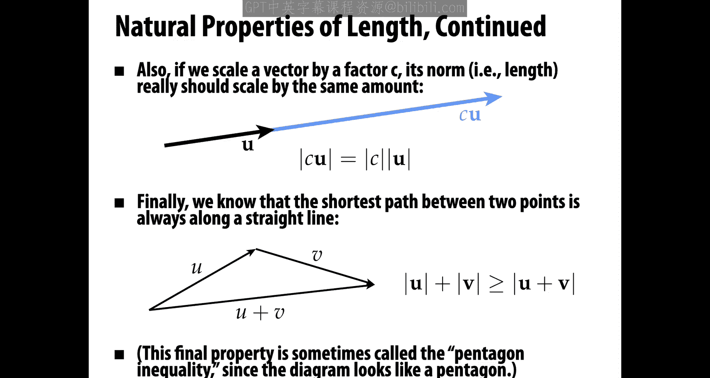

All right。Okay， so based on all those intuitive。Properties we can then come up with the abstract or formal definition of a norm。

 we can say a norm is any function that assigns a number to each vector in a vector space。

And satisfies the following properties for all vectors UV in all Scals A。

We're going to ask that a norm be non negative， that it be equal to zero if and only if we're considering the zero vector。

That the norm of a scaled vector is the same as the norm of the vector times the absolute value of the scale factor。

 and that the norm of u plus the norm of v is greater than or equal to the norm of U plus v。Again。

 I could have started out this lecture by just giving you this list of properties and commanding that that is the definition of a norm。

But that would be a little unsatisfying。 You wouldn't know immediately why these had to be the properties。

 Now， hopefully you're on board。You believe that， yeah， it makes sense to have these properties。

So in general， please don't take my word for it when you listen to a lecture。

 when you read a textbook。Try to write down for each rule。Why it's true， try to draw a picture。

 try to explain why it's true。

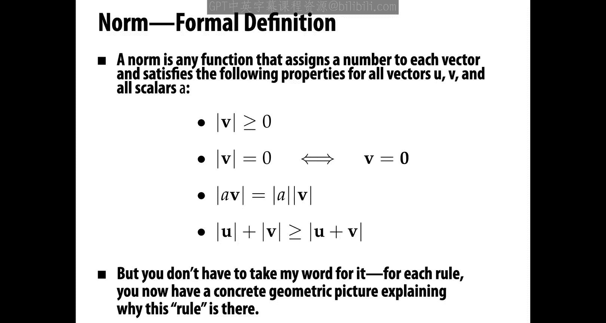

Okay， a concrete example of a norm that we're hopefully familiar with is the norm in Cartesian coordinates。

 so the most standard norm is called the Euclidean norm。For an N vectoror。And it looks like this。

 if I have a vector U that has components U1 through UN。

 then the Euclidean norm is the square root of the sum over components of the square of that component。

So as a concrete example， if I have the vector u equals 42。

 its norm is the square root of 4 squared plus2 squared， which we can simplify to2 root 5 Okay。

 great， that's the length。Now。I have said this as a norm only by using the word norm at the top of the slide。

I didn't actually show you that this little formula， the square root of blah， blah， blah。

 actually satisfies those axioms we had for a norm。So does it satisfy those properties， well。

 why don't you go ahead， try it at home and give an answer in the slide comments。

 show me why this is a norm。Much more interesting， maybe an example you haven't encountered before。

 is talking about the norm of functions。Okay， so one of the most basic norms for a function is the so called L2 norm。

Which again is going to give us some sense of the magnitude of a function。

So just to keep things simple， let's consider real valued functions over the unit interval 01。Okay。

 so by that， I mean we have a function and we only know its values between。Z and one。

 it doesn't exist outside of this interval。We're also going to ask of these functions。

That the square of the function can be integrated over this interval。 It doesn't go off to infinity。

 You might remember from your calculus class that some functions aren't integralable。

 and we want to ignore those here。Okay， so if we restrict our attention to these square integraltegrable functions on the unit interval。

 then the unit sorry， the L2 norm is defined as the norm of f is equal to the square root。

Of the integral from 0 to 1 of F of x squared dx。So the first thing to notice here。Is。

This really doesn't look much different from our definition of the Euclidean norm for vectors in RM。

We have a square root。We're squaring the value at each point。And we're integrating over the interval。

Integration and sums are very， very similar concepts。

 in fact you may remember that an integral is sometimes defined as taking Rimon sums。

 the limit of breaking your function up into little columns， adding things up。

 taking the limit as those columns shrink to zero width and so forth。In fact。

 the integral symbol is actually supposed to be a long slender S。Meaning sum。

 that's where this integral symbol comes from。Okay。So conceptually。

 the L2 norm is not so different from the Euclidean norm。

And now hopefully we can understand why it is， we said earlier on that the function on the left has a large L2 norm。

 whereas the function on the right has a small L2 norm。If I square these small values。

 they get even smaller， perhaps if they're less than one。I integrate up。

 I don't get much on the left I get some big value。Okay， so again。

I haven't yet actually shown that this formula， square root of the integral of F squared is a norm。

 I didn't show that it satisfies all the properties that a norm is supposed to satisfy。 and in fact。

 you have to be a little careful here。For this one， you really should go back and check one by one。

Does this definition， this L2 norm really satisfy all the properties。

 every single property that we had for a norm？I'm going to claim that this one is actually a little tricky and I'd really like somebody in the slides in the comments to say what's going on。

 is this really a norm or is there something slightly fishy here？

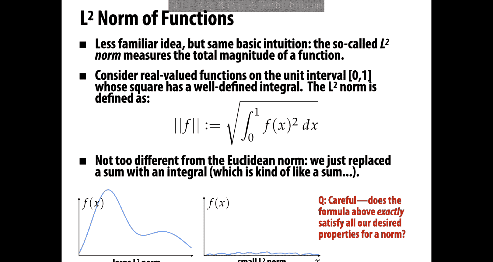

Okay， but I won't reveal what that is right now。To give a concrete example。

Let's consider the function f of x， which equals x root 3。

 again defined over the interval from 0 to1。What is the L2 norm of this function？

How would I go and carry out this calculation？Well。

 the first thing to do always is to replace the words with the definition。Okay。

 so I take the function F to get its norm， I integrate its square over the interval。

 I take a square root。😊，So let's try working this out I'm going to substitute。

The particular function into this formula。So the square of the norm is equal to the integral from 0 to 1 of 3 x squared dx。

This integral hopefully is not too hard to do， you may remember that at integrating 3 x squared。

Gives me x cubed if I want to evaluate this from 0 to1， I get 1 cubed minus 0 cubed。

 which is equal to 1。Okay， and so since the square of the norm is equal to 1。

 the norm is also equal to one。By the way， just as a note on notation for clarity。

 we're going to use double bars。For the norm of a function and single bars。

 for the norm of a vector in Rn， the reason for that is， especially in graphics。

 you often have functions that are defined in terms of vectors in Rn。

 so you could have a function that involves the norm of a vector in Rn and then be trying to take the norm of that function and just to keep things somewhat sane you want to distinguish between taking the norm of a function and taking the norm of an ordinary vector。

Okay。So there you go， we have some sense of the norm of a function。 would you have guessed。

 by the way， that this function。X root 3 is a unit norm function that that's a unit length vector。

Maybe not， but it is。Okay， also really important thing to say and we'll talk about this a lot in this class is that most integrals in graphics are not calculated this way。

 most of the time if you need to integrate a function in a graphics algorithm，😊，嗯。

It's going to be way more complicated than 3 x squared。

It's not something that you're going to be able to carry out。 you spend all this time。

 I'm sorry to say learning how to do integrals by hand in your calculus classes and the reality is you're going to throw a lot of that away and let the computer do some kind of numerical integration for you。

 not because you're lazy but in fact because most functions you encounter in real life have no closed form integral。

 it's impossible to write down an integral Hopefully your calculus teacher told you that if not。

 you're going to see it in a big way in this class。Okay。So。

What else do we commonly do with vectors rather than just measuring their length， again， we said。

 we want to talk about orientation or direction。Okay。

And just as the norm was the thing that measured length or magnitude。

The inner product is going to be the basic operation we're going to use to get our hands on direction or maybe relative direction。

How much does one vector line up with another vector in terms of。Orientation。So for instance。

 if I gave you these two vectors， U and V。You could look at them and say yeah。

 the direction they point is fairly similar， that's pretty clear and if I have these two vectors instead。

 you'd say yeah， those look like quite different directions and you might remember that you know inner products give you some sense of this。

 inner products have something to do with angle right。

 something to do with the angle between the two vectors。What about what about other kinds of vectors。

 not little arrows， but let's say images， so you might have these two images。

 two different frames from the same movie， you might say， yeah。

 you know I don't know those images look fairly similar。

 could we also say that they have a large inner product maybe？What about these two images。

 these images are quite different？Will they end up having a large inner product or a small inner product。

 well， we have to talk a little more precisely about what inner products mean for this vector space。

Okay。But before we get into this more sophisticated example。

 let's stick with little arrows and talk about， you how should an inner product behave？

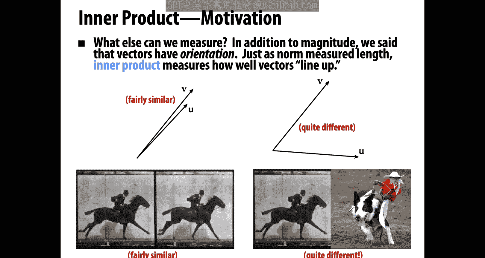

So one basic property of an inner product is that it's symmetric。 why what's the reason behind that？

Okay well， let's first talk about a little notation so we can write our inner product。Also。

 by the way， sometimes called it the scalar product or dot product。

 these are all more or less the same thing， you can split hairs about this。

 but usually when somebody tells you about a dot product or scalar product or an inner product。

 they mean roughly the same thing。Okay， so in this class we're going to use the notation of angle brackets。

 angle bracket UV is an inner product between U and V。

 some people like to write this as U dot V or other ways。

So when we measure the alignment of two vectors U and V。

 what are some natural properties that you might expect？Well。

 one seemingly obvious property is that order shouldn't matter。Right， that。

U In product V should be the same as V In product U。Why is that true？Well。

 if we think of the inner product as giving us some sense of the alignment of these two vectors。

 how well aligned are they？Then U is just as well aligned with V as V is with U。

Or maybe an even more profound way of convincing yourself this must be true is if we had these two vectors U and V and we just renamed them if we called UV and VU。

 well， that shouldn't have any effect on how well aligned they are。

So wouldn't it be bizarre if U In product V was not equal to V inner product U Now， all of a sudden。

 the the magnitude of the inner product would depend on。How we name our vectors。

 that doesn't make any sense okay， so inner productss really。

 really must be symmetric to be reasonable at all。

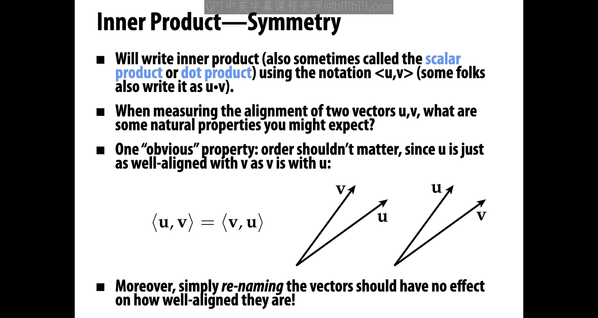

What's another way we can think about inner products， Well， we can think about them in terms of。

Projections， Okay， so if we have， let's say unit vectors， let's keep it simple。

 We have two unit vectors， U and V。Then a geometric interpretation of the inner product is that it measures the extent of one vector along another。

The innerproduct of U and V is the length of the projection of V onto the vector U。Okay。

Can you convince yourself that's true？Another question to ask about this is， does it make sense。

 you know， do I believe this interpretation when we just said that the inner product has to be symmetric？

So if indeed the inner product is a symmetric， it should be true。

That the projection of U onto v is the same as the projection of V onto U， do you buy that？Well。

 hopefully you do， there's not really anything geometrically going on in this picture。

Other than the angle between these two vectors， it doesn't matter which one we call U and which one we call V。

 and so the projection of one out the other should be the same。

Another important thing to notice is that if we scale either of the vectors。

 the inner product also scales。Right， if we think about。

U Inter product V being the size of the shadow cast by the unit vector V on the unit vector U。Well。

 then doubling the length of V really should cast a shadow of twice the length。

And so then algebraically， we might say the inner product of 2 U with V is 2 times the inner product。

Of U And V。Likewise， if we scale V。

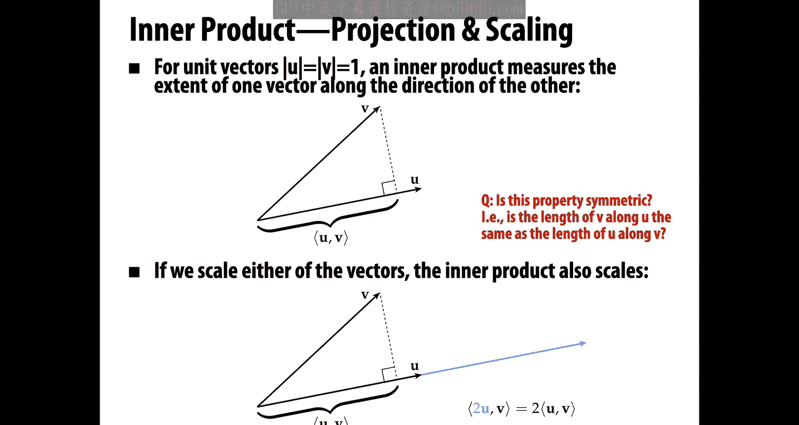

Okay。Also。A vector should always be aligned with itself。 right。

 If I take an inner product of you with itself。You expect this to be a。Positive non zero number。Okay。

 so we say that the inner product of u with U is greater than or equal to zero。

 the length of the shadow that u casts on itself in some sense。Is not 0。 It's， well， what is it。

 actually， How big is the inner product of U with itself。For unit vector。

 it's really just the length of that vector 1。Okay。

 the length of the shadow of a unit vector on a unit vector on the same unit vector is 1。

 so in general， what must U in our product with U be equal to？What do you think？Okay， well。

 we could think about it this way， let's say we have a vector U that doesn't have unitor。

And we define U hat as the corresponding unit vector， so U hat is U divided by the norm of U。

In that case， what we'll see is that。The inner product of U with itself。

Is the inner product of the norm of u times u hat with the norm of u times u hat？

Which is equal to well we can pull those constant factors out， as we did on the previous slide。

 so we get the norm of u squared times the inner product of a unit vector with itself。

Unit vector enter product with itself is equal to one。 so we end up with just。

The norm of the vector squared。

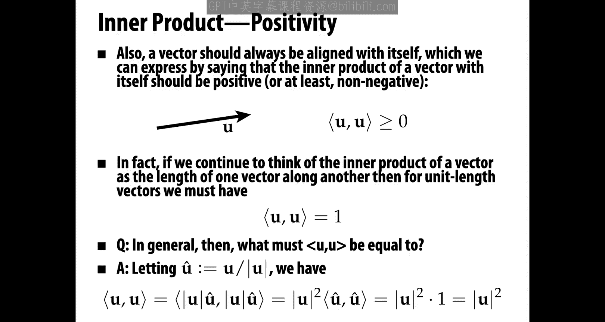

Okay。So after going through this exercise， again， drawing lots of little pictures。

 what we see is that in general， abstractly， an inner product is any function。

That takes two vectors as input U and V and assigns them a value in a product of Uv that satisfies the following properties。

 symmetryymme Uv is equal to V U， The inner product of U with itself is non negative。

The inner product of u with itself is0 if and only if U is the zero vector。

If I scale one of the vectors by a constant， I can pull that constant outside of the inner product。

One that we didn't really say directly。Is that inner products distribute over addition。

Can you argue that this makes sense geometrically。Can you pause the video and draw a little picture why should that last property hold？

That that'd be a nice picture to draw。Maybe explained it in the comments。Okay。

So to make this a bit more concrete， you know， maybe you didn't buy some of these properties based on our pictures。

 but we should be able to work this out in Cartesian coordinates。

So a standard inner product on R N is the so called Euclidean inner product。

 which operates on a pair of N vectors。 So now U and V are each given by。

A collection of coordinates U1 through UN and V1 through VN。

And we're going to define the Euclidean inner product as the sum over all the components。

Of the product of corresponding components。So as a concrete example， let's say we have a vector u。

 which equals 41 and a vector v， which equals 13。Then the inner product of U and V is going to be four times1 plus1 times 3。

 which is seven， super exciting。More interesting example。Oh， by the way， is this an inner product。

 you have to go back and check that it satisfies all the rules if I switch the order of UN V does it change。

 and so on？So more interesting example。Is the L2 inner product of functions。

 so just like we had a norm for functions， we can also define an inner product for functions that measures essentially how well two functions line up with each other。

So for square integral functions on the unit interval。

 same kind of functions that we talked about before。

 we're going to say that the L2 inner product of f and G denoted by these double angle brackets is the integral from 0 to 1 of f of x times g of x。

Concrete example is we have two functions f of x equals x squared and G of x equals 1 minus x squared。

 plotted on the bottom left。And now we go ahead and just plug in the definition so we say， okay。

 the inner product of F and G is the integral from 0 to 1 of x squared times 1 minus x squared。

 and I've plotted that product on the bottom middle here。

And what you can see is that the product of these two functions is pretty small， where F is big。

 G is small， and where G is big， F is small， and so their product is pretty small everywhere。

And if you were to go ahead and do the integration over this unit interval。

 you'd find that the L2 inner product is 130th， a pretty small number， so what that's telling us。

 what that's communicating to us about these two functions is that they don't line up very much。

These are vectors that point in different directions。

Hopefully you can start to make sense of that kind of statement now， oh。

 the function F and the function G point in different directions。

 that's not something you probably would have understood at the beginning of the lecture。

What do you mean functions pointing in a direction， well。

 conceptually we're thinking of these functions。As arrows in some space。Which， by the way。

 happens to be infinite dimensional。 Theres a value for value of x。

 And these vectors are pointing in different directions。 So their inner product is pretty small。Now。

 if functions behaved exactly like little arrows， there wouldn't be much to say。

 there wouldn't be much point in saying all this， but there's a really。

 really good reason to introduce functions into our vocabulary of vector spaces。

 and that's that when it comes to things like computer graphics，🤢。

There are often many different completely reasonable ways to measure the norm and inner product for functions。

And the choice of inner product or the choice of norm。Is going to depend on the application。

 it's something that people spend a lot of time thinking about what's the appropriate way to measure the size of this signal or the inner product between these signals。

To give a concrete example that hopefully gets the message across。

 suppose that we want to measure images that have interesting stuff in them。Okay。So。

We don't care how bright the image is， we want to know， is there interesting stuff going on？

So one thing we might do is to say rather than this L2 norm。Rather than just integrating the。

Magnitude， the square of the values。We want to do something that。Captures details in the image。

 maybe like edges， how many interesting edges are there in the image？Okay。

 so so let's look at these these two images on the left we have Scotty on the right we have the sky。

if it's a sunny day， the sun is shining， where you look up at the sky。

 most of the light hasn't been absorbed yet， and so the sky is really， really bright。

The dog is pretty dark， right it's a black dog， and so if you compute the L2 norm of these images。

 you might say， oh。The image on the left is dimmer， therefore it is smaller in norm。

And therefore it's less interesting to us。The image on the right is much， much brighter。

 it has a much larger L2 norm。It's more interesting to us。

But this isn't really what you might want for an application。

 let's say you were making an image search engine and you were trying to find interesting images。

This would be a really awful norm to use， you would end up finding these really。

 really boring flat images of the sky rather than these really interesting images of the dog。Okay。

So how can we switch this up， how can we change our definition of the norm to capture interesting images？

Well， one thing we could do is we could look at the。

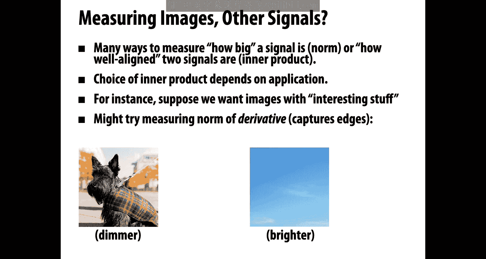

Derivatives of the image。Without getting too technical here。

 what we're measuring or what we're looking at here is from one pixel to the next。

 how much does the value change？So we take the derivative in space of the image。

And then we take the L2 norm of that derivative。So we're taking the L2 norm of the derivative of the image。

 I claim that that defines a new norm， it'll still satisfy more or less all the usual properties of a norm。

But it captures in this case what we care about。 It'll say， oh， actually， this time。

 the dog is a much larger。Image larger in norm， and the sky is much smaller because the sky has very few edges。

 the dog has lots of edges， and our search engine will turn up this nice。

 interesting picture of a dog。Okay， so these are games that we can play with。Signals， functions。

 images， and so forth， the choice of norm and choice of inner product really has a lot of effect on how algorithms behave。

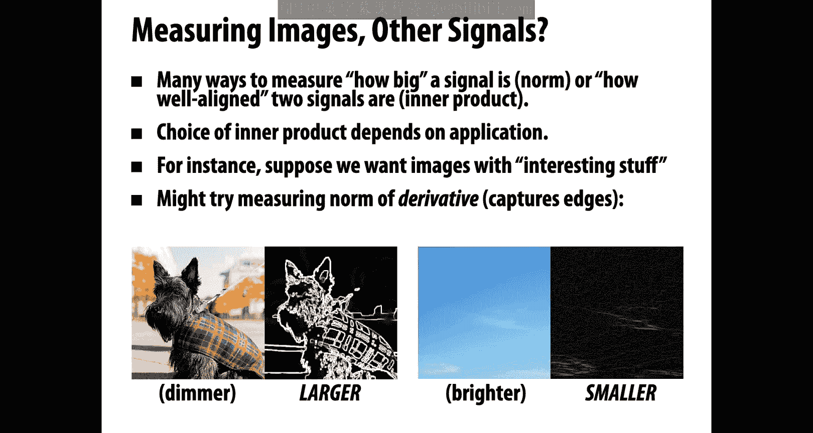

Okay， so let's move on to another big topic which is linearar maps and this actually could be a good time to pause the video。

 get up， stretch， maybe even take a break and watch the second half tomorrow。Okay。

So at the beginning， we said that linear algebra is really the study of vector spaces。

 which we've talked about， and linear maps between them。

So we have a pretty good handle now on vector spaces and inner product spaces。

But what's a linear map and why is this important for graphics so we'll get to the first question in a moment。

 but as for the second question， there's a few good reasons why linear maps and linear equations are super。

 super important for algorithms。One is that computationally。

 it's really easy to solve systems of linear equations。

As soon as you get to more sophisticated equations， even quadratic equations。

 things get computationally really， really hard， in fact。

 going from linear equations to quadratic equations goes from linear time algorithms or polynomial algorithms to things that are NP hard so there's very good computational reason to try to stick with linear equations as much as possible。

Another really important reason in graphics that we use linear equations is that basic geometric transformations such as rotations。

 translations and scaling can all be expressed as linear maps and this is really important and we'll see this a lot in our later lectures。

Another reason is that all kinds of functions and maps can be approximated by linear maps over short distances or short times。

 so if you've seen Taylor series approximation， you know that at least in the vicinity of some point。

 you can always use a linear function to give a reasonable approximation of a smooth function。

And this kind of local approximation is used all over geometry， animation。

 rendering image processing to make algorithms more efficient。

 to make it possible to get a reasonable result in a reasonable amount of time。Okay。So linear maps。

 linear equations super important。

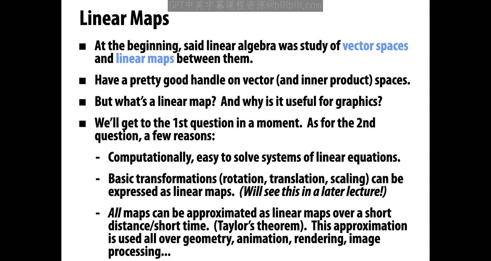

How can we think about linear maps， what is a linear map？Well， especially in graphics。

 it's really easy to think about these visually。So just as an example， to build our intuition。

Let's see that we have this Pentagon。Okay and I'm going to apply two different maps to this Pentagon。

This one on the top and this one on the bottom。Without giving any formal definitions。

 just looking at these pictures and using your intuition。

Which of these maps would you guess is a linear map？

Which of these transformations is easily expressable as a linear map？Okay， well， hopefully you think。

 yeah， this， this one on the top really looks like the linear one。

 whereas the one on the bottom doesn't look linear at all。Why， what is it in your gut that tells you。

 oh， the one on the top must be the linear map？Well。

 I think probably you look at this picture and you say， oh， well。

 the one on the top took lines to lines。 straight lines remained straight lines。

 even if the image got skewed a little bit， whereas on the bottom， straight lines。Got kind of bent。

 Okay， And this is exactly the right intuition for how a linear map behaves。

 Stright lines get mapped to straight lines。 In fact。

 that's almost a perfect definition of a linear map。Except for one important qualifier。

 which is that a linear map has to fix the origin， it has to send 0 to0。

So to really draw the right picture here， we have to put some coordinate axes here and say that the center gets mapped to the center。

Okay。So that's the intuitive definition， how about a more formal algebraic definition。

So this time we're going to go the other way around。

 we're going to look at the properties and then try to understand why these properties make sense。

So we're going to say a map F is linear if for one thing， it takes a vector as input。

And produces a vector as output。These vectors by the way don't have to be the same dimension。

 they don't have to come from the same vector space。

 I could have a linear map from R2 to R3 or R3 to R2， that's fine。

But it has to be true that for all vectors Uv and all scals A。

We have F of U plus V is F of U plus F of v， so the linear map distributes over addition。

F of A U is equal to A F U。Right， and actually that's it。 It's just that those two properties。

 addition and scalar multiplication are preserved by。Linear maps。In other words。

 it doesn't matter if we。Add the vectors and then apply the map or then apply the map and add the vectors we could draw。

A little diagram like this， okay， if we could add first and then apply the map。

 we're going to get the same result as if we apply the map to each of the vectors and then add them together same thing for scaling。

So another way of saying this is a map is linear if it preserves our vector space operations。

 if it preserves the structure of our vector space。Now that's getting a bit abstract。

 let's look at something a bit more concrete， so if we have a map between RM and RN， for instance。

 a map from 2D to 3D。

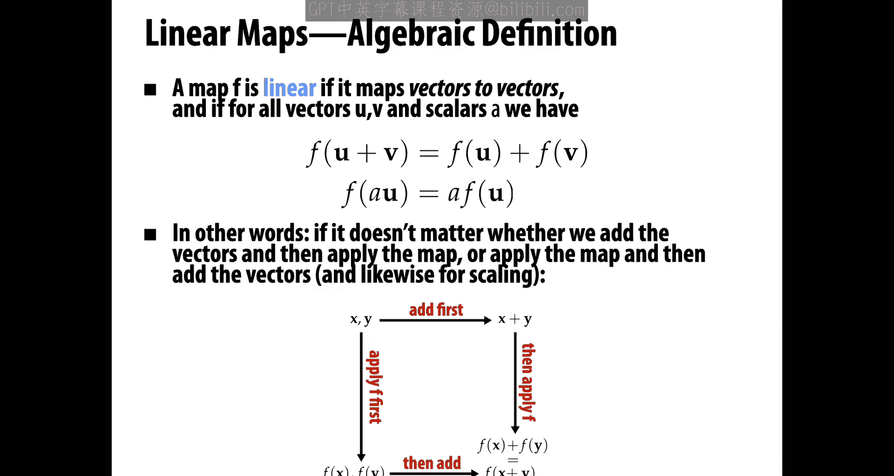

Then we can explicitly say what a linear map looks like in Cartesian coordinates。Okay。

 so in particular， let's say we're applying a map F。To a vector U。Well。

 it's linear if we can write it as the sum over the components of U。

Times some fixed set of vectors A。Okay， so A R。Vectctorors that have fixed direction and magnitude for all time。

 and we're just taking a linear combination of those vectors to define the map F。

A good mental picture here is something like this。 I have my vector U。In R2， it has components U1 U2。

 What is the linear map going to do Well， I have these two fixed vectors， A1 and A2 and R3。

And to see where U ends up， I'm just going to walk along a1 by a distance u1。

 and I'm going to then walk along A2 by a distance u2。So' a really， really important picture。

 Another way we can think about what's happening here is this little blue plane is getting stretched and skewed and placed in R3。

But in a way that well takes straight lines to straight lines and preserves the origin。

 like we said at the beginning。

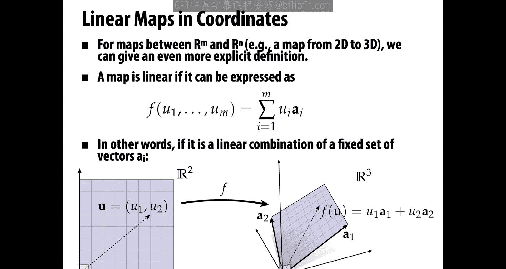

Okay， so here comes a really important question。Consider the function f of x where x is just a single variable。

 real number， so f of x equals a x plus B， where A and B are constant。

Is this function a linear function？Please think about this question carefully。

 don't just jump to an answer based on your gut intuition。

But please check the definition and be 100% certain whether this is or is not a linear function。

OkayAnd I think it can be really tempting when you look at this function， a x plus B， to say， yeah。

 sure， of course， what are you talking about， this is a linear function because when I plot it， look。

 it looks like a line， what more could you want。The important thing to notice is it's not a line through the origin。

In other words， if I apply this function to zero， I don't get zero back again。Why does this matter。

 Why is this important？Because a function like this， a X+ B。

Does not preserve the operations that we do on vectors。For instance。

 it's not going to preserve a sum if I。Take a sum of x1 and x2 and apply F to that sum。

I get a times x1 plus x2。Plus， B。Which equals a1+ x2+ B。If on the other hand。

 I first try to apply F to x1。And x2 independently。I'm going to get a different result。

 F of x1 plus f of x2 is Ax1 plus b plus Ax 2 plus B。Equals Ax1 plus AX2 plus 2B。

So B and 2B don't match up。And what that means is， again， I failed to preserve。

These vector operations now all of a sudden it matters whether I do the addition first and then apply the map or whether I apply the map and then do the addition。

Okay， so this is a very different。Behavior are a very different character than a linear map。

 and in fact this has a special name， this form of function。

 it's called an aine function rather than a linear function。

An aine function is like a linear function， except it can shift the origin。Okay。

 and Fine functions are actually。Kind of annoying when it comes to defining certain operations and graphics。

Later on， we're going to see actually there's an important little magic trick that you can apply to transform certain aine functions into linear ones and that's going to be really。

 really important for designing a graphics pipeline that handles spatial transformations。Okay。

But I will pester you all a little bit throughout the semester to make sure you know the difference between a linear and an affine function。

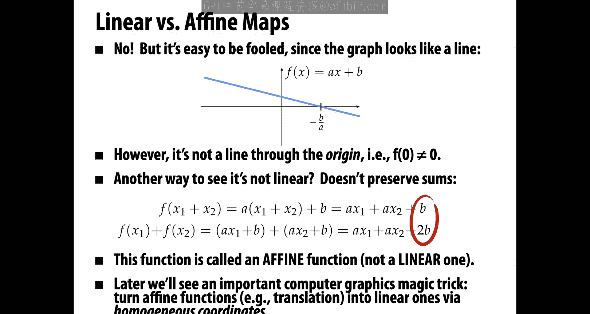

Okay， here's a slightly more interesting question。What about this function， F of U？

Equals the integral from 0 to 1 of U X dx。 So now it's a function that takes says input1 function u。

And spits out a number。Is this a linear map？Is this even a map between vector spaces？Well。

 think about it， it'll be on your homework。Okay。Other things that we talk about in vector spaces that kind of help us understand。

Linear maps is the span。Do you remember geometrically， what is the span of2 vectors U and V。

 what does that mean？So， let's say， I have。A vector U and a vector v， no longer in the plane。

 but actually in three dimensional space。What does the span of those vectors look like？Well。

 what should really come to mind is a plane。That contains UNV。

But doesn't contain the rest of three dimensional space。

 a two dimensional space in three dimensional space containing U and V。

We can be more algebraic about this and say the span is the set of all vectors that can be written as a linear combination of U and V。

In other words， vectors of the form A U plus B V， where A and B are any two numbers。

 so anywhere we can get by walking some distance along U and some distance along V。

 but we can't walk in the normal direction of this plane。Okay。More generally。

 if I have a collection of vectors U1 through UK。Then the span of those vectors is the set of all vectors I can get by taking linear combinations of those k vectors。

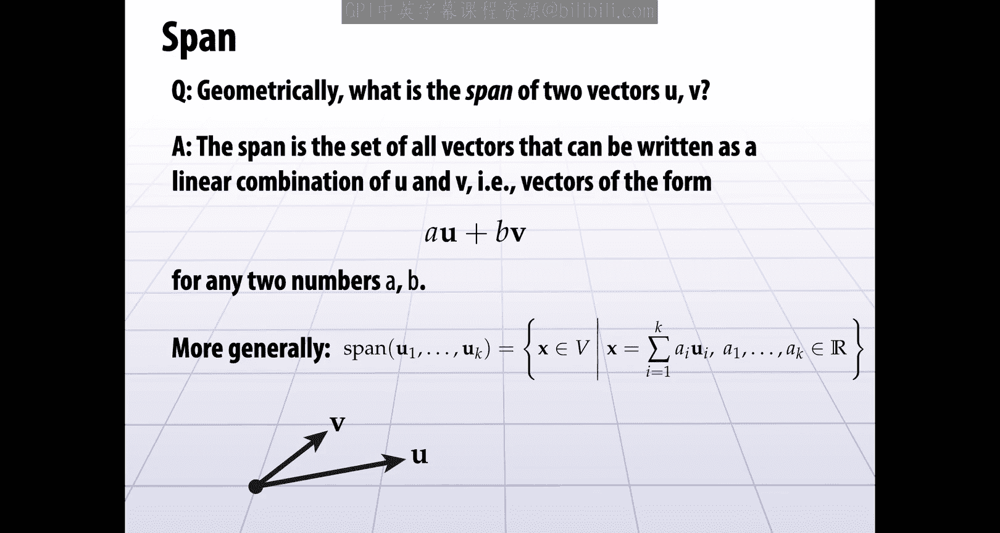

Why is span important， Well， it gives us another way of understanding linear maps so we can just using a little bit of natural language connect the idea of span and linear map。

 we can say，The image。Of any linear map。Is the span of some collection of vectors。

 some fixed collection of vectors， In fact， this is exactly the。

Image or the picture that we saw before。Okay， so first to make this clear。

 I've highlighted the word image in blue， what does image mean， I don't mean like a photograph。

Mathematically， what is the image of a function？So in mathematics。

 the image of a function is all the points that I can reach by applying the function to some point in its domain。

Okay， so in this case， I'm going from R2 to R3， I try applying F to all the points in this two dimensional plane。

 I'm only going to end up with a certain subset of points in three dimensional space。

The image is this two dimensional plane sitting in R3。Okay。

 and what we're saying is any linear map looks like this， I have some fixed set of vectors， A1。

 A2 and so forth。I take the span of those vectors， that's the image of my linear map。Okay。

The span is closely related to the idea of a basis。So in particular。

 if we have exactly n vectors E1 through E， such that。The span of all those vectors covers all of RN。

Then we say that these vectors are a basis for RN。Importantly。

 we have to add exactly n vectors that span RN。Okay，If I have more than n vectors that span R n。

 that's not a basis。 It's only when I have exactly n vectors。Importantly。

 there are lots of different choices of basis for RN。So just as a little exercise。

 let's look at some examples， which of the following are bases for the two dimensional plane when n equals 2。

这个ABCDE。Take a minute and think which of these are bases for the plane。Okay。

 what did you come up with。So I would claim。That A and C are bases for the plane。

 and the rest are not。How can we see that's true？Well， first。

 let's look at B B is just a single vector if I take it span。

 all I can do is reach the line containing B， I can't reach all the points in the entire plane。Okay。

So it's not a basis because I can't use it to specify any point in the plane。D， you think， oh。

 well D D looks okay because I have two vectors and I'm in R 2。 but what's the problem here， why。

 Why is D not a basis for the plane。Well， it's because the two vectors point in equal and opposite directions。

So if I try to take linear combinations of these two vectors， I still only get a line。

 I don't get the whole plane。Okay， what about E， what's wrong with E， I mean E seems great。

 I can definitely take linear combinations of these three vectors and reach any point in the plane。

The problem is I don't have a unique set of coordinates。

 I don't have a unique way of specifying a point in the plane with these three vectors。

There are multiple different sets of coordinates I could use to specify at the same point。

 and that's kind of annoying。That makes it really hard to know if two points are the same I have two triples of numbers。

 they look completely different and they specify the same point。

 I don't want to be in that situation so B D and E， none of these are useful as bases for the plane。

A and C are good， because。They're linearly independent。Two linearly independent vectors。

 they span the whole plane， I can specify any point uniquely。Importantly， by the way。

 A is still a basis for the plane， even though these vectors are not orthogonal and even though these vectors do not have unit norm。

So the difference between A and C is that C is what's called an orthoormal basis。

They have vectors at right angles， they have unit norm， or the same norm at least， A is not。

In some cases it's really useful to have an orthoormal basis， but not always necessary。

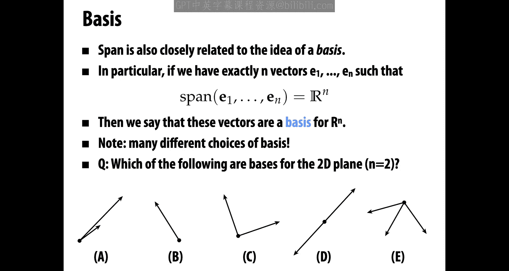

So more precisely， an ortho theormal basis。Means that you have a basis and all the vectors have unit length and they're all mutually orthogonal。

 in other words， if E1 through EN are our basis vectors。

 then the inner product of EI and Ej is 1 if I and J are the same vector and0 otherwise。

So here are a couple examples， two different orthoormal bases。For the plane。Right。And a given vector。

 let's say a vector U can be measured in each of these bases。Give you coordinates in the first basis。

 I can give you coordinates in the second basis。Why is it nice to have an orthoormal basis？ Well。

 for one thing， the geometric meaning。Of the sum， u1 squared plus u2 squared plus all the way up through UN squared is maintained。

If I work in an orthoormal basis， this simple formula， some of the squares of the components。

 always gives me the square of the length of the vector。If I'm not in an ortho theormal basis。

 I'm going to run into trouble， this is something you should try out。

 try writing down a not ortho theormal basis。Plugging in this simple formula square sum of the squares of the components。

 you will get a number that has nothing to do with the geometric length of the vector。

And a really common bug in code is to work in some non orthoormal basis。

 project some vector onto a non orthoormal basis。But continue to use the standard inner product and norm that we've discussed。

 that'll cause all sorts of things to go wrong in your code。So please be careful。

 please be conscious about whether or not you have an orthoormal basis whenever you're implementing code。

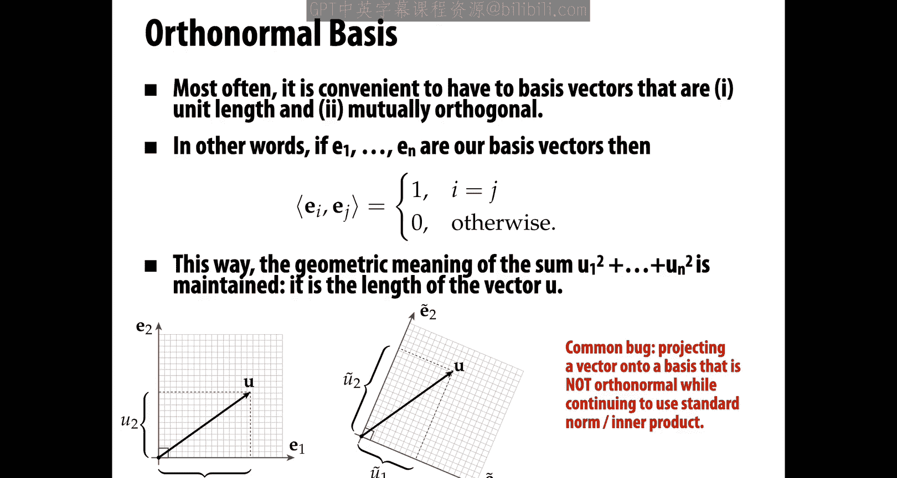

Okay， so suppose that you don't have a north normal basis。

 suppose you have some interesting thing going on in your graphics program。

 you have a triangle sitting in space and you want a basis for the plane of the triangle。

But you can't initially get an orthonmal basis， maybe you just have two edges of the triangle that point in different directions。

How would you cook up an orthoormal basis， this is a real practical thing you have to do all the time。

So。More generally， let's say I have a collection of basis vectors A1 through A N。

 How do we find an orthoormal basis， E1 through E N。One way。

One simple algorithm is something called the Grand Schmidt algorithm。

And so I'll just show what it looks like for a pair of vectors。

 So what I'm going to do is I'm going to start with the first vector and just normalize it。

So I take u1 and divide by its length。To get E1。Okay。So I have a unit vector， at least。

Now to get the second basis vector。I'm going to subtract any component of the first vector from the second one。

How do I do that？Well， I take the second vector U2。I project it on to E1 by doing an inner product。

 so I do u2 inner product E1 times E1。That's going to give me a vector。

That is representing the component of U2 in the direction E1。

And since I want these vectors to be orthogonal， I'm going to subtract that component out from U2 so that it's orthogonal to E1。

Okay。So now U2 Tilde is orthogonal E1 but it's not yet unit。

 what do I do while I go ahead and I normalize it？If I have additional components or additional basis vectors。

A3， A4， and so forth， I just repeat this process。Removing the components of all the previous vectors from the most recent one。

Okay， nice， simple algorithm。A little bit of a warning， by the way。

 that for a large number of vectors or vectors that are nearly parallel。

 this is not numerically the best algorithm。Okay， so it's perfectly fine mathematically。

 but things can really go haywire if you're working with floating point numbers and you don't have a lot of precision。

And in that case there are much nicer algorithms， one good example is something called QR decomposition。

 and you can look that up on Wikipedia if you're interested。

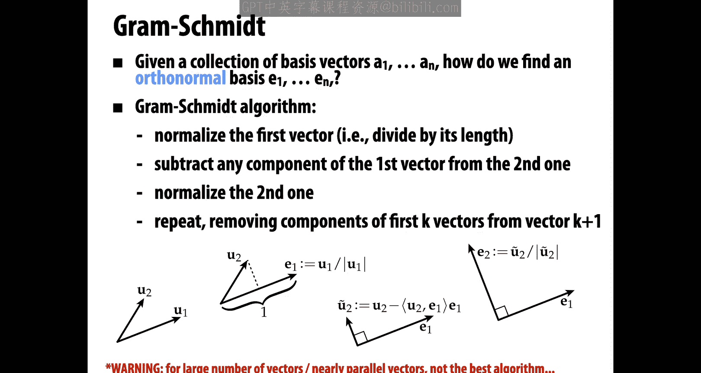

Okay， so。We're all pretty familiar， I think， with this idea that in R N。

 I can always pick an orthoormal basis。 right， this nice。

Coordinate system that gives us a notion of axes and so forth。

But today we've talked a lot about generalizing vectors to more interesting things。

 functions and signals and sounds and all kinds of things。So。

Is it possible to come up with an orthoormal basis for a space of functions。

 what would that even look like？I mean， we do know now how to talk about two functions being orthogonal。

And we do know how to talk about the norm of a function， so we can。

We can certainly say if a collection of functions is orthoormal。But what does that。

 what does that really look like， So functions， you know， we keep saying our vectors。

Do they have an orthoormal basis？And a very， very beautiful fact， maybe not so obvious fact。

 is that yes， you can， in many cases， come up with an orthoormal basis。Of functions。

 And this is the basic idea behind what's called the Fourier transform or Fourier analysis。

So a really good example to start with， nice simple example。Is to consider。

A special class of functions。Functions on the real line， but that have a very。

 very special property that they repeat。At intervals of2 pi。

So F of x is always going to be the same as f of x plus2 pi。

Is going to be the same as F of x+ 4 pi and so forth。For these kinds of functions。

We can always express them。As a linear combination of a special set of basis functions。The sinusoids。

 cosine Nx and sine of M X for any integers M and N。Okay。So you could go ahead and check。

 go ahead and check that these are orthonormal， and I think actually you might need a constant in front of these functions to give them unit norm。

But they'll certainly be orthogonal to each other。What's interesting about these functions is that they give us a very。

 very natural decomposition of a signal。So if I think about what do these basis functions look like。

 they look like higher and higher frequency oscillations。So if N or M is small。

 I get this very low frequency oscillation as N and M get bigger， I get high frequency oscillations。

And。Just like I can project a vector in RN onto an orthoormal basis to write it in components。

I can also project one of these two pi periodic functions onto a basis of sinusoids to get kind of the components of that function。

A really good example to think of here is suppose that the function is actually describing audio。

Okay， so audio is。A speaker or a membrane vibrating back and forth at some frequency in some interesting way in order to make a sound。

And I can decompose that sound into very low frequencies， middle frequencies and high frequencies。

By projecting the signal onto。Slowly oscillating waves。

Waves that oscillate at a medium frequency and waves that oscillate at a high frequency。Or really。

 to be more precise， I have lots of different frequencies， different frequencies for every integer。

Okay。And so。This is really the same as projecting a vector into RN onto an orthoormal basis。

 That's all I'm doing when I'm decomposing an audio signal into different frequencies。

 So this is the basic idea of a Fourier decomposition or a Fourier transform。

A cool thing about it is as complicated sounding as this might be。

 this Fourier transform is really just a linear map。From one basis to another。

I'm just converting my function into a particular basis。

And this idea of doing Fourier transforms and then processing or modifying the signal in this frequency basis is a basic building block for lots of different graphics algorithms。

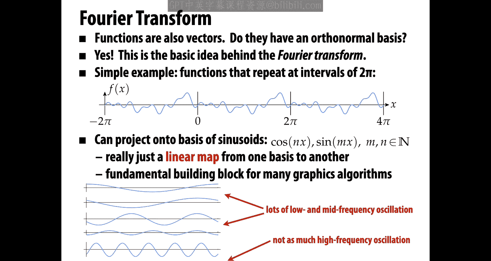

So more generally， this idea of projecting the signal under different frequencies is known as Fourier decomposition and we can apply it to not just audio。

 but all sorts of signals， we can apply it to images， we can apply it to geometry。

 we can apply it to physical simulation。

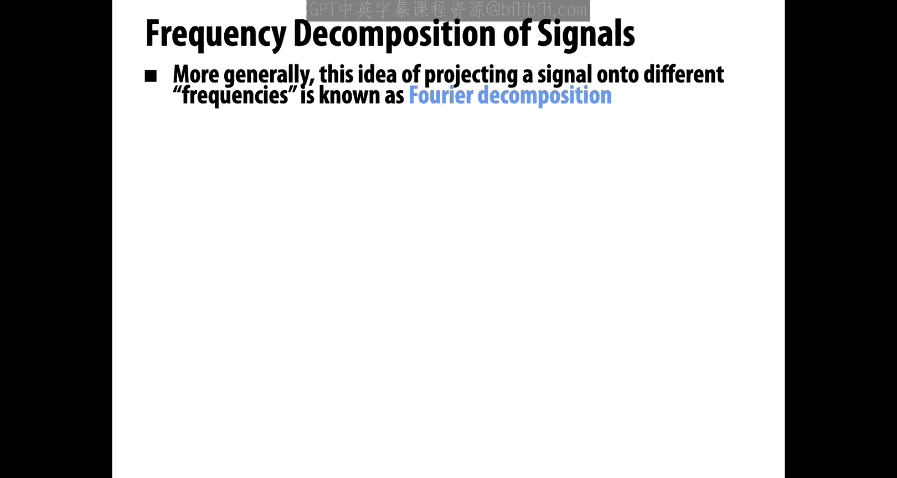

So here， for instance， you see that there's a threedial model and we can break it up into nice smooth features or we can break it up into lots of little small scale bumps if we have a drum head and we hit it we can see that it's oscillating slowly in some regions and it's oscillating at high frequencies in other regions that's kind of what makes the sound and we can also split up light into different frequencies in much the same way so we'll have plenty more to say about this Fourier perspective as the course goes on。

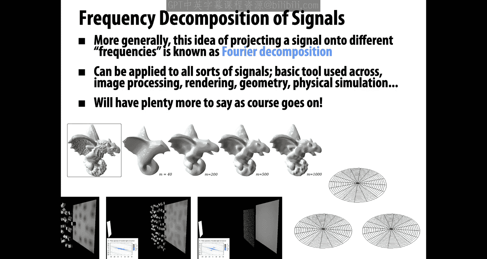

Okay。A really important thing computationally is talking about systems of linear equations。

 So a system of linear equations is exactly what it sounds like。

 It's a bunch of equations where the left hand side is a linear function and the right hand side is a constant。

 So for instance。We have x plus 2 y equals 3， for x plus 5 y is equal to 6。

X plus 2 y that's a linear function for x plus 5 y， that's a linear function。

The unknown values are sometimes called degrees of freedom。

 which I might abbreviate occasionally as DOFs， and the equations are sometimes called constraints。

 so I have these。These degrees of freedoms are these variables x and y。

 and I want to find assignments of values to those variables that satisfy all these constraints。Okay。

So simultaneously satisfy all the equations。Well， how do I do that in this case， it's not so hard。

 how do I solve the first equation？I could solve it for x， or I could solve it for Y。

 let's go ahead and solve it for x， and I get just x is equal to 3 minus 2 y。

Then I take this solution for X and I plug it into the second equation。And now I can solve for y。

 because I know everything in the equation except for y， and I get y is equal to 2。

Now that I know Y I can plug that back into my expression for x and I get x is 3。

 minus2 times 2 is minus1。Pretty easy。So you've。Probably done this before you've probably gone through the exercise of grinding out the equations and solving these linear equations and maybe you never knew why it was just something to keep you busy right so it's going to be really important when we do graphics to think about what does solving a linear system actually mean？

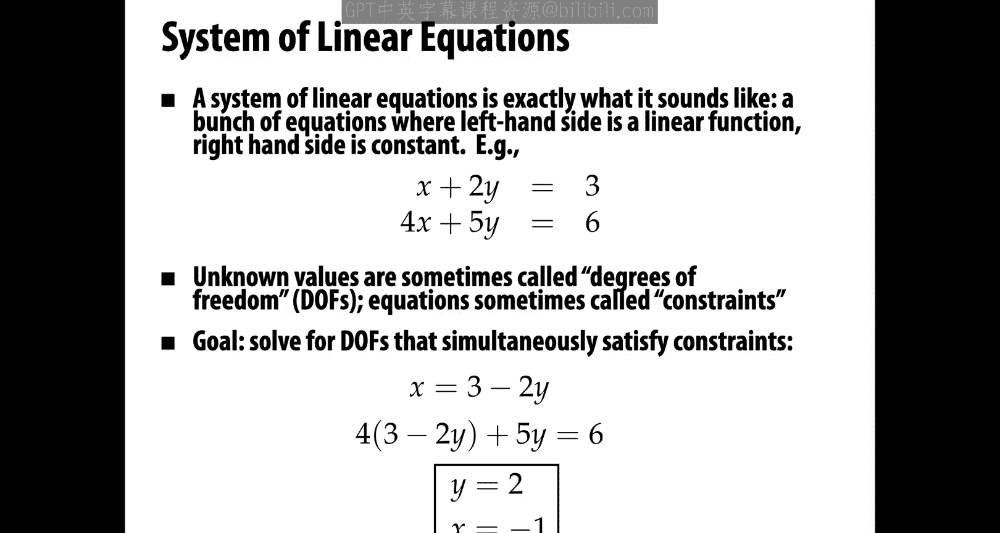

And for this we can go back to some of our visualizations that we had for vector spaces and linear maps。

 so of course， a linear system can be used to represent many different practical tasks in graphics。

 simulation， processing images and so forth， but for any linear system no matter what it represents。

 there are some good mental models that we can use to understand what it means。

One that hopefully you've seen before is that a linear system is kind of saying we want to find a point or maybe points where let's say two lines meet or two planes meet or three planes meet some number of aine subspaces meet。

OkayAnother one is to say given a point B， find the point X that maps to it。

 so we have this nice geometric picture of a linear map as something that takes some Rn into a linear subspace of RM。

We have some point in ourM and we want to say。Which point in RN is the pre image of that point。

 again， which point maps to it？

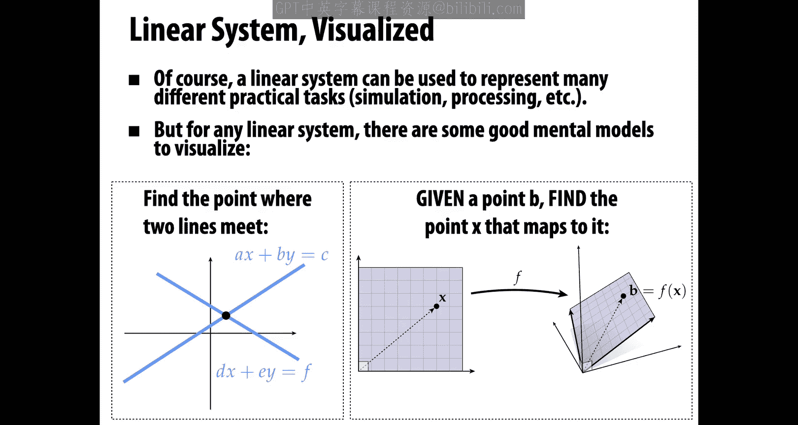

Okay。Of course， not all linear systems can be solved and that's very， very important。

 especially when you're writing code， when you're building algorithms。

There's a very common mistake that people make， which is that they。Code up some linear system。

 They hand it to their computer to solve。 They hit go。 The computer goes off and does something。

 You can't really tell what it's doing， but it comes back and it spits out in answer。

 And if your linear solver is not very well written， which is often the case。

It might just give you some answer， some number。And not tell you， oh， by the way。

 you asked me to solve a ridiculous problem that had no solution。

But you know what I'm just going to give you some numbers anyway， this is sadly the state of affairs。

 a lot of solvers will just do this， so you have to be very careful and be aware that the problem that you set up might not be solvable and there might be some really important meaning to the fact that it can't be solved。

Okay， so how can we。Tell how can we think about linear systems that can't be solved。

 or we can think about it again in terms of these two pictures。One is。

 I'm saying I'm looking for points that belong to several different ane subspaces。

Meaning what do I mean by aine subspace， I just mean all the points I can reach by an aine function。

So if I have two parallel lines， I want to find a point that's on both of those parallel lines。

 sorry。I'm out of luck， no solution。Likewise， let's say I have a map from R2 to R3。

 well there's only so many points that are in the image of that map。

 right I'm only going to be able to reach points in a two dimensional subspace of R3。

So if I'm trying to solve an equation。F of x equals B for some point。

 B that's not in my two dimensional subspace。It's unreasonable to expect there'll be a solution。

The other thing that you notice here is there could be examples where there are many solutions。

So it could be that two of my equations actually describe the same thing。

And I don't actually have a full set of equations that uniquely characterizes a solution。

 so that could be two parallel lines that are lying right on top of each other。

 I need to find a point that's on both lines， while that's easy， I just pick any point on the line。

So now there are solutions， but there's not a unique solution。

That's also really important to understand an algorithms because you can sometimes have erratic behavior where your solver returns kind of a random solution from that whole solution space every time you run it just based on the inputs being slightly different。

 you get slightly different results that jump all over the place。

 so you have to be careful about that。We can also understand this non-uniqueness using a picture like the one at the bottom。

 so you can imagine that instead of going from R2 into R3。

 instead of going from a smaller space into a larger space where we might not have a solution at all。

 we now go from a larger space into a smaller space， we go from R3 into R2。

So a good example might be， I just take XYz and my map projects XYz onto just X Y。

That was kind of our example of the simplest way to draw a 3D cube on a 2D image， right？Well。

 the problem now is if I say， okay。Please find me the point in three dimensions that maps onto a given point in two dimensions。

 The solution is no longer unique， there's a whole line of solutions in R3 that projects down onto the same point in R2。

Okay， so again， a system of linear equations might not in general have a unique solution。

And in general， you want to think about these things， uniqueness and existence， if you have both。

 your algorithms will often be better behaved。Okay。

 so we've been talking about linear algebra now for quite a while， and some of you may be thinking。

 well， wait a minute， something's weird here， what happened to matrices？

I think when a lot of people learn linear algebra。It's done by talking a lot about little blocks of numbers that look like this。

Right。And the reason for going through a lot of linear algebra without talking about matrices is to help you appreciate to help you realize that linear algebra is fundamentally not about matrices。

 you can understand almost all of the important concepts about linear algebra without ever talking about a matrix。

Why is it a good thing to think about linear algebra without matrices。

 Well matrices can really interfere with your understanding about what's going on geometrically。

You have these little blocks of numbers， you have some rules for pushing the numbers around。

 you have little algorithms for doing multiplication or computing a determinant or whatever it is。

But a lock gets lost in the fact that you have this numerical procedure。

 but no real picture that it's associated with。The other perhaps more profound reason why matrices provide a very。

 very confusing picture of linear algebra is that as we've seen。

 the entries of those matrices are going to depend on your choice of coordinates。

So I could have two matrices that represent the exact same geometric operation that represent the same linear map。

 for instance， but have completely different entries。And so just by inspecting matrices。

 you really don't get a good sense of what's going on or whether two things are equivalent。

The other confusion about matrices is that matrices can be used to represent many different in equivalentent things。

So for instance， a matrix can be used to represent a linear map。

A matrix can also be used to represent something called a quadratic form。

 which you'll look at on your homework。And。If you're not careful。

 you can really mess up what you're doing。By viewing one as the other， for instance。

 under a change of coordinates， the entries of a linear map will change in a completely different way than the entries of a quadratic form。

 so this is a really， really easy way to make mistakes in code， for instance。On the other hand。

 why do we have matrices well， at the end of the day they are very。

 very useful for doing certain kinds of symbolic manipulation， but more importantly。

 for doing numerical computation。At the end of the day。

 we want to boil down our linear algebra problem into a matrix equation that we can hand off to our computer and our computer will solve that for us very。

 very fast。Okay， so when you do graphics， it's important to be aware of the conceptual dangers of working with matrices or thinking in terms of matrices。

 it can really set you off on the wrong foot， but it's also something that we have to do at some point if we want to get efficient computation。

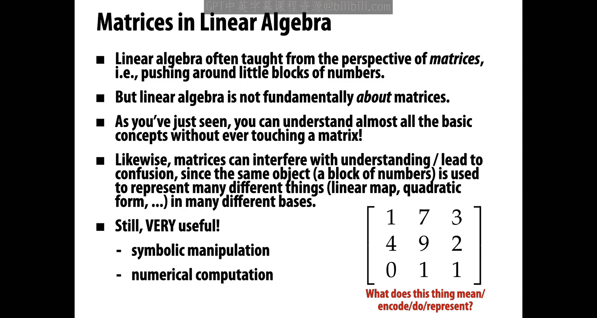

So let's think， for instance， about how we encode a linear map as a matrix。

 what is the relationship between linear algebra and matrices？So for example。

 let's say I have a map F of view。Which takes any point u to the point u1 times A1 plus u2 times A2。

 where A1 and A2 are some fixed vectors。How do I encode this as a matrix？First。

 what does it mean geometrically？It means if I have a vector in the plane with coordinates U1 and U2。

 I'm going to walk a distance U1 along the vector A1。

And then I'm going to walk a distance U2 along A2。So what I would like is a matrix。

 where if I multiply this matrix by the vector U1 u2。I get that geometric operation。Okay。

 so how can I make that happen？Well， I have to remember a little bit what it means to multiply a matrix by a vector。

 what does that look like？And you might remember something about， okay I。

Walk across the rows of the matrix and I walk down the columns of the vector that I'm multiplying by and I take a sum or something like that。

 I think the easiest way to think about matrix vector multiplication actually is to say the matrix has a set of columns。

And when I multiply a matrix by a vector。I'm taking a linear combination of the columns。

Using the entries of the vector I'm multiplying by。Okay。So from that point of view。

 building this matrix is super straightforward。I just take these fixed vectors A。

And I make those the columns of the matrix capital A。Now， if I do a matrix vector multiply。

 I'm going to recover the original map。Why is that true， well。

 because I'm going to do u1 times the first column？Plus， u2 times the second column。

 just like I've written in my formula at the top。And you can multiply this out however you like。

 and you should see that exactly that is happening。I get A1 times u1 plus A2 times u2。Okay。

 same as before。

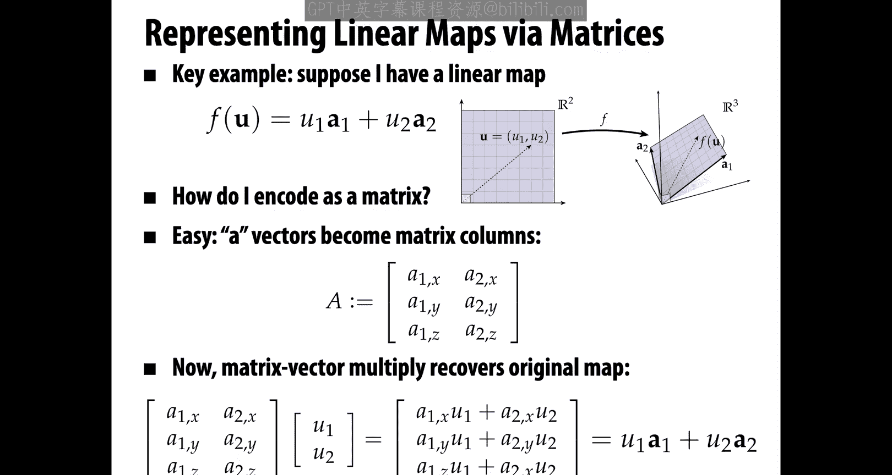

So。That's actually it， that's all I'm going to say about matrices today。

 but you should definitely think now every time you do an operation with matrices。

What does it mean geometrically， what are you really doing in terms of linear algebra？

And if you really love working with matrices， if you think that's a fun thing to do， and hey。

 it is sometimes， then there's lots of exercises on your homework to play around with matrices。

By the way， one final comment。Some of you may have noticed there was a weird spot in this video。

 I was talking about the natural properties of length or norm and I said， oh well。

Because this diagram looks like a Pentagon， we call this the Pentagon inequality。

 this is ridiculous right， hopefully you all know the difference between a triangle and a Pentagon。

 and in fact this is called the triangle inequality。The reason for saying this is I really。

 really want people to ask questions in this class if you're watching a video。

And you find that something really strange was said。

 then please leave a comment on the slides or put it on piazza or communicate to us in office hours。

 hey， you said something crazy， I didn't agree with that and then we can talk about it again you should not just accept that whatever we say is correct。

You should use your brain and think about do I believe that， do I understand that。

 do I agree with that， that's that's the whole point of us all being here together。

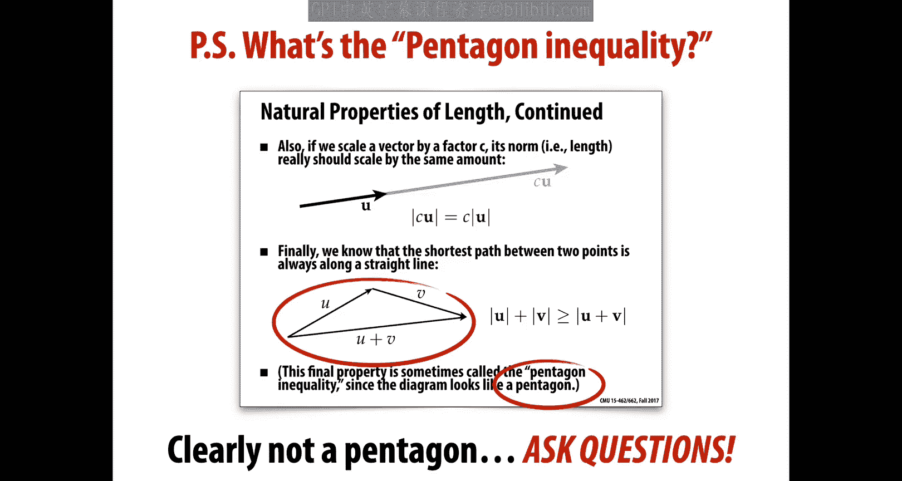

Okay。So next time we're going to continue with our math review and talk about vector calculus。

 eigenvalue problems and eventually we'll talk a little bit about complex numbers。

 things that are all super useful for manipulating 3D geometry in computer graphics， that's it。

 talk to you next time。

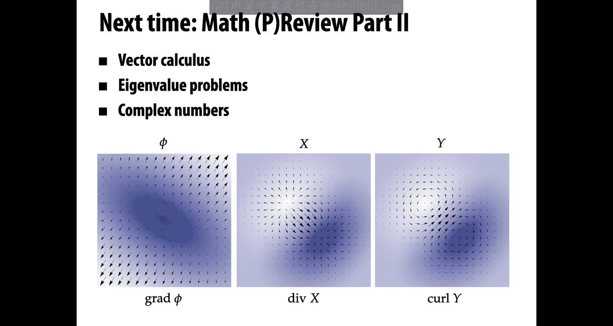