# CMU《计算机图形学｜CMU 15-462  COMPUTER GRAPHICS 2021》中英字幕 p04 -04-Lecture 03_ Vector Calculus (P)Review -BV1H3NBemE5E_p4-

All right， welcome back， we are going to continue today with our review and preview of the mathematics that you'll need to study computer graphics last time we touched on a variety of topics from linear algebra。

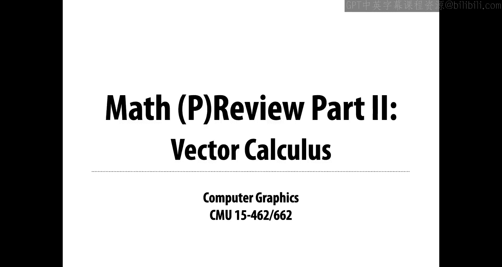

Many of which hopefully sound familiar， some of which might be new。 We of course。

 don't have time to cover all of linear algebra in one lecture。

 but if you feel like you still want to brush up or you just fell in love with the subject and you want to learn more。

 There are lots of fantastic lectures online。 I can recommend a few three blue。

 one brown has some great lectures on linear algebra。

 Robert Gist has terrific lectures on multivariable calculus。

 which we'll talk about today and there are many， many others you can find let us know online ones that you like ones that you think are useful。

 especially ones that seem good for going through graphics so post on piazza or on the website。

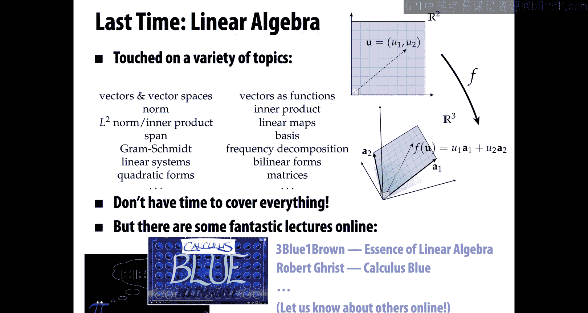

So today we're going to talk about vector calculus or multivariable calculus， why， again。

 we always want to understand why we're doing what we're doing。

 why is vector calculus important for computer graphics。

 and the basic reason is that it gives us a language for talking about spatial relationships。

 rates of change， transformations， and so forth。

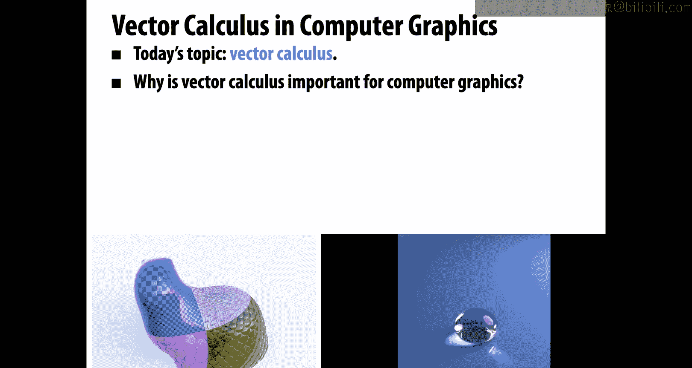

And that's useful because much of modern computer graphics is formulated in terms of what are called partial differential equations。

 PDEs that use divergence， curl， laploian and so forth things that hopefully you heard about once or twice in your vector calculus class so this lets us do all sorts of things from physically based animation and geometry processing and image processing。

 using the language of rates of change， we'll also talk about a few more basic concepts that aren't quite as deep as PDEs。

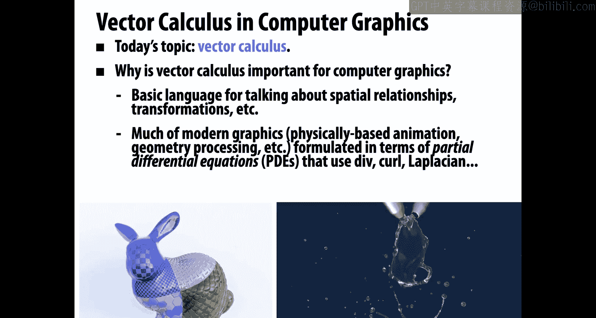

Last time we saw that vector value data is everywhere in computer graphics。

 essentially anytime we're talking about objects from linear algebra。

 we're talking about vector valued quantities， so if we want to differentiate or optimize those quantities。

 we need a kind of differential calculus。

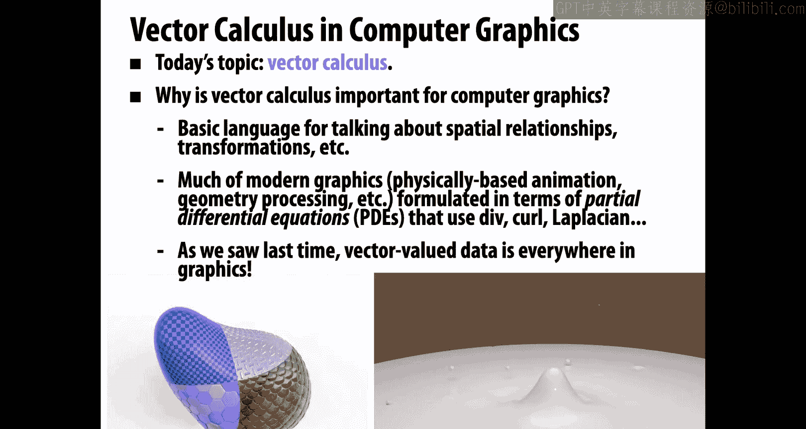

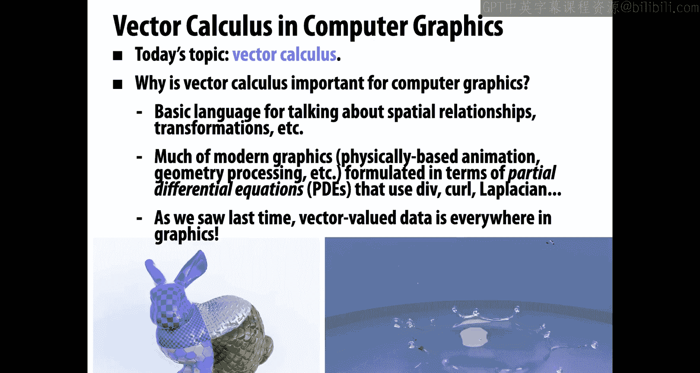

Okay。So last time when we talked about linear algebra。

 we' were really talking about vectors in general kind of in the abstract。

When we do multivariable calculus， it's often useful to think about these quantities as being really concrete geometric quantities。

 quantities that we see and interact with in， let's say three dimensional space in the space we live in。

So for instance， let's revisit this idea of a norm。

 so last time we developed this notion of a norm which measures total size， total length。

 total volume， total intensity right if we think about the norm of a function or a signal。

When we're doing geometric calculations， there's a very natural choice of norm。

 the norm we most often care about is the so called Euclidean norm。

And this norm has a very nice definition that's very geometric。 It doesn't depend on coordinates。

 We can say the Euclidean norm is。The notion of length， preserved by rigid motions of space。

 so rotations， translations and reflections。And you should think just for a minute， okay？

Is that true for all norms we know there actually are things that satisfy all of our conditions for a norm。

 but not this one， not this additional condition that length is preserved by rigid motions？

That's what makes the Euclidean norm special。Now， of course we can write the Euclidean norm in coordinates in particular。

 if we have orthoormal coordinates。Then we can write the Euclidean norm of a vector U as the square root of the sum of the squares of all the components。

So maybe this rings a bell in two dimensions， this is basically the Pythagorean theorem。

It's saying that the length of a hypotenuse of a right triangle。

Is equal to the square root of the sum of the squares of the two other sides。Right。A little warning。

 whenever we work in coordinates， we have to be careful。

Because this expression does not give us the geometric length unless the vector U happens to be encoded in an orthoormal basis。

Okay， so we said in general， a basis just has to have linearly independent vectors。

It's a fairly common bug in computer graphics code to say。

 I've written down my vector in some non or the normal basis。

And now I go to apply this formula to get the length and I get some number that's not actually representing the geometric length。

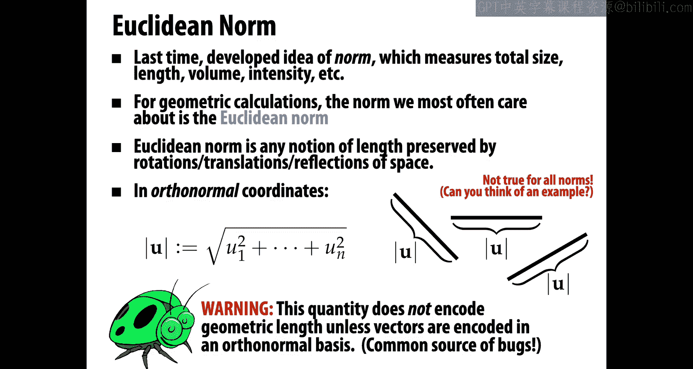

Okay。So just to be careful。We can also talk about a notion of inner product that is kind of natural from a geometric point of view。

So remember that in general， we said an inner product is going to measure some notion of alignment。

But for geometric calculations， for working with vectors in R3。

 we want an inner product that captures something natural about the geometry。

And so for n dimensional vectors。The Euclidean inner product can be defined as。

Inner product of UVV is equal to the norm of u times the norm of v times the cosine of the angle theta between the vectors U and V。

Okay， notice， again， this is a perfectly geometric definition。

 it doesn't depend at all on a choice of coordinates。Just quantities like length and angles。

That have a meaning independent of coordinates。Now we can write this。

Euclidean inner product in Cartesian coordinates in orthogonal。Coords。

Using the so called dot product。So we might distinguish the dot product from a generic inner product by saying that U dot v is just the sum of the products of the corresponding components。

 U1 times v1 plus U2 times v2 and so on plus UN times Vn。Again， we have our warning。

 as with the Euclidean norm， this expression， this sum of component wise products has no geometric meaning unless the coordinates come from an orthoormal basis。

And this is something that when you're working with graphics code and especially when you're working with vectors that represent functions and other signals。

You really have to get adjusted to， you really have to think， oh， you know。

 when I take an inner product， I have to be careful about things like a mass matrix。

 I can't just take the dot product， there's actually a lot of care and subtlety that goes into making sure you're right using the right inner product at the right time and we'll talk more about that as the course goes on。

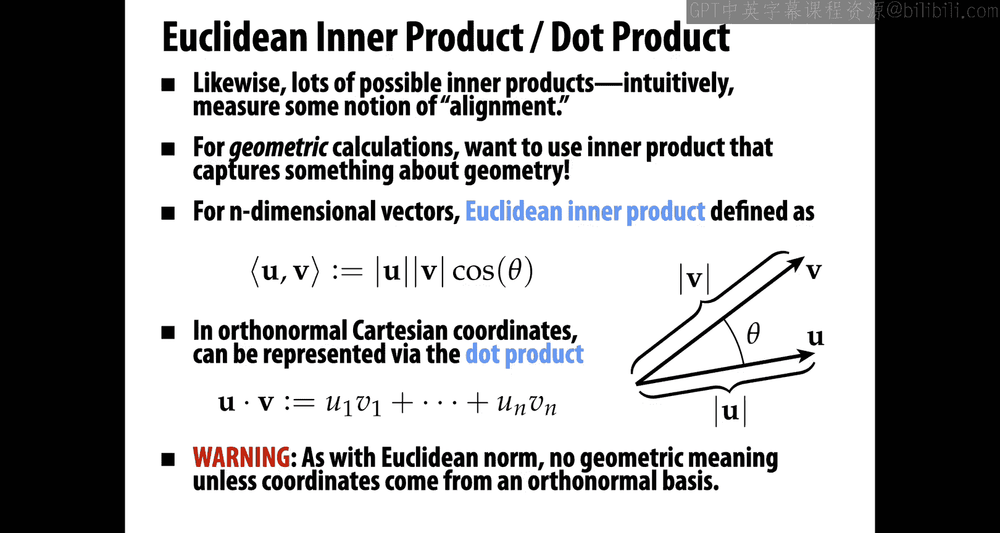

The other natural product we had between vectors in R3 is something called the cross product。

So the inner product took two vectors and produced a scalar。

The cross product is going to do something a little different。

 it's going to take two vectors and produce a vector as output。

And we'll write this as U X v or U cross v。Okay， what does this mean geometrically if I had my two vectors UV in three dimensional space？

Then I can say a few things about the cross product。

 I can say that the magnitude is equal to the area of the parallelogram made by the two vectors。

And I can say that the direction of the cross product is orthogonal to both vectors。

 and here I really mean orthogonal with respect to the Euclidean inner product。

 with respect to the dot product。Okay。Again， a perfectly good geometric definition。

Really interesting question， why。Why does this definition perhaps make sense only in three dimensions？

Why doesn't it make sense for vectors UV that are two dimensional。

 why doesn't it make sense for vectors U and V that are four dimensional？Well。

 let's look at these two conditions。I mean， the first one seems perfectly good。

 we could try to define some notion of product where the magnitude is equal to this parallelogram area。

In any dimension。But what would it mean in four dimensions。

 let's say that the direction is orthogonal to both vectors， what would it mean in two dimensions。

 let's start with a simple case， I have two vectors Uv in the plane。

And I'm looking for a vector that's orthogonal to both of them。Well。

 unless those vectors are parallel， there is no vector in 2D。That is orthogonal to both U and V。

When we go into 4D or any higher dimension。We're going to actually have many different vectors that could be orthogonal to both U and V and have the desired magnitude。

Okay， so there's something very special about the relationship between the cross product and 3D。

 It's an operation that。Conventionally only makes sense。In three dimensions。Now， a word of warning。

Sometimes I and other people will use the cross product in 2D to just refer to this signed area of this parallelogram。

 so the area of the parallelogram and make it positive if it's sort of pointing out of the plane and negative if it's pointing into the plane。

This actually raises another important question， which is which direction。

 which of the two directions is the cross product pointing？In this picture， for instance。

 I've drawn it， pointing， let's say， up。I could also have a vector of equal magnitude pointing down。

So how do we figure out the direction of the cross product one way that you might have heard is to use the so called right hand rule and there's a lot of different versions of this so maybe。

You might say U is the direction you get by sticking out your index finger。

Then you stick out V with your middle finger to make an orthogonal vector and you stick your thumb up and that's your direction of ecroity just gives you some convention for which direction this should go but I think that this definition can be really perplexing once you start doing calculations and writing code and you know how do I stick my hand into the code and make sure that I have the right orientation convention so actually there's a little bit better way to talk about or more precise way to talk about this direction that doesn't require that you wiggle your hands around。

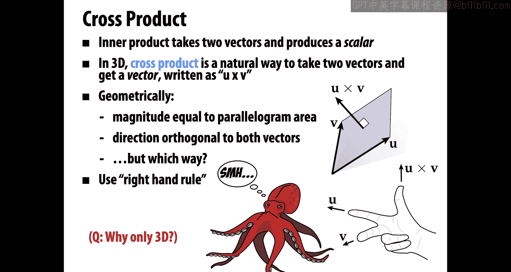

And that's to say that the cross product is the unique vector U crossfi。

That satisfies this relationship that says the square root of the determinant of the matrix with columns U。

 V and U cross v。Is equal to the norm of U times the norm of v times sine fithi。

 such that this determinant is positive and I can take this square root。

Theta here is the angle between U and V， just like in the inner product。

 and debt is the determinant of the three column vectors。This condition， it's not too hard to show。

 uniquely determines a coordinate formula for the cross product。 so again。

 if we're in an orthoormal basis。Then I can write the cross product this way by taking some products and differences of the components of the vectors。

I find this formula hard to remember which components go in which order。

 so there's a little mnemonic that is sometimes used to write down this expression。

 which is to fill out a little3 by 3 matrix where you put the three basis vectors at top E1 E2 E3 and then you compute something that is kind of like a determinant。

No big surprise， given that that's in our definition， right so I do E1。

Times e2 times v3 minus u3 times v2， which means that that quantity goes in the first coordinate。

And similarly， for the other two。As I mentioned before。

 there's a useful abusive notation we often use in 2D， which is to say that U cross V。

Is just the third entry of this。3D expression。It's the magnitude of the vector we'd get if we actually took our 2D plane and put it in 3D。

And did this cross product to find the。Magnitude in the Z direction。Okay。

Another really useful way to understand the cross product and useful way to use it in 3D。

Is to think of it in terms of a quarter rotation。So a simple but useful observation is that a cross product with a unit normal vector n is equivalent to a quarter rotation in the plane with normal n。

So if I have this plane with normal n and I do n cross U。

 that's exactly the same as rotating U around by 90 degrees in plane。Okay， nice little trick。

Slick way to write certain things in your code。So then really simple question。

What is then and cross and cross you。What direction does that vector point？

Okay hopefullype not too hard， you see that N cross N cross U is another 90 degree rotation。

Which means it's a 180 degree rotation of the original vector U。

 which means it's actually equal to minus U。Okay。And another interesting question。

Let's say now I want to rotate the vector in the plane with normal n。

 but this time by an angle other than 90 degrees， this time by some angle theta。How do you do that。

Well， if you were paying attention in your trigonometry class。

 you should be able to look at this picture。With N and U and Ncro U and figure out pretty easily how to find a point that's rotated by theta。

 and I'll let you think about that and leave it in the comments。

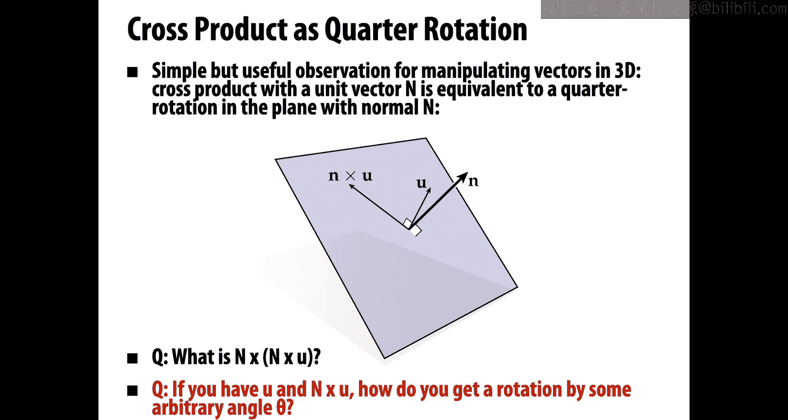

Okay。All right。We also talked last time about how matrices are very useful。

Maybe not so much for understanding things conceptually， but for implementing things in code。

So let's think about how we can represent some of these operations using matrices。

 it's often convenient for instance， to express a dot product。Using a matrix product。

 so if I wanted to represent U dot V。That's no different from saying I write U transpose V。

 I think of both U and V as column vectors。Right， and so then I have really this long。

Flat matrix times this tall skinny matrix。And if I remember the rules for matrix vector multiplication。

 I find that that's equal to the sum from i equals 1 up through n of U I V。

 exactly the same as the dot product。Okay。Really important question。

 what about another inner product？Can I also express some other inner product as。A matrix operation。

Well， let's look at one particular example， remember we said。

There are lots of different inner products， they just have to satisfy a certain set of rules like they have to be symmetric。

They have to be linear in each argument and so forth。Well， here we have an inner product。

Inter product of U and V is now 2 times u1 v1 plus U1 v2 plus U2 v1 plus 3 U2 v2。

Can you think about how you might represent this inner product using matrices？

It can't just be U transpose V anymore because that formula doesn't involve the constants 2 and 3。

 for instance。So how might you write this down with matrices？Okay， maybe not quite as obvious。

But what I'm going to do is build a little， in this case。

 two by two matrix because we're in two dimensions。That has。Encoded in it， all the constants。

 all the coefficients in my expression for the inner product， 2，1，1，3， those four terms。

And then I'm going to do something that looks。Just like what I did before， you transpose V。

 but I'm going to stick this matrix A in the middle。Okay， so I'm going to do u transpose A V。

If I go ahead and multiply this out， okay， let's do A times v first。

And I get U1 u2 times 2 v1 plus v2， v1 plus 3 v2。Okay， now I'm back to an ordinary dot product。

 I multiply this through again and I get to U1 v1 plus U1 v2 plus U2 v1 plus 3 U2 v2。

Exactly the inner product that I wanted。Okay， that's pretty useful question。

 why is the matrix that I got symmetric？If I take the matrix A and。Apply its transpose。

 I again get 2113。Will that be true for any inner product？Why would that be true？Okay。

 think about the question answer in the comments。We can also represent the cross product using a matrix。

So let's say we have a vector U with components U1， U2， U3。

What we're going to do is a little less obvious， we're going to stick this in a three by three matrix now we're in three dimensions instead of two dimensions。

 okay， just a different example。And this matrix has an interesting structure。

 it has the three components of the vector in it。But half of them are negated。

Half of them are negated， and you notice that this matrix now instead of being symmetric。

It's anti symmetric or skekuw symmetric， if I took its transpose。

 I would get the same matrix up to a minus sign。That's kind of interesting。Okay。

 but what does this have to do with a cross product。

 well let's go ahead and see what happens if we multiply U hat by some other vector V。

V with the three components， v1 v2 v3。Okay， so did we get this right。

 does this represent the cross product， well， I claim it does。

 and if you don't believe me and you shouldn't believe me。

 then you should go ahead and multiply it out and see if we get the same coordinate expression as we saw a few slides back。

Okay。Question。If this is a way to represent the cross product。

Then how can we represent the sort of opposite cross product v cross U instead of U cross V？

Without building a new matrix。Okay， well， I've already kind of given you the answer。

 it's useful to notice here that。V cross U is minus u cross v。

So the cross product is kind of a antisymmetric operation， if I exchange the order of the operarans。

 I get minus the result。Why is that true？Well， I can think about it a couple different ways I could think about my right hand rule if I exchange U and V what happens to my thumb。

 I could think about it in terms of my determinate definition if I swap arguments in the determinant what happens to the sign。

Okay， and also， you notice that the matrix we use to represent the cross product is skuw symmetric。

 So if we want to write the cross U， we could either transpose。The matrix u hat。

 or we could just more simply negate the result， we could say v cross U is equal to minus u hat v。

Either way。How about the determinant？The determinant is something that gets a fair bit of discussion in vector calculus and linear algebra。

Do you know what it means geometrically？Well let's start with just the basics， first of all。

 what was the determinant， how do you compute the determinant of a matrix。Okay。

 so if we have a three by three matrix like this one。

Then the answer to how do you compute the determin of the matrix is well？

You apply some algorithm somebody told me once upon a time once in a textbook somewhere。

 somebody said this is the algorithm， so you just go ahead and do it。

Determinant of a as well first you look at the upper left corner and then you remove that rowing column and then you compute the subdeterminant of what remains。

 which you just do by well recursing， essentially you do e times I minus F times H and then you do this once again for the second entry at the top and then you do it again for the third entry at the top right。

And there you go， there's the determinant， it's totally obvious what this means， right。

 it's completely straightforward。No， not at all what the heck does this mean， this is complete。

Jibbberish， right， we have a long string of letters， we did some arithmetic operations。

 why did we do this？What was the point， how is it useful？Okay， so hopefully somebody， when they。

 when they first introduced you the， the determinant gave you some feeling for why this is a useful object。

 but let's。Again， try to understand this from a geometric point of view。So for me。

 I think it's really helpful。To stick with this case， so determineant in three dimensions。

 three by three matrices。And realize。That the determinant of three vectors， U V and W。

Gives me the volume of a little parallel pipebed， a little box。With edges， U， V and W。

How do I convince myself that's true， why should you believe that that's true？

Let's do it one step at a time。So let's say that I first take the cross product of U and V。

We said that by definition， the cross product is the vector whose area is proportional to the。

Paraogram made by U V， the bottom of this box。And whose direction is normal to this parallelogram。

 so normal to the bottom of the box。So now if I。Take the dot product of U Cross V with W。

What am I measuring？I'm measuring the height of the box times the area of the base。And guess what。

 that gives me the volume of this box。Really interesting， by the way。

 I could do this a different way。 I don't have to start with the bottom of the box。

 I could instead say， oh， I'm going to measure the volume by。First getting the area of the left side。

 let's say， so I do v cross W。And then I take the dot product with you。Think。

Multiply by the width sort of， or I could do it another way。 I could do W cross U dotted with V。

 All three of these expressions are just going to give me the volume of this parallel Pi。So。

By doing this， not only do I understand what the determinant means。I have to think， oh。

 why is that the same as my little algorithm from before？Because essentially that's what I was doing。

 I was walking across the top row and doing a dot product with a cross product of the next two rows。

 right？So now I understand not only what does that little formula or algorithm mean。

I actually found that there's this really nice little。Relationship。

 the triple product formula that lets me exchange dot products and cross products in a。

Systematic way。Now you do have to be a little careful here。

What happens if I just switch the order of one of those cross products？

So rather than cycling through UvWW UWUV， let's say that in the first expression。

 I just do V cross U then dotw。What happens then。Okay， well， v cross U is minus u cross v。

So if u cross v do w was the volume of the box， V cross u dow was minus the volume of the box。

And that's why at the top， we said really the determinant encodes the s volume。

 a volume that could be positive or negative， depending on which orientation we pick for the vectors。

Okay。

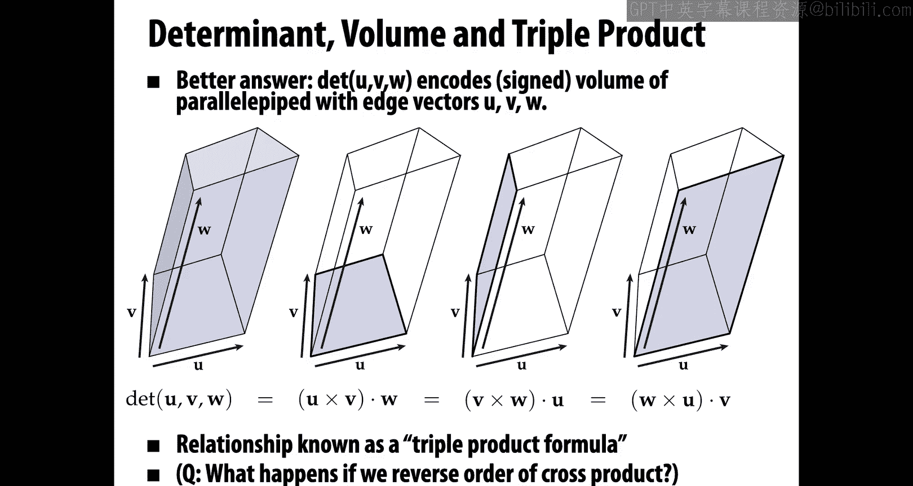

But this definitely gives us a lot more intuition now whenever we want to talk about determinants。

 we know that they have something to do with volume。So here's a natural question。

If I have a matrix A。Okay， so I didn't say before where this matrix comes from。

 but let's say now this matrix A encodes a linear map。F。Then what does the determinant of A mean？

Okay， so we're putting a lot of pieces together here。

Let's go back and first remember how a matrix encodes a linear map。

 what does that mean that a matrix represents a linear map？Okay。So for example。

 let's say I have a linear map F of U that sends any point U in three dimensional space to a new point in three dimensional space。

U1 times A1 plus u2 times A2 plus u3 times a3， where A1 A2a3 are three fixed vectors in three dimensional space。

So I'm taking a linear combination of the A vectors using the components of the U vector。

How do I encode this operation as a matrix？We said this in the last lecture， but let's say it again。

 it's really important。Which matrix encodes the map F。This is pretty easy。

 the A vectors become the columns of the matrix。I put a1 X， A1 y。

 A1 z down the first column and so forth。Why is this the right thing to do Because now a matrix vector multiply？

Gives me my original map if I do a times u1 U2 u3。Then， well you can work it out however you like。

And the result will be this vector。Which is just what we wanted。 U1， A1 plus U2， A2 plus U3， A3。

 so I can think of matrix vector multiplication again as。Taking linear combinations of the columns。

Using the components of the vector I'm multiplying by as the coefficients。

This is generally a really good way to think about matrix vector multiplication。

 it's a really good mental picture。To think about it as the picture you see in the upper right。

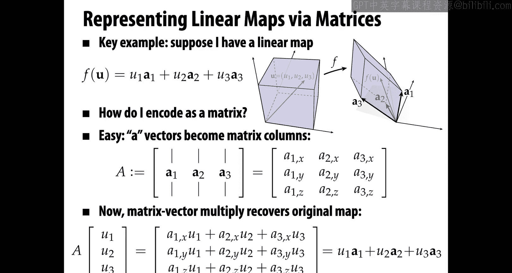

Okay， so let's go back to this question about the determinant of a linear map。

So if a matrix A encodes a linear map F， what does the determinant of that matrix tell you？Well。

 here's the way I like to think about it。I'm going to imagine that I have a little cube of material。

That has length one on each side， a little sugar cube with a corner at the origin。

Okay and the edges go along the three basis directions， E1， E2 E3。

When I apply a linear map to this cube to the edges of my cube。I'm going to get a parallel pipe。

With edges F of V1， F of V2， and F of V3。So because the determinant of the matrix。

Gives us the volume of the parallel Pi。The determinant of the linear map is telling us the change in volume。

We had something that had unit volume1 times1 times 1。

And we got something that has some other volume。Okay。

So determinant is always telling you about the multiplicative change in volume。Other question。

 what is the sign of the determinant tell us in this case？H。

We said that the determinant is really giving us the s volume。

 what does the s tell us in the case of a linear map？Well。

 it's basically telling us whether the orientation was reversed。So。

I could map this cube forward into this parallelogram and then reflect it in a mirror。

And the mirror image would have the same volume， but it would have the opposite sign。Okay。By the way。

 do we really need to talk about matrices in order to talk about determinants of linear maps？

Not really， we don't really need to talk about matrices or coordinates or anything else。

Determinants are a completely geometric concept that we can apply without thinking about coordinates。

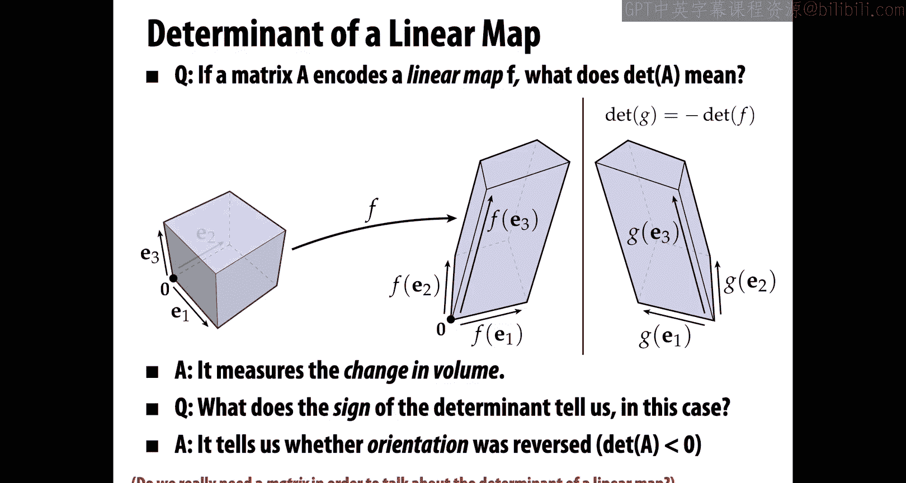

Okay， our other nice discovery when thinking about determinants geometrically were these nice triple product formulas that related cross products and dot products in interesting ways。

These kinds of formulas are super useful for working with and simplifying expressions involving vectors in 3D。

And there are more of them。 So， for instance， there's something called the Jacobbi identity。

 which just involves the cross product。 And that says something similar but different。

 It says that U cross V cross W plus V cross。W cross U plus W cross U cross v is equal to0。

Why is this one true geometrically？Actually， I think this one is really not quite as obvious there is a geometric reason for this。

But it's far more complicated， it has to do with the fact that the altitudes of a triangle meet at a common point。

Yet another triple product is something called LaGrange's identity。

 which says that U cross v cross W is equal to v times u dotw minus w times u do v meaning。

You take the dot product and then you just use that scalar to multiply the vector。Okay。

Can you come up with a geometric interpretation of this identity？I have to imagine that you can。

 I don't know what it is， so I'd be very interested if anybody can draw a picture that explains La Grja's identity。

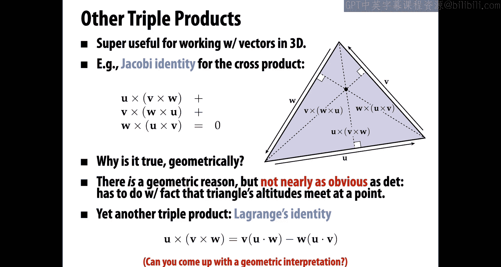

Okay， let's move on to a new topic beyond these basic vector operations。

 which is differential operators， differential operators are basically derivatives that act on vector fields。

Let's pause for at least a moment and ask， why is this useful for computer graphics？

And one reason is that many physical and geometric problems are naturally expressed in terms of relative rates of change。

 in terms of ordinary differential equations， ODEs， or partial differential equations， PDEs。

These tools， differential operators， also provide the foundations for numerical optimization。

 so something that shows up a lot in computer graphics is that you want to find the best solution。

 you want to minimize cost by， for instance following the gradient of some objective or energy function。

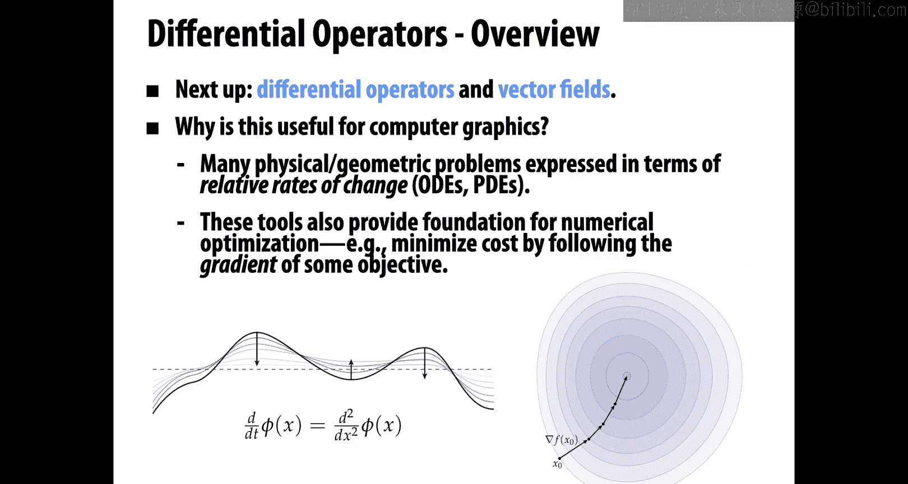

Okay。So let's think a little bit about derivatives， if we want to understand differential operators。

 it's really useful to have a lot of different mental perspectives on what does a derivative mean。

Let's start with the most basic example we have a function on the real line， f from R to R。

What does the derivative F prime of this function mean？Perhaps。The most basic definition。

 one that you might have learned first is。That it gives the slope。

 it gives the rise over run of the function for a short distance。

And this really does lead to our formal definition of the derivative。

Which says we look at how much the function is changing。Over a little distance epsilon。

 so we start at some point x n。Move over to XO plus epsilon， evaluate the function。

 take the difference from the function value at xO， divide by epsilon。

 and then take the limit as epsilon goes to zero。This is a basic definition。

 it's also a really good one to remember whenever you encounter in life。

 something that you don't know how to differentiate。Funnily enough， coming back to this very。

 very basic definition often saves you， often tells you exactly what to do。Okay。

Now we do have to be a little careful in talking about the derivative because some funny things can happen。

 for instance， what if the slope of our function is different？When we walk in the opposite direction。

 when we go in the direction minus epsilon instead of plus epsilon。Right。

 so we can have a situation like this where the quantity。

Expressed by this limit is well defined for epsilon coming from the positive side。

 it's well defined for epsilon coming from the negative side。But those two values don't agree。

And so in this case， we say the function is not differentiable at x not。

 or that it is differentiable if f plus is the same as f minus。Now。

 I will say that thinking about derivatives is often a useful。

Mental model for a lot of the things going on in graphics。

 but you should be aware that a lot of the interesting problems we want to solve and functions we want to deal with are very non-diable in interesting ways and as you develop more sophisticated algorithms。

 you really have to think carefully about how to deal with this non-differiability。

 it is something that comes up。Another important view of the derivative is that it's sort of the best linear approximation of the function。

So you might remember that a smooth function f of x can be expressed as a Taylor series。

 so let's say I have this nice smooth function F here。Then at a point x not。

I can approximate the function while the absolute simplest way I could approximate the function in the vicinity of x n is what？

I could just pretend that the function is constant that whatever value it takes at x not is the value it takes everywhere。

Not the best approximation in the world， but it'll work over a short distance from XO。

If I want to do a little better， I can look at the slope of the function。

 the derivative F prime at x0。And I can say I move up and down according to this slope。

 depending on how far away I move from x， so I add this linear term to my Taylor series approximation。

 f prime at x n times x minus x n。Okay， I've done constant， I've done linear what can I do next Well。

 just keep going up in degree， I do a quadratic term so I say what is the parabola that's the best fit at this point？

I get that from the second derivative。I add a term x minus x not squared。Over to factorial。

Time's the second derivative， and I can keep going to get better and better approximations at least in this local neighborhood。

In general， replacing complicated functions with a linear or sometimes quadratic approximation is a powerful trick that we'll see over and over again in graphics algorithms because it makes computation easier。

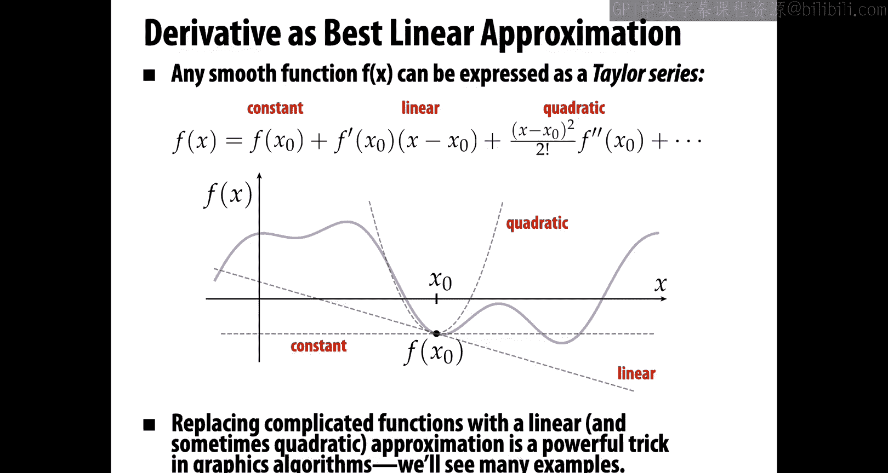

This idea of a best linear approximation also helps get our heads around what the derivative of a multivariable function is。

RightSo if I look at this。Function plotted over the plane R2。

I can again sort of think that at a point， the derivative is roughly speaking the best approximation of the function by a plane。

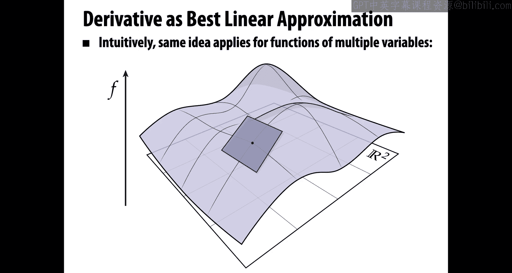

OkaySo how do we think a little more precisely about derivatives for a function that has multiple variables？

And here there's a lot of language to digest once you get into multivariable functions。

 there are lots of different notions of derivatives and it can take a while to get a feel for okay。

 which derivative means what and should be used in what scenario。

So perhaps the most basic starting point is to think about the directional derivative because we'll be able to easily connect it to the usual one dimensional derivative。

So let's imagine that we add just one additional parameter to our function。

 so F is now a function not just of x， but of x1 and x2。 again， I can think of this as a。

Function that I plot over the plane， I have sort of a height value over every point of the plane。

How do I define the directional derivative well I can take a slice through the function along some line in the plane？

So at a point x not， I pick a direction U。I consider the plane containing。

The direction U and the vertical direction， I slice through the graph of the function and what do I get。

 well， I get this curve， this black curve。That curve。

Looks just like the curve that we've been looking at for defining the one dimensional derivative。

And so the directional derivative along the direction u of the function F。

Is just the usual derivative。D sub u of f at x n is， hey， we can use our limit formula again。

 the limit as epsilon goes to0 of f of x n plus epsilon u minus f of x n divided by epsilon。

So we just want to take a little step along U in the U direction。Subtract the value。

Of F at the original point。And see how quickly we're changing。

The thing that makes this directional derivative interesting is that we can take the derivative in any direction so I could pick some other。

Direction V in the plane， I could go through the same process to get the directional derivative。

In the direction V of F。With all the usual caveats of the function needing to be differentiable。Okay。

So at this point， it sounds like we have quite a lot of information we kind of need to know about the change in the function F along all possible directions。

 U。But actually， we can distill this down into some。

Basic information that captures everything about how the function is changing。

And that's what's given to us by the gradient。Before getting into the details。

 the gradient is basically something that tells us the directional derivative in all possible directions if we use it the right way。

Another intuitive way of looking at the gradient is to say if we have a multivariable function F of x。

 and now I've switched to saying that bold X is a collection of coordinates， right。

 it's a point in Rn。Well， then the gradient grad f of x assigns a vector to each point。

 so if this is my multivariable function， f of bold x。Then at each point。

 I can think of the gradient as a vector that looks like this。And just by looking at this picture。

 you get the sense that the gradient kind of points in the direction of quickest increase。

 if we think of the dark blue colors as being small values in the function and the light blue or white colors being large values in the function。

 then the arrows are kind of pointing uphill。And that's a really important interpretation of the gradient。

By the way， just as a piece of language， this symbol that we use for the gradient is not really called grad。

 it's actually got its own name， it's called NaBla。

 so you might say the gradient Nala F of x assigns a vector at each point。Okay。

So that's a nice intuitive picture， but which vectors exactly？Or。

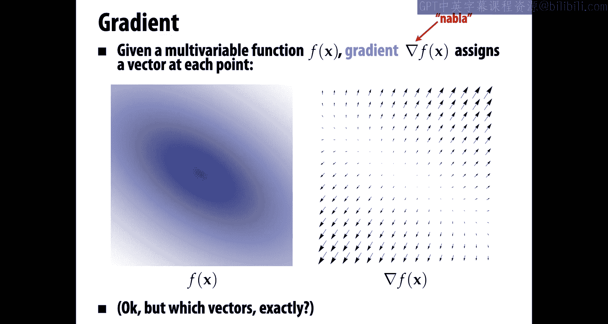

Giving us the gradient。Well。One way we can think about this is to write it out in coordinates。

 the most familiar definition of the gradient， perhaps is to just list out all the partial derivatives。

Okay， so we can imagine that。All but one of the coordinates of our function are held constant。

Then we have an ordinary function of one variable， we can take the derivative with respect to that variable。

 and that gives us the entries of the gradient。I think a lot simpler way to think about this is， hey。

 we already understand the directional derivative， right。

 the directional derivative gives us the one dimensional derivative in some direction。

So what is the gradient？It's just the list of the directional derivatives。

Along all the coordinate axes。X1， x2， x3， and so on。Okay。

So this is a pretty good definition of the gradient， pretty easy to understand。In general。

 there are two problems with always thinking about the gradient this way。One is that it ignores。

The very important role of the inner product on the definition of the gradient。

 and we'll talk about this。A bit more later。The other thing that's annoying about thinking about the gradient this way is it only works for vectors in RN。

 for finite dimensional vectors。Before we said we want to think about little arrows。

 vectors in our end， but we also want to think about vectors that are functions。

 that are signals that are continuous。Okay。So。If I think about a continuous function。

 what does it now mean to take the directional derivative along all possible directions。

 what are all directions in which I can change a function？ItGet pretty complicated。

 so we're going to want a richer。Picture a better definition of the gradient。

 but this is a good one for functions of n variables。Okay。Very common way to calculate the gradient。

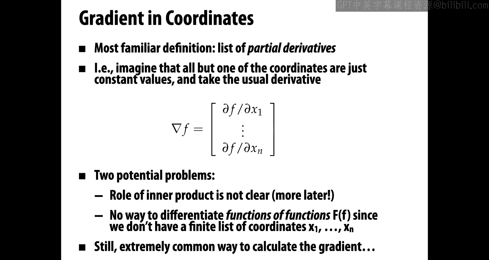

To make this a little more concrete， let's just do a little example。

 let's say we have a very simple function。F of bold x is equal to x1 squared plus x2 squared。

So we get this kind of bowl shaped function。What is the partial derivative of F along the x1 direction。

 or again， the ideas that we hold？X2 fixed， we imagine that it's just a constant and we differentiate f with respect to x1。

 so since x2 is constant， that term drops away and we're left with 2 x1 plus 0 or just 2 x1。

Similarly。The derivative of F in the x2 direction is but2 x2。Okay， hopefully not too hard。

And so we combine these to get our gradient。Grad f of x is equal to 2 x1，2x2。

 which we could also just write as 2 times bold x。

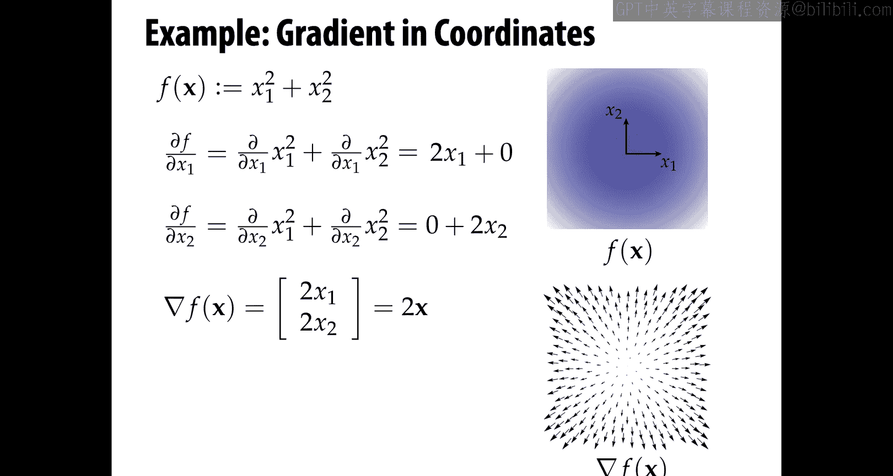

Okay。Another way to think about the gradient is to go back to this picture of the best linear approximation。

So just like in the 1D case， we can pick some point x not and say we'd like a reasonable approximation of the function near this point。

The simplest approximation would be to say I'm going to pretend that the function is constant everywhere and is equal to the value f of x not。

A slightly better approximation would be to say。Well。

 let's look at kind of the slope of the function。And change our estimate for what the function looks like based on how far we've gone away from the center point x。

In the multidimensional case， we can write this as f of x is approximately f of x n plus the inner product of the gradient of f at x n with the vector x minus x。

Okay， let's think a little bit about why this makes sense。So starting at XNO。

We can see pretty easily that this term gets。Bigger if we move in the direction of the gradient。

Right， let's say that。X minus x0 is equal to grad F， so we're moving uphill as quickly as possible。

Well， then because this is an inner product， we know product grad F is greater than 0。

 greater than or equal to zero。Okay， so we're getting bigger if we move in the gradient direction。

We're getting smaller if we move in the opposite direction in the direction minus Nabav。And also。

 it won't change at all if we move orthogonal to the gradient。

So if we just move back and forth along the mountain side， but don't actually go uphill or downhill。

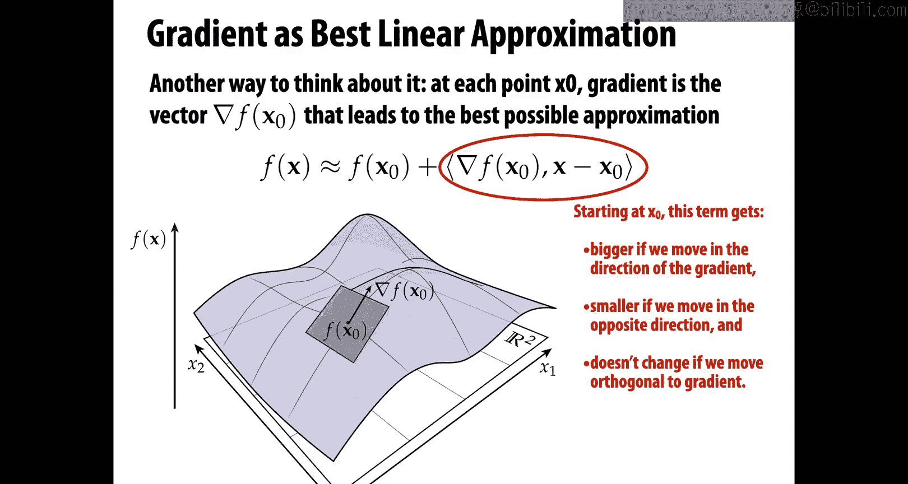

And。This is really an important perspective to think of the gradient as taking us uphill。So， this is。

Our third important picture of the gradient is。That it's giving us the direction of steepest ascent。

Meaning if we're standing at some point on the map， what direction should we travel to increase。

Our altitude or increase the value of our function as quickly as possible。

This viewpoint leads directly to algorithms for optimization that are commonly used in graphics。

So we want to maximize or minimize some function to get the best possible result。

 so what do we do we start at some initial guess x not， we evaluate the gradient at that point。

 we take a little step in the gradient direction， and repeat， evaluate the gradient again。

 take a step again， and so forth。

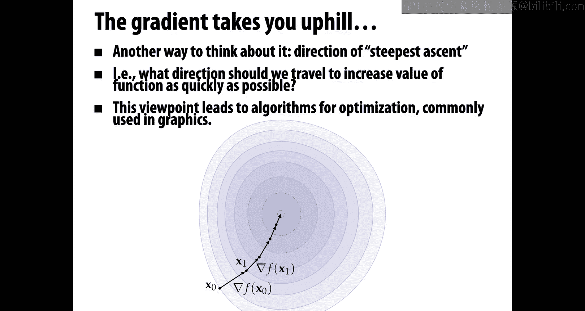

Okay。Let's come back now to the relationship between the gradient and the directional derivative At the beginning。

 I promised that the gradient would provide the directional derivative in all possible directions。

 We don't need to keep track of all this information about how the function is changing along every possible direction。

So how can we really make that precise？Well。We can actually define the gradient in the following way。

We can say that， at each point， x。The gradient is the unique vector Nala F of x， such that。

The inner product of Nabla F with U。Is equal to。The directional derivative of F along the direction。

 U。For all you。Okay。In other words， if we know the gradient。

And we want to know the change in some direction U， we just take the inner product with a gradient。

That's it。So the gradient contains all the information we need to know about how the function is changing。

As long as the function is differentiable。So as in one dimension。

This isn't going to work out if the function is changing at different rates in。Opposite directions。

So for instance， with this function， this is a function where there are points that are not differentiable where the gradient does not have a definition that works out this way。

 So the top of this little pyramid， for instance， I have many different possible linear approximations of the function。

That work well for sort of different sides of this pyramid。

You might also notice at this moment that the definition of the gradient really seems to depend on the choice of inner product。

Isn't that interesting？But that's a point we'll come back to a little later。

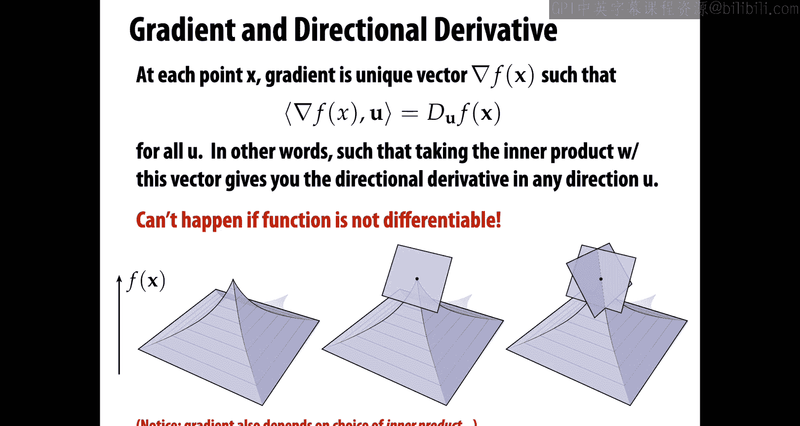

Right now， I want to look at another concrete example of taking the gradient of a multi variable function。

 but we're going to do this in a slightly different way。 Okay， so let's consider the function F。

 which is equal to the。Dot product of two vectors U and V。Here expressed using matrices。

What is the gradient of F with respect to you， how would you approach this problem？

This is extremely common in graphics that you have some function expressed in terms of matrix operations and you want to differentiate that function with respect to one of the operaands。

Well， one thing we could do if we're not comfortable taking derivatives involving matrix expressions is to just go back and write everything out in ordinary coordinates。

 so I could say u transpose V is equal to the sum from I equals 1 through n of UI V。Okay。

 then to get the gradient， what do I do， I take all the partial derivatives。

And since the derivative of a sum is equal to the sum of the derivatives。

 I can pull the derivative inside。And I noticed that well。

The derivative of UIVI with respect to UK is going to be0 unless I and K are the same。

If they are the same， then the result is just VK。Okay。So if I imagine doing that for each of the UK。

 I find that the gradient is。Nabla F equals V1 through Vn。

 so the gradient with respect to U is just the list of all the V components。

But at this point I think，ooh， that's interesting。 I could have written that a lot more simply I could have just written。

The gradient of u transpose V。With respect to you。Is equal to V。

That's nice because it's not so different from how I ordinarily differentiate。Scalar。

Functions right if I had asked you to just differentiate X Y with respect to X。

 you would have immediately told me the answer is Y。Very simple。Okay， and so this is a really。

 really useful skill to be able to differentiate。Expressions involving matrices。In the end。

 a lot of the expressions you get are going to look just like ordinary derivatives。So for instance。

 if I have two vectors x and y in Rn， and I have a symmetric matrix A。

Then the derivative of x transpose y with respect to x is equal to y as we've just seen。

And that looks like the derivative of xy with respect to x is equal to y。

If I have the gradient of x transpose x with respect to x， I get2 x well。

 that's not so different from。The derivative of x squared with respect to x is equal to 2x and so on。

And by the way， you shouldn't just believe me， you shouldn't just take this on faith。

It's very worthwhile to at least once in your life sit down。And work out these derivatives。

 you could go back to components， you could write everything out in partial derivatives。

 and you will find that these simple expressions can be used to differentiate in terms of matrices。

Beyond this little list here， there's an excellent resource。

 the Matrix cookbook that gives all sorts of nice matrix derivatives。

 but definitely at least once in your life。You should go through the trouble of working these out to convince yourself that they're really true。

And then once you've done that， you should forget about coordinates forever。

 you should never write your matrices out in coordinates again， it's a huge pain in the butt。Okay。

Hopefully what you're getting a sense of is that if you already know how to differentiate ordinary functions。

Differentiating more complicated objects actually doesn't look so different。

There's a lot of similar patterns that emerge， there's a lot of similar mechanics that you go through。

And of course， you still have to be careful。But you shouldn't be intimidated by trying to take derivatives of richer。

 more interesting objects。Like signals and functions。

 like the kinds of things that are going to show up in graphics。

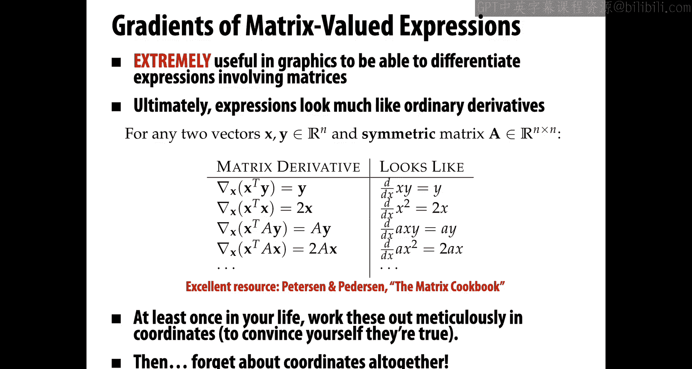

So let's actually take a look at a really， really interesting example。

Let's try taking the gradient of a function of another function。What does that mean？

So you can imagine， for instance。That little F is a function on the real line like sine or cosine or whatever you like。

And big F is a function that takes any。Function little F and assigns it a score or a value。Okay。

 and we want to know what is the gradient of big F with respect to little F？

What is the change I should make in the function little F to increase the value of big F as quickly as possible？

This is a perfectly meaningful question， it's one that comes up in optimization problems all the time。

But our standard tools aren't going to work anymore， we can't just take partial derivatives because。

We don't have a finite list of coordinates to work with anymore。

When we were looking at vectors in RN， these little arrows。

 we just had a list of coordinates and we could take partial derivatives of each of those。

What do we do in this case？Well， what we can do。Is go back to this other definition of the gradient。

That says。The gradient Nablla F。Is the unique function such that if I take the inner product with you。

I get the directional derivative of F along U。Okay。We still have to answer another question。

 which is what is the directional derivative of a function of a function？Okay。

 this starts to sound complicated， but don't freak out， as I said before。

 whenever you encounter a tricky looking derivative。

A good strategy is to just go back to the good old fashioned definition of the derivative in terms of limits。

We've changed the types of the objects here a little bit。

 but otherwise it looks pretty much the same so we're going to say。

The directional derivative of big F。Along the direction， you。At the point little F。

Is equal to the limit as epsilon goes to0 of big f of little f plus epsilon u minus big f of little F divided by epsilon。

Okay。So those are all the tools you need， that's really all you need to know， but this。

Whole strategy is going to become a lot clearer if we have a concrete example。

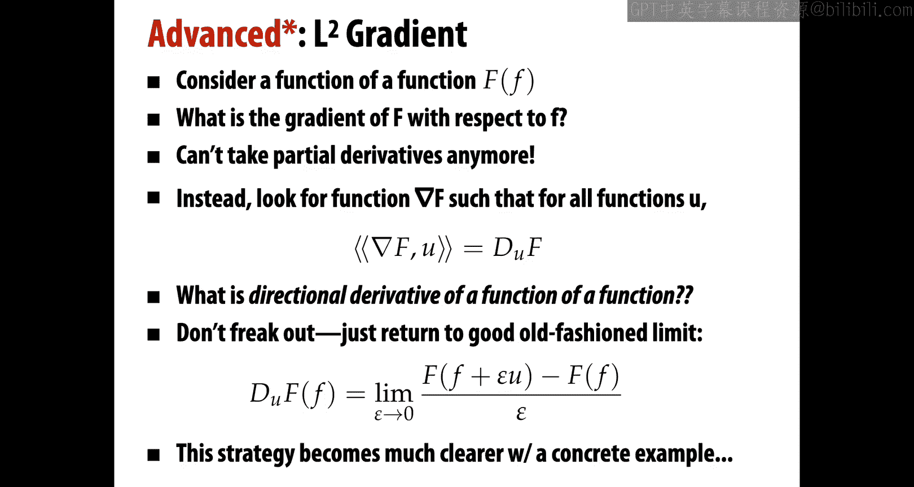

So let's first try to reason about what's going on here visually。

 try to get some intuition for what we mean by this derivative。So let's consider a concrete function。

 big F of little F。Which is equal to the L2 inner product of little F and little G。For functions。

 little F and little G on the unit interval。So you can imagine， for instance。

 that little F is this squiggly blue function and little G is this bumpy orange function and their L2 inner product is measuring again how well these two functions line up。

It's the integral over the unit interval of their product。Okay。

 it's important to pause here for a moment and realize。

This is not so different from the example we saw just a few slides ago where we were considering。

X transpose y and taking the gradient with respect to X。

And there we found the gradient was equal to why it was pretty simple。So likewise。

 this time I'm going to claim。The gradient of big F is just little G。

If we take the gradient of big F with respect to little F。

 the little F falls away and we're left with just little G。That's a reasonable hypothesis。

 doesn't make sense intuitively。So if we look at this picture and think about what we're measuring。

How can we increase the L2 inner product with G as quickly as possible？

What change should we make to the function little F so that it lines up。

With little G a little bit more。Well， okay， now we really draw on our intuition about the inner product from thinking about little arrows。

 the inner product measures how well to little arrows are aligned or how well two functions are aligned。

So what is the function that is best aligned with little G？Well， it's just little G。

 just like the vector， the arrow aligned with a little arrow is that arrow itself。

So the quickest way to increase。The inner product of little F with little G。

Is to just add a little bit of G to F。Right。Good question I think about。

 can you work this solution out formally？I bet you can。

I bet if you go ahead and plug in the definition of the gradient and the definition of the directional derivative。

 you will very quickly see that this really is the gradient of the function capital F。

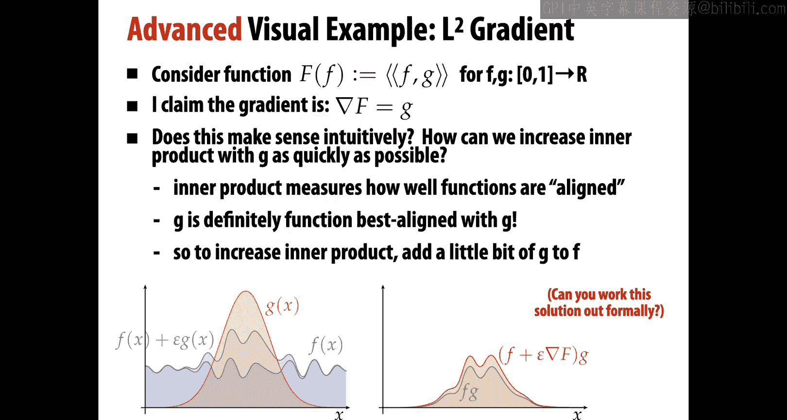

Okay to see how this works out， let's consider a similar example， I have a different function。

 big F of little F， which is just the square of the L2 norm of little F4 functions F on the unit interval。

How do we figure out the gradient well， at each point， if not。And for each argument， if not。

 we want the function。Nabla capital F， such that for all functions U。

 the L2 inner product of Nabla F with U is equal to the directional derivative。

 It's equal to the limit as epsilon goes to 0 of moving F not a little bit in the direction U。

 adding a little bit of the function U to f not。Applying capital F， subtracting。

The original value at F n and dividing by epsilon。Okay。

If we take the first term in the numerator and just plug in the definition of。The function big F。

Then， we get。The L2 norm of f n plus epsilon u squared is equal to the L2 norm of f n squared plus epsilon squared times the L2 norm of u squared plus 2 epsilon times the L2 inner product of f n and U。

If we now do the same thing for the second term in the denominator。

 take the difference divide by epsilon。Our limit starts looking like this。

 So now we're saying the directional derivative looks like the limit as epson goes to 0 of。

Epsilon times the squared L2 norm of u plus 2 times the L2 inner product of f n with U。

And think about this， what happens as epsilon goes to zero where that first term vanishes。

 the second term remains and we just get2 times the L2 in product of F n and U。Okay。

 so that gives us the right side of our gradient equation。And then we look at it again and we say。

 okay， well， then the only solution to this equation。

The only way for this to hold for all functions U。Is if。Nabla F is equal to 2。Little F not。Okay。

 does that sound complicated， you， did you lose me here well？

Even if you didn't catch every little calculation， what you notice at the end is that the way we differentiate functions of functions really doesn't look different at all。

From the way we just differentiate ordinary variables。

The derivative of x squared with respect to x is2 x， the derivative of。

Norm of F squared with respect to F is just 2 f。I won't promise it's always this easy， in fact。

 this is the whole subject of functional analysis。And variational calculus。Sometimes it gets hairy。

 but the basic concepts are there， the basic concepts and starting points are the same。

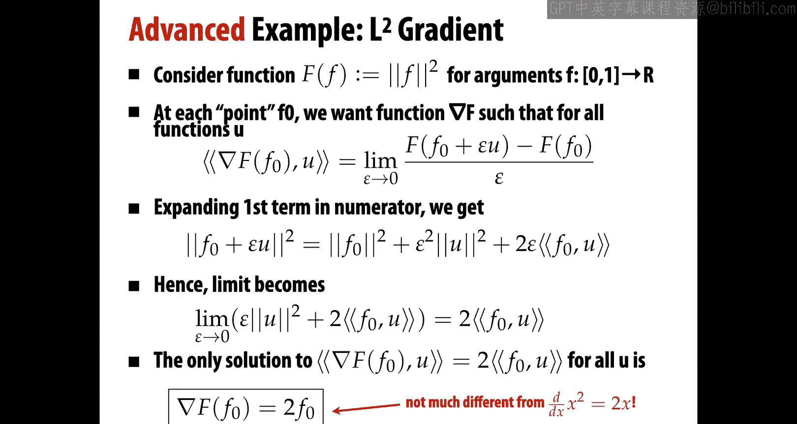

And this is really the key idea that once you get the hang of taking the gradient of ordinary functions。

 it's often superficially not much harder to work with more exotic objects。

 like matrices and functions of functions and so forth。

And so often when you're thinking about graphics algorithms。

 when you're trying to come up with interesting new graphics algorithms。

You use these simpler analogies to get a sense of what's going on with these more complicated objects and that can be very。

 very powerful。In fact， that's something we will do as we work our way through this course。Okay。

So let's talk about another kind of object that's central to multivariable calculus。

 which is vector fields。So the gradient or the gradient field， if you like。

 was our first example of a vector field。It assigned a vector to each point in space。So for instance。

 we could think of a vector field on the plane。As a map from R2 to R2， for each point in R2。

 we get a vector in R2。For example， we saw。The gradient Field， Nabla F。

Of x y is equal to 2 x2 y for the function F of xy is equal to x squared plus y squared。Okay。

Question。Calculus is all about rates of change。How do we measure change in a vector field？

Do you remember from your multivariable class what the notion of a derivative of a vector field is？

Well， actually there are。Multiple answers。There are two basic derivatives for vector fields。

So let's say we have this vector field x。Then one notion of derivative is the divergence。Okay。

 and I've drawn here in dark blue values that are very negative。

 I've drawn in white values that are very positive。So intuitively。

What does the divergence measure about a vector field。

 it's very important to understand these things intuitively before getting to the definitions。

So the divergence measures basically how much the field is shrinking or expanding。

 how much it looks like a sink or a source where water is flowing out or flowing in。

If the magnitude is very large， that means there's a lot going on。

 there's a lot of shrinking or expanding， and the sign tells us， well。

 which of the two things is it doing， is it shrinking or is it expanding？Okay。

 another thing we could do is if we have a vector field y like this one。

We could measure its change by looking at the curl a different quantity。And what do you notice here。

 What is the intuitive description of what the curl is measuring， Again。

 bright white values are large positive values。 dark blue values are large negative values。

 So what is the curl measuring about this vector field。Well。

 hopefully it's not too hard to see that it's kind of measuring how much this field is spinning。

We kind of have a vortex in the upper left。And we have a vortex in the bottom right。

 those are two quickly spinning parts of the field。

But there's a difference in the upper left it's spinning counterclockwise。

 in the bottom right it's spinning clockwise， so that's why we have the two different signs。Okay。

So divergence measures not surprisingly， how much the field is diverging， the curl measures。

 not surprisingly， how curly is it？

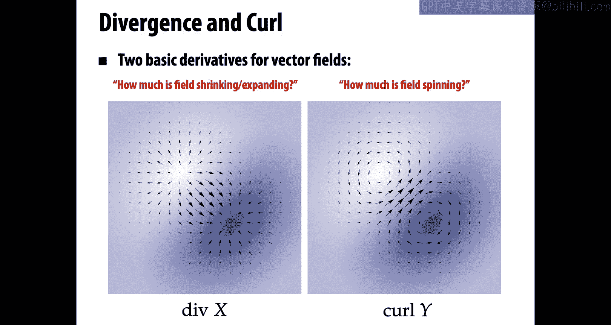

A little more precisely。We often write the divergence as NaBla dot X。

And this notation suggests or kind of reminds us what the definition of the divergence might be。So。

If we think of Nabla as。The vector of partial derivatives kind of informally， right。

 It's just a list of。Partial derivatives along all the different coordinate directions。

And we think of x as being a vector of scalar functions， meaning。It just has。

Each component of the vector at each point。Then what does NaBla dot X look like。

 well we sum over all the coordinates。Each partial derivative being applied to each coordinate function。

We take the derivative of the first coordinate function along the first direction。

Add that to the derivative of the second coordinate function along the second direction and so on。

Concrete example。Consider the vector field x of UVV is equal to cosine U sine v。Okay。

 I've plotted it in the bottom left。The divergence of this field is then well let's just work it out。

 Nabla dot x is。Partial derivative with respect to u of cos U plus partial derivative with respect to v of sine v。

Do you remember how to evaluate this expression， what is that equal？Okay。

 hopefullype you remember that the derivative of cosine is minus sine。

 the derivative of sine is cosine。So we get minus signine u plus cosine v。

Now a really important question。What kind of quantity is this at every point？

We started out with a vector field X， we took its divergence， what did we get as the output？Well。

Sine of U is a scalar value at every point。 It's a scalar function。

 cos of V is also a scalar value at every point。 It's a scalar function。

So we have the sum of two scalar functions we get a scalar function and that's what I've plotted in the bottom right。

 that's the divergence of this vector field X， and you can see again that where it's spreading out。

 it has large positive values， where it's converging in， it has large negative values。

 the dark blue values。

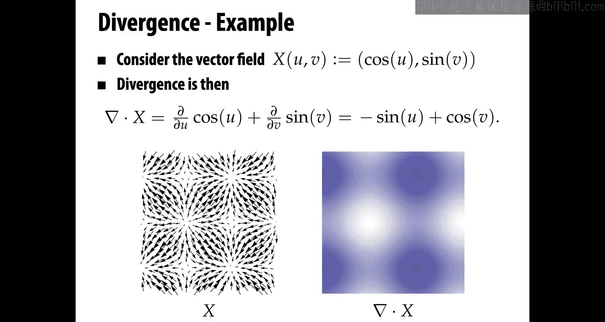

Okay。Have a curl。Well， we can write curl also with Nabla。

 we can write it as Nala cross X with a cross product。And this again。

 suggests a coordinate definition for curl this time。

We'll think of NaBla as a vector of just three derivatives。

 we'll just stick to three dimensions because。That's where the cross product is most naturally defined。

And we'll think of the vector field x as three coordinate functions。

 the three components of the vector at each point in space。Okay。So then the curl is， well。

 now we just have to go and remember， what was the coordinate expression for the cross product？Okay。

 it's really not so bad， there it is。So that's the curl。Maybe to get a little intuition。

 let's just consider the 2D curl。Where we said， you know。

 how do we think about a cross product in 2D， well we imagine we have vectors in plane。

 the cross product gives us a vector sticking out of the plane。

 so we just pull this last component out of the expression。Nabla cross x。

 the curl of x is equal to the partial derivative of the second coordinate function along the first coordinate direction。

Minus the partial derivative of the first coordinate function along the second coordinate direction。

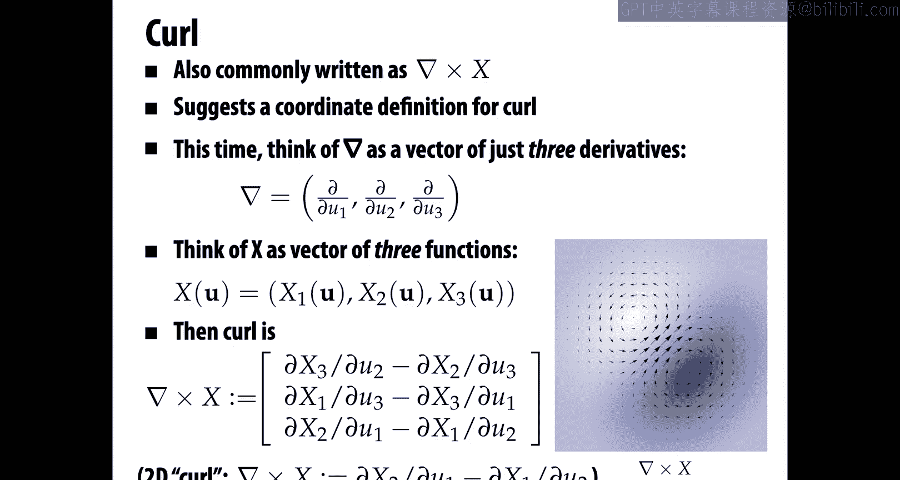

Interesting。Okay， so in particular， let's consider the example x of UVv is minus sine v， cosine U。

 I've plotted it in the bottom left。These swirling vortices。

The 2D curl is then what now let's just apply that little formula。

Nab lac cross x is the partial derivative of cosine U along the U direction。

 minus the partial derivative of minus sine v along the V direction。Can you work that out okay。

 just like we did before， derivative of cosine is minus sine derivative of sine is。

Cosine and we get minus sign u plus cosine v。And I've plotted this result。

 the curl of this vector field in the bottom right。Now， does that function look familiar？

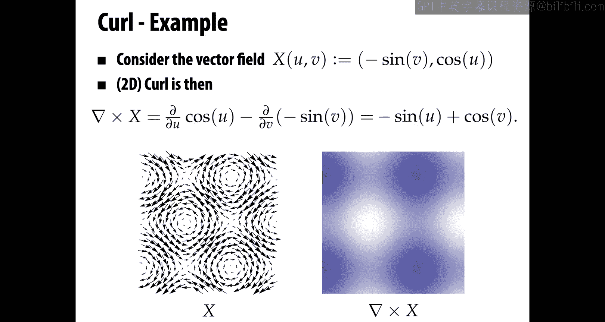

Wow。Do you notice anything about the relationship between curl and divergence？

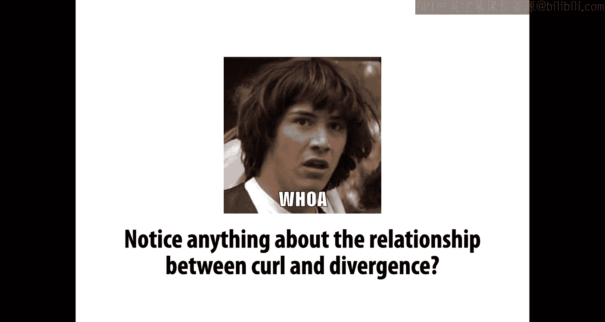

Hopefully， you do。Hopefully what you are kind of picking up on is that the divergence of x is the same as the curl of the 90 degree rotation of x。

 meaning if I have this vector field x， and I take each little arrow and I rotate it by 90 degrees at each point I get a vector field like this。

So where before I had sources and sinks， now I have spinning vortices。And， in fact。

The curl of this rotated field is no different from the divergence of the original field。

So hopefully this gives you a little bit of intuition about the relationship between kernel and divergence and the fact that they're not really completely different concepts。

They're kind of complementary concepts。Also in graphics。

 if you start playing these kinds of games with vector fields of saying， oh， I can kind of。

Decompose it and write it in terms of curl and divergence and so forth。

 you start to build really nice algorithms for fluid simulation。

 for understanding the different components of how fluid moves around in a volume and how to efficiently calculate that。

Question，Can you come up with an analogous relationship between curl and divergence in three dimensions？

What do you think。What kinds of quantities are you working with。

 what happens when you apply curl and divergence？Do you have an analogous relationship？

Let me know in the comments。

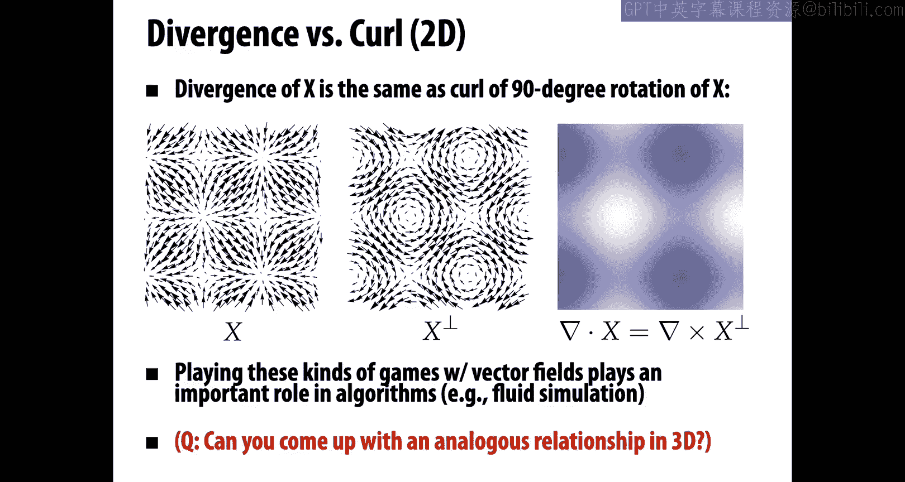

Okay， so just to keep us hooked into computer graphics a little bit。

 here's a really cool example of a fluid simulation from a fairly recent computer graphics paper。

And the idea is that by just changing which variables we're solving for。

By transforming things using curl and divergence， we get completely different results。

 so in one case you might use the fluid velocity U in the other case。

 you use the so called stream function p Psi。And you can see that just this mathematically。

 fairly simple change really changes the behavior of the simulation。So on the right。

You don't get very realistic motion。 It doesn't really look like the fluid is interacting with the air On the left。

 you get this beautiful interaction of the fluid mixing with the air and creating bubbles and so forth I won't try to explain how this all works。

 but you should go check out this paper if you're interested。

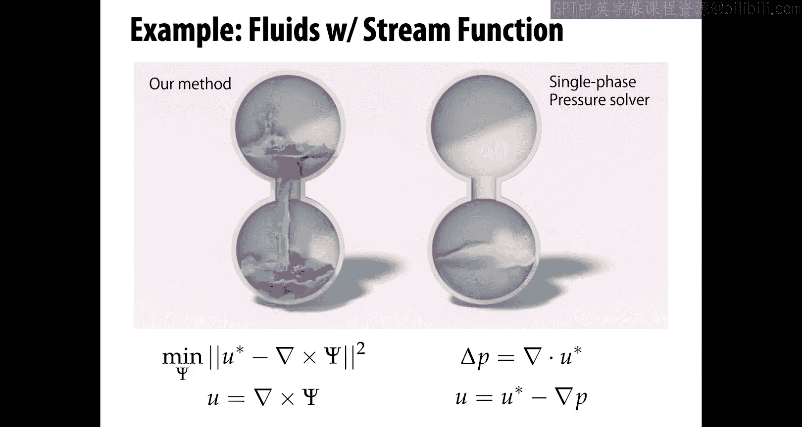

Okay， so there's one more extremely important operator from multivariable calculus that we haven't talked about yet。

 and that's the Laloian。

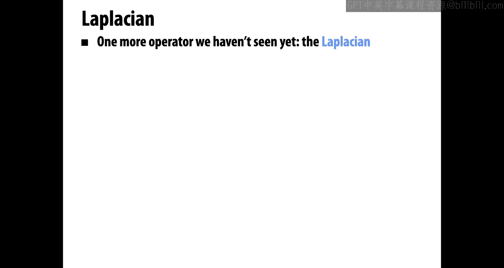

This is unbelievably important for graphics， it shows up across geometry。

 across rendering simulation， imaging everywhere。Why is Laplian so important？Well， for one thing。

 it really provides the starting point for talking about the Fourier transform。

 we talked a little bit in our last lecture about decomposing functions into constituent frequencies。

And the Laloian and its generalizations are going to allow us to do this kind of frequency domain signal processing in all sorts of different contexts and images in geometry and so forth。

It's also the basic starting point for modeling all sorts of physical processes like the fluid simulation we saw in the previous slide。

So it lets us talk about heat flow， it lets us talk about waves propagating through medium and so forth。

And it encodes all sorts of rich information about the geometry。

So just by inspecting the Laplace operator or its generalization called the Laplace Beltromi operator。

 we learn all sorts of things about shape， we can use this for searching for shapes and databases and all sorts of cool stuff。

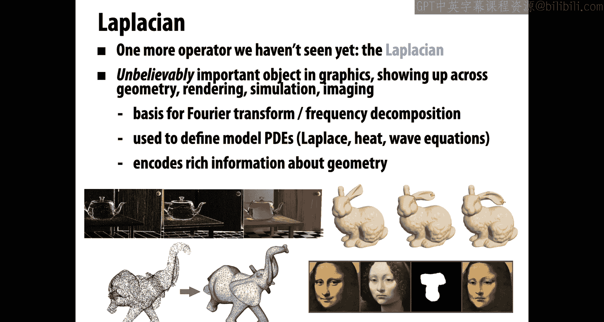

What does the Lalasian mean？I think this is something that takes a little time to get your head around after you've been working with it for a while。

 it's the most obvious thing in the world， but at first。What is it all about？Okay。

 well let's go back to one dimension and think about an ordinary function F of x。

And ask about its second derivative， So we have this nice oscillating function， F of x。

What would you know if I told you that a point of a function had a second derivative that was less than zero that was negative？

What does it mean to have a negative second derivative？

Maybe the way you talked about this in your calculus classes you said， well。

 then the function is concave down。Right， something like this。

And if the second derivative is positive， well， the opposite thing happens。

 it's concave up or what I would call convex。Likewise， from multivari function。

TheLaloian gives some notion of the curvature of the function。

Losely speaking is the function concave down or concave up。

 so here we see a function of two variables at the top of the peak the Laplian is negative。

 at the bottom of the valley the lapplian is positive。By the way。

 if you're interested in really deeply understanding the Laloian。

 I have a whole lecture that talks about many different perspectives on the Lafaian starting from the basics。

 which you can find at the link here。Okay。So。The Lapian does have many different definitions。

 many different ways to understand it。One thing we can say about the little plotian is that it takes a scalar function as input and produces a scalar function as output。

 and this is a linear operation。If I take the Lalosian of the sum of two functions。

 I get the sum of the Lalosians of the two functions。

If I scale a function by a constant and then take the laploian。

 that's the same as taking the laploian and then scaling the result by the same constant。

It's usually or at least in our class， is going to be denoted by the Greek capital Delta。

Some people also like to write the Laplaceian using Nabla squared。

But we're going to reserve this symbol for another operator called the Hessian。

So there are lots of different starting points for the Lalaian We can write it using。

The operators we just talked about divergence and gradient。

 so Laloian of F is the divergence of the gradient of F。

We can also write it as the sum of the second partial derivative。

 so the Lalosian of a function f on RN is the sum from I equals1 up through n of the second derivative of F along the ifF coordinate direction。

We can write the LaPaian as the gradient of deerschlet energy。

 so this is an example of a function of a function and taking the gradient as we did earlier。

So we can say the Laplaceian of f is equal to minus the gradient with respect to F of the function1 norm gradient squared。

 where this norm is the L2 norm。So this is a function that measures the overall smoothness of a function。

And we're saying， how do we change the function to make it smoother or less smooth as quickly as possible？

Okay， and we can also understand the Lalaian by analogy。

 I think it's really useful to think about the Lalaian in terms of a laplaian on a grid or on a graph。

Here it becomes really。Apparently that the Lalosian is measuring the deviation from an average value。

 So if I'm on a regular grid， what does the Lalotsian look like。

 it looks like I sum up my four neighboring values and I subtract four times the value at the center。

 or if I divide that all through by four that's like saying I take the average of my neighbors and I subtract my value。

You can also come up with formulas like this on， let's say triangle meshes。

 but they get a little more complicated。And on and on， we can connect the Laplaceian to other ideas。

 for instance， in geometry， talking about the quickest way to minimize the area of a surface and lots of other things。

Okay， so let's give the most basic definition， which is just to write the Laloian in coordinates。

 the Laloian of F is the sum of all the second partial derivatives of the function。Concrete example。

 let's consider a function f of x1 and x2， which is equal to cosine of 3x1 plus sine of 3x2。

 I've plotted it on the right。Okay， so let's go ahead and evaluate this we have。

The second partial derivative of F with respect to x1 is well we hold x2 fixed and we take two derivatives。

So here I've just plugged in the definition of F。Okay。

 and I noticed that the second term vanishes because it doesn't depend on x1 at all。

The first derivative of cosine 3x1 is minus3 sine 3x1， if I take the second derivative。

 I get minus9 cosine 3 x1。And similarly， the second derivative of F along the second coordinate direction is minus9 times sine of 3 x。

2。Not supposed to be anything really interesting about this example。

 we're just working through an example to see how you might evaluate the Laplace。

So in the end we get that the Laloian of f is equal to minus 9 times cosine 3x1 plus sine of 3x2。

 and I've plotted it in the bottom and what you notice here is well first of all we started with a scalar function。

 we got a scalar function。Okay， that makes sense。Second。

 you notice that places that were kind of negatively curved in the original function become positively curved in the new function and vice versa。

Okay。So in fact， the new function is just minus9 times the original function。That's interesting。

 does that always happen？Is it always true that the Lalosian of a function is just a constant times that function？

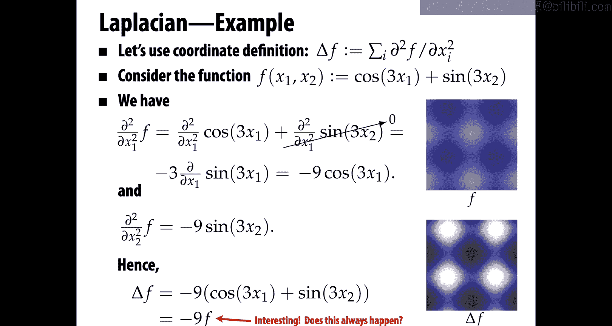

Okay， let me know in the comments。So our final differential operator for the day is the Hessian。

 the Hessian contains all the information about the second derivatives of a function。

 and it's going to help us approximate complicated functions by a few simple terms。By the way。

 the Hessian is also， for this reason， a key component in optimization algorithms。

 if you want to develop and think about optimization algorithms that converge really fast。

 the Hessian is going to play an important role。Okay， so。To get our head around this。

 let's think again about our Taylor series。Which for a one dimensional function。

 we said we could start building by considering the constant approximation by then considering the best linear approximation。

 by then considering the best quadratic approximation by the parabola the best approximates our function and so on。

How do we build up the same kind of approximation for multivariable functions？Well。

 we already talked about doing the best linear approximation using the gradient。

 right we said the function at a point x n can be approximated in a local neighborhood by f of x n。

 the constant value plus the inner product of the gradient of f with x minus x n。

The Hessian is going to give us the next term， it's going to give us the quadratic part。

 and that's also a reasonable way to just think about the Hesian。

 if somebody's talking about the Hesian， what does it mean， oh。

 it's kind of the best quadratic approximation in a local neighborhood。

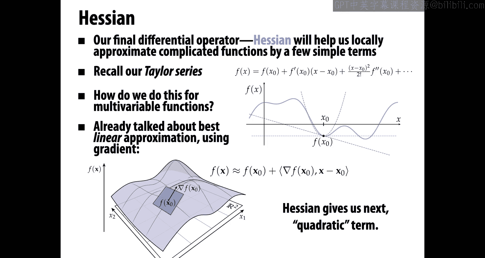

Okay， how do we define the Hessian more explicitly， well， first of all。

 we're going to use the symbol Nabla squared to denote the hessian。

And just like we thought of a gradient as the thing that gives us partial derivatives of the function。

The Hessian is the thing that's going to give us partial derivatives of the gradient。

So more precisely， what I mean by that is if I take the hessian of the function F and apply it to the。

Vctor or direction， U。Then I get the directional derivative of the gradient in the direction to U。

Okay。If we have a function F from Rn to R， a function of n variables。

 then we can be more explicit and just write it as a matrix。The Hessian Nabla squared F is equal2。

A matrix where each entry is the partial derivative of F。Aong。Two coordinate directions。

 one corresponding to the row and the other corresponding to the column。By the way。

An important thing about the Hessian， useful fact is the hessian is always symmetric。

If I take the transpose of this matrix， I get the same matrix。Why， why is that true。

Good little thing to remember about multivariable calculus if you don't know the answer immediately。

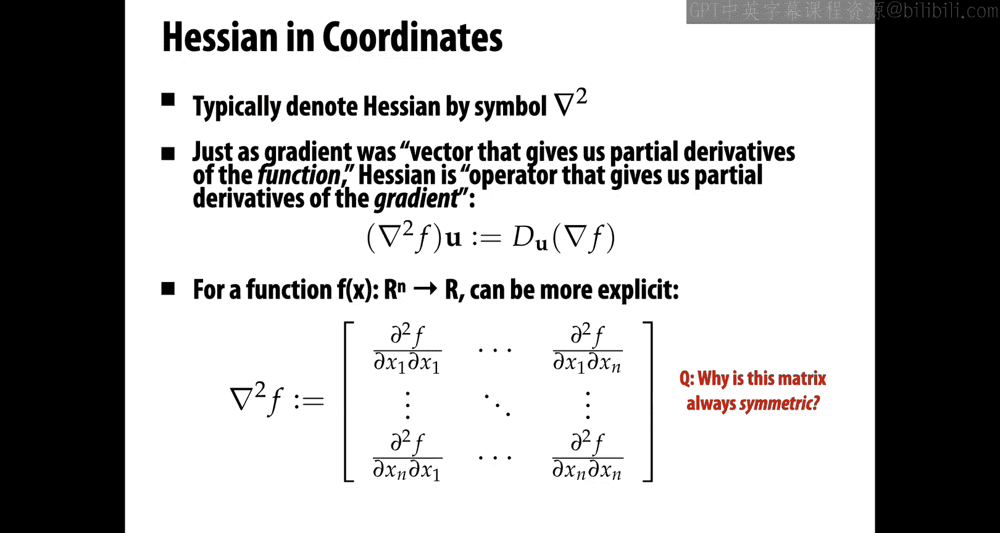

Okay， so using the Hessian， we can now write a second order approximation of any smooth multivariable function f of x around some point x not。

In particular， we'll say that f of x is equal to f at x n the constant value plus the gradient of f at x inner product with the displacement vector x minus x n。

 plus the hessian applied to this displacement， inner product with the displacement divided by 2。

So what we've done is taken our constant and linear part。

 which give our kind of best fit plane and augmented it with this quadratic term。

 which looks like a bowl or maybe like a saddle。We can write this more simply by collecting the coefficient。

 so we have a constant C， a vector B and a matrix A。

And we can then write our tailor approximation in matrix form as F of u。

Where U is equal to this displacement vector。Is approximately1 u transpose A U plus B transpose U plus C。

And later on we're going to see how this expansion is very useful for optimization， in fact。

 that's a time where we'll really need to be able to take derivatives of expressions involving matrices。

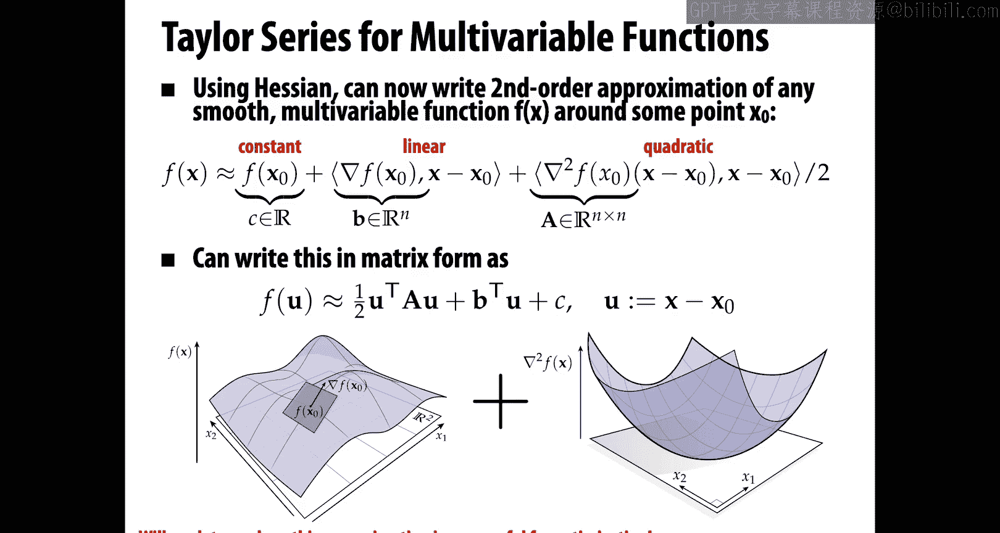

All right， so that's it for our math review next time we're going to really dive into rasterization and start talking about how to draw triangles onto the screen really really fast that might seem like a weird thing to do。

 but it's a very interesting and difficult problem that leads us to a deep understanding of how modern graphics hardware really works All right Talk to you next time。

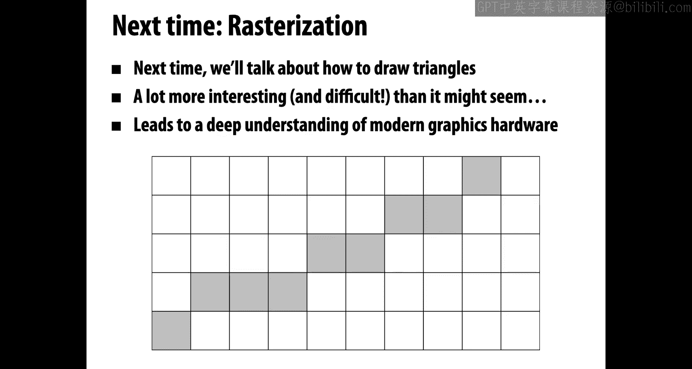