# CMU《计算机图形学｜CMU 15-462  COMPUTER GRAPHICS 2021》中英字幕 p06 -06-Lecture 05_ Spatial Transformations -BV1H3NBemE5E_p6-

Welcome back to Comp Gs， so today we're going to talk about a very basic part of computer graphics。

 which is applying transformations to objects in space。

So when we talk about a spatial transformation， what we really mean is basically any function that assigns a new location to each point。

 so we could think of that， for instance as a function F that takes points in RN， two points in RN。

Today， we'll focus specifically on transformations of space like rotations and scaling and so forth that can be encoded by linear maps。

 and we'll see that that is actually a pretty rich class of maps that lets us do the kinds of things we see going on at the bottom here。

So where do linear transformation show up in computer graphics， the answer is all over the place。

 we use them to position or deform objects in space to move the camera around in an animation to animate objects over time。

They are related to projecting 3D objects onto 2D images。

 we use them to map 2D textures onto the 3D objects。

 we use them to project shadows of 3D objects onto other 3D objects and so on。

 there's no shortage of places where linear transformations are needed。

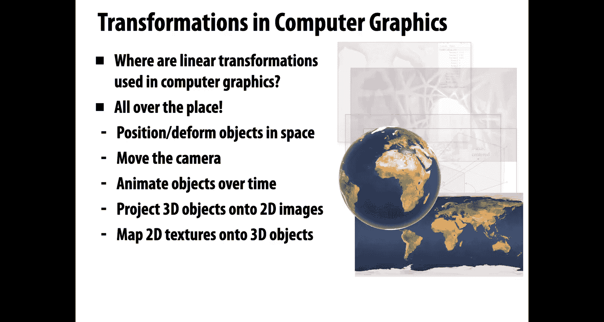

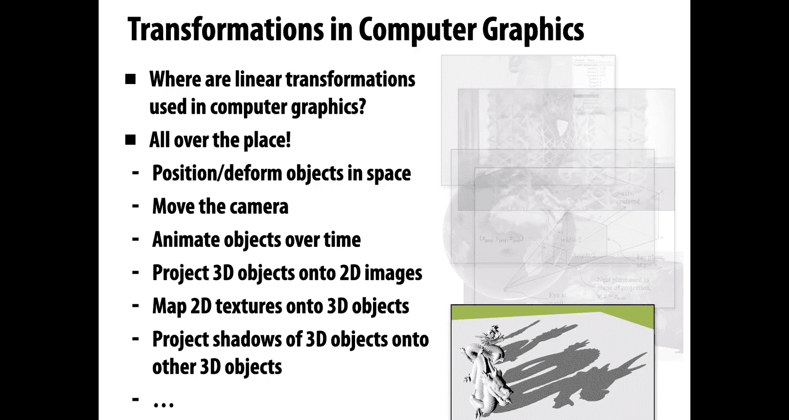

In the context of the rasterization pipeline that we've been developing。

Linear transformations actually show up all over the place。

 maybe the most basic thing is when we have the geometry at the beginning。

 we need to transform it or position it somehow in space before we go through the rest of the rasterization process。

Okay。So。We said that we are interested in linear transformations， let's just review for a moment。

 what does it mean for a map F from RN to RN to be linear。And if you remember。

 we had a couple different ways to look at this。 One before getting to the formal definition was to say。

 well， what does it mean geometrically or visually。So geometrically。

 a linear map is one that maps lines to lines， so every line becomes a new line。

And also preserves the origin。That's very important。 the origin remains fixed。

OkayAn equivalent definition， algebraic definition。

Is that we can think of a linear map as one that preserves our basic vector space operations of addition and scaling。

So for instance， if I add two vectors and then apply the map。To their sum。

I should if the map is linear， get the same thing if I first apply the map to each of the summans and then add them together。

And likewise， for scaling。Okay。So why do we care about linear transformations。

 why are we making this restriction to just linear functions？Well， for one thing。

 linear maps are really cheap to apply。They're usually easy to solve for as well。

 so we can kind of go the other direction almost as easily as we can apply them。

A big reason why linear transformations are used in a graphics pipeline is that the composition of linear transformations is linear。

For instance， if I have a bunch of different matrices。

 each of which represents a linear transformation。Then I can just multiply them all together。

To bake all of those different transformations into a single transformation matrix。

This is really nice because it gives us a uniform representation of lots of different kinds of transformations。

 which simplifies graphics algorithms， it simplifies graphic systems like GPs and APIs。

 and it simplifies our thinking about linear transformations in a lot of ways。For instance。

 it's going to let us get a really clear picture of what kinds of linear transformations we can work with。

 that we can piece together to transform our object or our space。

So let's take a look at some common examples。If you just watch these little movies。

without writing down any equations or formulas。What would you call each of these types of transformations？

CanCan you put a name to each of these pictures。Okay， well。

 I would say the one on the far left looks like。A translation。The one。

Next to the right looks like a rotation。The one。Next looks like a scaling。And finally。

 we have a shear。Right。How did I know that？ How did you know that。

 We didn't figure this out by inspecting a formula or noticing that a matrix satisfies a certain property。

But there's something about looking at this picture that lets our brain know what kind of transformation each of these is。

How could you have possibly figured that out by just looking at these pictures？

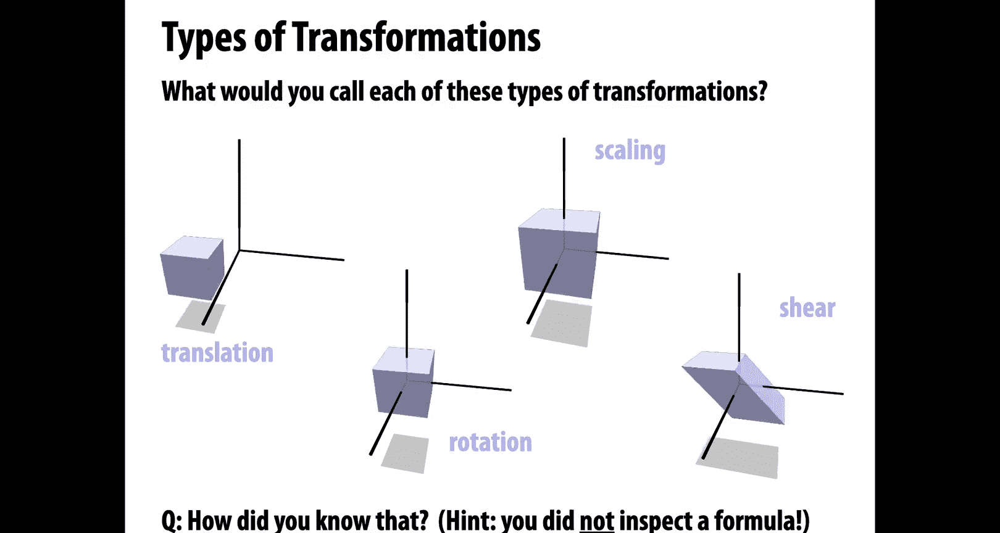

Well， the answer essentially is that transformations at their core are not defined by formulas or matrix properties or anything like that。

 but each type of transformation is really determined by the invariance it preserves。

So as the transformation is applied， what quantity or quantities remain fixed？

So for each type of transformation that we just saw， we could think about， okay。

 what's not changing when we apply that transformation？For instance。

 we said we almost defined linear transformations as those that preserve straight lines and the origin。

Likewise， we could say a translation is a transformation that preserves the differences between any two pair of points。

We could say that scaling is something that preserves lines through the origin。

And the direction of vectors， and so forth。And so in some sense， this is really how your brain knows。

What kind of transformation you're looking at when you look at a picture？

It knows that something about the object is remaining unchanged。

So let's look at this in a little bit more detail for rotations。

 how can we define what a rotation is？Right without getting too technical。Well。

 rotations fundamentally are defined by just three basic properties first。

 they keep the origin fixed。So when we talk about a rotation， especially today。

 we mean a rotation about the origin。A rotation will also preserve distances。

 so for any two points in space， the distance between those two points is going to be preserved by a rotation。

And finally， very important， a rotation also preserves orientation。

So if we have text that we're reading from left to right and we apply a rotation。

 we can still read that text from left to right， it doesn't look flipped around or mirrored。Okay。

The first two of these properties together already imply that rotations are linear。

It's not too hard to convince yourself that if you preserve the origin and you preserve the distance between any two points。

 well， then a line must always get mapped to a line。

And we'll have a lot more to say about rotations in the next lecture。

 today we're just going to cover the very basics。So if we want to compute with rotations。

 we will have to write out formulas， we will have to give them some kind of representation。

So what does this look like well， one thing we know about rotations。

 the only thing we know so far is that they preserve distances and the origin。

And so a 2D rotation by an angle theta is going to map each point x。

To a point which we'll call f of x or f sub theta of x。On the circle of radius norm X。

How do we know that， well the norm of the vector has to be preserved。

 the distance from the origin to the vector has to be preserved。

So x is going to end up on the same circle。Right。Okay。Next question。

Where does x go if we have an x at 10， Where does x go if we rotate it by an angle theta in the counterclockwise direction？

And what I mean is， how would you write this out？In sort of a trigoometric expression。

What function would you use。Okay， well， hopefully you remember。

That if I go an angle theta around the circle。I get to cosine theta， sine theta。In fact， it's really。

 really important to remember that these words cosine and sine， cosine theta sine theta。

All they actually mean is the X coordinate on the circle。

Add an angle theta and the Y coordinate on a circle。Add an angle theta。

I think it's really common to mentally imagine that cosine and sine are these oscillatory functions。

They go up and down on the real axis， much， much better to always remember that cosine and ssine are just the x and y coordinates on the circle。

Okay。So with that knowledge in hand。What would you say about the point x equals01 if I apply a rotation by theta of that point。

 where does it end up？While there are a lot of different ways we could write this。

 one is to say it ends up at cosine theta plus pi over 2 and sine theta plus pi over 2。Why， well。

 because we started out at an angle pi over 2。That  point。01。And then we added a further angle theta。

And。We can also simplify this by noticing。That the。X component of our second point。

Looks like minus y component of our first point and the y component of our second point。

Looks like the X component of our first point。So always a useful trick if I want to take a vector in 2D and rotate it by 90 degrees。

 I swap the components and negate the first one。 Why does that work？Well。

 because now the dot product between the two vectors is zero， that means I made a 90 degree rotation。

 they're orthogonal。Right。Okay， so we can write this more simply as minus sine theta， cosine theta。

All right， interesting， but what if we want to rotate a general vector x equals x1 x2？

What happens if I rotate that by theta？Well， let's think about it this way。

 I can always take any vector X。And decompose it into the two basis vectors。

 I can write a vector x1 x2 as x1 times 10。Plus， x2 times 01。

And because I know already how to rotate the basis vectors。

We just did that on the previous slide and。I know that rotation is a linear map。

Then all I have to do is apply that rotation20，1 and 10， and I get。F of x is x1 times cosine theta。

 sine theta plus x2 times minus sine theta， cosine theta。Okay， so can we summarize this somehow。

 well， how would we represent this 2D rotation function using a matrix？

I now want a 2 by 2 matrix so that if I hit the vector x1 x2 with that matrix。

 I get a rotation by theta。Okay， so hopefully you remember that。

If I want to do a matrix vector multiply， what I do is I take a linear combination of the columns using the entries of the vector as the coefficients。

 so x1 times the first column plus x2 times the second column。

And so I can write a 2D rotation as a matrix， cosine theta， minus sine theta， sine theta。

 cosine theta。Okay， very famous formula that's not hard at all to derive。

What about in three dimensions， how do we work with rotations， So as I said。

 we're going to talk a lot more about rotations in our next lecture。

 rotations are an extremely rich subject， especially once we get to 3D。

 but for now we can at least think about rotating around a single axis。So let's say， for instance。

I'm in three dimensions。And I want to perform a rotation by an angle theta around the x3 axis。

 the new axis。What do you think that matrix representation would look like？Well。

 the key idea is that to rotate around an axis， I want to keep that axis fixed。

 I don't want to change the axis at all。So we're just going to apply the same transformation of x1 and x2 that we did in two dimensions。

And keep x3 fixed。In other words， we can build a matrix that looks exactly like our 2D matrix。

 but we've added a row and the column on the right hand side that look like they come from the identity matrix。

The things that are just going to preserve x1。Okay。

And we can do this for the other axes as well if I want to rotate around x1。

I have a matrix that has cosines and signs in the entries。

And the rows and columns corresponding to the x2 and x3， if I want to do it around x2。

I put those entries in rows and columns for x1 and x3。Okay。

So those give us some pretty basic rotations。Really important fact about rotations。

 important and useful thing that comes up all the time is that the inverse of a rotation can be expressed using the transpose。

Okay。If you don't believe me， that's great， let's see it happen。

So the first thing to realize is that a rotation is going to map the standard basis。

100010001 into some new ortho theormal basis， E1 E2 E3。How do we build a matrix that does that， Well。

 we just stick those basis vectors in the columns of our matrix， which I'll call R。

So now if I apply r to 100， I'm just getting the first column， 010。

 I'm getting the second column and so on。The transpose of this matrix is then the matrix R transpose that has the basis vectors。

 the new basis vectors as roses， so E1 transpose， E2 transpose E3 transpose。

What happens if we multiply these together？Right so we can write out all the products。

So we have inner products of pairs of these orthogonal bases。

And I think it's really helpful to just replace these symbols with the actual drawings right so now we have our three basis vectors and we're asking in each entry what's their inner product。

 how much do they line up？Well， we noticed that on the off diagonals。They're always perpendicular。

 we have two different basis directions， and so their inner products are zero。And along the diagonal。

 we have two copies of the same basis vectors， and so we get ones。Along the diagonal。In other words。

 we get the identity matrix。So。R transpose r is equal to the identity， or equivalently。

Our transpose is our inverse， the thing that turned our into the identity was our transpose。

So that's a really useful fact now is it the case that every matrix？Whose transpose is its inverse。

 describes a rotation。Is that true。Well， remember that rotations have to preserve three things。

 they preserve the origin， they preserve the distance between pairs of points。

 and they preserve orientation。So text that was read left to right。Remains left to right。

So is that always going to be true， well， let's take a look at this matrix， Q is equal to minus1，0。

01。This matrix does satisfy the relationship at the top， so if I do Q transpose times  Q。

It's really easy， I'm just squaring the diagonal elements， I get minus1 squared 001。

 which is equal to the identity。Does this matrix Q represent a rotation？And if not， why not？Well。

 you just have to think for a moment about what happens to some shape or object if I apply Q to all the points in that object。

So if we apply it to this image on the right， well， what you notice is it gets flipped around。

 the x coordinate got flipped。 The y coordinate remains where it is。

 So this matrix actually describes a reflection rather than a rotation， something that。

Fails to preserve orientation， but in all other ways behaves like a rotation。

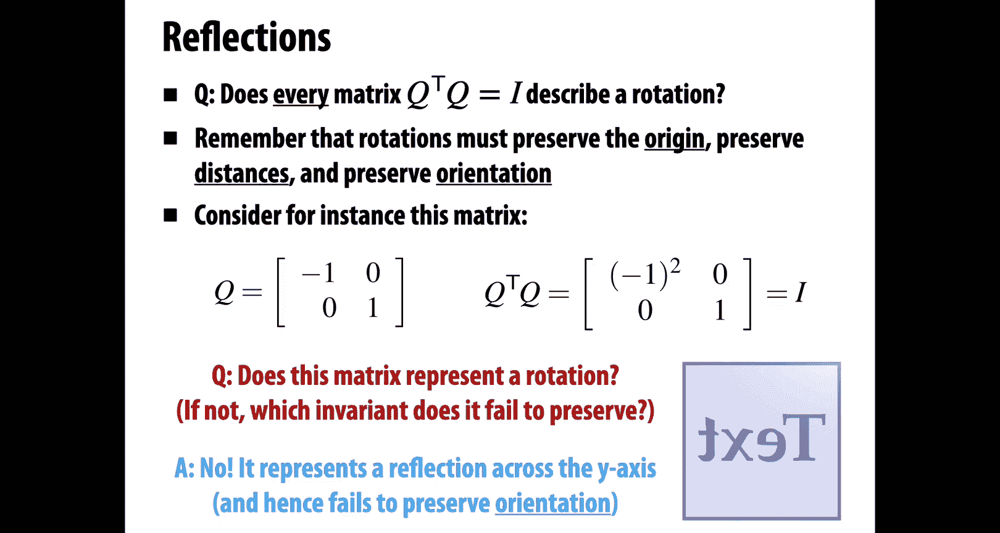

So in general， transformations that just preserve distances and the origin are called orthogonal transformations。

And orthogonal transformations are in one to one correspondence with matrices Q。

Whose transpose is their inverse。Rtations additionally。Preserve orientation。

So we can say that the determinant of the matrix is positive。And reflections， reverse orientation。

 so their determinant is negative。So rotations and reflections really split the set of orthogonal transformations into two pieces。

Let's look at a different basic transformation which is scaling。

 so what does scaling do well each vector U gets mapped to a scalar multiple。For instance。

 we could write this as a function F that takes a vector u as input and produces A U as output where A is a real number。

What is the basic invariant of scaling？Well， it preserves the direction of all vectors。

You might remember we said a vector fundamentally encodes two pieces of information， a direction。

 and a magnitude。Rotations changed directions while preserving magnitude。

Scaling preserves directions while changing magnitude。

So the way we can see this is true is that if we toss out the magnitude。

 if we divide the vector by its norm。Then we get the same vector。At the beginning and at the end。

Question。Is scaling a linear transformation？So I would say the answer is yes。

 but if you really want to be convinced we should look at the two properties of a linear function。

 so first， let's think about addition。If I have two vectors， U and V。And I add them together。

And then I scale them by a factor of A。Well， I could distribute this A across the sum and get A U plus A V。

Right， and that is the same as what I'll get if I。Independently scale U and V。

And then add them together。Okay， so that checks out。What about scar multiplication？

So if I have a vector U。And I scale it by a factor B。And then I apply my scaling map。

Then I'm going to get A B U。Which of course， is the same as B A U。Okay。

And that's what I would have gotten if I had first。Applied the scaling to the vector U。

 and then multiplied by the constant A。Okay， so everything checks out。

 scaling is indeed a linear transformation。How do we represent scaling as a matrix， So for instance。

 let's say we want to scale a vector u with components u1 U2 U3 by a factor A。

How do we represent this operation as a matrix？Well， it's pretty straightforward。

 we can just build a diagonal matrix D with the number A all along the diagonal。Okay。

So now if we multiply D by the column vector u1， u2， u3。We're going to get A， U1， U2， U3。

 which is the same as just a times the vector U。Okay， so here's another question。

 what happens if a is negative？In particular， what happens if we multiply by a equal to negative 1？

Specifically。Is that going to give us a reflection？1 sounds like we're flipping things over。

Is that going to give us a rotation？Or is it going to do something else entirely？

So think about that for a second。Okay， so I would say that for a equals negative 1。

I could think about this as。A sequence of reflections， for instance， in 2D。

If I have this negative scaling matrix minus100 minus1。

 I can actually write that as a product of two matrices，1001。

 which just changes the x coordinate and 100 minus1， which just changes the y coordinate。

So if I apply that to some shape， I'm going to flip the x coordinate and I'm going to flip the Y coordinate。

And since each of those reflections reversed the orientation。

I reverse the orientation and then I reversed it back。The orientation is preserved。

And length distances didn't change， I preserve the origin， so it looks like actually。

 in this case a negative scaling was a rotation。I just rotated that box 180 degrees。

That's kind of surprising。 Well， what about in 3D， is it the same thing？

So let's say I do a scaling again by negative 1。I'm going to flip all three。Components， if I like。

 I can think of that as a sequence of three operations， Fex， flip Y， flip Z in whatever order I like。

Okay so I do that to a 3D object， flip X， flip Y， flip Z。And when I get done。

 something surprising happens in this case， the text is backwards， it looks mirrored。

W did that happen Well in 3D， this negation is actually an odd number of reflections。

 We have three reflections。So we reverse orientation。We restore it， and then we reverse it again。

 so overall orientation is reversed。Okay。This is a little bit surprising and counterintuitive when you first start working with two and three dimensional vectors that just negating the vector。

Is a rotation in even dimensions and a reflection in odd dimensions。Okay。

We can also think about scaling each axis by a different amount。

 no reason we have to scale all three components by the same number。

So we could have a non uniform scaling that looks like this。F of U1， U2， U3 is equal to A U1， B， U2。

 C U3，4，3 numbers， A， B， and C。Easy question。What's the matrix representation of this operation？

Well what we're going to do is just go ahead and put a B and C on the diagonal so if we multiply now by the column vector U1 U2 U3 we get as desired。

 A U1， B U2， C U3。Okay。So that lets us do a non uniform scaling along the three standard axes。

 but what if we want to scale along some other axes？In general。

 we might want to stretch something out along some arbitrary direction。So here's an idea。

What we could do is we could say let's first rotate to the new axes to the new coordinate system where we want to do the stretching。

Then apply a diagonal scaling like we just did。And then rotate back to the original axes。

 the original coordinate system。And here， by the way， I've written that rotating back as R transpose。

 right， so you should remember that。The transpose of a rotation is the same as the inverse。

 if I do R transpose， I'm reversing that first rotation。Okay， so that looks something like this。

I take my cube， I rotate it， I stretch along the standard axes， and then I rotate back。

 and I get a very different effect。Then if I just stretch along the original axes。

Something else you can notice here is that the overall transformation is represented now by a symmetric matrix。

So we could call the composition of those operations A。

 which is equal to r transpose times d times R。Why is that symmetric， well。

 if I transpose the matrix A？Then what I should do is transpose all the factors and write them in the reverse order。

So I'll get again r transpose times d transpose times R， but since d is a diagonal matrix。

 d transpose is the same as D。Okay。So， that's interesting。

A non uniform scaling along some set of axes is represented by symmetric matrix。

Do all symmetric matrices represent non uniform scaling for some choice of？Axies。Well。

 surprisingly enough， the answer is yes。There's this beautiful theorem called the spectral theorem。

That says a symmetric matrix， so matrix satisfying a equals a transpose will always have ortho the normalmal eigenvectors。

 E1 through E， and real eigenvalues lambda 1 through lambda n。

So you may remember what does that mean eigenvectors and eigenvalues， it means。

The Es are vectors such that if I hit them with A。I just get the same vector back again。

 scaled by a factor lambda subbi。Okay。So we can write this same relationship rather than writing that out once for each of the eigenvectors and eigenvalues。

 we could write it as a matrix equation AR equals RD。Where are。

Is a matrix whose columns are the eigenvectors E1 through EN。

And D is a diagonal matrix with the eigenvalues along the diagonal。

 and you can check that that expression is the same as the one in the box。Okay。Equivalently。

 we could move。R to the right hand side and say that A is equal to R d R transpose。Right。

 so in other words。Every symmetric matrix， indeed performs a non uniform scaling along some set of orthogonal axes。

This is really nice because it gives us a geometric interpretation to symmetric matrices When I see a symmetric matrix I can think ah I know what that's doing All it's doing is going into some coordinate system and doing a nonunform scaling。

Okay。By the way， if a is positive definite， meaning if all the eigenvalues are positive。

Then that just means we're doing a positive scaling along every axis。

 so we're not flipping anything around。All right。Now。

 one last kind of basic linear transformation we'll look at is a shear。So what is a shear， A shear。

 It's a bit of a funny one， a shear。Is going to displace each point x。In some given direction， you。

And the amount by which it's going to displace it。Is equal to its distance。

 the distance of x along a fixed vector v。Okay， so the further x is in the direction V。

 the more we displace it in the direction U。We can write that explicitly by saying F sub v of x is equal to x。

 the original point， plus a displacement。Which is the inner product of V with x。

 how far along V is x？Times you。Question。Is this a linear transformation？I said it was。

 but do you believe it based on the formula？Well。Yeah。

 one way to see this is that we can represent it as a matrix。Which is I plus UV transpose。

If I apply i+ UVv transpoposed to a vector x， what's going to happen？Well。

 the first factor I is going to give me a copy of X。

V transpose x is going to give me the inner product of v with x。

 and then I'm going to multiply that by U。Okay。So because I can represent this operation as a matrix vector。

Multiply， I know it must be a linear transformation。Here's a little example。

 let's say that I want to displace the point。In the direction。

 cosine T for some changing parameter t maybe T is time。

And I'm going to displace it according to its distance in the vertical direction。Okay。

 so the bigger the y component is the more I move it along that direction U。

The size of the direction U has to do with what time it is。

So that's going to give me a matrix A sub v， which is equal to 1 cosine t0，010001。

 so you can see it doesn't do all that much， it looks like an identity matrix except well。

 it does a little shear。As we see on the right。All right。So from these basic transformations。

 rotation， reflection， scaling， and shear， we can now build up composite transformations by using matrix multiplication。

We know how to represent each of these transformations， these linear transformations as matrices。

 we want to put them together， we just multiply them， so for instance。

 let's say I have a rotation around the X axis， a rotation around the y axis。

 and some kind of interesting non-unform scaling。Then I can put them together by saying a at any time t is the ex rotationt at time t times the y rotation at times t times the scale at time t and by the way。

 something to always remember is the last matrix gets applied first。Right。

 because we're going to take the matrix on the left and hit。The vector on the right。

 So you can really kind of see that in this movie。 The scaling must happen first because we're scaling along the axes of the box。

 If we did a rotation first， we'd be scaling along some other axes。Okay。So。

That gives us a way of building up interesting， complex transformations from more basic ones。

What if we want to go the other direction？How would we decompose a given linear transformation into pieces？

So you come along with some interesting matrix A and you say。

 I'd really like to express this in terms of rotations and scalings and so forth。Okay。So actually。

Interestingly enough。In general， there is no unique way to write a given linear transformation as a composition of basic transformations。

And hopefully， it's， it's really easy to see this。 For instance， if I rotate by 90 degrees。

 that could have come up from rotating by。45 degrees twice or by one degree 90 times obviously there's a lot of different ways to break down even the most basic transformations。

However， there are many different ways to decompose a given linear transformation。

 and these will give you a lot of power not only when working with transformations of space。

 but in general when doing a numerical linear algebra。

So one is the singular value decomposition that shows up a lot， for instance， in signal processing。

 there's the LU factorization， which is really helpful for actually solving linear systems of equations。

And there's the polar decomposition， which we'll see in a minute is really useful for working with spatial transformations。

 and on and on and on， that's really just the very tip of the iceberg。Okay。

 so how can we actually do this kind of decomposition， well， let's consider。

 for instance this linear transformation， so I take this cow and I apply a matrix A that I got by literally just calling a random number generator。

I don't know what this transformation does。 And what I would like to do is break it up into some components that tell me。

 how much did I shear and how much did I rotate and how much did I scale。This kind of thing。

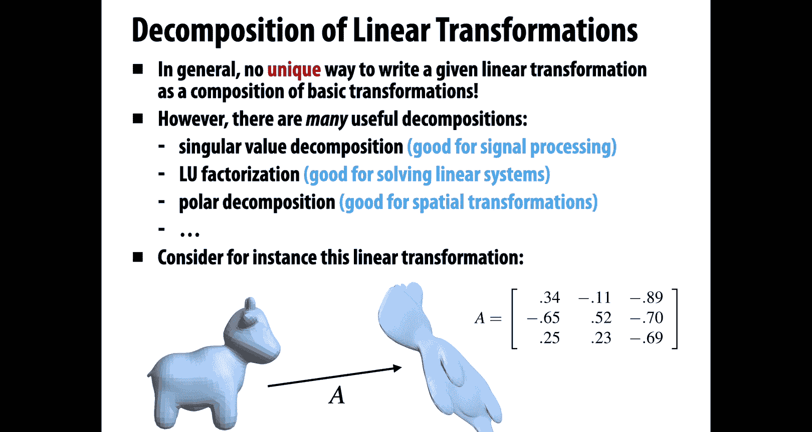

Okay。So one really nice decomposition is the so called polar decomposition。Which writes any matrix A。

As an orthogonal matrix Q and a symmetric positive semidefinite matrix P。

So I can write a is equal to Q times P。That's a lot of verbiage， what does this mean geometrically？

What did I learn about the matrix A by breaking it up into these two pieces？Well。

 what we can remember is that an orthogonal matrix Q always represents a rotation or reflection。

And a positive symmetric。Matrix P。Always represents a non negative。

Possibly non uniform scaling along some orthogonal set of axes。

And I've drawn what these look like if I only apply P or I only apply Q。What happens？

 And so what you'll see is that the transformation we get from just Q looks like the original transformation we have。

 except。With no squashing， just a rotation。And P kind of is the complement。

 P looks like just the squashing， but doesn't rotate us into the final。Orientation。Pretty cool。

Now since P is a symmetric matrix， we can take this one step further using the spectral decomposition we said just a few minutes ago that any symmetric matrix can be written as V dv transpose。

 where V is an orthogonal matrix of eigenvectors and D is a diagonal matrix of eigenvalues。

So now we have a is equal to QV DV transpose。And actually。

 since Q and V are both orthogonal matrices， we can write them as a single orthogonal matrix U。

 so this just becomes U DV transpose。Right， and in fact。

 we can always pick the sign on D on the entries of D so that this is a rotation followed by a。

Positive axis aligned scaling。Followed by another rotation， this time not the inverse of V transpose。

 just some other rotation。Okay。And this result， UDV transpose is called the singular value decomposition。

So just like every symmetric matrix has an eigen decomposition。

 every matrix whatsoever has a singular value decomposition。Okay， and here， I've drawn。

What happens if I apply just D just the scaling to my cow？

Why does this look so different from the initial transformation A？Well。

 it's because if we just apply D， we're ignoring the rotation， right。

 we first have to rotate the cow into position and then scale it by D to get the same effect as A。

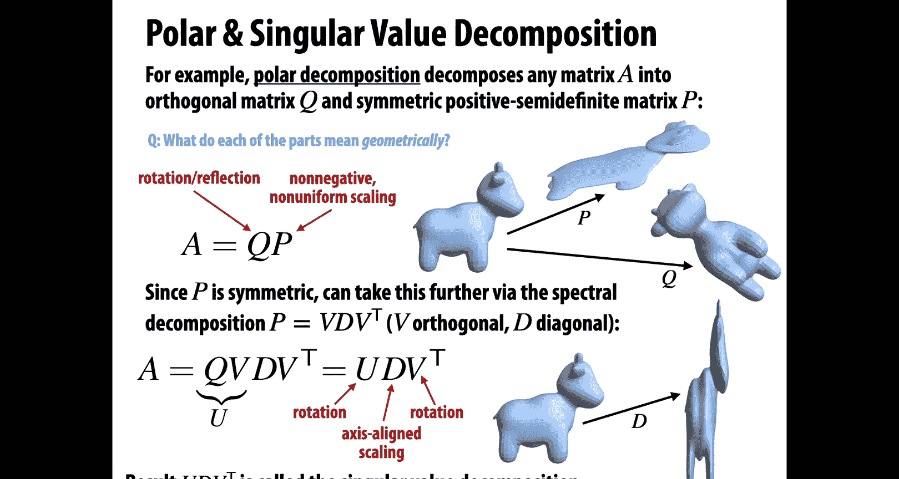

All right， so all of this is really interesting， but how are these decompositions actually useful for doing computer graphics？

Well， one really basic task is I want to interpolate between two different linear transformations of some initial model for doing some kind of animation。

 so let's say I have again my cow and at time zero， I want him to be here。

Rotated and stretched into this position。 And at time1。

 I want them to be rotated and stretched into this other position。

 and for all intermediate times between 0 and 1， I would like to generate some nice transition。

 some nice continuous motion that goes from a 0 to a1。So how can I do that？Well。

 the simplest thing I could do is to say， I'll just take a linear combination of these two matrices according to the current time T。

So I could say a at any time t is 1 minus t times a0 plus t times a1。The closer t is to 0。

 the closer I am to a0， the closer t is to 1， the closer I am to A1。 that sounds pretty good。

Good way of shifting between these two different transformations。 Well。

 let's see what happens if we do this。Wa。Okay， so。The good news is we did hit the start and end points。

 we started with the transformation we wanted and ended with the other transformation we wanted。

But it looks awful in between， this is really not giving us good animation。

So let's do it a different way。Let's consider， for instance， our polar decomposition。

And then separately interpolate these different components。Okay。

 so the first thing I'm going to do is just decompose the starting and ending pose into Q and P factors into orthogonal and positive definite matrices。

And then I'm going to interpolate between these factors independently。 So for scaling。

 I'll say at any time T。My current matrix p is 1 minus T times p0 plus t times p1。

Is that always going to be a positive definite matrix。Sure， you can actually check that。

If I do x transpose px at any time T， that's always a positive number。Okay。What about the rotation。

 Well， again， I could try to linearly interpolate between the rotation matrices Q0 and Q1。

But there's a little bit of a problem， which is that in general。

 a weighted combination of rotation matrices is not a rotation matrix。It won't necessarily be。

That the transpose of this interpolated matrixq tilde of T is equal to its inverse。But。

I can play a sneaky trick and I can just apply a polar decomposition again。To get the。Mattrix Q of T。

The rotation matrix Q of T that's as close as possible to Q Tilde。

So I factor Q tilde again into Q and x， Q is orthogonal， x is positive definite， I just throw away x。

Okay，Now， by the way， this is actually not the best way to interpolate between rotations。

 you might have noticed that the speed of rotation isn't constant。

 and we'll talk a bit more next time about how to do a better job of interpolating between rotations。

But for now it'll do fine， and our final interpolation is then given by saying at any time t。

 we multiply Q of t by P of t， and you saw we got this nicer smoother motion where we just rotated and squashed and scaled like you might expect。

Looks a lot better。Beyond just moving around a single object。

 this question of how to interpolate between different transformations is really。

 really important in lots of areas of graphics。 so for instance， there's the question of skinning。

 I have some articulated character who has arms and legs and they're twisting around and so forth。

 and if I do a naive interpolation of transformations。

 let's say along the arm of such a character I can get some pretty nasty artifacts here。

 something called the candy wrapper artifact where the interpolated transformation in the middle。

Shrinks everything to zero。

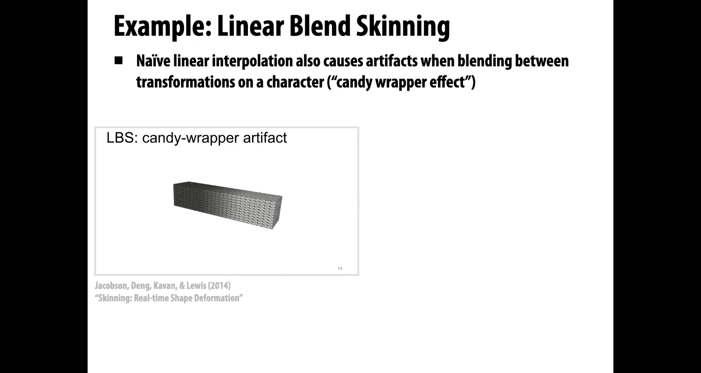

And so people have worked a lot on thinking about different kinds of transformations。

 different kinds of decompositions that when you interpolate between them， you get much more natural。

 realistic looking motion and deformation。So here showing some examples of different failure modes of different methods。

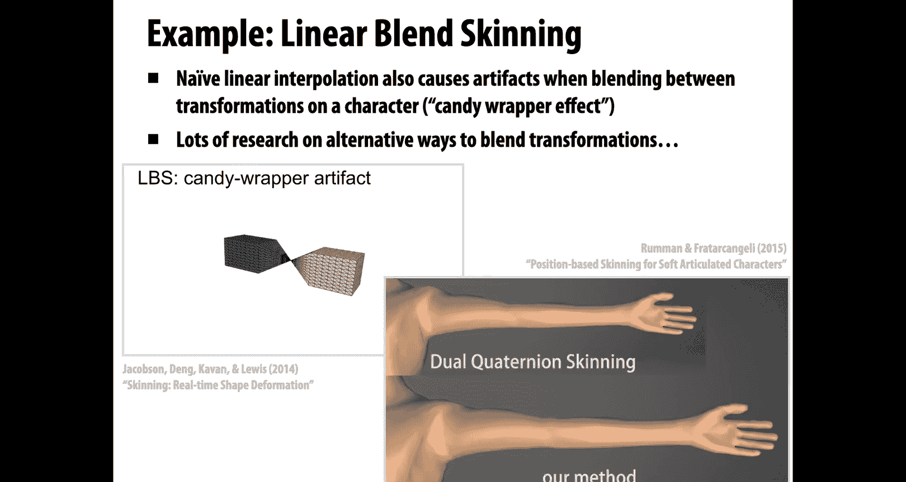

Okay。So you might have noticed， by the way， that so far we've ignored a pretty basic transformation。

 we looked at scaling， we looked at shearing， we looked at rotation。

 but we've ignored what seems to be kind of the simplest transformation。

 which is just to move something to translate it。So what is a translation。

 a translation simply adds and offset U to the given point X？Why have we kind of skipped over this。

 Well， here's an important question is。Translation Linear。I mean。

 it certainly seems to move us along a line。Al， so is。Translation linear。Well。

 let's just carefully check the definition。Remember again。

 that a linear function has to preserve the vector operations that we have， addition and scaling。

Okay， so let's check addivity if I translate by U the sum of x and y。Then I get x+ y+ U。

On the other hand， if I first translate X by U。And then translate y by U and then add the results together。

 Then I'm going to get x plus U plus y plus U， which is x plus y plus2 U。 I get a different result。

Okay， so it seems that。Interestingly enough， translation does not preserve our addition operation。

Similarly with scaling， if I scale x first and then apply a transformation and get AX+ U。

 if I first apply a transformation， and then a scaling， I get AX+ AU a different result。So no。

 translation is not a linear map， it's an affine map。

Another way we can see this is to just notice that the origin is not preserved by translation。

 the translation is going to move the origin to the point U。Okay。So。

This is kind of annoying in a way because so far we've been able to compose linear transformations by just multiplying matrices together。

And it's easy enough to compose just translations if we only had translations。

 well that would also be easy， we could just add together。

The displacement vectors U1 U2 U3 to get a new translation。But what if we want to mix together？

Linear transformations and translations。It gets more complicated。Right， if we have a。

Linear transformation A1， and then a translation B1。

 and then a linear transformation A2 and then a B2。Things start to get a bit more funky。

 we might say， okay， we could keep track of a matrix and a vector。And that might work。

 but we're going to see later on that this encoding of just working with a matrix in in vector isn't going to work out so well for other important cases like prospective transformations。

But it turns out there's a better way。There's a way out of this mess。

And that comes from a fairly strange idea。

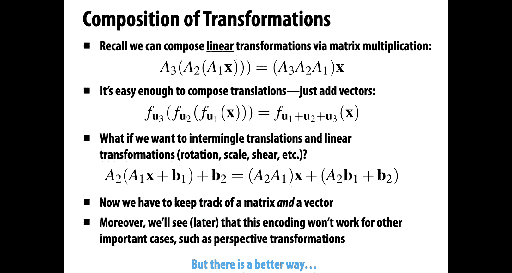

Which is that maybe we can turn translations into linear maps if we go into the fourth dimension。

Okay， at first this sounds totally crazy， but bear with me for a second。

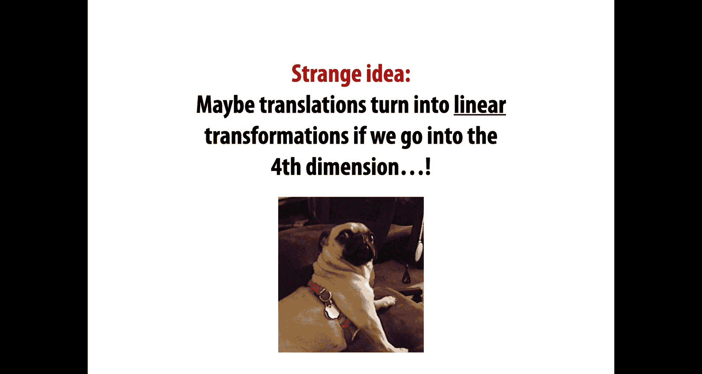

So this idea of going into the fourth dimension leads to what are known as homogeneous coordinates。

 homogeneous coordinates came from the efforts of people to study， really study perspective。

 to study perspective in drawing and painting。And the homogeneous coordinates themselves were introduced by a mathematician namedobbius as a way of assigning coordinates to lines。

Okay。But in computer graphics， homogeneous coordinates show up in a surprising number of places。

 some places。That seem pretty natural if you think， okay， this is somehow related to perspective。

 but other places that really seem to have nothing to do with lines or perspective that you would never have expected them to show up。

 So certainly they show up in 3D transformations and perspective projection。

 they also show up in mesh simplification， which we'll talk about。

 they also show up in pre multiplied alpha blending images together。 they show up in shadow mapping。

 projective texture mapping， discrete conformal geometry， hyperbolic geometry， clipping。

 directional lights and on and on and on。 so。This seemingly weird idea is probably worth understanding if you want to do computer graphics。

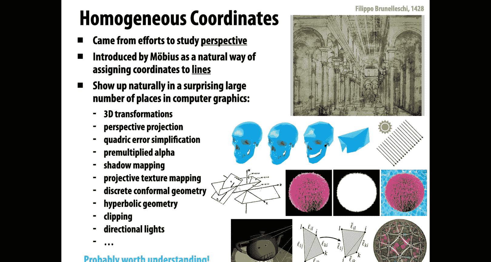

So what is the basic idea of homogeneous coordinates？Well。

 what we're going to do is we're just going to consider first。A little picture。

So imagine we're in three dimensional space。And we have the origin O somewhere in three dimensional space。

And we want to consider a plane that does not pass through the origin， just take any plane。

That's moved away from the origin。And one thing that's that's pretty clear is that。If we draw a line。

Through the origin， just take any line L through the origin。

It's going to pierce that offset plane in a point。Appoint P。Okay。So the basic。

 basic idea of homogeneous coordinates。Is that any point P hat along this line。

Can be used to represent the point P。Right it's a funny idea。

 Why don't we just use the point P to represent the point P， Why do we。

Consider this lion L and any point on it。Okay， but this should remind you。Of a very natural。

Construction that we looked at before。And that's the idea of perspective projection。

So hopefully the story is reminding you a little bit of our pinhole camera。

We said if we have this pinhole camera looking out at the world through this little hole。

Then objects along the same line through space all project to the same point on the film at the back of the camera。

So in other words， if you take a photograph and all you see is one little dot。

 you couldn't possibly know where it is in space， you only know which line in space it belongs to。

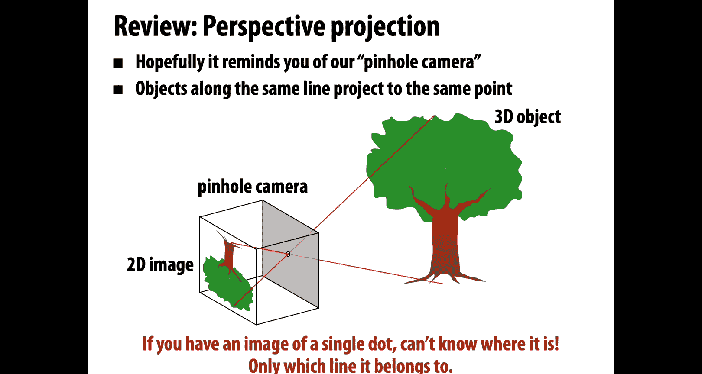

Okay， that's the。Basic idea behind。Hmogeneous coordinates。So more explicitly。

Let's consider a point P with coordinates x and Y。And the plane Z at height 1 in three dimensional space。

And we're going to say that any three numbers P hat equals ABC。

 such that A divided by C and B divided by C are the same as x and y give us homogeneous coordinates for P。

P hat is not the same point as P， but if we divide by the third coordinate， we recover P。

So for example， XY1 is kind of a canonical choice of homogeneous coordinates for the point P。

And in general。Any coordinate Cx CYC， where c is not0。Give us a representative for P。

Another way of looking at this is to say if we have two different points P hat and Q hat in three dimensional space。

Not including the origin， by the way， because we don't want to divide by zero， okay。

 if we have at least two such points。Then they describe the same two dimensional point if P hat is equal to Q hat up to some non zero scaling。

Okay， so that's interesting。We now have a way of putting coordinates on lines。

The coordinate for a line is the coordinate of any point along that line。

But how does this help us with transformations？In particular。

 how does this help us with translations？Well， let's think about what happens to our homogeneous coordinates P hat。

As we translate a figure around in the two dimensional plane。

So let's say we have this triangle and we translate it left and right。

Left and right and left and right。What happens to the corresponding homogeneous coordinates？

 So if we think of all the lines that pass through。The three vertices。

What's happening to those lines as we translate？The figure around。

Hopefully this reminds you of some three dimensional transformation that we've already seen。

If you look at the movie on the right， what kind of transformation does that look like？Well。

 hopefully it reminds you of a shear。We're taking this kind of cone made by the triangle。

 and we're shearing it。Across the X， Y plane， according to the distance in the Z direction。

 The further we go in the Z direction， the more we move it left and right。Okay。

 that's really interesting because。Sar is a linear transformation。Can this be right。I mean。

 we just got done saying that translation is a。Aine function， it's not a linear function。And yet。

 when we draw this picture in 3D。Our translation looks like a shear。Okay， well， let's。

 let's check in coordinates。 I this， is this really。Linear。

 so suppose we translate a point P in the plane by a vector U。Well， that gives us P1 plus u1。

 P2 plus U2。The homogeneous coordinates P hat。From our original point， CP1 CP2C。

Then become CP1 plus C1， CP2 plus E2。For all non zero c。And again， we can notice that we're。

Definitely shifting P hat by an amount C。That's proportional to the distance C along the vertical axis。

 the third axis。Yeah， this is definitely a sheer。 The transformation going from P hat to P hat prime。

That is a shear of our three dimensional coordinates。

So what does that mean if we want to perform a translation in 2D， we perform a shear in 3D。

 and then we。Divide at the end by sea。And if we do this， then using homogeneous coordinates。

 lets us represent this aine transformation in 2D as a linear transformation in 3D。

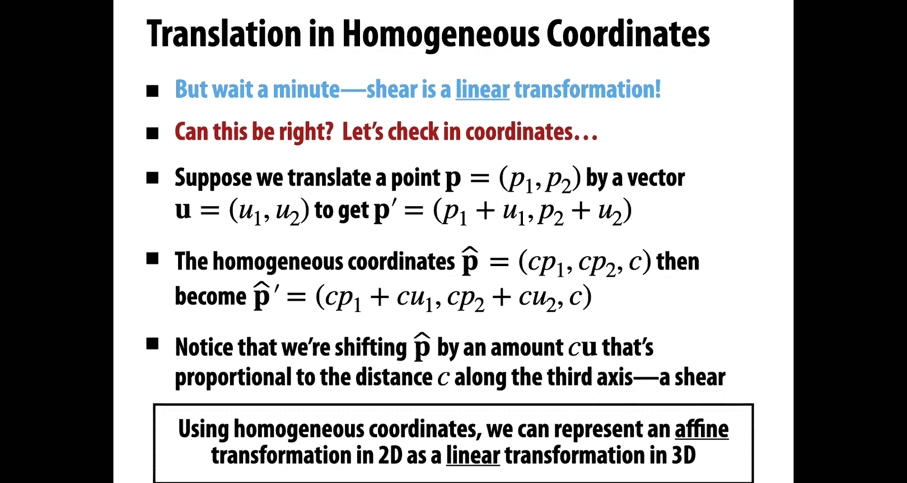

Okay。If we wanted to write this as a matrix， we could remember that a shear in the direction u1 U2。

According to the distance along a direction V is expressed as x plus inner product of v with x times u。

In matrixtri form， we can write this as a matrix I+ UV transpose。And so in particular。

When we're working with homogeneous coordinates。V is always going to be the vertical direction。

 V is 0，0，1。 right， We're always displacing our homogeneous coordinates， according to。

How big that third component is。So we're going to end up with a matrix that looks like this。

It looks like， well， the identity matrix plus some stuff in the upper right。

 which is our displacement vector U1 U2。Does this really give us a translation， Yeah。

 let's check it out。 So if we apply this matrix now to any point representing the 2D point P1 P2。Cp1。

 CP2C。Then we just multiply it out and we get c times p1 plus u1， c times p2 plus u2。

 and C in the third slot。And this is good news because if we now divide out by C。

 we do this projection back to the 2D plane。This homogeneous projection。

 we get p1 plus u1 p2 plus u2。Pretty cool。What about other transformations， So， okay。

 we played this weird trick to be able to write 2D translations as 3D shears。

But is that going to mess with everything else， actually， no？So。

What we can think of is imagine again we have some shape in 2D。

And we can imagine that that shape becomes many different scaled copies in 3D。

 where the scale factor is just how far we are along the x3 direction。

So performing a two dimensional rotation of our original shape。

It's going to be equivalent to rotating that whole collection of shapes around the x3 axis。

So we can express a 2D rotation as just a 3D rotation that fixes the vertical axis。

A 2D scaling is now going to become just a non uniform scaling where we scale x1 and scale x2。

 but preserve x3。By the way， why is that why？Why are we not scaling x3？

What would happen to the 2D shape if we were to scale x1， x2， and x3 all by the same amount？Okay。

 good to think about。And finally， as we just saw， a 2D translation can be represented by a three dimensional shear。

Okay， so this is really nice because it means we can now compose all of these different transformations。

Both the linear ones and translation。By multiplying together three by three matrices。

We get back this nice unified representation。What if we want to go up a dimension， well。

 actually not much changes in three dimensions or even in more dimensions。

We're always just going to append one homogeneous coordinate to the first three。Or to the first n。

Okay。So what that means for our matrix representations is they just get an additional。

Identity row and identity column if they were linear transformations。So， for instance。

If we want to rotate a point in 3D X，Yz around the y axis by an angle theta。

We just go ahead and build the same three by three matrix we would before and we tack on this。

Identity Row and column。If we want to do a three dimensional shear like we want to shear x and y by。

Z in the S T direction， we just again build our three by three shear matrix。

 tack on the identity row and column if we want to perform some scaling， same deal。

 The only one that looks different is our translation， our translation。

 let's say we want to translate X， Y， and Z by U V and W。

Looks like a shear of the four dimensional coordinates。Okay。

Another really good reason to use homogeneous coordinates is that they。

Distinguish in a very nice way between points and vectors。So it was kind of a motivating example。

 let's think about a triangle。That has vertices， A， B， and C， and has a unit normal vector N。Okay。So。

We could try to transform this triangle。By appending one to all these coordinates。

 turn these three dimension coordinates into four dimensional homogeneous coordinates。

And then multiplying by some transformation matrix。So if you've been following so far。

 you look at this matrix and you think， okay， it's got kind of a rotation component in the upper left and then the upper right UVW。

 that looks like a translation。Okay， so we're going to apply this matrix to ABC and N。

 and we'll get a picture that looks like this so the。Triangle indeed got rotated， it got translated。

 but something。Funny happened to the normal， the normal is no longer orthogonal to the triangle。

That seems really weird because if I rotate and translate a triangle。

 its normal should still always be orthogonal to the triangle。So what went wrong here？Okay， well。

 let's think about what happens when we multiply。The normal vector by R 4 by4 matrix。Right， so。

This upper left component is going to rotate the normal around the y axis by the angle theta。

 nothing wrong with that。But then this other component。

 this column on the right is going to translate the normal by UVW。

 it's going to add UVW to the three components。Okay， but that's wrong。

When we rotate and translate a triangle， its normal should just rotate。

Remember that when we talk about vectors， we really mean things that only have direction and magnitude。

 they don't have a base point。Our normal vector doesn't know where it sits in space。

 it only knows what direction it points and how big it is。

So a transformation that includes both rotation and translation really should just be doing rotation to the normal。

How do we get this to happen？Easy， we can just set the homogeneous coordinate to zero。

And so now translation gets ignored and the normal is orthogonal to the triangle as desired。Okay。

 so in general。A point will have a non zero homogeneous coordinate， for instance， C equal to 1。

And a vector will have a zero homogeneous coordinate， for instance， C equal to0。Okay。

That seems fine at some basic level， but something funny is happening here because what does division by C mean when c is equal to zero？

Our whole idea with homogeneous coordinates is that to go from the homogeneous coordinates back to the ordinary coordinates。

 we divide by the last component。Actually， this is still going to make some kind of sense for vectors。

So let's consider what happens as C approaches zero。

 let's take a smaller and smaller and smaller homogeneous coordinate。So if we divide x and y by 1。

 we get the original vectors， if we divide by a half， they get a little bigger。

 if we divide by a quarter， they get even bigger， if we divide by a much， much smaller number。

Then they start shooting off toward infinity。Right kind of the limit。

Is that these vectors become points at infinity or what are sometimes called ideal points。Okay。

So by working with homogeneous coordinates that have both zero and non zero values at the end。

 we've kind of enriched our space by letting us talk about points in the plane。

And directions in the plane or vectors。By the way， as a practical matter。

 if we're working with homogeneous coordinates and we know that we'll encounter both zero and non zero values。

In our code， we just check， aren't we about to do a divide by zero， is the last component zero。

 and if so， okay， do something slightly different with it。Okay。One more。

Fundamental use for homogeneous coordinates is perspective projection。

 How can we perform perspective projection？Using homogeneous coordinates。

 so let's think again about our pinhole camera and just for simplicity。

 we can imagine it's sitting at the origin 0，0，0， the pinhole is sitting at the origin and we're looking down the Z axis and we want to project onto a piece of film sitting a distance one away from the pinhole so this was the exercise we went through on the first day of class and what we discovered is just by law of similar triangles。

That the 2D coordinates on the film we get by just dividing x and y by z。Okay。

How can we use our homogeneous coordinates to achieve the same effect， Well， we can build a matrix。

That just copies the Z coordinate into the homogeneous coordinate， something like this。

 kind of funky looking thing， but if we go ahead and apply this to a column x Y z1， what happens。

 well x becomes x Y becomes y， Z becomes z， and whatever our homogeneous coordinate was now becomes Z。

Okay。And so if we then take our four homogeneous coordinates and do the divide by the fourth coordinate to get the。

Three dimensional coordinates， then we get x over z y over z1。

 we get a point that has the projected location on the plane at distance one， on the film， right？

Pretty cool。Okay。So that's it for homogeneous coordinates now in terms of our whole rasterization pipeline we've transformed our 3D objects。

 we've done a prospective projection onto the 2D plane。

 one last transformation we need to do is turn these coordinates on our viewing plane into actual pixel coordinates for us to draw on the screen。

So for instance， let's say we wanted to draw all the points that fall inside the square。

 the unit square from minus1 to1 on the z equals one plane into a width by height pixel image so we want to go from。

This picture the back of our little cube into the actual screen。Then， hopefully。

By now in the lecture， you should be able to answer this question， what transformations？

Would you apply to go from the coordinate system on the left to the coordinate system on the right？

And there may be multiple ways to do this， but you should be careful by the way。

 that in one coordinate system y points up and in another coordinate system y points down。Basically。

 for very stupid historical reasons in computer graphics。

 images are often indexed in a way where you start at the top left and go down as y increases。

This has something to do with the。Scan lines on a。Cathhoode ray tube monitor。

 which is something that doesn't even exist anymore， okay。

 but usually have to account for this when you're drawing images， by the way。

If you do graphics for a while， this will happen eventually， you will write some code。

Generate some beautiful image， read it out， open it up， and your image will be flipped upside down。

This is common that people don't agree with conventions for which direction is up。All right。

So so far we've been talking about transforming just one three dimensional object。

 but for complex scenes， like we have scenes that are more interesting than just deforming a cube。

 something called a scene graph can really help to organize transformations。

So as kind of a toy motivation， let's say that we want to build a cube creature by taking multiple copies of the unit cube that we described on the first day of class and。

Moving them around space to get this kind of cube creature with these blocky arms and legs。

So this would be really， really annoying if we had to describe each transformation for all the components every single time。

And so what the scene graph is going to let us do is it'll let us build up transformations of some of the lower parts from the upper parts。

 so we might first give a transformation that positions the body in space and then provide a transformation that says。

What does the upper arm look like relative to the body？And then a transformation that says。

 what does the lower arm look like relative to the upper arm and so on？

And the good thing about this is now if we go back and we transform the body。

 we want to just move the body left and right。Well， then the。

Upper arm and lower arm are going to go along with it。

 We don't have to go and figure out what the new transformations for those parts of the body are。

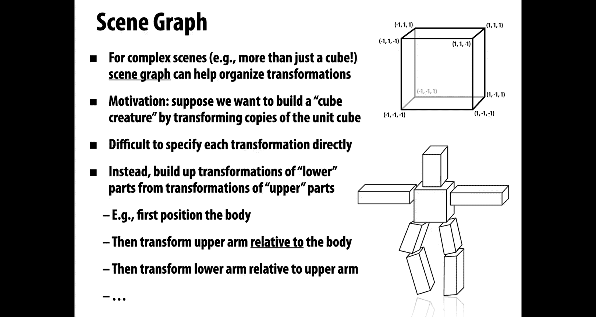

Okay。So a scene graph in general stores relative transformations in a directed graph。

So each edge of this graph and the root node stores some linear transformation as a 4 by4 matrix。

And then a composition of those transformations get applied to the nodes to figure out where everything sits in space。

So just to give a concrete example。If we wanted to know where the left upper leg was。

 we might apply the body transformation A0 first and then apply the transformation A1 that says how is the left upper leg oriented relative to the body？

To get the left lower leg， we'd apply one further transformation A2。And in practice。

Often it's nice to keep these transformations on a stack to reduce redundant multiplication。

 so as you traverse the scenem graph， you might push a new transformation onto the stack。

 apply it to draw some object， and then pop it to go back up in the traversal of the tree。

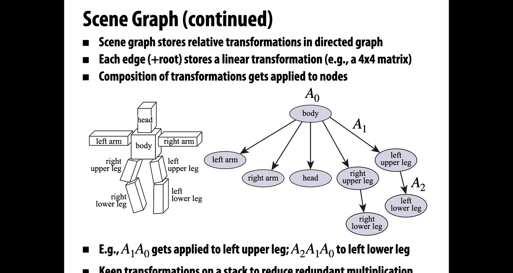

Here's just one nice example。Of a scene graph that's being used to build up some very complicated rig。

So we have exactly this kind of hierarchy and as we move around different parts of the body。

 the rest react， you notice that again， the upper parts of the hierarchy affect the lower parts of the hierarchy。

Here also we're doing something that we haven't talked about yet， which is skinning。

How do we take this mesh and deform it nicely and smoothly along with these transformations。

 so that's something we'll talk about much later in the course when we get to animation and in fact you'll implement a basic skinning system in your final assignment。

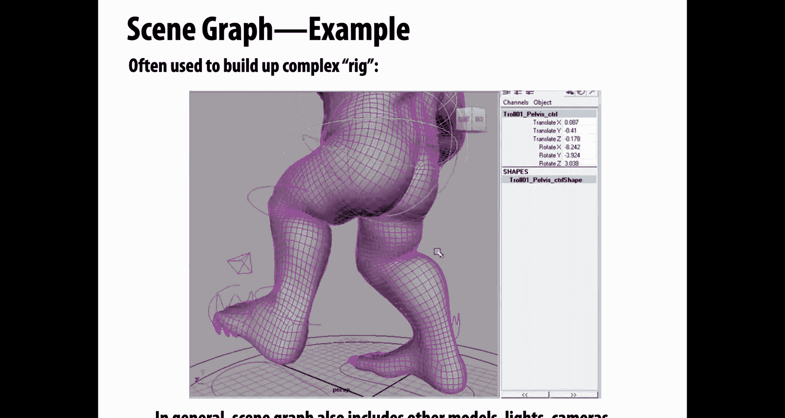

Okay， so in general。The scene graph might include not only the position of the model。

 but also things like models and lights and cameras and so forth。

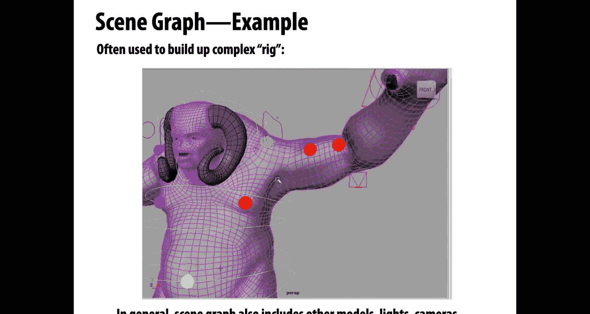

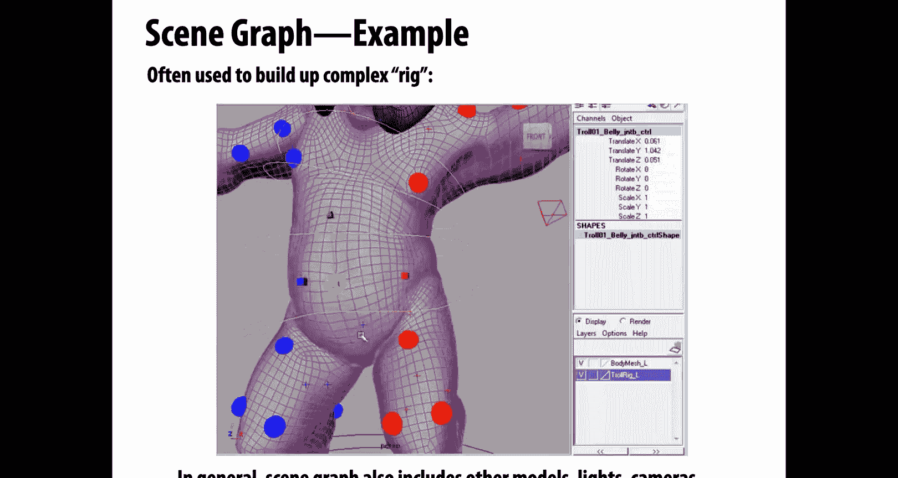

In fact， one really useful thing about this scene graph is when you want to draw a scene with many。

 many copies of the same object， so let's say that you've modeled a few different kinds of grass and leaves and flowers and now you want to draw a whole valley full of this vegetation。

Well， rather than actually having literally multiple copies of the geometry。In memory in your。

 in your computer， what you can do is you can just put a pointer。In the scene graph that says， okay。

 I want to draw a copy of this object， but I'm going to do it with a different transformation than I did before。

So I might have a scene graph， a little mini scenem graph just for the dandelion。

 and then in my global scene graph， one of my nodes might be a pointer to this smaller scene graph。

Like any other node， you can specify a different transformation on each incoming edge。

 which means you can position each copy of this thing at a different place in space。

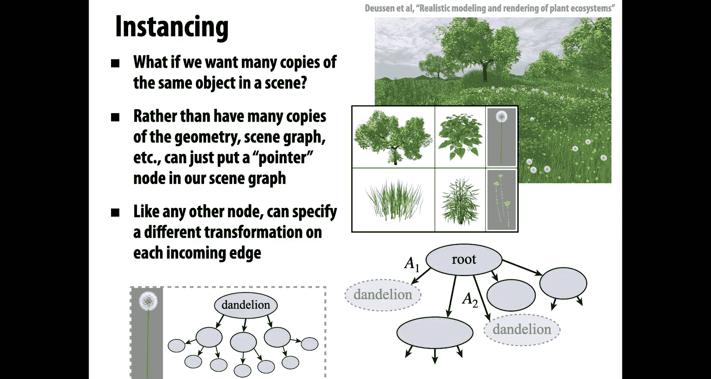

So here's just a fun example of instancing， we have this character that's been replicated many times。

 maybe with different patterns on them in each case。And we use some kind of physical simulation to。

Transform that。Noe of the scene graph as as this wedge moves around。

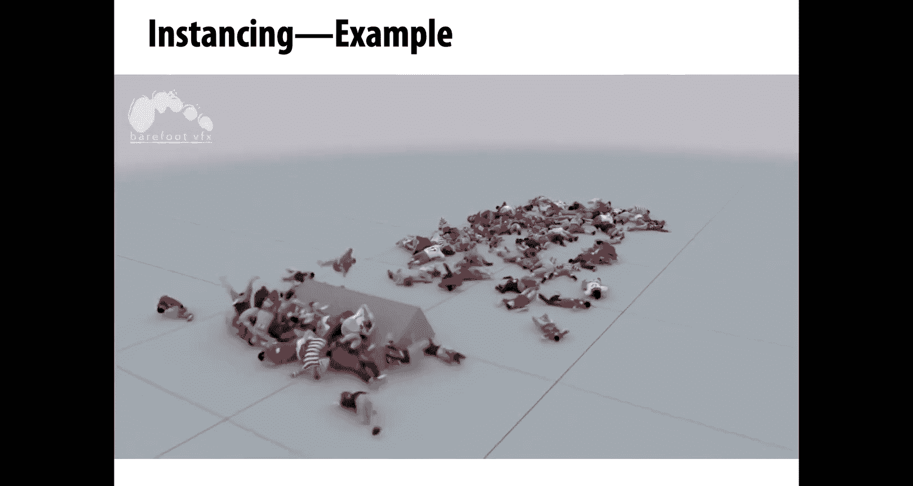

Okay。So when you're describing a scene graph， when you're describing a sequence of operations that positions things in space。

Something very， very important to always remember is that the order of operations matters。

 the order of transformations is going to give you different results。So as one very simple example。

 let's say I have this blue square。If I first scale it by a half and then translate it by 31。

 I end up with a square that's size1 on each side and has its lower left corner at the point。3，1。

If on the other hand， I reverse these operations and I first translate by 31 and then scale by1/ half。

 Well， I get a square that has the same size， it still size one on each side。

But the lower left corner is now at 1。50。5。Why is that， Well。

 essentially by putting the scale second。I kind of scaled my initial translation down。Okay。

 so you really have to be sure of which order you're putting your transformations in and this will。

 at some point in your life， if you keep doing graphics， show up as a bug somewhere in your code。

So it's good to get some practice。One thing you can do at home is look at this slide and ask yourself how would I perform each of these transformations if I start with the square on the upper left。

 what sequence of operations could I do to get each of these different figures on the right and on the bottom？

And something remember actually is that there's always more than one way to do it。

so you might even try to write down multiple ways of getting each of these figures。Okay。

One really common task just to give a useful example， is rotating an object around its center。So。

 let's say that I。Wanted to rotate this blue box around the center point X。What should I do here？

It's very tempting to just say， okay， well， I just apply a rotation matrix， cosine theta。

 minus sine theta， sine theta， cosine theta couldn't be easier。Actually。

 I'm going to do something a little different。 what I'm going to do is I'm going to first translate it by minus x so that it's centered at the origin。

Then I'm going to rotate by some angle theta， and then I'm going to put it back。

 I'm going to translate back by x to its original center。Why did I do that？

What happens if we were to just rotate without translating first？What would the picture look like。

Okay， something interesting to think about and maybe something to answer on the slides。All right。

 so now let's put this all together， so starting just with our little 3D cube that we specify it on day one。

We want to make a 2D perspective correct image of a cube creature。

So the first thing we're going to do is use our scene graph to apply transformations to several copies of this cube。

To turn it into the cube creature。Then we're going to apply additional 3D transformations to position our camera。

 Actually， what we're going to do is we're going to simulate the motion of the camera。

By applying the inverse transformation to the cube creature， if we want the camera to move left。

 we translate the creature right and so forth。So the camera is always staying fixed。

 it's the rest of the world that's moving around。You can imagine that you're always living in one spot in the universe and when you go walking around your neighborhood。

 it's actually the earth that's rotating and translating around。Okay。

Then we're going to apply a perspective projection to flatten the object onto the 2D image plane。

And finally， we need to convert these into our actual pixel coordinates。

So if our perspective projection took everything to a square of size 2。

 we need to stretch out and flip that square into the size of our target image。Okay。

Hopefully that all starts to make sense。Every step of that process involved applying。

Different kinds of basic linear transformations， or at least transformations that in homogeneous coordinates are linear。

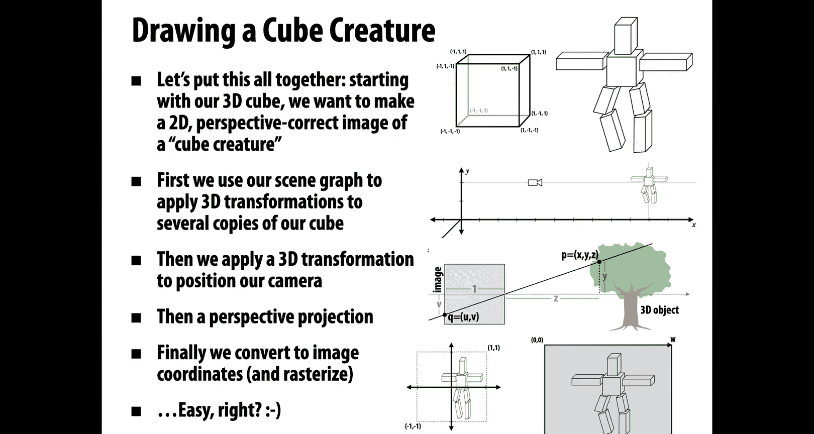

Right。So overall， what did we do today？We saw that transformations are fundamentally defined by their invariance。

 different kinds of transformations are defined by the quantities that they preserve。

We looked at some basic linear transformations， scaling rotation， reflection shear。

 as well as some basic nonlinear transformations， translation and perspective projection。

 but saw that these nonlinear transformations can actually be represented by linear transformations in homogeneous coordinates。

We also saw that homogeneous coordinates are super cool and useful because they let us clearly distinguish between points and vectors。

Finally， we talked about ways to compose basic transformations to get more interesting ones。

 and the nice thing from kind of a system design point of view is that all of our transformations reduce to just four by four matrix multiplications。

Okay， so this gives us a simple unified representation。

 it leads to efficient implementation and so on。Really important to keep in mind that the order of composition matters。

When we're building up complicated transformations。And。Likewise。

 that there are always many different ways to express the same transformation。

 so we saw different examples of decomposition like polar decomposition。

 singular reality decomposition， which help with interpolation。And finally。

 we talked about how a scene graph can be used to organize the complicated transformations in a scene in kind of a hierarchical way。

 also scene graphphs really nice because it lets us eliminate redundancy。

 make many copies of the same model very easily。All right。

 so that's it for today next time we're going to talk about 3D rotations in greater depth。

 see you then。

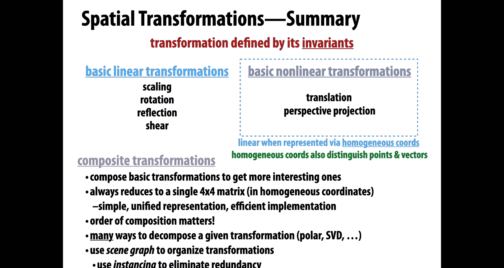

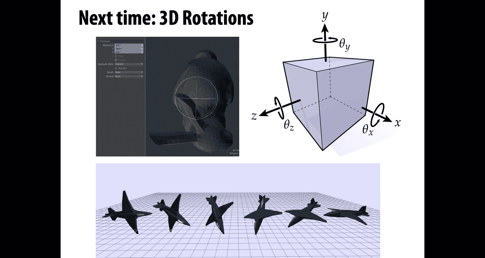